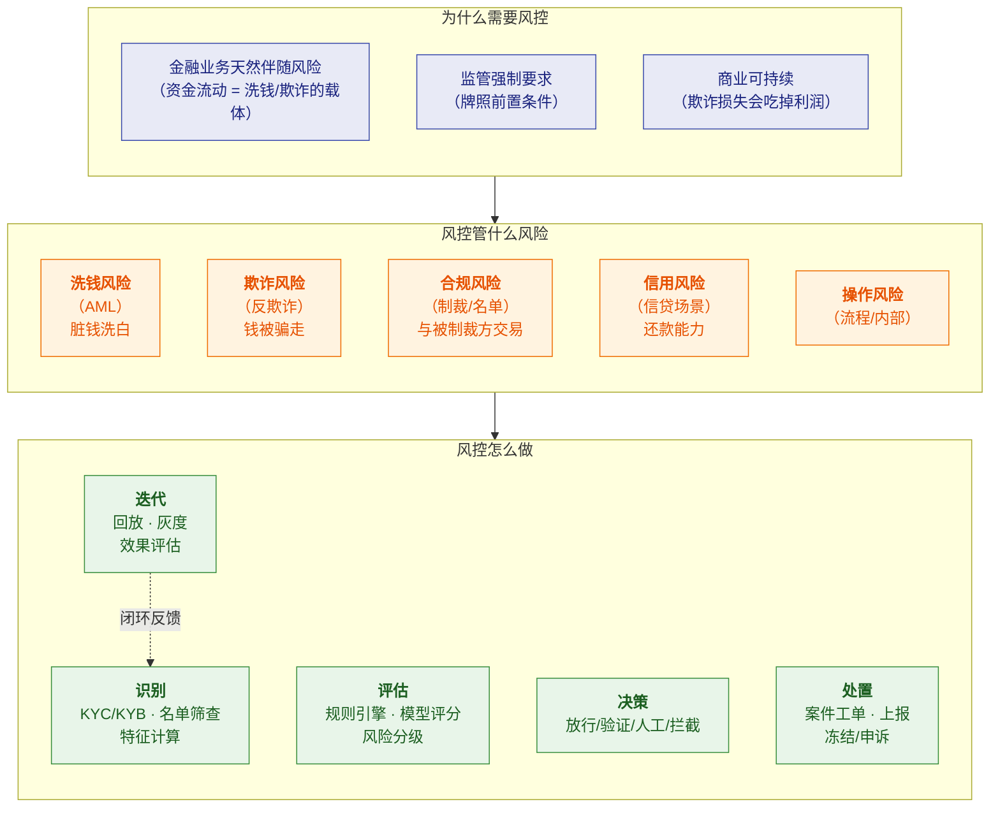

# 🛡️ 风控知识体系 · 总览

> [!abstract] 这个系列是什么
> 这是**风控业务知识库**——回答"**风控到底在做什么、为什么要这么做、策略怎么制定**"。
>
> **和 `面试准备/Qbit/` 的分工**（重要，别混淆）：
> - **本系列** = **领域知识**（业务本质、监管逻辑、方法论）。**学知识用，不限公司**
> - **Qbit 文件夹** = **面试专项**（JD 匹配、话术、追问链、公司情报）
>
> 本系列讲**"为什么"和"怎么做"**；Qbit 文件夹讲**"怎么答"**。

---

## 一、系列导航

| # | 笔记 | 一句话定位 | 核心内容 |
|---|---|---|---|
| 1 | **[[1-风控是什么与为什么]]** | 先搞懂业务本质 | 风险的来源、风控的目标函数、**风险损失 vs 业务转化的平衡**、风控的组织与三道防线 |
| 2 | **[[2-反洗钱AML]]** | ⭐ 洗钱业务全解 | **洗钱三阶段**、为什么跨境是重灾区、AML 体系（KYC/监控/名单/上报）、FATF 与各国监管、**可疑交易识别方法** |
| 3 | **[[3-反欺诈]]** | ⭐ 欺诈业务全解 | 欺诈类型全景、**欺诈 vs 洗钱的本质区别**、攻防对抗、设备指纹与团伙识别、**实时拦截策略** |
| 4 | **[[4-如何制定风控策略]]** | ⭐ 方法论核心 | 策略生命周期、**规则怎么设计（阈值怎么定）**、规则与模型怎么配合、灰度与回放、效果评估与迭代 |
| 5 | **[[5-风控体系与合规框架]]** | 体系与监管 | **三道防线**、KYC/KYB/CDD/EDD、名单筛查、Travel Rule、**监管报送**、合规与业务的关系 |

---

> [!tip] 画图约定
> 本库支持 Mermaid（已装 mermaid-popup / mermaid-zoom）。本系列的图**优先用 Mermaid**，
> 只有"依赖精确对齐"的图才保留 ASCII。规范详见 [[1-java/0-知识点/0-Java总览|Java 总览]] §七「文档写作约定」。

## 二、按需求的阅读路径

> [!tip] 三条路径
> **快速建立认知（半天）**：[[1-风控是什么与为什么]] → [[2-反洗钱AML]]（三阶段 + 体系）→ [[3-反欺诈]]（与 AML 的区别）
> **要做策略（1～2 天）**：[[4-如何制定风控策略]] → [[2-反洗钱AML]]（可疑交易识别）→ [[3-反欺诈]]（实时拦截）
> **要懂合规（1 天）**：[[5-风控体系与合规框架]] → [[2-反洗钱AML]]（监管部分）

---

## 三、30 秒速查表

| 问题 | 一句话答案 | 详见 |
|---|---|---|
| 风控到底在解决什么 | **在"风险损失"和"业务转化"之间找平衡**——拦得住坏人，也放得过好人 | [[1-风控是什么与为什么]] |
| 风控的目标函数是什么 | **不是"零风险"**，而是**总成本最小**（风险损失 + 误杀损失 + 运营成本） | [[1-风控是什么与为什么]] |
| 风控体系的三道防线 | **业务线自控 → 风控/合规部门 → 内审** | [[5-风控体系与合规框架]] |
| 什么是洗钱 | 把**非法所得**伪装成合法收入的过程 | [[2-反洗钱AML]] |
| 洗钱的三个阶段 | **处置（Placement）→ 离析（Layering）→ 融合（Integration）** | [[2-反洗钱AML]] |
| 为什么跨境支付是重灾区 | 跨境 + 多币种 + 多主体 = **切断资金线索的最佳手段**（离析阶段） | [[2-反洗钱AML]] |
| AML 的核心手段 | **KYC/KYB + 交易监控 + 名单筛查 + 可疑上报（SAR/STR）** | [[2-反洗钱AML]] |
| 什么是 FATF | **金融行动特别工作组**，制定全球反洗钱标准（40 条建议） | [[2-反洗钱AML]] |
| 可疑交易怎么识别 | **规则（阈值/频次）+ 模型（异常检测）+ 名单 + 人工研判** | [[2-反洗钱AML]]、[[4-如何制定风控策略]] |
| 什么是欺诈 | **以非法占有为目的**，通过欺骗手段获取他人财物 | [[3-反欺诈]] |
| **欺诈 vs 洗钱的关键区别** | **欺诈是"钱被骗走"（受害者是机构/个人）；洗钱是"脏钱洗白"（受害者是社会/监管）** | [[3-反欺诈]] |
| 常见欺诈类型 | **盗卡盗刷、账户盗用、羊毛党、套现、伪冒申请、团伙欺诈** | [[3-反欺诈]] |
| 反欺诈的核心手段 | **设备指纹 + 行为分析 + 关系网络 + 实时规则/模型** | [[3-反欺诈]] |
| 风控策略怎么制定 | **定义目标 → 找特征 → 定规则/模型 → 灰度 → 评估 → 迭代** | [[4-如何制定风控策略]] |
| 阈值怎么定 | **从数据分布找切分点**（分位数），再**用成本和收益校准** | [[4-如何制定风控策略]] |
| 规则和模型什么关系 | **规则拦已知（可解释）、模型抓未知（覆盖广）**——互补，不是替代 | [[4-如何制定风控策略]] |
| 策略怎么验证 | **历史回放（Backtesting）+ 灰度发布 + A/B 对比** | [[4-如何制定风控策略]] |
| 怎么衡量风控好坏 | **准确率/召回率 + 误杀率 + 拦截率 + 人工审核率 + 决策延迟** | [[1-风控是什么与为什么]]、[[4-如何制定风控策略]] |
| KYC / KYB / KYT | **看人（开户）/ 看企业（开户）/ 看交易（每笔）** | [[5-风控体系与合规框架]] |
| CDD vs EDD | **标准尽调（所有客户）vs 增强尽调（高风险客户）** | [[5-风控体系与合规框架]] |
| 名单筛查的难点 | **模糊匹配**——跨语言姓名，精确必漏、模糊必多 | [[5-风控体系与合规框架]] |
| Travel Rule 是什么 | **FATF R16**：转账时**汇款人/收款人信息要随交易传递** | [[5-风控体系与合规框架]] |
| SAR / STR 是什么 | **可疑活动/交易报告**，很多司法区是**法定义务且有时限** | [[5-风控体系与合规框架]] |
| 合规和业务什么关系 | **合规是准入门槛**（没牌照不能做），**不是业务的敌人** | [[1-风控是什么与为什么]] |

---

## 四、核心概念最小记忆集

| 概念 | 精确定义 | 常见误解 |
|---|---|---|
| **风控** | 识别、评估、处置风险，**在损失与转化间求最优** | 以为目标是"零风险" |
| **反洗钱（AML）** | 防止非法所得通过金融体系洗白 | 以为只是"查大额" |
| **反欺诈** | 防止以欺骗手段非法获取财物 | **与 AML 混为一谈** |
| **洗钱三阶段** | **处置 → 离析 → 融合** | 以为只发生在"存钱"环节 |
| **离析（Layering）** | 通过多层复杂交易**切断资金来源线索** | 以为不常见——**这是风控主战场** |
| **KYC / KYB / KYT** | 了解你的客户 / 企业 / 交易 | 三者混用 |
| **CDD / EDD** | 标准尽调 / 增强尽调 | 以为所有客户一视同仁 |
| **PEP** | 政治公众人物——**不是罪犯，但风险高** | 以为 PEP 就是黑名单 |
| **名单筛查** | 与制裁/PEP/黑名单比对 | 以为精确匹配就够 |
| **SAR / STR** | 可疑活动/交易报告 | 以为只是内部记录 |
| **Travel Rule** | 转账信息随钱走（FATF R16） | 以为只适用于加密货币 |
| **VASP** | 虚拟资产服务商 | —— |
| **欺诈 vs 洗钱** | **骗钱 vs 洗钱**；受害者与监管目标不同 | 混为一谈 |
| **误杀率（FPR）** | 把正常交易判为风险的比率 | **以为越低越好**（要看总成本） |
| **规则 vs 模型** | 拦已知（可解释）/ 抓未知（覆盖广） | 以为模型可以替代规则 |
| **历史回放** | 用历史数据验证新策略 | 以为策略上线直接生效就行 |
| **三道防线** | 业务线 → 风控合规 → 内审 | 以为风控是一个部门的事 |

> [!warning] 六个最经典的认知误区
> 1. **"风控的目标是零风险"** —— ❌ 零风险意味着零业务。**风控的目标是总成本最小。**
> 2. **"反欺诈和反洗钱是一回事"** —— ❌ **完全不同的两个领域**（骗钱 vs 洗钱），
>    手段、监管、指标都不一样。**这是最容易混淆的一点。**
> 3. **"洗钱主要是存现金那一步"** —— ❌ 现代洗钱主战场在**离析（Layering）**，
>    跨境、多层转账、多主体正是为了切断线索。
> 4. **"误杀率越低越好"** —— ❌ 降低误杀通常要放宽阈值，会**放过更多坏人**。
>    **关键是最优平衡点，不是单边极值。**
> 5. **"有模型就不需要规则了"** —— ❌ 规则**可解释、可快速上线**，
>    模型**覆盖未知但可能误判**。**成熟系统是规则+模型+人工三层。**
> 6. **"合规是业务的对立面"** —— ❌ **合规是准入门槛**。
>    没有合规就没有牌照，没有牌照就没有业务。**它决定"能不能做"，不是"做得快不快"。**

---

## 五、风控的全景地图

> [!important] 这张图是系列的骨架
> - **为什么（WHY）** → 讲清动机，才知道风控不是"为了卡业务"（[[1-风控是什么与为什么]]）
> - **管什么（WHAT）** → 五类风险，**重点是洗钱和欺诈**（[[2-反洗钱AML]]、[[3-反欺诈]]）
> - **怎么做（HOW）** → 识别→评估→决策→处置→迭代，**这是策略方法论**（[[4-如何制定风控策略]]）

---

## 六、学习检查清单

- [ ] ⭐ 能说清风控的**目标函数**（为什么不是"零风险"）
- [ ] 能说清风控体系的**三道防线**各自职责
- [ ] ⭐⭐ 能完整讲清**洗钱三阶段**，并解释**为什么风控主战场在"离析"**
- [ ] 能说清**为什么跨境支付是洗钱重灾区**
- [ ] 能列出 AML 的**核心手段**（KYC/监控/名单/上报）
- [ ] ⭐⭐ 能讲清**反欺诈与反洗钱的本质区别**（骗钱 vs 洗钱）
- [ ] 能列举**常见欺诈类型**并说出对应的防范手段
- [ ] 能说清**设备指纹、行为分析、关系网络**各自解决什么问题
- [ ] ⭐⭐ 能完整讲出**制定风控策略的流程**（定义目标→特征→规则/模型→灰度→评估→迭代）
- [ ] ⭐ 能说清**阈值怎么定**（数据分布 + 成本收益校准）
- [ ] 能说清**规则与模型的关系**（互补而非替代）
- [ ] 能说清**历史回放与灰度**的作用
- [ ] 能说清 **KYC/KYB/KYT、CDD/EDD** 的区别
- [ ] 能说清**名单筛查的模糊匹配难点**
- [ ] 能说清 **Travel Rule** 的内容与适用
- [ ] 能说清**为什么合规是准入门槛而非业务对立面**

---
> [!question] 还需要补充什么？
> 可继续扩展的方向：**信贷风控**（评分卡、额度、催收）、
> **交易反欺诈深度**（团伙挖掘、图计算）、**风控模型**（LR/XGBoost/深度学习在风控的应用）、
> **实时风控架构**（Flink + 规则引擎 + 特征平台的工程实现）、
> **具体行业的监管差异**（银行/支付/证券/加密资产）。
> 需要哪块就新开一篇并在上方导航表登记。

#风控 #反洗钱 #AML #反欺诈 #风控策略 #合规 #MOC
