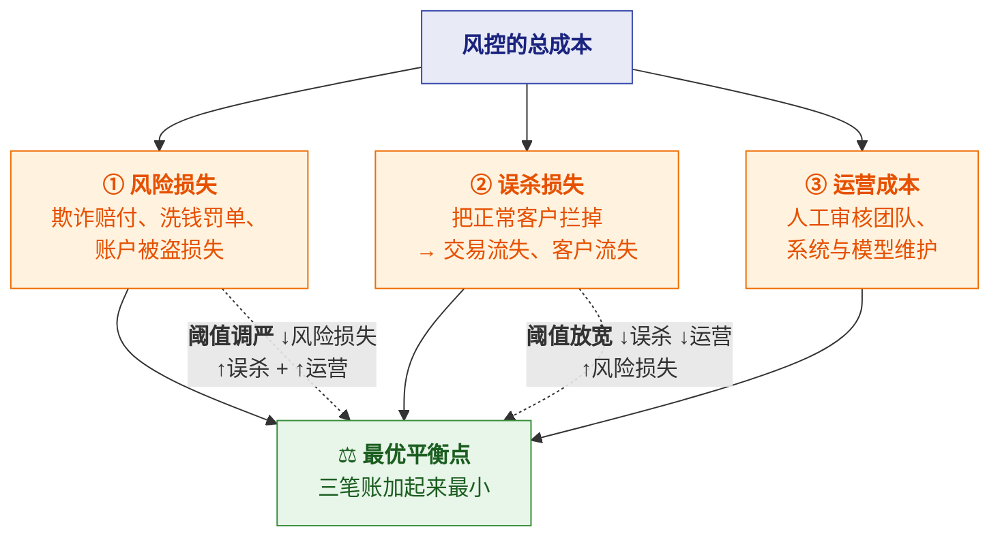
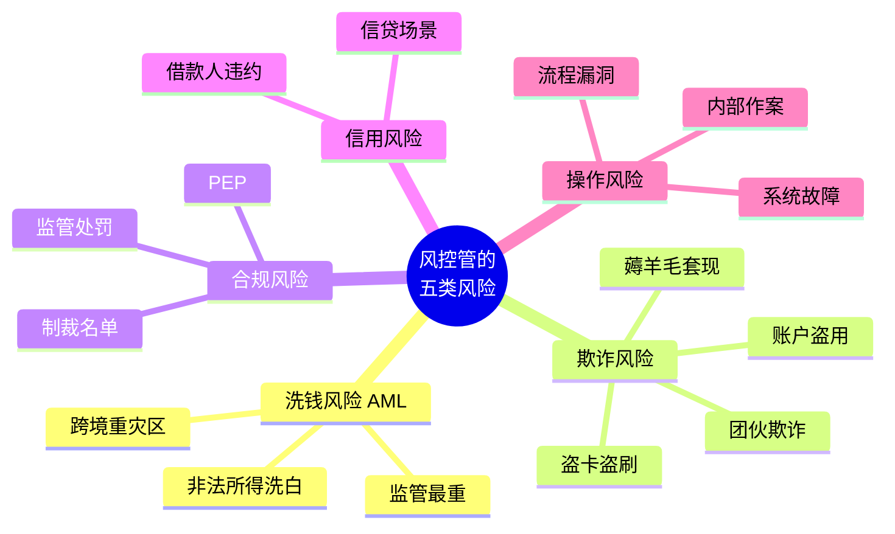
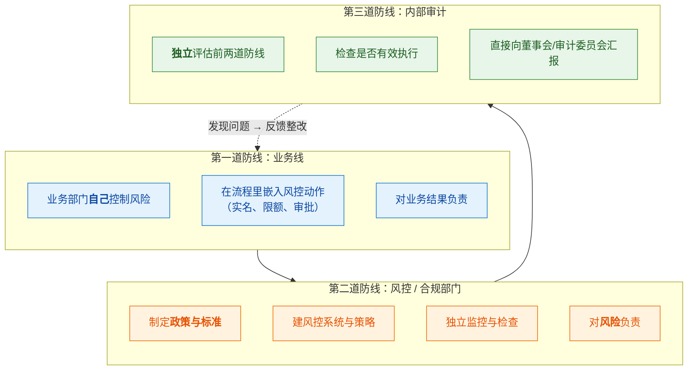
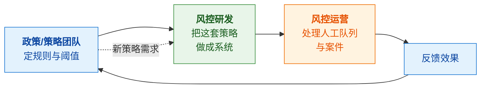
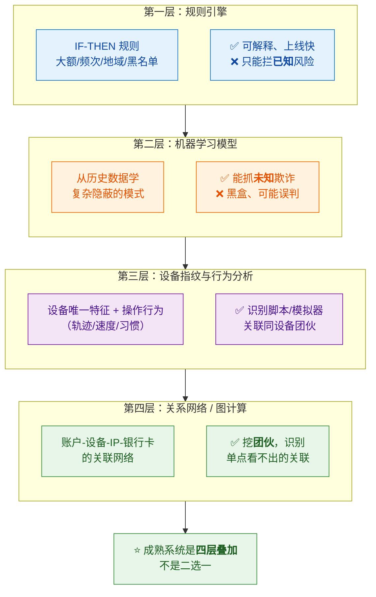
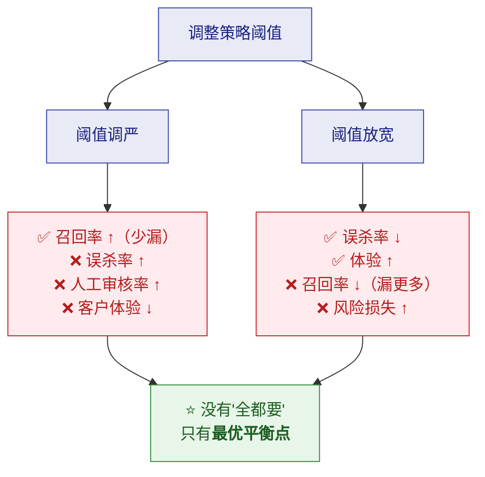
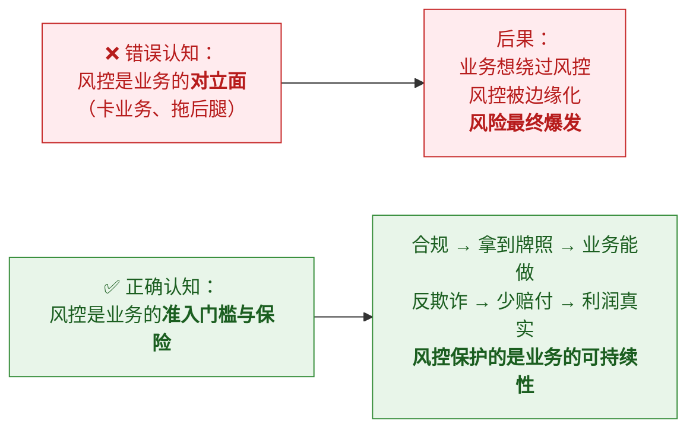

# 🎯 一、风控是什么与为什么

> 本篇回答四个问题：**风控到底在解决什么问题**？**它的目标是什么**（为什么不是"零风险"）？
> **风险从哪来、怎么分类**？以及**风控在一个组织里怎么运转**（三道防线）。
> 这是整个系列的**认知地基**——理解了目标函数，后面所有策略设计才有判断标准。
> 系列导航见 [[0-风控知识体系总览]]。

---

## 一、风控的本质：一个"平衡"问题

### 1.1 先破除一个最大的误解

> [!danger] 风控的目标**不是**"把风险降到零"
> 如果目标是零风险，那**最有效的风控就是不做业务**——
> 没有交易就没有风险。**但这显然不是公司想要的。**
>
> **风控的真正目标是：让"总成本"最小。**

### 1.2 目标函数：三笔账

> [!important] ⭐ 这是理解风控最重要的一句话
> **"风控不是要把坏人全拦住，而是让'风险损失 + 误杀损失 + 运营成本'的总和最小。"**
>
> 所以：
> - **阈值调严** → 风险损失降，但**误杀升、运营成本升**（人工队列爆炸）
> - **阈值放宽** → 误杀降、体验好，但**风险损失升**
> - **最优解在中间某处，不在任何一端**

**一个直观例子**（感受一下什么叫"平衡"）：

| 阈值策略 | 拦截率 | 误杀率 | 人工审核量 | 风险损失 | 综合 |
|---|---|---|---|---|---|
| 极严 | 99% | **30%** | **暴增** | 极低 | ❌ 客户跑光 |
| 偏严 | 90% | 8% | 高 | 低 | 🟠 |
| ⭐ **适中** | **80%** | **2%** | 可控 | 中 | ✅ **最优** |
| 偏松 | 60% | 0.5% | 低 | 高 | 🟠 |
| 极松 | 0% | 0% | 无 | **极高** | ❌ 欺诈泛滥 |

> [!tip] 面试/汇报都可以用这句话
> **"风控的目标不是零风险，是让总成本最小。**
> **所以要能算清：每收紧一档阈值，多拦了多少坏人、多误杀了多少好人、人工队列多了多少。**"

### 1.3 为什么"误杀"也要算钱

> [!note] 误杀的三重代价
> | 代价 | 说明 |
> |---|---|
> | **直接交易损失** | 这笔交易没做成 |
> | **客户流失** | 体验差 → 下次不用了（**损失是长期的**） |
> | **声誉损失** | "这平台老是无故冻结" → 口碑变差 |
>
> ⚠️ **误杀的成本通常被严重低估**——
> 因为风险损失是**看得见的**（有赔付金额），
> 而误杀损失是**看不见的**（流失的客户不会来投诉，他只是走了）。

---

## 二、风险从哪来：分类

### 2.1 五类主要风险

| 风险类型 | 是什么 | 谁受损 | 主要手段 | 详见 |
|---|---|---|---|---|
| **洗钱（AML）** | 非法所得通过金融体系洗白 | **社会/监管** | KYC + 交易监控 + 名单 + 上报 | [[2-反洗钱AML]] |
| **欺诈** | 以欺骗手段非法获取财物 | **机构/个人** | 设备指纹 + 行为 + 实时拦截 | [[3-反欺诈]] |
| **合规** | 与被制裁方交易、违反监管 | 监管处罚 | 名单筛查 + 尽调 | [[5-风控体系与合规框架]] |
| **信用** | 借款人不还钱 | 机构 | 评分卡 + 额度管理 | （信贷风控，本系列暂不展开） |
| **操作** | 流程漏洞、内部作案 | 机构 | 权限分离 + 审计 | —— |

> [!important] ⭐ 本系列聚焦前两类
> **反洗钱（AML）和反欺诈是最主要、最容易混淆的两个领域。**
> 它们的**目标、手段、监管、指标全都不同**——
> 详见 [[3-反欺诈]] 的对比章节，**这是最关键的认知分界**。

### 2.2 为什么金融业务"天生"伴随风险

> [!note] 根本原因：**金融业务是资金流动的载体**
> | 业务特性 | 带来的风险 |
> |---|---|
> | **资金流动** | 脏钱会借道流动 → **洗钱** |
> | **有账户体系** | 账户会被盗用 → **欺诈** |
> | **有信用/额度** | 会被滥用 → **套现、违约** |
> | **跨境/多币种** | 监管复杂度陡增 → **合规风险** |
> | **规模效应** | 单笔损失小，但**量大就是巨亏** | 
>
> **换句话说：金融业务的价值来自"资金能自由流动"，
> 而风险也正是来自"资金能自由流动"。这是一个内在矛盾，只能管理，无法消除。**

---

## 三、风控怎么在组织里运转

### 3.1 三道防线（⭐ 行业标准框架）

| 防线 | 谁 | 职责 | 关键原则 |
|---|---|---|---|
| **第一道** | **业务线** | 在业务流程里**自己做**风控（实名、限额、审批） | **业务是风险的第一责任人** |
| **第二道** | **风控/合规** | **定政策、建系统、独立监控** | **独立于业务**（不能既当运动员又当裁判） |
| **第三道** | **内审** | **独立评估**前两道是否有效 | **直接向董事会汇报**，不受业务影响 |

> [!important] 三道防线的核心设计思想
> **"独立"** 是关键词：
> - 业务线想冲业绩 → **必须有独立的风控来约束**
> - 风控自己也可能失职 → **必须有内审来检查**
>
> **这是"分权制衡"在风控上的体现**——
> 因为**风险一旦爆发，损失远大于短期业绩收益**。

### 3.2 研发在风控组织里的位置

> [!note] 你（研发）通常在哪一环
> 政策/策略团队定规则与阈值 → **风控研发把这套策略做成系统** → 风控运营处理人工队列与案件 → 反馈效果回去。

> 研发的关键价值不只是"实现规则"，而是：
> ① 让策略同学**能自助配置**（不用排队等研发）
> ② 保证决策**低延迟、高可用**（不能拖垮交易）
> ③ 让每次决策**可追溯、可回放**（监管要能审计）
> ④ 把效果**反馈回去**（让策略能迭代）

---

## 四、风控的四层能力（技术视角）

> [!important] 为什么要"分层"而不是"用一个最强的手段"
> | 层 | 强项 | 弱项 | 所以负责 |
> |---|---|---|---|
> | **规则** | 可解释、上线快、确定性强 | 只能拦已知 | **硬性红线**（黑名单、限额） |
> | **模型** | 覆盖未知、能处理复杂模式 | 黑盒、需要数据和调优 | **风险打分**（找可疑） |
> | **设备/行为** | 识别伪装、跨账户关联 | 需持续更新指纹库 | **识别"人不对"** |
> | **关系网络** | 挖团伙、发现隐蔽关联 | 计算重、需要图能力 | **识别"团伙"** |
>
> **四者互补：规则定红线、模型给判断、设备看身份、网络找团伙。**

---

## 五、衡量风控好坏的指标

### 5.1 核心指标体系

| 类别 | 指标 | 定义 | 说明 |
|---|---|---|---|
| **准确性** | **准确率（Precision）** | 拦对的 / 拦截总数 | 拦得准不准 |
| | **召回率（Recall）** | 拦对的 / 应该拦的总数 | 漏没漏 |
| **业务** | **误杀率（FPR）** | 把正常判为风险的比率 | ⭐ **直接影响转化** |
| | **拦截率** | 被拦截的比率 | 反映策略松紧 |
| | **人工审核率** | 进人工队列的比率 | ⭐ **反映运营成本** |
| **技术** | **决策延迟（P99）** | 风控决策耗时 | ⭐ **串在交易链路上，慢=不可用** |
| | **可用性** | 服务是否稳定 | 风控不能成为单点 |
| **效率** | **策略上线时长** | 从设计到生效 | 反映平台化程度 |
| | **案件处置时长** | 从发现到闭环 | 反映运营效率 |

### 5.2 指标之间的"打架"关系（⭐ 很重要）

> [!important] 面试/汇报的高分表述
> **"风控指标是互相冲突的——召回率和误杀率、体验和风险，本质是此消彼长。
> 所以谈风控效果不能说'我们拦截率提升了'，而要说
> '我们在误杀率不变的前提下，召回率提升了 X'。**
> **单看一个指标没有意义，要看组合。"**

### 5.3 怎么定义"应该拦的"（标注的困难）

> [!warning] 一个常被忽略的根本困难
> **召回率的分母是"应该拦的总数"，但这个数往往不知道。**
> - 欺诈：**没被发现的欺诈**你根本不知道存在 → 分母天然偏小 → **召回率虚高**
> - 洗钱：**成功的洗钱**更是无人知晓
>
> **所以风控效果评估先天是"有偏"的。** 常见应对：
> - **抽样人工复核**（主动找出漏网）
> - **事后回溯**（半年后回头看当时的决策对不对）
> - **用"已知欺诈"作为下界**，诚实说明样本偏差
>
> 👉 **能主动指出这个局限，会显得你对风控有真正的理解**，
> 而不是只会背指标定义。

---

## 六、风控与业务的正确关系

> [!important] ⭐ 一个必须想清楚的关系问题

**三层关系**：

| 层次 | 说明 |
|---|---|
| **合规层** | **决定"能不能做"**——没有 AML 体系就拿不到牌照，业务根本开展不了 |
| **经济层** | **决定"赚的是不是真钱"**——欺诈损失会吃掉利润，风控保护的是净利润 |
| **体验层** | **决定"能不能做大"**——误杀率低、体验好，客户才留存 |

> [!success] 可以用这句话收尾（很有分量）
> **"我理解风控和业务不是对立的。**
> **合规决定业务能不能做，反欺诈决定赚的是不是真钱，
> 而误杀率决定业务能不能做大。**
> **风控的本质是在保护业务的可持续性，而不是给它设障碍。**"

---

## 七、30 秒速查表

| 问题 | 一句话答案 |
|---|---|
| 风控的目标 | **总成本最小**（风险损失 + 误杀损失 + 运营成本），**不是零风险** |
| 为什么不是零风险 | 零风险 = 零业务；风控要在损失与转化间求最优 |
| 误杀的成本有哪些 | 直接交易损失 + **客户流失** + 声誉损失（后两者常被低估） |
| 五类风险 | **洗钱、欺诈、合规、信用、操作** |
| 为什么金融天生有风险 | 因为**资金能自由流动**既是价值来源也是风险来源 |
| 三道防线 | **业务线（第一）→ 风控合规（第二）→ 内审（第三）** |
| 三道防线的核心思想 | **独立与制衡**——防止业务冲业绩牺牲风险 |
| 风控四层能力 | **规则（拦已知）+ 模型（抓未知）+ 设备行为（识身份）+ 关系网络（挖团伙）** |
| 为什么不能只用模型 | 规则**可解释、上线快**，负责硬性红线；模型负责风险打分 |
| 核心业务指标 | **误杀率、拦截率、人工审核率** |
| 核心准确指标 | **准确率（拦得准）+ 召回率（漏没漏）** |
| 最重要的技术指标 | **决策延迟 P99**（串在交易链路上，慢=不可用） |
| 指标之间的冲突 | **召回率 ↑ 通常意味着误杀率 ↑**——此消彼长，只有最优平衡点 |
| 风控效果评估的根本困难 | **"应该拦的总数"不知道**（未发现的欺诈/洗钱）→ 评估先天有偏 |
| 风控和业务的关系 | **合规决定能不能做，反欺诈决定赚的是不是真钱，误杀率决定能不能做大** |

---

## 八、学习检查清单

- [ ] ⭐ 能说清风控的**目标函数**，并解释为什么不是"零风险"
- [ ] 能说清**误杀的三重代价**，并解释为什么它常被低估
- [ ] 能列举**五类风险**并说明各自谁受损、用什么手段
- [ ] 能解释**为什么金融业务天生伴随风险**（资金流动的两面性）
- [ ] ⭐ 能说清**三道防线**各是谁、什么职责，以及"独立"为什么是关键词
- [ ] 能说清**研发在风控组织里的位置与四项价值**
- [ ] ⭐ 能说清**风控四层能力**各自强项、弱项、负责什么
- [ ] 能说出风控的**核心指标**（准确率/召回率/误杀率/审核率/延迟）
- [ ] ⭐ 能解释**指标之间的冲突关系**，并说出正确的效果表述方式
- [ ] ⭐ 能说清**风控效果评估的先天困难**（"应该拦的总数"不知道）
- [ ] ⭐ 能用"合规/经济/体验"三层讲清**风控与业务的关系**

---
> 下一篇 → [[2-反洗钱AML]] ｜ 返回 [[0-风控知识体系总览]]
