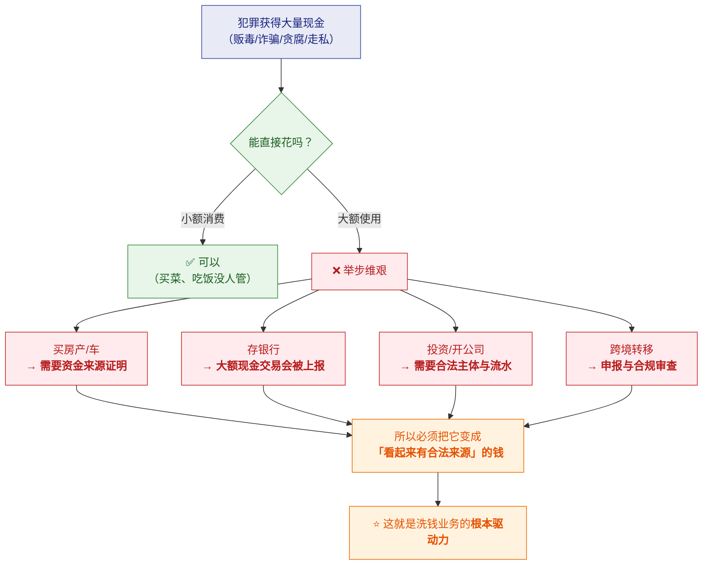
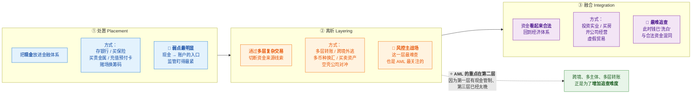
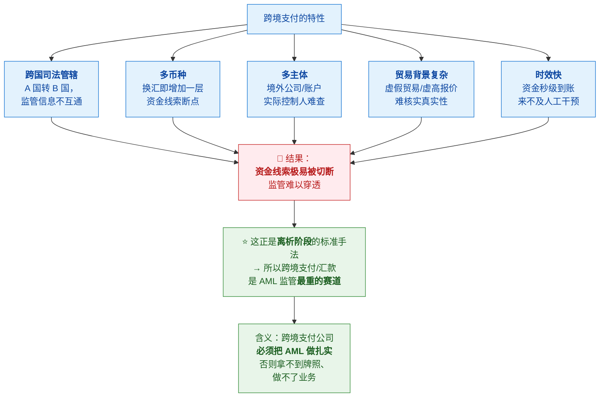
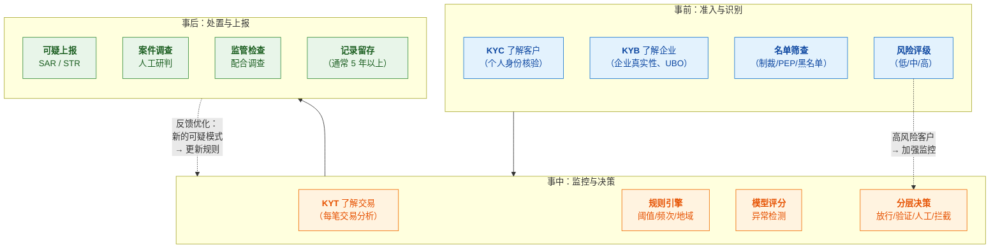
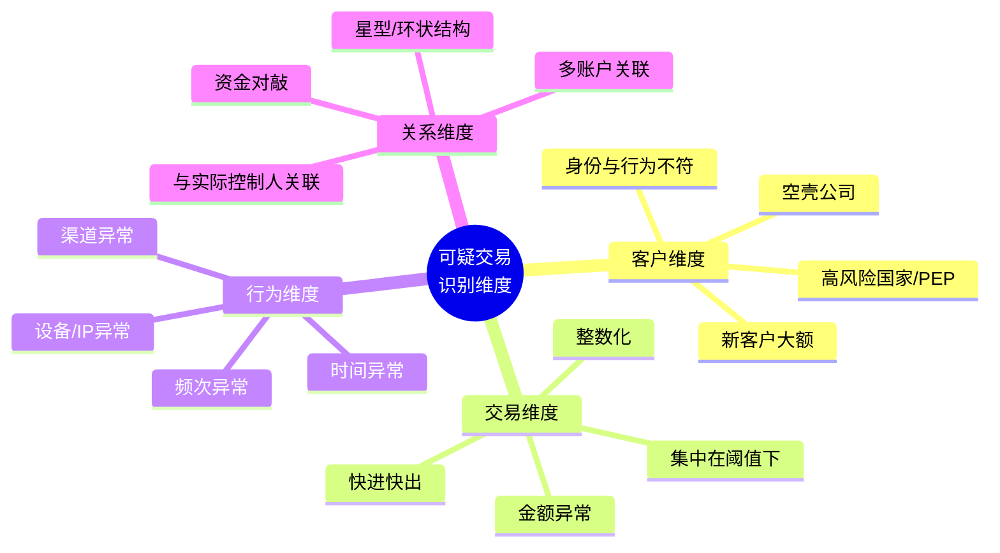
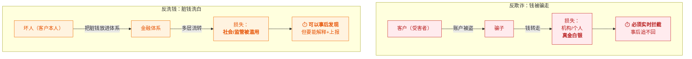

# 💰 二、反洗钱（AML）

> [!abstract] 本篇的目标
> **把"洗钱"这件事讲透**——钱是怎么洗的、为什么这么难防、
> 监管要求什么、机构用什么方法识别。
>
> 本篇回答五个问题：**洗钱到底是什么业务**？**为什么要洗、怎么洗**（三阶段）？
> **为什么跨境是重灾区**？**AML 体系由哪些部分组成**？**可疑交易怎么识别**？
> 前置认知见 [[1-风控是什么与为什么]]；与欺诈的区别见 [[3-反欺诈]]。

---

## 一、洗钱是什么：先把业务讲清楚

### 1.1 一句话定义

> [!note] 定义
> **洗钱（Money Laundering）= 把"非法所得"伪装成"合法收入"的过程。**
>
> **关键词是"伪装来源"**——不是把钱藏起来，而是**让钱看起来是干净的**。
> 藏起来没用（黑钱花不出去），**必须能光明正大地花、能投资、能传承。**

### 1.2 为什么必须"洗"：脏钱的困境

> [!important] ⭐ 理解这个才知道洗钱业务的驱动力

> [!success] 一句话解释驱动力
> **"脏钱的问题不是'存在'，而是'花不出去'。**
> 现代金融体系对大额资金流动有严格的来源审查——
> **所以洗钱的核心任务是：给钱编造一个合法的历史。**"

### 1.3 洗钱的三个阶段（⭐ 核心模型）

> [!important] 这是 AML 最经典、最必须掌握的框架

| 阶段 | 做什么 | 典型手法 | 监管难点 |
|---|---|---|---|
| **① 处置** | 现金进入金融体系 | 拆分存款（smurfing）、买贵金属/保险/预付卡、赌场 | **有现金管制和大额上报**，相对可控 |
| **② 离析** ⭐ | **切断资金线索** | **多层转账、跨境、多币种、空壳公司、贸易对冲** | ⭐ **主战场**——单笔看都"正常"，需要**关联分析** |
| **③ 融合** | 钱变"合法"回流 | 投资实业、买房产、虚假贸易 | 与合法资金混同，**极难追查** |

> [!important] ⭐ 为什么风控重点是"离析"阶段
> **① 处置阶段**：现金进入银行有**大额上报**约束，且现金本身笨重、易被查
> **② 融合阶段**：钱已经洗白了，**追查成本极高**
> **③ 离析阶段**：**这是唯一"可以拦"的窗口**——
>    钱还在体系里流动，每一层都留了记录，**关键是把这些记录关联起来看**
>
> **所以 AML 系统的核心能力是：**
> **跨账户、跨时间、跨地域地关联分析**，
> **而不是只看单笔交易有没有超阈值。**

---

### 1.4 为什么跨境是洗钱重灾区（⭐ 关键洞察）

> [!success] 面试/汇报可以直接用这段
> **"跨境支付为什么是 AML 最重的赛道？因为跨境天然具备'离析'的所有要素——
> 跨国管辖让信息不互通，多币种换汇增加断点，多主体让实际控制人难查，
> 贸易背景难核实，而且资金时效快、来不及人工拦。
> 所以跨境支付公司的 AML 不是'加分项'，是牌照的前置条件。"**

---

## 二、洗钱的典型手法（认识风险长什么样）

| 手法 | 怎么操作 | 特征信号（风控看的点） |
|---|---|---|
| **拆分交易（Structring / Smurfing）** | 把大额拆成多笔略低于上报阈值的金额，多人多网点操作 | **金额集中在阈值下方**、短时间多笔、多账户 |
| **多层转账（Layering）** | A→B→C→D 快速转手，每层都换账户/主体 | **资金快进快出**、留存时间极短、账户新开 |
| **跨境嵌套** | 经多个国家/地区中转，利用监管差异 | 涉及**高风险司法区**、路径迂回 |
| **空壳公司** | 用无实际经营的公司走账 | **无真实业务背景**、注册地集中、股东关联 |
| **贸易洗钱** | 虚报进出口价格（高报进口、低报出口） | **价格明显偏离市场**、贸易对手方异常 |
| **赌场/虚拟资产** | 用筹码或加密资产掩盖来源 | 大额兑换、与赌博/交易平台频繁往来 |
| **地下钱庄（对敲）** | 境内外资金不跨境，各自本地轧差 | **对手方分散**、金额匹配、无真实贸易 |
| **化整为零再归集** | 多账户小额收，最后汇聚到少数账户 | **多进一出/一进多出**的星型结构 |

> [!important] 这些手法的共同点（提炼成风控特征）
> **洗钱的核心是"切断线索"，所以它的行为特征是"反常"：**
> - **金额反常**：集中在阈值下、整数化、与客户身份/经营规模不符
> - **频率反常**：短时间高频、或资金快进快出（留存时间极短）
> - **路径反常**：迂回、跨高风险地区、无合理商业逻辑
> - **主体反常**：新账户大额、空壳公司、实际控制人不清
> - **关系反常**：多账户关联、资金对敲、星型/环状结构
>
> 👉 **AML 的特征工程，本质上就是把这些"反常"量化成可计算的指标。**
> 详见 [[4-如何制定风控策略]]。

---

## 三、AML 体系：由哪些部分组成

### 3.1 全景

### 3.2 事前：KYC / KYB 与风险评级

| 环节 | 做什么 | 关键输出 |
|---|---|---|
| **KYC**（个人） | 身份核验：证件、人脸、地址证明 | 客户真实身份 |
| **KYB**（企业） | 企业真实性、经营资质、**UBO（实际受益人）** | 谁在真正控制这家公司 |
| **名单筛查** | 与制裁/PEP/黑名单比对 | 是否命中、命中后处理 |
| **风险评级** | 综合国家、行业、业务类型、金额等打分 | **低/中/高风险** → 决定监控强度 |

> [!important] ⭐ "风险为本"（Risk-Based Approach）是 AML 的核心原则
> **不是所有客户都同等对待**——风险越高，审查越深：
>
> | 风险等级 | 尽调要求 | 监控强度 |
> |---|---|---|
> | **低风险** | **CDD**（标准尽调） | 常规监控 |
> | **中风险** | CDD + 部分加强 | 加强监控 |
> | **高风险** | ⭐ **EDD**（增强尽调） | 高频监控 + 定期复核 |
>
> **高风险触发因素**：高风险国家/地区、PEP、复杂股权结构、
> 现金密集型行业、**与客户身份不符的大额交易**。
>
> 👉 **这个原则很重要，因为它决定了系统的"分层"设计**——
> 见 [[5-风控体系与合规框架]]。

### 3.3 事中：交易监控（KYT）

> [!note] 这是 AML 的技术核心
> **KYT = Know Your Transaction**——对**每一笔交易**做风险判断。

**监控的两大手段**：

| 手段 | 做什么 | 优点 | 局限 |
|---|---|---|---|
| **规则** | 阈值、频次、地域、名单 | **可解释、可快速上线、监管认可** | 只能拦**已知**模式 |
| **模型** | 异常检测、聚类、图分析 | 能发现**未知**模式、关联关系 | 黑盒、需数据、监管解释难 |

> [!important] 为什么规则在 AML 里**不可替代**
> **因为监管要"可解释"。**
> 当你上报一笔可疑交易、或被监管问"为什么拦这笔"时，
> **"模型说它可疑"是站不住的**，必须能说清"因为它符合 X 规则"。
>
> **所以 AML 系统通常是"规则为主、模型为辅"**——
> 这点和反欺诈（模型权重更高）有明显区别。
> 详见 [[3-反欺诈]] 的对比。

### 3.4 事后：可疑上报（SAR / STR）

| 术语 | 全称 | 说明 |
|---|---|---|
| **SAR** | Suspicious Activity Report | 可疑**活动**报告（美国常用） |
| **STR** | Suspicious Transaction Report | 可疑**交易**报告（国际/其他地区常用） |
| **CTR** | Currency Transaction Report | **大额现金交易报告**（美国等，达阈值强制报） |

> [!danger] 上报是**法定义务**，不是可选项
> - **很多司法区强制要求**：发现可疑必须报，**不报本身违法**
> - **有时限要求**：通常发现后若干工作日内
> - **有"保密"要求**：**不能告诉客户"我举报了你"**（防止打草惊蛇）
>
> **由此推出的系统需求**：
> ① **决策必须留痕**——监管会问"你当时为什么没报"
> ② **案件必须可追溯**——从发现到上报的完整链路
> ③ **记录长期留存**——通常 **5 年以上**（各国不同）

---

## 四、可疑交易识别：方法论

### 4.1 识别的四个维度

### 4.2 典型规则示例（AML 常用）

| 规则类型 | 示例 | 说明 |
|---|---|---|
| **阈值规则** | 单笔 > X 万触发审核 | 最基础，但**容易被拆分绕过** |
| **累计规则** | **24 小时内累计 > X 万** | 应对拆分（Structuring） |
| **频次规则** | 同一账户 1 小时内 > N 笔 | 应对高频试探 |
| **快进快出** | **入账后 X 分钟内转出 ≥ Y%** | 典型的中转账户特征 |
| **分散归集** | 多账户向同一账户汇款 | 星型结构 |
| **地域规则** | 涉及高风险国家/地区 | 需维护风险地区清单 |
| **对手方规则** | 对手方在制裁/黑名单 | 名单筛查 |
| **身份不符** | 交易规模远超客户经营规模/职业收入 | 需客户画像 |
| **留存异常** | 账户长期无余额，仅作通道 | 通道账户特征 |

> [!warning] ⚠️ 阈值规则的致命弱点：**拆分绕过**
> 如果规则是"单笔 > 5 万触发审核"，
> **洗钱者会拆成 4.9 万**——这正是 **Structuring（拆分交易）**。
>
> **所以必须有"累计规则"**（24 小时/7 天累计），
> **并且要把'金额集中在阈值下方'本身当作一个特征**。
>
> 👉 **这就是"规则对抗"的开始**——见下文和 [[4-如何制定风控策略]]。

### 4.3 ⭐ 攻防对抗：AML 是持续博弈

> [!important] 这个"对抗"视角非常重要
> **它解释了为什么 AML 需要持续投入，而不是"建好就完了"：**
> - 规则一旦固定，**模式就会被规避**
> - 所以需要：**监控规则效果 → 发现新型手法 → 更新规则 → 再监控**
> - **这也解释了为什么"策略平台"（可快速配置发布）这么关键**
>
> **面试/汇报可以说**：
> **"AML 本质是一场持续对抗。规则会被规避，所以系统的价值不只是'有规则'，
> 而是'能快速发现失效、快速更新规则'——这就是策略平台为什么重要。"**

---

## 五、监管框架：谁在管、管什么

### 5.1 FATF：全球标准制定者

| 项 | 说明 |
|---|---|
| **FATF** | Financial Action Task Force，**金融行动特别工作组**（政府间组织） |
| **产出** | **40 条建议（40 Recommendations）**——全球 AML/CFT 的基准 |
| **性质** | **不直接执法**，但通过"互评估"和"灰名单/黑名单"施加压力 |
| **影响** | 各国据此立法 → 各国监管机构执法 → **机构必须合规** |
| **关键建议** | R10（客户尽调）、**R16（Travel Rule）**、R20（可疑上报） |

> [!note] FATF 的"名单"机制
> - **灰名单（Grey List）**：加强监测的司法辖区
> - **黑名单（Black List）**：呼吁采取反制措施
> - **影响**：被列名单的国家，其金融机构跨境业务会**遭遇更严格审查**（de-risking）
>
> 👉 **这也是为什么"高风险国家清单"是 AML 系统的重要输入。**

### 5.2 主要司法区的监管机构

| 地区 | 机构 | 牌照/要求 |
|---|---|---|
| **美国** | **FinCEN**（财政部金融犯罪执法网络） | **MSB**（Money Services Business）注册；BSA 合规 |
| **香港** | **海关（MSO）**、**SFC/金管局** | **MSO**（金钱服务经营者）、**TCSP** |
| **新加坡** | **MAS** | **MPI**（Major Payment Institution） |
| **欧盟** | 各成员国 + **AMLD 指令** | 反洗钱指令体系 |
| **加拿大** | **FINTRAC** | **MSB** 注册 |
| **中国** | **人民银行**（反洗钱局） | 《反洗钱法》《反电信网络诈骗法》 |

> [!important] 为什么"牌照"和"AML"是绑死的
> **拿支付牌照的前置条件之一，就是证明你有 AML/CFT 体系：**
> - 有合规官、有制度、有系统
> - 能做客户尽调、交易监控、可疑上报
> - 能配合监管检查
>
> **所以 AML 不是"业务做大之后才考虑的事"，而是"能不能开始做业务"的前提。**
> 详见 [[1-风控是什么与为什么]] 的"风控与业务的关系"。

### 5.3 合规的"长臂"效应

> [!warning] 一个现实问题：多司法区同时适用
> 一个跨境支付公司可能**同时受多个司法区监管**：
> - 在**美国**有 MSB → 受 FinCEN 管
> - 在**香港**有 MSO → 受香港海关管
> - **美元清算**要过美国银行 → **实际上受美国管辖**（长臂管辖）
>
> **冲突场景**：GDPR（数据保护，要求最小化）vs Travel Rule（要求传递个人信息）
>
> 👉 **这是跨境合规的真实复杂性**——也是为什么需要**合规 + 技术深度协作**。

---

## 六、AML 与反欺诈的区别（⭐ 最容易混淆）

> [!danger] ⭐⭐ 这是最重要的认知分界
> **很多人把反洗钱和反欺诈混为一谈，但它们是完全不同的两个领域。**

| 维度 | **反洗钱（AML）** | **反欺诈（Fraud）** |
|---|---|---|
| **核心问题** | 钱是**脏的**（来源非法） | 钱是**被骗走的**（获取手段非法） |
| **受害者** | **社会/国家/监管**（金融体系被滥用） | **机构或个人**（真实财产损失） |
| **客户角色** | 客户**可能就是坏人**（本人洗钱） | 客户**往往是受害者**（账户被盗） |
| **对手方** | **监管**（要向上汇报） | **欺诈者**（要对抗） |
| **时间尺度** | **长**（数月甚至数年的模式） | **短**（秒级/分钟级要拦截） |
| **核心手段** | **规则为主**（监管要求可解释）+ 关联分析 | **模型权重大**（要抓未知模式） |
| **关键指标** | 上报质量、监管评价、**漏报率** | **拦截率、误杀率、资损金额** |
| **决策后果** | 报错了**代价是监管关系** | 拦错了**客户体验受损** |
| **能否事后补** | ✅ **可以**（事后发现再上报） | ❌ **不行**（钱转走就追不回） |
| **典型场景** | 拆分交易、多层转账、空壳公司 | 盗卡盗刷、账户盗用、羊毛党 |

> [!success] ⭐ 一句话记住区别（背下来）
> **"反欺诈是防'钱被骗走'——要快、要准，晚一秒钱就没了；**
> **反洗钱是防'脏钱洗白'——要全、要可解释，因为要跟监管交代。**
>
> **一个的对手是骗子，一个的对手是监管。"**

---

## 七、30 秒速查表

| 问题 | 一句话答案 |
|---|---|
| 洗钱是什么 | 把**非法所得伪装成合法收入**——关键是"伪装来源"，不是藏起来 |
| 为什么必须洗 | **脏钱花不出去**：大额消费要来源证明、存银行会被上报、投资要合法主体 |
| 洗钱三阶段 | **处置（Placement）→ 离析（Layering）→ 融合（Integration）** |
| 处置阶段 | 现金进金融体系（存款、买贵金属/保险、赌场）；**有现金管制，相对可控** |
| ⭐ 离析阶段 | **多层复杂交易切断线索**（跨境、多币种、空壳公司）；**风控主战场** |
| 融合阶段 | 钱"洗白"回流（投资实业、买房、虚假贸易）；**极难追查** |
| 为什么重点是离析 | **处置有现金管制、融合已太晚——离析是唯一"可以拦"的窗口** |
| AML 的核心能力 | **跨账户、跨时间、跨地域的关联分析**，不是只看单笔阈值 |
| 为什么跨境是重灾区 | 跨国管辖 + 多币种 + 多主体 + 贸易背景难核 + 时效快 = **离析的标准手法** |
| 拆分交易是什么 | **Structuring**：拆成略低于阈值的金额 → 所以需要**累计规则** |
| AML 体系三部分 | **事前**（KYC/名单/评级）+ **事中**（KYT/监控/决策）+ **事后**（上报/案件/留存） |
| 风险为本原则 | **风险越高，尽调越深**（低→CDD，高→EDD） |
| 为什么规则在 AML 不可替代 | **监管要可解释**——"模型说可疑"站不住，要说清"符合哪条规则" |
| SAR / STR | 可疑活动/交易报告，**法定义务 + 有时限 + 需保密** |
| CTR 是什么 | **大额现金交易报告**（达阈值强制报） |
| FATF 是什么 | **金融行动特别工作组**，出 **40 条建议**，全球 AML 基准 |
| R16 是什么 | **Travel Rule**（转账信息随钱走） |
| 为什么牌照和 AML 绑死 | **拿牌照的前置条件就是有 AML/CFT 体系**——它决定"能不能做业务" |
| ⭐ 与反欺诈的区别 | **AML 防"脏钱洗白"（对手是监管，可事后补）；反欺诈防"钱被骗走"（对手是骗子，必须实时）** |
| AML 为什么是持续对抗 | **规则会被规避**（拆分、转虚拟资产）→ 必须持续迭代 |

---

## 八、学习检查清单

- [ ] ⭐ 能说清**洗钱的定义**，并解释"为什么要洗"（脏钱的困境）
- [ ] ⭐⭐ 能完整讲清**洗钱三阶段**，并说明**为什么风控主战场在"离析"**
- [ ] ⭐ 能解释**为什么跨境支付是洗钱重灾区**（五个特性）
- [ ] 能列举**至少六种洗钱手法**，并说出各自的"特征信号"
- [ ] ⭐ 能把这些手法**提炼成风控可计算的特征**（金额/频率/路径/主体/关系反常）
- [ ] 能画出 **AML 体系全景**（事前/事中/事后）
- [ ] 能说清 **KYC/KYB** 与**风险评级**的关系
- [ ] ⭐ 能说清"**风险为本**"原则，以及它怎么决定系统的分层设计
- [ ] 能说清 **KYT** 的两种手段（规则/模型），以及**为什么 AML 里规则不可替代**
- [ ] 能说清 **SAR/STR/CTR** 的区别，以及"法定义务"对系统设计的要求
- [ ] 能说清 **FATF 的 40 条建议**与各国监管机构的关系
- [ ] ⭐ 能解释**为什么牌照和 AML 是绑死的**
- [ ] ⭐⭐ 能用一句话说清 **AML 与反欺诈的本质区别**（并列举至少五个维度的差异）
- [ ] ⭐ 能用"**攻防对抗**"视角解释为什么 AML 需要持续投入

---
> 上一篇 → [[1-风控是什么与为什么]] ｜ 下一篇 → [[3-反欺诈]] ｜ 返回 [[0-风控知识体系总览]]
> 相关 → [[5-风控体系与合规框架]]（名单筛查/Travel Rule 细节）· [[4-如何制定风控策略]]（策略方法论）
