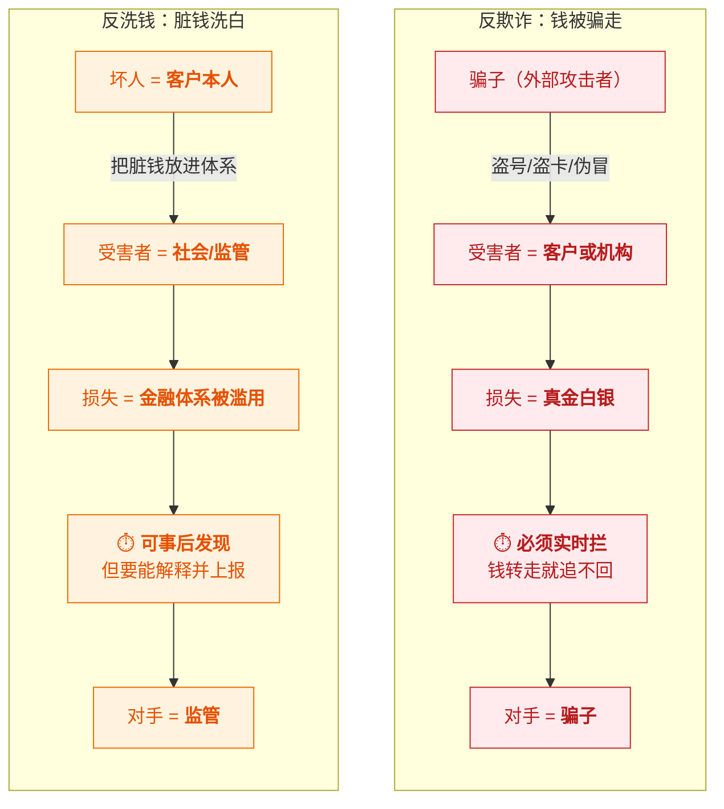
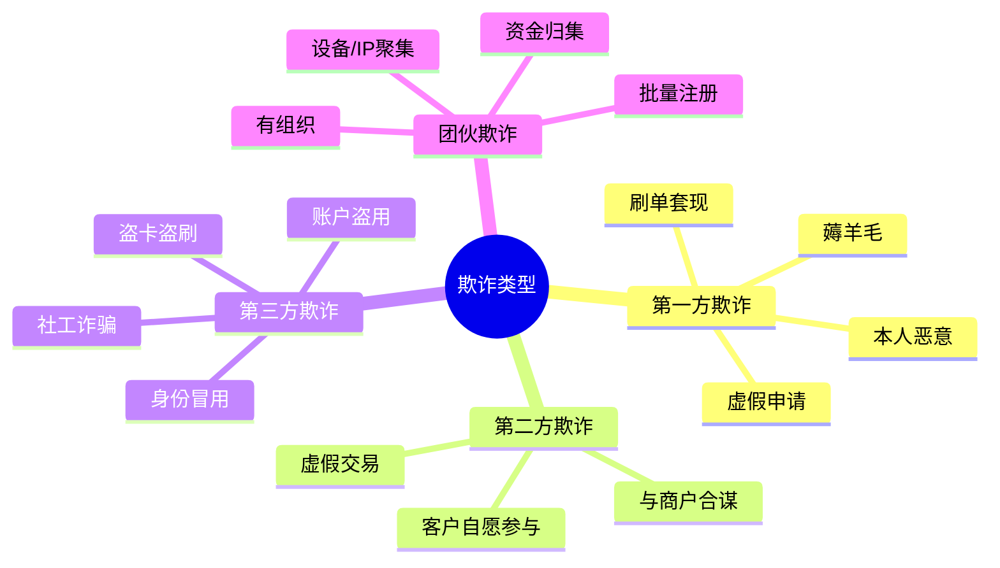
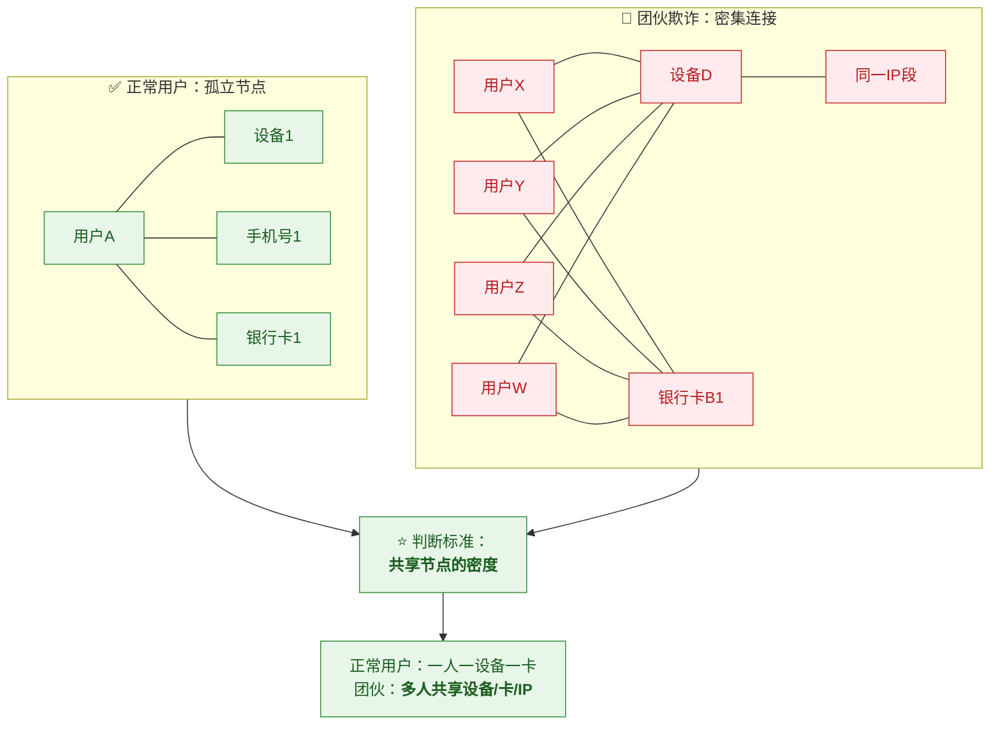
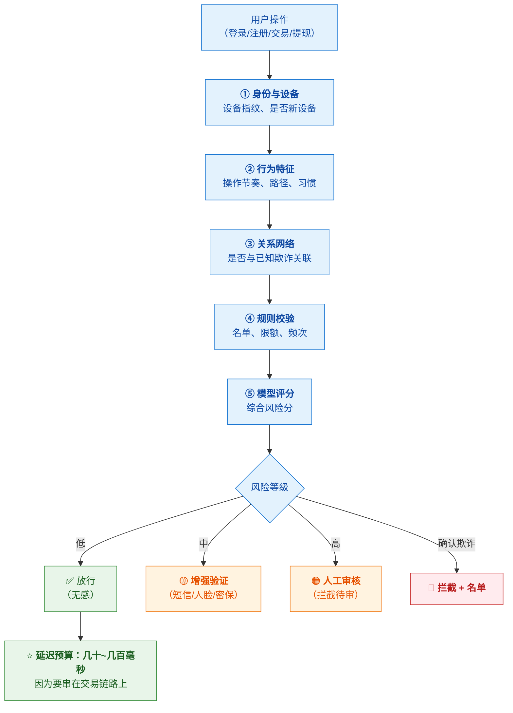
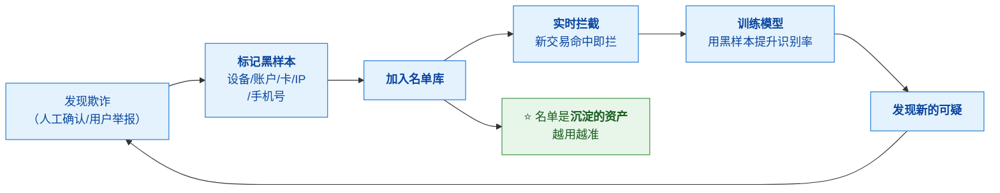

# 🚨 三、反欺诈

> [!abstract] 本篇的目标
> **把"欺诈"这件事讲透**——欺诈者怎么下手、机构怎么防、和反洗钱有什么本质不同。
>
> 本篇回答五个问题：**欺诈到底是什么业务**？**有哪些类型**？
> **欺诈者用什么手段**？**机构用什么方法识别**？以及**为什么反欺诈必须"实时"**？
> 前置见 [[1-风控是什么与为什么]]；与 AML 的对比见 [[2-反洗钱AML]]。

---

## 一、欺诈是什么：先把业务讲清楚

### 1.1 一句话定义

> [!note] 定义
> **欺诈（Fraud）= 以非法占有为目的，通过欺骗手段获取他人财物。**
>
> **关键词是"欺骗"和"占有"**——
> **有人被骗了，有人真金白银损失了。**

### 1.2 与洗钱的本质区别（⭐ 最重要的一节）

> [!danger] ⭐⭐ 这是最必须分清的一点

| 维度 | **反欺诈** | **反洗钱** |
|---|---|---|
| **核心问题** | 钱是**被骗走的** | 钱是**脏的** |
| **加害者是谁** | **外部攻击者**（骗子） | **客户本人**（或犯罪集团） |
| **受害者是谁** | **客户或机构**（真金白银损失） | **社会/监管**（体系被滥用） |
| **客户的角色** | **往往是受害者**（账号被盗） | **可能就是坏人** |
| **你要"对抗"谁** | **骗子**（技术攻防） | **监管**（要能汇报解释） |
| **时间要求** | ⭐ **必须实时**（秒级，晚了钱就没了） | **可以事后**（发现后再上报） |
| **主要手段** | **模型权重大**（抓未知模式） | **规则为主**（监管要可解释） |
| **核心指标** | **拦截率、误杀率、资损金额** | 上报质量、漏报率、监管评价 |
| **拦错的代价** | **客户体验受损**（很直接） | 监管关系受影响 |
| **典型手法** | 盗卡盗刷、账户盗用、羊毛党 | 拆分交易、多层转账、空壳公司 |

> [!success] ⭐ 一句话记住（背下来）
> **"反欺诈防的是'钱被骗走'——对手是骗子，必须快、必须准，晚一秒钱就没了。**
> **反洗钱防的是'脏钱洗白'——对手是监管，要全、要可解释，因为要交代得清。"**

> [!warning] 为什么这个区别在实践中最重要
> **因为它决定了系统的设计取向：**
> | | 反欺诈 | 反洗钱 |
> |---|---|---|
> | 决策方式 | 倾向**自动化拦截**（人工来不及） | 倾向**机器+人工结合**（要研判） |
> | 时间预算 | **几十到几百毫秒**（硬约束） | 可以是**准实时/异步** |
> | 误杀的容忍度 | **低**（直接损失客户） | **相对高**（宁可多报） |
> | 模型 vs 规则 | **模型为主** | **规则为主** |
>
> **同一个"风控系统"里，这两个模块的设计可能完全不同**——
> 混在一起谈会导致设计错误。

---

## 二、欺诈类型全景

### 2.1 按"谁受损"分类

| 类别 | 谁在骗 | 典型场景 | 防范重点 |
|---|---|---|---|
| **第一方欺诈** | **客户本人** | 薅羊毛、套现、虚假资料骗额度 | **规则+名单+身份核验** |
| **第二方欺诈** | **客户与商户合谋** | 虚假交易套补贴、刷单 | **交易真实性核验** |
| **第三方欺诈** | **外部攻击者** | 盗号、盗卡、身份冒用 | ⭐ **设备指纹+行为分析+实时拦截** |
| **团伙欺诈** | **有组织犯罪** | 批量注册、集中作案 | ⭐ **关系网络/图计算** |

> [!important] 为什么要按"谁受损/谁参与"分类
> **因为防范手段完全不同：**
> - **第一方欺诈**：客户是"自己人变坏"→ 靠**规则约束 + 惩罚机制**
> - **第三方欺诈**：客户是受害者 → 靠**识别"操作者不是本人"**（设备/行为）
> - **团伙欺诈**：单点看都正常 → 靠**关联分析发现"他们是一伙的"**
>
> 👉 **"识别操作者身份"和"识别团伙"是反欺诈两个最难、最有价值的能力。**

### 2.2 典型欺诈场景详解

| 场景 | 怎么发生 | 特征信号 |
|---|---|---|
| **盗卡盗刷** | 卡信息泄露 → 在别处消费 | **设备/地点突然变化**、异地、大额、深夜 |
| **账户盗用（ATO）** | 撞库/钓鱼拿到账号密码 → 登录转账 | **登录设备变更**、改密码后立刻转账、行为模式突变 |
| **身份冒用** | 用他人身份信息开户/申请 | 证件信息与真人/行为不符、**多头申请** |
| **薅羊毛** | 利用活动规则漏洞批量套利 | **批量注册**、设备/IP聚集、**只参与活动不消费** |
| **刷单套现** | 虚假交易套取补贴/积分/信用卡额度 | **交易闭环**（自己买自己卖）、金额规律、**无真实物流** |
| **恶意退款（拒付）** | 收到货后谎称未收到，申请拒付 | 历史拒付记录、**集中在特定商品/金额** |
| **虚假交易洗钱** | 用交易掩盖资金转移 | **无商业逻辑**、对手方集中、金额规律 |
| **社工诈骗** | 骗客户自己转账（**客户自愿**） | ⚠️ **最难防**——所有验证都通过，因为是本人在操作 |

> [!danger] ⚠️ 社工诈骗（Social Engineering）为什么最难防
> **因为"客户是自愿转账的"**——
> 设备是他的、密码是他输的、人脸识别也是他本人。
> **所有传统的"识别非本人操作"手段全部失效。**
>
> **这正是"反欺诈"和"反诈骗"的区别**：
> - **反欺诈**：识别"操作者不是本人"
> - **反诈骗**：识别"本人在被骗"（如大额转账前提示、延时到账、风险话术提醒）
>
> 👉 **能分清这两者，说明你理解得比较深。**

---

## 三、欺诈者的手段：攻防视角

### 3.1 欺诈的技术手段

| 手段 | 说明 | 对抗手段 |
|---|---|---|
| **撞库（Credential Stuffing）** | 用泄露的账号密码批量尝试登录 | 设备指纹、行为验证码、异常登录检测 |
| **代理/秒拨 IP** | 不断更换 IP 绕过 IP 风控 | **IP 画像**（识别代理池）、设备指纹更可靠 |
| **模拟器/群控** | 一台电脑控制上百台"手机" | **设备指纹识别模拟器**、行为特征（无人性化操作） |
| **改机工具** | 篡改设备参数伪装成新设备 | **深度设备指纹**（硬件级特征） |
| **猫池（接码平台）** | 批量接收短信验证码 | 手机号风险画像、**注册行为分析** |
| **打码平台** | 人工/AI 破解验证码 | 行为验证码、无感验证 |
| **资料伪造** | 伪造身份证/营业执照 | 证件核验、活体检测、**多头数据** |

> [!important] 攻防的本质
> **欺诈者要"伪装成正常用户"，风控要"识别伪装"。**
>
> **所以风控的核心能力是：找到'难以伪装'的特征。**
> | 特征 | 可伪装性 | 可靠性 |
> |---|---|---|
> | IP | ⭐ 极易（代理/秒拨） | ❌ 低 |
> | **设备指纹** | 🟠 难（需改机工具） | ✅ **较高** |
> | **行为特征** | 🟠 难（要模拟人类习惯） | ✅ **较高** |
> | **关系网络** | ❌ **极难**（要改变整个团伙结构） | ✅✅ **最高** |
>
> 👉 **这就是为什么设备指纹、行为分析、关系网络是反欺诈的三大支柱**——
> **它们比 IP、手机号这类"易变特征"可靠得多。**

### 3.2 三大支柱技术

#### ① 设备指纹

> [!note] 解决什么问题
> **"这个操作者用的是不是一台新设备/可疑设备？"**

**原理**：采集设备的**软硬件特征**组合成唯一标识：

| 特征层 | 举例 |
|---|---|
| **硬件级** | CPU、内存、屏幕分辨率、传感器 |
| **系统级** | OS 版本、字体列表、时区、语言 |
| **应用级** | 已装应用、SDK 版本 |
| **网络级** | IP、运营商、DNS |

**能识别什么**：
- **同一设备多账户**（团伙批量注册）
- **同一账户多设备**（账户共享/被盗）
- **模拟器/群控**（特征异常）
- **改机**（特征矛盾，如"新设备"但有大量历史缓存）

> [!tip] 设备指纹的价值（一句话）
> **"把'人'的问题转化成'设备'的问题——因为人可以换账号，但换设备成本高得多。"**

#### ② 行为分析

> [!note] 解决什么问题
> **"这个操作像不像真人？像不像本人？"**

| 分析维度 | 看什么 | 异常信号 |
|---|---|---|
| **操作节奏** | 点击/输入速度、停顿 | **机械匀速**（脚本）、超快（机器） |
| **操作路径** | 页面跳转顺序 | 不走常规路径（直接跳到最后一步） |
| **输入习惯** | 打字方式、纠错模式 | 无纠错、粘贴为主（复制粘贴账号密码） |
| **设备姿态** | 陀螺仪/重力感应 | **完全静止**（群控手机架） |
| **生物行为** | 指纹/人脸/声纹 | 与历史不符 |

> [!important] 行为分析的核心价值
> **它识别的是"非人类"和"非本人"——这两个是反欺诈最本质的问题。**
> - **非人类** → 脚本、群控（**技术上最简单可靠**）
> - **非本人** → 账户被盗（某人拿别人账号操作，**习惯会变**）

#### ③ 关系网络（图计算）

> [!note] 解决什么问题
> **"这些人/设备/账户，是不是一伙的？"**

**能发现什么**：
- **批量注册团伙**（多个用户共享设备/IP/银行卡）
- **资金归集**（多账户向少数账户汇款）
- **中介/黄牛**（一人操作多个账户）
- **隐蔽关联**（看似无关的账户，通过共享节点连起来）

> [!success] 关系网络为什么是最强的反欺诈手段
> **因为欺诈者可以换 IP、换手机号、甚至换设备，**
> **但他很难改变"整个团伙的结构"。**
>
> **攻击者要绕过设备指纹，需要改机；**
> **要绕过关系网络，需要让整个团伙的所有节点都不共享——
> 这在成本和操作上几乎不可能。**
>
> 👉 **所以图计算是反欺诈的"终极手段"，也是最难被对抗的。**

---

## 四、反欺诈的策略方法论

### 4.1 决策流程

> [!important] ⭐ "增强验证"是被低估的中间地带
> **风控不是"放行 or 拦截"的二选一。**
> 中间那一档"**加强验证**"（让用户多验一次）非常关键：
> - **对真实用户**：多花 5 秒，但能继续用（**不流失**）
> - **对欺诈者**：很难过（因为要本人人脸/短信）
>
> **这是"既不误杀、又拦住坏人"的最优解**，也是体验和风控的平衡点。

### 4.2 反欺诈三阶段

| 阶段 | 做什么 | 关键点 |
|---|---|---|
| **事前（注册/开户）** | 身份核验、设备指纹、多头申请检测 | ⭐ **把欺诈者挡在门外**，成本最低 |
| **事中（交易/操作）** | 实时规则+模型+设备行为判断 | ⭐ **核心战场**，必须毫秒级 |
| **事后（已发生）** | 案件调查、资金拦截、名单沉淀、模型迭代 | ⭐ **把发现的黑样本喂回去**，形成闭环 |

> [!success] 事前的价值被低估
> **"最好的反欺诈是在注册环节就把坏人挡住。"**
> 因为：
> - **注册时**：攻击者还没拿到好处，**拦截成本最低**
> - **交易时**：钱已经在流动，拦截难度大
> - **事后**：只能追损，且追回率低
>
> **这就是为什么"设备指纹+关系网络"要前置到注册环节。**

### 4.3 ⭐ 黑名单/名单沉淀：反欺诈的正循环

> [!important] 这个闭环是反欺诈的核心竞争力
> **"每一次成功识别欺诈，都应该让下一次识别更容易。"**
> - 确认的欺诈 → **沉淀为黑样本**（设备/账户/关联节点）
> - 黑样本 → **用于规则拦截 + 模型训练**
> - **名单库是随时间增值的资产**
>
> ⚠️ **但要注意"误伤"风险**：名单会关联到共享节点，
> 如果某个设备是**网吧/公司公用设备**，一刀切会误伤大量正常用户。
> **所以名单也要分层（分级处置），且有申诉/移除机制。**

---

## 五、反欺诈的难点

| 难点 | 说明 | 应对 |
|---|---|---|
| **必须实时** | 钱转走就追不回 | 延迟预算、异步化、可降级 |
| **对抗性强** | 攻击者会**主动研究**你的规则 | 特征要选"难伪装"的（设备/行为/关系） |
| **样本不均衡** | 欺诈样本占比极低（千分之一） | 采样、代价敏感学习、异常检测 |
| **标签滞后** | 是否欺诈往往**事后才知道**（拒付/举报） | 用拒付/举报作为回流标签 |
| **概念漂移** | 欺诈手法持续变化 | 模型定期重训、规则持续迭代 |
| **误杀代价** | 拦错真实客户，直接影响业务 | 加强验证作为中间档、申诉机制 |
| **团伙化** | 单点看都正常，要关联才看得出 | **关系网络/图计算** |
| **社工诈骗** | 客户自愿转账，无法靠"识别非本人" | 靠**风险提示、延时到账、话术干预** |

> [!important] 最本质的难点：**对抗性**
> **反洗钱是"猫捉老鼠"，反欺诈是"军备竞赛"。**
> - 洗钱者**不会研究你的系统**（他只是想把钱洗白）
> - **欺诈者会**——他们会测试你的规则边界、研究你的风控逻辑，
>   甚至**把你的风控当成一个"要攻破的目标"**
>
> 👉 **所以反欺诈的特征要优先选"难以伪装和规避"的**：
> **设备指纹 > 行为特征 > 关系网络**（越往后越难对抗）。

---

## 六、30 秒速查表

| 问题 | 一句话答案 |
|---|---|
| 欺诈是什么 | 以**非法占有**为目的，通过**欺骗**手段获取他人财物 |
| ⭐ 与洗钱的区别 | **反欺诈防"钱被骗走"（对手是骗子，必须实时）；反洗钱防"脏钱洗白"（对手是监管，可事后）** |
| 谁是受害者 | 反欺诈：**客户/机构**（真金白银）；反洗钱：**社会/监管** |
| 客户的角色 | 反欺诈：**往往是被害者**；反洗钱：**可能就是坏人** |
| 四类欺诈 | **第一方**（本人恶意）/ **第二方**（合谋）/ **第三方**（外部攻击）/ **团伙** |
| 为什么按此分类 | 因为**防范手段完全不同** |
| 典型欺诈场景 | 盗卡盗刷、账户盗用（ATO）、身份冒用、薅羊毛、刷单套现、恶意拒付 |
| 最难防的是什么 | ⭐ **社工诈骗**——客户自愿转账，所有验证都通过 |
| 反欺诈 vs 反诈骗 | 前者识别"**操作者不是本人**"；后者识别"**本人在被骗**" |
| 攻击者的技术手段 | 撞库、代理IP、模拟器/群控、改机、猫池、打码平台 |
| ⭐ 哪些特征最难伪装 | **设备指纹 > 行为特征 > 关系网络**（IP/手机号极易伪装） |
| 设备指纹解决什么 | "**是不是新设备/可疑设备**"——把人转成设备问题 |
| 行为分析解决什么 | "**像不像真人、像不像本人**"——识别脚本与盗号 |
| 关系网络解决什么 | "**这些人是不是一伙的**"——挖团伙 |
| ⭐ 为什么关系网络最强 | 攻击者可换 IP/设备，但**很难改变整个团伙结构** |
| 决策的四档 | **放行 / 增强验证 / 人工审核 / 拦截** |
| ⭐ 被低估的是哪档 | **增强验证**——既不误杀又拦得住，是体验与风控的平衡点 |
| 反欺诈三阶段 | **事前**（注册拦截，成本最低）/ **事中**（实时，核心战场）/ **事后**（沉淀黑样本） |
| 为什么事前最重要 | 攻击者**还没拿到好处**，拦截成本最低 |
| 什么是黑名单沉淀 | 确认欺诈 → 标记设备/账户 → 拦截 + 训练模型 → **名单是增值资产** |
| 名单的风险 | **共享节点会误伤**（网吧/公用设备）→ 要分级 + 申诉 |
| 反欺诈最本质的难点 | **对抗性**——攻击者会主动研究你的规则（军备竞赛） |

---

## 七、学习检查清单

- [ ] ⭐⭐ 能用一句话说清**反欺诈与反洗钱的本质区别**
- [ ] 能从**至少六个维度**对比反欺诈与反洗钱（受害者/对手/时间/手段/指标）
- [ ] ⭐ 能解释这个区别**如何影响系统设计**（实时性/模型权重/误杀容忍度）
- [ ] 能说清**四类欺诈**（第一方/第二方/第三方/团伙）及各自的防范重点
- [ ] 能列举**至少六种欺诈场景**并说出特征信号
- [ ] ⭐ 能解释**社工诈骗为什么最难防**，以及"反欺诈 vs 反诈骗"的区别
- [ ] 能列举**攻击者的技术手段**（撞库/代理/模拟器/改机/猫池/打码）
- [ ] ⭐ 能说清**哪些特征最难伪装**，并解释为什么（设备>行为>关系）
- [ ] 能说清**设备指纹**的原理与能识别什么
- [ ] 能说清**行为分析**的三个维度（非人类/非本人/生物）
- [ ] ⭐ 能说清**关系网络**如何识别团伙，以及为什么它最难被对抗
- [ ] 能说清反欺诈决策的**四档**，并解释"**增强验证**"为什么关键
- [ ] 能说清反欺诈的**三阶段**，并解释为什么"事前"性价比最高
- [ ] ⭐ 能说清**黑名单沉淀的正循环**及其风险
- [ ] 能说出反欺诈的**至少六个难点**
- [ ] ⭐ 能解释为什么反欺诈的对抗性是"**军备竞赛**"（与 AML 的"猫捉老鼠"对比）

---
> 上一篇 → [[2-反洗钱AML]] ｜ 下一篇 → [[4-如何制定风控策略]] ｜ 返回 [[0-风控知识体系总览]]
