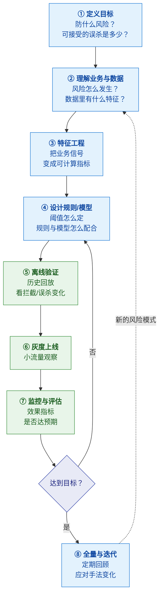
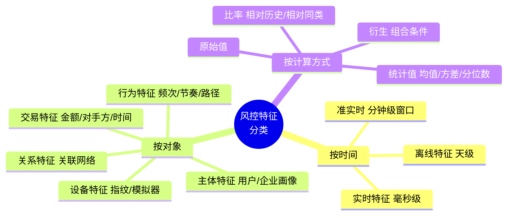
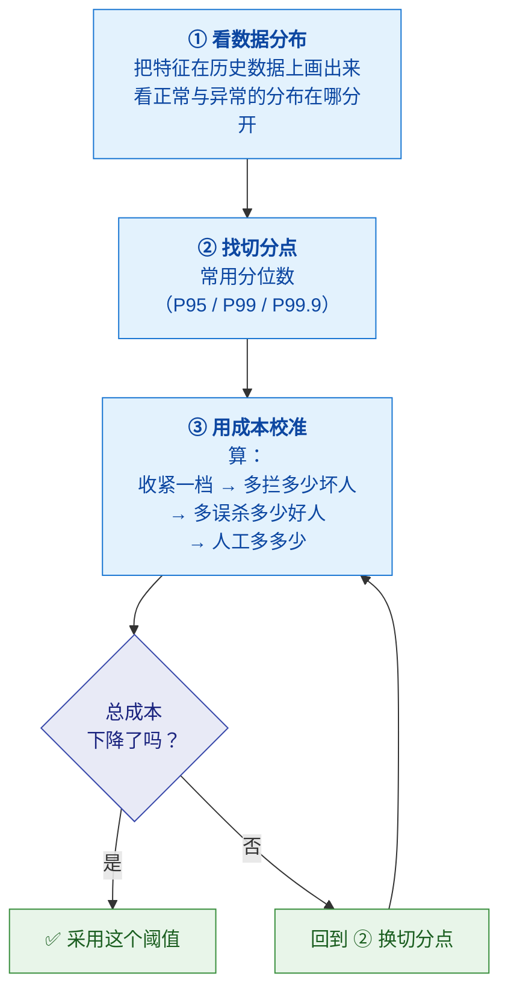
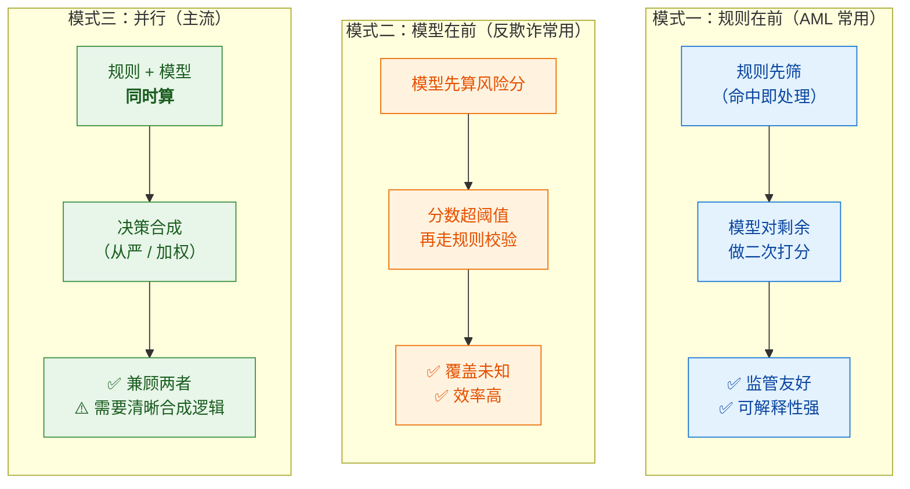
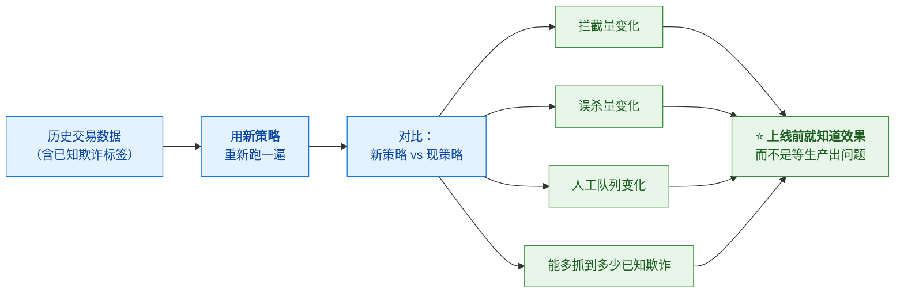
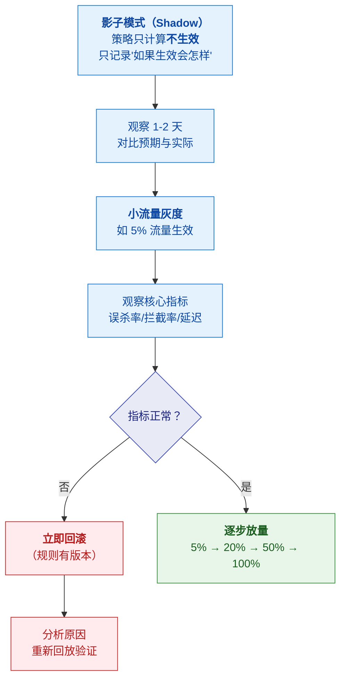

# 🎯 四、如何制定风控策略

> [!abstract] 本篇的目标
> **回答"风控策略到底怎么定"**——不是"有哪些规则"，
> 而是**从零到一：目标怎么定、阈值怎么算、规则和模型怎么配合、上线怎么验证、效果怎么迭代**。
>
> 这是整个系列**最"可操作"**的一篇。前置：[[1-风控是什么与为什么]]（目标函数）；
> 业务场景见 [[2-反洗钱AML]]、[[3-反欺诈]]。

---

## 一、策略生命周期（总框架）



> [!important] ⭐ 这个流程的关键在于"**先离线、再灰度、后全量**"
> **绝不允许"策略写完直接全量上线"。**
> 因为：
> - 策略错误会**直接影响业务**（误杀客户）
> - 而且**很难第一时间发现**（客户不会来投诉，他只是走了）
>
> **所以必须有：离线回放验证 + 灰度观察 + 可一键回滚。**

---

## 二、第一步：定义目标（最容易被跳过）

### 2.1 要问清的四个问题

> [!important] ⭐ 没有目标的策略是盲目的

| 问题 | 为什么必须问 | 影响 |
|---|---|---|
| **① 防什么风险？** | 洗钱？欺诈？套现？**不同风险的策略完全不同** | 决定特征和规则方向 |
| **② 这个风险的损失量级？** | 是每年几百万还是几个亿？ | **决定投入多少、阈值多严** |
| **③ 可接受的误杀是多少？** | 业务能忍受多少正常客户被拦？ | ⭐ **决定阈值** |
| **④ 决策的时效要求？** | 必须实时（欺诈），还是可以准实时（AML）？ | 决定架构 |

> [!success] 一个"目标定义"的示例（可以直接套用）
> **"这次要防的是：账户盗用后的资金转出（ATO）。**
> - **损失量级**：去年因此损失约 XXX 万
> - **误杀容忍度**：转账是核心链路，**误杀率要控制在 1% 以内**；
>   但**大额转账可以放宽到 3%**（因为损失更大）
> - **时效要求**：**必须同步拦截**（钱转走追不回），延迟预算 200ms
> - **成功标准**：在**误杀率 ≤ 1%** 的前提下，把 ATO 资损降低 70%"
>
> 👉 **注意"成功标准"的写法**：**不是"拦截率提升到 X%"，而是"在误杀约束下降低资损"**——
> **单个指标的提升没有意义，必须带约束。**

### 2.2 目标要拆成"可测量的指标"

| 目标 | 对应指标 | 约束条件 |
|---|---|---|
| 防住欺诈 | **召回率**（抓到多少）、**资损金额** | 误杀率 ≤ X% |
| 减少误杀 | **误杀率（FPR）** | 召回率不低于 Y% |
| 降低人工成本 | **人工审核率** | —— |
| 保证体验 | **决策延迟 P99** | 必须 < Z ms |
| 满足监管 | **漏报率、上报质量** | 监管评价 |

> [!warning] 为什么必须"带约束"
> **"我们把拦截率从 60% 提到 90%"** 这句话**没有意义**——
> 如果把所有人都拦了，拦截率是 100%，但业务也死了。
>
> **正确表述**：**"在误杀率不变（2%）的前提下，召回率从 60% 提到 85%。"**
> 这才是**真实的能力提升**。

---

## 三、第二步：特征工程（把业务信号变成可计算指标）

### 3.1 什么是特征

> [!note] 定义
> **特征（Feature）= 从原始数据中提取出来的、能区分"正常"与"异常"的可计算指标。**

**示例**：

| 业务问题 | 原始数据 | 提取出的特征 |
|---|---|---|
| 这笔转账可疑吗？ | 转账记录 | **近1小时转账次数**、**单笔金额/历史均值比**、**是否新收款方** |
| 这个设备可疑吗？ | 设备/登录日志 | **该设备关联账户数**、**首次出现时间**、**是否模拟器** |
| 这个账户在做通道吗？ | 账户流水 | **资金留存时长**、**进出比**、**对手方分散度** |
| 这是团伙吗？ | 关系数据 | **共享设备数**、**共享银行卡数**、**关联团伙风险等级** |

### 3.2 特征的分类



> [!important] ⭐ 特征设计的核心原则：**"相对"优于"绝对"**
> | ❌ 绝对特征 | ✅ 相对特征 | 为什么 |
> |---|---|---|
> | 单笔金额 > 5 万 | **金额 / 该客户历史均值 > 10 倍** | 不同客户体量不同，绝对值不公平 |
> | 一天 10 笔 | **今日笔数 / 该客户 30 日均值** | 正常高频客户不该被误杀 |
> | 新设备登录 | **新设备 vs 该账户历史常见设备** | 换手机是正常的 |
>
> **原理**：**风控要找的是"偏离自身常态"，而不是"偏离全体均值"。**
> 一个做批发的客户，一天转 100 笔是正常的；
> 一个普通用户突然转 100 笔才是异常。

### 3.3 好特征的三个标准

| 标准 | 说明 | 反例 |
|---|---|---|
| **可区分性** | 正负样本上分布差异明显 | "用户是否有手机号"——几乎所有人都有 |
| **难以伪装** | 攻击者不容易伪造或规避 | IP（可代理）❌ vs **设备指纹**（难改）✅ |
| **可解释** | 能说清"为什么这个特征有意义" | 纯模型学出来的黑盒特征，监管不认 |
| **稳定可得** | 生产环境能实时取到、成本可接受 | 需要跨系统复杂 Join 才能拿到的特征 |

> [!tip] 面试/设计时的一句话
> **"我会优先选'偏离自身常态'的相对特征，而不是绝对阈值——
> 因为风控要抓的是异常行为，不是异常用户。"**

---

## 四、第三步：⭐ 阈值怎么定（最实操的一节）

### 4.1 阈值不是"拍脑袋"，是"从数据里找"

> [!important] ⭐ 定阈值的三步法



### 4.2 用分位数定初始阈值

> [!note] 为什么用分位数
> **分位数天然给了"会拦掉多少比例"的直觉。**

**示例**：特征 = "近 1 小时转账次数"

| 阈值 | 覆盖人群 | 含义 | 适合 |
|---|---|---|---|
| P95（> 前 5%） | 5% | 偏松，拦 2 万笔 | 高风险业务、想先观察 |
| **P99（> 前 1%）** | 1% | ⭐ **常用起点** | 平衡 |
| P99.9 | 0.1% | 偏严，拦 2000 笔 | 精确打击、误杀敏感 |
| P99.99 | 0.01% | 极严 | 只打最明显的 |

> [!tip] 为什么 P99 常作起点
> **它对应"1% 的拦截量"**——这个量级通常**人工队列能承受**，
> 且**不会大面积误杀**。**然后再根据实际成本和效果上下调整。**

### 4.3 用成本收益校准（关键一步）

> [!important] ⭐ 这才是"定阈值"的精髓

**核心公式（概念上）**：

```
总成本 = 漏拦的损失 + 误杀的损失 + 人工审核成本

收紧一档阈值：
  ↓ 漏拦损失（少漏了骗子）
  ↑ 误杀损失（多拦了好人）
  ↑ 人工成本（队列变长）

⭐ 当"继续收紧"带来的边际收益 < 边际成本时，就是最优阈值
```

**一个算例（感受一下）**：

| 阈值 | 拦截量 | 抓到欺诈 | 误杀 | 漏拦损失 | 误杀损失 | 人工成本 | **总成本** |
|---|---|---|---|---|---|---|---|
| 松（P99.9） | 2000 | 1500 | 500 | 50 万 | 5 万 | 2 万 | **57 万** |
| **中（P99）** | 20000 | **1900** | 18100 | **10 万** | 18 万 | **8 万** | **36 万** ✅ |
| 严（P95） | 100000 | 1950 | 98050 | 5 万 | **98 万** | **30 万** | 133 万 ❌ |

> [!success] 从上表能读出什么（这是最有价值的部分）
> **从"松"到"中"：多花 6 万成本，少损失 40 万 → 值得 ✅**
> **从"中"到"严"：多抓 50 个欺诈（省 5 万），但多误杀 8 万人（多损失 80 万）→ 极度不划算 ❌**
>
> **⭐ 这就是"边际收益递减"**——
> **越往后，多抓一个坏人的代价越大**（因为要误杀越来越多好人）。
>
> **所以最优阈值在"中"这一档，而不是越严越好。**
>
> 👉 **面试/汇报时能算出这笔账，比说"我们设了阈值"强一百倍。**

> [!warning] 现实中的复杂之处
> - **误杀损失很难精确量化**（客户流失是长期、隐性的）
> - **欺诈损失也不确定**（未发现的欺诈不知道）
> - **所以现实中是"估算 + 试错 + 灰度验证"**，不是算一次就定
> - **但"算这笔账"的思维必须有**——否则就是拍脑袋

### 4.4 不同场景的阈值策略

| 场景 | 策略 | 为什么 |
|---|---|---|
| **高风险动作**（大额转账、提现） | **从严**（宁可误杀） | 损失远大于误杀代价 |
| **低风险动作**（小额支付、查询） | **从宽**（宁可放过） | 损失小，体验优先 |
| **不可逆操作**（转账、发卡） | **从严 + 增强验证** | 追不回 |
| **可逆操作**（下单未支付） | **从宽** | 可以事后取消 |
| **新客户** | **从严**（信息少） | 没有历史行为参考 |
| **老客户** | **结合历史行为**（相对特征） | 有基线可比 |

> [!important] ⭐ 一句话原则
> **"阈值不是统一的，是按'损失量级'和'可逆性'分层的。**
> **大额、不可逆、新客户 → 严；小额、可逆、老客户 → 宽。"**

---

## 五、第四步：规则与模型怎么配合

### 5.1 两者的分工

| | **规则** | **模型** |
|---|---|---|
| **擅长** | 拦**已知**风险、硬性红线 | 抓**未知**模式、复杂组合 |
| **优点** | **可解释、上线快、确定性强** | 覆盖广、能发现隐蔽模式 |
| **缺点** | 只能拦已知、易被规避 | **黑盒、需数据、可能误判** |
| **监管认可度** | ✅ **高**（能说清为什么） | 🟠 中（需可解释性方案） |
| **适合** | 黑名单、限额、监管硬要求 | 风险打分、排序、异常检测 |

> [!important] ⭐ 正确的关系是"互补"，不是"替代"
> **成熟系统 = 规则 + 模型 + 名单 + 人工**
>
> **分工**：
> - **名单**：命中即拦（最硬，无需判断）
> - **规则**：硬性红线（限额、监管要求）+ 已知模式
> - **模型**：风险打分，**决定"要不要进人工队列"**
> - **人工**：研判复杂案件 + 沉淀新规则

### 5.2 三种组合模式



### 5.3 决策合成：多个信号怎么合并

| 方式 | 说明 | 适用 |
|---|---|---|
| **从严（Veto）** | 任一信号判风险 → 拦截 | 高风险场景（AML、大额） |
| **加权打分** | 各信号加权求和 → 总分定级 | 精细分层（反欺诈） |
| **规则优先级** | 高优先级规则先定 | 硬性红线（名单必须先拦） |
| **分层决策** | 不同分数区间不同动作 | ⭐ **主流**（放行/验证/人工/拦截） |

> [!tip] 分层决策的示例（可以直接用）
> | 风险分 | 动作 | 说明 |
> |---|---|---|
> | **0-40** | **放行** | 无感通过 |
> | **41-70** | **增强验证** | 短信/人脸/密保 |
> | **71-90** | **人工审核** | 进队列 |
> | **91-100** | **直接拦截** | 高风险，不等人工 |
>
> **好处**：不浪费人力（低分直接放行），也不一刀切（中间档验证而非拦截）。

---

## 六、第五步：离线验证（历史回放）

### 6.1 什么是历史回放

> [!note] 定义
> **Backtesting / 历史回放**：把**新策略**在**历史真实数据**上跑一遍，
> 看它**如果当时生效**会拦多少、误杀多少。



### 6.2 回放的价值与局限

| | 说明 |
|---|---|
| ✅ **价值** | **上线前就能量化效果**；避免"生产才发现误杀暴增" |
| ✅ **成本低** | 用离线数据，不影响生产 |
| ⚠️ **局限1** | **历史数据里的标签不全**（未发现的欺诈没标签）→ 高估效果 |
| ⚠️ **局限2** | **无法反映"策略上线后攻击者的反应"**（对抗性）→ 真实效果会打折 |
| ⚠️ **局限3** | 历史分布 ≠ 未来分布（新客户、新场景） |

> [!important] ⭐ 诚实地认识局限，比吹效果更有说服力
> **"回放能验证'在历史数据上效果如何'，但它有两个盲区：**
> **① 历史里未发现的欺诈是没有标签的，所以会高估召回；**
> **② 策略上线后攻击者会调整手法，真实效果会低于回放结果。**
> **所以回放只用来'排除明显有问题的策略'，
> 真正的验证还要靠灰度。"**
>
> 👉 **这段话会让面试官觉得你真的做过策略。**

---

## 七、第六步：灰度与上线

### 7.1 灰度三步



### 7.2 影子模式（Shadow Mode）的价值

> [!success] ⭐ 这是最安全的上线方式，也是最能体现"做过"的细节
> **"新策略先只计算不生效"**——把决策结果记下来，但**不真的拦**。
>
> **好处**：
> - **零风险**：不会误杀任何真实客户
> - **能看到真实分布**：策略在真实流量上会拦多少
> - **能和现策略对比**：差异在哪
>
> **这是从"离线回放"到"真正上线"之间最关键的缓冲。**

### 7.3 回滚能力

> [!danger] 必须能"一键回滚"
> 策略出问题（误杀暴增）时，**要能立刻恢复到上一版**——
> 这要求：**规则有版本管理 + 可热更新（不用发版）。**
>
> 👉 **这也是"策略平台化"的核心价值**：
> **不是"能配规则"，而是"能安全地、快速地变更规则"。**

---

## 八、第七步：监控与迭代

### 8.1 监控什么

| 层次 | 指标 | 告警阈值思路 |
|---|---|---|
| **策略效果** | 拦截率、误杀率、召回率 | **突变即告警**（±50% 波动） |
| **规则级** | 每条规则的命中率 | 命中率骤降 → 规则可能失效（被规避） |
| **运营** | 人工审核量、处理时长、积压 | 队列积压 → 资源或规则问题 |
| **技术** | 决策延迟 P99、错误率、降级次数 | 延迟超预算 |
| **业务** | 资损金额、客诉量、申诉量 | ⭐ **客诉/申诉暴增 = 误杀信号** |

> [!important] ⭐ 一个容易被忽略的监控信号
> **客户的申诉量和客诉量，是误杀的最直接信号。**
> 因为：
> - **误杀的客户可能不来申诉**（直接走了）——所以申诉量是**下界**
> - **但申诉突然暴增，一定说明策略过严了**
>
> **所以风控要建立"申诉 → 复盘 → 调策略"的闭环。**

### 8.2 迭代的触发条件

| 触发 | 说明 |
|---|---|
| **规则失效** | 某规则命中率骤降 → 攻击者已适应 |
| **新型手法** | 发现新的欺诈/洗钱模式 → 补规则 |
| **误杀投诉** | 客诉上升 → 阈值过严，需放宽 |
| **效果衰减** | 模型 AUC 下降 → 概念漂移，需重训 |
| **业务变化** | 新业务、新地区 → 需要新策略 |
| **监管更新** | 新规出台 → 必须合规调整 |

> [!warning] ⚠️ 迭代不是"不断加规则"
> **常见错误：一有问题就加一条规则，几年后规则上千条、互相冲突、没人敢删。**
>
> **正确做法**：
> - **定期盘点规则**：算每条规则的**命中率 + 拦截贡献 + 误杀贡献**
> - **下线无效规则**（长期不命中的）
> - **合并重复规则**
> - **用模型替代复杂规则组合**（如果可解释性允许）
>
> 👉 **规则治理和"指标去重"是一个思路：定期盘点，删掉不产生价值的。**

---

## 九、完整案例：设计一个"异常转账"策略

> [!example] 把上面的方法论走一遍

**① 定义目标**
- 防什么：账户盗用后的大额转出（ATO）
- 损失量级：年损失约 500 万
- **误杀约束：转账误杀率 ≤ 1%**
- 时效：**同步拦截**，延迟预算 200ms
- **成功标准：误杀率不变前提下，资损降低 70%**

**② 理解业务与数据**
- 正常转账：收款方多为自己的账户/常用供应商
- 盗号转账：**新收款方、大额、深夜、新设备登录后**
- 可用数据：登录日志、设备信息、历史转账、收款方档案

**③ 特征工程**

| 特征 | 计算 | 为什么 |
|---|---|---|
| 登录设备变更 | 本次设备 ≠ 历史常用设备 | 盗号典型信号 |
| 新增收款方 | 收款方首次出现 | 盗号要把钱转到自己账户 |
| 金额偏离度 | 本次金额 / 该用户 90 日均值 | **相对特征**，避免体量差异 |
| 操作时间异常 | 是否在用户活跃时段外 | 相对用户习惯 |
| 登录到转账间隔 | 时间差 | **盗号后往往立刻转账** |
| 收款方风险 | 收款方是否关联已知欺诈 | 关系网络 |

**④ 设计规则与模型**

| 类型 | 内容 |
|---|---|
| **规则（红线）** | 收款方在**黑名单** → 直接拦截 |
| **规则（组合）** | **新设备 + 新收款方 + 金额>均值5倍** → 强制人脸验证 |
| **模型** | 用上述特征输出 0-100 风险分 |
| **决策分层** | 0-40 放行 / 41-70 人脸验证 / 71-90 人工 / 91+ 拦截 |

**⑤ 离线验证**
- 在近 3 个月数据上回放
- 预期：多拦 60% 已知 ATO，误杀率从 0.8% → 1.1%（**略超约束，需调阈值**）
- **调整**：把"金额>均值5倍"改成 8 倍 → 误杀回到 0.9%

**⑥ 灰度**
- 影子模式 2 天 → 确认与回放一致
- 5% 灰度 → 观察误杀、延迟、客诉
- 逐步放量到 100%

**⑦ 监控与迭代**
- 监控规则命中率（骤降 = 被规避）
- 监控客诉/申诉（暴增 = 误杀）
- **3 个月后盘点**：某条规则命中率降到 0.01% → **下线**

> [!success] 这个案例的价值
> 它把**目标 → 特征 → 规则/模型 → 验证 → 灰度 → 迭代**完整走了一遍，
> **而且展示了"误杀超约束就调阈值"的真实迭代过程**。
> **能讲出这个流程，比说"我会配规则"强得多。**

---

## 十、30 秒速查表

| 问题 | 一句话答案 |
|---|---|
| 策略生命周期 | **定目标 → 理解业务 → 特征 → 规则/模型 → 离线验证 → 灰度 → 监控 → 迭代** |
| 最先要做什么 | ⭐ **定义目标**（防什么、损失多大、可接受误杀多少、时效要求） |
| 成功标准怎么写 | ⭐ **必须带约束**："在误杀率≤X% 前提下，资损降低 Y%" |
| 为什么不能只提拦截率 | 全拦了拦截率 100%，但业务也死了——**单指标无意义** |
| 什么特征最好 | **"偏离自身常态"的相对特征**，不是绝对阈值 |
| 相对特征好在哪 | 不同客户体量不同，**绝对值会误杀正常高频客户** |
| 好特征的标准 | **可区分、难伪装、可解释、稳定可得** |
| ⭐ 阈值怎么定 | **看分布 → 分位数找切点（常用 P99）→ 用成本收益校准** |
| 为什么 P99 常做起点 | 对应 1% 拦截量，**人工队列可承受且不大面积误杀** |
| 定阈值的精髓 | ⭐ **边际分析**：继续收紧的边际收益 < 边际成本时就是最优 |
| 越严越好吗 | ❌ **边际收益递减**——多抓一个坏人的代价越来越大 |
| 阈值要统一吗 | ❌ **按损失量级和可逆性分层**：大额/不可逆/新客户从严 |
| 规则 vs 模型 | **规则拦已知（可解释）、模型抓未知（覆盖广）**——互补 |
| AML 为什么规则为主 | **监管要可解释**——"模型说可疑"站不住 |
| 反欺诈为什么模型为主 | 要抓**未知**模式，且必须实时 |
| 决策合成方式 | 从严 / 加权打分 / 规则优先级 / **分层决策** |
| 什么是历史回放 | ⭐ 用**历史数据**跑新策略，看拦截/误杀变化 |
| 回放的局限 | **标签不全**（未发现的欺诈没标签）+ **攻击者会适应** → 会高估效果 |
| 什么是影子模式 | ⭐ **只计算不生效**——零风险观察真实表现 |
| 灰度怎么走 | **影子 → 5% → 20% → 50% → 100%**，异常立即回滚 |
| 为什么必须能回滚 | 误杀暴增要能**立即恢复上一版**（规则版本 + 热更新） |
| 监控什么 | 策略效果 + **规则级命中率**（骤降=被规避）+ 人工队列 + 延迟 + **客诉/申诉** |
| 客诉为什么重要 | ⭐ **是误杀最直接的信号**（误杀客户多数不申诉，直接走了） |
| 迭代的触发 | 规则失效、新型手法、误杀投诉、效果衰减、业务变化、监管更新 |
| 迭代的常见错误 | ⚠️ **只加不减** → 规则上千条、互相冲突、没人敢删 |
| 规则该怎么治理 | **定期盘点命中率与贡献，下线无效规则、合并重复** |

---

## 十一、学习检查清单

- [ ] ⭐ 能完整背出**策略生命周期**八个步骤
- [ ] ⭐ 能说清**定义目标要问的四个问题**，并写出**带约束的成功标准**
- [ ] 能解释为什么"只提拦截率"是没有意义的
- [ ] ⭐ 能说清什么是**相对特征**，并解释为什么优于绝对阈值
- [ ] 能说出**好特征的四个标准**
- [ ] ⭐⭐ 能完整讲清**定阈值的三步法**（分布 → 分位数 → 成本校准）
- [ ] ⭐ 能算一笔简单的**阈值成本账**，并解释边际收益递减
- [ ] 能说清**阈值为什么按场景分层**（大额/不可逆/新客户从严）
- [ ] ⭐ 能说清**规则与模型的分工**，以及为什么 AML 规则为主、反欺诈模型为主
- [ ] 能说出**决策合成的四种方式**，并举例分层决策
- [ ] ⭐ 能说清**历史回放**的做法、价值、以及**两个盲区**
- [ ] ⭐ 能说清**影子模式**是什么、为什么它是"零风险"的上线方式
- [ ] 能说清**灰度的完整路径**和回滚要求
- [ ] 能说出**监控的五个层次**，并解释**客诉量为什么是误杀信号**
- [ ] 能说出**迭代的六个触发条件**
- [ ] ⚠️ 能说出"**只加规则不减规则**"这个常见错误及其治理方法
- [ ] ⭐ 能**完整讲一遍"异常转账"案例**（目标→特征→规则→验证→灰度→迭代）

---
> 上一篇 → [[3-反欺诈]] ｜ 下一篇 → [[5-风控体系与合规框架]] ｜ 返回 [[0-风控知识体系总览]]
