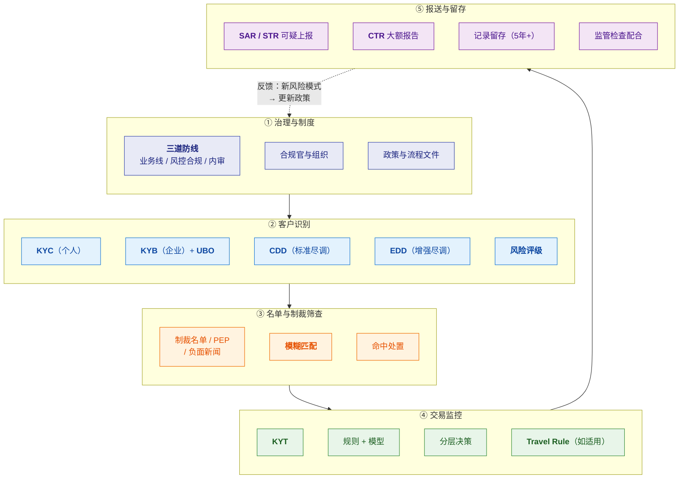
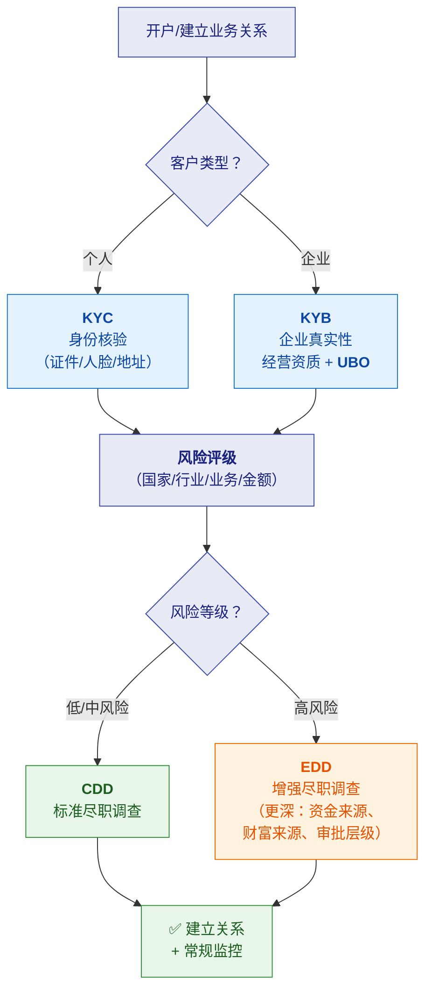
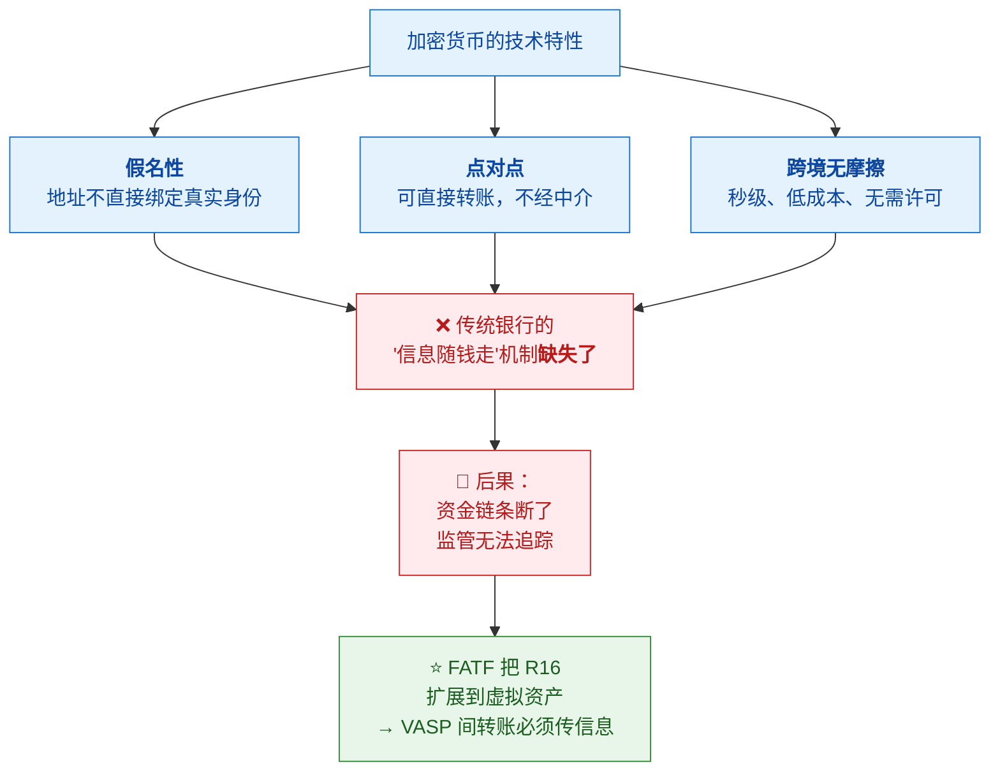
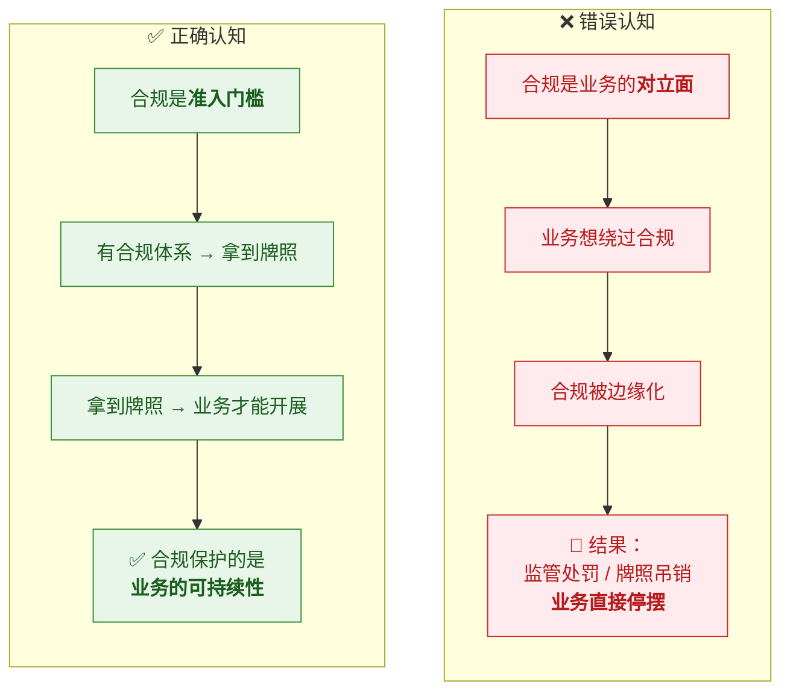

# 🏛️ 五、风控体系与合规框架

> [!abstract] 本篇的目标
> **把"合规"这件事讲清楚**——它到底要求什么、机构怎么落地、为什么它是"准入门槛"。
>
> 本篇回答五个问题：**合规体系由哪些部分组成**？**KYC/KYB/CDD/EDD 怎么落地**？
> **名单筛查怎么做**（含模糊匹配难点）？**Travel Rule 是什么**？
> 以及**监管报送与记录留存**的要求。
> 前置见 [[1-风控是什么与为什么]]；业务逻辑见 [[2-反洗钱AML]]。

---

## 一、合规体系全景



> [!important] 合规体系的逻辑主线
> **"先搞清'你是谁'（识别）→ 再看'你有没有问题'（筛查）→
> 然后持续看'你在干什么'（监控）→ 最后'该报的必须报'（上报）。"**
>
> 而这一切要建立在**治理与制度**之上——
> **没有制度，技术手段就是无根之木，监管也不认。**

---

## 二、三道防线（治理基础）

| 防线 | 谁 | 职责 | 关键原则 |
|---|---|---|---|
| **第一道** | **业务线** | 在流程里**自己做**风控（实名、限额、审批） | **业务是风险第一责任人** |
| **第二道** | **风控/合规** | **定政策、建系统、独立监控** | ⭐ **独立于业务** |
| **第三道** | **内审** | **独立评估**前两道是否有效 | 直报董事会 |

> [!important] ⭐ 为什么"独立"是关键词
> **因为存在结构性利益冲突**：
> - **业务线想冲业绩** → 天然倾向放宽风控
> - **风控要控风险** → 天然倾向收紧
>
> **如果没有独立的风控，业务压力会压垮风险控制。**
> 所以第二道防线必须**独立汇报线、独立考核**，而不是挂在业务部门下面。
>
> **内审则是对风控的再监督**——防止风控自己失职或与业务合谋。

> [!note] 合规官（Compliance Officer）的角色
> - 通常是**强制的**（监管要求必须有）
> - 负责：政策制定、监管沟通、可疑上报决策、员工培训
> - **在很多司法区，合规官个人也承担法律责任**（所以这个位置压力很大）

---

## 三、客户识别：KYC / KYB / CDD / EDD

### 3.1 四个概念的关系



| 术语 | 全称 | 对象 | 核心内容 |
|---|---|---|---|
| **KYC** | Know Your Customer | **个人** | 身份核验（证件真伪、人脸比对、地址） |
| **KYB** | Know Your Business | **企业** | 企业真实性、经营资质、**股权结构 → UBO** |
| **CDD** | Customer Due Diligence | 所有客户 | **标准尽调**：识别身份 + 了解业务目的 |
| **EDD** | Enhanced Due Diligence | **高风险客户** | **增强尽调**：资金来源、财富来源、更高级审批、更频繁复核 |

> [!important] ⭐ UBO（实际受益人）是 KYB 的核心难点
> **UBO = Ultimate Beneficial Owner，最终实际控制/受益的自然人。**
>
> **为什么难**：企业可以有**多层股权结构、离岸公司、代持**——
> 表面股东可能是另一家公司，再往上还是公司……
> **要一直穿透到自然人。**
>
> **为什么重要**：**洗钱者最喜欢用复杂股权结构隐藏真实控制人。**
> 如果只查到第一层股东（一家 BVI 公司），等于没查。
>
> **监管通常要求**：穿透到**持股 ≥ 25%** 的自然人（各国阈值不同）。

### 3.2 高风险触发因素（决定是否 EDD）

| 类别 | 触发因素 |
|---|---|
| **地域** | 高风险国家/地区、FATF 灰名单/黑名单 |
| **身份** | **PEP**（政治公众人物）、其亲属与密切关系人 |
| **行业** | **现金密集型**（赌场、典当、贵金属）、虚拟资产 |
| **结构** | **复杂股权**、离岸架构、代持 |
| **行为** | 与身份/经营规模**不符的大额交易**、频繁变更信息 |
| **渠道** | 非面对面开户（远程开户，身份验证弱） |

> [!warning] PEP 的常见误解
> **PEP 不是罪犯，也不是黑名单。**
> PEP = Politically Exposed Person（政治公众人物）——
> **因为其职位可能被用于腐败或洗钱，所以风险高，需要加强审查。**
>
> **正确做法**：**不是拒绝，而是加强尽调（EDD）+ 加强监控。**

### 3.3 持续尽调（不是一次性的）

> [!important] ⭐ KYC 不是"开户时做一次"
> **监管要求的是"持续尽职调查"（Ongoing CDD）**：
> - **定期复核**（高风险客户更频繁，如每年）
> - **触发式复核**（客户信息变更、交易异常、名单更新）
> - **名单更新后回溯筛查**（制裁名单更新了，要重新比对存量客户）
>
> 👉 **这对系统设计的要求**：
> **要有"存量客户定期重新筛查"的批量任务**，
> 而不是只在开户时筛一次。

---

## 四、名单筛查（Sanctions Screening）

### 4.1 名单类型

| 名单 | 说明 | 谁发布 |
|---|---|---|
| **制裁名单** | 被制裁的个人/实体/国家 | 联合国、**OFAC**（美）、欧盟、英国等 |
| **PEP 名单** | 政治公众人物及其关系人 | 商业数据商（如 Dow Jones、Refinitiv） |
| **负面新闻** | Adverse Media，媒体报道的负面信息 | 商业数据商 |
| **执法/通缉名单** | 司法与执法机构发布 | 各国政府 |
| **内部黑名单** | 机构自己积累的（历史欺诈、已确认可疑） | 机构自身 |

### 4.2 ⭐ 核心技术难点：模糊匹配

> [!danger] ⭐ 这是名单筛查最核心的工程问题
> **名单上的名字是"人写的"，而客户的名字也是"人写的"——
> 两者之间隔着语言、字符集、拼写习惯的鸿沟。**

**难在哪里**：

| 难点 | 例子 |
|---|---|
| **音译变体** | "穆罕默德" → Mohammed / Muhammad / Mohamed / Mohamad / Muhammed…（**几十种拼写**） |
| **语序** | 中文"张伟" → Zhang Wei / Wei Zhang（**姓在前还是后**） |
| **字符集** | 阿拉伯语、俄语、中文的罗马化规则不同 |
| **缩写/昵称** | Robert → Bob / Rob；Alexander → Alex / Sasha |
| **中间名** | 有时有、有时无、有时缩写 |
| **拼写错误** | 录入时的错别字 |

> [!important] ⭐ 这就是"精确匹配 vs 模糊匹配"的两难
> | 方式 | 结果 |
> |---|---|
> | **精确匹配** | ✅ 无误报；❌ **大量漏报**（拼写差一个字母就漏了） |
> | **模糊匹配** | ✅ 漏报少；❌ **大量误报** → **人工队列被淹没** |
>
> **所以必须是"模糊匹配 + 相似度打分 + 分层处置"**：
>
> ```mermaid
> flowchart LR
>   A["客户/对手方姓名"] --> B["<b>模糊匹配</b><br/>（编辑距离、音似、<br/>词序无关）"]
>   B --> C["<b>相似度打分</b><br/>0-100"]
>   C --> D{"分数区间"}
>   D -->|"≥ 95"| E["🔴 <b>自动拦截</b><br/>+ 人工复核"]
>   D -->|"70-94"| F["🟠 <b>人工研判</b>"]
>   D -->|"< 70"| G["✅ 放行<br/>（但留记录）"]
>   classDef q fill:#e8eaf6,stroke:#3949ab,color:#1a237e
>   classDef bad fill:#ffebee,stroke:#c62828,color:#b71c1c
>   classDef mid fill:#fff3e0,stroke:#ef6c00,color:#e65100
>   classDef ok fill:#e8f5e9,stroke:#388e3c,color:#1b5e20
>   class A,B,C,D q
>   class E bad
>   class F mid
>   class G ok
> ```
>
> **辅助手段（降低误报）**：
> **结合出生日期、国籍、性别等多字段**——单看姓名易误报，多字段交叉能大幅提准。

### 4.3 名单筛查的工程要点

| 要点 | 说明 |
|---|---|
| **性能** | 名单可能几十万条，**不能每次查库** → 加载到**内存/Redis** |
| **更新频率** | 制裁名单**变动频繁** → 需定期同步（甚至每日） |
| **存量回溯** | 名单更新后，**要重新筛查存量客户**（批量任务） |
| **记录留痕** | 每次筛查的结果要记录（监管要审计） |
| **误报处理** | 需要**白名单/申诉机制**（确认为误报后标记，避免反复报） |
| **多语言支持** | 要能处理中文、阿拉伯语、俄语等 |

> [!tip] 与技术选型的关联
> **如果底层数据库是 PostgreSQL，`pg_trgm`（三元组相似度）可以做模糊匹配**，
> 这是 MySQL 相对弱的地方。
> **这可能是某些跨境支付公司选 PostgreSQL 的原因之一。**

---

## 五、Travel Rule（转账规则）

### 5.1 是什么

> [!note] 定义
> **Travel Rule 来自 FATF Recommendation 16**：
> **转账时，汇款人和收款人的信息必须随交易一起传递。**
>
> **通俗理解**：**钱在旅行，它的"身份信息"也要跟着一起旅行。**
> 就像寄快递要写清寄件人和收件人——**信息缺失，监管就无法追查资金链条。**

### 5.2 ⭐ 它同时适用于传统电汇和虚拟资产

> [!important] 一个常见误解需要纠正
> **很多人以为 Travel Rule 只跟加密货币有关——这是不准确的。**
>
> | 场景 | Travel Rule 适用性 |
> |---|---|
> | **传统电汇（Wire Transfer）** | ✅ **早就适用**——银行电汇必须带汇款人/收款人信息 |
> | **虚拟资产转账** | ✅ **FATF 后来扩展适用**（因为加密的假名性破坏了"信息随钱走"） |
>
> **所以：一家纯法币的跨境支付公司，同样受 Travel Rule 约束**——
> 它的要求来自**支付牌照的合规义务**，不是"因为做加密"。

### 5.3 为什么虚拟资产需要特别的 Travel Rule



**关键概念**：

| 术语 | 含义 |
|---|---|
| **VASP** | Virtual Asset Service Provider，**虚拟资产服务商**（交易所、托管钱包等） |
| **门槛金额** | 通常 **≥ 1000 USD/EUR** 需传完整信息（各地实现有差异） |
| **信息内容** | 汇款人：姓名 + 账号/地址；收款人：姓名 + 账号/地址 |
| **适用范围** | 主要是 **VASP 之间**；VASP 与**自托管钱包**之间各地要求不一 |

### 5.4 ⭐ 技术实现难点（技术面试常问）

| 难点 | 说明 |
|---|---|
| **① 找不到对手方** | 链上只有地址，**不知道对方是哪家 VASP** → 需要**地址归属识别 + 目录服务** |
| **② 隐私 vs 合规** | 公链公开，**把客户姓名写上链等于公开隐私** → 通常走**链下加密通道**传信息，链上只放引用/哈希 |
| **③ 标准不统一** | **TRISA、TRP、OpenVASP、Sygna** 等多套协议，**互操作性差** |
| **④ 数据保护冲突** | GDPR（数据最小化）vs Travel Rule（传递个人信息）→ **跨境合规冲突** |
| **⑤ 自托管钱包** | 对手方不是 VASP，走不了 VASP 间协议 → 需**额外验证**（如证明钱包所有权） |
| **⑥ 一致性** | **信息传递与资金转移必须都成功或都失败** → 不能"钱到了但信息没到" → **需要对账与补偿** |

> [!success] 讲这个能体现深度
> **"Travel Rule 的工程难点，我觉得最本质的是'信息流和资金流的一致性'——
> 不能出现钱已经转了但信息没传过去，否则合规上就是缺口。
> 所以要有对账和补偿机制。**
> **这和跨系统操作保证最终一致是同一类问题。"**

---

## 六、监管报送与记录留存

### 6.1 主要报送类型

| 类型 | 全称 | 触发 | 说明 |
|---|---|---|---|
| **SAR** | Suspicious Activity Report | 发现可疑**活动** | 美国常用 |
| **STR** | Suspicious Transaction Report | 发现可疑**交易** | 国际常用 |
| **CTR** | Currency Transaction Report | **达阈值的大额现金**交易 | 强制申报，不需判断 |
| **其他** | 各国特定报表 | 视监管要求 | 如跨境大额汇款报告 |

> [!danger] 上报的三个硬性要求
> | 要求 | 含义 | 对系统的影响 |
> |---|---|---|
> | **法定性** | **发现可疑必须报**，不报本身违法 | 需要有完整的发现→上报流程 |
> | **时限性** | 通常发现后**若干工作日**内 | 上报流程不能拖 |
> | **保密性** | ⭐ **不能告知客户"我举报了你"** | 报告内容不能出现在客户可见界面 |
>
> **⚠️ 保密性这点很容易踩坑**：如果系统把"已上报"状态显示给客户，
> 就是**违规**（打草惊蛇）。

### 6.2 记录留存

| 项 | 要求 |
|---|---|
| **留存期限** | 通常 **5 年以上**（各国不同，有的 7-10 年） |
| **留存内容** | 客户身份资料、交易记录、**筛查记录**、**决策依据**、上报记录 |
| **可检索性** | 监管检查时要能**快速调取** |
| **不可篡改** | 记录要完整、可追溯 |

> [!important] ⭐ 这对系统设计的直接要求
> **"决策必须留痕"**——不只是为了内部复盘，**更是法定义务**。
> - 每次风控决策要记录：**入参、命中规则与版本、特征值、分数、决策结果与理由**
> - 客户尽调资料要**长期保存**
> - 筛查过程与结果要**可追溯**
>
> 👉 **"可追溯性"不是加分项，是合规底线。**

---

## 七、合规与业务的关系（⭐ 认知升级）



> [!important] ⭐ 三层关系（可作结论性表述）
> | 层次 | 合规的作用 |
> |---|---|
> | **准入层** | **决定"能不能做"**——没有 AML 体系就拿不到牌照 |
> | **成本层** | **决定"罚不罚"**——违规的代价是罚款、停业、吊销牌照 |
> | **信任层** | **决定"能走多远"**——合规能力是跨境业务的通行证 |
>
> **一句话**：**"合规不是给业务设障碍，而是给业务发通行证。"**

---

## 八、30 秒速查表

| 问题 | 一句话答案 |
|---|---|
| 合规体系的五部分 | **治理制度 → 客户识别 → 名单筛查 → 交易监控 → 报送留存** |
| 三道防线 | **业务线（第一）→ 风控合规（第二）→ 内审（第三）** |
| 为什么强调"独立" | 业务想冲业绩会天然放宽风控，**必须有独立制约** |
| 合规官的角色 | 政策制定、监管沟通、可疑上报决策，**个人也承担法律责任** |
| KYC vs KYB | **个人 vs 企业**；都在开户时做 |
| CDD vs EDD | **标准尽调（所有客户）vs 增强尽调（高风险客户）** |
| ⭐ UBO 是什么 | **实际受益人**——穿透股权到自然人（通常 ≥25%） |
| UBO 为什么难 | 多层股权、离岸公司、代持 → **洗钱者最爱用它隐藏控制人** |
| 高风险触发因素 | 高风险地区、**PEP**、现金密集行业、复杂股权、非面对面开户 |
| ⚠️ PEP 是黑名单吗 | ❌ **不是**——是政治公众人物，**风险高但不拒绝，而是加强审查** |
| 持续尽调是什么 | KYC **不是一次性的**——定期复核 + 触发式复核 + **名单更新后回溯筛查** |
| 名单类型 | **制裁、PEP、负面新闻、执法、内部黑名单** |
| ⭐ 名单筛查最大难点 | **模糊匹配**——音译变体、语序、字符集 → 精确必漏、模糊必多 |
| 怎么平衡 | **模糊匹配 + 相似度打分 + 分层处置** + 多字段交叉（生日/国籍） |
| 名单筛查工程要点 | 内存/Redis 加速、定期更新、**存量回溯**、记录留痕、白名单机制 |
| Travel Rule 出处 | **FATF R16**——转账时汇款人/收款人信息随交易传递 |
| ⚠️ Travel Rule 只适用加密吗 | ❌ **传统电汇早就适用**，加密是后来扩展的 |
| 为什么加密需要特别规则 | 假名性 + 点对点 + 跨境无摩擦 → **"信息随钱走"机制缺失** |
| VASP | **虚拟资产服务商**（交易所、托管钱包） |
| Travel Rule 适用门槛 | 通常 **≥ 1000 USD/EUR** |
| ⭐ Travel Rule 技术难点 | **找对手方 / 隐私vs合规 / 标准不统一 / 数据保护冲突 / 自托管 / 信息与资金一致性** |
| SAR vs STR vs CTR | 可疑活动 / 可疑交易 / **大额现金（强制，无需判断）** |
| 上报的三个硬要求 | **法定性、时限性、保密性** |
| ⚠️ 保密性意味着什么 | **不能让客户知道被上报**——系统里"已上报"状态不能给客户看 |
| 记录要留存多久 | 通常 **5 年以上**（有的 7-10 年） |
| 留存什么 | 身份资料、交易记录、**筛查记录**、**决策依据**、上报记录 |
| ⭐ 合规与业务的关系 | **合规不是障碍，是通行证**——决定"能不能做" |

---

## 九、学习检查清单

- [ ] 能画出**合规体系全景**（五部分）并说清主线逻辑
- [ ] ⭐ 能说清**三道防线**，并解释"**独立**"为什么是关键词
- [ ] 能说清**合规官**的角色与责任
- [ ] 能区分 **KYC / KYB / CDD / EDD** 四者
- [ ] ⭐ 能说清 **UBO** 是什么、为什么难、为什么重要
- [ ] 能列举**高风险触发因素**（至少五类）
- [ ] ⚠️ 能纠正"**PEP 就是黑名单**"这个误解
- [ ] ⭐ 能说清**持续尽调**的要求，以及它对系统设计的影响（存量回溯）
- [ ] 能列举**五类名单**
- [ ] ⭐⭐ 能说清**名单筛查的模糊匹配难点**，并给出平衡方案
- [ ] 能说出名单筛查的**工程要点**（性能/更新/回溯/留痕/白名单）
- [ ] ⭐ 能说清 **Travel Rule 的内容与出处**（FATF R16）
- [ ] ⚠️ 能纠正"**Travel Rule 只适用于加密货币**"这个误解
- [ ] 能解释**为什么虚拟资产需要特别的 Travel Rule**
- [ ] ⭐ 能说出 **Travel Rule 的六个技术难点**
- [ ] 能区分 **SAR / STR / CTR**
- [ ] ⭐ 能说出**上报的三个硬要求**，并解释"保密性"对系统的影响
- [ ] 能说清**记录留存**的期限与内容要求
- [ ] ⭐ 能用"准入/成本/信任"三层说清**合规与业务的关系**

---
> 上一篇 → [[4-如何制定风控策略]] ｜ 返回 [[0-风控知识体系总览]]
> 业务逻辑 → [[2-反洗钱AML]] · [[3-反欺诈]] · [[1-风控是什么与为什么]]
