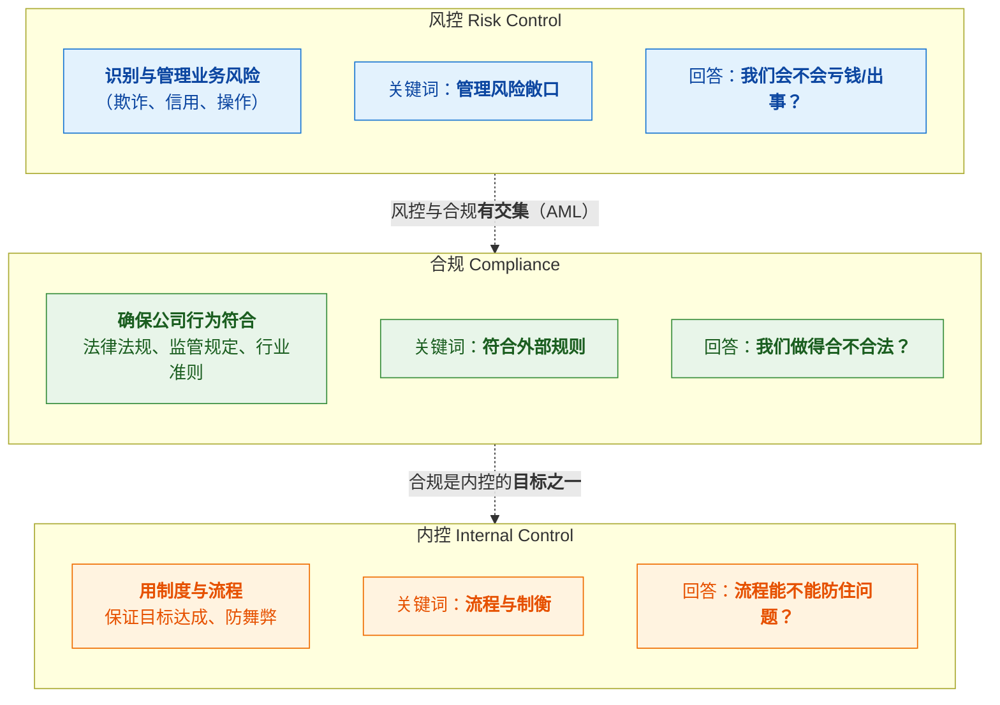
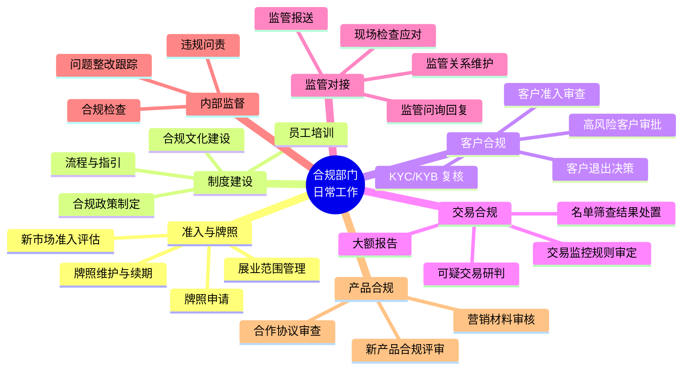
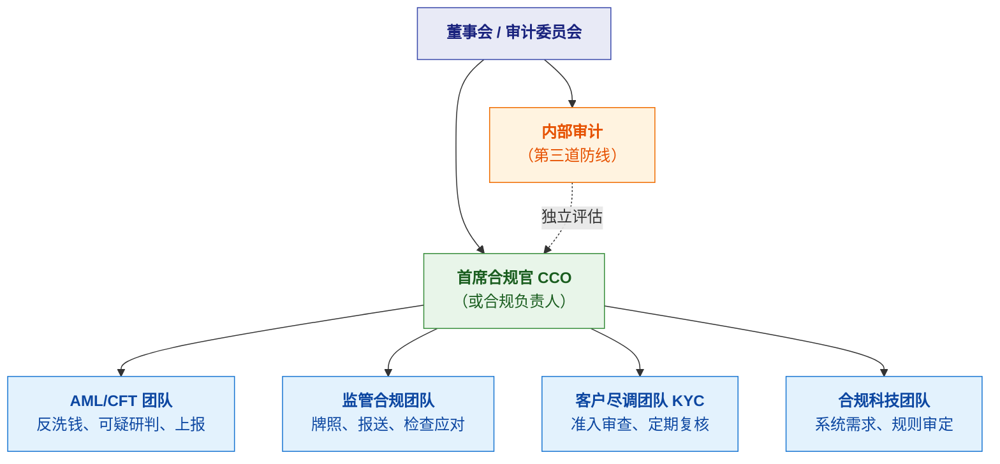
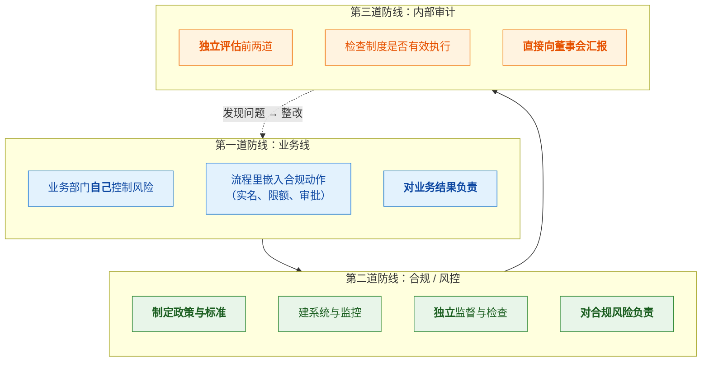

# 🏛️ 六、合规总览与工作体系

> [!abstract] 这一篇解决什么
> [[5-风控体系与合规框架]] 讲的是**合规要求什么**（KYC/名单/Travel Rule 是什么）；
> **这一篇讲合规"这个职能"本身**——它在公司里干什么活、怎么组织、
> 和风控什么关系、日常在做什么、怎么被检查。
>
> **目标**：让你能回答"**合规到底是干什么的**"这个看似简单、但很多人答不清的问题。

---

## 一、合规是什么：先厘清三个概念

> [!important] ⭐ 很多人把这三个混为一谈



| 概念 | 关注什么 | 驱动力 | 典型工作 |
|---|---|---|---|
| **合规** | **符合外部规则**（法律、监管） | **监管要求**（不做就违规） | 牌照申请、政策制定、监管报送、应对检查 |
| **风控** | **管理业务风险** | **商业可持续**（不做就亏钱） | 反欺诈、授信、交易监控 |
| **内控** | **流程与制衡** | **防舞弊与差错** | 权限分离、审批流、审计 |

> [!important] ⭐ 交集与区别
> **反洗钱（AML）是合规与风控的交集**：
> - 它**是监管强制要求**（合规属性）
> - 它**需要风控系统实现**（风控属性）
>
> **但两者的驱动力不同**：
> - **纯合规**（如牌照维护、监管报表）：**不做就是违规**，没有"收益权衡"的余地
> - **纯风控**（如反欺诈策略松紧）：**有收益权衡**（拦太严损失业务）
>
> 👉 **这个区别很重要**：
> **合规是"红线"，不可协商；风控是"最优解"，需要权衡。**
> 把合规当风控来"权衡"，就会出大事。

---

## 二、合规部门在做什么（工作全景）



### 2.1 六项核心职能

| 职能 | 具体做什么 | 输出物 |
|---|---|---|
| **① 准入与牌照** | 申请牌照、维护续期、评估新市场能否进入 | 牌照、准入评估报告 |
| **② 制度建设** | 制定合规政策与流程、培训员工 | 制度文件、培训记录 |
| **③ 客户合规** | 审定 KYC 标准、审批高风险客户、决定客户退出 | 客户风险评级、审批记录 |
| **④ 交易合规** | 审定监控规则、研判可疑交易、提交报告 | SAR/STR 报告 |
| **⑤ 监管对接** | 报送、应对检查、回复问询 | 监管报表、检查回复 |
| **⑥ 内部监督** | 合规检查、跟踪整改、违规问责 | 检查报告、整改台账 |

> [!important] ⭐ 一个关键认知：合规部门**不直接产生业务收入**
> **这是合规工作的核心张力**：
> - 业务部门冲业绩，**合规部门说"不行"**
> - 合规被视为"成本中心"、"业务的绊脚石"
> - **尤其在业务高速扩张时，合规最容易被"后置"**
>
> **但一旦出事，代价是巨大的**（罚款、停业、吊销牌照）
> 👉 **这就是为什么"独立"如此重要**（见第四节）。

### 2.2 合规工作的三种节奏

| 节奏 | 工作内容 | 特点 |
|---|---|---|
| **日常（Daily）** | 客户审核、可疑研判、名单复核、咨询回复 | 量大、流程化 |
| **周期（Periodic）** | 监管报送（月/季/年）、客户定期复核、合规检查 | 有固定 deadline |
| **事件驱动（Event）** | 监管检查、新规出台、重大风险事件、牌照申请 | 突发、高压力 |

> [!tip] 理解这三层节奏，才能理解合规的工作强度
> **日常工作是"基线负载"，周期工作有"硬 deadline"，
> 事件驱动的工作是"峰值"**（比如监管来检查，全部门进入战时状态）。
>
> **这也解释了为什么合规需要"人手充足"**——
> 监管明确要求**"根据经营规模和洗钱风险状况配备相应人员"**（见 [[9-合规风险与案例]]）。

---

## 三、合规的组织架构

### 3.1 典型结构



> [!important] ⭐ 汇报线决定合规的"硬度"
> | 汇报线 | 效果 |
> |---|---|
> | ✅ **直接向 CEO/董事会汇报** | 有独立性，能顶住业务压力 |
> | ⚠️ **挂在业务部门下** | **形同虚设**——业务负责人会压合规 |
> | ⚠️ **挂在财务/法务下** | 可能有资源冲突，独立性打折 |
>
> **监管检查时会专门看这一点**：
> **"合规负责人向谁汇报？是否有独立权限？"**
>
> 👉 **如果合规没有独立汇报线，监管会认为你的合规体系"不独立、不有效"。**

### 3.2 合规负责人（CCO）的责任

> [!danger] ⚠️ 一个容易被忽略的事实：**合规负责人个人要担责**
> 近年监管趋势是 **"机构处罚 + 个人问责"双管齐下**：
> - 机构被罚的同时，**相关负责人会被个人罚款**
> - 例如有案例：**"未按洗钱风险足额配备合规人员"** →
>   时任负责人被个人罚款 5.5 万元（见 [[9-合规风险与案例]]）
>
> **这意味着**：合规负责人不是"挂名职位"，
> **签署的合规意见是要负法律责任的**。

**CCO 的典型职责**：

| 职责 | 说明 |
|---|---|
| **政策制定** | 制定并维护合规政策体系 |
| **监管沟通** | 作为监管对接的第一责任人 |
| **决策审批** | 高风险客户准入、可疑上报的最终决策 |
| **资源争取** | ⭐ **向管理层争取合规人员和预算**（法定义务） |
| **文化建设** | 推动全员合规意识 |
| **报告** | 定期向董事会报告合规状况 |

---

## 四、三道防线（治理框架）



| 防线 | 谁 | 核心职责 | 为什么需要 |
|---|---|---|---|
| **第一道** | **业务线** | 在流程里**自己做**合规动作 | **业务是风险第一责任人**（不能甩给合规） |
| **第二道** | **合规/风控** | 定政策、建系统、**独立监督** | **业务有冲业绩的动机，必须有人独立制约** |
| **第三道** | **内审** | **独立评估**前两道是否有效 | **合规自己也可能失职或与业务合谋** |

> [!important] ⭐ 三道防线的核心是"**独立与制衡**"
> **每一道都是对前一道的"不信任"设计：**
> - 不信任业务会自觉控制风险 → **第二道独立监督**
> - 不信任合规会尽职 → **第三道独立审计**
>
> **这正是监管检查时的关键问题**：
> "你的合规部门是否独立于业务？内审是否独立于合规？"

---

## 五、合规与风控、研发的分工（⭐ 实务重点）

### 5.1 三方职责边界

```mermaid
flowchart LR
  subgraph COMP["合规 Compliance"]
    direction TB
    A1["<b>定"什么算合规"</b>"]
    A2["监管要求解读"]
    A3["政策与阈值<b>审批</b>"]
    A4["可疑上报决策"]
    A5["对监管负责"]
  end
  subgraph RISK["风控 Risk"]
    direction TB
    B1["<b>定"怎么识别风险"</b>"]
    B2["规则与模型设计"]
    B3["策略调优"]
    B4["对风险指标负责"]
  end
  subgraph DEV["研发 Engineering"]
    direction TB
    C1["<b>把策略变成系统</b>"]
    C2["规则引擎/平台"]
    C3["性能与稳定性"]
    C4["可追溯与审计能力"]
  end
  COMP -->|"提要求"| RISK
  RISK -->|"提需求"| DEV
  DEV -->|"反馈可行性"| RISK
  RISK -->|"反馈效果"| COMP
  classDef c fill:#e8f5e9,stroke:#388e3c,color:#1b5e20
  classDef r fill:#e3f2fd,stroke:#1976d2,color:#0d47a1
  classDef d fill:#fff3e0,stroke:#ef6c00,color:#e65100
  class A1,A2,A3,A4,A5 c
  class B1,B2,B3,B4 r
  class C1,C2,C3,C4 d
```

| 角色 | 回答的问题 | 对谁负责 |
|---|---|---|
| **合规** | **"什么算合规？监管要求什么？"** | **监管** |
| **风控** | **"怎么识别风险？阈值定多少？"** | 风险指标（资损/误杀） |
| **研发** | **"怎么把它做成可靠、可追溯的系统？"** | 系统质量（延迟/可用性） |

> [!important] ⭐ 一个容易搞错的认知
> **合规不设计具体规则，风控不决定监管底线。**
> - **合规说**："监管要求对大额跨境汇款做强化审查"（**要求和边界**）
> - **风控说**："那我们设阈值 X，并加上 Y 特征"（**具体策略**）
> - **研发说**："这个特征实时算不出来，需要预计算"（**可行性**）
>
> **三者是协作关系，不是替代关系。**
> **研发如果把自己当"只会写代码的"，就永远只能被动接需求；
> 理解业务边界，才能提更好的方案。**

### 5.2 研发在合规里的特殊价值

> [!success] 研发不只是"实现需求"
> | 价值 | 说明 |
> |---|---|
> | **① 让策略可自助** | 合规/风控能自己配规则，**不用排队等研发发版** |
> | **② 保证可追溯** | ⭐ **每次决策留痕**——这是**监管硬要求**，不是加分项 |
> | **③ 保证系统不成为瓶颈** | 合规动作不能拖垮交易链路 |
> | **④ 支撑监管检查** | **能快速调取历史决策与证据**（检查时要求响应快） |
> | **⑤ 把合规要求工程化** | 例如"名单更新后回溯筛查存量客户" → 批量任务 |
>
> 👉 **特别是第 ② 和第 ④ 点**：
> **监管检查时，如果系统调不出"三年前某笔交易为什么放行"，这就是合规缺陷。**
> **所以"可追溯"是研发对合规最核心的贡献。**

---

## 六、合规的成本与价值（⭐ 认知）

### 6.1 合规是"成本中心"吗

> [!important] ⭐ 一个必须想清楚的问题

```mermaid
flowchart TB
  A["❌ 表面看：<br/>合规是<b>纯成本</b>"] --> A1["人员成本（合规团队）"]
  A --> A2["系统成本（合规系统）"]
  A --> A3["业务成本（因合规拒绝的客户）"]
  A1 --> B["所以业务扩张时<br/><b>最容易砍合规</b>"]
  A2 --> B
  A3 --> B
  B --> C["🚨 但一旦出事："]
  C --> C1["<b>巨额罚款</b><br/>（支付行业常见千万级）"]
  C --> C2["<b>业务暂停</b><br/>（整改期间不能展业）"]
  C --> C3["<b>牌照吊销</b><br/>（最严重，直接出局）"]
  C --> C4["<b>个人问责</b><br/>（负责人被罚）"]
  C1 --> D["⭐ 结论：<br/>合规是<b>"保险费"</b><br/>不买省小钱，出事赔大钱"]
  classDef bad fill:#ffebee,stroke:#c62828,color:#b71c1c
  classDef ok fill:#e8f5e9,stroke:#388e3c,color:#1b5e20
  class A,A1,A2,A3,B bad
  class C1,C2,C3,C4,D ok
```

### 6.2 合规的三重价值

| 层次 | 价值 | 说明 |
|---|---|---|
| **准入** | **决定"能不能做"** | 没牌照 = 不能展业（**这是 0 和 1 的区别**） |
| **成本** | **决定"罚不罚"** | 违规的代价：罚款、停业、吊销 |
| **信任** | **决定"能走多远"** | 合规能力是**跨境业务的通行证**，也是机构合作的敲门砖 |

> [!success] ⭐ 一句可以直接用的话
> **"合规不是业务的成本，是业务的保险费和通行证。**
> **没有合规，不是'跑得慢一点'，而是'根本上不了场'。"**

---

## 七、30 秒速查表

| 问题 | 一句话答案 |
|---|---|
| 合规 vs 风控 vs 内控 | **合规**管"符不符合外部规则"；**风控**管"业务风险"；**内控**管"流程与制衡" |
| 三者的驱动力 | 合规靠**监管要求**；风控靠**商业可持续**；内控靠**防舞弊** |
| 什么是交集 | **AML 是合规与风控的交集**（监管强制 + 需系统实现） |
| ⭐ 最关键的区分 | **合规是红线（不可协商）；风控是最优解（需要权衡）** |
| 合规部门的核心职能 | **① 准入牌照 ② 制度建设 ③ 客户合规 ④ 交易合规 ⑤ 监管对接 ⑥ 内部监督** |
| 合规为什么容易边缘化 | **它不直接产生收入**，业务扩张时最容易被"后置" |
| 合规的三种节奏 | **日常**（流程化）/ **周期**（有 deadline）/ **事件驱动**（突发高压） |
| 合规的组织结构 | **董事会 → CCO → AML/监管/尽调/合规科技团队**；**内审独立** |
| ⭐ 汇报线为什么关键 | **直接向 CEO/董事会**才独立；**挂在业务下面形同虚设** |
| ⚠️ 合规负责人要担责吗 | ✅ **要**——"机构处罚 + 个人问责"是趋势，**签字要负法律责任** |
| 三道防线 | **业务线 → 合规/风控 → 内审** |
| 三道防线的本质 | **独立与制衡**——每一道都是对前一道的"不信任"设计 |
| 合规 / 风控 / 研发 分工 | 合规定"**什么算合规**"；风控定"**怎么识别**"；研发定"**怎么做成系统**" |
| 研发对合规的核心价值 | ⭐ **决策可追溯 + 快速支撑监管检查**（监管硬要求） |
| 合规是成本中心吗 | ❌ 表层是，**实质是"保险费 + 通行证"** |
| 合规出事的代价 | **巨额罚款 + 业务暂停 + 牌照吊销 + 个人问责** |
| 合规的三重价值 | **准入（能不能做）+ 成本（罚不罚）+ 信任（走多远）** |

---

## 八、学习检查清单

- [ ] ⭐ 能说清**合规 / 风控 / 内控**三者的区别与联系
- [ ] ⭐ 能说清"**合规是红线、风控是最优解**"这个关键区分
- [ ] 能解释 **AML 为什么是合规与风控的交集**
- [ ] ⭐ 能列出合规部门的**六项核心职能**
- [ ] 能解释**合规为什么容易在业务扩张时被边缘化**
- [ ] 能说清合规工作的**三种节奏**，以及它对人员配置的要求
- [ ] 能画出**合规的组织结构**，并解释**汇报线为什么决定独立性**
- [ ] ⚠️ 能说清**合规负责人个人担责**这件事及其含义
- [ ] ⭐ 能说清**三道防线**，并解释"**独立与制衡**"的本质
- [ ] ⭐ 能说清**合规 / 风控 / 研发**三方的职责边界（各回答什么问题、对谁负责）
- [ ] ⭐ 能说出**研发在合规里的五项特殊价值**（尤其"可追溯"）
- [ ] 能用"**保险费 + 通行证**"解释合规的价值
- [ ] 能说出合规出事的**四类代价**

---
> 下一篇 → [[7-合规运营实务]] ｜ 相关 → [[5-风控体系与合规框架]] ｜ 返回 [[0-风控知识体系总览]]
