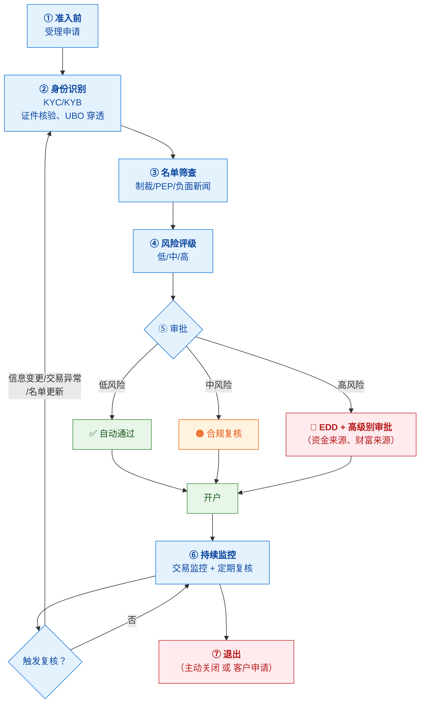
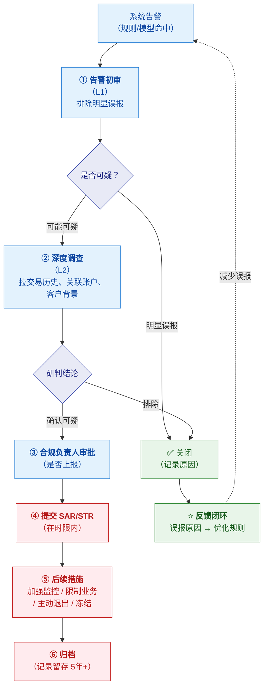
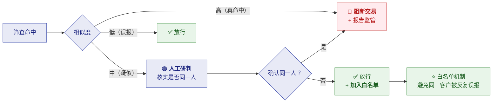
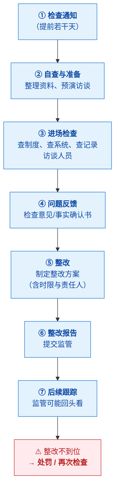
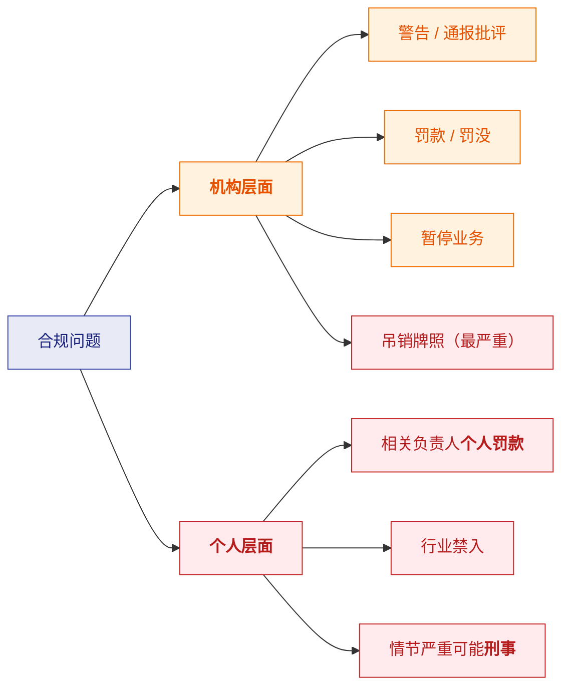

# ⚙️ 七、合规运营实务

> [!abstract] 这一篇解决什么
> [[6-合规总览与工作体系]] 讲合规"是什么、怎么组织"；
> **这一篇讲合规"每天具体在做什么流程"**——
> 客户怎么尽调、可疑交易怎么研判、报告怎么提交、监管来检查怎么应对。
>
> **这是最"接地气"的一篇**：能讲清这些流程，就说明你理解合规怎么落地，
> 而不只是知道几个术语。

---

## 一、客户全生命周期合规（KYC 的完整流程）

### 1.1 五个阶段

> [!important] ⭐ 两个容易被忽略的环节
> **① 持续监控不是一次性的**（第 ⑥ 步）
> KYC 做完不等于结束——**监管要求"持续尽职调查"**：
> - **定期复核**（高风险客户更频繁，如每年）
> - **触发式复核**（客户信息变更、交易异常、名单更新）
> - ⭐ **名单更新后回溯筛查存量客户**
>
> **② 客户退出也是合规动作**（第 ⑦ 步）
> **主动关闭高风险客户**是合规的重要权力——
> 发现客户风险过高，可以**主动退出关系**（而不是等出事）。
> **很多机构有"客户退出决策流程"，需要合规审批。**

### 1.2 尽调要收集什么

| 客户类型 | 基础资料 | 增强资料（EDD） |
|---|---|---|
| **个人（KYC）** | 身份证件、人脸、地址证明 | **资金来源、财富来源、职业、交易目的** |
| **企业（KYB）** | 营业执照、法人证件、**股权结构 → UBO** | **经营实质证明、财务报表、上下游** |

> [!warning] ⚠️ "形式合规"是最大的坑
> **监管处罚里常见的一条是：
> "未按规定开展客户尽职调查" + "为身份不明的客户提供服务"**（见 [[9-合规风险与案例]]）。
>
> **这通常意味着**：
> - **只收了证件复印件，没核验真伪**
> - **只登记了第一个股东，没穿透到 UBO**
> - **明知信息不全，还是开了户**（业务压力）
>
> 👉 **"资料齐了"不等于"尽调做到了"。** 合规检查会看**实质**，不只看**形式**。

---

## 二、交易监控与可疑研判（合规的核心日常）

### 2.1 从告警到上报的完整链路

### 2.2 分级研判（L1 / L2）

> [!important] ⭐ "人工审核"不是一层，是分级的
> | 层级 | 谁 | 做什么 | 要求 |
> |---|---|---|---|
> | **L1 初审** | 运营/初筛人员 | **排除明显误报**（如客户已说明的正常交易） | 快、量大、标准化 |
> | **L2 调查** | 分析师/合规专员 | **深度调查**：拉历史、查关联、看背景 | 需要经验和判断力 |
> | **审批** | **合规负责人** | **决定是否上报** | ⚠️ **要担责** |
>
> **为什么分级**：告警量可能**几千条/天**，而**真正可疑的只有几十条**。
> **如果全让资深分析师看，人力成本无法承受。**
>
> 👉 **这也是"降低误报率"为什么这么重要**——
> **误报率每降低一点，L1 的工作量就少一大块。**

### 2.3 研判看什么（实务要点）

| 维度 | 看什么 |
|---|---|
| **客户画像** | 职业/行业、经营规模、地域 —— 与交易是否匹配 |
| **交易历史** | 这是**突然变化**还是**一直如此** |
| **资金来源** | 钱从哪来（是否与客户身份相符） |
| **资金去向** | 钱去哪（对手方是否可疑） |
| **关联关系** | 是否与已知可疑账户/名单有关联 |
| **行为模式** | 快进快出、拆分、迂回路径 |
| **解释合理性** | 客户能否给出合理解释（**要留证据**） |

> [!success] 研判的核心判断标准（一句话）
> **"这笔交易，对一个'这样的客户'来说，合不合理？"**
>
> - 一个做**大宗贸易**的客户，一天转 500 万——**合理**
> - 一个**普通工薪族**，突然一天转 500 万——**可疑**
>
> 👉 **所以"客户画像"是研判的基础**——
> **没有画像，就没法判断"异常"。**
> 这也是为什么 KYC 的质量直接决定监控的效果。

---

## 三、名单筛查的运营流程

### 3.1 两类筛查场景

| 场景 | 时机 | 说明 |
|---|---|---|
| **实时筛查** | 每笔交易/每次开户 | 对**对手方**做筛查 |
| **批量回溯筛查** | 名单更新后 | ⭐ **对存量客户重新筛查** |

> [!important] ⭐ "回溯筛查"是合规运营的重要工作
> **制裁名单是不断更新的**（每天都有新增）。
> **所以不能只在开户时筛一次**——
> **名单更新后，必须把存量客户重新过一遍。**
>
> **这是一个典型的批量任务**，也是研发要支持的：
> - 定时跑（如每日名单更新后）
> - 处理量大（存量客户可能几十万）
> - **命中后要生成待处理任务**

### 3.2 命中之后怎么办

> [!tip] 白名单机制的必要性
> **没有白名单，一个"名字碰巧和制裁对象相似"的客户会每天被拦**——
> 客户体验极差，合规团队也被重复劳动淹没。
>
> **所以"确认为误报"后要标记**，下次命中直接放行（**但保留记录**）。
> ⚠️ **注意**：白名单要**定期复核**（因为客户的关联关系可能变化）。

---

## 四、监管报送

### 4.1 报送类型与要求

| 类型 | 内容 | 触发 | 时限 |
|---|---|---|---|
| **SAR / STR** | 可疑活动/交易 | **发现可疑** | 通常**若干工作日** |
| **CTR / 大额报告** | 达阈值的大额交易 | 达标即报 | 按监管规定 |
| **定期报表** | 业务数据、合规情况 | 月度/季度/年度 | 固定 deadline |
| **专项报告** | 重大事件、整改情况 | 事件驱动 | 按监管要求 |

### 4.2 报送的四个硬要求

> [!danger] ⭐ 任何一条做不到，都是合规缺陷
> | 要求 | 含义 | 系统影响 |
> |---|---|---|
> | **及时性** | **有时限**，超期即违规 | 需要 **deadline 监控与提醒** |
> | **准确性** | 数据必须准确 | 需要**数据校验** |
> | **完整性** | 该报的都要报（不能漏） | 需要**漏报检测** |
> | ⚠️ **保密性** | **不能告知客户被上报** | ⭐ **系统里"已上报"状态不能对客户可见** |
>
> 👉 **保密性这条最容易出技术事故**：
> 如果系统把"已上报"状态显示在客户可见的界面/通知里，就是**违规**（打草惊蛇）。

### 4.3 报送之后的跟进

| 动作 | 说明 |
|---|---|
| **监管反馈处理** | 监管可能要求补充材料 |
| **持续监控** | 上报后该客户进入**加强监控** |
| **后续措施** | 限制业务、主动退出、必要时冻结 |
| **记录留存** | 全部过程留档（可能数年后还被检查） |

---

## 五、监管检查（⭐ 合规的"大考"）

### 5.1 两种监管方式

| 方式 | 说明 | 特点 |
|---|---|---|
| **非现场监管** | 报送数据、报表分析、问询 | 常态化，靠**数据**发现问题 |
| **现场检查** | 监管进场实地检查 | ⭐ **压力最大**，直接查资料、访谈 |

### 5.2 现场检查的典型流程

### 5.3 检查会看什么（重点清单）

> [!important] ⭐ 这份清单很有用——它告诉你合规体系要准备什么

| 检查维度 | 具体看什么 |
|---|---|
| **治理** | 合规负责人是否**独立**？汇报线？董事会是否知情？ |
| **人员** | ⭐ **是否按业务规模和风险配备了足够人员**（常见处罚点） |
| **制度** | 政策文件是否齐全、是否更新、员工是否知悉 |
| **客户尽调** | 抽样看 KYC 档案：**是否真实、完整、有穿透 UBO** |
| **高风险客户** | 是否识别、是否做了 EDD、是否定期复核 |
| **交易监控** | 监控标准是否制定、**是否覆盖全业务** |
| **可疑上报** | ⭐ **是否漏报**（对比交易数据反查）、上报质量 |
| **名单筛查** | 是否实时筛、**名单更新后是否回溯** |
| **记录留存** | 能否**快速调取历史记录**（含决策依据） |
| **培训** | 是否有培训记录、频次、覆盖率 |
| **外包管理** | 外包服务商是否尽调、**核心业务是否违规外包** |

> [!success] 从研发视角看这份清单
> **其中有三项直接依赖系统能力**：
> - **可疑上报**：要能**反查"有没有漏报"** → 需要完整的决策日志
> - **记录留存**：要能**快速调取历史决策及依据** → 需要可追溯的设计
> - **交易监控覆盖**：要能证明**所有业务都纳入监控** → 需要覆盖度统计
>
> 👉 **这就是为什么"可追溯"是研发对合规最核心的贡献。**

---

## 六、整改与问责

### 6.1 整改的标准动作

| 步骤 | 说明 |
|---|---|
| **问题确认** | 与监管确认问题事实（事实确认书） |
| **根因分析** | ⭐ **不能只改表面**——要问"为什么会发生" |
| **整改方案** | 明确措施、**责任人、时限** |
| **落实整改** | 改制度、改系统、改流程、**补人员** |
| **验证** | 自查是否真的改好 |
| **报告** | 向监管提交整改报告 |
| **长效机制** | ⭐ **防止复发**（不只是这一次改掉） |

> [!warning] ⚠️ "整改流于形式"是最常见的失败
> 从处罚案例看，**多次被罚的机构**往往是：
> **"合规体系建设和人员配置一直未能跟上业务扩张的节奏，
> 多项基础合规制度执行流于形式"**（见 [[9-合规风险与案例]]）。
>
> **典型表现**：
> - **改了制度文件，但没改实际流程**
> - **系统上线了，但没人用/没人看告警**
> - **补了人，但没给权限和独立性**
>
> 👉 **真正的整改要落在"人、系统、流程"三件事上，缺一不可。**

### 6.2 问责机制

> [!danger] ⭐ "双罚制"是当前监管的明确趋势
> **不只是罚机构，还要罚人。**
> - 常见表述："**时任 XX 负责人，对相关违规行为负有直接责任，被罚款 X 万元**"
> - 理由包括：**"未按洗钱风险足额配备合规人员"**、未有效开展尽调、未及时上报
>
> **含义**：
> 1. **合规负责人不是挂名**——签字要担责
> 2. **"资源不够"不是免责理由**——⭐ **没配够人本身就是违规**
> 3. **这条对研发也相关**：如果系统不支持某合规动作，
>    **要有书面记录说明"已提出需求但资源未到位"**

---

## 七、合规科技（RegTech）

### 7.1 系统支撑什么

| 环节 | 系统能力 |
|---|---|
| **客户准入** | 证件 OCR、人脸核验、UBO 穿透、多头查询 |
| **名单筛查** | 模糊匹配引擎、名单自动更新、**回溯批量任务** |
| **交易监控** | 规则引擎、模型评分、实时决策 |
| **可疑研判** | **案件管理**、关联分析、证据留存 |
| **上报** | 报表生成、**时限管理**、报送留痕 |
| **记录留存** | 决策快照、**可检索**、不可篡改 |
| **监管对接** | 数据报送接口、检查资料快速调取 |

### 7.2 研发要理解的三条底线

> [!important] ⭐ 做合规系统，这三条比性能更重要
> | 底线 | 含义 | 为什么 |
> |---|---|---|
> | **① 可追溯** | 每次决策留全量快照 | **监管要能问"当时为什么"** |
> | **② 不丢失** | 记录不能丢、不能被改 | **存证价值** |
> | **③ 可快速调取** | 检查时能立刻查出来 | **现场检查要求响应快** |
>
> ⚠️ **常见错误**：只关注"系统跑得快不快"，
> **却把决策日志写成了采样/异步丢弃** → 检查时调不出证据 → **合规缺陷**。
>
> 👉 **合规系统的第一优先级是"留得下、找得到"，不是"跑得快"。**

---

## 八、30 秒速查表

| 问题 | 一句话答案 |
|---|---|
| 客户合规的完整流程 | **受理 → 身份识别 → 名单筛查 → 风险评级 → 审批 → 持续监控 → 退出** |
| 两个容易忽略的环节 | ⭐ **持续监控**（不是一次性）+ **客户退出**（合规有权主动关闭） |
| 什么是"形式合规" | 只收证件不核验、只登记首层股东不穿透 UBO、明知不全还开户 → ⚠️ **常见处罚点** |
| 可疑交易的处理链路 | **告警 → L1 初审 → L2 调查 → 合规审批 → 上报 → 后续措施 → 归档** |
| 为什么要分级研判 | 告警可能**几千条/天**，真可疑只有几十条 → **全给资深分析师成本不可承受** |
| 研判的核心标准 | **"这笔交易对'这样的客户'来说合不合理？"** |
| 为什么客户画像是基础 | **没有画像就无法判断"异常"** → KYC 质量决定监控效果 |
| 名单筛查两类场景 | **实时筛查**（每笔/开户）+ **批量回溯**（名单更新后对存量客户） |
| 为什么要回溯筛查 | 制裁名单**每天更新**，只在开户筛一次会漏 |
| 白名单机制为什么必要 | 避免同一客户因名字相似被**反复误报**；⚠️ 但要定期复核 |
| 报送的四个硬要求 | **及时、准确、完整、保密** |
| ⚠️ 保密性的技术含义 | **"已上报"状态不能对客户可见**（否则打草惊蛇 = 违规） |
| 两种监管方式 | **非现场**（报表分析）+ **现场检查**（压力最大） |
| 现场检查流程 | **通知 → 自查 → 进场 → 问题反馈 → 整改 → 整改报告 → 跟踪** |
| 检查重点看什么 | ⭐ **治理独立性、人员配备、尽调质量、是否漏报、记录能否调取、外包管理** |
| 哪些检查项依赖系统 | ⭐ **可疑上报（反查漏报）、记录留存（快速调取）、监控覆盖度** |
| 整改要落在哪三件事 | **人、系统、流程**——缺一不可 |
| ⚠️ 整改最常见的失败 | **流于形式**：改了文件没改流程、系统上线没人用、补人没给权限 |
| 问责的两层 | **机构**（警告/罚款/停业/吊照）+ **个人**（罚款/禁入/刑事） |
| "双罚制"意味着什么 | ⭐ **合规负责人签字要担责**；**"没配够人"本身就是违规** |
| 合规系统的三条底线 | ⭐ **可追溯、不丢失、可快速调取**（比性能更重要） |
| 常见技术错误 | 把决策日志做成采样/异步丢弃 → **检查时调不出证据** |

---

## 九、学习检查清单

- [ ] ⭐ 能完整讲出**客户合规的七个阶段**，并指出易忽略的环节
- [ ] ⭐ 能说清什么是"**形式合规**"，并举出三个典型表现
- [ ] ⭐ 能完整讲出**从告警到上报的链路**（含 L1/L2 分级）
- [ ] 能解释**为什么要分级研判**（成本与量级）
- [ ] ⭐ 能说出**研判的核心判断标准**，并解释客户画像为什么是基础
- [ ] 能说清名单筛查的**两类场景**，并解释**回溯筛查**的必要性
- [ ] 能说清**白名单机制**的作用与风险
- [ ] ⭐ 能说出报送的**四个硬要求**，尤其是**保密性的技术含义**
- [ ] 能区分**非现场监管与现场检查**
- [ ] ⭐ 能复述**现场检查的完整流程**
- [ ] ⭐ 能列出**检查重点清单**，并指出**哪些依赖系统能力**
- [ ] 能说清**整改的七个步骤**，以及"要落在人/系统/流程三件事上"
- [ ] ⚠️ 能说出"**整改流于形式**"的三种典型表现
- [ ] 能说清**问责的两个层面**，以及"**双罚制**"的含义
- [ ] ⭐ 能说出**合规系统的三条底线**（可追溯/不丢失/可调取）
- [ ] ⚠️ 能说出**常见的合规系统技术错误**（日志采样丢弃）

---
> 上一篇 → [[6-合规总览与工作体系]] ｜ 下一篇 → [[8-牌照与准入]] ｜ 相关 → [[5-风控体系与合规框架]]
