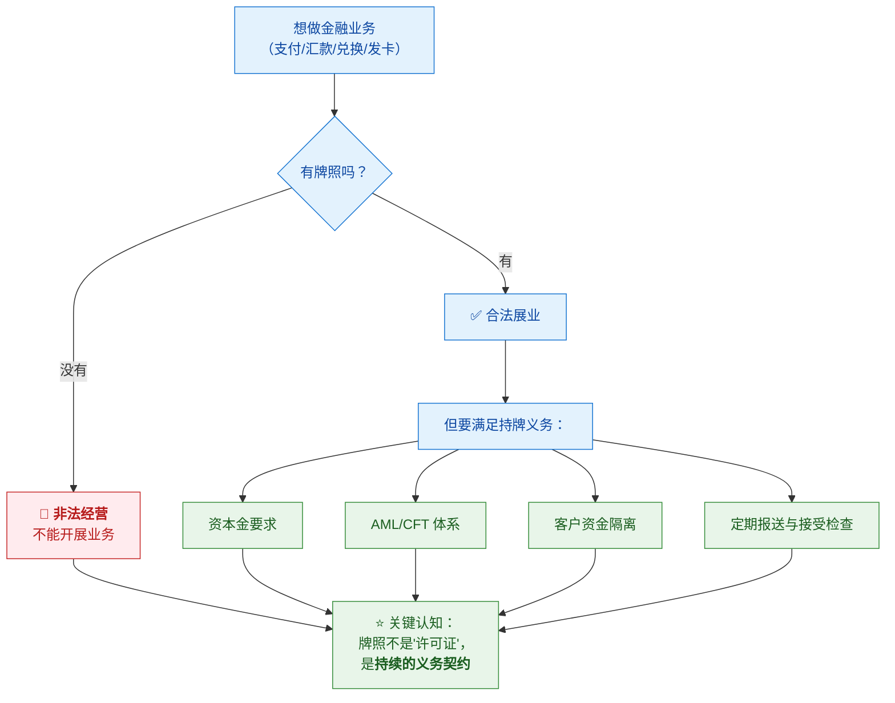
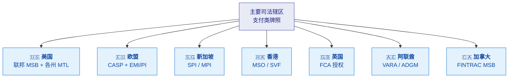
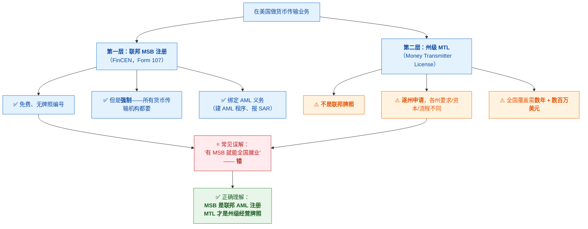
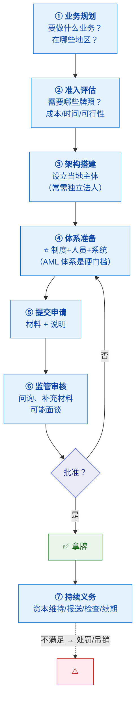
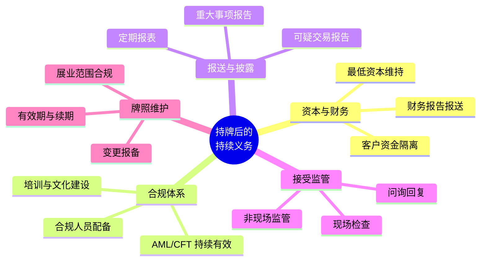

# 🎫 八、牌照与准入

> [!abstract] 这一篇解决什么
> **牌照是金融业务的"入场券"**——没有它，业务根本不能合法开展。
> 这一篇讲清：**有哪些牌照、各自要求什么、怎么申请、拿到后怎么维护**。
>
> **对跨境支付/金融科技行业尤其重要**——因为一家公司往往**要多地持牌**，
> 牌照结构直接决定了**公司架构、成本、和业务能覆盖的地区**。
> 前置见 [[6-合规总览与工作体系]]；监管与处罚见 [[9-合规风险与案例]]。

---

## 一、为什么牌照是"入场券"

> [!important] ⭐ 先理解这件事的分量

> [!important] ⭐ 核心认知：牌照是"持续的义务"，不是"一次性的许可"
> **拿到牌照只是开始**——之后要持续满足：
> - 资本金不能低于要求
> - AML 体系要持续有效（要接受检查）
> - 要定期报送
> - **出问题会被罚、被停业、甚至被吊销**
>
> 👉 **这就是为什么"合规"是持牌公司的生存必需品，而不是可选项。**

### 1.1 先区分两类牌照（⭐ 最容易搞混）

> [!danger] ⚠️ 这两类牌照完全不同，很多人混为一谈

| | **支付/转账牌照** | **发行牌照** |
|---|---|---|
| **给谁** | **用**现有货币做收付、结算的公司 | **发行**自己货币/稳定币的公司 |
| **典型** | 美国各州 **MTL**、新加坡 **MPI**、香港 **MSO**、欧盟 **EMI/PI** | 美国 **GENIUS 法案/OCC 特许**、欧盟 **MiCA 的 EMT** |
| **核心要求** | **资本充足、AML/CFT、客户资金隔离** | **全额储备、可赎回、储备披露** |
| **谁需要** | ⭐ **绝大多数支付公司**（用 USDC/USDT 或法币收付） | 只有想自己发币的 |

> [!success] 一句话记牢
> **"用别人的钱做支付 → 要支付牌照；自己发币 → 要发行牌照。**
> **大多数支付公司只需要前者。"**

---

## 二、主要司法辖区的牌照全景

### 2.1 全球速览

| 辖区 | 主要牌照 | 门槛 / 要点 |
|---|---|---|
| **美国** | **联邦 MSB 注册 + 各州 MTL** | MSB 免费但是 **AML 注册**（不是牌照）；**MTL 逐州申请**，全国覆盖需**数年 + 数百万美元** |
| **欧盟** | **CASP**（加密服务）+ **EMI/PI**（支付） | ⭐ **通常需要两张**——CASP 覆盖加密服务，EMI/PI 覆盖法币端 |
| **新加坡** | **SPI / MPI**（PSA 下的 DPT 服务） | SPI 资本 **10 万新币**（月交易 ≤300 万）；MPI **25 万新币**；审批 **9-18 个月**；MPI 须**隔离客户资产、约 90% 冷钱包** |
| **香港** | **MSO**（兑换/汇款）/ **SVF**（储值） | MSO **无最低资本**、由海关监管；**SVF 需 2500 万港币**（持有客户余额可能触发） |
| **英国** | **FCA 授权** | 2026 年纳入监管，申请窗口 2026.9-2027.2，规则 2027.10 生效；⚠️ **原 MLR 注册不自动转换** |
| **阿联酋** | **VARA**（迪拜）/ **ADGM**（阿布扎比） | VARA 发 8 类活动牌照；ADGM 要求**每类牌照独立实体** |
| **加拿大** | **FINTRAC MSB** | 注册制，与 AML 义务绑定 |

> [!note] 来源
> 牌照细节主要参考 [BlockSec：全球加密支付牌照地图](https://blocksec.com/zh-hant/blog/crypto-payment-license-map)。
> ⚠️ **监管变化极快**（如 MiCA 过渡期、英国新规），
> **任何具体数字都要以最新官方信息为准**。

### 2.2 美国：两层结构（最容易搞混）

> [!important] ⭐ MSB 和 MTL 是两回事

> [!warning] ⚠️ 一个高频错误认知
> **"我们有美国 MSB 牌照"** 这句话**本身就不准确**——
> MSB 是**注册**（Registration），不是**牌照**（License），且**没有牌照编号**。
> 它**不能让你在各州合法经营**（那需要 MTL）。
>
> **正确说法**："我们在 FinCEN 注册为 MSB，并在 X 个州持有 MTL。"
>
> 👉 **能被面试官/合作方一眼看出专业度的地方。**

### 2.3 牌照组合的实际情况

> [!note] 全球化运营 = 多张牌照的组合，而不是"一张主牌照"

| 公司 | 牌照组合（示例） |
|---|---|
| **Circle** | 美国 46 州 MTL + FinCEN 注册 + OCC 特许 + 多国 EMI |
| **BVNK** | 英国 EMI + 马耳他 EMI + 美国 MTL + 特拉华注册 |
| **MoonPay** | 英国 + 爱尔兰 + 意大利 + 荷兰实体 |
| **Ripple / Bridge / Circle**（稳定币支付） | ⭐ **CASP（加密服务）+ EMI/PI（法币与发行）双牌照架构** |

> [!important] ⭐ 为什么稳定币支付需要"双牌照"
> **欧盟 EBA 明确**：处理 **EMT（单法币挂钩稳定币）转账**的公司，
> **通常还需要 PSD2 下的 PI 或 EMI 牌照**。
>
> **原因**：技术上是"加密转账"，但**业务实质是"支付"**——
> 监管看**实质**，不看技术标签。
>
> 👉 **这是"业务实质决定牌照"的典型例子**，
> 也是为什么合规团队要**提前介入产品设计**（做产品合规评审）。

---

## 三、牌照申请：怎么拿

### 3.1 申请流程

### 3.2 申请的核心门槛

| 门槛 | 说明 | 谁来准备 |
|---|---|---|
| **资本金** | 各辖区要求不同（如新加坡 MPI 25 万新币、香港 SVF 2500 万港币） | 财务 + 股东 |
| **主体** | 常需**在当地设立独立法人**（如阿联酋 ADGM 每类牌照独立实体） | 法务 |
| ⭐ **AML/CFT 体系** | **制度 + 人员 + 系统**三者齐备 | **合规 + 风控 + 研发** |
| **合规负责人** | 通常要求**常驻/有资质** | HR + 合规 |
| **客户资金隔离** | 客户资金与自有资金分离、信托持有 | 财务 + 系统 |
| **业务连续性** | 灾备、应急方案 | 技术 |
| **股东与高管适格** | 背景审查（无重大违规） | 法务 |

> [!important] ⭐ 为什么"AML 体系"是硬门槛
> **因为监管的逻辑是**：
> **"你要处理别人的钱，必须证明你不会让这些钱被用于洗钱/恐怖融资。"**
>
> **而这需要三样东西同时具备：**
> | 要素 | 缺了会怎样 |
> |---|---|
> | **制度**（政策文件） | 监管认为你"没有体系" |
> | **人员**（合规团队） | ⭐ **常见处罚点**："未按风险配备人员" |
> | **系统**（监控、筛查、留痕） | 无法证明"能有效执行" |
>
> 👉 **这三样缺一不可，而"系统"正是研发的贡献点。**

### 3.3 申请的周期与成本

> [!warning] ⚠️ 拿到牌照是"以年计、以百万计"的事
> | 项 | 现实情况 |
> |---|---|
> | **时间** | 新加坡 DPT 牌照 **9-18 个月**；美国全国 MTL 覆盖**数年** |
> | **成本** | 美国全国覆盖**数百万美元**；多地牌照合计成本极高 |
> | **成功率** | 不是申请就能批——材料不足会被反复问询甚至拒绝 |
>
> **这解释了为什么**：
> - 融资常**专项用于牌照申请**（如某公司 B 轮明确用于"全球重要牌照的申请和获取"）
> - **牌照本身是公司的核心资产**（比技术更难复制）

---

## 四、持牌后的持续义务

### 4.1 五类持续义务

| 义务 | 具体要求 | 违反后果 |
|---|---|---|
| **资本维持** | 不低于最低要求；客户资金隔离 | 罚款、限制业务 |
| **合规体系** | ⭐ **人员配备要匹配业务规模与风险** | **常见罚款点 + 个人问责** |
| **报送** | 及时、准确、完整 | 罚款 |
| **接受监管** | 配合检查、如实提供资料 | 罚款、加重处罚 |
| **牌照维护** | 按时续期；**展业范围不超牌照** | 停业、吊销 |

> [!danger] ⚠️ 最容易出事的两个点
> **① "人员配备不足"**
> 业务扩张快，但**合规人员没跟上** → 监管认定违规。
> 处罚原文常写：**"未按照规定根据经营规模和洗钱风险状况配备相应人员"**。
>
> **② "超范围展业"**
> 拿了 A 牌照，做了 B 牌照才能做的事（如只有兑换牌照却做了储值）。
> **很多地方"持有客户余额"就会触发更高门槛的牌照要求。**
>
> 👉 **这两个点说明**：**牌照合规是"动态"的**——
> 业务变了、规模变了，**牌照和人员配置都要跟着变。**

### 4.2 展业范围：一个常见的踩坑

> [!warning] ⚠️ "我有牌照" ≠ "什么都能做"
> **牌照是分业务活动的**：
> - **香港**：**MSO** 管**兑换与汇款**；**SVF** 管**储值/电子钱包**（需 2500 万港币）
>   → ⭐ **持有客户资金余额可能触发 SVF 要求**
> - **阿联酋 VARA**：发 **8 类活动牌照**（咨询/经纪/托管/交易所/借贷/管理投资/转账结算/发行）
>   → **做哪类就要拿哪类**
>
> **所以产品设计时必须问**：
> **"这个新功能，会不会让我们需要新的牌照？"**
> —— 这就是**产品合规评审**的价值。

---

## 五、对技术人的意义

> [!success] 为什么要懂牌照

| 场景 | 为什么需要懂 |
|---|---|
| **面试金融科技岗位** | 能说清"公司持什么牌照、意味着什么合规义务" → **显专业** |
| **做合规相关系统** | 系统要支撑**报送、留痕、检查**等持牌义务 |
| **评估公司** | ⭐ **牌照结构决定公司实力与风险**（自有牌照 vs 依赖合作方） |
| **产品设计** | 新功能可能触发**新牌照要求** → 要提前评估 |

> [!important] ⭐ 一个实用的尽调视角
> **看一家金融科技公司的牌照，能读出三件事：**
> | 看什么 | 能读出 |
> |---|---|
> | **有哪些牌照** | 能做什么业务、能覆盖哪些地区 |
> | **牌照在哪个主体** | ⭐ 价值/风险在境内还是境外 |
> | **是自有还是依赖合作** | **不持牌、依赖合作方的，业务稳定性弱** |
>
> ⚠️ **特别提醒**：如果一家公司的**业务主体在境内、牌照在境外**，
> 要关注**合同主体、资金路径、以及境内合规风险**。

---

## 六、30 秒速查表

| 问题 | 一句话答案 |
|---|---|
| 牌照为什么是入场券 | **没有牌照 = 业务根本不能合法开展**（0 和 1 的区别） |
| ⭐ 牌照的本质 | **不是"一次性许可"，是"持续的义务契约"** |
| 两类牌照怎么分 | **支付/转账牌照**（用现有钱做收付）vs **发行牌照**（自己发币） |
| 大多数支付公司需要哪种 | ⭐ **支付/转账牌照**（用 USDC/USDT 或法币做收付） |
| 美国两层结构 | **联邦 MSB 注册 + 各州 MTL** |
| ⚠️ MSB 是牌照吗 | ❌ **是注册**，免费、无编号、**不能让你在各州经营** |
| MSB 的作用 | **绑定 AML 义务**（建 AML 程序、报 SAR） |
| 美国全国覆盖成本 | **逐州申请，数年 + 数百万美元** |
| 欧盟要几张 | ⭐ **常需两张**：CASP（加密服务）+ EMI/PI（法币端） |
| 新加坡牌照 | **SPI**（10 万新币）/ **MPI**（25 万新币，须隔离资产、~90% 冷钱包） |
| 新加坡审批周期 | **9-18 个月** |
| 香港牌照 | **MSO**（兑换/汇款，无最低资本）/ **SVF**（储值，2500 万港币） |
| ⚠️ 什么会触发 SVF | **持有客户资金余额**（包括稳定币钱包） |
| 英国牌照 | **FCA 授权**；⚠️ **原 MLR 注册不自动转换** |
| 阿联酋 | **VARA**（8 类活动牌照）/ **ADGM**（每类独立实体） |
| 为什么稳定币支付要双牌照 | 技术是"加密转账"，**业务实质是"支付"** → 监管看实质 |
| 申请的核心门槛 | **资本 + 主体 + AML 体系（制度/人员/系统）+ 资金隔离** |
| ⭐ 为什么 AML 体系是硬门槛 | 监管逻辑："你处理别人的钱，必须证明不会用于洗钱" |
| AML 体系的三要素 | **制度 + 人员 + 系统**——⚠️ **缺一不可** |
| 申请周期 | 新加坡 9-18 个月；美国全国 MTL 数年 |
| 持牌后的五类义务 | **资本 / 合规体系 / 报送 / 接受监管 / 牌照维护** |
| ⚠️ 最容易出事的点 | ① **人员配备不足**（常见罚款+个人问责）② **超范围展业** |
| 为什么"人员配备"是动态的 | 业务和规模变了，**牌照和人员配置都要跟着变** |
| 看公司牌照能读出什么 | **能做什么、价值在哪个主体、是自有还是依赖合作** |

---

## 七、学习检查清单

- [ ] ⭐ 能说清为什么牌照是"入场券"，以及**"持续义务"**的含义
- [ ] ⭐ 能区分**支付/转账牌照与发行牌照**，并说明大多数支付公司需要哪种
- [ ] 能说清**美国的两层结构**（MSB vs MTL），并纠正"MSB 是牌照"这个误解
- [ ] 能解释 **MSB 的作用**（绑定 AML 义务）
- [ ] ⭐ 能说清**欧盟为什么常需要两张牌照**（CASP + EMI/PI）
- [ ] 能说出**新加坡 SPI/MPI** 的资本门槛与周期
- [ ] ⭐ 能说清**香港 MSO 与 SVF 的区别**，以及什么会触发 SVF
- [ ] 能说出**英国、阿联酋、加拿大**的牌照类型
- [ ] ⭐ 能解释**为什么稳定币支付需要"双牌照"**（业务实质决定牌照）
- [ ] 能复述**牌照申请的流程**
- [ ] ⭐ 能说出**申请的核心门槛**，并解释**为什么 AML 体系是硬门槛**
- [ ] ⭐ 能说清 **AML 体系的三要素**（制度/人员/系统）及各自缺失的后果
- [ ] 能说出申请的**现实周期与成本**
- [ ] 能列出**持牌后的五类持续义务**
- [ ] ⚠️ 能说出**最容易出事的两个点**（人员配备不足、超范围展业）
- [ ] 能解释**为什么"牌照合规是动态的"**
- [ ] ⭐ 能用**牌照视角**做公司尽调（有哪些牌、在哪个主体、自有还是依赖合作）

---
> 上一篇 → [[7-合规运营实务]] ｜ 下一篇 → [[9-合规风险与案例]] ｜ 相关 → [[5-风控体系与合规框架]]
