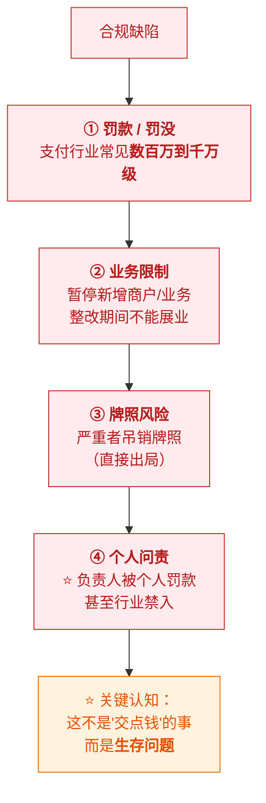
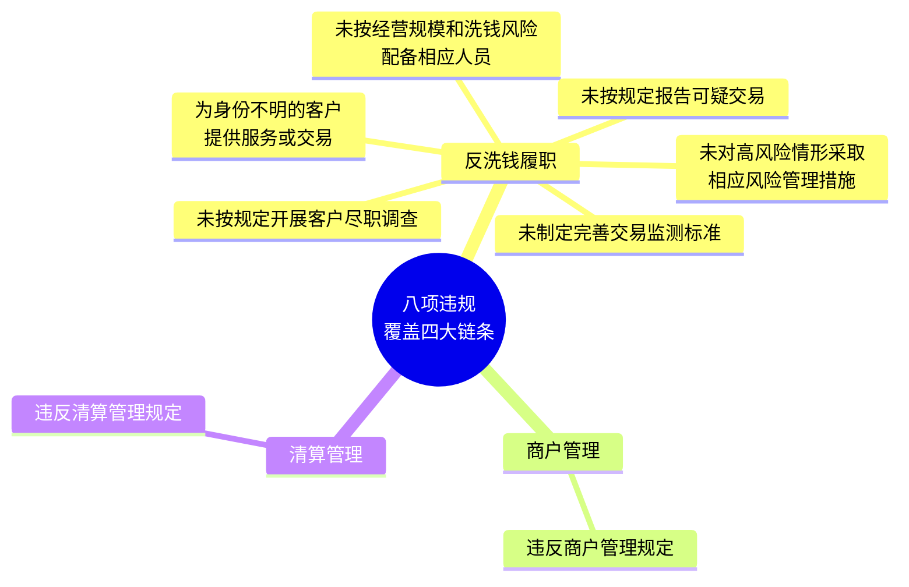
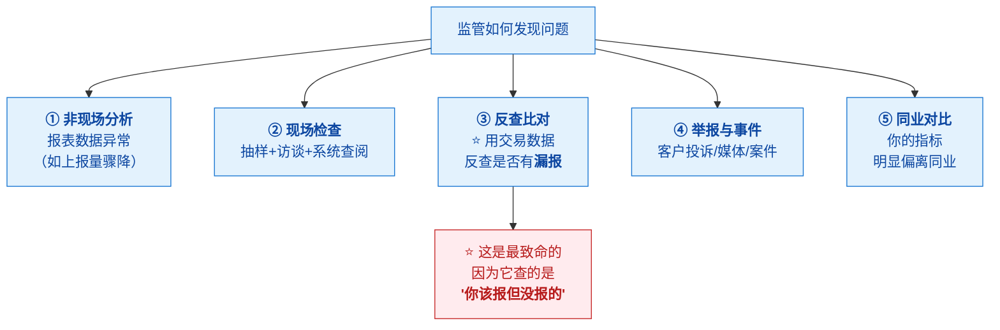
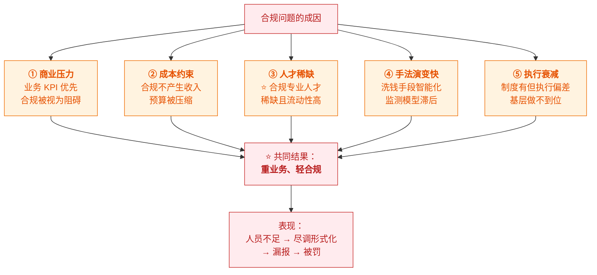

# ⚠️ 九、合规风险与案例

> [!abstract] 这一篇解决什么
> 前面几篇讲"合规该怎么做"；**这一篇讲"做不好会怎样"**——
> 真实的处罚是什么样、常见的违规点在哪、监管怎么发现问题。
>
> **为什么要看案例**：因为**处罚案例就是监管的"评分标准"**——
> 它明确告诉你监管在意什么、会查什么。
> 前置见 [[7-合规运营实务]]（检查与整改）；[[8-牌照与准入]]（持牌义务）。

---

## 一、合规出事的代价（四层递进）

> [!danger] ⭐ "双罚制"是当前明确的监管导向
> **不只罚机构，还要罚人。**
> 处罚公告里常见句式：
> **"时任 XX 负责人，对相关违规行为负有直接责任，被罚款 X 万元"**
>
> **这意味着**：
> - **合规负责人 / 业务负责人不是挂名的**——要担个人责任
> - **"资源不足"不是免责理由**——⭐ **没配够人本身就是违规**
>
> 👉 **这也是为什么合规岗位需要有"顶住压力"的能力和授权。**

---

## 二、真实案例：支付机构反洗钱处罚

> [!example] 案例：某支付公司因反洗钱不力等被罚没 843.95 万元
> **来源**：[中国经济网 / 北京商报报道](http://finance1.ce.cn/bank12/scroll/202605/t20260511_2958058.shtml)（2026-05）

### 2.1 处罚内容

| 项 | 内容 |
|---|---|
| **机构处罚** | 警告、通报批评，**罚没合计 843.95 万元** |
| **个人处罚** | 时任相关负责人**个人罚款 5.5 万元**，原因是 **"未按洗钱风险足额配备合规人员"负有直接责任** |
| **违规行为** | **八项**，覆盖反洗钱、客户管理、交易监测、商户及清算 |

### 2.2 八项违规（⭐ 这是"合规检查清单"的反面）

| # | 违规行为 | 对应本篇哪里 |
|---|---|---|
| 1 | ⭐ **未按经营规模和洗钱风险配备相应人员** | [[6-合规总览与工作体系]]（人员是法定义务） |
| 2 | **未按规定开展客户尽职调查** | [[7-合规运营实务]]（KYC 流程） |
| 3 | **未对高风险情形采取相应风险管理措施** | [[5-风控体系与合规框架]]（EDD） |
| 4 | **未按规定报告可疑交易** | [[7-合规运营实务]]（上报） |
| 5 | ⭐ **为身份不明的客户提供服务、与其交易** | [[7-合规运营实务]]（形式合规的后果） |
| 6 | **未按规定制定、完善交易监测标准** | [[4-如何制定风控策略]]（监控规则） |
| 7 | **违反商户管理规定** | —— |
| 8 | **违反清算管理规定** | —— |

### 2.3 从案例中提炼的规律

> [!important] ⭐ 专家分析指出的根因（很有价值）
> | 根因 | 说明 |
> |---|---|
> | **合规未跟上扩张节奏** | ⭐ "**重业务轻合规**"——业务扩张快，合规体系与人员配置没跟上 |
> | **制度执行流于形式** | ⭐ "多项基础合规制度**执行流于形式**" |
> | **组织顶层设计问题** | 未按规模配备合规人员 → **导致后续尽调、上报都做不好** |
> | **反复被罚** | "一般来讲，一个机构**多次被罚**是长期重业务轻合规的体现" |
>
> **⭐ 最关键的一条洞察**：
> **"未配备合规人员"是"因"，后面那些违规是"果"**——
> **人不够 → 尽调做不细 → 高风险客户管不住 → 可疑交易报不出来。**
>
> 👉 **这印证了 [[6-合规总览与工作体系]] 里的观点**：
> **合规的第一投入是"人"，不是"系统"。**

### 2.4 行业共性难点（专家总结）

| 难点 | 说明 |
|---|---|
| **合规投入 vs 短期收益的平衡** | ⭐ "如何**抑制住业务的短视行为**是难点" |
| **交易场景复杂化** | **监测模型更新存在滞后性** |
| **基层执行偏差** | **全流程闭环管理难度大** |
| ⭐ **外包管理** | "很多收单机构日常**大量使用外包机构，如何管理是个难题**" |

> [!danger] ⚠️ "严禁核心业务外包"
> 专家明确指出：**要"严禁核心业务外包"**。
> **反洗钱、客户尽调这类核心合规职能，外包出去是重大风险点**
> （资质审核不严、核心业务违规外包）。
>
> 👉 **这一点对理解"合规不能省"很重要**——
> **你可以买系统、买数据、买服务，但不能把责任外包出去。**

---

## 三、常见合规风险点（分类清单）

### 3.1 按环节分

```mermaid
flowchart TB
  subgraph R1["准入环节"]
    direction TB
    A1["虚假/空壳商户准入"]
    A2["KYC 形式化<br/>（只收证件不核验）"]
    A3["UBO 未穿透"]
  end
  subgraph R2["监控环节"]
    direction TB
    B1["监测标准不完善<br/>（覆盖不全）"]
    B2["规则长期不更新<br/>（手法变了规则没变）"]
    B3["告警无人处理<br/>（有系统没人看）"]
  end
  subgraph R3["处置环节"]
    direction TB
    C1["⭐ <b>可疑交易漏报</b>"]
    C2["上报不及时"]
    C3["高风险客户未采取管控"]
  end
  subgraph R4["管理环节"]
    direction TB
    D1["⭐ <b>合规人员配备不足</b>"]
    D2["合规不独立"]
    D3["外包管理失控"]
    D4["记录留存不全<br/>（检查时调不出）"]
  end
  classDef r fill:#ffebee,stroke:#c62828,color:#b71c1c
  class A1,A2,A3,B1,B2,B3,C1,C2,C3,D1,D2,D3,D4 r
```

### 3.2 高频风险点排行（按处罚出现频率）

| 排名 | 风险点 | 为什么高频 |
|---|---|---|
| 🥇 | **客户尽职调查不到位** | 业务压力下"先开户再说" |
| 🥇 | **可疑交易漏报/未报** | 需要人+系统，最容易做不好 |
| 🥈 | **未按风险配备合规人员** | ⭐ **成本问题**——合规不产生收入 |
| 🥈 | **商户管理违规** | 收单业务的通病（虚假商户、信息更新不及时） |
| 🥉 | **交易监测标准不完善** | 手法变化快，规则更新滞后 |
| 🥉 | **为身份不明客户提供服务** | 尽调形式化的直接后果 |
| 🥉 | **清算管理违规** | 资金清算合规要求 |
| —— | **外包管理问题** | 资质审核不严、核心业务违规外包 |

> [!warning] ⭐ 这些风险点的共同根因
> **几乎都能追溯到同一句话："重业务、轻合规"。**
> - 业务要快 → KYC 简化 → 尽调不到位
> - 合规是成本 → 人员不配够 → 没人做尽调和研判
> - 系统上线了 → 但没人运营 → 告警堆积、漏报
>
> 👉 **所以合规风险的本质往往不是"技术问题"，而是"治理问题"。**

---

## 四、监管怎么发现问题（检查视角）

> [!important] ⭐ 理解检查方法，才知道该准备什么

### 4.1 ⭐ "反查漏报"是最需要防范的

> [!danger] 监管会这样查
> **拿出你的交易数据，按可疑特征筛一遍，
> 然后对比"你报了多少"——差额就是漏报。**
>
> **为什么致命**：
> - **漏报本身就是违规**（"未按规定报告可疑交易"）
> - 而且**数量一算就出来**，无法辩解
>
> **怎么防**：
> - **监控标准要覆盖全业务**（不能有盲区）
> - **告警必须有人处理**（有系统没人看 = 没做）
> - ⭐ **保留完整的决策记录**——能证明"这笔我们评估过，认为不可疑"
>
> 👉 **这就是"决策留痕"的实战价值**：
> **它不只是为了复盘，而是为了在检查时能自证已尽职。**

### 4.2 检查时最容易被抓的细节

| 细节 | 监管怎么发现 |
|---|---|
| **客户档案不全** | 抽样调档 → 发现缺 UBO、缺资金来源 |
| ⭐ **记录调不出来** | 要历史某笔的决策依据 → **系统查不到 = 缺陷** |
| **名单更新后未回溯** | 查名单更新记录 vs 存量客户筛查记录 |
| **告警堆积未处理** | 查系统的告警队列 → 大量积压 |
| **合规汇报线不独立** | 查组织架构与会议记录 |
| **培训无记录** | 要培训记录 → 拿不出来 |
| **外包商未做尽调** | 要外包商资质审核材料 |

> [!success] 从这张表能反推研发该做什么
> **其中至少三条依赖系统能力：**
> 1. ⭐ **决策记录可快速调取**（不是"存在数据库里"，而是"检查时几分钟内能查出来"）
> 2. ⭐ **告警处理状态可追踪**（有没有积压、处理时长）
> 3. ⭐ **名单回溯筛查的执行记录**（证明做过）
>
> **所以合规系统的设计目标应该是"可自证"，而不只是"能跑通"。**

---

## 五、合规风险的成因分析

### 5.1 为什么会出合规问题

> [!important] ⭐ 一条因果链（案例验证过的）
> **商业压力 + 成本约束 → 合规人员配备不足
> → 尽调做不细 → 高风险客户管不住 → 可疑交易漏报
> → 被监管重罚 + 个人问责**
>
> **注意**：**"人员不足"是起点，不是终点。**
> 很多机构以为"省了人力成本"，结果**付出数倍代价**。

### 5.2 合规人才为什么稀缺

| 原因 | 说明 |
|---|---|
| **要求复合** | 既要懂**监管法规**，又要懂**业务**，还要懂**系统** |
| **经验难速成** | 需要长期积累（不同辖区的监管差异、真实案例） |
| **责任重** | ⭐ **个人要担责**（罚款/禁入）→ 压力大 |
| **流动性高** | ⭐ 优秀合规人才被抢，**机构常面临"人走了体系就散了"** |

> [!warning] ⚠️ "人走了体系就散了"是真实风险
> **如果合规能力只存在于某个人的脑子里**（而不是固化在制度与系统里），
> **这个人一走，就是重大合规风险。**
>
> 👉 **所以"把合规要求固化到系统里"不只是效率问题，
> 更是"降低对个人依赖"的风险管理。**
> **这是研发能为合规做的深层贡献。**

---

## 六、如何评估一家公司的合规健康度

> [!success] ⭐ 一套实用的尽调框架（求职/合作都能用）

| 维度 | 看什么 | 危险信号 |
|---|---|---|
| **牌照** | 有哪些、在哪个主体 | ⚠️ 只有境外牌照但境内展业 |
| **合规组织** | 有无独立合规负责人、汇报线 | ⚠️ 合规挂在业务部门下 |
| **人员配备** | 合规团队规模 vs 业务规模 | ⚠️ **人数极少但业务量大**（法定义务！） |
| **历史处罚** | 有无监管处罚记录、频次 | ⚠️ **多次被罚 = 系统性治理问题** |
| **系统能力** | 有无监控/筛查/留痕系统 | ⚠️ 靠人工表格管合规 |
| **外包依赖** | 核心合规是否外包 | ⚠️ 反洗钱/尽调外包 |
| **文化** | 员工是否知道合规红线 | ⚠️ 只有合规部知道 |

> [!important] ⭐ 求职时的实用判断
> **如果你要加入一家金融科技公司的合规/风控岗，这几个问题很值得问：**
> 1. **合规负责人向谁汇报？**（判断独立性）
> 2. **合规团队多少人？业务规模多大？**（判断人员是否充足）
> 3. **过去有没有监管处罚？整改情况如何？**
> 4. **合规是"业务支持"还是"独立监督"定位？**
>
> 👉 **如果对方回避或含糊，要谨慎**——
> 因为在一个"重业务轻合规"的环境里，
> **做合规的人最难受**：责任在你，权力不在你。

---

## 七、30 秒速查表

| 问题 | 一句话答案 |
|---|---|
| 合规出事的四层代价 | **罚款 → 业务限制 → 牌照风险 → 个人问责** |
| ⭐ 什么是"双罚制" | **不只罚机构，还罚个人**——负责人要担直接责任 |
| "资源不足"能免责吗 | ❌ **不能**——**"没配够合规人员"本身就是违规** |
| 案例的处罚规模 | **机构罚没 843.95 万 + 负责人个人罚 5.5 万** |
| 案例的八项违规覆盖什么 | **反洗钱履职 + 客户管理 + 交易监测 + 商户及清算** |
| ⭐ 案例最关键的一条 | **"未按经营规模和洗钱风险配备相应人员"** |
| 案例揭示的因果链 | ⭐ **人员不足（因）→ 尽调不细 → 高风险失控 → 漏报（果）** |
| 案例的根因 | ⭐ **重业务轻合规**——合规跟不上扩张节奏，**制度执行流于形式** |
| 行业共性难点 | **投入vs收益的平衡、场景复杂化、基层执行偏差、外包管理** |
| ⚠️ 核心业务能外包吗 | ❌ **严禁核心业务外包**（反洗钱、尽调这类） |
| 高频风险点排行 | **尽调不到位、可疑漏报、人员不足、商户管理违规** |
| 这些风险的共同根因 | ⭐ **"重业务、轻合规"**——多是**治理问题**而非技术问题 |
| 监管怎么发现问题 | **非现场分析、现场检查、⭐ 反查漏报、举报、同业对比** |
| ⭐ 最致命的是什么 | **反查漏报**——用你的交易数据反查"你该报没报的"，**一算就出来** |
| 怎么防漏报 | **监控覆盖全业务 + 告警必须处理 + ⭐ 保留完整决策记录自证** |
| 检查最容易抓的细节 | **档案不全、⭐ 记录调不出、未回溯筛查、告警堆积、汇报线不独立、无培训记录** |
| 哪些检查项依赖系统 | ⭐ **决策记录可调取、告警处理可追踪、回溯筛查有记录** |
| 合规问题的五大成因 | **商业压力、成本约束、人才稀缺、手法演变快、执行衰减** |
| 合规人才为什么稀缺 | **要求复合（法规+业务+系统）、经验难速成、责任重、流动性高** |
| ⚠️ "人走体系散"的风险 | 合规能力只在个人脑子里 → **要固化到制度与系统** |
| 评估合规健康度看什么 | **牌照/组织/人员/处罚史/系统/外包/文化** |

---

## 八、学习检查清单

- [ ] ⭐ 能说出合规出事的**四层代价**
- [ ] ⭐ 能说清"**双罚制**"及其含义（尤其"资源不足不能免责"）
- [ ] 能复述**案例的处罚内容**（机构+个人）与**八项违规**
- [ ] ⭐ 能从案例中提炼出**因果链**（人员不足 → 尽调不细 → 漏报）
- [ ] ⭐ 能说出案例揭示的根因（**重业务轻合规、执行流于形式**）
- [ ] 能说出**行业共性难点**（四条）
- [ ] ⚠️ 能说清"**严禁核心业务外包**"及其原因
- [ ] ⭐ 能列出**高频风险点排行**（至少六项）
- [ ] ⭐ 能指出这些风险的**共同根因是治理问题而非技术问题**
- [ ] 能说出**监管发现问题的五种方式**
- [ ] ⭐⭐ 能解释"**反查漏报**"为什么最致命，以及怎么防
- [ ] 能列出**检查容易抓的细节**（至少六项）
- [ ] ⭐ 能从检查项反推**研发该做什么**（可调取/可追踪/有记录）
- [ ] 能说出**合规问题的五大成因**
- [ ] 能解释**合规人才为什么稀缺**，以及"**人走体系散**"的风险
- [ ] ⭐ 能用**七个维度**评估一家公司的合规健康度
- [ ] 能在求职/合作时提出**四个关键的合规尽调问题**

---
> 上一篇 → [[8-牌照与准入]] ｜ 返回 [[0-风控知识体系总览]]
> 流程与整改 → [[7-合规运营实务]] · [[6-合规总览与工作体系]]
