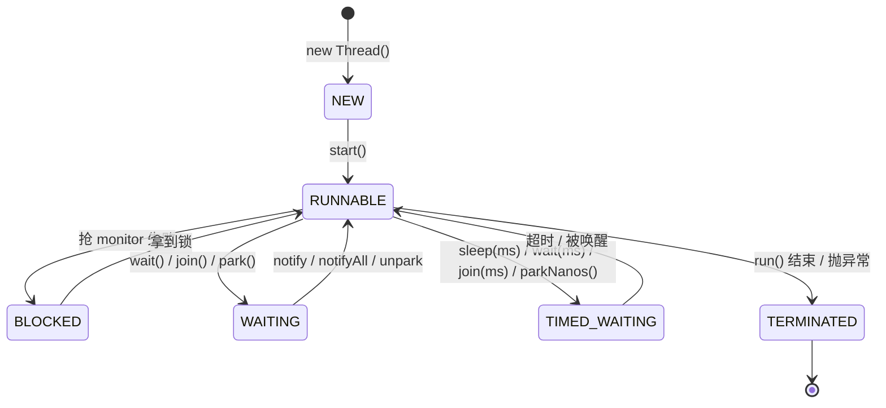
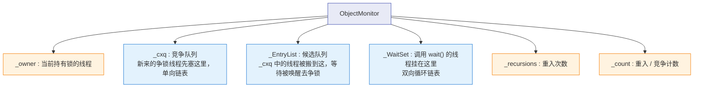

# 🧵 六、多线程与内存模型

> 本篇回答：线程到底是什么、怎么创建、六种状态怎么流转；`wait/notify` 与 `sleep/join/yield` 差在哪、为什么 `wait` 必须配 `while`；`synchronized` 从字节码到 Mark Word 到锁升级的完整链路；JMM 为什么存在、`volatile` 靠什么内存屏障保证可见性与有序性、八条 happens-before 怎么用；CAS/ABA、死锁排查、ThreadLocal 内存泄漏。
>
> 分工说明：AQS / `ReentrantLock` / 读写锁 / Condition / 并发容器 / `CompletableFuture` 的源码细节见 `[[6-JUC并发工具]]`，本篇只做选型层面的对比与指向。线程池见 `[[5-线程池]]`。

---

## 一、进程与线程：从操作系统到 JVM

### 1.1 操作系统视角

| 维度 | 进程 | 线程 |
| --- | --- | --- |
| 定位 | 资源分配的基本单位 | CPU 调度的基本单位 |
| 地址空间 | 独立，互不可见 | 共享所属进程的地址空间 |
| 私有资源 | 页表、文件描述符表、信号处理 | 栈、寄存器上下文、程序计数器 |
| 切换成本 | 高（切页表 → TLB 失效、Cache 污染） | 低（同一地址空间，只换栈和寄存器） |
| 通信方式 | IPC：管道、消息队列、共享内存、Socket | 直接读写共享内存 + 同步原语 |
| 崩溃影响 | 一般不影响其他进程 | 一个线程 OOM/异常可能拖死整个进程 |

一句话记忆：**进程隔离、线程共享；隔离带来安全，共享带来效率与复杂度**。

### 1.2 JVM 内存区域视角

| 区域 | 线程私有/共享 | 存放内容 | 相关异常 |
| --- | --- | --- | --- |
| 程序计数器 | 私有 | 当前字节码行号 | 唯一不会 OOM 的区域 |
| 虚拟机栈 | 私有 | 栈帧：局部变量表、操作数栈、动态链接、返回地址 | `StackOverflowError` / `OutOfMemoryError` |
| 本地方法栈 | 私有 | native 方法调用 | 同上 |
| 堆 | 共享 | 对象实例、数组 | `OutOfMemoryError: Java heap space` |
| 方法区 / 元空间 | 共享 | 类元信息、运行时常量池、静态变量 | `OutOfMemoryError: Metaspace` |
| 直接内存 | 共享（堆外） | `DirectByteBuffer` / Netty | `OutOfMemoryError: Direct buffer memory` |

> [!warning] 线程数不是免费的
> 每个平台线程至少占用：`-Xss` 指定的用户栈（默认约 512KB~1MB）+ 内核侧栈（8KB~16KB）+ 内核 task_struct。
> 1000 个线程按 1MB 估算就是约 1GB 的地址空间，再加上线程切换带来的 Cache/TLB 抖动，**线程数本身就是一个需要被"池化"约束的资源**。这就是 `[[5-线程池]]` 存在的第一性理由。

### 1.3 平台线程 vs 虚拟线程（一句话定位）

- **平台线程（Java 21 之前唯一的选择）**：`java.lang.Thread` 与内核线程 1:1 绑定，由操作系统调度。名字里的"平台"就是指它绑定了平台（OS）线程。
- **虚拟线程（Java 21 起正式支持）**：JVM 调度的 M:N 模型，多个虚拟线程复用一个"载体线程"（carrier，本质是平台线程）。阻塞在 IO 上时会从载体上卸载（unmount），把载体让给别人。

细节见 `[[9-Java版本特性]]`，线程池视角的用法见 `[[5-线程池]]`。

---

## 二、线程的创建方式与选择

### 2.1 五种方式对比

| 方式 | 有无返回值 | 能否抛受检异常 | 是否新建线程 | 生产可用度 |
| --- | --- | --- | --- | --- |
| 继承 `Thread` | 无 | 不能 | 是 | 差（占用继承位，Java 单继承） |
| 实现 `Runnable` | 无 | 不能 | 是 | 中（裸 new Thread 不推荐） |
| `Callable` + `FutureTask` | 有 | 能 | 是 | 中 |
| 线程池提交 | 通过 `Future` 有 | 通过 `Future` 有 | 复用 | **高（推荐）** |
| `CompletableFuture` | 有，且可编排 | 以 `CompletionException` 包装 | 依赖传入的 Executor | 高（异步编排场景） |

### 2.2 代码

```java
// 1. 继承 Thread（不推荐，但要知道 start/run 的差别）
class MyThread extends Thread {
    @Override public void run() { System.out.println("run in " + Thread.currentThread().getName()); }
}

// 2. Runnable：无返回值
Thread t = new Thread(() -> System.out.println("runnable"), "worker-1");
t.start();

// 3. Callable + FutureTask：有返回值、能抛异常
FutureTask<Integer> ft = new FutureTask<>(() -> {
    TimeUnit.MILLISECONDS.sleep(100);
    return 42;
});
new Thread(ft, "callable-1").start();
Integer result = ft.get(1, TimeUnit.SECONDS);   // 阻塞直到有结果；有 3 种 get 异常语义

// 4. 线程池（真正的生产写法）
ExecutorService pool = new ThreadPoolExecutor(
        4, 16, 60L, TimeUnit.SECONDS,
        new ArrayBlockingQueue<>(200),
        new ThreadFactory() {
            private final AtomicInteger seq = new AtomicInteger(1);
            @Override public Thread newThread(Runnable r) {
                Thread t = new Thread(r, "order-pool-" + seq.getAndIncrement());
                t.setUncaughtExceptionHandler((th, e) ->
                        System.err.println("uncaught in " + th.getName() + ": " + e));
                return t;
            }
        },
        new ThreadPoolExecutor.CallerRunsPolicy());
Future<String> f = pool.submit(() -> "done");   // submit 会把异常吞进 Future

// 5. CompletableFuture：编排型异步，细节见 [[6-JUC并发工具]]
CompletableFuture.supplyAsync(() -> 1, pool)
                 .thenApply(i -> i + 1)
                 .thenAccept(System.out::println);
```

### 2.3 `start()` 与 `run()` 的区别（必考）

| 维度 | `start()` | `run()` |
| --- | --- | --- |
| 本质 | 向 JVM 申请创建一个新线程，由新线程回调 `run()` | 一次普通的方法调用 |
| 执行线程 | 新线程 | **当前调用线程** |
| 是否可重复调用 | 否，第二次抛 `IllegalThreadStateException` | 可以，调用几次执行几次 |
| 是否能并行 | 是 | 否（串行，等于没起线程） |
| 源码 | `public synchronized void start()` → `start0()`（native） | 普通方法，`Thread` 里默认空实现 |

```java
// start0 之前的状态校验（简化）
public synchronized void start() {
    if (threadStatus != 0)                      // 已经启动过
        throw new IllegalThreadStateException();
    group.add(this);
    boolean started = false;
    try {
        start0();
        started = true;
    } finally {
        try { if (!started) group.threadStartFailed(this); } catch (Throwable ignore) {}
    }
}
```

> [!danger] 现场事故
> 把 `thread.run()` 当 `thread.start()` 写，在低并发下"看起来正常"（结果是对的），只有在压测时才发现**根本没有并行**、吞吐上不去；更隐蔽的是 `run()` 里访问了 `ThreadLocal`，拿到的是调用方线程的上下文，导致串数据。排查手法：`jstack` 里看不到预期线程名，或者 `Thread.currentThread().getName()` 打日志一看就露馅。

---

## 三、线程生命周期六态与状态转换

### 3.1 六态定义（`Thread.State`）

| 状态 | 含义 | 进入方式（典型） |
| --- | --- | --- |
| `NEW` | 已创建未启动 | `new Thread(...)` 之后，尚未 `start()` |
| `RUNNABLE` | 可运行（含正在运行和等待 CPU 时间片） | `start()` 之后；从阻塞中被唤醒后 |
| `BLOCKED` | 等待**监视器锁**（monitor） | 进入 `synchronized` 块/方法时抢锁失败 |
| `WAITING` | 无限期等待，需被显式唤醒 | `Object.wait()`、`Thread.join()`（无超时）、`LockSupport.park()` |
| `TIMED_WAITING` | 限时等待 | `Thread.sleep(ms)`、`wait(ms)`、`join(ms)`、`parkNanos()` |
| `TERMINATED` | 已终止 | `run()` 正常返回或抛异常结束 |

### 3.2 状态转换图（ASCII）



### 3.3 容易踩的三个点

> [!warning] 坑 1：`BLOCKED` 只属于 `synchronized`
> `BLOCKED` 的语义严格限定为"等待 monitor 进入 `synchronized`"。**用 `ReentrantLock.lock()` 抢不到锁的线程，JVM 状态是 `WAITING`**（底层是 `LockSupport.park()`），不要混。`jstack` 里看到 `WAITING (parking)` 且栈顶是 `Unsafe.park` → 这是 AQS 在等锁。

> [!warning] 坑 2：IO 阻塞在 jstack 里显示 `RUNNABLE`
> 线程卡在 `socketRead0`、`readBytes`、`FileInputStream.read` 这类 native IO 上时，JVM 一侧看到的是"正在执行 native 方法"，状态依旧报 `RUNNABLE`。**看到大量 `RUNNABLE` 不代表 CPU 忙**。
> 正确姿势：`top -Hp <pid>` 找出真正吃 CPU 的线程 → `printf '%x\n' <tid>` 转 16 进制 nid → 到 `jstack` 里搜 `nid=0x...`。CPU 高且栈顶是业务代码才是真热点；CPU 低而大量 `RUNNABLE` 停在 `socketRead0` 则是下游/网络慢。

> [!warning] 坑 3：`RUNNABLE` ≠ 正在占用 CPU
> Java 线程状态是 JVM 层面的粗粒度描述，`RUNNABLE` 包含"就绪但没拿到时间片"。真实 CPU 占用必须靠 OS 工具（`top -H`、`pidstat -t`、`perf`）确认。

---

## 四、线程通信：`wait` / `notify` 与 `sleep` / `join` / `yield`

### 4.1 全对比表

| 方法 | 所属 | 是否释放锁 | 是否需在同步块内 | 能否被中断 | 唤醒方式 | 状态 |
| --- | --- | --- | --- | --- | --- | --- |
| `Object.wait()` | `Object` | **释放** monitor | **必须**持有 monitor，否则 `IllegalMonitorStateException` | 能（抛 `InterruptedException`） | `notify`/`notifyAll`/超时/中断 | `WAITING`/`TIMED_WAITING` |
| `Object.notify()` | `Object` | 不涉及（本来就持锁） | 必须 | — | — | — |
| `Object.notifyAll()` | `Object` | 不涉及 | 必须 | — | — | — |
| `Thread.sleep(ms)` | `Thread` | **不释放**任何锁 | 不需要 | 能 | 超时/中断 | `TIMED_WAITING` |
| `Thread.join()` | `Thread` | **释放**目标线程对象上的 monitor | 不需要（内部自己 `synchronized`） | 能 | 目标线程结束/超时 | `WAITING`/`TIMED_WAITING` |
| `Thread.yield()` | `Thread` | **不释放**锁 | 不需要 | — | 调度器再挑一次 | 仍是 `RUNNABLE` |
| `LockSupport.park()` | `LockSupport` | 不释放（但要先释放锁再 park） | 不需要 | 能（unpark/中断） | `unpark` | `WAITING` |

### 4.2 核心记忆点

1. **`wait` 释放锁，`sleep` 不释放锁。** 这是最经典的一道题。原因：`wait` 的语义是"我暂时不用这个条件了，把锁让给别人去改变条件"，必须释放；`sleep` 的语义只是"我歇一会"，与锁无关。
2. **`wait` 必须在同步块内。** 因为 `wait` 要操作 monitor 的 `_WaitSet`，前提是持有 monitor；JVM 会检查 `_owner == currentThread`，不满足直接抛 `IllegalMonitorStateException`（这是运行时异常，编译期不报错，很容易在重构时把 `synchronized` 删掉而埋雷）。
3. **`sleep` 不释放锁 → 容易造成"抱着锁睡觉"**，把整个同步块变成串行 + 延迟放大。生产上表现为：某个接口 P99 突然涨到几百毫秒，`jstack` 里大量线程 `BLOCKED` 在同一把锁，持锁线程 `TIMED_WAITING` 在 `Thread.sleep`。

### 4.3 Monitor（管程）内部结构

`wait/notify` 的底层是 JVM 的 `ObjectMonitor`：



调用链语义：

- `wait()`：线程包装成 `ObjectWaiter` 放入 `_WaitSet` → **释放 monitor** → `park` 挂起（状态 `WAITING`）。
- `notify()`：从 `_WaitSet` 取出**一个**节点，放进 `_EntryList`（或按策略直接移到 `_cxq`）。
- `notifyAll()`：`_WaitSet` 全部搬走。
- 被唤醒的线程**不是立刻返回 `wait()`**，而是先变成 `BLOCKED` 去竞争 monitor；抢到锁之后才从 `wait()` 返回。**这就是"被唤醒 ≠ 条件成立"的根本原因。**

### 4.4 为什么 `wait` 必须包在 `while` 里，而不是 `if`

标准写法：

```java
synchronized (lock) {
    while (!condition) {      // 必须 while，不能 if
        lock.wait();
    }
    // 此处 condition 一定成立
    doSomething();
}
```

用 `if` 会错在两类场景：

1. **虚假唤醒（spurious wakeup）**：JLS 明确允许 `wait()` 在没有 `notify`/超时/中断的情况下返回（为底层实现留余地）。虽然主流 JVM 上很少见，但规范允许就不能依赖它不发生。
2. **`notifyAll` 下的惊群竞争**（现实中更常见）：两个消费者都在 `wait`，生产者放了一个元素后 `notifyAll`。用 `if` 的话，两个消费者醒来后都跳过了条件判断——第一个抢到锁、取走元素；第二个再抢到锁时**条件已经不再成立**，但它已经从 `if` 块后面继续执行了，于是取到 `null` 或读到脏数据。

```java
// 反面教材：用 if 写消费者
synchronized (queue) {
    if (queue.isEmpty()) queue.wait();     // ❌
    return queue.poll();                   // 可能返回 null
}
```

> [!important] 结论
> `wait` 的正确姿势永远是：**`while` 判条件 + `notifyAll`（或者用精准唤醒的 `Condition`）**。
> 反过来，如果你的等待条件互不相同（生产者等"队列不满"、消费者等"队列不空"），`notifyAll` 会把无关线程也唤醒（惊群），此时应该用 `ReentrantLock` + 两个 `Condition` 做精准唤醒——细节见 `[[6-JUC并发工具]]`。

---

## 五、生产者-消费者的三种实现对比

### 5.1 `wait` / `notifyAll` 版

```java
public class WaitNotifyBuffer<T> {
    private final Queue<T> queue = new LinkedList<>();
    private final int capacity;
    private final Object lock = new Object();     // 专用锁对象，避免锁 this

    public WaitNotifyBuffer(int capacity) { this.capacity = capacity; }

    public void put(T item) throws InterruptedException {
        synchronized (lock) {
            while (queue.size() == capacity) lock.wait();   // while + wait
            queue.offer(item);
            lock.notifyAll();                               // 唤醒消费者
        }
    }

    public T take() throws InterruptedException {
        synchronized (lock) {
            while (queue.isEmpty()) lock.wait();
            T item = queue.poll();
            lock.notifyAll();                               // 唤醒生产者
            return item;
        }
    }
}
```

要点：锁对象用私有 final 对象而**不是 `this`**（否则外部可以不相关地 `synchronized(buffer)` 干扰）；`put` 和 `take` 里 `wait` 与条件判断必须同锁；`notifyAll` 而非 `notify`（两拨线程等不同条件）。

### 5.2 `BlockingQueue` 版（生产首选）

```java
public class BqBuffer<T> {
    private final BlockingQueue<T> queue;

    public BqBuffer(int capacity) { this.queue = new ArrayBlockingQueue<>(capacity); }

    public void put(T item) throws InterruptedException { queue.put(item); }  // 满则阻塞
    public T take() throws InterruptedException { return queue.take(); }      // 空则阻塞
}
```

`BlockingQueue` 内部用 `ReentrantLock` + `notEmpty` / `notFull` 两个 `Condition`，并且 `signal` 是**精准唤醒**（只叫醒一个），比 `notifyAll` 少了惊群。细节见 `[[6-JUC并发工具]]`。

### 5.3 `Condition` 版（手写但精准）

```java
public class ConditionBuffer<T> {
    private final ReentrantLock lock = new ReentrantLock();
    private final Condition notFull  = lock.newCondition();
    private final Condition notEmpty = lock.newCondition();
    private final Queue<T> queue = new LinkedList<>();
    private final int capacity;

    public ConditionBuffer(int capacity) { this.capacity = capacity; }

    public void put(T item) throws InterruptedException {
        lock.lock();
        try {
            while (queue.size() == capacity) notFull.await();  // await/signal 替代 wait/notify
            queue.offer(item);
            notEmpty.signal();                                 // 只叫醒一个消费者
        } finally {
            lock.unlock();                                     // 必须 finally 释放
        }
    }

    public T take() throws InterruptedException {
        lock.lock();
        try {
            while (queue.isEmpty()) notEmpty.await();
            T item = queue.poll();
            notFull.signal();
            return item;
        } finally {
            lock.unlock();
        }
    }
}
```

### 5.4 三方案对比

| 维度 | `wait/notifyAll` | `BlockingQueue` | `Condition` |
| --- | --- | --- | --- |
| 唤醒粒度 | 粗（一个等待集，只能 `notifyAll` 才安全） | 精准（内部两个条件队列） | 精准（自定义多个条件） |
| 锁类型 | 内置 monitor | `ReentrantLock` | `ReentrantLock` |
| 可中断等待 | `wait` 可中断 | `put/take` 可中断 | `await` 可中断 |
| 可超时 | `wait(ms)` | `offer(e, t, u)` / `poll(t, u)` | `await(time, unit)` |
| 公平性 | 非公平 | 可选公平 | 可选公平 |
| 编码风险 | **高**（忘 while、锁对象不一致、用 if） | 低 | 中（必须 `finally` 解锁） |
| 生产建议 | 只在教学/极简场景 | **默认首选** | 需要多条件精准控制时 |

---

## 六、`synchronized` 原理（源码级）

### 6.1 字节码层面：方法 vs 代码块

```java
public class SyncDemo {
    public synchronized void methodLock() { }              // 修饰方法
    public void blockLock() {
        synchronized (this) { }                            // 修饰代码块
    }
    public static synchronized void staticLock() { }       // 修饰静态方法（锁 Class 对象）
}
```

`javap -v` 的差异：

| 形式 | 字节码表现 | 锁对象 |
| --- | --- | --- |
| `synchronized` 实例方法 | 方法访问标志带 `ACC_SYNCHRONIZED`（0x0020），**不生成** `monitorenter/exit` | `this` |
| `synchronized` 静态方法 | 同样带 `ACC_SYNCHRONIZED` | 类的 `Class` 对象 |
| `synchronized` 代码块 | 显式 `monitorenter` ... `monitorexit` | 括号里的对象 |

关键细节：**代码块会生成两个 `monitorexit`**——一个在正常返回路径，一个在异常处理表（`Exception table`）里指向的 handler 中。这样才能保证抛异常时也释放锁。

```
// javap 片段示意
public void blockLock();
  Code:
     0: aload_0
     1: dup
     2: astore_1
     3: monitorenter            // ← 加锁
     4: aload_1
     5: monitorexit             // ← 正常路径解锁
     6: goto 14
     9: astore_2
    10: aload_1
    11: monitorexit             // ← 异常路径解锁（Exception table 指向这里）
    12: aload_2
    13: athrow
    14: return
  Exception table:
     from  to  target type
         4   6     9   any
```

> [!note] 为什么方法锁不生成指令
> `ACC_SYNCHRONIZED` 是一个声明式标志，JVM 在方法调用/返回的入口出口处**隐式**完成 `monitorenter/monitorexit`，语义与代码块完全一致，只是不需要字节码指令显式表达。

### 6.2 对象内存布局与 Mark Word

```
对象在堆中的布局（64 位 HotSpot，开启指针压缩 -XX:+UseCompressedOops）
┌──────────────────────────────┐
│  Mark Word         (8 字节)   │  ← 锁状态、hashCode、GC 分代年龄
├──────────────────────────────┤
│  Klass Pointer     (4 字节)   │  ← 压缩后指向方法区的类元数据
├──────────────────────────────┤
│  实例数据 instance data        │  ← 字段按类型排布（long/double 优先，减少 padding）
├──────────────────────────────┤
│  对齐填充 padding              │  ← 补齐到 8 字节的整数倍
└──────────────────────────────┘
数组对象会在 Klass Pointer 之后多出 4 字节的数组长度。
```

Mark Word 内容随锁状态复用（这也是"Mark Word 是复用的"这句话的含义）：

| 锁状态 | 标志位（2 bit） | biased_lock（1 bit） | 62 位存储内容 |
| --- | --- | --- | --- |
| 无锁 | `01` | `0` | unused(25) + `hashCode`(31) + unused(1) + 分代年龄(4) |
| 偏向锁 | `01` | `1` | 线程指针 `JavaThread*`(54) + epoch(2) + unused(1) + 分代年龄(4) |
| 轻量级锁 | `00` | — | 指向线程栈中 `Lock Record` 的指针(62) |
| 重量级锁 | `10` | — | 指向 `ObjectMonitor` 的指针(62) |
| GC 标记 | `11` | — | 空（不记录信息） |

> [!warning] 注意反过来的坑
> 因为 Mark Word 复用，**调用 `Object.hashCode()` 会占用原本存偏向锁 threadID 的位置**。所以"一个已经调用过 `hashCode()` 的对象无法再进入偏向锁状态"（会直接走轻量级锁）。这是 `IdentityHashMap` 之类场景下偏向锁失效的底层原因之一。

### 6.3 锁升级过程

```
        无锁
         │  第一个线程进入同步块，CAS 写入自己的 threadID
         ▼
      偏向锁  ── 同一线程反复进入 → 只需一次 CAS + 一次 threadID 比较
         │  出现第二个线程竞争
         │  （需要等 safepoint 撤销偏向，撤销有 STW 成本）
         ▼
     轻量级锁 ── 当前线程栈帧建 Lock Record，CAS 替换 Mark Word
         │  CAS 失败 → 自适应自旋
         │  自旋仍失败
         ▼
     重量级锁 ── 未抢到的线程被 park，进入 BLOCKED，涉及用户态/内核态切换
```

**偏向锁（Biased Locking）**

- 获取：CAS 把 Mark Word 的 threadID 改成自己；如果发现 threadID 已经是自己，**不需要任何原子操作**直接进入（这是它最大的收益：单线程反复进入同步块的开销趋近于零）。
- 撤销：另一个线程来竞争时，需要**等到一个安全点（safepoint）**才能撤销偏向锁，撤销后对象要么恢复无锁（原线程已不活跃）要么升级为轻量级锁。**撤销需要 STW 停下来才能做**，这是它的主要成本。
- 批量重偏向（bulk rebias）：以 **class 为单位**统计撤销次数。默认阈值 **20**（`-XX:BiasedLockingBulkRebiasThreshold`），超过之后 JVM 认为"这个类的实例经常被不同线程访问"，于是把该类所有实例的 epoch 加 1、批量重偏向到新线程，避免逐个撤销。
- 批量撤销（bulk revocation）：默认阈值 **40**（`-XX:BiasedLockingBulkRevokeThreshold`），超过之后直接判定这个类不可偏向，之后该类实例新建即为无锁状态。
- epoch 的作用：每个 class 有一个 epoch，对象 Mark Word 里也存一份。epoch 不一致就说明"这个偏向已经过期"，可以低成本重偏向，而不必逐个撤销。

**为什么偏向锁被废弃**

- 偏向锁的撤销依赖 safepoint，在高并发、锁竞争频繁（尤其是线程池场景下任务在不同线程间流转）时，**撤销的次数可能远多于命中次数**，反而引入 STW 抖动。
- 现代应用大量改用 `java.util.concurrent` 的锁（`ReentrantLock` 等），偏向锁收益面缩小。
- 结论与趋势：**较新版本默认关闭/已废弃偏向锁**（JDK 15 的 JEP 374 "Deprecate and Disable Biased Locking" 默认禁用了它并废弃相关参数，后续版本进一步移除了实现）。所以现在讲锁升级，实际的默认路径是 **无锁 → 轻量级锁 → 重量级锁**，偏向锁要作为"历史上的一层 + 为什么被拿掉"来讲。

> [!important] 面试口径（既显深度又不翻车）
> "锁升级的完整链路是 无锁 → 偏向锁 → 轻量级锁 → 重量级锁，其中偏向锁解决的是同一线程反复进入的问题，靠 CAS 一次 + threadID 判断。但偏向锁的撤销要等 safepoint，撤销成本可能高于收益，所以较新版本的 JDK 默认禁用了偏向锁，实际路径是 无锁 → 轻量级 → 重量级。升级基本是单向的，重量级锁不会降级。"

**轻量级锁**

- 加锁：在当前线程的栈帧中创建一个 `Lock Record`（对象头里的 displaced Mark Word 拷进去）→ CAS 把对象 Mark Word 替换为指向 `Lock Record` 的指针。
  - 成功 → 拿到锁。
  - 失败 → 说明有竞争，进入**自适应自旋**；自旋期间成功则直接拿到锁。
- 解锁：CAS 把 Mark Word 换回原来的 displaced 值。
  - 成功 → 释放完成。
  - 失败 → 说明已经被膨胀成重量级锁了（有线程在等），需要唤醒等待的线程。
- 适用：**锁竞争不激烈、同步块执行非常快**的场景（自旋几次就能拿到）。缺点是自旋期间**空耗 CPU**。

**重量级锁**

- 基于操作系统的互斥量（mutex）实现，未抢到锁的线程被 `park` 挂起、状态变为 `BLOCKED`，需要用户态↔内核态切换。
- 依赖 `ObjectMonitor` 的 `_cxq` / `_EntryList` / `_WaitSet`（见 4.3）。
- 成本最高，但不会空耗 CPU（等锁线程被挂起）。

### 6.4 锁优化：JIT 层面的三种手段

| 优化 | 触发条件 | 效果 | 例子 |
| --- | --- | --- | --- |
| 锁消除（Lock Elision） | 逃逸分析判定锁对象不会逃逸出当前线程 | 直接删掉同步指令 | 方法内局部 `StringBuffer.append` |
| 锁粗化（Lock Coarsening） | 对同一对象的加解锁在相邻位置反复出现 | 合并成一次大范围加锁 | 循环内反复 `synchronized(list){list.add(x);}` |
| 自适应自旋（Adaptive Spinning） | 重量级锁竞争前的自旋阶段 | 自旋次数动态调整，减少内核态切换 | 上一次在同一锁上自旋成功过 → 这次多转几次 |

```java
// 锁消除的典型场景
public String concat(String a, String b) {
    StringBuffer sb = new StringBuffer();   // 局部变量，不逃逸
    sb.append(a);                           // JIT 会消除这里的同步
    sb.append(b);
    return sb.toString();
}
```

```java
// 锁粗化的典型场景（写法差，JIT 会帮忙，但别指望）
for (int i = 0; i < 1000; i++) {
    synchronized (lock) { list.add(i); }     // 加解锁 1000 次 → 被粗化成 1 次
}
// 更好的写法就是自己写在外面
synchronized (lock) {
    for (int i = 0; i < 1000; i++) list.add(i);
}
```

> [!tip] 观察锁优化
> JIT 编译日志里能看到消除结果：
> `-XX:+UnlockDiagnosticVMOptions -XX:+PrintEliminateLocks`（会打出 `++++ Eliminated: 12` 之类的行）。
> 注意锁消除只在**C2 编译后的热点代码**上生效，解释执行阶段仍会真的加锁——所以"没看到效果"往往是因为方法还没被 JIT 编译。

### 6.5 `synchronized` vs `ReentrantLock`（选型）

| 维度 | `synchronized` | `ReentrantLock` |
| --- | --- | --- |
| 层面 | JVM 关键字（字节码/对象头） | JDK API（AQS + CAS + `LockSupport`） |
| 释放 | 自动（JVM 保证异常也释放） | **必须 `finally` 手动 `unlock()`** |
| 可中断获取 | 不支持 | `lockInterruptibly()` |
| 超时获取 | 不支持 | `tryLock(timeout, unit)` |
| 非阻塞尝试 | 不支持 | `tryLock()` |
| 公平性 | 非公平（不可选） | 可选公平/非公平 |
| 条件队列 | 1 个（`_WaitSet`） | 多个 `Condition`，精准唤醒 |
| 读写分离 | 不支持 | `ReentrantReadWriteLock` / `StampedLock` |
| 锁升级 | 有（无锁→轻量→重量） | 无锁升级概念，直接 park/unpark |
| 性能 | JDK 6+ 优化后与 `ReentrantLock` 同量级 | 高竞争下略优（可控自旋与队列） |
| 可观测性 | jstack 直接显示锁与 owner | jstack 显示 `parking to wait for <0x...>` |

**选型结论**：

1. **默认用 `synchronized`**：写起来简单、不可能忘记解锁、JVM 还能做锁消除/粗化、jstack 里可读性更好。
2. 需要**超时、可中断、公平、多条件、读写分离**时才上 `ReentrantLock` / `StampedLock`。
3. 无锁计数用原子类（`AtomicLong` / `LongAdder`），高并发计数优先 `LongAdder`。

AQS 的 `state`/`CLH` 队列/`ConditionObject` 源码细节见 `[[6-JUC并发工具]]`。

---

## 七、JMM（Java 内存模型）

### 7.1 为什么需要 JMM：从硬件说起

```
        CPU0                    CPU1
   ┌───────────┐          ┌───────────┐
   │ 寄存器     │          │ 寄存器     │
   │ StoreBuffer│         │ StoreBuffer│   ← 写缓冲：写不立刻出核
   │ L1 Cache  │          │ L1 Cache  │   ← 各自私有
   └─────┬─────┘          └─────┬─────┘
         │                      │
         └──────┬───────────────┘
                ▼
          L3 / 共享缓存
                ▼
            主内存（RAM）
```

三个硬件事实直接导致了并发问题：

1. **CPU 与内存速度差约两个数量级** → 引入多级缓存 → 同一个变量在不同核的缓存里可能不一致（**可见性问题**）。
2. **为减少写等待引入 Store Buffer（写缓冲）**，写操作先落到缓冲区，CPU 不等刷回主存就继续执行；**为减少失效等待引入 Invalidate Queue（失效队列）**，收到失效消息先排队慢慢处理。这两个缓冲让"写后立刻对别人可见"彻底失效（**可见性问题加剧**）。
3. **编译器与 CPU 为了性能会重排指令**（编译期重排 + 乱序执行/投机执行）（**有序性问题**）。

JMM 就是 JVM 给出的**规范层承诺**：屏蔽不同硬件与操作系统的差异，定义多线程读写共享变量时的可见性规则，让同一份 Java 代码在所有平台上有一致的内存语义。

### 7.2 主内存与工作内存的抽象

```
   线程 A                      线程 B
 ┌─────────────┐            ┌─────────────┐
 │  工作内存 A  │            │  工作内存 B  │   ← 抽象：寄存器 + CPU 缓存 + 写缓冲
 │  (副本)      │            │  (副本)      │
 └──────┬──────┘            └──────┬──────┘
        │   read/load              │   read/load
        │   store/write            │   store/write
        └───────────┬──────────────┘
                    ▼
              ┌───────────┐
              │  主内存    │   ← 所有共享变量
              └───────────┘
```

JMM 规定：**所有变量都存在主内存，每个线程有自己的工作内存；线程对变量的所有操作都必须在工作内存中进行，不能直接读写主内存。**

> [!warning] 最常见的误解
> **"工作内存 = 线程栈"是错的。** 工作内存是 JMM 的抽象模型，物理上对应 CPU 寄存器、L1/L2 缓存、Store Buffer / Invalidate Queue。你在 `jstack`、堆 dump 里都找不到它。所以"工作内存里的副本"这句话只是模型语言，不要试图在 JVM 内存结构图中给它画个位置。

### 7.3 三大问题：原子性、可见性、有序性

| 问题 | 成因 | 反例 | JMM 提供的保障 |
| --- | --- | --- | --- |
| **原子性** | 线程切换（时间片耗尽）+ 复合操作本身不是原子的 | `i++`、`check-then-act` | `synchronized`、`Lock`、原子类（CAS）、`volatile` 的单个读/写（**但不含复合**） |
| **可见性** | CPU 缓存 + Store Buffer，写停留在本地未刷主存 | 一个线程改 `flag`，另一个线程永远读到 `false` | `volatile`、`synchronized`（解锁前刷、加锁后失效）、`final`（构造完成后的可见性保证） |
| **有序性** | 编译器重排 + CPU 乱序执行 + 内存系统重排 | DCL 单例拿到半初始化对象 | `volatile`（内存屏障）、`synchronized`（同一时刻只有一个线程，天然串行化）、happens-before 规则 |

**`i++` 为什么不是原子的**——它编译成四条字节码，中间任何一步都可能被线程切换打断：

```
getstatic   i    // 1. 读
iconst_1         // 2. 常量 1
iadd             // 3. 加
putstatic   i    // 4. 写回
```

两个线程各执行 1000 次 `i++`，最终结果几乎总是小于 2000，且每次运行结果都不同。

```java
static int count = 0;
public static void main(String[] args) throws Exception {
    Runnable task = () -> { for (int i = 0; i < 100_000; i++) count++; };
    Thread t1 = new Thread(task), t2 = new Thread(task);
    t1.start(); t2.start(); t1.join(); t2.join();
    System.out.println(count);   // 期望 200000，实际常见 12xxxx ~ 19xxxx
}
```

> [!example] 生产中的真实形态
> 计数场景下这个 bug 表现为"数据对不上"：连续几天跑下来统计值总是偏小，但没有任何异常日志。定位思路：看到"只少不多、偏差随机"的计数，第一个怀疑对象就是非原子的 `++` / `+=`；换成 `LongAdder` 或加锁后立刻正常。

---

## 八、`volatile` 原理（源码级）

### 8.1 三条语义

| 语义 | 是否保证 | 说明 |
| --- | --- | --- |
| **可见性** | ✅ | 写 `volatile` 变量后，本线程工作内存中的值立刻刷回主内存；读 `volatile` 变量时从主内存重新读取，并使本地缓存副本失效 |
| **有序性** | ✅ | 禁止 `volatile` 变量与前后指令之间的特定重排（通过内存屏障实现） |
| **原子性** | ❌ | `volatile int i; i++` 依然不安全；仅保证**单个变量的单次读或单次写**是原子的 |

补充：`volatile` 的写-读还能建立 happens-before 关系（见第九节规则 3），从而实现一种轻量级的"发布"语义。

### 8.2 字节码与 JIT 层面

- 字节码：`volatile` 字段的 `field_info` 会带 `ACC_VOLATILE`（0x0040）访问标志，字节码指令本身与普通字段无异（都是 `getfield`/`putfield`）。
- JIT：C2 在生成机器码时根据 `ACC_VOLATILE` 决定插入哪些内存屏障。
- **x86 的特殊性**：x86 是 TSO（Total Store Order）内存模型，本身已保证 LoadLoad / LoadStore / StoreStore 顺序，**只有 StoreLoad 需要显式指令**。所以在 x86 上 `volatile` 写通常编译成带 `lock` 前缀的指令（如 `lock addl $0x0,(%rsp)`），`lock` 前缀会顺带把 Store Buffer 刷干净。

### 8.3 内存屏障：四种类型与插入位置

JSR-133 Cookbook 定义的四种屏障：

| 屏障 | 作用方向（禁止的重排） | 代价 |
| --- | --- | --- |
| `LoadLoad` | 上面的**读** 与 下面的**读** 不能重排 | 低 |
| `LoadStore` | 上面的**读** 与 下面的**写** 不能重排 | 低 |
| `StoreStore` | 上面的**写** 与 下面的**写** 不能重排 | 低 |
| `StoreLoad` | 上面的**写** 与 下面的**读** 不能重排（≈ 全屏障） | **最高**，通常要清空 Store Buffer |

**`volatile` 的插入策略（JMM 定义，必须背下来方向）：**

```
① volatile 写：
      普通写 ...
      ┌──────────────┐
      │  StoreStore  │   ← 保证之前的普通写都刷出去，再执行 volatile 写
      └──────────────┘
      volatile 写
      ┌──────────────┐
      │  StoreLoad   │   ← 保证 volatile 写完成后，后续的读写才执行
      └──────────────┘
      后续读写 ...

② volatile 读：
      volatile 读
      ┌──────────────┐
      │  LoadLoad    │   ← 之后的读不能提前到 volatile 读之前
      ├──────────────┤
      │  LoadStore   │   ← 之后的写不能提前到 volatile 读之前
      └──────────────┘
      后续读写 ...
```

一句话记忆：**写前 `StoreStore`、写后 `StoreLoad`；读后 `LoadLoad` + `LoadStore`**。

为什么这么插能成立（用 StoreStore 举例）：`a = 1; volatile flag = true;` 中，`StoreStore` 保证 `a = 1` 先对其他核可见，再让 `flag = true` 可见。于是任何看到 `flag == true` 的线程，也必然能看到 `a == 1`——这正是 volatile 的"有序性"价值所在。

### 8.4 MESI 缓存一致性协议与总线嗅探

MESI 的四个状态：

| 状态 | 含义 |
| --- | --- |
| `M`（Modified） | 本核已修改，与主存不一致，只有本核有最新值 |
| `E`（Exclusive） | 本核独占，与主存一致 |
| `S`（Shared） | 多核共享，与主存一致，只读 |
| `I`（Invalid） | 本核副本已失效 |

工作方式：所有核通过**总线嗅探（bus snooping）**监听总线上的读写事件。某核要写一个处于 `S` 的缓存行时，先发失效请求，让其他核把对应行置为 `I`，然后自己升到 `M`。

**但 MESI 单独不足以保证可见性**，原因就是 Store Buffer 与 Invalidate Queue：

- 写请求进 Store Buffer 后 CPU 不等失效确认就继续执行 → 其他核可能读到旧值。
- 收到失效请求先进 Invalidate Queue 排队 → 本核可能仍然读到自己缓存里的旧副本。

**内存屏障的本质**就是"把 Store Buffer 强制刷出、把 Invalidate Queue 强制处理完"，让所有核到达一个一致点。这也是为什么 `StoreLoad` 最贵——它要清空写缓冲。

### 8.5 典型用法

**用法 1：状态标志位（最正统的用法）**

```java
public class Worker implements Runnable {
    private volatile boolean running = true;

    public void shutdown() { running = false; }      // 写 volatile

    @Override public void run() {
        while (running) {                            // 读 volatile：每次循环都重新从主存读
            doWork();
        }
        System.out.println("clean exit");
    }
}
```

若 `running` 不加 `volatile`，JIT 可能把它提升（hoist）到寄存器，循环变成死循环，`shutdown()` 永远不会生效。这是**真实且高频**的线上故障：线程无法停止、只能重启进程。

**用法 2：DCL（双重检查锁）单例——`volatile` 不可省**

```java
public class Singleton {
    private static volatile Singleton instance;      // ← volatile 不能少

    private Singleton() {}

    public static Singleton getInstance() {
        if (instance == null) {                      // 第一重检查：避免每次加锁
            synchronized (Singleton.class) {
                if (instance == null) {              // 第二重检查：避免重复创建
                    instance = new Singleton();      // ← 这里的赋值可能被重排
                }
            }
        }
        return instance;
    }
}
```

`new Singleton()` 在字节码层面可以分解为三步：

```
1. memory = allocate();        // 分配内存
2. ctorInstance(memory);       // 调用构造器初始化
3. instance = memory;          // 把引用赋给静态字段
```

**2 和 3 之间没有数据依赖，可以被重排成 1 → 3 → 2。** 此时线程 B 在第一重检查处看到 `instance != null`，于是直接 `return instance`，但它拿到的是一个**引用已赋值、字段还是默认值（0 / null / false）**的对象。表现就是偶发 `NPE`、读到 `0`、读到 `null` 集合。

加上 `volatile` 后，写 `instance` 前后有 `StoreStore` / `StoreLoad` 屏障，禁止了 2 和 3 的重排，也保证了初始化结果对其他线程可见。

> [!danger] 真实事故与排查
> DCL 漏 `volatile` 是典型的"难复现"故障：单元测试过、低并发压测过、只在生产高并发下偶发 NPE / 数据异常。
> 排查路径：
> 1. 现象是"同一个对象，字段有时是默认值"→ 高度怀疑**未安全发布**（unsafe publication）的单例或缓存对象；
> 2. 静态检查：全局搜 `static.*instance` 的双检锁写法，看字段有没有 `volatile`；
> 3. 复现：用 `jcstress`（OpenJDK 的并发压测工具）能稳定抓到这类重排；
> 4. 验证汇编：`-XX:+UnlockDiagnosticVMOptions -XX:+PrintAssembly` 看是否插入了屏障。
>
> 顺带：单例的更好写法是**静态内部类**（靠类加载的初始化锁 + `final` 语义，天然线程安全且无锁）或**枚举**（防反射、防反序列化破坏）。细节见 `[[2-面向对象与设计模式]]`。

```java
// 比 DCL 更简洁且安全：静态内部类（Initialization-on-demand holder）
public class HolderSingleton {
    private HolderSingleton() {}
    private static class Holder {
        static final HolderSingleton INSTANCE = new HolderSingleton();
    }
    public static HolderSingleton getInstance() { return Holder.INSTANCE; }
}
```

**用法 3：一次性发布不可变对象**

```java
private volatile Map<String, String> config = Collections.emptyMap();

public void reload() {
    Map<String, String> fresh = loadFromRemote();
    config = Collections.unmodifiableMap(fresh);   // 整体替换引用，读方永远看到完整对象
}
public String get(String k) { return config.get(k); }
```

### 8.6 `volatile` 不能替代锁的场景

| 场景 | 为什么不行 | 正确做法 |
| --- | --- | --- |
| `i++` / `count += n` | 读-改-写复合操作，中间会被切换 | `AtomicInteger` / `LongAdder` / `synchronized` |
| `check-then-act`：`if (map.get(k) == null) map.put(k, v)` | 检查与动作之间条件可能被改变 | `ConcurrentHashMap.putIfAbsent` / 加锁 |
| 多个字段要保持一致性（`x` 和 `y` 必须一起变） | 两个 volatile 写之间不能原子 | 加锁，或用一个不可变对象整体替换引用 |
| 一个 volatile 标志控制"只初始化一次" | 需要用 CAS 保证只有一个人初始化 | DCL（`synchronized` + 二次检查）或 `AtomicReference.compareAndSet` |

```java
// 反例：volatile 保证不了原子性
private volatile int count = 0;
public void inc() { count++; }       // ❌ 依旧丢失更新

// 正解 1：原子类（低竞争）
private final AtomicInteger count = new AtomicInteger();
public void inc() { count.incrementAndGet(); }

// 正解 2：高并发计数用 LongAdder（分段累加，写竞争更小）
private final LongAdder adder = new LongAdder();
public void inc() { adder.increment(); }
```

---

## 九、happens-before 规则（八条）

### 9.1 定义与理解要点

**如果 A happens-before B，那么 A 的执行结果对 B 可见。**

> [!important] 关键理解（最容易被问倒的一句）
> happens-before **不是"时间上先发生"，而是一条"可见性 + 有序性"的判定规则**。
> - 有 hb 关系：A 的结果对 B 可见，你**可以**依赖它。
> - **没有** hb 关系：不代表它们一定会被重排，而是代表 JVM **允许**它们以任意顺序对彼此可见，所以你的程序**不能依赖**任何一种顺序。
> - 有 hb 关系也不禁止 CPU 真的并行执行，只要求"结果对观察者表现为有序"（`as-if-serial` 的外延）。

### 9.2 八条规则逐条拆解

| # | 规则 | 含义 | 例子 |
| --- | --- | --- | --- |
| 1 | **程序顺序规则** | 单线程内，前面的操作 hb 后面的操作 | `int a = 1; int b = a + 1;` |
| 2 | **监视器锁规则** | 对同一把锁的**解锁** hb 于后续的**加锁** | 线程 A 在 `synchronized` 里写 x=1 并退出，线程 B 随后进入同一 `synchronized` 块，能读到 x==1 |
| 3 | **volatile 变量规则** | 对 volatile 变量的**写** hb 于后续对该变量的**读** | 生产者写 `volatile ready=true`，消费者读到 true，则写之前的普通变量也都可见 |
| 4 | **线程启动规则** | `Thread.start()` hb 于新线程中的**任何**操作 | `start()` 之前设置的字段，新线程里一定能看到 |
| 5 | **线程终止规则** | 线程中所有操作 hb 于其他线程检测到该线程终止 | `t.join()` 返回后（或 `t.isAlive()==false`），能看到 `t` 的全部结果 |
| 6 | **中断规则** | 对线程 `interrupt()` 的调用 hb 于被中断线程检测到中断 | `t.interrupt()` 与目标线程 `isInterrupted()`/`InterruptedException` |
| 7 | **对象终结规则** | 构造函数执行结束 hb 于该对象的 `finalize()` 开始 | `finalize` 里能看到构造器写入的字段 |
| 8 | **传递性** | A hb B 且 B hb C，则 A hb C | 规则 1 + 规则 3 + 规则 1 的组合，是 `volatile` 能"发布"普通变量的原理 |

### 9.3 用规则 3 + 规则 8 推导出 `volatile` 的发布能力

```java
private int a = 0;                    // 普通变量
private volatile boolean flag = false;

// 线程 A
a = 1;                                // ①
flag = true;                          // ② volatile 写

// 线程 B
if (flag) {                           // ③ volatile 读，读到 true
    int r = a;                        // ④ 一定读到 1
}
```

推理链：`① hb ②`（规则 1）→ `② hb ③`（规则 3）→ `③ hb ④`（规则 1）→ 由**传递性**得 `① hb ④`，所以 `a = 1` 对线程 B 可见。

> [!tip] 这就是 `volatile` 的实战价值
> `volatile` 真正好用的地方不是保护它自己那个变量（那个读写本来就原子），而是**用它作为"发布开关"，把之前所有普通写的结果一次性对读者可见**。DCL 单例、配置热加载、状态机流转都靠这个。

### 9.4 没有 hb 关系会怎样

```java
// 没有 hb 关系的经典例子
int a = 0;
boolean flag = false;

// 线程 1
a = 1;              // ①
flag = true;        // ②

// 线程 2
if (flag) {         // ③
    int r = a;      // ④ r 可能是 0！
}
```

`①` 和 `③`/`④` 之间没有任何 hb 关系（没有 volatile、没有锁、没有 start/join），所以线程 2 完全可能看到 `flag == true` 而 `a == 0`。**这不是 JVM 的 bug，而是程序员的错：没有建立同步关系就跨线程共享数据。**

修法（任选其一）：

```java
volatile boolean flag = false;        // 用 volatile 建立 hb
// 或
synchronized (lock) { a = 1; flag = true; }   // 用同一个锁建立 hb
// 或
t1.join(); t2.start();                        // 用 start/join 建立 hb
```

---

## 十、指令重排

### 10.1 三个层次的重排

| 层次 | 谁在做 | 动机 | 例子 |
| --- | --- | --- | --- |
| **编译器重排** | javac（很少）、JIT C2（主要） | 寄存器分配、消除冗余读、指令调度 | 把循环内的字段读提到循环外 |
| **CPU 重排** | 处理器乱序执行/投机执行 | 填满流水线，减少停顿 | 无数据依赖的两条指令交换执行顺序 |
| **内存系统重排** | Store Buffer / Invalidate Queue | 隐藏缓存一致性协议延迟 | 写进了写缓冲但还没出核 |

### 10.2 约束条件

1. **`as-if-serial` 语义**：不管怎么重排，**单线程**下的执行结果不能被改变。
2. **数据依赖不能被重排**：
   - 写后读（RAW，真依赖）：`a = 1; b = a;` → 不可交换
   - 写后写（WAW，输出依赖）：`a = 1; a = 2;` → 不可交换
   - 读后写（WAR，反依赖）：`b = a; a = 1;` → 不可交换
   - **控制依赖允许重排**：`if (flag) { a = 1; }` 中的 `a=1` 可以被提前执行（因为分支预测）——这正是"看到 flag=true 却读到 a=0"的另一种成因。

### 10.3 一个能说明危害的最小例子

```java
static int x = 0, y = 0;
static int a = 0, b = 0;

public static void main(String[] args) throws Exception {
    for (int i = 0; i < 1_000_000; i++) {
        x = y = a = b = 0;
        Thread t1 = new Thread(() -> { a = 1; x = b; });
        Thread t2 = new Thread(() -> { b = 1; y = a; });
        t1.start(); t2.start(); t1.join(); t2.join();
        if (x == 0 && y == 0) {           // 理论上不可能，实际能跑出来
            System.out.println("出现重排！i = " + i);
            break;
        }
    }
}
```

`x == 0 && y == 0` 意味着 `a = 1` 和 `x = b` 被重排、`b = 1` 和 `y = a` 也被重排（Store Buffer 延迟可见也等价于此）。**这是"内存可见性"最直观的实验**，也解释了为什么并发 bug 必须靠规则而不是靠"看起来对"。

### 10.4 `final` 字段的逸出问题

JSR-133 强化了 `final` 语义：**只要在构造过程中 `this` 没有逸出，那么所有线程在对象构造完成后都能看到 `final` 字段被正确初始化**，不需要额外同步。

但一旦 `this` 逸出，这个保证直接失效：

```java
public class Escape {
    final int x;
    static Escape instance;

    public Escape() {
        instance = this;      // ❌ this 逸出：还没执行到 x = 42
        x = 42;
    }
}
```

另一个线程可能通过 `Escape.instance.x` 读到 `0`。常见逸出形态：

| 逸出写法 | 后果 | 修法 |
| --- | --- | --- |
| 构造器里 `static = this` 或注册到全局容器 | 半初始化对象被发布 | 改为工厂方法里先构造再注册 |
| 构造器里 `new Thread(this).start()` | 新线程可能看到字段默认值 | 提供 `start()` 方法，构造完再启动 |
| 构造器里注册监听器/回调，回调立即被触发 | 回调读字段为默认值 | 构造完再注册 |
| 非静态内部类（隐式持有外部 `this`）在构造器里发布 | 同上 | 改为静态内部类或延迟创建 |

> [!warning] 现实中的样子
> "子类/监听器初始化后偶发拿到 `null` 集合"、"Spring Bean 构造器里 `@PostConstruct` 之外的异步上报读到默认值"，大多是 `this` 逸出。**排查要点：搜构造器里的 `this`、`start()`、`register`、`addListener`、`static` 赋值。**

---

## 十一、CAS 与原子性

### 11.1 原理

CAS（Compare-And-Swap）= 比较并交换，是一条 **CPU 原子指令**（x86 的 `cmpxchg` 配合 `lock` 前缀）。

```java
// Java 8 的入口：sun.misc.Unsafe
public final native boolean compareAndSwapInt(Object o, long offset, int expected, int x);
public final native boolean compareAndSwapObject(Object o, long offset, Object expected, Object x);

// Java 9+ 推荐用 VarHandle（标准 API，不再依赖 Unsafe 内部类）
private static final VarHandle STATE;
static {
    try {
        STATE = MethodHandles.lookup().findVarHandle(MyClass.class, "state", int.class);
    } catch (ReflectiveOperationException e) { throw new ExceptionInInitializerError(e); }
}
// 使用：
boolean ok = STATE.compareAndSet(this, 0, 1);
```

`java.util.concurrent.atomic` 包下的类在 Java 9 之后内部已改用 `VarHandle`，但**语义与 CAS 完全一致**。

**自旋 + CAS 的典型实现（乐观锁）：**

```java
public class SpinLock {
    private final AtomicReference<Thread> owner = new AtomicReference<>();

    public void lock() {
        Thread cur = Thread.currentThread();
        while (!owner.compareAndSet(null, cur)) {   // 失败就重试
            Thread.onSpinWait();                    // Java 9：提示 CPU 进入自旋优化状态
        }
    }
    public void unlock() {
        owner.compareAndSet(Thread.currentThread(), null);
    }
}
```

### 11.2 ABA 问题与解决

```java
// ABA 场景：值从 A → B → A，CAS 检查通过，但中间状态已经变了
static AtomicInteger ref = new AtomicInteger(100);

// 线程 1：想从 100 改成 101
// 线程 2：100 → 101 → 100（快速做完两次操作）
// 线程 1 的 CAS(100, 101) 成功 —— 但它不知道中间发生过变化

// 对"值本身"无损，但对"状态机/无锁栈/链表"是致命的：
// 无锁栈里，元素被弹出又压入一个新节点（地址可能复用），
// 顶层引用看起来没变，但 next 指针已经不同 → 造成数据丢失或死循环
```

**解决：`AtomicStampedReference`（版本号）或 `AtomicMarkableReference`（布尔标记）**

```java
public class AbaFix {
    private static final AtomicStampedReference<Integer> REF =
            new AtomicStampedReference<>(100, 0);       // (值, 版本戳)

    public static void main(String[] args) {
        int[] stampHolder = new int[1];
        Integer cur = REF.get(stampHolder);
        int stamp = stampHolder[0];

        // 只有"值和版本号都匹配"才更新 → 中间的 100→101→100 会让版本号变化
        boolean ok = REF.compareAndSet(cur, 101, stamp, stamp + 1);
        System.out.println(ok);
    }
}
```

> [!tip] 什么时候真的需要管 ABA
> 只在**"值相同但语义不同"**时才有害：
> - 无锁数据结构（栈、队列、链表）里指针被复用；
> - 状态机（`0=未初始化 → 1=初始化中 → 0=重置`）；
> - 需要"自上次以来没变过"的语义（可以顺带用 `AtomicMarkableReference` 做一次性标记，如"该节点已逻辑删除"）。
> 单纯计数、单纯开关，ABA 无害，不用浪费一个版本号字段。

### 11.3 CAS 的四个局限

| 局限 | 说明 | 对策 |
| --- | --- | --- |
| **ABA** | 中间状态被忽视 | `AtomicStampedReference` / `AtomicMarkableReference` |
| **自旋开销** | 高竞争下大量 CPU 空转，且不断重试失败 | 改用锁（让出 CPU）；`LongAdder` 分段降低竞争；`Thread.onSpinWait()` |
| **只能保证一个变量的原子性** | 两个字段无法一起 CAS | 用不可变对象封装成 `AtomicReference` 整体替换；或加锁 |
| **重试逻辑的副作用** | 失败重试时，重试体内的操作会重复执行（写日志、发 MQ） | 把副作用移出重试循环；或用 CAS 成功后单次执行 |

```java
// ✅ 正确：副作用放在 CAS 成功之后，只执行一次
for (;;) {
    int cur = ref.get();
    if (ref.compareAndSet(cur, cur + 1)) {
        mq.send("changed");       // 只有 CAS 成功才走到这里
        break;
    }
}

// ❌ 反例 1：副作用写在 CAS 之前 → 每次自旋重试都重复执行一次
for (;;) {
    mq.send("changed");           // 自旋 100 次就发 100 条消息
    if (ref.compareAndSet(ref.get(), ref.get() + 1)) break;
}

// ❌ 反例 2：CAS 的 expected 与 update 分别读取，等于放弃 CAS 的比较语义
//            （ref.get() 在两次调用之间可能已被其他线程改掉）
for (;;) {
    if (ref.compareAndSet(ref.get(), ref.get() + 1)) break;
}
```

### 11.4 CAS vs 锁的取舍

| 维度 | CAS（乐观） | 锁（悲观） |
| --- | --- | --- |
| 前提假设 | 冲突少，认为没人跟我抢 | 冲突多，认为一定有人抢 |
| 阻塞 | 不阻塞，自旋重试 | 阻塞挂起，让出 CPU |
| 适合 | 低到中等竞争、临界区极短 | 高竞争、临界区长、需要等待条件 |
| 缺点 | 高竞争下 CPU 空转；ABA；只能单变量 | 上下文切换开销；可能死锁；可能饥饿 |
| 典型代表 | `AtomicInteger`、`LongAdder`、无锁队列 | `synchronized`、`ReentrantLock` |

> [!important] 一句话选型
> **临界区只有一两个变量、且执行极快 → CAS**；**需要等待某个条件、临界区里有可能阻塞的调用 → 锁**。
> 高并发计数（如 QPS 统计、监控埋点）优先 `LongAdder`：它把计数分散到多个 `Cell`，把一次 CAS 竞争摊成多路低竞争，`sum()` 时再汇总。细节见 `[[6-JUC并发工具]]`。

---

## 十二、死锁

### 12.1 四个必要条件（同时满足才会死锁）

| 条件 | 含义 | 破坏方式 |
| --- | --- | --- |
| **互斥** | 资源同一时刻只能被一个线程占用 | 很难破坏（锁的定义），可改用无锁/CAS |
| **请求并保持** | 已持有资源的同时又去请求新资源 | **一次性申请所有资源**；或申请失败就释放已有资源 |
| **不可剥夺** | 已获得的资源不能被强行抢走 | 用 `tryLock(timeout)`，超时失败就释放已有的锁 |
| **循环等待** | 存在线程—资源的环形等待链 | **固定加锁顺序**（最常用、最有效） |

### 12.2 可复现的死锁代码

```java
public class DeadLockDemo {
    private static final Object LOCK_A = new Object();
    private static final Object LOCK_B = new Object();

    public static void main(String[] args) {
        Thread t1 = new Thread(() -> {
            synchronized (LOCK_A) {
                System.out.println(Thread.currentThread().getName() + " got A");
                sleep(100);                                  // 给 t2 时间去拿 B
                synchronized (LOCK_B) {
                    System.out.println(Thread.currentThread().getName() + " got B");
                }
            }
        }, "thread-A-first");

        Thread t2 = new Thread(() -> {
            synchronized (LOCK_B) {                          // ← 反向顺序，死锁根源
                System.out.println(Thread.currentThread().getName() + " got B");
                sleep(100);
                synchronized (LOCK_A) {
                    System.out.println(Thread.currentThread().getName() + " got A");
                }
            }
        }, "thread-B-first");

        t1.start(); t2.start();
    }

    private static void sleep(long ms) {
        try { Thread.sleep(ms); } catch (InterruptedException ignored) {}
    }
}
```

运行后两个线程永远停住、CPU 占用为 0——**死锁的典型特征就是"卡住但不吃 CPU"**（对比死循环：卡住且吃满 CPU）。

### 12.3 排查手段

**① `jstack`（首选，一眼定位）**

```bash
jstack -l <pid> > /tmp/stack.txt
grep -A 30 "Found one Java-level deadlock" /tmp/stack.txt
```

输出形态（关键信息已标注）：

```
Found one Java-level deadlock:
=============================
"thread-B-first":
  waiting to lock monitor 0x00007f... (object 0x000000076ab1b2c8, a java.lang.Object),   ← 想要 A
  which is held by "thread-A-first"                                                      ← A 被谁拿着
"thread-A-first":
  waiting to lock monitor 0x00007f... (object 0x000000076ab1b2f8, a java.lang.Object),   ← 想要 B
  which is held by "thread-B-first"                                                      ← B 被谁拿着

Java stack information for the threads listed above:
===================================================
"thread-B-first":
        at com.demo.DeadLockDemo.lambda$main$1(DeadLockDemo.java:30)   ← 死锁发生的代码行
        - waiting to lock <0x000000076ab1b2c8> (a java.lang.Object)
        - locked <0x000000076ab1b2f8> (a java.lang.Object)
"thread-A-first":
        at com.demo.DeadLockDemo.lambda$main$0(DeadLockDemo.java:17)
```

**要点：`jstack` 会直接给出循环等待链和具体代码行**，这是排查死锁最快的手段。

**② `jconsole` / `jvisualvm`**：连接后在"线程"页签点"检测死锁"，图形化展示环。

**③ `ThreadMXBean`（代码化，可做监控告警）**

```java
ThreadMXBean bean = ManagementFactory.getThreadMXBean();
long[] deadlocked = bean.findDeadlockedThreads();     // 覆盖 monitor + ownable synchronizer
if (deadlocked != null) {
    ThreadInfo[] infos = bean.getThreadInfo(deadlocked, true, true);
    for (ThreadInfo info : infos) {
        System.err.println("检测到死锁线程: " + info.getThreadName()
                + " 锁: " + Arrays.toString(info.getLockedMonitors()));
    }
    // 生产做法：上报到监控，触发告警 + dump 现场
}
```

> [!tip] 生产化建议
> 在定时任务或健康检查里每 30s 调一次 `findDeadlockedThreads()`，命中就告警并落一份 `jstack` 现场。因为死锁往往发生在**低概率交错**下，事后排查的环境早就不在了。
> 注意开销：`findDeadlockedThreads()` 会遍历线程与锁信息，属于较重的操作，不要放在高频路径上。

**④ 配合 OS 工具**：`top -Hp <pid>` 看各线程 CPU。死锁线程 CPU 通常是 0；如果某线程 CPU 高，那是死循环/热点而不是死锁。

### 12.4 预防手段

| 手段 | 做法 | 适用性 |
| --- | --- | --- |
| **固定加锁顺序** | 所有线程按同一个全局顺序（如对象 `hashCode`、业务 id）加锁 | 最有效、最常用 |
| **`tryLock` 超时** | `if (!lock.tryLock(1, SECONDS)) { 放弃/重试/降级 }`，失败时释放已持有的锁 | 高并发、可容忍降级 |
| **减少锁范围** | 缩小同步块、避免在持锁期间调用外部服务 | 通用 |
| **避免锁嵌套** | 能一把锁解决就别用两把 | 通用 |
| **一次申请全部资源** | 把需要的锁一次性获取（破坏"请求并保持"） | 资源少时可行 |
| **用无锁/单线程化** | `ConcurrentHashMap`、`Disruptor`、actor 模型、串行化队列 | 架构层面 |

```java
// 固定加锁顺序的模板：按对象的稳定 id 排序后再依次加锁
public void transfer(Account from, Account to, BigDecimal amount) {
    Account first  = from.getId() < to.getId() ? from : to;
    Account second = from.getId() < to.getId() ? to : from;
    synchronized (first) {
        synchronized (second) {
            // 转账逻辑
        }
    }
}

// tryLock 超时模板
public boolean tryTransfer(Lock a, Lock b) throws InterruptedException {
    if (a.tryLock(1, TimeUnit.SECONDS)) {
        try {
            if (b.tryLock(1, TimeUnit.SECONDS)) {
                try { /* 业务 */ return true; }
                finally { b.unlock(); }
            }
        } finally { a.unlock(); }        // 拿不到 b 就释放 a，破坏"请求并保持"
    }
    return false;                         // 交给上层重试/降级
}
```

> [!warning] 隐含的锁嵌套
> 死锁不一定来自你显式写的两把锁。以下都是高发场景：
> - 类初始化时 `static` 块里触发**另一个类的初始化**，而那个类又回头引用本类 → `ClassInit` 死锁（jstack 会显示 `<classloader>` 相关）；
> - `synchronized` 方法里调用回调/监听器，回调又回头调用本对象的方法（可重入没事，但换到另一个对象就成环）；
> - 线程池里提交的子任务等待父任务持有的锁，而父任务在等子任务结果 → **线程池耗尽型死锁**（`jstack` 看不到 classic deadlock，只看到线程全部 `WAITING` 在 `Future.get`）。这类必须靠"调用链上不再提交任务并阻塞等待"的规范来防。

### 12.5 死锁 vs 活锁 vs 饥饿

| 现象 | 定义 | 线程状态/CPU | 例子 | 解决 |
| --- | --- | --- | --- | --- |
| **死锁** | 互相持有对方需要的资源，形成环，谁都前进不了 | `BLOCKED`/`WAITING`，CPU 低 | 上例两把锁反向加锁 | 固定顺序、超时 |
| **活锁** | 线程都在运行、都在"礼让/重试"，但系统整体无法推进 | `RUNNABLE`，**CPU 高** | 两个线程都检测到冲突就释放锁重试，又同时重试，永远冲突 | 随机退避（retry 前 `sleep(随机值)`）、按优先级/ID 让一方先走 |
| **饥饿** | 某个线程长期拿不到资源（别人总能插队） | 该线程 `BLOCKED`/`WAITING`，其他线程在跑 | 非公平锁下低优先级线程、被大量写线程挤死的读线程 | 公平锁（`new ReentrantLock(true)`）、控制优先级、限制队列长度 |

---

## 十三、`ThreadLocal`

### 13.1 结构：`Thread` → `ThreadLocalMap` → `Entry`（弱引用 key）

```
  Thread 对象                             ThreadLocalMap（ThreadLocal 的静态内部类）
 ┌───────────────────────┐              ┌──────────────────────────────────────┐
 │ threadLocals ─────────┼─────────────▶│ Entry[] table                        │
 │ inheritableThreadLocals│              │  ┌────────────────────────────────┐  │
 └───────────────────────┘              │  │ Entry extends WeakReference<TL> │  │
                                        │  │  key   : ThreadLocal 实例（弱引用）│  │
   ThreadLocal 实例 ──────────────────▶ │  │  value : 你 set 的值（强引用）   │  │
   （栈/静态字段里持有）                   │  └────────────────────────────────┘  │
                                        │  哈希冲突：开放地址法（线性探测），非链表 │
                                        │  魔数 HASH_INCREMENT = 0x61c88647      │
                                        └──────────────────────────────────────┘
```

**几个必须记住的点：**

1. 数据不存放在 `ThreadLocal` 对象里，而存放在**当前线程的 `ThreadLocalMap`** 里，`ThreadLocal` 只是 key。所以"ThreadLocal 是线程私有"的本质是"每个 Thread 有一份自己的 map"。
2. key 是 **`ThreadLocal` 实例本身**，且是 **弱引用**；value 是你 set 的值，是 **强引用**。
3. `ThreadLocalMap` 用**开放地址法**（线性探测）解决冲突，不是链表/红黑树，所以它的行为和 `HashMap` 完全不同。
4. 线程对象里有两个字段：`threadLocals` 和 `inheritableThreadLocals`（对应两种 ThreadLocal）。

### 13.2 为什么 key 用弱引用

如果 key 是强引用：只要线程活着（线程池线程几乎永远活着），`ThreadLocalMap` 就会一直持有 `ThreadLocal` 实例 → 即使外部代码再也不引用它，`ThreadLocal` 对象也无法被回收。用**弱引用**至少能让 `ThreadLocal` 对象在外部无引用后被 GC 回收。

> [!note] 弱引用只解决了一半
> 弱引用解决的是"`ThreadLocal` 对象本身别被 map 拖住"，**没有**解决 value。

### 13.3 内存泄漏的完整成因（以及为什么线程池下更严重）

```
时间线：
① 业务在某个线程上 threadLocal.set(bigObject)   → Entry{key=弱引用TL, value=强引用bigObject}
② 业务结束，外部再也不引用这个 ThreadLocal 实例
③ 下一次 GC：key（弱引用）被回收，Entry.key == null
④ 但 Entry.value 仍是强引用 → bigObject 无法回收
⑤ 而 Entry 本身还在 table 里（因为 Thread 活着 → ThreadLocalMap 活着 → table 活着）
   → bigObject 永久滞留 = 内存泄漏

对比：
- 普通线程（用完即死）：线程结束 → ThreadLocalMap 一起被回收 → "泄漏"随线程消失
- 线程池线程（长期存活）：map 永远活着 → 泄漏会累积 → 最终 OOM
```

`ThreadLocalMap` **确实有自清理**：`get()` / `set()` / `remove()` 时会顺带清理探测路径上 `key == null` 的 Entry（`expungeStaleEntry`）。但这**不可靠**：

- 如果之后再也不调用这个 map 的方法，就永远不会清理；
- `set()` 触发扩容（`rehash`）时才会做一次较大范围的清理（`cleanSomeSlots`）；
- 清理是**机会性**的，不能当作内存管理手段。

**比内存泄漏更危险的是"串数据"**（上下文污染）：

```java
// ❌ 危险写法：线程池 + ThreadLocal 不 remove
private static final ThreadLocal<UserContext> CTX = new ThreadLocal<>();

public void handle(Request req) {
    CTX.set(loadUser(req));          // 用的还是上一个请求残留的线程？
    doBusiness();                    // 如果这里抛异常，下面的 remove 就不执行了
    CTX.remove();
}
```

线程池线程被复用，如果某个请求异常退出（没走到 `remove`），下一个请求复用同一线程时会先看到**上一个请求的用户上下文**——轻则日志串号、重则越权访问。这个 bug 的排查难度远高于内存泄漏。

**正确姿势：**

```java
private static final ThreadLocal<UserContext> CTX =
        ThreadLocal.withInitial(UserContext::empty);       // 静态 final + 有默认值

public void handle(Request req) {
    try {
        CTX.set(loadUser(req));
        doBusiness();
    } finally {
        CTX.remove();                                      // ✅ finally 里必 remove
    }
}

// 更进一步：在 Web 过滤器/拦截器的最外层统一 remove，业务代码不碰 remove
```

> [!danger] 检查清单
> 用 `ThreadLocal` 的地方逐条核对：
> - [ ] 声明为 `private static final`（避免每次 new 出新的 key 导致旧 Entry 变垃圾）
> - [ ] 用 `withInitial` 给默认值，避免依赖残留值时的 NPE
> - [ ] `set` 之后的整个代码块包在 `try/finally` 里，`finally` 中 `remove()`
> - [ ] 不是在**线程池的线程**上长期存活的对象（大对象、大集合）
> - [ ] `MDC`（日志上下文）同样要清理——它底层就是 `ThreadLocal`/`InheritableThreadLocal`
> - [ ] 排查工具：`jmap -histo:live <pid> | head` 看是否有大量 `ThreadLocalMap$Entry`；`jmap -dump` 后用 MAT 看 Entry 的 GC Root 路径是否指向线程

### 13.4 `InheritableThreadLocal` 与线程池下的失效

**继承机制**（在 `Thread` 构造时发生，只发生一次）：

```java
// Thread 构造器链最终会调用 init(...)，其中：
if (parent.inheritableThreadLocals != null) {
    this.inheritableThreadLocals =
        ThreadLocal.createInheritedMap(parent.inheritableThreadLocals);
}
```

注意这是**浅拷贝**：map 是新的，但 value 是**同一个对象引用**（不是深拷贝）。

**手动 `new Thread` 时能生效：**

```java
InheritableThreadLocal<String> tl = new InheritableThreadLocal<>();
tl.set("from-main");
new Thread(() -> System.out.println(tl.get())).start();   // 输出 from-main ✅
```

**线程池下必然失效（两个独立的坑）：**

```java
InheritableThreadLocal<String> tl = new InheritableThreadLocal<>();
tl.set("request-1");
executor.submit(() -> System.out.println(tl.get()));   // 首次执行时线程可能还没创建
tl.set("request-2");
executor.submit(() -> System.out.println(tl.get()));   // ❌ 复用的线程里还是 request-1 或 null
```

1. **任务提交 ≠ 线程创建**：继承只在线程**被创建**时发生，而线程池的线程早就创建好并复用了，提交任务时不会再复制。
2. **值被第一个创建者固化**：线程池线程一旦创建，它的 `inheritableThreadLocals` 就定格在**创建它的那个父线程**当时的上下文，之后所有复用它的任务都读到这份过期上下文（比 null 更糟，是错值）。

**父子/线程池上下文传递的实操建议（按推荐度排序）：**

| 方案 | 做法 | 评价 |
| --- | --- | --- |
| **显式传参** | 把上下文作为方法参数/Task 字段传进去 | **最稳、最推荐**。无隐式依赖、可测试、无泄漏 |
| **阿里 TTL（TransmittableThreadLocal）** | 用 `TtlRunnable.get(task)` 或 `TtlExecutors.getTtlExecutorService(pool)` 包装 | 解决"线程池下传递"的正统方案：**提交时捕获 → 执行前回放 → 执行后恢复** |
| **包装 Runnable 自己实现** | 在 `Decorator` 里手工 `set` 前后 `restore/remove` | 不想引依赖时可用，但要自己处理异常路径 |
| **`InheritableThreadLocal`** | 只在手动 `new Thread` 的场景可用 | **线程池场景无效，别用** |
| **`CompletableFuture`** | 用自定义 Executor + 显式参数；不要依赖 `ForkJoinPool.commonPool` 的上下文 | `commonPool` 的线程是全局共享的，上下文完全不成立 |

```java
// TTL 的典型用法（需要引入 transmittable-thread-local 依赖）
private static final TransmittableThreadLocal<UserContext> CTX = new TransmittableThreadLocal<>();

// 方式一：包装任务（推荐，粒度可控，不需要改动线程池）
executor.submit(TtlRunnable.get(() -> {
    System.out.println(CTX.get());   // 正确拿到提交方线程的上下文
}));

// 方式二：包装线程池（改动一处，全局生效）
ExecutorService ttlPool = TtlExecutors.getTtlExecutorService(rawPool);

// 方式三：Java agent 无侵入增强（-javaagent:transmittable-thread-local-xxx.jar）
```

> [!important] 面试追问的答案
> "线程池下 `InheritableThreadLocal` 为什么失效？"
> → 因为继承发生在 `Thread` **构造时**（`Thread.init` 里 `createInheritedMap`），线程池的线程是复用而非新建，提交任务时不会触发继承；而且线程一旦创建，上下文就固化为第一个创建者的值。
> → 解决：显式传参（首选）或用 TTL 在**任务提交时捕获、执行前回放、执行后恢复**。

---

## 十四、必答与速查

> [!question] 必答 1：`volatile` 能保证原子性吗？
> **不能。** `volatile` 只保证**可见性**和**有序性**（通过内存屏障：写前 `StoreStore`、写后 `StoreLoad`；读后 `LoadLoad` + `LoadStore`）。
> - 它保证的是**单个变量的单次读或单次写**是原子的；
> - `i++`、`count += n`、`check-then-act` 这类**复合操作**依然不安全，因为读-改-写中间会被线程切换打断；
> - 需要原子性用 `synchronized`/`Lock`/原子类（CAS）。高并发计数优先 `LongAdder`。
> - 补充加分点：`volatile` 的真正价值是"发布"——靠规则 3 + 传递性，它能把之前的普通写结果一起对其他线程可见，所以 DCL 的 `instance` 必须加 `volatile`。

> [!question] 必答 2：`synchronized` 的锁升级过程？
> 完整链路：**无锁 → 偏向锁 → 轻量级锁 → 重量级锁**（升级基本单向不可逆）。
> 1. **偏向锁**：第一个线程 CAS 把自己的 threadID 写进 Mark Word；同一线程再次进入只需比较 threadID，零原子操作开销。出现第二个线程竞争时需**等 safepoint 撤销**；以 class 为单位还有批量重偏向（默认阈值 20）和批量撤销（默认 40），靠 epoch 实现。
> 2. **轻量级锁**：当前线程栈帧建立 `Lock Record`，CAS 把 Mark Word 换成指向它的指针；失败则进入**自适应自旋**，自旋仍失败则膨胀。
> 3. **重量级锁**：基于 OS mutex，未抢到的线程被 park、状态变 `BLOCKED`，涉及用户态/内核态切换，成本最高但不空耗 CPU。
>
> **必须补一句（体现知识新鲜度）**：偏向锁的撤销依赖 safepoint，竞争频繁时撤销成本可能高于收益，所以**较新版本的 JDK 已默认禁用/废弃偏向锁**，实际路径是 无锁 → 轻量级 → 重量级。
> 再补 JIT 优化：锁消除（逃逸分析）、锁粗化、自适应自旋。

> [!question] 必答 3：死锁怎么排查？
> 1. **先识别**：现象是"请求卡住、CPU 不高、线程数堆积"，与死循环（CPU 打满）区分开。
> 2. **`jstack -l <pid>`**：搜索 `Found one Java-level deadlock`，它会直接给出**循环等待链 + 每一环的持锁线程 + 具体代码行**，这是最快的手段。
> 3. **`jconsole`/`jvisualvm`**：图形化"检测死锁"。
> 4. **`ThreadMXBean.findDeadlockedThreads()`**：代码化，做成定时监控 + 告警 + 自动 dump 现场（因为死锁是低概率交错，事后环境往往已消失）。
> 5. 如果需要区分 CPU 热点：`top -Hp <pid>` → `printf '%x\n' <tid>` 得 nid → 在 `jstack` 里搜 `nid=0x...`。
> 6. **预防**：固定加锁顺序（按 id/hash 排序）、`tryLock` 超时、缩小锁范围、避免锁嵌套、一次申请全部资源。
> 7. **加分点**：注意**线程池耗尽型死锁**——父任务持锁并 `Future.get()` 等子任务，`jstack` 看不到 classic deadlock，只看到所有线程 `WAITING`；以及**类初始化死锁**（`<classloader>` 相关）。

> [!question] 必答 4：`wait` 和 `sleep` 的区别？
> - `wait` 是 `Object` 的方法，**必须在 `synchronized` 内**（否则 `IllegalMonitorStateException`），会**释放 monitor**，只能被 `notify/notifyAll`/超时/中断唤醒；
> - `sleep` 是 `Thread` 的静态方法，**不需要持有锁，也不释放任何锁**，只能等超时或被中断；
> - `wait` 释放锁是为了让别人去改变条件，所以标准写法是 `while (!condition) wait();`——`while` 防虚假唤醒 + 防 `notifyAll` 惊群后条件失效。
> - `notify` 唤醒后线程不是立刻返回，而是先变 `BLOCKED` 抢锁，抢到才从 `wait` 返回。

### 14.1 本篇速查表

| 主题 | 一句话结论 | 深入位置 |
| --- | --- | --- |
| 创建线程 | 生产一律用线程池；`start()` 才是真起线程 | `[[5-线程池]]` |
| 六态 | `BLOCKED` 专属 `synchronized`；IO 阻塞显示 `RUNNABLE` | 本篇 §3 |
| `wait/notify` | 释放锁 + 必须 `while` + 必须在同步块 | 本篇 §4 |
| `synchronized` | 字节码 → Mark Word → 锁升级；较新版本无偏向锁 | 本篇 §6 |
| 锁选型 | 默认 `synchronized`；要超时/中断/多条件才 `ReentrantLock` | `[[6-JUC并发工具]]` |
| JMM | 主内存/工作内存是抽象；原子、可见、有序三问题 | 本篇 §7 |
| `volatile` | 可见 + 有序，不保证原子；屏障方向要背 | 本篇 §8 |
| happens-before | 八条规则是**可见性判定**，不是时间先后 | 本篇 §9 |
| CAS | 乐观 + 自旋；防 ABA 用 `AtomicStampedReference` | 本篇 §11 |
| 死锁 | `jstack` 搜 `Found one Java-level deadlock` | 本篇 §12 |
| ThreadLocal | key 弱引用 + value 强引用 → 线程池下泄漏/串数据 | 本篇 §13 |
| 上下文传递 | 线程池下 `InheritableThreadLocal` 失效 → TTL 或显式传参 | 本篇 §13.4 |

### 14.2 关联笔记

- `[[5-线程池]]`：线程池参数、源码、监控、ForkJoinPool、虚拟线程
- `[[6-JUC并发工具]]`：AQS、`ReentrantLock`、Condition、并发容器、`CompletableFuture`
- `[[2-面向对象与设计模式]]`：单例模式的几种安全写法
- `[[1-JVM内存区域与对象布局]]`：对象头、线程栈、`jmap`/MAT 分析
- `[[7-JVM故障排查实战]]`：`jstack`、`jstat`、线上 dump 流程
- `[[9-Java版本特性]]`：虚拟线程、`VarHandle`、`Thread.onSpinWait` 等版本相关变化
- `[[10-面试高频题]]`：并发相关的题目汇总
- `[[0-Java总览]]`：整个 Java 知识体系的地图
