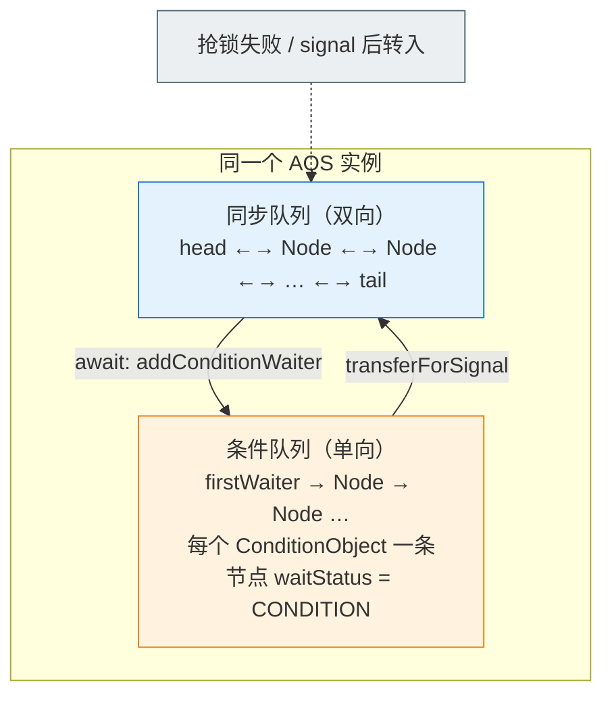

# 🔐 八、JUC 并发工具

> 本篇回答：AQS 凭什么用一套骨架支撑 `ReentrantLock`/`Semaphore`/`CountDownLatch`？`volatile int state` 和 CLH 变体等待队列怎么协作？公平锁怎么实现、非公平锁为什么更快却可能饿死？`StampedLock` 的乐观读为什么必须 `validate`？`LongAdder` 为什么比 `AtomicLong` 快？`ConcurrentHashMap` 1.8 为什么放弃分段锁、多线程怎么协助扩容？`CompletableFuture` 不传线程池为什么会把并行流拖死？
> 偏**源码骨架 + 选型决策**，每个结论给 WHY 和具体翻车场景。
> 边界：线程基础、`synchronized` 锁升级、JMM/`volatile`/happens-before、CAS 概念、死锁、`ThreadLocal` 见 [[4-多线程与内存模型]]；线程池见 [[5-线程池]]。

---

## 一、全景与本文边界

### 1.1 JUC 的四层结构

| 层 | 内容 | 归属 |
|---|---|---|
| ④ 任务编排 | `CompletableFuture`、`ExecutorCompletionService` | 本文 §九 / [[5-线程池]] |
| ③ 并发容器 | `ConcurrentHashMap`、`CopyOnWriteArrayList`、`BlockingQueue` 家族 | 本文 §八 |
| ② 同步器/工具 | `Lock`/`Condition`/`Semaphore`/`CountDownLatch`/`CyclicBarrier`/`Phaser`/`Atomic*`/`LongAdder` | 本文 §三~§七 |
| ① 同步基石 | `AOS`（持有线程）→ `AQS`（`state` + 队列）；`AQLS` 是 `long` 版 `state` | 本文 §二 |

> [!important] 记住这句话，面试就赢了一半
> **JUC 里的同步器几乎都不是"各自实现一套排队逻辑"，而是共用 AQS 这一个排队骨架**，各自只重写"什么叫做获取成功/释放成功"（即 `state` 的语义）。
> 所以 `ReentrantLock`、`Semaphore`、`CountDownLatch`、`ReentrantReadWriteLock` 的**排队、唤醒、中断、超时、条件队列代码是同一份**。

### 1.2 AOS / AQS / AQLS

| 类型 | 职责 | 关键成员 |
|---|---|---|
| `AbstractOwnableSynchronizer`（AOS） | 只记录"**当前独占线程是谁**"，是 AQS 父类 | `exclusiveOwnerThread` |
| `AbstractQueuedSynchronizer`（AQS） | 排队骨架 | `volatile int state` + `head`/`tail` + `ConditionObject` |
| `AbstractQueuedLongSynchronizer`（AQLS） | 与 AQS 同构，`state` 为 `volatile long` | 供超大计数场景 |

> [!note] 抽 AOS 的意义：`isHeldByCurrentThread()`、写锁判断、`isHeldExclusively()` 都要"持有者"信息；AQLS 的存在说明**排队算法与 `state` 位宽是正交的**。

---

## 二、AQS：整个 JUC 的同步基石

### 2.1 三个核心要素

1. **一个 `volatile int state`** —— "同步资源"，语义**完全由子类定义**：

| 实现 | `state` 语义 |
|---|---|
| `ReentrantLock` | 重入次数（0 = 空闲） |
| `Semaphore` | 剩余许可数 |
| `CountDownLatch` | 剩余未完成计数 |
| `ReentrantReadWriteLock` | **高 16 位读锁总数 + 低 16 位写锁重入数** |
| `ThreadPoolExecutor.Worker` | 0/1，且**不可重入** |
| `FutureTask` | NEW/COMPLETING/NORMAL/EXCEPTIONAL/CANCELLED/INTERRUPTED |

2. **一个 CLH 变体的双向等待队列** —— 抢不到就入队 + `LockSupport.park`，避免自旋烧 CPU。
3. **一套模板方法** —— 只把"什么算成功"下放给子类。

```java
public abstract class AbstractQueuedSynchronizer
        extends AbstractOwnableSynchronizer implements java.io.Serializable {
    private transient volatile Node head;   // 队列头（哨兵，不代表任何等待线程）
    private transient volatile Node tail;
    private volatile int state;             // 同步状态，语义由子类定义
}
```

> [!question] 为什么 `state` 是裸 `volatile int` 而不是 `AtomicInteger`？
> 因为 `state` 的更新**不是孤立的 CAS**，而是"CAS 成功之后还要做出队/唤醒等一串动作"，正确性由队列节点的 CAS + `park/unpark` 保证。裸 `volatile int` + `Unsafe.compareAndSwapInt`（JDK 9+ 为 `VarHandle`）省一层对象头，也避免二次包装。

### 2.2 CLH 变体：为什么是双向队列

原始 **CLH 锁**（Craig–Landin–Hagersten）是一种**自旋锁**：线程在**前驱节点**上自旋，队列只隐含在 `prev` 里（单向），无需显式 `head`、也无需 CAS 抢尾。AQS 做了两处关键改造：

| 维度 | 原始 CLH | AQS |
|---|---|---|
| 等待方式 | 前驱节点上**自旋** | 前驱释放时**显式 `unpark` 后继** |
| `next` 指针 | 无 | **有（双向）** |
| 入队竞争 | 无 | 需要 CAS `tail` |
| 超时/取消 | 难 | 靠 `waitStatus = CANCELLED` |

> [!important] 为什么非要 `next` 指针？
> 因为 AQS **不用自旋**而是"唤醒制"：前驱释放时必须能找到"下一个该唤醒的线程"，必须顺着 `next` 找。而 `next` 是**懒设置**的（`enq` 里 CAS 完 `tail` 之后才写 `pred.next`），所以存在"`tail` 已指向新节点、但 `pred.next` 还是 null"的瞬时窗口——这就是 `unparkSuccessor` 要**从 `tail` 反向扫 `prev`** 的原因。

### 2.3 `Node` 结构与 `waitStatus` 语义

```java
static final class Node {
    static final Node SHARED = new Node();   // 共享模式哨兵（复用 nextWaiter 字段，不额外占空间）
    static final Node EXCLUSIVE = null;      // 独占模式

    static final int CANCELLED =  1;  // 已取消（超时/中断），不参与竞争
    static final int SIGNAL    = -1;  // 后继在 park，我释放时要 unpark 它
    static final int CONDITION = -2;  // 在条件队列中等待（不在同步队列）
    static final int PROPAGATE = -3;  // 共享模式：释放需向后续传播

    volatile int waitStatus;   // 初始 0
    volatile Node prev;
    volatile Node next;
    volatile Thread thread;    // head 节点为 null
    Node nextWaiter;           // 条件队列单向 next；或 SHARED 模式标记
}
```

| `waitStatus` | 含义 | 谁设置 | 影响 |
|---|---|---|---|
| `0`（初始） | 普通等待节点 | 新建 | 需要被后继"认领"为前驱 |
| `SIGNAL = -1` | **后继在睡，我释放后必须唤醒它** | 后继在 `shouldParkAfterFailedAcquire` 里 CAS 前驱 | `release` 时 `h.waitStatus != 0` 才 `unparkSuccessor` |
| `CANCELLED = 1` | 该节点已放弃 | 中断/超时/异常时 `cancelAcquire` | `shouldParkAfterFailedAcquire` 跳过并断开链接 |
| `CONDITION = -2` | 在条件队列上等 | `addConditionWaiter` | `signal` 时 CAS 回 `0` 再转入同步队列 |
| `PROPAGATE = -3` | 共享释放需继续传播 | `doReleaseShared` | 防共享模式"唤醒丢失" |

> [!warning] 最容易记反的一条
> **`waitStatus` 描述的是"我对我后继的责任"，不是"我自己的状态"。**
> 所以节点要挂起前，必须先把**前驱**改成 `SIGNAL`（"哥，你释放时记得叫我"）。前驱是 `CANCELLED` 就往前跳过它。

### 2.4 模板方法模式

| 模式 | 子类实现 | 返回值语义 |
|---|---|---|
| 独占 | `tryAcquire(int)` / `tryRelease(int)` | `tryAcquire`：`true` 成功；`tryRelease`：`true` 表示**完全释放**（可唤醒后继），`false` 表示还持有（重入未退完） |
| 独占 | `isHeldExclusively()` | 是否当前线程独占（`Condition` 要校验） |
| 共享 | `tryAcquireShared(int)` / `tryReleaseShared(int)` | **负数失败；0 成功但后续共享获取也会失败（无剩余资源）；正数成功且后续可能也成功** |

> [!tip] 为什么 `tryAcquireShared` 要区分 0 和正数？
> 0 表示"我拿到了，但资源刚好用尽"——**不必再向后传播唤醒**；正数表示"还有余量"，需要 `doReleaseShared()` 继续唤醒后续共享节点。这就是 §2.7 传播机制的由来。

> [!danger] 两个必踩的坑
> ① AQS 默认实现的 `tryAcquire`/`tryRelease` 直接 `throw new UnsupportedOperationException()`，堆栈指向 AQS 而非你的类，容易误判为 JDK bug。
> ② **子类重写时绝不能在 `tryAcquire` 内做阻塞操作**（`Thread.sleep`、远程调用），否则占着同步语义不放。

### 2.5 独占模式获取全流程

```java
public final void acquire(int arg) {
    if (!tryAcquire(arg) &&
        acquireQueued(addWaiter(Node.EXCLUSIVE), arg))
        selfInterrupt();          // 在队列里被中断过，补一次自我中断
}
```

```
lock() → acquire(1)
   ├─ ① tryAcquire(1) ── 成功 ──► 返回（"快路径"，完全不进队列）
   └─ 失败
        ├─ ② addWaiter(EXCLUSIVE)  → 入同步队列尾部
        └─ ③ acquireQueued(node,1) → 自旋 + park，直到轮到自己
```

**① 快路径**（`ReentrantLock.NonfairSync`）：

```java
final boolean nonfairTryAcquire(int acquires) {
    final Thread current = Thread.currentThread();
    int c = getState();
    if (c == 0) {
        if (compareAndSetState(0, acquires)) {          // CAS 抢
            setExclusiveOwnerThread(current);           // 记录持有者（AOS）
            return true;
        }
    } else if (current == getExclusiveOwnerThread()) {  // 是自己 → 重入
        int nextc = c + acquires;
        if (nextc < 0) throw new Error("Maximum lock count exceeded");
        setState(nextc);                                // 无需 CAS：只有持有者能到这
        return true;
    }
    return false;
}
```

> [!note] 重入时为什么用 `setState` 而不是 CAS？
> 能到这行的前提是 `current == getExclusiveOwnerThread()`，即**只有锁持有者自己会改 `state`**，独占语义下不存在并发写，裸写即可（`volatile` 保证可见性）。这也是"`state` 不必是 `AtomicInteger`"的直接证据。

**② 入队**：

```java
private Node addWaiter(Node mode) {
    Node node = new Node(Thread.currentThread(), mode);
    Node pred = tail;
    if (pred != null) {                       // 队列已初始化：先试一次快速入队
        node.prev = pred;
        if (compareAndSetTail(pred, node)) {
            pred.next = node;                 // ← 在 CAS 之后，可能还没执行就被别人看到
            return node;
        }
    }
    enq(node);                                // 队列为空 或 CAS 失败 → 自旋 enq
    return node;
}
private Node enq(final Node node) {
    for (;;) {
        Node t = tail;
        if (t == null) {                      // 空队列先造一个虚拟 head
            if (compareAndSetHead(new Node())) tail = head;
        } else {
            node.prev = t;
            if (compareAndSetTail(t, node)) { t.next = node; return t; }
        }
    }
}
```

> [!important] `head` 是哨兵，不是等待线程
> 队首 `head` 的 `thread == null`、`waitStatus == 0`，代表"**已拿到锁正在执行的那个线程**"（或初始空节点）。所以判断"轮到我了吗"是 `node.predecessor() == head`，而不是 `node == head`。推论：**AQS 队列长度 = 实际排队线程数**，队首不占线程。

**③ `acquireQueued` 自旋 + park**：

```java
final boolean acquireQueued(final Node node, int arg) {
    boolean failed = true;
    try {
        boolean interrupted = false;
        for (;;) {
            final Node p = node.predecessor();
            if (p == head && tryAcquire(arg)) {   // 只有前驱是 head 才有资格再抢一次
                setHead(node);                    // 我成为新哨兵
                p.next = null;                    // help GC：断开旧 head
                failed = false;
                return interrupted;
            }
            if (shouldParkAfterFailedAcquire(p, node) &&   // 先把前驱改成 SIGNAL
                parkAndCheckInterrupt())                   // 再 LockSupport.park
                interrupted = true;
        }
    } finally {
        if (failed) cancelAcquire(node);          // 抛异常时清理自己
    }
}
private static boolean shouldParkAfterFailedAcquire(Node pred, Node node) {
    int ws = pred.waitStatus;
    if (ws == Node.SIGNAL) return true;           // 前驱已承诺叫我 → 安心 park
    if (ws > 0) {                                  // 前驱已取消 → 一直往前找有效前驱
        do { node.prev = pred = pred.prev; } while (pred.waitStatus > 0);
        pred.next = node;
    } else {
        compareAndSetWaitStatus(pred, ws, Node.SIGNAL);  // 0/PROPAGATE → SIGNAL
    }
    return false;                                  // 本轮不 park，回去再抢一次
}
```

| 设计 | 原因 |
|---|---|
| 只有 `p == head` 才 `tryAcquire` | 避免排队线程集体自旋抢锁，造成惊群与无谓 CAS 流量 |
| 第一次 `shouldParkAfterFailedAcquire` 返回 `false` | 给"前驱即将释放"留一次重试机会，**可能省掉一次 park/unpark 上下文切换** |
| `parkAndCheckInterrupt()` 里 `Thread.interrupted()` 会**清标志** | 所以中断信息要靠返回值带回 `acquire`，最后 `selfInterrupt()` 补回来 |
| `setHead(node)` 且 `p.next = null` | 让旧 head 不可达，帮助 GC |

### 2.6 释放流程：`release` 与 `unparkSuccessor`

```java
public final boolean release(int arg) {
    if (tryRelease(arg)) {                    // 子类说"我彻底释放了"
        Node h = head;
        if (h != null && h.waitStatus != 0)   // waitStatus==0 说明没有后继在等
            unparkSuccessor(h);
        return true;
    }
    return false;                             // 重入还没退完，不唤醒
}
private void unparkSuccessor(Node node) {
    int ws = node.waitStatus;
    if (ws < 0) compareAndSetWaitStatus(node, ws, 0);   // 清掉 SIGNAL/PROPAGATE
    Node s = node.next;
    if (s == null || s.waitStatus > 0) {                // 后继为空或已取消
        s = null;
        for (Node t = tail; t != null && t != node; t = t.prev)   // ★ 从尾部反向扫
            if (t.waitStatus <= 0) s = t;
    }
    if (s != null) LockSupport.unpark(s.thread);
}
```

```java
// ReentrantLock.tryRelease
protected final boolean tryRelease(int releases) {
    int c = getState() - releases;
    if (Thread.currentThread() != getExclusiveOwnerThread())
        throw new IllegalMonitorStateException();   // 没持有锁就 unlock → IMSE
    boolean free = false;
    if (c == 0) {                                   // 重入全部退完才算真释放
        free = true;
        setExclusiveOwnerThread(null);              // ★ 先清持有者
    }
    setState(c);                                    // ★ 后写 state
    return free;
}
```

> [!important] 面试点：为什么要**从 `tail` 反向**找？
> 因为 `next` 是懒设置的：`addWaiter` 先写 `node.prev`、CAS `tail` 成功，**之后**才写 `pred.next`。若前驱此时释放并只顺 `next` 找，就**看不到新入队节点**，造成唤醒丢失、线程永久挂起。反向扫安全，因为 `prev` 在 CAS `tail` 之前就已设置好。

> [!tip] `tryRelease` 里两句的**顺序**有讲究
> 先 `setExclusiveOwnerThread(null)`、后 `setState(0)`。因为 `state` 是 `volatile` 写，它之前的写（清持有者）对其他线程可见；反过来可能出现"别人看到 `state==0` 但持有者还是我"的窗口。
> 另外 `unlock()` 会校验调用者是否是持有者，不是就抛 `IllegalMonitorStateException`。

### 2.7 共享模式与传播（`setHeadAndPropagate`）

```java
public final void acquireShared(int arg) {
    if (tryAcquireShared(arg) < 0)          // 快路径：返回非负即成功
        doAcquireShared(arg);
}
private void doAcquireShared(int arg) {
    final Node node = addWaiter(Node.SHARED);
    boolean failed = true;
    try {
        boolean interrupted = false;
        for (;;) {
            final Node p = node.predecessor();
            if (p == head) {
                int r = tryAcquireShared(arg);
                if (r >= 0) {
                    setHeadAndPropagate(node, r);       // ★ 与独占模式的核心差异
                    p.next = null;
                    if (interrupted) selfInterrupt();
                    failed = false;
                    return;
                }
            }
            if (shouldParkAfterFailedAcquire(p, node) && parkAndCheckInterrupt())
                interrupted = true;
        }
    } finally { if (failed) cancelAcquire(node); }
}

private void setHeadAndPropagate(Node node, int propagate) {
    Node h = head;
    setHead(node);
    // propagate > 0：还有余量，必须继续唤醒
    // h.waitStatus < 0：旧 head 曾处于 SIGNAL/PROPAGATE，暗示可能还有等待者
    if (propagate > 0 || h == null || h.waitStatus < 0 ||
        (h = head) == null || h.waitStatus < 0) {
        Node s = node.next;
        if (s == null || s.isShared())          // 后继是共享节点才继续传播
            doReleaseShared();
    }
}
private void doReleaseShared() {
    for (;;) {
        Node h = head;
        if (h != null && h != tail) {
            int ws = h.waitStatus;
            if (ws == Node.SIGNAL) {
                if (!compareAndSetWaitStatus(h, Node.SIGNAL, 0)) continue;
                unparkSuccessor(h);
            } else if (ws == 0 && !compareAndSetWaitStatus(h, 0, Node.PROPAGATE)) {
                continue;                        // ★ 设 PROPAGATE，防止传播断链
            }
        }
        if (h == head) break;                    // head 没变，传播结束
    }
}
```

> [!important] `PROPAGATE` 到底解决什么问题？
> 场景：共享资源被释放且 `tryAcquireShared` 返回 0（刚好用完），理论上"后面的兄弟也拿不到，不必唤醒"。但存在竞态：A 释放唤醒 B，B 拿走后返回 0 判断"不必传播"；同时 C 也在释放唤醒 D……**若两次释放之间的传播被优化掉，D 可能永远收不到唤醒**。
> `PROPAGATE` 就是"宁可多唤醒一次，也不能漏唤醒"的保险丝。代价是多余 `unpark`，但 `unpark` 幂等且廉价，远好于漏唤醒导致线程永久挂起。

### 2.8 `state` 在独占与共享下的语义差异

| 维度 | 独占模式 | 共享模式 |
|---|---|---|
| 代表实现 | `ReentrantLock`、`WriteLock` | `Semaphore`、`CountDownLatch`、`ReadLock` |
| `state` 语义 | **持有者身份 + 重入次数**（0 = 空闲） | **剩余资源/许可数**（0 = 耗尽，不一定空闲） |
| 是否记录持有线程 | **必须**（AOS） | **不记录**（任何线程都能拿） |
| 增减方向 | 获取 `+1`，释放 `-1` | `Semaphore` 获取 `-1` 释放 `+1`；`CountDownLatch` 只减不增 |
| 重入 | 支持（`state` 累加） | **一般不支持**（`Semaphore` 不重入） |
| 唤醒方式 | `unparkSuccessor(head)` 唤醒一个 | `setHeadAndPropagate` + `doReleaseShared` 链式传播 |
| `Condition` | **支持** | **不支持**（AQS 抛 `UnsupportedOperationException`） |

> [!warning] "`Semaphore(1)` 和 `ReentrantLock` 一样吗？"——**不一样**
> `Semaphore(1)` **不可重入**（同一线程第二次 `acquire()` 会把自己挂死），也不记录持有者，因此**任何线程都能 `release()`**（可做跨线程信号传递）。这在"用信号量做一次性门闩"时反而是优点。

### 2.9 中断与超时支持

```java
public final void acquireInterruptibly(int arg) throws InterruptedException {
    if (Thread.interrupted()) throw new InterruptedException();
    if (!tryAcquire(arg)) doAcquireInterruptibly(arg);
}
private void doAcquireInterruptibly(int arg) throws InterruptedException {
    final Node node = addWaiter(Node.EXCLUSIVE);
    boolean failed = true;
    try {
        for (;;) {
            final Node p = node.predecessor();
            if (p == head && tryAcquire(arg)) { setHead(node); p.next = null; failed = false; return; }
            if (shouldParkAfterFailedAcquire(p, node) && parkAndCheckInterrupt())
                throw new InterruptedException();     // ★ 直接抛，不再"补中断后继续等"
        }
    } finally { if (failed) cancelAcquire(node); }
}

private boolean doAcquireNanos(int arg, long nanosTimeout) throws InterruptedException {
    if (nanosTimeout <= 0L) return false;
    final long deadline = System.nanoTime() + nanosTimeout;
    final Node node = addWaiter(Node.EXCLUSIVE);
    boolean failed = true;
    try {
        for (;;) {
            final Node p = node.predecessor();
            if (p == head && tryAcquire(arg)) { setHead(node); p.next = null; failed = false; return true; }
            nanosTimeout = deadline - System.nanoTime();
            if (nanosTimeout <= 0L) return false;              // 超时返回 false
            if (shouldParkAfterFailedAcquire(p, node) &&
                nanosTimeout > spinForTimeoutThreshold)        // ★ 1000ns 阈值
                LockSupport.parkNanos(this, nanosTimeout);
            if (Thread.interrupted()) throw new InterruptedException();
        }
    } finally { if (failed) cancelAcquire(node); }
}
```

| 方法 | 中断行为 | 超时 | 是否入队 |
|---|---|---|---|
| `acquire` | **忽略**，挂起中被中断后**继续等**，最终成功再补中断标志 | 无 | 失败才入队 |
| `acquireInterruptibly` | **立即抛 `InterruptedException`** 并出队 | 无 | 失败才入队 |
| `tryAcquireNanos` | 抛 `InterruptedException` | **有**，超时 `false` | 失败才入队 |
| `tryAcquire` | 不涉及 | 无 | **完全不入队**（非阻塞） |

> [!tip] `spinForTimeoutThreshold = 1000L` 纳秒
> 剩余等待时间极短时，`parkNanos` 的开销（系统调用 + 线程切换）比自旋更大，AQS 直接自旋跑完剩余时间。**通用直觉：< 1 微秒的等待，自旋比挂起划算**（`SynchronousQueue`、`ForkJoinPool`、`LongAdder` 都是这个思路）。

> [!warning] 中断被"吞掉"的经典翻车
> `lockInterruptibly()` 抛出的 `InterruptedException` 若被 `catch (Exception e) { log.error(...) }` 吞掉且**未 `Thread.currentThread().interrupt()`**，中断标志就丢了：上层 `shutdownNow()`、`Future.cancel(true)`、`CompletableFuture.cancel` 全部失效，任务"看起来还在跑，其实已取消"。正确姿势：捕获后恢复中断标志再结束，或直接向上抛。

### 2.10 条件队列：`ConditionObject`

**两把队列物理分离**：



| | 同步队列 | 条件队列 |
|---|---|---|
| 所在 | AQS 的 `head`/`tail` | `ConditionObject` 的 `firstWaiter`/`lastWaiter` |
| 方向 | **双向**（`prev`/`next`） | **单向**（`nextWaiter`） |
| 节点状态 | `SIGNAL`/`CANCELLED`/`0`/`PROPAGATE` | `CONDITION` |
| 代表 | "我在抢锁" | "我在等条件成立，且**我已释放了锁**" |

```java
public final void await() throws InterruptedException {
    if (Thread.interrupted()) throw new InterruptedException();
    Node node = addConditionWaiter();          // ① 加入条件队列，waitStatus=CONDITION
    int savedState = fullyRelease(node);       // ② 完全释放锁（含所有重入次数）并保存
    int interruptMode = 0;
    while (!isOnSyncQueue(node)) {             // ③ 还在条件队列就睡
        LockSupport.park(this);
        if ((interruptMode = checkInterruptWhileWaiting(node)) != 0) break;
    }
    if (acquireQueued(node, savedState) && interruptMode != THROW_IE)  // ④ 重新抢锁并恢复重入次数
        interruptMode = REINTERRUPT;
    if (node.nextWaiter != null) unlinkCancelledWaiters();
    if (interruptMode != 0) reportInterruptAfterWait(interruptMode);
}

public final void signal() {
    if (!isHeldExclusively())                  // ★ 必须先持有独占锁
        throw new IllegalMonitorStateException();
    Node first = firstWaiter;
    if (first != null) doSignal(first);
}
private void doSignal(Node first) {
    do {
        if ((firstWaiter = first.nextWaiter) == null) lastWaiter = null;
        first.nextWaiter = null;
    } while (!transferForSignal(first) && (first = firstWaiter) != null);
}
final boolean transferForSignal(Node node) {
    if (!compareAndSetWaitStatus(node, Node.CONDITION, 0)) return false;   // 已取消
    Node p = enq(node);                        // ★ 转入同步队列
    int ws = p.waitStatus;
    if (ws > 0 || !compareAndSetWaitStatus(p, ws, Node.SIGNAL))
        LockSupport.unpark(node.thread);       // 前驱已取消/改不了 → 直接唤醒让它重试
    return true;
}
```

> [!important] 三个必须记住的点
> 1. **`await()` 会释放锁**，而且是 `fullyRelease`——`ReentrantLock` 重入了 3 次，`await()` 一次性把 `state` 归零，被唤醒后再 `acquireQueued(node, savedState=3)` **恢复成 3**。所以 `await` 期间别的线程可以拿到锁。
> 2. **`signal()` 不释放锁**，只把节点从条件队列搬到同步队列；被唤醒的线程**必须重新竞争锁**才能从 `await()` 返回。
> 3. **`await()`/`signal()` 都要求先持有独占锁**，否则 `IllegalMonitorStateException`（`isHeldExclusively()` 校验），与 `Object.wait()` 必须在 `synchronized` 块里同理。

> [!danger] 为什么必须用 `while` 而不是 `if` 包住 `await()`？
> 因为**被 `signal` 唤醒 ≠ 条件成立**：从 `await()` 返回到真正拿到锁之间有窗口，别的线程可能已把条件改回去（惊群 + 条件被抢）。标准模板：
> ```java
> lock.lock();
> try {
>     while (!conditionMet()) {      // ★ while，不是 if
>         condition.await();
>     }
>     doWork();
> } finally { lock.unlock(); }
> ```
> 用两个 `Condition`（`notFull`/`notEmpty`）配合 `while`，就是 `ArrayBlockingQueue` 的教科书实现。

### 2.11 本节高频追问

| 追问 | 答案骨架 |
|---|---|
| AQS 用什么数据结构？ | `volatile int state` + CLH **变体双向队列**（`head` 哨兵 + `tail`），节点 `Node`，用 `LockSupport.park` 阻塞 |
| 为什么是双向队列？ | 原始 CLH 单向 + 自旋；AQS 改成"唤醒制"，前驱要能找到后继 → 需要 `next`；而 `next` 懒设置，故 `unparkSuccessor` 从 `tail` 反扫 `prev` |
| `waitStatus` 有哪些值？ | `0`/`SIGNAL(-1)`/`CANCELLED(1)`/`CONDITION(-2)`/`PROPAGATE(-3)`，**含义是"对后继的责任"** |
| 模板方法有哪几个？ | `tryAcquire`/`tryRelease`/`tryAcquireShared`/`tryReleaseShared`/`isHeldExclusively` |
| `acquire` 在队列里被中断会怎样？ | 继续等待，只记录标志；拿到锁后 `selfInterrupt()` 补回来（体现"不可中断的锁获取"） |
| 条件队列与同步队列关系？ | 两把独立队列，`await` 从同步队列"消失"进条件队列并释放锁，`signal` 把节点搬回同步队列（不释放锁） |

---

## 三、`ReentrantLock`

### 3.1 可重入的实现

`ReentrantLock` **不继承** AQS，而是持有一个继承 AQS 的内部类 `Sync`，把 `Lock` 接口转调给它。

```java
public class ReentrantLock implements Lock, java.io.Serializable {
    private final Sync sync;                     // FairSync 或 NonfairSync
    abstract static class Sync extends AbstractQueuedSynchronizer { abstract void lock(); }
    static final class NonfairSync extends Sync { /* ... */ }
    static final class FairSync   extends Sync { /* ... */ }
}
```

可重入只需两个条件（源码就这两处）：

| 条件 | 源码 | 作用 |
|---|---|---|
| `state == 0` 时 CAS 抢 | `compareAndSetState(0, 1)` + `setExclusiveOwnerThread(current)` | 首次获取 |
| `current == getExclusiveOwnerThread()` 时 `state++` | `setState(c + acquires)` | 重入，**免 CAS** |

> [!danger] 重入是"锁泄漏"的隐蔽来源
> ```java
> lock.lock();
> try { doA(); }          // doA 内部也 lock()
> finally { lock.unlock(); }   // ← 只退了一层
> ```
> 必须**每一层 `lock()` 配一个 `unlock()`**。`state` 不为 0 就永远不会唤醒后继，而且**不报错**——线程只是慢慢全堆在 `park` 里，直到线程池拒绝任务。这是线上最难查的一类"逻辑死锁"。

### 3.2 公平锁 vs 非公平锁

```java
// ── 非公平：lock() 先无条件抢一次（插队）
static final class NonfairSync extends Sync {
    final void lock() {
        if (compareAndSetState(0, 1))            // ★ 直接抢，不管队列里有没有人
            setExclusiveOwnerThread(Thread.currentThread());
        else acquire(1);
    }
}
// ── 公平：直接走 acquire，由 tryAcquire 里的队列检查决定
static final class FairSync extends Sync {
    final void lock() { acquire(1); }
    protected final boolean tryAcquire(int acquires) {
        final Thread current = Thread.currentThread();
        int c = getState();
        if (c == 0) {
            if (!hasQueuedPredecessors() &&      // ★ 队列里有人排队 → 我让位
                compareAndSetState(0, acquires)) { setExclusiveOwnerThread(current); return true; }
        } else if (current == getExclusiveOwnerThread()) {
            int nextc = c + acquires;
            if (nextc < 0) throw new Error("Maximum lock count exceeded");
            setState(nextc); return true;
        }
        return false;
    }
}
// AQS 提供
public final boolean hasQueuedPredecessors() {
    Node t = tail; Node h = head; Node s;
    return h != t && ((s = h.next) == null || s.thread != Thread.currentThread());
    // h.next == null → 有线程正在入队（CAS tail 成功但 next 未设），也算"有人排队"
    // s.thread == current → 我就是队首，视为无前驱
}
```

| 维度 | 非公平锁（默认） | 公平锁 |
|---|---|---|
| `lock()` | 先 CAS 抢一次，失败才 `acquire` | 直接 `acquire` |
| `tryAcquire` 额外判断 | 无 | `hasQueuedPredecessors()` |
| 吞吐 | **更高** | 较低（多一次判断 + 更频繁的上下文切换） |
| 是否饥饿 | **可能**（新线程反复插队） | **基本不会**（严格 FIFO） |
| 触发 `park` 频率 | 低（"抢到就跑"） | 高（每次都要让位给队首） |

> [!important] 非公平锁为什么吞吐更高？两点，务必背下来
> 1. **省一次上下文切换**：持锁线程刚 `unlock()`（此刻 `state==0`），CPU 上正在跑的"新来线程"能立刻 CAS 抢到并继续执行；而队列头节点此刻**还躺在 `park` 里**，唤醒它要走 `unpark` → 调度 → 恢复现场，代价远大于一次 CAS。
> 2. **CPU 缓存友好**：让已在运行的线程继续跑，数据大概率还在 L1/L2；换线程意味着缓存失效。
> **代价是可能饥饿**。但非公平**并非完全不公平**——一旦某线程真的 `park` 了，`unparkSuccessor` 唤醒的仍是队首，即"**允许插队，不允许越级唤醒**"。

> [!warning] `tryLock()` 会破坏公平性
> `ReentrantLock.tryLock()`（无参）直接调用 `sync.nonfairTryAcquire(1)`——**即使你构造的是公平锁**。源码注释明确："Even when this lock has been set to use a fair ordering policy, a call to `tryLock()` will immediately acquire the lock if it is available." 这是公平锁使用者最常踩的坑。

### 3.3 API 语义对比

| 方法 | 阻塞 | 可中断 | 超时 | 失败返回 | 是否插队 | 典型场景 |
|---|---|---|---|---|---|---|
| `lock()` | 是 | **否**（被中断只记标志，最终仍会拿到锁并补中断） | 无 | 无 | 非公平下可 | 绝大多数场景 |
| `lockInterruptibly()` | 是 | **是** | 无 | 抛 `InterruptedException` | 同 `lock` | 可取消的长等待（任务取消/`shutdownNow`） |
| `tryLock()` | **否** | 不涉及 | 无 | `false` | **总是**（无视公平设置） | 尝试型逻辑、防死锁退让 |
| `tryLock(long, TimeUnit)` | 是（限时） | **是** | 有 | `false`（超时）/ 抛 IE | 公平锁遵守公平 | 降级熔断（"3 秒拿不到就走兜底"） |
| `unlock()` | —— | —— | —— | 非持有者调用抛 `IllegalMonitorStateException` | —— | 必须放 `finally` |
| `newCondition()` | —— | —— | —— | 共享模式不可用 | —— | 多条件等待 |
| `getHoldCount()`/`isHeldByCurrentThread()`/`isLocked()`/`getQueueLength()`/`hasQueuedThreads()`/`isFair()` | —— | —— | —— | 监控诊断 | —— | 排查锁堆积 |

> [!danger] `tryLock(timeout)` 的正确写法（超时时间要在 `while` 外面）
> ```java
> // ❌ 错误：每次循环都重置超时，实际可能等几十分钟
> while (true) { if (lock.tryLock(1, TimeUnit.SECONDS)) break; }
> // ✅ 正确：把"总超时"一次交给 AQS
> if (lock.tryLock(3, TimeUnit.SECONDS)) {
>     try { /* 临界区 */ } finally { lock.unlock(); }
> } else {
>     // 兜底：降级、抛业务异常、返回缓存
> }
> ```

### 3.4 `ReentrantLock` vs `synchronized`

| 维度 | `synchronized` | `ReentrantLock` |
|---|---|---|
| 层级 | **JVM 关键字**（`monitorenter`/`monitorexit` + 对象头 Mark Word） | **JDK API**（`java.util.concurrent.locks`） |
| 释放 | 自动（字节码保证，异常也释放） | **必须手动 `finally { unlock(); }`** |
| 可中断 | 否 | **`lockInterruptibly()`** |
| 可超时 | 否 | **`tryLock(timeout)`** |
| 可公平 | 否 | **可（`new ReentrantLock(true)`）** |
| 条件变量 | 1 个（`wait`/`notifyAll`，唤醒"任意一个"） | **N 个 `Condition`，可精确唤醒某类等待者** |
| 非阻塞尝试 | 否 | **`tryLock()`** |
| 性能 | JDK 6 起有偏向锁/轻量级锁优化（偏向锁在 JDK 15 起默认关闭、JDK 18 起废弃），低竞争下极快 | 始终 CAS + 队列，低竞争下略慢 |
| 死锁诊断 | `jstack` 能自动识别 `synchronized` 死锁 | **`jstack` 不认**，只能靠 `getOwner()` 等手段自查 |
| 可观测 | 黑盒 | `getQueueLength()`/`isLocked()`/`hasQueuedThreads()` |
| 代码风险 | 低（不会忘记释放） | 高（忘 `unlock`、跨方法加解锁、异常吞掉） |

> [!important] 选型结论（面试就这么答）
> **能用 `synchronized` 就用 `synchronized`**：简单、不会漏解锁、JIT 还能优化。
> **需要以下任一能力才上 `ReentrantLock`**：① 可中断；② 可超时（防死锁兜底）；③ 公平；④ **多个条件变量**（生产者/消费者 `notFull`/`notEmpty`——最有说服力的理由，用 `synchronized` 只能 `notifyAll` 全员惊群）；⑤ 需要监控锁队列长度。
> 实例：`ArrayBlockingQueue` 用 `notFull`/`notEmpty` 两个 `Condition`，入队只唤醒消费者、出队只唤醒生产者；换成 `synchronized` + `notifyAll`，每次操作都唤醒全部等待线程，高竞争下吞吐能差数倍。

---

## 四、`ReentrantReadWriteLock`

### 4.1 读写分离的意义

| 请求组合 | 是否互斥 | 说明 |
|---|---|---|
| 读 + 读 | **不互斥** | 核心收益：读并发 |
| 读 + 写 | **互斥** | 否则读到中间态 |
| 写 + 写 | **互斥** | 必须 |
| 写 + 读（同线程） | 允许（降级） | 见 §4.3 |

> [!question] 什么场景下它真的有用？
> 只有**读操作足够耗时**（不是读一个 `volatile` 字段那么快）、**读远多于写**、且临界区不短时才有意义——因为 `ReentrantReadWriteLock` 本身比 `ReentrantLock` 更重（`state` 拆位 + `HoldCounter` 走 `ThreadLocal`）。
> **反面案例**：`get()` 只返回一个 `int` 字段，用读写锁反而比 `synchronized` 慢；此时应直接用 `volatile` 或无锁结构。

### 4.2 `state` 高低 16 位

```java
static final int SHARED_SHIFT   = 16;
static final int SHARED_UNIT    = (1 << SHARED_SHIFT);      // 65536
static final int MAX_COUNT      = (1 << SHARED_SHIFT) - 1;  // 65535
static final int EXCLUSIVE_MASK = (1 << SHARED_SHIFT) - 1;  // 65535
static int sharedCount(int c)    { return c >>> SHARED_SHIFT; }   // 高 16 位 = 读锁总数
static int exclusiveCount(int c) { return c & EXCLUSIVE_MASK; }   // 低 16 位 = 写锁重入数
```

```
                state (32 bit int)
 31                              16 15                              0
 ┌───────────────────────────────┬─────────────────────────────────┐
 │      读锁持有总数 (高 16 位)    │     写锁重入次数 (低 16 位)      │
 └───────────────────────────────┴─────────────────────────────────┘
 读锁加锁：state += 65536 (SHARED_UNIT)      写锁加锁：state += 1
```

> [!important] 为什么读锁加锁是 `+65536` 而不是 `+1`？
> 因为高低位复用同一个 `state`，读锁计数占高 16 位，所以"读锁 +1"必须表现为整个 `state` +65536。这样**一次 CAS 就能同时判断读写状态**（位运算即可），避免两个独立 `volatile` 变量带来的竞态。
> 代价：读锁/写锁各自上限 **65535**，超过时抛 `Error("Maximum lock count exceeded")`。要更大用 `StampedLock` 或 `AQLS`。

```java
// 写锁 tryAcquire 的关键判断
protected final boolean tryAcquire(int acquires) {
    Thread current = Thread.currentThread();
    int c = getState();
    int w = exclusiveCount(c);
    if (c != 0) {
        // c != 0 但 w == 0 → 有读锁，写锁不能获取
        if (w == 0 || current != getExclusiveOwnerThread()) return false;
        if (w + exclusiveCount(acquires) > MAX_COUNT) throw new Error("Maximum lock count exceeded");
        setState(c + acquires);                     // 写锁重入
        return true;
    }
    if (writerShouldBlock() || !compareAndSetState(c, c + acquires)) return false;
    setExclusiveOwnerThread(current);
    return true;
}

// 读锁 tryAcquireShared 的 firstReader 优化
protected final int tryAcquireShared(int unused) {
    Thread current = Thread.currentThread();
    int c = getState();
    // ★ 写锁被别的线程持有 → 读锁不能获取；但写锁持有者是"我自己"时允许（降级的关键！）
    if (exclusiveCount(c) != 0 && getExclusiveOwnerThread() != current) return -1;

    int r = sharedCount(c);
    if (!readerShouldBlock() && r < MAX_COUNT &&
        compareAndSetState(c, c + SHARED_UNIT)) {   // 一次 CAS 完成"读锁+1"
        if (r == 0) {                                // 我是第一个读者
            firstReader = current;                   // ★ 无需 ThreadLocal 就能记重入
            firstReaderHoldCount = 1;
        } else if (firstReader == current) {
            firstReaderHoldCount++;                  // ★ 零成本重入
        } else {
            HoldCounter rh = cachedHoldCounter;
            if (rh == null || rh.tid != getThreadId(current)) cachedHoldCounter = rh = readHolds.get();
            else if (rh.count == 0) readHolds.set(rh);
            rh.count++;                              // 其他线程走 ThreadLocal
        }
        return 1;
    }
    return fullTryAcquireShared(current);            // 慢路径：自旋重试 + 处理重入
}
```

> [!important] `getExclusiveOwnerThread() != current` 这个"例外"就是**降级的入口**
> 读锁逻辑明确留了一条缝：**写锁是当前线程自己持有时，允许再获取读锁**。这就是降级能实现的原因。反过来，读锁持有期间想获取写锁会被 `c != 0 && w == 0` 直接拒绝——**升级必须显式先放开读锁**。

### 4.3 降级支持、升级不支持

| | 降级（写 → 读） | 升级（读 → 写） |
|---|---|---|
| 是否允许 | **允许** | **不允许**（直接失败，不阻塞等待） |
| 源码依据 | `tryAcquireShared` 里 `exclusiveCount(c) != 0 && getExclusiveOwnerThread() != current` 才拒绝 | `tryAcquire` 里 `c != 0` 且 `w == 0` → `return false` |
| 为什么 | 我有写锁就意味着**没有任何其他读/写持有者**，再加读锁不破坏一致性 | 升级需要"拿到写锁"，但我自己的读锁还没放，而写锁要求"无任何读者"才能拿 → **自己和自己死锁**。要支持升级只能"先放读锁再抢写锁"，而这两步之间**中间态对其他线程可见**，会读到脏数据，破坏原本想保护的一致性 |
| 用途 | 写完立刻以读锁身份继续读，保持原子性 | 无。正确做法：先 `readLock.unlock()`，再用普通写锁重做校验 |

### 4.4 `HoldCounter` 与 `firstReader` 优化

**为什么需要 `HoldCounter`？** `state` 高 16 位只记"**总读锁数**"，不区分线程；但读锁必须支持重入——`T1` 拿两次读锁，`T1` `unlock()` 一次不能把读锁全放了。所以要"每线程自己的重入次数"。

```java
static final class HoldCounter {
    int count = 0;
    final long tid = getThreadId(Thread.currentThread());   // ★ 存 tid 而非 Thread 引用，避免强引用
}
static final class ThreadLocalHoldCounter extends ThreadLocal<HoldCounter> {
    public HoldCounter initialValue() { return new HoldCounter(); }
}
private transient ThreadLocalHoldCounter readHolds;    // 每线程重入计数
private transient HoldCounter cachedHoldCounter;       // 缓存"上一个成功获取读锁的线程"
private transient Thread firstReader;                  // 第一个获取读锁的线程
private transient int firstReaderHoldCount;            // 它的重入次数
```

| 机制 | 覆盖场景 | 成本 |
|---|---|---|
| `firstReader` + `firstReaderHoldCount` | **只有一个读者**（读锁退化为无竞争） | 两个普通字段，**零 `ThreadLocal` 开销** |
| `cachedHoldCounter` | "上次拿读锁的线程"又来了（循环里反复加解锁） | 一次 `tid` 比较 |
| `readHolds`（`ThreadLocal`） | 多读者并发 | `ThreadLocal.get()`/`set()` 开销 |

> [!tip] 为什么 `HoldCounter.tid` 存 `long` 而不是引用 `Thread`？
> 否则形成 `Thread → ThreadLocalMap → HoldCounter → Thread` 的**自引用环**：`ThreadLocalMap` 的 key 是弱引用，但 value 强引用 Thread，会让"线程已死但 map 未清理"的对象图无法回收。
> 而 `firstReader`/`cachedHoldCounter` 是**普通字段**，若指向已死 `Thread` 就会把该 `Thread` 及其 `ThreadLocalMap`（可能很大）**一直挂在锁对象上**。所以 `ReadLock.unlock()` 在计数归零时会 `readHolds.remove()` 并把 `firstReader = null`。

```java
protected final boolean tryReleaseShared(int unused) {
    Thread current = Thread.currentThread();
    if (firstReader == current) {
        if (firstReaderHoldCount == 1) firstReader = null;   // ★ 断开对线程的引用
        else firstReaderHoldCount--;
    } else {
        HoldCounter rh = cachedHoldCounter;
        if (rh == null || rh.tid != getThreadId(current)) rh = readHolds.get();
        int count = rh.count;
        if (count <= 1) {
            readHolds.remove();                              // ★ 必须 remove，防泄漏
            if (count <= 0) throw unmatchedUnlockException();
        }
        --rh.count;
    }
    for (;;) {                                               // CAS 循环减 state
        int c = getState();
        int nextc = c - SHARED_UNIT;
        if (compareAndSetState(c, nextc))
            return nextc == 0;                               // 全放完 → 可唤醒等待的写锁
    }
}
```

### 4.5 互斥矩阵与常见误解

| 当前持有 \ 请求 | 读锁 | 写锁 |
|---|---|---|
| **无锁** | ✅ | ✅ |
| **读锁（本线程）** | ✅（重入） | ❌ **（不支持升级，直接失败）** |
| **读锁（其他线程）** | ✅ | ❌ |
| **写锁（本线程）** | ✅ **（降级）** | ✅（重入） |
| **写锁（其他线程）** | ❌ | ❌ |

> [!warning] 三个高频误解
> 1. **"读写锁能防止写饥饿"——错。** 默认非公平模式下 `readerShouldBlock()` 采用 `apparentlyFirstQueuedIsExclusive()`：**只要队列头是写锁请求，新来的读锁就排队**。这是 JDK 为缓解写饥饿加的补丁，但**不是强保证**（队列头不是写锁时读锁仍可插队）。真要严格，用公平模式。
> 2. **"读锁不能重入"——错。** 读锁完全可重入，靠 `HoldCounter`；真正不能的是"读锁升级为写锁"。
> 3. **"读写锁比 `ReentrantLock` 快"——错。** 只有读多写少、临界区有实际耗时时才快；纯字段读取场景，读写锁的簿记成本更高。

### 4.6 锁降级的正确写法

```java
public class CachedData {
    private final ReentrantReadWriteLock rwl = new ReentrantReadWriteLock();
    private final Lock r = rwl.readLock();
    private final Lock w = rwl.writeLock();
    private volatile boolean cacheValid;      // ★ 必须 volatile/原子
    private Object data;

    public void processCachedData() {
        r.lock();                              // ① 先乐观地读
        if (!cacheValid) {
            r.unlock();                        // ② 需要写：必须先放读锁（升级不可能）
            w.lock();                          // ③ 拿写锁
            try {
                if (!cacheValid) {             // ④ ★ 双重检查：可能别人已经写好了
                    data = loadData();
                    cacheValid = true;
                }
                r.lock();                      // ⑤ ★ 降级：持写锁时再拿读锁
            } finally {
                w.unlock();                    // ⑥ 放写锁，但读锁还在 → 不会有人插入修改
            }
        }
        try {
            use(data);                         // ⑦ 此刻持有读锁，data 是最新的且不会被改
        } finally {
            r.unlock();                        // ⑧ 放读锁
        }
    }
}
```

> [!important] 为什么降级要"持写锁时先拿读锁，再放写锁"？
> 若写成"放写锁 → 再拿读锁"，两步之间是**无锁窗口**，别的写线程可以在这个窗口里改掉 `data`，你再用读锁读到的就不是自己刚写的值——降级的意义正是"**从写状态无缝切换到读状态，保证这段期间数据不被改动**"。
> **注意**：降级后读锁保护的是"不让别人写"，不是"不让别人读"；JDK 也不保证"读锁一定立刻拿得到"，所以 `r.lock()` 必须在 `w.unlock()` 之前调用。

> [!danger] `cacheValid` 为什么必须是 `volatile`？
> 因为第一次 `if (!cacheValid)` 是在**只有读锁**时做的（读锁之间不互斥，多线程同时读）。普通字段在 JMM 下可能读到过期值（导致所有线程都进写分支、白排队），也可能出现"看到 `cacheValid=true` 但 `data` 还是 null"的重排序。
> 这引出一个关键认知：**读写锁只保证"临界区内互斥"，不改变 JMM 的可见性规则**——跨临界区传递的状态仍要靠 `volatile`/原子类。详见 [[4-多线程与内存模型]]。

---

## 五、`StampedLock`

### 5.1 与 `ReadWriteLock` 的根本差异

`StampedLock`（Java 8 引入）**不是基于 AQS 实现**——它自带一套 `WNode` 队列（用 `cowait` 字段实现"读节点挂多个读者"）。

| 维度 | `ReentrantReadWriteLock` | `StampedLock` |
|---|---|---|
| 底层 | AQS | **自研 `WNode` 队列，非 AQS** |
| **重入** | 支持 | **完全不支持**（重复加锁会死锁） |
| 锁的表示 | `Lock` 对象 | **`long stamp`**，解锁必须传回 |
| 解锁校验 | 线程身份 + 计数 | **stamp 匹配**（不合法则 `IllegalMonitorStateException`） |
| 中断 | `lockInterruptibly` | `readLock()`/`writeLock()` **不响应中断**（有 `readLockInterruptibly()`/`writeLockInterruptibly()` 变体） |
| 条件变量 | 写锁有 `newCondition()` | **没有 `Condition`** |
| 乐观读 | 无 | **有（核心卖点）** |
| 公平性 | 可选 | **无非公平/公平之分** |
| 性能 | 稍慢 | **"读多写少 + 读操作极短"时显著更快** |

> [!danger] 不支持重入最容易出人命
> ```java
> long stamp = sl.writeLock();
> try { doSomething(); }        // 内部又调 sl.writeLock() → ★ 永久死锁
> finally { sl.unlockWrite(stamp); }
> ```
> `ReentrantReadWriteLock` 会因重入正常返回，`StampedLock` 直接把自己挂死（**不抛异常、不打日志**）。
> **另一条**：不要把 `StampedLock` 用在递归/回调/可能触发同类方法的框架代码里，也不能用在需要 `Condition` 的场景。

### 5.2 乐观读与 `validate` 的必要性

乐观读 = **"我赌没人正在写"**：读前拿一个 stamp、**完全不加锁**地把数据读到局部变量，再校验 stamp 是否有效；失败才退化为悲观读锁。

```java
public class Point {
    private double x, y;
    private final StampedLock sl = new StampedLock();

    void move(double deltaX, double deltaY) {              // 写
        long stamp = sl.writeLock();
        try { x += deltaX; y += deltaY; }
        finally { sl.unlockWrite(stamp); }
    }

    double distanceFromOrigin() {                          // ★ 乐观读典型用法
        long stamp = sl.tryOptimisticRead();                // ① 拿乐观 stamp（不阻塞、不写）
        double currentX = x, currentY = y;                  // ② 读到本地变量（可能不一致！）
        if (!sl.validate(stamp)) {                          // ③ 校验期间有没有人写过
            stamp = sl.readLock();                          // ④ 有人写过 → 退化为悲观读重读
            try { currentX = x; currentY = y; }
            finally { sl.unlockRead(stamp); }
        }
        return Math.sqrt(currentX * currentX + currentY * currentY);   // ⑤ 只用局部变量算
    }
}
```

> [!important] 为什么必须把值读到**局部变量**？
> 乐观读期间没有任何互斥保护，`x`/`y` 可能被"读了一半"（读到新 `x` + 旧 `y`，即**撕裂读**）。
> `validate(stamp)` 只能告诉你"**这期间有没有发生过写**"，**它不会帮你把已经读脏的值修好**。正确姿势：**先把所有要用的字段一次性复制到局部变量 → 再 `validate` → 有效则只用局部变量计算，失效则加读锁重新复制一遍。**
> 若在 `validate` 之后又去读 `x`/`y`，读到的是"未受保护的新值"，等于白做。
> `validate` 的实现要点：stamp 的**第 8 位是"乐观读标记"**，其余位是版本号；`tryOptimisticRead` 返回 `version | RBITS`（未加锁时返回 `0`），`validate` 检查乐观位还在且版本号未变。

> [!warning] 乐观读里绝对不能调用可能阻塞的操作
> ```java
> long stamp = sl.tryOptimisticRead();
> Object v = remoteCall();          // ❌ 耗时/阻塞
> if (!sl.validate(stamp)) { ... }  // 校验几乎必然失败，还白搭一次远程调用
> ```
> 乐观读的收益来自"**临界区极短**"。中间一旦做 IO、DB 查询、`Thread.sleep`、获取另一把锁，失败率飙到接近 100%，反而比直接上读锁更慢。
> **铁律**：乐观读区间内只做**内存里的简单字段复制**。

### 5.3 适用场景

| 场景 | 推荐 |
|---|---|
| 读多写少 + 读操作很短（几个字段） + 无重入需求 | **`StampedLock` 乐观读** |
| 读多写少，但代码有重入/递归调用 | `ReentrantReadWriteLock` |
| 需要 `Condition`（生产者消费者） | `ReentrantReadWriteLock` 或 `ReentrantLock` |
| 纯互斥、临界区短 | `synchronized` 或 `ReentrantLock` |
| 计数类高频累加 | `LongAdder`（见 §7.3） |

> [!example] 真实收益量级（定性）
> 在"读操作只访问 2~4 个 `double` 字段、读写比 100:1"的场景下，`StampedLock` 乐观读相比 `ReentrantReadWriteLock` 的读吞吐有**数量级**优势——因为它彻底避免了读路径上的 CAS 写（`state` 修改会让所有 CPU 的缓存行失效）。
> 但只要读路径一变长或失败率上升，优势立刻消失甚至反超。**它是精确手术刀，不是通用替代品。**

---

## 六、同步工具

### 6.1 `CountDownLatch`：一次性门闩

**语义**：一个或多个线程等待"一组事件"全部完成；`state` = 剩余计数。

```java
private static final class Sync extends AbstractQueuedSynchronizer {
    Sync(int count) { setState(count); }
    int getCount() { return getState(); }
    protected int tryAcquireShared(int acquires) {
        return (getState() == 0) ? 1 : -1;       // ★ 只有归零才算"拿得到"
    }
    protected boolean tryReleaseShared(int releases) {
        for (;;) {                                // ★ CAS 循环减一
            int c = getState();
            if (c == 0) return false;             // 已归零，多余 countDown 无效
            int nextc = c - 1;
            if (compareAndSetState(c, nextc)) return nextc == 0;
        }
    }
}
public void await() throws InterruptedException { sync.acquireSharedInterruptibly(1); }
public void countDown() { sync.releaseShared(1); }
```

| 特性 | 说明 |
|---|---|
| **一次性** | `state` **只减不增**，归零后无法重置（`Sync` 是 `final`，也没暴露 setter）；要重用只能用 `CyclicBarrier` 或新建实例 |
| 可中断 | `await()` 可中断；`countDown()` 永不阻塞 |
| 谁等谁 | **await 方等 countDown 方**，单向 |
| 归零之后 | 后续 `await()` **立即返回**；后续 `countDown()` **无任何效果** |
| 基于 AQS | ✅ 共享模式 |

> [!danger] 两个必踩坑
> 1. **`countDown()` 必须放在 `finally`**。任务抛异常时不 `countDown`，主线程会**永远 `await` 下去**——这不是死锁（`jstack` 显示 `WAITING (parking)` 在 AQS 上），排查费劲。
> 2. **计数要精确**。比实际任务数少 → 门闩提前打开；多 → 永远等。用线程池时写成 `tasks.size()` 而不是硬编码。

### 6.2 `CyclicBarrier`：可重用 + 屏障动作

```java
public class CyclicBarrier {
    private final ReentrantLock lock = new ReentrantLock();     // ★ 组合，不是继承 AQS
    private final Condition trip = lock.newCondition();
    private final int parties;
    private final Runnable barrierCommand;
    private Generation generation = new Generation();
    private static class Generation { boolean broken; }         // 本代是否被打破

    private int dowait(boolean timed, long nanos) throws ... {
        final ReentrantLock lock = this.lock;
        lock.lock();
        try {
            final Generation g = generation;
            if (g.broken) throw new BrokenBarrierException();
            if (Thread.interrupted()) { breakBarrier(); throw new InterruptedException(); }

            int index = --count;
            if (index == 0) {                                    // ★ 我是最后一个
                boolean ranAction = false;
                try {
                    final Runnable command = barrierCommand;
                    if (command != null) command.run();          // ★ 屏障动作由最后到达者同步执行
                    ranAction = true;
                    nextGeneration();                            // 换代 + signalAll
                    return 0;
                } finally { if (!ranAction) breakBarrier(); }     // 动作抛异常 → 打破屏障
            }
            for (;;) {                                           // 其他人等
                try {
                    if (!timed) trip.await();
                    else if (nanos > 0L) nanos = trip.awaitNanos(nanos);
                } catch (InterruptedException ie) { breakBarrier(); throw ie; }
                if (g.broken) throw new BrokenBarrierException();
                if (g != generation) return index;                // ★ 换代成功 = 放行
                if (timed && nanos <= 0L) { breakBarrier(); throw new TimeoutException(); }
            }
        } finally { lock.unlock(); }
    }
    private void nextGeneration() {
        trip.signalAll();                       // 唤醒本代所有等待者
        count = parties;                        // ★ 重置计数 → 可重用
        generation = new Generation();          // ★ 换一代
    }
    private void breakBarrier() { generation.broken = true; count = parties; trip.signalAll(); }
}
```

| 特性 | 说明 |
|---|---|
| **可重用** | `nextGeneration()` 里 `count = parties` + `generation = new Generation()` |
| `barrierAction` | 由**最后一个到达的线程同步执行**；它抛异常 → `breakBarrier()`，所有等待者收 `BrokenBarrierException` |
| 异常语义 | 一个线程超时/中断 → **整代作废**（`broken = true`），所有人收 `BrokenBarrierException` |
| `reset()` | `breakBarrier()` + `nextGeneration()`；正在等待的线程全收 `BrokenBarrierException` |
| 与 AQS 的关系 | **不直接基于 AQS**，组合 `ReentrantLock` + `Condition`（间接用到 AQS） |

> [!important] `Generation` 对象存在的意义
> 这是教科书式的"**代数（epoch）**"技巧：等待循环里判断"我该被放行了吗"靠 `g != generation`，而不是"count 是否等于 parties"。因为同一批线程连续两轮用同一个 `CyclicBarrier` 时，只靠 `count` 无法区分"我等到的是本轮还是上一轮"。这个模式在并发编程里非常通用（`Exchanger`、`Phaser` 都有类似思想）。

### 6.3 `Semaphore`：许可限流

```java
abstract static class Sync extends AbstractQueuedSynchronizer {
    Sync(int permits) { setState(permits); }
    final int nonfairTryAcquireShared(int acquires) {
        for (;;) {
            int available = getState();
            int remaining = available - acquires;
            if (remaining < 0 ||                       // ★ 不够就直接失败（返回负数）
                compareAndSetState(available, remaining))
                return remaining;
        }
    }
    protected final boolean tryReleaseShared(int releases) {
        for (;;) {                                     // CAS 循环加回许可
            int current = getState();
            int next = current + releases;
            if (next < current) throw new Error("Maximum permit count exceeded");
            if (compareAndSetState(current, next)) return true;
        }
    }
}
protected int tryAcquireShared(int acquires) {          // FairSync 重写
    for (;;) {
        if (hasQueuedPredecessors()) return -1;         // ★ 公平性：队里有人就让位
        int available = getState();
        int remaining = available - acquires;
        if (remaining < 0 || compareAndSetState(available, remaining)) return remaining;
    }
}
```

| 特性 | 说明 |
|---|---|
| 公平/非公平 | `new Semaphore(n, true)`；默认非公平 |
| **无"持有者"概念** | 任何线程都能 `release()`（不校验是谁 `acquire` 的） |
| **不重入** | 同一线程连续 `acquire(2)` 会把自己挂死 |
| 批量获取 | `acquire(int permits)` 一次拿多个；拿不到返回负数（失败） |
| 动态调整 | `reducePermits(int)`（protected）、`drainPermits()` |
| 可中断 | `acquireInterruptibly()`、`tryAcquire(timeout)` |
| 基于 AQS | ✅ 共享模式 |

> [!tip] "无持有者"是双刃剑
> - **好处**：能做"**信号传递**"——`ThreadA` 阻塞在 `acquire()`，`ThreadB` 通过 `release()` 放行它。
> - **风险**：`release()` 多调一次，许可就凭空多出来（信号量"通胀"），限流形同虚设。生产代码里 `release()` 必须放 `finally`，且**只在 `acquire()` 成功后才 `release()`**。

### 6.4 实战：用 `Semaphore` 做接口限流

```java
/**
 * Semaphore  → 控制"同时有多少个在跑"（并发度）
 * RateLimiter → 控制"每秒允许多少个请求"（速率）
 */
@Component
public class DownstreamGuard {
    private final Semaphore permits = new Semaphore(20, true);   // 公平模式，避免长请求饿死
    private static final long ACQUIRE_TIMEOUT_MS = 200;

    public <T> T callWithGuard(Supplier<T> action) {
        boolean acquired = false;
        try {
            acquired = permits.tryAcquire(ACQUIRE_TIMEOUT_MS, TimeUnit.MILLISECONDS);
            if (!acquired) {
                // ★ 快速失败：保护自己（线程池不被打满）也保护下游
                throw new RejectedExecutionException("下游并发已达上限，请稍后重试");
            }
            return action.get();
        } catch (InterruptedException e) {
            Thread.currentThread().interrupt();     // ★ 恢复中断标志
            throw new IllegalStateException("被中断", e);
        } finally {
            if (acquired) permits.release();        // ★ 只有拿到才还，且必须 finally
        }
    }
}
```

> [!warning] 用 `Semaphore` 限流的三个坑
> 1. **忘了 `acquired` 标志**：`tryAcquire` 抛 `InterruptedException` 时也执行 `release()` → **许可通胀**，限流逐步失效（最隐蔽，因为"看起来一切正常，只是并发慢慢变高"）。
> 2. **把"并发数"当"QPS"用**：20 个许可 + 下游每次 5 秒，实际 QPS 只有 4。要限速得用令牌桶。
> 3. **不配超时**：信号量不感知任务耗时，必须配 `tryAcquire(timeout)` 做快速失败，否则变成"无限排队 + 上游超时"，最终雪崩。

### 6.5 实战：用 `CountDownLatch` 做并发压测

```java
/** 让 N 个线程"同时"起跑，做真实并发压测 */
int threads = 200;
ExecutorService pool = Executors.newFixedThreadPool(threads);
CountDownLatch ready = new CountDownLatch(threads);   // 就绪门闩
CountDownLatch start = new CountDownLatch(1);         // 发令枪
CountDownLatch done  = new CountDownLatch(threads);   // 完成门闩
LongAdder latencyNanos = new LongAdder();             // 高并发统计用 LongAdder

for (int i = 0; i < threads; i++) {
    pool.submit(() -> {
        ready.countDown();                            // ① 我准备好了
        try {
            start.await();                            // ② 等发令枪（所有线程"堆"在这）
            long t0 = System.nanoTime();
            try { callBusiness(); }
            finally { latencyNanos.add(System.nanoTime() - t0); }
        } catch (InterruptedException e) {
            Thread.currentThread().interrupt();
        } finally {
            done.countDown();                         // ③ ★ 必须 finally
        }
    });
}
ready.await();                                        // 等 200 个线程全部就位
long t = System.nanoTime();
start.countDown();                                    // ★ 发令：真正同时开跑
done.await();                                         // 等全部跑完
long costMs = (System.nanoTime() - t) / 1_000_000;    // → QPS = threads * 1000 / costMs
```

> [!important] 为什么压测必须用两个 `CountDownLatch`？
> 只用线程池 `submit`，线程是**陆续**启动、陆续打请求的，测出的是"平均吞吐"，**测不出瞬时峰值**——而线上故障恰恰发生在峰值。
> `ready.await()` 保证"所有线程都活着并已进入等待"，`start.countDown()` 才是真正**同一瞬间**放行。
> 这也体现了 `CountDownLatch` **不可重用**：一次压测一件事；要让同一批线程跑多轮，得用 `CyclicBarrier`。

### 6.6 `Phaser`：分阶段、可动态注册

`Phaser` 比 `CyclicBarrier` 灵活在：**① 多个阶段（phase）；② 参与者可运行时动态增减**。状态打包在一个 `long` 里（**不是 AQS**，自带 `QNode` 队列）：

```java
private volatile long state;
// 高 32 位 = phase（代数），中 16 位 = parties，低 16 位 = unarrived
private static final int PHASE_SHIFT    = 32;
private static final int PARTIES_SHIFT  = 16;
private static final int UNARRIVED_MASK = 0xffff;
static int unarrivedOf(long s) { return (int) s & UNARRIVED_MASK; }
static int partiesOf(long s)   { return ((int) s) >>> PARTIES_SHIFT; }
static int phaseOf(long s)     { return (int) (s >>> PHASE_SHIFT); }
```

```java
Phaser phaser = new Phaser(3);                 // 3 个参与者
for (int i = 0; i < 3; i++) {
    new Thread(() -> {
        doPhase1();
        phaser.arriveAndAwaitAdvance();        // ★ 阶段一同步点（≈ CyclicBarrier.await）
        doPhase2();
        phaser.arriveAndAwaitAdvance();        // ★ 阶段二同步点
        doPhase3();
        phaser.arriveAndDeregister();          // ★ 注销自己，不再参与后续阶段
    }).start();
}
```

| 方法 | 语义 |
|---|---|
| `register()` / `bulkRegister(int)` | 动态增加参与者 |
| `arrive()` | 到达但**不等待** |
| `arriveAndAwaitAdvance()` | 到达并等本阶段所有人到齐（≈ `CyclicBarrier.await`） |
| `arriveAndDeregister()` | 到达并注销自己（参与者 −1） |
| `awaitAdvance(int phase)` | 等指定阶段结束 |
| `onAdvance(int phase, int registeredParties)` | **可重写**：返回 `true` 则 Phaser 终止（默认实现是"参与者归零即终止"） |
| `forceTermination()` | 强制终止；已阻塞线程抛 `IllegalStateException` |

> [!tip] 一句话区分
> `CyclicBarrier` 是"**固定人数、可重复、单屏障点**"；`Phaser` 是"**人数可变、多屏障点、可分层（还能构造父子树）**"。但 `CyclicBarrier` 有 `barrierAction`，`Phaser` 没有（需在 `onAdvance()` 里自己做）。实战中 `Phaser` 用得很少，但面试喜欢问它的 `long` 打包状态设计。

### 6.7 四者横向对比表（面试必背）

| 维度 | `CountDownLatch` | `CyclicBarrier` | `Semaphore` | `Phaser` |
|---|---|---|---|---|
| **计数方向** | **递减到 0**（事件计数） | **递减到 0 后重置**（人数计数） | **获取减 / 释放加**（许可） | `unarrived` 递减，每阶段重置 |
| **可否重用** | ❌ **一次性** | ✅ **可重用（换代）** | ✅ 一直可用 | ✅ **多阶段** |
| **谁等谁** | await 方等 countDown 方（**单向**） | **互相等**（对称） | 拿不到许可的等 release | **互相等**（每阶段对称） |
| **参与者数量可变** | 否（但 countDown 次数任意多） | 否（`parties` 固定） | 否（许可数可 `reducePermits`） | ✅ **`register`/`deregister`** |
| **有无放行动作** | 无 | ✅ **`barrierAction`** | 无 | 可重写 `onAdvance` |
| **异常语义** | `await` 线程异常不影响他人 | **一人超时/中断 → 整代 `BrokenBarrierException`** | 各自独立 | `onAdvance` 返回 true 则终止 |
| **是否基于 AQS** | ✅ 共享模式 | ❌（组合 `ReentrantLock`+`Condition`） | ✅ 共享模式 | ❌（自研 `QNode` + CAS） |
| **典型场景** | 启动等待、压测起跑线、多任务汇总 | 分阶段计算、多线程数据对齐 | **限流**、资源池、连接数控制 | 多阶段流水线、可变参与者 |

> [!important] 最容易答错的对比
> 问："`CountDownLatch` 和 `CyclicBarrier` 的区别？"
> 三句话：**① `CountDownLatch` 一次性、不能重置，`CyclicBarrier` 可循环使用；② `CountDownLatch` 是"一个/多个线程等其他线程完成任务"，`CyclicBarrier` 是"一组线程互相等待到齐"；③ `CyclicBarrier` 可带 `barrierAction`，且一个线程出错会让整个屏障 broken。**
> 追问"`CountDownLatch` 为什么不能重置？"——它的 `Sync.tryReleaseShared` 是 `c - 1` 且**没有加回计数的 API**，`state` 只能减；`Sync` 是 `final` 且未暴露 setter，这是**有意的设计**（语义清晰 > 灵活）。

### 6.8 与 AQS 的关系总表

| 工具 | 直接基于 AQS | 依赖方式 |
|---|---|---|
| `ReentrantLock` | ✅ | `Sync extends AQS`，独占模式 |
| `ReentrantReadWriteLock` | ✅ | `Sync extends AQS`，`state` 高低位 + 双模式 |
| `Semaphore` | ✅ | `Sync extends AQS`，共享模式 |
| `CountDownLatch` | ✅ | `Sync extends AQS`，共享模式 |
| `ThreadPoolExecutor.Worker` | ✅ | `extends AQS`，**不可重入**独占锁（state 0/1） |
| `FutureTask` | ✅ | `Sync extends AQS`，共享模式 |
| `CyclicBarrier` | ❌ | 组合 `ReentrantLock` + `Condition`（间接 AQS） |
| `Phaser` / `StampedLock` | ❌ | 自研队列 + `long state` CAS |
| `ArrayBlockingQueue` | ❌ | 组合 `ReentrantLock` + 两个 `Condition` |
| `LinkedBlockingQueue` | ❌ | 两把 `ReentrantLock`（`putLock`/`takeLock`） |
| `SynchronousQueue` | ❌ | 自研 `TransferStack`/`TransferQueue` + CAS |
| `ConcurrentHashMap` | ❌ | CAS + `synchronized` 锁桶 |
| `CopyOnWriteArrayList` | ❌ | `ReentrantLock`（JDK 9+ 用 `synchronized`） |
| `LongAdder` | ❌ | `Striped64` + `Cell[]` CAS |

> [!tip] 这张表就是"JUC 复习地图"
> 被问到任何一个工具，都可以用同一句式回答：**"它的 `state` 是什么语义、它用独占还是共享模式、它有没有自己造队列"**。三问一答，深度立刻出来。

---

## 七、原子类

### 7.1 家族与能力对照

| 类别 | 类 | 说明 |
|---|---|---|
| 基本类型 | `AtomicInteger`、`AtomicLong`、`AtomicBoolean` | **没有 `AtomicFloat`/`AtomicDouble`**（用 `AtomicInteger` 存位模式，或 `AtomicReference<Double>`） |
| 引用类型 | `AtomicReference<V>` | 原子更新对象引用 |
| 数组 | `AtomicIntegerArray`、`AtomicLongArray`、`AtomicReferenceArray<E>` | **对数组的每个元素做 CAS**（不是原子更新整个数组） |
| 字段更新器 | `AtomicIntegerFieldUpdater`、`AtomicLongFieldUpdater`、`AtomicReferenceFieldUpdater` | 用反射在**现有类**的字段上 CAS，不改类结构；字段必须 `volatile`，不能 `private`/`static`/`final` |
| 带版本引用 | `AtomicStampedReference<V>`、`AtomicMarkableReference<V>` | 解决 ABA（`stamp` = int 版本号 / `mark` = boolean） |
| 高并发累加器 | `LongAdder`、`DoubleAdder`、`LongAccumulator`、`DoubleAccumulator` | `Striped64` 派生，**分散热点** |

### 7.2 CAS 的实现细节

```java
// AtomicInteger（JDK 8 风格，基于 sun.misc.Unsafe）
private static final Unsafe unsafe = Unsafe.getUnsafe();
private static final long valueOffset;      // 由 unsafe.objectFieldOffset(AtomicInteger.class.getDeclaredField("value")) 得到
private volatile int value;                 // ★ volatile 保证可见性

public final int getAndIncrement() { return unsafe.getAndAddInt(this, valueOffset, 1); }
public final boolean compareAndSet(int expect, int update) {
    return unsafe.compareAndSwapInt(this, valueOffset, expect, update);
}

// Unsafe.getAndAddInt：JDK 8 里就是一个 CAS 自旋
public final int getAndAddInt(Object o, long offset, int delta) {
    int v;
    do { v = getIntVolatile(o, offset); } while (!compareAndSwapInt(o, offset, v, v + delta));
    return v;
}
```

| 层级 | JDK 8 | JDK 9+ |
|---|---|---|
| 内存操作 | `sun.misc.Unsafe` | `jdk.internal.misc.Unsafe`（封装）+ **`VarHandle`** 作为公开 API |
| 典型写法 | `unsafe.compareAndSwapInt(...)` | `VALUE.compareAndSet(this, expect, update)`（`VarHandle`） |

> [!note] 关于 `VarHandle`（Java 9+）
> `VarHandle` 是 `Unsafe` 的**公开、类型安全替代品**，支持多种内存访问模式（`get/set`、`getVolatile/setVolatile`、`getAcquire/setRelease`、`getOpaque/setOpaque`、`getAndAdd` 等）。`sun.misc.Unsafe` 的内存操作方法已逐步废弃并在后续 JDK 版本中移除，新代码首选 `VarHandle`（或用 `Atomic*`）。CAS 概念本身与 ABA 见 [[4-多线程与内存模型]]。

### 7.3 `LongAdder` 为什么快：分散热点

**`AtomicLong` 的瓶颈**：所有线程 CAS **同一个** `volatile long value`。竞争激烈时 ① CAS 失败重试激增；② **每次 CAS 都让所有 CPU 核心的该缓存行副本失效**，缓存一致性流量成为瓶颈。

**`LongAdder` 的解法**：`Striped64` —— **把热点打散到多个 `Cell`**。

```java
transient volatile Cell[] cells;       // ★ 分散的累加单元（2 的幂长度，懒初始化）
transient volatile long base;          // 无竞争时的快路径
transient volatile int cellsBusy;      // 自旋锁，用于初始化/扩容 cells

@sun.misc.Contended static final class Cell {
    volatile long value;
    final boolean cas(long cmp, long val) { return UNSAFE.compareAndSwapLong(this, valueOffset, cmp, val); }
}

public void add(long x) {                                   // LongAdder.add
    Cell[] as; long b, v; int m; Cell a;
    if ((as = cells) != null || !casBase(b = base, b + x)) {   // ① 先试 base（无竞争快路径）
        boolean uncontended = true;
        if (as == null || (m = as.length - 1) < 0 ||
            (a = as[getProbe() & m]) == null ||                 // ② 定位到"我的" cell
            !(uncontended = a.cas(v = a.value, v + x)))         // ③ 试 CAS 我这格
            longAccumulate(x, null, uncontended);              // ④ 慢路径：初始化/扩容/换 probe
    }
}
public long sum() {                                          // 弱一致
    Cell[] as = cells; Cell a;
    long sum = base;
    if (as != null) for (int i = 0; i < as.length; ++i) if ((a = as[i]) != null) sum += a.value;
    return sum;
}
```

| 维度 | `AtomicLong` | `LongAdder` |
|---|---|---|
| 存储 | 单个 `volatile long` | `base` + `Cell[]` |
| 写方式 | 全部线程 CAS 同一个变量 | 各自 CAS 自己的 `Cell`（`getProbe() & (len-1)` 定位） |
| 缓存行争用 | **严重** | **几乎无** |
| `sum()` 一致性 | 强一致 | **弱一致**（遍历过程中别人还在加，结果偏小，但不会偏大） |
| `incrementAndGet()` | 有 | **没有**（只能 `sum()` 拿总和） |
| 写吞吐（高并发） | 低，随核数增加反而下降 | **高，近线性扩展** |

> [!important] 结论与选型
> **高并发只做累加统计 → `LongAdder`；需要精确值/返回值参与逻辑 → `AtomicLong`。**
> 具体：`ConcurrentHashMap` 的计数、`ForkJoinPool` 的工作窃取计数、Micrometer 的计数器都用了这个思路。
> **`sum()` 非强一致的真实后果**：监控面板上的"当前 QPS = 12345"**不是任何一瞬间的真实值**（是遍历 `cells` 过程中累加出来的，遍历期间别人还在加），但对监控完全够用。
> 反过来，**绝不能用 `LongAdder` 做"余额扣减/序号发放"**——`sum()` 之后再 `add` 的逻辑在并发下必然错，必须用 `AtomicLong` 或 CAS 循环。

> [!warning] `LongAdder.increment()` 没有返回值
> ```java
> LongAdder counter = new LongAdder();
> // counter.incrementAndGet();   ❌ 没这个方法
> counter.increment();
> long v = counter.sum();         // ✅ 只能事后求和
> ```
> `reset()` 会把所有 `Cell` 与 `base` 置 0，**只在没有并发更新时才安全**（并发下会丢计数）。

### 7.4 伪共享（false sharing）与 `@Contended`

**什么是伪共享**：两个线程分别更新**两个不同的变量**，但这两个变量落在**同一个缓存行（cache line，x86 通常 64 字节）**里。逻辑上无共享，但硬件一致性协议（MESI）以**缓存行为单位**传播失效，于是每次写都会把对方副本打掉——性能表现和"真共享"一样糟。

```
        同一个 64 字节缓存行
┌──────────────────────────────────────────────┐
│  Cell[0].value │ 填充 │  Cell[1].value │ 填充 │
└──────────────────────────────────────────────┘
   ThreadA 一直写这格         ThreadB 一直写这格
        └──── 缓存行来回失效，吞吐暴跌 ────┘
```

`Striped64.Cell` 的解法就是类上的 `@sun.misc.Contended`（JDK 9+ 为 `jdk.internal.vm.annotation.Contended`）。

| 方案 | 做法 | 代价 |
|---|---|---|
| **`@Contended`（JDK 内部）** | JVM 自动在字段/类前后插入填充（默认 2 个缓存行） | 内存占用变大 |
| 用户代码加 `@sun.misc.Contended` | **默认无效**，必须加 `-XX:-RestrictContended` | 需要动启动参数；且是内部 API |
| **手动填充** | 加 6~7 个 `long` 占位字段 + 继承 `Padding` 类 | 代码丑；JIT 可能优化掉无用字段 |

> [!important] 面试里怎么把这个点讲出深度
> "`LongAdder` 为什么快"有两层答案：
> **第一层（多数人）**：把 CAS 热点分散到多个 `Cell`，减少 CAS 失败重试。
> **第二层（加分项）**：`Cell` 上标了 `@Contended`，让 JVM 做**缓存行填充**，避免相邻 `Cell` 之间的**伪共享**——否则即使分散了 `Cell`，两个线程写相邻 `Cell` 仍会因同一条缓存行互相失效，优化效果大打折扣。
> **补充**：`@Contended` 默认只对 JDK 内部类生效（受 `-XX:-RestrictContended` 控制），避免第三方库滥用导致内存膨胀。

### 7.5 ABA 与 `AtomicStampedReference`

```java
public class AtomicStampedReference<V> {
    private static class Pair<T> {
        final T reference;
        final int stamp;
        static <T> Pair<T> of(T reference, int stamp) { return new Pair<T>(reference, stamp); }
    }
    private volatile Pair<V> pair;              // ★ 把"引用+版本"打包成不可变对象整体 CAS

    public boolean compareAndSet(V expectedReference, V newReference,
                                int expectedStamp, int newStamp) {
        Pair<V> current = pair;
        return expectedReference == current.reference && expectedStamp == current.stamp &&
            ((newReference == current.reference && newStamp == current.stamp) ||
             casPair(current, Pair.of(newReference, newStamp)));
    }
}
```

| 类 | 附加信息 | 适用 |
|---|---|---|
| `AtomicStampedReference<V>` | `int stamp`（版本号，可递增） | 需要"改了几次"的语义，如无锁栈/队列的判重 |
| `AtomicMarkableReference<V>` | `boolean mark` | 只需"是否被标记过"（如节点是否已逻辑删除） |

> [!warning] 关于 ABA 的两个务实观点
> 1. **ABA 在大多数业务里不是问题**：`AtomicInteger` 做计数器时，值从 1→2→1 和一直停在 1 没区别。ABA 真正致命的场景是"**无锁数据结构**"（栈顶指针被换走又换回，导致丢失中间操作）。
> 2. **`AtomicStampedReference` 性能更差**：每次 CAS 都要新建 `Pair` 对象，多一次分配 + 一层间接。**不要无脑全局替换 `AtomicReference`。**
> ABA 的原理与危害见 [[4-多线程与内存模型]]。

---

## 八、并发容器

### 8.1 `ConcurrentHashMap` 1.7：`Segment` 分段锁

```
ConcurrentHashMap (1.7)
└── Segment<K,V>[] segments          // 默认 16 个，构造后不可变（并发度）
    └── Segment extends ReentrantLock   // ★ 每个 Segment 就是一把可重入锁
        └── HashEntry<K,V>[] table      // 每个 Segment 自己的哈希表
```

| 要点 | 说明 |
|---|---|
| 锁粒度 | **段级**：默认 16 段 → 理论并发度 16 |
| 定位 | `hash` **高几位**选段，**低几位**选桶（让两者分布互相独立） |
| 写 | `scanAndLockForPut`：先自旋（顺便预创建节点）再 `lock()`，失败一定次数才阻塞 |
| 读 | **不加锁**（`HashEntry.value` 是 `volatile`） |
| `size()` | 先无锁试算，前后 `modCount` 一致就返回；不一致重试，**重试 2 次后锁住所有 Segment** 统计 |
| 缺点 | ① **并发度被 `concurrencyLevel` 写死**；② 段内仍是链表，冲突多退化 O(n)；③ 内存开销大（16 个独立哈希表） |

### 8.2 `ConcurrentHashMap` 1.8：`CAS` + `synchronized` 锁单桶

1.8 彻底重写：**放弃 `Segment`，直接对"每个桶的头节点"加 `synchronized`**，锁粒度从"段"细化到"单个桶"。

```java
transient volatile Node<K,V>[] table;              // 哈希桶数组（懒初始化，2 的幂）
private transient volatile Node<K,V>[] nextTable;  // 扩容期间的"新表"
private transient volatile int sizeCtl;            // ★ 核心控制字段
private transient volatile int transferIndex;      // 扩容进度（从右往左分配区间）
private transient volatile long baseCount;         // 计数基值
private transient volatile CounterCell[] counterCells;

static final int MOVED = -1;      // ForwardingNode 的 hash
static final int TREEBIN = -8;    // TreeBin 的 hash
static final int HASH_BITS = 0x7fffffff;
```

**`sizeCtl` 的语义（面试高频）**：

| `sizeCtl` 值 | 含义 |
|---|---|
| `0` | 默认值，**尚未初始化**（首次 `put` 时 `initTable`） |
| `-1` | **正在初始化**（其他线程 `yield` 等待） |
| `< -1` | **正在扩容**，值 = `-(1 + 正在协助扩容的线程数)` |
| `> 0` | 未扩容时的**扩容阈值**（容量 × 0.75）；扩容完成后被赋为新的阈值 |

```java
final V putVal(K key, V value, boolean onlyIfAbsent) {
    if (key == null || value == null) throw new NullPointerException();   // ★ 不允许 null
    int hash = spread(key.hashCode());
    int binCount = 0;
    for (Node<K,V>[] tab = table;;) {
        Node<K,V> f; int n, i, fh; K fk; V fv;
        if (tab == null || (n = tab.length) == 0)
            tab = initTable();                              // ① 懒初始化
        else if ((f = tabAt(tab, i = (n - 1) & hash)) == null) {
            if (casTabAt(tab, i, null, new Node<K,V>(hash, key, value))) break;   // ② 桶空 → 无锁 CAS
        }
        else if ((fh = f.hash) == MOVED)
            tab = helpTransfer(tab, f);                     // ③ ★ 正在扩容 → 协助扩容
        else {
            V oldVal = null;
            synchronized (f) {                              // ④ ★ 只锁这一个桶的头节点
                if (tabAt(tab, i) == f) {                   // 双重检查（可能已被改）
                    if (fh >= 0) {                          // 普通链表
                        binCount = 1;
                        for (Node<K,V> e = f;; ++binCount) {
                            if (e.hash == hash && (e.key == key || key.equals(e.key))) {
                                oldVal = e.val;
                                if (!onlyIfAbsent) e.val = value;
                                break;
                            }
                            Node<K,V> pred = e;
                            if ((e = e.next) == null) {     // 尾插
                                pred.next = new Node<K,V>(hash, key, value); break;
                            }
                        }
                    } else if (f instanceof TreeBin) { /* 红黑树 */ }
                }
            }
            if (binCount != 0) {
                if (binCount >= TREEIFY_THRESHOLD) treeifyBin(tab, i);   // 链表 ≥ 8 树化
                if (oldVal != null) return oldVal;
                break;
            }
        }
    }
    addCount(1L, binCount);                                  // ⑤ 计数
    return null;
}

// get 全程无锁
public V get(Object key) {
    Node<K,V>[] tab; Node<K,V> e, p; int n, eh; K ek;
    int h = spread(key.hashCode());
    if ((tab = table) != null && (n = tab.length) > 0 && (e = tabAt(tab, (n - 1) & h)) != null) {
        if ((eh = e.hash) == h) {
            if ((ek = e.key) == key || (ek != null && key.equals(ek))) return e.val;
        }
        else if (eh < 0)                                    // ★ 特殊节点
            return (p = e.find(h, key)) != null ? p.val : null;
            // ForwardingNode.find → 转发到 nextTable 查；TreeBin.find → 红黑树查找
        while ((e = e.next) != null) {
            if (e.hash == h && ((ek = e.key) == key || (ek != null && key.equals(ek)))) return e.val;
        }
    }
    return null;
}
```

> [!important] `get` 为什么可以无锁？
> 三个条件共同保证：
> ① `table` 与 `Node.val`/`Node.next` 都是 `volatile`（`tabAt` 用 `Unsafe` 的 volatile 语义访问），保证**读到已发布的完整节点**；
> ② 链表**只在尾部追加**（1.8 用尾插，不同于 1.7 的头插），遍历中不会"跳过"节点；
> ③ 扩容期间旧表节点被搬到新表，`ForwardingNode` 让读线程**重定向到新表**，永远能找到一个可查的表。
> **代价**：遍历中可能读到"部分新部分旧"的弱一致视图——这就是 CHM 迭代器是**弱一致（weakly consistent）**而非 fail-fast 的原因。

### 8.3 多线程协助扩容 `helpTransfer`

```java
final Node<K,V>[] helpTransfer(Node<K,V>[] tab, Node<K,V> f) {
    Node<K,V>[] nextTab; int sc;
    if (tab != null && (f instanceof ForwardingNode) &&
        (nextTab = ((ForwardingNode<K,V>)f).nextTable) != null) {
        int rs = resizeStamp(tab.length) << RESIZE_STAMP_SHIFT;
        while (nextTab == nextTable && table == tab && (sc = sizeCtl) < 0) {   // 仍在扩容
            if (sc == rs + MAX_RESIZERS || sc == rs + 1 ||
                (transferIndex = transferIndex) <= 0) break;      // 没有可分配区间了
            if (U.compareAndSwapInt(this, SIZECTL, sc, sc + 1)) { // ★ 报名：扩容线程 +1
                transfer(tab, nextTab);                           // 帮忙搬
                break;
            }
        }
        return nextTab;
    }
    return table;
}

private final void transfer(Node<K,V>[] tab, Node<K,V>[] nextTab) {
    int n = tab.length, stride;
    // ★ 每个线程负责一段：多核时 n/(8*CPU)，但不小于 16
    if ((stride = (NCPU > 1) ? (n >>> 3) / NCPU : n) < MIN_TRANSFER_STRIDE)
        stride = MIN_TRANSFER_STRIDE;                     // MIN_TRANSFER_STRIDE = 16
    if (nextTab == null) {                                // 第一个来扩容的线程建新表
        nextTab = new Node<K,V>[n << 1];                  // ★ 容量翻倍
        nextTable = nextTab;
        transferIndex = n;                                // 从右往左分配
    }
    ForwardingNode<K,V> fwd = new ForwardingNode<K,V>(nextTab);
    // 循环：while (advance) 用 CAS 缩小 transferIndex 领取 [bound, i] 区间；
    //       搬完一个桶后 setTabAt(tab, i, fwd) 打上"已搬走"标记
}
```

| 机制 | 作用 |
|---|---|
| `ForwardingNode(hash = MOVED = -1)` | 标记"这个桶已搬走"，`get`/`put` 遇到它就去 `nextTable` 操作 |
| `transferIndex` + `stride` | **把旧表按区间分片**，多线程用 CAS 认领不重叠区间，**无锁协作、不冲突** |
| `sizeCtl` 高位编码 | `resizeStamp(n) << RESIZE_STAMP_SHIFT`，低 16 位计数扩容线程数；可校验"扩容代次"，避免新旧扩容混淆 |
| `MIN_TRANSFER_STRIDE = 16` | 每线程至少搬 16 个桶，避免线程数远超桶数时任务太碎 |
| 扩容触发 | `addCount` 里的阈值检查 + `tryPresize`（树化前若容量 < 64 也触发扩容） |

> [!important] 为什么 1.8 要改成"协助扩容"？
> 1.7 分段锁下每个 Segment 独立扩容，成本被摊到各段；1.8 是单表，若只让一个线程搬完 2^n 个桶，其他线程全部阻塞等待，**延迟尖刺极大**（表越大越明显）。
> 改成协作后：**扩容期间仍可读写，其他线程的 `put` 顺带帮忙搬一段**，扩容时间被摊平。这是"**用并行换延迟**"的经典取舍，代价是实现复杂度暴涨（`sizeCtl` 编码、`resizeStamp`、`ForwardingNode`、`transferIndex` 全为它服务）。

### 8.4 计数：`baseCount` + `CounterCell`

CHM 1.8 的 `size()` **不能加锁**（会破坏并发），于是用了与 `LongAdder` **同一套思路**：

```java
private final void addCount(long x, int check) {
    CounterCell[] as; long b, s;
    if ((as = counterCells) != null ||
        !U.compareAndSwapLong(this, BASECOUNT, b = baseCount, s = b + x)) {   // ① 试 base
        CounterCell a; long v; int m;
        boolean uncontended = true;
        if (as == null || (m = as.length - 1) < 0 ||
            (a = as[ThreadLocalRandom.getProbe() & m]) == null ||
            !(uncontended = U.compareAndSwapLong(a, CELLVALUE, v = a.value, v + x))) {
            fullAddCount(x, uncontended);                // ② 慢路径：扩容 cells / 换 probe
            return;
        }
        if (check <= 1) return;
        s = sumCount();
    }
    // ③ 若 s >= sizeCtl 阈值 → 发起扩容 或 CAS sizeCtl 参与协助扩容
}

final long sumCount() {                                  // size()/mappingCount() 都调它
    CounterCell[] as = counterCells; CounterCell a;
    long sum = baseCount;
    if (as != null) for (int i = 0; i < as.length; ++i) if ((a = as[i]) != null) sum += a.value;
    return sum;
}
```

| 要点 | 说明 |
|---|---|
| `baseCount` | 无竞争时的快路径 |
| `CounterCell[]` | 竞争激烈时分散计数，`cellsBusy` 做自旋锁 |
| `size()` / `mappingCount()` | 都调 `sumCount()`，**弱一致**（可能包含正在进行的 `put`） |
| **不要用 `size()` 做业务判断** | 如 `if (map.size() == 0) init()` 在并发下无意义，必须用 `putIfAbsent`/`computeIfAbsent` |

### 8.5 为什么 CHM 不允许 `null`

```java
if (key == null || value == null) throw new NullPointerException();
```

| 理由 | 展开 |
|---|---|
| **1. 无法区分"键不存在"与"键存在但值为 null"** | `HashMap` 里 `get()` 返回 `null` 有两种可能，可再用 `containsKey()` 查一次；但 CHM 是并发的，**`get()` 返回 null 后再 `containsKey()`，中间状态可能已变**——这个"二段式查询"本身不原子 |
| **2. `computeIfAbsent`/`merge` 等复合操作的语义会崩** | 若允许 null value，"映射存在但值为 null"和"无映射"无法区分，原子复合操作无法定义 |
| **3. 避免使用者的错误假设** | Doug Lea 的选择是"**宁可抛 NPE，也不给出并发下无法正确使用的语义**"，是"API 设计拒绝歧义"的典型 |
| 对比 | `Hashtable`、`ConcurrentSkipListMap` 也不允许 null；`HashMap` 允许 |

> [!tip] 面试怎么答出深度
> 不要只说"因为并发下 `get` 返回 null 有歧义"。**加一句**："更本质的原因是 CHM 提供了 `computeIfAbsent`/`merge`/`putIfAbsent` 这类**原子复合操作**，这些操作的语义必须建立在'映射是否存在'无歧义的前提上；允许 null value 会让'不存在'与'存在但为 null'不可区分，复合操作无法定义。"
> 再补取舍："这个限制也带来实际不便，通常用 `Optional` 或哨兵对象包装。"

### 8.6 `CopyOnWriteArrayList`：写时复制

```java
public class CopyOnWriteArrayList<E> implements List<E>, RandomAccess, Cloneable {
    private transient volatile Object[] array;      // ★ volatile，读线程直接读这个引用
    final Object[] getArray() { return array; }
    final void setArray(Object[] a) { array = a; }

    public boolean add(E e) {                       // JDK 8：ReentrantLock；JDK 9+：synchronized (lock)
        synchronized (lock) {
            Object[] es = getArray();
            int len = es.length;
            es = Arrays.copyOf(es, len + 1);        // ★ 复制整个数组（O(n)）
            es[len] = e;
            setArray(es);                           // ★ 一次性替换引用
            return true;
        }
    }
    public E get(int index) { return elementAt(getArray(), index); }   // ★ 完全无锁
    public Iterator<E> iterator() { return new COWIterator<E>(getArray(), 0); }  // ★ 快照
}
```

| 维度 | 说明 |
|---|---|
| 读 | **完全无锁**（读 `volatile` 引用 + 数组下标） |
| 写 | **加互斥锁 + 全量复制**：`Arrays.copyOf` 是 O(n)，写代价随元素数线性增长 |
| 内存 | 每次写都短暂同时存在**新旧两个完整数组** → 峰值内存 ≈ 2× |
| 迭代器 | **快照式 + 弱一致**：不抛 `ConcurrentModificationException`（**fail-safe**），但**看不到迭代开始后的修改** |
| 迭代器修改 | `COWIterator.remove/set/add` 直接抛 `UnsupportedOperationException`（在快照上改毫无意义） |
| 适用 | **读极多、写极少**：监听器列表、黑白名单、路由表、配置快照 |
| 不适用 | 频繁写；大列表（每次写复制几千个元素，GC 压力巨大）；需要"读到最新值"的强一致语义 |

> [!danger] 三个真实翻车场景
> 1. **误当队列用**：做"任务队列"边加边删 → 每次 `add`/`remove` 都复制整个数组，10 万元素时单次写就是 10 万次引用拷贝，CPU 直接打满。**队列请用 `BlockingQueue`。**
> 2. **误当高并发容器**：写多读少时比 `Collections.synchronizedList` 更差（后者只是加锁，不复制）。
> 3. **"为什么我读不到刚加的数据？"**：写线程 `setArray` 后，另一个线程的迭代器还是旧快照。**弱一致不是 bug，是设计**；要读最新值必须重新 `get()` 或重新拿迭代器。

### 8.7 `ConcurrentLinkedQueue`：CAS 无锁队列

```java
public class ConcurrentLinkedQueue<E> extends AbstractQueue<E> {
    private transient volatile Node<E> head;
    private transient volatile Node<E> tail;

    public boolean offer(E e) {
        final Node<E> newNode = new Node<E>(Objects.requireNonNull(e));
        for (Node<E> t = tail, p = t;;) {
            Node<E> q = p.next;
            if (q == null) {
                if (p.casNext(null, newNode)) {          // ★ CAS 挂到 p.next
                    // 每两次入队才更新一次 tail（减少 CAS 竞争，"松弛"的 tail）
                    if (p != t) casTail(t, newNode);
                    return true;
                }
            }
            else if (p == (p = q))                        // 已自我链接：遇到"哨兵"，重读 head
                p = (t != (t = tail)) ? t : head;
            else
                p = (p != t && t != (t = tail)) ? t : q;  // 帮助推进 tail
        }
    }

    public E poll() {
        restartFromHead:
        for (;;) {
            for (Node<E> h = head, p = h, q;;) {
                E item = p.item;
                if (item != null && p.casItem(item, null)) {   // ★ CAS 置 null = 出队
                    if (p != h) updateHead(h, ((q = p.next) != null) ? q : p);
                    return item;
                }
                else if ((q = p.next) == null) { updateHead(h, p); return null; }
                else if (p == q) continue restartFromHead;
                else p = q;
            }
        }
    }
}
```

| 特性 | 说明 |
|---|---|
| 算法 | **Michael–Scott 队列**：单向链表 + head/tail 的 CAS |
| 有界性 | **无界**（`offer` 永不阻塞） |
| 无锁 | 是（`ConcurrentLinkedDeque` 同理，双向） |
| `size()` | **O(n) 遍历**！不维护计数（维护 `volatile size` 会成为新热点）。**千万别在循环里调 `size()`** |
| 迭代器 | 弱一致，`remove` 支持（移除"当前元素"） |
| 适用 | **高并发无界队列**、需要非阻塞 `offer`；有界/需阻塞语义用 `BlockingQueue` |

> [!warning] `size()` 的隐蔽性能杀手
> ```java
> while (queue.size() < 1000) { queue.offer(task()); }   // ❌ 每次 O(n)，10 万次入队变 O(n²)
> ```
> 这类 bug 压测时表现为"CPU 100% 但吞吐低"，`jstack` 里看不到锁，非常难查——典型的"看起来无锁所以很快"的误区。自己维护计数请用 `LongAdder`。

### 8.8 `BlockingQueue` 家族

**四组方法的核心语义差异（必背）**：

| 操作 | **抛异常** | **返回特殊值** | **阻塞** | **超时** |
|---|---|---|---|---|
| 入队 | `add(e)` → `IllegalStateException` | `offer(e)` → `false` | **`put(e)`** | `offer(e, t, u)` |
| 出队 | `remove()` → `NoSuchElementException` | `poll()` → `null` | **`take()`** | `poll(t, u)` |
| 检查（不出队） | `element()` → `NoSuchElementException` | `peek()` → `null` | —— | —— |

| 实现 | 结构 | 锁 | 有界性 | 特点与适用 |
|---|---|---|---|---|
| `ArrayBlockingQueue` | **数组**（环形） | **1 把 `ReentrantLock`** + `notEmpty`/`notFull` 两个 `Condition` | **必须指定容量** | 内存紧凑、无节点开销；**单锁 → 读写互相阻塞**；容量明确、吞吐中等的场景**默认首选** |
| `LinkedBlockingQueue` | **链表** | **2 把锁**（`putLock`/`takeLock`）+ 各自 `Condition` | 可选（默认 **`Integer.MAX_VALUE`**，≈无界） | **读写可并行**，`AtomicInteger count` 协调；吞吐高于 `ArrayBlockingQueue`；**小心默认无界导致 OOM**（`Executors.newFixedThreadPool` 就是它） |
| `SynchronousQueue` | **无容量**（栈/队列） | 自研 `TransferStack`/`TransferQueue` + CAS | 容量 0 | **每个 `put` 必须等一个 `take`**，纯"手递手"；`newCachedThreadPool` 用它做任务传递 |
| `PriorityBlockingQueue` | 二叉堆数组 | 1 把锁 + `notEmpty` | **无界**（`put` 永不阻塞） | 按 `Comparable`/`Comparator` 优先级出队；**生产者快于消费者时会 OOM** |
| `DelayQueue` | `PriorityQueue` + `ReentrantLock` + `Condition` | 1 把锁 | **无界** | 元素实现 `Delayed`，按延时出队（§8.9） |
| `LinkedTransferQueue` | 链表（`xfer` 双重数据结构） | CAS 无锁 | 无界 | Java 7+；有 **`transfer(e)`（必须被消费才返回）** 与 `tryTransfer(e)`；替代 `SynchronousQueue` 时吞吐通常更好 |
| `LinkedBlockingDeque` | 双向链表 | 1 把锁 + 2 个 `Condition` | 可选 | 支持两端操作，可做 work-stealing |

> [!important] `ArrayBlockingQueue` vs `LinkedBlockingQueue` 怎么选？
> | 维度 | ArrayBlockingQueue | LinkedBlockingQueue |
> |---|---|---|
> | 锁模型 | **单锁**（读写互斥） | **双锁**（读写可并行） |
> | 吞吐 | 中 | **更高**（高并发下差别明显） |
> | 内存 | 数组预分配，固定 | 每元素一个 `Node` 对象，GC 压力大 |
> | 默认容量 | 必须显式指定 | **`Integer.MAX_VALUE`（危险）** |
> **选型口诀：永远显式指定容量。** `new LinkedBlockingQueue<>()` 是无界队列，是"任务堆积 → OOM"的经典成因（`Executors.newFixedThreadPool` 的隐患就在这）。

### 8.9 `DelayQueue` 做延时任务

```java
public class DelayQueue<E extends Delayed> extends AbstractQueue<E> implements BlockingQueue<E> {
    private final transient ReentrantLock lock = new ReentrantLock();
    private final PriorityQueue<E> q = new PriorityQueue<E>();   // 按剩余延时排序的小顶堆
    private final Condition available = lock.newCondition();
    private Thread leader;                                        // ★ Leader-Follower 模式

    public E take() throws InterruptedException {
        final ReentrantLock lock = this.lock;
        lock.lockInterruptibly();
        try {
            for (;;) {
                E first = q.peek();
                if (first == null) available.await();              // 队列空 → 无限等
                else {
                    long delay = first.getDelay(NANOSECONDS);
                    if (delay <= 0L) return q.poll();               // 到期 → 出队
                    first = null;                                   // ★ 等待期间别持有元素引用
                    if (leader != null) available.await();          // 已有 leader 在等 → 我无限等
                    else {
                        Thread thisThread = Thread.currentThread();
                        leader = thisThread;                        // ★ 只等"第一个到期时间"
                        try { available.awaitNanos(delay); }
                        finally { if (leader == thisThread) leader = null; }
                    }
                }
            }
        } finally {
            if (leader == null && q.peek() != null) available.signal();
            lock.unlock();
        }
    }
}
```

| 设计点 | 原因 |
|---|---|
| **Leader-Follower** | 只让一个线程 `awaitNanos(第一个元素延时)`，其他线程 `await()` 无限等，避免"N 个线程同时醒来发现没到期再睡回去"的惊群 |
| `first = null` | 等待期间不持有 `E` 引用，否则已移除的元素无法被 GC |
| `finally` 里的接力 | leader 退出前把接力棒交给下一个线程 |

```java
class DelayedTask implements Delayed {
    private final long executeAtNanos;
    private final Runnable task;
    DelayedTask(Runnable task, long delayMillis) {
        this.task = task;
        this.executeAtNanos = System.nanoTime() + TimeUnit.MILLISECONDS.toNanos(delayMillis);
    }
    @Override public long getDelay(TimeUnit unit) {
        return unit.convert(executeAtNanos - System.nanoTime(), TimeUnit.NANOSECONDS);
    }
    @Override public int compareTo(Delayed o) {              // ★ 必须实现，堆排序依赖它
        return Long.compare(getDelay(TimeUnit.NANOSECONDS), o.getDelay(TimeUnit.NANOSECONDS));
    }
}
DelayQueue<DelayedTask> dq = new DelayQueue<>();
dq.put(new DelayedTask(() -> log.info("3 秒后执行"), 3000));
new Thread(() -> {
    while (!Thread.currentThread().isInterrupted()) {
        try { dq.take().run(); }
        catch (InterruptedException e) { Thread.currentThread().interrupt(); }
    }
}).start();
```

| 维度 | `DelayQueue` | `ScheduledThreadPoolExecutor` |
|---|---|---|
| 本质 | **数据结构**（阻塞队列），**不含线程** | **线程池**（内部用 `DelayedWorkQueue`，也是堆） |
| 谁执行任务 | **你自己起消费线程** | 池内工作线程自动执行 |
| 周期性任务 | 不支持（要自己重新入队） | **`scheduleAtFixedRate`/`scheduleWithFixedDelay`** |
| 并发执行 | 单消费者串行；多消费者时"同一任务只被一个线程取走" | 多线程并行（`ScheduledThreadPoolExecutor(n)`） |
| 任务异常 | 消费线程要自己 `try/catch`，否则整个消费线程死掉 | 异常会**静默取消后续周期执行**（经典坑） |
| 适用 | 想完全掌控消费线程、需要"可去重的延时集合" | **绝大多数延时/定时任务场景** |

> [!warning] 两个共同的天坑
> 1. **`getDelay` 用 `System.nanoTime()` 而不是 `currentTimeMillis()`**。`nanoTime` 是**单调时钟**，不受系统时间调整（NTP 回拨）影响；用 `currentTimeMillis` 的话，运维改一次系统时间就可能让所有延时任务提前或延后触发。
> 2. **任务抛异常会杀死消费线程**（手写消费循环时）。必须 `try/catch(Throwable)` 包住 `task.run()`，否则一条脏数据就让整个延时系统静默停摆。
> `ScheduledThreadPoolExecutor` 的对应坑是"**周期任务抛异常后不再执行后续周期**"，详见 [[5-线程池]]。

### 8.10 生产者-消费者标准写法

```java
public class ProducerConsumer {
    private static final int CAPACITY = 100;
    // ① 有界！不要用无界队列，否则生产者狂奔导致 OOM
    private final BlockingQueue<Task> queue = new ArrayBlockingQueue<>(CAPACITY);
    private final AtomicBoolean running = new AtomicBoolean(true);
    private final LongAdder produced = new LongAdder(), consumed = new LongAdder();

    class Producer implements Runnable {
        @Override public void run() {
            Task task;
            while (running.get() && (task = nextTask()) != null) {
                try {
                    // ② offer + 超时，而不是 put 无限阻塞：
                    //    这样停机/降级时能及时退出，不会把生产者线程永久挂住
                    if (!queue.offer(task, 1, TimeUnit.SECONDS)) {
                        log.warn("队列已满，触发背压/丢弃策略: {}", task);
                        handleBackpressure(task);      // ③ 明确背压策略：丢弃/降级/落盘
                        continue;
                    }
                    produced.increment();
                } catch (InterruptedException e) {
                    Thread.currentThread().interrupt();   // ④ 恢复中断标志后退出
                    return;
                }
            }
        }
    }

    class Consumer implements Runnable {
        @Override public void run() {
            while (running.get() || !queue.isEmpty()) {          // ⑤ 优雅停机：把剩余任务做完
                try {
                    Task task = queue.poll(200, TimeUnit.MILLISECONDS);   // ⑥ 带超时，便于响应停机
                    if (task == null) continue;
                    try { process(task); consumed.increment(); }
                    catch (Throwable t) {
                        // ⑦ ★ 关键：单条任务异常绝不能杀死消费者线程，
                        //    否则"消费者静默死亡"，队列积压到 OOM 才发现
                        log.error("任务处理失败: {}", task, t);
                    }
                } catch (InterruptedException e) {
                    Thread.currentThread().interrupt();
                    return;
                }
            }
        }
    }
}
```

| 要点 | 为什么 |
|---|---|
| **队列必须有界** | 无界队列 = 生产者永远成功 = 上游超时前内存先炸。有界队列让"背压"显式暴露 |
| **`offer(timeout)` 而非 `put()`** | `put()` 无限阻塞，停机时线程挂死无法 join；带超时可周期性检查 `running` 标志 |
| **`poll(timeout)` 而非 `take()`** | 同理，`take()` 会让消费者在停机时卡住 |
| **消费者必须 `try/catch(Throwable)` 包住单任务** | 否则一条脏数据杀死消费线程，剩余队列无人消费——**最隐蔽的生产事故之一**（监控上只看到"消费速率下降"，容易被误判为上游流量小） |
| **`InterruptedException` 要恢复标志** | 否则 `shutdownNow()` 无法正确终止线程 |
| **计数用 `LongAdder`** | 高并发统计场景（§7.3） |
| **优雅停机顺序** | 先停生产 → 排空队列 → 最后停消费，避免丢任务 |
| 为什么不用手写 `wait`/`notify` | 手写要处理：`if` vs `while`（虚假唤醒）、`notify` vs `notifyAll`（唤错对象）、`finally` 释放锁。`BlockingQueue` 已全部封装 |

---

## 九、`CompletableFuture`

### 9.1 为什么需要它：`Future` 的硬伤

```java
Future<User> f1 = pool.submit(() -> userService.get(1));
Future<Order> f2 = pool.submit(() -> orderService.get(1));
User user = f1.get();     // ★ 硬伤：阻塞！这里等 200ms，CPU 空转
Order order = f2.get();   // 即使 f2 早就好了，也是串行取
```

| `Future` 的硬伤 | 后果 | `CompletableFuture` 的解法 |
|---|---|---|
| **`get()` 阻塞，无回调** | 只能"同步等"或轮询 `isDone()` | `thenApply`/`whenComplete` 注册回调，完成后自动触发 |
| **无法组合多个 `Future`** | 聚合 3 个下游 = 手写 `CountDownLatch` + 线程池 | `thenCombine`/`allOf`/`anyOf` |
| **无法编排依赖链** | 每个后续步骤都要重新 `submit` | `thenApply`/`thenCompose` 直接串成链 |
| 异常处理缺失 | `get()` 抛被 `checked` 包裹的 `ExecutionException`，无法编排 | `exceptionally`/`handle`/`whenComplete` |
| 无法手工完成 | 无法桥接回调式 API | `complete()`/`completeExceptionally()` |

> [!note] 它同时实现了 `Future` 与 `CompletionStage`
> `Future` 提供"取消/阻塞取值"（兼容旧 API），`CompletionStage` 提供"**阶段编排**"（40+ 个组合方法）。
> **关键设计**：用**栈式回调（Treiber 栈）**存依赖动作，用 **CAS** 驱动状态机（`result` 字段同时编码"结果或异常"），所以内部没有显式锁。

### 9.2 创建与默认线程池

| 创建方式 | 说明 |
|---|---|
| `CompletableFuture.supplyAsync(Supplier<U>)` | 有返回值；**默认用 `ForkJoinPool.commonPool()`** |
| `CompletableFuture.supplyAsync(Supplier<U>, Executor)` | **推荐**：显式传线程池 |
| `CompletableFuture.runAsync(Runnable)` | 无返回值 |
| `new CompletableFuture<>()` | 未完成状态，稍后手工 `complete()` |
| `CompletableFuture.completedFuture(v)` | 已完成（Java 8 就有） |
| `CompletableFuture.failedFuture(ex)` | **Java 9+** |

```java
// JDK 源码（Java 8 / 9+ 一致）
private static final boolean USE_COMMON_POOL = ForkJoinPool.getCommonPoolParallelism() > 1;
private static final Executor ASYNC_POOL = USE_COMMON_POOL ?
        ForkJoinPool.commonPool() : new ThreadPerTaskExecutor();
```

> [!important] `commonPool` 的三个关键事实
> 1. **并行度 = `Runtime.getRuntime().availableProcessors() - 1`**（**减 1**，因为当前调用线程也算一个），可用 `-Djava.util.concurrent.ForkJoinPool.common.parallelism=N` 调整。
> 2. **它是 JVM 全局共享的**：`parallelStream()`、`CompletableFuture` 默认异步、`ForkJoinPool.commonPool()` 全都是这一个池。
> 3. **它不知道你在阻塞**：线程数固定，一旦线程在里面做 IO 阻塞（或等待另一个 `CompletableFuture`），**整个池会被打满**，`parallelStream` 和其他 `CompletableFuture` 一起卡死。

### 9.3 编排 API 全景

| 分组 | 方法 | 输入→输出 | 何时执行 |
|---|---|---|---|
| **转换** | `thenApply(fn)` | `T → U` | 上一个完成后，**在完成它的那个线程或调用线程**执行 |
| | `thenApplyAsync(fn)` | `T → U` | 提交到线程池执行 |
| | `thenAccept(consumer)` | `T → void` | 同上 |
| | `thenRun(runnable)` | `void → void`（不传上一步结果） | 同上 |
| **扁平化** | **`thenCompose(fn)`** | `T → CompletableFuture<U>` | **把嵌套的 CF 摊平**（见 §9.4） |
| **组合** | `thenCombine(other, fn)` | `(T,U) → V` | 两个都完成后 |
| | `thenAcceptBoth(other, consumer)` | `(T,U) → void` | 两个都完成后 |
| | `runAfterBoth(other, runnable)` | `void → void` | 两个都完成后 |
| | `applyToEither(other, fn)` | `T → V` | **任一**完成后 |
| | `acceptEither(other, consumer)` | `T → void` | 任一完成后 |
| | `runAfterEither(other, runnable)` | `void → void` | 任一完成后 |
| **多路** | `allOf(cfs...)` | → `CompletableFuture<Void>` | **全部**完成（**注意：不聚合结果！**） |
| | `anyOf(cfs...)` | → `CompletableFuture<Object>` | **任一**完成 |
| **异常** | `exceptionally(fn)` | `Throwable → T`（**仅异常时**） | 异常时 |
| | `handle(fn)` | `(T, Throwable) → U`（**总是执行，可转换**） | 总是 |
| | `whenComplete(action)` | `(T, Throwable) → void`（**总是执行，不转换结果**） | 总是 |
| **等待** | `join()` | 阻塞，抛 **`CompletionException`（非受检）** | —— |
| | `get()` | 阻塞，抛 **`ExecutionException`/`InterruptedException`（受检）** | —— |
| **完成** | `complete(v)` / `completeExceptionally(ex)` / `cancel()` | 手工完成 | —— |
| **超时** | **`orTimeout(t, u)` / `completeOnTimeout(v, t, u)`** | **Java 9+** | 超时后异常完成 / 用默认值完成 |

> [!warning] `allOf` 最容易踩的坑
> `allOf` 返回 `CompletableFuture<Void>`——**它只告诉你"都完成了"，拿不到任何结果**。
> ```java
> // ❌ 拿不到结果
> // CompletableFuture<User> all = CompletableFuture.allOf(f1, f2);
> // ✅ 正确：allOf 等全部，再逐个 join 取结果
> CompletableFuture<Void> all = CompletableFuture.allOf(f1, f2, f3);
> CompletableFuture<List<Result>> list = all.thenApply(v ->
>         Stream.of(f1, f2, f3).map(CompletableFuture::join).collect(Collectors.toList()));
> ```
> **第二个坑**：`join()` 只会抛出**第一个**遇到的异常，其他任务**不会被取消**（继续跑，结果被丢弃）。要"一个失败就尽快返回并取消其他"，`allOf` 做不到。

### 9.4 `thenApply` vs `thenCompose`

| | `thenApply` | `thenCompose` |
|---|---|---|
| 函数签名 | `Function<T, U>` | `Function<T, CompletionStage<U>>` |
| 结果类型 | `CompletableFuture<U>` | `CompletableFuture<U>`（**摊平**） |
| 语义 | **同步转换**（普通值到普通值） | **扁平化嵌套**（等价 `flatMap`） |
| 当返回值是 CF 时 | **嵌套两层**：`CF<CF<U>>` | **只有一层**：`CF<U>` |

```java
// ── 同步转换：用 thenApply
CompletableFuture<Integer> len = CompletableFuture
        .supplyAsync(() -> "hello").thenApply(String::length);      // String → Integer ✅

// ── 需要再发起一个异步调用：必须用 thenCompose
// ❌ 错误：thenApply 返回 CF<CF<User>>，后面还得再 join 一次
CompletableFuture<CompletableFuture<User>> bad = CompletableFuture
        .supplyAsync(() -> 1, pool)
        .thenApply(id -> userService.getAsync(id));                 // 嵌套！
// ✅ 正确：thenCompose 摊平
CompletableFuture<User> good = CompletableFuture
        .supplyAsync(() -> 1, pool)
        .thenCompose(id -> userService.getAsync(id));               // CF<User> ✅
```

> [!tip] 一句话记住
> **"同步的映射用 `thenApply`，异步的链式调用用 `thenCompose`。"**
> 判断标准：**你的 lambda 返回值是不是 `CompletableFuture`？是 → 用 `thenCompose`。**
> 类比 `Stream.map` vs `flatMap`、`Optional.map` vs `flatMap`——同一套 monad 思路。

### 9.5 异常处理的三种方式

| 方法 | 签名 | 触发时机 | 能否转换结果 | 能否拿到异常 | 能否吞掉异常 |
|---|---|---|---|---|---|
| `exceptionally` | `Function<Throwable, T>` | **仅异常** | ✅ 返回兜底值 | ✅ | ✅ |
| `handle` | `BiFunction<T, Throwable, U>` | **总是**（正常也执行） | ✅ 可换成任意类型 | ✅ | ✅ |
| `whenComplete` | `BiConsumer<T, Throwable>` | **总是** | ❌ **结果原样传递** | ✅ | ❌（异常继续往下传） |

```java
CompletableFuture<String> cf = CompletableFuture.supplyAsync(() -> {
    if (Math.random() > 0.5) throw new IllegalStateException("下游挂了");
    return "ok";
}, pool);

cf.exceptionally(ex -> { log.warn("降级", ex); return "fallback"; });   // ① 只处理异常，给兜底值

CompletableFuture<Integer> handled = cf.handle((result, ex) ->           // ② 成功/失败都处理，可换类型
        ex != null ? -1 : result.length());

cf.whenComplete((result, ex) -> {                                        // ③ 只做副作用
    if (ex != null) log.error("调用失败", ex);
    else metrics.record(result);
});
// ★ whenComplete 返回的 CF 仍然持有原异常！不加 exceptionally/handle，最终 join() 依然抛异常。
```

> [!danger] 两个高频错误
> 1. **"我加了 `whenComplete` 记日志，为什么还是抛异常？"** —— `whenComplete` **不消费异常**，它只是"观察者"。必须再用 `exceptionally`/`handle` 转换，或在外层 `catch (CompletionException e)`。
> 2. **`supplyAsync` 里抛异常如何影响后续阶段？** —— 异常作为 `AltResult` 沿链传播，**后续 `thenApply`/`thenAccept` 全部被跳过**，直到遇到 `exceptionally`/`handle` 才恢复。排查很关键：日志里看不到 `thenApply` 的执行记录，不代表它没被调用，而是**被短路了**。

### 9.6 线程池选择（重点坑）

```java
// ❌ 反面教材：IO 任务用默认 commonPool
public List<Order> batchGet(List<Long> ids) {
    List<CompletableFuture<Order>> futures = ids.stream()
            .map(id -> CompletableFuture.supplyAsync(() -> orderClient.get(id)))   // ★ commonPool！
            .collect(Collectors.toList());
    return futures.stream().map(CompletableFuture::join).collect(Collectors.toList());
}
```

| 环节 | 后果 |
|---|---|
| `commonPool` 并行度 = `CPU 核数 - 1`（8 核 → 7 个线程） | 8 核机器只有 7 个 worker |
| `orderClient.get(id)` 是 **IO 阻塞**（比如 100ms） | 7 个 worker 各阻塞 100ms，其他任务排队 |
| **同一个池还被 `parallelStream` 用** | 代码里任何 `list.parallelStream()` 都被饿死 |
| **同一个池还被其他 `supplyAsync` 用** | 全应用的异步任务互相拖累，形成**全局级联故障** |
| 更隐蔽 | 若某任务在 `commonPool` 里 `join` 另一个 `commonPool` 任务 → **可能死锁**（工作窃取队列被阻塞线程占满） |

```java
// ✅ 正确做法：IO 任务用独立的有界线程池
@Configuration
public class AsyncConfig {
    @Bean("ioExecutor")
    public ThreadPoolExecutor ioExecutor() {
        int cores = Runtime.getRuntime().availableProcessors();
        return new ThreadPoolExecutor(
                cores * 4,                                  // IO 密集型：核数 × (1 + 等待/计算)
                cores * 8,
                60L, TimeUnit.SECONDS,
                new ArrayBlockingQueue<>(500),              // ★ 有界，暴露背压
                new ThreadFactoryBuilder().setNameFormat("io-%d").build(),
                new ThreadPoolExecutor.CallerRunsPolicy()); // ★ 满了让调用者跑，天然限流
    }
}
public List<Order> batchGet(List<Long> ids) {
    List<CompletableFuture<Order>> futures = ids.stream()
            .map(id -> CompletableFuture.supplyAsync(() -> orderClient.get(id), ioExecutor))
            .collect(Collectors.toList());
    return futures.stream().map(CompletableFuture::join).collect(Collectors.toList());
}
```

| 任务类型 | 线程数公式 | 说明 |
|---|---|---|
| **CPU 密集型** | `核数 + 1` | 多 1 个是为了在偶发缺页/中断时补位 |
| **IO 密集型** | `核数 × (1 + 平均等待时间 / 平均计算时间)` | 经验值 2~4 倍；**只是起算点，必须压测** |
| 混合型 | **拆成两个池** | 不要指望一个池同时满足两种 |

> [!important] 为什么"必须传自定义线程池"能作为独立面试题
> 因为它是"**框架的默认值在特定场景下会变成陷阱**"的典型案例：
> ① `commonPool` **全局共享**，一个业务把线程占满，**其他所有业务一起受害**（跨团队、跨模块故障）；
> ② 它的线程数**按 CPU 核数**算，而 IO 任务瓶颈是**下游响应时间**，两者根本不匹配；
> ③ **它不可监控、不可隔离、不可限流**——没有名字、没有拒绝策略、没有队列长度。
> **结论**：`CompletableFuture` 用于 IO 编排时，**永远显式传线程池**。只有纯 CPU 计算才用默认池。
> 顺带：`parallelStream` 也共享 `commonPool`，**同样不适合 IO 任务**，而且它的 `ForkJoinPool` 语义（分治 + 工作窃取）对"阻塞等待"毫无帮助。

> [!warning] `ForkJoinPool` + 阻塞需要 `ManagedBlocker`
> 若确实要在 FJ 池里做阻塞，正确姿势是 `ForkJoinPool.managedBlock(new ManagedBlocker(){...})`——它告诉池子"我在阻塞"，池子可**临时补偿一个线程**维持并行度。
> 但 `CompletableFuture` 的 `join()` **不会**自动使用 `ManagedBlocker`，靠这个技巧兜底不可靠。**结论不变：IO 任务用独立线程池。**

### 9.7 超时控制（Java 9+）

```java
// Java 9+ 才有 orTimeout / completeOnTimeout
CompletableFuture<Order> cf = CompletableFuture
        .supplyAsync(() -> orderClient.get(id), ioExecutor)
        .orTimeout(500, TimeUnit.MILLISECONDS);        // ★ 超时 → 以 TimeoutException 完成

CompletableFuture<Order> cf2 = CompletableFuture
        .supplyAsync(() -> orderClient.get(id), ioExecutor)
        .completeOnTimeout(defaultOrder, 500, TimeUnit.MILLISECONDS);   // ★ 超时 → 用默认值完成
```

> [!danger] 超时**不会取消**底层任务（最关键的认知）
> `orTimeout`/`completeOnTimeout` 只是**让"这个 `CompletableFuture` 对象"以超时告终**，那个正在 `orderClient.get(id)` 里阻塞的线程**照旧在跑**，直到它自己返回。
> **后果**：如果下游普遍变慢，每个超时的 CF 都会留下一个"僵尸线程"继续占着 `ioExecutor` 的线程，**线程池被慢慢耗尽**，然后新任务连提交的机会都没有 → 雪崩。
> **正确的超时是"端到端"的**：
> ① HTTP/RPC 客户端自身设置 **connectTimeout + readTimeout**（真正的资源释放点）；
> ② 同时用 `orTimeout` 做**编排层的快速失败**，让上游早点拿到兜底结果；
> ③ 线程池用 `CallerRunsPolicy` 或"信号量 + 快速失败"做**背压**；
> ④ 监控 `orTimeout` 触发次数与线程池活跃度，及时发现"僵尸线程堆积"。
> 只做 ② 不做 ①，等于掩耳盗铃。

### 9.8 实战：并行调用多个下游并聚合

```java
/**
 * 场景：详情页聚合「用户、订单、优惠券、推荐」4 个下游，
 *       串行 RT = 50+120+80+200 = 450ms，并行后 ≈ max(...) ≈ 200ms
 */
public DetailVO getDetail(long userId) {
    // ① 每个下游独立发起，全部带"单点兜底 + 超时"，任何一路挂掉都不影响整体
    CompletableFuture<UserVO> userF   = supply("user",      () -> userClient.get(userId),   UserVO.empty());
    CompletableFuture<List<OrderVO>> orderF  = supply("order",     () -> orderClient.listByUser(userId), List.of());
    CompletableFuture<List<CouponVO>> couponF = supply("coupon",    () -> couponClient.listByUser(userId), List.of());
    CompletableFuture<List<ItemVO>> recF    = supply("recommend", () -> recClient.forUser(userId),       List.of());

    // ② allOf 等全部（注意：它不聚合结果，只等完成）
    CompletableFuture<Void> all = CompletableFuture.allOf(userF, orderF, couponF, recF);

    return all
            .thenApply(v -> DetailVO.builder()                 // ③ 已全部完成，join 不阻塞
                    .user(userF.join())
                    .orders(orderF.join())
                    .coupons(couponF.join())
                    .recommends(recF.join())
                    .build())
            .orTimeout(300, TimeUnit.MILLISECONDS)              // ④ ★ 总超时兜住整条链路
            .exceptionally(ex -> {                              // ⑤ ★ 总兜底：绝不把异常抛给上游
                log.error("详情聚合失败，降级返回", ex);
                return DetailVO.fallback(userId);
            })
            .join();
}

/** 统一封装：单路异步 + 超时 + 兜底，任一环节异常都返回默认值 */
private <T> CompletableFuture<T> supply(String name, Supplier<T> call, T fallback) {
    return CompletableFuture
            .supplyAsync(() -> {
                long t0 = System.nanoTime();
                try {
                    T r = call.get();
                    metrics.record(name, System.nanoTime() - t0, true);
                    return r;
                } catch (Throwable t) {                        // ★ 捕获 Throwable，防止 Error 逃逸
                    metrics.record(name, System.nanoTime() - t0, false);
                    log.warn("下游 {} 调用失败，走兜底", name, t);
                    return fallback;                           // ★ 降级为默认值，不抛异常
                }
            }, ioExecutor)
            .orTimeout(200, TimeUnit.MILLISECONDS)              // ★ 单路超时
            .exceptionally(ex -> {
                log.warn("下游 {} 超时，走兜底", name, ex);
                return fallback;
            });
}
```

| 设计点 | 为什么 |
|---|---|
| **每路独立 `exceptionally` + 兜底值** | 一路失败不影响其他路；把"部分失败"降级为"部分数据缺失"，而不是整页 500 |
| **`allOf` + 总 `orTimeout`** | 单路超时 200ms，但 4 路叠加/线程池排队可能更久，总超时兜住 |
| **`join()` 不阻塞** | 因为 `allOf` 已完成；但这依赖"每路都有兜底不会异常完成"，所以外面还有 `exceptionally` |
| **`catch (Throwable)` 而非 `Exception`** | `OutOfMemoryError`/`StackOverflowError` 也会让 CF 异常完成，捕获后至少能记日志 |
| **`join()` vs `get()`** | `join()` 抛非受检的 `CompletionException`，在 lambda 里更顺手；`get()` 抛受检的 `ExecutionException` |
| **超时要设在下游客户端上** | `orTimeout` 只释放 CF，不释放连接（见 §9.7） |

> [!tip] 这段代码就是"高并发编排"的标准答案骨架
> 面试问"如何并行调用多个下游并聚合"，答出四点即可拿高分：
> **① 用 `CompletableFuture` + 独立线程池并行发起；② 每路单点超时 + 单点降级；③ `allOf` 等全部 + 总超时兜底；④ 全链路埋点 + 绝不把聚合异常抛给上游。**
> 若答"用 `CountDownLatch` 起 4 个线程再 join"——技术上可行，但**没有超时、没有降级、没有编排能力**，是"能跑"和"能上生产"的差距。

---

## 十、必答与速查

> [!important] 必答 1：AQS 原理是什么？`state` 是干嘛的？
> **AQS = 一个 `volatile int state` + 一个 CLH 变体的双向等待队列 + 一套模板方法。**
> - `state` 是"同步资源"的抽象表示，**语义完全由子类定义**：`ReentrantLock` 里是重入次数，`Semaphore` 里是剩余许可，`CountDownLatch` 里是剩余计数，`ReentrantReadWriteLock` 里高 16 位是读锁数、低 16 位是写锁重入数。
> - 队列是**双向的**（`prev`/`next`），`head` 是哨兵（代表已获得锁的线程）。之所以要 `next`，是因为 AQS 用"唤醒制"而非"自旋制"，前驱释放时必须能找到后继；而 `next` 是懒设置的，所以 `unparkSuccessor` 找不到时**从 `tail` 反向沿 `prev` 扫**。
> - 模板方法：`tryAcquire`/`tryRelease`（独占）、`tryAcquireShared`/`tryReleaseShared`（共享）、`isHeldExclusively`。AQS 只写死"入队 / 自旋 / `park` / 唤醒 / 中断 / 超时"，判定逻辑下放给子类。
> - 获取流程：`acquire` → `tryAcquire` 快路径 → 失败则 `addWaiter` 入队 → `acquireQueued` 自旋（只有前驱是 head 才再抢）→ `shouldParkAfterFailedAcquire` 把前驱置 `SIGNAL` → `LockSupport.park`。
> - 释放流程：`release` → `tryRelease` 成功 → `unparkSuccessor(head)`。
> - 条件队列：`ConditionObject` 有自己的一条**单向**队列，`await()` 把节点从同步队列搬到条件队列并 `fullyRelease` 锁，`signal()` 再把节点 CAS 回同步队列（**不释放锁**）。

> [!important] 必答 2：公平锁是怎么实现的？
> **核心就一个方法：`hasQueuedPredecessors()`。**
> ```java
> public final boolean hasQueuedPredecessors() {
>     Node t = tail; Node h = head; Node s;
>     return h != t && ((s = h.next) == null || s.thread != Thread.currentThread());
> }
> ```
> - `FairSync.tryAcquire` 里当 `state == 0` 时，**先判断队列里有没有前驱**，有就让位；`NonfairSync` 没有这一步，直接 CAS 抢。
> - 另外 `NonfairSync.lock()` 还会**先无条件 CAS 一次**（插队）；`FairSync.lock()` 直接 `acquire(1)`。
> - **非公平更快的原因**：① 省一次 `unpark` + 线程调度（刚 `unlock` 时 CPU 上正在跑的线程可立刻 CAS 拿到锁，而队首还在 `park` 里，唤醒它有上下文切换成本）；② 继续跑同一线程，CPU 缓存命中率更高。
> - **代价**：可能**饥饿**（新线程反复插队）。但非公平并非完全不公平——**唤醒时仍从队首开始**（`unparkSuccessor`），只是"允许插队，不允许越级唤醒"。
> - **坑**：`ReentrantLock.tryLock()` 无参版本**总是走非公平路径**，即使构造的是公平锁。

> [!important] 必答 3：`LongAdder` 为什么比 `AtomicLong` 快？
> **因为它把"一个热点"拆成"多个热点"，并且用缓存行填充防止伪共享。**
> - `AtomicLong`：所有线程 CAS **同一个** `volatile long`。高竞争下 ① CAS 失败重试激增；② **每次 CAS 都让所有核心的该缓存行副本失效**，缓存一致性流量成为瓶颈——吞吐随核数增加反而下降。
> - `LongAdder`（继承 `Striped64`）：`base` + `Cell[]`。无竞争走 `base`；有竞争时用 `getProbe() & (cells.length - 1)` 定位到**本线程自己的 `Cell`** 做 CAS，各线程互不干扰。
> - `Cell` 上有 **`@sun.misc.Contended`**（JDK 9+ 为 `jdk.internal.vm.annotation.Contended`），JVM 自动做**缓存行填充**，避免相邻 `Cell` 落在同一缓存行造成**伪共享**（否则优化效果大打折扣）。
> - **代价**：`sum()` 是**弱一致**的（遍历 `Cell` 期间可能还有线程在加），且没有 `incrementAndGet()` 这类返回值语义。
> - **选型**：纯统计（QPS、计数、耗时累加）→ `LongAdder`；需要精确值或返回值参与判断 → `AtomicLong`。**绝不能用 `LongAdder` 做扣减/发号**。

> [!important] 必答 4（加分）：`ConcurrentHashMap` 1.8 相比 1.7 改了什么？
> **① 锁粒度从"段"细化到"桶"**：1.7 是 `Segment extends ReentrantLock`，默认 16 段（并发度写死）；1.8 直接 `synchronized (f)` 锁单个桶的头节点，桶为空时 CAS 无锁写入。
> **② 引入红黑树**：链表长度 ≥ 8 且表长 ≥ 64 时树化（`TREEBIN = -8`），查询从 O(n) 降到 O(log n)。
> **③ 多线程协助扩容**：`ForwardingNode(hash = MOVED = -1)` 标记已搬迁的桶，`transferIndex` + `stride` 把旧表分片，任何 `put` 线程遇到 `MOVED` 都会 `helpTransfer` 一起搬，把扩容延迟摊平。用 `sizeCtl` 编码状态（`-1` 初始化中、`< -1` 为 `-(1 + 扩容线程数)`、`> 0` 为阈值）。
> **④ 计数用 `baseCount` + `CounterCell[]`**（与 `LongAdder` 同思路），`size()` 弱一致。
> **⑤ `get` 全程无锁**：靠 `volatile` 字段 + 尾插链表 + `ForwardingNode` 转发实现。
> **⑥ 不允许 null 键值**：无法在并发下区分"不存在"与"值为 null"，会破坏 `computeIfAbsent`/`merge` 这类原子复合操作的语义。

> [!tip] 全篇速查：一句话记住每个工具的 `state` 语义
> | 工具 | `state` 是什么 | 模式 |
> |---|---|---|
> | `ReentrantLock` | 重入次数（0 = 空闲） | 独占 |
> | `ReentrantReadWriteLock` | 高 16 位读锁总数 + 低 16 位写锁重入数 | 独占 + 共享 |
> | `Semaphore` | 剩余许可数 | 共享 |
> | `CountDownLatch` | 剩余未完成计数（**只减不增**） | 共享 |
> | `ThreadPoolExecutor.Worker` | 0/1（**不可重入**） | 独占 |
> | `FutureTask` | NEW/COMPLETING/NORMAL/EXCEPTIONAL/CANCELLED/INTERRUPTED | 共享 |
> | `StampedLock` | 不是 AQS，`long state`（第 8 位乐观读标记 + 版本号） | 自研 |
> | `Phaser` | 不是 AQS，`long`：phase(32) \| parties(16) \| unarrived(16) | 自研 |

> [!note] 延伸阅读
> - JMM、`volatile`、happens-before、CAS 与 ABA 的完整原理 → [[4-多线程与内存模型]]
> - `ThreadPoolExecutor`/`ForkJoinPool`/`ScheduledThreadPoolExecutor` 参数与调优 → [[5-线程池]]
> - 版本演进（`VarHandle`、虚拟线程与 JUC 的关系） → [[9-Java版本特性]]
> - 集合体系（`HashMap` 红黑树、与 `ConcurrentHashMap` 的差异对照） → [[1-集合框架]]
> - 相关问题汇总 → [[10-面试高频题]]
