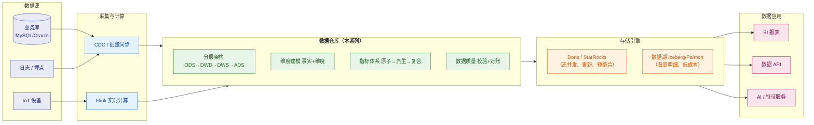

# 🏛️ 数据仓库总览

> 这是数据仓库知识体系的**总入口（MOC）**，也是 `1-java/10-数据仓库/` 目录的导航页。
> 系列回答四个层次：**① 数仓是什么、怎么分层（概念与架构）② 表怎么建模（维度建模）③ 数字怎么可信（指标体系 + 数据质量）④ 怎么落地运维（ETL 调度）⑤ 面试怎么答**。
> 关联：[[5-bigdata/1-doris/0-Doris总览|Doris 系列]]（存储引擎层）、[[5-bigdata/0-flink/0-Flink总览|Flink 系列]]（计算层）、[[大数据学习规划/03-实时数仓与存储|实时数仓与存储选型]]。

---

## 一、系列导航

| # | 笔记 | 一句话定位 | 核心内容 |
|---|---|---|---|
| 1 | **[[1-数仓概念与分层架构]]** | 数仓是什么、怎么分层 | 数仓 vs 数据库 vs 数据湖、ODS/DWD/DWS/ADS 职责边界、四种建模方法论、Lambda/Kappa/湖仓 |
| 2 | **[[2-维度建模]]** | 表怎么建才对 | 事实表三种类型、**粒度决策**、度量可加性、维度表设计、**SCD 缓慢变化维**、星型 vs 雪花、**拉链表** |
| 3 | **[[3-指标体系与口径治理]]** | 数字怎么定义 | 原子/派生/复合指标、指标字典、**口径治理五动作**、指标重复建设治理、北极星 + OSM |
| 4 | **[[4-数据质量管理与对账]]** | 数字怎么才可信 | 数据质量六维度、**三道闸方法论**、校验规则设计、**对账体系**、故障排查与复盘 |
| 5 | **[[5-ETL调度与数据同步]]** | 数据怎么流转 | ETL vs ELT、三种抽取方式、CDC 全量增量衔接、**调度规范**、**幂等设计**、补数与雪崩防护 |
| 6 | **[[6-数仓建模实战案例]]** | 全套怎么落地 | 电商交易数仓、**IoT 设备投递数仓**、实时数仓链路、建模检查清单 |
| 7 | **[[7-数仓面试高频题]]** | 面试怎么答 | 十大必答题 + 快问快答 + **易错陷阱 TOP15** + 场景设计题 |

---

> [!tip] 画图约定
> 本库支持 Mermaid（已装 mermaid-popup / mermaid-zoom）。本系列的图**优先用 Mermaid**，只有"依赖精确对齐"的图（字节布局、日志样本、命令输出）才保留 ASCII。规范详见 [[0-Java总览]] §七「文档写作约定」。

## 二、按需求的阅读路径

> [!tip] 三条路径
> **面试突击（1 天）**：[[7-数仓面试高频题]] → [[2-维度建模]]（SCD/拉链表）→ [[3-指标体系与口径治理]]（口径争议题）→ [[4-数据质量管理与对账]]（对账是重点）
> **上手干活（3～5 天）**：[[1-数仓概念与分层架构]] → [[2-维度建模]] → [[6-数仓建模实战案例]] → [[5-ETL调度与数据同步]] → [[4-数据质量管理与对账]]
> **负责人/架构视角**：[[1-数仓概念与分层架构]]（架构模式）→ [[3-指标体系与口径治理]]（口径治理）→ [[4-数据质量管理与对账]]（质量体系）→ [[5-ETL调度与数据同步]]（规范建设）

---

## 三、30 秒速查表

| 问题 | 一句话答案 | 详见 |
|---|---|---|
| 数仓四个特征 | **面向主题、集成、相对稳定、反映历史变化** | [[1-数仓概念与分层架构]] |
| 为什么不能直接用 MySQL 分析 | **行存 IO 放大** + 压垮线上 + 无历史 + 口径分散 | [[1-数仓概念与分层架构]] |
| 为什么要分层 | **解耦 + 复用**；层数不是目的，带来复用才有价值 | [[1-数仓概念与分层架构]] |
| ODS 要清洗吗 | **不要**，否则无法与源系统对账；清洗放 DWD | [[1-数仓概念与分层架构]] |
| DWD 能聚合吗 | **不能**，聚合丢粒度，DWD 必须保持最细 | [[1-数仓概念与分层架构]] |
| DWS 和 ADS 怎么分 | **只服务一个页面 → ADS；多报表能用 → DWS** | [[1-数仓概念与分层架构]] |
| 范式 vs 维度建模 | 范式管**存得对**（底层），维度管**查得快、好懂**（上层） | [[1-数仓概念与分层架构]] |
| 事实表有哪三种 | **事务**（一事件一行）/ **周期快照**（一周期一行）/ **累积快照**（一流程一行） | [[2-维度建模]] |
| 每日库存用哪种事实表 | **周期快照**——状态量不是事件流 | [[2-维度建模]] |
| 最重要的建模决策 | **粒度**（一行代表什么）；从最细开始，**汇总不可逆** | [[2-维度建模]] |
| 比率/单价能直接存吗 | **不能**，不可加；必须存**分子分母** | [[2-维度建模]] |
| SCD1 vs SCD2 | SCD1 **覆盖**（无历史）；SCD2 **加行 + 有效期**（有历史） | [[2-维度建模]] |
| SCD2 的关键前提 | **事实表必须存代理键**，否则关联不到"当时那一版" | [[2-维度建模]] |
| 拉链表两步 | **关链**（补 `end_dt`）+ **开链**（插新版本） | [[2-维度建模]] |
| 拉链表 `end_dt` 用什么 | **9999-12-31**，不要用 NULL（`BETWEEN` 会漏数据） | [[2-维度建模]] |
| 星型 vs 雪花 | 分析场景**优先星型**（Join 少、快、好懂） | [[2-维度建模]] |
| 一致性维度是什么 | 全公司共用的维度，**只能引用不能自建** | [[2-维度建模]] |
| 指标三层 | **原子**（业务过程+度量）→ **派生**（+时间+修饰）→ **复合**（运算） | [[3-指标体系与口径治理]] |
| 派生指标公式 | 原子指标 + **时间周期 + 修饰词 + 业务限定** | [[3-指标体系与口径治理]] |
| 最容易导致口径漂移的限定 | **业务限定**（含不含运费/测试单？按什么时间归属？） | [[3-指标体系与口径治理]] |
| 口径统一靠什么 | **建字典 + 收口 + 只引用不重算 + 变更管控 + 自动比对** | [[3-指标体系与口径治理]] |
| 口径有争议怎么办 | 区分**同名不同义**（改名字）vs **真冲突**（业务负责人拍板） | [[3-指标体系与口径治理]] |
| 数据质量六维度 | **完整、准确、一致、唯一、及时、有效** | [[4-数据质量管理与对账]] |
| 数据质量三道闸 | **开发规范 → 调度卡口 → 事后对账** | [[4-数据质量管理与对账]] |
| 核心质量原则 | **宁可让报表晚出并告警，也不让错数据流到下游** | [[4-数据质量管理与对账]] |
| 数仓三层对账 | **源↔ODS**（必须 0）、**ODS↔DWD**（须可解释）、**汇总↔明细** | [[4-数据质量管理与对账]] |
| 对账 SQL 关键 | 用 **FULL OUTER JOIN** 才能双向发现差异 | [[4-数据质量管理与对账]] |
| 增量抽取最大坑 | **漏物理删除** + **时间水位边界** | [[5-ETL调度与数据同步]] |
| 抽取核心原则 | **宁可多抽（靠幂等去重），不可少抽（无法补救）** | [[5-ETL调度与数据同步]] |
| 依赖能用时间猜吗 | **不能**，必须用**数据依赖**（上游成功 + 质量校验通过） | [[5-ETL调度与数据同步]] |
| 为什么任务必须幂等 | **补数和重跑是常态**；不能重跑 = 不能运维 | [[5-ETL调度与数据同步]] |
| 最常用的幂等方式 | **分区覆盖** `INSERT OVERWRITE ... PARTITION(dt)` | [[5-ETL调度与数据同步]] |
| 补数三个坑 | 忘记补下游、没限流、没记录 | [[5-ETL调度与数据同步]] |
| 任务雪崩怎么防 | 超时 + 有限重试 + **指数退避** + 资源隔离 | [[5-ETL调度与数据同步]] |
| 调度器重要吗 | **调度器可替换，规范才是核心** | [[5-ETL调度与数据同步]] |

---

## 四、核心概念最小记忆集

| 概念 | 精确定义 | 常见误解 |
|---|---|---|
| **ODS** | 贴源落地层，**不做清洗**，保留原始 | 以为可以顺手清洗 |
| **DWD** | 清洗规范化后的**最细粒度**明细 | 以为可以聚合 |
| **DWS** | 按主题+维度的**轻度汇总**，可复用 | 与 ADS 混淆 |
| **ADS** | 面向具体应用的宽表/预计算 | 以为可以直接读 ODS |
| **粒度** | 事实表"**一行代表什么**" | 以为可以后补 |
| **可加性度量** | 任意维度都能安全 SUM | 以为比率也能 SUM |
| **SCD2** | 加行 + `start_dt`/`end_dt`/`is_current` 保留历史 | 以为只需加时间字段 |
| **代理键** | 维度表的无意义自增键，**SCD2 的前提** | 以为业务主键就够 |
| **拉链表** | 只存变化的 SCD2 工程实现 | 以为就是普通表加两个字段 |
| **一致性维度** | 全公司口径统一的维度 | 以为各域可以自建 |
| **退化维度** | 无描述属性的标识（订单号）放事实表 | 以为一定要建维表 |
| **角色扮演维度** | 同一维表引用多次（下单/支付日期） | 以为要建多张日期表 |
| **原子/派生/复合指标** | 不可再拆 / +限定 / 运算 | 分层混乱 |
| **口径** | 指标"怎么算"的完整定义（公式+限定+时间归属） | 以为公式就代表口径 |
| **数据质量三道闸** | 开发规范 → 调度卡口 → 事后对账 | 以为加校验规则就够 |
| **对账** | 与源头逐条/逐项比对，**最后一道防线** | 以为有校验就不用对账 |
| **幂等** | 重复执行结果不变 | 以为重试没关系 |
| **CDC** | 订阅 binlog 捕获增删改 | 以为和增量抽取一样 |
| **Lambda / Kappa** | 双链路 / 单链路 | 以为 Kappa 更先进就没代价 |

> [!warning] 六个最经典的面试陷阱
> 1. **"ODS 可以顺手做清洗"** —— 不行。**ODS 的价值是"源系统什么样我这里就什么样"**，否则无法与源头对账。
> 2. **"DWD 可以聚合一些常用指标"** —— 不行。**聚合丢粒度**，上层要更细就得回源重算。
> 3. **"SCD2 就是加两个时间字段"** —— 不完整。**关键是事实表要存代理键**，否则关联不到历史版本。
> 4. **"拉链表 end_dt 用 NULL 表示当前"** —— 错。`BETWEEN` 比较会**漏数据**，要用 `9999-12-31`。
> 5. **"所有质量校验都该阻断下游"** —— 错。**波动校验必须只告警**，否则大促当天数仓瘫痪。
> 6. **"对账用 LEFT JOIN 就行"** —— 错。必须 **FULL OUTER JOIN** 才能**双向**发现差异。

---

## 五、数仓在数据体系中的位置

- **存储引擎层** → [[5-bigdata/1-doris/0-Doris总览|Doris 系列]]（架构、数据模型、表设计、查询优化、导入、湖仓、运维）
- **计算层** → [[5-bigdata/0-flink/0-Flink总览|Flink 系列]]（CDC、实时数仓、端到端一致性）
- **规划落地** → [[大数据学习规划/03-实时数仓与存储]]（第 2 周任务）、[[大数据学习规划/05-求职与面试]]

> [!tip] 与你的 AI 定位结合
> 数仓是"数据 + AI"的地基：**指标体系**定义了什么值得被 AI 消费；
> **数据质量与对账**保证喂给模型的数据是可信的；
> **DWS/ADS 层**是 Text-to-SQL、指标语义层、AI 特征服务的直接数据源。
> 面试讲"数据平台如何支撑 AI"时，**数仓的分层和口径治理就是最有说服力的落点**。

---

## 六、与已有笔记的关系

| 已有笔记 | 关系 |
|---|---|
| [[5-bigdata/1-doris/0-Doris总览]] | **存储引擎层**。本系列讲"怎么建数仓"，Doris 系列讲"用什么存"。两者配合看 |
| [[5-bigdata/0-flink/0-Flink总览]] | **计算层**。实时数仓的链路实现 |
| [[大数据学习规划/03-实时数仓与存储]] | 学习规划页，本系列是它的**理论落地版** |
| [[面试准备/专业技能/04-数据库调优]] | OLTP 侧调优；本系列是 **OLAP/数仓侧** |
| [[面试准备/专业技能/05-大数据与流计算]] | 面试速答；本系列提供**体系化的原理支撑** |
| [[面试准备/得逸信息/00-JD与匹配分析]] | 技术经理（数仓）岗位的面试准备，本系列是其**知识底座** |
| [[服务器巡检-192.168.0.106/Hive数据加载方案]] | 实操手册；本系列提供**方法论背景** |

---

## 七、学习检查清单

- [ ] 能说清数仓四个特征，并解释"为什么不能直接用业务库做分析"
- [ ] 能画出标准分层全景图，并说清**每层的职责边界和禁忌**
- [ ] 能回答"ODS 要不要清洗""DWD 能不能聚合""DWS 和 ADS 怎么分"
- [ ] 能对比 Inmon / Kimball / Data Vault / 湖仓并给出选型理由
- [ ] 能说清三种事实表的区别，并针对"每日库存"选对类型
- [ ] 能解释为什么粒度是最重要决策、为什么"汇总不可逆"
- [ ] 能完整讲清 SCD1/2/3，**手画 SCD2 的关链开链过程**
- [ ] 能解释 SCD2 为什么必须配合代理键
- [ ] **能手写拉链表的关链 + 开链 SQL**
- [ ] 能说清原子/派生/复合指标，并说出派生指标的四个限定
- [ ] 能完整回答"业务方对活跃用户定义有争议怎么办"
- [ ] 能按六个维度说清数据质量，并讲清"三道闸"
- [ ] **能手写 FULL OUTER JOIN 的双向对账 SQL**
- [ ] 能对比三种抽取方式，并说清"漏物理删除"和"时间水位"两个坑
- [ ] 能列举至少 4 种幂等实现方式
- [ ] 能背出调度规范的核心条目，并解释任务雪崩的防线
- [ ] 能独立完成电商交易数仓的完整设计（八大要点）
- [ ] **能用回收平台/机器人项目真实讲一遍对账体系，且经得起追问细节**

---

> [!question] 还需要补充什么？
> 可继续扩展的方向：**数据治理体系**（元数据管理、数据血缘、数据资产目录、主数据管理）、
> **离线数仓工具链实战**（Hive SQL 优化、Spark 调优）、**数据中台与 OneData 体系**、
> **湖仓一体深入**（Iceberg/Paimon 表格式与流批一体）、**DataOps 与数据可观测性**、
> **维度建模进阶**（Data Vault 2.0 落地、雪花到星型的重构）。
> 需要哪块就新开一篇并在上方导航表登记。

---
> 相关入口 → [[5-bigdata/1-doris/0-Doris总览]] ｜ [[5-bigdata/0-flink/0-Flink总览]] ｜ [[0-Java总览]]
