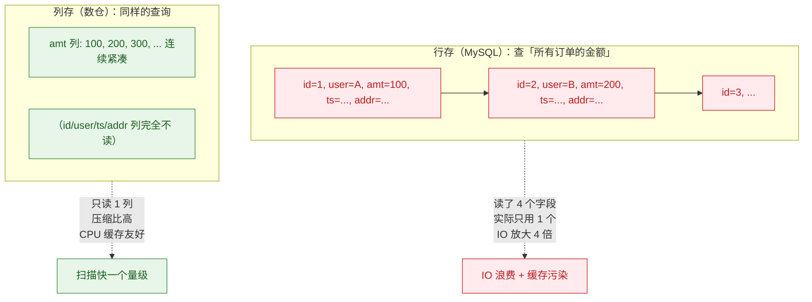
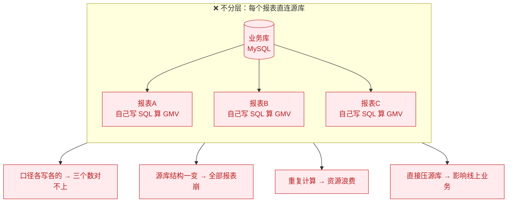
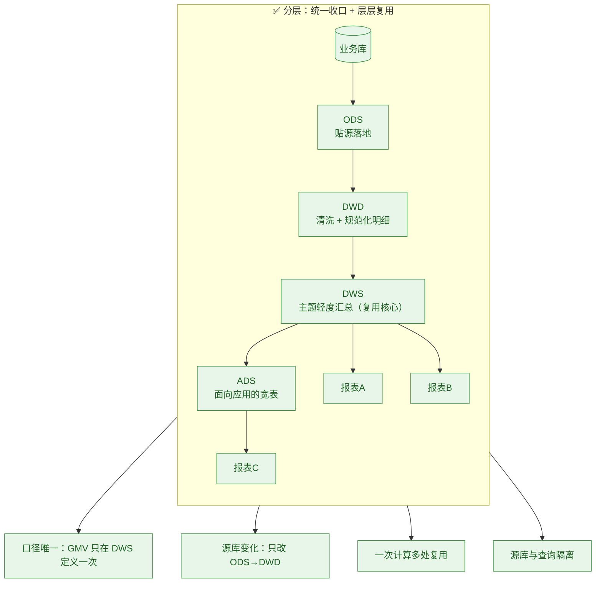
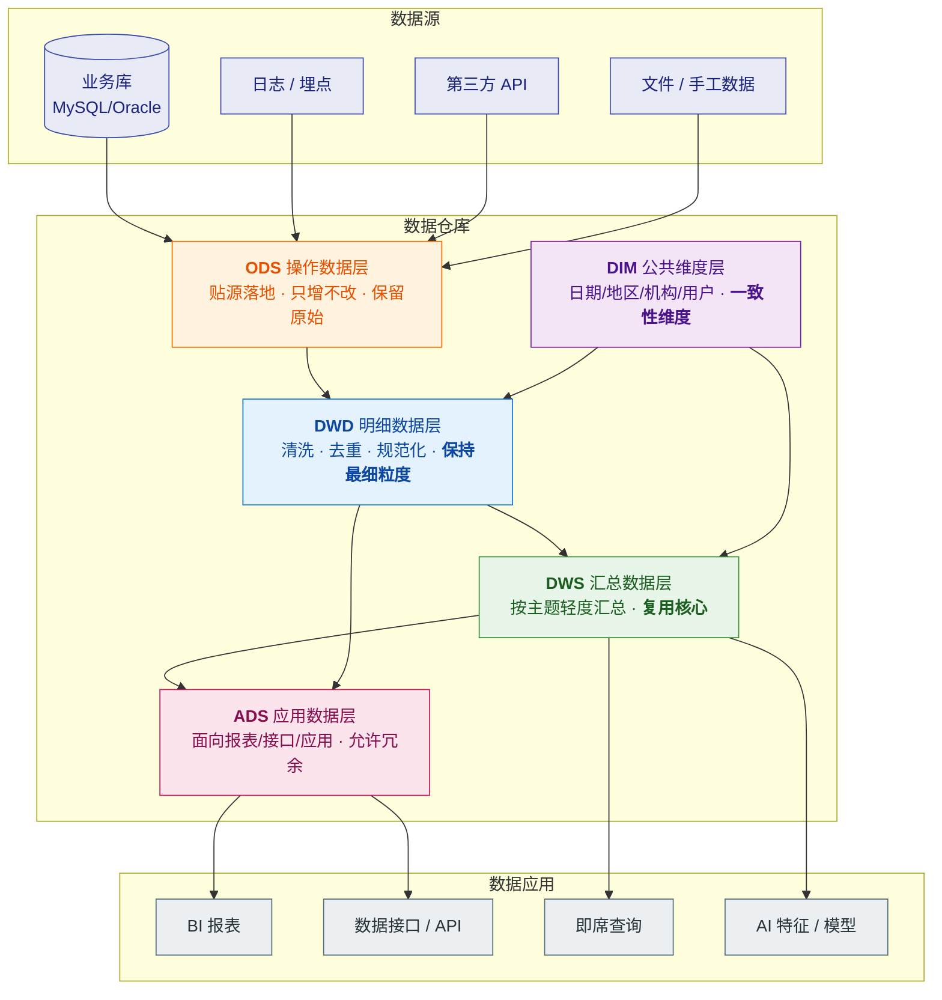
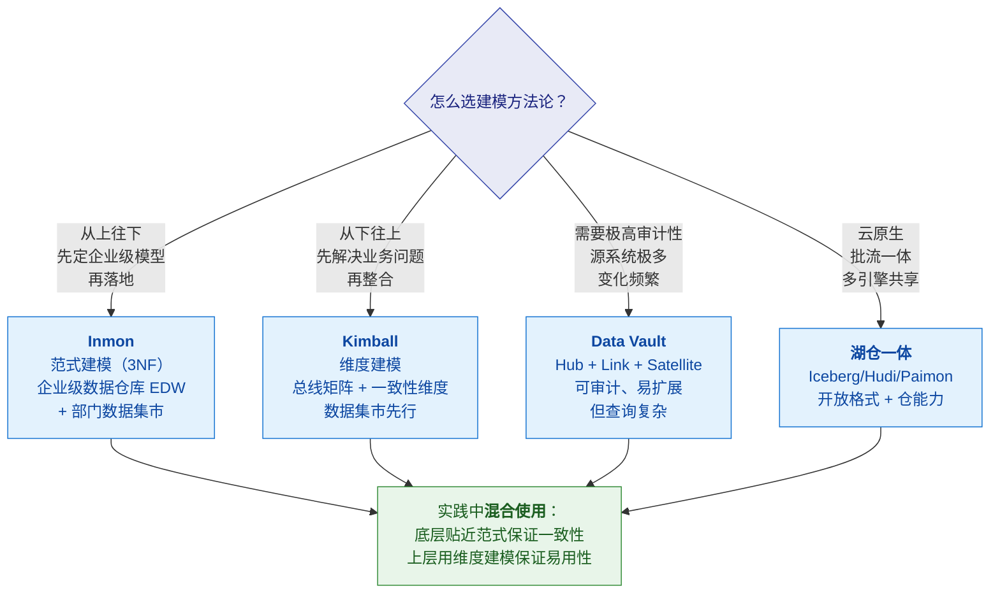
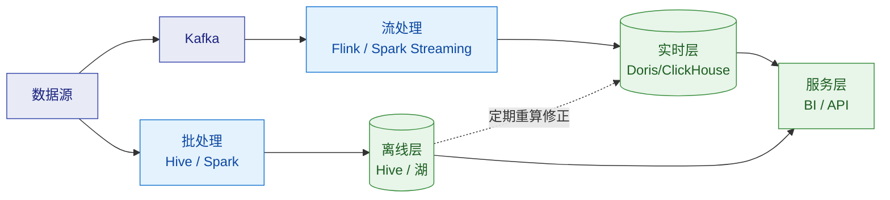
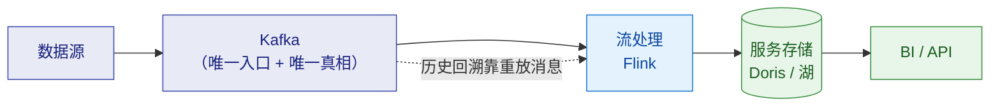
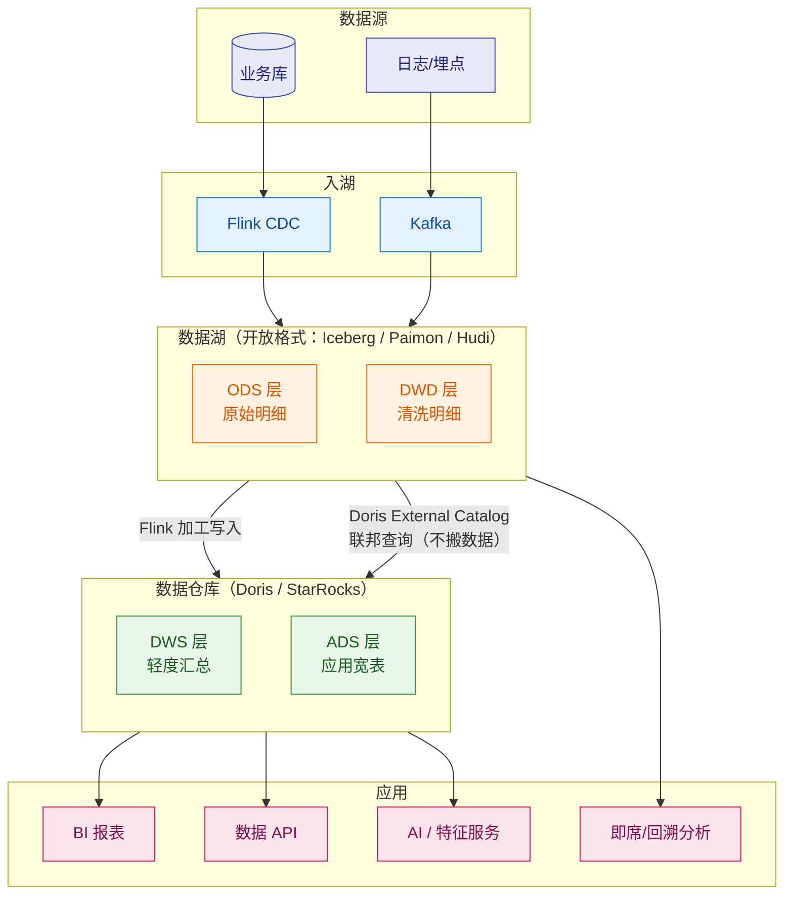
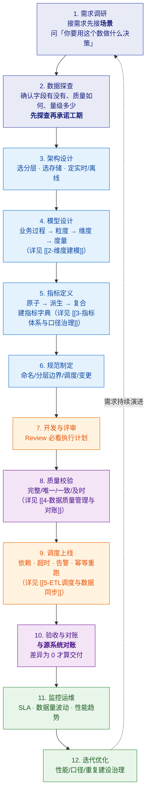

# 🏛️ 一、数据仓库概念与分层架构

> 本篇回答四个问题：**数仓和数据库到底差在哪**（为什么不能直接用 MySQL 做分析）？**分层是为什么**、每层的**职责边界**该怎么划？**四种建模方法论**（Inmon / Kimball / Data Vault / 湖仓）该怎么选？以及**离线、实时、湖仓**三套架构的取舍。
> 系列导航见 [[0-数据仓库总览]]；分层定完之后怎么写模型见 [[2-维度建模]]；指标体系见 [[3-指标体系与口径治理]]。

---

## 一、数据仓库是什么

### 1.1 定义与由来

> [!note] 一句话定义
> **数据仓库（Data Warehouse, DW）是面向主题的、集成的、相对稳定的、反映历史变化的、用于支持管理决策的数据集合。**
> —— 比尔·恩门（Bill Inmon），1991

这四个定语每一个都在和 OLTP 数据库划清界限：

| 定语 | 含义 | 与 OLTP 的对比 |
|---|---|---|
| **面向主题** | 按业务主题组织（客户、订单、商品、投递），不按应用组织 | OLTP 按业务过程/功能模块建表 |
| **集成** | 多个源系统**统一编码、统一口径**后才能进仓 | OLTP 各系统编码独立（A 系统性别存 0/1，B 系统存 M/F） |
| **相对稳定** | 数据以**批量加载**为主，很少 UPDATE/DELETE | OLTP 高频增删改 |
| **反映历史变化** | 保留**时间维度**，能查"当时是什么样" | OLTP 通常只存当前状态 |

### 1.2 为什么不能直接拿 MySQL 做分析

> [!important] 这是面试的第一个"为什么"，答清楚就建立了专业度

| 维度 | OLTP（MySQL） | OLAP（数仓） |
|---|---|---|
| **存储布局** | **行存**：一行所有列连续存放 | **列存**：同列的值连续存放 |
| **一次 IO 拿到什么** | 整行（哪怕只查 1 列） | 只有涉及的列（**列裁剪**） |
| **典型查询** | `WHERE id = ?` 点查几行 | `WHERE dt BETWEEN ... GROUP BY ...` 扫百万行算几列 |
| **并发模型** | 高并发小事务 | 低并发大扫描（MPP 并行） |
| **更新方式** | 原地更新（undo/redo 保证事务） | **追加写**，靠模型语义 + 合并实现更新 |
| **索引结构** | B+ 树 | 排序键 + 稀疏索引 + 分区裁剪 + ZoneMap |
| **压缩比** | 有限（行存难压） | 极高（同列同类型且有序） |
| **数据时间范围** | 近期热数据为主 | 长期历史（数年） |

**核心矛盾**：分析查询要扫海量数据的少数列，而行存**把不需要的列也一起读进来了**。

### 1.3 数仓 vs 数据湖 vs 湖仓一体

| | **数据仓库** | **数据湖** | **湖仓一体** |
|---|---|---|---|
| 存什么 | 结构化、**已建模**的加工数据 | 原始数据，**什么格式都行**（结构化/半结构化/非结构化） | 湖里存开放格式表，**仓的能力叠加在湖上** |
| Schema | **写时定义**（Schema-on-Write） | **读时定义**（Schema-on-Read） | 写时定义 + 开放格式 |
| 主要使用者 | BI、分析师、报表 | 数据科学家、机器学习 | 两者都有 |
| 典型技术 | Hive、Doris、StarRocks、ClickHouse、Oracle | HDFS/S3 + Parquet/ORC | Iceberg、Hudi、**Paimon** |
| 强项 | 性能、口径统一、事务 | 灵活、成本低、海量 | 一份存储多引擎用、批流统一 |
| 弱项 | 半结构化支持弱、成本高 | 易变"数据沼泽"、无事务 | 复杂度高、生态仍在演进 |

> [!tip] 面试话术
> "**湖和仓不是替代关系，是分工关系**。
> 我用 **ODS/DWD 这种海量明细落湖**（成本低、可回溯、多引擎共享），
> **DWS/ADS 这种要高并发、要主键更新、要预聚合的层落 Doris**，
> 然后 Doris 通过 **External Catalog 联邦查询**直接查湖，避免重复搬运。
> 这样既控制了成本，又保住了查询性能。"
> 👉 Doris 侧细节见 [[5-bigdata/1-doris/7-湖仓一体]]

---

## 二、分层架构（核心中的核心）

### 2.1 为什么必须分层

> [!important] 分层的目的只有两个：**解耦** 和 **复用**

**不分层会怎样**（面试可以这样描述痛点）：

### 2.2 标准分层全景

### 2.3 每层的职责边界（⭐ 面试重点）

> [!important] 边界的核心是"**这层该做什么、绝不该做什么**"

| 层 | 该做什么 | **绝不该做什么** | 为什么 |
|---|---|---|---|
| **ODS** | 贴源落地、增量/全量策略、保留原始字段 | ❌ **不做业务清洗**（不改数据、不写业务逻辑） | **ODS 的价值就是"源系统什么样我这里就什么样"**，便于**和源头对账**与回溯。一旦开始改数据，出了问题就无法定位是源头的错还是我们改错了 |
| **DWD** | 清洗（去脏、去重）、规范化（统一编码/单位/命名）、维度退化、**保持明细粒度** | ❌ **不做聚合** | 聚合会丢粒度，上层任何"要看更细"的需求都得回源重算，**DWD 就失去复用价值** |
| **DIM** | 公共一致性维度：日期、地区、机构、用户、商品 | ❌ **不允许各主题域自建维度** | 各建各的 → "华东"在一个域是 5 省、另一个域是 6 省，**口径就崩了** |
| **DWS** | 按**主题 + 维度**组合做轻度汇总（日/周/月） | ❌ **不绑定具体报表** | DWS 要**可复用**；只服务一个页面的表应该放 ADS |
| **ADS** | 面向具体应用，允许宽表、冗余、预计算 | ❌ **不直接读 ODS/DWD 绕过 DWS**（特殊情况除外） | 否则口径又散了，且重复计算 |

> [!tip] 三组最容易被追问的边界
> **① ODS 要不要清洗？**
> → **原则上不做**。清洗放 DWD。**如果 ODS 就改数据，出了问题就无法和源头对账**。
>
> **② DWD 为什么不能聚合？**
> → **聚合会丢粒度**。DWD 是所有上层汇总的**唯一可信来源**，必须保持最细。
>
> **③ DWS 和 ADS 怎么区分？**
> → 判断标准一句话：**如果一张表只服务一个报表/页面，它就该在 ADS；如果多个报表都能用，它就该沉到 DWS。**

### 2.4 分层的变体（了解即可，别被问懵）

| 变体 | 说明 | 适用 |
|---|---|---|
| **ODS / DW / DA / APP** | 阿里的经典四层（数据引入层/公共维度模型层/公共汇总层/应用数据层），本质和 ODS/DWD/DWS/ADS 对应 | 国内互联网主流 |
| **Stage 层** | 有些架构在 ODS 前加一层 **STG（临时/staging）**，只做落地文件暂存，ETL 完即清 | 大数据量、需要重跑 |
| **DWT / DWI** | 部分公司细分：DWI（明细宽表）、DWT（主题宽表） | 主题域多、宽表需求强 |
| **DM（数据集市）** | 面向部门的小型数仓，可以是**独立集市**或**从数仓衍生** | 部门级需求 |
| **实时层** | 在 ODS/DWD/DWS 前加 `_rt` 后缀标识实时链路（如 `dwd_order_rt`） | Lambda 架构 |

> [!warning] 面试常见陷阱
> **"数仓一定要严格四层吗？"**
> → **不一定**。分层是**手段不是目的**，目的是**解耦和复用**。
> 小团队/数据量小时，**ODS + DWD + ADS 三层甚至两层就够了**——
> **层数越多，链路越长、延迟越高、维护成本越大**。
> 我见过为了"规范"硬拆五层，结果每层都是薄薄一层 ETL，**除了增加故障点没有任何收益**。
> **判断标准是：这一层是否真的带来了复用或解耦。**

---

## 三、四种建模方法论

### 3.1 Inmon vs Kimball（经典之争）

| | **Inmon（数据仓库之父）** | **Kimball（维度建模之父）** |
|---|---|---|
| 方向 | **自上而下**（Top-Down） | **自下而上**（Bottom-Up） |
| 核心 | 企业级 **EDW（3NF）** → 部门数据集市 | **数据集市（星型）** → 总线矩阵整合 |
| 建模 | **范式建模（3NF）** | **维度建模（星型/雪花）** |
| 优点 | 一致性最强、数据冗余最少 | **见效快、查询性能好、业务易理解** |
| 缺点 | 周期长、见效慢、成本高 | 早期易产生"烟囱式"集市（靠总线矩阵约束） |
| 适用 | 大型企业、强管控 | **互联网、快速迭代**（国内主流） |

> [!important] 关键澄清：两者不是对立，而是**分工在不同层**
> - **范式建模管"存得对不对"**——消除冗余、保证一致性 → 用在 **ODS/DWD 底层**
> - **维度建模管"查得快不快、好不好懂"** → 用在 **DWD 之上的分析层、DWS/ADS、BI**
>
> **所以"范式 vs 维度"的正确回答是：数仓实践中两者都要用，只是用在不同层。**

### 3.2 Data Vault（了解）

| 组件 | 作用 |
|---|---|
| **Hub** | 存业务主键（如客户 ID），**只增不改** |
| **Link** | 存 Hub 之间的关系（如客户-订单） |
| **Satellite** | 存 Hub/Link 的描述性属性 + **时间戳**，保留全部历史 |

**优点**：可审计性极强、对源系统变化极容忍、天然支持并行加载。
**缺点**：**表数量爆炸**、查询要大量 Join、**对分析师不友好**（通常只作为 DWD 落地层，上面再套维度模型）。

> [!tip] 答题话术
> "Data Vault 我了解它的设计思想——**Hub/Link/Satellite 三层分离主键、关系和属性，且全部保留历史**，
> 所以它**可审计性和扩展性极好**，适合源系统特别多、变化特别频繁的场景。
> 但它**查询不友好、表数量多**，所以在国内更多是作为**DWD 的落地层**，
> 上面还是要再建维度模型给分析师用。**我目前的项目里没有用过，这块是了解层面。**"

---

## 四、架构模式：离线 / 实时 / 湖仓

### 4.1 Lambda 架构

| | 优点 | 代价 |
|---|---|---|
| **Lambda** | 成熟、容错好、**保留全量历史可回溯**、实时性满足 | 🔴 **两套代码、两套口径**，容易不一致；运维复杂 |

> [!danger] Lambda 最大的坑：**离线与实时口径不一致**
> 这是数仓最经典的翻车点。用户早上看报表 100 万，晚上看实时 98 万，**信任直接崩塌**。

### 4.2 Kappa 架构

| | 优点 | 代价 |
|---|---|---|
| **Kappa** | **口径唯一、代码一套**、架构简单 | 🔴 重放成本高、依赖消息保留期、**历史回溯难**（超过保留期的数据无法重算） |

### 4.3 湖仓一体（当前主流折中）

### 4.4 三种架构怎么选

| 场景 | 推荐 | 理由 |
|---|---|---|
| 实时性要求高 + 团队小 | **Kappa** 或纯实时 | 一套代码，口径唯一 |
| 需要海量历史回溯 + 实时 | **Lambda** 或**湖仓一体** | 保留可重算能力 |
| 湖仓一体是当前趋势 | **湖仓** | 一份存储多引擎用，批流统一，成本可控 |
| 传统企业存量系统 | **Lambda → 逐步湖仓化** | 迁移平滑，风险可控 |

> [!important] 口径统一的杀手锏话术（⭐ 必背）
> "**实时和离线结果不一致，是数仓最经典的翻车点。我的做法是让它们共用同一份口径定义和同一份维度表，
> 并且跑一个 T+1 的自动比对任务，差异超阈值就告警——口径统一不能靠自觉，要靠机制。**"

---

## 五、数仓建设完整流程

> [!tip] 面试加分点
> **"接需求先接场景，不要接'我要一个 XX 报表'，要问'你要用这个数做什么决策'。"**
> 这句体现的是**业务理解能力**，比会写 SQL 值钱得多。
> 还有一句：**"数据探查先行——先确认真实数据里有没有这些字段、质量如何、量级多少，再承诺工期。"**

---

## 六、30 秒速查表

| 问题 | 一句话答案 |
|---|---|
| 数仓四个特征 | **面向主题、集成、相对稳定、反映历史变化** |
| 为什么不能直接用 MySQL 分析 | **行存 IO 放大 + 无法承载大扫描 + 影响线上业务**；数仓靠**列存 + 排序键 + 分区裁剪** |
| 为什么要分层 | **解耦 + 复用**；层数不是目的，带来复用才有价值 |
| ODS 要清洗吗 | **原则上不做**，否则无法与源系统对账；清洗放 DWD |
| DWD 能聚合吗 | **不能**，聚合丢粒度，DWD 必须保持最细 |
| DWS 和 ADS 区别 | **只服务一个页面 → ADS；多个报表能用 → DWS** |
| 范式 vs 维度建模 | 范式管**存得对**（底层），维度管**查得快、好懂**（上层），**分工在不同层** |
| Inmon vs Kimball | Inmon **自上而下**（EDW+3NF）；Kimball **自下而上**（集市+星型） |
| Lambda 的问题 | **两套代码两套口径，容易不一致** |
| Kappa 的问题 | **重放成本高、依赖消息保留期、历史回溯难** |
| 口径怎么统一 | **共用口径定义 + 共用维度表 + T+1 自动比对告警**——靠机制不靠自觉 |
| 湖和仓怎么分工 | 海量明细**落湖**（成本/回溯），高并发/更新/预聚合**落仓**，Catalog 联邦查询 |

---

## 七、学习检查清单

- [ ] 能说清数仓四个定语，并用例子解释"集成"和"反映历史变化"
- [ ] 能画出列存 vs 行存的 IO 差异，解释为什么数仓快一个量级
- [ ] 能画出标准分层的全景图，并说清**每层的职责边界和禁忌**
- [ ] 能回答"ODS 要不要清洗""DWD 能不能聚合""DWS 和 ADS 怎么分"
- [ ] 能对比 Inmon / Kimball / Data Vault / 湖仓四种方法论并给出选型理由
- [ ] 能画出 Lambda / Kappa / 湖仓三种架构并说清各自代价
- [ ] 能说清"实时离线口径不一致"怎么防
- [ ] 能背出数仓建设 12 步流程
- [ ] 能回答"数仓一定要四层吗"并给出反例

---
> 下一篇 → [[2-维度建模]] ｜ 返回 [[0-数据仓库总览]]
