# 📐 二、维度建模

> 本篇回答五个问题：**维度建模为什么是数仓的事实标准**？**事实表**有哪几种、粒度怎么定？**维度表**怎么设计、**缓慢变化维（SCD）** 怎么处理？**星型 vs 雪花**怎么选？以及**四种高级模式**（一致性维度、退化维度、拉链表、无事实事实表）。
> 前置见 [[1-数仓概念与分层架构]]；建模完之后的**实战案例**见 [[6-数仓建模实战案例]]；指标定义见 [[3-指标体系与口径治理]]。

---

## 一、维度建模总览

### 1.1 一句话理解维度建模

> [!note] 核心公式
> **维度建模 = 事实（Fact，业务过程的度量）+ 维度（Dimension，描述业务的上下文）**

**用一句话描述一个业务事件**：

> "**2026-10-10**，**华东区**的**会员**用户，在**小程序**渠道，**购买了 3 件**商品，**金额 299 元**。"

| 部分 | 内容 | 在模型里的位置 |
|---|---|---|
| **度量**（发生了什么、多少） | 3 件、299 元 | **事实表** |
| **上下文**（何时、何地、何人、何渠道） | 日期、地区、用户、渠道 | **维度表** |

### 1.2 为什么维度建模成为事实标准

| 优势 | 说明 |
|---|---|
| **查询性能好** | 星型结构 Join 少；维度表通常很小可广播；事实表大但过滤列在维度上 |
| **业务可理解** | 业务方看表名和字段名就能懂，**沟通成本低** |
| **适应变化** | 业务加一个分析角度 = 加一个维度，**不用重构事实表** |
| **对称性** | 所有维度**平等地**关联到事实表，任意组合都能查（对比：范式模型每次新组合都要改结构） |

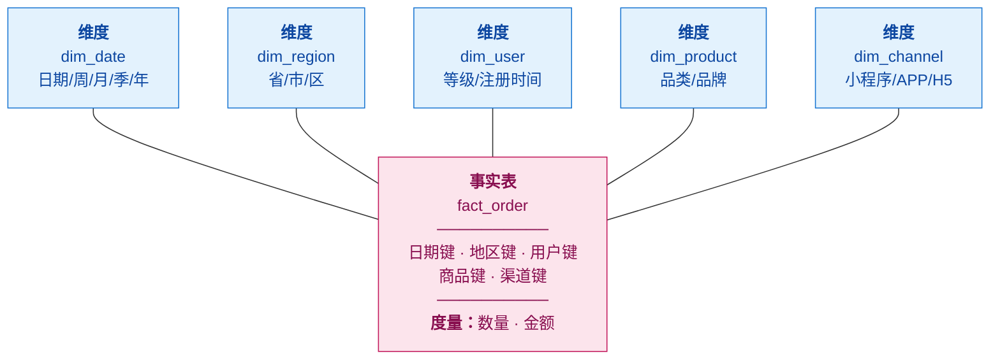

> [!tip] 星型的"对称性"是精髓
> 事实表在**中间**，所有维度在**四周**，彼此**平等**。
> 所以"按地区看"、"按品类看"、"按地区+品类看"**都能查，不需要改模型**。
> 这就是 Kimball 说的 **"维度建模的对称性"**——**业务问新问题不需要重构数据**。

---

## 二、事实表设计

### 2.1 事实表的三种类型

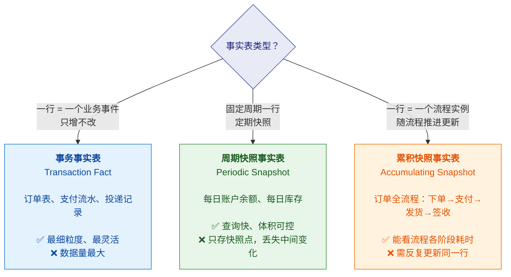

| 类型 | 粒度 | 典型场景 | 举例 |
|---|---|---|---|
| **事务事实表** | 一个业务事件一行 | 记录"发生了一次什么" | 订单明细、支付流水、设备投递记录 |
| **周期快照事实表** | 一个周期一行 | 记录"某个时点是什么状态" | 每日库存、每日积分余额、每日账户余额 |
| **累积快照事实表** | 一个流程实例一行 | 记录"流程走到哪了、各阶段多久" | 订单全生命周期、工单处理流程 |

> [!important] 关键区别：**事务 vs 周期快照**
> 面试常问："我想看每天的库存，用哪种？"
> → **周期快照**。因为库存是**状态量**（每天一个值），不是**事件流**。
> 如果用事务事实表存"库存变化流水"，那你查"某天的库存"需要**把历史所有变化累加**——
> 数据量大时极其昂贵。**周期快照是用存储空间换查询性能的经典手段。**

### 2.2 ⭐ 粒度：最重要的决策

> [!danger] 粒度定错，整个模型要重做
> **粒度 = "事实表的一行代表什么"**。这是维度建模**第一个也是最重要的决策**。

**选粒度的原则**：

| 原则 | 说明 |
|---|---|
| **从最细粒度开始** | 宁可存最细（订单明细行），不要一开始就存汇总——**汇总不可逆，最细可以向上聚合** |
| **用业务语言描述** | "一行 = 一个订单中的一个商品" 比 "订单商品粒度" 更清楚 |
| **粒度决定能回答什么问题** | 粒度是"订单级"，就**永远查不出"订单里某个商品"**的信息 |
| **不要混合粒度** | 一张事实表里既有订单行又有订单汇总行 → **汇总时必然重复计算** |

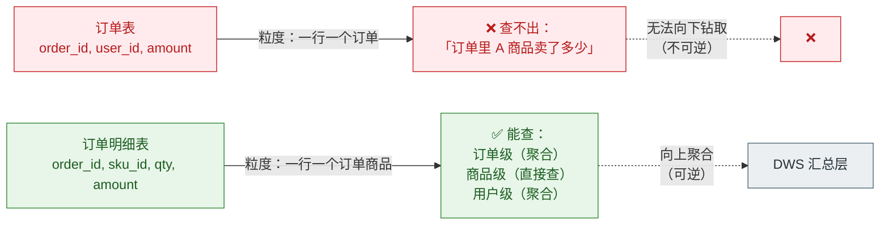

### 2.3 度量（Measure）设计

| 类型 | 定义 | 例子 | 处理方式 |
|---|---|---|---|
| **可加性度量** | 任意维度都能安全 SUM | 金额、数量 | ✅ 最理想，优先存这类 |
| **半可加性度量** | 部分维度可加 | **余额、库存**（时间上不可加！） | ⚠️ 跨时间不能 SUM；只能取期末值或 AVG |
| **不可加性度量** | 任何维度都不能加 | **比率、百分比、单价** | ❌ 不能直接存平均值！**必须存分子分母**，用时再算 |

> [!danger] 经典陷阱：**不要存"平均单价"**
> ❌ 错误做法：`avg_price` 字段存"平均单价"，然后跨月 `SUM(avg_price)` → **完全错误**
> ✅ 正确做法：存 `total_amount` 和 `total_qty`，**平均单价 = `SUM(amount)/SUM(qty)` 现算**
> **原则：不可加度量必须由可加度量派生，而不是预先算好存下来。**

### 2.4 事实表设计要点

| 要点 | 说明 |
|---|---|
| **用代理键而非业务主键** | 维度外键用**代理键（surrogate key）**，避免业务键变化影响历史 |
| **尽量放维度外键** | 事实表**窄而长**：外键 + 度量，描述性字段放维度表 |
| **冗余少量常用维度** | 极高频的过滤字段可**退化**到事实表（见 4.2） |
| **分区** | 通常**按时间分区**，便于裁剪和归档 |
| **避免 NULL 外键** | 用"未知维度"（-1 代理键）占位，避免 Join 丢数据 |

---

## 三、维度表设计

### 3.1 维度的类型

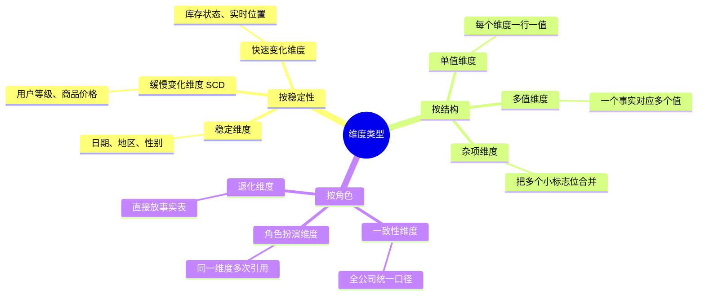

### 3.2 ⭐ 缓慢变化维（SCD）—— 面试必问

> [!note] 问题背景
> 用户去年是**普通会员**，今年升级为**黄金会员**。
> 问："去年 12 月的消费，应该算哪个等级？"
> **如果直接覆盖，这个问题永远算不对——历史被改掉了。**

| 类型 | 做法 | 能否做历史分析 | 适用场景 |
|---|---|---|---|
| **SCD1** | **直接覆盖**旧值 | ❌ 不能 | 修正错误数据、不关心历史的属性 |
| **SCD2** | **加一行新记录** + 有效期标记 | ✅ **能** | **需要按历史时点分析**（最常用） |
| **SCD3** | 加一列存**上一个值** | ⚠️ 只能看前一个状态 | 只需看"变化前/后"，很少用 |
| **SCD4** | 历史单独存一张**历史表** | ✅ 能 | 当前表保持轻量 |
| **SCD6** | 1+2+3 混合 | ✅ 能 | 复杂场景 |

#### SCD2 详解（最常用，必须会画）

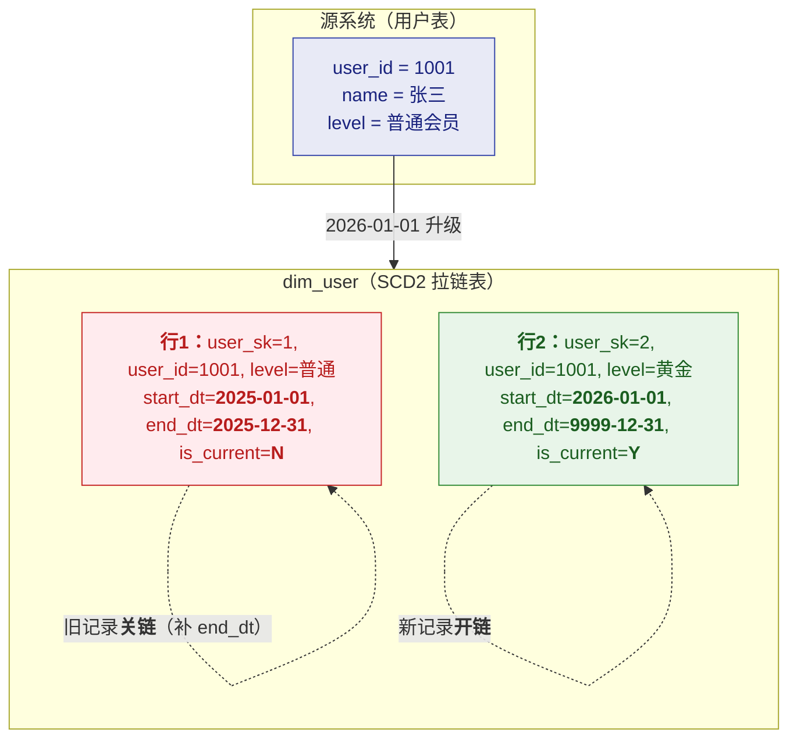

**SCD2 的三个关键字段**：
| 字段 | 作用 |
|---|---|
| `start_dt` / `end_dt` | 有效期区间（**拉链**） |
| `is_current` | 是否当前有效记录（加速查询） |
| **代理键 `user_sk`** | ⭐ **关键**：事实表关联的是**代理键**，才能关联到"当时那一行" |

> [!important] ⭐ 代理键是 SCD2 能工作的前提
> 事实表存的是 `user_sk = 1`（当时的版本），而不是 `user_id = 1001`。
> 所以**2025 年的订单永远关联到"普通会员"那一行**，历史分析才正确。
> **如果事实表直接存业务主键 `user_id`，SCD2 就白做了。**

**SCD2 的代价**：
- 维度表**变大**（一个用户多行）
- 查询要**带时间过滤**（`WHERE dt BETWEEN start_dt AND end_dt`）或用 `is_current='Y'`
- ETL 更复杂（要**比对变化 + 关链旧记录 + 开链新记录**）—— 见 [[5-ETL调度与数据同步]]

> [!tip] 答题话术（体现分寸感）
> "**SCD2 是最需要提前想清楚的，因为它决定了你能不能做'按当时状态'的历史分析。**
> 但它有代价：表变大、查询要带时间过滤、ETL 更复杂。
> 所以我的原则是——**只对真正要做历史时点分析的维度上 SCD2**，
> 比如用户等级、门店所属区域、销售归属关系；
> 其他不关心历史的直接用 SCD1 覆盖。
> **不是所有维度都值得上 SCD2。**"

### 3.3 其他维度设计要点

#### 一致性维度（Conformed Dimension）

> [!important] 这是 Kimball 体系的核心，也是**口径统一的基础**
> **一致性维度 = 全公司共用、口径完全一致的一组维度**（日期、地区、机构、用户、产品）。

**为什么重要**：如果"华东区"在订单主题里是 5 个省，在库存主题里是 6 个省，
**那所有跨主题的分析都会错**。

**实现方式**：建**公共维度层（DIM 层）**，各主题域**只能引用，不能自建**。

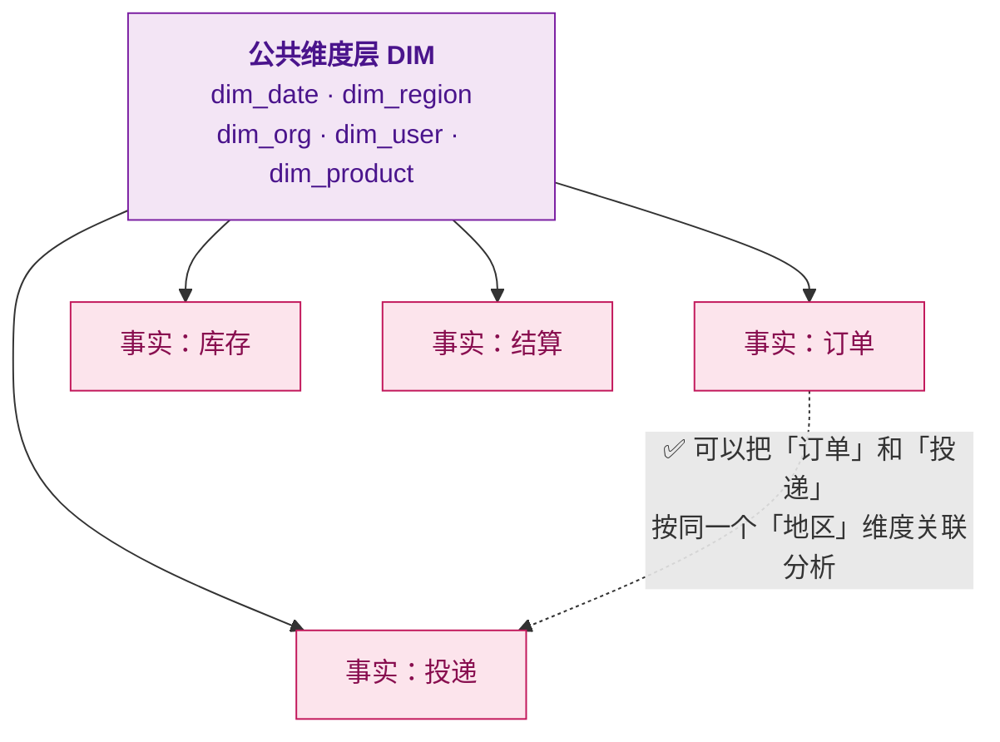

#### 退化维度（Degenerate Dimension）

把**维度属性直接放到事实表**里，不再单独建维度表。

**典型场景**：订单号、流水号、设备号——它们**没有描述性属性**（订单号本身就是个标识），
单独建一张只有一列的表没有意义。

| 放哪 | 例子 |
|---|---|
| 退化到事实表 | `order_no`、`serial_no`、`device_no` |
| 单独建维度表 | 有多个描述属性的（如商品有品类/品牌/规格） |

#### 角色扮演维度（Role-Playing Dimension）

**同一个维度表在事实表里被引用多次**，每次扮演不同角色。

**典型例子**：`dim_date` 在订单事实表里出现三次——**下单日期、支付日期、发货日期**。

```sql
-- 一个 dim_date 扮演三个角色
SELECT ...
FROM fact_order f
JOIN dim_date d1 ON f.order_date_sk = d1.date_sk   -- 下单
JOIN dim_date d2 ON f.pay_date_sk   = d2.date_sk   -- 支付
JOIN dim_date d3 ON f.ship_date_sk  = d3.date_sk   -- 发货
```

#### 杂项维度（Junk Dimension）

把多个**小型的、低基数的标志位**（是否新客、是否促销、是否退货、支付方式）
**合并到一张维度表**，避免事实表字段爆炸。

| ❌ 不合并 | ✅ 合并为 junk_dim |
|---|---|
| 事实表里加 `is_new_user`、`is_promo`、`is_return`、`pay_type` 四个字段 | 建 `dim_junk` 存这四列的**所有组合**（笛卡尔积，通常几十行），事实表只存一个 `junk_sk` |

---

## 四、星型 vs 雪花 vs 星座

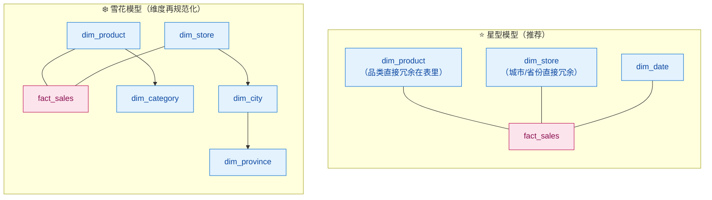

| | **星型** | **雪花** |
|---|---|---|
| 维度表 | **不规范化**，冗余存 | **继续规范化**，拆成多表 |
| Join 数 | 少 | **多** |
| 查询性能 | **快** | 慢（Join 多） |
| 存储 | 略冗余 | 省空间 |
| 易用性 | **好懂** | 复杂 |
| 适用 | **分析场景首选** | 维度特别大且变化少（如全国行政区划） |

> [!important] 选型结论（背下来）
> **"分析型场景优先星型——数仓的瓶颈通常在查询性能和可维护性，不在那点存储空间。
> 只有维度特别大且变化少（比如全国行政区划）才考虑雪花。
> 在列存 MPP 引擎（Doris/StarRocks）里更要偏星型，因为大表 Join 是主要成本。"**

### 星座模型（Fact Constellation）

**多个事实表共享同一组一致性维度**。这是企业级数仓的常态。

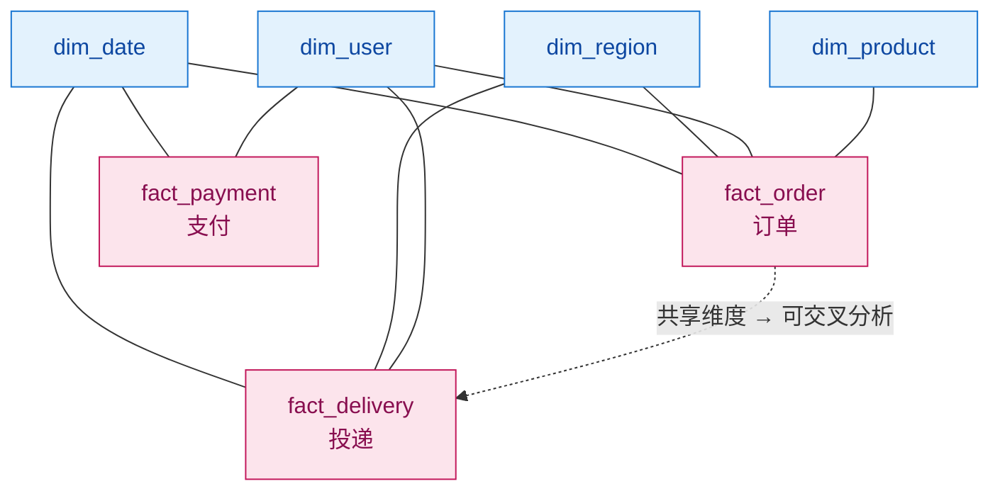

---

## 五、拉链表（⭐ 高频实战）

> [!note] 拉链表 = SCD2 在**大数据场景**的工程实现
> 它解决的是："**如何用最小的存储，保存一张表所有记录的历史变化**"。

### 5.1 为什么需要拉链表

**问题**：用户表每天全量快照 → 一年 365 份全量，**存储爆炸**。
**但如果只存当前值** → **历史丢失，无法回溯**。

**拉链表**：只存**变化**，用 `start_dt` / `end_dt` 串成"链"。

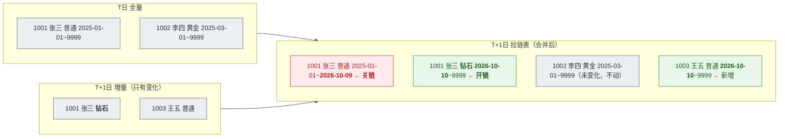

### 5.2 拉链表的合并逻辑

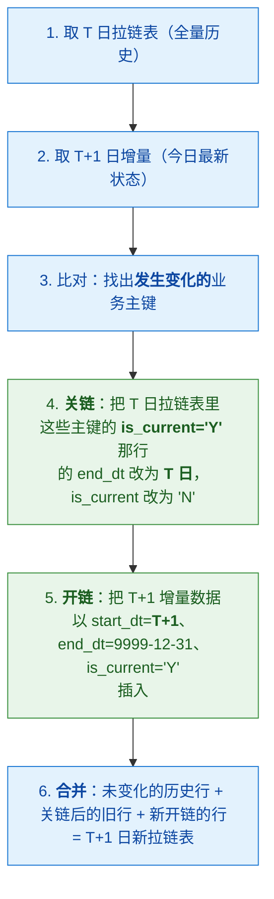

**ETL 核心 SQL 思路**（Hive/Doris 通用）：

```sql
-- 关链：把旧记录的 end_dt 收紧
INSERT OVERWRITE TABLE dim_user_zip PARTITION (dt = '${T}')
SELECT
    user_id, name,
    level,
    start_dt,
    CASE WHEN is_current = 'Y' AND user_id IN (SELECT user_id FROM inc)  -- 只有变化的才关链
         THEN DATE_SUB('${T+1}', 1)      -- 昨天
         ELSE end_dt
    END AS end_dt,
    CASE WHEN is_current = 'Y' AND user_id IN (SELECT user_id FROM inc)
         THEN 'N' ELSE is_current
    END AS is_current
FROM dim_user_zip
WHERE dt = '${T}'
UNION ALL
-- 开链：插入新版本
SELECT user_id, name, level,
       '${T+1}' AS start_dt,
       '9999-12-31' AS end_dt,
       'Y' AS is_current
FROM inc;
```

> [!warning] 拉链表的三个坑
> 1. **`end_dt` 用 `9999-12-31` 而不是 `NULL`** —— 避免 `BETWEEN` 比较时 NULL 导致漏数据
> 2. **必须有关链和开链两步** —— 只开链不关链会出现**同一用户多个 `is_current='Y'`**，查询翻倍
> 3. **首次初始化要全量** —— 拉链表不是凭空来的，需要一次全量打底

### 5.3 怎么查拉链表

```sql
-- ① 查当前最新状态（最快，走 is_current）
SELECT * FROM dim_user_zip WHERE is_current = 'Y';

-- ② 查某个历史时点的状态
SELECT * FROM dim_user_zip
WHERE '2025-06-15' BETWEEN start_dt AND end_dt;

-- ③ 事实表与拉链表关联（关键：按业务发生时间关联）
SELECT o.order_id, o.amount, u.level AS level_at_order_time
FROM fact_order o
JOIN dim_user_zip u
  ON o.user_id = u.user_id
 AND o.order_dt BETWEEN u.start_dt AND u.end_dt;   -- ⭐ 关联"当时"的那一版
```

---

## 六、建模标准流程（Kimball 四步）

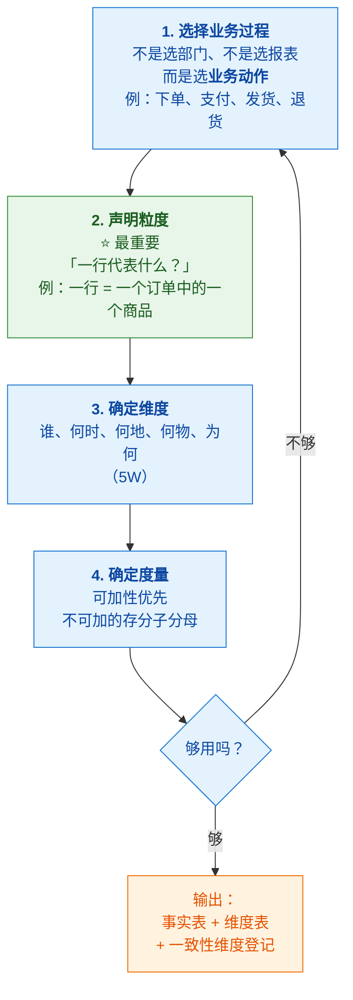

> [!tip] 为什么"选业务过程"而不是"选需求"
> 因为**需求会变，业务过程相对稳定**。
> 如果按需求建模（"销售部要个报表"），需求一变模型就废；
> 按业务过程建模（"下单"这个动作），**所有围绕下单的分析需求都能覆盖**。

### 6.1 完整示例：电商订单

**第 1 步：业务过程** → 下单

**第 2 步：粒度** → 一行 = 一个订单中的一个商品

**第 3 步：维度**（5W）

| 5W | 维度 | 维度表 |
|---|---|---|
| Who | 用户、销售员 | `dim_user`、`dim_employee` |
| When | 下单时间、支付时间 | `dim_date`（**角色扮演，两次**） |
| Where | 收货地区、仓库 | `dim_region`、`dim_warehouse` |
| What | 商品、品类 | `dim_product` |
| Why/How | 渠道、促销、支付方式 | `dim_channel`、`dim_junk` |

**第 4 步：度量**

| 度量 | 可加性 | 处理 |
|---|---|---|
| 下单数量 `qty` | ✅ 可加 | 直接存 |
| 下单金额 `amount` | ✅ 可加 | 直接存 |
| 优惠金额 `discount` | ✅ 可加 | 直接存 |
| 实付金额 `pay_amount` | ✅ 可加 | 存（= amount - discount） |
| 单价 `unit_price` | ❌ 不可加 | **不存！用时 amount/qty 算** |

**产出表结构**：

```sql
CREATE TABLE dwd_fact_order_detail (
    order_detail_sk  BIGINT,        -- 事实表代理键（可选）
    order_no         STRING,        -- 退化维度
    date_sk          INT,           -- 下单日期（角色扮演 1）
    pay_date_sk      INT,           -- 支付日期（角色扮演 2）
    user_sk          BIGINT,        -- 代理键（支持 SCD2）
    region_sk        INT,
    product_sk       BIGINT,
    channel_sk       INT,
    junk_sk          INT,           -- 杂项维度
    -- 度量
    qty              INT,
    amount           DECIMAL(18,2),
    discount         DECIMAL(18,2),
    pay_amount       DECIMAL(18,2)
) PARTITION BY RANGE(dt) (...);
```

> [!tip] 实战案例见 [[6-数仓建模实战案例]]
> 那里有**电商订单、IoT 设备投递、积分账户**三个完整案例（含你项目背景的映射）。

---

## 七、30 秒速查表

| 问题 | 一句话答案 |
|---|---|
| 维度建模核心 | **事实（度量）+ 维度（上下文）**；星型结构，业务可理解 |
| 事实表三种类型 | **事务**（一事件一行）、**周期快照**（一周期一行）、**累积快照**（一流程一行） |
| 库存/余额用哪种事实表 | **周期快照**——状态量，不是事件流 |
| 最重要的建模决策 | **粒度**（一行代表什么）；**从最细开始，汇总不可逆** |
| 比率/单价能直接存吗 | **不能**，不可加；必须存**分子分母**，用时现算 |
| SCD1 vs SCD2 | SCD1 **覆盖**（无历史）；SCD2 **加行 + 有效期**（有历史） |
| SCD2 的关键字段 | `start_dt`/`end_dt`/`is_current` + **代理键** |
| SCD2 为什么需要代理键 | 事实表存代理键才能关联到**当时那一版**，否则白做 |
| 星型 vs 雪花 | 分析场景**优先星型**（Join 少、快、好懂）；瓶颈不在存储 |
| 一致性维度 | 全公司共用的维度（日期/地区/机构），**只能引用不能自建** |
| 退化维度 | 无描述属性的标识（订单号）**直接放事实表** |
| 角色扮演维度 | 同一维度表被引用多次（下单/支付/发货日期） |
| 拉链表是什么 | **SCD2 的工程实现**：只存变化，`start_dt`/`end_dt` 串链 |
| 拉链表关键两步 | **关链**（旧记录补 end_dt）+ **开链**（插入新版本） |
| 拉链表 end_dt 用什么 | **9999-12-31**，不要用 NULL（避免 BETWEEN 漏数据） |
| Kimball 四步 | **选业务过程 → 声明粒度 → 确定维度 → 确定度量** |

---

## 八、学习检查清单

- [ ] 能用一句话解释维度建模，并画出星型结构
- [ ] 能说清三种事实表的区别，并针对"每日库存"选对类型
- [ ] 能解释为什么粒度是最重要决策、为什么"汇总不可逆"
- [ ] 能说清可加/半可加/不可加度量，并解释为什么不能存"平均单价"
- [ ] 能完整讲清 SCD1/2/3 的区别，**手画 SCD2 的关链开链过程**
- [ ] 能解释 SCD2 为什么必须配合代理键
- [ ] 能对比星型和雪花并给出选型理由
- [ ] 能说清一致性维度、退化维度、角色扮演维度、杂项维度各自解决什么问题
- [ ] **能手写拉链表的关链 + 开链 SQL**
- [ ] 能按 Kimball 四步完整设计一个电商订单模型
- [ ] 能回答"拉链表查询为什么必须按业务时间关联"

---
> 上一篇 → [[1-数仓概念与分层架构]] ｜ 下一篇 → [[3-指标体系与口径治理]] ｜ 返回 [[0-数据仓库总览]]
