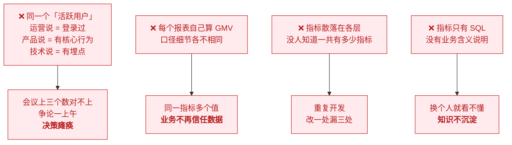
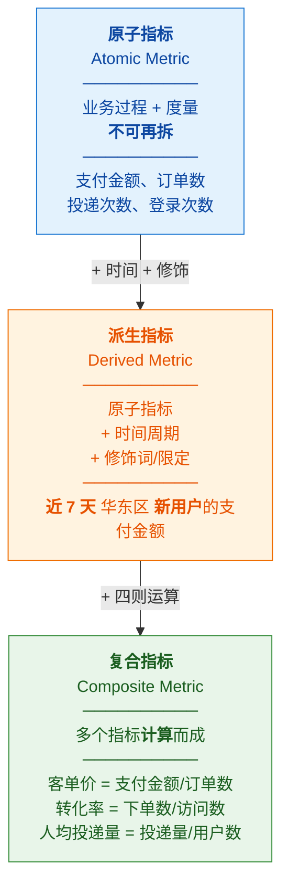
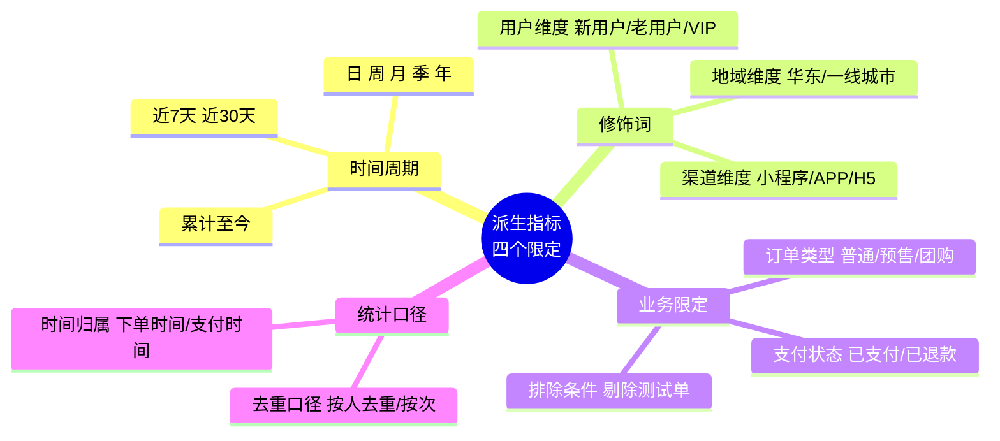
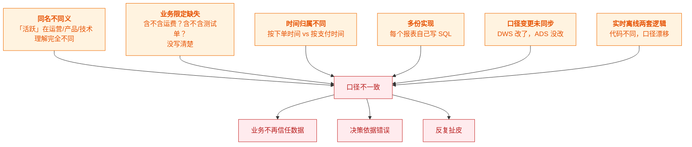
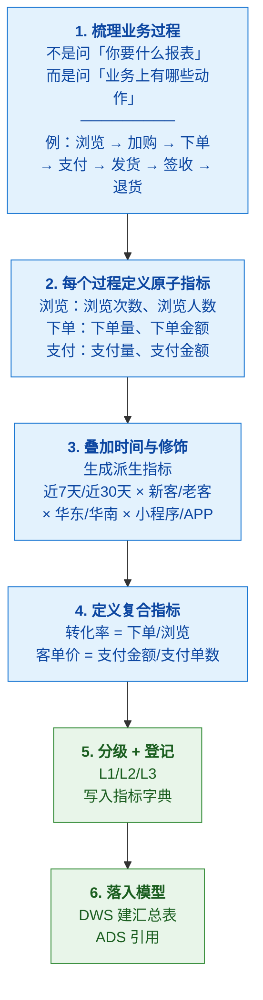
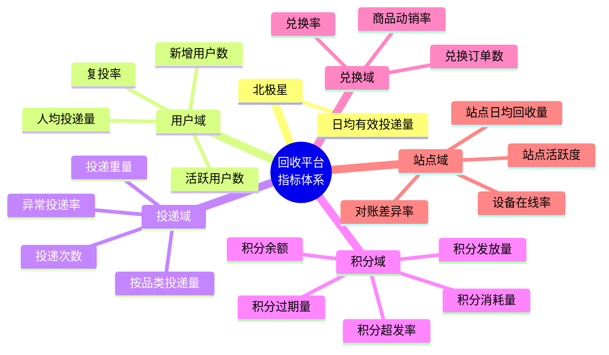

# 📊 三、指标体系与口径治理

> 本篇回答四个问题：**指标该怎么分层**（原子/派生/复合）？**怎么搭一套指标体系**？**口径不一致这个数仓头号顽疾怎么治**？以及**怎么防止指标重复建设**？
> 前置见 [[1-数仓概念与分层架构]]、[[2-维度建模]]；指标质量的校验见 [[4-数据质量管理与对账]]。

---

## 一、为什么指标比表重要

> [!important] 核心认知
> **会用 SQL 的人多，能定义清楚指标的人少。**
> 数仓交付的不是"表"，而是"**可信的数字**"。
> 一个表的字段写错了，影响一个报表；**一个指标口径错了，影响全公司的决策**。

### 1.1 没有指标体系的典型症状

### 1.2 指标体系能解决什么

| 问题 | 指标体系的作用 |
|---|---|
| 口径不一致 | **唯一权威定义**，全链路引用 |
| 重复建设 | **盘点 + 复用**，新指标先查有没有 |
| 沟通成本高 | 业务含义**文档化**，不用每次口头解释 |
| 难以追溯 | 每个指标有**计算公式、数据来源、责任人** |
| 无法评估 | 指标有**分层和优先级**，能聚焦核心 |

---

## 二、指标的分层体系

### 2.1 三层结构（⭐ 核心）

| 层级 | 定义 | 数量级 | 举例 |
|---|---|---|---|
| **原子指标** | **业务过程 + 度量**，不可再拆 | 少（几十个） | 支付金额、订单数、投递次数 |
| **派生指标** | 原子 + **时间周期** + **修饰词/限定** | 多（成百上千） | 近 7 天华东区新用户支付金额 |
| **复合指标** | 多个指标**运算**得到 | 中 | 客单价、转化率、留存率 |

> [!tip] 公式记忆
> **派生指标 = 原子指标 + 时间周期 + 修饰词 + 业务限定**
> **复合指标 = 派生指标（或原子指标）之间的运算**

### 2.2 派生指标的四个修饰维度

> [!warning] 最容易被忽略的是"业务限定"
> 举一个真实例子：**"订单金额"** 到底指什么？
> - 含不含**运费**？
> - 含不含**优惠券抵扣**？
> - 含不含**已取消订单**？
> - 含不含**测试单/内部单**？
> - 按**下单时间**还是**支付时间**归属？
>
> **这五个问题不问清楚，两个人算出来的"订单金额"必然不一样。**
> 这就是为什么口径必须文档化——**不是记性好，是要有唯一依据**。

### 2.3 指标分级（按重要性）

| 级别 | 名称 | 管控要求 | 举例 |
|---|---|---|---|
| **L1 核心指标** | 公司级北极星 / 大盘指标 | **严格管控**：口径变更需审批，变更要通知全下游 | GMV、DAU、订单量 |
| **L2 分析指标** | 部门/主题级分析指标 | 规范定义，登记在册 | 各品类转化率、各区域投递量 |
| **L3 临时指标** | 一次性探索需求 | **允许灵活**，但需标注"临时"、约定清理时间 | 某次活动的临时分析 |

> [!important] 分级的意义
> **不是所有指标都值得同等投入去治理。**
> L1 指标值得**双人复核 + 变更审批 + 下游影响分析**；
> L3 临时指标如果也走这套流程，**数仓团队会被流程压死**。
> **分级的本质是把治理资源用在刀刃上。**

---

## 三、指标字典（口径文档）⭐

> [!important] 指标字典是口径统一的**唯一依据**
> **没有指标字典，口径统一就是一句空话。**

### 3.1 指标字典的核心字段

| 字段 | 说明 | 示例 |
|---|---|---|
| **指标名称** | 唯一名称（中英文） | 支付金额 / `pay_amount` |
| **指标编码** | 系统内唯一标识 | `M_TRADE_PAY_AMT_001` |
| **业务含义** | **一句话说清业务上是什么** | 用户实际支付的金额总额 |
| **计算公式** | 精确到字段 | `SUM(pay_amount)` |
| **数据来源** | 哪张表、哪层 | `dws_trade_user_1d.pay_amount` |
| **统计粒度** | 什么维度组合 | 日 × 用户 × 地区 |
| **业务限定** | 过滤条件 | `order_status = 'PAID' AND is_test = 0` |
| **时间归属** | 按什么时间 | 支付时间 `pay_time` |
| **单位与精度** | | 元，保留两位小数 |
| **指标级别** | L1/L2/L3 | L1 |
| **责任人** | 谁负责 | 张三（数据组） |
| **更新时间** | | 2026-10-10 |
| **变更记录** | ⭐ 谁在什么时候改了什么、为什么 | 2026-09-01 剔除测试单口径 |

> [!tip] 两个最容易漏但最重要的字段
> **① 业务限定**——不写清楚，口径必然漂移
> **② 变更记录**——口径变了但没人知道，**是数据事故的头号原因**

### 3.2 指标字典长什么样（示例）

| 指标名称 | 编码 | 业务含义 | 计算公式 | 业务限定 | 时间归属 | 级别 | 责任人 |
|---|---|---|---|---|---|---|---|
| 支付金额 | `PAY_AMT` | 用户实际支付总额 | `SUM(pay_amount)` | `status='PAID'` 且 `is_test=0` | `pay_time` | L1 | 张三 |
| 支付订单数 | `PAY_ORD_CNT` | 完成支付的订单数 | `COUNT(DISTINCT order_id)` | 同上 | `pay_time` | L1 | 张三 |
| 客单价 | `AVG_ORD_AMT` | 平均每单支付金额 | `PAY_AMT / PAY_ORD_CNT` | — | `pay_time` | L1 | 张三 |
| 新客支付金额 | `PAY_AMT_NEW` | 新用户支付总额 | `SUM(pay_amount)` | `status='PAID'` 且 `user_type='NEW'` | `pay_time` | L2 | 李四 |
| 近7天支付金额 | `PAY_AMT_7D` | 滚动 7 天支付总额 | `SUM(pay_amount)` | `pay_time >= T-6` | `pay_time` | L1 | 张三 |

---

## 四、⭐ 口径治理（数仓头号难题）

### 4.1 口径为什么会不一致

### 4.2 治理的五个动作

### 4.3 ⭐ 场景题：业务方对"活跃用户"有争议怎么办

> [!important] 这是**管理题伪装成的技术题**，答好直接加分

**答题骨架（四步）**：

> "**口径争议是必然的，因为不同部门对同一个词的理解天然不同**——
> 运营说的'活跃'可能是登录过，产品说的'活跃'可能是产生过核心行为。
>
> 我的做法不是去争谁对，而是**三步**：
>
> **① 先把分歧摆到明面上。** 让各方说清楚自己理解的'活跃'定义是什么、用在什么场景。
> 大多数争议其实是**信息不对称**，而不是真的对立。
>
> **② 区分是'同名不同义'还是'真冲突'。** 这是关键判断：
> - **如果是同名不同义**（大多数情况）——那就**给指标起不同的名字**：
>   `登录活跃用户` 和 `交易活跃用户`，各自有明确口径，**问题就消失了**。
>   **不需要争一个'唯一正确的活跃'**，因为业务场景本来就不同。
> - **如果是真冲突**（同一个数在两张报表上不一致）——那就**必须有一个权威口径**，
>   我会把双方的定义、影响面和改造成本摆出来，**让业务负责人拍板**。
>
> **③ 争议的产物必须是一份书面口径文档**，写进指标字典、全链路统一、通知所有下游。
>   **而不是'下次再讨论'。**
>
> 我的核心原则是：**口径可以有不同的定义，但不能有不受控的多个实现。**"

> [!tip] 为什么这个答案强
> 它体现了三个层次：**① 沟通能力**（先听、不争）**② 判断力**（区分同名不同义 vs 真冲突）
> **③ 落地能力**（文档化 + 通知下游 + 拍板机制）
> 而多数候选人只会说"我会和业务方沟通达成一致"——**太虚了**。

### 4.4 指标重复建设怎么治

| 症状 | 治理动作 |
|---|---|
| 多个 ADS 表逻辑高度相似 | **季度盘点复用率**，相似的**下沉成一张 DWS** |
| 新指标直接从头算 | **需求评审时先查指标字典**，有就复用，没有才新建 |
| 各主题域自建维度 | **公共维度层统一收口**，禁止自建 |
| 没人知道一共有多少指标 | **建指标台账**（可工具化），定期清理无用指标 |

> [!important] 判断指标该放哪一层
> **"如果一张表只服务一个报表/页面，它就该在 ADS；如果多个报表都能用，它就该沉到 DWS。"**
> 反向使用：**如果发现一个指标被 3 个报表各算了一遍，它就该被下沉。**

---

## 五、指标体系搭建实操

### 5.1 从业务过程出发（不是从报表出发）

### 5.2 AARRR 与北极星（业务框架，面试常问）

| 框架 | 阶段 | 典型指标 |
|---|---|---|
| **AARRR 海盗模型** | Acquisition 获取 | 新增用户、获客成本 CAC |
| | Activation 激活 | 激活率、首单转化 |
| | Retention 留存 | 次日/7日/30日留存率 |
| | Revenue 收入 | GMV、ARPU、客单价 |
| | Referral 传播 | 分享率、邀请转化 |
| **北极星指标** | 唯一最重要指标 | 反映**用户获得的核心价值** |
| **OSM 模型** | Objective 目标 | 战略目标 |
| | Strategy 策略 | 达成路径 |
| | Measurement 度量 | 衡量指标 |

> [!tip] 答题时把框架和业务挂钩
> "搭指标体系我会分两步：**先定北极星**——它必须反映用户获得的核心价值，
> 比如回收平台我会选'**日均有效投递量**'而不是'注册用户数'，因为后者是虚荣指标。
> **再用 OSM 拆解**：目标（提升回收量）→ 策略（提升站点覆盖 / 提升用户复投率）→
> 度量（站点数、复投率、人均投递量）。
> **框架的价值是把'拍脑袋定指标'变成'有逻辑地推导'。**"

### 5.3 完整示例：回收平台积分指标体系

> [!example] 结合你的项目背景（真实可讲）

| 层级 | 指标 | 公式 | 业务限定 |
|---|---|---|---|
| 原子 | 投递次数 | `COUNT(1)` | 有效投递（非异常、非测试） |
| 原子 | 投递重量 | `SUM(weight)` | 有效投递 |
| 原子 | 积分发放量 | `SUM(points)` | `type='EARN'` |
| 派生 | 近7天投递量 | `SUM` where `dt >= T-6` | 有效投递 |
| 派生 | 华东区投递量 | `SUM` | `region='华东'` |
| 复合 | 人均投递量 | 投递次数 / 活跃用户数 | — |
| 复合 | 积分超发率 | 超发积分数 / 发放积分数 | — |
| 复合 | 复投率 | 二次投递用户数 / 投递用户数 | 7 日内 |
| 复合 | 对账差异率 | 差异条数 / 总条数 | T+1 对账 |

> [!success] 这个案例的杀伤力
> 它同时体现了：**分层能力**（原子/派生/复合）、**业务理解**（北极星选得对）、
> **质量意识**（超发率、对账差异率进了指标体系）。
> 而且**全部是你项目里真实存在的东西**——不需要编造。

---

## 六、30 秒速查表

| 问题 | 一句话答案 |
|---|---|
| 指标三层 | **原子**（业务过程+度量）→ **派生**（+时间+修饰）→ **复合**（运算） |
| 派生指标公式 | **原子指标 + 时间周期 + 修饰词 + 业务限定** |
| 最容易漏的限定 | **业务限定**（含不含运费/测试单？按什么时间归属？） |
| 指标为什么要分级 | **把治理资源用在刀刃上**；L1 严格管控，L3 允许灵活 |
| 指标字典的核心 | **唯一权威定义** + 业务含义 + 公式 + **业务限定** + **变更记录** |
| 口径统一的机制 | **建字典 → 收口到一处 → 下游只引用不重算 → 变更管控 → 自动比对** |
| 同指标多处实现怎么办 | **下沉到 DWS**；判断标准：多个报表能用就该沉 |
| 口径争议怎么处理 | **区分"同名不同义"（改名字）vs "真冲突"（业务负责人拍板）**；产物必须是**书面口径文档** |
| 实时离线口径怎么统一 | **共用口径定义 + 共用维度表 + T+1 自动比对告警**——靠机制不靠自觉 |
| 搭指标的框架 | **北极星**（反映核心价值）+ **OSM**（目标-策略-度量）+ **AARRR** |
| 北极星怎么选 | 不能是**虚荣指标**；要反映用户获得的**核心价值** |

---

## 七、学习检查清单

- [ ] 能说清原子/派生/复合指标的区别并各举三个例子
- [ ] 能说出派生指标的四个限定维度
- [ ] 能解释"业务限定"为什么最容易导致口径漂移（举运费/测试单的例子）
- [ ] 能说出指标字典必须包含的字段，尤其是"业务限定"和"变更记录"
- [ ] 能完整回答"业务方对活跃用户定义有争议怎么办"（四步法）
- [ ] 能说出口径治理的五个动作
- [ ] 能判断一个指标该放 DWS 还是 ADS
- [ ] 能用北极星 + OSM 为一类业务搭出指标体系
- [ ] **能用回收平台/积分体系完整讲一遍指标体系**（结合作品背景）

---
> 上一篇 → [[2-维度建模]] ｜ 下一篇 → [[4-数据质量管理与对账]] ｜ 返回 [[0-数据仓库总览]]
