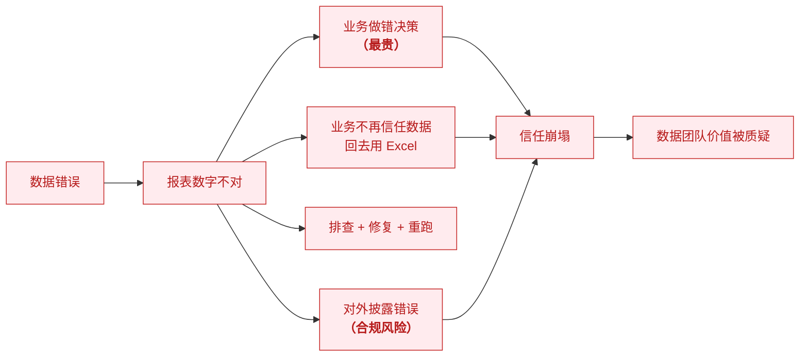
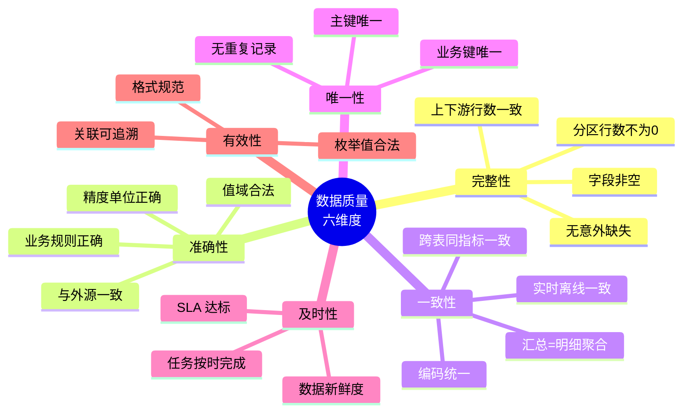
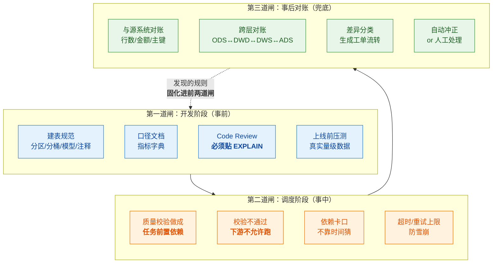
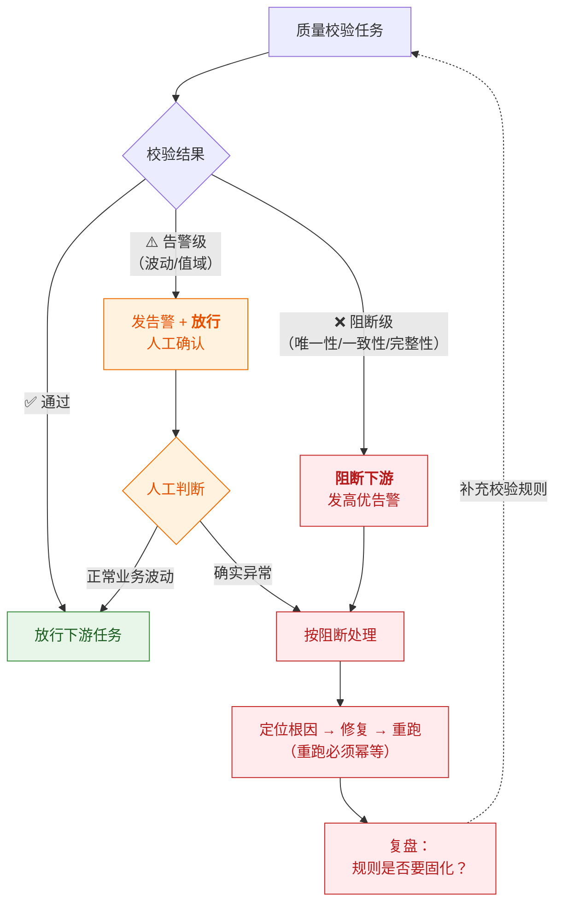
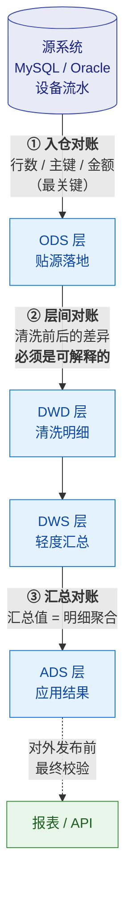
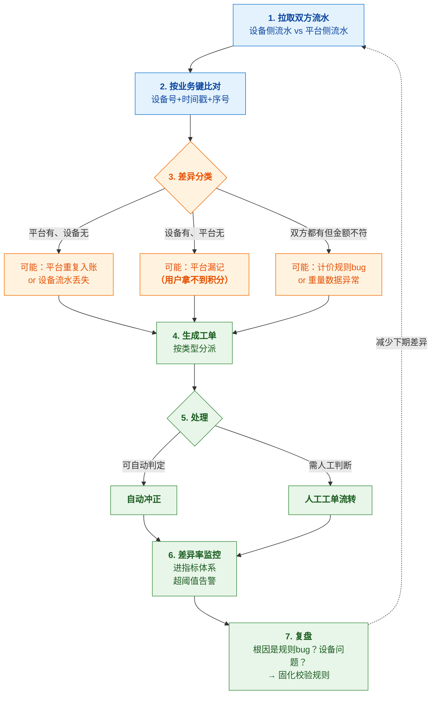
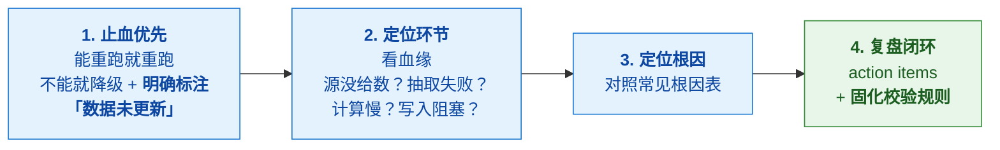
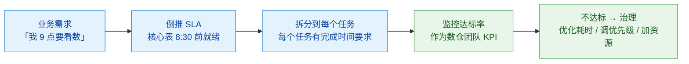

# 🛡️ 四、数据质量管理与对账

> 本篇回答四个问题：**数据质量该管哪几个维度**？**怎么设计校验规则**（事前/事中/事后三层）？**对账体系怎么搭**（这是最后一道防线）？以及**数据出问题了怎么排查和复盘**？
> 前置见 [[1-数仓概念与分层架构]]、[[3-指标体系与口径治理]]；调度侧的卡口实现见 [[5-ETL调度与数据同步]]。

---

## 一、为什么数据质量是数仓的生命线

> [!danger] 核心认知
> **错的数据比没有数据危害大得多。**
> 没有数据，业务会来问、会等人处理；
> **有错数据，业务会拿着它做决策，而且不知道自己错了。**

### 1.1 数据错误的成本



> [!important] 一句话原则（面试金句）
> **"宁可让报表晚出并告警，也不能让错的数据流到下游。"**

---

## 二、数据质量的六个维度



| 维度 | 检查什么 | 典型校验规则 |
|---|---|---|
| **完整性** | 数据有没有缺 | 主键非空、分区行数 > 0、行数波动 < 阈值、上下游行数一致 |
| **准确性** | 数据对不对 | 金额 ≥ 0、时间不倒挂、枚举值在范围内、与外源比对 |
| **一致性** | 数据对不对得上 | **ADS 汇总 = DWD 明细聚合**、同指标跨表一致、**实时离线一致** |
| **唯一性** | 有没有重复 | 主键/业务键唯一 |
| **及时性** | 数据来没来 | 任务在窗口内完成（如早 8 点前）、数据新鲜度 |
| **有效性** | 数据合不合规 | 枚举合法、格式规范、外键能关联上 |

> [!tip] 面试时按维度答
> 不要说"我会加一些校验"，而是**按六个维度组织**——
> 这立刻体现出你**有体系**，而不是零散经验。

---

## 三、⭐ 三道闸门（核心方法论）



> [!success] ⭐ 这是你的王牌话术（必背）
> **"我把数据质量做成三道闸：**
> **第一道在开发阶段**——建表规范、口径文档、review 贴执行计划，把问题挡在上线前；
> **第二道在调度阶段**——质量校验做成任务前置依赖，校验不过下游不跑，
> **宁可让报表晚出并告警，也绝不让错数据流到下游**；
> **第三道在事后对账**——**这个我在回收平台真做过**，设备流水和平台流水每天双向比对，
> 差异分三类生成工单处理。
>
> 我的核心观点是：**规则再全也会有漏的，但只要能和源头对上账，问题就一定能被发现。
> 对账是数据准确性的最后一道防线。**"

---

## 四、校验规则设计（可落地清单）

### 4.1 规则分类与实现

| 类别 | 规则 | 实现方式 | 触发动作 |
|---|---|---|---|
| **非空校验** | 主键、关键字段不为 NULL | SQL count | 阻断下游 |
| **唯一性校验** | 主键/业务键唯一 | `COUNT(*) = COUNT(DISTINCT key)` | 阻断下游 |
| **行数校验** | 分区行数 > 0；波动幅度 < 阈值 | 与历史均值比 | 告警 or 阻断 |
| **值域校验** | 金额 ≥ 0、比例 0~1、枚举合法 | `WHERE ... NOT IN (...)` | 告警 |
| **一致性校验** | ADS 汇总 = DWD 明细聚合 | 两个 SQL 结果比对 | **阻断下游（严重）** |
| **及时性校验** | 任务在窗口内完成 | 调度系统 SLA 监控 | 告警升级 |
| **主外键校验** | 事实表外键在维度表存在 | `LEFT JOIN ... IS NULL` | 告警 |
| **波动校验** | 环比/同比变化超阈值 | 与 T-1、上周同日比 | 告警（可能是真变化） |
| **业务规则校验** | 时间不倒挂、金额勾稽 | 自定义 SQL | 阻断 or 告警 |

> [!warning] 波动校验必须"告警"而不是"阻断"
> 因为**业务真的可能暴增暴跌**（大促、故障、政策变化）。
> 如果波动就阻断，大促当天数仓直接瘫了。
> **正确的做法是：告警 + 人工确认 + 确认后放行。**

### 4.2 校验规则示例 SQL

```sql
-- ① 唯一性校验
SELECT COUNT(*) AS total, COUNT(DISTINCT order_id) AS uniq
FROM dwd_order_detail
WHERE dt = '${bizdate}'
HAVING total <> uniq;          -- 有结果 = 校验失败

-- ② 一致性校验：ADS 汇总必须等于 DWD 明细聚合
SELECT
  (SELECT SUM(pay_amount) FROM ads_trade_summary WHERE dt='${bizdate}') AS ads_amt,
  (SELECT SUM(pay_amount) FROM dwd_order_detail  WHERE dt='${bizdate}') AS dwd_amt
HAVING ads_amt <> dwd_amt;     -- 有结果 = 口径或逻辑有问题

-- ③ 及时性/完整性：关键分区不能为空
SELECT COUNT(1) FROM ods_order WHERE dt='${bizdate}' HAVING COUNT(1) = 0;

-- ④ 主外键校验：事实表维度键必须在维度表存在
SELECT COUNT(1)
FROM dwd_order_detail f
LEFT JOIN dim_user d ON f.user_sk = d.user_sk
WHERE f.dt = '${bizdate}' AND d.user_sk IS NULL
HAVING COUNT(1) > 0;          -- 有结果 = 存在孤儿记录

-- ⑤ 波动校验：与上周同日对比，变化超 30% 告警
WITH today AS (SELECT COUNT(1) c FROM dwd_order_detail WHERE dt='${bizdate}'),
     last  AS (SELECT COUNT(1) c FROM dwd_order_detail WHERE dt=DATE_SUB('${bizdate}',7))
SELECT today.c, last.c,
       ABS(today.c - last.c) / NULLIF(last.c,0) AS diff_rate
FROM today, last
WHERE diff_rate > 0.3;
```

### 4.3 校验结果怎么处理



> [!important] 关键设计原则
> **校验规则要分级：**
> - **阻断级**：数据明显错误（唯一性破坏、对账不平）→ **必须挡住**
> - **告警级**：可能正常也可能异常（波动、值域）→ **告警但放行，人工确认**
>
> **如果所有规则都阻断，大促/异常业务日数仓会瘫痪；
> 如果所有规则都只告警，错误数据就流下去了。分级是必须的。**

---

## 五、⭐ 对账体系（最后一道防线）

> [!success] 这部分是你的实战亮点
> 你在回收平台做过 **T+1 双向对账**（设备流水 vs 平台流水，差异分三类，工单闭环）。
> 这套经验**直接可以迁移到数仓**——而且比大多数候选人的"加校验规则"深刻得多。

### 5.1 为什么要对账

> [!note] 核心逻辑
> **校验规则是"我认为数据应该满足什么条件"；
> 对账是"我和源头必须完全一致"。**
> 规则可能漏（你想不到的情况），但**只要能和源头对上账，差异一定会暴露**。

### 5.2 数仓的三层对账



| 对账层 | 对什么 | 差异含义 |
|---|---|---|
| **① 源 ↔ ODS** | 行数、主键集合、金额合计 | 抽取漏数/重数 → **最严重，必须为 0** |
| **② ODS ↔ DWD** | 清洗前后的行数与金额差异 | 差异**必须可解释**（比如剔除了测试单、去重了多少条）——**要能列出明细** |
| **③ DWD ↔ DWS/ADS** | 汇总值 = 明细聚合值 | 汇总逻辑或口径错误 |

> [!important] 第二层对账的关键
> **ODS→DWD 有清洗，所以行数本来就会变。**
> **关键不是"差异为 0"，而是"差异可解释、可追溯"。**
> 比如：源表 10 万行，DWD 9.8 万行，差 2000 行——
> 必须能说清"这 2000 行是测试单 1500 + 重复 500"，
> 而且**这个数字要能对得上**。**不能解释的差异才是问题。**

### 5.3 对账的完整闭环（你的实战案例）



> [!success] 面试怎么讲这个案例（⭐ 背下来）
> "我在回收平台做过一套 T+1 对账，我觉得它和数仓的数据质量是同一件事。
>
> **背景**：设备上报的投递流水和平台记录的积分流水必须一致，
> 不然要么用户拿不到积分（漏记），要么平台多发积分（超发）。
>
> **做法**：每天拉两侧流水，按'设备号+时间戳+序号'这个业务键做**双向比对**，
> 差异分成三类——**平台多了、设备多了、金额不符**，分别生成工单流转。
> 能自动判定的自动冲正，需要人工判断的走工单。
> 差异率作为指标进监控，超阈值告警。
>
> **收获有两点**：
> ① **对账发现的规律要固化回校验规则**，让同类问题下次被自动拦截，而不是每次都靠对账发现；
> ② **对账是最后一道防线**——规则再全也有漏的，**但只要能对上账，问题一定能被发现**。
>
> 这套东西放到数仓就是：**ODS 与源系统对账、DWD 与 ODS 对账、ADS 与 DWD 对账**。"

### 5.4 对账的技术实现

```sql
-- 双向对账：找出双方不一致的记录
WITH src AS (SELECT biz_key, amount FROM source_flow WHERE dt='${bizdate}'),
     tgt AS (SELECT biz_key, amount FROM ods_flow    WHERE dt='${bizdate}')
SELECT
  COALESCE(s.biz_key, t.biz_key) AS biz_key,
  s.amount AS src_amount,
  t.amount AS tgt_amount,
  CASE
    WHEN s.biz_key IS NULL THEN '设备有_平台无'
    WHEN t.biz_key IS NULL THEN '平台有_设备无'
    WHEN s.amount <> t.amount THEN '金额不符'
  END AS diff_type
FROM src s
FULL OUTER JOIN tgt t ON s.biz_key = t.biz_key
WHERE s.biz_key IS NULL OR t.biz_key IS NULL OR s.amount <> t.amount;
```

> [!tip] 对账的工程要点
> 1. **用 FULL OUTER JOIN** 才能双向发现差异（单侧 JOIN 只能发现一个方向）
> 2. **业务键必须唯一稳定**——否则对账本身就不准
> 3. **差异要落表留痕**——不能只是告警，要能查历史差异和处理结果
> 4. **对账任务本身也要监控**——对账任务失败 = 失去了防线

---

## 六、数据问题的排查与复盘

### 6.1 排查四步（通用）



> [!danger] 止血阶段最忌讳的事
> **绝不能让下游拿到错数据而不知情。**
> 如果数据没更新，**必须在报表上明确标注"数据截至 XX 时间"**，
> 而不是让旧数据看起来像新数据。

### 6.2 常见根因对照表

| 现象 | 常见根因 | 排查方向 |
|---|---|---|
| **数据延迟** | 源系统延迟、任务耗时增长（数据量涨/倾斜/缺索引）、资源被抢占、**版本堆积（Doris `-235`）** | 看血缘找最慢环节；看任务耗时趋势 |
| **任务失败** | 上游依赖未就绪、OOM、脏数据导致导入失败（`max_filter_ratio`）、连接超时 | 看日志；检查上游产出 |
| **数据不对** | **分区裁剪失效**、Join 条件写错、口径变更未同步下游、去重逻辑错误 | 贴 EXPLAIN 看计划；对账差异 |
| **数据重复** | 幂等失效（label 变 UUID）、重跑没清理、Join 放大 | 检查唯一性校验；查重跑记录 |
| **数据缺失** | 上游漏推、过滤条件误伤、关联不上（NULL 外键）、时区问题 | 对比对账差异；检查 NULL 外键 |
| **数据倾斜** | 分组键分布不均（如按 null 或热点 key 分组） | 看任务各 instance 耗时分布 |

> [!tip] 讲一个真实的"数据延迟"故事（结合作品背景）
> "回收平台遇到过设备离线后**补传数据**——导致按时间统计的投递量在当天偏低。
> 我的处理是：**离线补传的数据按业务时间回放，而不是按到达时间入库**，
> 同时**报表标注'数据可能延迟'**，T+1 对账后修正。
>
> 这让我意识到：**数据链路里'业务时间'和'处理时间'必须严格区分**。
> 这正好对应数仓里的**事件时间 vs 处理时间**——实时数仓的 Watermark 就是在解决同一件事。"

### 6.3 复盘模板

| 项 | 内容 |
|---|---|
| **问题描述** | 什么数据错了、影响范围、发现方式 |
| **时间线** | 什么时候产生、什么时候发现、什么时候修复 |
| **根因** | 技术根因 + **流程根因**（为什么会发生，为什么没被更早发现） |
| **影响面** | 影响了哪些报表/下游/决策 |
| **修复动作** | 具体做了什么 |
| **改进项** | ✅ **新增/修改了哪条校验规则**（最重要）<br>✅ 哪个环节加了监控<br>✅ 哪个流程要改 |

> [!important] 复盘的产出必须是"机制"而不是"下次注意"
> **"下次注意"等于没有改进。**
> 每次数据事故都应该产出：**一条新增的校验规则** 或 **一个新增的监控**。
> **这才是数据质量能持续变好的唯一方式。**

---

## 七、监控与 SLA

### 7.1 该监控什么

| 层次 | 监控项 | 告警方式 |
|---|---|---|
| **任务层** | 任务成功/失败、耗时、是否超 SLA | P0 电话 / P1 群通知 |
| **数据层** | 分区行数、数据量波动、质量校验结果 | P1/P2 |
| **链路层** | 端到端延迟、上下游是否对齐 | P1 |
| **对账层** | 对账差异率、对账任务是否执行 | P0（防线不能失效） |
| **资源层** | 集群 CPU/内存/磁盘、慢查询、Compaction（Doris） | P2 |

### 7.2 SLA 怎么定



> [!important] 告警设计原则
> **告警必须"可行动"（actionable）**——收到的人知道要干什么。
> **定期清理不行动的告警**——**告警疲劳比没告警更危险**。
> 分级：P0 电话（核心链路断了）、P1 群通知（影响部分报表）、P2 日报（观察项）。

---

## 八、30 秒速查表

| 问题 | 一句话答案 |
|---|---|
| 数据质量六维度 | **完整性、准确性、一致性、唯一性、及时性、有效性** |
| 三道闸比喻 | **开发阶段规范 → 调度阶段校验卡口 → 事后对账兜底** |
| 核心原则 | **宁可让报表晚出并告警，也不让错数据流到下游** |
| 校验规则怎么分级 | **阻断级**（唯一性/一致性/完整性）vs **告警级**（波动/值域） |
| 为什么波动校验只告警 | 业务真可能暴增暴跌；**大促当天阻断会让数仓瘫痪** |
| 为什么对账必须有 | 规则会漏，**对账是最后一道防线** |
| 数仓三层对账 | **源↔ODS**（必须 0 差异）、**ODS↔DWD**（差异须可解释）、**汇总↔明细** |
| ODS→DWD 差异可以为 0 吗 | **不必为 0**（有清洗），但**必须可解释、可追溯、数字要对得上** |
| 对账 SQL 关键 | 用 **FULL OUTER JOIN** 才能双向发现差异 |
| 数据延迟怎么排查 | 看血缘找最慢环节 → 源延迟/耗时增长/资源抢占/版本堆积 |
| 止血阶段最忌什么 | **让下游拿到错数据而不知情**（旧数据必须标注） |
| 复盘的产出是什么 | **必须是一条新增校验规则或监控**；"下次注意"等于没改 |
| 业务时间 vs 处理时间 | 必须严格区分；**补传数据按业务时间回放**（对应 Flink Watermark） |
| 告警设计原则 | **可行动**；定期清理；**告警疲劳比没告警更危险** |

---

## 九、学习检查清单

- [ ] 能按六个维度说清数据质量管什么
- [ ] 能完整讲"三道闸"方法论
- [ ] 能写唯一性、一致性、主外键、波动四类校验 SQL
- [ ] 能说清校验规则为什么要分级（阻断 vs 告警）
- [ ] 能说清数仓三层对账对什么、差异各代表什么
- [ ] **能用手写 FULL OUTER JOIN 的双向对账 SQL**
- [ ] **能用回收平台对账案例完整讲一遍**（背景→做法→收获）
- [ ] 能解释"ODS→DWD 差异为什么必须可解释而不是必须为 0"
- [ ] 能说出数据延迟/重复/缺失/倾斜的常见根因
- [ ] 能说清业务时间与处理时间的区别，并举出补传数据的例子
- [ ] 能说清复盘必须产出什么（机制而非"下次注意"）
- [ ] 能说出 SLA 怎么从业务需求倒推

---
> 上一篇 → [[3-指标体系与口径治理]] ｜ 下一篇 → [[5-ETL调度与数据同步]] ｜ 返回 [[0-数据仓库总览]]
