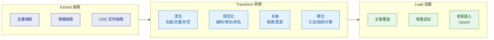
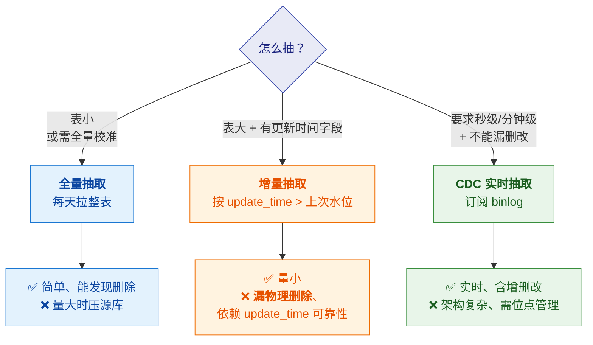
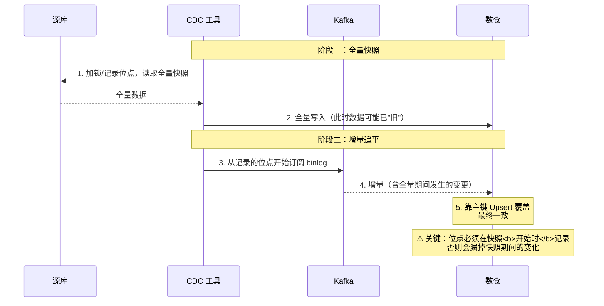
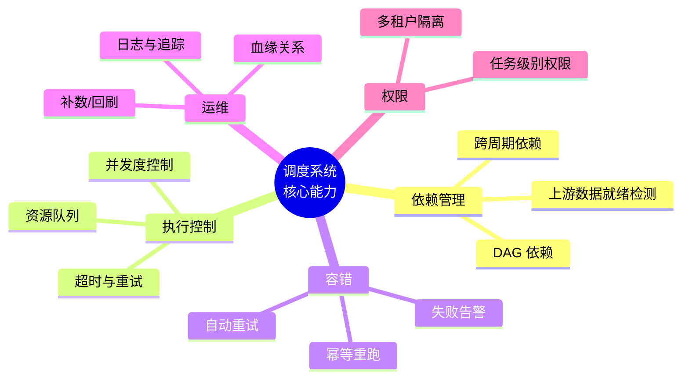
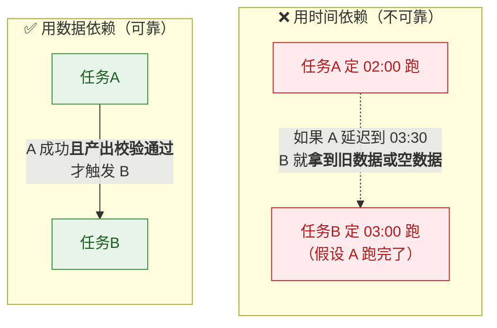
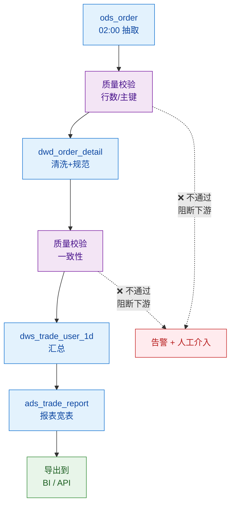
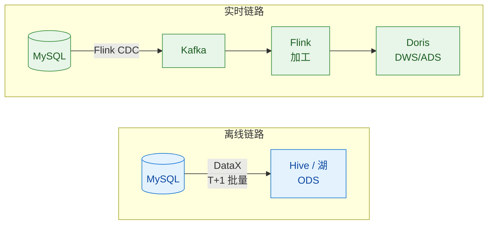

# 🔄 五、ETL 调度与数据同步

> 本篇回答五个问题：**ETL 怎么分层实现**（抽取/转换/加载各自的坑）？**增量抽取**有哪些方式、怎么选？**调度系统**怎么设计（依赖/幂等/重跑）？**数据同步**的工具全景是什么？以及**任务调度规范**该怎么定？
> 前置见 [[1-数仓概念与分层架构]]；质量的校验卡口见 [[4-数据质量管理与对账]]；Doris 导入细节见 [[5-bigdata/1-doris/6-数据导入与FlinkCDC]]。

---

## 一、ETL 全景



> [!note] ETL vs ELT
> | | **ETL** | **ELT** |
> |---|---|---|
> | 转换在哪 | **抽取后、加载前**（独立 ETL 服务器） | **加载后**（在目标库/数仓内转换） |
> | 依赖 | 需专门 ETL 工具和服务器 | 依赖目标库的**算力** |
> | 适用 | 传统数仓、目标库算力弱 | **云数仓、MPP（Doris/StarRocks/Snowflake）** |
>
> **趋势是 ELT**：先把原始数据加载进来（ODS），再用数仓自身的算力做转换。
> 好处是**原始数据保留可重算**、不依赖中间 ETL 服务器。

---

## 二、抽取（Extract）

### 2.1 三种抽取方式的取舍



| 方式 | 适用 | **致命坑** |
|---|---|---|
| **全量** | 小表、维表、需校准 | 大表压垮源库；拉取窗口内数据变化 |
| **增量（时间戳）** | 大表、有可靠的 `update_time` | ⚠️ **漏物理删除**；⚠️ `update_time` 不更新（如 `ON UPDATE` 缺失）；⚠️ **时间水位边界重复/遗漏** |
| **增量（自增 ID）** | 只增不改的表 | ⚠️ **漏更新**（改了但 ID 不变）；ID 不连续 |
| **CDC（binlog）** | 实时、需完整变更 | 位点管理、Schema 变更、大事务、**全量+增量衔接** |

> [!danger] 增量抽取最经典的两个坑（面试必问）
> **① 漏物理删除**
> 源库 `DELETE` 了一条，增量抽取看不见（因为查不到它了）→ **数仓里还留着这条数据**。
> **解法**：定期全量校准；或用 CDC；或源库加逻辑删除字段。
>
> **② 时间水位边界问题**
> ```sql
> -- 假设上次抽到 10:00，这次抽 update_time > '10:00'
> -- 问题：10:00:00.000 之后、10:00 这一秒内提交的事务可能还没写入就被抽走了？
> -- 更常见的问题：11:00 抽数时，10:59:59 的事务可能还没提交完
> ```
> **解法**：**水位回退**（多抽一段时间，靠下游幂等去重）+ **只抽已提交的数据**。
> 👉 **"宁可多抽（靠幂等去重），不可少抽（无法补救）"** —— 这是核心原则。

### 2.2 CDC 全量 + 增量衔接



> [!important] 全量+增量衔接的核心
> **位点必须在"全量快照开始"的那一刻记录，而不是结束时。**
> 否则快照进行期间发生的变更会**既不在快照里、也不在增量里**（因为没有位点）。
> **衔接策略是"存量覆盖 + 增量追平"**，靠主键 Upsert 最终一致。

---

## 三、转换（Transform）

| 转换类型 | 做什么 | 注意 |
|---|---|---|
| **清洗** | 去脏数据、去重、补空值、格式统一 | **去重必须有唯一规则**，否则结果不可复现 |
| **规范化** | 编码统一（性别 0/1 ↔ M/F）、单位统一、命名统一 | **这是"集成"的核心**，多源系统必做 |
| **维度关联** | 关联维表、生成宽表 | ⚠️ **维表关联可能放大行数**（一对多） |
| **代理键生成** | 为维度生成代理键 | SCD2 的前提（见 [[2-维度建模]]） |
| **聚合** | 算指标、生成 DWS | 口径必须引用指标字典（见 [[3-指标体系与口径治理]]） |
| **脱敏** | 手机号/身份证加密或掩码 | 合规要求，**ODS 层就要做** |

> [!warning] 维表关联放大的经典事故
> 维表如果有重复（一个 `user_id` 对应两行，比如 SCD2 没做时间过滤），
> `JOIN` 会让事实表**行数翻倍**，金额直接翻倍。
> **解法**：① 关联必须带时间条件；② 关联后校验行数；③ 维表业务键必须唯一（当前有效版本）。

---

## 四、⭐ 调度系统设计

### 4.1 调度系统的核心能力



### 4.2 ⭐ 依赖：不要用时间猜



> [!important] 调度规范第一条
> **"任务必须配依赖，不能靠时间猜。"**
> 而且依赖要**同时包含**：① 上游任务成功 **② 上游数据质量校验通过**。

### 4.3 ⭐ 幂等：数仓任务的生命线

> [!danger] 为什么数仓任务必须幂等
> **因为补数和重跑是常态**（上游延迟、数据错误、业务回溯需求）。
> **一个不能重跑的任务，等于不能运维。**

| 幂等方式 | 做法 | 适用 |
|---|---|---|
| **分区覆盖** | `INSERT OVERWRITE ... PARTITION(dt)` | ✅ **最常用**，按天分区天然幂等 |
| **主键 Upsert** | `INSERT INTO ... ON DUPLICATE KEY` / Doris Unique 模型 | CDC、维表 |
| **导入 label 幂等** | 同 label 重复提交视为同一事务 | Doris Stream Load / Flink Sink |
| **删除重写** | 先 `DELETE` 当天分区再插入 | 无分区表 |
| **状态记录** | 记录已处理位点/批次 | 流式任务 |

```sql
-- ✅ 幂等的写法：分区覆盖（重跑多少次结果都一样）
INSERT OVERWRITE TABLE dwd_order_detail PARTITION (dt = '${bizdate}')
SELECT ... FROM ods_order WHERE dt = '${bizdate}';

-- ❌ 不幂等的写法：直接追加（重跑一次翻一倍）
INSERT INTO dwd_order_detail
SELECT ... FROM ods_order WHERE dt = '${bizdate}';
```

> [!tip] 面试金句
> **"我判断一个数仓任务好不好，先看它能不能安全重跑。"**
> 这句话很显专业——因为它点出了**数仓运维的本质**。

### 4.4 补数与回刷

| 类型 | 场景 | 注意 |
|---|---|---|
| **补数** | 某天任务失败，补跑那天 | 要**级联补下游**（依赖链上都要重跑） |
| **回刷** | 口径变更，历史数据要重算 | 评估**影响范围**（血缘）+ **资源开销**（可能几百天） |
| **回溯** | 业务要重算某段历史 | 同回刷，但要**限流**，避免压垮集群 |

> [!warning] 补数的三个坑
> 1. **忘记补下游** —— 上游补了，下游还是错的
> 2. **补数任务没限流** —— 一次补 100 天，集群被打满，影响正常任务
> 3. **补数没有记录** —— 谁在什么时候补了什么，事后无人知道（**必须有补数工单**）

### 4.5 完整的调度链路示例



---

## 五、数据同步工具全景

### 5.1 工具分类速查

| 类别 | 工具 | 定位 |
|---|---|---|
| **离线批量同步** | **DataX**（阿里开源） | 国内极常用，异构数据源批量同步 |
| | **SeaTunnel**（原 Waterdrop） | 新一代，支持批流一体 |
| | Sqoop（淘汰中） | Hadoop 生态老工具 |
| | Kettle (PDI) | 可视化 ETL，传统企业常见 |
| **实时 CDC** | **Flink CDC** | 当前主流，全量+增量，生态好 |
| | Canal | 阿里开源，binlog 订阅 |
| | Debezium | Kafka Connect 生态，成熟 |
| | Maxwell | 轻量 binlog 订阅 |
| **商业 ETL** | ODI / Informatica / DataStage | 传统企业、**Oracle 环境常见（ODI 是 Oracle 自家）** |
| **消息队列** | Kafka / Pulsar / RocketMQ | 缓冲与解耦 |
| **调度** | DolphinScheduler / Airflow / Control-M / XXL-JOB | 见 5.3 |

### 5.2 常见同步链路



### 5.3 调度工具对比

| 工具 | 定位 | 特点 |
|---|---|---|
| **DolphinScheduler** | 国产分布式调度 | 可视化 DAG、多租户、**Apache 顶级项目**，国内数仓主流 |
| **Airflow** | Python DAG 调度 | 生态最丰富、**代码定义 DAG**，适合数据工程团队 |
| **Azkaban** | 老牌 Hadoop 调度 | 轻量，逐渐被替代 |
| **Control-M / Autosys** | 商业调度 | **传统企业/银行常用**，稳定但贵、封闭 |
| **XXL-JOB** | 分布式任务调度 | 更偏**应用定时任务**，不是专业数仓调度 |
| **Doris 自带** | — | 无独立调度，依赖外部调度器触发导入和 SQL |

> [!tip] 答题话术（体现迁移能力）
> "调度器我用过 XX，但我的理解是**调度器是可替换的，规范才是核心**。
> 不管用 DolphinScheduler 还是 Airflow，我的规范是一样的：
> **任务必须配依赖（不靠时间猜）、必须设超时和重试上限（防雪崩）、
> 必须配失败告警且告警要有人接、任务要分级（核心链路和非核心分开）。
> 另外重跑必须幂等**——这是数仓调度和普通定时任务最大的区别。"

---

## 六、⭐ 调度规范清单（可直接落地）

> [!important] 这套规范是面试"你怎么建规范"的直接答案

| 规范类别 | 具体要求 |
|---|---|
| **依赖规范** | ① 必须配 DAG 依赖，**禁止纯时间依赖**<br>② 依赖要含**上游质量校验通过**<br>③ 跨周期依赖要显式声明（如"依赖昨天分区"） |
| **调度规范** | ① 任务分级（核心 P0 / 重要 P1 / 普通 P2）<br>② 核心链路配**独立资源队列**<br>③ 错峰调度，避免同一时刻任务扎堆 |
| **超时与重试** | ① **必须设超时**（防卡死）<br>② 重试次数**要有限**（3 次以内，防雪崩）<br>③ 重试间隔**指数退避**<br>④ **重试不能造成重复数据**（依赖幂等） |
| **告警规范** | ① **必须配失败告警**<br>② 告警要**有人接**（明确责任人）<br>③ 分级（P0 电话 / P1 群 / P2 日报）<br>④ **定期清理不行动的告警** |
| **幂等规范** | ① **所有任务必须能安全重跑**<br>② 优先用**分区覆盖**<br>③ 流式任务用 label / 位点 |
| **命名规范** | ① 表名带**分层前缀**（`ods_`/`dwd_`/`dws_`/`ads_`）<br>② 带**粒度后缀**（`_1d`/`_1h`）<br>③ 任务名与产出表一致 |
| **补数规范** | ① 补数走**工单**，记录谁补了什么<br>② **必须级联补下游**<br>③ **必须限流**（避免压垮集群） |
| **变更规范** | ① 表结构/口径变更走**变更流程**<br>② 评估**下游影响面**（血缘）<br>③ 通知所有下游 |

---

## 七、常见故障与处理

| 故障 | 原因 | 处理 |
|---|---|---|
| **任务卡住不结束** | 数据倾斜、资源不足、死锁、上游连接挂起 | 看 task 各 instance 耗时；有超时就自动杀 |
| **任务反复失败重试** | 脏数据、依赖缺表、权限问题 | **限制重试次数**；定位根因而不是靠重试 |
| **重试导致数据重复** | **任务不幂等** | 改成分区覆盖 / Upsert |
| **补数压垮集群** | 没有限流 | 分批补、错峰、限制并发 |
| **上游改了 Schema** | 没有变更通知 | 建立变更流程；抽取层做兼容 |
| **任务雪崩** | 一个失败触发大量重试，打满资源 | 超时 + 有限重试 + 指数退避 + 资源隔离 |

> [!danger] "任务雪崩"是经典事故
> 上游卡住 → 下游全部等待 → 大量任务超时 → **同时重试** → 资源打满 → 更多任务失败。
> **防线是：有限重试 + 指数退避 + 资源队列隔离 + 核心链路优先级。**

---

## 八、30 秒速查表

| 问题 | 一句话答案 |
|---|---|
| ETL vs ELT | ETL **先转换后加载**（传统）；ELT **先加载后转换**（云数仓趋势） |
| 三种抽取 | **全量**（简单但压源）、**增量**（量小但漏删除）、**CDC**（实时但复杂） |
| 增量抽取最大坑 | **漏物理删除** + **时间水位边界** |
| 抽取原则 | **宁可多抽（靠幂等去重），不可少抽（无法补救）** |
| CDC 全量增量衔接 | 位点在**快照开始时**记录；**存量覆盖 + 增量追平** |
| 维表关联的风险 | 维表重复会让**事实表行数放大**（金额翻倍） |
| 依赖该怎么做 | **数据依赖**（上游成功 + 质量校验通过），**禁止纯时间依赖** |
| 为什么必须幂等 | **补数和重跑是常态**；不能重跑 = 不能运维 |
| 最常用的幂等方式 | **分区覆盖** `INSERT OVERWRITE ... PARTITION` |
| 补数三个坑 | 忘记补下游、没限流、没记录 |
| 任务雪崩怎么防 | 超时 + 有限重试 + **指数退避** + 资源隔离 |
| 调度器重要吗 | **调度器可替换，规范才是核心** |
| 主流实时 CDC | **Flink CDC**（全量+增量、生态好） |
| 主流离线同步 | **DataX**（国内极常用）、SeaTunnel |

---

## 九、学习检查清单

- [ ] 能说清 ETL 与 ELT 的区别及趋势
- [ ] 能对比三种抽取方式并说清各自的坑
- [ ] 能说清"漏物理删除"和"时间水位"两个坑及解法
- [ ] 能画出 CDC 全量+增量衔接的时序，并说清位点为什么在开始时记录
- [ ] 能解释为什么维表关联会放大行数、怎么防
- [ ] 能说清为什么"依赖不能用时间猜"
- [ ] 能列举至少 4 种幂等实现方式，并写出分区覆盖的 SQL
- [ ] 能说清补数的三个坑和级联补下游的逻辑
- [ ] 能背出调度规范的核心条目
- [ ] 能解释任务雪崩的成因和防线
- [ ] 能被问"你用 Airflow 还是 DolphinScheduler"时答出"调度器可替换，规范是核心"

---
> 上一篇 → [[4-数据质量管理与对账]] ｜ 下一篇 → [[6-数仓建模实战案例]] ｜ 返回 [[0-数据仓库总览]]
