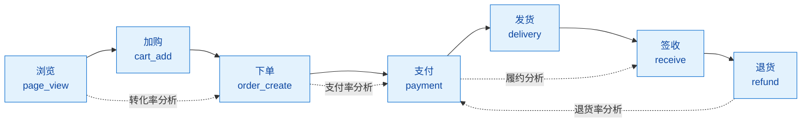
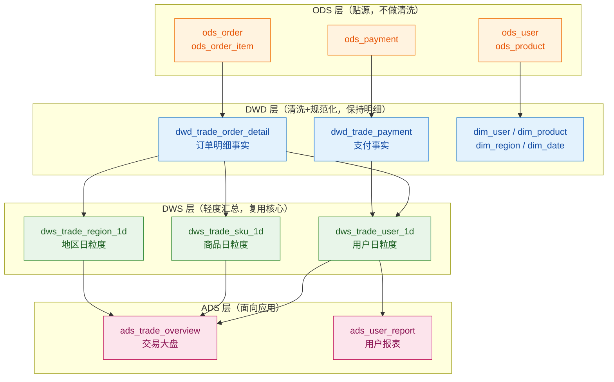
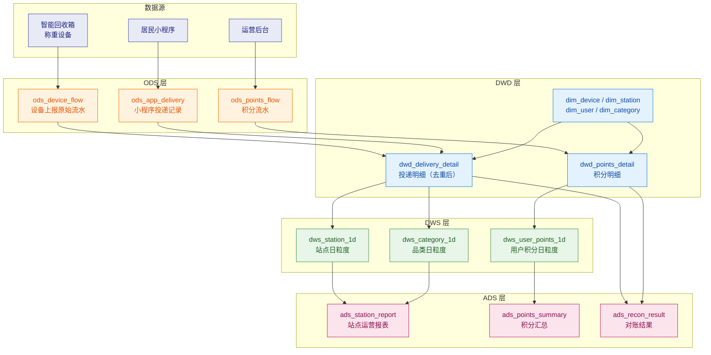
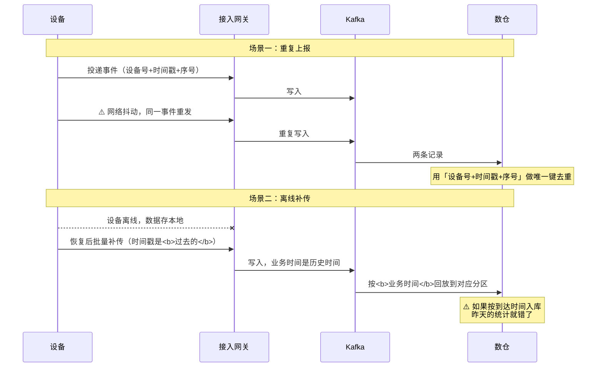
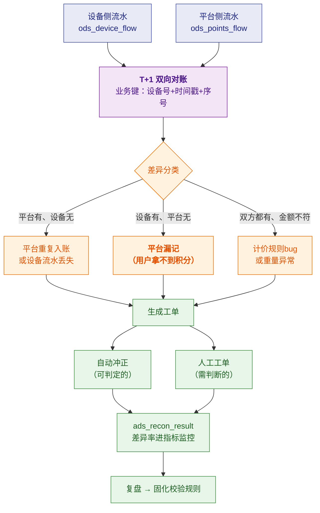
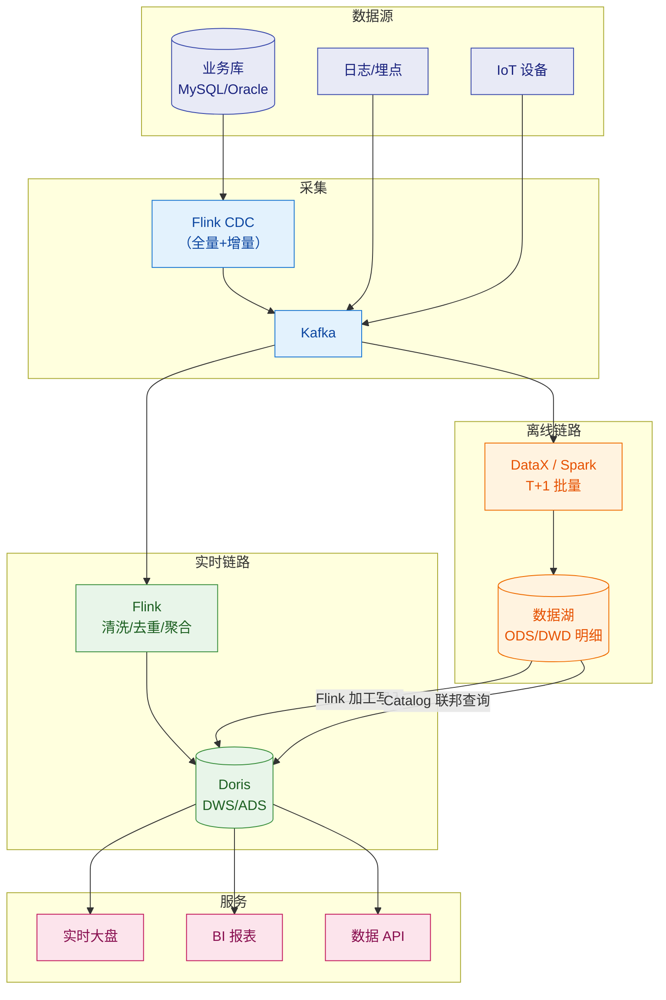
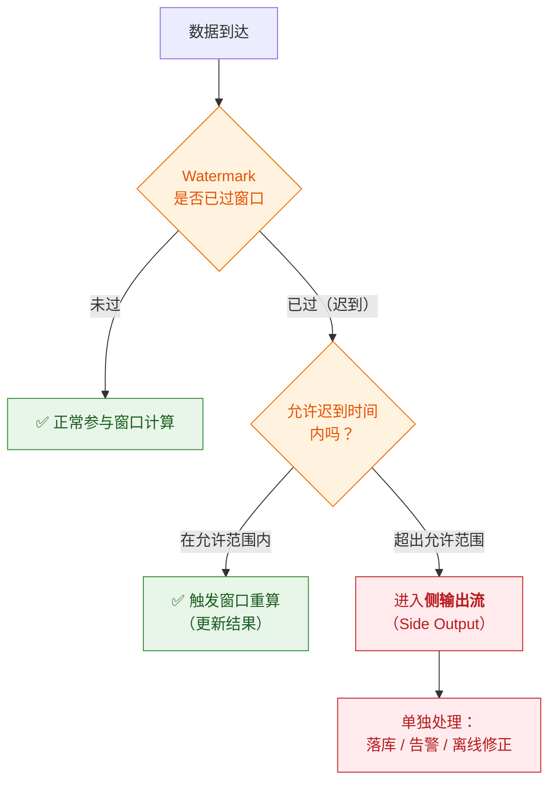
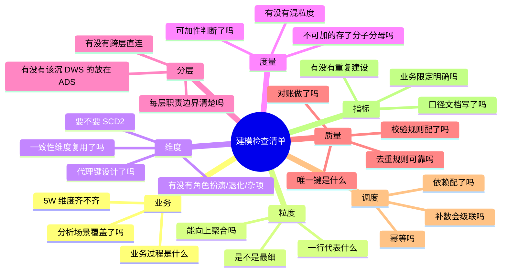

# 🏗️ 六、数仓建模实战案例

> 本篇把前面四篇的理论落到**具体业务**上。三个案例分别是：**① 电商交易数仓**（经典范式，面试标准题）、**② IoT 设备投递数仓**（贴合你的机器人/回收项目）、**③ 实时数仓链路**（离线+实时如何配合）。
> 理论见 [[1-数仓概念与分层架构]]、[[2-维度建模]]、[[3-指标体系与口径治理]]、[[4-数据质量管理与对账]]；调度实现见 [[5-ETL调度与数据同步]]。

---

## 案例一：电商交易数仓（经典标准题）

> [!note] 适用场景
> 面试被问"**给你一个电商业务，你怎么建数仓**"——这是最高频的建模题。
> **答题框架：业务过程 → 粒度 → 维度 → 度量 → 分层落地 → 指标定义。**

### 1.1 第一步：梳理业务过程



> [!important] 为什么从"业务过程"开始而不是"报表需求"
> **需求会变，业务过程相对稳定。**
> 如果按需求建模（"销售部要个报表"），需求一变模型就废；
> 按业务过程建模（"下单"这个动作），**所有围绕下单的分析需求都能覆盖**。

### 1.2 第二步：声明粒度（⭐ 关键）

| 业务过程 | 粒度 | 事实表 |
|---|---|---|
| 下单 | 一行 = **一个订单中的一个商品** | `dwd_trade_order_detail` |
| 支付 | 一行 = **一次支付流水** | `dwd_trade_payment` |
| 退货 | 一行 = **一次退货申请中的商品** | `dwd_trade_refund_detail` |

> [!danger] 粒度决策的示范说法
> **"我选'一行 = 订单中的一个商品'这个粒度。**
> 理由有三：① 这是**最细的可用粒度**，订单级和商品级的分析都能覆盖；
> ② 汇总不可逆——如果选订单级，**永远查不出单个商品的销量**；
> ③ 这个粒度能直接支撑店铺、品类、商品、用户所有维度。
> **代价是数据量最大**，但数仓本来就是用存储换灵活性。"

### 1.3 第三步：确定维度（5W）

| 5W | 维度 | 维度表 | 备注 |
|---|---|---|---|
| **Who** | 用户 | `dim_user` | **SCD2**（等级变化要能做历史分析） |
| | 店铺 | `dim_shop` | SCD2（店铺归属变化） |
| **When** | 下单日期 | `dim_date` | **角色扮演**（下单/支付/发货三次引用） |
| **Where** | 收货地区 | `dim_region` | 一致性维度 |
| **What** | 商品 | `dim_product` | 含品类、品牌（**星型，冗余存**） |
| **How** | 渠道 | `dim_channel` | 小程序/APP/H5 |
| | 促销/支付方式/是否新客 | `dim_junk` | **杂项维度**，避免事实表字段爆炸 |

### 1.4 第四步：确定度量

| 度量 | 可加性 | 处理方式 |
|---|---|---|
| 商品数量 `qty` | ✅ 可加 | 直接存 |
| 订单金额 `order_amount` | ✅ 可加 | 直接存 |
| 优惠金额 `discount_amount` | ✅ 可加 | 直接存 |
| 实付金额 `pay_amount` | ✅ 可加 | 存 |
| 运费 `freight_amount` | ✅ 可加 | 存 |
| ~~单价~~ | ❌ 不可加 | **不存**，用时 `amount/qty` |

### 1.5 完整分层落地



**DWD 事实表建表**：

```sql
CREATE TABLE dwd_trade_order_detail (
    order_detail_sk BIGINT COMMENT '事实表代理键',
    order_no        STRING COMMENT '订单号（退化维度）',
    -- 维度外键（全部代理键）
    order_date_sk   INT    COMMENT '下单日期',
    pay_date_sk     INT    COMMENT '支付日期',
    user_sk         BIGINT COMMENT '用户代理键（支持SCD2）',
    shop_sk         BIGINT COMMENT '店铺代理键',
    product_sk      BIGINT COMMENT '商品代理键',
    region_sk       INT    COMMENT '收货地区',
    channel_sk      INT    COMMENT '下单渠道',
    junk_sk         INT    COMMENT '杂项维度',
    -- 度量
    qty             INT            COMMENT '商品件数',
    order_amount    DECIMAL(18,2)  COMMENT '订单金额',
    discount_amount DECIMAL(18,2)  COMMENT '优惠金额',
    freight_amount  DECIMAL(18,2)  COMMENT '运费',
    pay_amount      DECIMAL(18,2)  COMMENT '实付金额'
)
COMMENT '订单明细事实表：一行=一个订单中的一个商品'
PARTITION BY RANGE (order_date) ( ... );
```

**DWS 汇总表**：

```sql
CREATE TABLE dws_trade_user_1d (
    dt            DATE,
    user_sk       BIGINT,
    order_cnt     BIGINT         COMMENT '下单次数（去重订单）',
    order_amount  DECIMAL(18,2)  COMMENT '下单金额',
    pay_cnt       BIGINT         COMMENT '支付订单数',
    pay_amount    DECIMAL(18,2)  COMMENT '支付金额',
    sku_cnt       BIGINT         COMMENT '购买商品种类数',
    qty           BIGINT         COMMENT '购买件数'
) COMMENT '用户日粒度交易汇总'
PARTITION BY RANGE (dt) ( ... );
```

### 1.6 指标定义（引用指标字典）

| 指标 | 层级 | 公式 | 业务限定 |
|---|---|---|---|
| 支付金额 | 原子 | `SUM(pay_amount)` | `order_status='PAID' AND is_test=0` |
| 支付订单数 | 原子 | `COUNT(DISTINCT order_no)` | 同上 |
| 客单价 | 复合 | `支付金额 / 支付订单数` | — |
| 支付转化率 | 复合 | `支付订单数 / 下单订单数` | — |
| 近7天支付金额 | 派生 | `SUM(pay_amount)` where `dt >= T-6` | — |
| 新客支付金额 | 派生 | `SUM(pay_amount)` | `user_type='NEW'` |

> [!tip] 完整答案应该提到什么
> ① 业务过程拆解 ② **粒度决策及理由** ③ 维度（含 SCD2 和一致性维度）
> ④ 度量的**可加性判断** ⑤ 四层落地 ⑥ **指标口径** ⑦ **质量校验** ⑧ **调度与幂等**
> —— 能讲全这八点，就是一个**负责人级别**的回答，而不是"会写 SQL"的回答。

---

## 案例二：IoT 设备投递数仓（⭐ 贴合你的项目）

> [!success] 为什么讲这个案例
> 你有**送物机器人**和**回收站点积分平台**两个 IoT 项目的真实经验。
> 讲这个案例，**技术细节全是真的**，经得起追问。
> 而且它比通用电商案例**更有辨识度**——面试官会记住你。

### 2.1 业务特点（决定了建模方式）

| 特点 | 对建模的影响 |
|---|---|
| **设备上报有重复** | 必须有**唯一键去重**（设备号+时间戳+序号） |
| **设备离线后补传** | **业务时间 vs 处理时间必须分开**（对应 Flink Watermark） |
| **设备可能故障/丢数据** | 需要**对账**发现缺失 |
| **重量/金额数据可能异常** | 需要**值域校验 + 异常剔除** |
| **多站点/多租户** | 必须有**数据隔离**（站点维度强制过滤） |

### 2.2 分层设计



### 2.3 ⭐ 核心难点：设备数据去重与补传



**去重实现**：

```sql
-- 在 DWD 层去重：同一业务键只保留一条
INSERT OVERWRITE TABLE dwd_delivery_detail PARTITION (dt='${bizdate}')
SELECT
    device_no, event_time, seq_no,
    station_id, user_id, category_id,
    weight, points,
    event_time AS biz_time,          -- ⭐ 业务时间
    '${bizdate}' AS dt
FROM (
    SELECT *,
           ROW_NUMBER() OVER (
               PARTITION BY device_no, event_time, seq_no   -- ⭐ 业务唯一键
               ORDER BY etl_time DESC                        -- 保留最新到达的
           ) AS rn
    FROM ods_device_flow
    WHERE dt = '${bizdate}'
) t
WHERE rn = 1;
```

> [!important] ⭐ 讲这个案例的三个加分点
> **① 去重的唯一键设计**——"设备号+时间戳+序号"，为什么需要序号？（同一秒可能多次投递）
> **② 业务时间 vs 处理时间**——补传数据必须按业务时间回放，否则历史统计会错。
> 这**直接对应 Flink 的 Watermark 机制**——说明你理解得不只是表面。
> **③ 幂等**——去重逻辑 + 分区覆盖，保证任务可重跑。

### 2.4 ⭐ 对账体系（你的王牌）



### 2.5 指标体系

| 层级 | 指标 | 公式 | 业务限定 |
|---|---|---|---|
| 原子 | 投递次数 | `COUNT(1)` | 有效投递（去重后、非异常） |
| 原子 | 投递重量 | `SUM(weight)` | 有效投递 |
| 原子 | 积分发放量 | `SUM(points)` | `type='EARN'` |
| 派生 | 站点日投递量 | `SUM` group by station | `dt = T` |
| 派生 | 近7天投递量 | `SUM` | `dt >= T-6` |
| 复合 | 人均投递量 | 投递次数 / 活跃用户数 | — |
| 复合 | 复投率 | 7日内二次投递用户 / 投递用户 | — |
| 复合 | **积分超发率** | 超发积分数 / 发放积分数 | — |
| 复合 | **对账差异率** | 差异条数 / 总条数 | T+1 对账 |

> [!success] 为什么这个指标体系强
> 它把**质量指标（超发率、对账差异率）也纳入了指标体系**——
> 这说明你不只是"做报表"，而是**把数据可信度当作一等公民在管理**。
> 大多数候选人不会想到这一点。

---

## 案例三：实时数仓链路（离线+实时配合）

### 3.1 整体架构



### 3.2 实时链路的关键设计点

| 设计点 | 做法 | 为什么 |
|---|---|---|
| **分层** | 实时层也分层（`_rt` 后缀：`dwd_order_rt`） | 保持和离线一致的分层思维 |
| **去重** | Flink **状态 + 业务唯一键** | 上游可能重复投递 |
| **乱序** | **Watermark + 允许迟到** | 设备补传、网络延迟 |
| **不重不丢** | **checkpoint + label 幂等 + 2PC** | 端到端精确一次 |
| **写入攒批** | Flink sink 攒批（秒级/条数） | 避免写得太碎触发 Doris `-235` |
| **维表关联** | **Lookup Join**（查 Doris/Redis）+ 缓存 | 实时关联维表不能全量加载 |
| **口径统一** | 与离线**共用维度定义 + T+1 自动比对** | 防实时离线不一致 |

> [!important] ⭐ 口径统一（必讲）
> **"实时和离线结果不一致，是数仓最经典的翻车点。**
> 我的做法是让它们**共用同一份口径定义和同一份维度表**，
> 并且跑一个 **T+1 的自动比对任务**，差异超阈值就告警。
> **口径统一不能靠自觉，要靠机制。**"

### 3.3 延迟数据怎么处理



> [!tip] 结合你的项目讲
> "回收设备离线后补传，就是典型的**迟到数据**问题。
> 我的处理是——**在允许迟到窗口内的，触发窗口重算**；
> **超出的走侧输出流单独处理**，而不是直接丢弃。
> 更重要的是，**补传数据按业务时间回放**，
> 并且**报表上标注'数据可能延迟'**，T+1 对账后修正。
> **绝不能让用户看到一个'看起来正常但其实是错的'数。**"

---

## 四、建模方法论总结（可复用的检查清单）



### 面试回答模板（八大要点）

> [!important] 被问"你怎么建这个数仓"时，按这八点答
> 1. **业务过程**：拆出有哪几个业务动作
> 2. **粒度**：一行代表什么 + **为什么选这个粒度**
> 3. **维度**：5W + 一致性维度 + 是否需要 SCD2
> 4. **度量**：可加性判断（不能存比率）
> 5. **分层落地**：ODS/DWD/DWS/ADS 各放什么
> 6. **指标口径**：原子/派生/复合 + 业务限定
> 7. **数据质量**：唯一键、去重、校验规则、**对账**
> 8. **调度与幂等**：怎么保证可重跑、补数怎么级联

---

## 五、30 秒速查表

| 问题 | 一句话答案 |
|---|---|
| 建模从哪开始 | **业务过程**（不是报表需求）——需求会变，过程稳定 |
| 粒度怎么选 | **最细可用粒度**；汇总不可逆 |
| 电商订单表粒度 | 一行 = **一个订单中的一个商品** |
| 维度怎么找 | **5W**：Who/When/Where/What/How |
| 哪些维度要 SCD2 | **要做历史时点分析的**（用户等级、店铺归属） |
| 杂项维度解决什么 | 多个低基数标志位合并，**避免事实表字段爆炸** |
| IoT 数据去重唯一键 | **设备号+时间戳+序号**（同秒可能多次投递） |
| 补传数据怎么处理 | **按业务时间回放**，不是到达时间；报表标注延迟 |
| 迟到数据怎么办 | Watermark + 允许迟到；超出的走**侧输出流**不丢弃 |
| 实时写入怎么不触发 -235 | **Flink sink 攒批** |
| 实时离线口径怎么统一 | **共用口径+维度 + T+1 自动比对告警** |
| 建模答题八要点 | 业务过程/粒度/维度/度量/分层/指标/质量/调度 |

---

## 六、学习检查清单

- [ ] 能独立完成电商交易数仓的完整设计（八要点齐全）
- [ ] 能说清粒度决策的理由，并举出"选错粒度"的后果
- [ ] 能设计 IoT 投递数仓，并说清去重唯一键为什么这么选
- [ ] **能讲清"业务时间 vs 处理时间"并联系到 Flink Watermark**
- [ ] **能完整讲一遍设备流水的双向对账体系**
- [ ] 能画出实时数仓链路并说清每个关键设计点
- [ ] 能说清迟到数据的三种处理方式
- [ ] 能用"八大要点"模板回答任意建模题
- [ ] **能用回收平台/机器人项目真实讲一遍，且经得起追问细节**

---
> 上一篇 → [[5-ETL调度与数据同步]] ｜ 下一篇 → [[7-数仓面试高频题]] ｜ 返回 [[0-数据仓库总览]]
