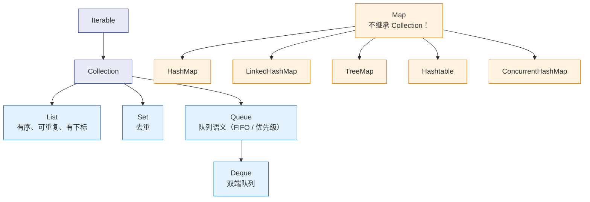

# 🗃️ 四、集合框架

> 这篇笔记回答四个问题：**集合怎么选**（List/Set/Queue/Map 的语义边界与复杂度真相）、**HashMap 为什么这么设计**（2 的幂容量、扰动函数、阈值 8/6、高低位拆分扩容）、**为什么 HashMap 线程不安全**（1.7 头插法死循环的完整成因 + 1.8 丢数据）、**遍历时修改为什么会炸**（modCount 契约）。源码以 **JDK 8** 为准，涉及 1.7 / 9+ 差异处单独标注。

> [!question] 面试官真正想听的
> 不是"HashMap 是数组+链表+红黑树"这句结论，而是：为什么阈值是 8 而不是 7 或 16？为什么容量必须是 2 的幂？1.8 扩容时是怎么把 rehash 优化掉的？"LinkedList 增删快"在什么条件下才成立？

关联笔记：[[0-Java总览]]、[[4-多线程与内存模型]]、[[5-线程池]]、[[6-JUC并发工具]]、[[10-面试高频题]]。

---

## 一、体系与选型总表

### 1.1 两条主干



> [!warning] `Map` 不是 `Collection`
> 这是最常见的口误。`Map` 是独立顶层接口，所以 `Collections.sort`、`removeIf` 都不直接作用于 `Map`；要借道 `entrySet()` 拿到的 `Set<Map.Entry>`。

### 1.2 语义差异

| 维度 | List | Set | Queue/Deque | Map |
| --- | --- | --- | --- | --- |
| 元素身份 | 下标位置 | 元素本身 | 元素本身 | key |
| 允许重复 | 是 | 否 | 是 | key 不重复，value 可重复 |
| 有序定义 | 插入序 + 下标 | 看实现 | FIFO 或优先级 | 看实现 |
| 去重依据 | 不去重 | `hashCode`+`equals` 或比较器 | 不去重 | key 的 `hashCode`+`equals` |

> [!important] 两种"去重"不是一回事
> `HashSet` 用 `hashCode` + `equals`；`TreeSet`/`TreeMap` 用 **`compareTo`/`compare` 是否返回 0**，**完全不看 equals**。所以一个"只按 id 比较"的 Comparator 会让 TreeSet 静默丢数据（见 8.2）。

### 1.3 选型总表

| 实现 | 有序性 | 可重复 | null | 线程安全 | 底层结构 | 随机访问 | 增删 |
| --- | --- | --- | --- | --- | --- | --- | --- |
| `ArrayList` | 插入序 | 是 | 允许 | 否 | 动态数组 | **O(1)** | 尾部摊还 O(1)，中间 O(n) |
| `LinkedList` | 插入序 | 是 | 允许 | 否 | 双向链表 | O(n) | 定位 O(n)，定位后 O(1) |
| `Vector` | 插入序 | 是 | 允许 | 是（方法级 synchronized） | 动态数组 | O(1) | 同上 + 锁开销 |
| `CopyOnWriteArrayList` | 插入序 | 是 | 允许 | 是（写时复制） | 数组快照 | O(1) | 写 O(n) + 内存翻倍 |
| `HashMap` | 无序 | key 唯一 | 允许 1 个 null key + null value | 否 | 数组+链表+红黑树 | — | 均摊 O(1) |
| `LinkedHashMap` | 插入序/访问序 | 同上 | 同上 | 否 | HashMap + 双向链表 | — | 均摊 O(1) |
| `TreeMap` | key 排序 | 同上 | 不允许 null key（自然序） | 否 | 红黑树 | — | O(log n) |
| `Hashtable` | 无序 | 同上 | **不允许** | 是（全表锁） | 数组+链表 | — | 均摊 O(1) |
| `ConcurrentHashMap` | 无序 | 同上 | **不允许** | 是（CAS + 桶级锁） | 数组+链表+红黑树 | — | 均摊 O(1) |
| `HashSet` | 无序 | 否 | 允许 1 个 | 否 | 内部 `HashMap` | — | O(1) |
| `LinkedHashSet` | 插入序 | 否 | 允许 1 个 | 否 | 内部 `LinkedHashMap` | — | O(1) |
| `TreeSet` | 排序 | 否 | 不允许 | 否 | 内部 `TreeMap` | — | O(log n) |
| `ArrayDeque` | 插入序 | 是 | **不允许** | 否 | 循环数组 | 仅两端 | 两端摊还 O(1) |
| `PriorityQueue` | 堆序（非全局有序） | 是 | **不允许** | 否 | 二叉堆（数组） | 仅堆顶 O(1) | O(log n) |

---

## 二、ArrayList 与 LinkedList

### 2.1 底层结构

```java
// JDK 8 ArrayList
transient Object[] elementData;
private int size;
private static final int DEFAULT_CAPACITY = 10;

public ArrayList() { this.elementData = DEFAULTCAPACITY_EMPTY_ELEMENTDATA; } // 不分配，惰性到第一次 add
public ArrayList(int initialCapacity) {
    if (initialCapacity > 0) this.elementData = new Object[initialCapacity];  // 立刻分配
    else if (initialCapacity == 0) this.elementData = EMPTY_ELEMENTDATA;
    else throw new IllegalArgumentException("Illegal Capacity: " + initialCapacity);
}

// JDK 8 LinkedList
private static class Node<E> { E item; Node<E> next; Node<E> prev; }
transient Node<E> first, last;
```

**注意**：无参构造惰性分配 10，但 `new ArrayList<>(n)` 会**立刻**分配 `n` 长度的数组。

### 2.2 扩容：1.5 倍 + `Arrays.copyOf`

```java
private void grow(int minCapacity) {
    int oldCapacity = elementData.length;
    int newCapacity = oldCapacity + (oldCapacity >> 1);      // 1.5 倍
    if (newCapacity - minCapacity < 0) newCapacity = minCapacity;
    if (newCapacity - MAX_ARRAY_SIZE > 0) newCapacity = hugeCapacity(minCapacity); // MAX_ARRAY_SIZE = Integer.MAX_VALUE - 8
    elementData = Arrays.copyOf(elementData, newCapacity);   // ★ 分配新数组 + 全量拷贝
}
```

**为什么是 1.5 倍而不是 2 倍？** 时间与空间的折中：2 倍扩容次数更少、拷贝更少，但峰值内存（新旧数组同时存活）更高、更容易产生无法复用的内存碎片；1.5 倍在"总拷贝量"和"空间浪费"之间更平衡。**真正的成本不在倍数，而在 `Arrays.copyOf` 是一次 O(n) 全量内存拷贝。**

> [!example] 扩容总量可以算出来
> 从容量 10 连续追加到 100 万元素，容量序列 10→15→22→33…，累计拷贝量约为 $\sum$ 各级容量 ≈ 3n。**也就是说追加 100 万条，实际搬移了约 300 万个引用。** 预知规模时用 `ensureCapacity` 一次搞定。

### 2.3 LinkedList 的"增删快"是有条件的

```java
public void add(int index, E element) {
    checkPositionIndex(index);
    if (index == size) linkLast(element);
    else linkBefore(element, node(index));      // ★ 关键：node(index) 是 O(n)
}

Node<E> node(int index) {
    if (index < (size >> 1)) {                  // 从前半段走
        Node<E> x = first;
        for (int i = 0; i < index; i++) x = x.next;
        return x;
    } else {                                    // 从后半段走
        Node<E> x = last;
        for (int i = size - 1; i > index; i--) x = x.prev;
        return x;
    }
}
```

| 操作 | ArrayList | LinkedList |
| --- | --- | --- |
| `add(e)` 尾部 | 摊还 O(1)，数组连续写 | O(1)，但每次 `new Node` |
| `add(0, e)` 头部 | O(n) `arraycopy`（memmove 极快） | O(1)（定位成本为 0） |
| `add(i, e)` 中间 | O(n) 搬移，内存连续、缓存友好 | **O(n) 遍历定位**，指针追逐、缓存不友好 |
| `get(i)` | O(1) | O(n/2) |
| `remove(i)` | O(n) 搬移 | O(n) 定位 + O(1) 断链 |

**结论：只有"已持有节点位置"或"只在两端操作"时，链表的 O(1) 才成立。** 按下标做中间增删时，LinkedList 通常**比 ArrayList 更慢**——它每跳一步都是一次可能 cache miss 的指针解引用，而 `arraycopy` 是单指令优化的连续内存移动。实测几千到几十万元素规模下，ArrayList 的中间插入常常反超。

### 2.4 内存与 CPU 缓存

- **LinkedList 更费内存**：每元素额外一个 `Node` 对象（对象头 12 字节 + 3 个引用，64 位压缩指针下约 24 字节，元素对象本身另算），ArrayList 只需数组里一个 4/8 字节引用。
- **缓存友好性**：ArrayList 连续内存，CPU 预取器有效，顺序遍历几乎零 miss；LinkedList 每次 `next` 都可能 miss（L1 约 1ns，DRAM 约 100ns）。
- **同样的复杂度，常数差一个数量级** —— 这是"链表更好"的直觉在真实 JVM 上经常失败的原因。

### 2.5 ensureCapacity 与 trimToSize

```java
List<Order> orders = new ArrayList<>(1_000_000);   // 预分配，把 ~20 次扩容变成 1 次
list.ensureCapacity(1_000_000);                    // 或事后扩容

list.subList(0, list.size() - 10).clear();
((ArrayList<Order>) list).trimToSize();            // 大批量删除后回收多余数组空间
```

`ensureCapacity(n)` 在**批量写入之前**调用（数据同步、批量查询结果装配场景最廉价的优化）；`trimToSize()` 在**大批量删除之后**调用，避免"曾经装过 100 万条、现在只剩 10 条"的列表长期占着几十 MB。

> [!danger] ArrayList 并发 add 的真实后果
> `elementData[size++] = e` 不是原子操作。并发 `add` 会导致：① 两个线程读到同一个 `size`，其中一个写入被覆盖（**丢数据**）；② `size` 自增两次但只写入一个元素，后续 `get` 读到 `null`；③ A 线程扩容未完成、B 线程已拿旧数组写入 → `ArrayIndexOutOfBoundsException`。**失败方式是静默的**，没有任何异常提示。

### 2.6 实践结论

> [!important] 一句话结论
> **默认永远选 `ArrayList`**；需要高频在两端插入删除时选 `ArrayDeque`。JDK 文档明确写明：`ArrayDeque` 作为栈和队列比 `LinkedList` 更快。`LinkedList` 在现代 Java 里的主要价值只剩"实现 `Deque` 且允许 null 元素"。

---

## 三、HashMap 结构：为什么这样设计

```java
// JDK 8 关键字段
transient Node<K,V>[] table;              // 桶数组，长度永远是 2 的幂
transient int size;                       // 键值对数量
int threshold;                            // 扩容阈值 = capacity * loadFactor
final float loadFactor;                   // 默认 0.75
static final int TREEIFY_THRESHOLD = 8;   // 链表 → 红黑树
static final int UNTREEIFY_THRESHOLD = 6; // 红黑树 → 链表
static final int MIN_TREEIFY_CAPACITY = 64;

static class Node<K,V> implements Map.Entry<K,V> {
    final int hash;      // 缓存 hash，避免每次比较都重算
    final K key; V value; Node<K,V> next;
}
```

查找的三级路径：**数组下标 → 链表 → 红黑树**。绝大多数 key 的 hash 分布均匀，桶长 0/1/2，数组就够；只有极端碰撞（或恶意构造 key）才需要红黑树兜底，把最坏 O(n) 拉回 O(log n)。

### 3.1 为什么树化阈值是 8（泊松分布）

JDK 8 源码注释直接给出推导：理想情况下（hash 完全随机），桶内节点数服从参数 λ≈0.5 的泊松分布（0.5 = 默认负载因子 0.75 下的平均桶长），$P(k)=\frac{e^{-0.5}0.5^k}{k!}$：

| 桶内节点数 k | 0 | 1 | 2 | 3 | 4 | 5 | 6 | 7 | **8** |
| --- | --- | --- | --- | --- | --- | --- | --- | --- | --- |
| 概率 | .6065 | .3033 | .0758 | .0126 | .0016 | .00016 | .0000132 | .00000094 | **.00000006** |

链表长度到 8 的概率**小于千万分之一**。既然这么罕见，一旦发生就大概率是"hash 被恶意构造"或"hashCode 实现极差"，此时必须把 O(n) 换成 O(log n)。为什么不选 4：4 的概率约 1.6%，太常见，频繁树化/退化本身有成本（`TreeNode` 大小约为 `Node` 的两倍）；选 8 意味着"平时几乎不树化，一旦树化就是异常信号"。

### 3.2 为什么退化阈值是 6（留缓冲带）

**不是 7，是 6**，故意和 8 之间留了滞后区间（hysteresis）。若两者都是 8（或 7），长度在 7↔8 反复抖动时会不停 `treeifyBin`/`untreeify`，而这两个操作都是 O(n) 的结构重建。留出 6↔8 的空档即可避免边界抖动。

### 3.3 树化前置条件：容量 ≥ 64

```java
final void treeifyBin(Node<K,V>[] tab, int hash) {
    int n, index; Node<K,V> e;
    if (tab == null || (n = tab.length) < MIN_TREEIFY_CAPACITY)
        resize();                 // ★ 容量不足 64 时，先扩容，而不是树化
    else if ((e = tab[index = (n - 1) & hash]) != null) { /* 真正转 TreeNode */ }
}
```

桶长达到 8 有两种可能：① hash 真的差 → 树化；② **只是表太小**（容量 16 时只有 4 位参与索引，高位全丢，必然大量碰撞）→ 此时**扩容能直接把元素分散开**，比树化更划算。所以"table 长度不到 64 时优先扩容"。

> [!tip] 直接指导调优
> 监控到某个 `HashMap` 频繁树化，先看它容量是不是只有 16/32 —— 很可能只是初始容量没设，而不是 hashCode 有问题。

### 3.4 hash 扰动函数

```java
static final int hash(Object key) {
    int h;
    return (key == null) ? 0 : (h = key.hashCode()) ^ (h >>> 16);
}
```

**为什么把高 16 位异或到低 16 位？** 索引只取低 log2(n) 位（容量 16 时只取低 4 位）。若直接用 `hashCode()`，那些"高位不同、低位相同"的 key（典型如自增 ID、短字符串、`Integer`）会全部落进同一个桶。

```text
hashCode()        = 1111 0000 1010 1010 0000 0000 0000 0101
hashCode() >>> 16 = 0000 0000 0000 0000 1111 0000 1010 1010
XOR 结果           = 1111 0000 1010 1010 1111 0000 1010 1111
                                                  ↑ 低位混入了高位的熵
```

代价只有一次移位 + 一次异或。**JDK 1.7 的扰动更重**（4 次移位 + 4 次异或，还有 `hashSeed` 随机种子）；1.8 因为有了红黑树兜底，把扰动简化为一次——**用树化成本换 hash 计算成本**，这是 1.8 的明确取舍。

### 3.5 为什么容量必须是 2 的幂

因为要用 `(n - 1) & hash` 等价替代 `hash % n`：

- **只有 n 是 2 的幂时**，`n-1` 才是低位全 1 的掩码（15 = `0000 1111`），`&` 结果恰好落在 `[0, n-1]`，与取模等价。
- `&` 是 1 个 CPU 周期，`%` 是几十个周期（除法指令）。每次 `get`/`put` 都要做，差距实打实。
- **对负数 hashCode，`&` 天然给出非负下标**（只保留低位），而 `h % n` 在 Java 里可能为负、还得 `Math.floorMod`。这就是 HashMap 从不需要 `Math.abs(hash)` 的原因。
- 附带好处：容量是 2 的幂时，扩容只需多取一位掩码，元素要么留在原位、要么移到 `原位 + oldCap`（见 4.3）。

**代价**：`new HashMap<>(17)` 实际得到 32，空间利用率略低——这是它换来的索引速度。

### 3.6 tableSizeFor：向上取 2 的幂

```java
static final int tableSizeFor(int cap) {
    int n = cap - 1;          // 先减 1，保证 cap 本身是 2 的幂时不会翻倍
    n |= n >>> 1;             // 把最高位 1 之后的所有位"传播"成 1
    n |= n >>> 2;
    n |= n >>> 4;
    n |= n >>> 8;
    n |= n >>> 16;
    return (n < 0) ? 1 : (n >= MAXIMUM_CAPACITY) ? MAXIMUM_CAPACITY : n + 1;
}
```

| 输入 cap | 0 | 1 | 17 | 64 | 1000 |
| --- | --- | --- | --- | --- | --- |
| 返回 | 1 | 1 | 32 | 64 | 1024 |

> [!note] 现代 JDK 的写法
> JDK 11 起改为 `-1 >>> Integer.numberOfLeadingZeros(cap - 1)` 加边界处理，语义完全一致，只是借助了硬件前导零指令。面试讲清"向上取 2 的幂"这个语义即可。

### 3.7 为什么负载因子是 0.75

源码注释原话是"在时间与空间成本之间提供了良好的折中"：

| loadFactor | 效果 |
| --- | --- |
| 0.5 | 桶更空、碰撞更少，但一半数组是空的、扩容更频繁 |
| **0.75** | 碰撞概率与空间占用的平衡点；λ=0.5 正是由此得出 |
| 1.0 | 空间最省，但桶普遍偏长，扩容前性能断崖明显 |
| > 1 | 基本退化成链表，失去哈希表意义 |

---

## 四、HashMap put / get / resize

### 4.1 putVal 全流程（JDK 8 源码）

```java
public V put(K key, V value) {
    return putVal(hash(key), key, value, false, true);
}

final V putVal(int hash, K key, V value, boolean onlyIfAbsent, boolean evict) {
    Node<K,V>[] tab; Node<K,V> p; int n, i;
    if ((tab = table) == null || (n = tab.length) == 0)
        n = (tab = resize()).length;                       // ① 懒初始化（首次 put 才分配 16）
    if ((p = tab[i = (n - 1) & hash]) == null)
        tab[i] = newNode(hash, key, value, null);          // ② 桶空：直接放
    else {
        Node<K,V> e; K k;
        if (p.hash == hash && ((k = p.key) == key || (key != null && key.equals(k))))
            e = p;                                         // ③ 命中桶首节点
        else if (p instanceof TreeNode)
            e = ((TreeNode<K,V>)p).putTreeVal(this, tab, hash, key, value);  // ④ 红黑树插入
        else {
            for (int binCount = 0; ; ++binCount) {         // ⑤ 遍历链表
                if ((e = p.next) == null) {
                    p.next = newNode(hash, key, value, null);   // ★ 尾插（1.8）
                    if (binCount >= TREEIFY_THRESHOLD - 1)
                        treeifyBin(tab, hash);                  // ⑥ 插入第 8 个节点时尝试树化
                    break;
                }
                if (e.hash == hash && ((k = e.key) == key || (key != null && key.equals(k))))
                    break;
                p = e;
            }
        }
        if (e != null) {                                   // ⑦ key 已存在 → 覆盖 value
            V oldValue = e.value;
            if (!onlyIfAbsent || oldValue == null) e.value = value;
            afterNodeAccess(e);                            // LinkedHashMap 在此调整顺序
            return oldValue;
        }
    }
    ++modCount;
    if (++size > threshold) resize();                      // ⑧ 先自增 size 再判扩容
    afterNodeInsertion(evict);                             // LinkedHashMap 在此做 LRU 淘汰
    return null;
}
```

四个容易被追问的细节：

1. **判等顺序是 `hash` → **==** → `equals`**。**==** 是引用相等，命中同一对象可跳过 `equals`（对常量池里的 `Integer`/`String` 命中率不低）。
2. **`size` 先自增再比较**：默认容量 16、阈值 12，第 13 个元素 put 进去后才触发扩容，**此时桶数组已变成 32**。
3. **`binCount >= TREEIFY_THRESHOLD - 1`**：`binCount` 从 0 开始，走到 7 说明当前是第 8 个节点，所以严格说是"链表长度达 8 时尝试树化"，且 `treeifyBin` 内还有容量 ≥ 64 的前置条件。
4. **`afterNodeAccess`/`afterNodeInsertion` 是模板方法钩子**：`HashMap` 里是空实现，`LinkedHashMap` 重写它们实现访问序与 LRU 淘汰——JDK 里继承式模板方法的典型用法。

### 4.2 getNode

```java
final Node<K,V> getNode(int hash, Object key) {
    Node<K,V>[] tab; Node<K,V> first, e; int n; K k;
    if ((tab = table) != null && (n = tab.length) > 0 &&
        (first = tab[(n - 1) & hash]) != null) {           // 桶空 → 直接 null，不做任何比较
        if (first.hash == hash && ((k = first.key) == key || (key != null && key.equals(k))))
            return first;                                  // 命中首节点
        if ((e = first.next) != null) {
            if (first instanceof TreeNode)
                return ((TreeNode<K,V>)first).getTreeNode(hash, key);
            do {
                if (e.hash == hash && ((k = e.key) == key || (key != null && key.equals(k))))
                    return e;
            } while ((e = e.next) != null);
        }
    }
    return null;
}
```

面试要点：`get` 的时间复杂度 = **平均 O(1) + 链表上界 O(n) + 树上界 O(log n)**。红黑树的存在保证了即使 hash 被恶意构造也不会退化成 O(n) 的拒绝服务——这是引入红黑树的直接动机之一。

### 4.3 resize：扩容与高低位拆分

这是 1.8 相比 1.7 最漂亮的一处优化。

**触发条件**：`++size > threshold`，其中 `threshold = capacity * loadFactor`。容量与阈值同时翻倍，直到 `MAXIMUM_CAPACITY`（1<<30）后阈值置为 `Integer.MAX_VALUE`、不再扩容。

```java
final Node<K,V>[] resize() {
    // ... 前半段：计算 newCap / newThr（旧容量与旧阈值都 << 1）...
    Node<K,V>[] newTab = (Node<K,V>[])new Node[newCap];
    table = newTab;
    if (oldTab != null) {
        for (int j = 0; j < oldCap; ++j) {
            Node<K,V> e;
            if ((e = oldTab[j]) != null) {
                oldTab[j] = null;
                if (e.next == null)
                    newTab[e.hash & (newCap - 1)] = e;                  // 单节点：重算下标
                else if (e instanceof TreeNode)
                    ((TreeNode<K,V>)e).split(this, newTab, j, oldCap);  // 红黑树拆分
                else {                                                  // ★ 链表：高低位拆分
                    Node<K,V> loHead = null, loTail = null, hiHead = null, hiTail = null, next;
                    do {
                        next = e.next;
                        if ((e.hash & oldCap) == 0) {        // 只看 oldCap 这一位
                            if (loTail == null) loHead = e; else loTail.next = e;
                            loTail = e;
                        } else {
                            if (hiTail == null) hiHead = e; else hiTail.next = e;
                            hiTail = e;
                        }
                    } while ((e = next) != null);
                    if (loTail != null) { loTail.next = null; newTab[j] = loHead; }
                    if (hiTail != null) { hiTail.next = null; newTab[j + oldCap] = hiHead; }
                }
            }
        }
    }
    return newTab;
}
```

**高低位拆分为什么成立？** 设旧容量 `oldCap = 2^k`、新容量 `newCap = 2^(k+1)`：

- 旧索引 = `hash & (2^k - 1)`，只看低 k 位；
- 新索引 = `hash & (2^(k+1) - 1)`，多看一位，即**第 k 位**，而这一位的权值恰好是 `oldCap`；
- 因此 `(hash & oldCap) == 0` → 新索引 = 旧索引（低位链 `lo`，放回 `newTab[j]`）；否则新索引 = 旧索引 + `oldCap`（高位链 `hi`，放到 `newTab[j + oldCap]`）。

**完全不需要重算 hash 和取模**，每个元素只做一次位与判断。附带安全收益：1.8 迁移是**尾插保序**，而 1.7 的头插会**反转链表**——这正是 1.7 死循环的直接原因（见 5.2）。

> [!example] 一个具体例子
> `oldCap = 16`，`newCap = 32`。`hash = 01010`（第 4 位 0）→ 旧索引 10、新索引 10（`lo`）；`hash = 11010`（第 4 位 1）→ 旧索引 10、新索引 26 = 10 + 16（`hi`）。

### 4.4 扩容代价与初始容量

**扩容成本 = 分配 2 倍大的数组 + 遍历所有桶重新分配节点**，峰值内存是旧数组 + 新数组。对 100 万条数据的 map，一次扩容就是几十 MB 的分配与全量遍历，且**发生在 put 的调用线程上，表现为一次延迟尖刺（长尾）**。

> [!danger] `new HashMap<>(expectedSize)` 是错的
> 构造参数是**容量**不是元素个数，阈值 = 容量 × 0.75。`new HashMap<>(1000)` 只能无扩容地放 750 个元素，第 751 个就扩容到 2048。正确做法：`new HashMap<>((int)(expected / 0.75f) + 1)`（Guava 的 `Maps.newHashMapWithExpectedSize` 就是干这个，并对小 size 做了特判）。
> **更隐蔽的坑**：`new HashMap<>(0)` 时 `tableSizeFor(0)` 返回 1，阈值算出来 `(int)(1*0.75) = 0`，于是放两个元素要扩容两次（1→2→4）。小 map 别用 0/1 做初始容量。

---

## 五、1.7 与 1.8 的差异，以及线程不安全

### 5.1 对比表

| 维度 | JDK 1.7 | JDK 1.8 |
| --- | --- | --- |
| 节点类型 | `Entry<K,V>` | `Node<K,V>` / `TreeNode<K,V>` |
| 数据结构 | 数组 + 链表 | 数组 + 链表 + **红黑树** |
| 插入方式 | **头插法** | **尾插法** |
| 扰动函数 | 4 次移位 + 4 次异或（`hashSeed`） | 1 次移位 + 1 次异或 |
| 扩容迁移 | 每个节点**重算索引** `indexFor` | **高低位拆分**，不重算 hash |
| 扩容后链表顺序 | 反转 | 保持相对顺序 |
| 并发扩容风险 | **可能形成环形链表 → CPU 100%** | 仍不安全（丢数据/size 不准），但不再死循环 |

### 5.2 1.7 头插法死循环：完整成因

```java
// JDK 1.7 HashMap.transfer —— 头插法
void transfer(Entry[] newTable, boolean rehash) {
    int newCapacity = newTable.length;
    for (Entry<K,V> e : table) {
        while (null != e) {
            Entry<K,V> next = e.next;              // ← ① 先记下 next，然后可能被挂起
            int i = indexFor(e.hash, newCapacity);
            e.next = newTable[i];                  // ← ② 头插
            newTable[i] = e;
            e = next;
        }
    }
}
```

假设原桶 `table[i]` 是 `A → B → null`，两线程同时 put 触发扩容到同一个新桶：

| 步骤 | 线程 1 | 线程 2 | 新表状态 |
| --- | --- | --- | --- |
| 1 | 执行 `e=A`、`next=B`，**在此被挂起** | — | 空 |
| 2 | 挂起 | 完整跑完迁移：`newTable[i]=B`、`B.next=A`、`A.next=null` | `B → A → null` |
| 3 | **恢复**：`A.next = newTable[i]` = **B**；`newTable[i] = A`；`e = next = B` | 结束 | `A → B → A`（**成环**） |
| 4 | `e = B`，`next = B.next = A`；`B.next = newTable[i] = A`；`newTable[i] = B`；`e = A` | — | 环仍在 |
| 5 | `e = A`，`next = A.next = B`；`A.next = newTable[i] = B`；**永远循环** | — | 迁移线程自身卡死 |

**结果**：新桶里出现 `A.next = B` 且 `B.next = A` 的环。之后任何 `get` 落在该桶、又不在环上的 key，`getNode` 的 `do/while` 永远走不到 `null` → **该线程死循环、CPU 打满 100%**，而 jstack 上只是卡在 `HashMap.getEntry`——这正是那种"看起来没死锁、但 CPU 一直高"的经典事故。

> [!danger] 复盘要点
> ① 根因是**并发扩容**，不是"用了 HashMap"本身——单线程绝不会成环。
> ② 触发条件不难凑齐：多线程共享一个 HashMap，且**同时 put 并恰好触发扩容**。
> ③ 1.8 尾插 + 拆分后成环消失，但**线程不安全依然成立**（丢数据、size 不准、可能读到 null）。"升级到 1.8 就安全了"是错误结论。
> ④ 正确修法是换 `ConcurrentHashMap`。

### 5.3 线程不安全的三种表现

| 表现 | 成因 |
| --- | --- |
| **丢数据** | 两线程同时 put 到同一个空桶，后写覆盖先写（`tab[i] = newNode(...)` 不是 CAS） |
| **size 不准** | `++size`、`++modCount` 都是"读-改-写"，非原子 |
| **读到 null / 1.7 死循环** | 链表中途被另一线程改动；1.7 并发扩容成环 |
| **扩容期读到中间态** | `table` 引用切换与 `threshold` 更新无 happens-before 保证 |

### 5.4 Hashtable / synchronizedMap / ConcurrentHashMap

| 方案 | 锁粒度 | 允许 null | 并发性能 | 结论 |
| --- | --- | --- | --- | --- |
| `Hashtable` | **整张表**（每个方法 `synchronized`） | 否（NPE） | 最差，读写互斥 | **已过时，不要用** |
| `Collections.synchronizedMap` | 整张表（一个 mutex） | 是 | 差，且**遍历必须手动 synchronized** | 仅低并发 + 需要 null 值 |
| `ConcurrentHashMap` | 1.8：CAS + 单桶锁 | 否 | 好，读几乎无锁 | **并发场景默认选择** |

> [!warning] synchronizedMap 的两个陷阱
> ① **复合操作不原子**：`if (!map.containsKey(k)) map.put(k, v);` 依然会竞态，必须 `synchronized (map) { ... }`。
> ② **遍历必须自己加锁**，否则别的线程 put 会导致 `ConcurrentModificationException`：
> ```java
> Map<String, String> m = Collections.synchronizedMap(new HashMap<>());
> synchronized (m) {                     // ← 少了这行就是定时炸弹
>     for (Map.Entry<String, String> e : m.entrySet()) { ... }
> }
> ```

---

## 六、ConcurrentHashMap 要点

细节（AQS、`LongAdder` 思想）放在 [[6-JUC并发工具]]，这里只讲"与 HashMap 对比时必须答对"的部分。

### 6.1 1.7 分段锁 vs 1.8 CAS + 单桶锁

```java
// JDK 1.7：默认 16 个 Segment，每个 Segment 继承 ReentrantLock，内部是 HashEntry[]
final Segment<K,V>[] segments;
static final class Segment<K,V> extends ReentrantLock implements Serializable {
    transient volatile HashEntry<K,V>[] table;
    transient volatile int count;
}
// 定位分两步：segmentFor(hash) 用 hash 高位选段，段内再用低位定位桶

// JDK 1.8：锁单个桶的头节点
final V putVal(K key, V value, boolean onlyIfAbsent) {
    if (key == null || value == null) throw new NullPointerException();   // ★ 不允许 null
    for (Node<K,V>[] tab = table;;) {
        Node<K,V> f; int n, i, fh;
        if (tab == null || (n = tab.length) == 0) tab = initTable();      // CAS 设置 sizeCtl
        else if ((f = tabAt(tab, i = (n - 1) & hash)) == null) {
            if (casTabAt(tab, i, null, new Node<K,V>(hash, key, value, null)))
                break;                                                    // ★ 空桶：无锁 CAS
        }
        else if ((fh = f.hash) == MOVED) tab = helpTransfer(tab, f);      // ★ 协助迁移
        else { synchronized (f) { /* 只锁这一个桶 */ } }
    }
    addCount(1L, binCount);
    return null;
}
```

| 维度 | 1.7 | 1.8 |
| --- | --- | --- |
| 锁粒度 | Segment（默认 16 段） | **单个桶的头节点** |
| 空桶写入 | 需加段锁 | **CAS 无锁** |
| 扩容 | 单线程、持段锁 | **多线程协助迁移**（`helpTransfer` + `ForwardingNode`） |
| 链表 → 树 | 不支持 | 支持（`TreeBin`，同样阈值 8） |
| 读 | 不加锁（`HashEntry.value` volatile） | 不加锁（`Node.val`/`next` volatile） |

### 6.2 size() 为什么是近似值

高并发下维护精确 `size` 需要全局同步，代价太大。1.8 采用**分散计数 + 汇总**：`addCount` 先 CAS `baseCount`，竞争失败就把增量散到 `CounterCell[]`（思想来自 `LongAdder` 的分散热点），`size()` = `sumCount()` 求和。

```java
public long mappingCount() { long n = sumCount(); return (n < 0L) ? 0L : n; }  // ★ 推荐：不会被 int 截断
```

**所以 `size()` 是"某瞬间的近似值"**，且 `int` 返回可能在元素超过 21 亿时溢出——需要精确计数请自己维护 `LongAdder`，或至少用 `mappingCount()`。

### 6.3 为什么不允许 null key/value

**不是"做不到"，而是刻意取舍**：并发下 `get(key)` 返回 `null` 有二义性——"key 不存在"还是"存在但值是 null"？单线程的 `HashMap` 可以用 `containsKey` 补一刀区分，但**并发下 `containsKey` + `get` 不是原子的**：两次调用之间状态可能已变，任何依赖这两步的判断都是错的。既然无法提供可靠语义，索性禁止 null，逼调用方显式表达"缺失"。

> [!note] 加分表述
> `Hashtable` 也不允许 null，但那是历史包袱；`ConcurrentHashMap` 的禁止是**明确设计决策**。面试时说出"二义性 + 无法原子地组合两次调用"，比"CHM 不允许 null"这个结论值钱得多。

### 6.4 复合操作必须用原子 API

**CHM 只保证单操作原子，不保证"检查-然后-动作"整体原子**：

```java
// ❌ 竞态：两个线程可能都通过检查，然后都 put，后者覆盖前者
if (!chm.containsKey(k)) chm.put(k, createExpensiveValue());

// ✅ putIfAbsent —— 但注意 createExpensiveValue() 每次都会被求值！
chm.putIfAbsent(k, createExpensiveValue());

// ✅ computeIfAbsent —— 只在其正缺失时才调用 mappingFunction
chm.computeIfAbsent(k, key -> createExpensiveValue());

// ✅ 其他原子复合操作
chm.merge(k, 1, Integer::sum);                    // 原子累加，最简洁
chm.compute(k, (key, old) -> old == null ? 1 : old + 1);
chm.replace(k, oldV, newV);                       // CAS 语义
```

> [!danger] computeIfAbsent 的两个坑
> ① **mappingFunction 里不要做耗时操作**（RPC、大查询）。1.8 实现会对该桶加锁，耗时函数会**长时间阻塞同一个桶上的其他线程**。
> ② **不要在 mappingFunction 里再修改同一个 map**（递归/重入），会造成未定义行为或死锁。另外 JDK 8 的 `HashMap.computeIfAbsent` 在映射函数内部修改 map 时会抛 `ConcurrentModificationException`（后续版本已修复），所以本地 `HashMap` 里更要保证映射函数是纯函数。
> ③ `putIfAbsent` 的参数**总会被求值**，"贵"的值务必放进 lambda。

### 6.5 选型结论

| 场景 | 选择 |
| --- | --- |
| 单线程 / 局部变量 | `HashMap`（最轻） |
| 多线程只读、初始化后不再改 | `HashMap` + 安全发布（`final`/`static final`）或 `Map.copyOf` |
| 多线程读写 | **`ConcurrentHashMap`** |
| 多线程 + 需要 null value | CHM 里存 `Optional`/哨兵对象，而不是退回 `Hashtable` |
| 多线程 + 有序 | `ConcurrentSkipListMap`（`TreeMap` **没有**并发版本） |
| 并发 LRU | **Caffeine** |

> [!note] 为什么有序并发 map 是跳表不是红黑树
> 红黑树的平衡靠**旋转**，旋转要改多个节点的父子指针与颜色，很难无锁化；跳表的插入只在（多层）链表上做指针 CAS，天然适合无锁并发。这是"为什么没有 ConcurrentTreeMap"的标准答案。

---

## 七、LinkedHashMap 与 LRU

### 7.1 结构：HashMap + 双向链表

```java
public class LinkedHashMap<K,V> extends HashMap<K,V> implements Map<K,V> {
    static class Entry<K,V> extends HashMap.Node<K,V> {
        Entry<K,V> before, after;      // ★ 在所有 Entry 之间串一条双向链表
    }
    transient LinkedHashMap.Entry<K,V> head, tail;
    final boolean accessOrder;         // false=插入序（默认），true=访问序
}
```

它**继承 `HashMap`**，桶数组、hash 扰动、扩容逻辑完全复用，只在节点上加两个指针、用 `head/tail` 维护全序。两个钩子是关键：

- `afterNodeAccess(e)`：`accessOrder=true` 时把刚访问的节点**移到链表尾部**（标记为最近使用）；
- `afterNodeInsertion(evict)`：插入后调用 `removeEldestEntry(head)`，返回 true 就删掉链表头（最久未使用）。

| 构造 | 迭代顺序 | `get` 的副作用 |
| --- | --- | --- |
| `new LinkedHashMap<>()` | 插入顺序 | 无（`afterNodeAccess` 直接返回） |
| `new LinkedHashMap<>(16, .75f, true)` | **访问顺序**，命中的 key 移到尾部 | **`get` 会修改链表结构**，即读操作带写副作用 |

> [!warning] accessOrder=true 的 `get` 不是纯读
> ① 并发 `get` 也会产生数据竞争；② 迭代顺序随读取行为变化，不能用来做稳定输出；③ "多线程只读"的假设下用它做缓存是错的。

### 7.2 完整 LRU 实现

```java
import java.util.LinkedHashMap;
import java.util.Map;

/** 线程不安全的 LRU 缓存：容量满时淘汰最久未使用的条目 */
public class LruCache<K, V> extends LinkedHashMap<K, V> {

    private final int capacity;

    public LruCache(int capacity) {
        super(capacity, 0.75f, true);   // ★ accessOrder = true 是 LRU 的关键
        this.capacity = capacity;
    }

    /** 返回 true 表示"请删除链表头部（最久未使用）的节点" */
    @Override
    protected boolean removeEldestEntry(Map.Entry<K, V> eldest) {
        return size() > capacity;       // 只在 put 之后被调用
    }

    public static void main(String[] args) {
        LruCache<Integer, String> cache = new LruCache<>(3);
        cache.put(1, "a"); cache.put(2, "b"); cache.put(3, "c");
        System.out.println(cache.keySet());   // [1, 2, 3]
        cache.get(1);                         // 访问 1 → 链表变成 [2, 3, 1]
        System.out.println(cache.keySet());   // [2, 3, 1]
        cache.put(4, "d");                    // 超容，淘汰链表头 2
        System.out.println(cache.keySet());   // [3, 1, 4]
    }
}
```

三个要点：

1. **`removeEldestEntry` 只在 `put` 之后触发**（`afterNodeInsertion` 由 `putVal` 调用），所以淘汰永远不发生在 `get` 上，只是 `get` 改变了"谁会被淘汰"；一次 put 最多淘汰一个。
2. **`super(capacity, 0.75f, true)` 的第三个参数漏了就退化成 FIFO** —— 这是最常见的实现 bug。
3. `removeEldestEntry` 必须是 `protected`（重写可见性不能收窄）。

> [!danger] 生产环境别直接用这个 LRU
> ① **线程不安全**：`get` 会改链表，并发下会破坏链表结构甚至成环、迭代死循环；用 `Collections.synchronizedMap` 包也不行——**遍历仍需手动同步，且 `get` 串行化后吞吐塌方**。
> ② **没有过期时间（TTL）**，只有容量淘汰。
> ③ **没有命中率统计**，线上无法调参。
> 生产用 **Caffeine**（W-TinyLFU 淘汰算法，命中率显著优于 LRU，支持 TTL/TTI、异步加载、`recordStats()`）或 Guava Cache。手写 LRU 的价值在**讲清原理**，不在上线。

### 7.3 一个常被忽略的好处：迭代效率

`HashMap` 的迭代成本是 **O(容量)** —— 要遍历整个 `table` 数组，即使里面只有 3 个元素（若 `new HashMap<>(1_000_000)` 只放 3 条，遍历要扫 100 万个槽）。`LinkedHashMap` 的迭代成本是 **O(size)** —— 沿 `head → after` 链表走。

> [!tip] 直接指导
> "元素少但容量预估过大"或"需要频繁按序遍历"的场景，`LinkedHashMap` 的迭代性能可能高好几个数量级。这也解释了它多出两个指针的内存开销——**用空间换迭代顺序的确定性与效率**。反过来，如果只是想按插入序遍历小 map，用 `LinkedHashMap` 比 `HashMap` + 手动排序更合适。

---

## 八、TreeMap

```java
public class TreeMap<K,V> extends AbstractMap<K,V> implements NavigableMap<K,V>, Cloneable, Serializable {
    private final Comparator<? super K> comparator;
    private transient Entry<K,V> root;   // 红黑树：key, value, left, right, parent, color
}
```

- **底层红黑树**（自平衡二叉搜索树），`get/put/remove` 都是 **O(log n)**，最坏也不退化。
- **排序依据**：构造时传了 `Comparator` 就用它；否则要求 key 实现 `Comparable`，否则 `put` 时抛 `ClassCastException`（**注意是 put 时抛，不是 new 时抛**，构造时不校验元素类型）。
- **不允许 null key**（自然序下 `compareTo(null)` 直接 NPE）。
- **去重依据是"比较结果为 0"**，与 `equals` 无关。

### 8.1 NavigableMap 的独有能力

这是 `TreeMap` 相比 `HashMap` 唯一"无法替代"的地方：

```java
TreeMap<Integer, String> m = new TreeMap<>();
m.put(10, "a"); m.put(20, "b"); m.put(30, "c"); m.put(40, "d");

m.floorKey(25);      // 20  ≤25 的最大 key
m.ceilingKey(25);    // 30  ≥25 的最小 key
m.lowerKey(20);      // 10  <20  的最大 key
m.higherKey(20);     // 30  >20  的最小 key
m.firstKey();        // 10      m.lastKey();       // 40
m.pollFirstEntry();  // 取出并删除最小项（可当优先队列用）
m.headMap(30);       // [10, 20)   左闭右开
m.tailMap(20);       // [20, 30, 40]
m.subMap(15, true, 35, true);   // [20, 30] 可指定开闭
m.descendingMap();   // 逆序视图
```

> [!example] 真实业务场景
> ① **区间定价/阶梯计费**：`priceMap.floorEntry(quantity).getValue()` 一行搞定，比一堆 if-else 清晰；② **IP 段/时间窗口路由**：`subMap(from, to)` 取区间内所有规则；③ **排行榜**：`descendingMap()` + `firstEntry()`，但高并发下应换 `ConcurrentSkipListMap`。

### 8.2 最危险的坑：比较器与 equals 不一致

```java
Comparator<Person> byId = Comparator.comparing(p -> p.id);
TreeSet<Person> set = new TreeSet<>(byId);
set.add(new Person("1", "Alice"));
set.add(new Person("1", "Bob"));
System.out.println(set.size());            // 1！Bob 被静默丢弃
```

原因在红黑树插入逻辑：`int cmp = compare(key, t.key); ... else return t.setValue(value);` —— **`cmp == 0` 就直接覆盖，完全不看 `equals`**。三处连带影响：

1. **丢元素**：比较器认为"相等"的对象被覆盖。
2. **反向的坑**：`equals` 为 true 但 `compareTo` 非 0 时，`TreeSet` 里会出现"看起来重复"的两个元素。
3. **契约要求**：`Comparable` 的 Javadoc 强烈建议 `compareTo` 与 `equals` 一致。**写业务代码时，比较器必须包含所有参与唯一性判断的字段。**

### 8.3 TreeMap vs HashMap 怎么选

| 需求 | 选择 |
| --- | --- |
| 纯查找/写入，无顺序要求 | `HashMap`（O(1) 明显优于 O(log n)） |
| 按 key 排序遍历 / 范围查询 / 前驱后继 | `TreeMap`（**唯一选择**） |
| 按插入顺序 | `LinkedHashMap` |
| 并发 + 有序 | `ConcurrentSkipListMap` |
| 只取最大/最小值 | `PriorityQueue`（不需要全序，成本更低） |

---

## 九、Set 家族

| Set | 内部持有 | 去重依据 | 顺序 | null 元素 | 复杂度 |
| --- | --- | --- | --- | --- | --- |
| `HashSet` | `HashMap`（value 是常量 `PRESENT`） | `hashCode` + `equals` | 无序 | 允许 1 个 | O(1) |
| `LinkedHashSet` | `LinkedHashMap`（插入序） | `hashCode` + `equals` | 插入序 | 允许 1 个 | O(1) |
| `TreeSet` | `TreeMap`（value 是 `PRESENT`） | **`compareTo`/`compare` == 0** | 排序 | **不允许**（NPE） | O(log n) |
| `CopyOnWriteArraySet` | `CopyOnWriteArrayList` | `equals` | 插入序 | 允许 | 读 O(n)，写 O(n) |
| `ConcurrentSkipListSet` | `ConcurrentSkipListMap` | `compareTo` | 排序 | 不允许 | O(log n) |

```java
private static final Object PRESENT = new Object();                  // HashSet 的 dummy value
public boolean add(E e) { return map.put(e, PRESENT) == null; }      // put 返回 null 说明是新增
```

**面试点**：`HashSet.add` 返回 `boolean`（是否新增），而 `HashMap.put` 返回旧 value —— `HashSet` 正是靠 `put` 返回 `null` 判断"之前不存在"。

**选型速查**：只需去重 → `HashSet`；去重 + 插入序 → `LinkedHashSet`；去重 + 有序/范围查询 → `TreeSet`；读多写极少 + 并发 → `CopyOnWriteArraySet`；并发 + 有序 → `ConcurrentSkipListSet`。

---

## 十、Queue / Deque

### 10.1 ArrayDeque vs LinkedList

| 维度 | `ArrayDeque` | `LinkedList` |
| --- | --- | --- |
| 底层 | **循环数组**（容量 2 的幂，默认 16） | 双向链表 |
| 两端插入/删除 | 摊还 O(1) | O(1)，但每次 new/GC 节点 |
| null 元素 | **不允许**（抛 NPE） | 允许 |
| 缓存友好 | 好（连续数组） | 差 |
| 内存/元素 | 一个引用（4/8 字节） | 一个 Node 对象（约 24 字节） |
| 作为栈 | `push/pop` 比 `Stack` 快 | 也可以，但更重 |

```java
// 队列 FIFO
Deque<Task> q = new ArrayDeque<>();
q.offerLast(t1);              // 入队尾
Task t = q.pollFirst();       // 出队首，空时返回 null（offer/poll 等价于 offerLast/pollFirst）

// 栈 LIFO
Deque<Frame> stack = new ArrayDeque<>();
stack.push(f1);               // = addFirst
Frame f = stack.pop();        // = removeFirst，空时抛 NoSuchElementException
Frame p = stack.peek();       // 空时返回 null
```

| 操作 | 抛异常 | 返回特殊值（推荐） |
| --- | --- | --- |
| 入队 | `add(e)` → `IllegalStateException`（有界队列满） | `offer(e)` → `false` |
| 出队 | `remove()` → `NoSuchElementException` | `poll()` → `null` |
| 查看队首 | `element()` → `NoSuchElementException` | `peek()` → `null` |

> [!important] 为什么不用 `java.util.Stack`
> `Stack extends Vector`，方法全是 `synchronized`（**单线程白付锁开销**），且继承 `Vector` 后能通过 `get(i)`/`insertElementAt` 随机访问，破坏"只能操作栈顶"的语义封装。JDK 文档明确推荐用 `ArrayDeque` 实现栈。
> 另外 `poll()` 返回 null 有二义性（队列里允许存 null 时无法区分"队列空"和"队首是 null"），**`ArrayDeque` 禁止 null 就是在类型层面消除这个二义性**。

### 10.2 PriorityQueue：二叉堆与 topK

```java
PriorityQueue<Integer> minHeap = new PriorityQueue<>();                    // 默认小顶堆
PriorityQueue<Integer> maxHeap = new PriorityQueue<>(Comparator.reverseOrder());

// topK：求"最大的 k 个"用容量为 k 的【小顶堆】
PriorityQueue<Integer> topK = new PriorityQueue<>(k);   // 堆顶是当前 k 个里最小的
for (int x : nums) {
    if (topK.size() < k) topK.offer(x);
    else if (x > topK.peek()) { topK.poll(); topK.offer(x); }   // 比堆顶大才替换
}
```

- 底层是**数组实现的二叉堆**，`offer`/`poll` 是 O(log n) 的**上浮/下沉**，`peek` 是 O(1)。
- **`iterator()` 不保证有序**（只有堆序：父 ≤ 子，兄弟无序）。要按顺序输出必须连续 `poll()` 或 `toArray` 后排序。
- 默认容量 11，动态扩容；**不允许 null**；**不是稳定排序**；**不是线程安全**（并发用 `PriorityBlockingQueue`）。

### 10.3 BlockingQueue 家族（细节见 [[5-线程池]]）

| 实现 | 有界性 | 锁结构 | 特点 |
| --- | --- | --- | --- |
| `ArrayBlockingQueue` | **有界**（必须指定容量） | 单锁 + `notEmpty`/`notFull` 两条件 | 数组实现，支持公平模式；读写互相阻塞 |
| `LinkedBlockingQueue` | 可选（**默认 `Integer.MAX_VALUE`**） | **双锁** + `AtomicInteger count` | 吞吐更高，但默认无界 |
| `SynchronousQueue` | 容量 0 | 无存储 | 生产者直接"移交"给消费者；`newCachedThreadPool` 用它 |
| `PriorityBlockingQueue` | 逻辑**无界** | 单锁 | 带优先级，**无界所以 put 永不阻塞** |
| `DelayQueue` | 无界 | 单锁 + 优先队列 | 元素实现 `Delayed`，到期才能取出；定时任务 |
| `LinkedTransferQueue` | 无界 | 无锁（CAS） | `transfer()` 可同步移交，高吞吐传递 |

> [!danger] 线程池 + 无界队列 = 内存炸弹
> `Executors.newFixedThreadPool(n)` 内部用 `new LinkedBlockingQueue<Runnable>()`（默认无界）。任务提交速度长期大于处理速度时，队列**无上限堆积**，最终 `OutOfMemoryError: Java heap space`。**生产必须显式 `new ThreadPoolExecutor(..., new ArrayBlockingQueue<>(capacity), ...)` 并配合拒绝策略**，详见 [[5-线程池]]。

---

## 十一、fail-fast / fail-safe 与遍历

### 11.1 entrySet 还是 keySet？

```java
// ❌ 慢：keySet 拿到 key 后还要再查一次表（重算 hash + 定位 + 比较）
for (String key : map.keySet()) { Object v = map.get(key); }

// ✅ 快：entrySet 直接拿 Node，一次定位
for (Map.Entry<String, Object> e : map.entrySet()) { String k = e.getKey(); Object v = e.getValue(); }

// ✅ JDK 8 推荐写法
map.forEach((k, v) -> { ... });
```

`keySet()` 是"二次查找"，在高频/大 map 场景下开销约 2 倍，**是最常见的低成本性能优化点之一**。注意 `values()` 遍历也不存在二次查找。

### 11.2 CME 的机制：modCount

```java
// HashMap.HashIterator
final Node<K,V> nextNode() {
    Node<K,V>[] t; Node<K,V> e = next;
    if (modCount != expectedModCount)                 // ★ 校验点
        throw new ConcurrentModificationException();
    if (e == null) throw new NoSuchElementException();
    ...
}
```

结构变更时 `modCount++`，迭代器创建时记录 `expectedModCount`，每次 `next()` 前校验。所以 CME 的本质是**"迭代器发现结构被改过，为避免返回不确定结果而主动失败"**，叫 **fail-fast**。它**不是"检测到了并发"**——单线程在 for-each 里 `list.remove(x)` 一样会抛。

> [!important] fail-fast 不是线程安全保证
> `modCount` **不是 volatile**，线程间修改不保证立即可见。所以单线程违规几乎必然抛 CME（确定性）；**多线程下可能抛、也可能不抛，甚至遍历出错误结果而不报错**。绝不能因为"没抛 CME"就认为并发下没问题——**fail-fast 是 bug 检测机制，不是并发控制机制。**

### 11.3 正确的删除姿势

```java
// ❌ 单线程下也必抛 CME（除非恰好删的是倒数第二个元素，所以更危险：有时"看起来能跑"）
for (String k : map.keySet()) { if (k.startsWith("tmp")) map.remove(k); }

// ✅ 方式一：显式 Iterator + iterator.remove()（删完会同步 expectedModCount = modCount）
Iterator<Map.Entry<String, Object>> it = map.entrySet().iterator();
while (it.hasNext()) {
    Map.Entry<String, Object> e = it.next();
    if (e.getKey().startsWith("tmp")) it.remove();
}

// ✅ 方式二（推荐）：JDK 8+ removeIf
map.entrySet().removeIf(e -> e.getKey().startsWith("tmp"));
list.removeIf(Item::isExpired);

// ✅ 方式三：ConcurrentHashMap 的弱一致性迭代器（不抛 CME，但不保证看到最新状态）
```

> [!warning] 注意
> `Arrays.asList(...)`、`List.of(...)`、`Collections.unmodifiableList(...)` 的迭代器 `remove()` 会抛 `UnsupportedOperationException`，因为底层集合本身不支持删除。

### 11.4 fail-fast vs fail-safe

| 维度 | fail-fast（快速失败） | fail-safe（安全失败）/弱一致 |
| --- | --- | --- |
| 代表 | `ArrayList`、`HashMap`、`TreeMap` 的迭代器 | `CopyOnWriteArrayList`、`ConcurrentHashMap` |
| 遍历中修改 | **抛 `ConcurrentModificationException`** | 不抛 |
| 实现机制 | `modCount != expectedModCount` 校验 | 快照数组（COW）或 volatile 指针（CHM） |
| 数据一致性 | 无（直接失败） | **弱一致**：可能看到旧数据 |
| 适用 | 单线程 + 快速暴露 bug | 并发场景 + 可接受最终一致 |

```java
// CopyOnWriteArrayList 的写时复制
public boolean add(E e) {
    final ReentrantLock lock = this.lock;
    lock.lock();                                                 // ★ 写操作互斥
    try {
        Object[] elements = getArray();
        int len = elements.length;
        Object[] newElements = Arrays.copyOf(elements, len + 1); // ★ 复制整个数组
        newElements[len] = e;
        setArray(newElements);                                   // ★ volatile 写，一次性发布
        return true;
    } finally { lock.unlock(); }
}
final void setArray(Object[] a) { array = a; }                    // array 是 volatile
public E get(int index) { return elementAt(getArray(), index); }  // ★ 读完全无锁
```

**成本必须算清**：`get`/迭代 O(1) 无锁；`add`/`remove` 是 **O(n) 复制 + 内存翻倍峰值**；连续写 n 次是 **O(n²)** —— 这是致命的。

> [!important] "fail-safe"这个名字有误导性
> 它**不意味着你看到的一定是稳定快照**：`CopyOnWriteArrayList` 的迭代器持有创建时的数组引用，是**真快照**（遍历期间的写入完全不可见）；`ConcurrentHashMap` 的迭代器是**弱一致**的（`next()` 沿当时的链表/树走，**可能看到也可能看不到**遍历开始后的新增，但**绝不抛 CME、绝不重复**）。面试时讲出这个差别比笼统说"fail-safe"高一个档次。
> `CopyOnWriteArrayList` 只适合"**读极多、写极少、元素量不大**"：✅ 监听器列表、拦截器链、路由表、白名单；❌ 高并发队列、频繁增删的缓存、几万元素以上的大列表。另外它的**迭代器不支持 `remove`/`set`/`add`**（抛 `UnsupportedOperationException`），且多写之间的"读-改-写"仍不安全（`if (!list.contains(x)) list.add(x)` 要换成 `addIfAbsent`）。

---

## 十二、Collections / Arrays 的坑

### 12.1 `Arrays.asList` 是定长视图

```java
List<String> list = Arrays.asList("a", "b", "c");
list.set(0, "z");            // ✅ 可以改（会写回底层数组）
list.add("d");               // ❌ UnsupportedOperationException（定长）
list.remove(0);              // ❌ UnsupportedOperationException

String[] arr = {"a", "b"};
List<String> view = Arrays.asList(arr);
view.set(0, "z");
System.out.println(arr[0]);  // "z" —— 同一个数组，双向可见
```

本质：`Arrays.asList` 返回 `java.util.Arrays$ArrayList`（**不是 `java.util.ArrayList`**），直接包装传入数组、**不拷贝**。能 `set` 是因为数组可变，长度固定所以不能增删。

> [!danger] 原始类型数组的惊天大坑
> ```java
> int[] nums = {1, 2, 3};
> List<int[]> bad = Arrays.asList(nums);   // 注意泛型是 int[] 而不是 Integer！
> System.out.println(bad.size());          // 1  ← 整个数组被当成一个元素
> ```
> 原因：`asList(T... a)` 的形参是**对象数组**，`int[]` 不是 `Object[]`，编译器把它整体作为单个元素装进 `Object[]`。要得到 3 个元素必须用 `Integer[]` 或先装箱。**推论：`List.of(nums)`、`Stream.of(nums)` 有同样行为。**

### 12.2 `List.of` / `Map.of`（JDK 9+）不可变

```java
List<String> l = List.of("a", "b");
l.add("c");                  // ❌ UnsupportedOperationException
List.of("a", null);          // ❌ NullPointerException —— 构造时就不允许 null
Map.of("k1", 1, "k2", 2);    // 不可变，key/value 都不允许 null
List.copyOf(coll);           // 拷贝成不可变副本（源改了也不影响）

Arrays.asList("a", null);    // ✅ 允许 null，且 set 可变
List.of("a", null);          // ❌ NPE
```

**注意 `List.of` 的"不可变"与 `Collections.unmodifiableList` 不是一回事**：前者真的没有可变的后备集合；后者只是**视图**，`inner` 变了它也跟着变。

### 12.3 `subList` 是视图，不是拷贝

```java
List<Integer> list = new ArrayList<>(List.of(1, 2, 3, 4, 5));
List<Integer> sub = list.subList(1, 4);       // 视图 [2, 3, 4]
sub.set(0, 20);
System.out.println(list);                     // [1, 20, 3, 4, 5] ← 原列表被改

list.add(6);                                  // 结构性修改原列表
System.out.println(sub);                      // ❌ ConcurrentModificationException
```

三个必须记住的结论：

1. **返回的是 `AbstractList.SubList` 视图**，读写都作用于原列表。**这其实很好用**：
   ```java
   list.subList(from, to).clear();    // 优美的"删除区间"，只需一次搬移
   ```
2. **原列表的结构性修改会让子列表失效**（`SubList` 通过父列表 `modCount` 检测，抛 CME）；反过来，通过 subList 修改父列表也会让原 `Iterator` 失效。
3. **内存泄漏**：`subList` 持有父列表 `root` 的强引用。只保留一个 10 元素的小视图，却会把整个 100 万元素的父列表钉在堆上。
   ```java
   List<Integer> copy = new ArrayList<>(list.subList(1, 4));   // ✅ 真正截取独立数据
   ```

### 12.4 其他常用工具与注意点

| 方法 | 说明 | 注意 |
| --- | --- | --- |
| `Collections.unmodifiableList(l)` | **视图**包装 | 底层 `l` 变了它也跟着变，不是深拷贝 |
| `Collections.synchronizedList(l)` | 每个方法加同一 mutex | **遍历仍需手动 `synchronized (list)`** |
| `Collections.emptyList()` / `singletonList(x)` | 共享的不可变集合 | 省内存但**不可修改** |
| `Collections.sort(list)` | 稳定排序（TimSort），原地 | 比较器必须满足契约 |
| `Collections.binarySearch(list, k)` | O(log n) | **必须先排序**，否则结果未定义 |
| `Collections.reverse/shuffle/swap/rotate` | 原地操作 | `shuffle` 传 `Random` 可复现 |
| `Collections.frequency(c, o)` | 计数 | O(n) |
| `list.toArray(new String[0])` | 推荐写法 | JDK 11+ 可用 `toArray(String[]::new)`；不要传 `size()` 长度 |

> [!tip] `Collections.sort` 的"契约"异常
> 比较器违反自反/传递/对称时，`sort` 可能抛 `java.lang.IllegalArgumentException: Comparison method violates its general contract!`。这是 TimSort 主动做的契约检查（为了早暴露 bug），**不是 JDK 的 bug**。典型误用：`(a, b) -> a.score > b.score ? -1 : 1`（缺少"相等返回 0"、不满足反对称性）。正确写法：`Comparator.comparingInt(x -> x.score)`。

---

## 十三、选型速查与必答

### 13.1 一页纸对照

| 需求 | 首选 | 不要用 |
| --- | --- | --- |
| 通用列表 | `ArrayList` | `Vector`、`LinkedList` |
| 队列/栈 | `ArrayDeque` | `Stack`、`LinkedList` |
| 通用映射 | `HashMap` | `Hashtable` |
| 并发映射 | `ConcurrentHashMap` | `Collections.synchronizedMap`（高并发下） |
| LRU 缓存 | Caffeine | 手写 `LinkedHashMap`（并发下） |
| 排序 map / 范围查询 | `TreeMap` | 手动 sort 后再 HashMap |
| 读多写极少并发列表 | `CopyOnWriteArrayList` | `ArrayList` + 锁 |
| topK | `PriorityQueue` | 全量排序 |

### 13.2 「必答」三连

> [!important] 必答 1：HashMap 的 put 与扩容原理
> **put**：① `hash(key) = h ^ (h>>>16)` 扰动；② `(n-1) & hash` 定位桶；③ 桶空直接放；④ 否则按 `hash`→**==**→`equals` 比较，命中则覆盖 value，未命中则链表尾插（1.8）/红黑树插入；⑤ 链表长度到 8 且容量 ≥ 64 则树化，容量 < 64 改为扩容；⑥ `++size > threshold` 则扩容。
> **扩容**：容量与阈值都翻倍，遍历旧桶，单节点重算下标、树节点 `split`、链表按 `(hash & oldCap)` 拆成低位（留原下标 `j`）和高位（放到 `j + oldCap`）两条链，**无需重算 hash 和取模**。默认 16/0.75，即第 13 个元素触发扩容到 32。

> [!important] 必答 2：为什么 HashMap 线程不安全
> ① **1.7 并发扩容形成环形链表**：头插法 + 两线程同时 `transfer`，线程 1 在 `next = e.next` 后被挂起，线程 2 完成反转，线程 1 恢复后把 `A.next` 指回 B，形成 `A↔B` 环；之后 `get` 落到该桶就死循环，**CPU 100% 且 jstack 显示卡在 `HashMap.getEntry`**。
> ② **1.8 消除了成环（尾插 + 高低位拆分保序），但仍然不安全**：空桶写入不是 CAS → 丢数据；`++size`/`++modCount` 非原子 → size 不准；`table`/`threshold` 无 happens-before → 可能读到中间态。
> ③ 修法：并发用 `ConcurrentHashMap`；`Hashtable` 全表锁已淘汰；`Collections.synchronizedMap` 高并发下性能差且迭代要手动加锁。
> ④ 加分项：`ConcurrentHashMap` 出于**"null 值会让 get 的二义性无法原子地消解"**而禁止 null。

> [!important] 必答 3：ArrayList 与 LinkedList 怎么选
> **默认永远 ArrayList。** "LinkedList 增删快"只在"已持有节点位置"或"只在两端操作"时成立；按下标做中间插入时，`node(index)` 的 O(n) 遍历 + 指针追逐的 cache miss，通常比 ArrayList 的 `arraycopy`（连续内存 memmove）更慢。加上每元素一个 `Node` 对象（约 24 字节额外开销）且缓存不友好，**除"实现 Deque 且允许 null"外几乎没有选择它的理由**；栈和队列优先 `ArrayDeque`。

### 13.3 相关笔记

- 并发集合的锁细节、AQS、`LongAdder` 分散计数思想 → [[6-JUC并发工具]]
- `BlockingQueue` 与线程池参数、拒绝策略、无界队列 OOM → [[5-线程池]]
- HashMap 并发下的可见性与安全发布（`final`、`volatile`）→ [[4-多线程与内存模型]]
- `record`、`List.of`、`computeIfAbsent` 等版本特性 → [[9-Java版本特性]]
- 集合相关的面试连环追问 → [[10-面试高频题]]
