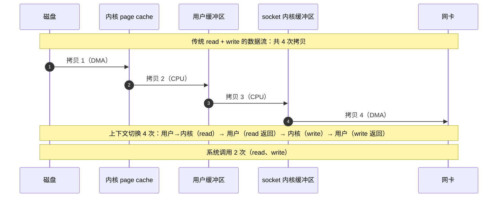
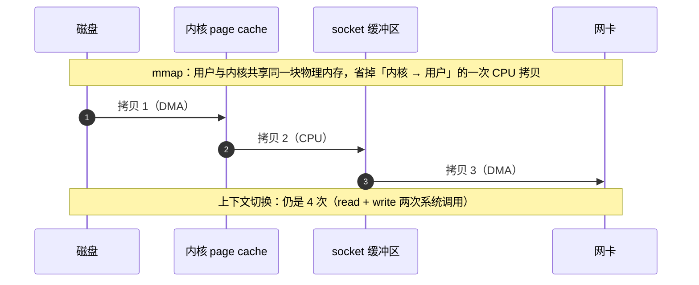
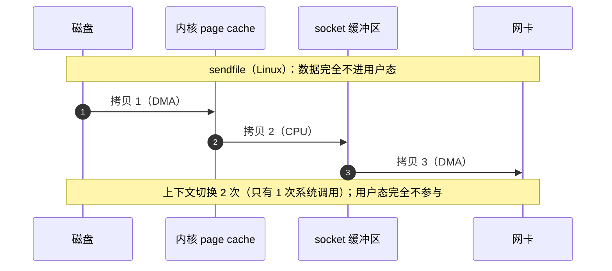
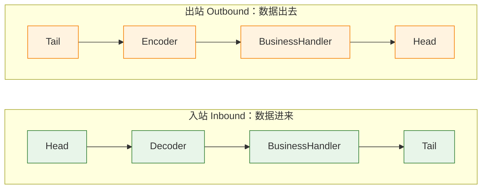
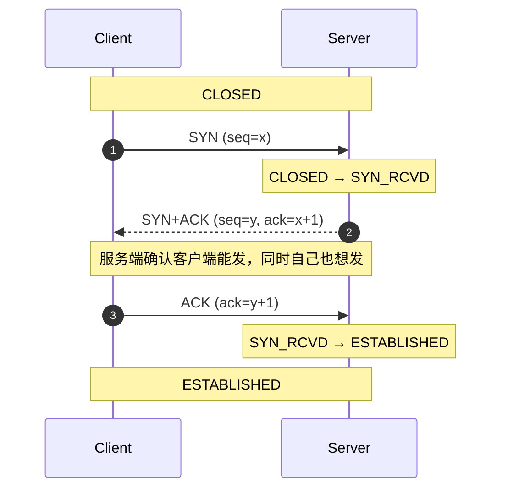
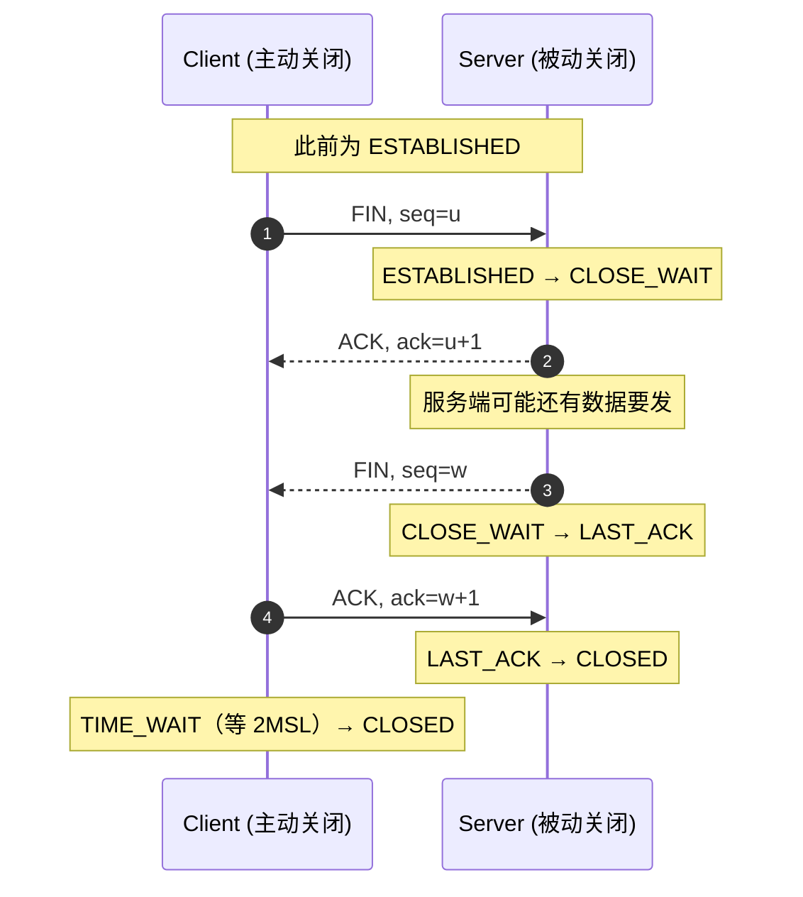

# 🔌 五、IO、NIO 与网络编程

> 这篇笔记回答四个问题：**BIO/NIO/AIO 到底差在哪**（五种 IO 模型 + 同步/异步与阻塞/非阻塞的区别）、**epoll 为什么比 select/poll 快**（红黑树 + 就绪链表 + LT/ET）、**零拷贝是什么**（4 次拷贝怎么降到 2 次，`transferTo`/`DirectByteBuffer`/`MappedByteBuffer` 的收益与代价）、**Netty 为什么存在**（原生 NIO 的四个坑、主从 Reactor、粘包拆包的成因与解法）。基线是 **Java 8**，涉及 JDK 9+/17/21 差异处单独标注。

> [!question] 面试官真正想听的
> 不是"epoll 是红黑树"这句结论，而是：为什么"同步/异步"和"阻塞/非阻塞"容易答混？`Buffer` 的 `flip` 到底把什么指针改成了什么？`sendfile` 少掉的是哪一次上下文切换？Netty 为什么必须自己修 Selector 的空轮询？

关联笔记：[[0-Java总览]]、[[4-多线程与内存模型]]、[[5-线程池]]、[[6-JUC并发工具]]、[[10-面试高频题]]、[[13-Spring源码骨架]]。

---

## 一、字节流与字符流

### 1.1 四大基类

| 基类 | 单位 | 方向 | 常用实现 |
| --- | --- | --- | --- |
| `InputStream` | 字节 | 读 | `FileInputStream`、`ByteArrayInputStream`、`SocketInputStream` |
| `OutputStream` | 字节 | 写 | `FileOutputStream`、`ByteArrayOutputStream`、`ServletOutputStream` |
| `Reader` | 字符（char） | 读 | `FileReader`、`InputStreamReader`、`BufferedReader` |
| `Writer` | 字符（char） | 写 | `FileWriter`、`OutputStreamWriter`、`PrintWriter` |

**根本区别**：字节流处理的是**原始字节**，字符流处理的是**已经解码后的 `char`**。所有字符流内部都必然有一个字节流 + 一个 `CharsetDecoder`/`CharsetEncoder`：

```java
// InputStreamReader 的本质：字节流 + 编码器 → 字符
Reader r = new InputStreamReader(new FileInputStream("gbk.txt"), "GBK");
```

> [!important] 什么时候必须用字节流
> **一切非文本数据（图片、音视频、压缩包、二进制协议报文、序列化数据）只能用字节流**。用 `Reader` 读二进制会做编码转换，把字节破坏掉。反过来，文本场景用 `Reader` + 指定编码，可以避免"按字节切断了多字节字符"的问题。

### 1.2 装饰器模式：IO 体系就是教科书案例

```java
// 读文本（字符）
BufferedReader reader = new BufferedReader(
        new InputStreamReader(new FileInputStream("a.txt"), StandardCharsets.UTF_8));

// 读二进制 + 结构化
DataInputStream in = new DataInputStream(
        new BufferedInputStream(new FileInputStream("a.bin")));
int magic = in.readInt();
byte[] body = new byte[1024];
in.readFully(body);
```

`FilterInputStream`/`FilterOutputStream`/`FilterReader`/`FilterWriter` 是装饰器的抽象基类，`Buffered*`、`Data*`、`Object*`、`Print*` 都是具体装饰器。**继承 `InputStream`（统一类型）+ 持有 `InputStream`（委托增强）** 就是装饰器模式的两要素。

> [!warning] 装饰顺序很重要
> `BufferedInputStream` 必须**放在 `DataInputStream` 的内层**（即先被包裹）。因为 `DataInputStream.readInt()` 内部会调用 4 次 `read()`；如果顺序反了（`new BufferedInputStream(new DataInputStream(...))`），这 4 次 `read()` 依然直接打到 `DataInputStream`，缓冲完全失效。**规则：让"读得碎"的流位于"读得粗"的流的内层。**

### 1.3 Buffered 系列为什么必要

```java
// ❌ 每个字节一次系统调用
try (InputStream in = new FileInputStream("big.bin")) {
    int b;
    while ((b = in.read()) != -1) { /* ... */ }     // 1MB 文件 = 100 万次 read 系统调用
}

// ✅ 一次系统调用搬 8KB，用户态再分发
try (InputStream in = new BufferedInputStream(new FileInputStream("big.bin"))) {
    int b;
    while ((b = in.read()) != -1) { /* ... */ }
}
```

每一次 `read()` 都是**用户态 → 内核态的切换**（还有可能伴随磁盘 IO）。`BufferedInputStream` 默认 8192 字节缓冲（可构造传入），把 100 万次切换降到约 128 次。

> [!example] `BufferedWriter` 更容易被忽略
> `write()` 不带缓冲时也是逐次系统调用。更隐蔽的是**不 flush 会丢数据**：
> ```java
> Writer w = new BufferedWriter(new FileWriter("a.txt"));
> w.write("hello");        // 还在缓冲区里
> // 忘记 flush/close → 文件是空的
> ```
> `BufferedWriter.write` 只在缓冲区满（默认 8192 字符）或显式 `flush()` 时才真正落盘。**这也是 try-with-resources 的价值：`close()` 会自动 flush。**

### 1.4 try-with-resources

```java
try (InputStream in = new FileInputStream(src);
     OutputStream out = new FileOutputStream(dst)) {
    in.transferTo(out);                 // JDK 9+ 有了 InputStream.transferTo，读写循环可以省掉
} catch (IOException e) {
    log.error("copy failed", e);
}
```

- 要求资源实现 `AutoCloseable`，**关闭顺序与声明顺序相反**（后声明的先关，符合"后打开的先释放"）。
- **`close()` 也是会抛异常的**：如果 try 块抛了业务异常、`close()` 又抛异常，业务异常会成为 **suppressed exception**（`e.getSuppressed()`），`close()` 的异常不会把它覆盖掉。手写 `finally { close(); }` 则会把业务异常吃掉——**这是 try-with-resources 相对手写 finally 的关键优势**。
- 同一资源不要声明两次（会关两次），同一 `Channel`/`Socket` 的流也不要重复关闭。

---

## 二、编解码与乱码

### 2.1 字符集速览

| 字符集 | 编码单元 | 中文 | 说明 |
| --- | --- | --- | --- |
| ASCII | 1 字节（7 位有效） | 不支持 | 128 个字符，只覆盖英文与基本符号 |
| ISO-8859-1 / Latin-1 | 1 字节 | 不支持 | 256 个码位，Java 里常被当作"字节 ↔ 字符"的无损映射工具 |
| GBK / GB18030 | 2 字节（GB18030 有 4 字节） | 支持 | 国标，GB18030 是 GBK 的超集；**没有 BOM** |
| UTF-8 | **变长 1–4 字节** | 3 字节 | 互联网事实标准，兼容 ASCII |
| UTF-16 | 2 或 4 字节 | 2 字节 | Java 的 `char`/`String` 内部表示就是 UTF-16 |

### 2.2 UTF-8 变长编码规则

| 字节数 | 位模式 | 码点范围 |
| --- | --- | --- |
| 1 | `0xxxxxxx` | U+0000 – U+007F |
| 2 | `110xxxxx 10xxxxxx` | U+0080 – U+07FF |
| 3 | `1110xxxx 10xxxxxx 10xxxxxx` | U+0800 – U+FFFF |
| 4 | `11110xxx 10xxxxxx 10xxxxxx 10xxxxxx` | U+10000 – U+10FFFF |

**规则的意义**：首字节的前导 1 个数就告诉你这个字符占几个字节；后续字节一律以 `10` 开头，永远不会和首字节混淆。所以 UTF-8 可以**自同步**——从任意位置开始扫描，最多跳 3 个字节就能找到字符边界。这是它比 GBK 更适合流式传输的原因。

> [!danger] Java 的 `char` 是 UTF-16 码元，不是"一个字符"
> ```java
> String emoji = "😀";
> System.out.println(emoji.length());            // 2  ← UTF-16 代理对占两个 char
> System.out.println(emoji.codePointCount(0, emoji.length()));  // 1
> System.out.println(emoji.substring(0, 1));     // 半个代理对，输出乱码
> ```
> 推论：`length()`、`substring()`、`charAt()` 对 emoji/生僻字都不是"字符"语义；要按码点处理必须用 `codePointCount`/`offsetByCodePoints`。
> **数据库层面同理**：MySQL 的 `utf8` 是残缺的 3 字节 UTF-8，存不了 emoji，必须用 `utf8mb4`。这是极其高频的线上事故。

### 2.3 `getBytes()` 不指定编码的坑

```java
byte[] b1 = "中文".getBytes();                       // ❌ 用平台默认字符集（file.encoding）
byte[] b2 = "中文".getBytes(StandardCharsets.UTF_8); // ✅ 永远显式指定
String s1 = new String(bytes);                       // ❌ 同样用默认字符集
String s2 = new String(bytes, StandardCharsets.UTF_8); // ✅
```

**为什么危险**：同一份代码在开发机（macOS/Linux 默认 UTF-8）和另一台机器（或 Docker 镜像未设 locale，默认可能是 ANSI_X3.4-1968/ASCII）上结果不同 → **本地好好的，容器里全是 `???`**。

> [!note] 版本提示
> JDK 18 起 `file.encoding` 的默认值统一为 UTF-8（此前依赖操作系统 locale）。但**显式指定编码仍然是必须的**：`file.encoding` 只影响默认值，不影响已写死的错误用法，而且控制台输出编码还受 `stdout.encoding` 影响。规范做法：所有 `getBytes()`/`new String()`/`InputStreamReader`/`OutputStreamWriter`/`Files.newBufferedReader` 都传 `StandardCharsets`。

### 2.4 为什么"用 UTF-8 读 GBK 文件"会乱码

GBK 里"中"是 `D6 D0`（2 字节）。用 UTF-8 解码器处理 `D6 D0`：

1. `D6` = `1101 0110`，首字节前导 `110` → UTF-8 认为这是 **2 字节序列的开头**，需要一个 `10xxxxxx` 续接字节；
2. `D0` = `1101 0000`，前导 `110` → **不是** `10xxxxxx`，**序列非法**；
3. 解码器判定非法 → 输出替换字符 `U+FFFD`（显示为 `�`），或按 `CodingErrorAction.REPLACE` 跳过一个字节继续。

这就是两种典型症状的来源：

| 症状 | 成因 |
| --- | --- |
| 满屏 `�` | 解码器遇到非法字节序列，替换为 `U+FFFD` |
| 满屏 `ä¸æ` 之类的怪字符 | GBK 字节恰好构成合法 UTF-8 序列，被"正确"解码成了错的字符（**mojibake**） |

> [!tip] 乱码的排查口诀
> **"乱码不是数据错了，是解码时用错了规则"** —— 原始字节通常是完好的。
> ① `�` 说明字节序列在目标编码下非法，基本可以确定编码不匹配；
> ② 拉丁字母变怪字符说明发生了"双重解码"（先被当成 Latin-1 读进来变成 `String`，再按 UTF-8 写出去）；
> ③ 定位方式：用 `xxd`/`hexdump` 看原始字节，或 `new String(bytes, "GBK")` 试一次，能还原就说明只是编码选错了。
> **HTTP 场景还要看 `Content-Type: text/html; charset=...`、`<meta charset>` 与响应头的优先级，以及 Tomcat 的 `URIEncoding`。**

### 2.5 BOM 问题

UTF-8 的 BOM 是 `EF BB BF`（UTF-16 是 `FE FF` 或 `FF FE`）。Windows 记事本/Excel 导出的 CSV 常带 BOM。

**Java 不会自动剥离 BOM**，于是：

```java
// 用 Excel 导出的 CSV（带 BOM）读第一行第一个字段
String header = firstField;                     // "\uFEFFid" —— 前面多了 U+FEFF
if ("id".equals(header)) { ... }                // ❌ 永远不成立
```

常见的连带故障：CSV 表头匹配失败、JSON 解析报"unexpected character"、XML 解析报 prolog 错误、Shell 脚本里的 `#!/bin/bash` 前有 BOM 导致无法执行。

```java
// 方案一：显式跳过（读字节判断）
PushbackInputStream pin = new PushbackInputStream(new FileInputStream(f), 3);
byte[] bom = new byte[3];
int n = pin.read(bom);
if (!(n == 3 && (bom[0] & 0xFF) == 0xEF && (bom[1] & 0xFF) == 0xBB && (bom[2] & 0xFF) == 0xBF)) {
    pin.unread(bom, 0, n);                      // 不是 BOM 就回退
}
BufferedReader reader = new BufferedReader(new InputStreamReader(pin, StandardCharsets.UTF_8));

// 方案二：读进来后去掉首字符（简单粗暴，但会把"正常出现的 U+FEFF"也删掉）
if (!s.isEmpty() && s.charAt(0) == '\uFEFF') s = s.substring(1);

// 方案三：用 commons-io 的 BOMInputStream（可配置跳过哪种 BOM）
```

---

## 三、序列化

### 3.1 Serializable 与 serialVersionUID

```java
public class User implements Serializable {
    private static final long serialVersionUID = 1L;   // ★ 显式声明

    private String name;
    private transient String password;                 // 不参与序列化
    private static String DEFAULT_ROLE = "USER";       // static 字段本来就不序列化
}
```

- `Serializable` 是**标记接口**（没有方法），只用于告知 JVM 允许序列化。
- **`serialVersionUID` 的作用**：反序列化时，JVM 用流里的 UID 与本地类的 UID 比对，不一致就抛 `java.io.InvalidClassException: ... local class incompatible: stream classdesc serialVersionUID = ..., local class serialVersionUID = ...`。
- **不显式声明会怎样**：JVM 根据**类名、修饰符、接口、字段、方法、构造器**等结构自动算出一个 UID。于是**加一个方法、改一个字段类型，UID 就变了**，历史数据（缓存、RPC 报文、Session、MQ 消息）全部反序列化失败。
- **结论**：任何要序列化的类都必须显式写 `serialVersionUID`，哪怕只是 **= 1L**。
- **反序列化不调用本类的构造器**：对象由 JVM 直接分配，字段从流中恢复；若要校验/初始化，需要 `readObject(ObjectInputStream)`；`readResolve()` 可用于维持单例语义（枚举天然免疫序列化破坏单例，见 [[2-面向对象与设计模式]]）。
- `transient` 字段恢复后是**默认值**（对象是 `null`，`int` 是 `0`）—— 这是"密码/连接池/Logger 不该序列化"的标准做法。

> [!danger] 序列化的安全问题
> `ObjectInputStream.readObject()` 会**根据流中的类名去实例化任意类**并调用其 `readObject`/`readResolve` 等方法。攻击者只要能在 classpath 里找到一个"能构造危险调用链"的类（典型如 commons-collections 的 `InvokerTransformer` 链，即所谓 **gadget chain**），就能构造出**反序列化即执行命令**的报文。历史上大量 RMI、JMS、HTTP Session、缓存的 RCE 漏洞都源于此。
> 防护：① **永远不要反序列化不可信数据**（这是首要原则）；② 白名单过滤——JDK 9+ 可用 `ObjectInputFilter` 限定允许的类；③ 升级依赖、清理无用 gadget 库；④ 用 JSON/Protobuf 替代原生序列化。

### 3.2 为什么生产更推荐 JSON / Protobuf

| 维度 | Java 原生序列化 | JSON | Protobuf |
| --- | --- | --- | --- |
| 跨语言 | **否**（只有 Java 能读） | 是 | 是 |
| 可读性 | 二进制，不可读 | 文本，易调试 | 二进制，需 `.proto` 解码 |
| 体积 | 大（含类描述元数据） | 中大 | **小**（字段用编号 + varint） |
| 性能 | 慢（反射 + 元数据） | 中 | **快** |
| 版本兼容 | UID 一变就崩 | 宽松（多字段容忍） | **强 schema 演进**（字段编号 + optional/repeated） |
| 安全 | **gadget 反序列化 RCE** | 相对安全，但 Jackson 多态 `enableDefaultTyping`/`@JsonTypeInfo` 同样可被构造成 RCE | 无对象实例化机制，天然安全 |

**实践结论**：对外接口用 JSON（Jackson）；内部高性能 RPC 用 Protobuf（gRPC）；缓存里存 JSON 或 Protobuf，**不要存 Java 原生序列化的对象**——它既锁死了类的演进（UID），又是 RCE 的温床，还会在跨版本部署时集体失效。

---

## 四、五种 IO 模型

### 4.1 两个阶段：等待数据 + 拷贝数据

所有网络 IO 都可以拆成两个阶段（以 `recvfrom` 读 socket 为例）：

```text
阶段一：等待数据就绪
  网卡收到数据 → DMA 写入内核 socket 接收缓冲区 → 内核唤醒等待的进程
阶段二：拷贝数据
  内核把数据从【内核缓冲区】拷贝到【用户缓冲区】(CPU 参与)
```

**五种模型的全部差异，就是"这两个阶段谁在阻塞、谁在干活"。**

### 4.2 五种模型逐个说清

**① 阻塞 IO（Blocking IO）**：`recvfrom` 调用后，阶段一和阶段二全程阻塞，直到数据拷到用户缓冲区才返回。一个线程同时只能处理一个连接 → 必须"一连接一线程"。这是 Java BIO 的模型。

**② 非阻塞 IO（Non-blocking IO）**：`recvfrom` 立即返回；没数据时返回 `EWOULDBLOCK`。**用户线程必须轮询**。阶段二（拷贝）仍然是阻塞的。问题很致命：轮询要么浪费 CPU（忙等），要么引入延迟（sleep 轮询），几乎不单独使用。

**③ IO 多路复用（IO Multiplexing）**：`select`/`poll`/`epoll` 一次阻塞等待**多个 fd**，任一就绪就返回；然后再对就绪的 fd 调用 `recvfrom`（阶段二阻塞）。**它把"等待"这件事从 N 个线程合并到 1 个线程**，这是它相对阻塞 IO 的核心价值。

**④ 信号驱动 IO（Signal-driven IO）**：注册 `SIGIO` 信号处理函数，数据就绪时内核发信号；阶段一不阻塞，阶段二（拷贝）仍阻塞。因为信号处理的复杂性（信号合并、可重入），实践中很少用于网络 IO。

**⑤ 异步 IO（Asynchronous IO）**：`aio_read` 提交请求后**立即返回**，**阶段一和阶段二全部由内核完成**，完成后通知用户（回调/信号）。这是真正的异步。

> [!important] Java 里的 AIO 要打个问号
> Java 7 提供了 `AsynchronousSocketChannel` 等 AIO API，但在 Linux 上长期是基于线程池/`epoll` 的**模拟实现**，而不是真正的内核异步 IO；因此生产界更常用 Netty + epoll（IO 多路复用）。**面试时说出"Java AIO 在 Linux 上的实现并不等于内核 AIO"，是明显的加分项。**
> 另外 `FileChannel` **无法注册到 `Selector`**：文件总是"就绪"的（没有"等待数据"阶段），非阻塞对普通文件没有意义，这也是 NIO 的文件操作仍然只能是阻塞式的原因。

### 4.3 同步/异步 与 阻塞/非阻塞（最容易答混）

这两组概念是**两个正交的维度**，判断口径完全不同：

| 概念 | 判断口径 | 看的是 |
| --- | --- | --- |
| **阻塞 / 非阻塞** | 调用发起后**是否立即返回** | 阶段一（等待数据） |
| **同步 / 异步** | **数据拷贝（阶段二）由谁完成、结果由谁通知** | 阶段二（拷贝数据） |

- **阻塞 vs 非阻塞**：调用方视角。`recvfrom` 会不会把当前线程挂起。
- **同步 vs 异步**：`Unix Network Programming` 的定义是——**"真正的 IO 操作（数据拷贝）是否由发起调用的线程完成"**。同步 IO 里，真正的读写（把数据从内核搬到用户态）**一定发生在用户线程调用 read/write 的时候**；只有异步 IO 是内核把数据搬完之后再通知你。

**按这个口径归类**：

| 模型 | 阶段一 | 阶段二 | 归类 |
| --- | --- | --- | --- |
| 阻塞 IO | 阻塞 | 阻塞 | 同步阻塞 |
| 非阻塞 IO | 非阻塞（轮询） | 阻塞 | 同步非阻塞 |
| **IO 多路复用** | **阻塞在 select/epoll 上** | 阻塞在 recvfrom 上 | **同步（常被描述为"同步非阻塞"）** |
| 信号驱动 IO | 非阻塞 | 阻塞 | 同步 |
| 异步 IO | 非阻塞 | **内核完成** | **异步** |

> [!tip] 一句话记忆
> **"同步/异步看阶段二（拷贝谁干），阻塞/非阻塞看阶段一（调用是否立刻返回）。"**
> 所以：**IO 多路复用是同步非阻塞**——`select` 本身是阻塞的（这也是为什么有人叫它"同步阻塞"），但它在"有数据可读"这件事上让线程不必死等单个连接；**只有 AIO 才是异步**。
> 最常见的错误回答是"epoll 是异步 IO"。**epoll 只是多路复用，属于同步 IO。**

### 4.4 对比总表

| 模型 | 阶段一是否阻塞 | 阶段二是否阻塞 | 同步/异步 | Java 对应 |
| --- | --- | --- | --- | --- |
| 阻塞 IO | 是 | 是 | 同步 | `InputStream`/`Socket`（BIO） |
| 非阻塞 IO | 否（轮询） | 是 | 同步 | `SocketChannel` + `configureBlocking(false)` |
| IO 多路复用 | 阻塞在 select | 是 | 同步 | `Selector`（NIO） |
| 信号驱动 IO | 否 | 是 | 同步 | Java 无直接对应 |
| 异步 IO | 否 | **否（内核完成）** | **异步** | `AsynchronousSocketChannel`（AIO） |

---

## 五、多路复用：select / poll / epoll

### 5.1 select

```c
int select(int nfds, fd_set *readfds, fd_set *writefds, fd_set *exceptfds, struct timeval *timeout);
```

- `fd_set` 是**位图**，默认大小 `FD_SETSIZE = 1024` → **单进程最多监听 1024 个 fd**（改这个值要重新编译内核/库，不可靠）。
- 调用时**把整个 fd 集合从用户态拷贝到内核**，返回时再把结果拷回来。
- 内核需要**线性扫描全部 fd** 判断谁就绪，复杂度 O(n)。
- 返回的只是"有几个就绪"，**用户还得再遍历一遍集合找出是哪个 fd**，又一次 O(n)。
- **致命坑**：`select` 会**修改传入的 `fd_set`**（把未就绪的位清掉），所以每次循环都必须重新构造 fd 集合，这也是大量 bug 与性能损耗的来源。

### 5.2 poll

```c
int poll(struct pollfd *fds, nfds_t nfds, int timeout);
// struct pollfd { int fd; short events; short revents; };
```

- 用**数组**替代位图，**解除了 1024 上限**（只受内存与 `ulimit -n` 限制）。
- `revents` 与 `events` 分离，**不需要每次重建集合**。
- **仍然要每次把整个数组拷进内核，仍然 O(n) 轮询**。
- 所以 poll 只是"修好了 select 的接口缺陷"，**没有解决根本的扩展性问题**。

### 5.3 epoll

```c
int epoll_create(int size);                                        // 创建 epoll 实例（内核 eventpoll 对象）
int epoll_ctl(int epfd, int op, int fd, struct epoll_event *event); // ADD / MOD / DEL
int epoll_wait(int epfd, struct epoll_event *events, int maxevents, int timeout);
```

三个关键机制：

1. **红黑树（interest list）**：`epoll_ctl` 把 fd 挂到内核的红黑树上，**注册一次就长期有效**，不需要每次 `epoll_wait` 重复传整个集合。增删改都是 O(log n)，且**只在注册/注销时发生**。
2. **就绪链表（ready list）+ 回调**：内核在 fd 对应的 socket 等待队列上注册**回调**（`ep_poll_callback`）。当网卡收到数据、socket 变就绪时，回调**主动把该 fd 挂进就绪链表**。于是 `epoll_wait` 只需检查就绪链表是否为空 → **判断"有没有事件"的复杂度与总连接数无关**（O(1) 级别）。
3. **只拷贝就绪的事件**：返回时只把就绪链表里的元素拷给用户态，**拷贝量与"就绪数"成正比，与"总连接数"无关**（这也是常说的"用 mmap/共享内存减少拷贝"的实际收益所在）。

```text
epoll 的核心数据结构
  红黑树：所有被监听的 fd        ← epoll_ctl 增删改，注册一次长期有效
  就绪链表：当前已就绪的 fd      ← 内核回调在数据到达时主动插入
  epoll_wait：只读就绪链表，把就绪事件拷回用户态
```

### 5.4 水平触发（LT）与边缘触发（ET）

| 维度 | LT（水平触发，默认） | ET（边缘触发，`EPOLLET`） |
| --- | --- | --- |
| 通知语义 | **只要缓冲区还有数据，每次都通知** | **只在状态变化时通知一次** |
| 类比 | 电平高就一直报警 | 只在上升沿报警 |
| `epoll_wait` 次数 | 多（数据没读完会反复返回） | 少（效率更高） |
| fd 是否必须非阻塞 | 不必须 | **必须** |
| 编程要求 | 可以一次只读一点 | **必须循环 read 直到返回 `EAGAIN`** |
| 风险 | 效率略低 | **漏读一个字节，就再也不会有通知 → 连接"假死"** |
| 谁在用 | 默认行为 | **Netty 的 epoll 传输默认使用 ET** |

> [!danger] ET 的两个死穴
> ① **必须把 fd 设为非阻塞**。如果在 ET 模式下循环 `read`，而最后一次 `read` 因数据读完而阻塞，线程就永久卡死——因为 ET 不会再通知你。
> ② **必须在一次通知里把数据读到 `EAGAIN`**。只读了一部分就返回，剩余数据不会被再次通知（直到有新数据到达才可能触发），表现为"连接还在，但消息丢了/卡住了"，极难排查。
> 正确写法：`while ((n = read(fd, buf, sizeof buf)) > 0) { ... }`，退出条件同时处理 `n == -1 && errno == EAGAIN`（正常读完）与 `errno == EINTR`（被信号打断，重试）。

### 5.5 为什么 epoll 更适合高并发（以及它的代价）

| 维度 | select | poll | epoll |
| --- | --- | --- | --- |
| fd 上限 | **1024** | 无（受 ulimit） | 无（受内存） |
| 每次调用是否拷贝整个集合 | 是 | 是 | **否**（只拷就绪事件） |
| 就绪检测复杂度 | O(n) 轮询 | O(n) 轮询 | **回调 + 就绪链表，与总连接数无关** |
| 是否需要用户再遍历找就绪 fd | 是（O(n)） | 是（O(n)） | **返回的数组就是就绪的** |
| 适用场景 | 少量连接 | 中量连接 | **大量连接 + 少量活跃（C10K/C100K）** |

> [!warning] epoll 不是"永远更快"
> ① **连接少且全部活跃时**，`epoll_ctl` 的注册/注销开销 + 更复杂的回调机制，可能反而**不如 poll**（比如只有几十个连接的高频短请求）。
> ② **epoll 的优势来自"大量连接但只有少量活跃"**——这正是长连接网关、IM、推送的形态。如果所有连接都非常活跃，epoll 只是把 O(n) 从"每次调用扫一遍"变成"事件驱动摊开"，改善有限。
> ③ 与多线程配合时要注意**惊群**：多个线程/进程 `epoll_wait` 同一个实例，就绪时可能被全部唤醒（现代内核里同一个 epoll 实例上的多线程等待通常只唤醒一个；跨进程共享 listen fd 的场景可用 `EPOLLEXCLUSIVE` 或 `SO_REUSEPORT` 让每个进程/线程持有独立的 listen socket）。

---

## 六、NIO 三件套

### 6.1 Channel

| Channel | 可非阻塞 | 可注册 Selector | 说明 |
| --- | --- | --- | --- |
| `FileChannel` | **否** | **否** | 文件永远"就绪"，非阻塞无意义；支持 `transferTo`/`map` |
| `SocketChannel` | 是 | 是 | TCP 客户端/已连接套接字 |
| `ServerSocketChannel` | 是 | 是（`OP_ACCEPT`） | TCP 服务端监听 |
| `DatagramChannel` | 是 | 是 | UDP |

- **Channel 是双向的**，同时支持读和写（不像 `InputStream`/`OutputStream` 要两个对象）。
- Channel 的读写**必须经过 `Buffer`**：`channel.read(buf)` / `channel.write(buf)`。
- `configureBlocking(false)` 必须在 `register` 之前调用，否则注册时抛 `IllegalBlockingModeException`。

### 6.2 Buffer：三个指针

```java
public abstract class Buffer {
    private int mark = -1;
    private int position = 0;     // 下一个要读/写的位置
    private int limit;            // 不能读/写的边界
    private int capacity;         // 容量，创建后不变
}
```

| 指针 | 语义 | 谁在动 |
| --- | --- | --- |
| `capacity` | 缓冲区总容量，**创建后固定** | 不变 |
| `position` | **下一个要读/写的位置** | 写/读时自动递增 |
| `limit` | **不能越过的边界** | 写模式下 = capacity；`flip` 后 = 原 position |
| `mark` | 一个"书签"，`reset()` 回到这里 | `mark()` 设置，`reset()` 使用 |

关键方法（**这是 NIO 最容易出错的地方**）：

| 方法 | 做的事 | 不变式 |
| --- | --- | --- |
| `flip()` | **写模式 → 读模式**：`limit = position; position = 0; mark = -1` | 让"已写入的数据"变成"可读的数据" |
| `clear()` | **读模式 → 写模式**：`position = 0; limit = capacity; mark = -1` | **不擦除数据**，只是允许覆盖 |
| `compact()` | 把未读的 `[position, limit)` **搬到数组开头**，然后 `position = 剩余字节数; limit = capacity` | 保留了没读完的数据，用于"边读边攒" |
| `rewind()` | `position = 0; mark = -1` | 重读，`limit` 不变 |
| `mark()` / `reset()` | 记录 / 回到 position | `reset()` 在 mark 失效时抛 `InvalidMarkException` |
| `remaining()` / `hasRemaining()` | `limit - position` | 判断还能读/写多少 |

### 6.3 指针变化图（写 → flip → 读 → 再写）

以 `ByteBuffer buf = ByteBuffer.allocate(8)` 为例：

```text
① allocate(8)                 position=0  limit=8  capacity=8
   [ _ _ _ _ _ _ _ _ ]         （写模式，position 指下一个可写位置）

② write("Hi")  → put 2 字节    position=2  limit=8  capacity=8
   [ H i _ _ _ _ _ _ ]         （position 已推进到 2）

③ flip()                       position=0  limit=2  capacity=8   ★ 关键一步
   [ H i | _ _ _ _ _ ]         （limit 被设成原来的 position=2，进入读模式）

④ read 1 字节                  position=1  limit=2  capacity=8
   [ H | i _ _ _ _ _ ]         （position 推进到 1，还剩 1 字节可读）

⑤ clear()  （放弃未读数据）     position=0  limit=8  capacity=8
   [ H i _ _ _ _ _ _ ]         （数据还在！只是允许被覆盖，limit 回到 capacity）

⑤' compact() （保留未读数据）   position=1  limit=8  capacity=8
   [ i _ _ _ _ _ _ _ ]         （把没读的 i 搬到开头，position = 剩余 1）
```

> [!danger] 忘记 `flip()` 是最经典的 NIO bug
> 写完数据直接 `read`，此时 `position == limit`（都等于写入的字节数），`remaining() == 0`，于是：
> - 从 Channel 读：`channel.read(buf)` 返回 **0**；
> - 从内存读：`buf.get()` 抛 `BufferUnderflowException`。
> 现象是"**数据明明写进去了，却读到 0 字节**"。**口诀：从 Buffer 往外读之前一定先 `flip()`；重复使用前一定 `clear()` 或 `compact()`。**
> 另外：**`Buffer` 不是线程安全的**，多线程共享必须自己加锁；`clear()` 之后旧数据仍可被 `get` 到（如果没有新写入），所以**不要把 `clear()` 当"清空内容"用**。

### 6.4 Selector

```java
Selector selector = Selector.open();
channel.configureBlocking(false);
SelectionKey key = channel.register(selector, SelectionKey.OP_READ, attachment); // attachment 可挂业务上下文

selector.select();          // 阻塞，直到有就绪事件（可传超时）
selector.selectNow();       // 不阻塞，立即返回
selector.select(1000);      // 最多阻塞 1s（超时轮询的兜底手段）
selector.wakeup();          // 唤醒阻塞在 select 上的线程（关闭时必用）
```

| `interestOps` 位 | 触发条件 |
| --- | --- |
| `OP_ACCEPT` | 有新的连接可以 accept（`ServerSocketChannel`） |
| `OP_CONNECT` | 客户端连接建立完成 |
| `OP_READ` | 有数据可读，或对端关闭（`read` 返回 -1） |
| `OP_WRITE` | **发送缓冲区有空闲**（绝大多数时候都成立） |

> [!danger] `OP_WRITE` 常驻 = 空轮询 = CPU 100%
> `OP_WRITE` 几乎总是就绪的。如果把 `OP_WRITE` 一直注册在 `interestOps` 里，`select()` 会**立刻返回**，循环空转把 CPU 打满。
> **正确做法：只在"有数据写不出去"时临时注册 `OP_WRITE`，写完立刻取消。**（见 6.5 的 `write()` 实现。）
>
> 另一个必须遵守的规则：**遍历 `selectedKeys()` 时必须 `it.remove()`**。`select()` 只会往就绪集合里**添加** key，从不移除；不移除的话，即使该 key 已经不再就绪，下次遍历还会处理它一次（并对无效 key 抛异常、或造成重复处理）。**正确姿势是 `key.cancel()`（需要时）+ `iterator.remove()`（每次都必须）。**

### 6.5 一个完整的 NIO Echo 服务端骨架

下面这段代码包含三个生产级要点：**`it.remove()`**、**半包/粘包处理（长度字段）**、**`OP_WRITE` 的按需注册**。

```java
import java.io.IOException;
import java.net.InetSocketAddress;
import java.net.StandardSocketOptions;
import java.nio.ByteBuffer;
import java.nio.channels.*;
import java.util.ArrayDeque;
import java.util.Deque;
import java.util.Iterator;

/** 单线程 Reactor 的 NIO Echo 服务端：协议为 [4 字节长度][payload]，回显 payload */
public class NioEchoServer {

    private static final int HEADER = 4;                 // 4 字节大端长度字段
    private final Selector selector;
    private final ServerSocketChannel server;

    public NioEchoServer(int port) throws IOException {
        selector = Selector.open();
        server = ServerSocketChannel.open();
        server.configureBlocking(false);                 // ★ 必须非阻塞才能注册到 Selector
        server.setOption(StandardSocketOptions.SO_REUSEADDR, true);
        server.bind(new InetSocketAddress(port), 1024);
        server.register(selector, SelectionKey.OP_ACCEPT);
    }

    public void start() throws IOException {
        while (!Thread.currentThread().isInterrupted()) {
            selector.select();                           // 阻塞直到至少一个事件就绪
            Iterator<SelectionKey> it = selector.selectedKeys().iterator();
            while (it.hasNext()) {
                SelectionKey key = it.next();
                it.remove();                             // ★ 必须移除，否则下次 select 仍会返回它
                if (!key.isValid()) continue;
                try {
                    if (key.isAcceptable()) accept(key);
                    else if (key.isReadable()) read(key);
                    else if (key.isWritable()) write(key);
                } catch (IOException e) {
                    close(key);                          // ★ 单连接异常不能拖垮整个事件循环
                }
            }
        }
    }

    private void accept(SelectionKey key) throws IOException {
        SocketChannel client = ((ServerSocketChannel) key.channel()).accept();
        if (client == null) return;                      // 极端情况下可能为 null
        client.configureBlocking(false);
        client.setOption(StandardSocketOptions.TCP_NODELAY, true);   // 关闭 Nagle，降低延迟
        client.register(selector, SelectionKey.OP_READ, new Session(client));
    }

    private void read(SelectionKey key) throws IOException {
        Session s = (Session) key.attachment();
        int n = s.channel.read(s.readBuf);               // 追加写：readBuf 处于【写模式】
        if (n == -1) { close(key); return; }             // -1 才是 EOF（对端关闭）
        if (n == 0) return;                              // ★ 非阻塞下 0 只表示"本次没数据"，不是 EOF

        s.readBuf.flip();                                // ★ 写模式 → 读模式
        while (true) {                                   // 一次可能收到多个完整帧（粘包）
            if (s.readBuf.remaining() < HEADER) break;   // 连帧头都不够 → 半包
            s.readBuf.mark();
            int len = s.readBuf.getInt();
            if (len < 0 || len > 1 << 20) { close(key); return; }   // 防御性长度校验，防止恶意帧
            if (s.readBuf.remaining() < len) {           // ★ 半包：payload 还没到齐
                s.readBuf.reset();                       // 回到帧头，等下次 read 再解
                break;
            }
            byte[] payload = new byte[len];
            s.readBuf.get(payload);
            echo(s, payload);                            // 业务处理：这里简单回显
        }
        s.readBuf.compact();                             // ★ 把未读完的字节搬到开头，切回写模式
    }

    private void write(SelectionKey key) throws IOException {
        Session s = (Session) key.attachment();
        while (!s.writeQueue.isEmpty()) {
            ByteBuffer frame = s.writeQueue.peek();
            s.channel.write(frame);                      // ★ write 不保证写完，可能部分写
            if (frame.hasRemaining()) break;             // 内核发送缓冲区满 → 等下次 OP_WRITE
            s.writeQueue.poll();
        }
        if (s.writeQueue.isEmpty()) {
            key.interestOps(SelectionKey.OP_READ);       // ★ 写完必须取消 OP_WRITE，否则空轮询
        }
    }

    /** 加 4 字节长度头后入发送队列，并临时打开 OP_WRITE */
    private void echo(Session s, byte[] payload) {
        ByteBuffer frame = ByteBuffer.allocate(HEADER + payload.length);
        frame.putInt(payload.length).put(payload).flip();
        s.writeQueue.add(frame);
        s.channel.keyFor(selector).interestOps(SelectionKey.OP_READ | SelectionKey.OP_WRITE);
    }

    private void close(SelectionKey key) {
        try { key.channel().close(); } catch (IOException ignore) { }
        // key.cancel() 不是必须的：channel.close() 会自动取消所有关联的 key
    }

    /** 每个连接的状态：一个累积读缓冲 + 一个待发送队列 */
    private static final class Session {
        final SocketChannel channel;
        final ByteBuffer readBuf = ByteBuffer.allocate(4096);   // 累积半包
        final Deque<ByteBuffer> writeQueue = new ArrayDeque<>();
        Session(SocketChannel channel) { this.channel = channel; }
    }

    public static void main(String[] args) throws IOException {
        new NioEchoServer(9000).start();
    }
}
```

要点复盘：

1. **`readBuf` 全程充当"累积缓冲"**：`read` 时是写模式（追加），解析前 `flip` 成读模式，解析完 `compact` 把剩余半包搬到开头再切回写模式。**`compact` 而不是 `clear`，是因为未解析完的字节不能丢。**
2. **半包（拆包）**：`remaining() < len` 时用 `mark()`/`reset()` 回退到帧头，等下一次 `read` 补齐。**`mark`/`reset` 在这里比手工记 position 更清晰。**
3. **粘包**：`while(true)` 一次读入可能包含多个完整帧，必须循环解析到不足一帧为止。
4. **`OP_WRITE` 按需注册**：有积压才注册，写完就取消，避免空轮询。
5. 这个骨架是**单 Reactor 单线程**，所有业务逻辑都在 IO 线程上跑，一旦有耗时操作就会阻塞所有连接——生产必须把业务丢给业务线程池（即 Netty 的 `addLast(businessGroup, handler)`），见第八节。

---

## 七、零拷贝

### 7.1 传统 `read + write`：4 次拷贝、4 次上下文切换

```java
// 把文件内容发到网络：传统写法
byte[] buf = new byte[8192];
try (FileInputStream in = new FileInputStream("a.txt");
     Socket socket = ...) {
    int n;
    while ((n = in.read(buf)) > 0) {          // ① read 系统调用
        socket.getOutputStream().write(buf, 0, n);   // ② write 系统调用
    }
}
```



**关键浪费**：数据被搬到用户态，**用户程序什么都没做**（只是原样转发），纯粹为了让 CPU 搬一次家。

### 7.2 `mmap + write`：3 次拷贝

```java
// 用 mmap 把文件映射进用户地址空间，省掉"内核 → 用户"的一次 CPU 拷贝
MappedByteBuffer mbb = new RandomAccessFile("a.txt", "r").getChannel()
        .map(FileChannel.MapMode.READ_ONLY, 0, size);
socketChannel.write(mbb);        // 共享内存区 → socket 缓冲区（仍是一次 CPU 拷贝）
```



省掉了"内核 buffer → 用户 buffer"的那一次 CPU 拷贝（因为 mmap 之后用户和内核看的是**同一页物理内存**），但**上下文切换次数没变**。

### 7.3 `sendfile`：2 次上下文切换

```java
// sendfile：数据完全不进用户态，在内核里从 page cache 直接送到 socket
FileChannel in = FileChannel.open(Paths.get("a.txt"), StandardOpenOption.READ);
SocketChannel out = ...;
in.transferTo(0, in.size(), out);
```



如果网卡与驱动支持 **SG-DMA（scatter-gather DMA）**，内核只需把"文件描述符 + 偏移 + 长度"这组描述符传给网卡，网卡直接从 page cache 读数据 → **CPU 完全不参与数据搬运，只剩 2 次 DMA 拷贝，这才是严格意义的零拷贝**。

| 方式 | 系统调用 | 上下文切换 | 数据拷贝 | 数据进用户态 |
| --- | --- | --- | --- | --- |
| `read + write` | 2 | **4** | 4（2 DMA + 2 CPU） | 是 |
| `mmap + write` | 2 | 4 | 3（2 DMA + 1 CPU） | 是（共享映射区） |
| `sendfile` | 1 | **2** | 3（2 DMA + 1 CPU） | **否** |
| `sendfile` + SG-DMA | 1 | **2** | **2（纯 DMA）** | **否** |

> [!important] "零拷贝"到底指什么
> **零拷贝不是"一次拷贝都没有"**（DMA 拷贝永远存在），而是**"CPU 不参与数据在用户态与内核态之间的搬运"**。面试谈到"sendfile 是 2 次拷贝"时，说清楚这是 **SG-DMA 版本（2 次纯 DMA）**、而"3 次拷贝"是不含 SG-DMA 的口径，能立刻区分出是否真懂。

### 7.4 `transferTo` / `transferFrom`

```java
// ✅ 必须在循环里调用，并按返回值推进
try (FileChannel in = FileChannel.open(src, StandardOpenOption.READ);
     FileChannel out = FileChannel.open(dst, StandardOpenOption.CREATE, StandardOpenOption.WRITE)) {
    long size = in.size(), pos = 0;
    while (pos < size) {
        long n = in.transferTo(pos, size - pos, out);   // 可能只传一部分
        if (n <= 0) break;                              // 防止死循环
        pos += n;
    }
}
```

必须注意：

1. **单次调用可能只传输一部分**（`transferTo` 的返回值就是"实际传了多少"）。**不检查返回值、不循环，就会出现"文件只拷了一半"的诡异 bug。** 另外在 `size - pos` 很大时，必须回到循环里重新调用（不要传 `Long.MAX_VALUE` 之类）。
2. **不保证使用 sendfile**：Linux 上通常走 `sendfile`；其他平台/某些情况下会退化为 `mmap + write` 或普通读写循环。
3. **`transferTo` 方向固定为"从本 Channel 到目标 Channel"**，`transferFrom` 相反；Socket 作为目标时一般用 `transferTo`。
4. **零拷贝只适用于"数据原样搬运"**。一旦要在用户态加工数据（**加密、压缩、协议改写、再压缩**），就必须把数据读进用户态，零拷贝失效。
   > 这就是 Kafka 的取舍：**当生产者与消费者的压缩算法一致、消息不需要重新编解码时**，Kafka 用 `transferTo` 让 broker 直接把日志段从 page cache 发给消费者（零拷贝生效）；**压缩算法不一致需要重新压缩时，必须回到用户态处理**，零拷贝失效。Kafka 高性能的另一半来自 **OS page cache + 顺序追加写**，而不是只有零拷贝。
   > 对比：RocketMQ 的 CommitLog 写入走的是 **`MappedByteBuffer`（mmap）** 路线；Kafka 的日志读取走 **`FileChannel.transferTo`（sendfile）** 路线。两条路线都避免堆内存，但 mmap 适合"随机/原地写"，sendfile 适合"顺序整段读发"。

### 7.5 堆外内存：`DirectByteBuffer`

```java
ByteBuffer heap   = ByteBuffer.allocate(1 << 20);         // 堆内，归 GC 管
ByteBuffer direct = ByteBuffer.allocateDirect(1 << 20);   // 堆外，归 Cleaner 管
```

**为什么堆外更快？** JVM 的堆内存可能被 GC 移动（压缩整理），内核不能持有一个会移动的地址。所以用**堆内** buffer 做 IO 时，JVM 需要先把数据拷贝到一块**临时的堆外内存**（或使用临时数组）再交给内核。`DirectByteBuffer` 直接分配在这块不会移动的内存上，**省掉这次堆内 → 堆外的拷贝**，也**不再受 GC 停顿影响**。

> [!danger] 堆外内存的风险（线上最常见的"神秘 OOM"）
> ① **不受 GC 管理**：`DirectByteBuffer` 的对象本身很小（在堆里），但它引用的**堆外内存不在堆上**。`DirectByteBuffer` 对象被 GC 回收时，通过 `Cleaner` 释放堆外内存。于是出现典型症状：**heap dump 看起来完全正常，但进程 RSS 很高、最终 `OutOfMemoryError: Direct buffer memory` 或容器被 OOM Killer 杀掉**。
> ② **释放时机不确定**：依赖 GC 触发。如果堆很空闲、GC 不频繁，堆外内存就会持续堆积。JVM 会在堆外用量接近 `-XX:MaxDirectMemorySize`（默认等于 `-Xmx`）时尝试触发一次回收，但**默认情况下这往往太晚**。
> ③ **`-XX:MaxDirectMemorySize` 必须显式设置**（尤其容器里 `-Xmx` 很大时），否则可能分配到远超容器 limit 的堆外内存。
> ④ **不要试图手动释放**（`sun.misc.Cleaner`/`Unsafe.invokeCleaner` 都是内部 API）。生产做法是用 **Netty 的 `ByteBuf`**：它有自己的 `PooledByteBufAllocator`（池化 + 规格分级 + ThreadCache 复用）和**引用计数**（`retain`/`release`），把堆外内存的生命周期显式管起来；Netty 还提供泄漏检测（`-Dio.netty.leakDetection.level`），能在"忘了 release"时打印出分配点的堆栈——**这就是"为什么不要裸用 `DirectByteBuffer`"的工程答案。**
> 补充：JDK 21/22 起的 FFM API（`java.lang.foreign` 的 `Arena`/`MemorySegment`）提供了显式的、确定性的堆外内存生命周期管理，是长期方向。

### 7.6 `MappedByteBuffer`

```java
try (FileChannel ch = FileChannel.open(path, StandardOpenOption.READ, StandardOpenOption.WRITE)) {
    MappedByteBuffer mbb = ch.map(FileChannel.MapMode.READ_WRITE, 0, ch.size());  // mmap
    mbb.putInt(0, 42);          // 直接改 page cache，表现得像内存数组
    mbb.force();                // 显式刷盘（否则由 OS 决定何时回写）
}
```

- 本质是 **mmap**：文件的一段被映射到进程地址空间，读写它就是在读写 **OS page cache**，**不需要显式 read/write 系统调用**。
- **适合随机读写大文件**（索引文件、日志的原地更新）；**顺序整段读发更适合 `transferTo`**。
- **单次映射大小**：`size` 参数是 `long`，但实现上单次映射受地址空间/整数限制，通常按 **2GB 分块**映射。
- **释放时机依赖 `Cleaner`/GC**：`MappedByteBuffer` 只有在被 GC 回收时才会解除映射。后果：**Windows 上文件句柄不释放，`File.delete()` 失败（"文件被占用"）；Linux 上 `delete` 成功但 **inode 仍被映射引用，磁盘空间不释放**。** 需要立即释放时通常要借助内部 API 或 FFM API，或者干脆避免长生命周期的大映射。
- **`MappedByteBuffer` 的读写不是线程安全的**（position 等状态在 Buffer 里），`force()` 只保证本进程的修改落盘，多进程同时 mmap 同一文件时**可见性与一致性由 OS 决定，会有缓存一致性问题**，不要用它做跨进程共享内存通信。

---

## 八、Netty 为什么存在

### 8.1 原生 NIO 的四个痛点

| 痛点 | 具体表现 | Netty 的解法 |
| --- | --- | --- |
| **API 复杂** | `Buffer` 三个指针、`flip`/`clear`/`compact`、`Selector` 事件循环、`interestOps` 管理都要自己写 | `ByteBuf` **读写指针分离**（不需要 flip）；`Channel`/`Handler` 抽象封装事件循环 |
| **epoll 空轮询 bug** | JDK 的 `Selector` 在 Linux 上偶发 `select()` 返回 0 但无事件 → **CPU 100%** | `selectCnt` 计数，连续空转超过阈值（512）就 **重建 Selector**（`rebuildSelector()`） |
| **粘包/拆包** | TCP 是字节流，消息边界要自己维护；半包/粘包处理极易写错 | 内置 `FixedLengthFrameDecoder`/`DelimiterBasedFrameDecoder`/`LengthFieldBasedFrameDecoder` |
| **Reactor 模型要自己搭** | 主从线程组、连接与线程绑定、任务队列、优雅关闭都得手写 | 开箱即用的**主从 Reactor 多线程模型** + `EventLoopGroup` |

（第五个隐性痛点：**跨平台差异**。Linux 用 `epoll`、macOS 用 `kqueue`，JDK 的 `Selector` 屏蔽了大部分差异但性能与行为仍不一致；Netty 直接提供 `EpollEventLoopGroup`/`KQueueEventLoopGroup` 等原生传输。）

### 8.2 主从 Reactor 多线程模型

```java
EventLoopGroup bossGroup   = new NioEventLoopGroup(1);              // 只负责 accept
EventLoopGroup workerGroup = new NioEventLoopGroup();               // 默认 2 * CPU 核数，负责读写
ServerBootstrap b = new ServerBootstrap();
b.group(bossGroup, workerGroup)
 .channel(NioServerSocketChannel.class)
 .childHandler(new ChannelInitializer<SocketChannel>() {
     @Override protected void initChannel(SocketChannel ch) {
         ch.pipeline()
           .addLast(new LengthFieldBasedFrameDecoder(1 << 20, 0, 4, 0, 4))
           .addLast(new StringDecoder(StandardCharsets.UTF_8))
           .addLast(businessGroup, new EchoHandler());          // ★ 业务用独立线程池
     }
 });
ChannelFuture f = b.bind(9000).sync();
```

| 概念 | 说明 |
| --- | --- |
| `bossGroup` | 通常 1 个线程，只处理 `OP_ACCEPT`，accept 后把 Channel **注册到 workerGroup 的某个 EventLoop** |
| `workerGroup` | 默认 `2 * CPU` 个 EventLoop，负责已连接 Channel 的读写事件 |
| **`EventLoop`** | = 一个 `Selector` + 一个任务队列 + **一个线程**；`EventLoopGroup` 是它们的池 |
| **线程绑定** | 一个 `Channel` 一生只绑定**一个** `EventLoop`（一个线程）→ **同一连接的所有事件串行处理，无需加锁** |
| `MpscQueue` | 其他线程要给某个 EventLoop 派任务，就投进它的多生产者单消费者队列，由该线程串行取出执行 |
| 任务队列 | `eventLoop.execute(...)` 保证任务在该 Channel 所属线程上执行，避免并发操作 Channel |

> [!important] 这套设计的思想与 [[6-JUC并发工具]] 直接呼应
> **"用线程绑定把并发问题变成串行问题"**，从而在热路径上完全不需要锁——这是 Netty 高性能的核心。同样的思路在 Disruptor、Kafka 的单分区单线程模型里都能看到：**先划分出无共享的状态边界，再让每个边界只有一个线程。**
> 反过来说：**任何在 `ChannelHandler` 里做的耗时操作（DB 查询、RPC、大文件解析）都会阻塞该 EventLoop 上所有 Channel**（通常上千个连接）→ **必须把业务丢进独立的业务线程池**。

### 8.3 ChannelPipeline 与 ByteBuf

**`ChannelPipeline` 是责任链**：`HeadContext` ↔ 若干 `ChannelHandler` ↔ `TailContext`。



- `ctx.writeAndFlush(msg)`：从**当前 Handler 的下一个出站 Handler** 开始向后（出站方向）传播 —— 局部发送。
- `channel.writeAndFlush(msg)`：从 **Tail 开始**走完整条出站链 —— 全局发送。
- `ChannelInboundHandlerAdapter` **不会自动释放**消息，必须自己 `ReferenceCountUtil.release(msg)`；而 **`SimpleChannelInboundHandler` 会在 `channelRead` 返回后自动 release**（代价是不能把消息引用传出方法）。**这是 Netty 内存泄漏的头号来源。**

**`ByteBuf` 相对 `ByteBuffer` 的四个改进**：

| 特性 | `ByteBuffer` | `ByteBuf` |
| --- | --- | --- |
| 读写指针 | 共用一个 `position`，必须 `flip` | **`readerIndex` / `writerIndex` 分离**，读写自由切换 |
| 容量 | 固定 | **可动态扩容** |
| 内存分配 | 每次 `allocate`/`allocateDirect` | **池化**（`PooledByteBufAllocator`，规格分级 + `ThreadCache` 复用） |
| 生命周期 | 由 GC/Cleaner 决定 | **引用计数**（`retain`/`release`），可确定性释放 |
| 零拷贝视图 | 只有 `slice`/`duplicate` | `slice`/`duplicate`/`retainedSlice`/`CompositeByteBuf`（**组合多个 buffer 而不拷贝**） |
| 堆内/堆外 | 两种 API | `UnpooledHeapByteBuf`/`UnpooledDirectByteBuf`/`PooledDirectByteBuf` 等，统一接口 |

```text
ByteBuf 的指针
  +-------------------+-------------------+-------------------+
  |   已读（丢弃区）    |   可读 readable    |   可写 writable    |
  +-------------------+-------------------+-------------------+
  0              readerIndex          writerIndex        capacity
  discardReadBytes() 可回收左侧空间；readableBytes() = writerIndex - readerIndex
```

### 8.4 粘包与拆包

**成因**（为什么 TCP 上"一次 read 就是一条消息"是错的）：

1. TCP 是**面向字节流**的协议，**本身不保留消息边界**（这是 UDP 与 TCP 的本质区别之一）。
2. 发送方：应用一次 `write` 的数据可能被拆成多个 TCP 段（超过 MSS、受发送缓冲区限制）；Nagle 算法也可能把多个小 `write` 合并。
3. 接收方：内核接收缓冲区会把多次到达的数据合并，应用一次 `read` 可能读到"1.5 条"或"3 条"消息。

**四种解法**：

| 方案 | 解码器 | 适用 | 缺点 |
| --- | --- | --- | --- |
| 定长 | `FixedLengthFrameDecoder` | 报文长度恒定 | 不灵活，长度变化就废 |
| 分隔符 | `DelimiterBasedFrameDecoder`、`LineBasedFrameDecoder` | 文本协议（Redis、HTTP 头、日志） | 分隔符必须不出现在正文里，需转义 |
| **长度字段** | **`LengthFieldBasedFrameDecoder`** | **二进制协议首选**（Dubbo、自定义 RPC） | 需要设计协议头 |
| 自定义 | 继承 `ByteToMessageDecoder` | 复杂协议（HTTP/2、MQTT） | 实现成本高 |

```java
// 协议：[4 字节魔数][4 字节 body 长度][body]
//   lengthFieldOffset   = 4   长度字段从第 4 字节开始
//   lengthFieldLength   = 4   长度字段本身 4 字节
//   lengthAdjustment    = 0   长度值就是 body 长度（不含头）
//   initialBytesToStrip = 8   解码后剥掉 8 字节头，只把 body 交给下游
pipeline.addLast(new LengthFieldBasedFrameDecoder(1024 * 1024, 4, 4, 0, 8));
```

| 参数 | 含义 | 常见取值 |
| --- | --- | --- |
| `maxFrameLength` | 单帧最大长度，**超过就抛 `TooLongFrameException`（防 OOM 攻击）** | 按业务上限设，不要图省事设 `Integer.MAX_VALUE` |
| `lengthFieldOffset` | 长度字段的起始偏移 | 有魔数时 = 魔数长度 |
| `lengthFieldLength` | 长度字段占几字节（1/2/3/4/8） | 通常 2 或 4 |
| `lengthAdjustment` | **修正值**：真实帧长 = 长度字段值 + 该值 | 长度字段包含头部自身时用负数修正 |
| `initialBytesToStrip` | 解码后**丢弃前多少字节** | 想让下游只看到 body 就填头部总长；想保留头就填 0 |

> [!tip] 别自己写半包处理
> 第六节的 Echo 骨架里那段 `mark`/`reset`/`compact` 就是手写半包处理——**能用 `ByteToMessageDecoder` 就别手写**，它会自动累积、自动 `cumulation`、自动处理 `ByteBuf` 释放，还能通过 `decode` 一次产出多个消息（解决粘包）。手写版本几乎必然在某次边界条件上踩坑（这也是 Netty 存在的理由之一）。

**其他必答项**：Netty 在 Linux 的 epoll 传输上**默认使用边缘触发（ET）并要求非阻塞**；`TCP_NODELAY` 在 Netty 中**默认开启**；`bossGroup`/`workerGroup` 的线程数、`SO_BACKLOG`、`writeBufferWaterMark`（写水位线，用于背压）都是生产必调项。

---

## 九、网络编程基础

### 9.1 TCP 三次握手



**为什么是三次而不是两次？**

1. **需要双方都确认"自己和对方的收发能力都正常"**。两次握手只能让服务端确认"客户端能发、自己能收"，但服务端**无法确认客户端收到了自己的 SYN**，也就无法确认客户端能收、自己能发。
2. **防止历史失效的连接请求**：如果客户端的一个旧 SYN 因网络延迟在连接关闭后才到达服务端，两次握手会让服务端直接建立一条**永远不会被使用的连接**（客户端不认这条连接），浪费一个连接资源；三次握手时服务端收不到最终 ACK，就不会建立连接。
3. **序列号（ISN）双向同步**：TCP 靠序列号保证可靠有序，双向都需要确认对方的初始序列号，一来一回恰好三次交互。

> [!note] 附带细节
> ISN 是**随机化**的（不是从 0 或 1 开始），目的是防止攻击者预测序列号后伪造报文或注入数据。四次握手是多余的，因为服务端的 `ACK` 与自己的 `SYN` 可以在同一个报文里发送。

### 9.2 四次挥手与 TIME_WAIT



**为什么是四次？** TCP 是**半关闭**的：一方发 FIN 只表示"我没有数据要发了"，不代表"我也不能收了"。服务端收到 FIN 后必须先回 ACK（此时连接处于 `CLOSE_WAIT`，仍可继续发送剩余数据），等自己的数据也发完才发 FIN。**因为 ACK 与 FIN 不能合并，所以是四次。**（如果服务端恰好也没有数据要发，ACK 与 FIN 可能被延迟确认机制合并，实际表现为三次——这也是抓包偶尔看到"三次挥手"的原因。）

**TIME_WAIT 的作用**（主动关闭方在发完最后一个 ACK 后进入，持续 **2MSL**）：

1. **保证最后一个 ACK 能到达对端**：如果这个 ACK 丢了，对端会超时重传 FIN，此时本端还能重发 ACK。若本端立刻关闭，就只能回 RST，对端会报错。
2. **让本连接的旧报文在网络中彻底消散**：防止同一个四元组（源 IP、源端口、目的 IP、目的端口）被快速复用后，**上一个连接的延迟报文被新连接误收**，造成数据错乱。

**TIME_WAIT 过多（`ss -s` / `netstat` 里成千上万）的处理**：

| 手段 | 说明 | 风险 |
| --- | --- | --- |
| **用长连接/连接池** | **根本解**：减少短连接的数量就减少了 TIME_WAIT | 无 |
| `net.ipv4.tcp_tw_reuse = 1` | 允许**出向连接**复用 TIME_WAIT 的端口（依赖时间戳） | 只对主动发起连接方安全，不能用于服务端监听端口 |
| 调大 `net.ipv4.tcp_max_tw_buckets` | 提高 TIME_WAIT 数量上限 | **治标**，超限后内核会直接报错并打日志 |
| `SO_LINGER = 0`（close 时发 RST） | 直接跳过 TIME_WAIT | **危险**：RST 会丢弃未发送数据、对端收到"连接重置"错误，绝对不要在业务代码里滥用 |
| ~~`net.ipv4.tcp_tw_recycle`~~ | 已在新版内核移除 | **在 NAT 环境下会导致大量连接被丢弃，不要开** |

> [!danger] 一定要区分 TIME_WAIT 和 CLOSE_WAIT
> **`TIME_WAIT` 是正常状态**（主动关闭方的 2MSL 等待）；**`CLOSE_WAIT` 大量堆积是应用 bug** —— 它表示"对端已经发了 FIN，本端回了 ACK，但**应用始终没有调用 `close()`**"，连接和文件描述符一直被占用 → 最终 `Too many open files`。
> 常见成因：连接泄漏（未在 `finally` 中关闭）、线程池被阻塞卡住导致回调没执行、HttpClient/连接池配置错误。**看到 CLOSE_WAIT 高就去查代码里漏掉的 `close()`，而不是去调内核参数。**

### 9.3 TCP 与 UDP

| 维度 | TCP | UDP |
| --- | --- | --- |
| 连接 | 面向连接（三次握手/四次挥手） | 无连接 |
| 可靠性 | 确认 + 重传 + 排序，保证不丢不重不乱序 | 不保证 |
| 消息边界 | **无边界（字节流）→ 会粘包** | **保留边界**，一次发送对应一次接收（要么整条到，要么丢） |
| 流量控制 | 滑动窗口 | 无 |
| 拥塞控制 | 慢启动、拥塞避免、快重传、快恢复 | 无（靠应用自己做） |
| 头部开销 | 20 字节（可带选项） | 8 字节 |
| 速度/延迟 | 较低延迟稳定性好，握手/重传有开销 | 更快、更轻，适合实时 |
| 典型场景 | HTTP/1.1、HTTP/2、数据库、RPC、文件传输 | DNS、音视频、游戏状态同步、QUIC（**HTTP/3 在 UDP 上自己实现可靠传输**） |

> [!tip] 加分点
> UDP "保留消息边界"恰恰是它的优势：不用担心粘包。现代方案（QUIC）正是在 UDP 之上**在用户态实现**了可靠的、可多路复用的传输层——因为**在内核里改 TCP 太慢，在用户态改 UDP 快得多**。

### 9.4 Nagle 算法与 `TCP_NODELAY`

**Nagle 算法**（默认开启）：发送方在**有未确认的小包**时，会把后续的小数据**攒起来**，直到收到 ACK 或凑满一个 MSS 再发。目的是减少网络上的小包数量（提高带宽利用率）。

**冲突点**：Nagle 攒包 + 对端的**延迟确认（delayed ACK，通常等 40ms 或等第二个包）**会互相等待 → 出现 **约 40ms 的固定延迟**。这对 RPC、游戏、IM、实时推送是灾难。

```java
socket.setTcpNoDelay(true);                                      // BIO
socketChannel.setOption(StandardSocketOptions.TCP_NODELAY, true); // NIO
// Netty：默认就是 true（DefaultSocketChannelConfig 中默认开启）
```

**判断准则**：**延迟敏感 → 关 Nagle（`TCP_NODELAY = true`）；吞吐优先且小包多 → 保留 Nagle**（或用应用层缓冲自己攒批，比如 Kafka 的 `linger.ms` + `batch.size`）。注意 Netty 已默认开启 `TCP_NODELAY`，而**原生 `Socket` 默认是开启 Nagle 的**，这是 BIO 代码里经常忘记设的一项。

### 9.5 HTTP/1.1 vs HTTP/2 vs HTTP/3

| 维度 | HTTP/1.1 | HTTP/2 | HTTP/3 |
| --- | --- | --- | --- |
| 传输层 | TCP | TCP | **QUIC（基于 UDP）** |
| 报文格式 | 文本 | **二进制分帧** | 二进制分帧 |
| 多路复用 | ❌（管线化理论可行，实际几乎不用） | ✅ 一个连接并发多流（stream） | ✅ 独立流 |
| 队头阻塞 | **应用层 HOB**：前一个响应不回，后面的必须等 | 解决应用层 HOB，**但仍有 TCP 层 HOB**（一个包丢，所有流都停） | **彻底解决**：QUIC 的流相互独立 |
| 头部压缩 | ❌（每次重发完整头部） | **HPACK** | **QPACK** |
| 握手 | TCP 1 RTT + TLS 2 RTT | 同 1.1（+TLS 1.3 可 1 RTT） | **1 RTT，甚至 0 RTT**（TLS 1.3 集成在 QUIC 内） |
| 服务端推送 | ❌ | ✅（实践中因收益/复杂度问题已少用） | ✅ |
| 连接迁移 | ❌（IP 变了连接就断） | ❌ | ✅ **Connection ID**，切 Wi-Fi/4G 不断连 |
| 浏览器并发 | **每域名约 6 个连接** | 1 个连接够用 | 1 个连接够用 |

> [!important] 面试要点
> **"HTTP/2 解决了应用层的队头阻塞，但没解决 TCP 层的队头阻塞"** —— 这是最关键的一句。因为 HTTP/2 多路复用都跑在**同一个 TCP 连接**上，任何 TCP 段丢失都会让内核阻塞后续所有流的交付。HTTP/3 用 QUIC 把"可靠有序"从全局流下移到**每条流各自独立**，才彻底解决。
> 另外：`keep-alive` 与 `Connection: close` 是 HTTP/1.1 的持久连接机制，也是"连接池"存在的意义——**减少三次握手与 TIME_WAIT**。

### 9.6 BIO 的瓶颈与"伪异步 IO"的局限

**BIO 服务端（一连接一线程）**：

```java
while (true) {
    Socket socket = serverSocket.accept();     // 阻塞
    new Thread(() -> handle(socket)).start();  // 每连接一个线程
}
```

问题：

1. **线程数必须 ≥ 并发连接数**。线程栈默认约 1MB（`-Xss`），1 万连接就是约 10GB 的栈空间 → **C10K 直接不可行**。
2. **上下文切换成本**：线程数远超 CPU 核数时，调度开销急剧上升。
3. **绝大多数线程在阻塞**（等数据），是纯粹的资源浪费。
4. **`accept` 本身也可能被拖慢**：如果创建线程太慢，accept 队列（backlog）会积压，客户端连接超时。

**伪异步 IO（线程池 + 阻塞 read）**：

```java
ExecutorService pool = Executors.newFixedThreadPool(200);
while (true) {
    Socket socket = serverSocket.accept();
    pool.execute(() -> handle(socket));       // 用线程池"复用"线程
}
```

**它只解决了"线程无限创建"，没有解决"阻塞"这个根本矛盾**：

- 200 个线程被 200 个"连上了但不发数据"的连接占住（**阻塞在 `read` 上**）→ 第 201 个连接虽然在 `accept` 队列里，却**永远等不到线程**。
- 这是典型的**慢连接攻击/连接饥饿**场景；只能靠 `SO_TIMEOUT`（`socket.setSoTimeout(ms)`）+ 有界队列 + 合理的拒绝策略缓解，吞吐与延迟仍然差。
- **本质原因：阻塞 IO 的线程数必须 ≥ 并发连接数**。要么把连接数压到很小（加上 `SO_TIMEOUT` 和连接池），要么换 NIO/多路复用（用少量线程管理大量连接）。

> [!danger] 必须设置超时，否则线程泄漏
> `Socket` 默认 **`connect` 无超时、`read` 无超时（无限等待）**。对端"连上不发数据"或"发一半就不发了"，线程就永久阻塞 → 线程池被占满 → 整个服务不可用。
> 三件套：`socket.connect(addr, timeoutMs)`（连接超时）、`socket.setSoTimeout(ms)`（读超时）、连接池/HTTP 客户端的 response timeout。**HTTP 客户端还要注意"连接池借出超时"与"整体请求超时"是两个不同的配置。**

---

## 十、常见陷阱速查

| 陷阱 | 现象 | 正确做法 |
| --- | --- | --- |
| **忘记 `flip()`** | `read` 返回 0 或抛 `BufferUnderflowException`，"写进去了却读到 0 字节" | 从 Buffer 往外读之前先 `flip()`；复用前 `clear()`/`compact()` |
| **`Buffer` 一直不清空** | 数据错乱、读到上次的残留字节；`clear()` 之后旧数据仍在 | 区分 `clear`（放弃未读）与 `compact`（保留未读） |
| **`DirectByteBuffer` OOM** | heap dump 正常但 RSS 高 / `OutOfMemoryError: Direct buffer memory` | 显式设 `-XX:MaxDirectMemorySize`；用 Netty 的池化 `ByteBuf` + 引用计数 |
| **`MappedByteBuffer` 不释放** | Windows 删不掉文件；Linux 磁盘空间不释放 | 避免长生命周期大映射；或显式释放/改用 FFM `Arena` |
| **`Selector` 空轮询** | `select()` 返回 0 但无事件，单核 CPU 100% | Netty 的 `selectCnt` 重建 Selector；自己的 NIO 要加空转计数 + 超时兜底 |
| **`OP_WRITE` 常驻** | `select()` 立刻返回，事件循环空转，CPU 100% | 有积压才注册，写完立刻 `interestOps(OP_READ)` |
| **忘记 `it.remove()`** | 同一个 key 被反复处理、重复写数据、对无效 key 抛异常 | 遍历 `selectedKeys()` 时**每次**都 `remove()` |
| **Socket 无超时** | 线程永久阻塞 → 线程池耗尽 → 服务雪崩 | `connect(timeout)` + `setSoTimeout()` + 连接池超时 |
| **`available()` 当消息长度** | 读到的消息被截断；有时返回 0 但数据其实在网络上 | `available()` 只是"无需阻塞即可读的字节数"，**不是消息长度**；用长度字段定界，用 `read()` 返回值判断 EOF |
| **`read()` 返回 0 当成 EOF** | 非阻塞下误判连接关闭，提前断连 | **只有 `-1` 才是 EOF**，`0` 只表示本次没数据 |
| **`write()` 当写完** | 大报文只发了一半（内核发送缓冲区满） | 检查返回值，剩余部分注册 `OP_WRITE` 等下次写 |
| **`transferTo` 不检查返回值** | 文件只拷贝了一部分 | 循环调用并累加 `pos`，返回 `<= 0` 时退出 |
| **编码不一致** | 满屏 `�` 或 `ä¸æ`，本地正常容器乱码 | 所有编解码 API 显式传 `StandardCharsets.UTF_8`；DB 用 `utf8mb4` |
| **未关闭流/Channel** | fd 泄漏 → `Too many open files`；CLOSE_WAIT 堆积 | try-with-resources；Channel 与 Stream 不重复关闭 |
| **序列化 UID 变化** | `InvalidClassException: local class incompatible` | 显式声明 `serialVersionUID`；跨版本用 JSON/Protobuf |
| **业务逻辑写在 EventLoop 里** | 一个慢请求阻塞上千连接（Netty） | 业务丢给独立业务线程池（`addLast(group, handler)`） |

---

## 十一、「必答」三连

> [!important] 必答 1：五种 IO 模型，以及同步/异步、阻塞/非阻塞的区别
> **两个阶段**：等待数据就绪（网卡 DMA 到内核缓冲区 → 唤醒进程）+ 拷贝数据（内核 → 用户态）。
> **五种模型**：① 阻塞 IO——两阶段都阻塞；② 非阻塞 IO——阶段一立即返回 `EWOULDBLOCK`，需轮询，阶段二阻塞；③ **IO 多路复用**——`select`/`poll`/`epoll` 一次等多个 fd，就绪后再 `recvfrom`，阶段二仍阻塞；④ 信号驱动 IO——数据就绪时发 `SIGIO`，阶段二阻塞；⑤ **异步 IO**——两阶段全部由内核完成，完成后通知。
> **区别的关键**：**"阻塞/非阻塞"看阶段一——调用是否立即返回；"同步/异步"看阶段二——数据拷贝是否由用户线程完成、结果由谁通知。** 所以 **IO 多路复用是同步非阻塞，不是异步**；只有 AIO 是异步。Java 的 AIO 在 Linux 上是线程池/`epoll` 模拟，不等于内核 AIO，生产更常用 Netty + epoll。

> [!important] 必答 2：epoll 为什么快
> ① **红黑树存放被监听的 fd**：`epoll_ctl` 注册一次长期有效，`epoll_wait` 不需要每次重传整个 fd 集合；增删改 O(log n)，且只发生在注册阶段。
> ② **就绪链表 + 内核回调**：在内核 socket 的等待队列上注册回调，数据到达时**主动把 fd 挂进就绪链表**；`epoll_wait` 只检查这个链表，**判断"是否有事件"的成本与总连接数无关**（对比 select/poll 每次 O(n) 遍历）。
> ③ **只把就绪事件拷回用户态**，拷贝量与就绪数成正比、与总连接数无关（select/poll 每次都要拷整个集合，select 还受 `FD_SETSIZE = 1024` 限制，且返回后用户还要再遍历一遍找就绪 fd）。
> ④ **LT 与 ET**：LT 只要缓冲区有数据就持续通知（默认）；ET 只在状态变化时通知一次，**要求 fd 非阻塞、且必须循环 read 到 `EAGAIN`，否则漏读的数据不会再被通知**（Netty 的 epoll 默认用 ET）。
> ⑤ **代价**：连接少且全部活跃时，epoll 的注册开销与回调机制可能不如 poll；它的优势场景是**大量连接 + 少量活跃**（长连接网关、IM、推送）。

> [!important] 必答 3：零拷贝是什么
> **"零拷贝"指 CPU 不参与数据在用户态与内核态之间的搬运，DMA 拷贝依然存在。**
> ① **传统 `read + write`**：4 次拷贝（磁盘→page cache 的 DMA、内核→用户态 CPU、用户态→socket 缓冲区 CPU、socket 缓冲区→网卡 DMA）+ **4 次上下文切换**（2 次系统调用）。
> ② **`mmap + write`**：用户与内核共享同一块 page cache，省掉"内核→用户"那次 CPU 拷贝 → **3 次拷贝**，但上下文切换仍是 4 次。
> ③ **`sendfile`**：数据完全不进用户态，内核直接从 page cache 送到 socket → **2 次上下文切换**；配合网卡 **SG-DMA**，内核只传描述符、网卡直接从 page cache 取数，**只剩 2 次 DMA 拷贝**，这才是严格零拷贝。
> ④ **Java 用法**：`FileChannel.transferTo/transferFrom`（Linux 上通常走 sendfile，**必须循环并按返回值推进**）；`DirectByteBuffer`（省掉堆内→堆外拷贝，但**不受 GC 管理、易 OOM，需要 `-XX:MaxDirectMemorySize`，生产用 Netty 池化 `ByteBuf` + 引用计数**）；`MappedByteBuffer`（mmap，适合随机读写大文件，**释放依赖 Cleaner/GC**）。
> ⑤ **边界**：一旦要在用户态加工数据（加密/压缩/改协议），零拷贝就失效——这就是 Kafka 只在"生产者与消费者压缩算法一致、无需重新编解码"时才吃到零拷贝收益的原因；RocketMQ 则走 `MappedByteBuffer` 路线。

---

## 十二、相关笔记

- 五种 IO 模型的"等待"与线程池的关系、BIO 的线程饥饿 → [[5-线程池]]
- Netty 的线程绑定、`MpscQueue`、无锁串行化、`Promise`/`Future` → [[6-JUC并发工具]]
- `volatile`、`synchronized` 与 `DirectByteBuffer`/`ByteBuf` 引用的可见性 → [[4-多线程与内存模型]]
- Spring WebFlux / Netty 在 Spring 中的启动骨架 → [[13-Spring源码骨架]]
- NIO/AIO、`var`、`ObjectInputFilter` 等版本差异 → [[9-Java版本特性]]
- IO 与网络相关的面试连环追问 → [[10-面试高频题]]
