# ♻️ 二、GC 机制深度

> 本篇回答：为什么 JVM 要分代；"垃圾"到底怎么判定（GC Roots 的完整清单）；三种基础算法各自的取舍；并发标记下**三色标记与漏标**如何被增量更新/SATB 解决；记忆集、卡表、写屏障这些"看不见的基础设施"在干什么；各收集器的**算法级流程**（CMS 四阶段与三大问题、G1 的 Region/RSet/SATB/Mixed GC、ZGC 的染色指针与读屏障）；安全点为什么会拖长 STW；以及 **GC 日志怎么逐字段读**。
> 定位：**回收视角**。分配视角（对象创建、TLAB、Mark Word、内存布局、引用类型）见 [[1-JVM内存区域与对象布局]]；参数速查与调优方法见 [[6-JVM参数与调优实战]]；OOM/CPU/泄漏的排查动作见 [[7-JVM故障排查实战]]；JIT 与逃逸分析优化见 [[5-JIT编译与运行时优化]]。
> 版本基线：**Java 8** 为下限，标注 17 / 21 / 23 / 25 的差异。默认值均来自 `-XX:+PrintFlagsFinal` 实测（本机 JDK 17.0.11）；标「示意」的日志是手写示例，用于讲解字段含义，不是实测数据。
> 关联：[[0-JVM总览]]、[[0-Java总览]]、[[4-多线程与内存模型]]、[[6-JUC并发工具]]、[[9-Java版本特性]]、[[10-面试高频题]]、[[面试准备/技术面试题库/03-JVM与性能调优]]。

---

## 一、为什么需要 GC：分代假说

### 1.1 三个假说（先把设计动机讲通）

| 假说 | 内容 | 直接推论 |
|---|---|---|
| **弱分代假说**（Weak Generational Hypothesis） | 绝大多数对象都是**朝生夕灭**的 | 新生代每次 GC 只有极少数对象存活 → 用**复制**算法最划算 |
| **强分代假说**（Strong Generational Hypothesis） | 熬过越多次 GC 的对象越难消亡 | 老年代对象存活率极高 → 复制成本高，应改用**标记-清除/标记-整理** |
| **跨代引用假说**（Intergenerational Reference Hypothesis） | 跨代引用相对于同代引用只占极少数 | 不必每次扫全堆，只需用**记忆集**记录少量跨代引用 |

> [!important] 记忆整个 GC 体系的钥匙
> **分代 = 弱分代假说 + 强分代假说**；
> **记忆集/卡表/写屏障 = 跨代引用假说**。
> 面试里被问"为什么要分代"，只答"对象存活时间不同"是不完整的——还要补上"分代之后必须解决跨代引用，否则 Minor GC 要扫全堆，分代就白分了"。

### 1.2 由假说推出的整套设计

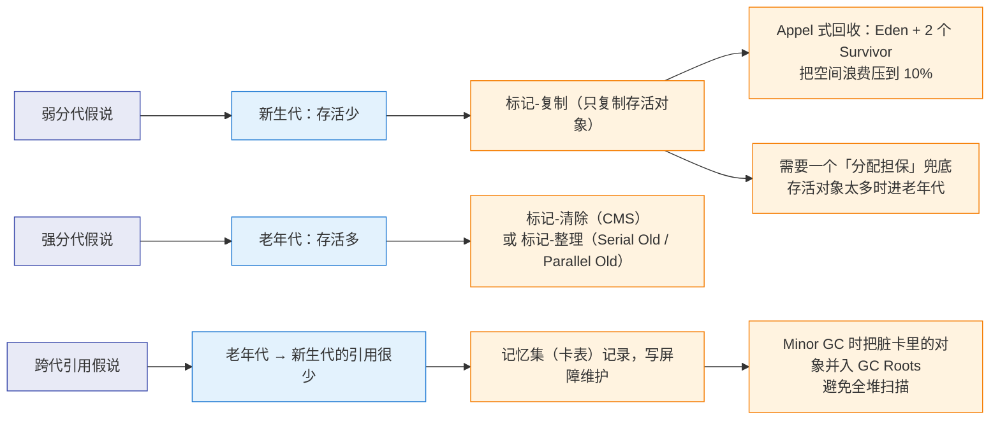

### 1.3 分代之后的新问题：跨代引用

假设不做记忆集，一次 Minor GC 要保证"新生代里真正的垃圾被回收、存活对象不被误杀"。而"存活"必须考虑**老年代对象对新生代的引用**：

- 如果每次 Minor GC 都扫描整个老年代 → 随着堆变大，Minor GC 退化成"全堆扫描"，分代完全失去意义；
- 如果不扫老年代 → 老年代持有的新生代对象会被误判为不可达 → **回收掉还在使用的对象**（这是致命错误，不是"漏回收"）；
- 结论：必须有一个"记录跨代引用位置"的结构 → **记忆集（Remembered Set）**，HotSpot 的实现是**卡表（Card Table）**。见第五章。

### 1.4 分代思想的演变

| 阶段 | 形态 | 代表 |
|---|---|---|
| 物理分代 | 新生代/老年代是两块连续内存 | Serial、ParNew、Parallel、CMS |
| 逻辑分代 + 分区 | 堆切成等大 Region，Region 动态扮演 Eden/Survivor/Old | G1 |
| 并发不分代 | 整堆一起并发标记/转移 | ZGC（JDK 11~22）、Shenandoah（默认单代） |
| 并发 + 分代 | 分区思想 + 分代收益 | 分代 ZGC（JDK 21 引入 / 23 默认）、分代 Shenandoah（JDK 24 实验 / 25 产品化） |

---

## 二、可达性分析与 GC Roots

### 2.1 为什么不用引用计数

| 方案 | 优点 | 致命问题 |
|---|---|---|
| 引用计数 | 实现简单、回收及时（计数为 0 即回收） | ① **无法解决循环引用**（A→B→A，计数永远不为 0）② 每次赋值都要维护计数，性能开销大且难以优化 ③ 并发场景需要原子操作 |

主流 JVM 都用**可达性分析（Reachability Analysis）**：从一组称为 **GC Roots** 的对象出发，沿引用链遍历，遍历不到的对象就是"可回收的"。

### 2.2 GC Roots 的完整清单（必答）

| # | Root 类别 | 说明 |
|---|---|---|
| 1 | **虚拟机栈中引用的对象** | 各线程栈帧的**局部变量表**里存活的引用（参数、局部变量、临时变量）。注意 slot 复用陷阱，见 [[1-JVM内存区域与对象布局]] §2.2 |
| 2 | **方法区中类静态属性引用的对象** | 类的 `static` 字段值 |
| 3 | **方法区中常量引用的对象** | `static final` 常量、**字符串常量池（StringTable）** 中的引用 |
| 4 | **本地方法栈中 JNI 引用的对象** | JNI Global Reference（JNI Weak Global Reference 不算根） |
| 5 | **Java 虚拟机内部的引用** | 基本类型对应的 Class 对象（`int.class` 等）、常驻异常对象（NPE、OOM）、系统类加载器 |
| 6 | **所有被同步锁持有的对象** | `synchronized` 的 monitor 持有的对象（被锁住的对象不能回收） |
| 7 | **反映 JVM 内部情况的引用** | JMXBean、JVMTI 注册的回调、本地代码缓存（JIT 代码里的常量池引用） |
| 8 | **活跃线程（Thread 对象）** | 线程对象本身是根：它持有栈、`ThreadLocalMap`（Thread → threadLocals → value） |
| 9 | **类加载器与 Class 对象** | 严格说它们是"被 5/8 引用的对象"；实践上按根集合理解：只要 ClassLoader 可达，它加载的类及其静态变量就全部可达（这也是类加载器泄漏 = 元空间泄漏的原因） |
| 10 | **分代收集时的跨代引用记录** | 卡表/记忆集中标脏位置对应的对象，会被临时并入根集合一起扫描 |

> [!warning] 面试答题的层次感
> 只背出 1~4 条是"及格"，能说出 **5~7（JVM 内部引用）** 和 **8（活跃线程）** 是"良好"，能顺带点出 **9（类加载器 → 元空间泄漏）** 与 **10（记忆集也是根的一部分）** 才是"精通"。
> 另外要能解释：**为什么"局部变量表里的引用"，而不仅仅是"栈里的引用"**——因为 JIT 后引用可能只在寄存器里，此时靠 OopMap 记录（见 2.3）。

### 2.3 枚举根节点：为什么必须 STW，OopMap 是什么

**问题**：可达性分析要求在"引用关系冻结"的那一刻进行。如果分析过程中用户线程还在改引用，结果就不可信——这是"GC 必须 Stop The World"的根本原因（不是"GC 代码难写"，而是**一致性**要求）。

**次生问题**：怎么快速找出所有根？逐个扫描栈帧、方法区判断"这个位置是不是引用"开销巨大，而且 HotSpot 是**准确式 GC**（能精确知道类型信息），没必要做保守式扫描。

**答案：OopMap**

- JIT 编译时，在**特定指令位置**（安全点）记录下"栈上某个偏移、某个寄存器里存的是引用"，形成 OopMap；
- GC 时直接按 OopMap 找到所有根，不用遍历整个栈；
- 因为 OopMap 只在安全点生成且只对安全点有效，**线程必须先跑到安全点才能被 GC 处理** → 安全点成为 STW 的前提，见第六章。

### 2.4 "不可达 ≠ 立即回收"

被判定不可达的对象不一定马上消失，三种情况：

1. **`finalize()`**：重写了 `finalize` 且未执行过的对象会被放进 F-Queue 再"给一次机会"，甚至能在 `finalize` 里**复活**（重新被根引用）。细节见 [[1-JVM内存区域与对象布局]] §14。
2. **`Cleaner`/`PhantomReference`**：清理是**异步**的，GC 完成后由 `ReferenceHandler` 线程处理，不保证立刻释放（这一点直接决定了堆外内存的释放滞后）。
3. **浮动垃圾（Floating Garbage）**：并发收集器在并发标记/清除期间用户线程新产生的垃圾，本轮只能留着，等下一轮回收。

---

## 三、三种基础算法

### 3.1 标记-清除（Mark-Sweep）

```
标记阶段：从 GC Roots 遍历，把可达对象标黑
清除阶段：把未标记对象占用的内存回收（回收后的空闲块进空闲列表）
```

| 维度 | 评价 |
|---|---|
| 优点 | 不需要移动对象；实现简单；存活对象多时也够快 |
| 缺点 1 | **执行效率不稳定**：对象越多、标记与清除的耗时越长 |
| 缺点 2 | **内存碎片**：回收后空闲块不连续，大对象可能"总空闲够但找不到连续块" → 提前触发下一次 GC |
| 分配方式 | 只能用**空闲列表**（对应 [[1-JVM内存区域与对象布局]] §7.2） |
| 代表 | **CMS 的老年代** |

### 3.2 标记-复制（Mark-Copy）与 Appel 式回收


朴素实现的致命缺陷：**空间利用率只有 50%**。新生代用 **Appel 式回收**改良：

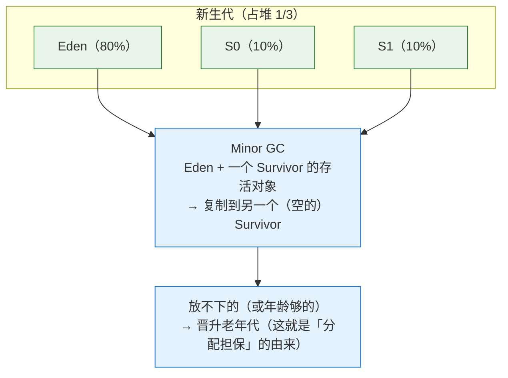

| 维度 | 评价 |
|---|---|
| 优点 1 | **无碎片**，分配走指针碰撞，速度极快 |
| 优点 2 | 回收成本 ∝ **存活对象数量**（新生代存活少 → 极便宜） |
| 缺点 1 | 需要一块空的 to-space（Appel 式把浪费压到 10%） |
| 缺点 2 | 存活率高时复制成本爆炸（所以老年代不能用） |
| 代表 | Serial、ParNew、Parallel Scavenge 的新生代；G1 的 Region 之间复制 |

### 3.3 标记-整理（Mark-Compact）

```
标记 → 把所有存活对象向内存一端移动（滑动整理）→ 直接清理边界以外的内存
```

| 维度 | 评价 |
|---|---|
| 优点 | 无碎片 + 空间利用率 100% |
| 缺点 | 移动对象后必须**更新所有指向它的引用**（需要 STW，且暂停时间与对象数量、引用数量相关） |
| 变体 | "和稀泥"式：先标记-清除，碎片多了再做一次整理（CMS 的 Full GC 就是这么干的） |
| 代表 | Serial Old、Parallel Old；G1 的 Region **内部**整理 |

### 3.4 三种算法对比（必答表）

| 维度 | 标记-清除 | 标记-复制 | 标记-整理 |
|---|---|---|---|
| 是否移动对象 | 否 | 是 | 是 |
| 内存碎片 | **有** | 无 | 无 |
| 空间利用率 | 高 | Appel 式约 90% | 100% |
| 分配速度 | 慢（空闲列表） | **快**（指针碰撞） | **快**（指针碰撞） |
| 回收成本正比于 | 堆中对象总数 | 存活对象数 | 存活对象数 + 引用数 |
| STW 压力 | 中 | 小（新生代） | 大（要改所有引用） |
| 典型使用者 | CMS 老年代 | 新生代、G1 Region 间 | Serial Old / Parallel Old、G1 Region 内 |

### 3.5 为什么新生代用复制

1. 弱分代假说成立时，新生代一次 GC 的存活率通常远低于 10% → **复制成本极低**；
2. 复制天然完成整理 → 分配可以走指针碰撞，`new` 变成"指针加法"，这对分配极其频繁的新生代是决定性的；
3. Appel 式回收（Eden + 两个小 Survivor）把空间浪费压到 10%，而不是 50%；
4. 代价是需要**分配担保**：如果某次 GC 存活对象太多、to-space 装不下，就依赖老年代兜底（`-XX:PretenureSizeThreshold` 之外，还有动态年龄判定与空间分配担保，见 [[1-JVM内存区域与对象布局]] §11）。

> [!note] Appel 式回收的补充
> "Appel 式"指的是 Andrew Appel 在 1989 年提出的改进：把新生代分成一个大的 Eden 和两个小的 Survivor，而不是等分两块。这样既保留复制的优点，又把空间浪费从 50% 降到约 10%。HotSpot 的 8:1:1 就是这个思路（`-XX:SurvivorRatio=8`）。

---

## 四、三色标记法与漏标问题（重点，面试高频）

### 4.1 三色定义与标记过程

| 颜色 | 含义 |
|---|---|
| **白色** | 还没有被访问过。标记结束时仍为白色 = **不可达 = 垃圾** |
| **灰色** | 自己被访问过，但它引用的对象还没全部扫描完（在待处理队列里） |
| **黑色** | 自己及它引用的所有对象都已扫描完（安全存活） |

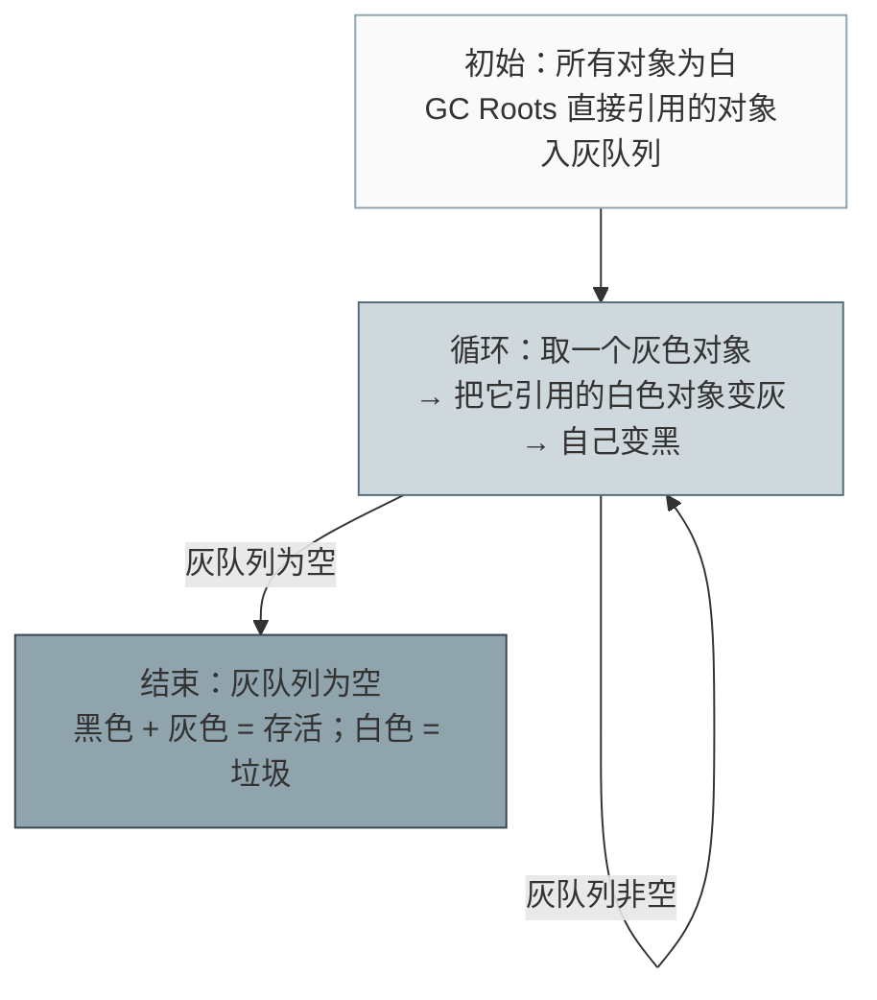

### 4.2 并发标记带来的两类问题

并发标记（用户线程与 GC 线程同时跑）时，用户线程会不断改引用，产生两种不良后果：

| 后果 | 描述 | 严重性 |
|---|---|---|
| **浮动垃圾（Floating Garbage）** | 标记期间新产生的垃圾被当成存活（本轮不回收） | 可接受，下次再收 |
| **对象消失 / 漏标（Missing Mark）** | 实际上是存活的对象被标成白色 → **被回收** | **灾难性**：程序访问已释放内存，行为未定义（可能 crash、可能数据错乱） |

**所以 GC 的设计目标是：宁可多留浮动垃圾，绝不允许漏标。**

### 4.3 漏标的两个必要条件（必须同时满足）

> [!important] 面试的"标准答法"
> 对象消失（漏标）必须**同时**满足：
> 1. **赋值器插入了一条或多条从黑色对象到白色对象的新引用**；
> 2. **赋值器删除了全部从灰色对象到该白色对象的直接或间接引用**。
>
> 破坏其中任意一条，漏标就不会发生。两种解决方案就是分别破坏这两个条件：
> - **增量更新（Incremental Update）**：破坏条件 1 —— 记录黑色对象新增的引用，重新标记时以这些黑色对象为根重扫（**CMS 用**）；
> - **原始快照（SATB, Snapshot At The Beginning）**：破坏条件 2 —— 记录灰色对象被删除的旧引用，重新标记时以这些旧引用指向的对象为根重扫（**G1、Shenandoah 用**）。

下面用一个例子把两个条件讲透：

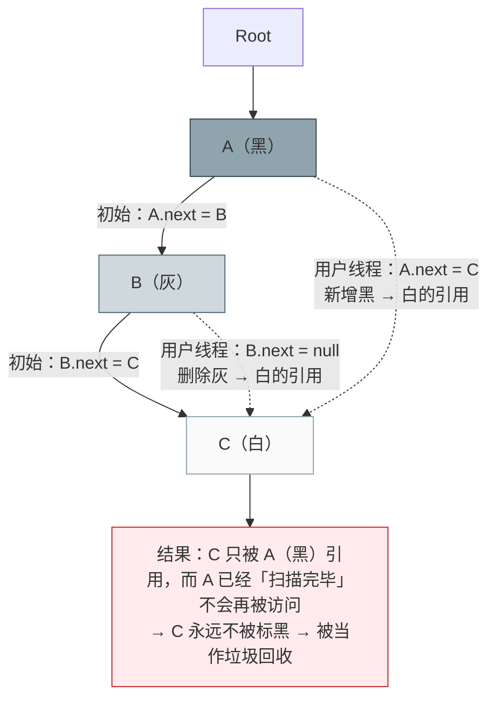

### 4.4 增量更新（Incremental Update）：CMS 的选择

- **何时记录**：**写后屏障（post-write barrier）**。当发生"黑色对象 → 白色对象"的引用写入时，把**这个黑色对象**（或它所在的卡）记录下来。
- **重新标记阶段怎么做**：把这些"新增了引用的黑色对象"重新当作灰色对象入队，重新扫描它们的引用链 → C 被重新标记为存活。
- **HotSpot 实现**：CMS 用 **Mod Union Table**（mod-union table）记录并发标记期间被标脏的卡，重新标记阶段以卡为单位重扫，从而不必重扫整个老年代。

### 4.5 原始快照 SATB：G1 的选择

- **何时记录**：**写前屏障（pre-write barrier）**。当发生引用**被覆盖/删除**时，把**被删除的旧引用**写入线程私有的 SATB 缓冲区（`-XX:G1SATBBufferSize` 实测默认 1024；缓冲区满或达到入队阈值 `-XX:G1SATBBufferEnqueueingThresholdPercent` 时批量入全局队列）。
- **重新标记阶段怎么做**：把 SATB 队列中记录的旧引用指向的对象当作存活（**按"标记开始时"的对象图快照**来算），并继续扫描它们 → C 被标记为存活。
- **代价**：在标记开始之后**已经死亡**的对象，只要其引用曾被记录，就会一直活到本轮结束 → **SATB 产生的浮动垃圾比增量更新多**。

### 4.6 两种方案对比与"为什么 CMS/G1 选得不一样"

| 维度 | 增量更新（CMS） | 原始快照 SATB（G1） |
|---|---|---|
| 破坏的漏标条件 | 条件 1（黑→白新引用） | 条件 2（灰→白旧引用被删） |
| 屏障类型 | **写后屏障** | **写前屏障** |
| 记录内容 | 新引用（谁指向了白） | 旧引用（谁曾经指向它） |
| 重新标记的工作量 | 与"并发标记期间被修改的黑色对象/脏卡"相关，可能较大且不易预估 | 与 SATB 缓冲区大小相关，**可预估、可并行** |
| 浮动垃圾 | 较少（更精确） | 较多（按快照保守处理） |
| 额外成本 | 需要 Mod Union Table 等结构 | 需要 SATB 缓冲区（内存 + 入队开销） |
| 使用者 | CMS | G1、Shenandoah；ZGC 靠**染色指针 + 读屏障**保证不漏标，不走 SATB 路线 |

**为什么 CMS 与 G1 选择不同？** 本质是**工程取舍**，可以从"收集器的目标"来解释：

- **CMS 是"标记-清除"、没有整理能力**，浮动垃圾会加速老年代填满，进而引发 `Concurrent Mode Failure`（退化为单线程 Serial Old Full GC，停顿极长）。所以 CMS 倾向**更精确地标记**（增量更新浮动垃圾少），并且它本来就有卡表/mod-union table 可复用，重扫脏卡的成本可以接受。
- **G1 是"停顿可预测"驱动的收集器**：并发标记周期必须能与 Young GC 交错执行，重新标记（Remark）必须**短且可预估**。SATB 只需处理固定大小的缓冲区，符合这个目标；G1 也愿意接受更多浮动垃圾，因为它后面还有多次 Mixed GC 可以慢慢收。
- 还有一层实现上的互补：**G1 的写前屏障负责 SATB 记录，写后屏障负责维护 RSet**（记忆集），两件事分摊在两个屏障里；CMS 的写后屏障主要服务于卡表与增量更新。

> [!question] 追问："漏标会不会导致崩溃？"
> 会。漏标 = 存活对象被回收 → 之后程序访问这块内存，可能读到已被其他对象覆盖的数据（表现为"随机的诡异 bug"）或直接 SIGSEGV。这也是为什么所有并发收集器都必须用屏障严格保证不漏标，而浮动垃圾只是"效率问题"。

---

## 五、记忆集与卡表

### 5.1 跨代引用问题回顾

- 场景：老年代对象 `old` 的字段指向新生代对象 `young`；
- Minor GC 只回收新生代。如果只看"新生代内部的引用"，`young` 看起来不可达 → **被误回收**；
- 全堆扫描老年代 → 分代失效；
- 解法：**记忆集（Remembered Set）**记录"从非收集区域指向收集区域的指针"。

### 5.2 卡表（Card Table）：HotSpot 的记忆集实现

```
堆
┌────┬────┬────┬────┬────┬────┬────┬────┐
│ 卡 │ 卡 │ 卡 │ 卡 │ 卡 │ 卡 │ 卡 │ 卡 │   每张卡 = 512 字节（2^9）
└────┴────┴────┴────┴────┴────┴────┴────┘
  ↑          ↑
干净(0)     脏(1)  ← 卡表（字节数组）：card_table[addr >> 9]
```

| 要点 | 说明 |
|---|---|
| 卡页大小 | **512 字节**（`1 << 9`），这是 HotSpot 的实现选择 |
| 卡表结构 | 字节数组，索引 = 对象地址右移 9 位；元素 0 表示干净，1 表示脏 |
| 标脏粒度 | **卡精度**（记忆集还有"字长精度""对象精度"两种，粒度越细越精确但开销越大） |
| Minor GC 时怎么用 | 把 **GC Roots** + **脏卡范围内的对象**一起加入扫描起点，再顺着它们的引用找到新生代对象 |
| 伪脏 | 卡内只要**有任何**跨代引用（或任何引用写入）就整张卡标脏 → 扫描时会多扫一些无关对象（可接受） |

### 5.3 写屏障（Write Barrier）：谁把卡标脏

引用赋值是字节码/机器码层面的操作，JVM 在编译时**插桩**（AOP 思想）加入维护逻辑：

```c
// 写后屏障（post-write barrier）：最常见的形态
void oop_field_store(oop* field, oop new_value) {
    *field = new_value;                         // 真正的赋值
    post_write_barrier(field, new_value);        // 逻辑上：card_table[(uintptr_t)field >> 9] = dirty
}
```

| 屏障类型 | 时机 | 记录什么 | 用途 |
|---|---|---|---|
| **写后屏障** post-write | 赋值**之后** | 新值（或字段所在卡） | 维护卡表/记忆集；增量更新 |
| **写前屏障** pre-write | 赋值**之前** | 旧值 | SATB（G1 等） |

三个实现细节：

1. **伪共享（False Sharing）**：卡表元素是字节，多个线程并发更新相邻的卡 → 同一个 cache line 被反复置脏，缓存行在核心间来回弹跳。缓解：`-XX:+UseCondCardMark`（先读一次判断是否已脏，再去写），代价是多一次读。
2. **减少不必要的屏障**：给**新建对象**的字段赋值时，不需要维护卡表（新对象在新生代，引用它的也是新生代对象）→ C2 用 `-XX:+ReduceInitialCardMarks`（默认开）跳过这类屏障。这也是"短路与"式优化，能显著降低分配密集程序的写屏障开销。
3. **写屏障是无条件的**：JVM 不会每次判断"这次赋值是不是真的跨代"（太贵），而是"先标脏，扫的时候再过滤"——所以卡表里会有伪脏卡。

### 5.4 G1 的 RSet 与卡表的关系

G1 把堆切成 Region，跨 Region 引用就是"跨代引用"的一般化。G1 的记忆集是 **RSet（Remembered Set）**，每个 Region 一份：

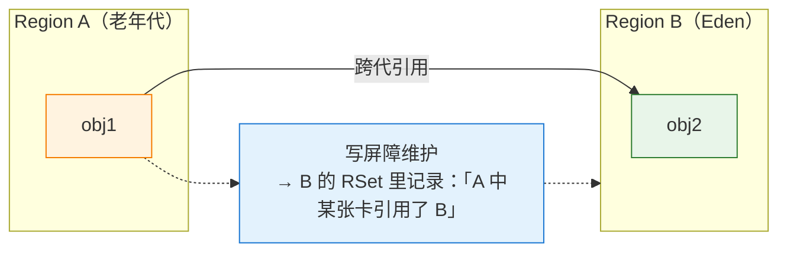

| 问题 | 答案 |
|---|---|
| RSet 记录什么方向？ | **points-into**：记录"谁引用了我"，每个 Region 一份 |
| 粒度 | 分层结构：稀疏时用哈希表（sparse PRT）→ 稠密时用卡数组（fine PRT）→ 更稠密时用位图（coarse PRT） |
| 与全局卡表的关系 | G1 仍有**全局卡表**（写后屏障统一标脏）；RSet 是"按 Region 归属整理的索引"，底层依赖卡表 + 写屏障维护，上层的分层结构是为了省内存 |
| 为什么需要它 | 回收 CSet（回收集合）里的 Region 时，必须快速找到"从其他 Region 指向它"的引用，否则要扫全堆 |
| 怎么用 | Young GC / Mixed GC 时，CSet 中 Region 的 RSet 被当作**根集合的一部分**扫描 |
| 代价 | RSet 自身占用内存（引用关系越"乱"开销越大）、维护需要写屏障（`Update RS`/`Scan RS` 会出现在 GC 日志里） |

> [!tip] 一句话区分
> **卡表**是"堆地址 → 脏位"的全局字节数组，粗粒度、便宜；
> **RSet** 是"每个 Region → 谁指向我"的索引，细粒度、贵，但让 G1 能只扫必要的 Region。
> 二者不是替代关系，是**同一套写屏障支撑下的两层结构**。

---

## 六、安全点与安全区域

### 6.1 为什么需要 STW 与安全点

- STW 的必要性：可达性分析必须基于**冻结的引用关系**；且 OopMap 只在特定位置有效。
- 但线程不能"想停就停"：如果停在一条指令中间，寄存器和栈上的引用状态无法被 OopMap 描述。
- **安全点（Safepoint）**：程序中一些"状态明确、可以被 GC 安全暂停"的位置。所有线程都跑到安全点后，GC 才能开始。

### 6.2 主动式中断与轮询页

HotSpot 采用**主动式中断（Voluntary/Active Interruption）**：

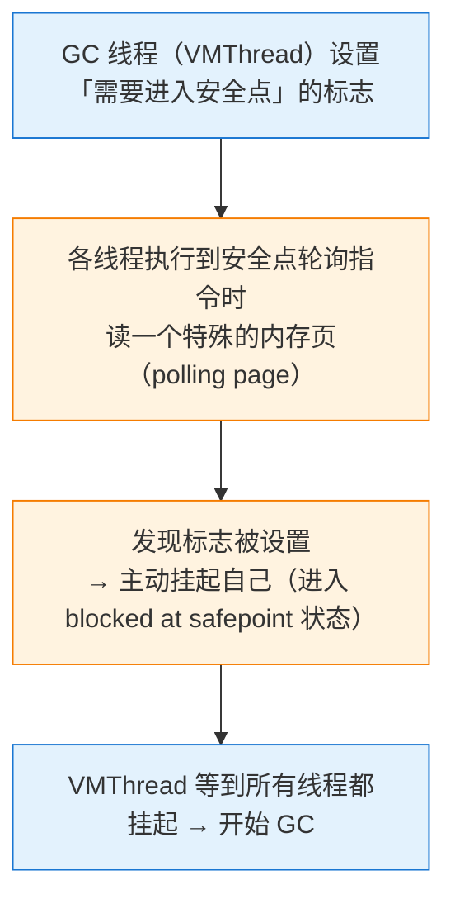

- 用内存页保护（page fault / 只读映射）实现轮询，比每条指令都判断标志便宜得多。
- 抢占式（发信号强行中断）在现代 HotSpot 中不再使用：无法保证被中断的线程处于可被 OopMap 描述的状态。

### 6.3 哪些位置会插入安全点

| 位置 | 说明 |
|---|---|
| **方法调用**（`invoke*`）前 | 最常见的安全点来源 |
| **循环回边**（backedge） | 防止循环内长时间不经过安全点；但**可数循环（counted loop）曾是例外**，见 6.4 |
| **异常抛出/跳转** | 异常路径也插桩 |
| **方法返回前** | 保证返回时状态一致 |
| 解释执行 | 字节码分发机制天然可停顿，解释器执行时更容易进入安全点 |

### 6.4 长循环不触发安全点：一个真实的"STW 异常"

```java
// 纯计算的长循环：中间没有任何方法调用，也不分配对象
public static long hotLoop() {
    long sum = 0;
    for (int i = 0; i < Integer.MAX_VALUE; i++) {   // 可数循环
        sum += i;
    }
    return sum;
}
```

- **JDK 8**（以及更早）：C2 对 `int`/`long` 计数的**可数循环**做过"循环优化"，循环体内可能**完全没有安全点**。此时其他线程都到了安全点，就差这一个线程，GC 必须一直等 → **一次 GC 的 STW 时间被这个循环拖到几百毫秒甚至几秒**。
  JDK 8 提供了 `-XX:+UseCountedLoopSafepoints` 来缓解（**该开关在 JDK 8 上默认关闭**，请用 `-XX:+PrintFlagsFinal` 确认你的版本）。
- **JDK 10 起**：C2 引入 **loop strip mining（循环条带挖掘）**（[JDK-8186027](https://bugs.openjdk.org/browse/JDK-8186027)），把长循环切成多段，每段末尾插入安全点轮询；`-XX:+UseCountedLoopSafepoints` 默认变为 **true**（本机 JDK 17 实测 true）。在 JDK 17 上运行同一段代码，安全点等待通常只有微秒~毫秒级。

> [!example] 为什么这个知识点在实战中价值极高
> 现象：升级 JDK（8 → 11/17）后，监控上"GC 停顿时间"指标发生突变（有的团队是变好，有的是 GC 日志里的 `real` 时间变化）。
> 原因：**停顿时间 = 到达安全点的时间 + GC 实际工作时间**。JVM 版本变了，安全点插入策略也变了，所以"同样一份代码、同样的 GC 参数，停顿曲线完全不同"。
> 排查时不要只盯着堆参数，先看 `-Xlog:safepoint` / `-XX:+PrintGCApplicationStoppedTime` 里"到达安全点"占了多少。

### 6.5 安全区域（Safe Region）

**问题**：处于 `Thread.sleep()`、等待锁、等待 IO、JNI 调用中的线程根本走不到安全点，它们会导致 GC 永远等不到"全员到齐"。

**解法：安全区域**——一段"引用关系不会发生变化"的代码区间。

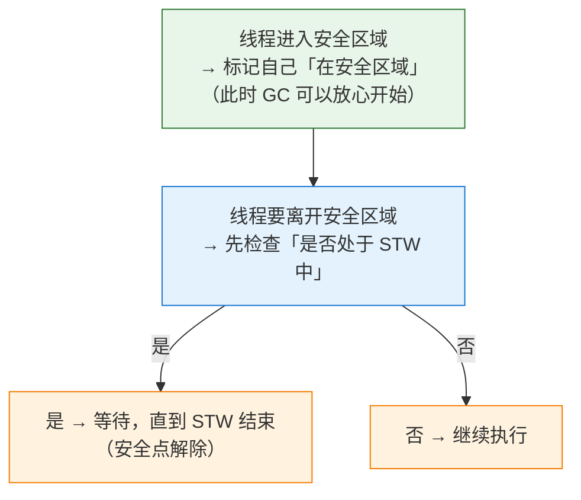

典型的安全区域：`Thread.sleep`、`Object.wait`、阻塞 IO 的等待期。这也是"GC 日志中 STW 时间往往大于 GC 本身工作时间"的一个次要来源。

### 6.6 "到达安全点的时间" vs GC 工作时间

| 观测手段 | 版本 | 输出内容 |
|---|---|---|
| `-XX:+PrintGCApplicationStoppedTime` | JDK 8 | 总的应用停顿时间（含安全点等待） |
| `-XX:+PrintSafepointStatistics -XX:PrintSafepointStatisticsCount=1` | JDK 8（需 `-XX:+UnlockDiagnosticVMOptions`） | 每个 VM 操作的 `time to safepoint` / `at safepoint`（示意）：

```
          vmop                    [threads: total initially_running wait_to_block]    [time: spin block sync cleanup vmop] page_trap_count
12.345: GenCollectForAllocation  [     28          0              2    ]          [     0     0     2     0   10    ]  0
         ↑ 操作名                 ↑ 线程数：总数/初始运行中/等待阻塞   ↑ spin/block/sync/cleanup/vmop 各阶段耗时(ms)
```

| `-Xlog:safepoint=info` | JDK 9+ | 统一日志格式（示意）：

```
[12.345s][info][safepoint] Safepoint "CollectGarbage", Time since last: 1234567890 ns, Reaching safepoint: 456789 ns, At safepoint: 12345678 ns, Total: 12802457 ns
                                    ↑ 操作名            ↑ 距上次停顿      ↑ 到达安全点耗时   ↑ GC 实际耗时   ↑ 总停顿
```

| `jdk.SafepointBegin` / `jdk.SafepointEnd`（JFR） | JDK 11+ | 可观测"到达安全点"的分布（P99/max），适合长期监控 |

必须记住的结论：

1. **GC 日志里的 `real` 时间 ≠ GC 算法的耗时**，它包含安全点同步（到达安全点的等待）与恢复。
2. 常见"到达安全点很慢"的原因：长计数循环（老版本）、**大量线程**（线程越多，召集越慢）、线程在 JNI/native 中长时间不返回、`-Xss` 很大导致线程切换慢。
3. **JDK 15 之前，偏向锁撤销（RevokeBias）本身是一个 VM 操作**，需要在安全点执行；高竞争场景下频繁撤销偏向锁会带来额外的 STW。JDK 15 起偏向锁默认关闭（JEP 374），JDK 18 移除相关开关，这个问题自然消失。
4. **`jstack`（`Thread.print`）也会触发安全点**：生产环境频繁抓线程栈（比如每 10 秒一次的监控脚本）会引入周期性 STW，需要评估。

---

## 七、收集器逐个深入（算法级）

### 7.0 收集器总表（先给地图）

| 收集器 | 分代 | 算法 | 并发性 | 停顿 | 版本状态 | 关键参数 | 适用场景 |
|---|---|---|---|---|---|---|---|
| **Serial** | 新生代 | 标记-复制 | 单线程 STW | 长 | 始终可用 | `-XX:+UseSerialGC` | 客户端、单核、小堆（几百 MB） |
| **Serial Old** | 老年代 | 标记-整理 | 单线程 STW | 长 | 始终可用；也是 CMS 的兜底 | 同上 | 同上 |
| **ParNew** | 新生代 | 标记-复制 | 多线程 STW | 中 | **JDK 14 起随 CMS 移除**（JDK 17 上 `-XX:+UseParNewGC` 直接报 `Unrecognized VM option`，已实测确认） | 历史参数 `-XX:+UseParNewGC` | 历史：为 CMS 提供新生代回收 |
| **Parallel Scavenge** | 新生代 | 标记-复制 | 多线程 STW | 中 | JDK 8 server 默认组合的一半 | `-XX:+UseParallelGC` | 吞吐优先、批处理/离线 |
| **Parallel Old** | 老年代 | 标记-整理 | 多线程 STW | 中 | 同上 | 同上（`-XX:+UseParallelOldGC` 在新版本已移除） | 同上 |
| **CMS** | 老年代 | 标记-清除（并发） | 并发 | 低（但会退化） | JDK 9 弃用（JEP 291）、**JDK 14 移除**（JEP 363） | `CMSInitiatingOccupancyFraction` 等 | 历史：低延迟 |
| **G1** | 全堆（Region，逻辑分代） | 整体标记-整理 + 局部标记-复制 | 并发 | **可预测**（默认目标 200ms） | JDK 7 引入、**JDK 9 起默认**（JEP 248） | `MaxGCPauseMillis`、IHOP… | 通用首选（6GB~数十 GB） |
| **ZGC** | 分代（JDK 21+） | 染色指针 + 读屏障，并发标记/转移 | 并发 | **亚毫秒~毫秒级，与堆大小基本无关** | JDK 11 实验（JEP 333）、JDK 15 生产（JEP 377）、JDK 21 分代（JEP 439）、**JDK 23 分代默认**（JEP 474） | `-XX:+UseZGC` | 超大堆（数百 GB~TB）、极致低延迟 |
| **Shenandoah** | 默认单代（JDK 24 实验分代、JDK 25 产品化） | Brooks 指针/LRB + 读屏障，并发压缩 | 并发 | 低 | JDK 12 实验（JEP 189）、JDK 15 生产（JEP 379） | `-XX:+UseShenandoahGC` | 低延迟大堆（Red Hat 系发行版常见） |

### 7.1 Serial / Serial Old

| 维度 | 说明 |
|---|---|
| 算法 | 新生代：标记-复制；老年代：标记-整理 |
| 线程 | **单线程**，GC 时必须停掉所有用户线程 |
| 优点 | 没有线程交互开销、内存占用最小、实现简单；单核/小堆下反而最划算 |
| 缺点 | 堆大时停顿不可接受（单线程 + 全堆整理） |
| 启用 | `-XX:+UseSerialGC`（同时启用 Serial + Serial Old）；JDK 8 客户端模式默认 |
| 实战 | 容器里 **1~2 核 + 1GB 堆**的服务用 Serial 常常比 G1 更稳（G1 的并发线程在核少时反而抢 CPU）。这是"参数选型要看机器"的典型例子 |

### 7.2 ParNew：为 CMS 而生的多线程新生代

- 本质是 **Serial 的多线程版本**（新生代标记-复制，其余行为一致）。
- **它为什么存在**：CMS 是并发的老年代收集器，需要搭配一个"多线程 + 与 CMS 框架兼容"的新生代收集器。Parallel Scavenge 用的是自己的一套框架（自适应的 `ParallelScavengeHeap`/`AdaptiveSizePolicy`，关注吞吐量），**无法与 CMS 搭配**，所以 HotSpot 只能把 Serial 多线程化，做成 ParNew。
- 默认并行线程数：`-XX:ParallelGCThreads`，HotSpot 的规则是
  - CPU 核数 ≤ 8：取核数；
  - CPU 核数 > 8：取 `8 + (核数 - 8) * 5 / 8`。
  本机实测 `ParallelGCThreads = 8`。
- **命运**：JDK 9 随 CMS 一起被弃用，JDK 14 随 CMS 一起被移除（JEP 363 说"移除只与 CMS 相关的选项"，非目标里明确"不打算移除其他收集器"，但 ParNew 只为 CMS 服务，因此一并退出）。**JDK 17 上实测 `-XX:+UseParNewGC` 报 `Unrecognized VM option`。**

### 7.3 Parallel Scavenge / Parallel Old：吞吐量优先

**关注点与其他收集器不同**：其他收集器关注"缩短停顿"，Parallel 关注**吞吐量可控**。

```
吞吐量 = 运行用户代码的时间 / (运行用户代码的时间 + GC 时间)
```

| 参数 | 含义 | 取舍 |
|---|---|---|
| `-XX:MaxGCPauseMillis` | 期望的最大 GC 停顿（毫秒，大于 0） | **不是越小越好**：设得太小 → JVM 缩小新生代以缩短单次停顿 → Minor GC 频率暴增 → 总 GC 时间上升、吞吐下降，甚至"停顿目标"也达不到（因为 GC 次数变多了） |
| `-XX:GCTimeRatio` | 吞吐量目标 = `1 / (1 + GCTimeRatio)` | 默认 **99** → GC 时间占比不超过 **1%**（即吞吐 99%）。适合批处理/离线任务 |
| `-XX:+UseAdaptiveSizePolicy` | 自适应调节（默认 **开**，本机 true） | 根据运行时数据动态调整 Eden/Survivor 比例、新生代大小、晋升年龄阈值，以逼近上面的目标；**一旦手动设置 `-Xmn`/`-XX:SurvivorRatio`/`-XX:MaxTenuringThreshold`，自适应就会被限制/以手动值为准** |

- 自适应调节的观测手段：JDK 8 用 `-XX:+PrintAdaptiveSizePolicy`，新版本用 `-Xlog:gc+ergo=debug` 或 JFR。
- 组合关系：**Parallel Scavenge 不能与 CMS 搭配**；它只能与 Serial Old（早期）或 Parallel Old 搭配。JDK 8 server 模式的经典默认就是 **Parallel Scavenge + Parallel Old**。
- 参数现状：`-XX:+UseParallelGC` 仍然可用（本机 JDK 17 可见），但 `-XX:+UseParallelOldGC` 在新版本已被移除（JDK 17 实测报 `Unrecognized VM option`）。

### 7.4 CMS：四阶段与三大问题

CMS（Concurrent Mark Sweep）是"以最短停顿为目标"的老年代收集器，**新生代仍由一个多线程复制收集器（ParNew）负责**。

#### 7.4.1 四个阶段

| 阶段 | 是否 STW | 做什么 | 备注 |
|---|---|---|---|
| **① 初始标记**（Initial Mark） | **是** | 只标记 GC Roots **直接关联**的对象 | 很快（对象少） |
| **② 并发标记**（Concurrent Mark） | 否 | 从①的对象出发遍历整个对象图 | **最耗时**，与用户线程并发，同时用**增量更新**保护漏标 |
| **③ 重新标记**（Remark） | **是** | 修正②期间因用户线程继续运行而产生的变动（重扫黑色对象新增的引用 / mod-union table 中脏卡的对象） | 比①长、比②短 |
| **④ 并发清除**（Concurrent Sweep） | 否 | 清除不可达对象 | 与用户线程并发；**不移动对象**，所以只能标记-清除 |

> [!question] 为什么"并发标记"会拖长总时长却不影响停顿？
> 并发标记本身不 STW，但它**占用 CPU**。默认并发线程数 ≈ `(ParallelGCThreads + 3) / 4`（书上常写 `(CPU 核数 + 3) / 4`）。本机 `ParallelGCThreads = 8` → `ConcGCThreads = 2`（实测吻合）。核数少的机器上，这 1/4 的 CPU 被 GC 抢走，业务吞吐直接下降。

#### 7.4.2 三大问题

| 问题 | 表现 | 根因 | 缓解手段 |
|---|---|---|---|
| **① 对 CPU 资源敏感** | 并发阶段业务 RT 抖动、吞吐下降 | 并发标记/清除占用 CPU；线程数少时抢占更明显 | 评估核数；`-XX:ConcGCThreads` 调整；不要把关键服务放在 2 核机器上跑 CMS |
| **② 无法处理浮动垃圾** | 老年代提前被填满，触发并发模式失败 | ④阶段清理时用户线程还在产生垃圾，只能下轮回收 → 必须**预留空间**提前启动 GC | `-XX:CMSInitiatingOccupancyFraction`（JDK 6+ 默认 **92**；JDK 5 是 68）+ `-XX:+UseCMSInitiatingOccupancyOnly`（只用设定值，不做动态调整）；**Concurrent Mode Failure** 时会退化为 Serial Old 做 Full GC（单线程、整理、停顿极长） |
| **③ 大量空间碎片** | 大对象分配失败 → 提前 Full GC | 标记-清除不移动对象 | `-XX:+UseCMSCompactAtFullCollection`（Full GC 时整理，JDK 8 默认开）；`-XX:CMSFullGCsBeforeCompaction`（默认 0，表示每次 Full GC 都整理）；根本上还是换收集器 |

**Concurrent Mode Failure 的完整剧情**：

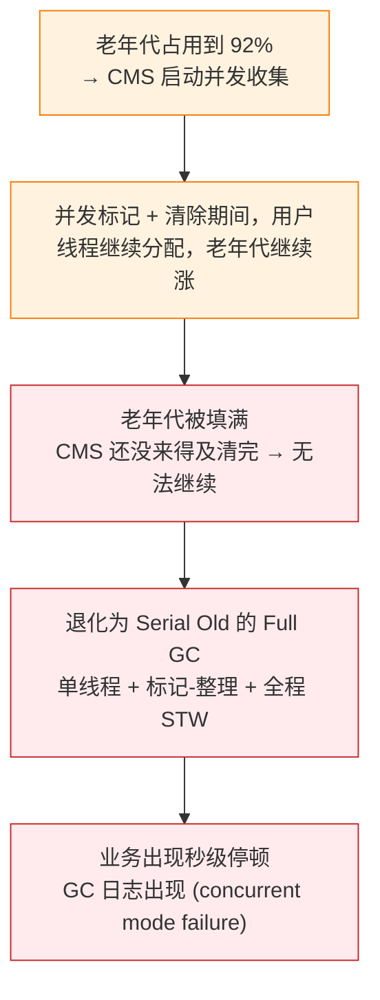

#### 7.4.3 其他关键参数

| 参数 | 作用 |
|---|---|
| `-XX:CMSScavengeBeforeRemark` | 在重新标记**之前**先做一次 Minor GC，减少重新标记需要扫描的年轻代对象 → 缩短 Remark 停顿；代价是多一次 Minor GC 停顿 |
| `-XX:+ExplicitGCInvokesConcurrent` | 让 `System.gc()` 走并发收集，而不是 Full GC（与堆外内存回收配合使用，见 [[1-JVM内存区域与对象布局]] §6.4） |
| `-XX:+CMSParallelInitialMarkEnabled` / `-XX:+CMSParallelRemarkEnabled` | 初始标记/重新标记并行化（缩短 STW） |
| `-XX:ConcGCThreads` | 并发阶段线程数 |

#### 7.4.4 为什么被废弃 / 移除

- **JEP 291（JDK 9）**：弃用 CMS，为其他收集器让路；
- **JEP 363（JDK 14）**：正式移除。JEP 的理由是"在此期间没有任何可信的贡献者接手维护 CMS"，而 G1（自 JDK 6 起就是 CMS 的既定继任者）、ZGC、Shenandoah 的成熟度已经足够；
- 迁移路径：**G1 是 CMS 的官方继任者**，绝大多数场景可以直接切；对停顿敏感的超大堆场景用 ZGC/Shenandoah。切过去时注意：`-Xmn`、`CMSInitiatingOccupancyFraction` 这类参数在 G1 上语义不同（用 IHOP 代替），见 [[6-JVM参数与调优实战]]。

### 7.5 G1：Region + RSet + SATB + Mixed GC

#### 7.5.1 Region 与 Humongous

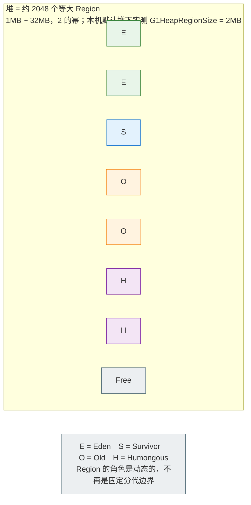

| 概念 | 规则 |
|---|---|
| `-XX:G1HeapRegionSize` | 默认由堆大小推算，**目标是把堆分成约 2048 个 Region**，取值 1MB~32MB 且为 2 的幂 |
| **Humongous（大对象）** | 对象大小 ≥ **Region 的 50%**；若超过一个 Region，会占用**连续的多个 Region** |
| Humongous 的分配位置 | 直接在**老年代**的 Humongous Region 中分配 |
| Humongous 何时被回收 | **Young GC 不回收 Humongous**；要等并发标记周期结束后的 Cleanup/Mixed GC，或者 Full GC → 短命的大对象会迅速把老年代撑起来，这是 G1 最常见的性能陷阱 |
| 找不到连续 Region 时 | 触发并发标记周期，甚至直接 Full GC |

#### 7.5.2 可预测停顿模型（G1 的核心卖点）

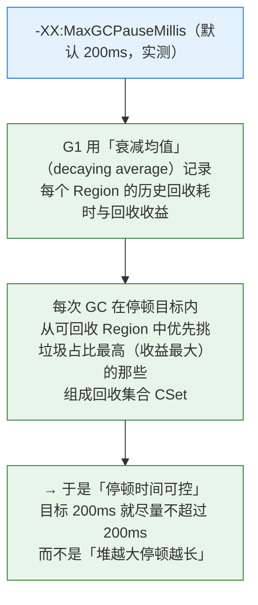

关键理解：
- G1 的可预测性来自**"只回收一部分 Region"**（不像 Parallel Old 那样每次整理整个老年代）；
- 它不是"硬实时保证"：如果**存活对象太多**（垃圾太少），一次疏散也可能超出目标；`MaxGCPauseMillis` 是**软目标**；
- 目标设得过小（比如 20ms）→ 每次只能回收很少的 Region → GC 频率上升、吞吐下降，甚至出现"目标达不到反而更差"。

#### 7.5.3 完整流程：Young GC / 并发标记 / Mixed GC / Full GC

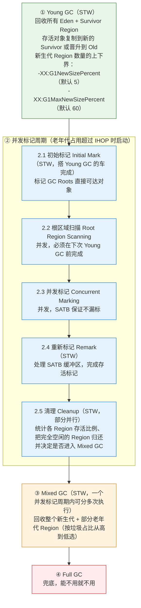

| 关键参数 | 默认 | 作用 |
|---|---|---|
| `-XX:InitiatingHeapOccupancyPercent`（IHOP） | **45**（实测） | 老年代占用达到**整堆**的 45% 时启动并发标记。注意分母是整个堆，不是老年代容量 |
| `-XX:+G1UseAdaptiveIHOP` | **true**（实测） | JDK 9+ 引入：根据实际晋升速率动态决定触发时机，比固定阈值更稳。JDK 8 上是固定 IHOP |
| `-XX:G1HeapWastePercent` | **5**（实测） | 可回收垃圾占总堆比例低于 5% 时**停止** Mixed GC（不值得再收） |
| `-XX:G1MixedGCLiveThresholdPercent` | **85**（实测，experimental） | 存活率高于 85% 的老年代 Region **不回收**（复制成本太高，收益太低） |
| `-XX:G1MixedGCCountTarget` | **8**（实测） | 一个并发标记周期的 Mixed GC **分成几次**做完，避免单次停顿过长 |
| `-XX:G1ReservePercent` | **10**（实测） | 预留空间，防止疏散时找不到 to-space（evacuation failure） |
| `-XX:G1SATBBufferSize` | **1024**（实测） | 每个线程的 SATB 缓冲区大小（SATB 实现细节） |

#### 7.5.4 G1 的 Full GC 何时发生，怎么避免

| 触发原因 | 日志特征（示意） | 根因 | 手段 |
|---|---|---|---|
| **疏散失败**（to-space exhausted） | `[Full GC (Allocation Failure)]` 前出现 `to-space exhausted` | Young/Mixed GC 时没有空闲 Region 容纳复制目标（存活对象太多或预留不足） | 调大 `-XX:G1ReservePercent`、增大堆、降低晋升速率 |
| **Humongous 分配失败** | `[Full GC (G1 Humongous Allocation)]` / 日志里 `Humongous regions` 持续增长 | 找不到连续 Region 放下大对象 | 增大 `-XX:G1HeapRegionSize`、减少大对象（分块/压缩/用堆外） |
| **并发标记来不及** | `[Full GC (Allocation Failure)]` 且老年代涨得很快 | IHOP 太高 / 晋升太快 → 标记没结束老年代就满了 | 降低 IHOP 或依赖自适应、解决晋升过快 |
| **显式 GC / 元空间** | `(System.gc())` / `(Metadata GC Threshold)` | 框架调用；元空间高水位 | `-XX:+ExplicitGCInvokesConcurrent`；元空间问题见 [[1-JVM内存区域与对象布局]] §4 |
| 版本差异 | JDK 10 之前 G1 的 Full GC 是**单线程**的（停顿极长） | —— | JDK 10 起 Full GC 并行化（JEP 307），升级能显著缓解"偶发秒级停顿" |

#### 7.5.5 为什么 G1 下不该手动设 `-Xmn`

1. G1 的新生代大小由**停顿目标驱动自适应**（在 `G1NewSizePercent` 5% ~ `G1MaxNewSizePercent` 60% 之间浮动）；
2. 显式设 `-Xmn`（或 `-XX:NewRatio`）会把新生代固定住 → Young GC 频率、晋升速率、老年代增长速度全部失控，**停顿目标失效**；
3. 正确做法：用 `-XX:MaxGCPauseMillis` 表达目标，用 `G1NewSizePercent`/`G1MaxNewSizePercent` 约束范围，让 G1 自己决定。

### 7.6 ZGC：染色指针 + 读屏障

#### 7.6.1 染色指针（Colored Pointers）

普通 64 位指针只表示地址；ZGC 把几个位借来表示**对象的标记状态**（Marked0 / Marked1 / Remapped / Finalizable 等视图位）：

```
64 位指针
┌────────────┬─────────────────────────────────────────────┐
│ 视图标记位  │            对象地址（对齐后，低位可用）        │
└────────────┴─────────────────────────────────────────────┘
   ↑ 这些位让"指针本身携带状态" → 不必去对象头里找标记
```

带来三个好处：

1. **标记信息与对象解耦**：不需要在对象头里放标记位，也不需要"标记位图与对象头的一致性"维护；
2. **支持并发转移（Relocation）**：对象被移动后，旧指针颜色是"过期视图"，新指针是"当前视图"，靠颜色区分新旧地址；
3. **自愈（Self-healing）**：读屏障修正一次后，可以把修正后的地址写回引用字段，后续访问不再走慢路径。

#### 7.6.2 读屏障（Load Barrier）

ZGC 在**从堆中读取引用**的地方插入检查：指针颜色是否是"当前视图"？

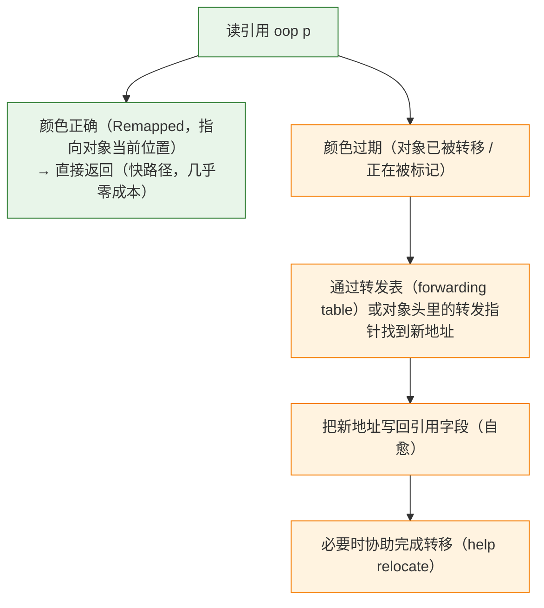

要点：
- 读屏障的**快路径只是一次位比较**，慢路径只有在"遇到未修正引用"时才发生；
- 代价是**每条读取引用的指令都要检查**（相比 G1 的写屏障，读操作远多于写操作）→ ZGC 用 CPU 换停顿；
- 与 SATB 的区别：ZGC **不需要写前屏障记录旧引用**，它靠"读屏障 + 染色指针"保证任何被使用的对象都会被正确标记/转移。

#### 7.6.3 阶段与"停顿与堆大小无关"

| 阶段 | STW? | 说明 |
|---|---|---|
| Pause Mark Start（初始标记） | **是** | 标记 GC Roots 直接可达对象（时间与**根数量**相关，与堆大小无关） |
| Concurrent Mark | 否 | 并发遍历对象图 |
| Pause Mark End（再标记） | **是** | 处理标记收尾（时间很短） |
| Concurrent Prepare for Relocate | 否 | 选出本轮要转移的 Region |
| Pause Relocate Start（初始转移） | **是** | 转移根集合直接引用的对象 |
| Concurrent Relocate | 否 | 并发移动对象（读屏障保证访问正确） |
| Concurrent Remap | 否 | 修正剩余引用（常与下一轮标记合并） |

**为什么停顿与堆大小基本无关**：标记、转移、重映射**全部并发**，STW 阶段只处理"根集合直接引用"这一小块工作，其规模取决于**根的数量与线程数**，而不是堆里对象的总量（堆越大只是并发阶段跑得更久，停顿不变）。这也是 ZGC 与 G1 最本质的区别：G1 的停顿取决于"这次要回收多少 Region / 复制多少对象"，ZGC 的停顿与堆规模解耦。

停顿目标：`-XX:MaxGCPauseMillis`。ZGC 的设计目标是**毫秒级停顿**（JEP 333 的验收标准是"停顿时间不超过 10ms"）。该参数在不同版本里的语义与默认值有演进（本机 JDK 17 上 `MaxGCPauseMillis` 默认 200），**调优前务必用 `-XX:+PrintFlagsFinal` 确认你所用版本的实际语义**。

#### 7.6.4 代价（面试常问"ZGC 有什么缺点"）

| 代价 | 说明 |
|---|---|
| 只支持 64 位 | 染色指针需要借用指针高位，32 位平台不支持 |
| **与压缩指针不兼容** | ZGC 下 `UseCompressedOops`/`UseCompressedClassPointers` 被禁用 → 引用占 8 字节，内存占用上升（与 [[1-JVM内存区域与对象布局]] §9.4 的"32GB 门槛"是同一类权衡） |
| 需要多视图映射 | 同一段物理内存映射到多个虚拟地址（multi-mapping），Linux 上要确认 `vm.max_map_count` 足够大，否则 ZGC 可能启动失败 |
| 读屏障的 CPU 开销 | 每次读引用都有检查成本，典型吞吐低于 G1（用 CPU 换停顿） |
| 额外内存 | 转发表、标记位图、多份虚拟映射 |
| 需要 CPU 余量 | 并发阶段与业务线程抢 CPU，低核数机器上可能得不偿失 |
| 工具链/日志 | 日志格式、JFR 事件、诊断工具对 ZGC 的支持随版本完善，升级前确认可观测性 |

#### 7.6.5 分代 ZGC 与选型

| 版本 | 事件 |
|---|---|
| JDK 11 | JEP 333：ZGC 实验性引入 |
| JDK 15 | JEP 377：ZGC 成为产品特性 |
| **JDK 21** | **JEP 439：Generational ZGC**（用 `-XX:+ZGenerational` 开启分代模式） |
| **JDK 23** | **JEP 474：分代 ZGC 成为默认**，非分代模式被弃用（`-XX:-ZGenerational` 仍可切换，但会打印弃用警告） |
| 后续版本 | JEP 490：移除非分代 ZGC |

**G1 vs ZGC 选型（表）**：

| 维度 | G1 | ZGC（分代） |
|---|---|---|
| 停顿 | 可预测，默认目标 200ms，实际取决于回收量 | 亚毫秒~毫秒级，与堆大小基本无关 |
| 吞吐 | **更高**（写屏障为主，CPU 开销小） | 略低（读屏障 + 并发阶段吃 CPU） |
| 堆规模 | 6GB ~ 数十 GB 最舒服 | 数百 GB ~ TB 级优势明显 |
| 内存开销 | 中（RSet 占内存） | 高（染色指针禁用压缩指针 + 转发表） |
| 成熟度/工具链 | 最成熟、资料最多 | 较新，JDK 21+ 才分代 |
| 选型建议 | 绝大多数业务默认选它，先把 G1 调好 | 只有当"单次 STW 必须 < 10ms"且堆很大/CPU 富余时才值得换 |

### 7.7 Shenandoah：Brooks 指针 vs 染色指针

| 维度 | Shenandoah | ZGC |
|---|---|---|
| 定位 | 低延迟 + 大堆，Red Hat 主导 | 低延迟 + 超大堆，Oracle 主导 |
| 并发转移的实现 | **Brooks 指针**（早期）/ **LRB**（后续） | 染色指针 + 读屏障 |
| 版本 | JEP 189（JDK 12 实验）→ JEP 379（JDK 15 生产） | JEP 333 → JEP 377（JDK 15 生产） |
| 分代 | JEP 404（JDK 24 实验性分代，需 `-XX:+UnlockExperimentalVMOptions -XX:ShenandoahGCMode=generational`）→ **JEP 521（JDK 25 提升为产品特性，默认仍是单代）** → JEP 535（分代成为默认，后续版本） | JDK 21 分代、JDK 23 默认分代 |
| 发行版可用性 | 在 OpenJDK 各发行版（Red Hat、Adoptium 等）中常见；Oracle JDK 构建的支持情况随版本变化，用前确认发行方 | OpenJDK 与 Oracle JDK 均支持 |

**Brooks 指针 vs 染色指针的核心区别**：

| 方案 | 转发信息放在哪 | 代价 |
|---|---|---|
| **Brooks 指针**（转发指针） | 在**对象体内**额外加一个 word 的转发指针字段（指向自己或新地址） | 每个对象多一个字段（小对象尤其吃亏）；访问对象要先读转发指针 |
| **染色指针**（ZGC） | 编码进**指针本身**的位 | 指针位被占用；需要多视图映射；与压缩指针不兼容 |
| **LRB（Load Reference Barrier）** | 靠**读屏障 + 对象头标记**（不需要额外字段） | 实现复杂，需要读屏障 |

三者的共同点：**都需要读屏障**来保证"访问对象时拿到的是最新地址"。这就是"ZGC/Shenandoah 用读屏障、G1/CMS 用写屏障"这条面试对答的由来。

### 7.8 收集器演进时间线（版本对齐）

| JDK | 事件 |
|---|---|
| 8 | 默认 **Parallel Scavenge + Parallel Old**；CMS 可用；永久代被元空间取代 |
| **9** | **G1 成为默认收集器**（JEP 248）；CMS 被弃用（JEP 291） |
| 11 | ZGC 实验性引入（JEP 333） |
| 12 | Shenandoah 实验性引入（JEP 189） |
| **14** | **移除 CMS**（JEP 363），ParNew 一并退出 |
| 15 | ZGC（JEP 377）、Shenandoah（JEP 379）成为产品特性；偏向锁默认禁用（JEP 374） |
| 18 | 偏向锁相关选项移除；finalization 弃用（JEP 421） |
| **21** | **分代 ZGC**（JEP 439）；虚拟线程（与本篇关系不大，但常一起被问） |
| **23** | **分代 ZGC 成为默认**（JEP 474） |
| 24 | 实验性分代 Shenandoah（JEP 404） |
| **25**（当前 LTS） | 分代 Shenandoah 产品化（JEP 521，默认仍单代） |

---

## 八、GC 日志解读

### 8.1 JDK 8 的日志参数

```bash
# JDK 8：常用的一套
-XX:+PrintGCDetails \
-XX:+PrintGCDateStamps \
-XX:+PrintGCTimeStamps \
-Xloggc:/var/log/app/gc.log \
-XX:+UseGCLogFileRotation -XX:NumberOfGCLogFiles=5 -XX:GCLogFileSize=64M \
-XX:+PrintTenuringDistribution \    # 打印年龄分布，判断晋升是否过快
-XX:+PrintGCApplicationStoppedTime \  # 应用停顿总时长（含安全点等待）
-XX:+PrintReferenceGC               # 引用处理耗时（DirectByteBuffer/Cleaner 场景有用）
# 注意 -XX:+PrintHeapAtGC 会在每次 GC 前后打印整堆详情，日志量巨大，慎用
```

### 8.2 JDK 9+ 的统一日志

```bash
# JDK 9+：统一日志框架，推荐格式
-Xlog:gc*:file=/var/log/app/gc.log:time,uptime,level,tags:filecount=5,filesize=64m

# 常用细分
-Xlog:gc                       # 只打基本 GC 行
-Xlog:gc+heap=debug            # 堆/Region 明细
-Xlog:gc+phases=debug          # 各阶段耗时
-Xlog:gc+age=trace             # 年龄分布（对应 PrintTenuringDistribution）
-Xlog:gc+ergo=debug            # 自适应决策过程
-Xlog:safepoint=info           # 安全点/STW 详情
```

> [!note] 版本迁移提醒
> JDK 9 引入 `-Xlog` 统一日志后，JDK 8 的 `-Xloggc`/`-XX:+PrintGCDetails` 系列不再推荐：其中一部分在 JDK 9 被移除，另一部分在后继版本中以"兼容别名 + deprecation 警告"的形式存在。**迁移时以目标版本的实测为准**（用 `java -Xlog:help` 查可用 tag），不要照抄老脚本。

### 8.3 逐字段解读一条 Young GC（JDK 8 + G1，示意）

```
2019-05-10T11:22:33.445+0800: 12.345: [GC pause (G1 Evacuation Pause) (young), 0.0234567 secs]
   [Parallel Time: 20.1 ms, GC Workers: 8]
      [GC Worker Start (ms): Min: 12345.6, Avg: 12345.7, Max: 12346.0, Diff: 0.4]
      [Ext Root Scanning (ms): Min: 0.1, Avg: 0.3, Max: 0.8, Diff: 0.7, Sum: 2.4]
      [Update RS (ms): Min: 0.0, Avg: 0.4, Max: 1.0, Diff: 1.0, Sum: 3.2]
         [Processed Buffers: Min: 0, Avg: 2.0, Max: 5, Diff: 5, Sum: 16]
      [Scan RS (ms): Min: 0.0, Avg: 0.2, Max: 0.6, Diff: 0.6, Sum: 1.6]
      [Object Copy (ms): Min: 8.0, Avg: 12.3, Max: 14.5, Diff: 6.5, Sum: 98.4]
      [Termination (ms): Min: 0.0, Avg: 0.1, Max: 0.2, Diff: 0.2, Sum: 0.8]
   [Code Root Fixup: 0.1 ms]
   [Code Root Purge: 0.0 ms]
   [Clear CT: 0.3 ms]
   [Other: 2.9 ms]
      [Choose CSet: 0.0 ms]
      [Ref Proc: 1.2 ms]
      [Ref Enq: 0.0 ms]
      [Free CSet: 1.0 ms]
   [Eden: 102.0M(102.0M)->0.0B(102.0M) Survivors: 0.0B->14.0M Heap: 145.0M(256.0M)->57.0M(256.0M)]
 [Times: user=0.16 sys=0.00, real=0.02 secs]
```

| 字段 | 含义 | 怎么看 |
|---|---|---|
| `2019-05-10T11:22:33.445+0800` | 带时区的绝对时间（需 `PrintGCDateStamps`） | 与业务监控对齐时间点 |
| `12.345` | JVM 启动以来的秒数（uptime） | 看 GC 频率：两次 Young GC 间隔多长 |
| `GC pause (G1 Evacuation Pause) (young)` | GC 类型 + 触发原因 | `Evacuation Pause` 是 G1 正常的疏散式 Young/Mixed GC；`(young)` 表示只收新生代 |
| `0.0234567 secs` | 本行 GC 的总停顿 | 与 SLA 对比 |
| `[Parallel Time: 20.1 ms, GC Workers: 8]` | 并行阶段耗时 + GC 工作线程数 | Workers 数异常少 → 检查 `ParallelGCThreads`/CPU 配额 |
| `GC Worker Start ... Diff` | 各 worker 启动时间的差值 | Diff 大 → 线程调度慢（CPU 被抢占/容器被限流） |
| `Ext Root Scanning` | 扫描根（栈、静态变量、JNI 等） | 大 → 根太多（线程太多/类太多） |
| **`Update RS`** | 更新记忆集（处理脏卡缓冲区） | 大 → 跨 Region 引用写入频繁 |
| **`Scan RS`** | 扫描记忆集找"谁引用了 CSet" | 大 → 引用关系太乱（这是 G1 特有的开销） |
| **`Object Copy`** | 复制存活对象 | 通常是最大头；大 → 存活对象多（新生代太小/对象太大） |
| `Code Root Fixup/Purge` | 修正/清理被回收对象相关的 JIT 代码引用 | 一般很小 |
| `Clear CT` | 清理卡表 | 一般很小 |
| `Ref Proc` / `Ref Enq` | **引用对象处理/入队**（软/弱/虚引用、Cleaner） | 大 → 大量 `SoftReference`/`WeakReference`，或 `DirectByteBuffer` 的 Cleaner 集中释放 |
| `Choose CSet` | 选择回收集合 | 大 → Region 太多（Region 大小设得太小） |
| `Free CSet` | 归还空闲 Region | —— |
| `Eden: 102.0M(102.0M)->0.0B(102.0M)` | Eden 回收前(容量)->回收后(容量) | **回收前接近容量** = Eden 每次都被塞满 → 分配速率高 |
| `Survivors: 0.0B->14.0M` | Survivor 回收前后 | 持续接近 Survivor 容量 → 晋升压力大 |
| `Heap: 145.0M(256.0M)->57.0M(256.0M)` | 整堆回收前后(总容量) | 回收后占用是否稳定，是判断泄漏的核心指标 |
| `[Times: user=0.16 sys=0.00, real=0.02]` | user = 所有 GC 线程 CPU 时间**之和**；sys = 内核态；real = 墙钟时间 | `user >> real` 说明并行有效；`real >> user` 说明**在等**（安全点同步、CPU 被抢、IO） |

### 8.4 逐字段解读一条 Full GC（示意）

```
2019-05-10T11:23:40.100+0800: 79.000: [Full GC (Allocation Failure)  145M->120M(256M), 0.8123456 secs]
   [Eden: 0.0B(102.0M)->0.0B(102.0M) Survivors: 14.0M->0.0B Heap: 201.0M(256.0M)->120.0M(256.0M)]
 [Times: user=1.20 sys=0.05, real=0.81 secs]
```

| 字段 | 解读 |
|---|---|
| `Full GC` | 整堆回收（含老年代），**全程 STW** |
| `(Allocation Failure)` | 触发原因：分配失败。其他常见原因见 8.5 的表 |
| `145M->120M(256M)` | 回收前 -> 回收后（堆总容量）。**回收后仍 120M** → 有大量长期存活对象 |
| `0.8123456 secs` | 单次停顿接近 1 秒 → 业务侧会出现明显的 RT 尖刺 |
| `Survivors: 14.0M->0.0B` | Survivor 被清空（对象被整理/晋升） |
| `Times` | `real=0.81` 与上面的秒数一致；`user > real` 说明多线程并行 |

> [!danger] Full GC 的正确解读顺序
> 看到 Full GC，先回答三个问题：
> 1. **原因是什么**（Allocation Failure / Ergonomics / Metadata GC Threshold / System.gc() / to-space exhausted / Humongous Allocation）；
> 2. **回收后老年代降了多少**（降得多 = 确实是堆不够；几乎不降 = 可能真泄漏）；
> 3. **多频繁**（每小时 1 次 vs 每分钟 1 次，结论完全不同）。
> 不问这三个问题就直接"加堆"，是线上最常见的错误处置。

### 8.5 触发原因速查表

| 触发原因（日志文本） | 含义 | 处理方向 |
|---|---|---|
| `Allocation Failure` | 分配失败（最常见） | 正常现象；若频繁且回收后占用高 → 查晋升速率/泄漏 |
| `G1 Humongous Allocation` | 大对象分配触发 | 减少大对象或调大 `G1HeapRegionSize` |
| `Metadata GC Threshold` | 元空间达到高水位（`-XX:MetaspaceSize`） | 排查类加载器泄漏；合理设置元空间参数 |
| `Ergonomics` | JVM 自适应决策（常见于未设 `-Xms` 时堆过小） | 显式设定 `-Xms`（与 `-Xmx` 相同）避免反复扩堆 |
| `System.gc()` | 显式调用 | 找调用方（RMI DGC、DirectBuffer 兜底、框架代码）；考虑 `-XX:+ExplicitGCInvokesConcurrent` |
| `GCLocker Initiated GC` | JNI 临界区（GetPrimitiveArrayCritical）阻塞了 GC，临界区退出后立即补一次 GC | 正常；频繁出现说明 JNI 代码在临界区停留过久 |
| `to-space exhausted` | G1 疏散失败，找不到复制目标 | 调大 `G1ReservePercent`/堆；降低晋升速率 |
| `Heap Dump Initiated GC` | 因为要 dump 堆而先触发 GC | 正常（`jmap -dump:live` 等） |

### 8.6 从日志反推问题（四类典型判断）

| 症状 | 日志特征 | 结论与方向 |
|---|---|---|
| **新生代太小** | Eden 每次都以 `满容量 -> 0` 出现；两次 Young GC 间隔很短（如几百毫秒）；`Heap` 回收后并不高 | 分配速率高或新生代太小 → 调大堆/新生代，或降低分配率（对象复用、减少临时对象） |
| **晋升过快** | `Survivors` 回收后接近容量上限；老年代每轮都在涨；用 `-XX:+PrintTenuringDistribution`/`-Xlog:gc+age=trace` 看到年龄分布偏小 | Survivor 太小、动态年龄判定提前晋升、大对象、`MaxTenuringThreshold` 太低 → 调 `SurvivorRatio`、检查大对象 |
| **真泄漏** | **Full GC 后老年代占用逐次抬高**且趋势单调；GC 频率上升、单次耗时变长；最终 OOM | 不是配置问题 → 抓 heap dump 做对比分析（[[7-JVM故障排查实战]]） |
| **碎片严重（CMS）** | `(concurrent mode failure)` / `(promotion failed)` 频繁出现，Full GC 频繁 | 碎片整理（`UseCMSCompactAtFullCollection`）、调低 `CMSInitiatingOccupancyFraction`、迁移到 G1 |
| 记忆集开销过大（G1） | `Update RS` / `Scan RS` 占比高 | 跨 Region 引用太乱（大量随机引用的大型对象图）→ 评估换收集器或重构数据结构 |
| 引用处理慢 | `Ref Proc` 耗时长 | 大量软/弱引用，或 DirectByteBuffer 的 Cleaner 集中释放 → 检查缓存策略与堆外释放 |

### 8.7 `jstat` 关键列（实时观测量）

```bash
jstat -gcutil <pid> 1000      # 百分比视图
jstat -gc      <pid> 1000      # 容量/使用量视图
jstat -gccause <pid> 1000      # 附带上次/本次 GC 原因
```

| 列（`-gc`） | 含义 |
|---|---|
| `S0C/S1C/S0U/S1U` | 两个 Survivor 的容量(Capacity)/使用量(Used) |
| `EC/EU` | Eden 容量/使用量 |
| `OC/OU` | 老年代容量/使用量 |
| `MC/MU` | **元空间**容量/使用量 |
| `CCSC/CCSU` | 压缩类空间容量/使用量 |
| `YGC/YGCT` | Young GC 次数/累计耗时 |
| `FGC/FGCT` | Full GC 次数/累计耗时 |
| `GCT` | 总 GC 耗时 |
| `-gcutil` | 上述使用率（百分比），最常用的是看 `O`（老年代）与 `FGC` |
| `-gccause` 的 `LGCC/GCC` | 上次/当前 GC 原因（与日志中的触发原因对应） |

> [!warning] jstat 的三个使用陷阱
> 1. **jstat 没有"触发原因、各阶段耗时、安全点等待"**，只看 jstat 无法区分"GC 工作慢"和"到达安全点慢"，也无法解释 Full GC 的成因 → **必须结合 GC 日志**。
> 2. jstat 依赖共享内存（`/tmp/hsperfdata_<user>/<pid>`）：容器里 `/tmp` 独立挂载或权限不对会读不到数据。
> 3. `O`（老年代使用率）在**没有发生 Full GC** 时长时间维持高位是正常的（G1 靠并发标记提前回收），不能只看百分比就断定泄漏——要看**趋势**与**GC 后是否回落**。

---

## 九、GC 与业务指标

### 9.1 吞吐量 / 停顿 / 内存占用的三角

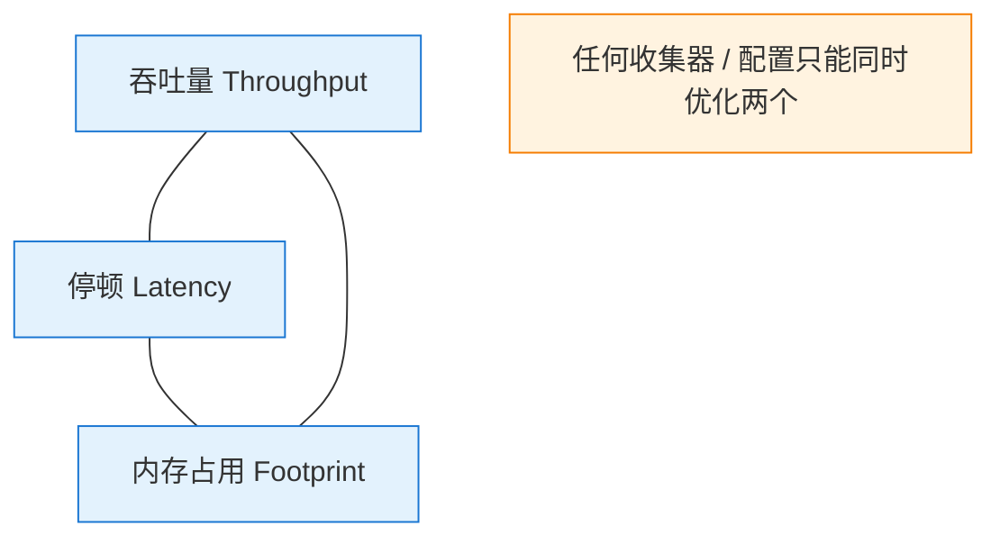

| 目标 | 手段 | 代价 |
|---|---|---|
| 低停顿 | 并发收集（G1/ZGC/Shenandoah）、缩小新生代、降低 `MaxGCPauseMillis` | 占 CPU（吞吐下降）、内存开销上升、GC 次数变多 |
| 高吞吐 | 少而大的 GC（Parallel + 大堆 + `GCTimeRatio=99`） | 单次停顿长 |
| 省内存 | 小堆、Serial 单线程 | GC 频繁、停顿与吞吐都受影响 |

### 9.2 把 GC 指标映射到 SLA（示例，不是 benchmark）

| 业务 SLA | 约束到 GC 的要求 | 收集器/参数方向 |
|---|---|---|
| 接口 P99 < 50ms | 单次 STW 需明显小于 50ms | ZGC（分代默认）/Shenandoah；或 G1 设较小的 `MaxGCPauseMillis`（注意吞吐代价） |
| 接口 P99 < 200ms | 单次 STW < 50ms，且**不能出现 Full GC** | G1 调优（IHOP、晋升速率、避免 Humongous），把 Full GC 降到 0 |
| 离线批处理 4 小时窗口 | GC 时间占比 < 1%~5% | Parallel + `-XX:GCTimeRatio=99`；允许长停顿 |
| 大内存缓存服务（64GB+） | 停顿与堆大小无关 | ZGC（每 GB 停顿不再线性增长） |
| 容器小堆（< 2GB，1~2 核） | 内存与 CPU 开销最小 | Serial（`-XX:+UseSerialGC`）常常比 G1 更稳 |

**关键认知**：GC 的停顿时间**直接叠加到当时所有在途请求的 RT 上**。一次 200ms 的 STW 会让那一瞬间的所有请求都 +200ms → 表现为 **P99.9 尖刺**，而平均值/P50 完全看不出来。所以：

- 面向延迟的 SLA 要盯 **max/P99 停顿**，不是平均停顿；
- 并发收集器的"低停顿"也要付 CPU 成本（并发线程与业务争 CPU）→ 低核数容器上反而更差；
- 除 STW 外，GC 还会通过 **CPU 抢占、内存带宽、cache 污染** 间接影响业务延迟。

### 9.3 必须进监控的指标（清单）

| # | 指标 | 为什么必须 |
|---|---|---|
| 1 | **Full GC 次数**（及趋势） | `Full GC > 0` 基本就是问题信号（G1 尤其） |
| 2 | **Young GC 频率**（次/分钟） | 频率突增 = 分配速率或新生代变小 |
| 3 | **单次停顿时长**的 max/P99（不是平均） | 直接对应 RT 尖刺 |
| 4 | **GC 后老年代占用**（趋势线） | 判断内存泄漏的唯一可靠指标 |
| 5 | **晋升速率**（老年代增长 bytes/s） | 老年代涨得快的原因，比"堆使用率"更有信息量 |
| 6 | **元空间使用量 + 类加载器数量** | 类加载器泄漏（见 [[1-JVM内存区域与对象布局]] §4.5） |
| 7 | **直接内存使用量** | `java.nio:type=BufferPool,name=direct` 的 `memoryUsed`/`totalCapacity` 可直接采集；Netty `PooledByteBufAllocator` 也有指标 |
| 8 | **分配速率**（allocation rate） | JFR `jdk.ObjectAllocationSample` 可采样；解释"为什么 Young GC 这么频繁" |
| 9 | **安全点时间**（`-Xlog:safepoint` / JFR `jdk.SafepointBegin`） | 区分"GC 慢"与"到安全点慢" |
| 10 | **进程 RSS vs 容器 limit** | 防 OOMKilled（元空间/堆外/线程栈都在 RSS 里） |
| 11 | 线程数量 | 线程过多会拖慢安全点召集、也会吃内存 |
| 12 | GC 日志文件（必须落盘 + 采集） | 事故后复盘的唯一原始证据；只靠 jstat 实时看会丢信息 |

---

## 十、常见坑表

| # | 坑 | 现象 | 根因 | 正解 |
|---|---|---|---|---|
| 1 | 频繁 Full GC 一律归因"堆不够" | 加堆后仍然频繁 Full GC | 可能是元空间到阈值、Humongous 分配、`System.gc()`、CMS 并发失败、大对象直接进老年代 | **先看触发原因**（日志 `(xxx)` / `jstat -gccause` 的 LGCC），再决定加堆还是改参数 |
| 2 | 只看 `jstat` 不看 GC 日志 | 知道"GC 很频繁"，但完全不知道为什么 | jstat 没有触发原因、各阶段耗时、安全点等待、安全区域 | GC 日志必须落盘；jstat 只做实时概览 |
| 3 | `System.gc()` 被框架调用 | 日志周期性出现 `(System.gc())`，且总是 Full GC | RMI DGC 定时、DirectBuffer 兜底、某些缓存/序列化库、构建工具 | 定位调用方；或 `-XX:+ExplicitGCInvokesConcurrent`；禁用 `System.gc()` 要评估堆外回收风险（见 [[1-JVM内存区域与对象布局]] §6.4） |
| 4 | 大对象引发 Humongous 频繁 GC | G1 日志 `Humongous regions` 持续增长、`G1 Humongous Allocation` 触发 | 对象 ≥ Region 的 50%，Young GC 又不回收 Humongous | 减少大对象（分块/压缩/堆外）、调大 `-XX:G1HeapRegionSize` |
| 5 | 元空间不设上限 | 容器 OOMKilled，日志里 `Metadata GC Threshold` 触发 Full GC | `MaxMetaspaceSize` 默认无上限 + 类加载器泄漏 | 显式设上限并监控类加载器数量 |
| 6 | `-Xmn` 与 G1 冲突 | 设了 `-Xmn` 后 G1 停顿目标失效、Young GC 频率异常 | G1 需要自适应新生代 | G1 下不设 `-Xmn`/`NewRatio` |
| 7 | 把"GC 后不降"一律当配置问题 | 反复调参数无效 | 老年代在每次 Full GC 后都比上次高且单调上升 = **真泄漏** | 抓 heap dump 做对比（[[7-JVM故障排查实战]]），不要再调参 |
| 8 | `-XX:MaxGCPauseMillis` 设得过小 | Young GC 频率暴增、吞吐下降，停顿目标仍达不到 | 停顿目标驱动 JVM 缩小新生代 → GC 次数变多 | 目标设成业务能接受的值（不要设成个位数 ms），并观察吞吐代价 |
| 9 | 用**平均**停顿判断体验 | 平均 5ms 很好看，但用户偶尔卡 1 秒 | 平均值掩盖了 Full GC / 安全点尖刺 | 看 max 与 P99，且把 Full GC 次数单独告警 |
| 10 | 只看 Young GC 次数，不看晋升量 | "Young GC 很正常"，但老年代一直涨 | 每次 Young GC 都在晋升（Survivor 太小/动态年龄判定） | 关注晋升速率与 `Survivor` 使用率，用 `-Xlog:gc+age=trace` 看年龄分布 |
| 11 | 在低核容器里上并发收集器 | 2 核容器用 G1/ZGC 后 RT 更差 | 并发 GC 线程与业务抢 CPU（ZGC 的读屏障也吃 CPU） | 核少 + 堆小时用 Serial；并发收集器要留 CPU 余量 |
| 12 | 把 `real` 时间当成 GC 算法耗时 | 优化堆参数无效 | `real` 含安全点同步等待（长循环、线程多、JNI、`jstack`） | 用 `-Xlog:safepoint` / `PrintGCApplicationStoppedTime` 拆分"等待"与"工作" |

---

## 十一、必答清单

> [!question] 面试必答四连
> **Q1：三色标记是什么？漏标怎么解决？**
> 白 = 未访问（最终仍白即垃圾）、灰 = 自己访问了但引用没扫完、黑 = 自己和引用都扫完。并发标记下漏标必须**同时**满足两个条件：① 黑色对象新增了指向白色对象的引用；② 灰色对象删除了到该白色对象的全部引用。两种解法各破坏一个条件：**增量更新**（写后屏障记录黑→白的新引用，重新标记时把这些黑色对象当根重扫，**CMS 用**）与**原始快照 SATB**（写前屏障记录灰→白被删的旧引用，重新标记时以旧引用为根重扫，**G1/Shenandoah 用**）。漏标会导致存活对象被回收（灾难），浮动垃圾只是效率问题。详见 §4。
>
> **Q2：CMS 和 G1 为什么用不同的屏障？**
> CMS 是标记-清除、没有整理能力，浮动垃圾多会更快触发 `Concurrent Mode Failure`，所以它选**增量更新**以求标记精确（并复用卡表/Mod Union Table 重扫）；G1 的目标是**停顿可预测**，并发标记要与 Young GC 交错执行、重新标记必须短，所以选 **SATB**（只处理固定大小的缓冲区，成本可预估），并接受更多浮动垃圾（后面还有多次 Mixed GC）。另外 G1 的写前屏障做 SATB、写后屏障维护 RSet，两件事分开。详见 §4.6。
>
> **Q3：G1 怎么做到可预测停顿？**
> 三件事：① 把堆切成约 2048 个等大 Region，**每次只回收一部分** Region（回收集合 CSet），而不是整堆；② 用**衰减均值**记录每个 Region 的历史回收耗时与收益，在 `-XX:MaxGCPauseMillis`（默认 200ms）目标内优先挑垃圾占比最高的 Region；③ 老年代回收通过 **Mixed GC** 分多次（`G1MixedGCCountTarget` 默认 8）完成，避免单次停顿过长。注意它是**软目标**：存活对象太多时仍可能超出，且要避免 Full GC。详见 §7.5。
>
> **Q4：ZGC 为什么停顿与堆大小无关？**
> 因为标记、转移（Relocate）、重映射（Remap）全部**并发**执行，STW 阶段只处理"根集合直接引用的对象"这一小块（规模取决于根数量与线程数，与堆中对象总量无关）。并发期间的正确性靠**染色指针 + 读屏障**保证：指针自带视图位，访问到过期指针时由读屏障修正（自愈）并协助转移。堆越大只是并发阶段更长，停顿不变。代价是禁用压缩指针、读屏障 CPU 开销、需要多视图映射与 CPU 余量。详见 §7.6。

| 主题 | 一句话记住 | 深入 |
|---|---|---|
| 为什么分代 | 弱分代（复制新生代）+ 强分代（整理老年代）+ 跨代引用少（记忆集） | §1 |
| GC Roots 全集 | 栈局部变量、静态变量、常量、JNI、JVM 内部引用、锁对象、活跃线程、类加载器（+ 跨代引用记录） | §2.2 |
| 为什么 STW | 可达性分析要求引用关系冻结；OopMap 只在安全点有效 | §2.3 / §6 |
| 三种算法 | 清除有碎片、复制要空间、整理要移动 | §3 |
| 漏标两条件 | 黑→白新增 + 灰→白断开；**同时**满足才漏标 | §4.3 |
| 卡表粒度 | 卡页 512 字节；`card_table[addr >> 9]`；写屏障维护 | §5.2 |
| 安全点代价 | 停顿 = 到安全点时间 + GC 时间；长计数循环/多线程/`jstack` 都会拖长 | §6.6 |
| G1 关键数字 | IHOP 45、G1HeapWastePercent 5、MixedGCLiveThreshold 85、MixedGCCountTarget 8、Reserve 10 | §7.5.3 |
| ZGC 关键机制 | 染色指针 + 读屏障 + 并发转移；与压缩指针不兼容 | §7.6 |
| 日志三问 | 触发原因？回收后降了多少？多频繁？ | §8.4 |
| 延迟 SLA | 看 max/P99 停顿，不看平均；GC 停顿直接叠加到在途请求 RT | §9.2 |

> [!note] 下一步
> 回收机制讲完了，落到"怎么调"请看 [[6-JVM参数与调优实战]]（参数速查、选型决策树、压测方法），落到"出事了怎么办"请看 [[7-JVM故障排查实战]]（OOM、CPU 飙高、内存泄漏、Full GC 排查步骤）。分配与对象布局的细节回到 [[1-JVM内存区域与对象布局]]；JIT 与逃逸分析的优化细节见 [[5-JIT编译与运行时优化]]。
