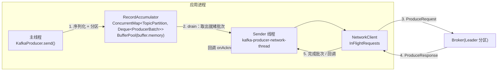
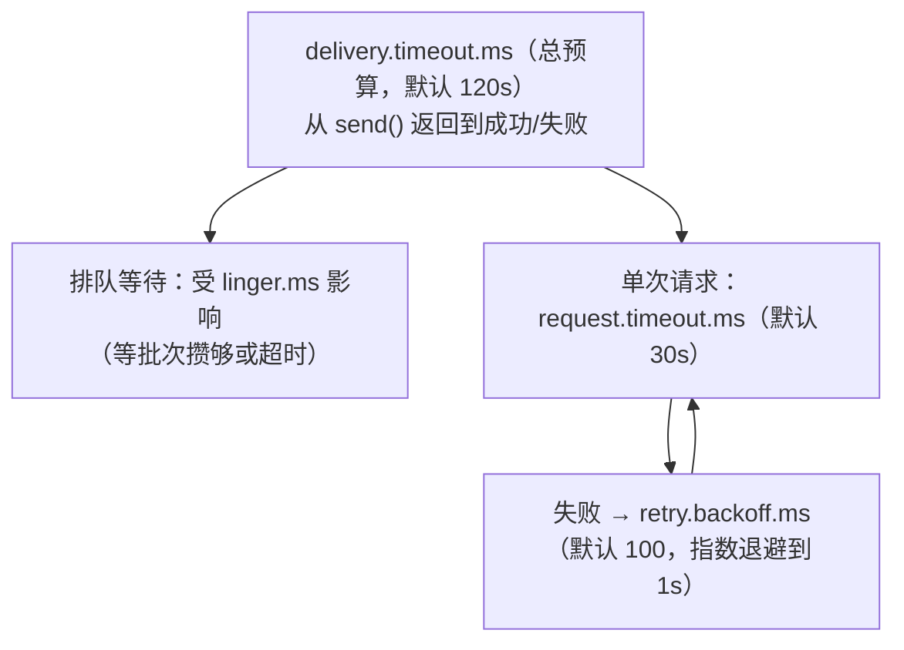
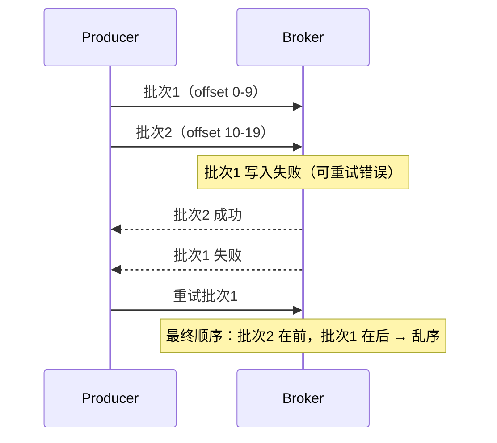

# 📤 三、Kafka 生产者原理

> 本文回答一个问题：**一条消息从 `producer.send()` 被调用，到最终落在 broker 的磁盘上，中间到底经过了什么？每个环节由哪些参数控制？出问题怎么定位？**
> 口径以 **Kafka 3.x / 4.x + 官方 `kafka-clients`** 为准；凡 4.0 有默认值变更的地方都会单独标注。
> 关联：[[1-Kafka总览]]、[[2-架构与核心概念]]、[[5-日志存储与副本机制]]、[[6-事务与Exactly-Once]]、[[10-面试高频题]]。

---

## 一、发送主流程：两个线程 + 一个缓冲区

### 1.1 全景图



**一句话记忆**：**主线程只负责"攒"，Sender 线程负责"发"。** 两个线程之间靠 `RecordAccumulator` 这个内存缓冲区解耦。

### 1.2 主线程做了什么：`send()` → `doSend()`

`KafkaProducer.send()` 本身**几乎不做网络 IO**，它是一条同步的"入队"路径：

| 步骤 | 动作 | 失败会怎样 |
|---|---|---|
| 1 | `ProducerInterceptors.onSend()` | 返回 `null` 即**丢弃该消息**（不报错，静默丢） |
| 2 | 序列化 key / value（`Serializer.serialize`） | 抛 `SerializationException`，**同步抛出** |
| 3 | 确定分区：显式 `partition()` > 自定义/默认分区器 | — |
| 4 | 估算序列化后大小，检查是否超 `max.request.size` | 抛 `RecordTooLargeException` |
| 5 | `RecordAccumulator.append()`：找到该分区当前批次并追加；必要时**新建批次** | 内存不足时阻塞，超 `max.block.ms` 抛 `BufferExhaustedException` |
| 6 | 若批次已满或新建批次，`sender.wakeup()` 唤醒 Sender | — |
| 7 | 返回 `Future<RecordMetadata>` | 异常另一路走 callback |

> [!warning] `send()` 只保证"进了缓冲区"，不保证"发出去了"
> `send()` 返回时消息还在内存里。真正的成败要么在 `Callback` 里，要么靠 `future.get()` / `flush()` 才能知道。进程被 `kill -9`，缓冲区里的消息**全部丢失**——这正是需要 `close()`/`flush()` 的原因。

### 1.3 缓冲区：`RecordAccumulator`

| 组件 | 结构 | 说明 |
|---|---|---|
| 批次队列 | `ConcurrentMap<TopicPartition, Deque<ProducerBatch>>` | **每个分区一个队列**，队列里是待发送的批次 |
| 内存池 | `BufferPool` | 总量由 `buffer.memory` 控制（默认 32MB） |
| 批次 | `ProducerBatch` | 单个批次目标大小 `batch.size`（默认 16KB），按 `batch.size` 向内存池申请 |

关键理解：

- **批次是"每分区"独立的**。一个 ProduceRequest 可以携带**多个分区的多个批次**（发往同一个 broker 的分区会被打包进一个请求）。
- 批次不是等到"满了"才发。**`batch.size` 只决定批次能做到多大**，是否立即发送由 `linger.ms` 与"批次是否已满"共同决定。
- 单条消息大于 `batch.size` 时，Kafka 仍会为它单独分配一个更大的批次（**`batch.size` 不是单条消息上限**，单条上限是 `max.request.size`）。

### 1.4 Sender 线程做了什么

Sender 的 `run()` 是一个**循环**，每一轮：

1. `accumulator.ready()`：算出哪些分区的批次"就绪"了。就绪条件 = 批次已满 **或** 距批次创建已超过 `linger.ms` **或** 这是一个到期的重试。
2. `accumulator.drain()`：把就绪批次按 **leader broker** 分组取出（`Map<nodeId, List<ProducerBatch>>`）。
3. `NetworkClient.send()`：为每个 broker 组装一个 `ProduceRequest` 发出。
4. `NetworkClient.poll(timeout)`：等待响应；收到响应后完成批次 → 触发 `Callback` → 释放批次内存回 `BufferPool`。
5. 处理重试、更新 metadata、发送事务相关请求。

> [!note] 线程名与线程安全性
> Sender 线程名形如 `kafka-producer-network-thread | <client.id>`。
> **`KafkaProducer` 是线程安全的**（与 `KafkaConsumer` 相反），多个业务线程可以共享一个 producer 实例，这正是它的设计目标。
> 但**拦截器的 `onAcknowledgement` 运行在 Sender 线程上**，任何阻塞都会拖垮发送吞吐。

### 1.5 阻塞点在哪里

| 阻塞发生的位置 | 由谁控制 | 表现 |
|---|---|---|
| 等 metadata（拿不到分区 leader） | `max.block.ms` | `send()` 卡住，最终 `TimeoutException: Failed to update metadata` |
| 等缓冲区内存（`buffer.memory` 耗尽） | `max.block.ms` | `send()` 卡住，最终 `BufferExhaustedException` |
| 等 Kafka 返回结果 | `delivery.timeout.ms` | callback 收到 `TimeoutException: Expiring N record(s)` |

**`max.block.ms` 只管 `send()` 这个调用阻塞多久**；消息进了缓冲区之后的时间由 `delivery.timeout.ms` 管。这两个超时属于**不同阶段**，不要混淆。

---

## 二、重要参数详解

### 2.1 连接与必填项

| 参数 | 作用 | 默认值 | 调大 / 调小的后果 | 生产建议 |
|---|---|---|---|---|
| `bootstrap.servers` | 初始连接地址，用于**发现**整个集群 | 空（必须设置） | 只填 1 个：该节点挂了客户端仍能用已缓存的 metadata，但**重启后可能连不上** | 至少填 2～3 个**同机房** broker，不必写全 |
| `key.serializer` | key 序列化器类名 | 无（必须设置） | — | `StringSerializer` / 自定义 |
| `value.serializer` | value 序列化器类名 | 无（必须设置） | — | `StringSerializer` / `JsonSerializer` / Avro/Protobuf |
| `client.id` | 请求里携带的逻辑标识 | `""` | — | **一定设置**，否则 broker 端日志和监控无法定位来源 |
| `security.protocol` | 通信协议 | `PLAINTEXT` | — | 生产按需 `SASL_SSL` / `SSL` |

> [!tip] `bootstrap.servers` 的常见误解
> 它**不是**"只连这些节点"。客户端连上任意一个后，会通过 metadata 响应拿到全部 broker、分区 leader、副本列表，后续直接连 leader。所以列表里写几个"活着的"就够，不必与服务端列表完全一致。

### 2.2 可靠性三件套

| 参数 | 作用 | 默认值 | 调大 / 调小的后果 | 生产建议 |
|---|---|---|---|---|
| `acks` | leader 需要多少副本确认才算成功 | **`all`**（3.0 起；3.0 之前是 `1`） | `0`：不等确认，吞吐最高、**可能丢**；`1`：leader 写完即回，leader 宕机可能丢；`all`：等 ISR 全部确认 | 金融/订单类必须 `all` |
| `retries` | 可重试错误的次数 | `2147483647`（2.1 起） | 调小：瞬时抖动直接失败；调 0：**等于关闭重试** | 保持默认，用 `delivery.timeout.ms` 控总时长 |
| `delivery.timeout.ms` | 从 `send()` 返回到成功/失败的**总时限**（含排队 + 重试） | `120000` | 调小：网络抖动就失败；调大：故障时业务线程 / 回调阻塞更久 | 一般 120s；延迟敏感业务可下调，但要 > `linger.ms + request.timeout.ms` |

`acks` 三档的精确定义（官方原文语义）：

- **`acks=0`**：producer 把记录写进 socket 缓冲区就认为"已发送"，**不等待任何确认**。此时 `retries` 配置**不会生效**（客户端根本不知道失败），返回的 offset 恒为 `-1`。
- **`acks=1`**：leader 写入**自己的本地日志**后就响应，不等 follower。若 leader 在响应后、follower 复制前宕机，**该记录丢失**。
- **`acks=all`**（等价 `-1`）：leader 等待**当前 ISR 全集**确认。只要还有**至少一个 ISR 副本存活**，记录就不会丢——这是 Kafka 能给出的最强保证。

### 2.3 批处理与吞吐

| 参数 | 作用 | 默认值 | 调大 / 调小的后果 | 生产建议 |
|---|---|---|---|---|
| `linger.ms` | 批次发送前额外等待的时间，用于攒更多消息 | **3.x：`0`；4.0：`5`** | 调大：批次更大、吞吐更高、**延迟增加**；调 0：来一条发一条，吞吐差 | 吞吐型 5～100ms；低延迟型保持 0～5 |
| `batch.size` | **单个批次**的目标字节数 | `16384`（16KB） | 调大：压缩比和吞吐更好，但**内存占用更浪费**（按此大小预分配） | 与 `linger.ms` 一起调；先加 `linger.ms` 通常更划算 |
| `buffer.memory` | producer 可用于缓冲的**总内存** | `33554432`（32MB） | 调小：高并发下频繁阻塞 / `BufferExhaustedException`；调大：单实例内存上涨 | 高吞吐按 `batch.size × 分区数 × 2~3` 估算后上调 |
| `compression.type` | 批次压缩算法 | `none` | 见第八章 | 生产强烈建议 `lz4` / `zstd` |
| `max.request.size` | 单个请求的**最大字节数** | `1048576`（1MB） | 调小：大消息直接被拒；调大：单请求变大，内存峰值上升 | 与 `message.max.bytes`、消费端 `fetch.max.bytes` **联动改** |

> [!warning] 4.0 的一个"静默"变更：`linger.ms` 默认值从 0 变成 5
> 官方理由是"更大的批次带来的效率提升，通常能在生产者延迟略微上升的情况下取得相近甚至更低的端到端延迟"。
> 如果你的程序从 3.x 升级到 4.0 且**没有显式设置** `linger.ms`，那么每条消息会**多等最多 5ms** 才可能发出。
> **对超低延迟敏感的链路，升级前请显式把 `linger.ms` 写死。**

### 2.4 超时与阻塞

| 参数 | 作用 | 默认值 | 说明 |
|---|---|---|---|
| `max.block.ms` | `send()` / `partitionsFor()` 等方法的阻塞上限 | `60000` | 只覆盖**等 metadata + 等缓冲区内存**；**不包含**用户序列化器 / 分区器内部耗时 |
| `request.timeout.ms` | 单个网络请求的响应等待上限 | `30000` | 官方明确建议 **大于 broker 的 `replica.lag.time.max.ms`**（默认 30s），否则会引发**不必要的重试 → 消息重复** |
| `retry.backoff.ms` | 重试前的基础退避 | `100` | 实际是**指数退避**，上限由 `retry.backoff.max.ms`（默认 1000）约束，并带 20% 抖动 |
| `connections.max.idle.ms` | 空闲连接关闭时间 | `540000`（9 分钟） | — |

### 2.5 顺序与幂等

| 参数 | 作用 | 默认值 | 说明 |
|---|---|---|---|
| `enable.idempotence` | 幂等生产者（去重） | **`true`**（3.0 起） | 依赖 `acks=all`、`retries>0`、`max.in.flight<=5` |
| `max.in.flight.requests.per.connection` | 单连接上**未确认请求**的最大数量 | `5` | 幂等要求 `<=5`；broker 端每个 producer 只保留最近 **5 个批次**的状态 |
| `transactional.id` | 开启事务 | `null` | 设置了它就**隐含开启幂等** |

### 2.6 分区与消息大小

| 参数 | 作用 | 默认值 | 说明 |
|---|---|---|---|
| `partitioner.class` | 自定义分区器 | `null`（用内置逻辑） | 见第四章 |
| `partitioner.ignore.keys` | 忽略 key 做分区 | `false` | 置 `true` 则即使有 key 也走粘性分区 |
| `partitioner.adaptive.partitioning.enable` | 让分区器倾向于更快的 broker | `true` | 关闭则严格均匀分布 |
| `partitioner.availability.timeout.ms` | 某分区所在 broker 多久无响应就视为不可用 | `0`（禁用） | — |

---

## 三、时序关系：`delivery.timeout.ms` 才是真正的上限

### 3.1 三个超时的层次



关系式：

```
delivery.timeout.ms  >=  linger.ms + request.timeout.ms
```

**为什么是这个式子**：一次最"不走运"的尝试至少要花掉"攒批的 `linger.ms`"加上"等待响应的 `request.timeout.ms`"。如果总预算连一次尝试都装不下，那么这个配置本身就是矛盾的。

### 3.2 违反约束会发生什么（官方行为，分两种情况）

这个校验发生在 **`KafkaProducer` 构造时**，Kafka 的处理非常讲究：

| 情况 | 行为 |
|---|---|
| 你**显式设置**了 `delivery.timeout.ms`，且它 `< linger.ms + request.timeout.ms` | **直接抛 `ConfigException`**：`delivery.timeout.ms should be equal to or larger than linger.ms + request.timeout.ms` |
| 你**没有设置** `delivery.timeout.ms`（用默认值），但你把 `linger.ms` 或 `request.timeout.ms` 调大到了超过默认的 120s | **不报错**，客户端把你的 `delivery.timeout.ms` **静默改写**为 `linger.ms + request.timeout.ms`，只打一条 WARN 日志 |

> [!warning] 第二个分支是生产事故的温床
> 例如有人把 `request.timeout.ms` 设成 `120000`（为了"容忍慢网络"），却没动 `delivery.timeout.ms`。
> 结果 `delivery.timeout.ms` 被**自动放大到 120s 以上**，故障时业务线程要等两分多钟才拿到失败回调。
> **结论：只要动了 `linger.ms` 或 `request.timeout.ms`，就请显式写死 `delivery.timeout.ms`。**

### 3.3 `retries` 与 `delivery.timeout.ms` 的交互

2.1 之前，失败与否由 `retries` 决定（重试完就报错）；**2.1 起 `delivery.timeout.ms` 成为真正的总上限**：

- `retries` 默认已是 `Integer.MAX_VALUE`，实际上**永远不会因为"次数用完"而失败**；
- 失败的真实原因是**总预算耗尽**；
- 官方明确建议：**保持 `retries` 不设置，用 `delivery.timeout.ms` 来控制重试行为**。

还有两个容易忽略的细节：

1. `delivery.timeout.ms` 是**批次级**的。批次在创建时就确定了到期时间；一条消息如果被追加进一个"已经等了一段时间"的批次，它会**比自己的 `delivery.timeout.ms` 更早**失败。
2. 遇到**不可重试错误**（如 `RecordTooLargeException`、认证失败）时，会**早于** `delivery.timeout.ms` 立即失败——这属于正确行为。

### 3.4 典型故障现象

```text
org.apache.kafka.common.errors.TimeoutException: Expiring 128 record(s) for orders-3:
120008 ms has passed since batch creation
```

这行的含义是**"批次从创建到现在超过了 `delivery.timeout.ms`"**，而不是"某次请求超时"。真正的原因通常是下面之一：

| 根因 | 判定方法 |
|---|---|
| broker 整体不可用 / 网络不通 | 同时段其他 topic 也失败；`kafka-broker-api-versions.sh` 连不上 |
| ISR 收缩到小于 `min.insync.replicas`，broker 拒绝写入 | broker 日志出现 `NOT_ENOUGH_REPLICAS`；见 5.3 |
| 发送速率远超 broker 处理能力，缓冲区持续打满 | 伴随 `BufferExhaustedException`；producer 指标 `record-queue-time-avg` 飙升 |
| 单分区热点，某个 leader 慢 | 只有个别分区 expiring，其他正常 |

---

## 四、分区器

### 4.1 默认分区逻辑

`partitioner.class` 默认是 `null`，此时使用**内置分区逻辑**，规则只有两条：

1. **指定了 partition** → 用它，分区器不参与。
2. **没指定 partition，但有 key** → `hash(key)` 选分区。
3. **既没 partition 也没 key** → 走**粘性分区（sticky）**：先选一个分区，一直往它写，直到该分区累计写入达到 `batch.size` 或批次发送，再**换一个**分区。

### 4.2 有 key：murmur2 哈希

```java
// 官方内置逻辑（DefaultPartitioner / BuiltInPartitioner）
int partition = Utils.toPositive(Utils.murmur2(keyBytes)) % numPartitions;
```

要点：

- 用的是 **murmur2**，不是 Java 的 `hashCode()`（两者结果不同，所以**跨语言客户端必须实现 murmur2** 才能保证同 key 同分区）。
- `toPositive` 抹掉符号位，保证结果非负。
- **同一个 key 永远落同一个分区**，前提是：① 分区数不变；② 用的还是这个哈希算法；③ 生产者端 key 的字节序列一致。

> [!warning] 增加分区数会打乱 key→分区 映射
> `key % 分区数` 的分母变了，**所有 key 的归属都可能改变**。
> 对于依赖"同 key 同分区"来保证顺序的业务（如订单状态机），这会导致历史与新消息落到不同分区，顺序语义被破坏。
> **正确做法：一开始就把分区数规划够，或改用自定义分区器把 key 显式映射到固定分区区间。**

### 4.3 无 key：从轮询到粘性

| 版本 | 行为 | 问题 |
|---|---|---|
| 2.4 之前 | **轮询（round-robin）**：每条消息换一个分区 | 每条消息一个批次 → 批次极小 → 请求数暴涨，吞吐差 |
| **2.4 起** | **粘性分区**（KIP-480）：一次选一个分区写满一个批次再换 | 批次变大，吞吐显著提升 |
| **3.3 起** | **统一粘性分区器**（KIP-794）：成为默认内置分区逻辑，并引入 `partitioner.adaptive.partitioning.enable` | 分布更均匀，且能感知 broker 快慢 |

注意区分两个"轮询"：**默认逻辑早已不是轮询**；`RoundRobinPartitioner` 仍然存在，但官方文档明确提示它在新建批次时存在分布不均的已知问题（KAFKA-9965），一般不要用。

### 4.4 自定义分区器

```java
public class OrderIdPartitioner implements Partitioner {
    @Override
    public int partition(String topic, Object key, byte[] keyBytes,
                         Object value, byte[] valueBytes, Cluster cluster) {
        List<PartitionInfo> partitions = cluster.partitionsForTopic(topic);
        int numPartitions = partitions.size();
        if (key == null) {
            // 无 key 时退化为随机，或按业务规则路由
            return ThreadLocalRandom.current().nextInt(numPartitions);
        }
        // 业务约定：商户号取模，保证同商户的消息严格有序
        return Math.abs(key.toString().hashCode()) % numPartitions;
    }

    @Override
    public void close() { }

    @Override
    public void configure(Map<String, ?> configs) { }
}
```

配置：`props.put(ProducerConfig.PARTITIONER_CLASS_CONFIG, OrderIdPartitioner.class.getName());`

> [!tip] 自定义分区器的三个注意点
> 1. **它是主线程上的热路径**，不要做远程调用 / 查库；耗时会计入 `max.block.ms` **之外**的时间，直接拖慢业务线程。
> 2. `partition()` 里改分区数计算方式，等于**一次性重构全量数据的分布**，必须做历史数据处理方案。
> 3. 一旦设置了 `partitioner.class`，`partitioner.adaptive.partitioning.enable` / `partitioner.ignore.keys` **全部失效**。

### 4.5 分区与顺序性

Kafka 只保证**分区内有序**。所以：

- 需要"同一业务实体有序" → 用该实体 ID 作 key；
- 需要"全局有序" → 只能让 topic 只有 1 个分区（等于放弃并行度，生产上几乎不选）。

---

## 五、消息可靠性：`acks` 与 `min.insync.replicas`

### 5.1 `acks=all` 到底保证了什么

官方定义：leader 等待**当前 ISR 全集**确认。它保证：

> **只要至少还有一个 ISR 副本存活，这条记录就不会丢。**

它**不保证**的事情：

- **不保证不重复**：网络超时触发的重试会导致重复（除非开启幂等）。
- **不保证"写入一定成功"**：如果 ISR 缩水到不满足 `min.insync.replicas`，broker 会**直接拒绝写入**（保可靠性、牺牲可用性）。
- **不保证跨副本的持久性上限**：如果对某个副本做了 `unclean` 选举，非 ISR 副本可以成为 leader 并**丢数据**。

### 5.2 与 `min.insync.replicas` 的联动

`min.insync.replicas` 是 **broker / topic 级**配置，默认 `1`。

| `replication.factor` | `min.insync.replicas` | `acks` | 可容忍的副本故障数 | 性质 |
|---|---|---|---|---|
| 3 | 1 | `all` | 2（但只剩 1 个副本仍在写） | 可用性优先，容灾能力其实很差 |
| **3** | **2** | **`all`** | **1** | **官方推荐组合**：多数派写入 |
| 3 | 3 | `all` | 0 | 任一副本挂就**拒写**，可用性极差，一般不用 |
| 1 | 1 | `all` | 0 | 等于单副本，无容灾 |

官方原话（`min.insync.replicas` 文档）：当 producer 设置 `acks=all`，该配置指定"写入被认定为成功所需确认的最小副本数"；如果达不到，producer 会收到异常（`NotEnoughReplicas` 或 `NotEnoughReplicasAfterAppend`）。**并且无论 `acks` 设成什么，消息只有在被复制到所有 ISR 且满足 `min.insync.replicas` 条件后，才对消费者可见。**

### 5.3 `NotEnoughReplicasException` 何时发生

两个**错误码**对应两个**异常**，区别在于"拒写发生在写之前还是写之后"：

| 错误码 | Java 异常 | 发生时机 | 语义 |
|---|---|---|---|
| `NOT_ENOUGH_REPLICAS` | `NotEnoughReplicasException` | **追加之前**就拒绝 | ISR 数量 < `min.insync.replicas`，leader 直接不收 |
| `NOT_ENOUGH_REPLICAS_AFTER_APPEND` | `NotEnoughReplicasAfterAppendException` | **已写入 leader 本地日志之后** | leader 写成功了，但需要的副本确认数没凑够 |
| `MESSAGE_TOO_LARGE` | `RecordTooLargeException` | 追加时校验失败 | 见第十一章 |

关键点：**这两个异常都是可重试的**。所以生产上你**更常看到的是 `TimeoutException`**（重试到 `delivery.timeout.ms` 耗尽），而不是直接看到 `NotEnoughReplicasException`——只有当你把 `retries=0` 或异常被同步抛出时，才会直接暴露。

**排查路径**：

```bash
# 1. 看 ISR 是否缩水（ISR 里数量 < min.insync.replicas 就会拒写）
kafka-topics.sh --bootstrap-server broker:9092 --describe --topic orders

# 2. 看是不是有 broker 挂掉 / 副本同步不上
kafka-log-dirs.sh --bootstrap-server broker:9092 --describe --topic-list orders

# 3. 看 broker 日志里的 NOT_ENOUGH_REPLICAS
grep NOT_ENOUGH_REPLICAS $KAFKA_HOME/logs/server.log
```

**修复**：恢复挂掉的 broker / 排查 follower 同步慢（`replica.lag.time.max.ms` 有关的踢出，见 [[5-日志存储与副本机制]]）；或者临时下调 `min.insync.replicas`（**用持久性换可用性，必须业务方确认**）。

---

## 六、幂等生产者

### 6.1 要解决的问题

`acks=all` + 重试带来一个必然副作用：**超时的请求可能实际上已经写成功了**。producer 重发 → 同一条消息在日志里出现两次。

```
producer → broker: ProduceRequest(batch A)
broker 内部: 写入成功，但响应包在网络中丢失
producer: 超时 → 重发 batch A
broker: 又写入一次  →  日志里出现两条相同消息
```

### 6.2 PID + Sequence Number 机制

幂等生产者给每条消息打上身份，让 broker 能识别"这是重复的"：

| 概念 | 说明 |
|---|---|
| **PID**（Producer ID） | broker 通过 `InitProducerId` 分配的全局唯一 ID，标识一个 producer **会话** |
| **Epoch** | PID 的版本号；producer 重启后 PID 可能复用，但 epoch 递增，用于**隔离僵尸实例**（也是事务 fencing 的基础） |
| **Sequence Number** | 每个 `(PID, TopicPartition)` 独立维护的**单调递增**序号，从 0 开始，按**批次**递增 |

broker 端为每个 `(PID, 分区)` 保留**最近 5 个批次**的序号。收到请求时：

- 序号**正好是期望的下一个** → 正常写入；
- 序号**小于等于已记录的**（重复） → **丢弃并返回成功**（让 producer 以为成功了，避免无意义重试）；
- 序号**跳跃（有空洞）** → 返回 `OutOfOrderSequenceException`。

### 6.3 为什么 `max.in.flight.requests.per.connection <= 5`

官方文档给出的原因非常直白：

> 启用幂等要求该配置 `<= 5`，因为 **broker 端每个 producer 只保留最多 5 个批次**。如果超过 5，**更早的批次状态可能已经在 broker 侧被移除**，此时重试的批次无法被正确判定为重复。

所以 5 这个数字不是随便定的，它是**broker 侧保留窗口的大小**。Kafka 3.0 起，若**显式**开启幂等却把 `max.in.flight` 设成 > 5，构造 producer 时直接抛 `ConfigException`。

### 6.4 幂等覆盖什么 / 不覆盖什么

| 覆盖 | 不覆盖 |
|---|---|
| 单个 producer 会话内、**单个分区**上的重试去重 | **跨 producer 会话**（进程重启拿到新 PID，无法识别旧会话的重复） |
| 因网络超时导致的重复发送 | **跨分区**：两个分区各有一条相同业务消息，Kafka 不管 |
| 顺序性保障（配合 `max.in.flight<=5`） | **端到端 exactly-once**：消费者重复处理 / 下游写库重复，它管不了 |
| — | **业务层重复**：同一业务事件被上游投递两次，它管不了 |

> [!warning] 幂等 ≠ 业务幂等
> 幂等生产者解决的是"**Kafka 客户端重试引入的重复**"，范围是 **per-partition + per-producer-session**。
> 真正的不重复仍要靠**消费端幂等**（唯一键 / 去重表 / 状态机）。跨分区原子性请用 [[6-事务与Exactly-Once]] 的事务。

> [!warning] 一个静默降级的陷阱
> 幂等默认开启（3.0+），但它的前提是 `acks=all` + `retries>0` + `max.in.flight<=5`。
> **如果你显式改了 `acks=1`、`retries=0` 或 `max.in.flight=10`，却忘了显式写 `enable.idempotence`，Kafka 不会报错，而是"悄悄地把幂等关掉"，只打一条日志。**
> 反过来说：**只要你显式设了 `enable.idempotence=true`，再配冲突参数就会直接抛 `ConfigException`**。所以生产配置里**建议显式写下这一行**，让错误尽早暴露。

---

## 七、消息顺序性

### 7.1 保序需要同时满足的条件

| 条件 | 说明 |
|---|---|
| 同一分区 | 跨分区无顺序保证（靠 key 路由到同一分区） |
| 单一 producer 实例发送 | 多个 producer 并发写同一分区，到达顺序无法保证 |
| 应用侧不加多线程乱序 | 业务线程池里并发 `send()`，顺序由调度决定 |
| `enable.idempotence=true`（或 `max.in.flight=1`） | 见下 |
| 不改变分区数 | 改变会打乱 key→分区映射 |

### 7.2 重试导致乱序的机制

前提：`enable.idempotence=false`、`retries>0`、`max.in.flight>1`。



因为多个请求**同时在途**，后发的批次可能先成功；先发的批次重试后反而落到后面。官方文档对这个场景的描述是：

> 如果两个批次发往同一分区，第一个失败了被重试，而第二个成功了，那么**第二个批次里的记录可能先出现**。

### 7.3 解决方案对比

| 方案 | 顺序保障 | 吞吐影响 | 说明 |
|---|---|---|---|
| `max.in.flight=1` | 严格有序 | **最差**（每批必须等上一批确认，pipeline 归零） | 不想开幂等时的兜底 |
| `enable.idempotence=true` + `max.in.flight<=5` | **严格有序** | 几乎无损失（保留 5 条 pipeline） | **推荐**，3.0 起已是默认 |
| 单分区 + 单线程 | 全局有序 | 放弃并行 | 极少用 |
| 业务层排序（序号 + 消费端重排） | 最终有序 | 需要额外存储 | 跨分区全局有序的常见工程解 |

**结论：现代 Kafka 上"保序"不再是难题，默认配置（幂等 + `max.in.flight=5`）就是有序的。** 一旦有人为了"提高吞吐"把 `enable.idempotence` 关掉，顺序性就重新变成需要论证的问题。

---

## 八、消息大小与压缩

### 8.1 压缩发生在哪一层

**压缩是对"整个批次"做的，不是对单条消息。** 官方原文：*Compression is of full batches of data, so the efficacy of batching will also impact the compression ratio (more batching means better compression).*

推论：

- `linger.ms` / `batch.size` 调大 → 批次更大 → **压缩率更高**（这是调大 `linger.ms` 的连带收益）；
- 一条消息一个批次时，压缩几乎无用（甚至因为在批次头加字段而变大）；
- 压缩由 **producer 端**完成，broker **原样存储**（除非 topic/broker 的 `compression.type` 被显式设成别的算法，那会导致 broker **重新压缩**，白白消耗 broker CPU，通常应保持 `producer`）。

### 8.2 算法对比

| 算法 | 压缩率 | 压缩速度 | 解压速度 | 引入版本 | 适用场景 |
|---|---|---|---|---|---|
| `none` | — | — | — | — | 极低延迟、消息本身已压缩（如图片） |
| `lz4` | 中 | **极快** | **极快** | 0.8.2 | **通用首选**：CPU 开销低，延迟友好 |
| `snappy` | 中 | 快 | 快 | 0.8.2 | 与 lz4 接近，生态兼容性好 |
| `gzip` | **最高** | 慢 | 中 | 最早 | CPU 充裕、带宽极度受限 |
| `zstd` | **高（接近 gzip）** | 中 | 快 | **2.1**（需消息格式 v2，即 0.11+） | 综合最优，现代集群推荐 |

### 8.3 压缩的代价与收益

| 维度 | 影响 |
|---|---|
| 网络 | **大幅减少**传输字节（收益最大处） |
| 磁盘 | 减少存储占用，间接延长保留时长 |
| producer CPU | 上升（压缩） |
| consumer CPU | 上升（解压）——**这是最容易被忽略的成本**：消费端机器可能比生产端更吃紧 |
| 延迟 | 压缩本身增加少量延迟；`zstd`/`gzip` 比 `lz4` 更明显 |

> [!tip] 选型建议
> 不知道选什么就 **`lz4`**；消息是 JSON / 文本且 CPU 有余量，选 **`zstd`**。
> 但请记住：**批处理带来的收益通常远大于换压缩算法**。先调 `linger.ms` / `batch.size`，再考虑压缩算法。

---

## 九、拦截器与序列化器

### 9.1 `ProducerInterceptor`

```java
public interface ProducerInterceptor<K, V> extends Configurable {
    ProducerRecord<K, V> onSend(ProducerRecord<K, V> record);
    void onAcknowledgement(RecordMetadata metadata, Exception exception);
    void close();
}
```

| 回调 | 执行线程 | 时机与注意事项 |
|---|---|---|
| `onSend(record)` | **主线程** | 在**序列化之前**调用；返回 `null` 表示**丢弃**该消息；可以做埋点、加 header、脱敏 |
| `onAcknowledgement(md, ex)` | **Sender（IO）线程** | 收到确认或失败时调用；**必须极快且线程安全**，不要阻塞、不要做远程调用 |
| `close()` | 关闭时 | 释放资源 |

**限制**：

- 返回值必须是 `ProducerRecord`，**不能改 key/value 的类型**（序列化还没发生，改了会与 `value.serializer` 不匹配）；
- `onAcknowledgement` 中**不要修改共享状态而不加锁**，它和业务线程是并发的；
- 多个拦截器按配置顺序串联，`onSend` 正序、`onAcknowledgement` **倒序**。

### 9.2 序列化器

```java
public interface Serializer<T> extends Closeable {
    void configure(Map<String, ?> configs, boolean isKey);
    byte[] serialize(String topic, Headers headers, T data);
    default byte[] serialize(String topic, T data) { return serialize(topic, null, data); }
    void close();
}
```

要点：

- `Serializer` 实例**在多个线程间共享**，`serialize()` 必须**线程安全**（这也是为什么推荐的写法是"无状态"）；
- 抛出的任何异常都会被包装成 `SerializationException`，并且是**从 `send()` 同步抛出**的；
- `isKey=true` 允许同一个类在 key/value 上表现不同；
- **序列化后的大小**参与 `max.request.size` 校验，所以"字符串不长但序列化后很大"（如 JSON + 嵌套结构）同样会被拒。

---

## 十、完整 Java 示例

### 10.1 幂等 + `acks=all` + 回调

```java
import org.apache.kafka.clients.producer.*;
import org.apache.kafka.common.serialization.StringSerializer;

import java.util.Properties;
import java.util.concurrent.atomic.AtomicLong;

public class ReliableProducer {

    public static void main(String[] args) {
        Properties props = new Properties();

        // ---------- 连接与身份 ----------
        props.put(ProducerConfig.BOOTSTRAP_SERVERS_CONFIG, "broker1:9092,broker2:9092,broker3:9092");
        props.put(ProducerConfig.CLIENT_ID_CONFIG, "order-producer");
        props.put(ProducerConfig.KEY_SERIALIZER_CLASS_CONFIG, StringSerializer.class.getName());
        props.put(ProducerConfig.VALUE_SERIALIZER_CLASS_CONFIG, StringSerializer.class.getName());

        // ---------- 可靠性：显式声明，避免静默降级 ----------
        props.put(ProducerConfig.ACKS_CONFIG, "all");                       // 等 ISR 全部确认
        props.put(ProducerConfig.ENABLE_IDEMPOTENCE_CONFIG, true);          // 显式开启，配错立即报错
        props.put(ProducerConfig.RETRIES_CONFIG, Integer.MAX_VALUE);        // 默认值，写出来更直观
        props.put(ProducerConfig.MAX_IN_FLIGHT_REQUESTS_PER_CONNECTION, 5);// 幂等上限
        props.put(ProducerConfig.DELIVERY_TIMEOUT_MS_CONFIG, 120_000);      // 显式写死总预算
        props.put(ProducerConfig.REQUEST_TIMEOUT_MS_CONFIG, 30_000);

        // ---------- 吞吐 ----------
        props.put(ProducerConfig.LINGER_MS_CONFIG, 5);                      // 攒 5ms
        props.put(ProducerConfig.BATCH_SIZE_CONFIG, 32 * 1024);             // 32KB 批次
        props.put(ProducerConfig.COMPRESSION_TYPE_CONFIG, "lz4");           // 低 CPU 高性价比

        AtomicLong failed = new AtomicLong();

        try (KafkaProducer<String, String> producer = new KafkaProducer<>(props)) {
            for (int i = 0; i < 10_000; i++) {
                String orderId = "ORDER-" + i;
                ProducerRecord<String, String> record =
                        new ProducerRecord<>("orders", orderId, "{\"orderId\":\"" + orderId + "\"}");

                producer.send(record, (RecordMetadata md, Exception ex) -> {
                    if (ex != null) {
                        // 注意：这里运行在 Sender 线程上，只做轻量日志 / 投递到重试队列
                        failed.incrementAndGet();
                        System.err.println("发送失败 orderId=" + orderId + " : " + ex);
                    } else {
                        System.out.printf("成功 topic=%s partition=%d offset=%d%n",
                                md.topic(), md.partition(), md.offset());
                    }
                });
            }
            // try-with-resources 会调用 close()，它内部会 flush
        }
        System.out.println("失败条数: " + failed.get());
    }
}
```

> [!note] 关于 `close()` 与 `flush()`
> - `close()` **默认会等待缓冲区里所有消息发完**（相当于隐式 `flush()`）；
> - `close(Duration.ZERO)` 是"立即关闭、不等待"，**会丢消息**，只适合明确知道可以丢的场景；
> - 优雅停机时推荐顺序：**停止接收新请求 → `flush()`/`close()` → 再退出进程**。

### 10.2 同步发送怎么写

```java
try {
    // get() 会阻塞，直到这条消息得到确认或失败
    RecordMetadata md = producer.send(record).get(3, TimeUnit.SECONDS);
    System.out.println("offset = " + md.offset());
} catch (ExecutionException e) {
    // 真正的 Kafka 异常在 cause 里：TimeoutException / RecordTooLargeException / ...
    Throwable cause = e.getCause();
    log.error("发送失败", cause);
} catch (java.util.concurrent.TimeoutException e) {
    // ⚠️ 这是 Future.get() 自己的超时，消息可能仍在后台发送并最终成功！
    log.warn("等待确认超时，但消息可能已发送成功", e);
} catch (InterruptedException e) {
    Thread.currentThread().interrupt();
}
```

> [!warning] 同步发送的两个坑
> 1. `future.get()` 抛的 `ExecutionException` 只是**包装**，真实异常必须看 `getCause()`。
> 2. `future.get(timeout)` 超时的 `java.util.concurrent.TimeoutException` 与 Kafka 的 `org.apache.kafka.common.errors.TimeoutException` **是两个不同的类**。前者只表示"你等得不耐烦了"，**消息可能已经发送成功**——如果你据此重发，就会产生重复。
> 3. 同步发送会把吞吐压到"一次一个 RTT"，生产环境通常用**异步 + 回调**，只在批量导入等场景用同步。

---

## 十一、常见异常与排查

| 异常 | 抛出位置 | 根本原因 | 处理方式 |
|---|---|---|---|
| `TimeoutException: Expiring N record(s) ... ms has passed since batch creation` | callback（异步） | 队列/重试总耗时超过 `delivery.timeout.ms`：broker 不可用、ISR 不足、发送速率超过处理能力 | 先查 broker 可用性与 ISR（见 5.3）；确认瓶颈后再考虑调大 `delivery.timeout.ms` |
| `TimeoutException: Failed to update metadata after ... ms` | `send()` 同步 | `bootstrap.servers` 不通，或 topic 不存在且未开自动创建 | 检查网络/DNS/ACL；确认 topic 已创建 |
| `RecordTooLargeException` | callback / 同步 | 单条消息或**压缩后的批次**超过 broker 的 `message.max.bytes`（默认 `1048588`），或超过客户端 `max.request.size` | 压缩、拆分消息；如确需大消息，**同时**上调 `max.request.size`、broker/topic `message.max.bytes`、消费端 `fetch.max.bytes` 与 `max.partition.fetch.bytes` |
| `NotEnoughReplicasException` | callback / 同步 | ISR 数量 < `min.insync.replicas`，**追加前**被拒（可重试） | 恢复 broker、排查同步慢；临时下调 `min.insync.replicas` 需业务确认 |
| `NotEnoughReplicasAfterAppendException` | callback / 同步 | 已写入 leader 本地日志，但确认副本数不够（可重试） | 同上；注意此时 leader 上**已有这条数据** |
| `SerializationException` | **`send()` 同步抛出** | `Serializer.serialize()` 抛异常；或 key/value 为 null 而序列化器不支持 | 检查序列化器与数据结构；在入口处做校验 |
| `BufferExhaustedException` / `max.block.ms` 超时 | **`send()` 同步抛出** | `buffer.memory` 被占满且等待超过 `max.block.ms`；本质是**下游 broker 太慢** | 优先解决 broker 慢/网络问题；其次上调 `buffer.memory`、降低发送速率、做限流 |
| `OutOfOrderSequenceException` | callback | 幂等 producer 的序号出现跳跃/冲突。常见诱因：`max.in.flight>5`、broker 侧日志截断导致 producer 状态丢失、同一 PID 被并发使用 | **这是致命错误**：producer 实例不可继续使用，**必须重建 producer**；同时核对上述配置 |
| `UnknownProducerIdException` | callback | broker 已丢弃该 PID 的状态（如 `__consumer_offsets` 之外的内部状态过期、日志清理历史过短影响 producer 快照） | 处理方式与上一条类似；检查 topic 的保留策略是否过激 |
| `ProducerFencedException` / `InvalidProducerEpochException` | callback | 事务场景：同 `transactional.id` 有另一个实例启动，旧实例被"隔离" | 属**期望行为**；旧实例应停止并退出（见 [[6-事务与Exactly-Once]]） |
| `TopicAuthorizationException` / `ClusterAuthorizationException` | callback / 同步 | ACL 未授权；**不可重试** | 补 ACL，不要靠重试 |
| `InterruptException` | callback | 线程被中断 | 恢复中断标志，不要吞掉 |
| `IllegalStateException` / `KafkaException` | **`send()` 同步抛出** | 向已 `close()` 的 producer 发送 | 检查关闭时序与生命周期管理 |

> [!tip] 排查起飞点：先看这几个指标
> `record-queue-time-avg`（记录在缓冲区里平均等了多久，**高 = 下游慢**）、`record-error-rate`（错误率）、`buffer-available-bytes`（接近 0 = 即将 `BufferExhaustedException`）、`request-latency-avg`（对比 `request.timeout.ms`）。

---

## 十二、动手验证

```bash
# 1. 查看 topic 的 ISR 状态（判断 acks=all 是否会被拒写）
kafka-topics.sh --bootstrap-server localhost:9092 --describe --topic orders

# 2. 压测：观察不同 linger.ms / acks 组合下的吞吐与延迟
kafka-producer-perf-test.sh \
  --topic perf-test --num-records 1000000 --record-size 1024 --throughput -1 \
  --producer-props bootstrap.servers=localhost:9092 acks=all linger.ms=20 batch.size=65536 compression.type=lz4

# 3. 查看某个分区的实际落盘内容（含 sequence number、PID）
kafka-dump-log.sh --files /data/kafka/orders-0/00000000000000000000.log --print-data-log | head
```

> [!question] 必答问题（自测）
> 1. **发送期间有哪两个线程？各自职责是什么？** —— 主线程入队（序列化/分区/追加批次），Sender 线程 drain + 发请求 + 处理响应与回调。
> 2. **`acks=all` 到底保证什么、不保证什么？** —— 保证"至少一个 ISR 存活即不丢"；不保证不重复、不保证一定写入成功（ISR 不足会拒写）。
> 3. **`delivery.timeout.ms` 与 `linger.ms`、`request.timeout.ms` 什么关系？** —— 必须 `>=` 两者之和；显式设置不一致会抛 `ConfigException`，未显式设置则被静默放大并告警。
> 4. **为什么幂等要求 `max.in.flight <= 5`？** —— broker 端每个 producer 每个分区只保留最近 5 个批次的状态，超过则旧批次状态被淘汰，无法判定重复。
> 5. **什么情况下消息会乱序？怎么解决？** —— 关闭幂等且 `max.in.flight>1` 且有重试时；解决方式是开启幂等（或 `max.in.flight=1`）。
> 6. **`BufferExhaustedException` 说明什么？** —— 缓冲区满且 `max.block.ms` 耗尽，通常是下游 broker 慢的信号，而不是"内存配置太小"这么简单。

---

## 关联笔记

- [[5-日志存储与副本机制]] — ISR、HW/LEO、`min.insync.replicas` 的服务端视角
- [[6-事务与Exactly-Once]] — PID/Epoch 的延伸：跨分区原子写与 `read_committed`
- [[8-性能优化与高吞吐原理]] — 批次、压缩、零拷贝的整体调优清单
- [[10-面试高频题]] — 生产者相关高频问法与标准答法
