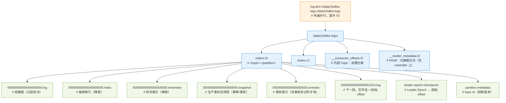
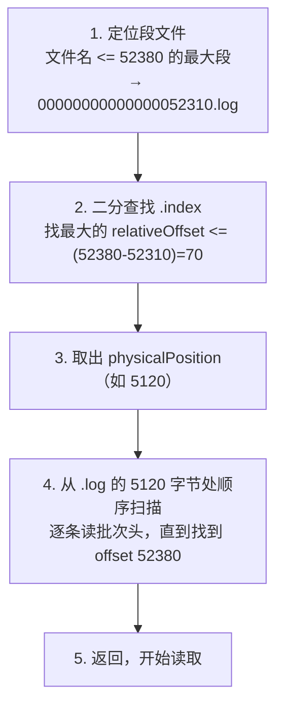

# 💾 五、Kafka 日志存储与副本机制

> 本文回答两个问题：**① 消息在 broker 磁盘上长什么样、怎么被找到、怎么被清理？② 同一份数据在多个 broker 之间怎么同步、怎么保证不丢、主挂了怎么办？**
> ISR / HW / LEO / LSO / Leader Epoch 是这一层最硬、也最常被问到的部分。
> 关联：[[1-Kafka总览]]、[[2-架构与核心概念]]、[[3-生产者原理]]、[[6-事务与Exactly-Once]]、[[7-运维与集群调优]]、[[10-面试高频题]]。

---

## 一、磁盘布局

### 1.1 `log.dirs` 与目录结构

| 配置 | 默认值 | 说明 |
|---|---|---|
| `log.dirs` | **`null`** | 逗号分隔的多个目录；**未设置时回退到 `log.dir`** |
| `log.dir` | **`/tmp/kafka-logs`** | 单目录形式；生产**必须显式改掉**，否则重启可能丢数据目录 |



目录命名规则是 `<topic>-<partition>`，**每个分区是一个独立目录**。这带来两个直接好处：① 分区可以独立做保留/清理（删除就是删目录）；② `log.dirs` 有多个盘时，分区会被均摊到各盘，天然并行 IO。

### 1.2 各文件类型

| 后缀 | 内容 | 何时产生 |
|---|---|---|
| `.log` | 真正的记录批次（RecordBatch），**顺序追加** | 每段必有 |
| `.index` | 稀疏映射：**相对偏移 → 物理位置** | 每段必有 |
| `.timeindex` | 稀疏映射：**时间戳 → 相对偏移** | 每段必有 |
| `.snapshot` | 该分区上各 PID 的**序号状态**，用于幂等/事务恢复 | 有过幂等/事务写入后 |
| `.txnindex` | 本段内**已中止事务**的 PID 及其起始 offset | 段内含事务标记时 |
| `leader-epoch-checkpoint` | Leader Epoch 与该纪元起始 offset 的对应关系 | 分区级，1 个 |
| `partition.metadata` | topic id，防止分区被错误挂到别的 topic | 较新版本 |

> [!note] `.snapshot` 解释了幂等为什么能跨 broker 重启去重
> broker 必须把 `(PID, 分区)` 的序号状态**持久化**，否则重启后无法判断"这条是不是重复的"。
> 因此如果 topic 保留策略过于激进（例如 `retention.ms` 只有几分钟），producer 状态可能被过早清理，从而出现 `UnknownProducerIdException`。

### 1.3 为什么这样设计

| 设计选择 | 原因 |
|---|---|
| **顺序追加，不可修改** | 磁盘顺序写远快于随机写；追加天然无锁 |
| **分段而不是单文件** | 保留/清理的最小单位是**段**；单文件无法安全删掉旧数据 |
| **稀疏索引而非稠密索引/B+树** | 索引要 mmap 常驻内存；稀疏索引牺牲"几次读"换取"索引极小" |
| **不可变日志 + offset** | 位移就是"我读到哪了"，存储与消费解耦，天然支持重放与多消费者 |

**核心心法：Kafka 的存储不是数据库，而是日志（log）。** 数据库为随机读写优化，Kafka 为顺序追加 + 顺序扫描优化；稀疏索引、定期滚动、后台压缩都是为了维持这个前提。

---

## 二、分段与滚动

### 2.1 段（segment）

一个分区的日志被切成多个段，**文件名就是该段第一条消息的 offset**（20 位左补零）：

```text
00000000000000000000.log   ← 起始 offset = 0
00000000000000052310.log   ← 起始 offset = 52310
```

正在被写入的段叫 **active segment（活跃段）**；只有活跃段被追加，其余段只读。

### 2.2 滚动触发条件

| 触发条件 | 配置 | 默认值 |
|---|---|---|
| 段大小达到上限 | `log.segment.bytes` | `1073741824`（1 GiB） |
| 段存在时间达到上限 | `log.roll.ms`（主）/ `log.roll.hours`（次） | `null` / `168`（7 天） |
| 索引文件写满 | `log.index.size.max.bytes` | `10485760`（10 MiB） |
| 保留条件被满足 | `log.retention.*` | 见 4.2 |

**时间参数优先级**：`log.roll.ms` > `log.roll.hours`。`log.roll.ms` 默认 `null`，此时用 `log.roll.hours`（168 小时 = 7 天）。topic 级对应配置是 `segment.ms`（默认 `604800000`）与 `segment.bytes`。

> [!warning] `log.retention.ms` / `log.retention.bytes` 会"顺带"触发滚动
> 官方明确：这两个保留配置**独立于** `segment.ms` / `segment.bytes` 生效，且**当保留条件被满足时会触发新段滚动**。
> 原因很直白：**保留策略只能整段删除，不能删半段**。若数据都堆在一个永不滚动的活跃段里，保留策略永远无法执行。

### 2.3 段大小怎么选

| `log.segment.bytes` | 影响 |
|---|---|
| **调大**（≥1GB） | 文件数少、索引开销低；但**保留/清理粒度变粗**，可能为删 1 小时数据而被迫保留一整天 |
| **调小**（如 128MB） | 保留粒度精细、清理及时；但文件数暴增，**打开的文件句柄变多**，启动时日志恢复变慢 |

生产建议：默认 1GB 对高吞吐 topic 通常合理；若 retention 是小时级的（日志采集类），把段调小到 128MB～256MB，让粒度与保留时长匹配。另外 `log.segment.delete.delay.ms`（默认 `60000`）控制文件从文件系统删除前的等待时间，避免正在读的消费者出错。

---

## 三、索引

### 3.1 偏移索引（`.index`）：每条 8 字节

| 字段 | 长度 | 含义 |
|---|---|---|
| `relativeOffset` | 4 字节 int | `绝对 offset - 段起始 offset` |
| `physicalPosition` | 4 字节 int | 该消息在 `.log` 中的字节位置 |

存**相对偏移**而非绝对偏移，是为了用 4 字节 int 而不是 8 字节 long —— 段内偏移不可能超过 int 范围，省掉一半空间。

**"稀疏"的含义**：不是每条消息都记索引，而是**大约每写入 `log.index.interval.bytes`（默认 4096 字节 = 4KB）才追加一条索引项**。官方原文：*"The default setting ensures that we index a message roughly every 4096 bytes. More indexing allows reads to jump closer to the exact position in the log but makes the index larger."*

索引文件**预先按 `log.index.size.max.bytes`（10MB）分配**，段滚动后再收缩到实际大小。1 个 10MB 索引 ≈ 131 万条 × 4KB ≈ **5GB 日志**，比例相当划算。

### 3.2 时间索引（`.timeindex`）：每条 12 字节

| 字段 | 长度 | 含义 |
|---|---|---|
| `timestamp` | 8 字节 long | 消息时间戳 |
| `relativeOffset` | 4 字节 int | 对应的相对偏移 |

它支撑"按时间找 offset"（`offsetsForTimes()`、按时间回溯、Flink 按时间重置），底层是 `ListOffsets` 请求。

### 3.3 一次 offset 查找的完整过程

假设消费者要从 `offset = 52380` 开始读：



第 2 步是**二分查找**（索引项有序、定长，可直接用 `n * 8` 定位下标）；第 4 步是**顺序扫描**，但因为索引"每 4KB 一条"，最多只需扫约 4KB 就能命中。**这就是稀疏索引的精妙：用极小的内存换一次极短的顺序扫描。**

### 3.4 为什么索引用 MMAP

索引通过 **`MappedByteBuffer`（内存映射）**访问，而不是 `read()` 系统调用：查询无系统调用、无用户态/内核态拷贝，直接读页缓存；索引小且访问集中，易长期驻留页缓存；追加也走 mmap，近乎零开销。

> [!tip] 索引损坏是可以修的
> 若异常断电导致 `.index` / `.timeindex` 损坏，**它们可以安全重建**：删掉这两个文件，Kafka 启动时会扫描对应 `.log` 重建索引（代价是启动变慢）。**`.log` 才是唯一不可再生的数据。**

---

## 四、日志清理策略

### 4.1 三种策略

| `log.cleanup.policy` | 含义 | 典型场景 |
|---|---|---|
| **`delete`**（默认） | 按时间/大小**整段删除**旧数据 | 常规消息、日志采集、埋点 |
| **`compact`** | 按 key **保留每个 key 的最新值**，删除旧版本 | 位点、配置、CDC |
| **`delete,compact`** | 同时生效：超窗口的段被删，窗口内保留的段被压缩 | 既控总量又保留最新态 |

合法值是列表形式 `[compact, delete]`，broker 级默认 `delete`，**实际以 topic 配置为准**。

### 4.2 `delete`：按时间与大小

| 配置 | 默认值 | 说明 |
|---|---|---|
| `log.retention.ms` | `null`（主） | 毫秒；`-1` 表示**不限时间** |
| `log.retention.minutes` | `null`（次） | 分钟 |
| `log.retention.hours` | **`168`**（三次） | 小时 = 7 天 |
| `log.retention.bytes` | `-1` | **每个分区**的大小上限 |
| `log.retention.check.interval.ms` | `300000`（5 分钟） | 后台检查间隔 |

**优先级**：`log.retention.ms` > `log.retention.minutes` > `log.retention.hours`，**设置了高优先级项则低优先级项被忽略**。

两个易踩点：① `log.retention.bytes` 是**分区级**的，topic 总占用 ≈ `retention.bytes × 分区数`；② **删除最小单位是段，活跃段永远不删**，所以单分区实际占用可能明显超过 `retention.bytes`。

### 4.3 `compact`：日志压缩机制

#### 它做什么

**保证对每个 key 至少保留其最新 value。** 注意是"至少"——它是**后台异步**过程，不是实时去重。

```text
压缩前：offset 0   1   2   3   4   5
        key    K1  K2  K1  K3  K2  K1
        value  v1  w1  v2  x1  w2  v3

压缩后：offset 3   4   5
        key    K3  K2  K1
        value  x1  w2  v3
```

**注意 offset 出现空洞**（0/1/2 被删）。这是正常现象：**offset 是消息的永久身份，不会被重排或复用**。

#### 谁来压缩：Cleaner

| 配置 | 默认值 | 说明 |
|---|---|---|
| `log.cleaner.enable` | **`true`** | **若用 `compact` 却关掉它，日志会无限增长** |
| `log.cleaner.threads` | `1` | 压缩线程数（IO + CPU 密集，开多会与正常读写抢资源） |
| `log.cleaner.dedupe.buffer.size` | `134217728`（128MB） | 去重 offset map 缓冲区 |
| `log.cleaner.backoff.ms` | `15000` | 无日志可压缩时的退避 |
| `log.cleaner.io.max.bytes.per.second` | 无上限 | 限速用，防压缩打满磁盘 |

#### 何时触发

日志被划分为**已压缩的干净部分（clean）**与**未压缩的脏部分（dirty）**，**活跃段永不参与压缩**。

| 配置 | 默认值 | 说明 |
|---|---|---|
| `log.cleaner.min.cleanable.ratio`（topic：`min.cleanable.dirty.ratio`） | **`0.5`** | 脏数据占比达 50% 才值得压缩 |
| `log.cleaner.min.compaction.lag.ms`（topic：`min.compaction.lag.ms`） | `0` | 消息至少多久不参与压缩，给消费者留读取窗口 |
| `log.cleaner.max.compaction.lag.ms`（topic：`max.compaction.lag.ms`） | `Long.MAX_VALUE` | 消息**最多**多久必须变得可压缩 |

官方对触发条件的精确表述：当 min/max 两个 lag 也被指定时，满足**下列任一**即可压缩：① 脏比例阈值已满足，且脏记录存在时间**至少**达到 `min.compaction.lag.ms`；**或** ② 脏记录存在时间**至多**达到 `max.compaction.lag.ms`。

**为什么默认 0.5**：官方解释这个比例限定了"日志中因重复而浪费的最大空间"——阈值 0.5 意味着最坏情况 50% 空间冗余。**调高** → 压缩更少、单次更高效，但浪费空间更多；**调低** → 更频繁、空间利用率高，但 IO 压力大。

#### 墓碑（Tombstone）

**value 为 `null` 的消息就是墓碑**，语义是"这个 key 被删除了"。

| 配置 | 默认值 | 说明 |
|---|---|---|
| `log.cleaner.delete.retention.ms`（topic：`delete.retention.ms`） | **`86400000`**（1 天） | 墓碑保留多久 |

墓碑的完整生命周期：

1. 写入 `key=K, value=null` → 标记删除；
2. 在 `delete.retention.ms` 内，**墓碑以及比它更早的该 key 的所有记录**都被保留（保证从 offset 0 开始读的消费者能先看到旧值、再看到墓碑）；
3. 超过该时间后，cleaner 把墓碑**和它之前该 key 的所有记录一起删除**；
4. 该 key 彻底消失。

官方点明了这个时间窗的另一层含义：它同时是"**消费者若从 offset 0 开始扫描，必须在该时间内完成**"的上界——否则消费者可能在墓碑被回收后才开始读，从而**看不到删除动作**，拿到的状态快照是错的。

> [!warning] 墓碑保留时间必须覆盖消费端的重建周期
> 若你用压缩 topic 做"状态重建"（Streams state store 重建、缓存预热），**重建耗时必须小于 `delete.retention.ms`**。否则重建中墓碑已消失，你会漏掉"某 key 已删除"，缓存里就会残留幽灵数据。

### 4.4 什么时候该用压缩

| 适合 `compact` | 不适合 |
|---|---|
| **消费位移**：`__consumer_offsets` 每个 `(group, topic, partition)` 只要最新位移 | **事件流**：每个事件都有独立价值 |
| **CDC 变更日志**：每行数据的最新状态（key = 主键） | **审计日志**：需要完整历史 |
| **Kafka Streams 的 changelog** | **指标/埋点**：需要全量计数 |
| **配置/元数据广播**、**实体最新快照** | 需要按 offset 严格递增消费的场景 |

**代价与陷阱**：① 它不是实时的，同一 key 任意时刻都可能有多个版本，**消费端必须容忍重复**；② **offset 会空洞**，不要假设"offset 连续 = 没丢消息"；③ **活跃段不压缩**，持续被写的 key 的历史版本可能长期存在；④ 大 topic 首次开压缩（尤其从 `delete` 改 `compact`）可能引发长时间磁盘压力，建议低峰期小规模验证。

---

## 五、消费位置与时间查找

### 5.1 `__consumer_offsets` 本身就是压缩 Topic

消费位移存在内部 topic **`__consumer_offsets`**（旧版本存 ZooKeeper）。key = `(group.id, topic, partition)`，value = 已提交 offset，**只保留每个 key 的最新值**——压缩策略的教科书用法。

| 参数 | 默认值 |
|---|---|
| `offsets.topic.num.partitions` | `50` |
| `offsets.topic.replication.factor` | `3` |

官方明确：`log.cleaner.enable` 应保持开启，因为它也负责压缩内部 offsets topic；**关掉会导致该 topic 无限增长**。

> [!note] `offsets.topic.replication.factor` 默认是 3
> 官方说明：**在集群规模达到这个副本数要求之前，内部 topic 创建会失败**。
> 这就是单机开发环境第一次提交位移就报错的原因——需显式调成 1，或同时调小相关默认值。

### 5.2 offset → 文件 → 物理位置

| 层次 | 映射关系 | 用到谁 |
|---|---|---|
| 逻辑 | 消费者持有 `offset` | 消费者 / `__consumer_offsets` |
| 文件 | `offset` → 段（文件名 <= offset 的最大段） | 内存中的段列表 |
| 段内偏移 | `offset` → `relativeOffset` | 段起始 offset |
| 物理 | `relativeOffset` → `.index` 二分 → `physicalPosition` | 偏移索引（mmap） |
| 字节 | `physicalPosition` → 顺序扫描 `.log` 定位批次 | `.log` 文件 |

### 5.3 按时间查找 offset

```bash
# 按时间找 offset
kafka-get-offsets.sh --bootstrap-server localhost:9092 --topic orders --time 1759996800000
kafka-get-offsets.sh --bootstrap-server localhost:9092 --topic orders --time -2   # 最早可用 offset
kafka-get-offsets.sh --bootstrap-server localhost:9092 --topic orders --time -1   # 最新 offset（LEO）
```

broker 的处理：用 `.timeindex` 二分查找"时间戳 <= 目标"的最大索引项 → 得 offset → 再用偏移索引定位 → 顺序扫描校验，最终返回**时间戳 >= 目标值的最小 offset**。

**边界语义**：`--time -2` = 最早可用 offset（log start offset），`-1` = 最新 offset（**LEO，不是 HW**）。这两个特殊值在排查"消息是不是被删了"时极其有用：若 `-2` 的返回值远大于你以为的起点，说明旧数据已被 retention 删掉。

### 5.4 与 `auto.offset.reset` 的交互

`auto.offset.reset` 默认 **`latest`**，**只在"没有可用位移"时生效**，分两种情形：

| 情形 | 触发条件 | 行为 |
|---|---|---|
| 该组**从未提交过位移** | 新消费组、位移已过期被清理 | 按 `latest`（只读新消息）/ `earliest`（从头读） |
| 已提交位移**越界** | 位移指向的位置已被 retention 删除 / log start offset 前移 | **同样触发 reset 策略** |

> [!warning] 越界会静默触发 reset，这是"消息莫名丢失"的常见元凶
> 消费组停了很久（超过 `retention.ms`），重启后位移已越界 → Kafka **静默按 `auto.offset.reset` 重置**。
> 若配置是 `latest`，中间积累的消息**全部被跳过，且不会有明显报错**（日志里只有一条 reset 记录）。
> 排查：搜消费者日志里的 `Resetting offset for partition ... to offset ...`；或先停组、用 `kafka-consumer-groups.sh --describe` 记录位移再判断。

---

## 六、为什么快：顺序写 + PageCache + 零拷贝

### 6.1 顺序追加写 + 不 fsync

Kafka 只往段文件**末尾追加**，不做原地更新。现代磁盘（含 HDD）的顺序写速度可比随机写高几个数量级，且追加几乎不需要文件锁。

| 配置 | 默认值 | 说明 |
|---|---|---|
| `log.flush.interval.messages` | `9223372036854775807`（`Long.MAX_VALUE`，即**不按条数刷**） | 消息数达到多少才 fsync |
| `log.flush.interval.ms` | `null`（不按时间刷） | 多久 fsync 一次 |

**默认配置的含义是：Kafka 几乎不做 fsync，把刷盘交给操作系统。**

> [!note] 这不是"不持久"，而是"用复制代替 fsync"
> 官方原话：一般建议**不要设置这两个参数**，而是**依靠副本机制保证持久性，让操作系统的后台刷盘能力来做**，这样更高效。
> 因为 fsync 昂贵，而 Kafka 的可靠性模型是"多副本"而非"单机磁盘持久"——一台 broker 断电，只要还有 ISR 副本，数据就还在。
> **推论**：若你既用 `replication.factor=1` 又不开 fsync，那才是真正的"随时可能丢"。

### 6.2 PageCache

```text
写入：生产者 → 网络 → broker 内存 → write() 到 PageCache（脏页）→ OS 后台刷盘
读取：PageCache 命中 → 直接返回（不碰磁盘）
```

"最近写入的数据马上就能被消费"靠的就是 PageCache——**热数据根本不落盘就能读**。

### 6.3 零拷贝（`sendfile`）

传统"读文件再写网络"要经历 **4 次拷贝 + 2 次系统调用**：

```text
磁盘 →(DMA)→ 内核 PageCache →(CPU 拷贝)→ 用户缓冲区 →(CPU 拷贝)→ socket 缓冲区 →(DMA)→ 网卡
              read() 系统调用                        write() 系统调用
```

Kafka 走 `FileChannel.transferTo()` → **`sendfile` 系统调用**，把数据直接从 PageCache 送到 socket：

```text
磁盘 →(DMA)→ 内核 PageCache →(DMA，scatter-gather)→ 网卡
```

**没有用户态参与，CPU 拷贝次数从 2 次降到 0 次（数据本身不经过用户空间）**——这就是 broker 转发消息时 CPU 几乎不碰数据内容的底层原因。源码路径也印证：

```java
// FileRecords（简化）
public int writeTo(TransferableChannel destChannel, int offset, int length) {
    return (int) destChannel.transferFrom(channel, position, count);
}

// PlaintextTransportLayer：真正走 sendfile
public long transferFrom(FileChannel fileChannel, long position, long count) {
    return fileChannel.transferTo(position, count, socketChannel);
}
```

### 6.4 零拷贝的例外：TLS / SSL

**启用 SSL 后零拷贝失效**，因为加密必须把数据读进用户态缓冲区处理：

```java
// SslTransportLayer：退化为"读进缓冲区 + 加密 + 写"
public long transferFrom(FileChannel fileChannel, long position, long count) {
    // 按 32KB 的块读入 fileChannelBuffer，再加密写入 netWriteBuffer
    int transferSize = 32768;
    ...
}
```

源码注释说明 32KB 是在"较高效的磁盘读取、每连接内存开销、通常能一次 write 排空"之间取的折中（netWriteBuffer 约 16KB，socket 发送缓冲默认约 100KB）。

| 场景 | 影响 |
|---|---|
| 内网明文（`PLAINTEXT`） | 完整零拷贝 |
| 启用 TLS | **失去零拷贝**，broker CPU（加解密 + 拷贝）明显上升 |
| 结论 | 对吞吐敏感的集群要给 TLS 留足 CPU；或把 TLS 终结在内网边界、内部走明文（需评估合规） |

### 6.5 索引 MMAP

如 3.4 所述，`.index` / `.timeindex` 通过 `MappedByteBuffer` 访问，**查询不产生系统调用**。因此一次消费读取的完整成本是：索引查找（mmap，内存操作）+ 日志数据（sendfile，无 CPU 拷贝）——**几乎全部由 DMA 和内存带宽完成**。

---

## 七、分区与副本模型

### 7.1 leader / follower

每个分区有 **1 个 leader + N-1 个 follower**（N = `replication.factor`）。

| 角色 | 职责 |
|---|---|
| **leader** | 处理**所有**生产与消费请求（读写都走 leader） |
| **follower** | **只做一件事：主动向 leader 发 Fetch 请求**拉数据保持同步；不对外服务 |

**为什么 follower 不承担读？** 这是明确的设计选择：副本同步是异步的，让 follower 服务读会带来"读到旧数据"的一致性问题。Kafka 用"单 leader 读写"换来简单的一致性模型。

### 7.2 副本分配

```bash
kafka-topics.sh --bootstrap-server localhost:9092 \
  --create --topic orders --partitions 6 --replication-factor 3
```

不指定 `--replica-assignment` 时由 **controller 自动分配**：① 每个分区的副本尽量**均匀分散**到所有 broker；② 列表中的**第一个副本是 preferred leader（首选 leader）**；③ 尽量让同一分区的多个副本落在**不同 broker** 上（否则副本形同虚设）。

### 7.3 机架感知

| 配置 | 默认值 | 说明 |
|---|---|---|
| `broker.rack` | `null` | broker 所在机架标识，如 `us-east-1a`、`RACK1` |

**未设置时副本可能全部落在同一机架**——整个机架断电/交换机故障就会导致数据不可用甚至丢失。设置后，controller 分配副本时会**尽量把同一分区的副本分散到不同机架**（如 RF=3、3 个机架则各一个），从而容忍**整个机架**故障。

**注意**：`broker.rack` 只在**副本分配阶段**起作用。已存在的 topic **不会**因为给 broker 加了 rack 就自动重分布，需要手动 `kafka-reassign-partitions.sh`。

---

## 八、ISR：In-Sync Replicas

### 8.1 定义与两个常见误解

**ISR = 与 leader 保持同步的副本集合，且包含 leader 自己。**

| 误解 | 事实 |
|---|---|
| "ISR 就是所有活着的副本" | **不是**。活着但**同步落后超时**的副本会被踢出 |
| "ISR 按落后多少条消息判定" | **不是**。现代 Kafka 是**基于时间**判定 |

### 8.2 进入 / 离开 ISR

| 动作 | 条件 |
|---|---|
| **进入 ISR** | follower 追上了 leader 的 LEO（同步进度在阈值内） |
| **离开 ISR** | 在 `replica.lag.time.max.ms` 内**没有发过 Fetch 请求**，**或者**没消费到 leader 的 LEO |

官方对 `replica.lag.time.max.ms`（默认 **`30000`**，30 秒）的原文：

> *If a follower hasn't sent any fetch requests or hasn't consumed up to the leaders log end offset for at least this time, the leader will remove the follower from isr.*

**注意这是"或"的关系**：不只是"落后"，**连不上（不发 Fetch）同样被踢出**。所以 broker 进程假死、GC 长停顿、网络分区，都会通过"没有 Fetch 请求"这条路被判定为失联。

### 8.3 为什么基于时间而不是条数

早期 Kafka 用过 `replica.lag.max.messages`（按落后条数），后被废弃：

- **按条数在不同吞吐下没有可比性**：低吞吐时落后 1000 条可能耗时几分钟（其实健康），高吞吐时落后 1000 条可能只有 10ms（其实危险）；
- **瞬时抖动会造成 ISR 频繁抖动**：流量突发时 follower 短时落后就超标，导致 ISR 反复收缩、HW 停滞、可用性下降；
- **按时间判定语义稳定**：无论吞吐多少，"30 秒没跟上"都表示这个副本确实有问题。

> [!tip] ISR 抖动是线上最危险的信号之一
> 连锁反应：① `acks=all` 的写入若撞上 ISR 收缩到小于 `min.insync.replicas`，会**直接拒写**（可用性事故）；② HW 推进变慢，`read_committed` 消费者可见延迟变大；③ 频繁 leader 切换带来额外抖动。
> **排查方向**：GC 停顿（看 GC 日志）、网络抖动、磁盘 IO 瓶颈（follower 拉不动）、`num.replica.fetchers` 过小。

### 8.4 副本同步相关参数

| 配置 | 默认值 | 说明 |
|---|---|---|
| `replica.lag.time.max.ms` | `30000` | ISR 判定窗口 |
| `replica.fetch.max.bytes` | `1048576`（1MB） | 每分区每次 Fetch 最大字节数。**不是绝对上限**：若第一个非空分区的第一个批次就大于它，该批次仍会返回以保证同步推进 |
| `replica.fetch.wait.max.ms` | `500` | follower 拉取请求最大等待时间，应小于 `replica.lag.time.max.ms` |
| `num.replica.fetchers` | `1` | 每 broker 用于同步的 fetcher 线程数；调大可提升 IO 并行度，代价是更高 CPU/内存 |
| `replica.fetch.response.max.bytes` | `57671680`（55MB） | 整个 Fetch 响应上限 |

> [!warning] 大消息场景的必查项
> 若单条消息（压缩后批次）超过 `replica.fetch.max.bytes`（1MB），虽然文档说"第一个批次仍会返回"，但在高吞吐 + 大消息组合下**副本同步速度会被显著拖慢**，进而触发 ISR 收缩。
> 生产上发大消息时，`replica.fetch.max.bytes` 应**大于** `message.max.bytes`。

---

## 九、LEO / HW / LSO

### 9.1 精确定义

| 概念 | 全称 | 精确定义 | 谁的属性 |
|---|---|---|---|
| **LEO** | Log End Offset | **下一条**将要被写入的消息的 offset（= 日志末尾 + 1） | **每个副本各有一份**，互不相同 |
| **HW** | High Watermark | 已被**所有 ISR 副本**同步到的位置；消费者可见上限 | 分区级，由 leader 计算并传播 |
| **LSO** | Last Stable Offset | 所有 offset 小于它的消息都**已提交或已中止**；`read_committed` 可见上限 | 分区级，与事务相关 |

关系：**`LSO <= HW <= leader 的 LEO`**。没有进行中的事务时 **`LSO == HW`**。

### 9.2 经典图示

```text
                        HW        LEO
                         ↓         ↓
leader:   [0][1][2][3][4][5][6][7]  ·
                         └─────────┘
                     已复制到所有 ISR（消费者可见）
                                  └── 已写入 leader，但未被所有 ISR 确认
                                      （消费者不可见！）

followerA: [0][1][2][3][4][5]        ← 落后，LEO=6
followerB: [0][1][2][3][4][5][6]     ← 落后，LEO=7

HW = min(所有 ISR 副本的 LEO) = 6
     → 消费者最多只能读到 offset 5
```

offset 6 已经在 leader 与 followerB 上，但 **followerA 还没有**，所以 HW 停在 6，**offset 6 对消费者不可见**。

### 9.3 为什么消费者只能读到 HW

因为 **offset >= HW 的消息还没被所有 ISR 副本确认**。设想一个具体事故：

1. leader 收到 `offset=6` 写进本地日志（LEO 变 7），还没同步给 followerA；
2. 若此时**允许消费者读到 offset 6**，消费者处理完并写进了数据库；
3. leader 随即宕机，followerA 成为新 leader（它在 ISR 里，但 LEO 只有 6，**没有 offset 6**）；
4. 新 leader 截断掉 offset >= 6 的数据 → **offset 6 消失**；
5. 消费者却已经处理过它 → **下游有结果，Kafka 里却没这条消息**。

**HW 的作用就是封住这个窗口**：只有"所有 ISR 都确认了"的数据才可见，因为那些数据在任何合法的 leader 切换后都仍然存在。

> [!warning] `read_uncommitted` 也无法突破 HW
> 易混淆点：`isolation.level=read_uncommitted` **只是不受 LSO 限制**，它**仍然只能读到 HW**。
> HW 是"副本安全性"边界，LSO 是"事务可见性"边界，约束维度不同。

### 9.4 LSO 与事务

| 隔离级别 | 可见上限 |
|---|---|
| `read_uncommitted`（默认） | **HW**（未提交事务的数据也会被读到） |
| `read_committed` | **LSO**（未提交事务之后的数据一律不可见） |

**LSO = 第一个"未提交事务"的起始 offset**；无未提交事务时 LSO = HW。例如 HW = 100，offset 60 处有尚未提交的事务：`read_uncommitted` 能看到 0~99，而 `read_committed` 只能看到 0~59。

**注意**：即使 offset 80 的事务已提交，`read_committed` 消费者也**不能越过 LSO=60**——Kafka 保证"按 offset 顺序的可见性"，不允许空洞。这就是**长事务会阻塞消费进度**的根本原因：一个迟迟不提交的事务会把 LSO 钉死，让 `read_committed` 消费者完全停滞。

---

## 十、Leader Epoch 与日志截断

### 10.1 0.11 之前的数据丢失 bug

0.11 之前副本的**日志截断基于 HW**。由于 **HW 的传播是异步、有延迟的**，KIP-101 明确列出了两个问题：

| 问题 | 说明 |
|---|---|
| **① 不必要的截断，造成已提交数据丢失** | 副本按自己的 HW 截断，可能把**已经提交过的数据**删掉 |
| **② 副本日志分叉（divergent log）** | 不同副本在**同一个 offset 上存了不同的消息**——比多几条少几条更可怕，因为后续基于 offset 的一切（消费者位移、副本比较）都会错乱 |

典型场景：

```text
1. leader A 写入 m1(offset 0)，follower B 同步到；HW=1
2. B 重启/网络抖动，暂时离开同步
3. A 继续写入 m2(offset 1)、m3(offset 2)，但 HW 仍停在 1（B 没确认）
4. A 宕机；B 被选为新 leader（B 的 LEO=1，只有 m1）
5. B 开始接收新写入，在 offset 1 写入 m4
6. A 恢复成为 follower。A 的日志是 [m1,m2,m3]，B 是 [m1,m4]
   → 两个副本在 offset 1 上是不同消息 = 日志分叉
```

`m2`、`m3` 已经被 producer 以成功响应确认过（A 是 leader），**就这样丢了或被替换了**。

### 10.2 Leader Epoch 怎么修

**Leader Epoch = 单调递增的整数，每次换成新 leader 时 +1。** 每个副本维护 `leader-epoch-checkpoint` 文件：

| Leader Epoch | 该纪元开始的 offset |
|---|---|
| 0 | 0 |
| 5 | 120 |
| 9 | 450 |

含义：epoch 5 期间 leader 从 offset 120 开始写；epoch 9 从 450 开始。

**关键机制**：新的 follower（或重启副本）**不再按自己的 HW 截断**，而是**向当前 leader 询问"某个 epoch 的结束 offset 是多少"（`OffsetsForLeaderEpoch` API）**，然后**只截断到那个位置**。

为什么这样就安全？因为**新 leader 只能从 ISR 中选出**，而 ISR 副本拥有所有**已提交**数据。所以：① **已提交数据不会被截断**（问题 ①解决）；② 副本会就"每个 epoch 的边界 offset"达成一致，分歧部分被明确截断，不会各留一份（问题 ②解决）。

> [!note] 为什么叫 "OffsetsForLeaderEpoch"
> 请求语义是："**在你（leader）看来，epoch = E 的最后一个 offset 是多少？**"
> follower 拿这个答案与自己的日志比对，把多出来的、属于已失效纪元的分歧数据截断掉。这是"用纪元协商截断点"替代"用 HW 猜截断点"。
> **排查时看**：`leader-epoch-checkpoint` 文件内容，以及 broker 日志中的 `Truncating to offset ...` 与 `New leader ... with leader epoch ...`。

---

## 十一、选举与故障转移

### 11.1 ISR 内选举（正常路径）

| 概念 | 说明 |
|---|---|
| **preferred leader** | 副本分配列表里的**第一个**副本；理想情况下一直是 leader |
| **ISR 内选举** | leader 挂了，controller 从**当前 ISR** 里挑一个作为新 leader |
| **preferred leader 选举** | 当 leader 不是 preferred leader 时把它"迁回"首选副本，使负载均衡 |

| 配置 | 默认值 | 说明 |
|---|---|---|
| `auto.leader.rebalance.enable` | `true` | 自动把 leader 迁回 preferred leader |
| `leader.imbalance.per.broker.percentage` | `10` | leader 不均衡超过该百分比触发 rebalance |
| `leader.imbalance.check.interval.seconds` | `300` | 检查间隔 |

**因为只在 ISR 内选举，且 ISR 拥有全部已提交数据，所以正常情况下不会丢数据。**

### 11.2 非 ISR 选举（unclean）：可用性 vs 持久性

```properties
unclean.leader.election.enable = false   # 默认值
```

| 取值 | 行为 | 后果 |
|---|---|---|
| **`false`（默认）** | ISR 里没有活着的副本时，**分区不可用**（一直等 ISR 副本回来） | **保数据，牺牲可用性** |
| `true` | 允许从**非 ISR 副本**中选 leader | **分区恢复可用，但会丢数据** |

> [!warning] 这是最需要业务方点头的一个开关
> 官方描述是 "as a last resort"（最后手段）。打开它，等于用**已确认的数据**换**分区可用**。
> 典型决策：订单、支付、账务类 topic **必须保持 `false`**；纯日志、可重放数据可容忍 `true`。
> **注意**：KRaft 模式下动态开启该配置后，需等 unclean election 线程周期性触发（**默认 5 分钟**）；要立刻执行就用 `kafka-leader-election.sh` 的 `unclean` 选项手动触发。

### 11.3 受控关闭

| 配置 | 默认值 | 说明 |
|---|---|---|
| `controlled.shutdown.enable` | `true` | 关闭前先把 leader 身份**主动转移**给其他副本 |
| `controlled.shutdown.max.retries` | `3` | 转移失败的重试次数 |
| `controlled.shutdown.retry.backoff.ms` | `5000` | 重试间隔 |

**作用**：优雅重启时先把该 broker 上的 leader 分区迁走，避免"关闭瞬间大量分区同时触发选举"（会造成几秒到几十秒不可用）。**所以运维重启 broker 一定用 `kafka-server-stop.sh`（触发受控关闭），不要直接 `kill -9`。**

### 11.4 副本同步与 `acks` 的联动

```text
① producer(acks=all) 发送 → leader 追加到本地日志，LEO+1
② follower1、follower2 通过 Fetch 拉取，各自追加并更新自己的 LEO
③ leader 等【全部 ISR】确认（收到 follower 的 Fetch 上报）
④ ISR 全部到位 → leader 推进 HW = min(ISR 的 LEO)
⑤ leader 才回复 producer 成功
⑥ 随后的 FetchResponse 里把新 HW 带回给 follower
```

**关键顺序**：leader 一定**先等 ISR 全部确认，再推进 HW，最后才回复 producer**。这保证"producer 收到成功 ⇒ 数据已被所有 ISR 持有 ⇒ 消费者可见"，也保证 HW 永远不会超过"任何 ISR 副本都已拥有的位置"。

**`acks=all` + ISR 缩水的后果**：

| 场景 | 结果 |
|---|---|
| ISR 数量 >= `min.insync.replicas` | 正常写入，HW 正常推进 |
| ISR 数量 < `min.insync.replicas`（如 RF=3、min.insync=2，挂了 2 个） | broker **拒绝写入**，返回 `NOT_ENOUGH_REPLICAS`，producer 侧表现为重试后 `TimeoutException` |

这就是 [[3-生产者原理]] 里"`acks=all` 不等于绝对不丢"的服务端解释：**Kafka 选择"拒写"而不是"降级写入"**——保可靠性，牺牲可用性。

---

## 十二、Kafka 4.0 / KRaft 的存储侧变化

| 版本 | 状态 |
|---|---|
| 2.8 | KRaft 引入（实验性） |
| 3.3 | **KRaft 生产就绪**，成为新集群推荐模式 |
| 3.x | ZooKeeper 模式**已废弃（deprecated）** |
| **4.0** | **ZooKeeper 模式被完全移除，KRaft 是唯一选择** |

**对存储侧的实际影响：升级到 4.0 之前必须先完成 ZK → KRaft 迁移**（方案见 [[7-运维与集群调优]]）。

KRaft 下元数据不再放 ZooKeeper，而是：

| 概念 | 说明 |
|---|---|
| **Controller Quorum** | 一组 controller 节点，用 **Raft** 组成仲裁 |
| **`__cluster_metadata`** | 元数据日志，是一个**单分区**内部 topic，存在 controller 的 `__cluster_metadata-0` 目录 |
| `metadata.log.dir` | 元数据日志目录；**未设置时使用 `log.dirs` 的第一个目录** |
| `controller.quorum.voters` | 定义 controller 仲裁成员（id@host:port） |

**设计上的优雅之处**：Kafka 用自己最擅长的东西（一个复制的日志）来存自己的元数据——`__cluster_metadata` 就是一个 `RF = controller 数量` 的单分区日志，controller 之间通过 Raft 复制。所以"元数据变更"与"消息写入"在底层是同一套机制。

```bash
kafka-metadata-quorum.sh --bootstrap-server localhost:9092 describe --status
kafka-metadata-shell.sh --snapshot /data/kafka/__cluster_metadata-0/00000000000000000000.log
```

---

## 十三、动手：命令与输出解读

### 13.1 `kafka-topics.sh --describe`：读懂 ISR

```bash
kafka-topics.sh --bootstrap-server localhost:9092 --describe --topic orders
```

```text
Topic: orders   TopicId: 7Xy...   PartitionCount: 3   ReplicationFactor: 3
    Configs: min.insync.replicas=2,cleanup.policy=delete,retention.ms=604800000
    Topic: orders  Partition: 0  Leader: 1  Replicas: 1,2,3  Isr: 1,2,3
    Topic: orders  Partition: 1  Leader: 2  Replicas: 2,3,1  Isr: 2,3
    Topic: orders  Partition: 2  Leader: 3  Replicas: 3,1,2  Isr: 3,1,2
```

| 字段 | 含义 | 怎么读 |
|---|---|---|
| `Leader` | 当前 leader 的 broker id | 是不是 preferred leader（`Replicas` 的第一个）？不是则负载可能不均 |
| `Replicas` | 副本所在 broker 列表，**第一个是 preferred leader** | 检查是否跨机架分布 |
| **`Isr`** | 当前同步的副本集合 | **比 `Replicas` 短就是有副本掉队** |
| `Configs` | topic 级覆盖配置 | 确认 `min.insync.replicas` 与 `cleanup.policy` |

**重点看 Partition 1**：`Replicas: 2,3,1` 但 `Isr: 2,3` —— broker 1 上的副本已掉出 ISR。此时若 `min.insync.replicas=2`，ISR 大小为 2，**仍可写入**（勉强）；再挂一个 → ISR=1 < 2 → **写入被拒**。新版 KRaft 输出里还可能看到 `Elr`（Eligible Leader Replicas，有资格成为 leader 的副本）等字段。

### 13.2 `kafka-dump-log.sh`：直接读段文件

```bash
# 段数据（--deep-iteration 打印批次详情，含 producerId / baseSequence）
kafka-dump-log.sh --files /data/kafka/orders-0/00000000000000000000.log \
  --print-data-log --deep-iteration | head -50

# 偏移索引 / 时间索引
kafka-dump-log.sh --files /data/kafka/orders-0/00000000000000000000.index
kafka-dump-log.sh --files /data/kafka/orders-0/00000000000000000000.timeindex
```

| 观察点 | 说明 |
|---|---|
| `baseOffset` | 段起始 offset，应与文件名一致 |
| `lastOffset` / `count` | 段内消息数与结束 offset |
| `producerId` / `producerEpoch` / `baseSequence` | **验证幂等/事务是否真的生效** |
| `compressionCodec` | 验证压缩是否生效 |
| `transactional` / `control` 批次 | 看事务标记与中止记录 |

### 13.3 `kafka-log-dirs.sh`：看磁盘占用分布

```bash
kafka-log-dirs.sh --bootstrap-server localhost:9092 --describe --topic-list orders
```

输出每个 `(broker, log dir)` 的 `size`、`offsetLag`、`isFuture`，用来回答：**哪个盘快满了**（`size` 对比磁盘容量）；**副本之间是否平衡**（同分区在不同 broker 上 size 差异过大 → 有副本落后）；**`offsetLag != 0` 的副本就是没跟上的副本**，可交叉验证 `Isr` 的观察。

### 13.4 其他常用命令

```bash
# 校验副本间数据是否一致（全量扫描，谨慎使用）
kafka-replica-verification.sh --broker-list localhost:9092 --topic-white-list 'orders.*'

# 把 leader 迁回首选副本
kafka-leader-election.sh --bootstrap-server localhost:9092 \
  --election-type preferred --all-topic-partitions

# unclean 选举（分区无 ISR 存活时，丢数据的最后手段）
kafka-leader-election.sh --bootstrap-server localhost:9092 \
  --election-type unclean --topic orders --partition 0
```

---

> [!question] 必答问题
> 1. **消息为什么不丢（存储侧）？**
>    分三层答：① **多副本**——`replication.factor >= 3`，数据在多个 broker 上；② **写入确认**——producer `acks=all` 保证 leader 等**全部 ISR** 确认才返回，且只在此基础上推进 HW；③ **不劣化**——`min.insync.replicas >= 2` 保证 ISR 不足时**宁可拒写也不降级**，`unclean.leader.election.enable=false` 保证**绝不选举缺少数据的副本**。
>    **反面**：只设 `acks=all` 而不动 `min.insync.replicas`（默认 1）和 `unclean.leader.election.enable`，或者干脆 `replication.factor=1`，都可能在故障时丢数据。
>
> 2. **副本数怎么选？**
>    **RF=1**：只适合本地开发、可完全重放的数据，**无任何容灾**。
>    **RF=2**：能容忍 1 台 broker 挂，但**滚动重启期间没有余量**（重启第二台时只剩 1 个副本，ISR 一收缩就触发拒写），多数生产场景**不推荐**。
>    **RF=3（推荐）**：容忍 1 台 broker 故障，滚动重启有余量，配合 `min.insync.replicas=2` 是**官方推荐组合**（多数派写入）。
>    **RF>3**：写放大与存储成本线性上升、收益有限，仅极端可靠性要求时考虑。
>    别忘了配合 `broker.rack`，否则 3 个副本可能全在同一机架。
>
> 3. **HW 与 LEO 的区别？**
>    **LEO 是"每个副本各自的"**：下一个待写入位置的 offset，各副本可不同，leader 通常最大。
>    **HW 是"分区级、唯一的"**：`HW = min(ISR 中所有副本的 LEO)`，表示"所有 ISR 都已同步到的位置"。
>    **可见性差异**：消费者只能读到 **`< HW`**；`HW <= LEO` 之间的数据虽写在 leader 上，但**对消费者不可见**（leader 一挂可能就没了）。
>    **一句话**：LEO 是"我写到哪了"，HW 是"大家确认到哪了"，消费者只信 HW。
>    补充：还有 **LSO**，是 `read_committed` 的可见上限（= 第一个未提交事务的 offset，无事务时等于 HW）。

---

## 关联笔记

- [[3-生产者原理]] — `acks` / `min.insync.replicas` 的生产者视角与异常处理
- [[6-事务与Exactly-Once]] — LSO、事务标记、`.txnindex` 与 `read_committed` 的完整机制
- [[7-运维与集群调优]] — 磁盘规划、分区重分配、KRaft 迁移、故障处置
- [[8-性能优化与高吞吐原理]] — 零拷贝、PageCache、批量与压缩的端到端调优
- [[10-面试高频题]] — ISR / HW / LEO 的高频问法与标准答法
