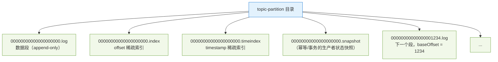
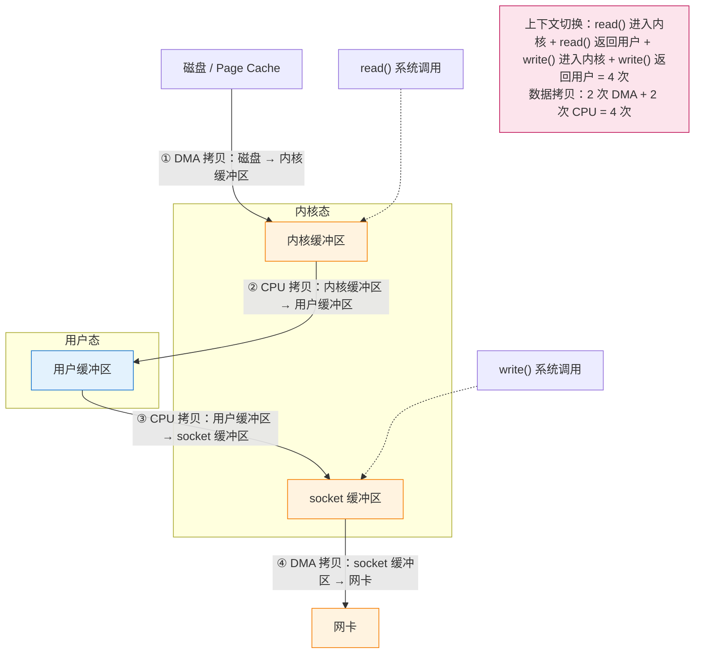
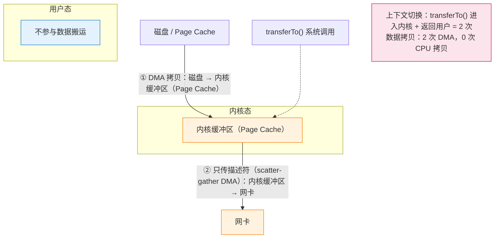

# ⚡ 八、Kafka 性能优化与高吞吐原理

> 本篇回答：Kafka 到底"快"在哪几个机制上？顺序写、Page Cache、零拷贝、批量、压缩、分区并行、稀疏索引各自省掉了什么？从 producer 到 consumer 的完整读写路径上，瓶颈会出现在哪一步？以及一份可直接照做的端到端吞吐优化清单、两组"低延迟 / 高吞吐"配置画像、性能问题定位手册和压测方法。
> 前置阅读：[[5-日志存储与副本机制]]（日志段与索引的物理结构）、[[3-生产者原理]]（`RecordAccumulator` 与批次的产生）。集群与运维侧见 [[7-运维与集群调优]]。

---

## 一、总纲：Kafka 为什么快

先给结论表。每一项都是"省掉了什么代价"，而不是玄学。

| 机制 | 本质：省掉了什么 | 生效位置 |
| --- | --- | --- |
| **顺序写磁盘** | 省掉磁头寻道 / 随机 IO 的开销，把磁盘带宽跑满 | 日志追加、副本复制 |
| **Page Cache** | 省掉"应用自己维护缓存 + 自己管理生命周期"的成本，并让读写共享同一份内存 | broker 读写全路径 |
| **零拷贝（sendfile）** | 省掉数据在内核态与用户态之间的多次拷贝和上下文切换 | 消费者拉取路径 |
| **批量（batching）** | 省掉每条消息一次网络往返、一次系统调用、一份批次头开销 | producer 发送、副本复制 |
| **压缩** | 省掉磁盘占用与网络带宽（按批压缩，压缩比远高于单条压缩） | producer 端压缩，broker 透传 |
| **分区并行** | 把一个 topic 的吞吐变成"可水平扩展"的线性问题 | 生产与消费两端 |
| **稀疏索引** | 省掉为每条消息维护索引的内存与写入成本 | 消费者按 offset/timestamp 定位 |
| **追加型日志** | 段文件不可变 → 无需原地更新、无锁、无页分裂 | 存储层 |
| **无状态 broker** | 省掉"broker 持有权威数据"的复杂度：副本即数据，leader 迁移即可 | 集群层 |

> [!note] 一句话总结
> Kafka 的性能不是靠某个"黑科技"，而是把 **存储访问模式改成顺序追加**、**缓存责任交给操作系统**、**数据搬运交给内核**、**单位开销靠批量摊薄**、**扩展性交给分区**。这五件事互相咬合，缺一条都会在压测里暴露成瓶颈。

---

## 二、顺序写磁盘

### 2.1 随机写 vs 顺序写：量级差异

| 访问模式 | 物理行为 | 相对量级 |
| --- | --- | --- |
| 随机写 | 每次都要寻道 + 等待目标扇区旋转到位；HDD 上是机械动作，SSD 上是写放大 + GC | 基线 |
| 顺序写 | 磁头基本不动，只需连续写入；在 HDD 上可以有**两个数量级**以上的差距，在 SSD 上也能拉开明显差距（少了随机写放大与擦除开销） | 快得多 |

> [!warning] 别把数字当事实
> 网上流传的"顺序写 600MB/s、随机写 100KB/s"这类具体数字来自特定硬件与特定测试方法，**不能当作通用结论**。可靠的说法只有两条：
> 1. 在机械盘上，顺序与随机的差距是**数量级**级别的；
> 2. 在 SSD / NVMe 上差距被大幅压缩，但顺序写仍然更优 —— 因为它减少了 FTL 映射开销、写放大和 GC 压力，延长寿命。
>
> 真正要记住的是**趋势与原理**，而不是某个 benchmark 数值。

### 2.2 为什么追加日志天然顺序

Kafka 的存储模型就是"只能追加的文件"：



- 写入永远发生在**当前 active segment 的末尾**，写入位置只增不减 → 对文件系统而言就是一次顺序追加。
- 段写满（`log.segment.bytes`，默认 1073741824 即 1GB）后**关闭并滚动**，旧段变成**不可变**文件。
- 不可变带来三个直接好处：不需要原地更新（没有页分裂、没有随机写）、读的时候没有写入干扰、旧段可以被整个删除（按时间或大小 retention）。

> [!tip] 为什么这个设计能"以廉价硬件扛住高吞吐"
> 它把"随机写"这个最难优化的操作，从系统里彻底删掉了。代价是**必须接受"日志"这个数据模型**：只能按 offset 顺序读，不能按主键随机查。Kafka 用"消费者自己维护位移"来换取这个代价。

### 2.3 刷盘策略：为什么不每次 fsync

| 参数 | 默认 | 说明 |
| --- | --- | --- |
| `log.flush.interval.messages` | `Long.MAX_VALUE` | 达到多少条消息强制刷盘 —— 默认**不触发** |
| `log.flush.interval.ms` | 不设置（配合 `log.flush.scheduler.interval.ms`） | 同上，默认不会周期性强制刷盘 |

Kafka 的持久化策略是：**写入 Page Cache 即认为"已写入"，靠 OS 的后台回刷 + 副本冗余来保证持久性**。

- 这是吞吐的关键：如果每条消息都 `fsync`，吞吐会被磁盘的 fsync 延迟直接锁死（常见只有每秒几百到几千次）。
- 代价：**broker 进程崩溃不会丢数据（数据在 OS Page Cache 里），但机器断电/内核崩溃可能丢**。这也是为什么生产中 `replication.factor >= 3` 且 `min.insync.replicas >= 2` 是默认推荐 —— 用副本冗余换取不 fsync。

> [!warning] 不要为了"更安全"去调小 `log.flush.interval.messages`
> 把它设小会让 broker 陷入 fsync 泥潭，吞吐断崖式下跌，而**真正的断电场景下多副本方案比单机 fsync 更可靠**。要提升持久性，应该调副本数和 `acks`，而不是调 flush 间隔。

---

## 三、Page Cache：把缓存这件事交给操作系统

### 3.1 读写都尽量命中 Page Cache

```text
生产者写入 ──► broker ──► write() ──► OS Page Cache ──►（由内核择机回刷）──► 磁盘
                                            ▲
消费者读取 ──► broker ──► read()/sendfile ──┘  命中则完全不碰磁盘
```

| 场景 | 行为 |
| --- | --- |
| 刚写入的数据被消费 | 几乎必然命中 Page Cache —— **这是 Kafka "写进去立刻能高速读出来"的根因** |
| 消费者追上生产者的实时链路 | 读写都在 Page Cache 上完成，磁盘几乎只承担顺序回刷 |
| 消费者落后很多（读历史） | 数据可能已被挤出 Page Cache → 需要真正的磁盘读，性能下降 |
| 重启后的冷启动 | Page Cache 是空的 → 所有读都打磁盘 |

### 3.2 为什么 broker 的 JVM heap 可以很小

因为**缓存责任不在 JVM 里**：

| 组件 | 缓存什么 | 说明 |
| --- | --- | --- |
| OS Page Cache | 日志段的实际数据 | 大小由机器内存决定，broker 不需要配置 |
| JVM heap | 请求对象、网络缓冲、生产者状态、索引 mmap 的元数据 | 真正的"工作内存" |

所以 Kafka 官方建议 broker 的堆**不要太大**（经验上几 GB 到十几 GB 量级，具体取决于分区数与客户端连接数），剩下的内存全部留给 Page Cache。

> [!warning] heap 给太大反而有害
> 1. **GC 停顿**：大堆意味着更长的 Full GC / Mixed GC 停顿，直接表现为请求超时、副本同步落后、消费者 lag 抖动。
> 2. **挤占 Page Cache**：堆越大，留给操作系统的内存越少，缓存命中率下降 —— 你以为在"加大缓存"，实际上在**削弱真正的缓存**。
> 3. **GC 不属于 Kafka 的性能模型**：Kafka 的设计假设是"几乎没有对象生命周期管理压力"，堆一大就把这个假设破坏了。
>
> 正确做法：堆设为**够用即可**（能放下在途请求与偏移索引的 mmap），把机器内存的大头交给 Page Cache。用 G1（或新一代收集器）并设置合理的 `MaxGCPauseMillis`。

### 3.3 Page Cache 被冲刷：性能断崖的来源

| 触发情形 | 后果 |
| --- | --- |
| 消费者严重滞后，读的是几天前的历史数据 | 冷读，磁盘 IO 成为瓶颈，fetch 延迟上升 |
| 集群重启 / OS 重启 | Page Cache 清空，恢复期内读性能差 |
| 机器上跑了别的吃内存的进程（如同机部署 ES、大堆应用） | Page Cache 被挤走，Kafka 读写都退化 |
| 大批量 retention 删除 / 段滚动 | 元数据与 dentry 缓存抖动，短时 IO 升高 |

> [!tip] 冷读场景的应对
> - **预热**：重要 topic 在流量切换前，用 `kafka-consumer-perf-test.sh` 或 `kafka-console-consumer.sh --from-beginning` 顺序扫一遍，把热数据拉进 Page Cache。
> - **隔离部署**：Kafka 独占机器内存，不要和内存大户混部。
> - **接受现实**：冷读路径的性能就是磁盘顺序读的性能，优化空间在于**减少冷读**（缩短 retention、让消费者跟上），而不是调参数。

---

## 四、零拷贝（sendfile）

### 4.1 传统 read + write：4 次拷贝、4 次上下文切换

如果 broker 要"把文件内容发给 socket"，最朴素的写法是：

```java
byte[] buf = new byte[N];
file.read(buf);      // 内核 → 用户
socket.write(buf);   // 用户 → 内核
```



问题在于：**用户态完全没必要参与**。broker 只是"搬运工"，它根本不需要看这些字节。

### 4.2 sendfile / `transferTo`：2 次拷贝

```java
// Kafka 的实际调用链（简化）
// FileRecords.transferTo(...) -> FileChannel.transferTo(position, count, socketChannel)
// 底层在 Linux 上走 sendfile(2)
fileChannel.transferTo(position, count, socketChannel);
```



| 维度 | 传统 read + write | sendfile / `transferTo` |
| --- | --- | --- |
| DMA 拷贝 | 2 次 | 2 次 |
| CPU 拷贝 | **2 次** | **0 次** |
| 上下文切换 | 4 次 | 2 次 |
| 用户态内存占用 | 需要一块缓冲区 | 不需要 |
| 数据是否经过 JVM | 是 | 否 |

> [!note] 进一步优化：`sendfile` + scatter-gather DMA
> 在支持 scatter-gather DMA 的网卡上，第 ② 步连"拷贝到 socket 缓冲区"都省掉了 —— 内核只把"数据在 Page Cache 的哪些页"这个**描述符列表**交给网卡，由网卡自己 DMA 取数据。这才是真正意义上的"零 CPU 拷贝"。Kafka 是否走到这一步取决于内核版本、网卡能力和 JDK 实现，**但它至少能保证 0 次 CPU 拷贝**。

### 4.3 零拷贝不是无条件生效的

| 生效条件 | 不生效的情形 | 原因 |
| --- | --- | --- |
| 数据**原样透传**，broker 不需要解析/改写 | 旧版消息格式（v0/v1）需要 broker 做 down-conversion | broker 必须先解压、转换格式、重新压缩 → 数据必须进入用户态 |
| **未启用 SSL/TLS** | 开启 SSL | 加密必须由 `SSLEngine` 在用户态完成，内核无法代劳 → 退回"读进用户态再加密写出" |
| 客户端请求的量与 offset 直接对应 | 需要做深度解压检查 | 同上 |

> [!warning] SSL 是零拷贝最常见的破坏者
> 一旦开启 TLS，broker 要把数据读进 JVM、加密、再写出，**零拷贝全线失效**。这不是"稍微慢一点"，在高吞吐场景下通常意味着可观的吞吐下降和明显的 CPU 上升。
> 折中方案：把 TLS 终结在集群边界（用 sidecar / 代理），或者接受代价 —— 但**不要**在压测时忽略这一点，否则线上 TLS 一开，你的容量模型就崩了。

> [!note] 关于压缩与零拷贝的关系
> 常见误解是"压缩了就不能零拷贝"。实际上：
> - producer 压缩后的批次以**压缩形态**存盘，broker **不解压**，仍然可以整批 `transferTo` 到 socket —— **零拷贝依然生效**。
> - 真正付出代价的是**消费者**：它要在客户端解压，消耗 CPU。
> - 只有当 broker 需要转换消息格式、或者用了 `compression.type` 强制重压缩时，才会被迫解压 → 零拷贝失效。

---

## 五、批量（batching）：单位开销的摊薄

### 5.1 批次是怎么形成的

```text
Producer.send(record)
   │
   ├─ 序列化
   ├─ 选分区
   ▼
RecordAccumulator：按 <分区> 维护一个双端队列 Deque<ProducerBatch>
   │
   ├─ 批次未满 且 linger 时间未到 ──► 继续攒
   ▼
Sender 线程：取出就绪的批次 ──► 压缩 ──► 一次网络请求发给该分区的 leader
```

| 参数 | 默认值 | 作用 |
| --- | --- | --- |
| `batch.size` | 16384（16KB） | **单个批次的目标字节上限**，不是"必须攒满"；达到就提前发送 |
| `linger.ms` | 0 | 批次最多额外等待多久再发送。默认为 0 表示"能发就发" |
| `buffer.memory` | 33554432（32MB） | `RecordAccumulator` 的总可用内存 |
| `max.block.ms` | 60000 | 缓冲区满时 `send()` / `partitionsFor()` 最多阻塞多久，超时抛 `TimeoutException` |
| `max.request.size` | 1048576（1MB） | 单个请求的最大字节数 |

### 5.2 `batch.size` × `linger.ms` 权衡矩阵

| `linger.ms` | `batch.size` | 吞吐 | 延迟 | 适用 |
| --- | --- | --- | --- | --- |
| 0 | 小（默认 16KB） | 低 | **最低** | 对延迟极敏感、消息量小的控制指令 |
| 0 | 大（256KB+） | 中 | 低 | 消息速率本身很高时，批次自然攒满 |
| 5~20 | 大（128KB~1MB） | **高** | 中（增加约 `linger.ms` 的延迟） | 绝大多数吞吐型业务 |
| 50~200 | 很大 | 最高 | 高 | 离线导入、日志汇聚、可容忍秒级延迟 |

> [!tip] 判断该不该加 `linger.ms` 的实用方法
> 观察生产者的指标 `batch-size-avg` 和 `records-per-request-avg`。
> - 如果 `batch-size-avg` 远小于 `batch.size`，说明批次根本攒不满 → 加 `linger.ms` 是**唯一**有效的提升手段。
> - 如果 `batch-size-avg` 已经接近 `batch.size`，说明批次是满的 → 继续加 `linger.ms` 收益很小，应该去调 `batch.size` 或加分区。
>
> 另外一个常见误区：`linger.ms` 带来的延迟**不是 100% 叠加在每条消息上**。它只影响"批次最后一个到达的消息"的等待时间，而且如果批次在 `linger.ms` 到期前攒满，会立刻发送。所以高流量下 `linger.ms=20` 的实际延迟代价远小于 20ms。

### 5.3 `buffer.memory` 与 `max.block.ms` 的关系

这是生产端最常见的"卡死"组合：

```text
上游突发流量 ──► Producer.send() 快速灌入
                        │
                        ▼
              RecordAccumulator 32MB 被填满
                        │
                        ▼
        send() 开始阻塞，最多阻塞 max.block.ms（默认 60s）
                        │
            ┌───────────┴────────────┐
            │                        │
      broker 恢复、批次发出      60s 内没发出
      阻塞解除，继续发送         send() 抛 TimeoutException
```

| 现象 | 根因 | 处理方向 |
| --- | --- | --- |
| `send()` 偶发阻塞数百毫秒 | 缓冲区周期性打满 | 调大 `buffer.memory` 或降低上游速率 |
| `send()` 抛 `TimeoutException: Failed to allocate memory within the configured max blocking time` | broker 不可用 / 消费能力不足 → 批次发不出去 → 缓冲区持续打满 | 先查 broker 健康与网络，再考虑加大 `buffer.memory` |
| 生产者 OOM | `buffer.memory` 设得离谱大 | 更该关注"为什么发不出去" |

> [!warning] 加大 `buffer.memory` 是"止痛药"不是"解药"
> 缓冲区只是把"发不出去"这件事**推迟**了。如果 broker 侧真的写不动，加大缓冲区只会把故障从"生产者阻塞"变成"生产者 OOM"。正确顺序是：先确认 broker 与网络，再考虑缓冲。

### 5.4 小消息场景：批量是决定性的

以一条 100 字节的小消息为例（数字为示意，用于说明**结构**）：

| 开销来源 | 单条发送 | 攒成 1000 条一批 |
| --- | --- | --- |
| 网络往返 | 每条 1 次 RTT | 整批 1 次 RTT |
| 请求头 / 批次头 | 每条一份 | 整批共享一份 |
| broker 侧处理 | 每条一次请求解析、一次日志追加调用 | 整批一次 |
| 磁盘写入 | 每条一次小写入 | 一次连续大写入 |
| 压缩效果 | 几乎压不动（没有上下文） | 压缩比显著提升 |

> [!note] 结论
> **消息越小，批量带来的相对收益越大。** 如果你的消息平均只有几十到几百字节，`linger.ms` 和 `batch.size` 基本决定了你的吞吐上限，调优优先级高于其他所有参数。

---

## 六、压缩

### 6.1 算法对比

| 算法 | 压缩比 | 压缩 CPU 开销 | 解压 CPU 开销 | 吞吐表现 | 适用场景 |
| --- | --- | --- | --- | --- | --- |
| `none` | 1x | 无 | 无 | 最高（单机 CPU 视角） | 网卡/磁盘不是瓶颈，CPU 紧张 |
| `gzip` | 高 | 高 | 中高 | 较低 | 带宽极紧张、可接受 CPU 代价；跨语言老系统默认支持 |
| `snappy` | 中 | 低 | 低 | 高 | 通用折中，历史上是 Kafka 的常用默认 |
| `lz4` | 中 | **很低** | **很低** | **很高** | 低延迟 + 高吞吐的首选；CPU 友好 |
| `zstd` | **很高** | 中（可调压缩级别） | 低 | 高 | 带宽/存储敏感且希望兼顾 CPU 的场景（2.1 起支持） |

> [!note] 选型口径（不承诺具体倍数）
> - 具体压缩比和速度**高度依赖数据内容**（文本/JSON 与二进制/已压缩数据的差距可以是数倍），不要照搬网上的数字。
> - 粗线条的经验：`lz4` 是"几乎无脑可用"的默认选择；`zstd` 在压缩比上通常明显优于 `lz4`，CPU 开销可以接受，适合带宽或存储真的紧张时；`gzip` 一般是最后选择；`snappy` 介于中间，但生态上正在被 `lz4`/`zstd` 取代。
> - **算法必须做端到端验证**：用你自己的真实消息 payload 压测，而不是用随机字符串。

### 6.2 为什么压缩放在 producer 端做

| 原因 | 说明 |
| --- | --- |
| **压缩比更高** | producer 是**按批**压缩的，一批几百上千条消息共享压缩上下文，比"单条压缩后拼起来"效果好得多 |
| **省网络** | 数据在**进入网络之前**就变小了 —— 生产者到 broker、broker 到 follower、broker 到消费者，三段网络全都受益 |
| **省磁盘** | 压缩形态直接落盘，存储成本下降 |
| **省 broker CPU** | broker 只做透传（见下），把 CPU 开销放在本来就分散的客户端上 |
| **端到端一致** | 消费者拿到的就是压缩批次，它在自己机器上解压，CPU 成本分摊到消费端 |

> [!warning] 压缩省的是"网络 + 磁盘"，不是"总 CPU"
> 压缩把 CPU 成本从 broker 转移到了 producer（压缩）和 consumer（解压）。如果 broker 侧 CPU 空闲、而客户端机器 CPU 紧张，压缩可能是**净亏**。压测时必须两边都看。

### 6.3 broker 端的 `compression.type`

| 取值 | 行为 | 说明 |
| --- | --- | --- |
| `producer`（**broker 默认**） | 保持生产者使用的压缩算法，**原样存储、原样透传** | 推荐值。broker 不解压不重压，零拷贝路径保持可用 |
| `none` | broker 把批次解压后以未压缩形式存 | **代价很大**：broker 要解压 + 重新落盘，零拷贝失效 |
| `gzip` / `snappy` / `lz4` / `zstd` | broker 解压再按指定算法重压 | 用于"统一集群存储格式"，但同样破坏零拷贝并消耗 broker CPU |

> [!tip] 实践结论
> **保持 `compression.type=producer`，把压缩算法决策交给生产者。** 如果你发现集群里各应用用的算法五花八门，想统一 —— 优先通过规范和客户端配置统一，而不是让 broker 重压缩。broker 重压缩是明确的性能反模式。

---

## 七、分区并行：唯一真正的水平扩展手段

### 7.1 分区是并行度的单位

| 角色 | 并行粒度 | 说明 |
| --- | --- | --- |
| 生产者 | 每个分区一个 `ProducerBatch` 队列 | 一个分区一个批次队列，多个分区可以并行发送 |
| 消费者组 | **一个分区最多被组内一个消费者消费** | 消费者数超过分区数的部分是空闲的 |
| 副本复制 | 每个分区一个副本拉取任务（受 `num.replica.fetchers` 限制） | 分区越多，复制任务的调度开销越大 |

> [!warning] 消费并行度 = `min(消费者实例数, 分区数)`
> 这是最常见的容量误判：消费者加到 20 个，但 topic 只有 8 个分区 → 永远只有 8 个在干活。**加消费者之前先看分区数。**

### 7.2 吞吐上不去时的排查顺序

```text
1. 生产者侧：batch-size-avg 是否远小于 batch.size？
   → 是：加 linger.ms / batch.size（小消息场景的第一优先级）

2. 分区数：topic 是否只有 1~3 个分区？
   → 是：加分区（注意加分区会打乱 key 的哈希分布，见 [[7-运维与集群调优]]）

3. 消费并行度：消费者实例数是否已经 >= 分区数？
   → 是：加消费者无效，必须加分区

4. broker 侧：num.io.threads / num.network.threads 是否是瓶颈？
   → 看 RequestHandlerAvgIdlePercent、NetworkProcessorAvgIdlePercent

5. 磁盘 / 网络：iostat、网卡带宽是否打满？
   → 打满则是硬件容量问题，或需要压缩降低数据量

6. 单分区限速：是否有某个分区成为热点（key 分布倾斜）？
   → 看各分区的字节速率是否严重不均
```

### 7.3 分区过多的代价

| 代价 | 说明 |
| --- | --- |
| 内存开销 | 每个分区在 broker 上都有索引文件 mmap、副本拉取状态、`ProducerStateManager` 等结构 |
| 复制开销 | 每个分区都要向 leader 发 `Fetch` 请求，分区数多则请求数多，`num.replica.fetchers` 不足时延迟上升 |
| 文件句柄 | 每个段 3 个文件（`.log`/`.index`/`.timeindex`），分区数 × 段数 × 3 |
| 故障恢复时间 | leader 切换后要从头建索引、重新拉取；分区多则恢复慢 |
| 元数据压力 | Controller 的 `PartitionAssignment`、`Metadata` 响应体积变大，客户端元数据刷新成本上升 |
| 端到端延迟 | 分区过多时，客户端元数据管理、`Sender` 线程调度都会被拖累 |

具体"每个 broker 该承载多少分区"没有普适数字（取决于硬件、消息大小、`num.io.threads`、副本数），需要在集群压测中确定。详细讨论见 [[7-运维与集群调优]]。

---

## 八、稀疏索引与查找

### 8.1 索引文件

| 文件 | 内容 | 条目大小 | 默认间隔 |
| --- | --- | --- | --- |
| `*.index`（offset 索引） | `(相对 offset, 物理位置)` | 8 字节（4+4） | 每 `log.index.interval.bytes`（默认 4096 即 4KB）写一条 |
| `*.timeindex`（时间戳索引） | `(时间戳, 相对 offset)` | 12 字节（8+4） | 每 `log.index.interval.bytes` 写一条 |
| `*.log` | 实际数据批次 | — | — |

相关参数：

| 参数 | 默认值 | 说明 |
| --- | --- | --- |
| `log.index.interval.bytes` | 4096 | 写入多少字节的数据就追加一条索引 —— **这就是"稀疏"的来源** |
| `log.index.size.max.bytes` | 10485760（10MB） | 单个索引文件的上限；写满后索引文件停止增长（段滚动的触发条件之一） |
| `log.segment.bytes` | 1073741824（1GB） | 段大小 |

### 8.2 查找流程与复杂度

```text
消费者要读 offset = 1234567

① 在段的 offset 范围里二分/顺序定位到哪个 .log 文件
   （段名就是 baseOffset，文件名有序 → 二分或直接索引）
        │
        ▼
② 加载对应段的 .index（mmap，不占堆），二分查找
   找到"不大于 1234567 的最大索引条目"
   → 例如 (相对 offset 1234000, position 8192000)
        │
        ▼
③ 从 position 开始**顺序扫描** .log，逐批读取批次头（含 lastOffset）
   直到找到包含 1234567 的批次（最多扫描约 4KB 数据，即一个索引间隔）
        │
        ▼
④ 从该批次中定位到具体记录位置，开始读取
```

复杂度：**O(log n) 二分 + O(1) 的顺序扫描**（上界约为 `log.index.interval.bytes` 对应的数据量）。

> [!note] "顺序扫描"为什么不慢
> 因为扫描上限被 `log.index.interval.bytes`（默认 4KB）固定住了，是一个常数级别的开销。索引本身是 mmap 的，查找不产生堆内存分配，也不产生明显的系统调用。这就是"稀疏索引"的威力：用**很小的常数代价**换来了**极小的索引体积**。

### 8.3 为什么不用 B 树 / 稠密索引

| 方案 | 为什么 Kafka 不用 |
| --- | --- |
| **稠密索引**（每条记录一个索引项） | 索引体积会与数据量同阶（8 字节/条），内存和磁盘成本爆炸，而查询只需要"定位到批次"这一级精度，多余精度毫无价值 |
| **B 树 / B+ 树** | B 树的核心价值是**支持原地更新与随机插入**，而 Kafka 的段是**不可变**的：只追加、不修改、不随机插入。B 树的页分裂、平衡操作、写放大在这里完全是纯负担 |
| **哈希索引** | 只支持等值查找，而 Kafka 的访问模式是**范围扫描**（从某个 offset 一直往后读） |
| **全内存索引** | 分区数 × 数据量太大，内存放不下，且没有持久化优势 |

> [!tip] 一句话回答面试
> Kafka 的日志段是**不可变、只追加**的，所以需要的是"低成本地定位到某个 offset 附近的物理位置"，而不是"支持随机插入和更新的有序结构"。稀疏索引 + mmap + 二分 + 常数级顺序扫描，恰好是这个访问模式下的最优解；B 树的写放大和页分裂在这里没有任何用武之地。

---

## 九、读写路径完整拆解

### 9.1 生产路径

```text
 [应用] Producer.send(record)
    │  ① 序列化 + 分区选择                     ← 瓶颈：序列化 CPU、分区器倾斜
    ▼
 [Producer] RecordAccumulator（按分区攒批）
    │  ② 攒批（受 batch.size / linger.ms 控制） ← 瓶颈：批次太小 → 单位开销高
    ▼
 [Producer] Sender 线程 → 按 broker 聚合请求
    │  ③ 压缩                                  ← 瓶颈：压缩算法 CPU
    │  ④ 网络发送                              ← 瓶颈：网卡带宽、RTT、in-flight 上限
    ▼
 [Broker] SocketServer：num.network.threads 收包/发包
    │  ⑤ 请求入队
    ▼
 [Broker] KafkaRequestHandlerPool：num.io.threads 处理
    │  ⑥ 校验（CRC、幂等 sequence、事务状态）
    │  ⑦ 追加到 active segment 的 Page Cache   ← 瓶颈：磁盘（未命中时）、Page Cache 回刷
    │  ⑧ 更新 offset index / time index（按 4KB 间隔）
    │  ⑨ 更新 ProducerState（幂等/事务）
    ▼
 [Broker] 响应 acks（0 / 1 / all）
```

### 9.2 副本复制路径

```text
 [Follower Broker] ReplicaFetcherThread（由 num.replica.fetchers 决定线程数）
    │  ① 向 leader 发 Fetch 请求（fetch.min.bytes / fetch.max.wait.ms 控制攒批）
    ▼
 [Leader Broker] 从 Page Cache 读出（可能走零拷贝）
    ▼
 [Follower]  ② 追加到本地 active segment
    │  ③ 更新本地 LEO；必要时更新 HW
    ▼
 [Follower]  ④ 向 leader 汇报位置（后续 Fetch 请求中携带）
```

| 瓶颈点 | 表现 | 相关参数 |
| --- | --- | --- |
| follower 拉取线程不足 | 副本同步慢、ISR 收缩 | `num.replica.fetchers`（默认 1） |
| 单次拉取量太小 | 高频小请求，CPU 与网络开销高 | `replica.fetch.max.bytes`（默认 1048576）、`replica.fetch.min.bytes`、`replica.fetch.wait.max.ms` |
| 跨机架/跨 AZ 带宽 | 复制流量吃掉带宽 | 机架感知（`broker.rack`）、`replica.selector.class` |
| leader 磁盘读慢 | follower 拉不到数据 | 冷读场景 + Page Cache 不足 |

> [!warning] `replica.fetch.max.bytes` 与 `message.max.bytes` 的坑
> 如果单条消息（或单个批次）大于 `replica.fetch.max.bytes`（默认 1MB），follower **永远拉不到这条消息**，表现为副本持续落后甚至卡死。加大 `message.max.bytes` / `max.request.size` 时，**必须同步加大 `replica.fetch.max.bytes`**。这是最经典的自伤配置。

### 9.3 消费路径

```text
 [Consumer] poll()
    │  ① 构造 FetchRequest（按分区、offset、fetch.min.bytes、max.partition.fetch.bytes）
    ▼
 [Broker]  ② 定位段 → 稀疏索引二分 → 顺序扫描
    │  ③ 从 Page Cache 通过 sendfile 直发 socket   ← 零拷贝！不经过 JVM heap
    ▼
 [Consumer] ④ 网络接收 → ⑤ 解压（若压缩）→ ⑥ 反序列化
    │                              ← 瓶颈：客户端 CPU（解压 + 反序列化）
    ▼
 [Consumer] ⑦ 交给应用处理（max.poll.records 控制批大小）
```

> [!note] 关键点：broker 端消费路径**几乎不消耗 heap**
> 数据从 Page Cache 直接 `transferTo` 到 socket，**不进入 JVM 堆**。所以 broker 的 heap 大小与"消费吞吐"基本无关，这也是 Kafka 能在小堆下跑出高吞吐的核心原因之一。

### 9.4 瓶颈速查

| 层 | 典型瓶颈 | 第一手观察指标 |
| --- | --- | --- |
| Producer | 批次太小、压缩 CPU、in-flight 受限 | `batch-size-avg`、`records-per-request-avg`、`buffer-available-bytes`、`record-send-rate` |
| 网络 | 带宽打满、跨 AZ 延迟 | 网卡 TX/RX 利用率、`request-latency-avg` |
| Broker 网络线程 | 连接数过多 | `NetworkProcessorAvgIdlePercent` |
| Broker IO 线程 | 请求处理排队 | `RequestHandlerAvgIdlePercent`、`RequestQueueSize` |
| 磁盘 | 冷读、回刷压力、IO 打满 | `iostat` 的 `%util`、`await`；`LogFlushRateAndTimeMs` |
| 副本 | follower 拉取慢 | `UnderReplicatedPartitions`、`IsrShrinksPerSec`、`MaxLag` |
| Consumer | 处理慢、解压 CPU | `records-lag-max`、`fetch-rate`、`bytes-consumed-rate` |

---

## 十、端到端吞吐优化清单

> [!tip] 使用方式
> 不要一次全调。按"先看指标定位瓶颈 → 只动对应的那一层"的顺序做，每次只改一个维度并压测验证。

### 10.1 生产者侧

| 参数 | 期望方向 | 副作用 / 注意 |
| --- | --- | --- |
| `linger.ms` | 0 → 5~50（甚至更大） | 增加发送延迟；流量低时延迟代价明显 |
| `batch.size` | 16384 → 131072~1048576 | 内存占用上升；低流量下批次攒不满，收益有限 |
| `compression.type` | `none` → `lz4` / `zstd` | 增加 producer 压缩 CPU 与 consumer 解压 CPU；换网络/磁盘收益 |
| `acks` | `all` 更安全，`1` 更快 | `acks=1` 会在 leader 故障时丢数据；`acks=0` 完全不等待，最易丢 |
| `buffer.memory` | 32MB → 64~256MB | 生产者内存上升；掩盖真实瓶颈 |
| `max.in.flight.requests.per.connection` | 保持 5（`<=5` 才能保证幂等下的顺序） | 调到 >5 会破坏顺序保证 |
| `retries` | 保持默认（`Integer.MAX_VALUE`） | 与 `delivery.timeout.ms` 配合，避免无限重试 |
| `max.request.size` | 按需加大 | **必须同步加大 broker 的 `message.max.bytes` 与 `replica.fetch.max.bytes`** |

### 10.2 Topic 侧

| 参数 | 期望方向 | 副作用 / 注意 |
| --- | --- | --- |
| `num.partitions` | 按目标吞吐与消费并行度设定（默认 1） | 分区过多带来元数据/复制/恢复开销；**已有 topic 加分区会改变 key 的哈希落点**，破坏同 key 有序 |
| `replication.factor` | 生产环境 3 | 写入延迟上升（要等 ISR），存储与网络成本翻倍 |
| `min.insync.replicas` | 2（配合 `acks=all`） | 可用性下降：ISR 不足时直接拒绝写入（这是刻意的，用来防丢数据） |
| 消息体大小 | 能小则小（避免把大对象塞进消息） | 大消息拉高全部链路的单点延迟，压缩效果也差 |

### 10.3 Broker 侧

| 参数 | 默认值 | 期望方向 | 副作用 / 注意 |
| --- | --- | --- | --- |
| `num.io.threads` | 8 | 按 CPU 核数与磁盘数上调 | 过多会加剧上下文切换；观察 `RequestHandlerAvgIdlePercent` 再定 |
| `num.network.threads` | 3 | 连接数大时上调（常与核数相关） | 观察 `NetworkProcessorAvgIdlePercent` |
| `num.replica.fetchers` | 1 | 分区多 / 副本同步慢时上调到 2~4 | 增加 leader 侧负载与网络请求数 |
| `num.recovery.threads.per.data.dir` | 1 | 重启恢复慢时上调 | 只影响启动期，运行期无收益 |
| `log.segment.bytes` | 1073741824 | 一般不动 | 太小 → 段数暴涨、文件句柄与索引开销上升；太大 → 删除粒度粗 |
| `log.index.interval.bytes` | 4096 | 一般不动 | 调小 → 索引变大、查找扫描变短；调大 → 反之 |
| `log.retention.*` | `log.retention.hours=168` | 按成本与回溯需求设定 | 保留期越长，Page Cache 命中率越低（历史数据更多） |
| `compression.type` | `producer` | **保持 `producer`** | 改成具体算法会让 broker 解压重压，破坏零拷贝 |
| `queued.max.requests` | 500 | 一般不动 | 队列过深会掩盖真实过载，表现为延迟暴涨 |
| `socket.send.buffer.bytes` / `socket.receive.buffer.bytes` | 102400 | 高带宽高延迟链路（跨地域）需加大 | 主要影响长肥管道场景 |
| `log.flush.interval.messages` / `log.flush.interval.ms` | 默认不强制刷盘 | **不要调小** | 调小 = 主动把吞吐交给 fsync 延迟支配 |

### 10.4 消费者侧

| 参数 | 默认值 | 期望方向 | 副作用 / 注意 |
| --- | --- | --- | --- |
| `fetch.min.bytes` | 1 | 上调到 1KB~1MB | 降低 fetch 频次与 broker 请求压力；**空闲 topic 的延迟上升**（要等够字节或超时） |
| `fetch.max.wait.ms` | 500 | 配合 `fetch.min.bytes` | 决定了"攒不够字节时最多等多久"，直接体现为最坏延迟 |
| `max.partition.fetch.bytes` | 1048576（1MB） | 大消息场景加大 | 影响单分区单次拉取上限，也影响客户端内存 |
| `fetch.max.bytes` | 52428800（50MB） | 大消息场景加大 | 单次 fetch 的总上限；**应大于等于单条消息大小** |
| `max.poll.records` | 500 | 处理慢就调小，纯吞吐可调大 | 调大 → 单次处理耗时长，可能超 `max.poll.interval.ms` 触发 rebalance |
| `max.poll.interval.ms` | 300000（5 分钟） | 处理耗时长时加大 | 加大后 rebalance 检测变慢（卡死的消费者要更久才被发现） |
| `receive.buffer.bytes` | 客户端默认 | 高带宽高延迟链路加大 | 只在高 BDP 链路有显著收益 |
| 消费者实例数 | — | 最多等于分区数 | 超过分区数的实例完全空闲 |

---

## 十一、低延迟 vs 高吞吐：两组画像

### 11.1 典型配置画像

| 参数 | 极低延迟画像 | 高吞吐画像 | 说明 |
| --- | --- | --- | --- |
| `linger.ms` | 0 | 20~100 | 延迟与吞吐的核心开关 |
| `batch.size` | 16384（默认） | 262144~1048576 | 大批次降低单位开销 |
| `compression.type` | `none` 或 `lz4` | `lz4` 或 `zstd` | 低延迟优先避免压缩 CPU 抖动；高吞吐优先省带宽 |
| `acks` | `1`（或 `0`，视容忍度） | `all` | 见 11.2 |
| `max.in.flight.requests.per.connection` | 5 | 5 | 幂等下的上限；不要在低延迟画像里为"更低延迟"把它调大 |
| `buffer.memory` | 32MB | 128~256MB | 高吞吐需要更大缓冲吸收突发 |
| `num.partitions` | 足够消费并行度即可 | 按目标吞吐设定，通常远大于 1 | 分区是并行度单位 |
| `replication.factor` | 3（可靠性不因延迟妥协） | 3 | 低延迟场景可以适度用 2，但要明确接受风险 |
| `min.insync.replicas` | 2 | 2 | 与 `acks=all` 配套 |
| `fetch.min.bytes` | 1 | 1MB~（显著大于 1） | 低延迟要"有数据立刻给"；高吞吐要"攒够再给" |
| `fetch.max.wait.ms` | 100~500 | 500~（默认或更大） | 与 `fetch.min.bytes` 联动 |
| `max.poll.records` | 小（几十~200） | 大（1000~5000） | 低延迟追求单轮处理快；高吞吐追求摊薄开销 |
| `num.io.threads` | 与核数匹配 | 上调 | 观察 idle 比例 |
| `num.replica.fetchers` | 1~2 | 2~4 | 分区多时上调 |
| 典型端到端延迟 | 毫秒级（个位数到几十毫秒） | 几十毫秒到秒级 | 取决于 `linger.ms` + `fetch.max.wait.ms` + 事务/checkpoint 周期 |

> [!warning] 低延迟画像里最容易踩的坑
> 1. **`acks=0` 不是"更快"，是"不知道有没有写成功"**。它省掉的是等待，但故障时数据直接丢，且生产者无法感知。只有在"可丢数据"场景才用。
> 2. **`replication.factor=1` 换来的低延迟是假的**。broker 一挂，数据没了，恢复时间远超你省下的那几毫秒。
> 3. **别为了低延迟把 `linger.ms` 设成 0 又抱怨吞吐低**。这两个目标本质冲突，必须明确业务更在乎哪个。

### 11.2 `acks` 对延迟的影响

| `acks` | 语义 | 延迟 | 持久性 | 适用 |
| --- | --- | --- | --- | --- |
| `0` | 发出即认为成功，不等任何响应 | **最低**（省掉整个 RTT） | 最差：网络丢包、broker 崩溃都会丢且无感知 | 可丢的埋点、指标 |
| `1` | 等 leader 写入本地日志 | 中（省掉等待 follower 的时间） | 中：leader 崩溃且数据未复制 → 丢失 | 允许极端情况丢少量数据的业务 |
| `all`（`-1`） | 等 ISR 中所有副本确认（实际受 `min.insync.replicas` 约束） | **最高**（取决于最慢的 ISR 副本） | 最好（配合 `min.insync.replicas>=2`） | 默认推荐，资金/订单类必选 |

> [!note] Kafka 3.0 起 `acks` 默认为 `all`
> 这也是"为什么升级到 3.0 后延迟看起来变高了"的常见原因之一 —— 不是变慢了，是默认值变安全了。如果确实需要 `acks=1`，要**显式**配置，并明白它与默认开启的 `enable.idempotence` 存在冲突（详见 [[3-生产者原理]] 与 [[6-事务与Exactly-Once]]）。

---

## 十二、常见性能问题定位

### 12.1 生产端发送慢

| 观察指标 | 常见原因 | 处理方向 |
| --- | --- | --- |
| `record-send-rate` 低，`batch-size-avg` 远小于 `batch.size` | 批次攒不满，单位开销高 | 加 `linger.ms` / `batch.size` |
| `record-queue-time-avg` 高 | 批次在 `RecordAccumulator` 里排队久 —— 说明 broker 回包慢或缓冲区满 | 查 broker 负载、网络；必要时加 `buffer.memory` |
| `request-latency-avg` 高 | 网络 RTT 大 / broker 请求处理慢 | 查跨 AZ/跨地域链路、`RequestHandlerAvgIdlePercent` |
| `buffer-available-bytes` 逼近 0 | 缓冲区被打满，`send()` 开始阻塞 | 先定位"为什么发不出去"，再考虑加缓冲 |
| `record-error-rate` > 0 | 重试、`NotEnoughReplicas`、`RecordTooLargeException` | 按错误类型分别处理（ISR 不足 / 消息超限） |
| 压缩 CPU 打满（producer 进程） | 压缩算法太重或数据不可压 | 换 `lz4`；或确认数据本身已是压缩格式（此时压缩纯浪费 CPU） |
| 单分区热点 | key 分布倾斜 | 重新设计 key、加盐、或改用轮询分区器 |

### 12.2 消费端 lag 持续增长

| 观察指标 | 常见原因 | 处理方向 |
| --- | --- | --- |
| lag 均匀增长，`records-consumed-rate` 低于生产速率 | **消费者处理能力不足** | 加消费者实例 / 加分区 / 优化处理逻辑（批量化、异步化下游调用） |
| 消费者实例数已经 >= 分区数，加实例无效 | 并行度到顶 | 必须加分区（注意 key 顺序影响） |
| `fetch-rate` 很低但 `bytes-consumed-rate` 正常 | 正常（大消息场景） | 无需处理 |
| `fetch-rate` 很高、`bytes-consumed-rate` 很低 | `fetch.min.bytes=1` 导致高频小 fetch | 上调 `fetch.min.bytes` |
| 周期性 lag 尖峰 + rebalance 日志 | `max.poll.interval.ms` 超时触发 rebalance | 调小 `max.poll.records` 或调大 `max.poll.interval.ms`；优化单批处理耗时 |
| 单分区 lag 高、其他正常 | 分区倾斜 / 该分区消息更大 / key 热点 | 检查 key 分布与消息大小 |
| lag 高但消费者 CPU 空闲 | 下游阻塞（DB 慢、HTTP 慢） | 优化下游；考虑提高并发或批量写 |

> [!warning] "加消费者"不是万能药
> 只有当**实例数 < 分区数**时，加消费者才有效。超过这个上限后，加机器只会增加 rebalance 抖动。此时要么加分区，要么优化单线程处理效率。

### 12.3 broker 负载高

| 观察指标 | 常见原因 | 处理方向 |
| --- | --- | --- |
| `RequestHandlerAvgIdlePercent` 低（< 30%） | IO 线程忙 | 上调 `num.io.threads`；检查是否是磁盘慢导致线程阻塞 |
| `NetworkProcessorAvgIdlePercent` 低 | 网络线程忙 | 上调 `num.network.threads`；减少连接数（连接池复用） |
| `RequestQueueSize` 持续 > 0 | 请求积压 | 同上，同时排查是否有慢磁盘或大消息 |
| GC 停顿周期性出现 | heap 过大 / 对象分配过多 | 减小 heap、换用 G1 并设置合理的 `MaxGCPauseMillis` |
| CPU 高但请求量不高 | 压缩重压（broker 端 `compression.type` 非 `producer`）、格式转换、SSL | 改回 `compression.type=producer`；评估 TLS 代价 |
| 元数据请求占比高 | 客户端频繁刷新元数据 / 连接抖动 | 检查客户端 `metadata.max.age.ms`、连接是否稳定 |

### 12.4 磁盘 IO 打满

| 观察指标 | 常见原因 | 处理方向 |
| --- | --- | --- |
| `iostat` 的 `%util` 接近 100% | 冷读（消费者读历史）+ 写入回刷叠加 | 缩短 retention、让消费者跟上、加大 Page Cache（减 heap） |
| `await` 高、`%util` 不高 | 单次 IO 延迟大（云盘限流、机械盘） | 换盘 / 提升 IOPS 配额；检查是否单分区独占一块盘 |
| 写入放大明显 | 段太小导致频繁滚动 + 索引重写 | 检查 `log.segment.bytes` 是否被调得过小 |
| 副本复制造成大量读 | follower 频繁冷读 leader | 提高 Page Cache 命中（复制通常读最新数据，一般命中良好；若持续未命中说明 follower 严重落后） |

### 12.5 网络打满

| 观察指标 | 常见原因 | 处理方向 |
| --- | --- | --- |
| 网卡 TX/RX 接近带宽上限 | 副本复制流量 + 消费流量 + 生产流量叠加 | 开启压缩、减少副本跨机架流量（`broker.rack` + 机架感知）、拆分集群 |
| 跨 AZ/跨地域流量大 | 副本分布跨可用区 | 用机架感知把副本限制在同 AZ 内为主 |
| 请求数多但每个都很小 | `fetch.min.bytes` 太小、批次太小 | 两端都提高攒批力度 |
| TLS 导致 CPU 高+吞吐降 | 加密在用户态完成 | 终结 TLS 于边界代理；或评估是否真的需要端到端加密 |

---

## 十三、性能测试方法

> [!warning] 一条铁律
> **压测必须复现生产条件**（消息大小与内容、分区数、副本数、`acks`、是否压缩、是否 TLS、消费者逻辑复杂度）。用默认参数压出来的数字，除了"看起来好看"没有任何价值。

### 13.1 生产端压测

```bash
# 基本用法：1,000,000 条、每条 1024 字节、不限速
$KAFKA_HOME/bin/kafka-producer-perf-test.sh \
  --topic perf-test \
  --num-records 1000000 \
  --record-size 1024 \
  --throughput -1 \
  --producer-props \
    bootstrap.servers=broker1:9092,broker2:9092,broker3:9092 \
    acks=all \
    linger.ms=20 \
    batch.size=131072 \
    compression.type=lz4
```

关键参数含义：

| 参数 | 含义 |
| --- | --- |
| `--topic` | 目标 topic（分区数会直接决定吞吐上限） |
| `--num-records` | 总发送条数 |
| `--record-size` | 每条消息的字节数（**不要用它代替真实 payload**，见 13.3） |
| `--throughput` | 每秒最多发送多少条；`-1` 表示**不限速**（跑出硬件上限） |
| `--producer-props` | 直接透传给生产者的配置，用于对比不同参数组合 |
| `--payload-file` | 用真实样本文件循环发送，**比 `--record-size` 更贴近生产** |
| `--print-metrics` | 结束时打印全部生产者指标，用于定位瓶颈层 |

> [!tip] 怎么读输出
> 输出里会给出吞吐（MB/sec、records/sec）、平均延迟、以及 `P50/P95/P99/P999` 延迟。重点关注：
> - **P99 / P999** 而不是平均值 —— 平均值会被大量快请求拉平。
> - `--print-metrics` 中的 `batch-size-avg`、`records-per-request-avg`、`buffer-available-bytes`、`request-latency-avg`，用来判断瓶颈在生产者内部还是在 broker/网络。

### 13.2 消费端压测

```bash
$KAFKA_HOME/bin/kafka-consumer-perf-test.sh \
  --bootstrap-server broker1:9092 \
  --topic perf-test \
  --messages 1000000 \
  --group perf-consumer-group \
  --fetch-size 1048576 \
  --show-detailed-stats
```

| 参数 | 含义 |
| --- | --- |
| `--messages` | 本次消费多少条后退出 |
| `--group` | 消费组；不指定则用随机组并通过 `--from-latest` 之类的开关控制起点 |
| `--fetch-size` | 对应 `fetch.max.bytes` 的量级，用来观察一次拉多少 |
| `--show-detailed-stats` | 周期性打印中间统计，用于观察是否稳定 |
| `--timeout` | 无数据时的等待上限，避免脚本卡住 |

注意：这个工具**不做任何业务处理**，测的是"纯消费 + 解压"的上限。真实应用的消费能力通常远低于它。

### 13.3 压测时必须排除的干扰因素

| 干扰因素 | 为什么干扰 | 怎么处理 |
| --- | --- | --- |
| **Page Cache 状态** | 刚写完就读，几乎全命中缓存，数据极漂亮但不可复现 | 明确区分"热读"与"冷读"两轮；冷读前重启 broker 或用 `drop_caches` 清缓存 |
| **副本数与 `acks`** | 副本 1 与副本 3、`acks=1` 与 `acks=all` 的差异是数倍 | 压测配置必须与生产一致 |
| **是否压缩** | 压缩改变网络/磁盘量但增加 CPU；不同算法差异大 | 用真实 payload 对比 `none` / `lz4` / `zstd` |
| **消息大小分布** | `--record-size` 固定大小会产生不真实的批次填充率与压缩比 | 用 `--payload-file` 投喂真实样本 |
| **分区数与 key 分布** | 单分区 vs 多分区差一个数量级；key 倾斜会造成单分区热点 | 用生产的 key 分布规则 |
| **是否 TLS** | 零拷贝失效、CPU 上升 | 生产开 TLS 就必须压 TLS |
| **客户端与 broker 的机器规格** | `kafka-producer-perf-test.sh` 与 broker 抢同一台机器的 CPU/网络 | 压测客户端独立部署 |
| **预热不足** | JIT 编译、连接建立、元数据拉取的初期开销会拉低平均 | 丢弃前 10%~20% 的数据，只看稳态区间 |
| **`--throughput -1` 的误导** | 不限速时会压出 broker 的崩溃点，不代表可用容量 | 容量规划要看"延迟可接受时的最大吞吐"，而不是"最大吞吐" |

> [!note] 一条实用建议
> 做容量规划时，不要只跑一个"极限吞吐"数字。应该跑一组**阶梯压测**（例如目标吞吐的 50% / 80% / 100% / 120%），观察每一档的 P99 延迟。Kafka 的典型曲线是：在某个点之前延迟平稳，过了这个点延迟**陡增**。你的容量上限应该定在拐点之前，并留出足够余量。

---

## 相关笔记

- [[1-Kafka总览]] —— 系列索引
- [[3-生产者原理]] —— `RecordAccumulator`、`linger.ms` / `batch.size` 的源码级行为
- [[4-消费者与Rebalance]] —— `fetch.min.bytes`、`max.poll.records` 与 rebalance 的关系
- [[5-日志存储与副本机制]] —— 段文件、稀疏索引、HW/LEO、副本同步的完整机制
- [[6-事务与Exactly-Once]] —— 事务对吞吐与可见延迟（LSO）的影响
- [[7-运维与集群调优]] —— `num.io.threads` / `num.network.threads` / 分区容量规划 / 监控告警
- [[9-SpringBoot实战]] —— Spring Kafka 的并发度、批量监听与错误处理
- [[10-面试高频题]] —— 本篇要点的精简速答版
