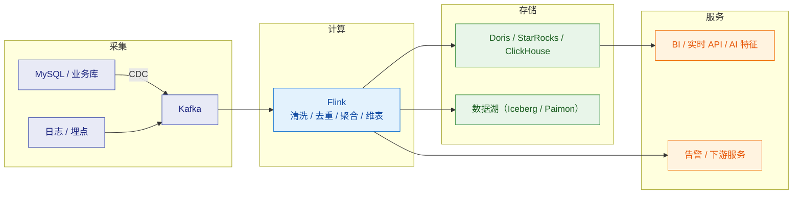

# 🌊 Flink 总览

> 这是 Flink 系列笔记的**总入口（MOC）**，也是 [[大数据学习规划/02-Flink补课|大数据学习规划 · Flink 深度补课]] 的配套知识库。
> 系列回答四个层次：**① 怎么运转的（运行时原理）② 流计算的核心难点怎么解（时间/状态/容错）③ 工程怎么落地（SQL/CDC/部署/调优）④ 面试怎么答**。
> 关联：[[大数据学习规划/01-学习路径总览|3 周学习路径]]、[[面试准备/专业技能/05-大数据与流计算|面试 · 大数据与流计算]]。

---

## 一、系列导航

| # | 笔记 | 一句话定位 | 核心内容 |
|---|---|---|---|
| 1 | **[[1-架构与运行时]]** | 作业怎么跑起来 | JobManager/TaskManager/Slot/算子链/数据交换/执行模式 |
| 2 | **[[2-时间与窗口]]** | 流计算第一难题 | 三种时间语义、Watermark、窗口类型与函数、迟到数据三件套 |
| 3 | **[[3-状态管理]]** | 流计算第二难题 | Keyed/Operator State、key group、状态后端、状态 TTL、膨胀治理 |
| 4 | **[[4-容错与ExactlyOnce]]** | 语义原理 | 投递语义、分布式快照（Chandy-Lamport）、Barrier 对齐、非对齐 Checkpoint、重启恢复 |
| 5 | **[[5-Checkpoint与Savepoint]]** | 快照机制细节 | 触发/存储/增量/恢复、Checkpoint vs Savepoint、状态兼容与调优 |
| 6 | **[[6-背压与性能调优]]** | 慢在哪、怎么快 | Credit 反压、指标定位瓶颈、并行度/内存/链、异步 IO |
| 7 | **[[7-FlinkCDC与实时数仓]]** | 数据怎么进实时链路 | CDC 原理、增量快照、CDC→Doris 链路、实时数仓分层 |
| 8 | **[[8-FlinkSQL与TableAPI]]** | SQL 怎么写 | 动态表、时间属性、窗口 TVF、双流 Join、维表、state.ttl |
| 9 | **[[9-部署与运维]]** | 线上怎么跑稳 | 部署模式、K8s/YARN、内存模型、监控告警、扩缩容与升级 |
| 10 | **[[10-面试高频题]]** | 面试怎么答 | 八大必答题 + 快问快答 + 易错陷阱 + 场景设计题 |
| 11 | **[[11-端到端一致性]]** | EOS 工程落地 | 各环节配置前提、2PC 参数陷阱、幂等选型、降级矩阵、验证方法 |

> [!note] 4 与 11 的分工（避免重复阅读）
> **[[4-容错与ExactlyOnce]] = 原理**：快照算法、Barrier 对齐/非对齐、重启恢复，以及"端到端 EOS 需要哪些前提"的结论性对照。
> **[[11-端到端一致性]] = 工程**：Source/Sink 各环节怎么配、事务超时与 checkpoint 间隔怎么匹配、幂等怎么选、外部系统不支持事务怎么降级、怎么验证 EOS 真的生效。
> 排查线上问题时：先看 4 确认机制，再看 11 对照配置。

> [!tip] 与「八问」的对应关系
> [[大数据学习规划/02-Flink补课|Flink 补课清单]] 里的**面试八问**，在这套笔记里的落点：
> ① 时间与窗口 → [[2-时间与窗口]]｜② 状态管理 → [[3-状态管理]]｜③ 容错与一致性 → [[4-容错与ExactlyOnce]] + [[5-Checkpoint与Savepoint]]｜④ 背压与调优 → [[6-背压与性能调优]]｜⑤ SQL + CDC → [[8-FlinkSQL与TableAPI]] + [[7-FlinkCDC与实时数仓]]｜⑥ 生产实践与故障 → [[9-部署与运维]]｜⑦ 与 Kafka/存储配合 → [[7-FlinkCDC与实时数仓]] + [[11-端到端一致性]]｜⑧ 流批一体 → [[1-架构与运行时]] + [[8-FlinkSQL与TableAPI]]

---

> [!tip] 画图约定
> 本库支持 Mermaid（已装 mermaid-popup / mermaid-zoom）。本系列的图**优先用 Mermaid**，只有"依赖精确对齐"的图（内存字节/位布局、字节码、GC 日志、命令输出样本）才保留 ASCII。规范详见 [[0-Java总览]] §七「文档写作约定」。

## 二、按需求的阅读路径

> [!tip] 三条路径
> **面试突击（1～2 天）**：[[10-面试高频题]] → [[2-时间与窗口]]（Watermark 与迟到数据）→ [[4-容错与ExactlyOnce]]（Checkpoint 与 EOS）→ [[6-背压与性能调优]]（背压定位）
> **上手干活（1 周）**：[[1-架构与运行时]] → [[8-FlinkSQL与TableAPI]] → [[7-FlinkCDC与实时数仓]] → [[11-端到端一致性]] → [[9-部署与运维]]
> **系统吃透（持续）**：1 → 2 → 3 → 4 → 5 → 6 顺序精读；其中 **2、3、4/5 是流计算的三大基石**，值得反复读。

---

## 三、30 秒速查表

| 问题 | 一句话答案 | 详见 |
|---|---|---|
| Flink 的定位 | **有状态的流式计算引擎**，流批一体；核心是"事件驱动 + 状态 + 时间" | [[1-架构与运行时]] |
| 架构角色 | JobManager（调度/协调）+ TaskManager（执行）+ Slot（资源单位，**逻辑隔离**） | [[1-架构与运行时]] |
| 并行度与 Slot | 并行度 = 算子并行实例数；Slot 数决定 TaskManager 能跑多少并行子任务（**可 Slot 共享**） | [[1-架构与运行时]] |
| 时间语义 | Event Time（**最常用**）/ Processing Time；时间语义由是否使用 watermark 决定 | [[2-时间与窗口]] |
| Watermark 是什么 | 单调递增的"水位"，表示**事件时间小于该值的认为都到齐**；多输入取 **min** | [[2-时间与窗口]] |
| 数据迟到怎么办 | 三件套：`allowedLateness`（窗口延迟销毁）+ 侧输出流兜底 + 下游可更新 | [[2-时间与窗口]] |
| 状态存哪 | Keyed State / Operator State；后端选 **HashMapStateBackend**（小状态）或 **RocksDB**（大状态） | [[3-状态管理]] |
| 状态会无限膨胀吗 | 会。**必须配 state TTL**，尤其是双流 Join 与去重 | [[3-状态管理]] |
| Checkpoint 原理 | 基于 **Chandy-Lamport**：注入 Barrier → 随流对齐 → 算子快照本地状态 | [[5-Checkpoint与Savepoint]] |
| Checkpoint 与 Savepoint | Checkpoint 是**自动、定期、用于故障恢复**；Savepoint 是**手动、用于升级迁移扩缩容** | [[5-Checkpoint与Savepoint]] |
| 怎么保证 Exactly-Once | 三段式：**Source 位点可重放 + 内部快照 + Sink 事务/幂等** | [[4-容错与ExactlyOnce]]、[[11-端到端一致性]] |
| 背压怎么定位 | 从 Source 往后找**第一个背压高的算子**，它的下游就是瓶颈（或从 Sink 往前找） | [[6-背压与性能调优]] |
| 双流 Join 状态爆炸 | 用 **Interval Join** 或 Temporal Join；Regular Join 必须配 `table.exec.state.ttl` | [[8-FlinkSQL与TableAPI]] |
| CDC 怎么做不停机 | **增量快照**：分片读全量 + 记录 binlog 位点，不锁表可断点续传 | [[7-FlinkCDC与实时数仓]] |
| 内存怎么配 | `taskmanager.memory.process.size` 拆分；**managed memory 给 RocksDB** | [[9-部署与运维]] |
| 状态后端与存储解耦 | 1.13+ 起状态**存哪**（backend）与 checkpoint **存哪**（checkpoint storage）解耦 | [[5-Checkpoint与Savepoint]] |
| Flink 2.0 大变化 | **Disaggregated State（ForSt）**：把远程 DFS 作为主存储 + 异步状态访问 | [[3-状态管理]] |

---

## 四、核心概念最小记忆集

| 概念 | 精确定义 | 常见误解 |
|---|---|---|
| **JobManager** | 作业管理者：调度、协调 Checkpoint、故障恢复；含 ResourceManager/Dispatcher | 以为它也执行计算 |
| **TaskManager** | 工作进程，提供 Slot 执行任务；**内存与状态都在这** | 与 JobManager 职责混淆 |
| **Task Slot** | TaskManager 上的资源切片，**只做内存隔离，不做 CPU 隔离** | 以为一个 Slot 一个线程 |
| **Slot Sharing** | 同一 SlotSharingGroup 的不同算子子任务**共享一个 Slot** | 以为一个算子独占 Slot |
| **算子链** | 满足条件的前后算子合并成一个 Task，减少序列化与线程切换 | 以为链越多越好 |
| **并行度** | 算子的并行实例数；作业并行度可被算子级覆盖 | 与 Slot 数混为一谈 |
| **`maxParallelism`** | key group 的上限，**决定状态可扩容的上限**，一旦设定不可随意改 | 以为可以随便扩并行度 |
| **Keyed State** | 只能在 `keyBy` 之后使用，**按 key 隔离** | 以为任何算子都能用 |
| **Operator State** | 每个 subtask 一份，与 key 无关（如 Kafka source 位点） | 与 Keyed State 混淆 |
| **key group** | key 的哈希分组，状态按 key group 组织，是**状态重分配的粒度** | 忽视它对扩缩容的限制 |
| **Watermark** | 单调推进的时间水位，表示"更早的数据已到齐"；多输入取 min | 以为它是数据里的一个字段 |
| **Barrier** | Checkpoint 的标记，随数据流传播，用于对齐快照 | 与 Watermark 混淆 |
| **对齐 / 非对齐** | 对齐需等待所有输入 barrier（阻塞）；非对齐把 in-flight 数据一起快照 | 以为非对齐总是更好 |
| **Checkpoint** | 自动定期的一致性快照，用于**故障恢复** | 与 Savepoint 混用 |
| **Savepoint** | 手动触发的快照，用于**升级/迁移/扩缩容**，格式更稳定 | 以为可以随便用 |
| **背压** | 下游处理不过来，压力反向传导；**持续背压才是问题** | 以为出现背压就是 bug |
| **Credit-based 反压** | 下游用 credit 声明可用缓冲，上游按 credit 发送 | 以为还是 TCP 阻塞式反压 |

> [!warning] 五个最经典的面试陷阱
> 1. **"Watermark 是数据里的一个字段"** —— 不是。它是 Flink 按 `TimestampAssigner` 给每条记录分配事件时间后，**单调推进的水位值**。
> 2. **"Kafka Source 提交了 offset 就能恢复"** —— 恢复**只依赖 Checkpoint 里记录的位点**；提交给 Kafka 的 offset 只是给外部监控看，与 Flink 恢复无关。
> 3. **"Exactly-Once 只靠 Flink 自己就能实现"** —— 必须 **Source 可重放 + Sink 支持事务或幂等**，缺一不可。
> 4. **"并行度可以随便改"** —— 受 `maxParallelism` 与 key group 限制；改并行度需从 Savepoint 恢复，且 `maxParallelism` 设小了就扩不上去。
> 5. **"出现背压说明作业有问题"** —— 短时背压是正常的流量削峰；**持续高位背压**才是问题。

---

## 五、版本演进与选型要点

| 版本 | 里程碑 | 对使用者的影响 |
|---|---|---|
| 1.5 | **Credit-based 反压** | 背压机制更精确，不再阻塞控制流 |
| 1.11 | **非对齐 Checkpoint**；新的 Source/Sink 接口（FLIP-27/143） | 反压下 checkpoint 不再必然超时 |
| 1.13 | **状态后端与 checkpoint 存储解耦**；Cumulative Window | 状态选型更灵活 |
| 1.14 | 缓冲去阻塞（Buffer Debloating）；`execution.checkpointing.*` 新配置名 | 吞吐与 checkpoint 更稳 |
| 1.15 | **Per-Job 模式废弃**；KafkaSink 支持 `EXACTLY_ONCE` | 生产统一走 Application 模式 |
| 1.16~1.17 | 批处理能力增强、Adaptive Batch Scheduler 成熟 | 流批一体更可用 |
| 1.18~1.20 | 稳定分支；SQL 与状态管理持续优化 | **多数生产环境的现实选择** |
| **2.0** | **Disaggregated State（ForSt）**；异步执行模型；DataStream V2 预览；Materialized Table | 云原生方向：远程 DFS 作主存储、扩缩容更快、checkpoint 更轻 |
| 2.x 后续 | 2.0.2 / 2.1.2 / 2.2.1 等 | 新特性持续叠加 |

> [!note] 本系列的口径
> 以 **Flink 1.20 与 2.x** 为背景表述；凡涉及 2.0 的新机制（如 Disaggregated State）会明确标注版本。生产上**建议先用 1.20 稳定分支**，2.x 新特性作为技术视野与加分项。
> 版本信息可对照 [Flink 2.0 Release Notes](https://nightlies.apache.org/flink/flink-docs-release-2.3/zh/release-notes/flink-2.0/) 与官方发布列表。

---

## 六、与 Spark Streaming 的选型对照（面试高频）

| 维度 | Flink | Spark Streaming（含 Structured Streaming） |
|---|---|---|
| 计算模型 | **原生流**（来一条处理一条） | 微批（按批次切分） |
| 延迟 | **毫秒～亚秒** | 秒级（批次间隔决定） |
| 时间语义 | **Event Time 一等公民**，Watermark 完善 | Structured Streaming 支持 Event Time + Watermark |
| 状态 | **原生 Keyed State + RocksDB + 状态 TTL** | 有状态算子/`mapGroupsWithState`，状态能力弱于 Flink |
| 容错 | 分布式快照（Chandy-Lamport），**对齐/非对齐两种** | 基于血缘重算（RDD）或 WAL + 状态存储 |
| 背压 | **Credit-based 精确反压** | 动态批大小（背压感知） |
| 生态 | 流批一体、SQL/CDC 强 | **与 Spark 生态（ML/图/SQL）打通**，批处理生态成熟 |
| 适用 | **低延迟、有状态、复杂事件**（风控、实时数仓、监控告警） | 已有 Spark 体系、准实时、批为主流为辅 |

> [!tip] 一句话答题
> **Flink 是"真流"，Spark Streaming 是"微批"**；延迟要求高、状态复杂、需要精准一次时选 Flink；已有 Spark 生态、延迟要求秒级时可继续用 Structured Streaming。

---

## 七、与「实时数仓」链路的关系

- 采集：**Flink CDC** 抓业务库变更 → 见 [[7-FlinkCDC与实时数仓]]
- 计算：Flink SQL / DataStream 做 ODS→DWD→DWS→ADS → 见 [[8-FlinkSQL与TableAPI]]
- 不丢不重：位点进 Checkpoint + 下游主键 upsert → 见 [[11-端到端一致性]]
- 与你的 AI 定位结合：**实时特征**（给模型喂最新特征）、**数据平台支撑 RAG**（知识库/日志入库）

> 存储选型（Doris/ClickHouse/StarRocks、Iceberg/Hudi/Paimon）见 [[大数据学习规划/03-实时数仓与存储|实时数仓与存储选型]]。

---

## 八、学习检查清单

- [ ] 能画出 JobManager / TaskManager / Slot / 算子链的关系，并解释 Slot Sharing
- [ ] 能解释 Watermark 的生成、传播（取 min）与空闲分区问题
- [ ] 能说清迟到数据的三种处理手段及其取舍
- [ ] 能区分 Keyed State 与 Operator State，并说出状态后端的选型依据
- [ ] 能画出 Checkpoint 的 Barrier 对齐流程，并解释非对齐为什么能解决反压问题
- [ ] 能三段式回答"Flink 怎么保证 Exactly-Once"
- [ ] 能用指标定位一个背压瓶颈，并说出至少 5 种常见瓶颈与解法
- [ ] 能写出 Flink SQL 的去重、窗口聚合、双流 Interval Join，并知道 `table.exec.state.ttl` 的必要性
- [ ] 能说清 CDC 全量+增量为什么不停机、不锁表
- [ ] 能列出生产部署的核对清单（HA、监控、重启策略、状态 TTL、扩缩容）

---
> [!question] 还需要补充什么？
> 可继续扩展的方向：Flink CEP（复杂事件处理）、Flink ML / 与 AI 推理结合（模型推理 UDF、向量检索）、Paimon/Iceberg 流式入湖、Flink on Kubernetes Operator 深入、PyFlink。需要哪块就新开一篇并在上方导航表登记。
