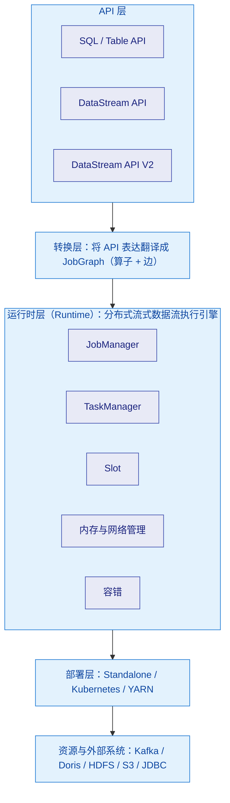
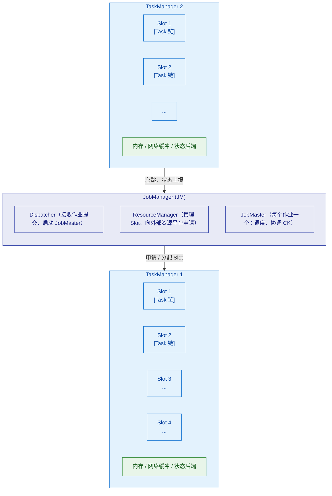

# 🏗️ 一、Flink 架构与运行时

> 本篇建立 Flink 的**整体地图**：一个作业从提交到执行经历了什么、集群里有哪些角色、并行度与 Slot 到底是什么关系、算子链为什么存在、数据在算子之间怎么走。
> 读完应该能画出 Flink 的运行时架构图，并解释"一个作业在集群上是怎么被拆成 Task 跑起来的"。
> 关联：[[0-Flink总览]]、[[2-时间与窗口]]、[[6-背压与性能调优]]（Slot/内存/链的调优）、[[9-部署与运维]]（部署模式与资源）。

---

## 一、Flink 到底是什么

### 1.1 三个关键词

Flink 官方定位是**有状态的流式计算引擎（Stateful Computations over Data Streams）**。拆开看：

| 关键词 | 含义 | 为什么重要 |
|---|---|---|
| **流（Stream）** | 数据模型是**无界/有界的数据流**，不是"先攒批再算" | 与 Spark Streaming 的"微批"本质区别；决定了延迟量级 |
| **状态（State）** | 算子可以保存跨事件的信息 | 让"聚合、join、去重、CEP"成为可能；也是容错的对象 |
| **时间（Time）** | 支持事件时间与水位线 | 让乱序数据也能算出正确结果 |

> [!tip] 一句话抓住本质
> **Flink 干的事：把无界数据流，在有状态、可容错、按事件时间的前提下，持续地转换成结果流。**
> 由此推出的三大难点就是本系列的三大支柱：**时间（[[2-时间与窗口]]）、状态（[[3-状态管理]]）、容错（[[4-容错与ExactlyOnce]]）**。

### 1.2 分层架构（五层）



**要点**：越往上越"声明式"，越往下越"执行细节"。**SQL 和 DataStream 最终都翻译成同一套运行时执行**，这也是"流批一体"能成立的原因。

---

## 二、集群角色与职责

### 2.1 架构总图



### 2.2 角色职责表

| 角色 | 职责 | 关键点 |
|---|---|---|
| **JobManager (JM)** | 作业的"大脑"：调度、协调 Checkpoint、故障恢复 | 逻辑上是一个；**生产必须配 HA**（见 [[9-部署与运维]]） |
| ├─ **Dispatcher** | 接收客户端提交、为每个作业启动一个 JobMaster、提供 Web UI | 一个集群一个 |
| ├─ **ResourceManager** | 管理 TaskManager 的 Slot；需要时向 K8s/YARN 申请新 TM | **不是 YARN 的 RM**，是 Flink 自己的 |
| └─ **JobMaster** | 每个作业一个：把 JobGraph 变成执行图、申请资源、调度 Task、触发并协调 Checkpoint | **Checkpoint 的发起者** |
| **TaskManager (TM)** | 工作进程：提供 Slot、执行 Task、管理内存与网络缓冲、**持有状态** | 真正的"干活的"；挂了要重启并从 CK 恢复 |
| **Task** | 一个线程中执行的**算子链**（一个或多个算子融合） | Task 内部是"数据流式"的，不是一条条函数调用 |
| **Slot** | TM 上的资源切片，**逻辑隔离内存，不隔离 CPU** | 一个 Slot 可跑一个 Task（常规）；Slot 共享后一个 Slot 可跑一条链上多个算子的子任务 |

> [!warning] 两个最容易搞混的点
> **1. ResourceManager 是谁？** Flink 自己的 ResourceManager 只管 **Slot 的分配**；它与部署平台的资源管理器（K8s、YARN）交互去申请容器，但**不是** YARN 的 ResourceManager。
> **2. JobMaster 与 Dispatcher 的区别？** Dispatcher 管理"作业的提交与生命周期入口"，**每个作业有一个独立的 JobMaster**；Checkpoint 协调发生在 **JobMaster**，不是 Dispatcher。

---

## 三、作业提交与执行：从 main() 到跑起来

### 3.1 三个图（面试常问）

| 图 | 生成者 | 内容 | 并行度信息 |
|---|---|---|---|
| **StreamGraph** | 客户端（API 层） | 用户代码的算子拓扑（逻辑） | 无（或仅有算子级设置） |
| **JobGraph** | 客户端（优化后） | 做了**算子链融合**的算子拓扑 | 无 |
| **ExecutionGraph** | JobMaster | 按并行度展开成**可调度的执行节点** | **有**，每个 ExecutionVertex 对应一个并行实例 |

> [!important] 为什么要有三个图
> 这是一个**逐步"落地"**的过程：
> `StreamGraph`（用户意图）→ **算子链优化** → `JobGraph`（逻辑执行计划，可在提交前优化）→ **按并行度展开 + 申请资源** → `ExecutionGraph`（物理调度计划，JobMaster 据此调度）。
> 面试问"Flink 作业是怎么提交执行的"，答出这三个图的转换过程就是满分骨架。

### 3.2 提交流程（Application 模式为例）

| 步骤 | 动作 | 发生在哪 |
|---|---|---|
| 1 | 用户 `flink run` 提交作业 | 客户端 |
| 2 | 生成 StreamGraph → 优化为 JobGraph | 客户端 |
| 3 | JobGraph 交给 Dispatcher | Dispatcher |
| 4 | Dispatcher 启动 **JobMaster** | JobManager |
| 5 | JobMaster 把 JobGraph 转成 ExecutionGraph，向 ResourceManager 申请 Slot | JobManager |
| 6 | ResourceManager 分配已有 Slot，或请求部署平台**拉起新的 TaskManager** | JM + 平台 |
| 7 | JobMaster 把 Task 部署到对应 Slot | JM → TM |
| 8 | Task 启动，Source 开始消费数据，数据流在算子间流动 | TaskManager |
| 9 | JobMaster 周期性触发 Checkpoint | JobManager |

> [!note] Application 模式的特殊之处
> 在 **Application 模式**下，`main()` 在**集群侧**执行（JobManager 上），而不是客户端。这样客户端不再承担生成 JobGraph 的重活与依赖下载，**依赖与作业绑定**，更适合生产。三种模式的完整对比见 [[9-部署与运维]]。

---

## 四、并行度、Task、Slot 与 Slot Sharing

### 4.1 四个概念的精确定义

| 概念 | 定义 | 类比 |
|---|---|---|
| **并行度 (Parallelism)** | 一个算子被拆成多少个并行实例 | 多少个人做同一件事 |
| **Task** | Flink 的执行单元，**一个线程里跑一个算子链** | 一条流水线上的一个工位 |
| **Slot** | TaskManager 上的资源切片（内存隔离单位） | 工位占用的场地 |
| **Slot Sharing** | **同一 Job 中同一 SlotSharingGroup 的不同算子的子任务共享一个 Slot** | 多个不同工位的工人共用一块场地 |

**关系**：`并行度`决定要多少个 Task 实例；`Slot`决定这些实例能放在哪；`Slot Sharing`决定能不能"合租"。

### 4.2 Slot Sharing 为什么存在

> [!important] 没有 Slot Sharing 会怎样
> 假设一条 Source(并行度4) → Map(4) → Sink(4) 的流水线，如果没有 Slot 共享，需要 **4+4+4 = 12 个 Slot**；有了 Slot 共享，**只需要 4 个 Slot**（每个 Slot 里放 Source、Map、Sink 各一个子任务）。
> 更关键的是**负载均衡**：Source 忙、Map 闲的场景下，共享 Slot 能让同一块资源自动被更忙的子任务使用，避免"有的 Slot 挤爆、有的空转"。

| 机制 | 作用 | 相关 API |
|---|---|---|
| Slot Sharing Group | 控制哪些算子**可以**共享 Slot（默认全部 `default`） | `.slotSharingGroup("name")` |
| `disableChaining()` | 断开算子链（但不影响 Slot 共享） | `.disableChaining()` |
| `startNewChain()` | 从当前算子开始新链 | `.startNewChain()` |
| `uid()` | 给算子固定 ID，**Savepoint 恢复依赖它** | `.uid("my-op")` |

> [!danger] `uid()` 是生产必做项
> Flink 靠**算子 uid 的哈希**来把 Savepoint 里的状态映射回算子。如果你不显式设置 `uid()`，改动代码（哪怕只是调整了算子顺序）就会导致 **Savepoint 恢复失败或状态错位**。
> **规范：每个算子都显式 `.uid("有语义的名字")`。**

### 4.3 并行度怎么设

| 层级 | 设置方式 | 优先级 |
|---|---|---|
| 算子级 | `.setParallelism(n)` | 最高 |
| 执行环境级 | `env.setParallelism(n)` | 中 |
| 提交时 | `-p n` | 次之 |
| 集群默认 | `parallelism.default`（配置文件） | 最低 |

**设置原则**：

| 依据 | 说明 |
|---|---|
| Source 并行度 ≤ Kafka 分区数 | **超过分区数的并行度处理不到数据**（有空闲 subtask） |
| 与 CPU 核数匹配 | 计算密集算子并行度 ≈ 可用核数；IO 密集可适当放大 |
| Sink 并行度受下游写入能力限制 | 并行度太高会打死下游数据库 |
| 总并行度 ≤ 总 Slot 数 | 否则作业会一直等资源（`WaitForResources`） |
| 改并行度要走 Savepoint | 且受 `maxParallelism` 限制，见下 |

### 4.4 `maxParallelism` 与 key group（重要且常被忽视）

- Keyed State 不是按"key"存储的，而是按 **key group** 组织；**key 通过哈希映射到 key group**，key group 再分配给各并行 subtask。
- **`maxParallelism`（默认约为并行度向上取到 2 的幂，且不超过某上限）决定了 key group 的总数**，因此它**决定了将来最多能扩到多少并行度**。
- 并行度变化时，Flink 通过"key group 在 subtask 之间搬迁"来重分配状态——**这是扩缩容不丢状态的关键机制**。

> [!warning] 实操红线
> `maxParallelism` **一旦上线就不要改**（改了会导致状态无法映射、Savepoint 无法恢复）。因此**规划时要为未来扩容留足上限**（例如预期最多 128 并行度，就设 `maxParallelism=128`）。

---

## 五、算子链（Operator Chaining）

### 5.1 为什么要做链融合

默认情况下，Flink 会把**满足条件的相邻算子合并成一个 Task**，在同一个线程里以"流水线"方式执行。

| 好处 | 原理 |
|---|---|
| 减少**序列化/反序列化** | 同一线程内可直接传递对象，不必走网络或缓冲序列化 |
| 减少**线程切换**开销 | 不用在算子之间切线程 |
| 降低**网络与缓冲**开销 | 数据不落地、不进网络栈 |

### 5.2 什么时候会断链

| 断链条件 | 说明 |
|---|---|
| 并行度不同 | 两边并行度不一致无法一对一流水 |
| 存在 **shuffle** | `keyBy`、`rebalance`、`broadcast` 等需要跨分区传输 |
| 用户显式调用 | `disableChaining()` / `startNewChain()` |
| `slotSharingGroup` 不同 | 不同共享组的算子无法合并 |

> [!tip] 链不是越多越好
> 链太长会导致**单个 Task 内的逻辑过重、故障恢复粒度变粗**（一个 Task 挂了整条链重启），并且**火焰图上难以区分热点**。
> 生产上调优手段：用 `startNewChain()` 把重算子（如大状态算子、异步 IO）**单独拆出来**，既便于观测也便于内存隔离。

### 5.3 代码示例

```java
DataStream<Order> stream = env
    .addSource(new FlinkKafkaConsumer<>("orders", schema, props))
    .uid("kafka-source")            // 固定 uid，Savepoint 恢复依赖它
    .name("订单源");

stream
    .keyBy(Order::getUserId)        // 这里必然产生 shuffle，链在此断开
    .window(TumblingEventTimeWindows.of(Time.minutes(1)))
    .aggregate(new OrderAggregate())
    .uid("order-window-agg")
    .name("分钟级订单聚合")
    .disableChaining()              // 大状态算子单独成链，便于观测
    .addSink(new DorisSink())
    .uid("doris-sink");
```

---

## 六、数据交换与网络栈

### 6.1 两种数据传输模式

| 模式 | 何时发生 | 路径 | 代价 |
|---|---|---|---|
| **Forward（一对一）** | 上下游并行度相同且无 shuffle（通常是同一链内） | 线程内直接传递对象 | 几乎为零 |
| **Shuffle（重分区）** | `keyBy`/`rebalance`/`broadcast`/并行度不同 | 经**网络缓冲 + 序列化**，跨 TaskManager 或本地 | 序列化 + 网络 + 反压风险点 |

### 6.2 网络缓冲（Network Buffer）与背压的连接点

- 每个跨节点的数据通道都有**固定数量的网络缓冲（buffer）**，数据先写入缓冲再发出去。
- 当下游消费慢时，缓冲填满 → 上游无法继续发送 → **背压产生**。
- 因此网络缓冲的多少**直接影响吞吐与背压表现**，相关参数（`taskmanager.network.memory.*`）与背压机制详见 [[6-背压与性能调优]]。

> [!note] 与 Credit-based 反压的关系
> Flink 1.5+ 使用 **Credit-based 流量控制**：下游向上游声明"我还有多少可用 buffer（credit）"，上游只在有 credit 时发送。
> 好处是**控制流（如 Checkpoint Barrier）不会被数据阻塞**，这让背压场景下 Checkpoint 仍有机会推进。详见 [[6-背压与性能调优]]。

### 6.3 数据交换的序列化

- 跨网络/跨线程边界的数据需要序列化；**Flink 优先使用自己的类型系统（TypeInformation）**，对 POJO 可生成高效的序列化器。
- 落到 **Kryo** 的情形（类型无法被 Flink 识别）性能较差且易出问题，**生产应尽量避免**。
- 状态序列化与 schema 演进见 [[3-状态管理]]。

---

## 七、执行模式：流、批与流批一体

| 执行模式 | `execution.runtime-mode` | 数据假设 | 特点 |
|---|---|---|---|
| **STREAMING** | `STREAMING` | 无界 | 默认；按事件驱动，支持事件时间与状态 |
| **BATCH** | `BATCH` | 有界 | 类似 MapReduce 的分阶段执行；可用更激进的优化（排序合并、批调度） |
| **AUTOMATIC** | `AUTOMATIC` | 由 Source 是否有界决定 | 让同一套代码按数据源自动选择 |

> [!important] 流批一体的真正含义
> 不是"用流的方式跑批"，而是**同一套 API（Table API / DataStream API）+ 同一套运行时**，根据数据是否有界选择执行模式。
> 因此很多 SQL 作业在流批两种模式下都能跑，但**语义有差异**（批模式不需要 Watermark，流模式状态必须有界或有 TTL）。详见 [[8-FlinkSQL与TableAPI]]。

---

## 八、动手验证

```bash
# 1) 本地启动（1.20 及之前版本）
./bin/start-cluster.sh
# 打开 http://localhost:8081 观察 JobManager / TaskManager / Slot / 反压

# 2) 提交一个自带示例作业（词频统计）
./bin/flink run ./examples/streaming/WordCount.jar

# 3) 查看作业列表与运行详情
./bin/flink list
./bin/flink list -r          # 包含已完成的作业

# 4) 观察并行度与 Slot 的实际效果
./bin/flink run -p 2 ./examples/streaming/WordCount.jar
# 在 Web UI 的「Job Graph」标签页看算子链与并行度标注

# 5) 触发一次 Savepoint（验证 uid 与状态）
./bin/flink savepoint <jobId> /tmp/flink-savepoints

# 6) 从 Savepoint 恢复，并改并行度（验证 key group 重分配）
./bin/flink run -s /tmp/flink-savepoints/savepoint-xxxx -p 4 ./examples/streaming/WordCount.jar
```

**观察点**：
- Web UI 的 **Job Graph** 中，合并成链的算子会画在同一个圆角框内 —— 验证"算子链"。
- 每个 TaskManager 的 **Slots** 数量与作业占用的 Slot 数 —— 验证"并行度与 Slot"。
- 改动 `-p` 后从 Savepoint 恢复是否成功 —— 验证"key group 与 maxParallelism"（若 `maxParallelism` 设得过小会失败）。

---

## 九、本篇必答

> [!question] 面试官可能这样问
> **Q：画一下 Flink 的架构，说说作业是怎么跑起来的。**
> A：客户端把用户代码生成 **StreamGraph**，优化算子链后得到 **JobGraph** 提交给 **Dispatcher**；Dispatcher 为该作业启动一个 **JobMaster**；JobMaster 把 JobGraph 按并行度展开为 **ExecutionGraph**，向 **ResourceManager** 申请 **Slot**（不够就拉起新的 **TaskManager**）；随后把 Task 部署到 Slot 上执行。运行时 **JobMaster** 负责协调 **Checkpoint**，**TaskManager** 负责执行并持有状态。
>
> **Q：并行度和 Slot 是什么关系？**
> A：**并行度**是算子并行实例的数量（需要多少个 Task 实例）；**Slot** 是 TaskManager 上的资源切片，决定这些实例能放在哪。一个 Slot 通常跑一个 Task；开启 **Slot Sharing** 后，同一共享组里不同算子的子任务可以共用同一个 Slot，因此一条 Source→Map→Sink（并行度都是 4）的流水线只需要 **4 个 Slot** 而不是 12 个。注意 **Slot 只隔离内存，不隔离 CPU**。
>
> **Q：算子链有什么好处？什么情况会断开？**
> A：把满足条件的相邻算子合并进同一线程，**减少序列化、线程切换与网络开销**，提升吞吐。会在**并行度不同、存在 shuffle（如 keyBy）、显式 disableChaining/startNewChain、slotSharingGroup 不同**时断开。
>
> **Q：改了并行度，之前的状态还能恢复吗？**
> A：能，只要 **不改变 `maxParallelism`**。Keyed State 按 **key group** 组织，并行度变化时 key group 会在新老 subtask 之间搬迁，从而实现状态重分配。但 `maxParallelism` **一旦上线就不能改**，它决定了并行度扩容的上限，所以规划时要留足余量。

---
> 下一篇 → [[2-时间与窗口]]：流计算的第一大难题。
