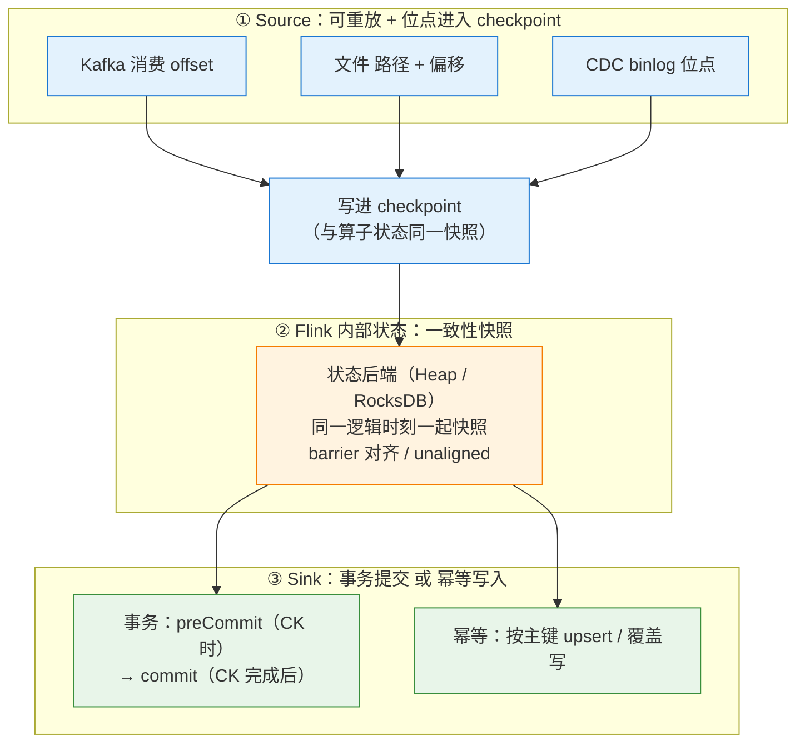

# 🔗 端到端一致性：Source 到 Sink 的 Exactly-Once

> **本篇与 [[4-容错与ExactlyOnce]] 的分工：那一篇讲 Flink 内部的一致性快照机制与语义原理（barrier、对齐、分布式快照算法），本篇讲工程视角——怎么在一条真实链路上把端到端 EOS 配出来，每个环节的前提是什么、做不到时怎么降级、以及怎么验证它真的生效。**
> 本篇回答四个问题：**为什么"Flink 内部 exactly-once"等于"端到端 exactly-once"是错的**？Kafka 的 offset 提交到底和恢复有没有关系（这题极容易答错）？两阶段提交和幂等写入各自适用于什么 sink、各自的坑在哪？Kafka → Flink → Doris 这种链路怎么做到不丢不重？
> 前置阅读：[[3-状态管理]]、[[4-容错与ExactlyOnce]]、[[5-Checkpoint与Savepoint]]。SQL sink 的 DDL 与 upsert 语义见 [[8-FlinkSQL与TableAPI]]，CDC 入湖链路见 [[7-FlinkCDC与实时数仓]]，checkpoint 调优见 [[6-背压与性能调优]]。

---

## 一、定位与端到端一致性的三个组成部分

### 1.1 一个必须先破除的误解

Flink 官方反复强调一句话：**Flink 的 exactly-once 是"状态一致性"（state consistency），不是"端到端一次性处理"。**

准确的表述是：

> Flink 能保证的是：**在 Source 可重放、且位点被纳入 checkpoint 的前提下，Flink 内部的状态与"已消费到哪、已写出什么"这三者在故障恢复后保持一致。** 至于最终落到外部系统的数据是不是**恰好一份**，取决于 **Sink 是否参与了这个一致性协议**（事务提交）**或者是否按主键幂等**。

所以：

| 说法 | 是否正确 |
| --- | --- |
| "Flink 支持 exactly-once" | ✅ 但指**内部状态** |
| "开了 checkpoint 就是端到端 exactly-once" | ❌ Sink 不支持事务也不幂等时，只有 at-least-once |
| "Kafka → Flink → Kafka 可以做到端到端 EOS" | ✅ 两端都在 Kafka 的 EOS 闭环内 |
| "Kafka → Flink → MySQL 可以做到端到端 EOS" | ⚠️ MySQL 不参与 Flink 事务，只能靠**主键幂等**近似实现 |
| "端到端 EOS 是无条件的" | ❌ 有前提：Source 可重放 + 位点入 checkpoint + Sink 事务或幂等 |

### 1.2 三个组成部分



> 快照机制细节见 [[5-Checkpoint与Savepoint]]。

每一环"要达到什么、做不到会怎样、常见实现"：

| 环节 | 要达到什么 | 做不到会怎样 | 常见实现 |
| --- | --- | --- | --- |
| **① Source** | **可重放**：能按指定位点重新开始消费；**位点必须进入 checkpoint** | 恢复后从错误位置开始 → 丢数据（从更晚的位置开始）或大量重复（从很早开始） | Kafka：消费 offset 存进 checkpoint；文件：文件路径 + 文件内偏移；MySQL CDC：binlog 文件名/GTID + 位点 |
| **② 内部状态** | 所有算子的状态在**同一个逻辑时刻**被一致地快照 | 状态与位点不匹配 → 恢复后重复计算、结果错误、状态错乱 | checkpoint / savepoint（原理见 [[4-容错与ExactlyOnce]]） |
| **③ Sink** | 要么**事务提交**（与 checkpoint 完成绑定），要么**按主键幂等覆盖** | 只能退化为 at-least-once：故障恢复后重复写；或数据长时间不可见 | Kafka 事务；Doris label + 2PC；JDBC + 主键 upsert；HBase `Put`；ClickHouse `ReplacingMergeTree` |

### 1.3 必要条件清单

一条链路要真正做到端到端 EOS，下面**每一条都必须成立**，缺一条就降级：

| # | 必要条件 | 不满足的后果 |
| --- | --- | --- |
| 1 | Source **可重放**（能按位点重读） | 连 at-least-once 都做不到。**socket source、无位点的自定义 source 是不可重放的** |
| 2 | Source 的位点**进入 checkpoint** | 恢复后位点与状态不匹配 |
| 3 | checkpoint 开启且**成功率可控** | checkpoint 一直失败 → 作业反复重启 |
| 4 | checkpoint 模式为 `EXACTLY_ONCE`（需要 barrier 对齐或 unaligned） | `AT_LEAST_ONCE` 模式不做对齐，恢复时状态可能重复处理 |
| 5 | Sink 支持**事务**，或支持**按业务主键幂等覆盖** | 只有 at-least-once |
| 6 | Sink 的事务生命周期**正确绑定 checkpoint**（完成后才 commit） | 提前 commit → 数据提前可见但可能丢；不 commit → 数据不可见 |
| 7 | 下游消费者**使用 `read_committed`**（事务路线时） | 看到未提交/已回滚的脏数据 |

> [!important] 一句话总结本篇的价值
> **端到端一致性不是"开个开关"，而是"一条链路上七个条件的联合成立"。** 排查线上"到底重没重"时，就按这七条逐条核对。

---

## 二、Source 侧：位点如何进入 checkpoint

### 2.1 KafkaSource 与 OffsetsInitializer

`KafkaSource` 是 Flink 1.14 之后推荐的 Kafka source（取代 `FlinkKafkaConsumer`）。它的起始位点由 `OffsetsInitializer` 决定。

```java
import org.apache.flink.api.common.eventtime.WatermarkStrategy;
import org.apache.flink.api.common.serialization.SimpleStringSchema;
import org.apache.flink.connector.kafka.source.KafkaSource;
import org.apache.flink.connector.kafka.source.enumerator.initializer.OffsetsInitializer;
// OffsetResetStrategy 是 Kafka 客户端的类型；
// 部分版本的 Kafka connector 会把 kafka-clients 打散重定位（shaded），
// 届时请改用对应的 shaded 包名，以你所用连接器版本的依赖为准。
import org.apache.kafka.clients.consumer.OffsetResetStrategy;

KafkaSource<String> kafkaSource = KafkaSource.<String>builder()
        .setBootstrapServers("kafka-1:9092,kafka-2:9092")
        .setTopics("orders")
        .setGroupId("flink-orders-eos")
        // 关键：首次启动（无 checkpoint）时用消费组已提交位点，
        // 没有已提交位点则回退到 EARLIEST；有 checkpoint 时 checkpoint 中的位点优先
        .setStartingOffsets(OffsetsInitializer.committedOffsets(OffsetResetStrategy.EARLIEST))
        .setValueOnlyDeserializer(new SimpleStringSchema())
        // 把消费位点暴露给外部监控（对恢复无影响，见 2.2）
        .setProperty("commit.offsets.on.checkpoint", "true")
        // 不要在 Kafka 客户端侧自动提交
        .setProperty("enable.auto.commit", "false")
        // 动态发现新增分区
        .setProperty("partition.discovery.interval.ms", "60000")
        .build();

DataStream<String> stream = env.fromSource(
                kafkaSource, WatermarkStrategy.noWatermarks(), "Kafka Source")
        .setParallelism(4);
```

`OffsetsInitializer` 的常用工厂方法：

| 方法 | 语义 |
| --- | --- |
| `OffsetsInitializer.earliest()` | 从最早开始 |
| `OffsetsInitializer.latest()` | 从最新开始 |
| `OffsetsInitializer.committedOffsets(OffsetResetStrategy)` | 优先用消费组已提交位点，没有则按 reset 策略 —— **生产常用** |
| `OffsetsInitializer.timestamp(long)` | 从指定时间戳开始 |
| `OffsetsInitializer.offsets(...)` | 指定每个分区的精确位点 |
| `OffsetsInitializer.stoppingOffsets(...)` | 设置停止位点，把流变成有界流（批处理） |

**位点从哪里恢复（优先级必须说清）：**

```text
作业启动
  ├─ 从 checkpoint / savepoint 恢复？
  │     ├─ 是 → 使用 checkpoint 中记录的 offset（OffsetsInitializer 被忽略！）
  │     └─ 否 → 按 OffsetsInitializer 决定起始位点
  └─ 位点随 checkpoint 一起写入状态后端
```

> [!danger] 这是本篇最重要的一句话
> **有 checkpoint/savepoint 时，`OffsetsInitializer` 和消费组提交的位点都会被忽略，恢复只认 checkpoint 里的 offset。**
> 所以"作业重启后从头消费了"这种事故，原因**不是** startup mode 配错了，而是**根本没有可用的 checkpoint**（checkpoint 目录被删、作业用了全新 checkpoint 路径、或作业是 `cancel` 且没保留外部化 checkpoint）。

### 2.2 极重要：offset 提交给 Kafka ≠ 恢复位点

这是面试里最容易答错的一题，必须彻底澄清。

| 行为 | 由谁控制 | 作用 | 对恢复有影响吗 |
| --- | --- | --- | --- |
| **checkpoint 中记录 offset** | Flink 的 checkpoint 机制（自动） | **唯一决定恢复位点的东西** | ✅ **决定性作用** |
| **把 offset 提交给 Kafka 消费组** | `commit.offsets.on.checkpoint` | 让**外部**（监控、其他消费者、Kafka 命令行工具 `--describe`）能看到消费进度 | ❌ **对恢复没有任何影响** |

为什么要提交给 Kafka？因为 `kafka-consumer-groups.sh --describe` 看到的 lag 依赖已提交位点。如果不提交，运维就无法用标准工具看 lag，监控面板也会显示不出来。

**结论（背下来）：**

> `commit.offsets.on.checkpoint` 只是**把位点暴露给外部监控**，它是一个"可观测性"开关，**不是一致性开关**。
> Flink 从 checkpoint 恢复时，**完全不看** Kafka 里提交的位点。即使 `commit.offsets.on.checkpoint = false`，只要 checkpoint 里有 offset，恢复依然是精确的。

**一个高价值的追问与答案：**

| 追问 | 回答 |
| --- | --- |
| 那如果 Kafka 里提交的位点比 checkpoint 里的**更靠前**呢？ | **不影响恢复**，Flink 会从 checkpoint 的位点重读，可能重复消费，这正是 at-least-once/EOS 需要 sink 幂等或事务的原因 |
| 如果 Kafka 里提交的位点比 checkpoint **更靠后**呢（比如别人用同一个 group 消费了）？ | **会丢数据**！这是**多个消费者共用同一个 `group.id`** 的典型事故。所以：**一个 Flink 作业一个独立 group.id** |
| 那我能不能干脆关掉 Kafka 位点提交？ | 可以（不影响正确性），代价是失去 lag 监控能力。建议开着 |

### 2.3 `scan.startup.mode` 与恢复的关系

SQL 侧对应参数：

| `scan.startup.mode` | 无 checkpoint 时的行为 | 有 checkpoint 时 |
| --- | --- | --- |
| `group-offsets` | 用消费组已提交位点；没有则报错或按 `auto.offset.reset` | **checkpoint 优先** |
| `earliest-offset` | 从最早开始 | **checkpoint 优先** |
| `latest-offset` | 从最新开始 | **checkpoint 优先** |
| `timestamp` | 从指定时间开始 | **checkpoint 优先** |
| `specific-offsets` | 从指定分区位点开始 | **checkpoint 优先** |

> [!warning] 一个高频事故
> **"我把 `scan.startup.mode` 从 `group-offsets` 改成了 `latest-offset`，然后重启作业，结果数据没丢啊？"**
> 对，因为作业是从 checkpoint 恢复的，`scan.startup.mode` 被忽略了。**要真正从头重跑，必须使用 `--allowNonRestoredState` 之外的另一种方式：删除/换掉 checkpoint 目录，或者从 savepoint 恢复。** 这条一定要说清楚，否则会误导排查方向。

### 2.4 其他 Source 的位点管理

| Source | 什么进入 checkpoint | 注意点 |
| --- | --- | --- |
| **Kafka** | 每个 `TopicPartition` 的 offset | 分区动态发现后，新分区也会被记录 |
| **文件系统（有界）** | 文件路径 + 已读偏移 | 适合批/回填；文件被删除或改名会影响恢复 |
| **MySQL CDC（incremental snapshot）** | binlog 位点（或 GTID）+ **快照分片进度** | 采用**增量快照**时，快照阶段也参与 checkpoint，恢复时不会重跑已完成的快照分片；非增量快照模式下重启可能需要重跑全量快照（取决于版本与配置） |
| **自定义 Source** | 由 `SourceReader` 的 `snapshotState` 决定 | **必须自己实现可重放语义**；很多自研 source 只记录了"读到哪"却没实现"按位点重置"，导致恢复后语义错误 |

MySQL CDC 的 SQL 配置要点：

```sql
CREATE TABLE mysql_orders (
  id          BIGINT,
  user_id     BIGINT,
  amount      DECIMAL(12, 2),
  update_time TIMESTAMP(3),
  PRIMARY KEY (id) NOT ENFORCED,
  WATERMARK FOR update_time AS update_time - INTERVAL '5' SECOND
) WITH (
  'connector'                          = 'mysql-cdc',
  'hostname'                           = 'mysql-host',
  'port'                               = '3306',
  'username'                           = 'flink',
  'password'                           = '******',
  'database-name'                      = 'biz',
  'table-name'                         = 'orders',
  'scan.startup.mode'                  = 'initial',   -- initial: 先全量快照再追增量
  'scan.incremental.snapshot.enabled'  = 'true',      -- 增量快照：快照阶段可 checkpoint
  'server-time-zone'                   = 'Asia/Shanghai',
  'debezium.snapshot.mode'             = 'initial'
);
```

> [!note] CDC 源的"至少一次"细节
> CDC 源在**快照阶段**的语义需要特别留意：全量快照 + 增量 binlog 的衔接如果处理不当，会出现重复（同一行被快照和 binlog 各读一次）。这也是为什么 CDC 链路**下游必须能按主键幂等覆盖**——即使 source 侧做到位，binlog 重放本身也天然带重复。

### 2.5 Source 侧失败场景表

| 场景 | 后果 | 根因 | 防线 |
| --- | --- | --- | --- |
| 多个消费者共用 `group.id` | **丢数据**（别人提交的位点更靠后） | 恢复只认 checkpoint，但如果新作业没有 checkpoint 可用，就会用更靠后的 group 位点 | 一个作业一个独立 group.id |
| checkpoint 目录被删除/换路径 | 从头或从最新开始 → 丢或大量重复 | 无 checkpoint 可用，回退到 startup mode | checkpoint 目录用固定路径 + 对象存储生命周期策略别误删 |
| 上游 Kafka 已过期删除旧数据 | 从 checkpoint 恢复时位点已不存在 → 报错或跳到最早 | topic 保留时间短于作业最长停机时间 | 保证 `retention.ms` > 最大可接受停机时长 + 延长恢复窗口 |
| 自定义 source 不可重放 | 恢复后语义错误 | 没实现"按指定位点重置" | 用官方 connector 或严格实现 `Source` 合约 |
| 分区扩容 + 无动态发现 | 新分区数据永远不被消费 | 未开 `partition.discovery.interval.ms` / `scan.topic-partition-discovery.interval` | 开启动态分区发现 |

---

## 三、Sink 侧：两条路线

### 3.1 对比表

| 对比项 | **两阶段提交（事务）** | **幂等写入** |
| --- | --- | --- |
| 核心思想 | 把"写出"变成事务：checkpoint 时 preCommit，**checkpoint 全局完成后**才 commit；失败则 abort | 每条数据带业务主键，重复写就是覆盖写，写几次结果一样 |
| 语义强度 | **严格一次**（在闭环内） | **最终一致**（"恰好一份"是查询时看到的，不是物理上只写了一次） |
| 对 sink 的要求 | 必须支持事务（Kafka 事务、Doris 2PC、支持 XA 的 DB……） | 必须有**确定且唯一的业务主键** + 可覆盖写 |
| 数据可见性 | **延迟可见**：commit 之前下游看不到 → 端到端延迟 ≥ checkpoint 间隔 | **立即可见**：写完就能查到 |
| 失败影响 | 事务超时、commit 失败、残留 open transaction | 只是重复写，业务上被覆盖，无一致性影响 |
| 吞吐影响 | 事务开销 + 等待 checkpoint → 吞吐略降 | 几乎无额外开销 |
| 实现复杂度 | 高（超时匹配、fencing、恢复时 abort 残留） | 低（一个主键 + upsert） |
| 典型系统 | Kafka、Doris（2PC）、支持 XA 的数据库 | Doris Unique、StarRocks 主键模型、ClickHouse `ReplacingMergeTree`、HBase、MySQL `ON DUPLICATE KEY`、ES（按 `_id`）、Redis |
| 适用场景 | 链路两端都在"支持事务"的体系内、对重复零容忍 | **绝大多数真实链路**：外部系统不支持 Flink 事务时唯一可行的路线 |

### 3.2 为什么"至少一次 + 幂等"常常比事务更实用

这是工程判断，也是面试的加分项。理由有四条：

1. **现实世界里多数 sink 不支持参与 Flink 事务。** MySQL、ClickHouse、HBase、Redis、ES 都无法被纳入 Flink 的事务协议（Flink 无法控制它们的提交时机）。硬要"事务"只能自己造 XA，风险极高。
2. **幂等把"一致性问题"降级成"性能问题"。** 事务路线下，checkpoint 间隔变大 → 重复数据的**可见性窗口**变大，是语义风险；幂等路线下，重复写只是**多写几次**，一致性不受影响，于是**可以放心地拉长 checkpoint 间隔**去换吞吐。
3. **幂等路线没有"数据不可见"问题。** 事务路线在 commit 之前数据对下游不可见，端到端延迟被 checkpoint 间隔锁死；幂等路线写完即可见，延迟只受处理链路影响。
4. **故障恢复更简单。** 事务路线要处理超时、fencing、残留事务清理；幂等路线重启重放即可，越重放越"收敛到正确结果"。

> [!tip] 一句话答题模板
> "我们的链路是 Kafka → Flink → Doris。Doris 的 Stream Load 有 label 机制、Unique 模型有主键，所以**幂等 + at-least-once 就足够**，不需要为此把 checkpoint 间隔压到 10 秒；如果链路是 Kafka → Flink → Kafka，两端都在事务体系内，那就直接开 **`EXACTLY_ONCE` + 事务**，配合下游 `read_committed`。"

---

## 四、两阶段提交详解（工程视角）

### 4.1 事务生命周期与 checkpoint 的绑定关系

核心原则：**"prepare"发生在 checkpoint 过程中，"commit"发生在 checkpoint 全局完成之后。**

```text
时间轴 ──────────────────────────────────────────────────────────►

  JobManager                算子/Sink（每 subtask）              外部系统
      │                            │                              │
      │  触发 checkpoint N         │                              │
      ├───────────────────────────►│                              │
      │                            │ ① 业务数据持续写入（在事务内） │
      │                            │    ─────────────────────────►│ 写入事务缓冲
      │                            │                              │（未提交）
      │                            │ ② snapshotState：             │
      │                            │    preCommit / flush         │
      │                            │    生成 committable handle    │
      │                            │    把 handle 存入算子状态 ────│
      │◄───────────────────────────┤ ③ 返回快照                    │
      │                            │                              │
      │  ④ 所有算子快照完成           │                              │
      │  checkpoint N 全局完成       │                              │
      │                            │                              │
      │ ⑤ notifyCheckpointComplete │                              │
      ├───────────────────────────►│ ⑥ commit（真正提交事务）──────►│ 提交，数据可见
      │                            │    失败则重试（handle 是幂等的）│
      │                            │                              │
      │  若期间任一步失败：          │                              │
      │  ─ checkpoint N 未完成 → 全局回滚，恢复后从 N-1 重放        │
      │  ─ 未提交的事务由恢复时 abort 掉（或由超时兜底清理）          │
```

**三个关键设计点：**

| 设计点 | 为什么这样设计 |
| --- | --- |
| **commit 必须在 checkpoint 全局完成之后** | 如果某个 subtask 提前 commit 而其他 subtask 的 checkpoint 失败了，就会出现"一半提交、一半回滚"的不一致。**只有全局成功才允许提交。** |
| **committable handle 必须存进算子状态** | 这样即使 JobManager 在 `notifyCheckpointComplete` 之后、commit 完成之前挂掉，恢复后 Flink 也能从**已完成 checkpoint 的状态里**找到待提交的 handle 并**重新提交**。**这是"commit 失败不会丢数据"的根本原因。** |
| **commit 必须幂等** | 因为恢复后可能重复提交同一个 handle（第一次提交其实成功了但确认丢失） |

对应到 Flink 的 API 演进：

| 时代 | 抽象 | 说明 |
| --- | --- | --- |
| 早期 | `TwoPhaseCommitSinkFunction` | 把 `beginTransaction` / `preCommit` / `commit` / `abort` 四个方法塞进一个类，**自己维护 pending 事务状态**。已被标记为遗留 |
| 现在 | `Sink` V2 生态：`TwoPhaseCommittingSink` + `Committer` / `GlobalCommitter` + `CommittableManager` | **把"写数据"和"提交"解耦**：writer 只产生 committable，committer 负责提交；committable 由框架统一纳入状态管理，恢复与重放更可靠。新作业应优先用这套 |

### 4.2 Kafka Sink 的事务实现

DataStream API（推荐）：

```java
import org.apache.flink.connector.base.DeliveryGuarantee;
import org.apache.flink.connector.kafka.sink.KafkaSink;
import org.apache.flink.connector.kafka.sink.KafkaRecordSerializationSchema;

KafkaSink<String> kafkaSink = KafkaSink.<String>builder()
        .setBootstrapServers("kafka-1:9092,kafka-2:9092")
        .setRecordSerializer(
                KafkaRecordSerializationSchema.builder()
                        .setTopic("order_result")
                        .setValueSerializationSchema(new SimpleStringSchema())
                        .build())
        // 关键一：投递语义
        .setDeliveryGuarantee(DeliveryGuarantee.EXACTLY_ONCE)
        // 关键二：事务 ID 前缀（同一前缀用于 fencing 与残留事务清理）
        .setTransactionalIdPrefix("flink-orders-eos")
        // 关键三：事务超时，必须与 checkpoint 间隔匹配（见 4.3）
        .setProperty("transaction.timeout.ms", String.valueOf(15 * 60 * 1000L))
        .build();

stream.sinkTo(kafkaSink);
```

`DeliveryGuarantee` 的三个取值：

| 取值 | 语义 | 是否用事务 |
| --- | --- | --- |
| `NONE` | 不做任何保证（最快） | ❌ |
| `AT_LEAST_ONCE` | 不丢，但可能重复 | ❌ |
| `EXACTLY_ONCE` | 事务写入，checkpoint 完成后提交 | ✅ **必须开启 checkpoint**，必须设置 `transactionalIdPrefix` |

SQL 侧（connector 参数）：

```sql
CREATE TABLE kafka_order_result (
  order_id    STRING,
  user_id     BIGINT,
  amount      DECIMAL(12, 2),
  PRIMARY KEY (order_id) NOT ENFORCED
) WITH (
  'connector'                    = 'kafka',           -- 或 'upsert-kafka'（需主键）
  'topic'                        = 'order_result',
  'properties.bootstrap.servers' = 'kafka:9092',
  'format'                       = 'json',
  -- 新连接器（1.15+ 外置 flink-connector-kafka）：sink.delivery-guarantee
  'sink.delivery-guarantee'      = 'exactly-once',
  'sink.transactional-id-prefix' = 'flink-orders-eos'
  -- 旧版内置 kafka connector 的等价参数是 sink.semantic = 'exactly-once'
);
```

**几个必须知道的实现细节：**

| 细节 | 说明 |
| --- | --- |
| **`transactional.id` 的构成** | Flink 基于 `transactionalIdPrefix` 加上**子任务编号与 checkpoint 编号**派生出每个 subtask 每次 checkpoint 的 `transactional.id`。因此同一 subtask 的多次事务有不同的 id，但都共享同一前缀 —— **前缀就是清理与 fencing 的抓手** |
| **残留事务的清理** | 恢复时，committer 会扫描所有以该前缀开头的 `transactional.id`，把**上一次运行残留的、未提交的事务 abort 掉**，避免它们长期占着 Kafka 的 LSO |
| **不会主动清理"长期不恢复"的事务** | 如果作业停了很久不再恢复，那些 open transaction 只能靠 broker 的 `transaction.max.timeout.ms` 兜底超时 |
| **必须开 checkpoint** | `EXACTLY_ONCE` 依赖 checkpoint 完成才提交，**关闭 checkpoint 时事务永远不提交 → 数据永远不可见** |
| **并行度变化的影响** | 事务 id 里含 subtask 编号，改并行度后前缀相同但子任务编号集合变化，恢复时旧的残留事务仍会被前缀扫描清理 |

> [!danger] `FlinkKafkaProducer`（遗留 API）的坑
> 老代码里常见的 `new FlinkKafkaProducer<>(..., Semantic.EXACTLY_ONCE)` 是 1.14 之前的写法。它有若干已知问题（例如 `transactionalId` 生成方式、超时处理、`setWriteTimestampToKafka` 影响时间戳语义、以及与 checkpoint 的耦合不够清晰）。**新作业一律用 `KafkaSink`。**

### 4.3 事务超时与 checkpoint 间隔必须匹配

这是生产上最常见的 EOS 故障来源。三方约束必须同时满足：

```text
生产者 transaction.timeout.ms   ≤   broker transaction.max.timeout.ms
        ▲
        │  必须明显大于 checkpoint 间隔 + checkpoint 最长时长
        │
checkpoint 间隔 + checkpoint 执行时间
```

| 参数 | 位置 | 作用 |
| --- | --- | --- |
| `transaction.timeout.ms` | **生产者（Flink sink）** | 事务从 begin 到 commit 的最大允许时长。**超过就自动 abort** |
| `transaction.max.timeout.ms` | **broker** | broker 侧允许的最大值。**生产者的值超过它，broker 会拒绝建事务** |

**为什么必须匹配：** 事务的生命周期是"从上一个 checkpoint 完成 → 到本次 checkpoint 完成"。如果 `transaction.timeout.ms` 小于这个周期，事务会在 checkpoint 完成之前就被 abort，随后 Flink 尝试 commit 时会失败，作业报错重启（典型错误是 `ProducerFencedException`、`InvalidTxnStateException`、`TransactionAbortedException` 之类），重启后又重复同样的节奏，形成**失败循环**。

**实践规则：**

| 规则 | 说明 |
| --- | --- |
| `transaction.timeout.ms` > `checkpoint 间隔 + 单次 checkpoint 最长耗时`，并留出足够余量 | 保守做法是留 2~3 倍余量 |
| 同时要检查 broker 的 `transaction.max.timeout.ms` | Kafka 默认值通常远小于"大 checkpoint 间隔"的需求，很多时候**需要在 broker 侧调大** |
| checkpoint 间隔很大（例如 10 分钟）时，务必先算一遍这个不等式 | 这是最容易被忽略的配置组合 |
| 缩短 checkpoint 间隔也是一个选项 | 能同时降低重复可见性窗口和事务超时风险，代价是开销上升 |

> [!warning] 一个典型的错误配置组合
> `execution.checkpointing.interval = 10min` + checkpoint 偶尔跑 3 分钟 + `transaction.timeout.ms` 用客户端默认的小值 + broker 未调整 `transaction.max.timeout.ms`。
> 结果：事务先超时，commit 时作业直接失败；即使侥幸成功，也会因为事务时长过大被 broker 拒绝。

### 4.4 常见故障与错误信息形态

| 故障 | 表现 | 根因 | 处理 |
| --- | --- | --- | --- |
| **事务超时** | 作业报事务相关异常（fenced / invalid state / aborted transaction）后重启 | `transaction.timeout.ms` 小于 checkpoint 周期，或 broker 上限太小 | 调整 4.3 的不等式；必要时缩短 checkpoint 间隔 |
| **commit 阶段失败** | checkpoint 已完成但 sink 提交报错 | 网络抖动、broker 侧事务状态过期、权限问题、topic 被删 | **不会丢数据**：committable handle 在状态里，恢复后会重试提交；先修环境 |
| **数据"不可见"** | 写入成功但下游查不到 | ① 还没到 checkpoint 完成；② 下游消费者用的是 `read_uncommitted`；③ checkpoint 一直被拖长 | 检查下游 `isolation.level`；检查 checkpoint 时长与成功率 |
| **数据重复** | 下游看到重复 | sink 是 `AT_LEAST_ONCE`；或 sink 是幂等但主键错了；或 checkpoint 失败了 | 见第七、九节 |
| **残留 open transaction** | Kafka 的 LSO 被拖住，下游 `read_committed` 消费者延迟升高 | 作业长时间不恢复，事务没被 abort | 恢复作业（触发前缀清理）；或调 broker 的 `transaction.max.timeout.ms`；监控 open transaction 数 |
| **关闭 checkpoint 还配 EOS** | 数据永远查不到 / 作业直接报错 | EOS 依赖 checkpoint | 开启 checkpoint |
| **并行度变化后报 fenced** | 新旧实例冲突 | 旧实例仍在跑（僵尸实例） | Kafka 的 fencing 机制会踢掉旧实例，确认没有另一个同名前缀的作业在跑 |

### 4.5 下游必须用 `read_committed`

事务路线下，Kafka 里会存在**已写入但未提交**的记录。下游消费者的隔离级别决定它能不能看到：

| `isolation.level` | 能看到什么 | 适用 |
| --- | --- | --- |
| `read_committed` | 只能读到**已提交事务**的记录；已回滚的、未提交的都看不到。读取上界是 **LSO（Last Stable Offset）** | **EOS 链路的正确选择** |
| `read_uncommitted` | 什么都读得到，包括未提交和已回滚的 | 只用于调试或"容忍脏读"的场景 |

```java
// 下游 Flink 作业消费同一个 topic 时的正确配置
KafkaSource.<String>builder()
        .setProperty("isolation.level", "read_committed")
        ...
```

```sql
-- 下游 SQL 作业
'scan.startup.mode' = 'group-offsets',
'properties.isolation.level' = 'read_committed'
```

> [!warning] `read_committed` 的代价：队头阻塞
> 它的读取上界是 LSO = "最早未结束事务的首条记录"。所以**任何一个长事务（或残留的 open transaction）都会让 LSO 停住**，导致 LSO 之后**已经提交**的数据也不可见。这解释了两个现象：
> ① 事务持续时间直接决定下游的可见延迟 → **checkpoint 间隔越长，下游延迟越大**；
> ② 作业停跑后残留的 open transaction 会让下游"卡住不动" → 恢复作业或等 broker 超时。

---

## 五、幂等写入

### 5.1 各存储的幂等实现

| 存储 | 幂等机制 | 关键点 | 陷阱 |
| --- | --- | --- | --- |
| **Doris（Unique / AGG 模型）** | 按主键覆盖写；Stream Load 的 **label** 保证"同一 label 只导入一次" | **label 就是幂等键**：重试同一个 label 会被 Doris 拒绝，天然去重 | label 前缀必须全局唯一（`sink.label-prefix`），否则作业之间会互相冲突 |
| **Doris（2PC）** | `sink.enable-2pc = true`：checkpoint 时 preCommit，完成后 commit label | 可做到严格一次（事务路线） | 需要 Doris 端支持事务；事务超时同样与 checkpoint 间隔相关 |
| **StarRocks（主键模型）** | 主键模型按 key 覆盖；Stream Load label 去重 | 同 Doris 思路 | 连接器对事务的支持程度取决于版本，**实践上多数场景按 label + 主键幂等来做** |
| **ClickHouse `ReplacingMergeTree`** | 按 `ORDER BY` 的排序键去重，保留 version 最大的行 | 幂等是**最终**的（后台 merge 异步） | **查询时可能仍看到重复行**，需要 `FINAL` 或按主键 `argMax` 去重；重复量在大 checkpoint 间隔下会显著增加查询负担 |
| **HBase** | `Put` 按 rowkey 覆盖，天然幂等 | 同 rowkey 重复写结果一致 | 列族/版本数配置（`VERSIONS`）不当会看到多版本 |
| **MySQL** | `INSERT ... ON DUPLICATE KEY UPDATE`（需唯一索引/主键） | JDBC sink 支持按主键 upsert | 批量写（`sink.buffer-flush.*`）失败重试会产生重复批量；必须靠 upsert 吸收 |
| **Elasticsearch** | 指定 `_id` 的写入是覆盖语义 | `_id` = 业务主键即幂等 | 自动生成 `_id` 时**不幂等**（每次都是新文档） |
| **Redis** | `SET key value` 幂等 | 简单可靠 | 一般不做主 sink，多为旁路 |

> [!example] Doris label 机制为什么能救命
> Flink 写 Doris 时，每个批次（或每个 checkpoint 周期）会生成一个 label 提交 Stream Load。
> - 如果因为 checkpoint 失败导致这批数据被重放，**label 不变** → Doris 发现同 label 已存在/正在处理 → **拒绝重复导入**，于是幂等成立。
> - 如果 label 每次都随机生成（或用了不稳定的生成规则），**幂等立即失效**，重放就会造成数据翻倍。
> 所以：`sink.label-prefix` 必须**每个作业全局唯一且稳定**。

### 5.2 幂等写入的三个前提

| 前提 | 说明 | 违反的后果 |
| --- | --- | --- |
| **业务主键确定且唯一** | 必须有一个（或一组）能唯一标识一条业务记录的键 | 主键选错 → **覆盖错误的数据**（比重复更严重，因为它不重复而是丢了） |
| **可覆盖写** | sink 必须支持按主键更新/替换，而不是只能追加 | 只能追加的 sink（如 append-only Kafka topic、普通文件）无法幂等 |
| **写入顺序不能破坏"新值覆盖旧值"** | 同一主键的记录应按时间顺序落到 sink | 若同一主键的记录被分到不同并发实例、且写出乱序，**旧值可能覆盖新值**。SQL 侧可用 `table.exec.sink.keyed-shuffle`（`AUTO`/`FORCE`）保证按主键 shuffle，或把 sink 并行度设为 1 |

> [!danger] 幂等路线最危险的错误：主键选错
> 重复写只是"多写一次"，业务上能容忍；但**主键选错会静默产生错误数据**。
> 典型例子：用 `(user_id, dt)` 做主键做"用户日累计"，但业务实际需要按 `(user_id, dt, channel)` 拆分 → 不同 channel 的数据互相覆盖，聚合结果直接错，而且**没有任何报错**。
> 幂等路线的正确性**完全押在主键的业务语义上**，这一点必须在设计评审时确认。

### 5.3 与 exactly-once 的差别

| 维度 | 事务式 exactly-once | at-least-once + 幂等 |
| --- | --- | --- |
| 物理写入次数 | **恰好一次** | 可能多次（多次覆盖） |
| 查询结果 | 恰好一份 | 恰好一份（因为覆盖） |
| 中间状态的可见性 | 有"写入但不可见"的阶段 | 无，写完即见 |
| 故障时的语义 | 未提交事务被 abort → 重放 | 重放 → 覆盖 |
| 是否要求 sink 支持事务 | 是 | 否 |
| 严格程度 | 强（物理一次） | 弱（逻辑一次、物理可能多次） |
| 关键风险 | 事务超时、残留事务、可见延迟 | **主键语义错误** |

> [!important] 面试可用的精确表述
> "幂等写入不是 exactly-once，而是 **effectively-once（效果上一次）**：物理上可能写了多次，但因为按主键覆盖，最终可观测的结果与恰好写一次等价。它的正确性前提是**主键的业务语义正确**。"

### 5.4 推荐配置（at-least-once + 幂等）

```java
StreamExecutionEnvironment env = StreamExecutionEnvironment.getExecutionEnvironment();
env.setParallelism(8);

// ① checkpoint：语义用 EXACTLY_ONCE（内部状态一致），间隔可以放心放大
env.enableCheckpointing(3 * 60 * 1000L, CheckpointingMode.EXACTLY_ONCE);
CheckpointConfig cp = env.getCheckpointConfig();
cp.setMinPauseBetweenCheckpoints(60 * 1000L);
cp.setCheckpointTimeout(10 * 60 * 1000L);
cp.setMaxConcurrentCheckpoints(1);
cp.setTolerableCheckpointFailureNumber(3);
cp.enableExternalizedCheckpoints(
        CheckpointConfig.ExternalizedCheckpointCleanup.RETAIN_ON_CANCELLATION);

// ② Kafka source：位点进 checkpoint，不依赖 Kafka 位点提交
KafkaSource<String> source = KafkaSource.<String>builder()
        .setBootstrapServers("kafka:9092")
        .setTopics("orders")
        .setGroupId("flink-orders-to-doris")
        .setStartingOffsets(OffsetsInitializer.committedOffsets(OffsetResetStrategy.EARLIEST))
        .setValueOnlyDeserializer(new SimpleStringSchema())
        .setProperty("enable.auto.commit", "false")
        .setProperty("commit.offsets.on.checkpoint", "true") // 仅为了监控 lag
        .build();

// ③ 如果 sink 是 Kafka 且只要求 at-least-once（下游按主键幂等）
KafkaSink<String> sink = KafkaSink.<String>builder()
        .setBootstrapServers("kafka:9092")
        .setRecordSerializer(KafkaRecordSerializationSchema.builder()
                .setTopic("order_result")
                .setValueSerializationSchema(new SimpleStringSchema())
                .build())
        .setDeliveryGuarantee(DeliveryGuarantee.AT_LEAST_ONCE)
        .build();

// ④ 大状态用 RocksDB + 增量 checkpoint，避免 checkpoint 拖慢业务
env.setStateBackend(new EmbeddedRocksDBStateBackend(true));
```

SQL 侧（写 Doris，幂等 + label）：

```sql
SET 'execution.checkpointing.interval' = '3 min';
SET 'execution.checkpointing.mode' = 'EXACTLY_ONCE';
SET 'table.exec.sink.keyed-shuffle' = 'AUTO';   -- 保证同主键同并发实例，避免乱序覆盖

INSERT INTO doris_order_summary
SELECT user_id, COUNT(*) AS order_cnt, SUM(amount) AS total_amt, MAX(order_time) AS update_time
FROM kafka_orders
GROUP BY user_id;
```

---

## 六、典型链路配置清单

### 6.1 ① Kafka → Flink → Kafka（EOS 全配置）

| 环节 | 关键配置 | 前提 |
| --- | --- | --- |
| **上游 Kafka** | topic 副本数 ≥ 2；`min.insync.replicas` 与 `acks` 配合；保留时间 > 最大停机时长 | 生产端本身要可靠，否则 Flink 再精确也没用 |
| **Flink Source** | `scan.startup.mode = group-offsets`；`enable.auto.commit = false`；独立 `group.id` | 上游 topic 的数据在恢复窗口内不能过期 |
| **Flink 内部** | `execution.checkpointing.mode = EXACTLY_ONCE`；固定且持久的 checkpoint 目录；`state.backend = rocksdb` + 增量 | checkpoint 成功率必须可控 |
| **Flink Sink** | `DeliveryGuarantee.EXACTLY_ONCE` / `sink.delivery-guarantee = exactly-once`；**`transactionalIdPrefix` 必设且全局唯一**；`transaction.timeout.ms` > checkpoint 周期 | **必须开启 checkpoint** |
| **Kafka broker** | `transaction.max.timeout.ms` 要 ≥ 生产者设置的值 | 默认值往往偏小，大 checkpoint 间隔时必须调 |
| **下游消费者** | `isolation.level = read_committed` | 否则看到脏数据 |
| **监控** | checkpoint 成功率与时长、open transaction 数、下游 LSO 滞后 | —— |

```sql
-- Flink SQL 的完整 EOS 写法
SET 'execution.checkpointing.interval' = '1 min';
SET 'execution.checkpointing.mode' = 'EXACTLY_ONCE';
SET 'execution.checkpointing.min-pause' = '30 s';
SET 'execution.checkpointing.timeout' = '10 min';

CREATE TABLE src_orders (
  order_id STRING, user_id BIGINT, amount DECIMAL(12,2), create_time BIGINT,
  order_time AS TO_TIMESTAMP_LTZ(create_time, 3),
  WATERMARK FOR order_time AS order_time - INTERVAL '5' SECOND
) WITH (
  'connector' = 'kafka', 'topic' = 'orders',
  'properties.bootstrap.servers' = 'kafka:9092',
  'properties.group.id' = 'flink-orders-eos',
  'scan.startup.mode' = 'group-offsets',
  'properties.enable.auto.commit' = 'false',
  'format' = 'json', 'json.ignore-parse-errors' = 'true'
);

CREATE TABLE sink_orders (
  order_id STRING, user_id BIGINT, amount DECIMAL(12,2),
  PRIMARY KEY (order_id) NOT ENFORCED
) WITH (
  'connector' = 'upsert-kafka', 'topic' = 'order_result',
  'properties.bootstrap.servers' = 'kafka:9092',
  'key.format' = 'json', 'value.format' = 'json',
  'sink.delivery-guarantee' = 'exactly-once',
  'sink.transactional-id-prefix' = 'flink-orders-eos-sink'
);

INSERT INTO sink_orders SELECT order_id, user_id, amount FROM src_orders;
```

> [!note] `upsert-kafka` 的写语义
> `upsert-kafka` 会按主键产出 upsert 消息（key = 主键）。它能否走事务取决于连接器版本对 `sink.delivery-guarantee` 的支持；**若所用版本不支持事务，它就退化为 at-least-once**，此时下游需要按主键去重（Redis/MySQL 主键表/状态去重）。上线前一定要在目标版本上确认这一点，不能想当然。

### 6.2 ② Kafka → Flink → Doris / StarRocks（幂等 upsert + checkpoint）

| 环节 | 关键配置 | 前提 |
| --- | --- | --- |
| **Flink Source** | 同 6.1 | —— |
| **Flink 内部** | checkpoint 间隔可以放大（如 3~5 分钟）—— **因为幂等不怕重复** | 需要保证"上游数据不丢"，所以 checkpoint 仍需成功 |
| **Flink Sink** | `sink.label-prefix` **全局唯一且稳定**；`sink.properties.format = json` + `read_json_by_line = true`；可选 `sink.enable-2pc = true` | Doris 表必须是 **Unique 模型或 AGG 模型**（Duplicate 模型不幂等！） |
| **Doris 表** | 建表时 `UNIQUE KEY(...)` 与 Flink 写入的主键列一致 | **主键列必须相同**，否则覆盖语义错误 |
| **反压/吞吐** | `sink.buffer-flush.max-rows` / `interval`；Doris 的导入并发与 BE 资源 | 别用 64 并行度打一个 Doris 集群 |

```sql
-- Doris 侧建表（Unique 模型）
-- CREATE TABLE dw.order_summary (
--   user_id BIGINT, order_cnt BIGINT, total_amt DECIMAL(14,2), update_time DATETIME
-- ) UNIQUE KEY(user_id) DISTRIBUTED BY HASH(user_id) BUCKETS 8
-- PROPERTIES ("replication_num" = "3");

CREATE TABLE doris_order_summary (
  user_id     BIGINT,
  order_cnt   BIGINT,
  total_amt   DECIMAL(14,2),
  update_time TIMESTAMP(3)
) WITH (
  'connector'                     = 'doris',
  'fenodes'                       = 'doris-fe:8030',
  'table.identifier'              = 'dw.order_summary',
  'username'                      = 'root',
  'password'                      = '',
  'sink.label-prefix'             = 'flink_order_summary_v1',  -- 全局唯一且稳定
  'sink.properties.format'        = 'json',
  'sink.properties.read_json_by_line' = 'true',
  'sink.enable-2pc'               = 'true',    -- 需要严格一次时开启
  'sink.enable-delete'            = 'true'
);
```

> [!danger] Doris 链路最常见的两个错误
> 1. **表用了 Duplicate 模型**（默认模型）→ 写入**完全不幂等**，每次重放都追加一份数据，报表数字翻倍。
> 2. **`sink.label-prefix` 每次部署都改** → 幂等链条断裂，同一批数据换了 label 后会被 Doris 当作新导入接受，重复数据照样进来。
> 另外，`sink.label-prefix` 若在**多个作业间重复**，会出现 label 冲突导致导入失败。

### 6.3 ③ MySQL CDC → Flink → Kafka / Doris

| 环节 | 关键配置 | 前提 |
| --- | --- | --- |
| **MySQL** | `binlog_format = ROW`；`binlog_row_image = FULL`；账号有 `REPLICATION SLAVE` / `REPLICATION CLIENT` 权限 | binlog 保留时间 > 最大停机时长（否则位点被清理后无法恢复） |
| **Flink CDC Source** | `scan.startup.mode = initial`（全量+增量）；`scan.incremental.snapshot.enabled = true`；`server-time-zone` 与 MySQL 一致 | 增量快照让快照阶段也能 checkpoint，减少重启重跑 |
| **Flink 内部** | checkpoint 必须开启（CDC 源的位点靠它保存）；`table.exec.state.ttl` 按需设置 | —— |
| **Sink = Kafka** | 若要求 EOS：`sink.delivery-guarantee = exactly-once` + prefix；通常用 `upsert-kafka` + 主键 | 主键必须与 MySQL 表主键一致 |
| **Sink = Doris** | Unique 模型 + 稳定 label；`sink.enable-2pc` 可选 | 主键一致 |
| **主键一致性** | CDC 源表的 `PRIMARY KEY` 与 sink 表主键**必须完全一致**（含复合主键的所有列） | 不一致会导致覆盖错误或重复行 |

```sql
-- MySQL CDC 源表
CREATE TABLE mysql_orders (
  id          BIGINT,
  user_id     BIGINT,
  amount      DECIMAL(12,2),
  channel     STRING,
  update_time TIMESTAMP(3),
  PRIMARY KEY (id) NOT ENFORCED,
  WATERMARK FOR update_time AS update_time - INTERVAL '5' SECOND
) WITH (
  'connector' = 'mysql-cdc',
  'hostname' = 'mysql-host', 'port' = '3306',
  'username' = 'flink', 'password' = '******',
  'database-name' = 'biz', 'table-name' = 'orders',
  'scan.startup.mode' = 'initial',
  'scan.incremental.snapshot.enabled' = 'true',
  'server-time-zone' = 'Asia/Shanghai'
);

-- 注意：sink 的主键必须与源表主键语义一致
-- 如果业务上要按 (user_id, channel) 汇总，那么 sink 的主键就必须是 (user_id, channel)，
-- 而不是只写 user_id —— 否则不同渠道的数据会互相覆盖。
```

---

## 七、降级与取舍矩阵

### 7.1 外部系统不支持事务怎么办

| 情况 | 推荐方案 | 代价 |
| --- | --- | --- |
| Sink 支持主键 upsert（Doris Unique / MySQL 主键表 / HBase / ES `_id`） | **at-least-once + 幂等 upsert** | 需要保证主键语义正确；写放大（可能多次覆盖） |
| Sink 只能追加（append-only topic / 文件 / ClickHouse 非去重表） | **at-least-once + 下游去重**：下游建主键表/布隆过滤器/状态去重，或用 `ReplacingMergeTree` + 查询去重 | 下游复杂度上升；重复数据量取决于 checkpoint 间隔 |
| Sink 支持事务（Kafka / Doris 2PC / XA DB） | **两阶段提交** | 可见延迟 ≥ checkpoint 间隔；需处理事务超时 |
| Sink 什么都不支持，且不能接受任何重复 | 不可行 —— 必须换 sink 或改成"写入暂存区 + 离线去重"的两段式 | 引入额外链路与延迟 |
| 只是为了减小重复量 | **缩短 checkpoint 间隔** | 开销上升、吞吐下降；事务超时风险变大 |

### 7.2 延迟 vs 一致性 vs 吞吐的三角取舍

三者不能同时最优，必须显式选择：

| 你的优先级 | 配置取向 | 代价 |
| --- | --- | --- |
| **低延迟优先** | 缩短 checkpoint 间隔（甚至用 `AT_LEAST_ONCE` 模式 + 幂等 sink）；不开事务 | 一致性依赖幂等；checkpoint 开销占比高、吞吐下降 |
| **一致性优先** | 开事务 EOS；checkpoint 间隔适中；下游 `read_committed`；严格对齐事务超时 | 数据可见延迟 ≥ checkpoint 间隔；失败排查复杂度高 |
| **吞吐优先** | 拉长 checkpoint 间隔；RocksDB + 增量 checkpoint；mini-batch；**依赖幂等吸收重复** | 恢复时间变长；重复量变大；状态与 checkpoint 体积增大 |

> [!important] 三角取舍里最重要的一句洞察
> **幂等写入能"解耦"一致性与 checkpoint 间隔。**
> 事务路线下，"重复量"是**一致性风险**，所以必须把 checkpoint 间隔压小；幂等路线下，"重复量"只是**写放大和恢复时间**，不构成正确性风险，于是可以放心拉长间隔换吞吐。
> 这就是为什么"至少一次 + 幂等"在工程上常常是最优解。

---

## 八、怎么验证 EOS 真的生效

**"配了"不等于"生效"。** 下面是可执行的验证清单，越靠前越容易做。

| # | 验证手段 | 操作 | 预期结果 |
| --- | --- | --- | --- |
| 1 | **确认 checkpoint 真的在成功** | 看 `numberOfCompletedCheckpoints` / `numberOfFailedCheckpoints` / `lastCheckpointDuration` | 持续成功；时长稳定 |
| 2 | **kill TaskManager 验证** | `kill -9` 一个 TaskManager 进程，等作业自动恢复 | 从最近一次 checkpoint 恢复；**下游数据不重不漏**（用有主键的 sink 检查最终行数/校验和与上游一致） |
| 3 | **kill JobManager 验证** | 在 checkpoint 完成后、commit 完成前杀 JM（较难精确注入，可结合日志观察） | 恢复后待提交的 committable 被重新提交 → 不丢数据 |
| 4 | **故意让 checkpoint 失败** | 把 `execution.checkpointing.timeout` 设得很小，或在自定义算子里注入随机长睡眠/抛异常 | 失败后从上一个成功 checkpoint 重放；**幂等 sink 的最终结果仍然正确** |
| 5 | **测试 savepoint 恢复** | 触发 savepoint → 停作业 → 从 savepoint 恢复 | 无重复、无丢失；注意 savepoint 恢复本身就是"重放"场景 |
| 6 | **Kafka 侧对比隔离级别** | 用 `read_uncommitted` 与 `read_committed` 两个消费者分别消费同一 topic | `read_uncommitted` 能看到更多/更快的记录；`read_committed` 只看到已提交的 —— 这证明事务确实在生效 |
| 7 | **检查残留 open transaction** | 用 Kafka 的事务查询能力（如 `kafka-transactions.sh --list` 或 AdminClient 的 `listTransactions()`） | 正常情况下**没有长期挂着的 open transaction**；有则说明清理或超时机制有问题 |
| 8 | **验证幂等（最关键）** | 手动把同一批数据**再写一次**（重放/重跑） | Doris/MySQL/HBase 的行数与校验和**不变**；如果翻倍，说明主键或 label 机制没生效 |
| 9 | **对账** | 上游与下游的行数、按主键的 hash 校验和、关键指标（GMV/UV）对比 | 完全一致；不一致时要区分"没写进去"和"写重了" |
| 10 | **观察端到端延迟** | 事务路线下测从上游产生到下游可见的时间 | 约等于 checkpoint 间隔 + 处理时间（这是 EOS 的必然代价，不是 bug） |

> [!tip] 最有说服力的一次验证
> **"把 Kafka 上游的数据整批重放一遍，观察 Doris 里的数字有没有变化。"**
> 如果数字不变 → 幂等生效；如果翻倍 → 幂等没有生效（通常是表模型是 Duplicate、或 label 不稳定、或主键选错）。
> 这个实验 10 分钟就能做，比读十篇文档都有用。

---

## 九、常见坑表

| 坑 | 现象 | 根因 | 解法 |
| --- | --- | --- | --- |
| **把 offset 提交当成恢复位点** | 以为改了 `commit.offsets.on.checkpoint` 或 Kafka 位点就能控制恢复位置，排查方向全错 | 恢复**只认 checkpoint 里的位点** | 记住：`commit.offsets.on.checkpoint` 只是监控开关；要真正重跑就换 checkpoint 目录或从 savepoint 恢复 |
| **sink 事务超时** | 作业按固定节奏反复重启并报事务异常 | `transaction.timeout.ms` < checkpoint 周期；broker `transaction.max.timeout.ms` 偏小 | 调大生产者与 broker 的超时；或缩短 checkpoint 间隔；保证"超时 > 间隔 + 最长时长" |
| **下游用 `read_uncommitted` 看到脏数据** | 下游出现"写入后又消失"的数据、或读到已回滚记录 | 消费者隔离级别没设 | 设 `isolation.level = read_committed` |
| **幂等写入但主键选错** | 数字偏小（数据互相覆盖）、无任何报错 | 主键的业务语义与聚合维度不一致 | 主键必须覆盖所有业务区分维度；在表设计评审时确认 |
| **checkpoint 间隔过大导致重复量大** | 恢复后下游出现大量重复 | at-least-once 语义 + 长间隔 → 单次重放的数据量很大 | 缩短间隔；或改用**幂等 sink** 吸收重复；或改用事务 |
| **savepoint 恢复后重复** | 从 savepoint 恢复后下游数据变多 | savepoint 恢复本质是"从旧位点重放" | 必须靠 sink 幂等或事务吸收；不要期望 savepoint 能去重 |
| **Doris 表是 Duplicate 模型** | 每次重放数据都翻倍 | Duplicate 模型只追加不覆盖 | 改成 Unique 模型（或 AGG 模型），且主键列与写入列一致 |
| **`sink.label-prefix` 重复或不稳定** | 导入报 label 冲突，或幂等失效 | 前缀是幂等键的一部分 | 每个作业唯一 + 稳定；不要在每次部署时变更 |
| **多个消费者共用 `group.id`** | 丢数据或大量重复 | 别人的位点提交影响了新作业的起始位置（在无 checkpoint 可用时） | 一个作业一个独立 group.id |
| **CDC 源表与 sink 主键不一致** | 结果错误或重复 | CDC 是复合主键，sink 只声明了单列 | 主键列集合必须完全一致 |
| **并行度 > 1 时 upsert 乱序** | 同一主键出现"旧值覆盖新值" | 同主键记录被分到不同并发实例 | `table.exec.sink.keyed-shuffle = FORCE`（或 `AUTO`），或 sink 并行度设 1 |
| **关闭 checkpoint 却配了 EOS sink** | 数据永远不提交、下游查不到 | EOS 依赖 checkpoint 完成才 commit | 必须开启 checkpoint |
| **上游 topic 保留时间太短** | 恢复时报位点不存在，或直接跳到最早导致大量重复 | 停机时间 > `retention.ms` | 保留时间 > 最大可接受停机时长；缩短恢复时间 |
| **残留 open transaction 拖住 LSO** | 下游 `read_committed` 消费者延迟持续升高、几乎不动 | 作业停了很久，事务没被 abort | 恢复作业触发前缀清理；调 broker 超时；监控 open transaction |

> [!danger] 最隐蔽的一个坑
> **"幂等写入但主键选错"** 比数据重复严重得多。数据重复至少容易被对账发现；主键选错会让**不同业务实体的数据互相覆盖**，数字看起来"合理"但完全错误，而且**没有任何异常**。所以在设计幂等链路时，第一件要评审的事就是**主键的业务语义**，而不是 checkpoint 参数。

---

## 十、必答问题

> [!question] 必答：Kafka → Flink → Doris 怎么保证不丢不重？
> 按"三段链路 + 两个前提 + 一个验证"来答。
>
> **① 第一段：Kafka → Flink（保证不丢、可重放）**
> - 用 `KafkaSource`，**独立 `group.id`**，`OffsetsInitializer.committedOffsets(...)` 作为首次启动的兜底；`enable.auto.commit = false`。
> - **消费位点随 checkpoint 一起落盘**——恢复时**只认 checkpoint 里的 offset**（不是 Kafka 里提交的位点，`commit.offsets.on.checkpoint` 只是给监控看的）。
> - checkpoint 开启且成功率可控：`execution.checkpointing.mode = EXACTLY_ONCE`、间隔与超时合理、外部化 checkpoint 保留。
>
> **② 第二段：Flink 内部（保证状态一致）**
> - 一致性快照（barrier 对齐 / unaligned）+ RocksDB 增量 checkpoint，保证"位点、状态、已写出的数据"在恢复后一致。
> - 设 `table.exec.state.ttl` 控制状态规模，避免 checkpoint 过大导致恢复缓慢、失败循环。
>
> **③ 第三段：Flink → Doris（保证不重）**
> - Doris 表必须是 **Unique 模型（或 AGG 模型）**，主键与 Flink 写入的 key 一致——Duplicate 模型不幂等。
> - `sink.label-prefix` **每个作业唯一且稳定**：label 就是幂等键，checkpoint 失败重放时同一 label 会被 Doris 拒绝重复导入。
> - 需要严格一次时开 `sink.enable-2pc = true`，让 label 的提交绑在 checkpoint 完成之后；否则用 **at-least-once + label/主键幂等**，效果等价（effectively-once）。
> - 保证同主键不乱序：`table.exec.sink.keyed-shuffle = AUTO/FORCE` 或 sink 并行度设为 1。
>
> **④ 两个必须点明的前提**
> - **主键的业务语义必须正确**：主键选错会静默覆盖错误数据，比重复严重得多。
> - **Kafka 保留时间 > 最大可接受停机时长**，否则位点过期后无法精确恢复。
>
> **⑤ 怎么验证**
> - kill TaskManager / 故意让 checkpoint 失败，观察最终行数与校验和不变；
> - **把上游数据整批重放一遍，看 Doris 数字有没有翻倍**（不翻倍 = 幂等生效）；
> - 对账：上下游行数 + 按主键的 hash 校验和。

> [!question] 必答：`commit.offsets.on.checkpoint` 有什么用？它影响恢复吗？
> - **它不影响恢复。** 它只负责把消费位点**提交到 Kafka 消费组**，目的是让 `kafka-consumer-groups.sh --describe`、监控面板能算出 lag——纯粹是**可观测性**用途。
> - **恢复位点只来自 checkpoint**：作业从 checkpoint/savepoint 恢复时使用快照里记录的 offset，此时 `OffsetsInitializer`、`scan.startup.mode`、消费组已提交位点**全部被忽略**。
> - 所以：① 关掉它不影响正确性，只会失去 lag 监控；② 改 `scan.startup.mode` 不会改变从 checkpoint 恢复的行为，"重启后从头消费"的真正原因是**没有可用 checkpoint**；③ 反过来，**一个作业一个独立 `group.id`**，否则别的消费者提交的位点会在"没有 checkpoint 可用"的首次启动时把你带到错误的起点。

> [!question] 必答：两阶段提交和幂等写入怎么选？
> - **看 sink 支持什么**：sink 支持事务（Kafka、Doris 2PC、XA DB）→ 可以走 **2PC**，得到**严格一次**，代价是**数据在 checkpoint 完成前不可见**（端到端延迟 ≥ checkpoint 间隔），以及要小心事务超时与残留事务。
> - sink 不支持事务但有业务主键（Doris Unique、MySQL 主键表、HBase、ES `_id`、ClickHouse `ReplacingMergeTree`）→ 走 **at-least-once + 幂等 upsert**，得到 **effectively-once**，写完即可见，且**可以放心拉长 checkpoint 间隔**（重复只是写放大，不是正确性风险）。
> - sink 既不支持事务也不能覆盖写 → 只能 **at-least-once + 下游去重**（主键表/布隆/查询去重），或缩短 checkpoint 间隔把重复量压到可接受。
> - **关键洞察**：幂等写入把"重复"从一致性风险降级为性能问题，因此在真实工程里"至少一次 + 幂等"往往比事务更实用；但它把正确性完全押在**主键业务语义**上。
> - **兜底一句**：不管选哪条路线，**Source 可重放 + 位点进 checkpoint** 都是不可省略的前提。

> [!question] 必答：Flink 的 exactly-once 是端到端 exactly-once 吗？
> 不是。Flink 的 exactly-once 严格来说是 **state consistency（状态一致性）**：在"Source 可重放、位点进 checkpoint、Sink 参与提交或幂等"这三个条件成立时，它保证**故障恢复后不丢不重地重放，并让 Flink 内部状态与外部写出结果保持一致**。
> 如果 Sink 既不支持事务也不能幂等覆盖，端到端语义就只有 **at-least-once**（Flink 会重复写）。
> 所以正确的说法是：**"Flink 提供实现端到端 exactly-once 的机制（一致快照 + 两阶段提交抽象 + 位点入快照），端到端语义取决于整条链路的每个环节是否都参与了这个协议。"**

---

## 相关笔记

- [[0-Flink总览]]：系列导航与速查
- [[3-状态管理]]：状态后端与状态一致性
- [[4-容错与ExactlyOnce]]：**本篇的机制基础**——barrier、分布式快照、对齐与非对齐
- [[5-Checkpoint与Savepoint]]：checkpoint 生命周期、外部化、恢复流程
- [[6-背压与性能调优]]：checkpoint 间隔/超时/min-pause 的调优，unaligned checkpoint
- [[7-FlinkCDC与实时数仓]]：CDC 源的位点管理、实时数仓分层与落地
- [[8-FlinkSQL与TableAPI]]：SQL sink 的 upsert 语义与 connector 参数
- [[9-部署与运维]]：checkpoint 存储、作业恢复、集群侧运维
- [[10-面试高频题]]：本系列面试题汇总
