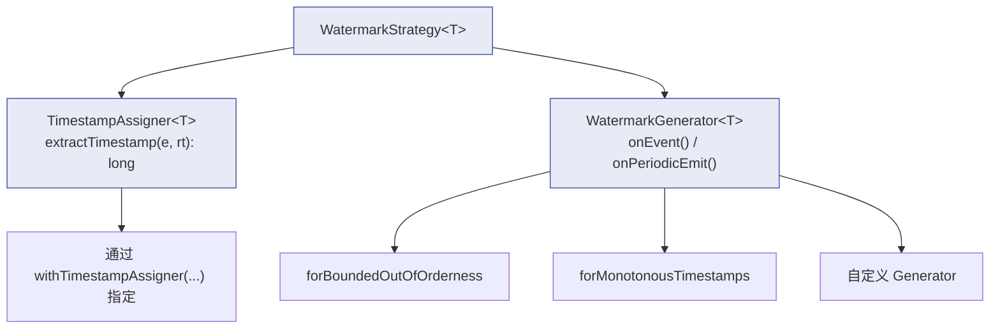
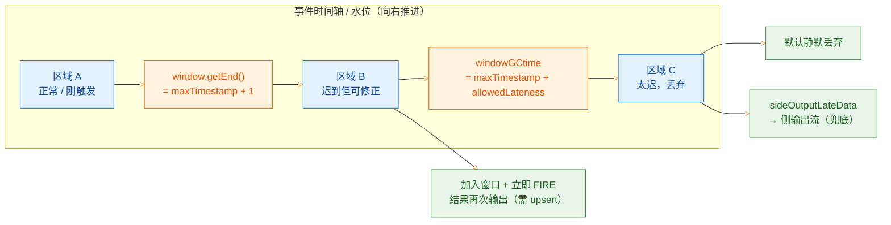

# ⏱️ 二、时间、Watermark 与窗口

> 本篇回答五个问题：Flink 的三种时间语义到底在什么层面生效、为什么 1.12 之后不用再显式声明？Watermark 是怎么生成、传播、对齐的，为什么多输入算子要取最小值？Tumbling / Sliding / Session / Global / Cumulative 五类窗口的分配规则与生命周期是什么？迟到数据有哪些兜底手段，它们之间是什么关系？定时器为什么能扛住 checkpoint，又为什么必须手动清理状态？
> 前置阅读：[[0-Flink总览]]、[[1-架构与运行时]]。相关：[[3-状态管理]]（Timer 与窗口状态都活在 state 里）、[[5-Checkpoint与Savepoint]]（WindowOperator 的状态如何被快照）、[[6-背压与性能调优]]（对齐与窗口倾斜）、[[8-FlinkSQL与TableAPI]]（SQL 层的时间属性与 TVF）、[[10-面试高频题]]。

---

## 一、三种时间语义

### 1.1 定义与区别

流处理里"时间"是一个必须显式选择的坐标轴。同一条数据可以有三种时间戳，选错了，指标口径就错了。

| 时间语义 | 时间戳取自哪里 | 谁决定 | 特点 |
| --- | --- | --- | --- |
| Event Time（事件时间） | 数据**自身**携带的业务时间字段（下单时间、埋点时间） | 上游生产者 | 结果**可复现**：重跑同一批数据得到同一结果；能正确处理乱序和迟到。代价是要处理乱序，需要 watermark |
| Ingestion Time（摄入时间） | 数据**进入 Flink Source 的那一刻** | Flink Source | 介于两者之间的折中：比处理时间稳定（同一批数据在 source 处的时间固定），但重跑时时间戳会变，结果不可复现 |
| Processing Time（处理时间） | 数据**被算子处理的机器本地时钟** | 操作系统 | 最简单、延迟最低、无需 watermark；但结果不可复现，同一份数据不同时刻跑出来不一样，也无法处理乱序 |

> [!important] 一句话区分
> Event Time 的时间戳"跟数据走"，Processing Time 的时间戳"跟机器走"，Ingestion Time 的时间戳"跟数据进入 Flink 的那一刻走"。
> 只有 Event Time 能回答"昨天下午 3 点的真实成交额是多少"；Processing Time 只能回答"我们系统在什么时候处理了多少条"。

### 1.2 设置方式的演进（重要考点）

在 Flink 1.12 之前，时间语义要在环境上全局声明：

```java
// ❌ 1.12 起废弃，后续版本已移除，新代码不要再写
StreamExecutionEnvironment env = StreamExecutionEnvironment.getExecutionEnvironment();
env.setStreamTimeCharacteristic(TimeCharacteristic.EventTime);
env.setStreamTimeCharacteristic(TimeCharacteristic.IngestionTime);
env.setStreamTimeCharacteristic(TimeCharacteristic.ProcessingTime);
```

`TimeCharacteristic` 的问题在于：它把"时间语义"变成了**作业级全局开关**，但真实作业里不同算子链路往往需要不同语义（比如日志链路用处理时间、交易链路用事件时间），全局开关表达不了。而且这个开关**本身不产生任何行为**——它只是影响算子在"该用哪个时钟"时的默认选择，用户经常设了 `EventTime` 却忘了分配 watermark，导致窗口永远不触发。

1.12 引入 `WatermarkStrategy` 之后，语义变成了**由代码事实自动决定**：

| 你写的代码 | 实际语义 |
| --- | --- |
| `.assignTimestampsAndWatermarks(WatermarkStrategy...)` | **Event Time** |
| 使用 `TimeWindow` / `TumblingEventTimeWindows` / `registerEventTimeTimer` | **Event Time**（必须有 watermark，否则永不触发） |
| 使用 `ProcessingTimeSessionWindows` / `registerProcessingTimeTimer` | **Processing Time** |
| 什么都不写、只用普通算子 | **Processing Time**（无时间语义参与） |

所以现在的判断规则是：**看有没有 watermark**。有 watermark 的地方按事件时间走，没有的地方按处理时间走。

Ingestion Time 在 1.12 之后没有独立 API，推荐做法是在 Source 端直接给记录打上进入系统的时间戳，等价于"在 source 处生成单调递增的事件时间"：

```java
// Ingestion Time 的现代写法：在 source 之后立刻把处理时刻写成事件时间
SingleOutputStreamOperator<Event> withIngestionTime = source
    .assignTimestampsAndWatermarks(WatermarkStrategy
        .<Event>forMonotonousTimestamps()
        .withTimestampAssigner((event, recordTimestamp) -> System.currentTimeMillis()));
```

> [!warning] 别把 `TimeCharacteristic` 的残留习惯带进新代码
> 网上大量老博客还在写 `env.setStreamTimeCharacteristic(TimeCharacteristic.EventTime)`，在 1.14+ 的新项目里直接编译不过。看到这类代码就知道是 1.12 之前的资料。

### 1.3 选型建议

| 场景 | 推荐语义 | 理由 |
| --- | --- | --- |
| 实时大屏、实时监控、吞吐统计 | Processing Time | 要的是"现在系统怎么样"，不关心数据自身的业务时间；实现简单、延迟低 |
| 交易、账务、订单、风控（结果要能对账、要能重跑） | Event Time | 必须可复现；上游数据可能乱序、可能延迟到达 |
| 上游无可靠时间字段，但有明确的事件发生顺序 | Ingestion Time（source 打点） | 避开业务时间字段缺失的问题，同时保留"与处理时刻无关"的一点稳定性 |
| 日志采集、链路追踪 | Event Time（用日志里的时间）+ 宽松 watermark | 日志天然乱序，用机器时间会串台 |

> [!tip] 选型口诀
> **要对账选事件时间，要低延迟选处理时间；不确定就选事件时间，代价只是多配一个 watermark。**
> 但如果上游数据的时间字段质量很差（时钟漂移、字段为空、时间倒退几年），强行用事件时间反而会制造灾难 —— 这种情况先用 Ingestion Time 兜住。

---

## 二、时间戳与 Watermark 的分配

### 2.1 为什么需要 Watermark

事件时间下的根本矛盾是：**窗口要不要关闭，取决于"后面还会不会来这个窗口的数据"，而未来是不可知的。**

Watermark 就是 Flink 给出的答案：一个时间戳 W，语义是"**时间戳 <= W 的数据（几乎）已经到齐了，不会再有 <= W 的数据到来**"。算子收到 `watermark = W` 之后，就可以放心地把 `end <= W` 的窗口触发输出。

| 概念 | 含义 |
| --- | --- |
| Event Time | 每条记录自带的时间戳 |
| Watermark | 一个**单调不减**的时间进度承诺，本质是一个长整型时间戳 |
| 迟到数据 | 在 `watermark` 已经推进到某个值之后，才到达的、时间戳小于该值的记录 |
| 窗口触发 | watermark 推进到 `window.maxTimestamp()` 之上时，EventTimeTrigger 触发 |

单调不减是硬约束：如果新生成的 watermark 小于上一个，Flink 会**忽略**它（不会把水位往回退）。

### 2.2 `WatermarkStrategy` 的组成

`WatermarkStrategy<T>` 是一个工厂，由两部分拼装：

```java
public interface WatermarkStrategy<T> {
    // 1) 时间戳分配器：从记录中抽取 event time
    TimestampAssigner<T> createTimestampAssigner(TimestampAssignerSupplier.Context context);

    // 2) watermark 生成器：基于已见到的时间戳决定何时发出 watermark
    WatermarkGenerator<T> createWatermarkGenerator(WatermarkGeneratorSupplier.Context context);
}
```

结构上可以这样理解：



`WatermarkGenerator` 只有两个方法：

| 方法 | 调用时机 | 典型职责 |
| --- | --- | --- |
| `onEvent(T event, long eventTimestamp, WatermarkOutput output)` | 每来一条记录 | 更新内部 `maxTimestamp`；也可以在"断点式"策略里直接 `output.emitWatermark(...)` |
| `onPeriodicEmit(WatermarkOutput output)` | 由系统按周期调用 | 周期性发出 `maxTimestamp - outOfOrderness - 1` |

### 2.3 `withTimestampAssigner`

```java
DataStream<OrderEvent> withTs = stream.assignTimestampsAndWatermarks(
    WatermarkStrategy
        .<OrderEvent>forBoundedOutOfOrderness(Duration.ofSeconds(5))
        .withTimestampAssigner((event, recordTimestamp) -> event.getOrderTime())
);
```

几个必须知道的细节：

| 细节 | 说明 |
| --- | --- |
| `recordTimestamp` 是什么 | 记录上已有的时间戳。从 Kafka 进来时通常是 **record 的 timestamp**（即 broker 侧的时间或生产者写入时间），如果是 `Long.MIN_VALUE` 表示上游没有设置 |
| 单位 | **毫秒**。`event.getOrderTime()` 如果是秒级时间戳，必须 `* 1000`，否则窗口会瞬间全部触发或全部不触发 |
| 位置 | 应该**尽量靠近 Source**。放在 source 之后立刻分配，可以避免中间算子（尤其是 `process`、`flatMap`）耗时导致的语义混乱 |
| 多 source | 每个 source 分支各自分配，之后 `union` 起来；watermark 会在下游取最小值 |
| 非法时间戳 | 返回 `Long.MIN_VALUE` 表示该记录不参与 watermark 计算（既不推进水位，也不会被当成迟到数据丢弃） |

> [!warning] 单位错误的经典翻车现场
> 上游给的是秒级时间戳（如 `1696800000`），直接当毫秒用。结果是所有记录的时间戳都落在 1970 年 1 月，watermark 卡在远古，窗口永远不触发，作业看起来"不报错但没输出"。排查方法：在 `assignTimestampsAndWatermarks` 后面加一个 `process` 打印 `ctx.timestamp()`，或者看 Web UI 的 `currentWatermark` 指标。

### 2.4 `withIdleness`：空闲分区导致 watermark 不推进

这是生产环境最经典的"窗口不触发"原因。

**现象**：Kafka 某个分区长时间没有新数据（比如某个城市的流量在凌晨归零），作业的 watermark 停在那个分区的最后一条记录的时间戳上，所有下游窗口都不触发，`numRecordsOut` 归零，但作业一切正常、没有报错。

**原因**：watermark 在下游是取**所有输入的最小值**。并行 source 有 8 个子任务，只要有一个子任务没有新数据，它的 watermark 就停在原地；下游取 min，整条链路的水位都被这个"木头桩子"钉死。

**解决**：给 `WatermarkStrategy` 加上空闲检测。

```java
WatermarkStrategy<OrderEvent> strategy = WatermarkStrategy
    .<OrderEvent>forBoundedOutOfOrderness(Duration.ofSeconds(5))
    .withTimestampAssigner((event, ts) -> event.getOrderTime())
    .withIdleness(Duration.ofMinutes(1));   // 1 分钟没有数据，该分区被标记为 idle
```

语义是：某个输入在 `idleTimeout` 内没有收到**任何记录**，就把它标记为 `idle`，此后该输入的 watermark **不参与最小值计算**，直到它再来数据。注意它跟踪的是"有没有记录"，不是"timestamp 有没有变化"——周期性的心跳数据会让 idle 检测失效。

| 配置 | 作用 | 代价 |
| --- | --- | --- |
| `withIdleness(Duration)` | 空闲输入不拖累全局水位 | 如果该分区**真的**迟到了很久之后又来了数据，会得到"水位倒退被忽略"的效果，这部分数据可能被判为迟到而丢进侧输出 |
| `pipeline.auto-watermark-interval` | 周期生成 watermark 的间隔 | 设太大会增加窗口触发延迟，设太小会增加网络和 CPU 开销（每条 watermark 都是一次广播） |
| `table.exec.source.idle-timeout` | Flink SQL 层等价的空闲检测 | SQL 作业解决同样的"窗口不输出"问题 |

> [!danger] `withIdleness` 不是万能的
> 它解决的是"**完全没有数据**"，不解决"**数据很少**"。如果一个分区每分钟来一条数据，idle 检测永远不会触发，水位依然被拖住。这种情况要从上游根治：要么让上游保证水位推进（发心跳/打点数据），要么改用处理时间，要么在业务上接受延迟并在 watermark 里放大 out-of-orderness。

---

## 三、内置 Watermark 策略与生成公式

### 3.1 `forBoundedOutOfOrderness(Duration)`

最常用的策略：**假设乱序程度有界**，用一个固定的延迟来吸收乱序。

```java
WatermarkStrategy.<OrderEvent>forBoundedOutOfOrderness(Duration.ofSeconds(10))
```

生成公式（周期性发射时）：

```text
observedMaxTimestamp = 目前见过的最大 event time
watermark            = observedMaxTimestamp - outOfOrdernessMillis - 1
```

**为什么要 `-1`？** 因为 watermark 的语义是"时间戳 **<= watermark** 的数据被认为是迟到的"。假设乱序延迟为 0 秒、见到的最大时间戳是 100，如果发出 `watermark = 100`，那么"事件时间恰好为 100"的记录到达时就会被判定为迟到，这是错的——它并不晚。减 1 之后 `watermark = 99`，`100 > 99` 不算迟到；同时窗口 `[0, 101)` 因为 `maxTimestamp = 100 > 99` 还不会触发，符合"还没看到更大的时间戳，不能关窗"的直觉。

| outOfOrderness 取值 | 效果 | 风险 |
| --- | --- | --- |
| 设小（如 1s） | 触发快、延迟低 | 稍大的乱序就被判迟到，结果被丢弃或进侧输出，指标偏低 |
| 设大（如 5min） | 容错强、结果更完整 | 所有窗口都要多等 5min 才输出，下游延迟显著上升；窗口状态驻留更久，状态变大 |
| 设为 0 | 等价于 `forMonotonousTimestamps()` | 只适用于严格单调的输入（如自己生成的自增 ID） |

> [!tip] 怎么定 outOfOrderness
> 不要拍脑袋。上线前采集一份真实数据，统计 `处理时间 - 事件时间` 的分位数（P99 / P999），把 outOfOrderness 定在 P999 附近。之后持续监控侧输出（`sideOutputLateData`）的量：**侧输出稳定为 0，说明水位过于保守可以收紧；侧输出持续偏高，说明需要放宽或检查上游时钟。**

### 3.2 `forMonotonousTimestamps()`

```java
WatermarkStrategy.<OrderEvent>forMonotonousTimestamps()
```

等价于 `forBoundedOutOfOrderness(Duration.ZERO)`，公式为：

```text
watermark = observedMaxTimestamp - 1
```

适用前提：**同一算子内看到的时间戳严格单调不减**。这通常只在数据源本身有序（单分区、无乱序）或数据由本作业生成时成立。用在 Kafka 多分区上一定会出问题——多分区合并后天然乱序。

### 3.3 周期性生成 vs 断点式生成

| 生成方式 | 触发时机 | 实现方式 | 适用场景 |
| --- | --- | --- | --- |
| 周期性（Periodic） | 按 `pipeline.auto-watermark-interval`（默认 200ms）定时调用 `onPeriodicEmit` | 内置策略，或用 `WatermarkStrategy` 默认行为 | 绝大多数场景，尤其是数据量大的时候 |
| 断点式（Punctuated） | 每来一条记录，在 `onEvent` 里判断并 `output.emitWatermark(...)` | 自定义 `WatermarkGenerator`，`onPeriodicEmit` 里什么都不做 | 数据量小、需要极低延迟、或 watermark 由特殊的标记记录驱动 |

自定义断点式的骨架：

```java
public class PunctuatedWatermarkGenerator implements WatermarkGenerator<OrderEvent> {
    private long maxTimestamp = Long.MIN_VALUE;

    @Override
    public void onEvent(OrderEvent event, long eventTimestamp, WatermarkOutput output) {
        maxTimestamp = Math.max(maxTimestamp, eventTimestamp);
        // 比如遇到 "EOB"（end of batch）标记就立刻推进水位
        if (event.isEndOfBatch()) {
            output.emitWatermark(new Watermark(maxTimestamp - 1));
        }
    }

    @Override
    public void onPeriodicEmit(WatermarkOutput output) {
        // 断点式：不做任何事
    }
}
```

`WatermarkOutput` 还有 `markIdle()` / `markActive()`，可以在自定义生成器里手动控制空闲标记——这比 `withIdleness` 更精准（因为你可以自定义"什么算空闲"）。

> [!note] 周期是"处理时间"周期，不是事件时间
> `pipeline.auto-watermark-interval` 是按算子线程的处理时间定时触发的。这意味着：**上游没数据时，周期性 watermark 依然可能被发射**（但发射的值不变，因为 `maxTimestamp` 没变，而 watermark 单调不减，所以实际不会产生新的推进）。

---

## 四、Watermark 的传播与对齐

### 4.1 单输入算子：直接传递

只有一个输入的算子，收到上游 watermark 后**原样向下游广播**（取 `max`，因为水位单调，重复或更小的值被忽略）。`map` / `filter` / `flatMap` / `keyBy` / `process` 都属于这一类。

### 4.2 多输入算子：取最小值

`union`、`connect`、以及两输入的 `CoProcessFunction`、`KeyedCoProcessFunction`、`IntervalJoin` 等，都遵循：

```text
operatorWatermark = min(watermark(input1), watermark(input2), ...)
```

**为什么必须取 min？** 因为 watermark 是一个"不会再有更早数据"的承诺。只有当**每一个**输入都承诺"<= W 的数据到齐了"，算子才能对外承诺这件事。任何一个输入没跟上，算子就不能保证。取 max 会导致时间进度虚高，窗口提前关闭、数据被误判为迟到。

```text
   input1: ----w=100---------------------------------->
   input2: --------w=80------------------------------>
                    ↓
   算子水位: ----w=80（被最慢的输入拖住）
```

这个性质是**下游延迟取决于最慢分支**的根源，也是"空闲分区拖死水位"问题的本质。

### 4.3 广播输入

`BroadcastStream` 通过 `connect` 接进来时，广播侧通常被当作**控制流**（配置、规则），它一般不会参与主流的水位计算。也就是说，主流的水位由常规输入决定，广播侧不推进也不阻塞它。

具体到实现，`BroadcastConnectedStream` 的水位合并行为在不同版本间有过调整，且广播流的 watermark 往往不被考虑。工程上的结论是：

- **不要把业务数据的窗口逻辑放在广播侧**，广播侧只放规则/维表；
- 如果发现主流窗口不触发，先排查是不是广播侧的心跳/规则流影响了水位；
- 需要精确依赖广播侧水位的场景，应该在两路都显式分配 watermark 并实测确认行为。

### 4.4 一个完整的传播示意图

```text
Kafka(3分区)
  source-0 w=100  ┐
  source-1 w=98   ├─ union → 下游算子水位 = min = 97
  source-2 w=97   ┘
                              ↓
                     keyBy + window
                              ↓
              window.maxTimestamp() <= 97 的窗口触发
```

---

## 五、窗口类型

### 5.1 分类的两个维度

理解窗口只需要两把尺子：

| 维度 | 取值 | 含义 |
| --- | --- | --- |
| 按什么划分（WindowAssigner） | Tumbling / Sliding / Session / Global / Cumulative | 一条记录会被分配到哪些窗口 |
| 按什么触发（Trigger） | EventTime / ProcessingTime / Count / Continuous | 什么时候计算并输出窗口结果 |

这两个维度**正交**。比如 `TumblingEventTimeWindows` 是"翻滚 + 事件时间触发"，`TumblingProcessingTimeWindows` 是"翻滚 + 处理时间触发"。

### 5.2 Tumbling Windows（滚动窗口）

**窗口不重叠，首尾相接。** 一个元素恰好属于一个窗口。

```java
stream.keyBy(OrderEvent::getUserId)
      .window(TumblingEventTimeWindows.of(Time.minutes(5)))
      .aggregate(new CountAgg(), new WindowResultFunction());
```

分配规则：窗口起点 = `timestamp - (timestamp - offset + size) % size`（向下取整到 size 的整数倍）。

```text
size = 5min, offset = 0
  |----w1----|----w2----|----w3----|
  0         5        10        15   (分钟)
  记录 ts=7min → 属于 [5,10)
  记录 ts=5min → 属于 [5,10)  ← 边界归右窗口，因为 start 闭区间
```

`offset` 参数用于对齐时区或对齐业务日切点。例如想按"UTC+8 的整点"切窗口：

```java
TumblingEventTimeWindows.of(Time.hours(1), Time.minutes(0))
```

> [!note] `Time.of` 与 `of(Time size, Time offset)`
> `offset` 会整体平移窗口边界。做"每天 0 点（东八区）切窗"这类需求时，用 offset 比在业务代码里手动减 8 小时干净得多。

### 5.3 Sliding Windows（滑动窗口）

**窗口可以重叠。** 由两个参数决定：`size`（窗口大小）和 `slide`（滑动步长）。

```java
stream.keyBy(OrderEvent::getUserId)
      .window(SlidingEventTimeWindows.of(Time.minutes(10), Time.minutes(5)))
```

| size 与 slide 的关系 | 效果 |
| --- | --- |
| `slide < size` | 窗口重叠，一个元素属于 `size / slide` 个窗口 |
| `slide == size` | 退化为 Tumbling |
| `slide > size` | 窗口之间有空洞（gap），部分数据不属于任何窗口 —— **几乎总是 bug** |

```text
size=10min, slide=5min
  |--------w1--------|
       |--------w2--------|
            |--------w3--------|
  0    5   10   15   20   25  (分钟)
  记录 ts=6min → 同时属于 w1 [0,10) 和 w2 [5,15)
```

**代价**：每条记录被复制到 `size/slide` 个窗口，状态量和计算量都是 Tumbling 的 `size/slide` 倍。`slide=1min, size=1h` 意味着每条记录进 60 个窗口，状态膨胀 60 倍 —— 这是生产事故的常见来源。

> [!warning] 滑动窗口的状态放大
> 用滑动窗口前先算一下 `size/slide`。超过 10 就要非常警惕：RocksDB 状态可能打爆本地磁盘、checkpoint 时间可能超过间隔。替代方案是用更粗粒度的 Tumbling + 下游二次聚合。

### 5.4 Session Windows（会话窗口）

**按"活动间隙"动态划分，窗口大小不固定。** 相邻两条记录的时间间隔超过 `gap` 就断开成两个会话。

```java
stream.keyBy(OrderEvent::getUserId)
      .window(EventTimeSessionWindows.withGap(Time.minutes(30)))
```

分配规则比较特殊：**每条记录先各自成一个 `[ts, ts+gap)` 的窗口**，当后续记录落入已有窗口或与新窗口重叠时，触发**窗口合并（merge）**。合并是 Session Window 唯一需要 `Trigger.onMerge` 的场景。

```text
gap = 10min
 记录A ts=0   → [0,10)
 记录B ts=5   → [5,15) 与 A 重叠 → 合并为 [0,15)
 记录C ts=20  → [20,30) 不重叠 → 独立窗口
 记录D ts=16  → [16,26) 与 C 重叠 → 合并为 [16,30)

 最终： 会话1 = {A,B},  会话2 = {C,D}
```

特点与坑：

| 特点 | 说明 |
| --- | --- |
| 窗口数量随 key 增长 | 每个活跃 key 至少有 1 个未完成的会话窗口，key 基数大时状态压力大 |
| 合并有成本 | 每次合并要遍历并合并所有重叠窗口的状态 |
| **迟到数据会"复活"窗口** | 一条延迟记录可能把两个已断开的会话重新粘起来，导致已输出的结果需要修正 |
| ProcessingTime 版本不可复现 | `ProcessingTimeSessionWindows` 的行为依赖机器时钟，重跑结果不同 |

### 5.5 Global Windows（全局窗口）

**所有同 key 的数据进入同一个窗口**，永不结束。

```java
stream.keyBy(OrderEvent::getUserId)
      .window(GlobalWindows.create())
      .trigger(CountTrigger.of(100))   // 必须自定义 trigger，否则永远不触发
      .evictor(CountEvictor.of(1000))
```

`GlobalWindows` 的默认触发器是 `NeverTrigger`——即**永远不会触发**。它必须配合自定义 Trigger 使用。典型用途：按计数聚合、自定义"滑动 + 计数"混合逻辑。

> [!warning] GlobalWindows + 默认 trigger = 状态无限增长
> 没有 trigger 就没有 `clear()`，窗口状态会一直累积到把磁盘写爆。用 GlobalWindows 时，Trigger 里必须有 `PURGE` 或 `FIRE_AND_PURGE`，或者配 `Evictor` 限制大小。

### 5.6 Cumulative Windows（累积窗口，1.13+）

这是 Flink 1.13 引入、为**实时大屏**量身定做的窗口。它解决的问题是：

- 用 Tumbling 1 小时的窗口，大屏要等到整点才有数，中间 59 分钟空白；
- 用 Sliding `size=1h, slide=1min`，状态放大 60 倍，无法接受。

Cumulative Window 的定义是 `[windowStart, windowStart + maxSize)`，按 `step` 逐步"累积"输出：

```java
stream.keyBy(OrderEvent::getUserId)
      .window(CumulativeEventTimeWindows.of(Time.hours(1), Time.minutes(10)))
```

```text
maxSize = 1h, step = 10min，起点都是同一个 windowStart
  [0,10)  → 输出第 1 次（累积 10min）
  [0,20)  → 输出第 2 次（累积 20min）
  [0,30)  → 输出第 3 次（累积 30min）
  ...
  [0,60)  → 输出第 6 次（累积 60min，窗口关闭）
```

关键点：

| 特性 | 说明 |
| --- | --- |
| 状态是"累积"的 | 后一个大窗口复用前一个的结果，不需要重算，状态量约等于 `maxSize/step` 而不是平方级 |
| 必须用 `AggregateFunction` | 累积语义要求增量聚合；不支持 `ProcessWindowFunction` 单独使用（CumulativeWindow 的 API 约束） |
| 输出必须去重 | 同一个 `windowStart` 会输出 `maxSize/step` 次，下游要按 `(key, windowStart, windowEnd)` 取最新值 |
| SQL 层对应 `CUMULATE` TVF | 见 [[8-FlinkSQL与TableAPI]] |

### 5.7 窗口的创建与清理

这是理解窗口状态生命周期最关键的一节。

| 阶段 | 行为 |
| --- | --- |
| 创建 | 窗口是**惰性创建**的。第一条被分配到该窗口的记录到达时，`WindowOperator` 才创建窗口状态（`windowState` / `windowContents`），并把窗口注册到 `Trigger` 的定时器里 |
| 触发 | EventTimeTrigger 注册的是**事件时间定时器，时间为 `window.maxTimestamp()`**；watermark 越过这个时间就触发 |
| 输出 | `FIRE`：计算结果并 emit，**但不清理状态** |
| 清理 | `PURGE`：清理窗口状态；`FIRE_AND_PURGE`：先输出再清理 |
| 默认行为 | `EventTimeTrigger` 在 `window.maxTimestamp() <= watermark` 时返回 `FIRE`。`WindowOperator` 在窗口"彻底过期"（`window.maxTimestamp() + allowedLateness < watermark`）时调用 `trigger.clear()`，随后 `WindowOperator` 清理窗口状态 |

**窗口清理时间（GC time）公式**：

```text
windowGCtime = window.maxTimestamp() + allowedLateness
             = window.getEnd() - 1 + allowedLateness
```

这个公式解释了 `allowedLateness` 的本质：**它就是"窗口状态在被销毁前多活多久"**。

> [!important] `FIRE` 不等于清理
> 每次 `FIRE` 只是输出一次结果，窗口状态仍然在。这意味着**下游必须能处理同一个窗口的多次输出**（用 upsert / 主键覆盖，而不是 append 追加）。如果用 append 模式写 Kafka，同一个窗口会写出多条结果，下游需要自己做去重或按窗口 ID 覆盖。

---

## 六、窗口函数

### 6.1 三类函数的本质差异

**核心区分点：是"增量聚合"还是"全量缓存"。**

| 函数 | 是否缓存原始元素 | 状态大小 | 何时输出 | 能力 |
| --- | --- | --- | --- | --- |
| `ReduceFunction` | 否，只留一个累加值 | 极小 | 窗口触发时 | 输入输出**同类型**，语义受限 |
| `AggregateFunction` | 否，只留一个累加器 | 小 | 窗口触发时 | 输入/累加器/输出**三种类型可不同**，最灵活 |
| `ProcessWindowFunction` | **是，缓存整个窗口的元素** | 大（正比于窗口内元素数） | 窗口触发时 | 能拿到窗口元信息、能访问全部元素、能操作状态和定时器 |
| `AggregateFunction + ProcessWindowFunction` | 否 | 小 | 窗口触发时 | **既有增量聚合的性能，又有窗口元信息** —— 首选 |

```text
ProcessWindowFunction 单独使用：
  windowContents（ListState）← 每条记录都 append
  触发时 Iterable<IN> 全量遍历 → 计算

AggregateFunction + ProcessWindowFunction：
  累加器（单值）← 每条记录 update
  触发时 AggregateFunction 输出中间结果 → ProcessWindowFunction 只加工一次
```

> [!danger] 状态爆炸的头号原因
> `ProcessWindowFunction` 单独使用会缓存窗口内**所有元素**。一个 key 在 1 小时窗口内有 100 万条记录，就是 100 万个对象驻留状态。这在流量大的 key 上会直接打爆 memory/磁盘，并且拖慢 checkpoint。**除非确实需要遍历全部元素，否则一律用 `AggregateFunction`。**

### 6.2 `ReduceFunction`

```java
public class SumReduce implements ReduceFunction<Long> {
    @Override
    public Long reduce(Long a, Long b) {
        return a + b;
    }
}

stream.keyBy(e -> e.getUserId())
      .window(TumblingEventTimeWindows.of(Time.minutes(5)))
      .reduce(new SumReduce());
```

优点：状态最小。缺点：输入输出必须同类型，无法输出"窗口起止时间"这类元信息。

### 6.3 `AggregateFunction`

```java
// IN: 输入，ACC: 累加器，OUT: 输出
public interface AggregateFunction<IN, ACC, OUT> extends Function, Serializable {
    ACC createAccumulator();
    ACC add(IN value, ACC accumulator);
    OUT getResult(ACC accumulator);
    ACC merge(ACC a, ACC b);   // 只有 SessionWindow / 需要合并窗口时才用得上
}
```

完整示例：统计每个用户的订单数与金额

```java
public class OrderAggregate
        implements AggregateFunction<OrderEvent, OrderAcc, OrderAcc> {

    @Override
    public OrderAcc createAccumulator() {
        return new OrderAcc(0L, 0L);
    }

    @Override
    public OrderAcc add(OrderEvent value, OrderAcc acc) {
        return new OrderAcc(acc.count + 1, acc.amount + value.getAmount());
    }

    @Override
    public OrderAcc getResult(OrderAcc acc) {
        return acc;
    }

    @Override
    public OrderAcc merge(OrderAcc a, OrderAcc b) {
        return new OrderAcc(a.count + b.count, a.amount + b.amount);
    }
}
```

> [!note] 累加器会被"复用"
> Flink 为了性能可能会**直接复用**传入的 accumulator 对象（而不是每次都创建新的）。所以 `add` 里**不要原地修改并返回入参**——要么返回新对象（如上面），要么明确知道 Flink 语义允许原地修改。原地修改 + 返回同一个对象在大多数情况下可行，但一旦被下游 `getResult` 引用了同一个实例，就会出现"结果被后续更新污染"的诡异 bug。**推荐返回新对象。**

### 6.4 `ProcessWindowFunction`

```java
public class OrderWindowResult extends ProcessWindowFunction<OrderEvent, String, String, TimeWindow> {
    @Override
    public void process(String key, Context ctx,
                        Iterable<OrderEvent> elements, Collector<String> out) {
        long count = 0;
        double sum = 0;
        for (OrderEvent e : elements) {
            count++;
            sum += e.getAmount();
        }
        TimeWindow w = ctx.window();
        out.collect(String.format("key=%s [%d,%d) count=%d sum=%.2f",
                key, w.getStart(), w.getEnd(), count, sum));
    }
}
```

`Context` 提供的窗口元信息：

| 方法 | 含义 |
| --- | --- |
| `ctx.window()` | `TimeWindow` 对象 |
| `ctx.window().getStart()` | 窗口**起始**时间戳，**闭区间**（包含） |
| `ctx.window().getEnd()` | 窗口**结束**时间戳，**开区间**（不包含） |
| `ctx.window().maxTimestamp()` | `getEnd() - 1`，EventTimeTrigger 注册的定时器时间 |
| `ctx.currentProcessingTime()` | 当前处理时间 |
| `ctx.currentWatermark()` | 当前水位 |
| `ctx.globalState()` / `ctx.windowState()` | 全局/窗口级状态（1.6+） |

> [!important] `getStart` 闭、`getEnd` 开 —— 面试爱考
> 窗口 `[0, 1000)` 表示时间戳 `0 <= ts < 1000` 的元素。`getEnd()` 返回 1000，但 `ts = 1000` 的记录属于**下一个**窗口。`maxTimestamp()` 是 `999`。所以 `EventTimeTrigger` 触发条件是 `watermark >= 999`（即 watermark 到 1000 时窗口已关）。
> 这个半开区间设计保证了**相邻窗口不重不漏**。

### 6.5 `AggregateFunction + ProcessWindowFunction` 组合（推荐写法）

思路：用 `AggregateFunction` 做增量聚合，用 `ProcessWindowFunction` 只负责"给结果加上窗口元信息"。

```java
public class OrderWindowResult
        extends ProcessWindowFunction<OrderAcc, OrderResult, String, TimeWindow> {

    @Override
    public void process(String key, Context ctx,
                        Iterable<OrderAcc> accs, Collector<OrderResult> out) {
        // 因为上游 AggregateFunction 已经聚合成单值，这里通常只有 1 个元素
        OrderAcc acc = accs.iterator().next();
        TimeWindow w = ctx.window();
        out.collect(new OrderResult(key, w.getStart(), w.getEnd(), acc.count, acc.amount));
    }
}

// 组合使用
stream.keyBy(OrderEvent::getUserId)
      .window(TumblingEventTimeWindows.of(Time.minutes(5)))
      .aggregate(new OrderAggregate(), new OrderWindowResult());
```

| 写法 | 状态量 | 性能 | 能拿到窗口时间 |
| --- | --- | --- | --- |
| `reduce()` | 1 个值 | 最优 | ❌ |
| `aggregate()` | 1 个值 | 最优 | ❌ |
| `process()` | 窗口内所有元素 | 差 | ✅ |
| `aggregate(AggregateFunction, ProcessWindowFunction)` | 1 个值 | 优 | ✅ |
| `reduce(ReduceFunction, ProcessWindowFunction)` | 1 个值 | 优 | ✅ |
| `aggregate` + `Evictor` | 取决于 Evictor 缓存量 | 中 | ✅ |

> [!tip] 什么时候真的需要 `ProcessWindowFunction` 单独使用
> 需要遍历窗口内所有元素且无法用增量聚合表达时。典型例子：**计算窗口内的中位数、去重计数（distinct count）、TopN**。这时要接受状态成本，并尽量把窗口调小。

---

## 七、触发器与驱逐器

### 7.1 `Trigger` 接口

```java
public abstract class Trigger<T, W extends Window> implements Serializable {

    // 每个元素到达窗口时调用
    public abstract TriggerResult onElement(T element, long timestamp, W window, TriggerContext ctx);

    // 事件时间定时器触发时调用
    public abstract TriggerResult onEventTime(long time, W window, TriggerContext ctx);

    // 处理时间定时器触发时调用
    public abstract TriggerResult onProcessingTime(long time, W window, TriggerContext ctx);

    // 窗口合并时调用（仅 SessionWindow / 需合并的窗口）
    public abstract void onMerge(W window, OnMergeContext ctx);

    // 窗口被彻底清理时调用，用于释放自定义状态
    public abstract void clear(W window, TriggerContext ctx);
}
```

**四种返回结果：**

| TriggerResult | 含义 |
| --- | --- |
| `CONTINUE` | 什么都不做，继续等待 |
| `FIRE` | **触发计算并输出**，但**保留**窗口状态（后续可以再次触发） |
| `PURGE` | **清理窗口状态**，不输出 |
| `FIRE_AND_PURGE` | 先输出，再清理状态（只输出一次） |

`TriggerContext` 提供的能力：

| 方法 | 用途 |
| --- | --- |
| `getCurrentWatermark()` | 取当前水位，用于判断窗口是否已过期 |
| `getCurrentProcessingTime()` | 取处理时间 |
| `registerEventTimeTimer(long)` | 注册事件时间定时器 |
| `registerProcessingTimeTimer(long)` | 注册处理时间定时器 |
| `deleteEventTimeTimer(long)` / `deleteProcessingTimeTimer(long)` | 删除定时器 |
| `getPartitionedState(Serializable)` | 取 trigger 自己的状态（比如记录触发次数） |

### 7.2 内置触发器与默认行为

| 触发器 | 触发条件 |
| --- | --- |
| `EventTimeTrigger` | `window.maxTimestamp() <= ctx.getCurrentWatermark()` |
| `ProcessingTimeTrigger` | `window.maxTimestamp() <= ctx.getCurrentProcessingTime()` |
| `CountTrigger` | 窗口内元素数 >= `maxCount`（processing time 语义，与水位无关） |
| `ContinuousEventTimeTrigger` | 每 `interval` 事件时间触发一次，用于"窗口没结束先出中间结果" |
| `ContinuousProcessingTimeTrigger` | 每 `interval` 处理时间触发一次 |
| `DeltaTrigger` | 元素与上一个触发点的 delta 超过阈值 |
| `PurgingTrigger` | 装饰器，把内层 trigger 的 `FIRE` 转成 `FIRE_AND_PURGE` |
| `NeverTrigger` | 永不触发（GlobalWindows 的默认值） |

**默认触发器规则：**

| 窗口类型 | 默认 Trigger |
| --- | --- |
| `TumblingEventTimeWindows` / `SlidingEventTimeWindows` / `EventTimeSessionWindows` | `EventTimeTrigger` |
| `TumblingProcessingTimeWindows` / `SlidingProcessingTimeWindows` | `ProcessingTimeTrigger` |
| `ProcessingTimeSessionWindows` | `ProcessingTimeTrigger` + 会话合并逻辑 |
| `GlobalWindows` | `NeverTrigger`（必须自己 `trigger(...)`） |
| `CumulativeEventTimeWindows` | 累积语义专用 trigger（每次累积完成即 FIRE，不清状态） |

`EventTimeTrigger` 的源码逻辑值得记住（这正是"allowedLateness 为什么能重触发"的答案）：

```java
public TriggerResult onElement(Object element, long timestamp, TimeWindow window, TriggerContext ctx) {
    if (window.maxTimestamp() <= ctx.getCurrentWatermark()) {
        // 水位已经过了窗口结束时间 → 说明这是迟到数据 → 立刻触发
        return TriggerResult.FIRE;
    } else {
        ctx.registerEventTimeTimer(window.maxTimestamp());
        return TriggerResult.CONTINUE;
    }
}

public TriggerResult onEventTime(long time, TimeWindow window, TriggerContext ctx) {
    return time == window.maxTimestamp() ? TriggerResult.FIRE : TriggerResult.CONTINUE;
}
```

> [!important] 这段代码是理解迟到数据行为的关键
> 一条迟到记录到达时（水位已越过窗口结束、但窗口因 `allowedLateness` 尚未被销毁），`onElement` 直接返回 `FIRE` → 窗口**立即用包含该记录的完整状态重新计算并再次输出**。这就是"迟到数据能修正结果"的机制。

自定义 Trigger 示例（窗口内每 10 条输出一次，且只输出一次）：

```java
public class CountAndPurgeTrigger extends Trigger<OrderEvent, TimeWindow> {
    private final int maxCount;
    public CountAndPurgeTrigger(int maxCount) { this.maxCount = maxCount; }

    @Override
    public TriggerResult onElement(OrderEvent e, long ts, TimeWindow w, TriggerContext ctx) throws Exception {
        ReducingState<Long> count = ctx.getPartitionedState(
                new ReducingStateDescriptor<>("count", Long::sum, Long.class));
        count.add(1L);
        if (count.get() >= maxCount) {
            return TriggerResult.FIRE_AND_PURGE;
        }
        return TriggerResult.CONTINUE;
    }

    @Override public TriggerResult onEventTime(long t, TimeWindow w, TriggerContext ctx) { return TriggerResult.CONTINUE; }
    @Override public TriggerResult onProcessingTime(long t, TimeWindow w, TriggerContext ctx) { return TriggerResult.CONTINUE; }
    @Override public void onMerge(TimeWindow w, OnMergeContext ctx) { ctx.mergePartitionedState(
            new ReducingStateDescriptor<>("count", Long::sum, Long.class)); }
    @Override public void clear(TimeWindow w, TriggerContext ctx) { ctx.getPartitionedState(
            new ReducingStateDescriptor<>("count", Long::sum, Long.class)).clear(); }
}
```

> [!warning] 自定义 Trigger 的 `clear` 必须清理自己注册的状态和定时器
> 否则 trigger 状态会随着窗口数量无限增长。这是很隐蔽的状态泄漏来源——它不在用户的状态里，而在 Trigger 的 partitioned state 里。

### 7.3 `Evictor`：计算前/后剔除元素

`Evictor` 在窗口计算**之前**（`evictBefore`）或**之后**（`evictAfter`）从窗口内移除元素。

```java
stream.keyBy(...)
      .window(TumblingEventTimeWindows.of(Time.minutes(5)))
      .evictor(CountEvictor.of(100))           // 只保留最近 100 条
      .process(new MyProcessWindowFunction());
```

| Evictor | 作用 |
| --- | --- |
| `CountEvictor.of(long maxCount)` | 保留最近 N 条元素 |
| `CountEvictor.of(long maxCount, boolean doEvictAfter)` | 同上，指定在计算前还是计算后驱逐 |
| `DeltaEvictor.of(double threshold, DeltaFunction)` | 按相邻元素的 delta 值剔除 |
| `TimeEvictor.of(Time windowSize)` | 只保留最近 `windowSize` 时间内的元素 |

> [!danger] `Evictor` 是性能杀手
> 使用 `Evictor` 意味着 Flink **必须缓存窗口内的所有元素**（否则没法"剔除"），`ProcessWindowFunction` 的增量聚合优势全部失效。而且 `Evictor` 的驱逐逻辑要遍历窗口内容。**能不用就不用**；确实需要 TopN 之类语义时，考虑改用 `KeyedProcessFunction` + `MapState` 手写，控制粒度更细。

---

## 八、迟到数据的完整方案（面试必考）

### 8.1 迟到的三种归处

一条记录"迟到"之后，只可能有三种归宿：

| 归宿 | 触发条件 | 结果 |
| --- | --- | --- |
| 正常参与计算 | 水位还没越过窗口结束时间 | 和准时数据一样 |
| 触发窗口重算（修正结果） | 水位已越过窗口结束，但未越过 `windowGCtime`（= `maxTimestamp + allowedLateness`） | 窗口重新输出一次修正后的结果 |
| 被丢弃 / 进侧输出 | 水位已越过 `windowGCtime` | 默认**静默丢弃**；配了 `sideOutputLateData` 则进侧输出流 |

**默认情况下，超过 `allowedLateness` 的迟到数据会被无声丢弃**——这是最容易埋雷的地方：作业不报错，数据静默丢失。

### 8.2 手段一：`allowedLateness`（延迟销毁窗口）

```java
stream.keyBy(OrderEvent::getUserId)
      .window(TumblingEventTimeWindows.of(Time.minutes(5)))
      .allowedLateness(Time.minutes(1))
      .aggregate(new OrderAggregate(), new OrderWindowResult());
```

语义：窗口触发输出后，**状态继续保留 `allowedLateness` 这么长时间**。在这段时间内到达的、时间戳属于该窗口的记录，会被加入窗口状态并**再次触发输出**。

| 特性 | 说明 |
| --- | --- |
| 状态留存时间 | 从 `window.getEnd()` 延长到 `window.getEnd() + allowedLateness` |
| 输出次数 | 同一窗口可能输出**多次**（首次 + 每次迟到触发的修正） |
| 下游要求 | **必须支持更新（upsert）**。如果下游是 append-only（如直接写 Kafka 且下游只做追加），会出现同一个窗口的多条结果 |
| 状态成本 | 窗口状态存活时间变长，状态量和 checkpoint 大小上升 |
| 适用 | 下游支持主键覆盖（Doris 主键模型、ClickHouse ReplacingMergeTree、MySQL upsert） |

> [!warning] `allowedLateness` 不是"迟到数据兜底"，它是"修正已输出结果"
> 很多人的误解是"加了 allowedLateness 就不会丢数据"。错。超过 `allowedLateness` 的记录依然会丢。而且它会让**同一个窗口输出多次**，下游没做幂等的话会重复计数。**`allowedLateness` 必须和下游的 upsert 能力配套使用。**

### 8.3 手段二：`sideOutputLateData` + `OutputTag`（侧输出兜底）

这是**真正意义上的"兜底"**——保证一条数据都不会静默消失。

```java
// 1) 定义 OutputTag，注意泛型要用匿名子类固定类型
OutputTag<OrderEvent> lateTag = new OutputTag<OrderEvent>("late-orders") {};

SingleOutputStreamOperator<OrderResult> result = stream
        .keyBy(OrderEvent::getUserId)
        .window(TumblingEventTimeWindows.of(Time.minutes(5)))
        .allowedLateness(Time.minutes(1))
        .sideOutputLateData(lateTag)
        .aggregate(new OrderAggregate(), new OrderWindowResult());

// 2) 取出侧输出流，做二次处理
DataStream<OrderEvent> lateStream = result.getSideOutput(lateTag);
lateStream.addSink(new LateDataAuditSink());     // 落库、告警、离线补偿
```

`OutputTag` 的两个陷阱：

```java
// ✅ 正确：匿名子类，保留了泛型信息
OutputTag<OrderEvent> tag = new OutputTag<OrderEvent>("late") {};

// ❌ 错误：类型擦除，运行时拿不到 OrderEvent 的类型信息
OutputTag<OrderEvent> tag = new OutputTag<>("late");
```

> [!danger] `OutputTag` 必须用匿名子类
> 这是 Flink 的一个著名 API 陷阱。`new OutputTag<>("late")` 会抛出 `InvalidTypesException` 或导致序列化失败，因为 Java 泛型擦除后 Flink 无法推断元素类型。正确写法永远是 `new OutputTag<T>("name") {};`（注意结尾的大括号）。
> 另外：`OutputTag` 的 `id` 在整个作业里最好**全局唯一**，否则 `getSideOutput` 可能取到错误的数据。

侧输出的典型用法：

| 用法 | 说明 |
| --- | --- |
| 落库审计 | 把迟到数据写到 Hive/对象存储，供离线修正 |
| 实时告警 | 迟到量突增说明上游有问题，直接报警 |
| 降级补偿 | 把迟到数据单独跑一条"修正链路"，用 upsert 写回结果表 |
| 死信队列 | 与业务异常数据一起进 DLQ |

### 8.4 手段三：`OutputTag` + `ProcessFunction` 的普通侧输出

除了窗口的 `sideOutputLateData`，普通 `ProcessFunction` 也可以用 `OutputTag` 输出侧流（比如解析失败的数据）：

```java
OutputTag<String> dirtyTag = new OutputTag<String>("dirty") {};
SingleOutputStreamOperator<OrderEvent> clean = stream.process(new ProcessFunction<String, OrderEvent>() {
    @Override
    public void processElement(String value, Context ctx, Collector<OrderEvent> out) {
        try {
            out.collect(JSON.parseObject(value, OrderEvent.class));
        } catch (Exception e) {
            ctx.output(dirtyTag, value);      // 脏数据进侧流
        }
    }
});
DataStream<String> dirty = clean.getSideOutput(dirtyTag);
```

### 8.5 三者关系图（必须能画出来）



| 区域 | 时间戳范围 | 行为 | 需要的配置 |
| --- | --- | --- | --- |
| A：准时 | `ts < getEnd()` 且水位未越过 | 正常参与，窗口触发时输出一次 | 无 |
| B：晚了但在容忍内 | `getEnd() <= ts`，但 `ts > 水位 - allowedLateness`（即窗口尚未 GC） | 加入状态，窗口**再次输出修正结果** | `allowedLateness(Time)` |
| C：太晚 | 窗口已被 GC（水位 > `maxTimestamp + allowedLateness`） | 默认丢弃；配了侧输出则进侧输出 | `sideOutputLateData(OutputTag)` |

**三者的组合原则：**

> [!important] 生产环境的推荐组合
> ```java
> .window(TumblingEventTimeWindows.of(Time.minutes(5)))
> .allowedLateness(Time.minutes(2))          // ① 能修正的就修正（下游 upsert）
> .sideOutputLateData(lateTag)               // ② 修不了的一个都不许丢（审计/补偿）
> .aggregate(agg, windowFn)                  // ③ 增量聚合，控制状态
> ```
> 这三个配置是**互补而非互斥**的：`allowedLateness` 负责"救得回来的"，`sideOutputLateData` 负责"救不回来的"。只有两者都配上，才能做到既不静默丢数据、又不让状态无限驻留。

### 8.6 完整可运行示例

```java
public class LateDataDemo {

    public static void main(String[] args) throws Exception {
        StreamExecutionEnvironment env = StreamExecutionEnvironment.getExecutionEnvironment();
        env.enableCheckpointing(60_000);

        OutputTag<OrderEvent> lateTag = new OutputTag<OrderEvent>("late-orders") {};

        DataStream<OrderEvent> source = env
                .addSource(new FlinkKafkaConsumer<>("order-topic",
                        new SimpleStringSchema(), loadProps()))
                .map(json -> JSON.parseObject(json, OrderEvent.class));

        SingleOutputStreamOperator<WindowResult> result = source
                .assignTimestampsAndWatermarks(
                        WatermarkStrategy.<OrderEvent>forBoundedOutOfOrderness(Duration.ofSeconds(5))
                                .withTimestampAssigner((e, ts) -> e.getOrderTime())
                                .withIdleness(Duration.ofMinutes(1)))
                .keyBy(OrderEvent::getUserId)
                .window(TumblingEventTimeWindows.of(Time.minutes(5)))
                .allowedLateness(Time.minutes(2))
                .sideOutputLateData(lateTag)
                .aggregate(new OrderAggregate(), new OrderWindowResult());

        // 正常结果：写入支持 upsert 的存储（同一窗口会多次输出）
        result.addSink(new UpsertSink());

        // 迟到兜底：落审计表 + 告警
        result.getSideOutput(lateTag)
              .map(e -> "LATE: " + e)
              .addSink(new LateAuditSink());

        env.execute("late-data-demo");
    }
}
```

---

## 九、定时器（Timer）

定时器是"窗口之外"的另一种时间驱动机制，用在需要**按 key 维护时间逻辑**的场景。

### 9.1 两种 Timer

```java
public class OrderTimeoutFunction extends KeyedProcessFunction<String, OrderEvent, OrderResult> {

    private ValueState<OrderEvent> pendingOrder;

    @Override
    public void open(Configuration parameters) {
        pendingOrder = getRuntimeContext().getState(
                new ValueStateDescriptor<>("pending-order", OrderEvent.class));
    }

    @Override
    public void processElement(OrderEvent order, Context ctx, Collector<OrderResult> out) throws Exception {
        if ("CREATE".equals(order.getType())) {
            pendingOrder.update(order);
            // 注册事件时间定时器：30 分钟后触发
            long fireAt = order.getOrderTime() + 30 * 60 * 1000L;
            ctx.timerService().registerEventTimeTimer(fireAt);
        } else if ("PAY".equals(order.getType())) {
            OrderEvent pending = pendingOrder.value();
            if (pending != null) {
                out.collect(new OrderResult(order.getOrderId(), "PAID"));
                pendingOrder.clear();       // 必须清理状态
            }
        }
    }

    @Override
    public void onTimer(long timestamp, OnTimerContext ctx, Collector<OrderResult> out) throws Exception {
        OrderEvent pending = pendingOrder.value();
        if (pending != null) {
            out.collect(new OrderResult(pending.getOrderId(), "TIMEOUT_CANCELLED"));
            pendingOrder.clear();           // 必须清理状态
        }
    }
}
```

| 对比项 | `registerEventTimeTimer` | `registerProcessingTimeTimer` |
| --- | --- | --- |
| 时间基准 | 事件时间（水位） | 机器处理时间 |
| 触发条件 | **watermark >= 注册的时间戳** | 系统时钟 >= 注册的时间戳 |
| 可复现性 | 可复现（重跑结果一致） | 不可复现 |
| 依赖 watermark | 是（没有 watermark 永不触发） | 否 |
| 未指定时间戳时 | 依赖上游 assignTimestampsAndWatermarks | 使用 `System.currentTimeMillis() + delay` |
| 幂等性 | 同一个 key 注册**相同时间戳**只会有一个 timer | 同左 |
| checkpoint | timer 会被快照到状态里，恢复后继续有效 | 同左 |

> [!important] Timer 会随 checkpoint 一起持久化
> Timer 不是内存里的一个 `ScheduledFuture`，它**存在 state 里**（`InternalTimerService` 把 timer 写到 `timerState`）。作业失败重启后，从 checkpoint 恢复的 timer 依然有效。这是"超时未支付自动取消"能可靠工作的基础。
> 但这也意味着：**timer 多了就是状态大了**。注册几百万个 timer 会显著增加 checkpoint 大小和恢复时间。

### 9.2 触发的精确语义

| 项 | 说明 |
| --- | --- |
| Event Time Timer 触发 | 算子的水位推进到 `>= timerTimestamp` 时，触发**所有 key 上**所有 `<= watermark` 的 event time timer，按时间戳顺序 |
| Processing Time Timer 触发 | 定时器服务按堆排序，到点触发，与 watermark 无关 |
| Timer 的时间戳来源 | `ctx.timestamp()` 拿到的是当前记录的 event time；`ctx.timerService().currentWatermark()` 和 `currentProcessingTime()` 分别取两种时钟 |
| 重复注册 | 同一个 key + 同一个时间戳重复注册是**幂等**的，只保留一个 |
| 删除 | `ctx.timerService().deleteEventTimeTimer(ts)` / `deleteProcessingTimeTimer(ts)` |
| 定时器数量 | 每个 key 每个时间戳一个 timer；相同时间戳的不同 key 是不同 timer |

### 9.3 状态清理：定时器场景的第一大坑

**问题**：如果 `onTimer` 里只输出结果，不清理 `pendingOrder`，那么：
- 每个超时未支付的订单，它的 `pendingOrder` 状态永远留在那里；
- 每个已支付订单只调用 `pendingOrder.clear()`，但**注册的 timer 依然在**（30 分钟后还会触发一次 `onTimer`，虽然此时 `pendingOrder.value()` 是 null 所以不输出，但 timer 本身占用状态）。

**正确的清理清单**：

| 清理项 | 不清理的后果 |
| --- | --- |
| 业务状态（`pendingOrder.clear()`） | 状态无限增长，最终 OOM / 磁盘打满 |
| 已失效的定时器（`deleteEventTimeTimer`） | timer state 无限增长，checkpoint 变大、恢复变慢 |
| 侧输出/中间状态 | 内存泄漏 |

改进版（支付成功时主动删定时器）：

```java
} else if ("PAY".equals(order.getType())) {
    OrderEvent pending = pendingOrder.value();
    if (pending != null) {
        out.collect(new OrderResult(order.getOrderId(), "PAID"));
        // 主动删除原来注册的超时定时器，避免 onTimer 空跑
        ctx.timerService().deleteEventTimeTimer(
                pending.getOrderTime() + 30 * 60 * 1000L);
        pendingOrder.clear();
    }
}
```

### 9.4 完整案例：超时未支付自动取消订单

业务要求：用户下单后 30 分钟（**业务时间**）未支付，自动取消并释放库存。

**为什么不用其他方案：**

| 方案 | 问题 |
| --- | --- |
| 数据库定时扫表 | 订单量大时扫描慢、精度差、数据库压力大 |
| 延迟队列（RabbitMQ / Redis ZSet） | 要额外维护一套中间件；订单取消逻辑分散 |
| Flink 窗口 | 窗口是"桶"语义，无法精确到单个订单的 30 分钟 |
| **Flink KeyedProcessFunction + EventTime Timer** | ✅ 精确到单个订单，状态可恢复，与流式链路天然集成 |

**完整实现：**

```java
public class OrderTimeoutJob {

    public static void main(String[] args) throws Exception {
        StreamExecutionEnvironment env = StreamExecutionEnvironment.getExecutionEnvironment();
        env.enableCheckpointing(60_000);
        env.setParallelism(4);

        OutputTag<OrderEvent> timeoutTag = new OutputTag<OrderEvent>("timeout") {};

        SingleOutputStreamOperator<OrderEvent> paid = env
                .addSource(new FlinkKafkaConsumer<>("order-topic", new SimpleStringSchema(), props()))
                .map(s -> JSON.parseObject(s, OrderEvent.class))
                .assignTimestampsAndWatermarks(
                        WatermarkStrategy.<OrderEvent>forBoundedOutOfOrderness(Duration.ofSeconds(5))
                                .withTimestampAssigner((e, ts) -> e.getOrderTime()))
                .keyBy(OrderEvent::getOrderId)
                .process(new OrderTimeoutFunction());

        // 超时取消：写回业务系统
        paid.getSideOutput(timeoutTag)
            .map(e -> new CancelCommand(e.getOrderId(), "TIMEOUT"))
            .addSink(new KafkaSink<>("order-cancel-topic"));

        // 已支付：更新订单状态
        paid.addSink(new OrderStateSink());

        env.execute("order-timeout-job");
    }

    // ---- KeyedProcessFunction ----
    public static class OrderTimeoutFunction
            extends KeyedProcessFunction<String, OrderEvent, OrderEvent> {

        private static final long TIMEOUT_MS = 30 * 60 * 1000L;
        private ValueState<OrderEvent> pending;
        private OutputTag<OrderEvent> timeoutTag = new OutputTag<OrderEvent>("timeout") {};

        @Override
        public void open(Configuration parameters) {
            pending = getRuntimeContext().getState(
                    new ValueStateDescriptor<>("pending-order", OrderEvent.class));
        }

        @Override
        public void processElement(OrderEvent order, Context ctx, Collector<OrderEvent> out)
                throws Exception {
            switch (order.getType()) {
                case "CREATE":
                    pending.update(order);
                    ctx.timerService().registerEventTimeTimer(order.getOrderTime() + TIMEOUT_MS);
                    break;
                case "PAY":
                    OrderEvent p = pending.value();
                    if (p != null) {
                        out.collect(order);
                        ctx.timerService().deleteEventTimeTimer(p.getOrderTime() + TIMEOUT_MS);
                        pending.clear();
                    }
                    break;
                case "CANCEL":
                    // 用户主动取消
                    OrderEvent p2 = pending.value();
                    if (p2 != null) {
                        ctx.timerService().deleteEventTimeTimer(p2.getOrderTime() + TIMEOUT_MS);
                        pending.clear();
                    }
                    break;
                default:
                    break;
            }
        }

        @Override
        public void onTimer(long timestamp, OnTimerContext ctx, Collector<OrderEvent> out)
                throws Exception {
            OrderEvent p = pending.value();
            if (p != null) {
                // 侧输出：触发下游取消流程
                ctx.output(timeoutTag, p);
                pending.clear();
            }
        }
    }
}
```

**这个案例的几个考点：**

| 考点 | 要点 |
| --- | --- |
| 为什么要 `keyBy(orderId)` | Timer 是 **key 级别**的，`KeyedProcessFunction` 的状态和 timer 都按 key 隔离。不 keyBy 就没法用 |
| 为什么用 Event Time | 保证"按业务时间超时"，重跑结果一致。用 Processing Time 会因为作业重启/延迟导致超时判断漂移 |
| 为什么 `deleteEventTimeTimer` | 支付成功后原定时器已无意义，不删就是状态泄漏 |
| `pending.clear()` 的位置 | 支付成功、主动取消、超时触发三处都要清 |
| 侧输出为什么必要 | `onTimer` 里 `out.collect` 也可以，但用侧输出能把"已支付"和"超时"两条链路分开，下游处理更清晰 |
| 如果订单可能先到 PAY 再到 CREATE（乱序） | 需要额外处理：`PAY` 时 `pending == null` 说明 CREATE 还没到，应该把 PAY 缓存下来（再开一个 `ValueState`），或者在 CREATE 到达时检查是否已支付 |

> [!tip] 面试加分点：乱序到达的 CREATE / PAY
> 真实环境里 PAY 可能比 CREATE 先到（不同 topic、不同分区）。上面的简化版会丢掉这个 PAY。生产级实现要么用 `KeyedCoProcessFunction` 把两条流按 orderId join，要么维护两个状态（`pendingOrder` 和 `paidFlag`）做双向匹配。**主动说出这个边界条件，是"真做过"和"背过"的分水岭。**

---

## 十、时间语义的常见坑（排错清单）

### 10.1 Watermark 不推进

| 症状 | 根因 | 排查 | 解决 |
| --- | --- | --- | --- |
| Web UI 的 `currentWatermark` 长时间不变，窗口不输出 | 某个 source 子任务空闲 | 看每个 source subtask 的 `numRecordsIn`，找出归零的那个 | `.withIdleness(Duration)`；SQL 用 `table.exec.source.idle-timeout` |
| 同上，但所有 source 都有数据 | 某条支路的算子阻塞或死循环 | 看反压（back pressure）面板，见 [[6-背压与性能调优]] | 定位阻塞算子 |
| 水位一直是很小的值 | 时间戳单位错误（秒当成毫秒） | 打印 `ctx.timestamp()` | 乘以 1000 |
| 水位不动但数据在流 | 没有调用 `assignTimestampsAndWatermarks` | 检查算子链 | 补上 |
| 水位涨到某个值后停住 | 上游某个分区确实没有新数据了（业务空窗） | 对比 Kafka 分区 offset | `withIdleness` 或上游发心跳 |
| 元数据源没有 watermark | 比如 `fromElements` / `fromCollection` 是 **bounded** source，会先发 `Long.MAX_VALUE` 的 watermark | 了解即可 | 测试环境正常 |

### 10.2 窗口不触发

按优先级排查：

1. **有没有 watermark？** 没分配 → 事件时间窗口永不触发。
2. **watermark 有没有推进过窗口的 `maxTimestamp`？** 打印 `ctx.currentWatermark()` 和 `window.getEnd()` 对比。
3. **触发器对不对？** `GlobalWindows` 默认不触发，必须自定义 trigger。
4. **outOfOrderness 是否过大？** 设成 1 小时，就要等 1 小时才触发。
5. **上游是否存在空闲分区？** 见 10.1。
6. **是不是 `ProcessWindowFunction` + `Evictor` 把元素都驱逐了？** 结果为空但确实触发了。

### 10.3 乱序过大导致延迟高

| 现象 | 分析 |
| --- | --- |
| 端到端延迟接近 outOfOrderness | 这是**设计使然**，不是 bug。窗口最早也要等 `windowEnd + outOfOrderness` 才输出 |
| 想降延迟又不想丢数据 | 用 `ContinuousEventTimeTrigger` 提前输出中间结果，同时保留 `allowedLateness` 做修正；或者下游分成"快链路（处理时间近似值）+ 慢链路（事件时间精确值）"双写 |
| 侧输出量很大 | outOfOrderness 太小，或上游时钟有问题，或上游有补数任务在回灌历史数据 |

### 10.4 事件时间与处理时间混用

**典型翻车**：用事件时间做窗口聚合，但用处理时间做定时器判断超时，或者反过来。结果是：

- 两条链路的时间轴不同步，水位推进了但定时器没触发（或反之）；
- 重跑作业结果不一致，无法对账；
- 压力测试时（数据瞬间灌入）处理时间逻辑全部错乱，而事件时间逻辑正常。

> [!warning] 混用的唯一合理场景
> "事件时间做主计算 + 处理时间做兜底监控/告警"。比如主体窗口用事件时间，另外挂一个处理时间定时器，如果 10 分钟内该 key 没有任何水位推进就告警。**这类混用必须有清晰的注释说明**，否则半年后没人看得懂。

### 10.5 其他坑

| 坑 | 说明 |
| --- | --- |
| `allowedLateness` 用了但下游是 append | 同一个窗口输出多条，下游重复计数 |
| `OutputTag` 没用匿名子类 | 运行时类型推断失败 |
| Session Window 的 gap 里出现迟到数据 | 已合并的窗口可能被"重新拆分"或粘合，导致重复输出 |
| 滑动窗口 `slide > size` | 数据落进空洞，静默丢失 |
| 窗口结果没有窗口标识 | 下游无法判断这条结果属于哪个窗口，必须把 `windowStart/windowEnd` 放进输出里 |
| 并行度变化后窗口行为变化 | 窗口是 key 级别的，keyBy 之后并行度变化只影响 key 的分组，不影响窗口语义；但 **source 并行度变化会影响 watermark 合并** |
| `env.setParallelism` 与 source 并行度不一致 | source 并行度小于算子并行度时，watermark 广播开销变化 |

---

## 十一、Flink SQL 中的时间属性与窗口（简要）

SQL 层的完整细节见 [[8-FlinkSQL与TableAPI]]，这里只讲与时间语义相关的部分。

### 11.1 时间属性与 WATERMARK

```sql
CREATE TABLE order_source (
    order_id     STRING,
    user_id      STRING,
    amount       DECIMAL(10, 2),
    order_time   TIMESTAMP(3),
    -- 在 DDL 里声明 watermark：事件时间 = order_time 减去 5 秒乱序容忍
    WATERMARK FOR order_time AS order_time - INTERVAL '5' SECOND
) WITH (
    'connector' = 'kafka',
    'topic' = 'order-topic',
    'properties.bootstrap.servers' = 'kafka:9092',
    'format' = 'json',
    'scan.startup.mode' = 'group-offsets'
);
```

| 时间属性类型 | 声明方式 | 对应语义 |
| --- | --- | --- |
| 处理时间列 | `proc_time AS PROCTIME()` | Processing Time |
| 事件时间列 + watermark | `WATERMARK FOR ts AS ts - INTERVAL '5' SECOND` | Event Time |
| 事件时间列（无 watermark） | 只有 `TIMESTAMP(3)` 列 | 只能做排序/比较，不能做事件时间窗口 |

> [!warning] 没有 WATERMARK 声明 = 不能用事件时间窗口
> 建表时有 `TIMESTAMP(3)` 列但没有 `WATERMARK FOR`，那么 `TUMBLE` 等 TVF 传这个列会**编译期报错**。这不是运行时问题，Flink 在计划阶段就会拒绝。

### 11.2 窗口 TVF（1.13+ 推荐写法）

```sql
-- 滚动窗口：每 5 分钟统计
SELECT
    window_start,
    window_end,
    user_id,
    COUNT(*)        AS order_cnt,
    SUM(amount)     AS total_amount
FROM TABLE(
    TUMBLE(TABLE order_source, DESCRIPTOR(order_time), INTERVAL '5' MINUTES)
)
GROUP BY window_start, window_end, user_id;

-- 滑动窗口：每 1 分钟输出最近 10 分钟
SELECT window_start, window_end, user_id, SUM(amount)
FROM TABLE(
    HOP(TABLE order_source, DESCRIPTOR(order_time), INTERVAL '1' MINUTE, INTERVAL '10' MINUTES)
)
GROUP BY window_start, window_end, user_id;

-- 累积窗口：大屏用，从窗口起点累积到当前
SELECT window_start, window_end, user_id, SUM(amount)
FROM TABLE(
    CUMULATE(TABLE order_source, DESCRIPTOR(order_time), INTERVAL '1' MINUTE, INTERVAL '1' HOUR)
)
GROUP BY window_start, window_end, user_id;

-- 会话窗口（1.15+ 支持）
SELECT window_start, window_end, user_id, COUNT(*)
FROM TABLE(
    SESSION(TABLE order_source PARTITION BY user_id, DESCRIPTOR(order_time), INTERVAL '30' MINUTES)
)
GROUP BY window_start, window_end, user_id;
```

| TVF | 参数 | 对应 DataStream API |
| --- | --- | --- |
| `TUMBLE` | `(表, 时间列, size)` | `TumblingEventTimeWindows` |
| `HOP` | `(表, 时间列, slide, size)` | `SlidingEventTimeWindows` |
| `CUMULATE` | `(表, 时间列, step, maxSize)` | `CumulativeEventTimeWindows` |
| `SESSION` | `(表 PARTITION BY key, 时间列, gap)` | `EventTimeSessionWindows` |

### 11.3 SQL 层的迟到数据处理

| 机制 | 配置 | 说明 |
| --- | --- | --- |
| 空闲 source 检测 | `table.exec.source.idle-timeout` | 等价于 `withIdleness`，SQL 作业的"窗口不输出"头号解法 |
| 迟到数据丢弃 | 默认行为 | SQL 窗口默认**直接丢弃**超期数据，没有侧输出 |
| 结果更新 | `table.exec.sink.upsert-materialize` 等 | 需要结果表支持 upsert（主键）。详见 [[8-FlinkSQL与TableAPI]] |
| 提前/延迟输出 | `table.exec.emit.early-fire.enabled` / `.delay`、`table.exec.emit.late-fire.enabled` / `.delay` | 让窗口在结束前先输出中间结果，在结束后再补发修正结果 |

```sql
-- 让窗口提前输出 + 结束后延迟修正（实时大屏常用）
SET 'table.exec.emit.early-fire.enabled' = 'true';
SET 'table.exec.emit.early-fire.delay' = '10s';
SET 'table.exec.emit.late-fire.enabled' = 'true';
SET 'table.exec.emit.late-fire.delay' = '10s';
```

> [!note] SQL 与 DataStream 的能力差距
> DataStream API 有 `allowedLateness` + `sideOutputLateData` 这套完整的迟到数据方案；**SQL 层的控制粒度更粗**，没有"侧输出迟到数据"的能力。如果对迟到数据的正确性要求极高，要么用 DataStream API，要么在 SQL 下游加一层对账补偿。

---

## 十二、必答问题

> [!question] 必答：数据迟到 1 分钟，怎么保证结果正确？
>
> **答题骨架分四层：**
>
> **第一层：先把"正确"定义清楚。**
> "正确"是一个业务口径问题，不是技术问题。要先确认：这 1 分钟的迟到数据是**必须准确计入**（对账级），还是**允许近似**（大屏级）？允许近似的话，直接用大 outOfOrderness 或提前输出就完了。以下按"必须准确"回答。
>
> **第二层：把水位容忍度调到能覆盖 1 分钟乱序。**
> ```java
> WatermarkStrategy.forBoundedOutOfOrderness(Duration.ofMinutes(1))
> ```
> 但这只是让**1 分钟内的乱序不丢**。代价是每个窗口要多等 1 分钟才输出，端到端延迟上升。所以 `outOfOrderness` 不能无脑放大到业务最大延迟（比如 24 小时），否则实时性就没了。
>
> **第三层：用 `allowedLateness` 兜住"已经输出但还能修正"的部分。**
> ```java
> .allowedLateness(Time.minutes(1))
> ```
> 窗口触发后会多存活 1 分钟。这期间到达的迟到数据会加入状态并**再次触发输出**，把结果修正过来。关键前提是**下游必须支持按主键 upsert**（Doris 主键模型 / ClickHouse ReplacingMergeTree / MySQL ON DUPLICATE KEY UPDATE）。如果下游是 append-only，这个方案会变成重复计数。
>
> **第四层：用 `sideOutputLateData` 保证"一条都不丢"。**
> ```java
> OutputTag<OrderEvent> lateTag = new OutputTag<OrderEvent>("late") {};
> ... .sideOutputLateData(lateTag)
> DataStream<OrderEvent> late = result.getSideOutput(lateTag);
> ```
> 超过 `allowedLateness` 的记录不会静默丢弃，而是进侧输出流。侧输出流可以：落审计表供离线修正、发告警、或者跑一条单独的"补偿链路"用 upsert 写回结果表。**这是最后一道防线**——它把"数据丢失"变成了"可观测、可补偿"。
>
> **收尾：给出完整配置 + 说明代价。**
> ```java
> .assignTimestampsAndWatermarks(
>     WatermarkStrategy.<OrderEvent>forBoundedOutOfOrderness(Duration.ofMinutes(1))
>         .withTimestampAssigner((e, ts) -> e.getOrderTime())
>         .withIdleness(Duration.ofMinutes(1)))   // 别让空闲分区拖死水位
> .keyBy(...)
> .window(TumblingEventTimeWindows.of(Time.minutes(5)))
> .allowedLateness(Time.minutes(1))
> .sideOutputLateData(lateTag)
> .aggregate(new Agg(), new WindowFn());          // 增量聚合，控制状态
> ```
> 代价：① 端到端延迟至少增加 1 分钟；② 窗口状态存活时间变长，checkpoint 变大；③ 下游必须支持 upsert。**主动说出这三条代价，比只说方案更能证明你调过生产作业。**

> [!question] 必答：为什么多输入算子的 watermark 取最小值？
> 因为 watermark 是一个**承诺**："时间戳 <= W 的数据已经到齐了。"算子要对下游做出这个承诺，就必须**所有输入都做出这个承诺**。任何一个输入没有跟上，算子就不敢保证——它不知道那个慢的输入后面还会不会来更早的数据。
>
> 取 max 的后果：水位虚高 → 窗口提前关闭 → 本应正常参与计算的数据被判为迟到 → 结果偏小或丢失。取 min 的代价：整条链路的延迟取决于**最慢的分支**。这就是"一个空闲的 Kafka 分区能拖死整个作业水位"的根因，也是必须配置 `withIdleness` 或 `table.exec.source.idle-timeout` 的原因。

> [!question] 必答：`EventTimeTrigger` 为什么能让迟到数据修正结果？
> 看它的 `onElement`：
> ```java
> if (window.maxTimestamp() <= ctx.getCurrentWatermark()) {
>     return TriggerResult.FIRE;   // 水位已越过窗口结束 → 这是迟到数据 → 立刻触发
> }
> ```
> 窗口触发后（`FIRE`）状态并不会被立刻销毁，而是活到 `window.maxTimestamp() + allowedLateness`（这个时间点叫 GC time）。一条迟到记录到达时，只要窗口还没被 GC，`WindowOperator` 就会把它加进窗口状态，调用 `trigger.onElement`；因为水位已越过 `maxTimestamp`，`onElement` 直接返回 `FIRE`，于是窗口用包含这条记录的最新状态**重新计算并再输出一次**。
> 所以 `allowedLateness` 的本质不是"延迟接收数据"，而是**"延迟销毁窗口状态"**。

> [!question] 必答：`ProcessWindowFunction` 和 `AggregateFunction` 怎么选？
> 判断标准只有一条：**要不要遍历窗口内的全部元素。**
> - 不需要（求和、计数、最大最小、去重近似）→ 用 `AggregateFunction` / `ReduceFunction`，状态只有一个累加器，最省。
> - 需要（中位数、精确 distinct、TopN、复杂自定义逻辑）→ 只能用 `ProcessWindowFunction`，但要接受缓存全部元素的状态成本，并且尽量把窗口调小。
> - **需要窗口元信息（起止时间）但不需要遍历元素** → 用 `aggregate(AggregateFunction, ProcessWindowFunction)` 组合，两全其美。这是生产环境的首选，也是最容易被面试官追着问的点。

> [!question] 必答：`FIRE` 和 `FIRE_AND_PURGE` 有什么区别，为什么默认是 `FIRE`？
> `FIRE` 输出但保留状态，窗口后续可以被再次触发（迟到数据修正、`ContinuousEventTimeTrigger` 的多次输出）；`FIRE_AND_PURGE` 输出后立即清理状态，只输出一次。
> 默认 `EventTimeTrigger` 返回 `FIRE`，是为了给 `allowedLateness` 留出修正窗口——如果默认就是 `FIRE_AND_PURGE`，迟到数据就永远无法修正结果了。真正的状态清理发生在水位超过 GC time 时由 `WindowOperator` 调用 `trigger.clear()`。
> **推论**：默认行为下**同一个窗口可能输出多次**，下游必须能处理更新。

> [!question] 必答：怎么排查"作业不报错但窗口没输出"？
> 按这个顺序查：
> 1. **Web UI → Watermark 指标**：看 `currentWatermark` 有没有在涨。不涨 → 上游问题（没分配 watermark / 单位错 / 空闲分区 / 反压阻塞）。
> 2. **每个 source subtask 的 `numRecordsIn`**：找出归零的分区 → 配 `withIdleness`。
> 3. **打印 `ctx.currentWatermark()` 和 `window.getEnd()`**：确认水位是否真的越过了窗口结束时间。
> 4. **检查 Trigger**：是不是 `GlobalWindows` 或自定义 trigger 没返回 FIRE。
> 5. **检查 `outOfOrderness`**：设得过大导致触发时间被推得很晚。
> 6. **检查 `Evictor`**：有没有把所有元素都驱逐了（触发了但结果为空）。
>
> 这个排查顺序本身就是考点——它体现的是"从水位这条主线上逐段确认"的系统性思维，而不是碰运气改代码。

---

## 相关笔记

- [[0-Flink总览]] —— 系列索引与学习路径
- [[1-架构与运行时]] —— Watermark 在 TaskManager 间的传递路径、算子链
- [[3-状态管理]] —— 窗口状态、Timer 状态、`StateTtlConfig`
- [[5-Checkpoint与Savepoint]] —— WindowOperator 的状态快照、水位在 checkpoint 恢复后的表现
- [[6-背压与性能调优]] —— 水位停滞与反压的区分、对齐开销
- [[7-FlinkCDC与实时数仓]] —— CDC 场景下事件时间字段的选择（`op_ts` vs 处理时间）
- [[8-FlinkSQL与TableAPI]] —— 时间属性、`WATERMARK`、窗口 TVF 的完整用法
- [[9-部署与运维]] —— `pipeline.auto-watermark-interval` 等运行参数的运维视角
- [[10-面试高频题]] —— 本篇问题的精简速答版
