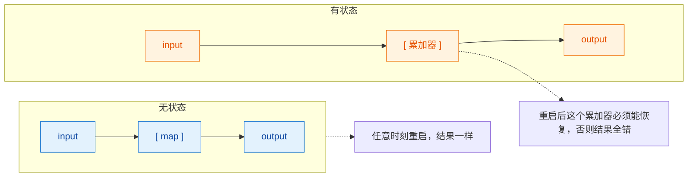
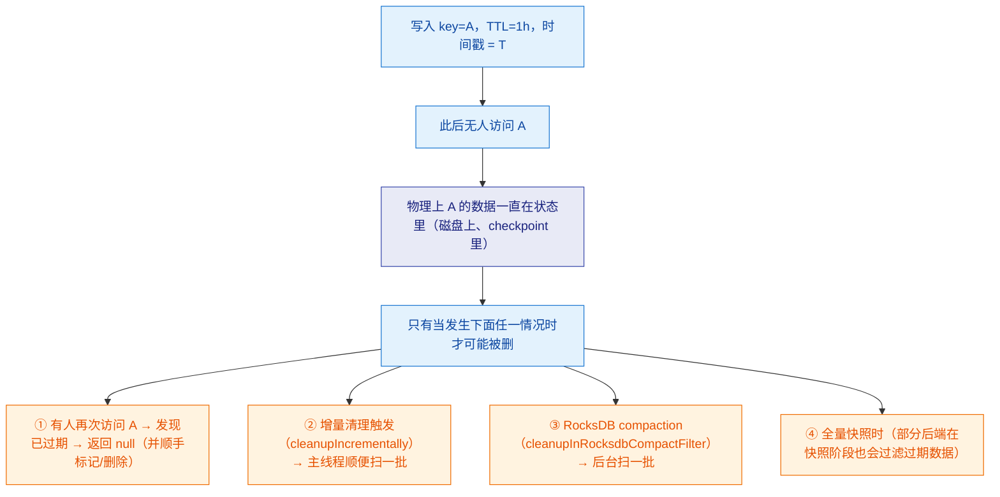

# 🗄️ 三、状态管理

> 本篇回答六个问题：Keyed State 和 Operator State 的分界线到底在哪，为什么 `keyBy` 是使用 Keyed State 的前提？Key Group 是什么，它为什么决定了"并行度能不能改"？五类 Keyed State 各自的适用场景和 API 陷阱是什么？`HashMapStateBackend` 和 `EmbeddedRocksDBStateBackend` 怎么选，1.13 的"状态后端与 checkpoint 存储解耦"改了什么，2.0 的 Disaggregated State 又想解决什么？状态 TTL 的惰性清理到底惰性在哪，为什么它不一定能让 checkpoint 变小？状态无限膨胀有哪些系统性治法？
> 前置阅读：[[0-Flink总览]]、[[1-架构与运行时]]、[[2-时间与窗口]]。相关：[[5-Checkpoint与Savepoint]]（状态如何被快照与恢复）、[[6-背压与性能调优]]（状态访问与 RocksDB 调优）、[[8-FlinkSQL与TableAPI]]（`table.exec.state.ttl`）、[[10-面试高频题]]。

---

## 一、为什么需要状态

### 1.1 无状态 vs 有状态

**无状态的算子**：输出只取决于当前输入。`map`、`filter`、`flatMap`、纯函数式的 `process` 都是。一条记录进来，一条记录出去，算子的行为不依赖历史。

**有状态的算子**：输出取决于当前输入 **+ 历史累积的信息**。

| 需求 | 需要的状态 |
| --- | --- |
| 按 key 累加计数 | 每个 key 的当前计数值 |
| 窗口聚合 | 每个窗口的累加器 |
| 去重（DISTINCT / 幂等） | 已见过的 ID 集合 |
| 双流 join | 一侧的缓存（等待另一侧匹配） |
| 超时未支付取消 | 订单的待处理标记 + 定时器 |
| 动态规则匹配 | 规则表（广播状态） |
| CEP 复杂事件 | 部分匹配序列 |
| Kafka source 的消费位点 | 每个分区的 offset |



> [!important] 状态是 Flink 一切高级能力的基石
> 窗口、join、CEP、SQL 聚合、exactly-once，全部建立在"状态能被可靠快照和恢复"之上。**没有状态管理，Flink 就只是一个分布式 `map`。**

### 1.2 状态为什么是容错与 Exactly-Once 的根基

流处理的三难：**不丢、不重、不重复计算**。要做到这些，必须解决"作业挂了之后，我从哪里继续、我之前算到哪了"。

- 只记 source 位点不够：如果状态丢了，从位点重放会从头再算一遍，或者算出错误的累积值。
- 只记状态不够：如果不知道 source 读到哪了，恢复后不知道从哪重放。
- 所以 **checkpoint = 状态快照 + source 位点**，两者必须一致（这也是 barrier 对齐存在的意义）。

> [!note] 一句话
> **状态是"算到哪了"，位点是"读到哪了"。** exactly-once 要求这两者在同一个一致性快照里。

### 1.3 Flink 状态的设计目标

| 目标 | Flink 的做法 |
| --- | --- |
| 局部性 | 状态**跟 key 走**，同一个 key 的状态永远在同一个 subtask 上，无需跨节点访问 |
| 可扩展 | 状态容量可以超过内存（RocksDB 落盘） |
| 可重分配 | 并行度变化时状态能按 key group 重新划分 |
| 可快照 | 异步快照，不长时间阻塞数据处理 |
| 可演进 | 状态 schema 支持有限度的演进（增删字段） |
| 可回收 | TTL 机制防止无限膨胀 |

---

## 二、状态的分类：Keyed State vs Operator State

这是状态管理最重要的一条分界线。

### 2.1 Keyed State（键控状态）

**只能用在 `KeyedStream` 上**，也就是必须先 `keyBy`。状态按 key 隔离，每个 key 看到的是自己的一份。

```java
stream.keyBy(OrderEvent::getUserId)              // ← KeyedStream
      .process(new KeyedProcessFunction<...>() {
          // 在这里 getRuntimeContext().getState(...) 拿到的就是 Keyed State
      });
```

| 特性 | 说明 |
| --- | --- |
| 作用域 | 每个 key 一份（逻辑上）；物理上同一个 subtask 上的多个 key 共享一个状态实例，靠 key 前缀区分 |
| 获取方式 | `getRuntimeContext().getState(...)` / `getListState` / `getMapState` / `getReducingState` / `getAggregatingState` |
| 支持类型 | Value / List / Map / Reducing / Aggregating（5 种） |
| 底层划分 | 按 **Key Group** 划分，这是并行度调整的基础 |
| 典型用途 | 聚合、去重、join、窗口、CEP、定时器 |
| 状态后端 | 可以是堆内存，也可以是 RocksDB |
| 访问性能 | 单 key 访问 O(1)；RocksDB 下有序列化开销 |

> [!warning] 没有 `keyBy` 就用 Keyed State 会直接抛异常
> ```
> java.lang.IllegalStateException: Keyed state can only be used on a 'keyed stream',
> i.e., a 'keyBy()' operation.
> ```
> 注意：`keyBy` 之后如果再 `map`（非 keyed 算子）再 `process`，状态又变回 Operator State 的语境了。**Keyed State 的可用性取决于紧邻的上游是不是 KeyedStream。**

### 2.2 Operator State（算子状态）

**与 key 无关，每个 subtask 一份**（不是每个 key 一份）。

| 特性 | 说明 |
| --- | --- |
| 作用域 | 每个并行子任务（subtask）一份 |
| 获取方式 | 实现 `CheckpointedFunction` 或 `CheckpointListener`，从 `FunctionInitializationContext` 拿 |
| 支持类型 | `ListState` 和 `BroadcastState`（历史上有 `UnionListState`，现在通过 `getUnionListState` 获取） |
| 状态后端 | 只存在堆内存（不走 RocksDB） |
| 典型用途 | **Kafka source 的 offset**、文件 source 的读取位置、缓冲池、广播规则 |
| 重分配 | Even-split（均匀轮询）或 Union（每个 subtask 拿全量） |

这解释了为什么 Kafka Source 的并行度可以随意调整：它的状态是"我负责的那几个分区的 offset"，是 Operator State，扩缩容时按分区重新分配即可，不需要按 key 做哈希。

### 2.3 对比表（面试高频）

| 维度 | Keyed State | Operator State |
| --- | --- | --- |
| 前置条件 | 必须 `keyBy` | 无要求 |
| 粒度 | 每个 key 一份 | 每个 subtask 一份 |
| 可用类型 | Value / List / Map / Reducing / Aggregating | ListState / BroadcastState |
| 获取方式 | `RuntimeContext.getState(...)` | `CheckpointedFunction.initializeState(...)` |
| 支持 RocksDB | ✅ 支持（可超内存） | ❌ 只在堆内存 |
| 并行度变化 | 按 **key group** 重分配，可任意扩缩容 | Even-split 重分配；Union 则每个 subtask 拿全量 |
| 横向扩展性 | 受 key 基数与倾斜影响 | 通常很好（如 Kafka 分区数即上限） |
| 典型例子 | 用户累计消费额、去重集合、CEP | Kafka offset、文件位置、广播规则 |
| TTL 支持 | ✅ `StateTtlConfig` | 有限（原本主要为 keyed state 设计） |

### 2.4 Key Group：并行度能不能改的钥匙

这是最容易被忽略、但生产中最关键的概念。

**定义**：Flink 把 key 的哈希空间划分为固定数量的 **Key Group**，数量等于 `maxParallelism`。

```text
keyGroupId = KeyGroupRangeAssignment.assignToKeyGroup(keyHash, maxParallelism)

maxParallelism = 128 时：
  key group 0 ─────────────────────────────────── 127

并行度 = 4 时每个 subtask 分 32 个 key group：
  subtask0: [0, 31]
  subtask1: [32, 63]
  subtask2: [64, 95]
  subtask3: [96, 127]

并行度改成 3：
  subtask0: [0, 42]
  subtask1: [43, 85]
  subtask2: [86, 127]
  → key group 是一个"不可再分的分配单位"，只能整组搬家
```

**为什么需要 Key Group？** 因为如果直接按 `hash(key) % parallelism` 分配，并行度一变，几乎所有 key 的归属都会变，状态无法局部迁移，只能全量重算。有了 key group 这层间接，并行度变化时状态迁移的最小单位是 key group，保证每个 key 的状态迁移是原子的、可定位的。

| 事实 | 说明 |
| --- | --- |
| key group 数 = `maxParallelism` | 两者是同一个数字的两种叫法 |
| `maxParallelism` 有约束 | 必须在一个下界与上界之间（Flink 内部有上下界约束），并且会被规范化到合法值 |
| `maxParallelism` 何时确定 | 作业**首次提交**时确定，并随 savepoint 一起持久化 |
| 能否修改 | **基本不能**。savepoint 里固化了 key group 的划分，改 `maxParallelism` 后无法按 key 正确恢复 |
| 默认值 | 未显式设置时 Flink 会自动选取一个默认值，通常满足大多数中小规模作业 |
| 怎么显式设置 | `env.setMaxParallelism(n)`，或对单个算子 `operator.setMaxParallelism(n)` |
| 怎么选 | **要 >= 未来可能达到的最大并行度**。设太小会限制扩展上限；设太大会让每个 subtask 管理的 key group 变多，元数据开销和（RocksDB 场景下的）文件数上升 |

> [!danger] `maxParallelism` 是"上线前一次性决策"
> 常见事故：作业上线时 `maxParallelism` 用了默认值（偏小），半年后数据量涨了 10 倍要扩到 256 并行度，发现 `maxParallelism` 不够，**唯一出路是停作业、用 savepoint 重导数据或接受长时间不可用**。
> 规划原则：按"未来 1-2 年峰值并行度 × 1.5"来设，同时不要盲目设成几十万（会显著增加状态元数据和恢复时间）。
>
> 官方提供 `KeyGroupRangeAssignment.computeDefaultMaxParallelism(parallelism)` 这类工具来推算，但生产上更稳妥的是**直接显式指定并写进代码注释**。

---

## 三、Keyed State 的五个类型

### 3.1 总览

| 类型 | 存什么 | 核心 API | 典型用途 | 状态量 |
| --- | --- | --- | --- | --- |
| `ValueState<T>` | 单个值 | `value()` / `update(T)` | 计数器、最新一条记录、待处理标记 | 1 个对象 |
| `ListState<T>` | 一个列表 | `add(T)` / `get()` / `update(List)` / `addAll(List)` | 待处理队列、最近 N 条、去重缓冲 | 无界（要注意） |
| `MapState<K,V>` | 一个 Map | `get(K)` / `put(K,V)` / `remove(K)` / `contains(K)` / `entries()` / `keys()` / `values()` / `iterator()` | 会话、维度缓存、多字段聚合 | 无界（要注意） |
| `ReducingState<T>` | 单值，用 `ReduceFunction` 增量归并 | `add(T)` / `get()` | 求和、求最大（输入输出同类型） | 1 个值 |
| `AggregatingState<IN,OUT>` | 单值，用 `AggregateFunction` 归并 | `add(IN)` / `get()` | 输入输出类型不同的聚合 | 1 个值 |

**共有的 API**：`clear()`（清空当前 key 的状态）、`isEmpty()`（部分类型有）。

### 3.2 获取方式与 `StateDescriptor`

```java
public class OrderCountFunction extends KeyedProcessFunction<String, OrderEvent, Long> {

    // 声明为字段，但不要在构造器里 new State，因为 RuntimeContext 还没准备好
    private ValueState<Long> orderCount;

    @Override
    public void open(Configuration parameters) throws Exception {
        // ✅ 在 open() 里获取，此时 RuntimeContext 已就绪
        ValueStateDescriptor<Long> descriptor =
                new ValueStateDescriptor<>("order-count", Long.class);
        orderCount = getRuntimeContext().getState(descriptor);
    }
}
```

| 状态类型 | 获取方法 | Descriptor |
| --- | --- | --- |
| ValueState | `getRuntimeContext().getState(desc)` | `ValueStateDescriptor<T>(name, Class<T>)` |
| ListState | `getRuntimeContext().getListState(desc)` | `ListStateDescriptor<T>(name, Class<T>)` |
| MapState | `getRuntimeContext().getMapState(desc)` | `MapStateDescriptor<K,V>(name, Class<K>, Class<V>)` |
| ReducingState | `getRuntimeContext().getReducingState(desc)` | `ReducingStateDescriptor<T>(name, ReduceFunction<T>, Class<T>)` |
| AggregatingState | `getRuntimeContext().getAggregatingState(desc)` | `AggregatingStateDescriptor<IN,ACC,OUT>(name, AggregateFunction, TypeInformation<ACC>)` |

> [!warning] 状态名是"恢复契约"的一部分
> `StateDescriptor` 的第一个参数 **name** 不仅仅是标签——它是 checkpoint/savepoint 里找状态的**主键**。改了名字，恢复时会报：
> ```
> Exception: Could not find a state with name order_count ...
> ```
> 所以：**状态名一旦上线就不能改**（除非接受无法从 savepoint 恢复）。

### 3.3 `ValueState` 示例：按用户累计金额

```java
public class UserAmountFunction extends KeyedProcessFunction<String, OrderEvent, String> {

    private ValueState<Double> totalAmount;
    private ValueState<Long> lastOrderTime;

    @Override
    public void open(Configuration parameters) {
        totalAmount = getRuntimeContext().getState(
                new ValueStateDescriptor<>("total-amount", Double.class));
        lastOrderTime = getRuntimeContext().getState(
                new ValueStateDescriptor<>("last-order-time", Long.class));
    }

    @Override
    public void processElement(OrderEvent order, Context ctx, Collector<String> out) throws Exception {
        // value() 在从未赋值时返回 null，不是 0！
        Double total = totalAmount.value();
        total = (total == null ? 0.0 : total) + order.getAmount();
        totalAmount.update(total);
        lastOrderTime.update(order.getOrderTime());

        out.collect(String.format("user=%s total=%.2f", order.getUserId(), total));
    }
}
```

> [!danger] `ValueState.value()` 返回 `null` 而不是"零值"
> 这是新手第一大坑：`ValueState<Long>` 的 `value()` 在未赋值时返回 `null`，直接拆箱成 `long` 会 NPE。**必须判空**。
> 更隐蔽的是 `ListState.get()`：它永远返回一个 `Iterable`（可能为空），**不会返回 null**；但 `MapState.get(k)` 对不存在的 key 返回 `null`。

### 3.4 `ListState` 示例：最近 N 条记录（滑动缓冲）

```java
public class RecentOrdersFunction extends KeyedProcessFunction<String, OrderEvent, List<OrderEvent>> {

    private static final int MAX_SIZE = 10;
    private ListState<OrderEvent> recentOrders;

    @Override
    public void open(Configuration parameters) {
        recentOrders = getRuntimeContext().getListState(
                new ListStateDescriptor<>("recent-orders", OrderEvent.class));
    }

    @Override
    public void processElement(OrderEvent order, Context ctx, Collector<List<OrderEvent>> out)
            throws Exception {
        recentOrders.add(order);

        // 手动裁剪：ListState 本身没有容量控制！
        List<OrderEvent> all = new ArrayList<>();
        for (OrderEvent e : recentOrders.get()) {
            all.add(e);
        }
        if (all.size() > MAX_SIZE) {
            List<OrderEvent> trimmed = all.subList(all.size() - MAX_SIZE, all.size());
            recentOrders.update(trimmed);
        }

        out.collect(all);
    }
}
```

> [!danger] `ListState` 没有 TTL 之外的上界
> `ListState` 会一直 `add` 下去，**永远不自动清理**。这是"状态膨胀"最常见的来源之一。要么自己 `update()` 裁剪，要么配 TTL，要么改用 `MapState` 只保留需要的字段。
> 另外 `ListState.get()` 返回的 `Iterable` 在某些后端上是**惰性视图**，直接强转成 `List` 会 `ClassCastException`，必须像上面一样手动遍历拷贝。

### 3.5 `MapState` 示例：用户各品类消费额

```java
public class CategoryAmountFunction extends KeyedProcessFunction<String, OrderEvent, String> {

    private MapState<String, Double> categoryAmount;

    @Override
    public void open(Configuration parameters) {
        categoryAmount = getRuntimeContext().getMapState(
                new MapStateDescriptor<>("category-amount", String.class, Double.class));
    }

    @Override
    public void processElement(OrderEvent order, Context ctx, Collector<String> out) throws Exception {
        String category = order.getCategory();
        Double old = categoryAmount.get(category);          // 不存在返回 null
        categoryAmount.put(category, (old == null ? 0.0 : old) + order.getAmount());

        // 遍历：优先用 iterator()，它能利用状态后端的迭代优化
        StringBuilder sb = new StringBuilder();
        try (MapIterator<String, Double> it = categoryAmount.iterator()) {
            while (it.hasNext()) {
                Map.Entry<String, Double> e = it.next();
                sb.append(e.getKey()).append('=').append(e.getValue()).append(' ');
            }
        }
        out.collect(sb.toString());
    }
}
```

| MapState 方法 | 说明 |
| --- | --- |
| `get(K)` | 不存在返回 `null` |
| `put(K, V)` | 写入/覆盖 |
| `putAll(Map)` | 批量写 |
| `remove(K)` | 删除单个 key |
| `contains(K)` | 判断存在 |
| `isEmpty()` | 是否为空 |
| `entries()` / `keys()` / `values()` | 返回 `Iterable`（可能是视图，不要强转 List） |
| `iterator()` | `MapIterator`，**推荐用于遍历**（支持 `close()` 及早释放后端资源，RocksDB 下尤其重要） |

> [!tip] 遍历 MapState 为什么推荐 `iterator()`
> 在 RocksDB 后端下，`entries()` 之类的方法可能把整个 Map 拉进堆内存，而 `iterator()` 可以做到**流式遍历**（分批从 RocksDB 读取），内存占用可控。超过几万条的 MapState 遍历，用错方法会直接 OOM。

### 3.6 `ReducingState` 与 `AggregatingState`

**`ReducingState`**：输入输出同类型，用 `ReduceFunction` 增量归并。

```java
ReducingStateDescriptor<Long> desc = new ReducingStateDescriptor<>(
        "max-amount",
        (ReduceFunction<Long>) Math::max,   // 求最大值
        Long.class);
ReducingState<Long> maxAmount = getRuntimeContext().getReducingState(desc);

// 使用：只需要 add
maxAmount.add(order.getAmount());
Long current = maxAmount.get();   // 已归并后的结果
```

**`AggregatingState`**：输入输出类型不同，用 `AggregateFunction`。

```java
public class AvgAggregate implements AggregateFunction<Double, double[], Double> {
    @Override public double[] createAccumulator() { return new double[]{0, 0}; }
    @Override public double[] add(Double v, double[] acc) {
        return new double[]{acc[0] + v, acc[1] + 1};
    }
    @Override public Double getResult(double[] acc) {
        return acc[1] == 0 ? 0.0 : acc[0] / acc[1];
    }
    @Override public double[] merge(double[] a, double[] b) {
        return new double[]{a[0] + b[0], a[1] + b[1]};
    }
}

AggregatingStateDescriptor<Double, double[], Double> desc =
        new AggregatingStateDescriptor<>("avg-amount", new AvgAggregate(), double[].class);
AggregatingState<Double, Double> avgAmount = getRuntimeContext().getAggregatingState(desc);
```

| 对比 | `ReducingState` | `AggregatingState` |
| --- | --- | --- |
| 输入/输出类型 | 必须相同 | 可以不同 |
| 中间累加器 | 就是元素类型本身 | 独立的 ACC 类型 |
| 能否取到中间值 | 只能取到归并结果 | 只能取到 `getResult(acc)`，取不到累加器 |
| 适用 | 求和、最大、最小 | 平均值、方差、拼接 |

> [!note] `ReducingState`/`AggregatingState` 是"状态的增量聚合"
> 它们和窗口函数里的 `ReduceFunction`/`AggregateFunction` 是同一个思想：**不保存全部元素，只保存累加器**。区别是这里的状态是长期驻留的（跨窗口、不随窗口清理），所以更要注意 TTL。

### 3.7 `clear()` 与状态清理

`clear()` 清空**当前 key** 的状态。它是防止状态膨胀最直接的手段。

```java
@Override
public void processElement(OrderEvent order, Context ctx, Collector<String> out) throws Exception {
    if ("CANCEL".equals(order.getType())) {
        pendingOrder.clear();                                  // ✅ 清 ValueState
        ctx.timerService().deleteEventTimeTimer(fireAt);        // ✅ 同时删定时器
    }
}
```

| 陷阱 | 说明 |
| --- | --- |
| 只清状态没删 timer | timer 会照常触发（虽然状态已空），且 timer 状态本身占空间 |
| 只删 timer 没清状态 | 状态永久驻留 → 膨胀 |
| `clear()` 只清当前 key | 不会影响其他 key，也不会清 `MapState` 的"部分 key"（那要用 `remove(k)`） |
| `MapState` 的"清空" | `clear()` 清整个 map；`remove(k)` 清单个条目。**按 key 收缩要用 `remove`，不能用 `clear`（那会清掉有用的数据）** |

---

## 四、Operator State

### 4.1 `ListState` 的两种重分配模式

Operator State 只有列表形态（外加广播形态），但**恢复时的重分配策略**有两种，这是关键区别：

| 获取方法 | 重分配模式 | 恢复行为 | 适用场景 |
| --- | --- | --- | --- |
| `getListState(desc)` | **Even-split（均匀）** | 把所有 subtask 的元素聚成一个列表，按轮询（round-robin）重新分给各个 subtask | 元素之间**互相独立**，可分可合。如 Kafka 分区的 offset |
| `getUnionListState(desc)` | **Union（联合）** | 每个 subtask 都拿到**全量**列表 | 每个 subtask 都需要看到完整信息。如全量规则表、需要广播的位点快照 |

```java
// Even-split：注意是"元素"级别的均匀分配，而不是"列表"级别的
ListState<String> evenSplit = context.getOperatorStateStore()
        .getListState(new ListStateDescriptor<>("even-split", String.class));

// Union：每个 subtask 拿到全量
ListState<String> union = context.getOperatorStateStore()
        .getUnionListState(new ListStateDescriptor<>("union", String.class));
```

> [!warning] Even-split 的语义容易误解
> 并行度 2 → 4 时，原来的元素 `[a, b, c, d]` 会被**重新轮询分配**成 `[a,c] [b,d] [ ] [ ]`，而不是"原来的列表整体搬过去"。
> 所以如果元素之间有分组语义（比如"分区的 offset 集合"），你必须保证重分配后语义仍然正确。**Kafka Source 的做法是把"分区 → offset"编码成可独立重分配的元素**，并且保证一个分区只出现在一个 subtask 里。这也是为什么 Flink 禁止 Operator State 的重分配后出现同一分区的重复消费（由 FlinkKafkaConsumer 的分区分配协调器保证）。

### 4.2 `BroadcastState`：动态规则/维表

广播状态是"把一份数据复制到所有并行子任务"的机制。典型场景：**动态规则、黑白名单、维度表**——规则变了要立刻生效，但不需要重跑作业。

- 广播状态**只能通过 `MapState` 描述**（`MapStateDescriptor`）；
- 广播状态**只存在堆内存**（不走 RocksDB）；
- 所有 subtask 上的广播状态**内容相同**；
- 广播侧的数据更新**不保证跨 subtask 的顺序一致**，所以 `processBroadcastElement` 里的逻辑必须是**确定性**的（相同的元素序列产生相同结果）。

```java
// 1) 规则流 → 广播流
MapStateDescriptor<String, Rule> ruleDescriptor = new MapStateDescriptor<>(
        "rules-broadcast-state",
        BasicTypeInfo.STRING_TYPE_INFO,
        TypeInformation.of(new TypeHint<Rule>() {}));

BroadcastStream<Rule> ruleBroadcastStream = ruleStream.broadcast(ruleDescriptor);

// 2) 业务流 connect 广播流
DataStream<Alert> alerts = orderStream
        .connect(ruleBroadcastStream)
        .process(new RuleEvaluator());

// 3) BroadcastProcessFunction 骨架
public static class RuleEvaluator extends BroadcastProcessFunction<OrderEvent, Rule, Alert> {

    private final MapStateDescriptor<String, Rule> ruleDescriptor =
            new MapStateDescriptor<>("rules-broadcast-state",
                    BasicTypeInfo.STRING_TYPE_INFO, TypeInformation.of(new TypeHint<Rule>() {}));

    // 业务流：只能只读访问广播状态
    @Override
    public void processElement(OrderEvent order, ReadOnlyContext ctx, Collector<Alert> out)
            throws Exception {
        ReadOnlyBroadcastState<String, Rule> rules = ctx.getBroadcastState(ruleDescriptor);
        try (CloseableIterator<Map.Entry<String, Rule>> it = rules.immutableEntries().iterator()) {
            while (it.hasNext()) {
                Rule rule = it.next().getValue();
                if (rule.matches(order)) {
                    out.collect(new Alert(order.getOrderId(), rule.getRuleId()));
                }
            }
        }
    }

    // 规则流：可以写广播状态
    @Override
    public void processBroadcastElement(Rule rule, Context ctx, Collector<Alert> out)
            throws Exception {
        BroadcastState<String, Rule> rules = ctx.getBroadcastState(ruleDescriptor);
        if (rule.isDeleted()) {
            rules.remove(rule.getRuleId());
        } else {
            rules.put(rule.getRuleId(), rule);
        }
    }
}
```

> [!important] `ReadOnlyContext` 与 `Context` 的区别是**编译期强制**的
> 业务流的 `processElement` 拿到的是 `ReadOnlyContext`，它的 `getBroadcastState` 返回 `ReadOnlyBroadcastState`，**没有 `put`/`remove` 方法**。这是 Flink 刻意设计的约束：业务流不能改广播状态，否则不同 subtask 的规则会不一致。
>
> **这条约束在生产上非常重要**：它保证了"所有 subtask 的规则始终相同"这个不变量。

| 广播状态注意点 | 说明 |
| --- | --- |
| 必须用 `MapStateDescriptor` | 广播状态只支持 Map 形态 |
| 规则流必须是 `BroadcastStream` | 用 `.broadcast(descriptor)` 得到 |
| 广播状态在 checkpoint 里 | 恢复时所有 subtask 重新获得相同内容 |
| **不要在规则流里做重计算** | 每条规则元素会被广播到**所有** subtask，N 个并行度就是 N 份处理开销 |
| 启动时的全量加载 | 如果规则来自数据库，要用 CDC/周期性拉取生成一条"全量替换"语义的流；直接 `put` 增量可能因为乱序导致状态不一致 |
| 调试困难 | 广播状态的变更不体现在数据流的 record 里，要看日志/指标 |
| 状态大小 | 广播状态在**每个** subtask 上都有一份，规则表很大时内存压力 = 规则大小 × 并行度 |

> [!tip] 广播状态 vs `RichFlatMapFunction` 里开线程定时拉规则
> 后者的问题：① 规则不一致（各 subtask 拉取时刻不同）；② 无法随 checkpoint 恢复；③ 不受作业生命周期管理。**只要规则要"变了立刻生效且可恢复"，就必须用广播状态。**

### 4.3 `CheckpointedFunction` 生命周期

```java
public interface CheckpointedFunction {
    // checkpoint 时被调用：把当前状态写入 state store
    void snapshotState(FunctionSnapshotContext context) throws Exception;

    // 算子初始化/恢复时被调用：比 open() 更早
    void initializeState(FunctionInitializationContext context) throws Exception;
}
```

```java
public class BufferingSink implements SinkFunction<OrderEvent>, CheckpointedFunction {

    private final List<OrderEvent> bufferedElements = new ArrayList<>();
    private transient ListState<OrderEvent> checkpointedState;

    @Override
    public void snapshotState(FunctionSnapshotContext context) throws Exception {
        checkpointedState.clear();                     // 必须先清空，否则会累积重复
        for (OrderEvent e : bufferedElements) {
            checkpointedState.add(e);
        }
    }

    @Override
    public void initializeState(FunctionInitializationContext context) throws Exception {
        ListStateDescriptor<OrderEvent> descriptor =
                new ListStateDescriptor<>("buffered-elements", OrderEvent.class);
        checkpointedState = context.getOperatorStateStore().getListState(descriptor);

        if (context.isRestored()) {                    // 从 checkpoint 恢复
            for (OrderEvent e : checkpointedState.get()) {
                bufferedElements.add(e);
            }
        }
    }

    @Override
    public void invoke(OrderEvent value, Context context) {
        bufferedElements.add(value);
        if (bufferedElements.size() >= 1000) {
            flush();
            bufferedElements.clear();
        }
    }
}
```

| 生命周期顺序 | 说明 |
| --- | --- |
| `initializeState(context)` | **最先**调用，此时可以拿到 state store 并恢复状态 |
| `open(Configuration)` | 之后调用，适合做外部连接初始化 |
| `snapshotState(context)` | 每次 checkpoint 时调用（在状态被真正写入存储之前） |
| `close()` | 作业结束时调用 |
| `notifyCheckpointComplete(id)` | 由 `CheckpointListener` 提供，checkpoint **完成**后回调（2PC sink 靠它 commit） |

> [!danger] `snapshotState` 里忘记 `clear()` 会怎样
> `checkpointedState.add()` 是**追加**语义。如果不清空就 add，每次 checkpoint 都会把当前缓冲追加到已有内容上，导致 checkpoint 越来越大、恢复后数据重复。**这是 Operator State 最经典的 bug。**
>
> 另外注意：`snapshotState` 里对 `checkpointedState` 的写操作会**直接影响运行时的状态**（因为这个 state 对象同时是"运行时视图"和"快照视图"），所以顺序必须是：先 `clear()`，再 `addAll(当前缓冲)`。

> [!note] 为什么不用 `RichFunction` 直接持有 `ListState`
> `RichFunction.getRuntimeContext().getListState(...)` 只能拿 Keyed State，且要求上游是 KeyedStream。**非 keyed 的算子要用 Operator State，唯一的途径就是实现 `CheckpointedFunction`。**

---

## 五、状态后端（State Backend）

状态后端决定了**状态存在哪、怎么存、怎么快照**。

### 5.1 `HashMapStateBackend`（堆内存）

状态以 Java 对象的形式存在 TaskManager 的 **JVM 堆**上（用 `HashMap` 组织）。

```java
// 代码方式（旧）或配置文件方式（推荐）
env.setStateBackend(new HashMapStateBackend());
```

```yaml
# flink-conf.yaml
state.backend: hashmap
```

| 优点 | 缺点 |
| --- | --- |
| 读写最快（纯内存、无序列化） | 受堆大小限制，状态量上限取决于 TM 内存 |
| 实现简单、调试容易（能直接 dump 堆） | 状态大时 GC 压力大，容易 Full GC / OOM |
| 不需要额外的本地磁盘 I/O | **不支持增量 checkpoint**，每次全量快照 |
| 适合小状态、高吞吐场景 | 大状态时 checkpoint 时间长、对数据流阻塞明显 |

### 5.2 `EmbeddedRocksDBStateBackend`（RocksDB）

状态以 **LSM-Tree** 的形式存储在 TaskManager 的**本地磁盘**上（RocksDB 实例），内存只作为 block cache 和 write buffer。

```java
env.setStateBackend(new EmbeddedRocksDBStateBackend(true));   // true = 开启增量 checkpoint
```

```yaml
state.backend: rocksdb
state.backend.incremental: true

# RocksDB 调优（按需）
state.backend.rocksdb.localdir: /data/flink/rocksdb        # 建议多盘，用逗号分隔
state.backend.rocksdb.memory.managed: true                 # 交给 Flink 统一内存管理
state.backend.rocksdb.predefined-options: SPINNING_DISK_OPTIMIZED_HIGH_MEM
state.backend.rocksdb.block.cache-size: 256mb
state.backend.rocksdb.writebuffer.size: 64mb
state.backend.rocksdb.thread.num: 4
state.backend.rocksdb.timer-service.factory: HEAP          # 或 ROCKSDB
```

| 优点 | 缺点 |
| --- | --- |
| 状态容量可远超内存（受本地磁盘限制） | 每次访问都要序列化/反序列化，CPU 开销大 |
| **支持增量 checkpoint**（只上传变化的 SST 文件） | 依赖本地磁盘，磁盘满/慢会直接拖垮作业 |
| 状态大时 GC 压力小 | 大量小文件，SSD 寿命和 IOPS 是关注点 |
| 支持超大状态（TB 级） | 排查困难（要看 RocksDB 日志、metrics、SST 文件） |
| `RocksDB` timer service 可把海量 timer 也放到磁盘 | 恢复时要重建本地状态，恢复时间较长 |

### 5.3 对比表（选型核心）

| 维度 | `HashMapStateBackend` | `EmbeddedRocksDBStateBackend` |
| --- | --- | --- |
| 状态存放位置 | TaskManager JVM 堆内存 | TaskManager 本地磁盘（RocksDB） |
| 访问延迟 | 极低（纳秒级，无序列化） | 较高（微秒级，需序列化 + 可能读盘） |
| 状态容量上限 | 受堆内存限制（通常 GB 级） | 受本地磁盘限制（可达 TB 级） |
| 增量 checkpoint | ❌ 不支持 | ✅ 支持（`state.backend.incremental: true`） |
| checkpoint 开销 | 全量快照，状态越大越慢 | 首次全量、之后增量，明显更省带宽和时间 |
| GC 影响 | 大状态时 GC 压力大 | 状态不在堆上，GC 压力小 |
| 是否依赖本地磁盘 | 否 | **是**（本地磁盘故障 = 需要从远程 checkpoint 全量重建） |
| 序列化开销 | 快照时才序列化 | 每次读写都序列化 |
| 调试难度 | 低（可 dump 堆、看对象） | 高（需懂 LSM-Tree、SST、compaction） |
| 适用场景 | 状态小（几 GB 以内）、要求低延迟、追求实现简单 | 状态大、需要增量 checkpoint、状态量持续增长 |
| 典型配置 | 默认常用 | 大促/实时数仓/大 key 基数场景 |

> [!tip] 选型口诀
> **状态能稳定放进堆、且对延迟敏感 → HashMap；状态会持续增长 / 超过几 GB / 想用增量 checkpoint → RocksDB。**
> 拿不准时看两个指标：**checkpoint 全量大小**和**状态增长速度**。如果 checkpoint 全量已经需要几十秒甚至几分钟，或者状态每天涨几个 GB，就必须上 RocksDB + 增量。

### 5.4 1.13+ 的"解耦"：State Backend vs Checkpoint Storage

**1.13 之前**，"状态后端"这个词混着两件事：

1. 运行时状态放在哪（堆 / RocksDB）；
2. checkpoint 写到哪（JobManager 内存 / 文件系统）。

所以有 `MemoryStateBackend` / `FsStateBackend` / `RocksDBStateBackend` 三个类，它们把两个维度绑在一起，组合不自由。

**1.13 起**，Flink 把这两个维度**正交拆开**：

| 维度 | 配置 | 可选值 |
| --- | --- | --- |
| 运行时状态后端 | `state.backend` | `hashmap` / `rocksdb` |
| checkpoint 存储 | `state.checkpoint-storage` | `jobmanager` / `filesystem` |

```yaml
state.backend: rocksdb
state.backend.incremental: true

state.checkpoint-storage: filesystem
state.checkpoints.dir: hdfs:///flink/checkpoints
state.savepoints.dir: hdfs:///flink/savepoints
```

| CheckpointStorage | 存放位置 | 适用 |
| --- | --- | --- |
| `JobManagerCheckpointStorage` | JobManager 堆内存（超过阈值写 JM 的临时目录） | 本地测试、极小状态。**生产禁用**：JM 挂了 checkpoint 全丢，且 JM OOM 风险高 |
| `FileSystemCheckpointStorage` | 分布式文件系统（HDFS / S3 / OSS / GCS） | 所有生产环境 |

**解耦之后的自由组合：**

| 运行时 | checkpoint 存储 | 是否合理 |
| --- | --- | --- |
| HashMap | FileSystem | ✅ 小状态 + 持久化，最常见的"轻量"配置 |
| RocksDB | FileSystem | ✅ 大状态 + 增量，生产主流 |
| HashMap / RocksDB | JobManager | ⚠️ 仅本地开发调试 |
| RocksDB | JobManager | ❌ 无意义（大状态存 JM 内存会直接 OOM） |

> [!important] 解耦的实践意义
> 以前用 `FsStateBackend` 时状态在堆内存、快照写文件系统；想换成 RocksDB 必须改 backend 类，且**从 savepoint 恢复时 backend 必须一致**（早期版本的限制）。1.13 之后：
> ① 配置更清晰，选择更自由；
> ② **可以在变更状态后端的情况下从 savepoint 恢复**（因为状态是序列化后存的，与具体 backend 无关）—— 这是运维上的重大改善，允许"先上线用 HashMap，后续状态涨了切 RocksDB"。

### 5.5 Flink 2.0 的 Disaggregated State（ForSt）：新方向

> [!note] 这是 Flink 2.0 引入的新方向，属于前沿内容
> **ForSt**（For Streaming，读作 "forest"）是 Flink 2.0 引入的**分离式（disaggregated）状态后端**，把**远程 DFS 作为状态的主存储**，配合异步状态访问。它不是 1.x 里 RocksDB backend 的调参，而是一次架构层面的重构。

**它要解决什么问题？**

| 传统 RocksDB 的痛点 | 具体表现 |
| --- | --- |
| 本地磁盘绑定 | 状态必须在 TM 本地盘上，磁盘容量/性能成为上限；磁盘故障需要从远程全量重建 |
| 扩缩容慢 | 并行度变化要把状态在节点间搬运/重建，大状态时耗时以小时计 |
| 恢复慢 | 重启后要从 checkpoint 重建整个本地状态，恢复时间与状态量正相关 |
| 资源不匹配 | 本地磁盘规格和 CPU/内存规格耦合，无法独立弹性 |
| 云原生不友好 | 计算与存储无法真正分离，弹性伸缩和 Serverless 化困难 |

**ForSt 的思路：**

| 对比项 | RocksDB State Backend | ForSt（Disaggregated State） |
| --- | --- | --- |
| 状态主存储 | TM 本地磁盘 | **远程 DFS**（HDFS/S3/OSS 等） |
| 状态访问 | 同步（本地磁盘延迟） | **异步**（远程访问，靠异步化 + 本地缓存掩盖延迟） |
| 本地磁盘用途 | 必需，是主存储 | 只作缓存，可大幅减小甚至不需要 |
| 扩缩容 | 需要搬运/重建状态 | 状态在远程，扩缩容不搬数据（对云原生弹性有利） |
| 恢复 | 重建整个本地状态 | 从远程读，理论上显著更快 |
| 状态 | 1.x 主流方案，成熟 | 2.0 新引入的方向，生态与调优经验仍在积累 |

> [!warning] 对 ForSt 的正确态度
> - 它是**方向性**的东西，代表 Flink 走向"存算分离 + 云原生弹性"，面试时能说出来是加分项。
> - 但在**现在**的生产选型上，绝大多数场景仍然是 `RocksDB + 增量 checkpoint`。新东西的成熟度、周边工具链（监控、savepoint 兼容、SQL 支持）、社区调优经验都需要时间沉淀。
> - 面试回答的稳妥姿势：**"当前生产我会选 RocksDB + 增量，因为成熟、调优手段清晰；同时我会关注 2.0 的 ForSt 分离式状态，它解决的是本地磁盘受限和扩缩容慢这两个根本问题，是未来的方向。"** —— 既表明你知道前沿，又表明你有工程判断力。

---

## 六、状态 TTL

状态 TTL 是控制状态膨胀最直接的工具。

### 6.1 构造 `StateTtlConfig`

```java
StateTtlConfig ttlConfig = StateTtlConfig
        .newBuilder(Time.days(7))                                    // ① TTL 时长
        .setUpdateType(StateTtlConfig.UpdateType.OnCreateAndWrite)   // ② 何时刷新时间戳
        .setStateVisibility(StateTtlConfig.StateVisibility.NeverReturnExpired) // ③ 过期值是否可见
        .cleanupIncrementally(10, false)                             // ④ 增量清理
        .cleanupInRocksdbCompactFilter(1000)                         // ⑤ RocksDB compaction 清理
        .build();

ValueStateDescriptor<String> descriptor =
        new ValueStateDescriptor<>("user-profile", String.class);
descriptor.enableTimeToLive(ttlConfig);          // ⑥ 绑定到 descriptor
```

| 参数 | 可选值 | 含义 |
| --- | --- | --- |
| TTL 时长 | `Time.days(7)` 等 | 从最后一次刷新算起，多久后过期 |
| `setUpdateType` | `OnCreateAndWrite`（默认） | 只在创建和写入时刷新时间戳；**读不刷新** |
| | `OnReadAndWrite` | 读和写都刷新；更符合"热数据不过期"直觉，但**每次读都要写一次时间戳，RocksDB 下是额外写放大** |
| `setStateVisibility` | `NeverReturnExpired`（默认） | 过期了就不返回（返回 null），最安全 |
| | `ReturnExpiredIfNotCleanedUp` | 如果还没被清理，过期值依然返回。为了性能可以选，但语义上会读到"过期的旧值" |
| `cleanupIncrementally(n, runOnEveryRecord)` | `n` 为每次触发清理的条数 | 在**处理数据的主线程**上做清理，每处理 `n` 条或每条记录触发 |
| `cleanupInRocksdbCompactFilter(n)` | 每 compaction `n` 条检查一次 | **利用 RocksDB compaction 在后台清理**，不占用主线程 |
| `cleanupInBackground()` / `disableCleanupInBackground()` | 默认开启 | 是否允许后台清理线程 |

> [!warning] TTL 的时间基准是**处理时间**，不是事件时间
> 无论作业用的是事件时间还是处理时间，**TTL 永远按 TaskManager 的机器时钟计算**。这意味着：
> - 重跑作业时，TTL 的过期行为与上次不同（历史数据的时间戳很旧，但"现在"是新的）；
> - 无法表达"按业务时间保留 7 天"这种语义，只能表达"7 天没被访问就销毁"。
>
> 另外 TTL 是**状态级**配置，不能按 key 设置不同 TTL。要按 key 做差异化保留，只能自己在业务逻辑里用 timer + `clear()` 实现。

### 6.2 "惰性清理"到底是什么语义

这是 TTL 最容易被误解的地方。**TTL 不是"到点就删"的定时任务**，而是"访问时才判断 + 后台顺手清理"。



| 语义 | 后果 |
| --- | --- |
| **过期 ≠ 立即物理删除** | 过期数据可能长时间驻留，占用内存/磁盘 |
| **过期 ≠ 读得到** | 默认 `NeverReturnExpired`，读的时候返回 null，业务上"已经过期了" |
| **过期 ≠ checkpoint 变小** | 没被清理的过期数据**依然会被写进 checkpoint** |

> [!danger] 最常见的 TTL 误判："我配了 TTL，为什么 checkpoint 还是那么大？"
> 因为 TTL 的默认清理策略非常"懒"。要让 checkpoint 真正变小，必须让清理**真的发生**：
> 1. **RocksDB 后端必须配 `cleanupInRocksdbCompactFilter`** —— 它让 compaction 时删除过期数据，SST 文件才会真正变小，增量 checkpoint 才会变小。
> 2. **堆后端（HashMap）没有 compaction 机制**，只能靠 `cleanupIncrementally`，清理能力弱得多。所以**大状态 + TTL 的组合应该优先用 RocksDB**。
> 3. 配了 `disableCleanupInBackground()` 会让清理更慢。
> 4. 如果 key 写到过期后再也没被访问过，`cleanupIncrementally` 也扫不到它（它只扫访问到的状态）。这时只能靠 RocksDB compaction filter。
>
> **结论：TTL 的效果强依赖于状态后端和清理策略的组合。只在 descriptor 上 enableTimeToLive 就以为万事大吉，是生产上非常常见的错误。**

### 6.3 TTL 的三个"必答"使用场景

**场景一：双流 join 的状态必须配 TTL。**

interval join / lookup join 会把一侧的数据缓存起来等另一侧。如果业务上"订单只可能和 1 小时内的支付记录匹配"，那么缓存 7 天就是纯浪费，而且会无限增长。

| 层面 | 手段 |
| --- | --- |
| DataStream API | `KeyedCoProcessFunction` + `ValueState` + `StateTtlConfig` + `Timer` |
| Flink SQL | `table.exec.state.ttl`（详见 [[8-FlinkSQL与TableAPI]]） |

```sql
-- SQL 里的 join 状态 TTL（按状态"空闲"时间算）
SET 'table.exec.state.ttl' = '12h';
```

> [!important] SQL 作业的"状态静静膨胀"几乎都是这个原因
> SQL 层看不到状态 API，很多人以为"SQL 没有状态"。**恰恰相反**：每一个 `GROUP BY`、每一个 `JOIN`、每一个 `DISTINCT` 都是大状态算子。SQL 作业上线前必须显式评估 `table.exec.state.ttl`，尤其是 join 的左右两侧保留时间。

**场景二：去重状态。**

UV 去重、消息幂等去重，都需要"记住见过的 ID"。业务上通常只需要保留一个时间窗（如 24 小时），配 TTL 后状态量从"全量历史"降到"24 小时窗口"。

**场景三：定时器 + 待处理状态。**

"超时未支付取消订单"里的 `pendingOrder`，如果订单最终既没支付也没触发 timer（数据异常），状态会永久驻留。加 TTL 作为兜底。

### 6.4 TTL 与 checkpoint 大小的关系

| 因素 | 影响 |
| --- | --- |
| TTL 时长 | 越长，驻留的状态越多，checkpoint 越大 |
| 清理策略 | 只有 RocksDB compaction filter 能真正回收磁盘并反映到增量 checkpoint |
| `UpdateType` | `OnReadAndWrite` 会让热数据永不过期（可能符合预期，也可能导致"热点 key 状态永不释放"） |
| 状态后端 | RocksDB 能回收；HashMap 只能靠主线程增量清理，效果差 |
| 增量 checkpoint | 只有真正删除了 SST 文件，增量 checkpoint 的体积才会下降 |

> [!tip] 验证 TTL 是否真的生效
> 1. 看 **checkpoint size** 指标是否随时间趋于平稳（而不是单调上升）；
> 2. 看 RocksDB 的 **`state.backend.rocksdb.estimated-live-data-size`** 和各 SST 文件大小；
> 3. 直接看 TM 本地 `rocksdb` 目录的 `du -sh`；
> 4. 如果配了 TTL 但 checkpoint size 依然单调增长，**先怀疑清理策略没配**（尤其是没配 `cleanupInRocksdbCompactFilter`）。

---

## 七、状态膨胀治理

### 7.1 常见膨胀原因

| 原因 | 机制 | 症状 |
| --- | --- | --- |
| **key 基数爆炸** | 用了一个高基数字段做 key（如订单 ID、设备指纹、UUID、trace_id） | 状态条目数 = key 数，随时间线性增长；checkpoint 单调变大 |
| **join 状态无 TTL** | 双流 join 缓存另一侧数据，永不清理 | 状态量随数据量线性增长；作业跑几天后 OOM |
| **`ListState` 无界堆积** | 只 `add` 不裁剪（如"最近 N 条"但没实现裁剪） | 单 key 状态巨大，出现长尾 |
| **窗口未清理** | `GlobalWindows` 无 trigger、`allowedLateness` 过长、Trigger 没 `clear` | 窗口状态不释放 |
| **Timer 泄漏** | 注册了 timer 但从不 `deleteEventTimeTimer`；`onTimer` 里不清状态 | timer state 无限增长，恢复时间越来越长 |
| **自定义 `MapState` 当缓存用** | 缓存维表/结果但不过期 | 与 join 无 TTL 同理 |
| **数据倾斜 + 超大 key** | 少数 key 拥有海量数据 | 个别 subtask 状态远超其他（看 checkpoint 的 subtask 分布） |
| **TTL 配了但没生效** | 清理策略缺失、后端不支持、key 不再被访问 | checkpoint 依然单调增长，见 6.2 |
| **状态里存了过大的对象** | 把整条消息/整个 JSON 存进状态 | 单条状态几十 KB，总量爆炸 |

### 7.2 排查手段（按顺序）

| 步骤 | 手段 | 看什么 |
| --- | --- | --- |
| 1 | **Checkpoint 大小趋势**（Web UI / 监控） | 是否单调增长？增长速率与数据量是否线性？ |
| 2 | **各 subtask 的 checkpoint 大小** | 是否严重倾斜（个别 subtask 远大于其他）→ 数据倾斜或大 key |
| 3 | **Checkpoint 的 state size 明细**（per-operator） | 哪个算子的状态最大 → 定位到具体的 state 名 |
| 4 | **RocksDB 指标** | `estimated-live-data-size`、block cache 命中率、compaction 次数、stall 次数 |
| 5 | **TM 本地磁盘** | `du -sh <rocksdb.localdir>`，看 SST 文件数与总大小 |
| 6 | **火焰图 / 采样 Profiler** | 时间花在状态读写还是业务逻辑（见 [[6-背压与性能调优]]） |
| 7 | **看 state 名和 key 分布** | 用 `StateProcessor` API 读 savepoint，统计各算子的 key 数量与大小分布 |
| 8 | **业务侧对数** | 上游 key 基数（`COUNT(DISTINCT key)`）是否随时间暴涨 |

```bash
# 用 State Processor API 读 savepoint，统计 key 数量和大小（思路示例）
# 依赖 flink-state-processor-api
```

> [!tip] 最高效的一次排查：直接看 checkpoint 的 per-operator state size
> 在 Web UI 的 Checkpoint 详情里能看到每个算子的状态大小。**先定位到"哪个算子"，再去代码里找"这个算子的哪个 state"**，比盲目猜测快得多。十次状态膨胀有八次能靠这一步直接锁定。

### 7.3 治理清单

| 手段 | 做法 | 适用 |
| --- | --- | --- |
| **配 TTL** | `StateTtlConfig` + RocksDB compaction filter；SQL 用 `table.exec.state.ttl` | 所有有自然生命周期的状态（join、去重、缓存） |
| **减少 key 粒度 / 换 key** | 不要用 UUID/订单号做 key；用 `user_id`、`city_id` 等有界维度 | key 基数爆炸 |
| **加盐（salting）** | 给热 key 加随机后缀打散，两阶段聚合 | 数据倾斜 + 超大 key |
| **预聚合** | 在 source 后先做一次本地预聚合，减少进入状态的数据量 | 高吞吐聚合 |
| **改用增量聚合** | 用 `AggregateFunction`/`ReduceFunction`/`ReducingState` 替代 `ProcessWindowFunction` | 窗口状态大 |
| **清理 timer 对应的状态** | `onTimer` 里 `clear()`；状态失效时 `deleteEventTimeTimer` | timer 泄漏 |
| **手动裁剪 `ListState`** | `update()` 只保留需要的窗口 | ListState 无界堆积 |
| **减少状态的"宽度"** | 状态里只存聚合所需字段，不存整条原始消息 | 单条状态过大 |
| **换状态后端** | HashMap → RocksDB，开启增量 checkpoint | 状态超过堆容量 |
| **定期重置业务口径** | 有些状态业务上本就不该永久保留（如"累计消费额"改为"近 30 天"） | 从需求侧根治 |
| **拆分作业** | 把大状态算子拆到独立作业，独立扩缩容 | 状态耦合导致整体不可控 |

> [!important] 治理的优先顺序
> **先问业务（能不能有生命周期）→ 再换 key（粒度）→ 再配 TTL → 最后才是调参/换后端。**
> 反过来做（先加内存、先换 RocksDB）通常只是把爆炸时间往后推。**能从需求侧解决的，永远不要用运维手段兜。**

---

## 八、状态序列化与 Schema 演进

### 8.1 为什么状态是二进制存储

| 原因 | 说明 |
| --- | --- |
| 跨进程/跨节点传输 | 状态快照要写到 DFS，必须序列化 |
| RocksDB 存储 | RocksDB 是 KV 存储，只能存字节数组 |
| 版本兼容 | 作业可能在不同 Flink 版本/不同代码版本间恢复 |
| 内存效率 | 统一格式便于堆外/内存管理 |

### 8.2 状态 Schema 演进的规则（关键）

Flink 的状态序列化器在 savepoint 里会**记录 serializer 的配置快照（serializer config snapshot）**，恢复时用它对旧数据做兼容读取。

| 变更类型 | POJO | Avro（SpecificRecord / GenericRecord） | 说明 |
| --- | --- | --- | --- |
| **增加字段** | ✅ 支持 | ✅ 支持 | 新字段用默认值/null；**必须有公开无参构造器** |
| **删除字段** | ✅ 支持 | ✅ 支持 | 旧数据里的该字段被忽略 |
| **调整字段顺序** | ✅ 支持 | ✅ 支持 | 按字段名匹配，不是按位置 |
| **字段改名** | ❌ **不支持** | ❌ **不支持** | 按名字匹配，改名 = 删旧增新 |
| **字段类型变更** | ❌ 不支持 | ⚠️ 仅 Avro schema 兼容的类型提升 | 如 `int` → `long` 在 Avro 里可能兼容，POJO 不行 |
| **切换序列化器类型** | ❌ 不支持 | ❌ 不支持 | 从 POJO 换成 Kryo、从 Avro 换成 POJO，恢复会失败 |
| **改 state 名称** | ❌ 不支持 | ❌ 不支持 | 找不到状态 |
| **改 key 类型** | ❌ 不支持 | ❌ 不支持 | key 的序列化变了，key group 归属也会变 |
| **Java 序列化（Kryo/Serializable）** | ⚠️ 极不推荐 | — | Kryo 的兼容性差、性能差、schema 无法演进 |

> [!danger] 状态 schema 演进的三条铁律
> 1. **只增删字段，不改名、不改类型。** 要"改名"，正确做法是**同时保留新旧两个字段一段时间**（新字段写入，旧字段兼容读取）。
> 2. **状态里存的类型必须显式、稳定。** 用 POJO 或 Avro SpecificRecord，**绝不要用 Kryo 兜底的泛型**（如 `Object`、`Map<String, Object>`、内部类）。
> 3. **上线前把状态类型设计好。** 状态 schema 变更的代价远高于普通代码重构。状态里放什么字段，应该有文档。

### 8.3 `TypeInformation` 与 `@TypeInfo` 简述

Flink 用 `TypeInformation<T>` 描述类型，它决定：
- 用哪个序列化器（PojoSerializer / AvroSerializer / KryoSerializer / 基本类型序列化器）；
- 状态的 schema 快照长什么样；
- 能否做 schema 演进。

| 类型 | 使用的序列化器 | schema 演进能力 |
| --- | --- | --- |
| 基本类型（int/long/String…） | 专用序列化器 | 无（单值，无所谓） |
| POJO（公开类 + 无参构造 + public 字段或 getter/setter） | `PojoSerializer` | ✅ 增删字段、换顺序 |
| Avro（`SpecificRecord` / `GenericRecord`） | `AvroSerializer` | ✅ 增删字段、Avro schema 演进 |
| Tuple | `TupleSerializer` | ⚠️ 有限 |
| 其他（`Object`、匿名内部类、非静态内部类） | **KryoSerializer** | ❌ 基本不支持 |

**让类型"显式化"的三个手段：**

```java
// 1) 显式指定 TypeInformation（最常用）
ValueStateDescriptor<OrderState> desc = new ValueStateDescriptor<>(
        "order-state",
        TypeInformation.of(OrderState.class));

// 2) 用 TypeHint 保留泛型信息
TypeInformation<Map<String, Long>> ti = TypeInformation.of(new TypeHint<Map<String, Long>>() {});

// 3) 用 @TypeInfo 声明自定义 TypeInfoFactory
@TypeInfo(MyTypeInfoFactory.class)
public class MyType { ... }
```

> [!tip] 用 `disableGenericTypes()` 强制暴露 Kryo 兜底
> ```java
> env.getConfig().disableGenericTypes();
> ```
> 开启后，凡是需要退化成 Kryo 的类型会**直接抛异常**。这是在开发/测试环境发现"状态类型不合法"的最快手段——**比上线后发现 savepoint 不能演进要好得多**。
> 生产环境不建议开启（会拒绝一些历史代码能跑的类型），但**上线前一定要在测试环境跑一遍**。

### 8.4 Savepoint 兼容性注意点

| 注意点 | 说明 |
| --- | --- |
| **算子 `uid()` 必须显式设置** | savepoint 里按 **uid（或自动生成的哈希）** 定位状态。不设 uid 时，算子代码/结构一变，自动哈希就变，savepoint 无法恢复 |
| **状态名不能改** | 见 3.2 |
| **状态类型不能改** | 见 8.2 |
| **`maxParallelism` 不能改** | 见 2.4 |
| **换状态后端** | 1.13+ 支持（状态是序列化存储的，与 backend 无关） |
| **换 Flink 版本** | 通常兼容，但跨大版本（如 1.x → 2.x）需查官方兼容性说明 |
| **`--allowNonRestoredState`** | 允许跳过 savepoint 里"作业中已不存在"的状态。**危险**：会静默丢弃状态，只在明确知道可丢时使用 |
| **`TableEnvironment` 的 SQL 作业** | SQL state 的兼容性由优化器/计划决定，改了 SQL 可能改 state 名 → 无法恢复。**SQL 作业的 savepoint 兼容性比 DataStream 更脆弱** |

```java
// uid 必须显式设置，且上线后永不修改
stream.keyBy(OrderEvent::getUserId)
      .process(new OrderTimeoutFunction())
      .uid("order-timeout-processor")            // ✅ 恢复契约的一部分
      .name("Order Timeout Processor");          // name 只是显示用
```

> [!danger] 忘了 `uid()` 的代价
> 不设 `uid()` 时，Flink 用"算子类型 + 上下游结构"计算哈希作为标识。**只要你改了作业图（加了一个 map、换了一个算子顺序），哈希就变**，从 savepoint 恢复时会报：
> ```
> Failed to rollback to checkpoint/savepoint ... Cannot map ... to any operator
> ```
> 生产作业**每一个有状态的算子都必须设 `uid()`**，这是铁律。详细内容见 [[5-Checkpoint与Savepoint]]。

---

## 九、实操代码

### 9.1 `ValueState` + `MapState` + Timer 完整示例

需求：统计每个用户在每个品类的近 1 小时消费额，并在 1 小时无新订单时输出"会话结束"报告。

```java
public class UserCategorySessionFunction
        extends KeyedProcessFunction<String, OrderEvent, SessionReport> {

    private static final long SESSION_GAP_MS = 60 * 60 * 1000L;

    private MapState<String, Double> categoryAmount;   // 品类 → 金额
    private ValueState<Long> lastOrderTime;            // 最后一次下单时间
    private ValueState<Long> sessionStartTime;         // 会话开始时间

    @Override
    public void open(Configuration parameters) {
        // ---- MapState ----
        MapStateDescriptor<String, Double> categoryDesc =
                new MapStateDescriptor<>("category-amount", String.class, Double.class);
        categoryAmount = getRuntimeContext().getMapState(categoryDesc);

        // ---- ValueState ----
        lastOrderTime = getRuntimeContext().getState(
                new ValueStateDescriptor<>("last-order-time", Long.class));
        sessionStartTime = getRuntimeContext().getState(
                new ValueStateDescriptor<>("session-start-time", Long.class));
    }

    @Override
    public void processElement(OrderEvent order, Context ctx, Collector<SessionReport> out)
            throws Exception {

        // 1) 更新品类聚合
        String category = order.getCategory();
        Double old = categoryAmount.get(category);
        categoryAmount.put(category, (old == null ? 0.0 : old) + order.getAmount());

        // 2) 会话开始时间（首次）
        if (sessionStartTime.value() == null) {
            sessionStartTime.update(order.getOrderTime());
        }

        // 3) 续期：删除旧的超时 timer，注册新的
        Long oldTimer = lastOrderTime.value();
        if (oldTimer != null) {
            ctx.timerService().deleteEventTimeTimer(oldTimer + SESSION_GAP_MS);
        }
        long newFireAt = order.getOrderTime() + SESSION_GAP_MS;
        ctx.timerService().registerEventTimeTimer(newFireAt);
        lastOrderTime.update(order.getOrderTime());
    }

    @Override
    public void onTimer(long timestamp, OnTimerContext ctx, Collector<SessionReport> out)
            throws Exception {
        // 会话结束：输出报告并清理全部状态
        if (lastOrderTime.value() == null) {
            return;   // 已经被清理过，幂等返回
        }

        Map<String, Double> snapshot = new HashMap<>();
        try (MapIterator<String, Double> it = categoryAmount.iterator()) {
            while (it.hasNext()) {
                Map.Entry<String, Double> e = it.next();
                snapshot.put(e.getKey(), e.getValue());
            }
        }

        out.collect(new SessionReport(
                ctx.getCurrentKey(),
                sessionStartTime.value(),
                lastOrderTime.value(),
                snapshot));

        // ---- 关键：清理所有状态，防止膨胀 ----
        categoryAmount.clear();
        lastOrderTime.clear();
        sessionStartTime.clear();
    }
}
```

**这段代码里的每一个设计点都是考点：**

| 设计点 | 原因 |
| --- | --- |
| `MapState` 存品类金额 | 品类数量有界（通常几十个），不会爆炸；比 `ListState` 更适合"按维度聚合" |
| `sessionStartTime` 用 `ValueState` | 单值语义，`ValueState` 最省 |
| 续期时先 `deleteEventTimeTimer` | 不删的话每次下单都注册一个新 timer，timer 数量 = 订单数，状态爆炸 |
| `onTimer` 里的幂等判断 | timer 可能因为 checkpoint 恢复被重复触发 |
| `onTimer` 里 `clear()` 三个状态 | **不清理 = 状态永久驻留 = 膨胀** |
| 用 `iterator()` 遍历 MapState | RocksDB 下避免全量拉进堆内存 |
| 用 `ctx.getCurrentKey()` | `OnTimerContext` 提供当前 key |

### 9.2 `BroadcastState` 动态规则示例（完整可运行）

需求：风控规则从 Kafka 动态下发（增删改），订单流实时按最新规则告警。

```java
public class RiskControlJob {

    public static void main(String[] args) throws Exception {
        StreamExecutionEnvironment env = StreamExecutionEnvironment.getExecutionEnvironment();
        env.enableCheckpointing(60_000);
        env.setParallelism(4);

        Properties props = new Properties();
        props.setProperty("bootstrap.servers", "kafka:9092");
        props.setProperty("group.id", "risk-control");

        // ---- 1) 订单主数据流 ----
        DataStream<OrderEvent> orderStream = env
                .addSource(new FlinkKafkaConsumer<>("order-topic",
                        new SimpleStringSchema(), props))
                .map(json -> JSON.parseObject(json, OrderEvent.class))
                .uid("order-source")
                .name("order-source");

        // ---- 2) 风控规则流 ----
        DataStream<RiskRule> ruleStream = env
                .addSource(new FlinkKafkaConsumer<>("risk-rule-topic",
                        new SimpleStringSchema(), props))
                .map(json -> JSON.parseObject(json, RiskRule.class))
                .uid("rule-source")
                .name("rule-source");

        // ---- 3) 规则流广播 ----
        MapStateDescriptor<String, RiskRule> ruleStateDescriptor = new MapStateDescriptor<>(
                "risk-rules",
                BasicTypeInfo.STRING_TYPE_INFO,
                TypeInformation.of(new TypeHint<RiskRule>() {}));

        BroadcastStream<RiskRule> broadcastRules = ruleStream.broadcast(ruleStateDescriptor);

        // ---- 4) connect + process ----
        SingleOutputStreamOperator<RiskAlert> alerts = orderStream
                .connect(broadcastRules)
                .process(new RiskRuleEvaluator(ruleStateDescriptor))
                .uid("risk-evaluator")
                .name("risk-evaluator");

        alerts.addSink(new KafkaSink<>("risk-alert-topic"));

        env.execute("risk-control-job");
    }

    // ---- 广播处理函数 ----
    public static class RiskRuleEvaluator
            extends BroadcastProcessFunction<OrderEvent, RiskRule, RiskAlert> {

        private final MapStateDescriptor<String, RiskRule> ruleDescriptor;

        public RiskRuleEvaluator(MapStateDescriptor<String, RiskRule> ruleDescriptor) {
            this.ruleDescriptor = ruleDescriptor;
        }

        // 业务流：只读广播状态
        @Override
        public void processElement(OrderEvent order, ReadOnlyContext ctx,
                                   Collector<RiskAlert> out) throws Exception {
            ReadOnlyBroadcastState<String, RiskRule> rules =
                    ctx.getBroadcastState(ruleDescriptor);

            try (CloseableIterator<Map.Entry<String, RiskRule>> it =
                         rules.immutableEntries().iterator()) {
                while (it.hasNext()) {
                    RiskRule rule = it.next().getValue();
                    if (rule.isEnabled() && rule.matches(order)) {
                        out.collect(new RiskAlert(
                                order.getOrderId(), rule.getRuleId(), rule.getLevel()));
                    }
                }
            }
        }

        // 规则流：可写广播状态
        @Override
        public void processBroadcastElement(RiskRule rule, Context ctx,
                                           Collector<RiskAlert> out) throws Exception {
            BroadcastState<String, RiskRule> rules = ctx.getBroadcastState(ruleDescriptor);

            switch (rule.getOp()) {
                case "UPSERT":
                    rules.put(rule.getRuleId(), rule);
                    break;
                case "DELETE":
                    rules.remove(rule.getRuleId());
                    break;
                case "REPLACE_ALL":       // 全量替换（启动时从 DB 加载场景）
                    rules.clear();
                    for (RiskRule r : rule.getRules()) {
                        rules.put(r.getRuleId(), r);
                    }
                    break;
                default:
                    break;
            }
        }
    }
}
```

> [!important] `REPLACE_ALL` 这种全量替换语义为什么重要
> 用增量 `UPSERT`/`DELETE` 时，如果规则流本身有乱序或丢失，各 subtask 的规则表可能不一致（虽然广播保证"同一批元素所有 subtask 都收到"，但如果上游丢了一条 DELETE，所有 subtask 会一致地错——错得一致）。
> 更稳的做法是：**周期性从数据库拉全量规则，用 `REPLACE_ALL` 语义广播**（幂等、可自愈）。这也是生产上最常用的模式。

> [!warning] 广播状态在非 keyed 流上的并行度语义
> 上面用的是 `BroadcastProcessFunction`（非 keyed）。如果业务流 `keyBy` 之后再用 `KeyedBroadcastProcessFunction`，可以获得 keyed state 能力（比如"每个用户已触发过的规则"），同时仍能访问广播状态。**两者不能混用错**：`BroadcastProcessFunction` 没有 keyed state，`KeyedBroadcastProcessFunction` 有。

---

## 十、必答问题

> [!question] 必答：状态后端怎么选？
>
> **答题骨架（按四步走）：**
>
> **第一步：先看状态规模和增长趋势。**
> - 状态稳定在几 GB 以内、且不随时间无限增长 → `HashMapStateBackend`。它读写最快（纯堆内存、无序列化），实现简单、调试容易。
> - 状态会持续增长、可能到几十 GB 甚至 TB → `EmbeddedRocksDBStateBackend`。它不受堆限制，且**支持增量 checkpoint**。
>
> **第二步：看是否需要增量 checkpoint。**
> 增量 checkpoint 只有 RocksDB（以及 2.0 的 ForSt）支持。如果全量 checkpoint 已经需要几十秒甚至几分钟，或者 checkpoint 带宽/存储成本不可接受，就必须上 RocksDB + `state.backend.incremental: true`。
>
> **第三步：看延迟敏感度和 GC。**
> RocksDB 每次状态访问都要序列化/反序列化，CPU 开销明显更高；HashMap 没有这个成本，但大状态时 GC 压力大（Full GC 会导致作业卡顿甚至反压）。**低延迟 + 小状态选 HashMap，大状态选 RocksDB。**
>
> **第四步：确认 checkpoint 存储，别把两件事混了。**
> 1.13+ 之后"运行时状态后端"（`state.backend`）和"checkpoint 存储"（`state.checkpoint-storage`）是**解耦**的两个配置。生产环境的选择是：
> ```yaml
> state.backend: rocksdb                        # 运行时状态
> state.backend.incremental: true               # 增量
> state.checkpoint-storage: filesystem          # checkpoint 存储
> state.checkpoints.dir: hdfs:///flink/ckp      # 绝不能用 jobmanager
> ```
> `JobManagerCheckpointStorage` 在生产是禁区：JM 挂了 checkpoint 全丢，且 JM OOM 风险高。但**解耦带来的好处**是可以自由组合，甚至可以在变更状态后端的情况下从 savepoint 恢复（状态是序列化存储的，与 backend 无关）——这让"先上线用 HashMap、状态涨了再切 RocksDB"成为可行路径。
>
> **收尾加分：提一句前沿。**
> "另外我会关注 Flink 2.0 的 Disaggregated State（ForSt），它把远程 DFS 作为状态主存储、异步访问，解决的是本地磁盘受限和扩缩容慢这两个 RocksDB 的根本痛点，是存算分离方向。但当前生产我仍然选 RocksDB + 增量，因为成熟度和调优经验更充分。"

> [!question] 必答：状态无限膨胀怎么治？
>
> **答题骨架（诊断 → 归因 → 治理 → 验证）：**
>
> **第一步：先确认"真的在膨胀"，而不是"本来就大"。**
> 看 checkpoint size 的**趋势**：平稳 = 正常；单调增长 = 膨胀。同时看**各 subtask 的 checkpoint size 分布**：严重倾斜说明是数据倾斜或大 key，而不是全局膨胀。再看 Web UI 里 **per-operator 的 state size**，直接定位到是哪个算子。
>
> **第二步：按这个清单归因（覆盖 90% 的情况）：**
> | 症状 | 原因 |
> | --- | --- |
> | 状态条目数 = 数据量 | **key 基数爆炸**（用了订单号/UUID/trace_id 做 key） |
> | 某个算子状态特别大 | **join 状态没配 TTL**（双流 join / lookup join 缓存另一侧） |
> | 单 key 特别大 | `ListState` 无界堆积、或状态里塞了整条原始消息 |
> | 恢复时间越来越长 | **timer 泄漏**（注册了不删，或 `onTimer` 不清状态） |
> | 窗口类算子状态不降 | `GlobalWindows` 没有 trigger/PURGE，或 `allowedLateness` 过长 |
> | 配了 TTL 但没效果 | **清理策略没配**（见下面第四步） |
>
> **第三步：按"从需求到运维"的顺序治理（顺序很重要）：**
> 1. **从业务侧根治**：先问"这个状态真的需要永久保留吗"。"累计消费额"改成"近 30 天消费额"，状态量直接从无限变有界。**这是性价比最高的一步**，而且通常不需要改架构。
> 2. **调整 key 粒度**：把高基数 key 换成有界维度 key（`user_id`、`city_id`），或先做一层"局部聚合"再进入大状态算子。
> 3. **加盐打散**：热 key 加随机后缀，两阶段聚合（先局部聚合，再全局合并），解决倾斜导致的大 key。
> 4. **配 TTL**：
>    - DataStream：`StateTtlConfig.newBuilder(Time.days(7))` + `descriptor.enableTimeToLive(ttlConfig)`；
>    - SQL：`SET 'table.exec.state.ttl' = '12h'`（详见 [[8-FlinkSQL与TableAPI]]）；
>    - **关键：RocksDB 后端一定要配 `cleanupInRocksdbCompactFilter`**，否则过期数据不会被物理删除，checkpoint 依然大。
> 5. **改用增量聚合**：`ProcessWindowFunction` 单独用会缓存窗口内全部元素 → 换 `aggregate(AggregateFunction, ProcessWindowFunction)`；`ListState` 攒全量 → 换 `ReducingState`/`AggregatingState`。
> 6. **清理 timer 和状态**：`onTimer` 里 `clear()`，状态失效时 `deleteEventTimeTimer`。
> 7. **换后端**：HashMap → RocksDB + 增量 checkpoint。**这是最后手段**，它只把爆炸时间往后推。
> 8. **拆作业**：把大状态算子独立成作业，单独扩缩容和治理。
>
> **第四步：验证 TTL 真的生效（最容易漏的一步）。**
> 配了 TTL 不等于 checkpoint 会变小。TTL 的清理是**惰性**的：
> - 过期 ≠ 立即物理删除，过期数据可能长时间驻留；
> - 过期 ≠ checkpoint 变小，没被清理的数据依然会被快照；
> - 真正能回收磁盘的是 **RocksDB 的 compaction filter**（`cleanupInRocksdbCompactFilter`）；
> - 堆后端（HashMap）没有 compaction，只能靠 `cleanupIncrementally`，效果弱得多。
>
> **所以大状态 + TTL 的组合应该优先用 RocksDB**，并观察 checkpoint size 是否**趋于平稳**（而不是只看它有没有某个瞬间下降）。

> [!question] 必答：Keyed State 和 Operator State 怎么区分？
> 一句话：**Keyed State 是"每个 key 一份"，Operator State 是"每个 subtask 一份"。**
> - 使用前提：Keyed State 必须先 `keyBy`；Operator State 无要求。
> - 获取方式：Keyed State 通过 `getRuntimeContext().getState(...)`；Operator State 必须实现 `CheckpointedFunction`，从 `FunctionInitializationContext` 拿。
> - 类型：Keyed State 有 Value/List/Map/Reducing/Aggregating 五种；Operator State 只有 ListState（Even-split 或 Union）和 BroadcastState。
> - 存储：Keyed State 可以放 RocksDB（超大状态）；Operator State 只在堆内存。
> - 并行度变化：Keyed State 按 **key group** 重分配（所以 `maxParallelism` 很重要）；Operator State 按 Even-split 轮询重分配或 Union 全量复制。
> - 典型例子：**Kafka Source 的 offset 是 Operator State**（每个 subtask 记住自己负责的分区读到哪），这是最经典的例子，一定要能说出来。

> [!question] 必答：为什么 `maxParallelism` 上线后不能改？
> 因为 `maxParallelism` 决定了 **Key Group 的数量**，而 key group 是状态重分配的最小单位。并行度变化时，Flink 是通过"把 key group 整组分配给不同 subtask"来迁移状态的——**这个映射关系（key → key group）在 savepoint 里被固化了**。改了 `maxParallelism`，同一个 key 会落到不同的 key group，原来保存的状态就找不到了，无法按 key 正确恢复。
> 所以规划原则是：**上线前按"未来 1-2 年峰值并行度 × 1.5"设定 `maxParallelism`，不要用默认值**。设太小会限制扩展上限（唯一出路是重导数据或长时间停机）；设太大会增加状态元数据和恢复时间。
> 补充一点：key group 这层间接的设计正是为了**避免"直接用 hash(key) % parallelism"导致的"并行度一变几乎所有 key 都要搬家"**，让状态迁移可以局部化、原子化。

> [!question] 必答：状态 schema 演进有哪些限制？
> **能做的**：POJO / Avro 类型**增删字段、调整字段顺序**（按字段名匹配，不按位置）。新字段用默认值/null，缺失字段被忽略。
> **不能做的**：
> - **字段改名**（按名字匹配，改名 = 删旧增新，旧数据丢失）；
> - **字段类型变更**（POJO 完全不支持；Avro 仅支持 Avro 规范允许的类型提升）；
> - **切换状态序列化器**（POJO ↔ Kryo ↔ Avro）；
> - **改 state 名称**（运行时找不到状态，直接报错）；
> - **改 key 类型**（key 的序列化变了，key group 归属也变了）；
> - **Kryo 兜底类型**（`Object`、匿名内部类、非静态内部类）基本无演进能力。
> **实践铁律**：① 状态用 POJO 或 Avro SpecificRecord，绝不用 Kryo 兜底；② 上线前用 `env.getConfig().disableGenericTypes()` 在测试环境跑一遍，强制暴露不合法的类型；③ 有状态算子必须显式 `uid()`；④ 状态名和类型设计要写文档，上线后视为不可变契约。
> 详见 [[5-Checkpoint与Savepoint]]。

> [!question] 必答：广播状态有哪些使用限制？
> ① **只能用 `MapStateDescriptor`**（广播状态只有 Map 形态）；
> ② **只存在堆内存**，不走 RocksDB，规则表很大会有内存压力（而且**每个 subtask 一份**，内存开销 = 规则大小 × 并行度）；
> ③ **业务流只能只读访问**（`ReadOnlyBroadcastState` 没有 `put`/`remove`），这是编译期强制的，用来保证所有 subtask 规则一致；
> ④ **`processBroadcastElement` 必须确定性**：相同元素序列在所有 subtask 上产生相同状态。所以不要在广播处理里用 `System.currentTimeMillis()`、随机数、或者依赖元素到达顺序的逻辑；
> ⑤ **广播侧的水位不参与主流的水位计算**，不要把业务窗口逻辑放在广播侧；
> ⑥ **规则流要能被 checkpoint 恢复**（广播状态会被快照），所以上游要能重放；
> ⑦ 推荐用**周期性全量替换（REPLACE_ALL）**而不是纯增量 UPSERT/DELETE，这样规则表可以自愈，避免因为丢一条 DELETE 导致各 subtask 一致地错。

---

## 相关笔记

- [[0-Flink总览]] —— 系列索引
- [[1-架构与运行时]] —— 状态为什么必须跟 key 走、算子链与状态的作用域
- [[2-时间与窗口]] —— 窗口状态、定时器状态、`StateTtlConfig` 与窗口清理的关系
- [[5-Checkpoint与Savepoint]] —— 状态快照的完整流程、`uid()`、savepoint 恢复与兼容性
- [[6-背压与性能调优]] —— RocksDB 调优、状态倾斜、大 key 的定位
- [[7-FlinkCDC与实时数仓]] —— CDC 场景下的状态设计（全量+增量阶段）
- [[8-FlinkSQL与TableAPI]] —— `table.exec.state.ttl`、SQL 算子的状态膨胀
- [[9-部署与运维]] —— `state.backend.*` 的运维配置、本地磁盘规划
- [[10-面试高频题]] —— 本篇问题的精简速答版
