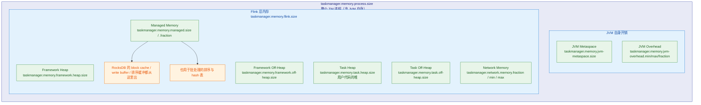
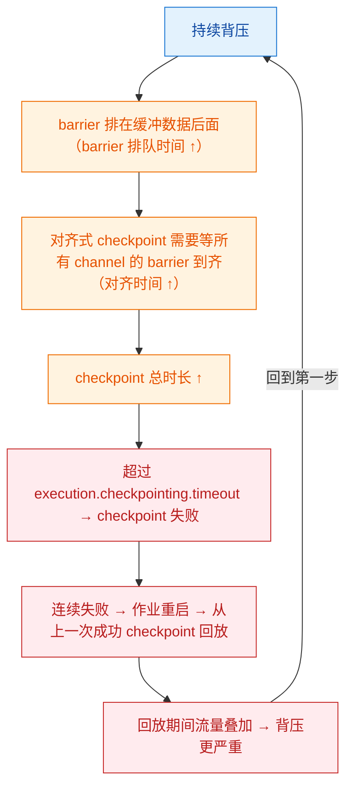

# 🚦 六、背压与性能调优

> 本篇回答四个问题：背压到底是什么，为什么它在流处理里是**常态而不是故障**？Flink 的 **Credit-based 流量控制**相比早期 TCP 反压精确在哪、为什么它不阻塞 checkpoint barrier？线上怎么靠指标把瓶颈**定位到具体某个算子**？以及从"能跑"到"跑得满"，调优该按什么顺序、动哪些参数？
> 前置阅读：[[1-架构与运行时]]、[[2-时间与窗口]]、[[3-状态管理]]。快照与恢复机制见 [[4-容错与ExactlyOnce]]、[[5-Checkpoint与Savepoint]]；内存与资源规划的落地（YARN/K8s、容器配额、JVM 参数）见 [[9-部署与运维]]；面试速答见 [[10-面试高频题]]。

---

## 一、背压是什么

### 1.1 一句话定义

**背压（Back Pressure）就是下游的处理速率小于上游的发送速率时，压力沿着数据流方向"反向"传导回上游的现象。**

Flink 作业是一条由算子组成的有向无环图（DAG），算子之间通过**有界缓冲区**（network buffer）传递数据。上游不可能无限往缓冲区里塞数据，所以一旦下游消费速度跟不上，缓冲区很快被填满，上游只能阻塞等待——这就是背压的产生机制。

```text
source ──► map ──► keyBy/aggregate ──► sink
  快        快          慢（瓶颈）       中
                          ▲
                    缓冲区被填满后，
                    压力反向传导到 map、再传到 source
```

### 1.2 为什么说背压是"正常现象"

这一点是面试里最容易被答错的。

| 认知 | 是否正确 | 说明 |
| --- | --- | --- |
| 背压 = 作业有故障 | ❌ | 流处理里上下游速率天然有波动，短时间的背压是系统在**自我保护**（不丢弃数据、不 OOM） |
| 背压 = 数据丢失 | ❌ | 背压恰恰意味着数据被**留在缓冲区/上游**而不是被丢掉，是"不丢"的代价 |
| 背压 = 需要立刻处理 | ⚠️ | 要看**持续性与幅度**：偶发抖动可以忽略；持续高位才是问题 |
| 持续背压 = 吞吐上限被卡住 | ✅ | 这是真正的危害所在：吞吐被最慢的算子锁死 |

**关键判据：背压的持续时间。** 因为 Flink 的端到端延迟由"最慢环节 + 缓冲深度"决定，只要滞留时间还在可接受范围内（比如延迟预算内），背压不构成问题。真正要报警的是**持续高背压**：

- **吞吐受限**：整条链路的吞吐被最慢算子锁死，加并行度也无效（如果瓶颈是单个 subtask 的倾斜）。
- **延迟升高**：数据在缓冲区里排队，端到端延迟随队列长度线性上升。
- **Checkpoint 变慢甚至失败**：checkpoint barrier 需要跟着数据流过同一条通道，通道被数据占满时 barrier 要排队；如果开启的是**对齐式 checkpoint**，还要等所有输入通道的 barrier 到齐（对齐），对齐时间会随着背压持续上升，最终超时失败。
- **内存与 OOM 风险**：网络缓冲一旦不够，压力会转成 GC 压力和堆内存占用。

> [!important] 一条能记住的因果关系
> **持续背压 → barrier 排队/对齐变慢 → checkpoint 时长上升 → checkpoint 失败或恢复变慢 → 作业重启回放数据 → 又产生新一轮背压。**
> 这就是"恶性循环"。后面第七节的 unaligned checkpoint 就是为了打断它。

### 1.3 背压的两种"位置"语义

理解背压必须分清"谁在背压"：

| 说法 | 含义 | 该做什么 |
| --- | --- | --- |
| "算子 A 有背压" | A 的**输出缓冲区**满了，A 想发发不出去 | 瓶颈在 A 的**下游** |
| "算子 A 的上游有背压" | 上游在等 A 消费 | 瓶颈在 A（或 A 的下游） |

所以排查口诀是：**从 Source 往后找第一个 `backPressured` 高的算子，它的下游就是瓶颈**；或者**从 Sink 往前找第一个 `busy` 饱和的算子，它就是瓶颈**。

---

## 二、Flink 背压机制演进：从 TCP 反压到 Credit-based

### 2.1 早期实现：基于 TCP 的阻塞式反压

Flink 1.5 之前，TaskManager 之间的数据传输走 Netty，反压靠**网络层的写阻塞**实现：

1. 下游接收端消费慢 → 下游的 Netty channel 不再从 socket 读数据 → TCP 接收窗口（`SO_RCVBUF`）被填满。
2. TCP 窗口为 0 后，上游的 socket **写操作阻塞**在 `write()` 上。
3. 上游 Netty 的写线程被卡住 → 上游的 ResultPartition 无法把数据交给 Netty → 上游的缓冲区逐步填满 → 上游算子阻塞 → 压力继续往上传递。

这条链条能工作，但有几个本质上无法回避的问题：

| 问题 | 具体表现 |
| --- | --- |
| **反压粒度粗** | 反压作用在**整个 TCP 连接**上，而一个连接里往往复用多个逻辑 channel（多个 subtask 的输出）。一个慢 subtask 会拖累同连接上其他健康的 subtask，造成"无辜受害者" |
| **反压不可量化** | 只知道"堵了"，不知道堵了多少、还有多少余量，无法提前预警 |
| **阻塞控制流** | **最关键的问题**。checkpoint barrier、Cancel 信号、`TaskManager` 之间的 RPC 都走同一条被阻塞的通道。反压严重时 barrier 根本发不出去，checkpoint 无限期卡住，甚至无法正常取消作业 |
| **依赖 TCP 参数** | 反压效果受操作系统 socket 缓冲区大小影响，跨机房、高带宽时延积（BDP）场景下表现不稳定 |
| **堆外与内存不可控** | 无法精确规划需要多少网络内存 |

> [!warning] 面试高频点
> "早期 Flink 用 TCP 反压有什么问题？" 标准答案就三句：**粒度是整个连接而不是单个 channel；反压强度不可观测；会阻塞 checkpoint barrier 和控制消息。**

### 2.2 Credit-based 流量控制（Flink 1.5+）

Flink 1.5 引入了 **credit-based flow control**（FLIP-31），把"反压"从"网络层被动阻塞"改成了"**应用层主动的、逐 channel 的信用额度管理**"。

核心思想：**接收端先向上游声明"我还能收几个 buffer"（credit），上游只有拿到 credit 才允许发送。** 于是：

- 反压不再表现为"线程被 socket 卡住"，而是表现为"**credit 用完了，上游主动不发**"。
- 上游算子不会真正阻塞在 IO 上，它只是发现"发不出去"，于是把数据留在自己的输出缓冲里，进而阻塞自己的业务线程——**这正是我们想要的背压，而且它是可观测、可计量的**。
- 因为是**按 InputChannel 逐个记账**，一个慢 subtask 只会耗尽它自己那条 channel 的 credit，不会再拖累同连接上的其他 channel。

### 2.3 credit 的收发机制详解

先明确几个角色：

| 角色 | 位置 | 职责 |
| --- | --- | --- |
| `ResultPartition` / `ResultSubpartition` | 上游 TaskManager | 按 subpartition（对应一个下游 channel）缓存待发数据，**只有拿到 credit 才发** |
| `InputGate` / `InputChannel` | 下游 TaskManager | 从网络收数据，消费后**归还 credit** |
| `RemoteInputChannel` | 下游 | 维护"本地可用缓冲数 + 已收到的 backlog 信息"，负责发送 credit |
| Netty | 传输层 | 只负责搬运，**不再承担反压职责** |

一次完整的 credit 循环长这样：

```text
① 下游 RemoteInputChannel 初始化时，向上游声明 credit = 可用 buffer 数
   （由 taskmanager.network.memory.buffers-per-channel + floating 池决定）

② 上游 ResultSubpartition 收到 credit，记账 remainingCredit += n

③ 上游有数据要发时：
   - remainingCredit > 0  → 取一个 buffer 发出去，remainingCredit--
   - remainingCredit == 0 → 挂起（不发），数据留在 subpartition 队列里
                            → 上游业务线程被自己的输出缓冲顶住 → 背压形成

④ 下游消费掉一个 buffer，缓冲区空出来 → 归还 credit = 1
   上游收到后再发一个 —— 形成"滑动窗口"式的稳定流水线
```

**三个关键细节：**

1. **Backlog 通告（backlog announcement）**。上游不只记 credit，还会在首次有积压时"通告"一个 backlog 大小（以字节计），让下游知道上游堆了多少数据，配合反压指标判断。
2. **floating buffer（浮动缓冲）**。每个 channel 有几块"专属"buffer（`buffers-per-channel`），此外每个 InputGate 还有一池"公用"buffer（`floating-buffers-per-gate`）。当某个 channel 突然变快、专属 buffer 不够用时，可以从公用池里借，用完归还。**浮动缓冲的作用就是吸收数据倾斜和突发流量**，避免某条 channel 饿死或反复停顿。
3. **本地通道不走 credit**。同一个 TaskManager 内的 pipelined 交换（`local` channel）走的是直接内存交接，不需要网络也不需要 credit，背压直接通过引用计数和本地缓冲传递。所以**在同一个 TM 内的两个算子之间看背压指标，语义和跨 TM 不完全一样**——排查时要注意 `numBytesInLocalPerSecond` 与 `numBytesInRemotePerSecond` 的占比。

### 2.4 为什么 credit 机制不会阻塞控制流

这是 credit 机制最重要的收益，也是面试的加分点。

| 事件类型 | 走什么通道 | credit 耗尽时是否受影响 |
| --- | --- | --- |
| 业务数据 | 数据通道（受 credit 约束） | **受影响**，只能排队等待 credit |
| **Checkpoint barrier** | 数据通道，但**带优先级**，且不占 credit 的常规队列 | **不受 credit 阻塞**：barrier 会被优先插入并发送 |
| Cancel / Task 状态变更 | RPC 控制通道 | 不受影响 |
| 心跳、心跳超时检测 | RPC 控制通道 | 不受影响 |

需要说清楚的是：barrier 依然要在**数据之后**流过同一个 channel（这正是"对齐"的来源），所以它不会因为 credit 而**发不出去**（内嵌在数据流里发送），但它仍然会**排在已缓冲的数据后面**，这就是**barrier 排队时间**。所以：

- credit 机制解决了"**barrier 发不出去**"（早期 TCP 反压的死锁问题）；
- 但没有解决"**barrier 要排队**"（这是 unaligned checkpoint 要解决的，见第七节）。

> [!tip] 术语对齐
> 面试里把这两句话分开说，会立刻显得"真的调过优"：
> "credit 解决的是控制流可用性，unaligned checkpoint 解决的是 barrier 排队延迟。两者不是一回事。"

### 2.5 网络内存参数：含义与调优方向

这些参数几乎全在 `taskmanager.network.memory.*` 命名空间下。

| 参数 | 含义 | 调大 | 调小 |
| --- | --- | --- | --- |
| `taskmanager.network.memory.fraction` | 网络内存占 **Flink 总内存**的比例（与 min/max 共同决定最终值） | 高吞吐、多 channel 场景 | 把内存让给 managed（RocksDB）或 heap |
| `taskmanager.network.memory.min` / `.max` | 网络内存的上下界（覆盖 fraction 的计算结果） | 同上 | 同上 |
| `taskmanager.network.memory.buffers-per-channel` | **每条远端 channel 的专属 buffer 数** | 提高单通道的在途数据量，改善高带宽/高时延（跨机房）链路吞吐 | 省内存，但高 BDP 链路上吞吐上不去 |
| `taskmanager.network.memory.floating-buffers-per-gate` | **每个 InputGate 的公用浮动 buffer 数** | **抗倾斜、抗突发**的首选；channel 数很多时尤其重要 | 省内存，但倾斜时容易反复停顿 |
| `taskmanager.network.memory.buffer-debloat.enabled` | 是否启用**缓冲自动瘦身**：按目标时间动态调整可发送的缓冲上限 | —— | —— |
| `taskmanager.network.memory.buffer-debloat.target` | 期望的"数据在缓冲里停留多久"，用于反推应该允许多少在途 buffer | 容忍更大延迟换吞吐 | 更小延迟（有利于缩短对齐时间） |
| `taskmanager.network.memory.buffer-debloat.latency` / `.period` / `.samples` | 采样窗口与调整节奏 | 调整更平滑 | 反应更快但可能抖动 |
| `taskmanager.network.memory.read-buffer.required-memory` / `taskmanager.network.memory.max-overdraft-buffers-per-gate` | 收数据时的透支缓冲，防止大数据量下的读阻塞 | 大 record、高突发场景 | 省内存 |

**调优方向总结（不用记死数字，记住方向）：**

- **channel 数多（并行度高）→ 网络内存总量必须跟着涨**。因为每条 channel 都要占专属 buffer，`并行度 × channel 数 × buffer 大小` 是硬需求，否则作业连"申请缓冲"都会失败或退化到极少缓冲、吞吐极差。
- **每个 TaskManager 上的 slot 数越多，网络内存越紧张**：slot 共享让多个算子链共享一个 TM 的网络内存池。
- **`buffers-per-channel` 管"单通道的深度"，`floating-buffers-per-gate` 管"分配弹性"**。吞吐上不去且 `numBytesInRemotePerSecond` 很低、背压显示在 channel 层面断续时，先加浮动缓冲。
- **buffer debloat 是"用延迟换 checkpoint 友好度"的工具**：它把在途缓冲控制在一个小目标时长内，能显著降低对齐时间，代价是极端吞吐下可能略微受限。

> [!note] 版本差异提醒
> 网络内存相关参数的**默认值在版本间多次调整过**（buffer 大小从 32KB 降到 16KB、floating buffer 的默认值在 1.15 前后也有变化）。所以**不要背默认值**，要背"这个参数控制什么、往哪个方向调"。

---

## 三、如何检测背压

### 3.1 Web UI 的 BackPressure 页签

在 Flink Web UI 里，Job → 某个算子 → **BackPressure** 页签，会看到每个 subtask 的状态：`OK` / `LOW` / `HIGH`。

**两代实现，必须分清楚：**

| 版本 | 原理 | 特点 |
| --- | --- | --- |
| Flink < 1.13 | **线程栈采样**：JobManager 通过 `Task.isBackPressed()`，周期性地对 task 线程做栈采样（约每 50ms 一次，采 1 秒以上），统计"采样点落在输出阻塞上"的比例 | 有采样开销；只能给出粗略比例；采样本身会干扰线上 |
| **Flink ≥ 1.13** | **基于指标**：Samza 风格的 `backPressuredTimeMsPerSecond` 指标直接给出"每秒被背压的毫秒数"，UI 直接读指标渲染 | 零额外采样开销、可持续观测、适合做监控告警 |

三种状态的近似语义（**阈值随版本可能微调，不要背数字**）：

| 状态 | 含义 | 动作 |
| --- | --- | --- |
| `OK` | 该 subtask 几乎没有因输出受阻而等待 | 观察即可 |
| `LOW` | 部分时间被阻塞，仍在推进 | 关注趋势，看是否随流量上升而恶化 |
| `HIGH` | 大部分时间都在等下游 | **这基本就是"瓶颈在下游"的确定性信号** |

> [!tip] 最实用的读法
> 不要只看 OK/LOW/HIGH，直接看 **`backPressuredTimeMsPerSecond` 的绝对值**：它的量纲是"毫秒/秒"，最大值 1000。**接近 1000 就意味着这个算子几乎全程在等下游**，非常直观。

### 3.2 关键指标表

以下指标大多在 **Task / Operator 级别**（同一个算子有多个 subtask，指标按 subtask 打散，这正是看倾斜的关键）。

| 指标 | 含义 | "不健康"长什么样 |
| --- | --- | --- |
| `backPressuredTimeMsPerSecond` | 该 subtask **每秒因输出受阻而等待**的毫秒数 | 接近 1000 且持续 → 下游是瓶颈 |
| `idleTimeMsPerSecond` | 每秒**既没有数据可处理、也没有被背压**的空转时间 | 接近 1000 → **上游供给不足**（上游慢/并行度不匹配/source 限速） |
| `busyTimeMsPerSecond` | 每秒**真正在算/在写**的时间 | 接近 1000 且吞吐上不去 → 该算子自身是计算瓶颈（CPU 热点、序列化、状态访问、外部调用） |
| `numRecordsInPerSecond` | 该算子的输入速率 | 上游算子 out 远大于下游 in → 存在背压积压 |
| `numRecordsOutPerSecond` | 该算子的输出速率 | 上游 out 远大于下游 in → 同上 |
| `numBytesInLocalPerSecond` / `numBytesInRemotePerSecond` | 本地/远端输入字节数 | remote 占比极高且网络内存紧张 → 需要看网络缓冲配置 |
| `numBytesOutPerSecond` | 输出字节数 | 结合 records 算平均 record 大小，判断序列化与缓冲压力 |
| `mailboxLatencyMs` / mailbox 队列长度类指标 | **Mailbox 的执行延迟与排队长度**（较新版本开始暴露）。Mailbox 是 Flink 单线程任务模型里统一调度"处理数据 / 处理事件 / 触发 checkpoint"的机制 | 延迟高、队列长 → 主线程被业务处理占满，checkpoint 触发、timer 触发、事件处理都在排队，是"**看起来不背压但 checkpoint 就是慢**"的典型原因 |
| `checkpointAlignmentTime`（对齐时间） | 算子等待所有输入 channel 的 barrier 到齐所花的时间 | 随背压持续上升 → 典型"背压拖慢 checkpoint"症状 |
| `checkpointStartDelay` | 从 JobManager 触发 checkpoint 到该算子真正开始做快照的延迟 | 持续变大 → 上游积压/主线程忙，checkpoint 长期排不上队 |
| `currentInputWatermark` | 当前输入水位（毫秒时间戳） | **多个 subtask 之间水位差距大 → 某个 partition 无数据（idle）在拖住水位**，窗口迟迟不触发，看起来像"卡住"但其实是 watermark 问题 |
| `lastCheckpointDuration` / `lastCheckpointSize` | 最近一次 checkpoint 的耗时/大小 | 时长上升而业务流量没变 → 状态变大或对齐被拖慢 |
| `numRecordsIn` 各 subtask 分布 | 单个算子各 subtask 的处理量 | **分布严重不均 = 数据倾斜**，这是最常见的"单点瓶颈" |

> [!warning] 一个常见误判
> `idleTimeMsPerSecond` 高不代表"这个算子闲"，而代表**它没有数据可做**——所以它是在**等上游**。看到一个算子在背压、它的上游在 idle，说明瓶颈就在中间那个算子上。反之，如果某算子 idle 很高、它下游也在背压，那瓶颈更靠下。

### 3.3 用指标定位瓶颈算子：两个方向

```text
方向 A（推荐，找"背压的起点"）：
    Source → ... → 找到第一个 backPressuredTimeMsPerSecond 明显升高的算子 X
    ⇒ 瓶颈 = X 的下游

方向 B（找"忙不过来的人"）：
    Sink → ... 往前找第一个 busyTimeMsPerSecond 接近饱和 且 numRecordsOut 明显低于 numRecordsIn 的算子
    ⇒ 瓶颈 = 该算子自己
```

再加一条交叉验证：**看 `numRecordsInPerSecond` 的 subtask 分布**。如果某个 subtask 的输入量是其他 subtask 的十几倍，那瓶颈根本不是"算子慢"，而是**数据倾斜**，此时加并行度只会浪费资源。

---

## 四、找瓶颈的系统方法（六步）

不要一上来就猜。按下面顺序走，通常 15 分钟内能定位。

| 步骤 | 看什么 | 结论 |
| --- | --- | --- |
| ① Web UI 逐算子看背压与吞吐 | BackPressure 页签 + 各算子 Records In/Out | 圈定候选瓶颈算子范围 |
| ② 看 busy/idle 分布 | `busyTimeMsPerSecond` / `idleTimeMsPerSecond` | 区分"自己忙不过来"（busy 高）还是"上游喂不饱"（idle 高） |
| ③ 看数据倾斜 | 同一算子各 subtask 的 `numRecordsInPerSecond` 对比 | 若严重不均 → 先解决倾斜，再谈别的 |
| ④ Profiling / 火焰图 / JFR | 对瓶颈 TaskManager 采样 CPU | 找到具体热点方法：序列化、正则、JSON 解析、状态读写、锁竞争 |
| ⑤ 看 GC 日志 | Full GC 次数与停顿时间（`-Xlog:gc*`） | 频繁 Full GC / 长停顿 → 内存配置或状态后端问题 |
| ⑥ 看 checkpoint 时长与对齐时间 | `lastCheckpointDuration`、`checkpointAlignmentTime`、`checkpointStartDelay` | 若对齐时间占大头 → barrier 被数据堵住；若同步阶段占大头 → 状态太大或磁盘慢 |

> [!tip] 关于火焰图
> Flink 的瓶颈常常"看不见"在业务代码里，而在**框架侧**：Kryo 序列化、`ObjectOutputStream` 的反射、`String` 的频繁拼接、HashMap 扩容、日志同步写。火焰图能把这类问题直接暴露出来，比逐个加日志快得多。

---

## 五、常见瓶颈与解法

| 现象 | 可能原因 | 解决方向 |
| --- | --- | --- |
| 某算子各 subtask 输入量差异巨大（十几倍） | **数据倾斜**：key 分布不均；或 source 的分区本身不均 | ① **两阶段聚合**（先局部聚合再加盐打散，SQL 里对应 `table.optimizer.agg-phase-strategy=TWO_PHASE`）② **加盐**（给热点 key 拼随机前缀，聚合后去掉）③ **预聚合**（把聚合尽量前移到 source 附近，减少 shuffle 量）④ 极端热点 key 单独打到一个独立处理链路 |
| 状态大、RocksDB 读写慢、checkpoint 同步阶段耗时长 | **大状态 + RocksDB 性能** | ① 加大 **managed memory**（RocksDB 的 block cache / write buffer 从 managed 内存分配）② 开启**增量 checkpoint**（`EmbeddedRocksDBStateBackend(true)` / `state.backend.incremental=true`）③ 调 block 与 write buffer 相关参数（`state.backend.rocksdb.block.*`、`state.backend.rocksdb.writebuffer.*`）④ 检查 compaction 策略是否放大写放大 ⑤ 减小状态本身（设 TTL、用更紧凑的序列化） |
| Full GC 频繁、停顿几百毫秒到数秒 | **堆内存配置不当 / 对象创建过多** | ① **优先换 RocksDB 状态后端**，把状态移出堆（Heap state backend 的大状态是 GC 灾难的根源）② 调整内存比例（heap 与 managed 的分配，见第六节）③ 减少短命对象：避免在 `map` 里反复 new、避免 Kryo、避免字符串拼接 ④ 换 G1/ZGC 并给足堆 |
| 算子 busy 高但逻辑很简单 | **外部系统慢**：同步查库、同步调 HTTP、写外部存储 | ① **异步 IO**（`AsyncDataStream`，见第八节）② SQL 维表用 **Lookup Join + 缓存** ③ 批量写（`sink.buffer-flush.max-rows`）④ 连接池与超时配置 ⑤ 对下游**限流**，避免把外部系统打死 |
| CPU 高但吞吐低 | **序列化开销** | ① 避免 Kryo（它需要运行时代码生成并大量反射），改用 **POJO**（public 类 + public 无参构造 + public 字段/getter-setter）或 Avro/Protobuf ② 减少 `String` ↔ `byte[]` 的反复转换 ③ 用 `TypeInformation` 显式声明类型 |
| 高并行度下吞吐上不去、网络内存报错或缓冲极少 | **网络缓冲不足** | 加大 `taskmanager.network.memory.fraction` 或 min/max；提高 `floating-buffers-per-gate`；检查 channel 数是否远超预期（每个下游 subtask 都是一条 channel） |
| 部分 subtask 背压高、部分空闲 | **算子链与并行度不合理** | ① 调整并行度（见第六节）② 用 `slotSharingGroup` 把重算子与大状态算子拆开 ③ 必要时 `disableChaining` 让热点算子独立占用 slot |

> [!danger] 反模式
> **"看到背压就把并行度调大"** 是最常见、也最危险的错误操作。如果瓶颈是倾斜、是外部系统、是 GC，加并行度只会：资源翻倍、外部系统被打得更死、倾斜比例不变。**先定位，再动手。**

---

## 六、并行度与资源调优

### 6.1 并行度设置原则

| 环节 | 原则 |
| --- | --- |
| **Source（Kafka）** | 并行度最好**不超过 topic 分区数**（超过就有一部分 subtask 分不到分区、纯属浪费 slot）。分区数不均是倾斜的源头之一 |
| **中间算子** | 与上下游匹配即可，不要盲目设置很大；`keyBy` 之后是**按 key 分区**，并行度变化会改变 key 的落点，但不会改变倾斜 |
| **Sink** | **并行度必须与下游写入能力匹配**。JDBC sink 并行度 64 打一个 MySQL，等于自杀。要么降低并行度，要么改成 Doris/StarRocks 这类支持高并发导入的存储 |
| **整作业** | 参考：`max(单算子所需并行度)` 与 `TM 数 × 每 TM slot 数` 的关系；并行度最好能整除（如 12 = 3 TM × 4 slot），避免 slot 浪费 |

设置方式：

```java
StreamExecutionEnvironment env = StreamExecutionEnvironment.getExecutionEnvironment();

// 作业级默认并行度
env.setParallelism(8);
env.setMaxParallelism(1024); // 影响 key group 数量与最大可扩容并行度，改这个基本要求重跑状态

DataStream<String> stream = env
        .addSource(kafkaSource)
        .name("kafka-source")
        .setParallelism(4)          // 与 topic 分区数对齐
        .map(new ParseJson())
        .setParallelism(8)          // 解析是 CPU 密集，给多一点
        .keyBy(Order::getUserId)
        .window(TumblingEventTimeWindows.of(Time.minutes(1)))
        .aggregate(new OrderAgg())
        .setParallelism(16)         // 聚合是瓶颈，给最多
        .addSink(jdbcSink)
        .setParallelism(4);         // 外部系统能力有限，压回来
```

> [!warning] `setMaxParallelism` 的代价
> `maxParallelism` 决定了 key group 的划分。**作业上线后修改它会强制无法从 savepoint 恢复**（key 到 key group 的映射变了）。所以要么一开始就定好，要么用默认值（默认由并行度推导，有上限）。

### 6.2 算子链（Operator Chaining）的收益与代价

**默认行为**：Flink 会把满足条件的相邻算子**串到同一个线程（同一个 subtask）**里执行，称为算子链。

| 收益 | 代价 |
| --- | --- |
| 数据在链内以方法调用/对象引用的方式传递，**免除序列化与网络传输** | 链内所有算子共享**一个线程**，任何一个慢都会拖住整条链 |
| 减少线程数与缓冲开销 | 链内无法单独调并行度（链的并行度由链首决定） |
| 减少 shuffle 次数 | **背压不可细分**：整条链一起显示背压，定位更困难 |
| 减少 checkpoint 的对齐次数（链内不涉及 barrier 对齐） | 一个算子抛异常，整条链重启（这通常可接受） |

三种控制手段：

```java
DataStream<Order> s = env.addSource(source)
        // ① 让这个算子开启一条新链，不与前面串在一起
        .map(new ParseJson()).startNewChain()
        .keyBy(Order::getUserId)
        .window(...).aggregate(...)
        // ② 让这个算子完全不参与任何链，独占线程
        .process(new HeavyProcessFunction()).disableChaining()
        // ③ 把算子放到独立的 slotSharingGroup，独占 slot 资源
        .slotSharingGroup("heavy");

// 全局关闭链（调试用；线上一般不开）
env.disableOperatorChaining();
```

**使用场景速查：**

| 场景 | 手段 |
| --- | --- |
| 想给某个算子单独设置更高并行度 | `startNewChain()` 或 `disableChaining()`，否则被链首并行度绑死 |
| 某个算子很重（大状态、同步阻塞、CPU 密集），不想影响邻居 | `disableChaining()` + 视情况 `slotSharingGroup` |
| 想精确测量某个算子的吞吐/背压 | 临时 `disableChaining()` 做压测，定位后复原 |
| 想把重算子与大状态算子隔离到不同 TM | `slotSharingGroup("group-a")` / `"group-b"`（注意：不同 group 的算子**不会**被分到同一 slot，会占用更多 slot） |
| 调试期看数据流经情况 | `env.disableOperatorChaining()`（会显著降低性能，别带上线） |

### 6.3 slot 与 slot sharing

- 一个 **slot** 是 TaskManager 上的资源切分单位，默认一个 TM 的 slot 数 = CPU 核数（`taskmanager.numberOfTaskSlots`）。
- **slot sharing（默认开启）**：同一个 slot 里可以放**同一个 slotSharingGroup 内、不同算子的 subtask 各一个**。好处是关键路径上的算子同 slot 共存，负载互补（一个算子在 CPU 忙，另一个在 IO 等待），并且一条完整的 pipeline 可以被塞进少量 slot，避免"每个算子都要 N 个 slot"的资源爆炸。
- `slotSharingGroup` 是"隔离"手段：把算子分成不同组后，**不同组的算子不能共享 slot**，等于强制资源隔离。代价是总 slot 需求增加。

> [!note] slot 数的经验判断
> 总 slot 需求 ≈ Σ(每个 slotSharingGroup 的最大算子并行度)。如果这个值大于 `TM 数 × 每 TM slot 数`，作业会一直处于 `CREATED` 等不到资源，或者部分 subtask 无法调度。

### 6.4 TaskManager 内存模型概览

Flink 1.10 之后采用**统一内存模型**，`taskmanager.memory.process.size` 是总盘子，向下逐层切分：



| 关注点 | 参数 | 调优方向 |
| --- | --- | --- |
| 总内存不够（容器被 OOMKill） | `taskmanager.memory.process.size` | 直接调大，并用容器 limit 匹配 |
| 用户代码 OOM（`java.lang.OutOfMemoryError: Java heap space`） | `taskmanager.memory.task.heap.size` | 调大堆；但更该做的是**把状态搬到 RocksDB**，不要让堆承担状态 |
| RocksDB 慢、block cache miss 高 | `taskmanager.memory.managed.size` 或 `.fraction` | 调大 managed memory；同时确认没有把 managed 设成 0 |
| 网络吞吐上不去、缓冲报错 | `taskmanager.network.memory.*` | 见 2.5 节 |
| 频繁 Full GC | `taskmanager.memory.task.heap.size` + 状态后端选择 | 换 RocksDB，缩小堆，让 GC 处理小堆 |
| 直接内存不足（`Direct buffer memory`） | framework/task off-heap + 网络内存 | 检查 `-XX:MaxDirectMemorySize` 与 Flink 计算出的值是否一致 |

> [!important] 一个常见反直觉结论
> **"把堆调大"经常让 GC 更糟。** 大堆 + 大状态 = 每次 Full GC 都要扫描海量对象，停顿从几十毫秒变成几秒。正确做法是**把状态从堆里挪到 RocksDB（managed memory）**，让堆只装用户代码的临时对象，这样堆可以小、GC 可以快。具体的内存与集群资源配置落地（YARN/K8s、`flink-conf.yaml`、容器 quota）见 [[9-部署与运维]]。

---

## 七、Checkpoint 调优（与背压的相互影响）

### 7.1 恶性循环是怎么形成的



### 7.2 相关参数与调优方向

| 参数 | 作用 | 调优方向与副作用 |
| --- | --- | --- |
| `execution.checkpointing.interval` | checkpoint 触发间隔 | 调小 → 恢复回放量小、但每次 checkpoint 的开销占比升高，可能加剧背压；调大 → 开销小、但恢复时间长、sink 事务持有时间更长（**与 Kafka 事务超时必须匹配**，见 [[11-端到端一致性]]） |
| `execution.checkpointing.timeout` | 单次 checkpoint 超时 | 大状态/慢存储场景需要调大；调太大 → 真失败时发现得晚 |
| `execution.checkpointing.min-pause` | 两次 checkpoint 之间的最小间隔 | 给业务留"呼吸时间"，防止 checkpoint 一个接一个把吞吐吃掉；**是缓解"checkpoint 拖垮吞吐"的首选参数** |
| `execution.checkpointing.max-concurrent-checkpoints` | 允许同时进行几个 checkpoint | 设为 1 更稳（避免多个 checkpoint 互相抢 IO、也避免事务交叉）；大状态 + 慢存储时保持 1 |
| `execution.checkpointing.mode` | `EXACTLY_ONCE` / `AT_LEAST_ONCE` | `AT_LEAST_ONCE` **不做对齐**，能显著降低 checkpoint 时长，但恢复时可能重复处理；若下游幂等可以接受 |
| `execution.checkpointing.unaligned` | 开启**非对齐 checkpoint** | 见 7.3 |
| `execution.checkpointing.tolerable-failed-checkpoints` | 容忍多少次连续失败才失败作业 | 适当放宽可避免"偶发超时就重启"；但**放弃了对恢复时间的控制** |
| `state.backend.incremental` | RocksDB 增量 checkpoint | 大状态必开：只上传变化的 SST 文件，checkpoint 大小与时长大幅下降 |
| `execution.checkpointing.externalized-checkpoint-retention` | 取消作业时是否保留 checkpoint | 生产上通常 `RETAIN_ON_CANCELLATION`，便于排查与恢复 |
| `restart-strategy.type` | 重启策略（`fixed-delay` / `exponential-delay` / `failure-rate` / `none`） | 背压导致的失败往往是"环境性的"，用 `exponential-delay` 给外部系统恢复时间，比 `fixed-delay` 反复冲击更友好 |

配置示例（可以在代码里，也可以放 `flink-conf.yaml`）：

```java
StreamExecutionEnvironment env = StreamExecutionEnvironment.getExecutionEnvironment();

// 每 3 分钟一次，且两次之间至少间隔 1 分钟
env.enableCheckpointing(3 * 60 * 1000, CheckpointingMode.EXACTLY_ONCE);

CheckpointConfig cp = env.getCheckpointConfig();
cp.setCheckpointTimeout(10 * 60 * 1000L);          // 超时 10 分钟
cp.setMinPauseBetweenCheckpoints(60 * 1000L);      // 最小间隔 1 分钟，别把吞吐吃光
cp.setMaxConcurrentCheckpoints(1);                 // 串行做，稳
cp.setTolerableCheckpointFailureNumber(3);         // 容忍 3 次失败
cp.enableExternalizedCheckpoints(
        CheckpointConfig.ExternalizedCheckpointCleanup.RETAIN_ON_CANCELLATION);

// RocksDB 状态后端 + 增量 checkpoint
env.setStateBackend(new EmbeddedRocksDBStateBackend(true));

// 持续背压下的破局手段：非对齐 checkpoint
cp.enableUnalignedCheckpoints();
cp.setAlignedCheckpointTimeout(Duration.ofMinutes(1)); // 对齐超过 1 分钟就退化为非对齐

// 重启策略：指数退避，避免反复冲击外部系统
env.setRestartStrategy(RestartStrategies.exponentialDelayRestart(
        Time.seconds(1), Time.minutes(5), 2.0, Time.minutes(5), 0.1));
```

对应的 `flink-conf.yaml` 键：

```yaml
execution.checkpointing.interval: 3min
execution.checkpointing.timeout: 10min
execution.checkpointing.min-pause: 1min
execution.checkpointing.max-concurrent-checkpoints: 1
execution.checkpointing.mode: EXACTLY_ONCE
execution.checkpointing.unaligned: true
execution.checkpointing.tolerable-failed-checkpoints: 3
state.backend: rocksdb
state.backend.incremental: true
restart-strategy.type: exponential-delay
restart-strategy.exponential-delay.initial-backoff: 1s
restart-strategy.exponential-delay.max-backoff: 5min
restart-strategy.exponential-delay.backoff-multiplier: 2.0
restart-strategy.exponential-delay.reset-backoff-threshold: 5min
```

### 7.3 Unaligned Checkpoint：打破恶性循环

**问题根源**：对齐式 checkpoint 要求算子"等所有输入通道的 barrier 到齐"。背压时数据排在 barrier 前面，等待时间无上限。

**非对齐 checkpoint 的做法**：算子**不等对齐**，收到第一个 barrier 就立即做快照，同时**把还没处理完的在途数据（in-flight data）也一起写进 checkpoint**。这样：

| 对比项 | 对齐式（Aligned） | 非对齐（Unaligned） |
| --- | --- | --- |
| 是否等待对齐 | 必须等所有 channel 的 barrier | **不等**，第一个 barrier 即开始 |
| barrier 排队的影响 | 直接拉长 checkpoint 时长 | **几乎消除**（时长与背压基本解耦） |
| checkpoint 大小 | 只含状态 | 状态 + 在途数据，**明显更大** |
| 对吞吐的影响 | 对齐期间上游缓冲数据（不阻塞处理） | 需要把在途数据落盘，可能增加 IO |
| 适用场景 | 无持续背压、状态不大的作业 | **持续背压 + 状态较大** 的作业 |
| 不适合 | 慢存储、网络带宽紧张 | checkpoint 存储带宽不足时反而更糟 |

```java
CheckpointConfig cp = env.getCheckpointConfig();
cp.enableUnalignedCheckpoints();
// 过渡模式：先按对齐式做，对齐超过阈值再退化成非对齐
cp.setAlignedCheckpointTimeout(Duration.ofMinutes(1));
cp.setMaxConcurrentCheckpoints(1); // 非对齐 checkpoint 通常仍建议串行
```

> [!warning] 别把非对齐 checkpoint 当万能药
> 它把"checkpoint 时长"问题转化成"checkpoint 体积与存储带宽"问题。如果 checkpoint 目标存储（HDFS/对象存储）本来就慢，**开启后可能更糟**。正确顺序是：**先解决背压本身（倾斜/GC/外部系统），再考虑 unaligned。**

---

## 八、异步 IO（Async I/O）

### 8.1 为什么需要它

同步的 `MapFunction` / `RichMapFunction` 里做一次外部调用（查维表、调 HTTP、查 HBase），流程是：

```text
读一条 → 发请求 → 线程阻塞等待响应 → 拿到结果 → 读下一条
```

在等待期间，**这个 subtask 的线程什么也干不了**，吞吐 = `并行度 / 单次调用平均耗时`。想让吞吐上去只能无限加并行度，而外部系统又撑不住。

`AsyncDataStream` 的做法是：**一条记录发出请求后立刻返回，等回调回来再输出**，一个 subtask 里可以同时有 `capacity` 个在途请求。吞吐从"受 RTT 限制"变成"受 capacity 与外部系统能力限制"。

### 8.2 orderedWait vs unorderedWait

| 方式 | 语义 | 吞吐 | 适用 |
| --- | --- | --- | --- |
| `AsyncDataStream.orderedWait(...)` | **保持输入顺序**（同一 watermark 区间内的记录按原序输出） | 较低（需要缓冲与排序） | 对顺序敏感：写入需要按序覆盖、下游依赖顺序 |
| `AsyncDataStream.unorderedWait(...)` | **不保证顺序**，谁先返回谁先输出 | **更高** | 大多数"维表补全""调用外部接口"场景；下游幂等或无顺序要求 |

注意：即使是 `unorderedWait`，**watermark 之间的顺序仍不会被跨越**——Flink 只在同一个 watermark 区间内允许乱序，这样不会破坏时间语义。

### 8.3 代码骨架

```java
public class AsyncDimLookup extends RichAsyncFunction<Order, EnrichedOrder> {

    private transient HikariDataSource dataSource;
    private transient ExecutorService executor;

    @Override
    public void open(Configuration parameters) throws Exception {
        // 连接池必须是 transient 且延迟初始化：它不能被序列化进算子
        dataSource = new HikariDataSource();
        dataSource.setJdbcUrl("jdbc:mysql://dim-host:3306/dim");
        dataSource.setUsername("user");
        dataSource.setPassword("pwd");
        dataSource.setMaximumPoolSize(20);
        executor = Executors.newFixedThreadPool(20);
    }

    @Override
    public void asyncInvoke(Order order, ResultFuture<EnrichedOrder> resultFuture) {
        // 提交到线程池，立刻返回；不要在这里阻塞
        CompletableFuture
                .supplyAsync(() -> queryUserName(order.getUserId()), executor)
                .thenAccept(name ->
                        resultFuture.complete(
                                Collections.singleton(new EnrichedOrder(order, name))))
                .exceptionally(ex -> {
                    // 失败也要 complete，否则会一直挂到超时
                    resultFuture.complete(Collections.emptyList());
                    return null;
                });
    }

    private String queryUserName(long userId) {
        try (Connection conn = dataSource.getConnection();
             PreparedStatement ps = conn.prepareStatement(
                     "select user_name from dim_user where user_id = ?")) {
            ps.setLong(1, userId);
            ps.setQueryTimeout(3);
            try (ResultSet rs = ps.executeQuery()) {
                return rs.next() ? rs.getString(1) : null;
            }
        } catch (SQLException e) {
            throw new RuntimeException(e);
        }
    }

    @Override
    public void close() throws Exception {
        if (dataSource != null) dataSource.close();
        if (executor != null) executor.shutdown();
    }
}
```

接入主流程：

```java
DataStream<Order> orders = ...;

DataStream<EnrichedOrder> enriched = AsyncDataStream.unorderedWait(
        orders,
        new AsyncDimLookup(),
        3000,                      // 单条请求的超时时间
        TimeUnit.MILLISECONDS,
        100,                       // capacity：同时最多 100 个在途请求
        AsyncDataStream.OutputMode.UNORDERED);

// 若要保序：
DataStream<EnrichedOrder> ordered = AsyncDataStream.orderedWait(
        orders, new AsyncDimLookup(), 3000, TimeUnit.MILLISECONDS, 100);
```

**参数含义与调优：**

| 参数 | 含义 | 调优方向 |
| --- | --- | --- |
| `timeout` | 单条记录等待结果的超时时间 | 大于外部系统 P99 延迟；超时记录默认被丢弃或抛异常，需要显式处理 |
| `capacity` | 一个 subtask 内允许的在途请求数 | **不是越大越好**：它就是外部系统的并发压力上限，应该按外部系统承载力与连接池大小反推 |
| `OutputMode` | `ORDERED` / `UNORDERED` | 见 8.2 |

> [!danger] 三个必踩的坑
> 1. **在 `asyncInvoke` 里做阻塞调用**——等于白用异步 IO，线程池会被占满。
> 2. **忘记在异常分支调用 `resultFuture.complete(...)`**——那条记录会一直挂在超时队列里，最终以超时告终。
> 3. **`capacity` 开得比连接池大**——请求全排在连接池外，实际并发上不去还增加了内存占用。

---

## 九、调优清单：从 0 开始调一个作业的顺序

调优必须**先正确、再快、再找瓶颈**。顺序错了会白干。

| 阶段 | 目标 | 检查/动作 |
| --- | --- | --- |
| **第 0 步：正确性** | 语义不出错 | ① watermark 定义正确、`table.exec.source.idle-timeout` 已设置（避免空闲分区拖住水位）② 状态 TTL 已设置（双流 join / 去重必设）③ checkpoint 开关、间隔、超时、外部化 ④ 端到端一致性方案已确定（见 [[11-端到端一致性]]） |
| **第 1 步：基线** | 知道"现在多快" | 压测出当前吞吐与延迟；记录 checkpoint 时长与大小；记录各算子并行度与 slot 数 |
| **第 2 步：并行度与资源** | 别浪费也别饿着 | ① Source 并行度 ≤ Kafka 分区数 ② Sink 并行度 ≤ 下游承载能力 ③ slot 数与并行度整除 ④ 内存按 6.4 分配（大状态 → 加大 managed） |
| **第 3 步：算子链与隔离** | 热点算子不被拖累 | 重算子 `disableChaining()`；必要时 `slotSharingGroup` 隔离；用 `startNewChain()` 单独调并行度 |
| **第 4 步：状态与 checkpoint** | 快照不再拖垮业务 | 大状态开 RocksDB + 增量；设 `min-pause`；持续背压时评估 unaligned |
| **第 5 步：找瓶颈** | 定位到具体算子/方法 | 走第四节六步法：背压 → busy/idle → 倾斜 → 火焰图 → GC → checkpoint 分解 |
| **第 6 步：对症下药** | 一处一处改 | 倾斜 → 两阶段聚合/加盐；GC → 换状态后端/调内存；外部系统 → 异步 IO + 限流；序列化 → 换 POJO |
| **第 7 步：回归与固化** | 别改坏 | 每次只改一处，重新压测对比；把有效参数沉淀到配置模板与监控告警 |

> [!tip] 一个"性价比最高"的动作顺序
> 如果只有半天时间优化，按这个顺序做，收益通常最大：
> **① 修倾斜 → ② 换 RocksDB + 增量 checkpoint → ③ 设状态 TTL → ④ 加 `min-pause` → ⑤ 调 sink 并行度与批量写 → ⑥ 最后才考虑加并行度和 unaligned。**

---

## 十、必答问题

> [!question] 必答：线上作业突然变慢了，你怎么排查？
> 按"先确认范围 → 再定位算子 → 再定位原因 → 最后动手"四步走：
>
> **① 确认现象与范围**
> - 是**整体吞吐下降**，还是**只有延迟升高**？从监控看 `numRecordsInPerSecond`、端到端延迟、Kafka Lag 趋势。
> - 是**什么时候开始的**？对齐上游变更/发版/数据量高峰/集群扩缩容时间点。
> - 是**全链路还是局部**？看是否有 checkpoint 失败、TaskManager 掉线、容器 OOMKill。
>
> **② 用背压指标定位瓶颈算子**
> - 打开 Web UI 的 BackPressure 页签，看每个算子的 `backPressuredTimeMsPerSecond` / `busyTimeMsPerSecond` / `idleTimeMsPerSecond`。
> - **从 Source 往后找第一个背压高的算子，瓶颈在它下游**；或**从 Sink 往前找第一个 busy 饱和的算子，它就是瓶颈**。
>
> **③ 分类确认原因**（对着这张表问自己）
> - 各 subtask 输入量差十几倍？→**数据倾斜**（加盐 / 两阶段聚合 / 预聚合）。
> - 瓶颈算子 busy 接近 1000 且逻辑很轻？→**外部系统慢**（异步 IO / 批量写 / 限流 / 连接池）。
> - Full GC 频繁、停顿长？→**内存与状态后端**（换 RocksDB / 调 managed 与 heap 比例 / 减少对象创建）。
> - CPU 高但吞吐低？→**序列化**（去 Kryo，改 POJO/Avro）。
> - checkpoint 对齐时间占大头、且背压持续？→**barrier 排队**（缩短 min-pause 之外的策略：unaligned checkpoint、buffer debloat、降数据倾斜）。
> - 某算子 idle 很高而下游背压？→ 瓶颈在**中间那个算子自身**。
> - `currentInputWatermark` 各 subtask 差距大、窗口不触发？→ **空闲分区拖水位**（`table.exec.source.idle-timeout`、watermark 策略）。
>
> **④ 动手，且一次只改一处**
> - 改完必须回归压测，对比吞吐/延迟/checkpoint 时长，并观察是否引入新问题（例如非对齐 checkpoint 让 checkpoint 体积暴涨）。
> - 最后把这次的经验沉淀成监控告警（持续高背压、checkpoint 时长/P99、GC 停顿、Kafka Lag）与配置模板。

> [!question] 必答：Flink 的 Credit-based 反压相比 TCP 反压好在哪？
> 三点，按重要性排序：
> 1. **粒度**：credit 是**逐 InputChannel** 记账，一个慢 subtask 只耗尽自己那条 channel 的 credit，不会像 TCP 那样拖累同一连接上的其他 channel。
> 2. **不阻塞控制流**：早期 TCP 反压会把 Netty 写线程卡死，checkpoint barrier 和 Cancel 信号发不出去；credit 机制下上游只是"不发送业务数据"，控制通道始终可用。
> 3. **可观测、可计量**：credit 的剩余量、backlog 大小、`backPressuredTimeMsPerSecond` 都能变成指标，可以监控告警，也能定位到具体算子。

> [!question] 必答：为什么背压会让 checkpoint 变慢？
> 两条链路：
> - **barrier 排队**：barrier 内嵌在数据流里，必须排在同一个 channel 上已缓冲的数据之后。背压时缓冲永远有数据，barrier 的到达时间被无限推迟。
> - **对齐等待**：对齐式 checkpoint 要等**所有**输入 channel 的 barrier 到齐；只要有一条 channel 被背压拖住，整个算子的对齐阶段就卡住，`checkpointAlignmentTime` 飙升，最终超时失败。
>
> 破局手段：`unaligned checkpoint`（不等对齐，把在途数据一起写进快照）、`buffer debloat`（压缩在途缓冲量，间接缩短 barrier 排队）、以及**从根上解决背压**（倾斜/GC/外部系统）。前者治标，后者治本。

---

## 相关笔记

- [[0-Flink总览]]：系列导航与速查
- [[1-架构与运行时]]：TaskManager / slot / 网络栈的运行时基础
- [[3-状态管理]]：状态后端选择与 RocksDB 细节（大状态性能的前提）
- [[4-容错与ExactlyOnce]]、[[5-Checkpoint与Savepoint]]：checkpoint 机制、对齐、恢复
- [[11-端到端一致性]]：checkpoint 与 sink 事务的配合（checkpoint 间隔与事务超时）
- [[8-FlinkSQL与TableAPI]]：SQL 层的 mini-batch、两阶段聚合、状态 TTL 等"不用写代码的性能参数"
- [[9-部署与运维]]：内存/资源在 YARN、K8s 上的落地与容器配额
- [[10-面试高频题]]：本系列面试题汇总
