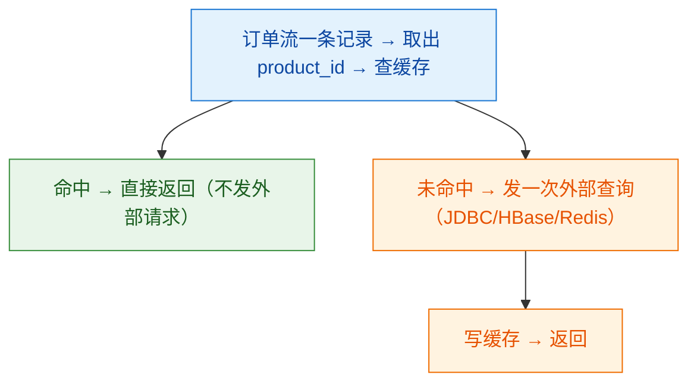

# 🧮 八、Flink SQL 与 Table API

> 本篇回答四个问题：**为什么一套 SQL 就能表达流计算**（动态表模型到底是什么）？Kafka / JDBC / Doris 的 DDL 怎么写才算生产可用？双流 Join 的三种方式在**状态大小与结果确定性**上差在哪、维表怎么关联才不把外部库打死？以及 `table.exec.*` 里哪些参数是"不设就会炸状态"的必设项？
> 前置阅读：[[2-时间与窗口]]（时间属性与 watermark 是 SQL 窗口的前提）、[[3-状态管理]]（动态表的状态从哪来）。双流 Join 的状态膨胀与端到端一致性收尾见 [[11-端到端一致性]]；CDC 入湖的完整链路见 [[7-FlinkCDC与实时数仓]]；SQL 层调优参数与背压的关系见 [[6-背压与性能调优]]；运维与客户端见 [[9-部署与运维]]。

---

## 一、核心思想：流与表的关系

### 1.1 为什么 SQL 能表达流计算

传统 SQL 面向**静态、有界**的数据集：一条 `SELECT` 执行一次，返回一个固定结果，然后结束。流数据是**持续、无界**的，一条 `SELECT` 永远不会有"执行完"的时刻。

Flink 的桥是把两边都抽象成同一个东西——**动态表（Dynamic Table）**：


三个转换的准确含义：

| 步骤 | 语义 | 关键点 |
| --- | --- | --- |
| ① 流 → 动态表 | 每来一条流记录，就相当于对表执行一次 `INSERT`（或 upsert/delete） | 表在**不断变化**，任何时刻的"表内容"只是某个瞬间的快照 |
| ② 连续查询 | 查询**永不结束**，每当输入表变化，就增量地更新结果表 | 与传统 SQL 不同，这里没有"执行完成"，只有"持续维护结果" |
| ③ 结果表 → 流 | 结果表的每次变更（`+I`/`-U`/`+U`/`-D`）就是一条输出流记录 | **这就是 Flink SQL 能写回 Kafka/DB 的原因** |

### 1.2 物化视图类比（最好用的心智模型）

把动态表理解成**物化视图**：

| 概念 | 传统数据库 | Flink 动态表 |
| --- | --- | --- |
| 视图 | 虚拟视图，查询时才计算 | 动态表 |
| 物化视图 | 预先算好并**存储**结果 | 动态表的结果**存进状态后端**（这就是 SQL 作业有状态的原因） |
| 刷新 | 定时/手动 `REFRESH` | **每条输入记录都触发一次增量刷新**（连续查询） |
| 查询代价 | 刷新很贵 | 增量维护，单条记录的处理代价通常很小 |
| 状态大小 | 存储整个结果 | 结果状态 + **中间状态**（去重、join、聚合的中间结果），这才是内存/磁盘开销的大头 |

> [!important] 一句话建立直觉
> **Flink SQL = 持续增量维护的物化视图。**
> 所以"SQL 作业为什么会把状态撑爆"就有答案了：因为物化视图要**存住结果**，而 join、去重、Top-N 还要**存住输入的明细**才能在未来被更新时找到旧值。

### 1.3 结果表的三种变更类型

这是 Flink SQL 最容易被忽略但面试最爱问的一点：**结果表用什么方式表达"变化"，决定了它能不能写进某些 sink。**

| 变更类型 | 输出 changelog | 含义 | 典型算子/语句 |
| --- | --- | --- | --- |
| **insert-only（追加）** | 只有 `+I` | 只新增，不更新、不删除 | 无聚合的 `SELECT`、窗口聚合（window TVF 的 `TUMBLE` 输出）、`UNION ALL` |
| **upsert** | `+I` / `-U` / `+U`，或 `+I` / `-D` | 有主键的更新：旧值 `-U` + 新值 `+U` | 有主键的聚合结果、`GROUP BY` 带主键、`upsert-kafka` sink |
| **retract（回撤）** | `+I` / `-U` / `+U` / `-D` | 通用更新流：先撤回旧结果，再发出新结果 | 普通 `GROUP BY` 聚合、`DISTINCT`、`ORDER BY`、无时间边界的 join |

**四个符号的语义（必须背下来）：**

| 符号 | 全称 | 含义 |
| --- | --- | --- |
| `+I` | INSERT | 新增一行 |
| `-U` | UPDATE_BEFORE | 撤回（更新前的旧值） |
| `+U` | UPDATE_AFTER | 更新（更新后的新值） |
| `-D` | DELETE | 删除一行 |

这直接决定了 sink 的选择：

- **`+I` 为主的流** → 可以写 Kafka 的 `kafka` connector（append 模式）、文件系统。
- **带 `-U`/`+U` 的流** → 必须写 **`upsert-kafka`**（要求定义主键）、JDBC（按主键 upsert）、Doris Unique 模型、HBase 等支持按主键覆盖的 sink。
- **如果强行把 retract 流写进 append sink**，Flink 会报错或要求开启 `table.exec.sink.upsert-materialize` 之类的补偿机制（见第七节）。

> [!example] 一个直观的例子
> ```sql
> -- 输入：order_id 为主键的 upsert 流
> -- 连续查询：
> SELECT user_id, COUNT(*) AS cnt FROM orders GROUP BY user_id;
> ```
> 当 `user_id = 1001` 从 3 条变 4 条时，输出流是：
> `-U (1001, 3)` 然后 `+U (1001, 4)`。
> 如果 sink 是 Doris Unique 模型（按 `user_id` 主键覆盖），`-U` 会被忽略或与 `+U` 合并，最终结果正确；
> 如果 sink 是普通 append Kafka，下游会看到两条记录，需要自己按主键去重。

---

## 二、表环境与依赖

### 2.1 创建 TableEnvironment

Flink 1.15 之后统一用 `EnvironmentSettings` 描述"流还是批、用旧 planner 还是新 planner"：

```java
import org.apache.flink.table.api.EnvironmentSettings;
import org.apache.flink.table.api.TableEnvironment;
import org.apache.flink.table.api.bridge.java.StreamTableEnvironment;
import org.apache.flink.streaming.api.environment.StreamExecutionEnvironment;

// 方式一：独立 SQL 作业（不需要 DataStream 环境），最常用于纯 SQL ETL
EnvironmentSettings settings = EnvironmentSettings
        .newInstance()
        .inStreamingMode()                 // 流模式；批模式用 inBatchMode()
        .build();
TableEnvironment tEnv = TableEnvironment.create(settings);

// 方式二：DataStream 与 Table 混用（需要 StreamExecutionEnvironment）
StreamExecutionEnvironment env = StreamExecutionEnvironment.getExecutionEnvironment();
StreamTableEnvironment stEnv = StreamTableEnvironment.create(env, settings);

// 常用操作
tEnv.executeSql("CREATE TABLE ...");                       // 执行 DDL/DML
TableResult result = tEnv.executeSql("SELECT ...");         // 返回可迭代结果
Table t = tEnv.from("kafka_orders");                        // 引用已注册的表
tEnv.createTemporaryView("my_view", t);                     // 注册临时视图
stEnv.toDataStream(t).map(...);                             // Table → DataStream
stEnv.fromDataStream(dataStream, Schema.newBuilder()...);    // DataStream → Table
```

| 场景 | 用哪个环境 |
| --- | --- |
| 纯 SQL 实时 ETL（Kafka → Kafka/Doris） | `TableEnvironment.create(settings)` |
| SQL 结果要接自定义 `ProcessFunction` | `StreamTableEnvironment` |
| 需要用 DataStream API 注册自定义 source/sink | `StreamTableEnvironment` |
| 批处理 SQL（有界数据） | `EnvironmentSettings.inBatchMode()` |

### 2.2 依赖坐标

Flink 1.15 起把 planner 从 `flink-table-planner` 改成了 **`flink-table-planner-loader`**，还外置了一批 connector。依赖写错的典型症状是 `NoMatchingTableFactoryException`、`ClassNotFoundException: org.apache.flink.table.planner...`，或者本地跑得通、提交到集群就找不到 connector。

| 用途 | artifact（不用背版本号，跟着 Flink 版本走） | 说明 |
| --- | --- | --- |
| Table API / SQL 的 Java 桥接 | `flink-table-api-java-bridge` | 写 Java Table API 必需 |
| Table API 基础 | `flink-table-api-java`、`flink-table-common` | 通常被上面的传递依赖带进来 |
| **Planner（1.15+）** | `flink-table-planner-loader` | **1.15 之后不要再直接依赖 `flink-table-planner`**，见下 |
| Planner（1.14 及以前） | `flink-table-planner_2.12` | 老版本的写法，新版本已废弃 |
| Table 运行时 | `flink-table-runtime` | 一般由集群提供，本地 IDE 调试时需要 |
| Kafka connector | `flink-connector-kafka` | 1.15+ 外置；更早版本是 `flink-connector-kafka_2.12`（打包在 Flink 里） |
| JDBC connector | `flink-connector-jdbc` | 外置；更早是 `flink-connector-jdbc_2.12` |
| MySQL CDC | `flink-connector-mysql-cdc` | Ververica 维护的 CDC 系列，版本需与 Flink 版本对齐 |
| 文件系统 connector | `flink-connector-files` | 写 HDFS/S3 时需要 |
| JSON / Avro / CSV 格式 | `flink-json` / `flink-avro` / `flink-csv` | 用 `format = 'json'` 就必须有对应 format 依赖 |

Maven 示例：

```xml
<!-- 编译期：planner 一律用 loader，不要直接依赖 flink-table-planner -->
<dependency>
  <groupId>org.apache.flink</groupId>
  <artifactId>flink-table-api-java-bridge</artifactId>
  <version>${flink.version}</version>
  <scope>provided</scope>
</dependency>
<dependency>
  <groupId>org.apache.flink</groupId>
  <artifactId>flink-table-planner-loader</artifactId>
  <version>${flink.version}</version>
  <scope>provided</scope>
</dependency>

<!-- 运行时：connector 与 format 必须随作业 jar 提交，或放进集群 lib/ -->
<dependency>
  <groupId>org.apache.flink</groupId>
  <artifactId>flink-connector-kafka</artifactId>
  <version>${flink.connector.kafka.version}</version>
</dependency>
<dependency>
  <groupId>org.apache.flink</groupId>
  <artifactId>flink-json</artifactId>
  <version>${flink.version}</version>
</dependency>
```

> [!warning] 1.15 之后 planner 依赖的调整，别踩这个坑
> - **1.15 之前**：`flink-table-planner` 和 `flink-table-runtime` 都在集群的 `lib/` 下，用户直接把 `flink-table-planner` 作为 `provided` 依赖编译即可。
> - **1.15 之后**：planner 被包进 **`flink-table-planner-loader` 提供的 bundle jar**，由**独立的类加载器隔离加载**，目的是让用户在不重新编译作业的情况下就能**替换 planner 版本**（同时避免 planner 与 Flink core 的依赖冲突）。
> - **实践要点**：① 用户代码依赖 `flink-table-planner-loader` 而不是 `flink-table-planner`；② 需要 planner 版本对齐/替换时，替换的是 loader 提供的 bundle，而不是在作业 jar 里塞 planner；③ **不要把 `flink-table-planner` 打进 fat jar**，会引发类冲突。
> - 同理，1.15+ 的**连接器也要显式打进作业 jar 或放进 `lib/`**（`pipeline.jars` / `pipeline.classpaths` 或集群 `lib/`），因为很多 connector 已经不在发行包内。

---

## 三、DDL 建表

### 3.1 Kafka 源表（生产模板）

```sql
CREATE TABLE kafka_orders (
  order_id      STRING,
  user_id       BIGINT,
  product_id    STRING,
  amount        DECIMAL(12, 2),
  create_time   BIGINT,                              -- 上游是毫秒时间戳
  -- 计算列：把 BIGINT 时间戳转成 Flink 的时间属性列
  order_time    AS TO_TIMESTAMP_LTZ(create_time, 3),
  -- 处理时间列：用于 lookup join / 去重的兜底排序
  proc_time     AS PROCTIME(),
  -- 水位线：事件时间 - 5 秒，允许 5 秒乱序
  WATERMARK FOR order_time AS order_time - INTERVAL '5' SECOND,
  -- 元数据列：不来自消息体，由 connector 提供
  `offset`      BIGINT METADATA FROM 'offset' VIRTUAL,
  `partition`   INT    METADATA FROM 'partition' VIRTUAL,
  `kafka_ts`    TIMESTAMP_LTZ(3) METADATA FROM 'timestamp' VIRTUAL
) WITH (
  'connector'                      = 'kafka',
  'topic'                          = 'orders',
  'properties.bootstrap.servers'   = 'kafka-1:9092,kafka-2:9092',
  'properties.group.id'            = 'flink-orders-etl',
  'scan.startup.mode'              = 'group-offsets',
  'properties.auto.offset.reset'   = 'earliest',
  'properties.enable.auto.commit'  = 'false',
  'format'                         = 'json',
  'json.ignore-parse-errors'       = 'true',
  'json.fail-on-missing-field'     = 'false',
  'scan.topic-partition-discovery.interval' = '5 min'
);
```

关键参数说明：

| 参数 | 作用 | 生产建议 |
| --- | --- | --- |
| `connector` | 指定连接器 | Kafka 源用 `kafka` |
| `topic` / `topic-pattern` | 订阅主题 | 支持正则 `topic-pattern` |
| `properties.bootstrap.servers` | broker 地址 | 写全量列表 |
| `properties.group.id` | 消费组 | **一个作业一个独立组**，不要与别的消费者共用，否则 offset 互相覆盖 |
| `scan.startup.mode` | 启动位点 | 见下表 |
| `properties.auto.offset.reset` | 无位点时的兜底 | 与 startup mode 配合 |
| `properties.enable.auto.commit` | 是否让 Kafka 客户端自动提交位点 | **`false`**：位点应由 checkpoint 管理 |
| `format` | 消息格式 | `json` / `avro` / `debezium-json` / `canal-json` / `raw` |
| `json.ignore-parse-errors` | 解析失败是否跳过 | **`true` 但要警惕静默丢数据**，见第九节 |
| `json.fail-on-missing-field` | 缺字段是否失败 | 通常 `false`，配合 `NULL` 语义 |
| `scan.topic-partition-discovery.interval` | 动态发现新增分区 | 有分区扩容需求时开启 |

`scan.startup.mode` 取值：

| 取值 | 含义 | 适用 |
| --- | --- | --- |
| `group-offsets` | 从消费组已提交的位点开始 | **生产默认**（有 checkpoint 时优先用 checkpoint 里的位点） |
| `earliest-offset` | 从最早开始 | 首次跑全量、造数 |
| `latest-offset` | 从最新开始 | 只关心增量 |
| `timestamp` | 从指定时间戳开始 | 补数、按时间回溯 |
| `specific-offsets` | 从指定分区位点开始 | 精确补数 |

### 3.2 时间属性列与 watermark

这是 Flink SQL 时间语义的全部基础，写错一处窗口就不触发。

| 类型 | 声明方式 | 用途 |
| --- | --- | --- |
| **事件时间（event time）** | 列 + `WATERMARK FOR col AS col - INTERVAL '5' SECOND` | 窗口聚合、interval join、temporal join（`FOR SYSTEM_TIME AS OF` 事件时间版本） |
| **处理时间（processing time）** | 计算列 `AS PROCTIME()` | lookup join、去重的兜底排序、`CURRENT_TIMESTAMP` |
| **时间戳转换** | `TO_TIMESTAMP_LTZ(bigint_col, 3)` / `TO_TIMESTAMP(str)` / `FROM_UNIXTIME` | 上游给的是 bigint 秒/毫秒或字符串时 |

```sql
-- 事件时间：BIGINT 毫秒 → TIMESTAMP_LTZ(3)，再定义 watermark
order_time AS TO_TIMESTAMP_LTZ(create_time, 3),
WATERMARK FOR order_time AS order_time - INTERVAL '5' SECOND

-- 事件时间：字符串 → TIMESTAMP(3)
event_time AS TO_TIMESTAMP(log_time_str, 'yyyy-MM-dd HH:mm:ss'),
WATERMARK FOR event_time AS event_time - INTERVAL '3' SECOND
```

> [!warning] watermark 三个经典错误
> 1. **只声明了时间列，忘了 `WATERMARK FOR`** → 该列**不是时间属性**，窗口 TVF 会直接报错（而不是静默不触发）。
> 2. **watermark 延迟设得过大**（比如 `- INTERVAL '1' HOUR`）→ 窗口要等到一小时后才触发，看起来"卡住不动"。
> 3. **源端有空闲分区** → 空闲分区的 watermark 永远不推进，把整个算子的 `currentInputWatermark` 拖住。**解法：`table.exec.source.idle-timeout`**（见第七节）。

### 3.3 计算列与元数据列

```sql
CREATE TABLE kafka_orders_raw (
  raw_payload   STRING,
  create_time   BIGINT,
  -- 计算列：从原始 JSON 里提取字段（不落存储，读取时计算）
  order_id      AS JSON_VALUE(raw_payload, '$.order_id'),
  amount        AS CAST(JSON_VALUE(raw_payload, '$.amount') AS DECIMAL(12, 2)),
  order_time    AS TO_TIMESTAMP_LTZ(create_time, 3),
  WATERMARK FOR order_time AS order_time - INTERVAL '5' SECOND,
  -- 元数据列：来自 Kafka 而不是消息体，VIRTUAL 表示不参与写入
  `topic`       STRING METADATA FROM 'topic' VIRTUAL,
  `partition`   INT    METADATA FROM 'partition' VIRTUAL,
  `offset`      BIGINT METADATA FROM 'offset' VIRTUAL,
  `headers`     MAP<STRING, BYTES> METADATA FROM 'headers' VIRTUAL
) WITH (
  'connector' = 'kafka',
  'topic' = 'orders',
  'properties.bootstrap.servers' = 'kafka:9092',
  'properties.group.id' = 'flink-orders',
  'scan.startup.mode' = 'group-offsets',
  'format' = 'raw'
);
```

| 概念 | 说明 |
| --- | --- |
| **计算列（computed column）** | `AS <表达式>`，可以是任意确定性标量表达式。**不占存储**，读取时计算 |
| **元数据列（metadata column）** | `METADATA FROM '<key>'`，从 connector 读取系统信息。`VIRTUAL` 表示**不落实际数据、只在读取时可见**（写 sink 时 VIRTUAL 列不会被写入） |
| Kafka 可用的元数据 key | `topic`、`partition`、`offset`、`timestamp`、`headers`（`MAP<STRING, BYTES>`） |
| **主键 `PRIMARY KEY (k) NOT ENFORCED`** | Flink 不校验唯一性，但**它告诉 planner 这是 upsert 流**，直接决定 join/去重/聚合能否用 upsert 模式、以及能否写 `upsert-kafka` |

> [!tip] 调试小技巧：用元数据列做数据探查
> 把 `offset`、`partition`、`timestamp` 一起查出来，可以立刻判断：数据是否倾斜到某个分区、有没有消费滞后、消息时间是否整体偏移（时区问题）。

### 3.4 Sink 表 DDL

**（1）JDBC sink（按主键 upsert）**

```sql
CREATE TABLE jdbc_order_summary (
  user_id     BIGINT,
  order_cnt   BIGINT,
  total_amt   DECIMAL(14, 2),
  update_time TIMESTAMP(3),
  PRIMARY KEY (user_id) NOT ENFORCED          -- 关键：有了主键才能走 upsert
) WITH (
  'connector'                    = 'jdbc',
  'url'                          = 'jdbc:mysql://mysql-host:3306/dw?useSSL=false',
  'table-name'                   = 'order_summary',
  'username'                     = 'flink',
  'password'                     = '******',
  'sink.buffer-flush.max-rows'   = '1000',    -- 批量写：攒够 1000 行才提交
  'sink.buffer-flush.interval'   = '1s',      -- 或最多等 1 秒
  'sink.max-retries'             = '3'
);
```

| 参数 | 作用 | 副作用 |
| --- | --- | --- |
| `sink.buffer-flush.max-rows` | 攒多少行提交一次 | 越大吞吐越高，但**延迟越高、失败时重复越多**（非事务 sink） |
| `sink.buffer-flush.interval` | 最长等多久提交一次 | 保证低流量下数据不会无限等待 |
| `sink.max-retries` | 写失败重试 | 重试也可能造成重复写，需要下游幂等 |
| `sink.parallelism` | sink 并行度 | 别让 64 个并行写一条 MySQL |

**（2）Kafka upsert sink（要求主键）**

```sql
CREATE TABLE kafka_user_summary (
  user_id     BIGINT,
  order_cnt   BIGINT,
  total_amt   DECIMAL(14, 2),
  PRIMARY KEY (user_id) NOT ENFORCED
) WITH (
  'connector'                    = 'upsert-kafka',
  'topic'                        = 'user_order_summary',
  'properties.bootstrap.servers' = 'kafka:9092',
  'key.format'                   = 'json',
  'value.format'                 = 'json',
  'sink.delivery-guarantee'      = 'exactly-once',   -- 旧版 connector 是 sink.semantic
  'sink.transactional-id-prefix' = 'flink-user-summary'
);
```

**（3）Doris sink（Unique 模型，按主键覆盖 + label 事务）**

```sql
CREATE TABLE doris_order_summary (
  user_id     BIGINT,
  order_cnt   BIGINT,
  total_amt   DECIMAL(14, 2),
  update_time TIMESTAMP(3)
) WITH (
  'connector'                 = 'doris',
  'fenodes'                   = 'doris-fe:8030',
  'table.identifier'          = 'dw.order_summary',
  'username'                  = 'root',
  'password'                  = '',
  'sink.label-prefix'         = 'flink_order_summary',  -- 必须全局唯一，否则 label 冲突
  'sink.properties.format'    = 'json',
  'sink.properties.read_json_by_line' = 'true',
  'sink.enable-2pc'           = 'true'                  -- 两阶段提交，配合 checkpoint 实现 EOS
);
```

> [!important] sink 表 DDL 的三条铁律
> 1. **要 upsert 就必须写 `PRIMARY KEY ... NOT ENFORCED`**。没有主键时，Flink 无法把 retract/upsert 流正确地写到需要主键的 sink。
> 2. **`upsert-kafka` 必须同时提供 `key.format` 和 `value.format`**，且主键列必须能序列化进 key。
> 3. **写入幂等性由 sink 的模型决定**：Doris 用 Unique 模型、MySQL 用 `ON DUPLICATE KEY`、Kafka 用事务。**sink 端不幂等，Flink 侧再怎么配也做不到端到端不丢不重**（详见 [[11-端到端一致性]]）。

---

## 四、窗口 TVF（现代写法）与旧写法

### 4.1 为什么要用窗口 TVF

Flink 1.13 引入 **window table-valued function（窗口 TVF）**，逐步取代 `GROUP BY TUMBLE(ts, INTERVAL '...')` 的老写法。

| 对比项 | Legacy：`GROUP BY TUMBLE(ts, ...)` | **现代：窗口 TVF** |
| --- | --- | --- |
| 写法 | `GROUP BY TUMBLE(order_time, INTERVAL '1' MINUTE)` | `FROM TABLE(TUMBLE(TABLE t, DESCRIPTOR(order_time), INTERVAL '1' MINUTE))` |
| 输出表 | 只含聚合结果 | **输出一张带 `window_start`/`window_end` 的表**，可以再被 join、再被聚合 |
| 窗口 Join | 不支持 | **支持 window join** |
| 窗口 Top-N | 不支持 | **支持**（`ROW_NUMBER() OVER (PARTITION BY window_start, window_end ...)`） |
| 窗口聚合后再次聚合 | 受限 | 支持（窗口 TVF 表达式可嵌套/串联） |
| 性能 | 老算子、优化有限 | **专门优化的算子**，支持切片共享（slice sharing）、增量计算、以及 `table.optimizer.` 系列优化 |
| 空窗口 | 行为不一致 | 语义清晰（配合 `table.exec.window-agg.*` 参数控制） |

**结论：新作业一律用窗口 TVF。** 老写法只在读旧代码时见得到。

### 4.2 TUMBLE / HOP / CUMULATE 语法与语义

```sql
-- ① TUMBLE（滚动窗口）：窗口不重叠，[00:00, 00:01), [00:01, 00:02) ...
SELECT window_start, window_end, user_id, COUNT(*) AS cnt, SUM(amount) AS total
FROM TABLE(
  TUMBLE(TABLE kafka_orders, DESCRIPTOR(order_time), INTERVAL '1' MINUTE)
)
GROUP BY window_start, window_end, user_id;

-- ② HOP（滑动窗口）：窗口重叠，每 1 分钟产出一个统计过去 5 分钟的结果
SELECT window_start, window_end, user_id, COUNT(*) AS cnt
FROM TABLE(
  HOP(TABLE kafka_orders, DESCRIPTOR(order_time), INTERVAL '1' MINUTE, INTERVAL '5' MINUTE)
)
GROUP BY window_start, window_end, user_id;

-- ③ CUMULATE（累积窗口）：一天内每 1 分钟累加一次，常用于"当日累计"
SELECT window_start, window_end, user_id, SUM(amount) AS day_total
FROM TABLE(
  CUMULATE(TABLE kafka_orders, DESCRIPTOR(order_time),
           INTERVAL '1' MINUTE,     -- 步长：多久输出一次
           INTERVAL '1' DAY)        -- 最大窗口：累计到多大
)
GROUP BY window_start, window_end, user_id;
```

| 窗口 | 语法参数 | 语义 | 典型用途 |
| --- | --- | --- | --- |
| `TUMBLE` | `(表, DESCRIPTOR(时间列), 窗口大小)` | 固定长度、不重叠 | 每分钟 GMV、每 5 分钟 PV |
| `HOP` | `(表, DESCRIPTOR(时间列), 滑动步长, 窗口大小)` | 固定长度、可重叠 | 过去 5 分钟的滚动均值、趋势平滑 |
| `CUMULATE` | `(表, DESCRIPTOR(时间列), 步长, 最大窗口)` | 从窗口起点开始逐段累加 | 当日累计、本月累计（比 HOP 少算重复数据） |

**一个容易搞错的地方：** `TUMBLE` 的第三个参数是**窗口大小**，`HOP` 的第二、三个参数是**步长在前、窗口大小在后**。写反了不会报错，但结果会变得很奇怪。

### 4.3 窗口聚合 + 分组 + 分组集

```sql
-- 多维度分组，含 GROUPING SETS
SELECT window_start, window_end, category, region, SUM(amount) AS total
FROM TABLE(TUMBLE(TABLE kafka_orders, DESCRIPTOR(order_time), INTERVAL '5' MINUTE))
GROUP BY window_start, window_end, GROUPING SETS ((category), (region), ())
```

> [!note] 窗口 TVF 的关键约束
> - 时间列必须是**已声明 watermark 的事件时间属性**，或者是 `PROCTIME()`（处理时间窗口）。
> - `GROUP BY` **必须包含 `window_start` 和 `window_end`**（可以把它们重命名输出）。
> - 窗口 TVF 的结果是一张**普通表**，可以继续 `JOIN`、继续 `GROUP BY`、继续 `ROW_NUMBER()`。这是它与 legacy 写法最大的能力差异。

---

## 五、常用查询模式

### 5.1 去重（Deduplication）—— 最常用、也最容易把状态写爆

```sql
-- 按 order_id 去重，只保留最新一条（proctime 排序）
SELECT order_id, user_id, amount, order_time
FROM (
  SELECT *,
         ROW_NUMBER() OVER (PARTITION BY order_id ORDER BY order_time DESC) AS rn
  FROM kafka_orders
) WHERE rn = 1;
```

**解决的问题**：上游 CDC/消息可能重复（at-least-once 投递、binlog 重放），需要按业务主键保留最新状态。

> [!danger] 去重是"有状态"的，必须配 TTL
> `ROW_NUMBER()` 去重要为**每个 key 保留所有出现过的记录**（才能比较谁最新），所以状态大小 ≈ `distinct key 数 × 每条记录大小`。一张日订单表，`order_id` 是亿级，状态会直接爆。
> **必设**：
> ```sql
> SET 'table.exec.state.ttl' = '24 h';
> ```
> 语义上要理解：**设了 TTL 之后，超过 TTL 的 key 会被清理，如果同一条记录在 TTL 之后又来了，会被当成"新的第一条"输出**——这是"有限去重"，不是严格全局去重。业务上要评估这个窗口是否够用。

### 5.2 Top-N

```sql
-- 每个品类销售额 Top 3
SELECT category, product_id, sales, rn
FROM (
  SELECT category, product_id, sales,
         ROW_NUMBER() OVER (PARTITION BY category ORDER BY sales DESC) AS rn
  FROM product_sales
) WHERE rn <= 3;
```

| 细节 | 说明 |
| --- | --- |
| 输出是 retract 流（`-U`/`+U`），因为排名会变 | 下游 sink 需要支持按主键 upsert |
| 只保留 `rn <= N` 的记录，状态比去重小 | 但仍然随品类数增长 |
| `RANK()` / `DENSE_RANK()` 也可用 | `RANK()` 会产生并列名次与间隙 |
| 排序字段相同时结果不确定 | 建议在 `ORDER BY` 里加一个唯一列作为 tie-breaker |

### 5.3 窗口 Top-N

```sql
-- 每个 5 分钟窗口内，销售额 Top 3 的商品
SELECT window_start, window_end, product_id, sales
FROM (
  SELECT window_start, window_end, product_id, SUM(amount) AS sales,
         ROW_NUMBER() OVER (
           PARTITION BY window_start, window_end
           ORDER BY SUM(amount) DESC
         ) AS rn
  FROM TABLE(TUMBLE(TABLE kafka_orders, DESCRIPTOR(order_time), INTERVAL '5' MINUTE))
  GROUP BY window_start, window_end, product_id
) WHERE rn <= 3;
```

> [!tip] 窗口 Top-N 是窗口 TVF 独占能力
> legacy `GROUP BY TUMBLE(...)` 写法做不出"每个窗口独立排名"，因为窗口结果表没有 `window_start`/`window_end` 这两列可供 `PARTITION BY`。这是迁移到窗口 TVF 最实际的收益。

### 5.4 分组聚合与 Over 聚合

```sql
-- 普通分组聚合（输出 upsert/retract 流）
SELECT user_id, COUNT(*) AS cnt, SUM(amount) AS total, AVG(amount) AS avg_amt
FROM kafka_orders
GROUP BY user_id;

-- Over 聚合：不折叠行，为每行附加一个聚合值
SELECT order_id, user_id, amount,
       SUM(amount) OVER (PARTITION BY user_id ORDER BY order_time
                         RANGE BETWEEN INTERVAL '1' HOUR PRECEDING AND CURRENT ROW) AS hour_total
FROM kafka_orders;
```

| 聚合类型 | 输出行数 | 状态特点 |
| --- | --- | --- |
| `GROUP BY` | 每个 key 一行（可更新） | 每个 key 一份聚合中间态，**小** |
| `OVER`（有界 range/rows） | **与输入同量级**，每行一个聚合值 | 需要保留窗口内的明细行，**状态大** |
| `OVER`（无界，`UNBOUNDED PRECEDING`） | 与输入同量级 | 每行都要算，状态随 key 的累积增长 |

### 5.5 DISTINCT 聚合

```sql
SELECT user_id, COUNT(DISTINCT product_id) AS uv FROM kafka_orders GROUP BY user_id;
```

**问题**：`COUNT(DISTINCT ...)` 在 Flink SQL 里默认**把所有 distinct 值存成一个集合**，热点 key（比如一个大促活动）会让单个 subtask 的状态和计算量爆炸，形成**倾斜**。

**解法**：开启 distinct 聚合打散：

```sql
SET 'table.optimizer.distinct-agg.split.enabled' = 'true';
SET 'table.optimizer.distinct-agg.split.bucket-num' = '16';
```

原理是把 `COUNT(DISTINCT x)` 拆成**两层聚合**：第一层按 `hash(x) % bucket_num` 打散到多个 bucket 先做 distinct，第二层把各 bucket 的结果合并。代价是**多一次 shuffle**，收益是消除热点。

也可以**手动**用 `GROUPING SETS` 或子查询重写：

```sql
-- 手动两阶段：先按 (user_id, product_id) 去重，再按 user_id 计数
SELECT user_id, COUNT(*) AS uv
FROM (
  SELECT user_id, product_id FROM kafka_orders GROUP BY user_id, product_id
) GROUP BY user_id;
```

### 5.6 MATCH_RECOGNIZE（CEP 模式检测）

SQL 里做复杂事件处理（CEP）的写法，用于"连续 N 次失败""下单后未支付""价格连续上涨"这类模式。

```sql
-- 检测：同一用户 10 分钟内，先小额下单，再连续多次小额，最后出现一笔大额
SELECT *
FROM kafka_orders
MATCH_RECOGNIZE (
  PARTITION BY user_id
  ORDER BY order_time
  MEASURES
    A.order_time  AS start_time,
    C.order_time  AS end_time,
    A.amount      AS first_amount,
    C.amount      AS last_amount
  ONE ROW PER MATCH
  AFTER MATCH SKIP PAST LAST ROW
  PATTERN (A B+ C)
  DEFINE
    A AS amount < 100,
    B AS amount < 100,
    C AS amount > 500
);
```

| 要素 | 含义 |
| --- | --- |
| `PARTITION BY` | 模式匹配的分组键（**状态按它划分**） |
| `ORDER BY` | 必须是时间属性列 |
| `PATTERN` | 正则式的模式，支持 `A B+ C`、`A?`、`{- A B -}` 等 |
| `DEFINE` | 每个符号的匹配条件 |
| `MEASURES` | 每个匹配要输出哪些字段 |
| `ONE ROW PER MATCH` / `ALL ROWS PER MATCH` | 每个匹配输出一行，还是输出所有参与行 |
| `AFTER MATCH SKIP ...` | 匹配后从哪继续（`PAST LAST ROW` / `TO NEXT ROW` / `TO FIRST`） |

> [!warning] MATCH_RECOGNIZE 的状态与超时
> 它必须为每个 key 保留"部分匹配"的中间状态，**状态量不可控**，且如果一个模式永远不闭合，状态会一直挂着。生产上必须配 `table.exec.state.ttl`，并把 `PARTITION BY` 的基数控制在可接受范围。简单模式用 CEP 库或 `ProcessFunction` 反而更可控。

---

## 六、双流 Join 三种方式（重点）

面试必考，也是"状态爆炸"的头号来源。核心判据是：**join 需要保留多久的历史数据**。

### 6.1 Regular Join（普通 join，无时间边界）

```sql
SELECT o.order_id, o.amount, u.user_name, u.level
FROM kafka_orders AS o
JOIN kafka_users AS u
  ON o.user_id = u.user_id;          -- 只有等值条件，没有时间条件
```

| 特性 | 说明 |
| --- | --- |
| 状态 | **两侧的输入都会永久保留**（因为未来任何一条新记录都可能与历史记录匹配） |
| 结果 | **不确定**：同一条订单，用户在 join 之后更新了等级，会再输出一次（回撤 + 更新） |
| 输出类型 | retract / upsert 流 |
| 适用 | 两侧都是**变化缓慢的小维表**（用户表、配置表），且状态可接受 |
| 致命问题 | 两张亿级明细表做 regular join = **状态无限增长，最终 OOM 或 checkpoint 永远不会成功** |

### 6.2 Interval Join（时间区间 join，推荐）

```sql
SELECT o.order_id, o.amount, s.ship_status
FROM kafka_orders AS o
JOIN kafka_shipments AS s
  ON o.order_id = s.order_id
 AND s.ship_time BETWEEN o.order_time - INTERVAL '5' MINUTE
                     AND o.order_time + INTERVAL '1' HOUR;
```

| 特性 | 说明 |
| --- | --- |
| 状态 | **可控**：只需保留"时间区间内"的数据，水位推进后旧数据可清理 |
| 结果 | **确定**：一条记录在时间窗内只会匹配到有限的对端记录 |
| 前提 | **两侧都必须有事件时间属性 + watermark** |
| 适用 | 订单与支付、下单与发货、点击与曝光等**有明确时间邻近关系**的流 |
| 关键 | 区间越小，状态越小；区间必须由业务真实容忍度决定 |

> [!important] 面试要说的那句关键话
> "Interval join 的状态上界由**时间区间**决定，而 regular join 的状态上界由**数据量**决定。所以只要有时间邻近关系，就应该用 interval join。"

### 6.3 Temporal Join（时态表 join / 版本表 join）

用于"**按事件发生时刻的那个版本**去关联维表"——汇率、商品价格、用户等级这类**会随时间变化、且需要历史版本**的维表。

```sql
-- 版本表：必须声明主键 + 事件时间属性
CREATE TABLE currency_rate (
  currency    STRING,
  rate        DECIMAL(10, 4),
  update_time TIMESTAMP(3),
  PRIMARY KEY (currency) NOT ENFORCED,
  WATERMARK FOR update_time AS update_time - INTERVAL '5' SECOND
) WITH (
  'connector' = 'kafka',
  'topic' = 'currency_rate',
  'properties.bootstrap.servers' = 'kafka:9092',
  'properties.group.id' = 'flink-rate',
  'scan.startup.mode' = 'earliest-offset',
  'format' = 'debezium-json'
);

-- 用订单发生时刻的汇率去换算（结果可重放、确定）
SELECT o.order_id, o.amount * r.rate AS amount_cny
FROM kafka_orders AS o
JOIN currency_rate FOR SYSTEM_TIME AS OF o.order_time AS r
  ON o.currency = r.currency;
```

| 特性 | 说明 |
| --- | --- |
| 语义 | 用**左表时间属性所代表的那个时刻**，去右表的历史版本里取当时的值 |
| 状态 | 右表需要保留历史版本（状态由版本表的数据量决定，可配 TTL） |
| 结果 | **确定且可重放**：同一个事件时间，永远得到同一个结果 |
| 关键区别 | `FOR SYSTEM_TIME AS OF o.order_time`（事件时间）vs `FOR SYSTEM_TIME AS OF o.proc_time`（处理时间，每个版本立刻生效） |

### 6.4 三种 join 对比表（背下来）

| 对比项 | Regular Join | Interval Join | Temporal Join |
| --- | --- | --- | --- |
| 时间条件 | 无 | `BETWEEN a.ts - INTERVAL ... AND a.ts + INTERVAL ...` | `FOR SYSTEM_TIME AS OF` |
| 右表是什么 | 普通流 | 普通流 | **版本表 / 时态表**（需主键 + 时间属性） |
| 状态大小 | **无界，随数据增长** | 有界，由时间区间决定 | 由版本表数据量决定 |
| 结果确定性 | ❌ 不确定（会随右表更新而变） | ✅ 确定 | ✅ 确定（按事件时刻取版本） |
| 输出类型 | retract/upsert | 通常是 append | append/upsert |
| 适用场景 | 两侧都是小维表 | 有明确时间邻近关系的双流 | 需要历史版本的维表 |
| 是否需要 watermark | 不需要 | **必须**（两侧都要） | 事件时间版本需要 |
| 生产推荐度 | ⚠️ 慎用 | ✅ **首选** | ✅ 维表带历史版本时首选 |

> [!danger] 双流 Join 的"救命参数"
> **`table.exec.state.ttl` 是双流 join 唯一的状态安全阀。**
> - 不设 → 状态只增不减，跑几个月后 checkpoint 巨大、恢复要几小时、最终 OOM。
> - 设了 → 超过 TTL 的 join 状态被清理，**代价是"迟到的对端记录"可能匹配不上，产生 `NULL` 或漏匹配**（对 inner join 表现为丢结果）。
> - 所以 TTL 的值 = **业务能容忍的最大"迟到/乱序/回看"时长**，而不是随便填一个数。
> ```sql
> SET 'table.exec.state.ttl' = '12 h';
> ```

---

## 七、维表关联：Lookup Join

### 7.1 机制

实时流字段不全（订单流里没有商品名称、用户等级），需要**实时查外部维表**补全。Flink SQL 用 `FOR SYSTEM_TIME AS OF <左表 proctime>` 触发 **lookup join**。

```sql
CREATE TABLE dim_product (
  product_id  STRING,
  product_name STRING,
  category    STRING,
  PRIMARY KEY (product_id) NOT ENFORCED
) WITH (
  'connector'                  = 'jdbc',
  'url'                        = 'jdbc:mysql://dim-host:3306/dim',
  'table-name'                 = 'dim_product',
  'username'                   = 'flink',
  'password'                   = '******',
  'lookup.cache.max-rows'      = '50000',   -- 缓存最多多少行
  'lookup.cache.ttl'           = '10 min',  -- 缓存多久过期
  'lookup.max-retries'         = '3',
  'lookup.partial-cache.max-rows'        = '100000',   -- 分区缓存（按 join key 分区）
  'lookup.partial-cache.expire-after-write' = '20 min',
  'lookup.partial-cache.cache-missing-key'  = 'false'
);

SELECT o.order_id, o.amount, p.product_name, p.category
FROM kafka_orders AS o
LEFT JOIN dim_product FOR SYSTEM_TIME AS OF o.proc_time AS p
  ON o.product_id = p.product_id;
```

**执行流程（关键：每行查一次外部系统）：**



### 7.2 缓存参数对比

| 缓存模式 | 参数 | 行为 | 取舍 |
| --- | --- | --- | --- |
| **全量缓存**（默认） | `lookup.cache.max-rows`、`lookup.cache.ttl` | 用 LRU 缓存**所有** key 的结果 | 维表不大时首选；`max-rows` 太小会频繁失效，太大占 TM 内存 |
| **分区缓存**（partial cache） | `lookup.partial-cache.max-rows`、`.expire-after-write`、`.expire-after-access`、`.cache-missing-key` | 缓存**按 join key 分片**，适合超大维表 | 内存更可控；`cache-missing-key=false` 表示"查不到的 key 不缓存"（防止维表后续补数后一直查不到） |
| **无缓存** | 什么都不配 | 每一行都查一次外部系统 | 只适合极小流量或维表变更极频繁且必须实时 |

> [!danger] Lookup Join 最常见的生产事故
> **"维表在 MySQL 里改了，Flink 里不生效"** —— 99% 是缓存 TTL 导致的。
> - `lookup.cache.ttl = '60 min'` → 维表更新最多 1 小时后才可见。
> - `lookup.cache.max-rows` 设得过大且 TTL 过长 → 缓存永不过期。
> - **想要更实时，就要付代价**：TTL 变短 → 外部查询 QPS 上升 → 可能把维表库打死。
> - 折中：**用 CDC（`flink-connector-mysql-cdc`）把维表同步成 Flink 内部的状态表**，走 **temporal join** 而不是 lookup join——这样维表更新由 binlog 驱动、毫秒级生效，且不打维表库。代价是维表数据要进 Flink 状态。

### 7.3 Lookup Join vs Temporal Join

| 对比项 | Lookup Join | Temporal Join（CDC 维表） |
| --- | --- | --- |
| 数据来源 | 查询时**实时访问外部系统** | 维表变更通过 **CDC 流入 Flink 状态** |
| 外部压力 | 每条未命中记录一次查询 | 只在 binlog 变更时写入，**几乎无查询压力** |
| 更新延迟 | 受缓存 TTL 限制（分钟级） | 通常毫秒~秒级 |
| 状态占用 | 只占缓存 | 占用 Flink 状态（维表全量） |
| 适用 | 维表大、变更少、能接受分钟级延迟 | 维表变更频繁、要求实时、维表量可控 |
| 前提 | 外部系统支持按主键点查 | 维表能开 CDC，且需要版本 |

> [!tip] 选择口诀
> **维表大、变更慢、能忍延迟 → Lookup Join；维表变更快、要实时、量不大 → CDC + Temporal Join。**

---

## 八、状态 TTL 与资源类参数

这一节是"SQL 作业能不能稳定跑三个月"的关键。

| 参数 | 作用 | 副作用 / 注意 |
| --- | --- | --- |
| **`table.exec.state.ttl`** | 所有**有状态算子**（join、去重、聚合、Top-N、CEP）状态的空闲存活时间 | **最关键的参数**。太短 → 迟到数据匹配不上、去重失效、结果错误；太长/不设 → 状态无限增长。按业务容忍的最大回看/乱序时长设置 |
| `table.exec.mini-batch.enabled` | 是否开启微批：攒一批数据再一起处理 | 提升吞吐（减少状态访问、减少输出条数），**代价是延迟升高约一个 allow-latency**；对有状态算子效果最明显 |
| `table.exec.mini-batch.allow-latency` | 微批最多攒多久 | 就是"用延迟换吞吐"的那个延迟；太小没效果，太大会让下游等待 |
| `table.exec.mini-batch.size` | 微批最多攒多少条 | 控制单批规模，防止一批太大导致内存和长尾 |
| `table.optimizer.distinct-agg.split.enabled` | 把 `COUNT(DISTINCT)` 拆成两层聚合 | 消除热点倾斜；**代价是多一次 shuffle**，低流量下反而变慢 |
| `table.optimizer.distinct-agg.split.bucket-num` | 打散成多少个 bucket | 越大越抗倾斜，但 shuffle 与合并开销也越大 |
| `table.optimizer.agg-phase-strategy` | 聚合阶段策略：`AUTO` / `TWO_PHASE` / `ONE_PHASE` | `TWO_PHASE` 强制两阶段聚合（local + global），**抗倾斜**；`ONE_PHASE` 减少一次 shuffle 但热点会炸 |
| `table.exec.sink.upsert-materialize` | 是否为无法直接用 upsert 的 sink 增加一个**物化算子**，把 changelog 整理成 upsert 语义 | 取值通常为 `AUTO` / `FORCE` / `NONE`。开启后引入额外算子与状态，但能修复"retract 流写 upsert sink 导致结果错误"的问题 |
| `table.exec.sink.keyed-shuffle` | 写入前按主键 shuffle，保证**同一主键的记录落到同一个并发实例**，避免 upsert 乱序覆盖 | 取值 `AUTO` / `FORCE` / `NONE`。并行度 > 1 且写入按主键 upsert 的 sink 时非常重要，否则旧值可能覆盖新值 |
| `table.local-time-zone` | SQL 里时间函数、时间戳解析/格式化的时区 | 不设时会出现**时间整体偏移 8 小时**的问题（见第九节） |
| `table.exec.source.idle-timeout` | 某个 source 分片多久没数据就标记为**空闲**，不再参与 watermark 推进 | **有空闲分区的 Kafka 主题必设**，否则窗口永远不触发。代价是"真没数据"和"暂时没数据"的区分变得模糊 |
| `pipeline.auto-watermark-interval` | 周期性 watermark 的发射间隔 | 影响 watermark 推进的及时性与开销 |
| `table.exec.window-agg.buffer-size-limit` | 窗口聚合保留的窗口数量上限 | 防止窗口聚合状态无界；窗口太大/太多时需要注意 |

配置方式（两种，任选；作业内 `SET` 会覆盖集群默认）：

```sql
-- ① SQL 里 SET（最灵活，可放在作业脚本里）
SET 'table.exec.state.ttl' = '24 h';
SET 'table.exec.mini-batch.enabled' = 'true';
SET 'table.exec.mini-batch.allow-latency' = '5 s';
SET 'table.exec.mini-batch.size' = '5000';
SET 'table.local-time-zone' = 'Asia/Shanghai';
```

```java
// 也可以在 Java 代码里配（等价于 SET，适合统一封装在作业模板里）
Configuration conf = tEnv.getConfig().getConfiguration();
conf.setString("table.exec.state.ttl", "24 h");
conf.setString("table.exec.mini-batch.enabled", "true");
conf.setString("table.exec.mini-batch.allow-latency", "5 s");
conf.setString("table.local-time-zone", "Asia/Shanghai");
```

> [!important] 关于 `table.exec.state.ttl` 必须说的三句话
> 1. 它是**空闲时间**（idle time），不是"数据年龄"。状态被访问到就会重置计时。
> 2. 它是**优先级最高的必设参数**，很多"作业跑一周 checkpoint 越来越大"的根因就是没设它。
> 3. 它**不能设得太短**：对一个 interval join，TTL 小于 join 区间会让本该匹配的记录被清掉，结果直接错。

---

## 九、流批一体

### 9.1 `execution.runtime-mode`

```sql
SET 'execution.runtime-mode' = 'STREAMING';   -- 流模式
-- SET 'execution.runtime-mode' = 'BATCH';    -- 批模式
-- SET 'execution.runtime-mode' = 'AUTOMATIC';-- 自动：所有 source 有界则批，否则流
```

```java
TableEnvironment tEnv = TableEnvironment.create(
        EnvironmentSettings.newInstance().inStreamingMode().build());
// 批模式：EnvironmentSettings.newInstance().inBatchMode().build()

// 也可以在代码里改运行时模式
tEnv.getConfig().getConfiguration()
    .setString("execution.runtime-mode", "BATCH");
```

**同一套 SQL 跑流与批的差异：**

| 维度 | STREAMING | BATCH |
| --- | --- | --- |
| 输入 | 无界 | 必须有界（所有 source 都能读完） |
| 触发 | 持续增量计算，永不结束 | 一次性调度，跑完即止 |
| 状态 | 需要状态后端（RocksDB 等） | 尽量走算子内排序/哈希，**不依赖 checkpoint** |
| Watermark | 必需（事件时间窗口） | 不适用，按数据处理顺序/排序处理 |
| 结果输出 | changelog（含 `-U`/`+U`） | **只输出最终结果**（`-U`/`+U` 被折叠） |
| 关键优化 | mini-batch、两阶段聚合 | **排序、多轮聚合、join 重排**（例如把 join 的两侧做排序合并） |
| 典型场景 | 实时 ETL、实时监控 | 离线补数、T+1 报表 |

> [!tip] 流批一体的实战价值
> **同一份 SQL，白天跑流、晚上跑批补数**，避免维护两套代码逻辑（一套 Flink 流作业 + 一套 Spark/Hive SQL）。这是"流批一体"最落地的收益，比"用 Flink 做离线"更有说服力。
> 但要注意：**批模式下结果只输出最终值，流模式下输出 changelog**，写 sink 时要区分（批模式可以直接 append，流模式需要 upsert sink 或加 `table.exec.sink.upsert-materialize`）。

### 9.2 Materialized Table（Flink 2.0，简要）

Flink 2.0 引入了 **Materialized Table（物化表）**，目标是让"流"和"批"在**表这一层**统一起来：

```sql
-- 示意语法（Flink 2.0）
CREATE MATERIALIZED TABLE user_order_summary
  FRESHNESS = INTERVAL '1' MINUTE      -- 期望的数据新鲜度
  AS
  SELECT user_id, COUNT(*) AS cnt, SUM(amount) AS total
  FROM kafka_orders
  GROUP BY user_id;
```

**核心思想**：用户只声明"这个表要多新"（`FRESHNESS`），**持续刷新还是周期性全量刷新由 Flink 自己决定**：

| `FRESHNESS` | Flink 的执行策略 | 对应传统做法 |
| --- | --- | --- |
| 较小（如 1 分钟） | 用**流模式持续刷新** | 实时 Flink SQL 作业 |
| 较大或 `FRESHNESS = INTERVAL '1' DAY` | 用**批模式周期性全量刷新** | 离线调度 ETL |
| 不指定（或无穷大） | 只在手动 `REFRESH` 时刷新 | 手动跑批 |

**意义**：把"选流还是选批"从**用户的实现决策**变成**引擎的优化决策**——同一份 `SELECT`，引擎按新鲜度要求自动挑最省的执行方式。这正是流批一体从"API 层面统一"走向"**语义层面统一**"的标志。

> [!note] 不要过度承诺
> Materialized Table 是较新的能力，生产落地经验与生态工具链（调度、血缘、权限）还在成熟中。面试里说清"它解决什么问题、思路是什么"即可，不必声称已经在生产大规模使用。

---

## 十、常见坑清单

| 坑 | 现象 | 根因 | 解法 |
| --- | --- | --- | --- |
| **忘记设 `table.exec.state.ttl`** | 状态逐日增长、checkpoint 从几十 MB 涨到几十 GB、恢复时间越来越长、最终 OOM | join/去重/Top-N 的状态**只增不减** | 必设 TTL，值 = 业务可容忍的回看时长；同时监控 checkpoint size 趋势 |
| **watermark 未定义或写错** | 窗口永远不触发、`currentInputWatermark` 不推进 | 时间列没有 `WATERMARK FOR`；或延迟设得过大；或**有空闲分区拖住整条流** | 检查 `WATERMARK FOR`；设 `table.exec.source.idle-timeout`；用 `currentInputWatermark` 指标确认各 subtask 是否一致 |
| **lookup join 缓存导致维表更新不生效** | 维表改了，结果里还是旧值 | `lookup.cache.ttl` 太长 / `max-rows` 太大 | 缩短 TTL；或改用 **CDC + temporal join**；`lookup.partial-cache.cache-missing-key=false` |
| **upsert 表未定义主键** | 报错要求主键、或结果出现重复行 | `PRIMARY KEY ... NOT ENFORCED` 缺失，planner 无法判定 upsert 语义 | 补主键；确认主键在业务上唯一 |
| **`json` 解析失败静默丢数据** | 数据莫名少了，但没有任何报错 | `json.ignore-parse-errors = true` 让坏数据被**静默跳过** | 要么把坏数据写进侧输出/死信表（用 `try_cast`/`JSON_VALUE` 的严格模式），要么至少**监控 `numRecordsIn` 与下游行数的差异** |
| **时区问题导致时间偏移** | 时间列整体差 8 小时、窗口切分点和预期不符 | `table.local-time-zone` 未设，或 `TIMESTAMP` 与 `TIMESTAMP_LTZ` 混用 | 统一设 `table.local-time-zone = Asia/Shanghai`；统一用 `TIMESTAMP_LTZ`；`TO_TIMESTAMP_LTZ(x, 3)` 里单位（3 = 毫秒）别写错 |
| **CDC 源表与 upsert sink 主键不一致** | 写入 sink 后出现重复行或覆盖错误 | CDC 表的 `PRIMARY KEY` 与 sink 表的主键列不一致（比如 CDC 是复合主键，sink 只写了单列） | 两边主键必须对齐；复合主键要在 sink 上也完整声明 |
| **并行度 > 1 时 upsert 乱序覆盖** | 同一主键出现"旧值覆盖新值" | 同主键的记录被分到不同并发实例，写出顺序不确定 | 用 `table.exec.sink.keyed-shuffle = FORCE`（或 `AUTO`），或把 sink 并行度设为 1 |
| **依赖没打进作业 jar** | 本地跑得通，提交集群报 `ClassNotFoundException` / `NoMatchingTableFactoryException` | 1.15+ connector 与 format 已外置 | 把 connector/format 依赖打进 fat jar 或放到集群 `lib/`；planner 用 loader 不要塞 `flink-table-planner` |
| **retract 流写 append sink** | 结果重复、无法回撤 | 把 `-U`/`+U` 流写进了只支持 append 的 sink | 换 upsert sink；或开 `table.exec.sink.upsert-materialize`；或改写 SQL 让输出只含 `+I` |

> [!danger] 最容易被忽略的一个坑
> **`json.ignore-parse-errors = true` 是"数据静默丢失"的头号来源。**
> 它在脏数据场景下（上游发版改了字段、编码异常、部分消息被截断）会**悄悄丢掉记录**，而 Flink 的任何指标都不会报错——你只会发现"下游数据比上游少"。生产上至少要做**上游与下游行数的对账监控**，或者把解析错误显式路由到死信表。

---

## 十一、必答问题

> [!question] 必答：双流 Join 状态膨胀怎么解决？
> 按"先判断该用哪种 join → 再控状态 → 最后抗倾斜"三步答题。
>
> **① 先判断 join 类型选错了没有（这是根因）**
> - 两张大表做 **Regular Join** → 状态两侧全量保留，**必然爆炸**，是无解的设计问题。
> - 只要两流有**时间邻近关系**，就必须改成 **Interval Join**（`BETWEEN a.ts - INTERVAL ... AND a.ts + INTERVAL ...`），状态上界由**时间区间**决定，而不是数据量。
> - 如果是"按事件时刻取维表的历史版本"，用 **Temporal Join**（`FOR SYSTEM_TIME AS OF`），维表走 CDC 进状态。
>
> **② 控状态**
> - **必设 `table.exec.state.ttl`**（比如 `12 h`）：这是唯一的状态安全阀，让过期 key 的状态被清理。TTL 的取值 = 业务能容忍的最大迟到/回看时长；**TTL 小于 join 区间会直接算错**。
> - **缩短 interval join 的时间区间**：区间越窄状态越小。
> - 把维表从 lookup join 改成 **CDC + temporal join**：查询压力变成状态占用，整体更可控。
> - 定期观察 checkpoint size 与 `table.exec.state.ttl` 配置是否匹配。
>
> **③ 抗倾斜与吞吐**
> - 热点 key 导致单个 subtask 状态爆炸：做**加盐/两阶段聚合**，或先按 key 预聚合再 join，减少 join 输入量。
> - 开 **mini-batch**（`table.exec.mini-batch.enabled=true` + `allow-latency`）降低状态访问频次、提升吞吐。
> - 用 `table.optimizer.agg-phase-strategy=TWO_PHASE` 强制两阶段聚合。
>
> **④ 一句话收尾**
> "状态膨胀的解法顺序是：**先换对 join 类型（interval/temporal），再设 state TTL，再缩时间区间，最后才是抗倾斜和参数调优**。只调 TTL 不管 join 类型，是治标不治本。"

> [!question] 必答：动态表是什么？为什么它能统一流和批？
> - 动态表是**随时间变化的表**：流里每来一条记录，等价于对表做一次插入/更新/删除；任何时刻的表内容只是快照。
> - 在动态表上的查询是**连续查询**：永不结束，每条输入都增量地更新结果表。类比**持续增量维护的物化视图**——结果存在状态后端里，这就是 SQL 作业有状态的原因。
> - 结果动态表的变更（`+I`/`-U`/`+U`/`-D`）本身就是一条流，所以"流 → 表 → 连续查询 → 结果表 → 流"闭环成立，SQL 因此能表达流计算。
> - 统一流批的关键在于**有界性**：批是流的特例（有界流）。同一套 SQL，`STREAMING` 模式输出 changelog，`BATCH` 模式只输出最终结果并在执行计划上换成排序/多轮聚合，于是"同一份逻辑，两种执行"。

> [!question] 必答：Lookup Join 和 Temporal Join 怎么选？
> - **Lookup Join**：每行按 join key 去**外部系统实时点查**，靠 `lookup.cache.*` 缓存降 QPS。优点是维表不必进 Flink 状态、支持超大维表；缺点是**维表更新受缓存 TTL 限制（分钟级）**，且未命中时会给外部系统压力。
> - **Temporal Join**：维表通过 **CDC 流入 Flink 状态**，join 时在本地状态里按事件时间取对应版本。优点是**更新实时（毫秒~秒级）、无外部查询压力、结果确定可重放**；缺点是维表全量进状态，维表不能太大。
> - **选择口诀**：维表大 / 变更少 / 能忍分钟级延迟 → Lookup Join；维表变更频繁 / 要实时 / 量可控 → CDC + Temporal Join。
> - 补充一句加分点：temporal join 用**事件时间**（`FOR SYSTEM_TIME AS OF o.order_time`）时结果可重放；用**处理时间**（`o.proc_time`）则结果与运行时刻相关，重跑可能不一致。

---

## 相关笔记

- [[0-Flink总览]]：系列导航与速查
- [[2-时间与窗口]]：时间属性、watermark、窗口机制（本文第四节的前提）
- [[3-状态管理]]：状态后端与 SQL 状态的关系
- [[6-背压与性能调优]]：mini-batch、两阶段聚合、状态 TTL 之外的算子级调优
- [[7-FlinkCDC与实时数仓]]：CDC 源表 DDL、维表同步、实时数仓分层
- [[11-端到端一致性]]：SQL sink（upsert-kafka / JDBC / Doris）的端到端语义
- [[9-部署与运维]]：SQL Client、作业提交、连接器依赖的部署方式
- [[10-面试高频题]]：本系列面试题汇总
