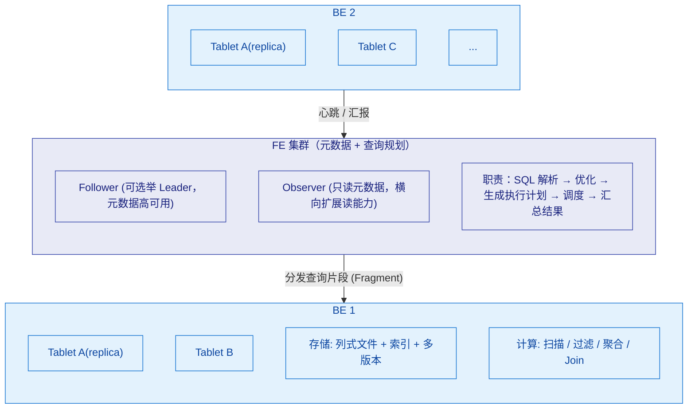
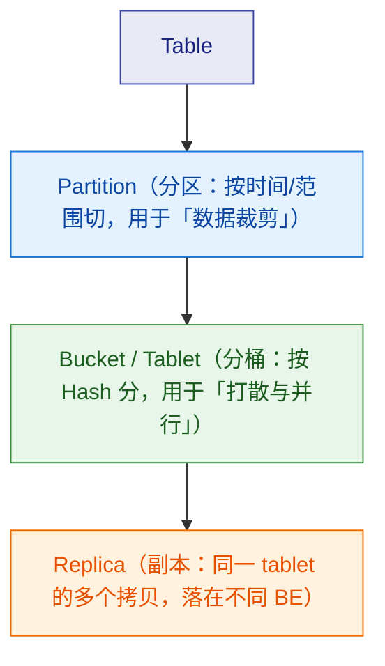

# 🏗️ 一、Doris 架构与原理

> 本篇建立 Doris 的**整体地图**：集群里有哪些角色、元数据放在哪、一张表的数据到底怎么分布（分区/分桶/tablet/副本）、一条 SQL 从提交到出结果经历了什么、以及存算一体与存算分离两种部署形态的差别。
> 读完应该能画出 Doris 架构图，并解释"一次查询是怎么在集群上跑完的"。
> 关联：[[0-Doris总览]]、[[2-数据模型]]（表模型）、[[4-建表与分区分桶]]（分区分桶语法）、[[5-查询优化]]（执行计划）、[[8-运维与调优]]（Compaction/内存）。

---

## 一、Doris 是什么

### 1.1 一句话定位

> **Apache Doris 是一个 MPP（Massively Parallel Processing）架构的列式存储 OLAP 数据库，核心卖点是：实时写入、高并发查询、多表 Join、易运维。**

### 1.2 三个关键词

| 关键词 | 含义 | 带来的能力 |
|---|---|---|
| **MPP** | 查询被拆成多个片段，在多个 BE 上**并行执行**，最后汇总 | 大查询能靠加机器线性加速 |
| **列式存储** | 按列存、按列压、按列读 | 只读需要的列，聚合扫描快，压缩比高 |
| **实时写入** | Stream Load / Routine Load 支持秒级可见 | 支撑实时数仓（CDC→Flink→Doris） |

### 1.3 与两类系统的差异

| 对比对象 | 差异要点 |
|---|---|
| **MySQL 等 OLTP** | 行存、强事务、点查极快；Doris 面向**分析型**（大范围扫描 + 聚合），不适合高频单行事务更新 |
| **Hive/Spark 等批处理** | 离线、高延迟、吞吐大；Doris 支持**实时写入 + 交互式查询**，但单次超大规模批处理仍交给 Spark |
| **ClickHouse** | 同为列式 OLAP；Doris 在**主键更新、多表 Join、集群运维**上更省心，详见 [[9-对比StarRocks与ClickHouse]] |

---

## 二、集群角色

### 2.1 架构总图（存算一体）



### 2.2 角色职责表

| 角色 | 职责 | 关键点 |
|---|---|---|
| **FE (Frontend)** | 元数据管理、SQL 解析与优化、执行计划生成、查询调度、结果汇总 | 有 **Follower / Observer** 两种角色 |
| ├─ **Follower** | 参与**元数据写**与**Leader 选举**（基于类 Paxos/BDB JE 的一致性协议） | 生产建议**至少 3 个**（奇数） |
| └─ **Observer** | 只同步元数据、**不参与选举**，用于**横向扩展查询并发** | 读多写少的场景加 Observer 很划算 |
| **BE (Backend)** | **数据存储 + 计算执行**；tablet 落在 BE | 扩容加 BE；内存与 SSD 是关键资源 |
| **Broker** | 只在访问外部存储（HDFS/对象存储）时使用（Broker Load） | 无状态，可多实例 |

> [!important] FE 与 BE 的边界
> **FE 不做数据存储，BE 不做元数据决策。** 所有"表结构、分区、副本放哪台 BE"的决定都由 FE 做；BE 只管执行和存数据。
> 因此 **FE 是元数据单点意义所在**（必须高可用），而 **BE 挂了只影响它上面的 tablet**（靠副本恢复）。

### 2.3 元数据与高可用

| 项 | 说明 |
|---|---|
| 元数据内容 | 库/表结构、分区与分桶信息、副本分布、用户与权限、导入事务等 |
| 存储方式 | FE 本地 + **BDB JE 日志**在 Follower 之间同步；**不是**存在 MySQL 里（这是常见误解，Doris 元数据是自管理的） |
| Leader 选举 | Follower 之间选主；写请求必须走 Leader |
| 容错 | 少数 Follower 故障不影响可用性；**多数派不可用则无法写入元数据** |
| Observer 的价值 | 不参与选举、不增加写一致性开销，却能被客户端读元数据并承担查询规划 → 提升并发 |

> [!tip] 部署建议
> FE：**3 个 Follower**（生产最小高可用）+ 按需 **若干 Observer**。
> BE：≥ 3 台（配合 `replication_num=3`），磁盘用 SSD。

---

## 三、数据分布：分区、分桶、tablet、副本

这是理解 Doris 性能与运维的**核心模型**，务必记牢这四层关系。

### 3.1 四层结构



| 层次 | 划分依据 | 作用 | 数量影响 |
|---|---|---|---|
| **Partition** | RANGE / LIST（常按天、按月） | **分区裁剪**：查询只扫相关分区 | 过多 → 元数据压力；过少 → 裁剪失效 |
| **Bucket (Tablet)** | `DISTRIBUTED BY HASH(k) BUCKETS n` | **数据打散 + 查询并行度** | 过多 → 小 tablet、Compaction 压力大 |
| **Replica** | `replication_num` | 高可用与读扩展 | 3 副本是生产常规 |

> [!important] tablet 数量公式（运维必须会算）
> **单表 tablet 数 ≈ 分区数 × 分桶数 × 副本数**
> 例：按天分区保留 365 天、32 个分桶、3 副本 → `365 × 32 × 3 ≈ 35,000` 个 tablet。**如果每个 BE 上再放几百张这样的表，元数据与 Compaction 压力会爆炸。**
> 这就是"按小时分区 + 分桶数给大"这类设计为什么危险（见 [[3-表设计]] 的反模式）。

### 3.2 数据在 BE 上以什么形式存在

| 组成 | 说明 |
|---|---|
| **列式数据文件** | Segment 文件（含 data page、索引）；按列存、按列压 |
| **前缀索引（Short Key Index）** | 基于**排序键**的稀疏索引，每若干行一条，用于快速定位 |
| **ZoneMap** | 每列的 min/max，用于范围过滤 |
| **Bloom Filter** | 可选，加速等值过滤（`bloom_filter_columns`） |
| **倒排索引** | 可选，全文/等值/范围加速（2.x+） |
| **多版本** | 每次导入产生一个新**版本（Rowset）**，由 **Compaction** 后台合并 → 见 §6 |

> 索引选择与建模详见 [[2-数据模型]]，分区分桶语法见 [[4-建表与分区分桶]]。

---

## 四、一次查询的完整流程

### 4.1 流程分解

| 步骤 | 在哪 | 做什么 |
|---|---|---|
| 1 | 客户端 → FE | 建立连接、鉴权、提交 SQL |
| 2 | FE | **解析（Parse）** → 语法树 |
| 3 | FE | **分析与绑定** → 逻辑计划（表/列/类型校验、权限） |
| 4 | FE | **优化** → 物理计划：谓词下推、分区裁剪、Join 顺序与方式选择、聚合下推（依赖 **CBO + 统计信息**） |
| 5 | FE | **拆分 Fragment**：把计划切成可并行执行的片段，分配到各 BE |
| 6 | BE | 各 BE **并行执行**：扫描本地 tablet → 过滤/聚合 → 按需 **Shuffle** 给其他 BE |
| 7 | FE | **汇总**各 BE 结果，返回客户端 |

### 4.2 并行与数据交换

| 机制 | 说明 |
|---|---|
| **Fragment / Instance** | 计划被切成 Fragment，每个 Fragment 在多个 BE 上起多个 Instance 并行执行 |
| **Shuffle** | 需要跨节点重分布数据时发生（如 Join 的 shuffle join、分组聚合）——**网络是常见瓶颈** |
| **Colocate Join** | 若两表**分桶键与分桶数一致**（同一个 colocate group），可**本地 Join、零 Shuffle** —— 这是建表时值得为 Join 优化的理由（见 [[3-表设计]]、[[5-查询优化]]） |
| **Runtime Filter** | 大表 join 小表时，把小表的过滤条件下推到扫描端，**减少扫描量** |

> [!tip] 排查查询问题的两个入口
> ① **`EXPLAIN`** 看**计划**（有没有分区裁剪、用了哪种 Join、有无 Shuffle）；
> ② **`PROFILE`** 看**真实运行时**（各算子耗时、扫描行数、是否倾斜）。
> 详细读法见 [[5-查询优化]]。

---

## 五、写入路径概览

Doris 的写入有多个入口，但**最终都落成 BE 上的一个新版本（Rowset）**：

| 入口 | 场景 | 同步/异步 |
|---|---|---|
| **Stream Load** | HTTP 推数据（Flink Connector 底层用的就是它） | 同步返回 |
| **Routine Load** | 常驻消费 Kafka | 异步常驻 |
| **Broker Load** | 从 HDFS/对象存储批量导入 | 异步 |
| **INSERT INTO** | SQL 方式写入（小批量/加工结果） | 同步 |
| **Spark Load** | 超大初始数据导入（历史方案） | 异步 |

**写入的关键机制**：

| 机制 | 作用 |
|---|---|
| **Label** | 导入事务的**幂等标识**：同一 label 重复提交会被识别为同一事务，**这是"不重"的基础** |
| **多版本** | 每次导入生成新版本；查询需合并多版本 → 版本越多读越慢 |
| **Compaction** | 后台把多版本合并成更少的大版本，**控制读放大**（详见 §6 与 [[8-运维与调优]]） |
| **两阶段提交** | 配合 Flink 的 checkpoint 实现端到端精确一次 |

> 完整导入方式对比、Flink Connector 用法与 CDC 链路见 [[6-数据导入与FlinkCDC]]。

---

## 六、多版本与 Compaction（为什么它决定集群健康）

> [!important] 一句话理解
> **Doris 的写入不是"原地更新"，而是"追加一个新版本"，读的时候合并。版本堆多了，读就慢了——所以必须有 Compaction 不停地合并。**

| 概念 | 说明 |
|---|---|
| **Rowset / 版本** | 一次导入产生一个版本；查询要跨版本合并 |
| **Cumulative Compaction** | 合并**近期**的增量版本（高频发生，轻量） |
| **Base Compaction** | 把累积版本合并进**基线大版本**（代价较大） |
| **Compaction Score** | 衡量某 tablet 待合并压力的指标，**分越高越危险** |

**为什么写入频率高会出事**：每次小批导入都产生版本 → 版本数快速上升 → 读放大、Compaction 追不上 → 触发 **`-235 too many versions`** 之类的导入失败。

**治理方向**（详细见 [[8-运维与调优]]）：① 客户端**攒批**（降低导入频率、增大单批）；② 调整 Compaction 相关参数；③ 监控 compaction score 与版本数并告警。

> [!warning] 这是 Doris 最常见的线上事故来源
> 很多团队用"每条消息一次导入"的方式写 Doris，跑几天就出现导入失败、查询变慢。**正解是攒批 + 合理 label。** 详见 [[6-数据导入与FlinkCDC]]。

---

## 七、存算一体与存算分离

### 7.1 两种形态对比

| 维度 | 存算一体 | 存算分离（**3.0 起支持**） |
|---|---|---|
| 数据存放 | BE 本地磁盘（含多副本） | **共享存储**（S3/HDFS 等）+ 本地缓存 |
| 成本 | 存算绑定，扩容要一起扩 | 存储便宜、计算按需弹性 |
| 弹性 | 扩缩容需迁数据 | 计算节点快速增减 |
| 负载隔离 | 较弱（同一批 BE 承担所有） | **多计算集群隔离读写/不同业务负载** |
| 适用 | 中小规模、追求简单与低延迟 | 云原生、大规模、多租户、成本敏感 |

### 7.2 关键理解

- 存算分离把**计算层（BE/CN）**与**存储层**解耦，数据放共享存储，本地只做缓存。
- 好处：查询负载可以**物理隔离**（例如报表集群与写入集群分开），扩缩容不必搬数据。
- 代价：远端读有延迟（靠**本地缓存**与预取缓解）；架构与运维复杂度上升。
- 版本口径：3.0 引入、4.x 持续增强；**上线前以官方文档为准**。

---

## 八、动手验证

```sql
-- 1) 查看集群节点
SHOW FRONTENDS;                 -- FE 列表与角色（FOLLOWER/OBSERVER）
SHOW BACKENDS;                  -- BE 列表、存活状态、磁盘使用

-- 2) 建一张表并观察数据分布
CREATE TABLE demo_orders (
    dt          DATE        NOT NULL,
    order_id    BIGINT      NOT NULL,
    user_id     BIGINT,
    amount      DECIMAL(18,2)
)
ENGINE=OLAP
DUPLICATE KEY(dt, order_id)
PARTITION BY RANGE(dt) (
    PARTITION p20261009 VALUES LESS THAN ("2026-10-10")
)
DISTRIBUTED BY HASH(order_id) BUCKETS 4
PROPERTIES("replication_num" = "1");   -- 单机测试用 1

-- 3) 看 tablet 分布（分区 × 分桶 × 副本 的实际展开）
SHOW TABLETS FROM demo_orders;
SHOW DATA FROM demo_orders;            -- 数据量与副本数汇总

-- 4) 看表结构、分区、索引
DESC demo_orders;
SHOW PARTITIONS FROM demo_orders;
SHOW INDEX FROM demo_orders;

-- 5) 看执行计划：是否分区裁剪、用了哪种 Join
EXPLAIN SELECT user_id, SUM(amount)
FROM demo_orders
WHERE dt = '2026-10-09'
GROUP BY user_id;

-- 6) 看真实运行时各算子耗时
--    先执行上面的查询，再从查询列表拿到 query_id
SHOW PROC '/current_queries';
-- PROFILE '<query_id>';   -- 不同版本命令形态略有差异，以官方文档为准

-- 7) 观察版本与 Compaction 压力
SHOW PROC '/compaction';      -- 各 BE 的 compaction 情况（部分版本提供）
```

**观察点**：
- 步骤 1 中 FE 的角色与数量 → 验证"Follower/Observer"。
- 步骤 3 中 tablet 数应等于 **分区数 × 分桶数 × 副本数** → 验证 §3.1 的公式。
- 步骤 5 的 `EXPLAIN` 中应能看到**只扫描了 p20261009 一个分区** → 验证"分区裁剪"。
- 把 `WHERE dt = ...` 改成 `WHERE DATE_FORMAT(dt,'%Y%m%d') = '20261009'` 再 `EXPLAIN`，观察**裁剪失效** → 这是最经典的性能坑。

---

## 九、本篇必答

> [!question] 面试官可能这样问
> **Q：画一下 Doris 的架构。**
> A：**FE + BE** 两层。FE 负责元数据管理、SQL 解析与优化、生成执行计划、调度与汇总结果，角色分 **Follower（参与选举与元数据写）和 Observer（只读元数据、扩展查询并发）**；BE 负责**数据存储与计算执行**，tablet 落在 BE 上。数据分布是 **表 → 分区 → 分桶（tablet）→ 副本** 四层。3.0 起还支持**存算分离**部署。
>
> **Q：一张表的数据是怎么分布的？**
> A：先按**分区**（通常按时间 RANGE）切，用于**分区裁剪**；每个分区内按 **Hash 分桶**（`DISTRIBUTED BY HASH(...) BUCKETS n`）打散到多个 **tablet**，tablet 是**最小数据分片单位**；每个 tablet 有 `replication_num` 份**副本**放在不同 BE。总 tablet 数 ≈ **分区数 × 分桶数 × 副本数**。
>
> **Q：一条 SQL 在 Doris 里怎么执行？**
> A：FE 解析 → 生成逻辑计划 → **CBO 优化**（谓词下推、分区裁剪、Join 方式与顺序、Runtime Filter）→ 拆成多个 **Fragment** 分发到各 BE → BE **并行执行**（扫描本地 tablet、聚合、必要时 Shuffle）→ FE 汇总返回。排查时用 **`EXPLAIN` 看计划、`PROFILE` 看真实耗时**。
>
> **Q：为什么 Doris 写入会产生很多版本？**
> A：Doris 的写入是**追加新版本（Rowset）**而不是原地更新，保证写入高效与一致性。版本多了读时要合并更多版本，**读放大**。所以必须有 **Compaction** 后台合并，并且客户端要**攒批**写入；否则会出现 **`-235 too many versions`** 与查询变慢。

---
> 下一篇 → [[2-数据模型]]：三种模型怎么选，`DUPLICATE KEY` 到底是不是唯一约束。
