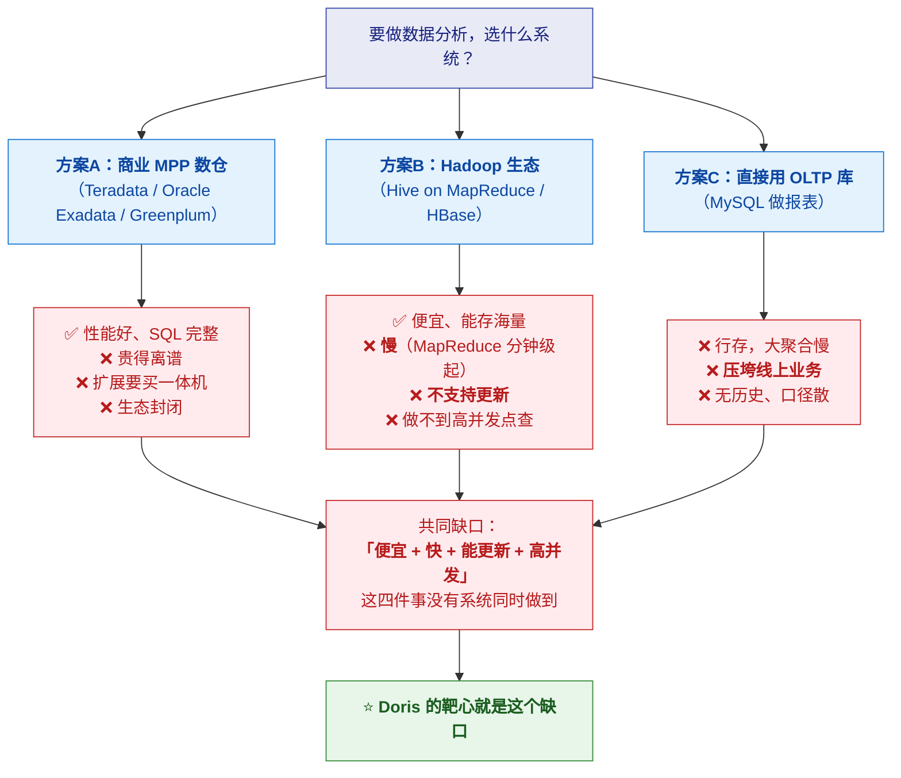
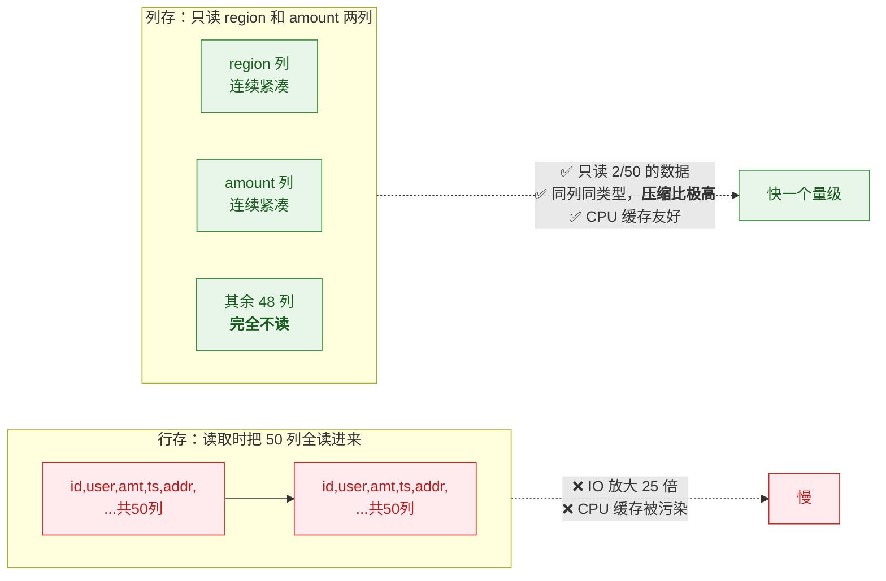
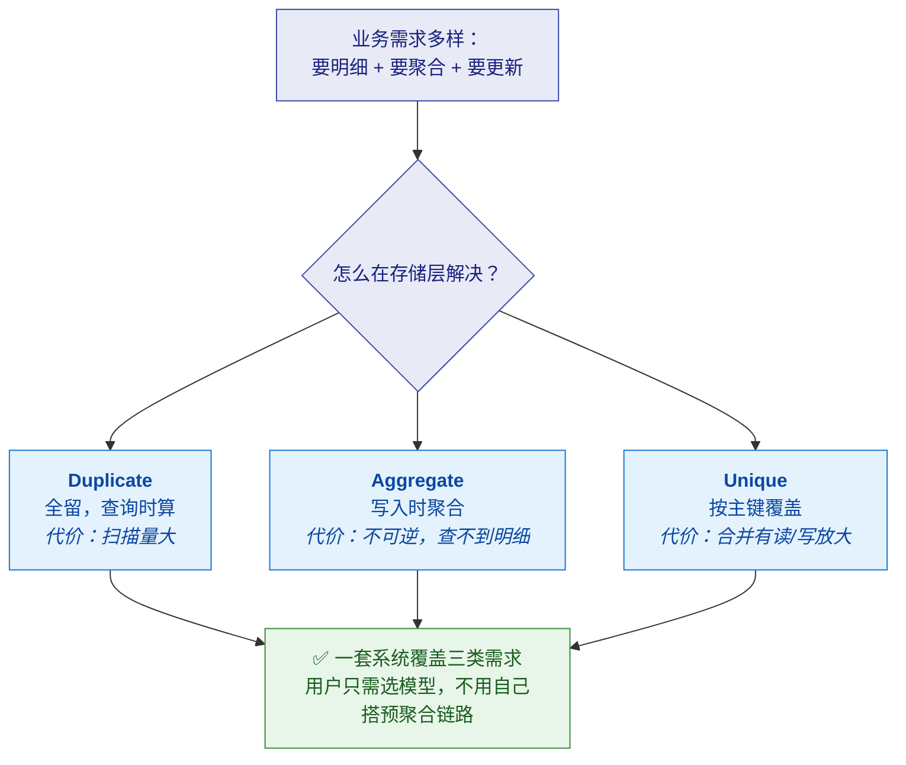
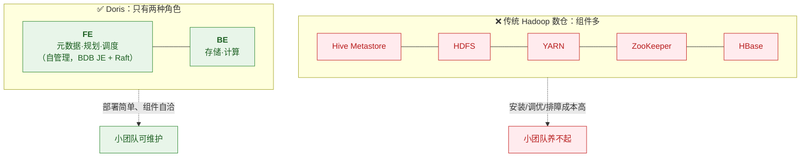
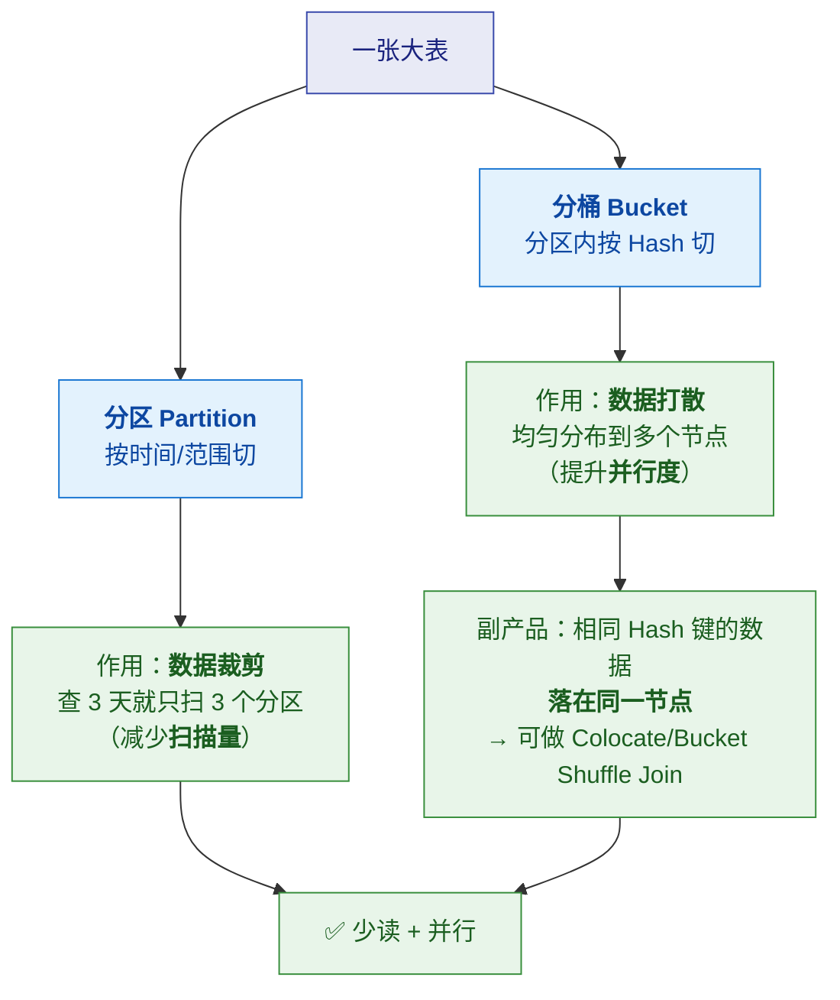
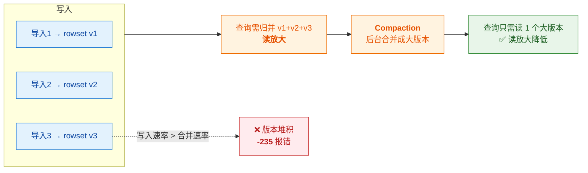
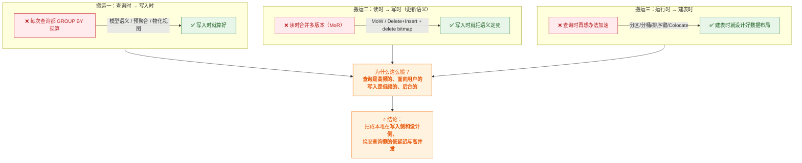

# 🎯 四、Doris 设计初衷与核心目标

> [!abstract] 这篇笔记回答一个问题
> **"Doris 为什么要设计成这样？"**
>
> 前面几篇讲的是**它是什么、怎么用**（what / how）；
> 这一篇讲的是**为什么会有这些设计**（why）——
> 每个设计决策背后**要解决什么现实问题**、**付出了什么代价**。
>
> **读法建议**：每一个机制都按 **① 问题 → ② 设计决策 → ③ 代价与边界** 三段来看。
> 面试时能讲清"为什么这么设计"，比"它有什么功能"高一个层次。

---

## 一、先看时代背景：Doris 要解决什么问题

### 1.1 2010 年前后，数据分析面临的两难

> [!note] 当时的现实困境
> 企业做数据分析，只有两类选择，**各有硬伤**：



> [!important] Doris 的核心目标就一句话
> **用开源、廉价、易运维的架构，同时做到"实时写入 + 高并发查询 + 多表 Join"，
> 把过去只有商业 MPP 数仓才能提供的分析服务能力，做成普通团队也养得起的系统。**

### 1.2 拆解成四个可检验的目标

| # | 目标 | 要解决的痛点 | 对应设计 |
|---|---|---|---|
| 1 | **实时写入** | Hive 只能 T+1，业务要"秒级看到" | Stream Load / Routine Load + 主键模型 |
| 2 | **高并发查询** | Hadoop 系只能跑大查询，撑不住几百并发报表 | 列存 + 向量化 + 轻量查询路径 + 资源隔离 |
| 3 | **多表 Join** | ClickHouse 类系统 Join 弱，BI 场景难做 | CBO + Colocate/Bucket Shuffle + Runtime Filter |
| 4 | **易运维** | 商业数仓贵且重；Hadoop 组件多、调优难 | FE/BE 两角色、无外部依赖、自动重平衡 |

> [!tip] 面试可以这样开场
> **"理解 Doris 的关键，是先看它想取代谁。**
> 它想取代的是'**又贵又重的商业 MPP 数仓**'，
> 同时补上'Hadoop 系不能实时、不能更新、撑不住高并发'的短板。
> **所以它的每一个设计都能对应到'降低使用门槛'和'补齐实时能力'这两条主线上。**"

---

## 二、六个核心设计决策（每个都有明确靶心）

### 2.1 决策一：为什么用列式存储

> [!question] 问题
> 分析查询的典型形态是"**扫海量数据，但只用少数几列**"：
> ```sql
> SELECT region, SUM(amount) FROM orders GROUP BY region;
> -- 表有 50 列，但只用到 2 列
> ```



| 维度 | 内容 |
|---|---|
| **① 问题** | 行存读一行带出所有列；分析只需少数列 → **IO 浪费 + 缓存污染** |
| **② 决策** | **按列存储 + 按列压缩**（同列同类型、且有序 → 压缩比远高于行存） |
| **③ 代价** | ❌ **点查（取整行）反而变慢**——要读多列再拼装；❌ 单行更新代价高（列存不是为原地更新设计的） |

> [!important] 由这个代价推出的后续设计
> 因为列存"点查慢、更新贵"，所以 Doris 必须**额外设计机制来补偿**：
> - **点查慢** → 前缀索引、ZoneMap、Bloom Filter、**行列混存（row store）**
> - **更新贵** → 表采用**追加写 + 模型语义 + Compaction**，而不是原地更新
>
> 👉 **这就是"一个设计决策会连带引出一串设计"的典型例子**——理解这条链，比孤立记机制有用得多。

---

### 2.2 决策二：为什么需要"数据模型"

> [!question] 问题
> 同一份业务事实，**不同消费方式要的形态完全不同**：
> - 明细：每一次点击都要留着
> - 看板：只关心"每个广告每分钟点击总数"
>
> 用一张明细表硬扛所有需求，要么**查询时现算（贵）**，要么**定时预聚合（慢、不实时）**。

| 维度 | 内容 |
|---|---|
| **① 问题** | 一套存储，要同时服务"看明细"和"看聚合"两种需求；且业务数据会**更新**（订单改状态） |
| **② 决策** | **在存储层用"模型语义"把聚合/去重/更新做掉**：<br/>Duplicate（留全量）/ Aggregate（写入时预聚合）/ Unique（按主键覆盖） |
| **③ 代价** | Aggregate **聚合不可逆**（查不到明细）；Unique 老机制 **MoW/MoR 有读写放大**；模型**建表时选定，改动代价大** |



> [!important] 设计目的（面试要点）
> **把"预聚合"和"去重"的成本从"查询时"搬到"写入时"，
> 让一条 SQL 就能直接查到想要的形态，而不需要用户自己维护一套 ETL 预聚合表。**
> 这也是 Doris 区别于"纯扫描引擎"（如 ClickHouse）的核心取向。

---

### 2.3 决策三：为什么是 FE/BE 两角色 + 自管理元数据

> [!question] 问题
> Hadoop 生态一个数仓要装 Hive Metastore + HDFS + YARN + ZooKeeper + HBase……
> **组件多 = 运维重 = 小团队养不起**。而商业 MPP 数仓虽然一体化，但封闭且贵。

| 维度 | 内容 |
|---|---|
| **① 问题** | 分析系统的**部署与运维门槛**太高（组件多、依赖外部协调服务） |
| **② 决策** | 只设**两种角色**：**FE**（元数据 + 规划 + 调度）+ **BE**（存储 + 计算）；<br/>元数据**自管理**（BDB JE + Raft），**不依赖外部 MySQL/ZooKeeper** |
| **③ 代价** | FE 成为**元数据单点关注点**（必须做多副本高可用）；<br/>FE 的元数据管理是**自研逻辑**，运维要理解 Raft 多数派语义 |



> [!important] 设计目的
> **"把运维复杂度收进系统内部，而不是暴露给用户。"**
> 用户不需要懂 Raft、不需要自己搭协调服务——
> **这是"降低使用门槛"这条主线上最典型的一个决策。**

---

### 2.4 决策四：为什么分"分区 + 分桶"两级

> [!question] 问题
> 一张表有几百亿行数据分布在几十台机器上。查询要快，只有两条路：
> **① 少读数据（裁剪）② 并行读（打散）**。这两个需求**性质不同，需要两套机制**。



| 维度 | 内容 |
|---|---|
| **① 问题** | 需要**同时**解决"减少扫描量"和"提升并行度"两个不同性质的问题 |
| **② 决策** | **分区管裁剪（减少扫描）、分桶管打散（提升并行）**；<br/>分桶键选得好还能**顺带获得 Colocate Join 能力** |
| **③ 代价** | **建表时就要估准**——分桶数给多了 → 海量小 tablet → 元数据与 Compaction 压力剧增；给少了 → 并行度不足。**建后调整代价大** |

> [!important] 设计目的（一句话）
> **"分区解决'读多少'，分桶解决'谁来读'。"**
> 而且分桶键的设计**一箭双雕**：既打散数据，又为 Join 优化铺路。

---

### 2.5 决策五：为什么是"追加写 + Compaction"

> [!question] 问题
> 列存文件是**不可变的**（列式压缩要求整块确定），
> 那怎么支持"数据导入"和"更新"？**总不能每次导入都重写全表。**

| 维度 | 内容 |
|---|---|
| **① 问题** | 列存文件不可变，但数据要持续写入与更新 |
| **② 决策** | **追加写新的 rowset（版本）**，查询时归并多个版本；<br/>后台用 **Compaction** 把小版本合并成大版本，控制读放大 |
| **③ 代价** | ⚠️ **写得太碎会让版本堆积**，Compaction 追不上 → **`-235 too many versions`**；<br/>Compaction 本身消耗 CPU/IO，与查询争资源 |



> [!important] 设计目的与"为什么必须攒批"
> **追加写让"导入"变得轻量（不用改已有文件），Compaction 在后台把读放大收回来。**
> **这个设计成立的前提是"写入节奏不能太快"**——
> 所以 `-235` 的根因永远是"写得太碎"，
> **治本手段是从上游攒批，而不是只调 Compaction 参数。**

---

### 2.6 决策六：为什么把"资源隔离"做进去

> [!question] 问题
> 一个集群上跑着多种负载：**核心报表（要低延迟）** + **分析师即席查询（可能跑大查询）** +
> **ETL 导入（吃 IO）**。**一个跑飞的查询会把整个集群拖垮。**

| 维度 | 内容 |
|---|---|
| **① 问题** | 多业务共用一个集群，**负载互相干扰**，没有隔离就会互相拖垮 |
| **② 决策** | **Workload Group**（进程内 CPU/内存/并发/队列隔离）+ **Resource Group / Compute Group**（进程间、物理隔离） |
| **③ 代价** | 需要**规划与调参**（组怎么分、配额给多少）；隔离本身**牺牲一点资源利用率**（预留的资源别人用不了） |

> [!important] 设计目的
> **"让一个集群能同时服务多种负载而不互相伤害"**——
> 这直接对应"降低使用门槛"：**用户不必为了隔离而部署多套集群。**

---

## 三、贯穿始终的一条主线：三次"成本搬运"

> [!important] ⭐ 这是理解 Doris 设计哲学的最高视角
> Doris 的多数设计决策，本质上都是在做**同一件事：把成本从"贵的地方"搬到"便宜的地方"**。



> [!tip] 这个视角的面试价值
> 被问"你为什么这么建表/为什么用这个模型"时，
> **用"成本搬运"来回答，比背具体规则更有说服力**：
>
> **"我的判断标准是——这笔成本能不能从查询侧搬到写入侧或设计侧？
> 如果能，就值得搬，因为查询是面向几百个用户的实时请求，写入是后台批量任务。"**

---

## 四、诚实的边界：Doris 不擅长什么

> [!warning] 每个设计取向都意味着"放弃了什么"
> 理解一个系统的边界，比记住它的优点更能体现判断力。

| 不擅长 | 为什么（设计取向导致的） |
|---|---|
| **高频单行事务（OLTP）** | 列存 + 追加写，**不是为原地更新和行级锁设计的** |
| **极致单表扫描性能** | 它的目标是"实时写入 + 高并发 + 多表 Join"的综合平衡，**纯扫描性能不如 ClickHouse 那样把单机压到极致** |
| **半结构化/复杂类型** | 传统上是关系型优先；VARIANT 等能力在逐步补齐，但**类型体系的丰富度不如 ClickHouse** |
| **超大规模 append-only 日志** | 这类场景**用 ClickHouse 或专用系统可能单位成本更低** |
| **需要极致灵活的表结构变更** | 某些 DDL（如改分桶）相对更重（因为要动数据布局） |

> [!important] 面试怎么用这张表
> **主动说出边界，反而更可信**：
> **"Doris 不是全面最优，它是'实时数仓'这个定位上的最优解之一。
> 如果场景是海量日志的 append-only 扫描，我会反过来推荐 ClickHouse。"**
> 详见 [[9-对比StarRocks与ClickHouse]]

---

## 五、30 秒速查

| 问题 | 答案 |
|---|---|
| Doris 要解决的核心问题 | 商业 MPP 数仓**太贵太重**，Hadoop 系**不能实时、不能更新、撑不住高并发** |
| 四个核心目标 | **实时写入 + 高并发查询 + 多表 Join + 易运维** |
| 为什么用列式存储 | 分析只读少数列 → **避免 IO 放大、压缩比高、CPU 缓存友好** |
| 列存的代价是什么 | **点查变慢、单行更新贵** → 所以要补索引/行列混存/追加写模型 |
| 为什么需要数据模型 | 把**预聚合与去重的成本从查询时搬到写入时**，一套系统服务多种需求 |
| 为什么只有 FE/BE | **把运维复杂度收进系统内部**，降低小团队的使用门槛 |
| 为什么元数据自管理 | **不依赖外部 MySQL/ZooKeeper**，部署更简单（代价：要理解 Raft 多数派） |
| 分区与分桶分别解决什么 | **分区解决"读多少"（裁剪），分桶解决"谁来读"（并行）** |
| 分桶键设计的一箭双雕 | 既打散数据，又可能获得 **Colocate Join** 能力 |
| 为什么要 Compaction | 列存文件不可变 → **追加写产生多版本** → 后台合并降低读放大 |
| `-235` 的设计根源 | 追加写 + Compaction 追不上 → **写入节奏不能太碎**，治本是攒批 |
| 为什么做资源隔离 | 一个集群服务多种负载，**避免一个跑飞的查询拖垮全集群** |
| 最高视角的设计哲学 | **成本搬运**：把成本从查询侧搬到**写入侧**和**设计侧** |
| Doris 不擅长什么 | OLTP、极致单表扫描、半结构化类型、超大规模日志、灵活表结构变更 |

---

## 六、学习检查清单

- [ ] 能说出 Doris 出现时，数据分析面临的**两难**（商业数仓贵 / Hadoop 慢且不能更新）
- [ ] 能背出**四个核心目标**，并各自对应到一个具体设计
- [ ] ⭐ 能讲清**列式存储解决什么问题、付出什么代价**，以及由代价引出的后续设计
- [ ] 能解释"为什么要设计数据模型"——核心是**成本从查询时搬到写入时**
- [ ] 能说清"只有 FE/BE + 元数据自管理"的**目的是降低运维门槛**
- [ ] ⭐ 能区分**分区与分桶解决的是两个不同性质的问题**
- [ ] 能讲清"追加写 + Compaction"的设计动机，并推导出 `-235` 的根源
- [ ] 能说清资源隔离要解决什么现实问题
- [ ] ⭐ 能用**"三次成本搬运"**这个统一视角解释多个设计决策
- [ ] 能诚实说出 Doris **不擅长**什么，以及为什么（设计取向导致）

---
> 关联：[[0-Doris总览]] · [[1-架构与原理]] · [[2-数据模型]] · [[5-Doris细节设计的目的]]
> 对比：[[8-StarRocks设计初衷与核心目标]] · [[9-对比StarRocks与ClickHouse]]
