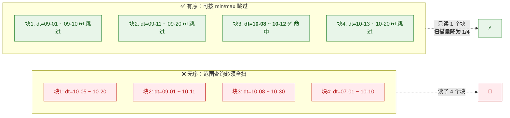
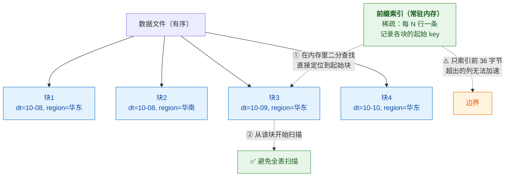
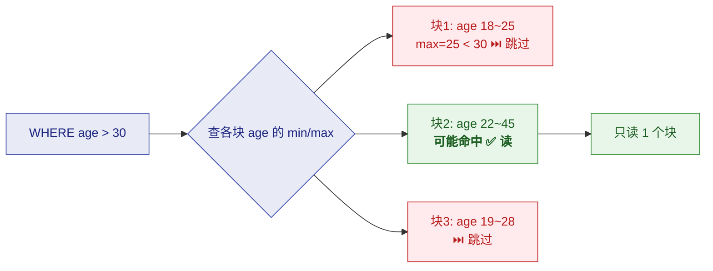
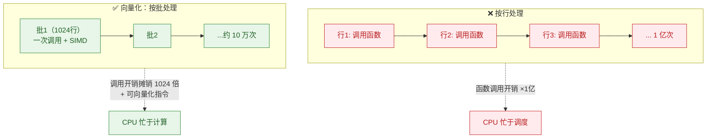
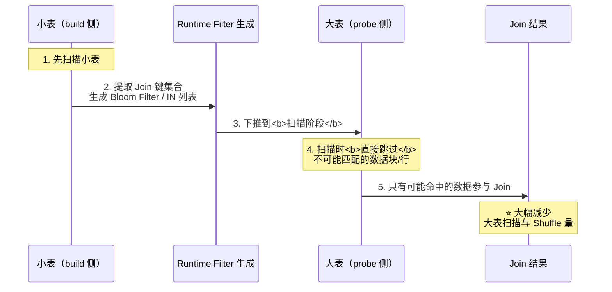
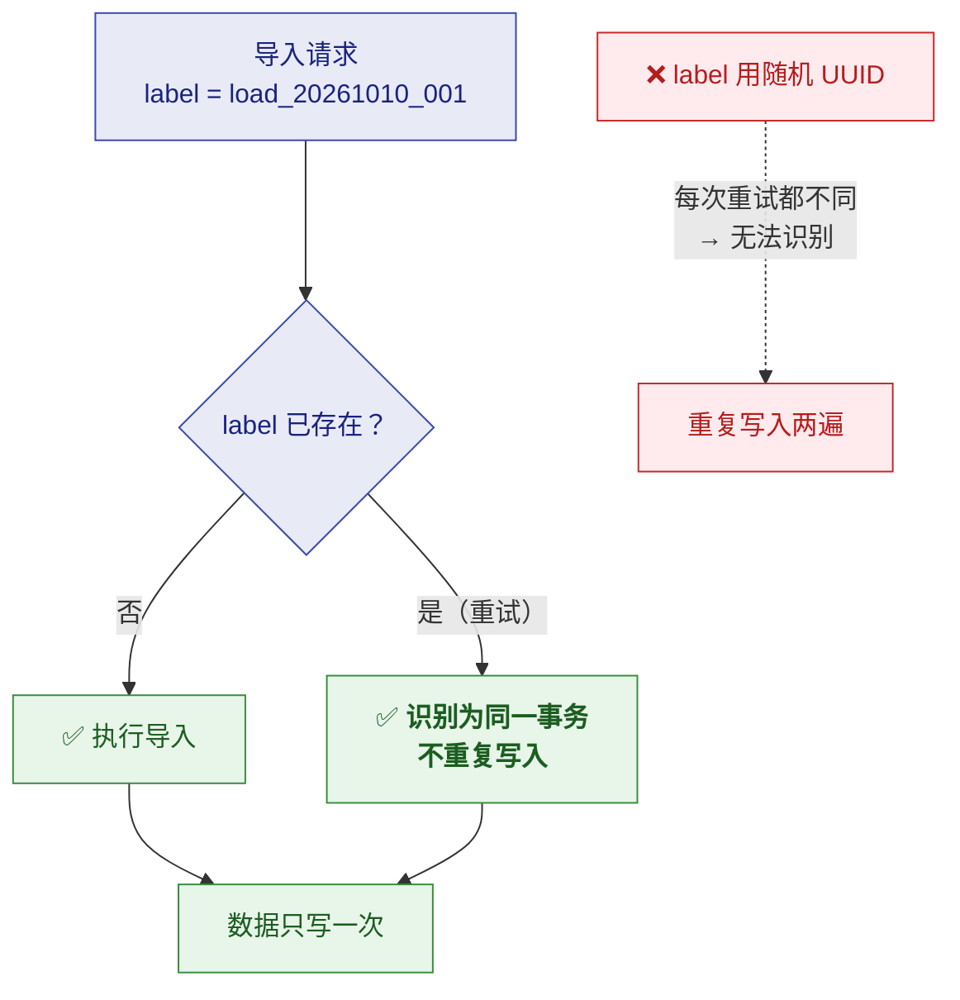
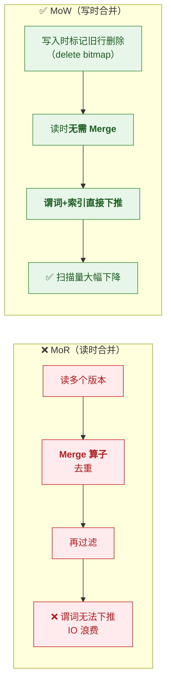
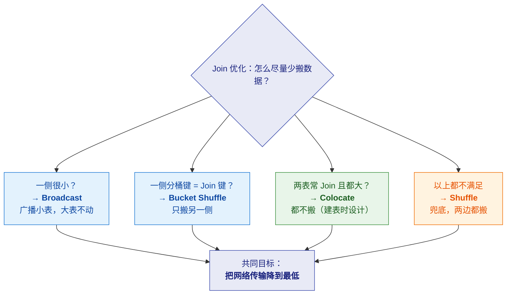
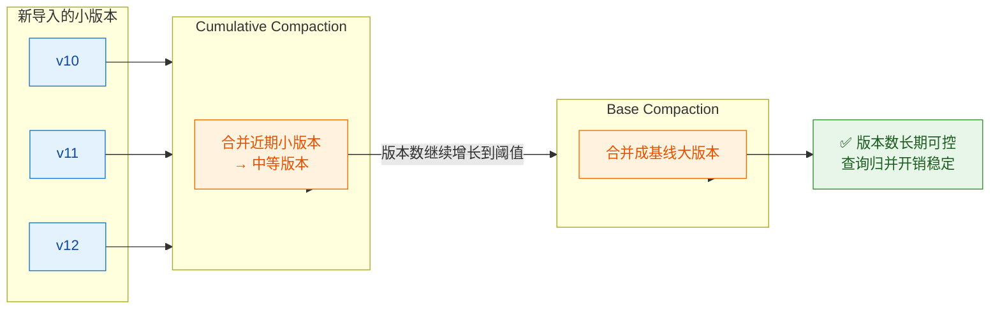

# 🔬 五、Doris 细节设计的目的

> [!abstract] 这篇笔记回答一个问题
> **"每一个具体机制，到底是为了解决什么问题而存在的？"**
>
> [[4-Doris设计初衷与核心目标]] 讲的是**宏观设计哲学**（为什么这样设计整个系统）；
> 这一篇**下沉到每个具体机制**，逐条拆解 **① 它要解决什么问题 → ② 怎么解决 → ③ 代价与边界**。
>
> **这是"面试深挖"最容易被追问的层次**——面试官问"排序键是干嘛的"，
> 只会背定义的人答"决定物理排序"，能讲清目的的人答"**为了让范围查询能跳过大量数据块**"。

---

## 一、存储布局类设计

### 1.1 排序键（Sort Key）

> [!question] 它要解决什么问题？
> **列存的致命弱点**：如果数据无序，**任何范围查询都必须扫描全部数据块**。
> 一个 `WHERE dt = '2026-10-10'` 也要把整列读完才能过滤——**列裁剪省了列，但没省行**。

| 维度 | 内容 |
|---|---|
| **① 问题** | 列存只解决了"少读列"，**没有解决"少读行"** |
| **② 决策** | 数据按**排序键有序存储** → 查询时可通过**比较数据块的 min/max** 直接跳过不相关的块 |
| **③ 代价** | ⚠️ **只能吃最左前缀**（所以字段顺序至关重要）；⚠️ **建表后基本改不动**（改排序键要重排数据） |

> [!success] 一句话讲清目的
> **排序键的目的是"让查询能跳过数据"**——
> 它把"我要逐个检查每一行"变成"我只看可能命中的那几块"。
> **这是列存能真正快起来的前提。**

> [!tip] 由此推出的设计规则
> **"最常用于过滤的字段要放在排序键最前面"** ——
> 因为前缀索引只吃最左前缀，顺序错了等于白设。
> 详见 [[3-表设计]]

---

### 1.2 前缀索引（Prefix Index / Short Key Index）

> [!question] 它要解决什么问题？
> 有了排序键还不够——**数据块很多时，怎么快速找到"该从哪个块开始读"？**
> 总不能线性扫描所有块的 min/max。

| 维度 | 内容 |
|---|---|
| **① 问题** | 排好序了，但**定位起始位置**仍需快速索引 |
| **② 决策** | 基于排序键**最左前缀**（约前 36 字节）建**稀疏索引**——每 N 行记一条索引项，**常驻内存** |
| **③ 代价** | ⚠️ **只吃最左前缀**（前缀之外的字段无法利用）；⚠️ **有字节数上限**（约 36 字节，所以超长 VARCHAR 放前面会挤掉后面的列） |

> [!important] 设计目的
> **把"定位数据的成本"从磁盘 IO 降级为内存查找。**
> 这是"用少量内存换大量 IO"的经典交易——稀疏索引只占极小空间，却能跳过绝大部分数据。

---

### 1.3 ZoneMap 索引

> [!question] 它要解决什么问题？
> 前缀索引只对**排序键前缀**有效。
> 但业务经常过滤**非排序键的字段**（如 `WHERE age > 30`，而 age 不在排序键里）——
> **这些字段怎么加速？**

| 维度 | 内容 |
|---|---|
| **① 问题** | 非排序键字段的过滤**享受不到前缀索引** |
| **② 决策** | **为每一列**记录其数据块的 **min/max** → 范围过滤时可直接跳过不可能命中的块 |
| **③ 代价** | ⚠️ **只对范围过滤有效**；⚠️ **对高基数列效果差**（min/max 跨度大，跳不掉）；⚠️ 数据无序时效果打折 |

> [!important] 设计目的
> **"让非排序键的字段也能少读数据"。**
> 代价是 min/max 是**粗粒度**的——如果数据分布跨度大，就跳不掉。
> **所以 ZoneMap 对"数据有局部聚集性"的列最有效**。

---

### 1.4 Bloom Filter 索引

> [!question] 它要解决什么问题？
> 等值查询（`WHERE order_id = 'xxx'`）时，如果这个值**根本不存在**，
> ZoneMap 帮不上忙（因为 min/max 范围覆盖了它），**必须把块读出来才发现没有**。

| 维度 | 内容 |
|---|---|
| **① 问题** | **等值查询不存在的值**时，仍要读数据块才能确认"没有" |
| **② 决策** | 用 **Bloom Filter** 快速判断"**这个值一定不在这个块里**"，直接跳过 |
| **③ 代价** | ⚠️ **有假阳性、无假阴性**（说"不在"一定准，说"在"可能不准）；⚠️ **只对等值有效，对范围无效**；⚠️ 占额外空间 |

> [!important] 三个索引的分工（记忆表）
> | 索引 | 针对 | 有效场景 | 无效场景 |
> |---|---|---|---|
> | **前缀索引** | **排序键最左前缀** | 前缀字段的范围/等值 | 非前缀字段 |
> | **ZoneMap** | **每一列** | **范围过滤** | 高基数、跨度大的列 |
> | **Bloom Filter** | **指定列** | **等值过滤**（尤其"查不存在"） | **范围过滤** |
>
> **三者互补，不是替代关系**——这是面试常问的"索引怎么选"。

---

### 1.5 分桶（Bucket）

> [!question] 它要解决什么问题？
> 分区解决了"读多少"，但**一个分区内可能还是几百 GB**——
> 单机读不完，需要**分给多台机器并行读**。

| 维度 | 内容 |
|---|---|
| **① 问题** | 分区内数据仍需**打散到多节点并行处理** |
| **② 决策** | 分区内按 **Hash 分桶**，每个桶（tablet）是独立并行单元； **副产品**：相同 Hash 键的数据落在同一节点 → 支撑 Colocate/Bucket Shuffle Join |
| **③ 代价** | ⚠️ **分桶数必须建表时估准**（给多了小 tablet 爆炸、给少了并行不足）；⚠️ **改分桶数代价大**（重分布数据） |

> [!success] 设计目的（一箭双雕）
> **① 提升并行度**（把数据打散，多节点一起读）
> **② 为 Join 优化铺路**（相同键同节点 → 可本地 Join，避免 Shuffle）
>
> **第 ② 点是"分桶键要和 Join 键对齐"这条设计规则的根本原因。**

---

## 二、查询执行类设计

### 2.1 向量化执行

> [!question] 它要解决什么问题？
> 传统数据库**按行处理**：对每一行都要走一遍函数调用、类型判断、虚函数派发。
> 一亿行就是**一亿次函数调用开销**——CPU 大部分时间花在"调度"而不是"计算"上。

| 维度 | 内容 |
|---|---|
| **① 问题** | 按行处理时，**解释执行与函数调用开销**成为瓶颈（CPU 利用率低） |
| **② 决策** | **按批（block/vector）处理**：一次处理一批（如 1024 行）→ 摊销调用开销、利于 SIMD 与 CPU 流水线 |
| **③ 代价** | 需要**批量内存布局**；对短查询收益不明显；实现复杂度高 |

> [!important] 设计目的
> **"让 CPU 把时间花在计算上，而不是花在'决定要算什么'上。"**
> 这是现代 OLAP 引擎性能的基本盘。

---

### 2.2 Runtime Filter

> [!question] 它要解决什么问题？
> 大表 Join 小表时，**大表要扫全量再去做 Join 匹配**——
> 但其实大表里**大部分数据的 Join 键在小表里根本不存在**，扫了也是白扫。
> 问题是：**建表时不知道这个过滤条件，只有运行时才知道小表里有什么值。**

| 维度 | 内容 |
|---|---|
| **① 问题** | Join 的过滤条件下**在编译期不可知**（依赖小表的实际数据） |
| **② 决策** | **运行时**先用小表（build 侧）生成一个过滤条件（如 Bloom Filter / IN 列表），**下推到 probe 侧（大表）的扫描阶段** |
| **③ 代价** | ⚠️ 生成与传递有开销（小表很小时不值）；⚠️ 需要等 build 侧完成，**可能增加延迟**；⚠️ 某些场景需手动控制 |

> [!important] 设计目的
> **"把运行期才知道的过滤条件下推到扫描层，避免大表做无效扫描。"**
> 这是"**用一点调度复杂度换大量 IO 节省**"的典型设计。

---

### 2.3 物化视图（预聚合）

> [!question] 它要解决什么问题？
> 同一个聚合指标，**每天被几百个用户查几十遍**，
> 每次都把几亿行明细从头聚合一次——**99% 的计算是重复劳动**。

| 维度 | 内容 |
|---|---|
| **① 问题** | 重复的昂贵聚合计算 |
| **② 决策** | **把聚合结果预先算好存下来**；同步 MV（强一致，写入时维护）/ 异步 MV（可调度，支持**透明改写**） |
| **③ 代价** | ⚠️ **占存储**；⚠️ **刷新消耗资源**；⚠️ **同步 MV 有写放大**；⚠️ **业务可能根本命中不了**（要验证） |

> [!important] 设计目的与边界
> **"把一次昂贵的计算，摊销到很多次查询上。"**
> 但注意：**MV 的价值取决于"查询重复度"**——
> 如果不是重复查询，建 MV 只会白占存储与刷新资源。
> **所以要监控改写命中率，下线长期不命中的 MV。**

---

## 三、数据一致性类设计

### 3.1 导入 label（幂等）

> [!question] 它要解决什么问题？
> 实时链路里**重试是常态**（网络抖动、任务重启、超时重发）。
> 如果没有幂等机制，**每次重试都会重复写入数据**——
> 而且这种重复**很难事后发现**（因为数据看起来"合法"）。

| 维度 | 内容 |
|---|---|
| **① 问题** | 重试导致重复写入；且重复数据难以察觉 |
| **② 决策** | 每次导入带一个 **label**；**相同 label 的导入被视为同一个事务，只生效一次** |
| **③ 代价** | ⚠️ **label 必须可推导且稳定**——用 UUID 就等于放弃幂等；⚠️ label 需保留一段时间用于去重 |

> [!important] 设计目的
> **"让重试变得安全"。**
> 这一条对实时数仓是**刚需**——没有它，链路的容错能力等于零。

---

### 3.2 MoW（Merge-on-Write）

> [!question] 它要解决什么问题？
> Unique 模型要"按主键去重"，早期实现是 **读时合并（MoR）**：
> 查询时把多个版本读出来合并去重。
> **问题**：因为存在 Merge 算子，**谓词和索引无法下推到存储层** → 必须先合并再过滤 → **大量无效 IO**。

| 维度 | 内容 |
|---|---|
| **① 问题** | 读时合并导致**谓词无法下推**，查询性能差 |
| **② 决策** | **MoW**：写入时就用 **delete bitmap** 标记旧行删除 → **读时无需合并** → 谓词与索引可下推 |
| **③ 代价** | ⚠️ **写入开销变高**（要维护 bitmap）；⚠️ 高频小批写入时 bitmap 维护成本上升 |

> [!important] 设计目的
> **"把更新语义的成本从读侧搬到写侧"**（即第三节的"成本搬运二"）。
> **因为读是高频、面向用户的；写是低频、后台的。**

---

## 四、算子与执行优化类设计

### 4.1 四种 Join 方式的设计目的

> [!question] 它们各自要解决什么问题？
> Join 的本质问题是"**数据在错误的节点上**"——
> 要 Join 的两行数据可能在不同机器，**必须搬运（Shuffle）**。搬运就是网络开销。
> **四种 Join 方式，就是四种"尽量少搬"的策略。**

| Join 方式 | 要解决的问题 | 怎么少搬 | 触发条件 | 剩余代价 |
|---|---|---|---|---|
| **Broadcast** | 大表 Join 小表时，**不该让大表 Shuffle** | **广播小表**到所有节点，大表不动 | 一侧表足够小 | 小表被复制 N 份（小表大了就爆） |
| **Shuffle** | 通用场景（兜底） | 无法避免，两边都按 Join 键重分布 | 默认 | **网络开销最大** |
| **Bucket Shuffle** | 大表 Join 大表，但**一侧的分桶键就是 Join 键** | **只重分布另一侧** | 分桶键 = Join 键 | 仍有单侧 Shuffle |
| **Colocate** | 两表都大且**经常 Join** | **两边都不动**（数据本就在一起） | 同 Group + 分桶键/分桶数/副本数一致 | **建表时就要设计好**，后期改代价大 |

> [!success] 面试可以这样组织答案
> **"我会按'能不能避免 Shuffle'来排序 Join 优化：**
> **① 优先 Colocate**（这要求建表时就设计好分桶键）
> **② 其次 Bucket Shuffle**（至少只搬一侧）
> **③ 大小表用 Broadcast**
> **④ 兜底才是 Shuffle**，并用 Runtime Filter 减少扫描。
> **核心思想是：网络传输是分布式 Join 最贵的部分，所有优化都围绕'少搬数据'展开。**"

---

### 4.2 Compaction 的分层策略

> [!question] 它要解决什么问题？
> 版本多了要合并（降读放大），但**版本成千上万时，一次性全合并代价太大**。
> 需要一个**分层、渐进**的合并策略，而不是"每次都全量合并"。

| 维度 | 内容 |
|---|---|
| **① 问题** | 版本数量可能很大，**全量合并开销不可接受** |
| **② 决策** | **分层 Compaction**：Cumulative Compaction（合并近期小版本）+ Base Compaction（合并成大基线版本） |
| **③ 代价** | 合并消耗 CPU/IO，**与查询争资源**；参数需按负载调优 |

> [!important] 设计目的
> **"用渐进的分层合并，把'控制版本数'这件事的成本变得可持续。"**
> 而不是等到版本爆炸了再做一次代价巨大的全量合并。

---

## 五、一张总表：每个机制"为了什么"

> [!important] ⭐ 这张表可以直接当面试速查用

| 机制 | 解决的问题 | 核心目的 | 主要代价 |
|---|---|---|---|
| **列式存储** | 行存读整行，分析只用少数列 | 避免 IO 放大、提升压缩比 | 点查慢、单行更新贵 |
| **排序键** | 列存没解决"少读行" | **让查询能跳过数据块** | 只吃最左前缀、改不动 |
| **前缀索引** | 有序了但定位起始块慢 | **用内存查找替代磁盘定位** | 只前缀、36 字节上限 |
| **ZoneMap** | 非排序键字段无法加速 | 让**范围过滤**也能跳块 | 只对范围有效、高基数差 |
| **Bloom Filter** | 等值查不存在的值仍要读块 | 快速判断"**一定不在**" | 只对等值、有假阳性 |
| **分区** | 减少扫描量 | **裁剪**（读多少） | 分区键设计影响裁剪效果 |
| **分桶** | 提升并行度 | **打散 + 为 Join 铺路** | 建表必须估准、改代价大 |
| **数据模型** | 一套存储服务多种需求 | **成本从查询时搬到写入时** | 选择不可逆/合并有放大 |
| **向量化执行** | 按行处理函数调用开销大 | **让 CPU 忙于计算而非调度** | 需批量布局、实现复杂 |
| **Runtime Filter** | 大表 Join 时做大量无效扫描 | **下推运行期才知的过滤条件** | 生成有开销、等 build 侧 |
| **四种 Join** | 分布式 Join 要搬数据 | **把网络传输降到最低** | 各有触发条件限制 |
| **label 幂等** | 重试导致重复写入 | **让重试变得安全** | label 必须稳定可推导 |
| **MoW** | MoR 的 Merge 阻碍谓词下推 | **成本从读侧搬到写侧** | 写入开销变高 |
| **Compaction** | 追加写产生多版本、读放大 | **把读放大收回来** | 与查询争资源、写碎会 `-235` |
| **物化视图** | 重复的昂贵聚合 | **一次计算摊销到多次查询** | 占存储、可能不命中 |
| **Workload Group** | 多负载互相干扰 | **让一个集群安全服务多种负载** | 需规划配额、牺牲利用率 |

---

## 六、30 秒速查

| 问题 | 答案 |
|---|---|
| 排序键的目的是什么 | **让查询能按数据块 min/max 跳过数据**（列存没解决"少读行"） |
| 前缀索引的目的是什么 | **用内存查找替代磁盘定位**（稀疏索引、常驻内存） |
| 前缀索引的致命限制 | **只吃最左前缀**（约前 36 字节）→ 过滤字段必须往前放 |
| ZoneMap 解决什么 | **非排序键字段的范围过滤**（每列记 min/max） |
| Bloom Filter 解决什么 | **等值查询**（尤其判断"值不存在"），但**对范围无效** |
| 三个索引怎么分工 | 前缀索引管前缀、ZoneMap 管范围、Bloom 管等值——**互补** |
| 分区与分桶的目的 | 分区管**裁剪（读多少）**；分桶管**并行 + 为 Join 铺路** |
| 向量化的目的是什么 | **摊销函数调用开销，让 CPU 忙于计算** |
| Runtime Filter 解决什么 | Join 的过滤条件**运行期才知道**→ 下推到扫描层减少无效扫描 |
| 四种 Join 的共同目的 | **把网络传输（Shuffle）降到最低** |
| label 的目的是什么 | **让重试安全**（同 label 只生效一次） |
| MoW 的目的是什么 | **让谓词与索引能下推**（消除读时 Merge 算子） |
| Compaction 分几层 | **Cumulative**（合并近期小版本）+ **Base**（合成基线大版本） |
| 物化视图的目的是什么 | **一次昂贵计算，摊销到多次查询** |
| 物化视图的前提条件 | **查询要重复**——否则白占存储 |

---

## 七、学习检查清单

- [ ] ⭐ 能说清**排序键**的目的（让查询跳过数据块），以及为什么它只吃最左前缀
- [ ] 能区分**前缀索引 / ZoneMap / Bloom Filter** 三者各自针对什么、无效于什么
- [ ] 能解释**分区与分桶解决的是两个不同性质的问题**
- [ ] 能说清分桶"一箭双雕"（并行 + Join 铺路）
- [ ] ⭐ 能讲清**向量化执行**为什么要按批处理（摊销调用开销）
- [ ] 能解释 **Runtime Filter** 为什么"只能在运行时生成"
- [ ] ⭐ 能用"**少搬数据**"这个统一视角解释**四种 Join 方式**
- [ ] 能说清 **label 幂等**的目的是"让重试安全"
- [ ] 能讲清 **MoW 的核心价值是"让谓词下推成为可能"**
- [ ] 能解释 **Compaction 为什么要分层**（避免全量合并）
- [ ] 能说出**物化视图成立的隐含前提**（查询重复度）
- [ ] ⭐ 能对着第五节总表，**逐条说出"这个机制为了什么"**

---
> 关联：[[4-Doris设计初衷与核心目标]] · [[1-架构与原理]] · [[2-数据模型]] · [[3-表设计]] · [[5-查询优化]]
