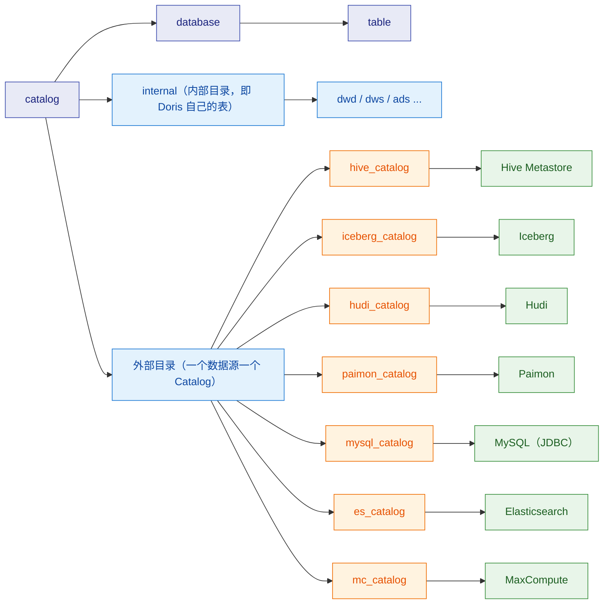
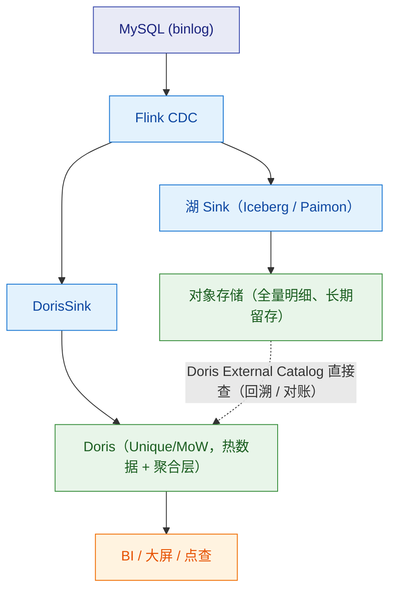
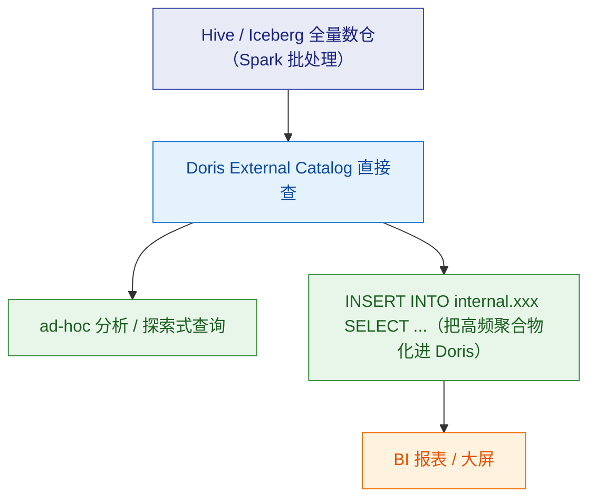
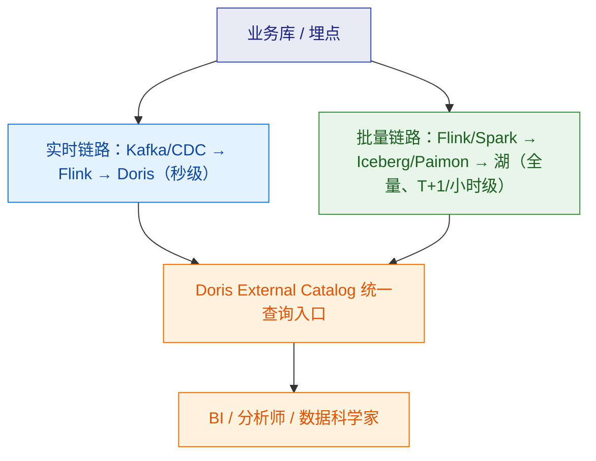
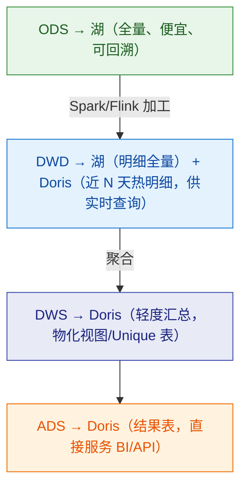

# 🏞️ 七、湖仓一体

> 本篇回答两个问题：**为什么要在数据湖上再建一层仓，以及 Doris 在这一层里到底扮演什么角色。**
> 内容覆盖湖仓动机、多 Catalog 架构、四种主流湖格式（Hive/Iceberg/Hudi/Paimon）对接与选型、湖上查询优化、**写湖还是写 Doris** 的架构决策、存算分离（3.0+）、分层实践与常见坑。
> 存算分离的部署细节与参数见 [[8-运维与调优]]；External Catalog 的查询下推与优化器行为见 [[5-查询优化]]；导入链路见 [[6-数据导入与FlinkCDC]]；架构原理见 [[1-架构与原理]]。

---

## 一、湖仓一体的动机

### 1.1 数据湖和数据仓库各自的问题

| | 数据湖（Hive / Iceberg / Hudi / Paimon on HDFS/S3） | 数据仓库（Doris / StarRocks / ClickHouse） |
|---|---|---|
| **存储成本** | **低**：对象存储/HDFS，存 PB 级也不心疼 | **高**：数据存在本地盘/块存储，还要多副本 |
| **存算关系** | **天然分离**：存储独立，计算可以随时起停 | 传统上是**存算一体**（3.0 起支持分离） |
| **多引擎支持** | **强**：Spark / Flink / Trino / Hive / 自研都能读同一份数据 | **弱**：基本只有自己（Doris 生态）能高效读 |
| **查询性能** | **弱**：大量小文件、无索引、无本地缓存时延迟高 | **强**：列存 + 索引 + 向量化 + MPP |
| **事务能力** | Iceberg/Hudi/Paimon 有表级事务，但**并发写入能力有限** | **强**：高并发导入、行级更新、完整事务 |
| **更新能力** | 靠 MoR/COW，更新代价高、延迟大 | Unique 模型 + MoW，**写入即合并**，点查友好 |
| **易用性 / 生态** | SQL 支持参差、运维复杂（元数据、小文件、compaction） | SQL 完整、BI 工具适配好、运维相对简单 |
| **适用负载** | 海量明细存储、离线批处理、AI 训练取数 | **高并发低延迟查询、BI/报表、点查、实时大屏** |

> [!important] 核心矛盾
> **数据湖便宜但慢，数据仓库快但贵。**
> 企业的真实需求是：**明细数据要便宜地存全量（湖），查询要快（仓）。**
> 湖仓一体就是回答"怎么同时拿到这两者"——而不是二选一。

### 1.2 "湖上建仓"的三种思路

| 思路 | 做法 | 优点 | 缺点 |
|---|---|---|---|
| **① 数据同步（ETL 入仓）** | 湖里的数据加工后**导入 Doris** | 查询性能最好、Doris 所有能力都能用 | **数据冗余一份**；导入有延迟和成本；湖仓两份数据要保一致 |
| **② 直接查湖（External Catalog）** | Doris 通过 Catalog **直接读湖上的表**，不搬数据 | **零冗余、零延迟**、一份数据多处用 | 性能受湖格式与文件布局限制；高级下推能力有限 |
| **③ 混合（推荐）** | **热数据 + 高频聚合入 Doris（②的补充），冷/全量明细留湖并直接查（②）** | 成本、性能、时效三者平衡 | 架构更复杂，需要清晰的分层纪律 |

> [!tip] 这就是 Doris 湖仓能力的定位
> **Doris 在湖仓架构里扮演的是"查询加速层 + 统一查询入口"，而不是"替代数据湖的存储层"。**
> - **统一入口**：一个 SQL 引擎同时查 Internal Catalog（Doris 内部表）和各类 External Catalog（Hive/Iceberg/Hudi/Paimon/JDBC/ES），甚至可以跨源 join——BI 工具只需要连 Doris 一个入口；
> - **查询加速层**：对湖上的数据提供向量化执行、MPP、缓存加速，把"Trino 级别的联邦查询"和"OLAP 级别的交互式分析"合并到一个引擎里。

### 1.3 对已有实时数仓链路的结合点

如果你已经有一条 **MySQL CDC → Flink → Doris** 的实时链路（见 [[6-数据导入与FlinkCDC]]），湖仓能力给你的是：

| 结合点 | 做法 | 解决什么问题 |
|---|---|---|
| **全量明细落湖** | 同一份 CDC/Kafka 数据，一路写 Doris 供实时查询，一路写 Iceberg/Paimon 做全量归档 | Doris 里只留热数据，**存储成本降下来** |
| **回溯与重算** | 需要重算历史时，从湖里读全量明细，而不是依赖 Doris 的历史版本 | **Doris 不用为了回溯留超长历史** |
| **跨源分析** | Doris 直接 `JOIN` 湖上明细 + 本地聚合表 | 不用把湖数据全导入 Doris |
| **多引擎共享** | 同一份湖数据同时给 Spark / Flink / Doris 用 | **避免"每个引擎一份数据"的烟囱** |
| **离线对账** | 用 Doris 查湖上明细，与 Doris 里的实时结果做批量对账 | 发现"实时链路算错了"（技术监控发现不了的问题） |

---

## 二、Doris 的多 Catalog 架构

### 2.1 Internal Catalog 与 External Catalog

Doris 的元数据组织是**三级命名**：



| | Internal Catalog | External Catalog |
|---|---|---|
| **名称** | `internal`（固定名，不可删） | 自定义名 |
| **数据在哪** | Doris BE 本地/共享存储 | 外部系统（HDFS/S3/HMS/MySQL/ES…） |
| **能否写入** | ✅ 完整写入能力 | **绝大多数只读**（少数格式支持写回，能力有限） |
| **能否建表** | ✅ `CREATE TABLE` | 通常只能 `CREATE DATABASE`（映射）或只读映射 |
| **事务 / 更新** | ✅ | ❌（依赖外部格式自身能力） |
| **性能** | 最高 | 取决于下推、文件布局、缓存 |
| **元数据来源** | Doris FE 自己管 | 外部元数据服务（HMS / REST Catalog / JDBC） |

> [!important] 关键心智模型
> **External Catalog 是"挂载"，不是"导入"。**
> `CREATE CATALOG` **不搬任何数据**，它只是让 Doris FE 知道"去哪找元数据、怎么读文件"。
> 所以**湖上数据的查询性能问题，80% 是"文件布局和元数据"问题，而不是 Doris 的问题**——这一点在排查时必须先分清。

### 2.2 常用命令

```sql
-- 查看所有 catalog
SHOW CATALOGS;

-- 查看某个 catalog 的建目录语句
SHOW CREATE CATALOG hive_catalog;

-- 切换当前 catalog（之后可以用两级名 db.tbl）
SWITCH hive_catalog;

-- 用三级名跨 catalog 查询（推荐，语义最清晰）
SELECT * FROM hive_catalog.ods.user_log LIMIT 10;
SELECT * FROM internal.dws.order_summary LIMIT 10;

-- 刷新元数据（湖上新增/删除表、分区变化后）
REFRESH CATALOG hive_catalog;                        -- 刷新整个目录
REFRESH DATABASE hive_catalog.ods;                   -- 刷新某个库
REFRESH TABLE hive_catalog.ods.user_log;             -- 刷新某张表

-- 让 Hive 表感知到 HDFS 上新增的分区目录（部分版本/catalog 类型支持）
MSCK REPAIR TABLE hive_catalog.ods.user_log;

-- 删除 catalog（不删数据！）
DROP CATALOG hive_catalog;
```

> [!warning] `DROP CATALOG` 只删映射，不删数据
> 这是好事也是坑：**好事**是不会误删数据；**坑**是删了 Catalog 之后你以为"清理完了"，其实湖上的数据还在，下次重建又会挂回来。
> 反过来，**千万不要以为 `DROP CATALOG` 能帮你回收存储**。

### 2.3 创建各类 Catalog 的示例

```sql
-- ① Hive（HMS 元数据服务）
CREATE CATALOG hive_catalog PROPERTIES (
  'type'                     = 'hms',
  'hive.metastore.uris'      = 'thrift://hms-host:9083',
  'hadoop.username'          = 'hive'
  -- HDFS HA 场景还需要 namenode / nameservice 相关配置，
  -- 具体键名随版本与部署方式不同，建之前以目标版本文档为准
);

-- ② Iceberg
CREATE CATALOG iceberg_catalog PROPERTIES (
  'type'                 = 'iceberg',
  'iceberg.catalog.type' = 'hms',                 -- 也可用 hadoop / rest 等类型
  'hive.metastore.uris'  = 'thrift://hms-host:9083',
  's3.endpoint'          = 'http://minio:9000',
  's3.access_key'        = 'xxx',
  's3.secret_key'        = 'yyy',
  's3.region'            = 'us-east-1'
);

-- ③ Hudi
CREATE CATALOG hudi_catalog PROPERTIES (
  'type'                = 'hudi',
  'hive.metastore.uris' = 'thrift://hms-host:9083'
);

-- ④ Paimon
CREATE CATALOG paimon_catalog PROPERTIES (
  'type'                     = 'paimon',
  'paimon.catalog.type'      = 'hms',             -- 也可用 filesystem
  'hive.metastore.uris'      = 'thrift://hms-host:9083',
  'warehouse'                = 'hdfs://nn:8020/paimon'
);

-- ⑤ JDBC（MySQL / PostgreSQL 等）
CREATE CATALOG mysql_catalog PROPERTIES (
  'type'         = 'jdbc',
  'user'         = 'reader',
  'password'     = '******',
  'jdbc_url'     = 'jdbc:mysql://mysql-host:3306',
  'driver_url'   = 'mysql-connector-java-8.0.25.jar',   -- 驱动需放在 FE 可访问的位置
  'driver_class' = 'com.mysql.cj.jdbc.Driver'
);

-- ⑥ Elasticsearch
CREATE CATALOG es_catalog PROPERTIES (
  'type'     = 'es',
  'hosts'    = 'http://es-host:9200',
  'user'     = 'elastic',
  'password' = '******'
);

-- ⑦ MaxCompute（阿里云）
CREATE CATALOG mc_catalog PROPERTIES (
  'type'           = 'max_compute',
  'mc.default.project' = 'your_project',
  'mc.access_key'  = 'xxx',
  'mc.secret_key'  = 'yyy',
  'mc.endpoint'    = 'http://service.cn-beijing.maxcompute.aliyun.com/api'
);
```

> [!warning] Catalog 的 PROPERTIES 键名随版本演进
> 上面的示例是**结构示意**。各个 Catalog 的属性名（尤其是存储相关的 `s3.*` / `hdfs.*` / `warehouse` 等）在不同 Doris 版本之间有过调整与新增。
> **正确姿势**：`SHOW CREATE CATALOG` 看一个已建好的作为模板，或者在目标版本上先小范围试建、`SHOW CATALOGS` 确认状态，再推广到生产。

### 2.4 多源联邦查询的能力与边界

**能做**：

```sql
-- 跨源 join：Doris 内部维表 + 湖上明细表
SELECT d.dt,
       c.category_name,
       count(*)        AS order_cnt,
       sum(d.amount)   AS gmv
FROM iceberg_catalog.ods.order_detail d
JOIN internal.dim_category c ON d.category_id = c.category_id
WHERE d.dt >= '2024-01-01' AND d.dt < '2024-02-01'
GROUP BY d.dt, c.category_name;

-- 多源 join：MySQL 维表 + Hive 明细
SELECT u.city, count(*)
FROM hive_catalog.ods.user_log l
JOIN mysql_catalog.shop.users u ON l.user_id = u.id
GROUP BY u.city;

-- INSERT：把外部数据"物化"进 Doris（这是湖到仓的主力手段）
INSERT INTO internal.dws.order_summary
SELECT dt, category_id, count(*), sum(amount)
FROM iceberg_catalog.ods.order_detail
WHERE dt = '2024-01-01'
GROUP BY dt, category_id;
```

**边界（很重要）**：

| 限制 | 说明 | 应对 |
|---|---|---|
| **外部表只读（绝大多数）** | 不能 `UPDATE`/`DELETE` 湖上的表 | 写入走 Spark/Flink 或湖格式自己的 API |
| **谓词下推能力随格式/版本不同** | 有的格式支持完整下推，有的只支持分区级 | 看 `EXPLAIN` 确认，不要假设 |
| **统计信息来自外部元数据** | Iceberg/Hudi/Paimon 的元数据里有行数/文件大小统计；Hive 可能没有 | 湖上 CBO 效果比内部表差，**join 顺序更容易选错** |
| **跨源 join 性能差** | 数据要经过网络拉到 Doris，且无法做 colocate | 尽量让大表做单源聚合，跨源 join 只用于**小维表** |
| **函数/类型差异** | 外部系统的类型语义与 Doris 不同 | 显式 `CAST`，避免隐式转换破坏下推 |
| **权限模型不统一** | 外部系统的权限由外部系统管 | 用外部系统的权限工具，Doris 侧只做一层映射 |
| **元数据缓存** | Doris 会缓存外部元数据，湖上变更不会立刻可见 | `REFRESH CATALOG/DATABASE/TABLE` 或 `MSCK REPAIR TABLE` |

> [!danger] 跨源 join 的性能陷阱
> 最常见的错误架构是：**让 Doris 去 join 两张湖上的大表**。
> 结果：Doris 要分别把两张表的完整数据拉到 BE（或做大量远端读取），既没有 colocate 也没有分桶裁剪，**性能比在 Spark 里做还差**。
> **正确分工**：湖上的大表 join 大表 → 交给 **Spark/Flink 批处理**，结果落湖或写 Doris；Doris 的跨源 join **只用于"大表 + 小维表"**。

---

## 三、数据湖格式对接

### 3.1 四种格式对比

| | **Hive** | **Iceberg** | **Hudi** | **Paimon** |
|---|---|---|---|---|
| **本质** | 目录 + 分区元数据（表格式最"薄"） | **表格式规范**（元数据层有快照/清单） | 表格式 + **索引与增量能力** | 表格式 + **LSM 结构**（流式友好） |
| **元数据** | HMS（也有其他实现） | HMS / REST / Hadoop / Glue 等 | HMS / 文件 | HMS / filesystem |
| **表类型** | 无（就是目录） | 无（快照式，统一） | **COW / MOR**（写时复制 / 读时合并） | 主键表 / Append 表 |
| **更新能力** | ❌ 基本只能覆写分区 | 中等（快照 + 小文件重写） | **强**（尤其 MOR + 增量） | **强**（LSM，写入友好） |
| **增量读** | ❌ | ✅ 按快照/增量 | ✅ **增量查询是核心能力** | ✅ 支持 changelog |
| **时间旅行** | ❌ | ✅ **最成熟**（按 snapshot / timestamp 查历史） | ✅ 按 commit time | ✅ 按 snapshot |
| **小文件问题** | **最严重** | 中等（有 rewrite 能力） | 中等（有 compaction） | 中等（LSM 有 compaction） |
| **在实时数仓里的定位** | **存量离线数仓的主体**（事实上的历史资产） | **湖上批流统一的首选**，多引擎生态最好 | **增量入湖 / CDC 落湖**（尤其需要 upsert 的场景） | **流式更新 + 与 Flink 深度结合**，实时性最好 |
| **与 Doris 的配合** | 直接挂 Catalog 查存量 | 挂 Catalog 查；**明细全量归档的推荐选择** | 挂 Catalog 查；增量读能力可用于微批加工 | 挂 Catalog 查；**流式链路的高级选择** |

### 3.2 各自在实时数仓里的选型建议

> [!tip] 怎么选（按场景给结论）
> | 你的诉求 | 推荐 | 理由 |
> |---|---|---|
> | 已有 Hive 数仓，只想让 Doris 加速查询 | **Hive** | 零迁移成本，挂 Catalog 就用 |
> | 要建**新的**湖，多引擎共享，需要快照/时间旅行 | **Iceberg** | 表格式规范最完整、生态最广、时间旅行最成熟 |
> | CDC / upsert 场景要落湖，需要增量读 | **Hudi** | COW/MOR 与增量查询就是为这个场景设计的 |
> | 追求**流式更新 + 极低延迟入湖**，Flink 生态 | **Paimon** | LSM + changelog，写入友好、与 Flink 结合最紧 |
> | 只是想"把明细便宜地存起来，Doris 能查" | **Iceberg 或 Paimon** | 两者都比"Hive 目录"有更好的元数据与文件管理 |
>
> **注意**：格式选型是**长期承诺**——换格式等于迁移全部数据与上下游，代价极高。**选之前先看团队的技术栈和主要计算引擎**（Spark 生态偏 Iceberg，Flink 生态偏 Paimon，流式 upsert 偏 Hudi）。

### 3.3 对接要点

**Hive**

- 元数据走 HMS（`hive.metastore.uris`），读文件走 HDFS/对象存储。
- **分区裁剪**依赖 Doris 能否从 HMS 拿到分区信息：HMS 里有分区记录才能裁剪；HDFS 上手工 `mkdir` 的新分区目录 HMS 不知道 → 需要 `MSCK REPAIR TABLE` 或 `REFRESH`。
- 老 Hive 表的坑：**统计信息缺失**（`ANALYZE TABLE` 没跑过）→ Doris 拿不到行数 → CBO 估算失准。
- 对象存储上的 Hive 表要注意 endpoint/ak/sk 的配置与 HDFS 不同。

**Iceberg**

- 元数据层有 **snapshot（快照）**，所以支持：
  - **时间旅行**：按快照 ID 或时间戳查历史版本；
  - **快照级的分区裁剪**：直接从元数据确定要读哪些文件，**不用 list 目录**（这是 Iceberg 比 Hive 快的核心原因之一）；
  - **增量读取**：读两个快照之间的变更（适合做微批加工）。
- Catalog 类型要选对（`iceberg.catalog.type`）：`hms` / `hadoop` / `rest` 等，对应不同的元数据来源。
- **小文件是 Iceberg 的头号问题**：流式小批写入会不断产生小文件，必须配套 **rewrite / compaction** 任务（由 Spark/Flink 侧定期执行）。

**Hudi**

- **COW（Copy-On-Write）**：更新时重写整个文件 → **读快写慢**，适合**读多写少**。
- **MOR（Merge-On-Read）**：更新写 delta log，读取时在线合并 → **写快读慢**，适合**写多读少 / 需要低延迟写入**。
- Doris 读 Hudi 时要注意**表类型**：MOR 表读的是合并后的视图还是原始文件，行为和性能差异很大。**MOR 表如果没有及时 compaction，读性能会显著退化**（要在 Doris 侧或 Hudi 侧确认读的是哪种视图）。
- **增量查询**是 Hudi 的特色：按 commit time 取"某时间点之后的变更"，适合做增量加工。

**Paimon**

- 底层是 **LSM 结构 + 主键表**，写入吞吐好、支持 changelog（变更流），**和 Flink 的结合最紧密**。
- 适合：**Flink 流式写入 Paimon（ODS/明细层）→ Doris/Flink 读 Paimon 做下游加工**。
- 关注点：compaction 与快照过期策略（snapshot 太多会拖慢元数据读取）。

---

## 四、湖上查询优化

### 4.1 下推：湖上查询性能的第一决定因素

Doris 会把能下推的东西尽量推给湖格式的读取层：

| 下推类型 | 说明 | 收益 |
|---|---|---|
| **分区裁剪** | 谓词在分区列上 → 只读命中分区的文件 | **数量级** |
| **谓词下推** | 列过滤下推到扫描层（Iceberg/Hudi/Paimon 支持按文件/按行组统计跳过） | 大量减少 IO |
| **投影下推（列裁剪）** | 只读需要的列 | 湖上列存的重要收益 |
| **`count(*)` 下推** | 直接读元数据里的行数，不扫数据 | 极快 |
| **limit 下推** | 减少读取量 | 部分支持 |
| **聚合下推** | 有限支持（取决于格式与版本） | 减少传输 |

**怎么验证下推生效**：

```sql
EXPLAIN VERBOSE
SELECT dt, count(*)
FROM iceberg_catalog.ods.order_detail
WHERE dt = '2024-01-01' AND status = 'PAID'
GROUP BY dt;
```

在计划里找湖表扫描节点（不同格式的扫描算子名不同，形如 `ICEBERG_SCAN` / `HIVE_SCAN` / `HUDI_SCAN` / `PAIMON_SCAN` 一类），重点看：

| 看什么 | 期望 |
|---|---|
| **扫描的分区/文件数** | 命中分区应远小于总分区 |
| **下推的谓词** | `dt = ...`、`status = ...` 都应该出现在扫描节点上 |
| **输出的列** | 只有 `dt`、`status`（`count(*)` 场景），不该出现其他列 |
| **估算行数** | 与外部元数据里的统计一致（差异大 → 元数据统计缺失） |

> [!warning] 破坏下推的常见写法
> 和分区裁剪一样：**对列做函数运算**（`DATE_FORMAT(dt,...) = ...`）、**隐式类型转换**、**`OR` 混用不同列**。
> 在湖上，下推失效的代价比内部表更大——因为湖上没有前缀索引、没有 ZoneMap，**只有"读文件"这一条路**。

### 4.2 统计信息：湖上 CBO 的软肋

| 来源 | 情况 |
|---|---|
| **Iceberg / Hudi / Paimon** | 元数据里通常带**文件级行数、大小、列级 min/max**，Doris 能拿到较好的估算 |
| **Hive** | 统计信息**依赖 HMS 里有没有**（要跑过 `ANALYZE TABLE`）→ 经常缺失 |
| **通用问题** | 湖上的统计信息**更新不如内部表及时**，且 Doris 侧的 `ANALYZE TABLE` 对外部表通常不适用 |

**后果**：CBO 在湖上 join 时**更容易选错**（例如把一张实际几亿行的湖表当成小表广播）。

**应对**：

1. 让上游在写湖时**维护好统计信息**（Iceberg/Hudi/Paimon 的写入引擎一般会自动写元数据统计）；
2. Hive 表定期跑 `ANALYZE TABLE`（用 Hive/Spark 侧）；
3. **在 Doris 侧用 join hint 兜底**关键查询（但要注释说明原因，见 [[5-查询优化]]）；
4. **最根本的办法**：不要让 Doris 去做湖上的大表 join（§2.4）——把加工放到 Spark/Flink，Doris 只做"读结果 + 轻量联邦"。

### 4.3 小文件：湖上查询的头号杀手

**为什么小文件这么致命**：

| 层次 | 影响 |
|---|---|
| **元数据** | 每个文件都要在元数据里有一条记录；文件数上百万 → 打开表就要读大量元数据 |
| **任务调度** | 每个文件至少一个读取任务/分片 → 调度开销远大于读取开销 |
| **IO 效率** | 小文件无法利用顺序读与预读，随机 IO 放大 |
| **网络** | 每个文件一次 RPC/一次 ranged read → 连接与握手成本占比极高 |
| **缓存** | 本地缓存按块组织，小文件让缓存效率变差 |

**小文件从哪来**：

- **流式小批写入**（Flink 每分钟一个 checkpoint → 每个 checkpoint 一批文件）；
- **分区粒度过细**（按小时 + 按很多维度分区 → 每个分区只有几 MB）；
- **频繁的 upsert**（Hudi MOR 的 delta file、Iceberg 的 delete file）。

**治理手段**：

| 手段 | 说明 |
|---|---|
| **上游攒批** | 让写入侧攒大再 flush（和 Doris 导入的"攒批"是同一个道理，见 [[6-数据导入与FlinkCDC]]） |
| **定期 compaction / rewrite** | Iceberg 用 rewrite data files、Hudi 用 compaction/clustering、Paimon 用 compaction；**必须在生产上配成定时任务** |
| **合理的分区粒度** | 分区不是越细越好：**单分区数据量太少就是给自己制造小文件** |
| **bin-packing 式文件大小目标** | 让文件大小稳定在"单文件几十 MB 到几百 MB"这个区间（具体目标值按查询模式与存储调整，不要拍一个绝对数字） |
| **Doris 侧读时聚合** | Doris 的文件合并读取能力可以缓解，但**这是优化不是解药**——根子还在写入侧 |

> [!important] 一句话
> **湖上查询慢，先数文件个数，再谈 Doris 优化。**
> `count(*)` 都慢得离谱，几乎一定是元数据/小文件问题，而不是 Doris 执行引擎的问题。

### 4.4 缓存的作用

Doris 为外部表读取提供了本地缓存层，把**远端存储（S3/HDFS）读到的数据块缓存到 BE 本地磁盘**：

| 缓存 | 缓存什么 | 收益 | 注意 |
|---|---|---|---|
| **File Cache**（面向外部表/湖） | 湖上文件的**数据块** | 反复查询同一份湖数据时，**避免重复读远端** | 需要配置本地缓存目录与容量；**淘汰策略与命中率要监控** |
| **Data Cache**（面向存算分离的内部表） | 共享存储上的**数据段** | 存算分离下减少远端读 | 同上 |

**要点**：

1. **缓存对"重复访问的热数据"效果显著，对"一次性扫描"没有帮助**（第一次读还是要从远端拉）；
2. **缓存大小要规划**：缓存目录所在磁盘的容量、淘汰策略直接影响命中率；缓存放满后的抖动会造成性能波动；
3. **缓存相关配置项随版本演进，且不同部署形态（是否存算分离）配置方式不同**——用 `ADMIN SHOW CONFIG LIKE '%cache%'` 在目标集群上确认实际可用的配置项，不要照着博客写；
4. **多副本/多 BE 场景下缓存是每个 BE 独立的**，所以同一份数据可能被多个 BE 各缓存一份（空间利用率不是 100%）。

---

## 五、写湖 vs 写 Doris（架构选型）

### 5.1 决策表

| 你的核心诉求 | 写 Doris | 写数据湖 |
|---|---|---|
| **高并发低延迟查询**（BI、大屏、点查） | ✅ **必须 Doris** | ❌ 延迟做不到 |
| **需要行级更新 / 删除 / upsert** | ✅ Unique + MoW | ⚠️ 能做但代价高、延迟大 |
| **需要物化视图 / 预聚合加速** | ✅ | ❌ |
| **低成本存海量明细（PB 级）** | ❌ 存储成本高 | ✅ **写湖** |
| **多引擎共享同一份数据** | ❌ 基本只有 Doris 能读 | ✅ **写湖** |
| **批流统一（同一份数据既批又流）** | ⚠️ 有限 | ✅ 湖格式（Iceberg/Paimon/Hudi）就是为此设计 |
| **需要时间旅行 / 回溯历史快照** | ⚠️ 靠版本，能力有限 | ✅ 湖格式的原生能力 |
| **AI / 训练取数** | ❌ | ✅ 生态与格式更友好 |
| **强事务 + 高并发写入** | ✅ | ⚠️ 湖格式并发写入能力有限 |
| **查询模式高度不确定（ad-hoc）** | ✅ 交互式体验好 | ⚠️ 慢，但覆盖面广 |

> [!important] 一句话决策
> **"要被高频查的、要被更新的、要被预聚合的" → 写 Doris。**
> **"要便宜存的、要多个引擎共享的、要留全量明细和历史的" → 写数据湖。**
> 两者**不是替代关系**，是**同一份数据的两种服务形态**。

### 5.2 三种典型湖仓组合架构

**架构 A：实时链路写 Doris 供 BI，明细全量落湖供离线与回溯（最推荐）**



| 优点 | 说明 |
|---|---|
| **一份 CDC 数据两种服务形态** | 实时查询走 Doris，全量留湖，不用存两份在 Doris 里 |
| **Doris 存储可控** | Doris 只留热数据 + 聚合结果，成本可控 |
| **回溯不依赖 Doris** | 重算历史从湖里读全量，Doris 不用留超长历史 |
| **对账可行** | 用 Doris 查湖上明细 vs Doris 实时结果做对账 |
| **注意点** | 两条链路要保证**口径一致**（同一份 Flink 逻辑分流，不要写两套转换逻辑） |

**架构 B：离线主体写湖，Doris 只做查询加速层（湖上建仓）**



| 适合 | 说明 |
|---|---|
| 已有成熟离线数仓（Spark + Hive/Iceberg） | **不搬数据**，Doris 挂上去就能加速 |
| 报表有明确的高频少数几张 | 用 `INSERT INTO ... SELECT` 把这几张的关键聚合**物化进 Doris** |
| 成本考量 | Doris 集群可以小一些，因为只承担"加速层" |

**架构 C：湖为主体，Doris 承担实时 + 加速（双轨）**



适合**实时与离线并存、且不希望 BI 连多个引擎**的组织——**Doris 作为唯一查询入口**，屏蔽底层是湖还是仓。

### 5.3 与你已有实时数仓链路的结合点（落地建议）

如果你现在只有 **MySQL CDC → Flink → Doris**：

| 阶段 | 动作 |
|---|---|
| **第一步（低成本）** | 给 Doris 挂 **Iceberg/Paimon Catalog**，先把"批量对账"和"历史回溯"做起来——**这一步不需要改现有链路** |
| **第二步** | 在现有 Flink 作业里**并出一路写到湖**（Flink 有对应 sink），把明细全量归档；Doris 侧开始只留热数据（配 TTL / 分区清理） |
| **第三步** | 把"低频、大范围"的查询**引导到 External Catalog**（查湖），把"高频、小范围"的留在 Doris；用资源组隔离两类查询 |
| **第四步** | 评估**存算分离**（§六）：如果 Doris 集群主要是"计算需求波动大 + 存储成本敏感"，就值得上 |

> [!tip] 落地顺序的原则
> **先加能力，再改架构。** 挂 Catalog 是零风险的增量（不搬数据、不影响现有链路），先做这个立刻就能拿到价值；
> 而"改链路把数据写湖"涉及 Flink 作业改造与数据一致性验证，应该在有明确收益后再做。

---

## 六、存算分离（3.0+）

### 6.1 存算一体 vs 存算分离

| 维度 | **存算一体** | **存算分离** |
|---|---|---|
| **数据存哪** | BE 本地磁盘（多副本） | **共享存储**（S3/对象存储/HDFS）+ BE 本地缓存 |
| **副本机制** | 靠多副本（`replication_num`）保证可靠 | 靠共享存储自身的可靠性，**不再依赖多副本** |
| **扩容方式** | 加 BE 要**迁移数据**（数据重分布），扩容慢 | 加计算节点**不搬数据**，扩容快 |
| **缩容** | 要先把数据迁走，风险高 | 直接下线计算节点，**干净利落** |
| **成本** | 高性能本地盘 + 多副本 → **贵** | 对象存储便宜（但需缓存保证性能） |
| **性能** | **最优**（本地读） | 接近（有缓存），**冷数据首次读比本地慢** |
| **隔离性** | 计算和存储耦合，一个负载重就影响全局 | **多计算集群可以独立扩缩容**，负载隔离更好 |
| **弹性** | 差 | **强**：可以按需起停计算资源 |
| **运维复杂度** | 低 | **高**：多了共享存储、缓存、元数据服务的运维 |
| **网络依赖** | 低（本地盘） | **高**：存储网络抖动直接影响查询 |

### 6.2 核心概念（3.0 引入）

| 概念 | 作用 |
|---|---|
| **共享存储（Storage Vault）** | 一个逻辑上的存储位置（S3/对象存储/HDFS），内部表的数据真正落在那里。通过 `CREATE STORAGE VAULT` 声明 |
| **计算集群（Compute Group）** | 一组计算节点（原来的 BE 角色）；**多个计算集群共享同一份存储**，但各自有独立的计算资源 |
| **计算节点（Compute Node）** | 加入某个 Compute Group 的计算实例（`ALTER SYSTEM ADD COMPUTE NODE` 一类命令） |
| **本地缓存（Data Cache）** | 计算节点本地缓存远端数据块，缓解"远端读慢"的问题 |
| **Meta Service** | 存算分离模式下替代部分 FE/BE 职责的元数据服务组件 |

```sql
-- 结构示意：存算分离下的对象（具体属性名与部署步骤随版本演进，以目标版本文档为准）

-- ① 声明一个共享存储
CREATE STORAGE VAULT IF NOT EXISTS s3_vault
PROPERTIES (
  'type'          = 'S3',
  's3.endpoint'   = 'http://minio:9000',
  's3.access_key' = 'xxx',
  's3.secret_key' = 'yyy',
  's3.region'     = 'us-east-1',
  's3.bucket'     = 'doris-data',
  's3.root.path'  = 'warehouse'
);

SHOW STORAGE VAULTS;

-- ② 创建/管理计算集群（多个计算集群共享存储，实现负载隔离）
CREATE COMPUTE GROUP etl_group;
ALTER SYSTEM ADD COMPUTE NODE "be-host:9050" TO etl_group;

SHOW COMPUTE GROUPS;
```

> [!warning] 存算分离是**部署形态**的变化，不是一条 SQL 开关
> 3.0 引入存算分离后，4.x 继续增强（缓存、多计算集群管理、性能）。**但它需要一开始就在部署形态上做选择**：
> 元数据服务、共享存储、计算节点的角色划分都不一样。
> **已经跑着的存算一体集群不能靠一条命令"切换"过去**——迁移需要重建集群 + 数据重灌/迁移。
> 所以这是一次**架构决策**，不是运维调参。**具体部署步骤与参数必须以目标版本文档为准。**

### 6.3 适用与不适用场景

| 适合存算分离 | 理由 |
|---|---|
| **计算需求波动大**（白天查询多、晚上导入/ETL 多） | 可以按需起停计算集群 |
| **存储成本敏感、数据量大** | 对象存储远比本地多副本便宜 |
| **多业务/多租户需要计算隔离** | 多计算集群共享存储，各用各的算力 |
| **需要频繁弹性扩缩容** | 加计算节点不搬数据 |
| **冷热分层明显** | 冷数据留在共享存储，靠缓存服务热点 |

| 不适合存算分离 | 理由 |
|---|---|
| **延迟极敏感（毫秒级点查）** | 远端读在缓存未命中时延迟远高于本地盘 |
| **存储网络不稳定 / 带宽受限** | 存算分离把网络变成了关键路径 |
| **集群很小、负载稳定** | 分离带来的复杂度与收益不成比例 |
| **无法提供可靠的对象存储** | 分离的前提是共享存储足够可靠 |

> [!important] 存算分离的"性能等式"
> **性能 = 本地缓存命中率 × 缓存性能 + 缓存未命中率 × 远端读性能。**
> 所以上存算分离之前必须回答：**我的查询有多少是重复访问热数据的？** 如果查询大多是"扫全量冷数据"，缓存帮不上忙，分离后性能会明显下降。
> **不要只看"便宜"，要算上"缓存命中率"这个变量。**

---

## 七、数据湖与 Doris 的分层实践

### 7.1 分层建议

| 层 | 放哪 | 理由 |
|---|---|---|
| **ODS（贴源层）** | **数据湖**（Iceberg/Paimon/Hudi） | 全量明细、量大、需要长期留存与回溯；查询频率低；**放 Doris 太贵** |
| **DWD（明细层）** | **湖为主，热部分进 Doris** | 明细量大；但"最近 N 天"的明细会被高频查询 → 这部分进 Doris 或靠 External Catalog + 缓存兜 |
| **DWS（轻度汇总层）** | **Doris** | 汇总后数据量下降 1~3 个数量级；被高频查询；需要快速响应 → **Doris 的主战场** |
| **ADS（应用层）** | **Doris** | 结果集小、QPS 高、直接对接 BI/大屏/API |



> [!tip] 分层的判据不是"层名"，而是三个问题
> 1. **这份数据要被多快地查？**（秒级 → Doris；分钟/小时级 → 湖）
> 2. **这份数据要被多频繁地查？**（高频 → Doris；低频/探索 → 湖）
> 3. **这份数据要存多久、多大？**（长期、海量 → 湖）
>
> 三个问题的答案指向哪边，就放哪边。**不要因为"架构图上是 DWD 所以必须放湖"这种形式主义做决策。**

### 7.2 口径统一问题（湖仓一体最大的隐性风险）

**问题**：同一份业务数据，在 Doris 里有一份实时聚合，在湖里有一份离线明细。**两边算出来的指标不一致**，业务方不知道信哪个。

| 不一致的来源 | 说明 |
|---|---|
| **两套转换逻辑** | 实时链路和离线链路各写了一份 SQL 做清洗/转换 → 逻辑必然漂移 |
| **时间语义不同** | 实时用事件时间、离线用处理时间；或者时区处理不同（见 [[6-数据导入与FlinkCDC]] 的时区问题） |
| **晚到数据** | 实时链路对迟到数据无能为力，离线链路可以重算 → **结果天然不同** |
| **去重口径不同** | 实时按主键覆盖，离线按全量去重 → 边界行处理不同 |
| **维度表快照不同** | 实时 join 的是当前维表，离线 join 的是历史维表快照 |

**应对**：

| 手段 | 说明 |
|---|---|
| **一份逻辑，两个执行** | 尽可能用**同一套 SQL / 同一套 Flink 作业逻辑**驱动实时与离线（Flink 的批流统一能力正是为此） |
| **明确口径归属** | 约定**哪个是权威口径**（通常是离线），实时结果定位为"快速近似"，并在 BI 上标注 |
| **定期对账** | 用 Doris 查湖上明细，与 Doris 实时结果做批量比对，**差异告警** |
| **维度表版本化** | 维表变更要留历史快照（湖上天然适合），实时链路按业务时间取对应版本 |
| **指标定义集中管理** | 指标口径写在数据字典里，而不是散落在各个 SQL 里 |

> [!danger] 口径不一致是"技术指标全绿、业务指标全错"的典型原因
> 监控能看到"作业在跑、数据在进"，但**看不到"算得对不对"**。
> 湖仓一体放大了这个风险（多了一套链路 = 多了一个口径）。**对账机制不是可选项。**

---

## 八、常见坑

| 现象 | 原因 | 排查 / 处理 |
|---|---|---|
| **Catalog 建不起来 / 连接失败** | ① `hive.metastore.uris` 不通（网络/端口/防火墙）；② 属性键名写错（版本差异）；③ FE 到 HMS/HDFS 的网络不通（**注意是 FE 去连，不是你本机**） | 在 **FE 所在机器**上 `telnet hms 9083` 验证连通性；`SHOW CATALOGS` 看状态；FE 日志里搜 catalog 相关报错 |
| **能连上但查不了（权限报错）** | ① HDFS 文件权限（`hadoop.username` 对应的用户没读权限）；② HMS 的库表权限；③ 对象存储 AK/SK 不对或无权限 | 换一个有权限的用户名验证；用 `hdfs dfs -ls` 确认文件权限；检查 AK/SK 与 bucket 策略 |
| **Kerberos 环境挂不上** | Kerberos 需要 principal / keytab / krb5.conf，且**每个 FE/BE 都要配** | 确认 `krb5.conf` 在所有节点就位、keytab 未过期；**Kerberos 票据过期是"昨天还好今天挂了"的经典原因** |
| **分区信息不同步（查不到新数据）** | Doris 缓存了外部元数据；Hive 表在 HDFS 上新增了分区目录但 HMS 不知道 | `REFRESH CATALOG/DATABASE/TABLE`；Hive 侧 `MSCK REPAIR TABLE`；如果是定时任务产出分区，**要在产出后触发刷新** |
| **湖上查询极慢** | **小文件太多** / 分区粒度过细 / 统计信息缺失导致 CBO 选错 | 先数文件个数与单文件大小；确认上游有 rewrite/compaction 任务；`EXPLAIN` 看下推与扫描文件数 |
| **schema 演进导致查询失败** | 上游加了列/改了类型；Doris 缓存了旧 schema | `REFRESH TABLE`；确认演进是**兼容型**（加列一般兼容，改类型可能不兼容）；必要时在查询里显式 `CAST` |
| **跨源 join 极慢** | 两张湖上大表 join，无法 colocate、无法裁剪、统计信息不准 | 把大表 join 挪到 Spark/Flink；Doris 侧只保留"大表 + 小维表"的跨源 join |
| **同一份数据在湖和 Doris 里对不上** | 两套转换逻辑 / 时间语义不同 / 晚到数据处理不同 | 建立定期对账；统一逻辑来源；明确权威口径（§7.2） |
| **首次查询特别慢、再查就快了** | 缓存冷启动（File Cache / Data Cache 未命中） | 这是正常现象；如果业务不能接受，考虑**预热**或把该数据物化进 Doris |
| **缓存目录把 BE 磁盘写满** | 缓存容量未规划 / 淘汰策略不合理 | 监控 BE 磁盘；配置缓存容量上限；必要时清理缓存目录 |
| **存算分离后性能不达预期** | 缓存命中率低 / 存储网络带宽不足 / 查询以冷数据全扫为主 | 先测缓存命中率；评估查询模式是否适合分离；必要时把热点数据物化到 Doris（**分离不改变"要算缓存命中率"这件事**） |
| **DROP CATALOG 后"数据没了"的恐慌** | 误以为删了数据 | `DROP CATALOG` **只删映射**，湖上数据完好；重建 catalog 即可恢复可见 |
| **时区/日期错乱** | 湖上数据的时间字段时区与 Doris 会话时区不一致 | 统一时区；在 SQL 里显式处理时区；参见 [[6-数据导入与FlinkCDC]] |

---

## 九、必答问题

> [!question] 必答：什么数据放 Doris，什么数据放数据湖？
> 我的判断标准是**三个问题**：**要多快查？要多频繁查？要存多久多大？**
>
> **放 Doris 的**：
> - **要被高频查的**：BI 报表、大屏、API 服务、点查 —— 延迟要求秒级甚至毫秒级，湖做不到；
> - **要被更新的**：需要行级 upsert / 删除 —— Doris 的 Unique + MoW 是这个场景的强项，湖上做 upsert 代价高、延迟大；
> - **要被预聚合的**：物化视图、汇总层 —— 这是 Doris 的核心价值；
> - **数据量在"可承受"范围的**：汇总后的数据通常比明细小 1~3 个数量级，放 Doris 成本可控。
>
> **放数据湖的**：
> - **要便宜存海量明细的**：ODS/DWD 全量，PB 级 —— 对象存储 vs 本地多副本，成本差很远；
> - **要被多个引擎共享的**：同一份数据 Spark、Flink、Trino、Doris 都要读 —— 湖是唯一能"一份数据多处用"的地方；
> - **要批流统一的**：Iceberg/Paimon/Hudi 的设计目标就是这个；
> - **要回溯和时间旅行的**：湖格式的快照能力是原生的；
> - **要被 AI/训练取数的**：生态与格式更匹配。
>
> **我的落地结论**（结合我们已有的 MySQL CDC → Flink → Doris 链路）：
> **ODS/DWD 明细落湖，DWS/ADS 落 Doris；热数据在 Doris，全量明细在湖；Doris 通过 External Catalog 直接查湖，作为统一查询入口。**
> 具体手段：Flink 作业里并行分出一路写湖做归档，Doris 侧只留热数据和聚合结果，离线/回溯/大范围查询走 External Catalog。
>
> **关键认知：湖和仓不是二选一，是"同一份数据的两种服务形态"。** 所以真正的架构问题是"哪些数据需要哪种形态"，而不是"选哪个引擎"。

> [!question] 必答：External Catalog 能干到什么程度？边界在哪？
> **能干的**：
> 1. **统一查询入口**：一个 SQL 引擎同时查 Doris 内部表和 Hive/Iceberg/Hudi/Paimon/JDBC/ES/MaxCompute，可以用三级命名 `catalog.db.table` **跨源 join**，BI 工具只需要连 Doris 一个入口；
> 2. **零数据搬迁**：`CREATE CATALOG` 不搬数据，只是挂载元数据 —— 所以**接入成本极低、零风险增量**；
> 3. **把外部数据物化进 Doris**：`INSERT INTO internal.xxx SELECT ... FROM catalog.db.tbl` —— 这是"湖到仓"的主力手段，配合分区可以做增量物化；
> 4. **下推优化**：分区裁剪、谓词下推、投影下推、`count(*)` 下推，Iceberg/Hudi/Paimon 因为元数据好，下推效果明显；
> 5. **缓存加速**：File Cache 把远端数据块缓存到 BE 本地。
>
> **边界**：
> 1. **基本只读**：不能 `UPDATE`/`DELETE` 湖上的数据 —— 写湖要走 Spark/Flink 或湖格式自己的 API；
> 2. **没有 Doris 内部表的那套能力**：**没有 Unique 模型的 upsert、没有物化视图、没有前缀索引/ZoneMap/倒排索引** —— 这些是内部表专属；
> 3. **统计信息不如内部表**：湖上的行数/NDV 依赖外部元数据，Hive 表常常缺失 → **CBO 更容易选错计划**；
> 4. **跨源 join 性能有限**：无法 colocate、无法分桶裁剪，大表 join 大表会退化成"把数据拉到 Doris 再算"，**比在 Spark 里做还慢**；
> 5. **性能受文件布局支配**：**小文件多、分区粒度细，Doris 也救不了**（湖上没有索引，只有"读文件"这条路）；
> 6. **元数据有缓存延迟**：湖上变更不会立刻可见，需要 `REFRESH` / `MSCK REPAIR`。
>
> **一句话总结**：**External Catalog 是一个优秀的"读入口 + 联邦查询层"，但它不是"把数据湖变成 Doris"**。我的用法是——**大表 join 大表交给 Spark/Flink，Doris 只做"读结果 + 大表 join 小维表 + 把高频结果物化进内部表"。**

> [!question] 必答：什么时候该上存算分离？
> 先明确：**存算分离是"部署形态"的选择，不是一条开关**——它需要一开始就规划元数据服务、共享存储和计算节点的角色，**已经在跑的存算一体集群不能一条命令切过去**。3.0 引入、4.x 继续增强。
>
> **值得上的场景**：
> - **计算需求波动大**：多计算集群共享存储，可按需起停；
> - **存储成本敏感、数据量大**：对象存储远比本地多副本便宜，而且不用靠多副本保可靠；
> - **需要弹性扩缩容**：加计算节点不搬数据，扩容快、缩容干净；
> - **多业务/多租户需要计算隔离**：多计算集群各用各的算力（这对"点查不能被大查询拖垮"特别有价值）。
>
> **不该上的场景**：
> - **毫秒级延迟敏感的负载**（高并发点查）：缓存未命中时远端读的延迟远高于本地盘；
> - **存储网络不稳定或带宽受限**：分离之后网络成了关键路径；
> - **查询以"全量冷数据扫描"为主**：**缓存帮不上忙，分离后性能会明显下降**；
> - **小集群、负载稳定**：复杂度与收益不成比例。
>
> **我的判断方式**：算一个式子——**性能 = 缓存命中率 × 缓存性能 + (1 − 缓存命中率) × 远端读性能**。
> 上之前必须先量出**查询里有多少是重复访问热数据的**。如果命中率低，上分离就是"省了存储费、赔了查询体验"。
> 而且**存算分离并不替代"把数据分层"**：热点数据该物化进 Doris 还是要物化。

> [!question] 必答：湖上查询慢，你会从哪里开始排查？
> 从**文件层面**开始，而不是从 Doris 开始——因为湖上没有前缀索引、没有 ZoneMap，**只有"读文件"这一条路**，所以瓶颈几乎总在文件布局上。
>
> 顺序是：
> 1. **数文件**：这个查询命中的分区里有多少个文件？单文件多大？**小文件多、单文件只有几 MB，那就是根因**（元数据开销 + 每个文件一次 IO 的开销远大于读取本身）；
> 2. **看分区粒度**：分区是不是太细（按小时 + 多维度）导致单分区数据量很小；
> 3. **确认上游有没有 rewrite/compaction 任务**：Iceberg 的 rewrite data files、Hudi 的 compaction、Paimon 的 compaction —— **流式入湖必须配这个，它不是可选项**；
> 4. **`EXPLAIN VERBOSE` 看下推**：分区裁剪生效了吗？谓词下推了吗？只读了需要的列吗？扫描文件数是多少？（破坏下推的方式和内部表一样：函数包裹列、隐式类型转换）
> 5. **看统计信息**：湖上的行数估算是否靠谱 —— 不靠谱会导致 CBO 选错 join 方式（Hive 表尤其容易缺统计信息）；
> 6. **看缓存命中率**：首次慢、再查快是正常的冷启动；如果反复查都不快，说明访问模式不适合缓存；
> 7. **最后才怀疑跨源 join**：如果是两张湖上大表 join，那**问题不在优化而在架构** —— 应该挪到 Spark/Flink 去做。
>
> **一句话**：**湖上查询慢，先数文件个数，再谈引擎优化。** `count(*)` 都慢得离谱的，一定是元数据/小文件问题。

---

## 相关笔记

- [[0-Doris总览]] —— 全系列索引与阅读顺序
- [[1-架构与原理]] —— FE/BE、Catalog 元数据组织、存算分离原理
- [[2-数据模型]] —— Unique/MoW 为什么是"写 Doris"的理由
- [[3-表设计]] —— 内部表的建模方法论
- [[4-建表与分区分桶]] —— 分区粒度对内部表与湖表都关键
- [[5-查询优化]] —— External Catalog 的下推、统计信息与跨源 join 优化
- [[6-数据导入与FlinkCDC]] —— 一条链路同时写 Doris 与写湖
- [[8-运维与调优]] —— 存算分离的部署与缓存运维
- [[9-对比StarRocks与ClickHouse]] —— 各引擎湖仓能力的横向对比
- [[10-面试高频题]] —— 本系列面试题的汇总入口
- [[5-bigdata/0-flink/7-FlinkCDC与实时数仓|Flink 7-FlinkCDC与实时数仓]] —— CDC 落湖与实时数仓分层
- [[大数据学习规划/03-实时数仓与存储|实时数仓与存储选型]] —— 存储选型的全局视角
