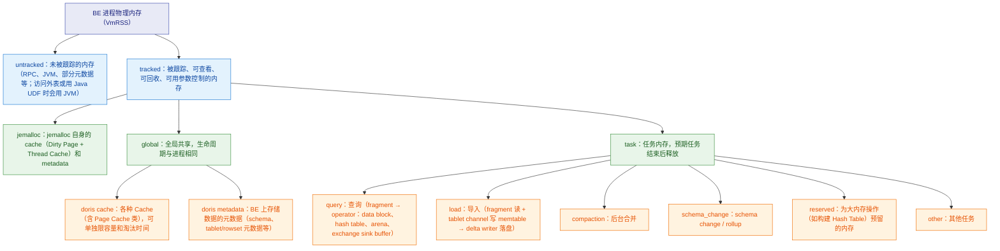
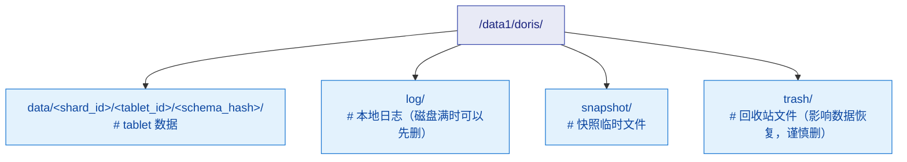

# 🛠️ 八、运维与调优

> 本篇回答四个问题：**① 集群怎么规划、怎么扩缩容；② Compaction / 内存 / 磁盘这三个"写完就出事"的机制怎么治；③ 线上出问题从哪里看、怎么定位；④ 备份、升级这些"一年做几次但做错就完蛋"的操作怎么做对。**
> 系列导航见 [[0-Doris总览]]。前置阅读：[[1-架构与原理]]（FE/BE/Tablet/副本的关系）、[[6-数据导入与FlinkCDC]]（写入链路，是本篇 compaction 问题的源头）、[[5-查询优化]]（SQL 层面的调优，本篇只讲"系统层面慢"）。
> 关联：[[10-面试高频题]]（本篇的「必答」callout 是面试高频）、[[4-建表与分区分桶]]（分桶不合理会直接导致 compaction 和均衡问题）。

---

## 一、集群规划

### 1.1 FE 的角色与数量

FE（Frontend）负责**元数据管理、SQL 解析与查询规划、集群调度**。三种角色：

| 角色 | 是否参与 BDBJE 选主 | 是否可写元数据 | 主要用途 |
|---|---|---|---|
| **Master** | 是（由 Follower 中选出） | 是（唯一写入者） | 接收所有元数据变更，做查询规划与 tablet 调度 |
| **Follower** | 是 | 否（转发给 Master） | 参与选举、同步元数据；Master 挂掉后可被选为新 Master |
| **Observer** | 否 | 否 | 只同步元数据、只提供查询规划，**不参与选举**，用于横向扩展读能力 |

关键约束与经验：

- **Follower 必须是奇数个**。元数据通过 BDBJE 做多数派复制，2 个 Follower 的容错能力等于 1 个，纯属浪费。生产建议 **3 Follower**（可容忍 1 台挂掉）；元数据量不大、查询压力也不大时，**1 Follower + 2 Observer** 也能撑住高可用，但要注意：此时元数据的容错能力是 0（只有 1 个可选举节点），Master 挂掉后需要人工恢复。
- **Observer 的作用是"多读一份"**。所有 FE 都暴露 MySQL 协议端口，客户端 / 连接池可以轮询到 Observer 上做查询规划，减轻 Master 压力。**不要在 Observer 上做任何 DDL 之外的写操作**——它会把请求转发给 Master。
- **元数据目录**：`meta_dir`（早期叫 `doris-meta`）。这是 Doris 集群**唯一不可再生**的东西——BE 的数据可以从其他副本克隆回来，FE 的元数据丢了整个集群就没了。所以：`meta_dir` 要单独挂盘、要有定期热备、要监控磁盘。
- **FE 的 JVM 内存**要给足。FE 是 Java 进程，查询规划（尤其是复杂多表 join 的 Nereids 规划）是纯内存计算，规划阶段 OOM 会直接让整个集群无法提交查询。JVM 参数在 `fe.conf` 的 `JAVA_OPTS` / `JAVA_OPTS_FOR_JDK_17` 里配。

> [!warning] 单 FE 集群是玩具
> 单 FE 没有高可用，重启期间集群完全不可用，元数据也没有第二份。真要用，必须先做**元数据兼容性测试**（见本篇第十节），且必须定期热备 `meta_dir`。

### 1.2 BE 的角色与数量

BE（Backend）负责**数据存储 + 查询执行 + 数据导入落地 + Compaction**。它是最吃资源的角色。

| 规划维度 | 经验方向 | 原因 |
|---|---|---|
| **节点数** | 至少 3 台（配合 3 副本）；单表数据量大时按"单节点可承载数据量"倒推 | 3 副本 + 3 BE 时，一台挂掉副本仍完整，不会触发紧急补副本 |
| **每节点 BE 实例数** | 单机单 BE 实例 | Workload Group 的 CPU 隔离依赖 CGroup，**不支持一台机器部署多个 BE**；多实例还会互相抢盘和抢内存 |
| **磁盘** | **优先 SSD/NVMe**，单盘容量不要过大（便于控制单盘故障影响面） | Doris 是列存 + 大量随机小文件读 + 后台 compaction 写，HDD 在导入和 compaction 上会成为瓶颈 |
| **磁盘数量** | 多块盘，`storage_root_path` 配多个数据目录 | Doris 以"数据目录"为单位做 tablet 分布、均衡 slot、compaction slot 调度，多盘能显著提升并行度 |
| **CPU** | 核数决定并发扫描和 compaction 能力 | 查询是 MPP 并行扫描，导入要解压/编码，compaction 要合并 |
| **内存** | **Doris 吃内存**，是首要成本项 | 查询 hash join / 聚合、导入 memtable、compaction、Page Cache、BE 元数据都在内存里 |

> [!important] 内存与数据量的比例：给"方向"而不是"魔数"
> 网上流传各种"1:8""1:16"的经验值，但它们是特定业务（宽表？高并发点查？大 join？）下的实测，**照抄会翻车**。正确的做法是分三块倒推：
> 1. **查询内存**：峰值并发数 × 单查询峰值内存（从 `SHOW PROC '/current_queries'` 的 `MaxPeakMemoryBytes` 观测）。这一块是可以被 Workload Group 限制和 spill 的。
> 2. **Compaction + 导入内存**：跟**日增量**成正比，而不是跟总数据量成正比。日增 100GB 和日增 1TB 对内存的要求差一个数量级。
> 3. **Page Cache 与元数据**：跟**热数据量**和 **tablet/rowset 数量**成正比。tablet 数过多时，光是 BE 的 tablet 元数据就能吃掉大量内存——这也是为什么分桶数不能盲目加。
>
> 结论：先按"日增量 + 峰值并发查询"估，留出余量，然后在压测中用 `mem_tracker` 页面看真实分布再调。**不要用总数据量去套比例。**

### 1.3 存算一体 vs 存算分离（3.0+）

Doris 3.0 引入了存算分离（compute-storage decoupled）模式，是本系列需要重点区分的一个分水岭。

| 维度 | 存算一体（shared-nothing，3.x 默认/经典形态） | 存算分离（cloud 模式，3.0+） |
|---|---|---|
| 组件 | FE + BE | FE + **Meta Service** + **Compute Node（CN）** + 共享存储（S3/HDFS 等） |
| 数据位置 | BE 本地盘 | 对象存储/HDFS；本地盘只做缓存 |
| 元数据 | FE 的 BDBJE + `meta_dir` | Meta Service（底层依赖 FoundationDB 存元数据）+ FE |
| 扩容 | 加 BE，需要**副本重平衡**（搬数据，慢） | 加 CN，**不搬数据**（秒级~分钟级弹性）；存储容量独立扩展 |
| 缩容 | 需要 decommission 迁移副本 | 直接下线 CN，不涉及数据迁移 |
| 成本 | 存算按峰值配比，闲时浪费 | 计算按需弹，存储用便宜的对象存储 |
| 冷启动 | 无 | 有（本地缓存未命中要回源对象存储，首次查询会慢） |
| 关键能力 | 全部 | **不支持 BACKUP/RESTORE**；部分运维手段有差异 |
| 部署开关 | 默认 | `fe.conf` 中 `deploy_mode = cloud` |

怎么选（给结论，不站队）：

- **数据量中小（几 TB ~ 几十 TB）、负载稳定、已有本地 SSD 机器** → 存算一体更省心，没有冷启动问题，备份恢复能力完整。
- **数据量巨大（PB 级）、有明显波峰波谷、成本和弹性是硬指标** → 存算分离。
- **已经跑了存算一体且跑得挺好** → 不要为了架构时髦迁到存算分离。存算分离换来的弹性，往往会被冷启动延迟和对象存储的访问成本吃掉一部分。
- 4.x 对存算分离的完善程度明显高于 3.0 早期，真要上存算分离建议直接评估 4.x。

> [!note] Compute Group
> 存算分离下，CN 按 **Compute Group** 分组，用于隔离不同业务的计算资源（类似"物理资源组"）。Workload Group（进程内隔离）与 Compute Group（进程间隔离）可以组合使用：前者管单 BE/CN 进程内的 CPU/内存配额，后者管"哪些 CN 服务哪些业务"。这一点在第八节展开。

### 1.4 机器配置建议方向

不列具体型号，只列"该往哪加钱"：

| 资源 | 优先级 | 说明 |
|---|---|---|
| **内存** | 最高 | 不够就是 OOM、查询失败、导入失败。宁可内存大、CPU 少，也不要反过来 |
| **磁盘类型** | 极高 | **SSD 与 HDD 的差距不是 20%，是数倍**。compaction 写放大在 HDD 上会被放大成导入延迟 |
| **CPU 核数** | 高 | 影响并行扫描、导入解压、compaction 吞吐 |
| **磁盘容量** | 中 | 容量可以靠加节点解决，但要注意留出 compaction 的临时空间余量 |
| **网络** | 高 | 见下节 |

**FE 与 BE 混部**：小集群可以混部，但要给 FE 的 JVM 预留足够内存，并且注意 FE 的元数据盘 IO 不要被 BE 抢。生产建议 **FE 独立部署**（至少 Master FE 独立）。

### 1.5 网络要求

Doris 的查询是 MPP 的：一次多表 join 会把数据在 BE 之间 shuffle 好几轮。所以**网络是实打实的瓶颈**，不是"够用就行"。

| 链路 | 说明 | 要求方向 |
|---|---|---|
| BE ↔ BE | Shuffle 数据、副本克隆（clone）、compaction 的 peer read | 万兆起步；数据量大时上万兆/25G |
| FE ↔ BE | 心跳（默认约秒级）、任务下发、tablet 汇报 | 延迟要低且**稳定**，抖动会误判节点失联 |
| FE ↔ FE | BDBJE 元数据同步（`edit_log_port`） | 延迟敏感，元数据写入是串行的，网络抖动会直接卡 DDL |
| 客户端 ↔ FE | MySQL 协议（`query_port`） | 常规 |
| 客户端 ↔ BE | Stream Load / 查询结果的 HTTP 回传 | 导入大文件时带宽需求高 |

> [!warning] 心跳抖动 = 假宕机 = 无谓的副本搬运
> BE 心跳超时会被 FE 判定为不可用，进而触发副本补齐（大量 clone），clone 又会占满网络和磁盘 IO，导致更多心跳超时——这是典型的**雪崩**。所以：
> - 节点必须配 **FQDN**（或在 `priority_networks` 里明确指定网段），避免多网卡导致 FE 用错地址去连 BE；
> - 交换机、网卡不要跑满；
> - 监控要能区分"真的挂了"和"网络抖了一下"。

---

## 二、部署与扩缩容

### 2.1 添加 BE

新 BE 上装好同版本 Doris、改好 `be.conf`（`storage_root_path`、`priority_networks`、`mem_limit` 等）并启动进程，然后在 FE 上注册：

```sql
-- 在 Master FE 上执行
ALTER SYSTEM ADD BACKEND "be_host:9050";
```

`9050` 是 `heartbeat_service_port`（心跳端口），**不要写错成 8040（Web 端口）或 9060（BE Thrift 端口）**，写错的表现是 `SHOW BACKENDS` 里出现一个永远 `Alive=false` 的僵尸节点。

验证：

```sql
SHOW BACKENDS\G
SHOW PROC '/backends'\G
```

重点看这几列：`Alive`、`SystemDecommissioned`、`TabletNum`、`DataUsedCapacity`、`AvailCapacity`、`LastHeartbeat`、`ErrMsg`、`Version`。

加完 BE 后会发生两件事：

1. **副本均衡（balance）**：TabletScheduler 会把部分 tablet 的新副本建到新节点上，再删掉老节点上的多余副本。这是**异步且缓慢**的过程，视数据量可能要几小时到几天。
2. **查询能力立即提升**：新 BE 一开始没有数据，但可以参与计算（数据会 shuffle 过去）。所以"查询变快"和"均衡完成"不是同一时刻的事。

> [!tip] 加 BE 前先检查
> 如果集群磁盘已经接近高水位（`storage_high_watermark_usage_percent`），新加的 BE 会成为均衡的目的端，是正确的救火手段。但如果**所有**磁盘都超过高水位，均衡根本跑不起来，加 BE 也救不了——要先释放空间。

### 2.2 下线 BE：DECOMMISSION

**不要用 `ALTER SYSTEM DROP BACKEND` 下线一台有数据的 BE**——`DROP` 是"立刻从元数据里删掉这个节点"，FE 会认为它上面的副本全部丢失，然后疯狂补齐副本。如果此时其他副本也不健康，可能直接丢数据。

正确的下线姿势是 **decommission（安全下线）**：FE 会先把这个 BE 上的所有副本**迁移/补到其他节点**，确认副本数满足要求后，节点才真正退出。

```sql
-- 安全下线（异步）
ALTER SYSTEM DECOMMISSION BACKEND "be_host:9050";

-- 中途反悔，取消下线
CANCEL DECOMMISSION BACKEND "be_host:9050";
```

过程与观察：

- 执行后 `SHOW BACKENDS` 中该节点的 `SystemDecommissioned` 变为 `true`。此时它**不再接收新的 tablet，但仍在服务已有的查询**。
- 后台会为新副本选源端、下发 clone 任务，进度可以在 `SHOW PROC '/cluster_balance/pending_tablets'` / `running_tablets'` / `history_tablets'` 里看到。
- 当该节点上的 tablet 数降到 0，它才真正下线。
- **`decommission` 的时间量级 = 该节点数据量 / 可用网络带宽**。一个 10TB 的节点，在万兆网下也要以小时计。

> [!danger] 缩容前必须先确认这几件事
> 1. **剩余磁盘空间够**：要搬过来的数据得放得下。如果目标盘已经过 `storage_high_watermark_usage_percent`，均衡直接被限制，会卡住。
> 2. **副本是健康的**：先跑 `SHOW PROC '/cluster_health/tablet_health'`，确认 `HealthyNum` ≈ `TabletNum`。带着不健康副本做缩容，等于同时做两件危险的事。
> 3. **关闭副本均衡会导致 decommission 卡住**：如果之前为了升级/排障把 `disable_balance` 设成了 `true` 而忘记改回来，decommission 会一直不收敛。记住这个坑。
> 4. **不要在业务高峰期做**：clone 会抢磁盘 IO 和网络，和查询、导入互相伤害。

### 2.3 FE 的扩缩容

```sql
-- 添加（新节点先以相应角色启动进程，再在 Master 上注册）
ALTER SYSTEM ADD FOLLOWER "fe_host:9010";
ALTER SYSTEM ADD OBSERVER "fe_host:9010";

-- 移除
ALTER SYSTEM DROP FOLLOWER "fe_host:9010";
```

`9010` 是 `edit_log_port`。要点：

- **加 Follower 会走一次元数据全量同步**（新节点从已有 FE 拉取 image + 后续 edit log）。元数据大时这一步会持续几分钟到几十分钟，期间新 FE 一直 `Alive=false` 是正常的。
- **Follower 数量保持奇数**。从 3 个减到 2 个，容错能力反而下降，不如直接减到 1 个或改成 Observer。
- **Observer 不能当 Follower 用**。它不参与选举，Master 挂了它顶不上。
- FE 缩容（`DROP FOLLOWER`）相对安全，因为元数据是复制的，不涉及数据搬迁。但**缩容后剩余的 Follower 必须仍是多数派**，否则集群会失去写能力。

### 2.4 副本修复

副本的状态体系（这是排障的地图，务必记住）：

| Replica 状态 | 含义 |
|---|---|
| `HEALTHY` | 副本所在 BE 存活，且版本完整 |
| `VERSION_MISSING` | 副本存在，但缺少某些版本（版本不连续） |
| `BAD` | 副本损坏（磁盘故障、校验失败等不可恢复） |

由副本状态推出的 **Tablet 健康状态**：

| Tablet 状态 | 含义 |
|---|---|
| `REPLICA_MISSING` | 存活副本数 < 期望副本数（如 3 副本只剩 2 个） |
| `VERSION_INCOMPLETE` | 存活副本数够，但其中健康副本数不够 |
| `REPLICA_RELOCATING` | 副本数够、版本完整，但部分副本所在的 BE 处于 unavailable 状态（如正在 decommission） |
| `REDUNDANT` | 副本数超过期望（均衡过程中常见，属正常中间态） |
| `FORCE_REDUNDANT` | 特殊状态：可用节点数不够，必须先删一个副本才能建新副本 |
| `UNRECOVERABLE` | 无法修复（所有副本都坏且没有健康源端） |

修复机制：**TabletChecker** 周期扫描所有 tablet，把不健康的交给 **TabletScheduler**，后者生成 **clone 任务**下发到 BE，BE 之间直接拷贝数据。所以"副本修复"本质是**网络拷贝 + 磁盘写入**。

优先级：`REDUNDANT`（先删多余副本，释放空间最快，优先级 VERY_HIGH）> 多数副本缺失 > 少数副本缺失 > `REPLICA_MISSING_IN_CLUSTER`。

**自动修复就够了，什么时候需要手动介入？**

```sql
-- 查看某张表/某个分区的副本明细，并过滤状态
SHOW REPLICA STATUS FROM db.tbl PARTITION (p1, p2) WHERE STATUS != "OK";

-- 看一张表所有副本的版本数、大小、所在路径
SHOW TABLETS FROM db.tbl;

-- 手动指定优先级（hint，不保证成功）
ADMIN REPAIR TABLE db.tbl [PARTITION (p1, p2)];

-- 取消
ADMIN CANCEL REPAIR TABLE db.tbl [PARTITION (p1, p2)];
```

`ADMIN REPAIR TABLE` 的**真实语义**要注意：它是一个 **hint**，作用是把这张表/分区里"有问题的 tablet"在调度队列里的初始优先级提到 `VERY_HIGH`，让它们被优先修复。它**不是**"强制重建副本"，也不保证一定修复成功。而且：

- 它设置的优先级是**临时的**——Master 切换或重启后就丢了；
- 系统会根据任务成败**动态调整优先级**（连续调度失败会降级，长时间未被调度会升级），所以你设的优先级也可能被系统改掉。

> [!warning] 手动"标记副本为坏"要极其谨慎
> Doris 支持 `ADMIN SET REPLICA STATUS PROPERTIES("tablet_id"="...", "backend_id"="...", "status"="bad")` 手动把一个副本标记为 BAD。这个操作**只应该在确定该副本确实损坏时使用**，因为它会让 Doris 放弃这个副本并去别处补。误标记一个健康副本，等于白白浪费一次网络拷贝，还可能在"多数副本都不健康"时引入一致性风险。
> 常规排障的正确顺序是：**先看 `SHOW REPLICA STATUS` / `SHOW TABLETS` 搞清状态 → 修复底层原因（BE 进程、磁盘、网络）→ 让自动修复跑 → 只在明确知道某副本坏了时才手动干预**。

### 2.5 Tablet 均衡与 `SHOW PROC '/cluster_balance'`

均衡有两种策略，在 FE 启动前通过 `tablet_rebalancer_type` 选定，**不支持运行时切换**：

| 策略 | 目标 | 适用场景 |
|---|---|---|
| **负载均衡（默认）** | 兼顾**磁盘使用率**和**副本数量**两个维度 | 通用 |
| **分区均衡** | 让每个分区的副本均匀分布到各节点（只看副本数，不看磁盘） | 对分区读写热点敏感 |

负载均衡的 BE 负载分数 `loadScore` 由两部分加权：`capacityCoefficient`（磁盘使用率权重）和 `replicaNumCoefficient`（副本数权重），两者之和恒为 1。当磁盘使用率超过 `capacity_used_percent_high_water` 时，容量权重会被提到 1，也就是"全力把数据从快满的盘搬走"。

> [!note] 同一 host 上的副本不会重复
> 无论哪种均衡策略，Doris 都保证**同一个 tablet 的不同副本不会落在同一台 host 的不同 BE 上**。目的是：单台物理机挂掉时，不会一次丢掉某个 tablet 的全部副本。

常用观测入口（**必须在 Master FE 上执行**，这些状态只存在于 Master 内存中）：

```sql
-- 集群整体是否允许调度
SHOW PROC '/cluster_balance';

-- 各 BE 的负载分数与磁盘使用率
SHOW PROC '/cluster_balance/cluster_load_stat/location_default';

-- 分区级别的分布倾斜情况
SHOW PROC '/cluster_balance/partition_balance';

-- 调度任务：等待中 / 运行中 / 已结束（默认只保留最近约 1000 条）
SHOW PROC '/cluster_balance/pending_tablets';
SHOW PROC '/cluster_balance/running_tablets';
SHOW PROC '/cluster_balance/history_tablets';

-- 手动指定优先修复的 tablet
SHOW PROC '/cluster_balance/priority_repair';
```

`pending_tablets` 里最该看的列：

| 列 | 为什么重要 |
|---|---|
| `Type` | `REPAIR`（修复）还是 `BALANCE`（均衡） |
| `Status` | tablet 的异常状态（`REPLICA_MISSING` 等） |
| `OrigPrio` / `DynmPrio` | 初始优先级 / 动态调整后的优先级。**如果优先级一直被下调，说明调度一直失败** |
| `SrcBe` / `DestBe` | `-1` 表示还没找到源端或目的端——**找不到源端说明没有健康副本，这才是真危险** |
| `FailedSched` / `FailedRunning` | 调度/执行失败次数，配合 `ErrMsg` 定位 |
| `ErrMsg` | 最常见的是 `unable to find source replica`（无健康源端）和空间不足类报错 |

资源控制（避免副本搬运把机器压垮）：

| 手段 | 说明 |
|---|---|
| `schedule_slot_num_per_hdd_path` / `schedule_slot_num_per_ssd_path` | 每块盘上并发执行的副本任务数（FE 配置）。一个 clone 任务同时占用源端和目的端各一个 slot |
| `disable_balance` | 关闭均衡（升级前必关） |
| `disable_colocate_balance` | 关闭 Colocate 表的均衡 |
| `disable_tablet_scheduler` | 关闭 tablet 调度（即关闭副本修复） |

> [!danger] 这三个开关"关了忘记开"是常见事故
> 升级、排障时关掉 `disable_balance` / `disable_colocate_balance` / `disable_tablet_scheduler` 之后，**必须**改回来。忘记打开的后果是：副本坏了没人修、磁盘倾斜了没人均衡，等到某天磁盘写满或某台 BE 挂掉才发现，此时已经是"副本缺失 + 无处可搬"的双重困境。
> 建议：把这三个配置的当前值纳入监控。

---

## 三、Compaction（重点）

> 这一节是 Doris 运维的**第一号问题来源**。绝大多数"导入突然报错""查询突然变慢""BE 内存突然涨"的根因都在这里。

### 3.1 为什么 Doris 需要 compaction

Doris 的存储是**类 LSM-Tree** 的结构：

1. 每一次导入（Stream Load / Routine Load / INSERT）都不会去改已有文件，而是**生成一批全新的不可变文件**，称为一个 **Rowset**，对应 tablet 的一个新 **Version**。
2. 查询时必须把目标 tablet 上**所有版本**的 rowset 在读取时合并（merge-on-read）。5 个 rowset 要合并 5 路，50 个 rowset 就要合并 50 路。
3. 删除/更新（Unique Key 模型）会留下**删除标记（delete bitmap / tombstone）**，也需要在后台真正清掉。

没有 compaction 会发生三件事：

| 后果 | 机制 |
|---|---|
| **写入失败** | 单个 tablet 的版本数超过 `max_tablet_version_num` 后，导入直接报 **`-235`（too many versions）** |
| **查询变慢** | 每个查询要现场合并几十上百个 rowset，IO 和 CPU 都被吃掉；小文件的元数据开销甚至超过数据本身 |
| **删除标记堆积** | Unique 表的 delete bitmap 越来越大，查询要额外做过滤 |

所以 **Compaction 的本质是"用后台的写放大，换前台的读性能和写入可用性"**。它是必须存在的，问题只在于"跟不跟得上写入速度"。

### 3.2 Base Compaction 与 Cumulative Compaction

Doris 把 compaction 分成两类，由 **Cumulative Point（CP）** 划分：

```
   [base rowset]  |  [cumulative rowsets ...]  |  [最新导入的 rowset]
   ───────────────┼───────────────────────────┼─────────────────────
        ↑         |            ↑              |
   Base Compaction |    Cumulative Compaction   |
   合并 CP 以下的   |    合并 CP 以上的小 rowset |
   全部为一个        |                          |
```

| 维度 | Cumulative Compaction（CC） | Base Compaction（BC） |
|---|---|---|
| **合并范围** | Cumulative Point 之上的**近期小 rowset** | Cumulative Point 之下的**全部 rowset + 新的 base** |
| **触发频率** | **高频**（只要攒够一定数量的 rowset 就跑） | **低频**（base 累积到一定规模才跑） |
| **单次代价** | 小，快 | 大，慢，可能读写大量数据 |
| **目的** | 快速收敛版本数，让查询不用扫太多 rowset | 把历史数据整理成一个大文件，回收空间 |
| **线程相关配置** | `max_cumu_compaction_threads` | `max_base_compaction_threads` |
| **是否可暂停** | 可（内存水位高时） | 可 |

关键联动机制：**Cumulative Compaction 的输出如果超过 `compaction_promotion_size_mbytes`（默认 1GB 量级），就会被"晋升"为新的 base rowset，从而把 Cumulative Point 往前推**。如果这个晋升机制失效（比如一直没攒到阈值），CP 就永远不动，base compaction 也永远没机会跑，所有压力都压在 CC 上——这是"CC 跑不过来"的一个隐蔽原因。

两个和算法相关的优化（都值得开）：

| 优化 | 解决什么 | 相关参数 |
|---|---|---|
| **Vertical Compaction** | 大宽表（几十列以上）compaction 内存爆炸。把"按行合并"改成"按列组合并"，一次只处理一个列组 | `enable_vertical_compaction`、`vertical_compaction_num_columns_per_group`、`vertical_compaction_max_segment_size` |
| **Segment Compaction** | 单批次大批量导入产生大量 segment，触发 **`-238`（`OLAP_ERR_TOO_MANY_SEGMENTS`）**。在**导入过程中**就并行合并 segment，而不是等导入完再 compact | `enable_segcompaction`、`segcompaction_batch_size` |

> [!tip] 什么时候开 Segment Compaction
> 官方给的建议场景很实用：① 已经出现 `-238` 导入失败；② 导入数据量不大但**低基数/内存紧张导致 memtable 提前下刷**，产生大量小 segment；③ **导入后立即要查询**（此时标准 compaction 还没跟上）；④ 标准 compaction 压力大，想把一部分压力前移到导入阶段。
> **反面场景**：导入本身已经吃满内存时**不要开**，它会进一步增加导入期内存压力。

还有一个表级别的策略选择（`compaction_policy`）：

| 策略 | 适用 | 说明 |
|---|---|---|
| `size_based`（默认） | 绝大多数场景 | 按文件大小分层（2 的幂次）选择合并窗口 |
| `time_series` | **日志、时序、append-only** 场景 | 利用时间局部性，让相邻时间写入的小文件**只参与一次 compaction** 就合并成大文件，显著减少写放大 |

`time_series` 的三个触发条件（在**表的 PROPERTIES** 里配）：未合并数据量超过 `time_series_compaction_goal_size_mbytes`、未合并文件数超过 `time_series_compaction_file_count_threshold`、距上次合并超过 `time_series_compaction_time_threshold_seconds`。

> [!warning] 别把 time_series 用在会频繁更新的表上
> `time_series` 策略假设数据是 append-only 的。**Unique Key 表 + 频繁按主键更新**的场景仍然应该用默认的 `size_based`，否则删除标记和更新会被处理得很低效。

### 3.3 版本堆积与 `-235 too many versions`

**现象**：导入开始随机失败，错误信息里出现 `-235`；`SHOW LOAD` 里 error URL 能看到相关内容；同时查询也变慢。

**机制**：单个 tablet 的 version 数超过 **`max_tablet_version_num`**（BE 配置，官方文档给出的典型默认值是 **500**，随版本可能调整，以实际版本为准）后，**新的写入会被拒绝**，报 `-235`。

**为什么高频小批导入最容易触发**：

- 每一批导入（哪怕只有 100 行）都产生一个 version。
- Flink CDC 每秒一批、或 Routine Load 消费 Kafka 不停小批提交，会产生**极快**的版本增长。
- Compaction 是后台线程池跑的，吞吐有上限。当 **版本产生速度 > compaction 消化速度** 时，差距会持续累积，直到撞上 `max_tablet_version_num`。

注意一个容易被忽略的点：**版本堆积是"每个 tablet 独立"的**。所以通常是**某几个 tablet** 先撞线，而不是全表一起报错。这也是为什么 `-235` 往往表现为"部分数据写不进、报错看上去很随机"。

**治理清单（按性价比排序）**：

| 优先级 | 手段 | 具体做法 | 说明 |
|---|---|---|---|
| 1 | **从源头减少版本数** | Flink CDC 侧**攒批**，增大 checkpoint 间隔或 batch size；Routine Load 调大 `max_batch_interval` / `max_batch_rows` / `max_batch_size`；用 **Group Commit** 做服务端攒批 | 治本。版本数 = 导入次数，减少导入次数是最直接的解法 |
| 2 | **降低导入频率** | 把 1 秒一批改成 5~10 秒一批 | 同上，用延迟换稳定 |
| 3 | **提升 compaction 吞吐** | 调大 `max_cumu_compaction_threads` / `max_base_compaction_threads`；确认**没有**因为内存水位被暂停 | 治标但见效快 |
| 4 | **检查单 tablet 是否过热** | 看是不是少数 tablet 的 compaction score 特别高 | 如果是，根因是**分桶数太少**导致单 tablet 写入量过大 → 应该加桶（见 [[4-建表与分区分桶]]） |
| 5 | **确认 compaction 没被饿死** | 检查 `enable_compaction_pause_on_high_memory` 等"内存高就暂停 compaction"的开关 | 内存长期紧张时，compaction 会被反复暂停，版本只会越堆越多——形成死循环 |
| 6 | **应急：单表手工触发** | `ADMIN COMPACT TABLE db.tbl PARTITION (p1) WHERE TYPE = "cumulative";` | 用于应急/验证，不是常规手段 |
| 7 | **应急：临时用 repeat 表/加副本** | 不推荐作为常规方案 | 只是把压力挪走 |

```sql
-- 手工触发某个分区的 cumulative compaction
ADMIN COMPACT TABLE db.tbl PARTITION (p202610) WHERE TYPE = "cumulative";

-- 观察 compaction 任务状态
SELECT * FROM information_schema.doris_be_compaction_tasks WHERE TABLE_ID = 12345;
```

> [!important] `-235` 的排障口诀
> **"先看是谁的版本多（哪些 tablet），再看是谁在猛写（哪张表/哪个导入任务），最后才去调 compaction 参数。"**
> 直接调参数往往没用——如果写入速度是 compaction 能力的 10 倍，把线程翻倍也只是把撞线时间从 1 小时推迟到 2 小时。

### 3.4 Compaction Score 怎么看

**Compaction Score 的直观含义：一个查询在这个 tablet 上大概要合并多少路 rowset。** 分数越高，说明这个 tablet 越"碎"，越该被优先 compaction。

Doris 的 BE 会给每个 tablet 维护一个 compaction score，并按分数从高到低调度——**分数高的先做**。

观测入口：

| 入口 | 用法 | 说明 |
|---|---|---|
| `SHOW TABLET <tablet_id>` | 拿到 `DetailCmd`，再执行 `SHOW PROC '/dbs/.../partitions/.../.../<tablet_id>'` | 输出里能看到每个副本的 `VersionCount`、`DataSize`、`CompactionStatus`（MetaUrl，可点开看） |
| `SHOW TABLETS FROM db.tbl` | 一次看整表所有副本 | 关注 **`VersionCount`** 这一列，它是 `-235` 的直接前兆指标 |
| `SHOW PROC '/cluster_health/tablet_health'` | 集群/库维度汇总 | 关注 **`ReplicaCompactionTooSlowNum`**（版本数过多的 tablet 数）和 `HealthyNum` vs `TabletNum` |
| FE 的 Prometheus 指标 | 例如 `doris_fe_max_tablet_compaction_score` 这类"集群内最大 compaction score"指标 | 适合做**告警**。具体指标名随版本有差异，以实际 `/metrics` 输出为准 |
| BE 的 Web 页面 `/metrics`、`/vars` | 看 compaction 相关计数与内存 | 配合第六节 |

```sql
-- 1) 先看集群里哪个库有问题
SHOW PROC '/cluster_health/tablet_health';

-- 2) 下钻到具体库
SHOW PROC '/cluster_health/tablet_health/<db_id>';

-- 3) 拿到可疑 tablet_id 后看明细
SHOW TABLET 29502553;
-- 复制输出里 DetailCmd 列的命令继续执行
SHOW PROC '/dbs/29502391/29502428/partitions/29502427/29502428/29502553';
```

### 3.5 Compaction 的巡检节奏

3.3 的治理清单是"出问题时做什么"。**更值钱的是把它变成例行巡检，让问题在报错之前被发现。**

| 周期 | 动作 | 判定标准 |
|---|---|---|
| **每日** | 看 `ReplicaCompactionTooSlowNum` 是否为 0 或是否在下降 | 持续 > 0 且上升 → 进 3.3 排查 |
| **每日** | 看集群最大 compaction score 的趋势 | 看趋势不看绝对值；**持续单边上涨就是预警** |
| **每日** | 确认磁盘使用率没逼近高水位/危险水位 | 逼近危险水位时 compaction 会被禁，版本必堆——**这是版本堆积最常见的"外部原因"** |
| **每日** | 看 Routine Load / CDC 的 lag 与导入失败率 | 导入变慢往往是版本堆积的第一个外部表现 |
| **每周** | 看 BE 内存中 compaction 相关 tracker 的峰值趋势 | 持续上涨说明 compaction 在跟查询抢内存 |
| **每周** | 抽查写入量最大的几张表的 `VersionCount` 分布 | 分布极不均 → 分桶设计问题，反馈到 [[4-建表与分区分桶]] |
| **变更时** | 任何"提高导入频率/缩短 checkpoint 间隔/新增 Flink 任务"的变更 | **必须同步评估 compaction 容量**。这类变更往往是版本堆积的直接诱因，而且常被当成"纯上游改动"而跳过容量评估 |

---

## 四、内存与 OOM

> Doris 的 OOM 不是"内存不够"这么简单。它涉及**谁在吃内存、吃得合不合理、能不能被限制**。

### 4.1 BE 内存都被谁吃了

Doris BE 用 **Memory Tracker** 体系跟踪内存。官方给出的结构可以这样理解（从外到内）：



**结论性的几点**：

- **查询和导入是两大内存消耗方**，且都是"随着数据规模变大而变大"，不受总数据量控制。
- **Compaction 是一个容易被忽视的大户**。它和查询**争抢内存**：内存紧张 → compaction 被暂停 → 版本堆积 → 查询要合并更多 rowset → 查询内存更高 → 更紧张。这是一个**正反馈死循环**，也是很多"BE 内存越用越多最后 OOM"的真实链路。
- **Cache 和元数据是"看起来不释放"的那部分**。它们不是泄漏，是设计如此。tablet 数越多、rowset 越多，元数据内存越大——**"分桶数设置过大"会同时伤害 compaction 和内存**。
- **jemalloc 的 cache 会表现为"RSS 降不下来"**。jemalloc 倾向于保留已分配的内存以备复用，所以 `top` 看到的 RSS 通常**高于** `sum of all trackers`。判断是否真的泄漏，要对比 `process resident memory` 和 `sum of all trackers` 的**趋势**，而不是单点值。

### 4.2 关键参数

BE 侧（`be.conf`）：

| 参数 | 作用 | 说明 |
|---|---|---|
| `mem_limit` | **BE 进程内存上限** | 最重要的一个。按物理内存留出给 OS 和其他进程后的余量设置。官方文档描述的默认行为是按物理内存的百分比（通常给到 80%~90% 的量级），**具体默认值以实际版本文档为准**，生产上建议显式设置 |
| `memory_limitation_per_thread_for_schema_change` | 单个 schema change 任务的内存上限 | schema change 是"整表重写"，内存失控会直接打死 BE |
| `load_process_max_memory_limit_bytes` / `load_process_max_memory_limit_percent` | 导入进程总内存上限 | 导入大文件时的保护 |
| `compaction_max_memory_limit` / `compaction_max_memory_limit_percent` | compaction 总内存上限 | 限制 compaction 不至于把查询挤死 |
| `storage_page_cache_limit` | 页缓存容量上限 | 缓存换性能，内存紧张时要调小 |
| `write_buffer_size` | 写 memtable 的大小 | 调大能减少小文件（有利于 compaction），但增加导入内存 |
| `enable_compaction_pause_on_high_memory` | 内存高水位时是否暂停 compaction | 注意：暂停 compaction 会导致版本堆积，**要结合业务判断**，4.x 某些版本已调整默认值 |
| `max_cumu_compaction_threads` / `max_base_compaction_threads` | compaction 并发 | 并发越高，峰值内存越高 |

会话/全局变量（FE 侧，影响单个查询）：

| 变量 | 作用 |
|---|---|
| `exec_mem_limit` | 单个查询的执行内存上限（超限会报错或触发落盘）——**保护集群的第一道闸** |
| `query_timeout` | 查询超时，防止慢查询长期占资源 |
| `parallel_pipeline_task_num` | 单个查询的并行度。**并发高时要调小**，否则 并发数 × 并行度 会瞬间打满 BE |
| spill 相关变量 | 开启中间结果落盘，用磁盘换内存（适合大聚合/大 join 的离线任务） |

> [!tip] 层层设限的顺序
> `mem_limit`（整个 BE 的天花板）→ Workload Group 的 `memory_limit`（业务组的天花板）→ `exec_mem_limit`（单查询的天花板）→ `memory_limitation_per_thread_for_schema_change`（特殊任务的天花板）。
> **没设 `exec_mem_limit` 就等于把集群交给运气**：一个写错的大 join 就能把 BE 打挂，连带所有业务受害。

### 4.3 OOM 的常见原因与处置

| 现象 | 常见原因 | 处置 |
|---|---|---|
| **BE 进程被 OS OOM Killer 杀掉**（`dmesg` 有记录） | `mem_limit` 设得过高（超过物理内存减去其他进程），或 untracked 内存（JVM/UDF）失控 | 调低 `mem_limit`；检查是否有 Java UDF/外表访问引入的 JVM；给 OS 留足余量 |
| **查询报内存超限错误** | 大 join / 大聚合 / 大 `order by` / 高并发 | 设置/调小 `exec_mem_limit`；优化 SQL（[[5-查询优化]]）；开启 spill；降 `parallel_pipeline_task_num` |
| **导入报内存不足** | 单批数据过大、schema 太宽、memtable 刷不动 | 调小导入批次；调小 `write_buffer_size`；如果是大宽表，考虑 Vertical Compaction 类优化 |
| **BE 内存随时间缓慢上涨** | Cache 增长、元数据增长、或真的泄漏 | 先区分：对比 `process resident memory` 与 `sum of all trackers`。trackers 平稳而 RSS 涨 → jemalloc cache；trackers 涨 → 定位到具体 tracker |
| **集群整体 OOM 频发、无明显大查询** | **compaction 与查询争抢**；或 Workload Group 没隔离，导入把查询挤死 | 用 Workload Group 隔离；限制 compaction 内存；错峰调度 |
| **某个 BE 单独 OOM** | 该节点数据倾斜（tablet 更多）、或它承载了更多查询 | 检查 `SHOW PROC '/cluster_balance/cluster_load_stat/...'`，修正倾斜 |

### 4.4 怎么定位是谁吃的内存

这是实操价值最高的部分，记住三个入口：

**入口 1：BE Web 页面的 Mem Tracker（实时，最直观）**

```
http://{be_host}:8040/mem_tracker                    # overview
http://{be_host}:8040/mem_tracker?type=query         # 只看查询
http://{be_host}:8040/mem_tracker?type=load          # 只看导入
http://{be_host}:8040/mem_tracker?type=compaction    # 只看 compaction
http://{be_host}:8040/mem_tracker?type=global        # 全局（cache / 元数据）
```

`type=overview` 页面上应重点看：`process resident memory`、`process virtual memory`、`sum of all trackers`，以及 `query` / `load` / `compaction` / `global` / `tc/jemalloc_cache` / `tc/jemalloc_metadata` / `reserved_memory` / `schema_change` / `other` 这些 Label 的 Current 与 Peak。

> [!note] Peak 是定位内存高峰的关键
> Memory Tracker 同时记录 **Current Consumption** 和 **Peak Consumption**（BE 进程启动后至今的峰值，重启后重置）。OOM 发生在某一瞬间，事后去看 Current 往往已经掉下来了——**只有 Peak 能告诉你那一瞬间是谁**。

**入口 2：BE 的 Bvar 页面（历史趋势）**

```
http://{be_host}:8060/vars/*memory_*
```

在 Mem Tracker 页面拿到可疑的 Label，回到 Bvar 页面按这个 Label 搜索，就能看到它的**历史变化曲线**。判断"是稳态占用还是持续增长"靠这里。

**入口 3：`be.INFO` 日志里的 `Memory Tracker Summary`**

当发生"进程内存超限"或"可用内存不足"类报错时，BE 会把当时所有 `Type=overview` 和 `Type=global` 的 Memory Tracker 快照打印到 `be/log/be.INFO`。**这是 OOM 现场的法医报告**，比事后翻监控更准确。

**入口 4：从查询侧反查**

```sql
-- 看正在跑的查询各自吃了多少内存、扫了多少数据
SHOW PROC "/current_queries";
```

输出里重点看 `MaxPeakMemoryBytes`、`CurrentUsedMemoryBytes`、`ScanBytes`、`CpuMs`、`WorkloadGroupId`、`Progress`。`SHOW PROC "/current_query_stmts"` 返回同一视图。

如果要**持续追踪某一个查询**的进度和内存：

```sql
-- 会话 A：先打 Trace ID，再执行查询
SET session_context="trace_id:my_trace_id";
SELECT ...;
```

```bash
# 会话 B：用 REST API 轮询
curl http://<fe_ip>:8030/rest/v2/manager/query/statistics/my_trace_id

# 或者拉所有 FE 上的运行中查询
curl http://<fe_ip>:8030/rest/v2/manager/query/current_queries
```

---

## 五、磁盘与数据布局

### 5.1 `storage_root_path` 与多盘

BE 的数据目录在 `be.conf` 的 `storage_root_path` 中配置，**多个目录用分号分隔**，并可标注存储介质：

```properties
# 一个数据目录对应一块盘；medium 用于区分 SSD/HDD，供冷热分层与均衡调度识别
storage_root_path = /data1/doris,medium:ssd;/data2/doris,medium:ssd;/data3/doris,medium:hdd
```

一个数据目录下的结构（排障时会用到）：



要点：

- **"一个数据目录 = 一块盘"是 Doris 调度的心智模型**。tablet 分布、均衡 slot（`schedule_slot_num_per_ssd_path` / `schedule_slot_num_per_hdd_path`）、compaction slot 都以数据目录为单位。
- **不要把一个目录配成软链接指向另一个目录，也不要把多个目录配到同一块盘**。Doris 会认为它们是独立的盘并各自分配并行 slot，结果是把一块盘压垮。这是很常见的配置错误。
- **不同介质的盘要标 `medium`**，否则冷热分层和基于介质的均衡都没法正确工作。

### 5.2 磁盘水位

Doris 有**两级水位**，且 **FE 和 BE 各自都有**（因为 FE 对 BE 磁盘状态的感知有延迟，BE 必须自我保护）。

| 水位 | 组件 | 参数 | 官方文档给出的默认值 | 触发条件 |
|---|---|---|---|---|
| **高水位** | FE | `storage_high_watermark_usage_percent` | 85（%） | 使用率 **>** 该值 |
| 高水位（剩余空间） | FE | `storage_min_left_capacity_bytes` | 2 GB | 剩余空间 **<** 该值 |
| **危险水位** | FE | `storage_flood_stage_usage_percent` | 95（%） | 使用率 **>** 该值 |
| 危险水位（剩余空间） | FE | `storage_flood_stage_left_capacity_bytes` | 1 GB | 剩余空间 **<** 该值 |
| **危险水位** | BE | `storage_flood_stage_usage_percent` | 90（%） | 使用率 **>** 该值 |
| 危险水位（剩余空间） | BE | `storage_flood_stage_left_capacity_bytes` | 1 GB | 剩余空间 **<** 该值 |

> [!warning] 高水位和危险水位的判断逻辑不一样
> **高水位**是"或者"关系：使用率超标**或**剩余空间不足就触发。
> **危险水位**是"并且"关系：使用率超标**且**剩余空间不足才触发。
> 这个细节在实际调参时很重要——把阈值改得"看起来更宽松"，可能改变的是两个条件之一的语义。

触发后的行为：

| 水位 | 被限制的操作 |
|---|---|
| **FE 高水位** | 该盘不再作为 **Tablet 均衡（Balance）**、**Colocation 重分布（Relocation）**、**Decommission** 的目的路径 |
| **FE 危险水位** | 在上面的基础上，额外禁止 **副本补齐**、**Restore**、**导入（Load/Insert）** |
| **BE 危险水位** | 该盘上禁止：**Base/Cumulative Compaction**、**数据写入**、**Clone Task**（副本修复/均衡）、**Push Task**（Hadoop 导入下载阶段）、**Alter Task**（Schema Change / Rollup）、**Download Task**（Restore 下载阶段） |

注意 **BE 危险水位会禁止 compaction**——这直接连到第三节的版本堆积问题：磁盘快满 → compaction 停 → 版本堆 → `-235`。

### 5.3 冷热分层

**本地 SSD/HDD 分层**（基于动态分区）：

```sql
CREATE TABLE tiered_table (k DATE)
PARTITION BY RANGE(k)()
DISTRIBUTED BY HASH(k) BUCKETS 5
PROPERTIES(
    "dynamic_partition.storage_medium" = "hdd",
    "dynamic_partition.enable" = "true",
    "dynamic_partition.time_unit" = "DAY",
    "dynamic_partition.hot_partition_num" = "2",   -- 最近 2 个分区放 SSD
    "dynamic_partition.end" = "3",
    "dynamic_partition.prefix" = "p",
    "dynamic_partition.buckets" = "5",
    "dynamic_partition.create_history_partition" = "true",
    "dynamic_partition.start" = "-3"
);
```

工作机制：

1. 建表时启用动态分区，最终介质设为 `HDD`；
2. `hot_partition_num = N` 让**最近 N 个分区**创建在 SSD 上，并自动给它们设置 `storage_cooldown_time`；
3. 冷却时间到达后，分区数据**自动从 SSD 迁移到 HDD**。

验证与常见坑：

```sql
SHOW PARTITIONS FROM tiered_table;   -- 看 storage_medium 与 storage_cooldown_time
```

| 现象 | 原因 |
|---|---|
| `hot_partition_num` 不生效 | **没有同时设置 `dynamic_partition.storage_medium = HDD`**（只有最终介质是 HDD 时该配置才有意义） |
| 分区创建失败 | 存储路径下**没有 SSD 设备**（`storage_root_path` 里没有 `medium:ssd` 的目录） |
| 所有分区都是 SSD，没冷却到 HDD | `storage_medium` 被设成了 `SSD`，此时冷却时间为"永不"，不会迁移 |

> [!note] 本地分层 vs 远程分层
> SSD/HDD 分层是**本地盘之间**的数据流动，适合中短期冷热分离。如果要把历史数据归档到**对象存储（S3/HDFS）**，那是"本地-远程分层存储"（storage policy），是另一套机制，参见 [[7-湖仓一体]]。

### 5.4 磁盘满了怎么办

按**风险从低到高**的顺序处理（这也是官方推荐的优先级）：

| 优先级 | 操作 | 说明 | 风险 |
|---|---|---|---|
| 1 | **删表 / 删分区** | `DROP TABLE tbl;` / `ALTER TABLE tbl DROP PARTITION p1;`。**只有 `DROP` 能快速降空间，`DELETE` 不能**（DELETE 只是写删除标记，不释放文件） | 数据不可恢复（除非有回收站/备份） |
| 2 | **扩容 BE** | 加节点后数据会自动均衡过去 | 低，但要等数小时到数天 |
| 3 | **临时降低副本数** | `ALTER TABLE tbl MODIFY PARTITION p1 SET("replication_num" = "2");` 立即生效，后台异步删多余副本。**这是紧急手段，事后必须调回 3** | 数据可靠性下降 |
| 4 | **删临时文件** | BE 因磁盘满起不来时：删 `log/`、`snapshot/`、`trash/` 下的文件让进程先起来 | 会影响从回收站恢复 |
| 5 | **删数据文件** | 最后手段，`rm -rf data/<shard_id>/<tablet_id>/` **还必须同步删元数据**，否则 BE 起不来或行为异常 | **可能数据丢失** |

主动清理临时文件：

```sql
-- 清理所有 trash 文件和过期 snapshot（不可逆，会影响回收站恢复）
ADMIN CLEAN TRASH ON(BackendHost:BackendHeartBeatPort);
```

关于自动清理（理解这个很重要，能解释"为什么回收站里的东西突然没了"）：

- 磁盘占用**未达** BE 危险水位时：只清理**过期**的 trash 和 snapshot，保留近期文件，**不影响恢复**；
- 磁盘占用**已达** BE 危险水位时：清理**全部** trash 文件和过期 snapshot，**此时会影响从回收站恢复**。
- 自动清理间隔由 `max_garbage_sweep_interval` / `min_garbage_sweep_interval` 控制。

如果恢复时看到类似 `can find tablet path in trash` 的报错，就是 trash 已被清理。

---

## 六、监控指标与告警

### 6.1 观测入口

| 入口 | 地址/命令 | 用途 |
|---|---|---|
| **FE metrics** | `http://{fe_host}:8030/metrics` | Prometheus 格式，含 JVM、查询、连接、元数据、调度等 |
| **BE metrics** | `http://{be_host}:8040/metrics` | Prometheus 格式，含 compaction、导入、扫描、Cache、内存等 |
| **BE Bvar** | `http://{be_host}:8060/vars/*memory_*` 等 | 历史趋势，比 metrics 更细 |
| **BE Mem Tracker** | `http://{be_host}:8040/mem_tracker` | 内存归因（见 4.4） |
| **FE/BE Web UI** | `http://{fe_host}:8030`、`http://{be_host}:8040` | 图形化看 tablet、compaction score、系统状态 |
| **`SHOW PROC` 系列** | 见下表 | 命令行排障主力 |
| **Doris Manager** | 若使用 | UI 化日志检索（可直接搜 `slow_query`） |

`SHOW PROC` 常用路径速查：

| 命令 | 看什么 |
|---|---|
| `SHOW FRONTENDS` / `SHOW FRONTENDS\G` | FE 角色、Alive、IsMaster、Version、元数据版本 |
| `SHOW BACKENDS` / `SHOW PROC '/backends'` | BE 存活、tablet 数、磁盘容量、decommission 状态、Version |
| `SHOW PROC '/cluster_health/tablet_health'` | 副本健康汇总（含 `ReplicaCompactionTooSlowNum`） |
| `SHOW PROC '/cluster_balance'` 及子路径 | 均衡/修复调度状态 |
| `SHOW PROC '/statistic'` | 库表级别的数据量统计 |
| `SHOW PROC '/current_queries'` | 正在运行的查询与资源消耗 |
| `SHOW PROC '/jobs'` | 后台任务 |
| `SHOW PROC '/dbs/<db_id>/<table_id>/partitions'` | 分区信息 |

补充几个日常高频的管理命令（都是真实语句）：

```sql
-- 数据量分布（库/表级别的大小与副本占用），做容量盘点时最常用
SHOW DATA;
SHOW DATA FROM db.tbl;

-- 查看当前会话/全局变量（调参前先确认是不是被 SET 改过）
SHOW VARIABLES;
SHOW VARIABLES LIKE "%mem_limit%";
SHOW VARIABLES LIKE "%timeout%";

-- 查看 Catalog（含 internal 与各种外部 Catalog，湖仓场景必看）
SHOW CATALOGS;

-- 全局修改变量（影响后续新会话；对已存在的会话不一定立即生效）
SET GLOBAL exec_mem_limit = 21474836480;          -- 示例值，按业务与机器内存设定
SET GLOBAL query_timeout = 300;
SET GLOBAL parallel_pipeline_task_num = 8;

-- 动态修改 FE 配置（区分 frontend config 与 session variable）
ADMIN SET FRONTEND CONFIG("disable_balance" = "true");
ADMIN SHOW FRONTEND CONFIG LIKE "%watermark%";

-- 副本状态（新版语法为 SHOW REPLICA STATUS，老版本写作 ADMIN SHOW REPLICA STATUS）
SHOW REPLICA STATUS FROM db.tbl WHERE STATUS != "OK";
```

> [!warning] `SET GLOBAL` 不等于"改了配置文件"
> `SET GLOBAL` 改的是**运行时全局变量**，重启 FE 后会回到默认值（或 `fe.conf` 里的值）。而 `ADMIN SET FRONTEND CONFIG` 改的是 **FE 配置项**，多数可以动态生效但同样不落盘。**任何"想长期保留"的调整，都要同步写进配置文件**，否则某次重启后会莫名回退——这是一个很常见的"改了没用/过几天又变回去"的根因。

### 6.2 关键指标分类表

| 分类 | 关注点 | 典型来源 |
|---|---|---|
| **节点存活** | FE/BE `Alive`、心跳延迟、`Version`（判断是否有节点升级不一致） | `SHOW BACKENDS` / `SHOW FRONTENDS`；FE 的 BE 上报队列长度类指标 |
| **连接数** | FE 连接总数、连接数突增（往往是连接池配置错误或客户端泄漏） | FE metrics；`SHOW PROC '/current_queries'` 的 ConnectionId |
| **查询 QPS 与延迟** | QPS、P50/P95/P99 延迟、失败率、超时数 | FE metrics；audit log / `audit_log` 系统表 |
| **查询资源** | 单查询 `MaxPeakMemoryBytes`、`ScanBytes`、`CpuMs`、Shuffle 量、spill 量 | `SHOW PROC '/current_queries'` |
| **导入速率与失败** | 各导入方式的吞吐、耗时、失败率、积压（Routine Load 的 lag） | `SHOW LOAD` / `SHOW ROUTINE LOAD`；BE metrics |
| **Compaction** | compaction score（尤其**最大值**）、`VersionCount` 分布、compaction 任务成功/失败数、compaction 内存 | FE/BE metrics；`SHOW TABLETS` 的 `VersionCount`；`ReplicaCompactionTooSlowNum` |
| **磁盘** | 每块盘的 `DataUsedCapacity` / `AvailCapacity` / 使用率、是否超过高水位/危险水位 | `SHOW BACKENDS`；FE/BE metrics |
| **内存** | RSS、`sum of all trackers`、query/load/compaction/global 各 tracker、jemalloc cache | BE `/mem_tracker`、`/vars/*memory_*`、BE metrics |
| **线程池** | 各线程池的队列长度与拒绝数（导入、扫描、compaction） | BE metrics（`/vars` 里能看到线程池状态） |
| **FE JVM** | heap used/max、GC 次数与耗时、线程数、GC 停顿 | FE metrics（`jvm_heap_size_bytes`、`jvm_gc`、`jvm_thread` 等） |
| **元数据** | image 写入耗时、edit log 堆积、BDBJE 状态、FE 锁等待 | FE metrics；`SHOW PROC '/statistic'`；FE 日志 |
| **事务与版本** | 长事务/未提交事务数（会阻塞 compaction 和版本回收） | `SHOW TRANSACTION` |

> [!warning] 指标名会随版本变化
> Doris 的指标名在不同大版本之间有增减和更名。**本篇给的是"该看什么"的分类框架，具体 key 名请以目标版本 `/metrics` 的实际输出为准**。建议搭好 Prometheus 后先 `curl /metrics | grep` 一遍，把本版本的真实名字记到自己的告警配置里。

### 6.3 建议的告警项

| 告警项 | 阈值方向 | 为什么它重要 |
|---|---|---|
| **BE / FE 节点下线**（`Alive = false`） | 持续超过 1 个心跳周期（建议持续 1 分钟，避免网络抖动误报） | 第一优先级，直接影响可用性 |
| **副本不健康**（`HealthyNum < TabletNum`，或缺副本的 tablet 数 > 0） | 持续 10 分钟以上 | 说明有数据处于风险中；自动修复失败往往是磁盘/网络问题 |
| **`ReplicaCompactionTooSlowNum` > 0 且持续上升** | 持续 10 分钟 | `-235` 的**前兆指标**，比等报错早得多 |
| **Compaction Score 最大值**超过经验阈值 | 按业务基线设，看趋势不看绝对值 | 同上 |
| **导入持续失败**（失败率或连续失败次数） | 连续 N 次 | 可能是 `-235`/`-238`、磁盘水位、内存不足 |
| **Routine Load / CDC 积压（lag）** | 按业务容忍延迟设 | 积压会导致下游数据时效性下降，也常是导入慢的第一表象 |
| **磁盘使用率 > 80%**（并对 85%/90%/95% 分别加更高级别告警） | 与 `storage_high_watermark_usage_percent` / BE 危险水位对齐 | 到危险水位会**禁止写入和 compaction**，属于"即将全站不可写" |
| **BE 内存 RSS 接近 `mem_limit`** | 例如 85% 持续 5 分钟 | 提前预警 OOM |
| **查询 P99 上升（相对自身基线）** | 相对基线的倍数 | 系统层面变慢的最早信号，比用户投诉早 |
| **FE JVM GC 时间占比过高 / 老年代持续增长** | 常态化 | 规划阶段 OOM 会让全集群无法提交查询 |
| **FE 元数据 image 写入耗时上升** | 常态 | 元数据是集群命脉，这是最危险的慢化 |
| **副本调度失败**（`pending_tablets` 中 `FailedSched`/`FailedRunning` 持续增长） | 持续 30 分钟 | 通常是"无健康源端"或"空间不足"，需要人工介入 |
| **长事务 / 未提交事务堆积** | 数量与持续时间 | 会阻塞版本回收与 compaction，是隐蔽的性能杀手 |

---

## 七、慢查询与问题定位

### 7.1 正在运行的查询

```sql
SHOW PROC "/current_queries";
-- 或（4.1.1 起与上面共享统一的增强统计格式）
SHOW PROC "/current_query_stmts";
```

字段的排障用法：

| 字段 | 怎么用 |
|---|---|
| `QueryId` / `SqlHash` / `SqlDigest` | `SqlHash` 相同的查询是"同一条 SQL"，用于聚合分析；`QueryId` 用于 kill 和查 profile |
| `ExecTime` | 已执行时长。看到某个查询 ExecTime 极大 **且 `ScanBytes` 极小**，基本可以判定是锁等待或下游阻塞，而不是扫描慢 |
| `ScanRows` / `ScanBytes` | 扫描量。**扫描量异常大 = 谓词没下推/分区裁剪失效/分桶不合理** |
| `ProcessRows` | 经 pipeline 处理的行数，反映算子实际吞吐 |
| `CpuMs` | CPU 耗时。`CpuMs` 远大于 `ExecTime × 并行度` 说明并行度被浪费 |
| `MaxPeakMemoryBytes` / `CurrentUsedMemoryBytes` | 内存归因 |
| `ShuffleSendBytes` / `ShuffleSendRows` | **Join 代价的直接体现**。这个值巨大说明 join 策略不对（该 broadcast 的做了 shuffle，或该 colocate 的没 colocate） |
| `SpillWriteBytesToLocalStorage` | 有 spill 说明内存不够、已经退化成"用磁盘换内存"，性能必然下降 |
| `TotalTasks` / `FinishedTasks` / `Progress` | 进度。`Progress` 长时间卡住说明某个 task 的数据倾斜严重 |
| `WorkloadGroupId` | 判断是哪个业务组的查询在抢资源 |

终止查询（Doris 支持）：

```sql
KILL QUERY "<query_id>";
```

### 7.2 慢查询日志与 Audit Log

Doris **默认把执行时间超过 5 秒的 SQL 判为慢 SQL**，阈值由 FE 配置 **`qe_slow_log_ms`** 控制（单位毫秒，即默认 5000）。

三种诊断渠道：

| 渠道 | 访问方式 | 版本要求 |
|---|---|---|
| Doris Manager 日志页 | UI 检索，搜 `slow_query` | 全版本（需部署 Manager） |
| **`fe.audit.log`** | 直接看 FE 节点上的 `fe/log/fe.audit.log` | 全版本 |
| **`audit_log` 系统表** | MySQL 客户端 SQL 化查询（在 `__internal_schema` 库下，需在 FE 开启审计表相关配置） | 2.1+ |

audit log 里的记录类型：`slow_query`（慢查询）、`query`（普通查询）、`load`、`stream_load`。

一条典型慢查询记录的字段（`|` 分隔）：

```
[slow_query] |Client=...|User=root|Ctl=internal|Db=tpch_sf1000|State=EOF|ErrorCode=0|
ErrorMessage=|Time(ms)=11603|ScanBytes=236667379712|ScanRows=13649979418|ReturnRows=100|
StmtId=1689|QueryId=91ff336304f14182-9ca537eee75b3856|IsQuery=true|isNereids=true|feIp=...|
Stmt=select ...|CpuTimeMS=918556|ShuffleSendBytes=3267419|ShuffleSendRows=89668|
SqlHash=b4e1de9f251214a30188180f37907f7d|peakMemoryBytes=38720935552|SqlDigest=...|
WorkloadGroup=normal|scanBytesFromLocalStorage=0|scanBytesFromRemoteStorage=0
```

**怎么用这份日志**：

1. 按 `SqlHash` **聚合**，找出"哪一类 SQL 反复慢"——这一条比看单条慢 SQL 有价值得多。反复慢的 SQL 才是优化目标。
2. 对比 `ScanBytes` 与 `ReturnRows`：扫描了几十 GB 只返回 100 行，说明**过滤条件下推有问题或分区裁剪失效**（→ [[5-查询优化]]）。
3. 看 `ShuffleSendBytes`：偏大 → join 策略/数据分布问题。
4. 看 `peakMemoryBytes`：偏大 → 内存是瓶颈，考虑 spill 或改 SQL 结构。
5. 看 `WorkloadGroup`：慢查询集中在某个组，说明资源隔离没配好或该组配额太小。

```sql
-- 从 audit_log 系统表聚合（示例思路，字段名以实际表结构为准）
SELECT SqlHash, COUNT(*) AS cnt, AVG(`Time(ms)`) AS avg_ms, MAX(`Time(ms)`) AS max_ms
FROM __internal_schema.audit_log
WHERE `Time(ms)` > 5000
GROUP BY SqlHash
ORDER BY cnt DESC
LIMIT 20;
```

### 7.3 PROFILE 的使用

慢查询日志告诉你"哪条 SQL 慢"，**PROFILE 告诉你"慢在哪个算子"**。完整用法见 [[5-查询优化]]，这里只讲运维视角：

```sql
-- 打开当前会话的 profile 收集
SET enable_profile = true;

-- 执行你的 SQL ...

-- 查看最近产生的 profile 列表，然后按 id 取详情
SHOW QUERY PROFILE "/";
```

**运维视角下 PROFILE 的三个用法**：

1. **确认瓶颈在"扫描"还是在"计算"**：如果绝大部分耗时在 OlapScanNode，问题在存储层（分区裁剪、分桶、谓词下推、数据倾斜）；如果在 HashJoinNode / AggNode，问题在 SQL 结构和内存。
2. **确认是否数据倾斜**：某个 instance 的耗时远高于其他，是**分桶键选得不好**的典型表现——这是运维要反馈给表设计的问题（→ [[4-建表与分区分桶]]）。
3. **确认是否内存不足退化成 spill**：Profile 里能看到 spill 相关统计。

> [!tip] 卡住不动的查询怎么查
> `SHOW PROC '/current_queries'` 里 `Progress` 长时间不变、`ExecTime` 一直涨、`ScanBytes` 几乎不涨 → 大概率不是"算得慢"，而是：
> ① 等锁（看 FE 日志中的锁等待，或 `SHOW TRANSACTION` 里未提交的长事务）；
> ② 等下游（比如 INSERT INTO 写入受阻，或事务未提交）；
> ③ 被 tablet 版本过多拖住（要合并几十路 rowset，先检查 compaction score）。
> **别一上来就加资源，先确认它在等什么。**

### 7.4 线上问题速查表

| 现象 | 可能原因 | 处置 |
|---|---|---|
| **导入变慢 / 吞吐下降** | ① 版本堆积，tablet 每次写入要合并的 rowset 变多；② compaction 与导入争 IO/内存；③ 磁盘接近高水位；④ 单 tablet 过热（分桶不足）；⑤ BE 内存紧张触发 memtable 提前下刷，产生大量小文件 | 先看 `VersionCount` 与 compaction score；再确认磁盘水位与内存；然后是分桶；最后才是加资源 |
| **查询变慢（整体）** | ① compaction 跟不上，查询要现场合并大量 rowset；② 并发查询数暴涨；③ 内存不足触发 spill；④ 某台 BE 数据倾斜；⑤ FE 规划阶段变慢（元数据膨胀、锁等待） | 分层定位：FE 规划耗时 vs BE 执行耗时（audit log + Profile）；再看单 BE 倾斜 |
| **查询变慢（偶发个别 SQL）** | 数据分布变化（某天分区数据量暴增）、统计信息过期、执行计划变化 | 按 `SqlHash` 聚合找到具体 SQL，用 Profile 对比执行计划 |
| **BE 频繁挂** | ① OOM（`mem_limit` 过高 / 大查询）；② 磁盘写满；③ 被 OS OOM Killer 杀；④ 进程崩溃（看 `be.out` / core） | 按 4.4 定位内存归因；检查磁盘水位；`dmesg` 看是否被 killer |
| **副本不健康** | ① BE 宕机或磁盘故障导致部分副本 BAD；② 版本缺失（导入中断、延迟）；③ 均衡/decommission 过程中的中间态 | `SHOW PROC '/cluster_health/tablet_health'` → `SHOW REPLICA STATUS` → 修底层原因 → 让自动修复跑；必要时 `ADMIN REPAIR TABLE` 提优先级 |
| **副本修复不收敛 / 一直 pending** | ① 找不到健康源端（`unable to find source replica`）；② 目标盘超过高水位，均衡被限制；③ `disable_balance` / `disable_tablet_scheduler` 被关掉忘记开；④ slot 用尽 | 逐个检查：`pending_tablets` 的 `ErrMsg`、磁盘水位、三个 disable 开关 |
| **tablet 版本过多（`-235`）** | 高频小批导入 > compaction 吞吐；单 tablet 过热；compaction 被内存/磁盘水位暂停 | 见 3.3 治理清单：**先从导入侧攒批**，再提 compaction 吞吐，再查分桶 |
| **`-238`（`OLAP_ERR_TOO_MANY_SEGMENTS`）** | 单批次大数据量导入，或低基数/内存紧张导致 memtable 提前下刷，产生大量 segment | 开 `enable_segcompaction`，配合 `segcompaction_batch_size`；同时检查导入批次大小与 `write_buffer_size` |
| **Routine Load 积压** | ① Kafka 分区数与消费并行度不匹配；② 目标表写入慢（`-235`/磁盘水位/内存）；③ 导入任务被暂停（`PAUSED`） | `SHOW ROUTINE LOAD FOR db.job` 看 `State`、`Lag`、`ErrorLogUrls`；**先看 error URL 再动手** |
| **FE 元数据压力大** | ① 表/分区/tablet 数量过大；② DDL 频繁；③ image 写入慢（磁盘 IO）；④ 锁竞争 | 看 image 写入耗时与 FE 日志；治理"分区/tablet 数量爆炸"（动态分区 + TTL 及时删历史）；DDL 降频 |
| **集群写入放大 / IO 打满** | ① compaction 反复重写同一批数据（`size_based` 的分层重组）；② `-235` 修复性重导；③ 副本迁移与业务写入叠加 | 日志/时序类表考虑 `time_series` 策略；错峰做均衡/升级；检查是否在反复重导 |
| **BE 内存持续上涨不降** | ① jemalloc cache 不释放（正常）；② Cache/元数据增长（正常但需控）；③ 真泄漏 | 对比 `process resident memory` 与 `sum of all trackers` 的趋势；看 `mem_tracker?type=global` |
| **磁盘使用率异常上涨** | ① trash/snapshot 堆积；② 版本未 compaction（数据在多份 rowset 里重复）；③ 副本数被改大；④ 回收站里的对象没清 | 检查 trash 与 `ADMIN CLEAN TRASH`；检查 compaction；`SHOW CATALOG RECYCLE BIN` |
| **DDL 卡住 / 超时** | ① FE 锁等待；② schema change 任务排队或被内存限制；③ 表太大，schema change 是整表重写 | FE 日志与锁信息；`SHOW ALTER TABLE COLUMN` 看任务状态；大表 DDL 安排低峰期 |
| **导入报错但看不出原因** | 错误信息只说"失败"，真正的细节在 **error URL**（BE 上的一个文件） | 先拿 `SHOW LOAD` 的 `ErrorURL` / Routine Load 的 `ErrorLogUrls`，`curl` 下来看**第一行**。绝大多数情况下第一行就写明了是 `-235`、`-238`、内存不足还是磁盘水位 |

> [!danger] 关于 `-235` / `-238` 类错误码
> 排障时**永远先看错误消息原文和 error URL，不要只看错误码**。Doris 的错误码在不同版本之间可能被复用或重新编号，而消息文本（如 `too many versions`、`OLAP_ERR_TOO_MANY_SEGMENTS`）是稳定的。记错误码是为了快速联想，不是为了替代看日志。

---

## 八、Workload Group 与多租户

### 8.1 它解决什么问题

Workload Group 是 **Doris 进程内的逻辑资源隔离**：在同一个 BE 进程里，把 CPU、内存、IO 按业务（或按负载类型）划分，让不同负载互不干扰。

它和另外两种机制有**本质区别**：

| 机制 | 隔离层次 | 特点 |
|---|---|---|
| **Resource Group / Compute Group** | **进程间**（把高优负载放到独立 BE/CN 上） | 隔离最彻底，成本最高 |
| **Workload Group** | **进程内** | 低成本、细粒度，但存在无法隔离的公共组件（共享缓存、RPC 线程池） |

**关键现实**：进程内隔离**做不到完美**。即便配了 Workload Group，高负载任务仍可能通过公共组件影响低负载任务的延迟——只是比完全不管好得多。要"完全隔离"，只能上 Resource Group / Compute Group 把负载物理分开。

### 8.2 版本差异（很重要，别抄错语法）

| 版本 | 变化 |
|---|---|
| **2.0** | 引入 Workload Group，**不依赖 CGroup** |
| **2.1** | Workload Group 的 **CPU 隔离需要依赖 CGroup**；系统自动创建不可删除的 `normal` 分组 |
| **4.0** | CPU 软限/硬限的概念统一为 **`min_cpu_percent` / `max_cpu_percent`**；内存软限/硬限统一为 **`min_memory_percent` / `max_memory_percent`** |

> [!warning] 升级注意事项
> - **1.2 → 2.0**：建议**集群全量升级完成后再开启** Workload Group。只升级部分 FE 会导致未升级节点缺少元数据，造成查询失败。
> - **2.0 → 2.1**：**必须先配置好 CGroup 环境，再升级**到 2.1。

如果是 **3.x 基线**，你会同时看到两套属性名（旧版 `cpu_share` / `cpu_hard_limit` / `memory_limit` 与 4.0 的 `min_/max_` 系列），**以你实际版本的官方文档为准**。

### 8.3 核心属性

CPU：

| 属性 | 含义 |
|---|---|
| CPU 最低保障（`min_cpu_percent`，旧称软限/`cpu_share`） | 为该组预留的最低 CPU 带宽。有争用时其他组抢不走；空闲时该组可以超额使用 |
| CPU 上限（`max_cpu_percent`，旧称硬限/`cpu_hard_limit`） | 无论 CPU 多空闲，该组使用率都不会超过这个值 |

约束：**所有组的 CPU 最低保障之和不超过 100%**，且最小值不能大于最大值。

内存：

| 属性 | 含义 |
|---|---|
| 内存最低保障（`min_memory_percent`，旧称软限/`memory_limit`） | 为该组预留的最低内存。内存不足时系统会 **Kill 部分查询**以释放内存，保证各组都有可用内存 |
| 内存上限（`max_memory_percent`） | 该组内存上限，超过时触发**落盘或 Kill 查询** |

约束：所有组的内存最低保障之和不超过 100%，且最小值不能大于最大值。

其他：

| 属性 | 用途 |
|---|---|
| `max_concurrency` | 最大查询并发数，超出后新查询进入排队逻辑 |
| `max_queue_size` | 排队队列长度。默认 0 表示**不排队**（队列满/无队列时新查询直接失败） |
| `queue_timeout` | 排队最大等待时间（毫秒）。默认 0 表示入队即失败 |
| `scan_thread_num` | 该组的 scan 线程数（`-1` 表示取 BE 全局配置） |
| `max_remote_scan_thread_num` / `min_remote_scan_thread_num` | 读**外部数据源**（湖上表、外表）的 scan 线程池上下限 |
| `read_bytes_per_second` | 读**内表**的最大 IO 吞吐（字节/秒）。**绑定的是文件夹而非磁盘**，落盘文件目录同样受约束 |
| `remote_read_bytes_per_second` | 读**外表**的最大 IO 吞吐 |

> [!tip] `max_queue_size` 和 `queue_timeout` 是并发控制的抓手
> 默认值下**不排队**：并发打满就直接失败。这在高并发 BI 场景下会表现为"随机报错"。合理配置是：给 `max_concurrency` 设一个业务能接受的值，然后给 `max_queue_size` 和 `queue_timeout` 非零值，让突发流量**排队而不是失败**。这比无脑加资源更有效。

### 8.4 使用

```sql
-- 创建（存算一体模式下可省略 FOR <compute_group>）
CREATE WORKLOAD GROUP IF NOT EXISTS etl_group
PROPERTIES (
    "cpu_share" = "1024",          -- 3.x 的写法；4.0 用 min_cpu_percent / max_cpu_percent
    "memory_limit" = "30%",
    "max_concurrency" = "50",
    "max_queue_size" = "100",
    "queue_timeout" = "60000"
);

-- 查看
SHOW WORKLOAD GROUPS;
SELECT * FROM information_schema.workload_groups WHERE name = 'etl_group';

-- 查看某组的实时资源用量（验证隔离是否生效）
SELECT * FROM workload_group_resource_usage WHERE workload_group_id = 14009;

-- 修改
ALTER WORKLOAD GROUP etl_group PROPERTIES("memory_limit" = "40%");

-- 删除
DROP WORKLOAD GROUP etl_group;
```

**授权与绑定**（这一步最容易被漏掉，漏了就"配了没用"）：

```sql
-- 1) 授权：用户看不到目标组时，需要管理员 GRANT
GRANT USAGE_PRIV ON WORKLOAD GROUP 'etl_group' TO 'etl_user'@'%';

-- 2) 确认可见
SELECT name FROM information_schema.workload_groups;

-- 3) 绑定：两种方式，session 变量优先级高于 user property
SET PROPERTY 'default_workload_group' = 'etl_group';   -- 持久（user property）
SET workload_group = 'etl_group';                      -- 临时（仅当前 session）
```

CPU 隔离依赖 CGroup，需要提前准备：

```bash
# 3) 看当前生效的 CGroup 版本
#    CGroup V1：存在 /sys/fs/cgroup/cpu/
#    CGroup V2：存在 /sys/fs/cgroup/cgroup.controllers
cat /proc/filesystems | grep cgroup

# CGroup V1
mkdir -p /sys/fs/cgroup/cpu/doris
chmod 770 /sys/fs/cgroup/cpu/doris
chown -R doris:doris /sys/fs/cgroup/cpu/doris

# CGroup V2
mkdir -p /sys/fs/cgroup/doris
chmod 770 /sys/fs/cgroup/doris
chown -R doris:doris /sys/fs/cgroup/doris
chmod a+w /sys/fs/cgroup/cgroup.procs
# 确认 doris 目录启用了 cpu 控制器；若 cgroup.controllers 中没有 cpu：
echo +cpu > /sys/fs/cgroup/doris/../cgroup.subtree_control
```

```properties
# be.conf：指定 CGroup 路径
# CGroup V1
doris_cgroup_cpu_path = /sys/fs/cgroup/cpu/doris
# CGroup V2
doris_cgroup_cpu_path = /sys/fs/cgroup/doris
```

重启 BE 后，在 `be.INFO` 中看到 `add thread xxx to group` 字样表示配置成功。

> [!warning] CGroup 的三个坑
> 1. **Workload Group 不支持一台机器部署多个 BE 实例**。
> 2. **机器重启后 CGroup 路径下的配置会丢失**，需要用 systemd 之类的方式做持久化。
> 3. **容器里用 CGroup 需要特权模式**（要能读写宿主机的 CGroup 文件）。而且容器内的 CPU 是在容器可用资源上再划分的：宿主机 64 核、容器 8 核、组上限 50% → 实际 4 核。K8s 上建议用 Doris Operator 屏蔽这些权限细节。

### 8.5 该不该上

| 场景 | 建议 |
|---|---|
| 多业务共用一个集群（BI 报表 + ETL 导入 + 点查 + 离线大查询） | **强烈建议**。至少把"ETL 导入"和"在线查询"分开 |
| 单一业务、负载同质 | 可以先不上，但**至少要设 `exec_mem_limit`** |
| 存在明显的高优/低优区分 | 上；高优组给足 CPU 最低保障，低优组给小的 CPU 上限 |
| 需要"完全不受影响" | Workload Group 还不够，上 Resource Group / Compute Group 做进程间隔离 |

---

## 九、备份与恢复

### 9.1 BACKUP / RESTORE

Doris 的备份恢复是**快照式全量**：把库/表/分区在某一时刻的快照上传到远程存储（S3、Azure、GCP、OSS、COS、MinIO、HDFS 等），需要时再恢复到**任意 Doris 集群**。

核心概念：

| 概念 | 说明 |
|---|---|
| **Snapshot（快照）** | 库/表/分区在某一时间点的数据捕获。创建时指定 **Label**，完成后生成**时间戳**。`Repository + Label + 时间戳` 唯一标识一个快照 |
| **Repository（仓库）** | 存放备份文件的远程位置 |

前提与限制（**这一节的限制比用法更重要**）：

| 限制项 | 说明 |
|---|---|
| **存算分离模式不支持** | 备份恢复**仅支持存算一体**部署。这是存算分离的一个真实功能缺口 |
| **仅支持全量备份** | 不支持增量。想近似增量，只能**按分区备份** |
| **不支持异步物化视图（MTMV）** | 不在备份范围内，恢复后需**手动重建** |
| **不支持含存储策略的表** | 用了 storage policy（本地-远程分层）的表无法备份恢复 |
| **`colocate_with` 属性不保留** | 恢复后需要重新配置共置属性 |
| **动态分区需手动启用** | 恢复后需要用 `ALTER TABLE` 手动打开动态分区属性 |
| **单并发** | 同一个数据库下同时只能运行一个备份或恢复任务 |
| 权限 | 执行账号需 **ADMIN** 权限 |

用法（示意）：

```sql
-- 1) 建仓库
CREATE REPOSITORY `my_s3_repo`
WITH S3
ON LOCATION "s3://my-bucket/doris-backup"
PROPERTIES (
    "s3.endpoint" = "s3.us-east-1.amazonaws.com",
    "s3.region" = "us-east-1",
    "s3.access_key" = "xxx",
    "s3.secret_key" = "yyy"
);

-- 2) 查看仓库与已有快照
SHOW REPOSITORIES;
SHOW SNAPSHOT ON `my_s3_repo`;

-- 3) 备份（全量）
BACKUP SNAPSHOT example_db.snapshot_label_20261009
TO `my_s3_repo`
PROPERTIES ("type" = "full");

-- 4) 恢复（可指定到另一个集群）
RESTORE SNAPSHOT example_db.snapshot_label_20261009
FROM `my_s3_repo`
PROPERTIES ("type" = "full");

-- 5) 监控备份/恢复进度
SHOW BACKUP FROM example_db;
SHOW RESTORE FROM example_db;
```

**适合的场景**：

- **跨集群数据迁移**（备份 → 在目标集群恢复）；
- **定期容灾备份**（整库定期全量）；
- **测试环境数据准备**（只备份生产的部分表/分区）；
- **误删后的最后兜底**（当回收站也救不了时）。

> [!warning] 备份不是"细粒度时间点恢复"
> Doris 的 BACKUP 是**快照**，不是数据库日志归档。你**不能**说"恢复到今天 10:23:15 这个时刻"。你能做的是：恢复到某个快照生成的时间点。所以备份策略应该围绕**业务的容忍数据丢失量（RPO）**设计——如果要 RPO 很小，必须靠**上游数据链路重放**（Kafka 保留期、CDC binlog），而不是靠 Doris 的备份。

### 9.2 与存算分离/对象存储的关系

| 关系 | 说明 |
|---|---|
| 存算分离**不能**用 BACKUP/RESTORE | 不是因为存在对象存储上就不需要备份——**对象存储上的数据也可能被误删**（表被 DROP 且未进回收站）。存算分离的容灾方案需要另行设计 |
| 存储策略（storage policy）表不能备份 | 因为数据本身就在远程，快照语义不成立 |
| 用了对象存储做冷热分层的表 | 属于"含存储策略的表"，同样不能备份 |

### 9.3 数据误删的处理：一定要讲清现实约束

**回收站（Recycle Bin）** 覆盖的是 **DROP 类操作**：

```sql
-- 查看回收站里的对象
SHOW CATALOG RECYCLE BIN;
SHOW CATALOG RECYCLE BIN WHERE NAME = "example_tbl";
SHOW CATALOG RECYCLE BIN WHERE NAME LIKE "example%";

-- 恢复
RECOVER DATABASE example_db;
RECOVER TABLE example_db.example_tbl;
RECOVER PARTITION p1 FROM example_tbl;
```

规则：

| 操作 | 能否通过回收站恢复 |
|---|---|
| `DROP DATABASE example_db`（不带 `FORCE`） | **可以** → `RECOVER DATABASE` |
| `DROP TABLE example_db.example_tbl`（不带 `FORCE`） | **可以** → `RECOVER TABLE` |
| `ALTER TABLE ... DROP PARTITION p1` | **可以** → `RECOVER PARTITION` |
| `DROP ... FORCE` | **不可以**（立即物理删除） |
| 已被 `DROP CATALOG RECYCLE BIN` 主动清理 | **不可以** |
| **`TRUNCATE TABLE`** | **不要承诺能恢复**。回收站机制面向的是 DROP 语义的对象级删除，TRUNCATE 属于"清空数据"的另一类操作。**现实里必须按"不可恢复"来对待** |
| **`DELETE` 删掉的行** | 不可通过回收站恢复。只能靠上游重放或备份 |
| 恢复时同名对象已存在 | 需要先 `RENAME` 或删除新对象再恢复 |

> [!danger] 关于"误删了数据能不能恢复"的正确回答
> **不要说"能恢复"**。正确的说法是：
> 1. **DROP 表/库/分区**（未加 `FORCE`）→ 检查 `SHOW CATALOG RECYCLE BIN`，大概率能 `RECOVER`；
> 2. **TRUNCATE / DELETE / DROP ... FORCE** → **按不可恢复处理**，兜底只有两条路：① 从 `BACKUP` 快照恢复（恢复到快照时间点，会有数据丢失）；② **重放上游数据**（Kafka / CDC binlog，这是实时数仓最有价值的兜底手段）；
> 3. 如果既没有备份、也没有上游可重放 → **数据就没了**。
>
> 所以实时数仓的容灾设计里，**"上游数据的可重放性"比 Doris 自身的备份更关键**。Kafka 的保留期、CDC 的 binlog 保留期，都是你的实际 RPO 决定因素。参见 [[6-数据导入与FlinkCDC]]。

还有两个运维细节：

- **trash 被清理会让回收站恢复失败**。磁盘达到 BE 危险水位时，自动清理会删掉**全部** trash 文件，此时恢复会报类似 `can find tablet path in trash` 的错误。所以**磁盘告急时不要在回收站里留重要东西**。
- **`ADMIN CLEAN TRASH` 是手动立即清理，不可逆**。

---

## 十、升级

### 10.1 版本规则与兼容性

Doris 版本号三位：`<里程碑>.<功能版本>.<bug修复>`（如 `2.1.3`）。升级规则：

| 升级类型 | 是否支持 | 推荐路径 |
|---|---|---|
| 同二位版本的三位版本（如 2.1.3 → 2.1.7） | 支持 | 可直接滚动升级 |
| **跨二位版本**（如 3.0 → 3.3） | 支持，但**需逐级** | 3.0 → 3.1 → 3.2 → 3.3 |
| **跨一位版本**（如 2.x → 3.x，3.x → 4.x） | 支持，但**不建议直接跨** | 先升到同一位的最新二位版本，再跨大版本 |
| 单 FE 节点集群升级 | 适用，**需先做元数据兼容性测试** | 强烈建议先扩容到 3 FE 高可用 |

> [!danger] 元数据升级不可回退
> FE 的元数据只能**从低版本向高版本**升级。一旦新版本 FE 启动并完成了元数据升级，**你无法把 FE 回滚到旧版本**（除非用升级前备份的 `meta_dir` 整体覆盖，而这本身也有风险）。
> 因此升级前的 `meta_dir` 热备和**元数据兼容性测试**不是可选项。

### 10.2 元数据兼容性测试（升级前必做）

目的：在升级前验证**新版本能否正常加载现有元数据**，避免升级失败导致数据丢失。

要点：

- **在开发机或 BE 节点上做**，尽量不要在 FE 节点上做；如果只能在 FE 节点做，选**非 Master** 节点并停掉原有 FE 进程。
- 可以**热备份** Master FE 的 `meta_dir`（无需停 FE）。
- 把备份的元数据拷到新版本的目录，**修改测试环境的端口和 `clusterId`**（避免和线上冲突），并同步修改元数据 `VERSION` 文件里的 `cluster_id`。
- 以 `--metadata_failure_recovery` 方式启动新版本 FE，能正常连接就说明元数据兼容。

```bash
# 复制新版本的 fe.conf 并改端口、clusterId（示例思路）
http_port = 18030
rpc_port = 19020
query_port = 19030
arrow_flight_sql_port = 19040
edit_log_port = 19010
clusterId = <与线上不同的新ID>

# 拷贝 Master FE 元数据并改 VERSION 里的 cluster_id
cp ${DORIS_OLD_HOME}/fe/doris-meta/* ${DORIS_NEW_HOME}/fe/doris-meta
vi ${DORIS_NEW_HOME}/fe/doris-meta/image/VERSION   # clusterId=<新ID>

# 启动测试 FE
sh ${DORIS_NEW_HOME}/bin/start_fe.sh --daemon --metadata_failure_recovery

# 能连上就说明兼容
mysql -uroot -P19030 -h127.0.0.1
```

### 10.3 升级流程（顺序很关键）

官方给出的完整流程，**必须按顺序**：

1. **关闭副本修复与均衡**；
2. **升级 BE 节点**（多副本集群可以先灰度一台）；
3. **升级 FE 节点**（先升 Observer / Follower，**最后升 Master**）；
4. **重新打开副本修复与均衡**。

整体原则：**先升 BE，再升 FE；FE 内部先升非 Master，最后升 Master。**

**为什么先升 BE？** 因为 FE 的元数据升级后不可回退，而 BE 是可回退的。先把 BE 升上去验证兼容性，把"不可回退"的那一步放在最后，风险最小。

**第 1 步：关闭副本修复与均衡**（升级过程中节点会依次重启，可能触发不必要的均衡和副本修复）

```sql
ADMIN SET FRONTEND CONFIG("disable_balance" = "true");
ADMIN SET FRONTEND CONFIG("disable_colocate_balance" = "true");
ADMIN SET FRONTEND CONFIG("disable_tablet_scheduler" = "true");
```

**第 2 步：升级 BE**（逐台）

```bash
sh ${DORIS_OLD_HOME}/be/bin/stop_be.sh
mv ${DORIS_OLD_HOME}/be/bin ${DORIS_OLD_HOME}/be/bin_back
mv ${DORIS_OLD_HOME}/be/lib ${DORIS_OLD_HOME}/be/lib_back
cp -r ${DORIS_NEW_HOME}/be/bin ${DORIS_OLD_HOME}/be/bin
cp -r ${DORIS_NEW_HOME}/be/lib ${DORIS_OLD_HOME}/be/lib
sh ${DORIS_OLD_HOME}/be/bin/start_be.sh --daemon
```

```sql
-- 验证：Alive = true 且 Version 为新版本
SHOW BACKENDS\G
```

确认无误后逐台升级其余 BE。

**第 3 步：升级 FE**（先非 Master，最后 Master）

```bash
sh ${DORIS_OLD_HOME}/fe/bin/stop_fe.sh
mv ${DORIS_OLD_HOME}/fe/bin ${DORIS_OLD_HOME}/fe/bin_back
mv ${DORIS_OLD_HOME}/fe/lib ${DORIS_OLD_HOME}/fe/lib_back
mv ${DORIS_OLD_HOME}/fe/mysql_ssl_default_certificate ${DORIS_OLD_HOME}/fe/mysql_ssl_default_certificate_back
cp -r ${DORIS_NEW_HOME}/fe/bin ${DORIS_OLD_HOME}/fe/bin
cp -r ${DORIS_NEW_HOME}/fe/lib ${DORIS_OLD_HOME}/fe/lib
cp -r ${DORIS_NEW_HOME}/fe/mysql_ssl_default_certificate ${DORIS_OLD_HOME}/fe/mysql_ssl_default_certificate
sh ${DORIS_OLD_HOME}/fe/bin/start_fe.sh --daemon
```

```sql
SHOW FRONTENDS\G   -- Alive = true 且 Version 为新版本
```

**第 4 步：打开副本修复与均衡**

```sql
ADMIN SET FRONTEND CONFIG("disable_balance" = "false");
ADMIN SET FRONTEND CONFIG("disable_colocate_balance" = "false");
ADMIN SET FRONTEND CONFIG("disable_tablet_scheduler" = "false");
```

### 10.4 升级注意事项清单

| 事项 | 说明 |
|---|---|
| **只替换 `/bin` 和 `/lib`** | FE 的 `/bin`、`/lib`、`mysql_ssl_default_certificate`；BE 的 `/bin`、`/lib` |
| **`custom_lib/` 不要替换** | 2.0.2 起 FE/BE 目录下有 `custom_lib/`，存放用户自定义第三方 jar（如 `hadoop-lzo-*.jar`、`orai18n.jar`）。升级时**必须保留**，覆盖会导致 jar 包丢失 |
| **客户端要能重试** | 升级期间节点依次重启，Stream Load 和查询需要**客户端重试**；Routine Load、Flink Doris Connector、Spark Doris Connector **已内置重试**，无需额外处理 |
| **数据用 3 副本** | 官方明确建议：用 3 副本存储数据，避免升级失败导致数据丢失 |
| **看 Release Note** | 每个版本都有行为变更和默认值变更，必须提前读 |
| **升级期间不要改 `default.replication_num` / `default.replication_allocation`** | 这两个属性在滚动升级期间由新旧 FE 处理可能有差异，**等所有 FE 都升级完再改** |
| **升级后确认三个开关已打开** | 这是最常见的"升级后遗症" |

### 10.5 3.x → 4.x 的关注点

4.x 相对 3.x 在**默认值和行为**上有若干变更。几个有代表性的（**完整清单必须看目标版本的 Release Note**）：

**会话变量默认值的自动迁移**：从 3.x 升到 4.0 时（`variable_version` 低于 400），FE 会**自动调整**以下变量的全局默认值，以保持 3.x 的行为兼容，其中一部分又会切到新行为：

| 变量方向 | 说明 |
|---|---|
| 保持 3.x 语义的 | 例如 `enable_ansi_query_organization_behavior`、`enable_new_type_coercion_behavior` 被设为 `false`，避免升级后查询语义变化 |
| 切到新行为的 | 例如开启 SQL Cache、启用 Nereids 分布式规划器（`enable_nereids_distribute_planner`，4.0.8 起纳入迁移逻辑，4.1.4 起对 3.x 升级也刷新为 `true`） |

这个迁移**只在 `variable_version` 从低于 400 提升到 400 时执行一次**，之后不会覆盖用户显式设置的值。

**如果升级后查询计划变了**：可以用 `SET GLOBAL enable_nereids_distribute_planner = false;` 先回退并反馈。

**其他典型行为变更（示例）**：

| 变更 | 影响 |
|---|---|
| BE 配置 `enable_compaction_pause_on_high_memory` 默认值变化（4.0.8 起 `true` → `false`） | **Compaction 不再因内存水位高而暂停**。这会直接影响版本堆积的表现：内存紧张时 compaction 仍会跑，但内存压力更大 |
| FE 配置 `autobucket_min_buckets`（自动分桶最小桶数）调整 | 只影响升级后**新创建**的分区 |
| 扫描报错不再统一加 `failed to initialize storage reader` 前缀 | 按该前缀匹配告警的监控规则需要改 |
| 部分 SQL 语法/接口被移除 | 依赖这些接口的自动化脚本会失败 |

> [!important] 3.x → 4.x 的正确姿势
> 1. **不要跨大版本直跳**，先升到 3.x 的最新二位版本；
> 2. **必做元数据兼容性测试**；
> 3. **必读目标版本的 Release Note**，特别是"行为变更""默认值变更""接口移除"三张表；
> 4. 关注 `enable_compaction_pause_on_high_memory` 这类**和 compaction 相关**的默认值变化——它会改变你的版本堆积阈值；
> 5. **升级后重新校准监控告警**（指标名和默认值都可能变了）；
> 6. 3.x 基线的东西（Workload Group 语法、备份恢复限制等）在 4.x 有变化，**以官方文档为准**。

> [!question] 什么时候不该升级
> - 当前版本稳定、没有必须的能力缺口 → **不升**；
> - 只有 1 个 FE → 先扩容到 3 FE，再考虑升级；
> - 没有做元数据兼容性测试的环境 → 先搭环境；
> - 业务高峰期 → 绝对不升。
> 升级是风险操作，收益必须明确（安全补丁、必须的功能、性能瓶颈的解法）。

---

> [!important] 必答一：集群变慢了怎么排查？
> **口诀：先分层，再定位，最后才加资源。**
>
> **第一层：确认"慢"是全局的还是局部的**
> - `SHOW FRONTENDS` / `SHOW BACKENDS`：有没有节点 `Alive = false`？有没有节点在 decommission？Version 是否一致？
> - 如果只有部分查询慢 → 走第二层；如果整体都慢 → 优先怀疑 FE 规划、元数据、或全网性的资源问题。
>
> **第二层：区分"规划慢"还是"执行慢"**（这是最容易走错的一步）
> - 看 `fe.audit.log`（或 `audit_log` 系统表）里的 `Time(ms)` 和 `CpuTimeMS`：规划耗时可以在 FE 日志/Profile 中看到。
> - **如果 FE 规划阶段就慢**：查 FE 的 JVM 与 GC、元数据规模（表/分区/tablet 数量是否爆炸）、FE 锁等待。
> - **如果 BE 执行慢**：进第三层。
>
> **第三层：在 BE 侧找瓶颈**
> - `SHOW PROC '/current_queries'`：看 `ScanBytes`（扫描量是否异常）、`ShuffleSendBytes`（join 代价）、`MaxPeakMemoryBytes`（内存）、`SpillWriteBytesToLocalStorage`（是否退化成落盘）、`Progress` 是否卡住。
> - **扫描量异常大** → 谓词下推 / 分区裁剪 / 分桶问题（[[5-查询优化]]、[[4-建表与分区分桶]]）。
> - **Shuffle 量异常大** → join 策略问题。
> - **有 spill** → 内存不够。
> - **进度卡住但扫描量不涨** → 在等锁、等下游提交，或**tablet 版本过多导致合并代价巨大**。
>
> **第四层：查系统层面的三个常见根因**
> 1. **Compaction 跟不上**：`SHOW PROC '/cluster_health/tablet_health'` 看 `ReplicaCompactionTooSlowNum`；`SHOW TABLETS` 看 `VersionCount`。**这是"集群整体变慢但找不到大查询"的第一嫌疑**。
> 2. **数据倾斜**：某台 BE 的磁盘使用率、tablet 数、CPU 明显高于其他（`SHOW PROC '/cluster_balance/cluster_load_stat/location_default'`）。
> 3. **资源争抢**：有没有在跑没做隔离的 ETL/导入/离线大查询？`SHOW PROC '/current_queries'` 的 `WorkloadGroupId` 能告诉你。
>
> **第五层：才轮到加资源**
> 加内存、加 BE、加线程。**如果前四层没做就加资源，通常是把故障推迟几天，而不是解决它。**
>
> **一句话面试版**：先看节点存活和副本健康 → 再用 audit log 区分 FE 规划慢还是 BE 执行慢 → 用 `current_queries` 看扫描量/Shuffle/内存/spill 定位到具体算子或资源 → 重点排查 compaction 堆积、数据倾斜、资源争抢这三个系统性根因 → 最后才是加资源，且要带上"为什么"。

> [!important] 必答二：`-235 too many versions` 怎么解决？
> **先讲清是什么，再讲怎么治，最后给治理优先级。**
>
> **是什么**：Doris 是类 LSM 结构，每次导入生成一个不可变的 rowset，对应 tablet 的一个新 version。单个 tablet 的 version 数超过 **`max_tablet_version_num`**（官方文档常见默认值 500 量级，随版本可能调整）后，**新写入被直接拒绝**，报 `-235`。它是"写入速度持续超过 compaction 消化速度"的结果，**不是 compaction 坏了**。
>
> **为什么高频小批导入最容易踩**：每批导入 = 一个 version，与数据量无关。Flink CDC 每秒一批、Routine Load 小批不停提交，version 增长极快；而后台 compaction 线程池吞吐有上限，差距会持续累积。而且**版本堆积是 per-tablet 的**，所以表现常常是"部分数据写不进、报错随机"。
>
> **怎么治（按优先级）**：
> 1. **从源头减少 version 数（治本）**：Flink CDC 侧攒批、增大 checkpoint 间隔或 batch size；Routine Load 调大 `max_batch_interval` / `max_batch_rows` / `max_batch_size`；用 **Group Commit** 做服务端攒批；把 1 秒一批改成 5~10 秒一批。**用延迟换稳定。**
> 2. **看是不是单 tablet 过热**：少数 tablet 的 score 特别高 → 根因是**分桶数太少**，该加桶（[[4-建表与分区分桶]]），而不是调 compaction 线程。
> 3. **提升 compaction 吞吐**：调大 `max_cumu_compaction_threads`（默认 `-1` 表示每盘 1 个）和 `max_base_compaction_threads`（默认 4）；**确认 compaction 没被内存水位或磁盘水位暂停**（`enable_compaction_pause_on_high_memory`、BE 危险水位会直接禁 compaction）。
> 4. **磁盘/内存要先解决**：磁盘到 BE 危险水位会禁止 compaction → 版本必堆；内存长期紧张会反复暂停 compaction，形成"越紧越堆、越堆越紧"的死循环。**先解决这两个，调线程才有意义。**
> 5. **开相关优化**：大宽表开 `enable_vertical_compaction`；有 `-238` 或导入后立即查询的需求开 `enable_segcompaction`；日志/时序类 append-only 表考虑 `compaction_policy = "time_series"` 减少写放大。
> 6. **应急**：`ADMIN COMPACT TABLE db.tbl PARTITION (p) WHERE TYPE = "cumulative";` 手工触发，或临时暂停该表的写入，把版本消化掉。这是救火，不是方案。
>
> **怎么提前发现**：把 `ReplicaCompactionTooSlowNum`、`VersionCount` 的最大值、compaction score 最大值纳入监控。**`-235` 是可以提前几小时甚至几天预警的**，等到报错才处理说明监控没做。
>
> **一句话面试版**：`-235` 的本质是"version 产生速度 > compaction 消化速度"。所以第一优先级永远是**在导入侧攒批减少 version 数**，其次是查单 tablet 是否过热（分桶问题），再是确认 compaction 没有被内存/磁盘水位暂停并调线程，最后才是手工 compact 救火。**调 compaction 参数治标，攒批治本。**
