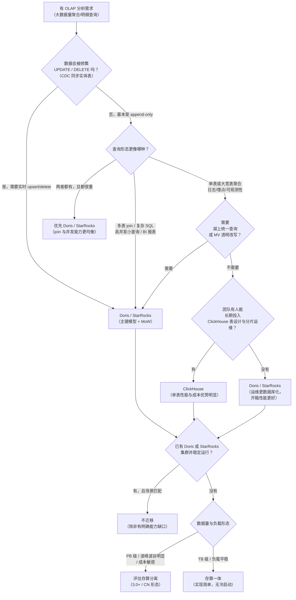
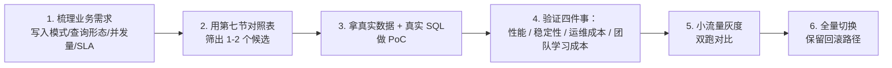

# ⚖️ 九、对比 StarRocks 与 ClickHouse

> 这三者都是 **MPP 列式 OLAP 数据库**，经常被放在同一张选型表里比较，但它们的设计取向**根本不同**：Doris 与 StarRocks 是"实时数仓"，ClickHouse 是"极速明细分析引擎"。
> 本篇的目标不是站队，而是给出一套**可复述、可落到业务上的选型决策依据**——包括它们的架构取舍、更新/去重能力的真实代价、以及"什么情况下根本不该换数据库"。
> 系列导航见 [[0-Doris总览]]。关联：[[2-数据模型]]（Doris 三种模型的细节）、[[6-数据导入与FlinkCDC]]（写入与 CDC 链路）、[[7-湖仓一体]]（multi-catalog 与湖上加速）、[[1-架构与原理]]（FE/BE 分工）、[[10-面试高频题]]（本篇的「必答」是高频面试题）。

> [!warning] 版本迭代很快，本篇给的是"选型框架"而不是"版本定论"
> Doris、StarRocks、ClickHouse 三家的功能边界**每个季度都在变**：某个功能"不支持"可能下一个版本就支持了，某个"支持的"可能语义变了。所以：
> - **具体功能是否支持、行为如何，一律以目标版本的官方文档为准**；
> - 本篇的重点是**判断维度**（你要问哪些问题、看哪些取舍），这套框架比任何功能清单都耐用；
> - 真要选型，正确做法是：用本篇的框架筛出 1~2 个候选，**用自己的真实数据 + 真实查询做 PoC**。

---

## 一、三者的定位与设计取向

### 1.1 共同点：先确认它们确实是"同一类"

| 共同特征 | 含义 |
|---|---|
| **MPP（大规模并行处理）** | 查询被拆成多个 fragment/instance 在多节点并行执行，节点间通过 shuffle 交换数据 |
| **列式存储** | 按列组织和压缩，只读需要的列，聚合扫描效率高 |
| **向量化执行** | 按批（block/vector）处理，而不是按行；充分利用 CPU |
| **无共享架构（shared-nothing）** | 表按分区 + 分桶/分片打散到多节点，数据本地性带来并行度 |
| **面向 OLAP** | 擅长聚合、扫描、宽表、大 group by；**都不是 OLTP 数据库** |

所以"该不该用它"这个层面的答案是相同的：**它们是分析引擎，不是事务库**。三者的差异全部在"分析引擎的具体形态"上。

### 1.2 设计取向：三句话概括

| 系统 | 一句话定位 | 核心取舍 |
|---|---|---|
| **Apache Doris** | **一体化实时数仓**：一套系统同时吃实时导入、频繁更新、复杂多表 join 和高并发 BI | 用"入库时的整理成本 + 后台 compaction"换"查询时的简单与并发能力"；牺牲单表极致扫描性能 |
| **StarRocks** | **面向在线分析的高性能数据仓库**：与 Doris 同源，在 CBO 优化器、物化视图透明改写、湖上查询上走得更激进 | 同样走实时数仓路线，但在"查询规划与加速"上更强调先进性；生态/商业化路线与 Doris 不同 |
| **ClickHouse** | **单表极速明细分析引擎**：把单机性能压榨到极致，用分片堆出集群能力 | 用"极致单机性能 + 简单模型"换"分布式管理复杂度"；**去重与更新是最终一致的，join 与高并发不是强项** |

一句话记住本质区别：

> **Doris/StarRocks 是"数据库"（有人管元数据、管分布式、管一致性）；ClickHouse 更像"一个超快的表引擎 + 一套分片运维手册"。**

### 1.3 本篇的使用方式

- 第一、二、三、四、五、六节 = **对比维度**（架构/模型/写入/查询/生态）；
- 第七节 = **适用场景对照表**（最重要的结论表）；
- 第八节 = **决策树**；
- 第九节 = **面试答题骨架**。

> [!tip] 阅读建议
> 如果你只想知道"该选谁"，直接跳到 **第七节 + 第八节**。如果你要准备面试，重点看 **第三节（更新语义差异）** 和 **第五节 5.4（物化视图差异）**——这两个是面试官最爱追问、也最能体现深度的点。

---

## 二、架构对比

### 2.1 总体架构

| 维度 | Apache Doris | StarRocks | ClickHouse |
|---|---|---|---|
| **角色划分** | **FE**（Frontend）+ **BE**（Backend）；存算分离下为 FE + Meta Service + **CN** | **FE** + **BE**；存算分离下为 FE + **CN**（Compute Node） | **去中心化的多分片集群**：每个节点都是独立的 ClickHouse Server，配置成不同 shard/replica；可选 **ClickHouse Keeper / ZooKeeper** 做副本协调 |
| **是否有中心元数据节点** | 有。FE 管理表结构、分区、tablet 分布、事务 | 有。FE 管理与 Doris 类似的元数据 | **没有统一的中心化元数据服务**。表结构在每个节点各自维护（DDL 靠 `ON CLUSTER` 广播）；集群拓扑靠配置文件/`remote_servers` 描述 |
| **元数据高可用** | BDBJE 多数派复制（Follower 奇数个） | 同源机制，FE 多副本 | 表结构：无中心，靠各节点 + 复制表；副本协调：Keeper/ZooKeeper 集群 |
| **系统架构来源** | Apache 顶级项目 | **起源于 Apache Doris 的分支**（2021 年前后由 DorisDB 更名而来），后成为 Linux Foundation 项目 | 独立自研，公司化运营 |
| **存算分离支持** | 3.0 起支持（`deploy_mode = cloud`） | 支持（CN + 对象存储） | 云版本有 SharedMergeTree 等形态；开源侧传统上以本地盘 shared-nothing 为主 |
| **计算资源隔离** | Workload Group（进程内）+ Resource Group / Compute Group（进程间） | 同源思路（Resource Group / Workload Group） | 靠配置文件划分用户/查询配额（`users.xml`、quotas）、靠多集群物理隔离 |
| **BI/客户端协议** | MySQL 协议（生态友好） | MySQL 协议 | 自己的 TCP 协议 + HTTP；**MySQL 协议是有限支持**（部分 BI 工具需要适配） |

### 2.2 元数据管理：一个容易被忽略的关键差异

| 问题 | Doris / StarRocks | ClickHouse |
|---|---|---|
| 建表时需要指定什么？ | 分区键 + 分桶键，**分桶数由元数据统一管理**，后续可 `ALTER` | **分区键 + 排序键（`ORDER BY`）+ 索引粒度**，这三个是性能的命门；分片键是"集群层面"的约定 |
| 加节点后数据怎么分布？ | **FE 自动重平衡**：新 BE 上建新副本、删旧副本，业务无感 | **分片数在配置里写死**，加节点 = 加一个 shard（新 shard 旧数据不会自动过去）；要让旧数据分布到新节点必须**手工 resharding**（建新表、导数、切换） |
| 改分桶/分片数？ | 改分桶数对已有分区是 DDL（较慢但有工具支持）；改分片是 FE 调度 | resharding 是运维大事，通常要"建新集群 + 迁数据" |
| DDL 的原子性 | FE 统一管理，DDL 有事务语义 | 靠 `ON CLUSTER` 广播到各节点，**没有全局事务**；广播失败会导致表结构不一致 |

> [!danger] "ClickHouse 扩容为什么痛苦"——这才是根因
> ClickHouse 的分布式表（`Distributed`）只是一个**查询路由层**，底层数据实际落在各个本地表上。**分片（shard）是配置里的静态约定**，`Distributed` 表按分片键把数据路由过去。
> 所以：
> - **加节点** = 加一个 shard。新数据会按分片键落到新 shard，但**存量数据不会自动迁移**，于是集群会长期处于"数据倾斜"状态。
> - **想让存量数据也均衡** = resharding。常见做法是建一张新的分布式表（更多分片）+ `INSERT INTO ... SELECT` 导数 + 重命名切换。数据量大时这是"以天为单位"的工程。
> - 这也是 ClickHouse 云服务把 resharding 作为重要能力的原因——**它是原生架构的痛**。
>
> 对比之下，Doris/StarRocks 的"加 BE 自动重平衡"是一个**架构层面**上的重大优势，对"数据量持续增长、需要平滑扩容"的业务是决定性的。

### 2.3 存算分离

| 维度 | Doris | StarRocks | ClickHouse |
|---|---|---|---|
| 是否支持 | 3.0+ 支持 | 支持 | 云版本有对应形态；开源传统形态仍是本地盘 |
| 关键收益 | 计算弹性（加 CN 不搬数据）、存储独立扩展、成本下降 | 类似 | 类似 |
| 关键代价 | **冷启动**（本地缓存未命中要回源对象存储）、部分运维能力缺失（如 Doris 存算分离**不支持 BACKUP/RESTORE**） | 类似 | 视产品形态而定 |
| 使用建议 | 数据量大、负载有波峰波谷时值得上；中小规模、负载平稳时存算一体更省心 | 同 | 同 |

> [!note] 别把存算分离当"性能优化"
> 存算分离解决的是**成本和弹性**，不是性能。在负载平稳、数据量不大的场景里，它带来的收益有限，却引入了冷启动延迟和运维复杂度。**这是一个成本决策，不是一个性能决策。**

### 2.4 扩展方式对比（浓缩成一张表）

| 场景 | Doris / StarRocks | ClickHouse |
|---|---|---|
| 加计算能力 | 加 BE/CN，自动均衡 | 加 shard（新数据过去，旧数据不动） |
| 加存储容量 | 加 BE 或加盘，自动均衡 | 加 shard + resharding，或加盘 |
| 缩容 | decommission（异步搬副本） | 手工导数 + 下线节点 |
| 扩容对业务的影响 | 后台异步，业务基本无感 | resharding 期间通常需要双写/停写/切换 |
| 数据倾斜的自我修复 | 有（TabletScheduler 主动均衡） | 无（分片静态，倾斜会一直存在） |

---

## 三、数据模型对比（关键的差异区）

### 3.1 模型映射

| 能力 | Apache Doris | StarRocks | ClickHouse |
|---|---|---|---|
| **明细模型（不去重、不聚合）** | `Duplicate Key` | `明细模型`（Duplicate Key） | `MergeTree` |
| **聚合模型（写入时按 key 预聚合）** | `Aggregate Key`（建表时声明聚合函数） | `聚合模型`（Aggregate Key） | `SummingMergeTree`（对数值列求和）、`AggregatingMergeTree`（配合 `AggregateFunction` 类型存中间态） |
| **主键 / 更新模型** | `Unique Key`，**新版默认 MoW**（Merge-on-Write：写入时用 delete bitmap 标记删除 + 直接写新行，查询时无需合并） | `主键模型`（Primary Key），同样是 **MoW**；StarRocks 3.x 把"更新模型"与"主键模型"统一 | **没有真正的 upsert 模型**。`ReplacingMergeTree` 提供**最终一致**的去重语义 |
| **排序/索引决定查询效率** | 前缀索引 + 分区裁剪 + 分桶裁剪，由元数据自动管理 | 同源思路 | **`ORDER BY`（排序键）+ 稀疏主键索引 + 跳数索引**——这是 ClickHouse 性能设计的核心，需要人工精心设计 |
| **更新/删除的语义** | 主键模型支持 upsert；`DELETE` 语句支持（按条件删，代价可控） | 同 | `ALTER TABLE ... UPDATE/DELETE` 是**异步 mutation**，代价重；`DELETE` 有轻量级实现；`ReplacingMergeTree` 需 `FINAL` 或后台合并才去重 |

### 3.2 "能不能做更新/去重"——这是选型的第一道分水岭

| 问题 | Doris | StarRocks | ClickHouse |
|---|---|---|---|
| 支持按主键 upsert？ | **是**（`Unique Key` + MoW） | **是**（主键模型 + MoW） | 用 `ReplacingMergeTree` 近似，**语义是最终一致** |
| 查询时一定去重吗？ | **是**（MoW 的 delete bitmap 参与读取，结果确定） | **是** | **不保证**。需要加 `FINAL`，或等后台 merge 完成，或用 `argMax`/`any` 之类聚合手法自己取最新 |
| 更新一行的代价 | 低（写一行 + 更新 bitmap） | 低 | 高（mutation 会重写整个 part；`ReplacingMergeTree` 则是"写一行新版本 + 等合并"） |
| 支持 DELETE 按条件删？ | 支持 | 支持 | 支持，但**异步 mutation**，大量小 mutation 会把后台压垮 |
| 实时 CDC 同步的适配度 | **高**（主键模型天然适配 upsert/delete） | **高** | **低到中**（需要额外设计去重策略） |

### 3.3 深入：ClickHouse 的 `ReplacingMergeTree` 到底"去重"到什么程度

这是**最容易踩坑、也是面试最容易被追问**的一点，必须讲清：

`ReplacingMergeTree` 的机制是：同一主键（`ORDER BY` 定义的排序键）的多行数据，在**后台合并（merge）**时保留版本号最大的那一行。于是：

- **合并是后台异步的**，什么时候合并**不确定**（取决于 part 数量、写入节奏、`OPTIMIZE` 的调用等）；
- 所以在任何**确定的时刻**，表中都可能存在同一主键的多行；
- 想让查询结果确定一致，你有三个选择，每个都有代价：

| 做法 | 效果 | 代价 |
|---|---|---|
| 查询加 `FINAL` | 查询时强制去重，结果正确 | **性能开销显著**（要现场做去重），高并发下不可接受 |
| 定期 `OPTIMIZE TABLE ... FINAL` | 强制合并，之后查询就不需要 `FINAL` | 是**重型操作**，会大量读写磁盘；不能频繁做，且期间有资源占用；数据仍在持续写入时"合并完又有新的" |
| 查询自己写聚合（`argMax`、`any`、`GROUP BY` + 取最新） | 不改存储，查询层保证语义 | **每条 SQL 都要写对**，容易漏；SQL 复杂度上升 |

**这是什么意思？** 对"实时数仓"而言这是**根本性的不适配**：

> 实时数仓的核心需求是"CDC 变更实时同步进来，下游查询立刻看到唯一的、正确的最新状态"。
> `ReplacingMergeTree` 提供的却是"**最终一致**"——在任意一个查询时刻，你都无法保证看到的是去重后的结果，除非付出 `FINAL` 的查询代价或频繁 `OPTIMIZE` 的写入代价。
> **Doris/StarRocks 的主键模型（MoW）在写入时就通过 delete bitmap 把语义"做死了"**，查询时结果天然确定，且不需要读时去重。这是两类系统在"实时更新"场景下最本质的差异。

> [!important] 一句话总结这个关键差异
> **Doris/StarRocks：写时确定（Merge-on-Write，查询结果永远正确）。**
> **ClickHouse：读时补偿（Merge-on-Read，不去重就可能有重复行，靠 `FINAL`/`OPTIMIZE` 兜）。**
> 这不是"谁好谁坏"，而是"面向的场景不同"：如果业务是**日志/明细/append-only**，ClickHouse 的设计完全没问题；如果业务是**订单/用户/库存这类需要频繁更新的实体表**，ClickHouse 会让你持续付"去重税"。

### 3.4 聚合模型的差异

| 维度 | Doris / StarRocks 的 Aggregate 模型 | ClickHouse 的 `SummingMergeTree` / `AggregatingMergeTree` |
|---|---|---|
| 聚合时机 | 写入时按 key 预聚合 | 后台 merge 时聚合（**不是立即**），查询时也可能拿到未聚合的行 |
| 是否可查明细 | Aggregate 模型下不可（只能查聚合值） | `SummingMergeTree` 底层仍存明细，只是 merge 时求和 |
| 典型用途 | 固定维度的指标预聚合，减少存储和查询量 | 指标明细的自动汇总 |
| 与物化视图配合 | 常与物化视图一起做分层预聚合 | 常与 `AggregatingMergeTree` + `AggregateFunction` + MV 一起做"实时指标" |
| 查询语义确定性 | 确定 | `SummingMergeTree` 查询时**可能拿到未合并的重复 key**，通常需要再 `GROUP BY` 一次才安全 |

> [!tip] ClickHouse 的 `SummingMergeTree` 有一个"反直觉"的坑
> 因为 merge 是后台异步的，**直接 `SELECT sum(x) FROM summing_table` 而不带 `GROUP BY` 可能算错**（未合并的重复 key 会被重复计入）。安全写法是 `SELECT k, sum(x) ... GROUP BY k`。这一点在很多教程里被忽略，但它是生产事故的来源。

---

## 四、写入与实时性

### 4.1 导入通道对比

| 导入方式 | Doris | StarRocks | ClickHouse |
|---|---|---|---|
| **HTTP 批量导入** | Stream Load | Stream Load | HTTP interface / `INSERT INTO ... FORMAT` |
| **消费消息队列** | Routine Load（Kafka） | Routine Load（Kafka） | **Kafka 表引擎**（把 Kafka topic 当表读，或 MV 落表） |
| **流计算写入** | Flink/Spark Connector | Flink/Spark Connector | Flink/Spark Connector（社区维护） |
| **本地文件/批量** | `INSERT INTO ... SELECT`、Broker Load、S3/HDFS TVF | 类似 | `INSERT INTO ... SELECT`、`clickhouse-client --query` 导入、`s3()`/`hdfs()` 表函数 |
| **单条/小批写入** | 支持但有代价（会产生 version，见下） | 同 | **不友好**。ClickHouse 最怕"高频小批 insert"——每次 insert 生成一个 part，part 太多会触发 "too many parts"，写入被拒绝 |
| **幂等 / 去重** | **Label 幂等**：同 label 的导入只生效一次；配合两阶段提交 | 同源机制 | 通常靠客户端/上游保证，**原生幂等能力弱** |

### 4.2 对 CDC 的友好度

| 环节 | Doris / StarRocks | ClickHouse |
|---|---|---|
| 承接 Flink CDC 的 upsert/delete | **天然适配**（主键模型 + MoW） | 需要自己设计（用 `ReplacingMergeTree` + 版本列，再配合查询侧 `argMax` 或 `FINAL`） |
| 承接 delete 事件 | 支持（删除标记进 delete bitmap） | 需用 `CollapsingMergeTree`/`VersionedCollapsingMergeTree` 或 `ALTER DELETE` — 都是额外复杂度 |
| 端到端"实时可见且语义正确" | 可以做到 | **很难**。链路上任何一段的异步性都会破坏语义 |
| 典型落地 | Flink CDC → Stream Load/Routine Load → 主键模型广表 → 实时 BI | 通常把 ClickHouse 放在"日志/事件/明细"链路，而不是"实体表同步"链路 |

> [!example] 一个真实的选型分叉点
> 业务需求是"把 MySQL 的订单表通过 Flink CDC 同步到 OLAP，实时看订单状态"。
> - 订单表会被 **UPDATE**（状态流转）、可能被 **DELETE**（取消）。
> - 选 Doris/StarRocks：主键模型直接接 Flink CDC 的 upsert 流，下游查询立刻是正确的当前状态。这是一个"开箱即用"的方案。
> - 选 ClickHouse：要么用 `ReplacingMergeTree` 并接受"查询可能看到旧版本直到合并完成"，要么到处加 `FINAL`（性能崩），要么在 Flink 里做去重（违背了用 OLAP 的意义）。
> **这个需求本身就基本决定了答案。** 反过来说，如果需求是"把 Nginx/App 日志实时写入并做多维聚合分析"，ClickHouse 会非常舒服——**日志是 append-only 的，没有更新语义问题**。

### 4.3 高频小批写入的表现

这是**写入侧最重要的对比维度**，因为实时链路天然是小批高频。

| 维度 | Doris / StarRocks | ClickHouse |
|---|---|---|
| 小批写入产生什么 | 每次导入产生一个 **rowset（version）** | 每次 insert 产生一个 **part** |
| 触发什么后台机制 | **Compaction**（Cumulative + Base）合并 rowset | **Merge** 合并 part |
| 会不会写失败 | 会：单 tablet version 数超过 `max_tablet_version_num` → **`-235` too many versions** | 会：part 数量过多 → **"too many parts"** 拒绝写入 |
| 官方是否提供缓解手段 | 有：**Group Commit**（服务端攒批）、Routine Load 批量参数、攒批建议 | 有：`async_insert`（服务端攒批）、增大 `parts_to_delay_insert`/`parts_to_throw_insert`、建议客户端攒批 |
| 最根本的解法 | **从上游攒批**（减少导入次数） | **从上游攒批**（减少 insert 次数） |
| 小批写入的"体感" | 相对宽容（有 compaction 兜底，且能靠加线程、加桶缓解） | **更敏感**。ClickHouse 官方文档明确把高频小批 insert 列为反模式 |

> [!note] 两者的失败模式很像，但"容错余量"不同
> Doris 的 `-235` 和 ClickHouse 的 "too many parts" 本质是同一个问题（**写入速率 > 后台合并速率**），解法的方向也一样（攒批）。
> 差别在于：Doris 的 compaction 是一个**可以横向扩展、参数可调、且有多种策略（size_based / time_series / vertical / segment）**的体系，调优空间更大；而 ClickHouse 的 part 数量问题更"硬"——**它要求写入方严格遵守批量写入的纪律**。
> 也就是说：**如果你的写入侧无法管控（比如大量业务方各自直接写），ClickHouse 会更容易被写崩。**

### 4.4 两阶段提交与幂等

| 能力 | Doris / StarRocks | ClickHouse |
|---|---|---|
| 导入幂等 | **Label**：同一 label 的导入只会生效一次，重试安全 | 无原生 label 机制，通常靠上游去重 |
| 两阶段提交（2PC） | 支持，用于 Flink 等流式写入的 exactly-once 落地 | 有分布式表的写入，但 2PC 语义与 Doris 不同；EOS 通常靠上游/下游配合 |
| 事务可见性 | 一个导入要么整体可见，要么不可见 | 一次 `INSERT` 的 part 是原子的，但跨分片/跨表没有全局事务 |
| Flink 侧 | Flink Doris Connector 内置重试与 2PC 支持 | Flink ClickHouse Connector 能力相对简单 |

> [!tip] 这一点对实时数仓很重要
> 实时链路里"重试"是常态（网络抖动、任务重启）。**有 Label 幂等 + 2PC 的系统，重试是安全的；没有的系统，重试会产生重复数据**。这是 Doris/StarRocks 在实时数仓场景里一个不显眼但很实在的优势。详见 [[6-数据导入与FlinkCDC]]。

---

## 五、查询能力

### 5.1 多表 join 与大宽表

| 维度 | Doris / StarRocks | ClickHouse |
|---|---|---|
| Join 优化成熟度 | **成熟**。CBO 优化器、多种 join 策略自动选择 | 有 hash join 等算法，但**分布式 join 的代价模型和优化器能力相对弱** |
| 数据分布感知的 join | **有**：Colocate Join（同分布键的表本地 join，无 shuffle）、Bucket Shuffle Join（只 shuffle 一侧） | **没有**。分片键和 join 键通常不一致，join 需要跨节点搬运数据 |
| Runtime Filter | 有（build 侧生成 filter 下推到 probe 侧，大幅减少扫描） | 有类似的运行时过滤能力，但生态上与"多表 join 场景"的结合度不如前两者 |
| 大宽表（几十上百列） | 支持；有**行列混存**（row store）优化点查；宽表 compaction 有 Vertical Compaction | 支持；**宽表是 ClickHouse 的舒适区**（列存 + 向量化） |
| 典型表现 | 多表关联的复杂 SQL 是主战场 | **单表/大宽表 + 聚合**是主战场；**多表复杂 join 是相对弱项** |
| 子查询 | 支持较完整（含相关子查询等） | 支持度逐步提升，但**复杂子查询/嵌套查询的历史包袱较重**，某些写法性能或语义上有坑 |

**结论**：如果你的 SQL 是"3~8 张表 join 出宽表再聚合"（典型 BI 场景），Doris/StarRocks 更省心；如果你的 SQL 是"一张巨表按时间/维度做 group by"（典型日志分析），ClickHouse 很可能更快。

### 5.2 复杂 SQL 与子查询

| 场景 | Doris / StarRocks | ClickHouse |
|---|---|---|
| 标准 SQL 兼容度 | 高，贴近 MySQL 语法 | **方言化明显**。函数体系、`FINAL`、`PREWHERE`、数组/元组类型、`LIMIT BY` 等都是自己的体系 |
| 窗口函数 | 支持 | 支持（且很强大） |
| CTE / 嵌套 | 支持 | 支持 |
| 复杂多表关联 | 强项 | 相对弱项 |
| 查询改写/优化器 | 有成熟的 CBO；StarRocks 在优化器上投入较多 | 优化器更"局部"，很多性能要靠人工设计（`ORDER BY`、`PREWHERE`、物化视图、投影） |
| 学习成本 | 低（会 MySQL 基本能上手） | **高**。要写出高性能的 ClickHouse SQL，你必须理解 part/merge/排序键/稀疏索引——**不设计表结构就用 ClickHouse，性能会差得让人怀疑人生** |

> [!warning] ClickHouse 的性能是"设计出来的"，Doris 的性能是"优化出来的"
> 这是一句很方便记忆的判词：
> - **ClickHouse**：性能上限极高，但**高度依赖表设计**（`ORDER BY`、分区键、索引粒度、跳数索引、投影）。表设计对了，单表查询快到不可思议；设计错了，加了机器也没用。
> - **Doris/StarRocks**：开箱性能就不错，**主要靠优化器自动做事**（分区裁剪、分桶裁剪、colocate、runtime filter）。你的优化动作更多是"把表结构和 SQL 写对"，而不是"手工设计存储布局"。
> 这直接对应到**团队能力**：如果团队里没有人有精力深挖 ClickHouse 的表设计，ClickHouse 的实际表现可能会显著低于它的潜力。

### 5.3 高并发点查

这是 BI 报表场景的核心诉求（几百上千并发的小查询）。

| 维度 | Doris / StarRocks | ClickHouse |
|---|---|---|
| 主键/index 结构 | 主键模型 + 前缀索引 + 分区/分桶裁剪；支持**行存**（`store_row_column` 类能力）加速点查 | **稀疏主键索引**（每 N 行一个索引项）+ 跳数索引；点查效率取决于 `ORDER BY` 设计 |
| 设计取向 | 明确把"高并发点查"当作一个优化方向（行存、主键、短路径查询） | 设计取向是**吞吐优先**（大查询扫大量数据），不是高并发小查询 |
| 单查询的资源开销 | 有 pipeline 执行框架 + 轻量查询路径 | 每个查询有一定固定开销；高并发小查询下资源放大明显 |
| 并发能力 | 通过 Workload Group 做并发限制 + 排队，配合资源隔离 | 通过 `users.xml`/quotas + 多副本分担读来提升；缺少细粒度的进程内工作负载隔离 |
| 结论方向 | **高并发点查/报表**是舒适区 | **不是舒适区**（虽然一直在改进），更适合"少而重"的查询 |

> [!important] 一字之差：OLAP 的 "A" 有两种读法
> - **Analytical（分析型）**：大查询、少并发、扫大量数据做聚合 → **ClickHouse 的强项**
> - **Analytics serving（分析服务）**：小查询、高并发、复杂 join、要稳定的 P99 → **Doris/StarRocks 的强项**
> 很多选型失败的根源就是：**业务其实是"分析服务"，却被"ClickHouse 单表跑得快"的 benchmark 吸引了。**

### 5.4 物化视图：一个必须讲清的语义差异

这是三者差异中最容易被误解、也最能体现深度的点。

| 维度 | Doris | StarRocks | ClickHouse |
|---|---|---|---|
| **同步物化视图** | 有（`CREATE MATERIALIZED VIEW` + rollup 语义），数据与基表强一致，写入时同步维护 | 有 | 没有严格对应的"同步 MV"概念 |
| **异步物化视图** | 有（MTMV），按调度或手动刷新，适合跨表预聚合与分层建模 | 有，且能力强 | 有 `MATERIALIZED VIEW`，但**语义完全不同**（见下） |
| **查询透明改写** | 支持（异步 MV 可被优化器自动匹配并改写查询） | 支持，且**透明改写能力是 StarRocks 的一大卖点**（覆盖场景更广） | **不支持**。查询不会被自动改写到 MV 上 |
| **`MATERIALIZED VIEW` 的真实语义** | — | — | **"插入触发器"**：当有数据 `INSERT` 到源表时，MV 的查询逻辑**只针对这一批新插入的数据块**执行一次，结果写入目标表 |
| **增量能力** | 异步 MV 支持分区级刷新与增量刷新（视版本与场景） | 支持 | MV 只增量处理"新插入的块"。**对源表的 UPDATE/DELETE 无感知** |
| **典型用法** | 分层预聚合（DWD → DWS），或对外提供加速视图 | 同，且更依赖透明改写做"对用户无感的加速" | 常配 `AggregatingMergeTree` + `AggregateFunction` 做**实时指标**（如 UV、分位数），本质是"写入时的流式聚合" |

> [!danger] 别把两个 `MATERIALIZED VIEW` 当成同一个东西
> - **ClickHouse 的 MV = 写入触发器**。它关心的是**新插入的数据**：源表来一批数据，MV 跑一次逻辑，把结果写到目标表。它**不是**"把某条查询预计算好、以后相同查询自动走 MV"。
> - **Doris/StarRocks 的异步 MV = 预计算 + 透明改写**。你定义一个 MV，系统（或调度器）把结果算好存下来，**之后提交的、语义被该 MV 覆盖的查询会被优化器自动改写去读 MV**，用户无感。
> - 所以：如果你想要的是"**BI 用户不改 SQL 就自动加速**"，ClickHouse 的 MV 帮不了你（你可以手工把查询指向目标表，但那是两套 SQL）；Doris/StarRocks 的异步 MV + 透明改写才是这个需求的正解。
> - 反过来，如果你想要的是"**实时 UV/分位数这类流式指标**"，ClickHouse 的 `AggregatingMergeTree` + MV 组合非常契合，且性能优异。

补充：StarRocks 与 Doris 在 MV 上的差别主要是**透明改写的覆盖面与自动化程度**（StarRocks 在这块投入更多、覆盖场景更广），以及一些细节能力上的差异。**具体能力（是否支持某类改写、是否支持增量刷新）随版本变化很快，以官方文档为准。**

### 5.5 查询能力总表

| 能力 | Doris | StarRocks | ClickHouse |
|---|---|---|---|
| 单表大量数据聚合扫描 | 好 | 好 | **极强** |
| 大宽表 | 好（有 Vertical Compaction、行列混存） | 好 | **极强** |
| 多表复杂 join | **强** | **强**（优化器投入更多） | 一般 |
| 高并发小查询 | **强** | **强** | 弱到一般 |
| 复杂子查询/标准 SQL | 强 | 强 | 一般（方言化） |
| 物化视图透明改写 | 支持 | **支持（强项）** | **不支持** |
| 湖上查询加速 | 支持（multi-catalog） | 支持（multi-catalog，湖上能力是重点方向） | 支持（表函数/表引擎/DataLake 类能力），但统一 catalog 体验不如前两者 |
| 全文检索/倒排索引 | 有倒排索引能力 | 有 | 有（`tokenbf_v1`/`ngrambf_v1` 跳数索引、全文索引） |
| JSON/半结构化 | 有（VARIANT 等） | 有 | 强（原生 JSON、数组/元组类型体系强大，这是 ClickHouse 的亮点） |

---

## 六、生态与运维

### 6.1 社区与国内使用情况

| 维度 | Doris | StarRocks | ClickHouse |
|---|---|---|---|
| 治理 | Apache 顶级项目（ASF） | Linux Foundation 项目 | 独立公司主导（ClickHouse Inc.）+ 开源社区 |
| 商业化 | 有（SelectDB 等） | 有（CelerData 等） | 有（ClickHouse Cloud） |
| 国内使用 | 广泛，公开案例覆盖互联网、金融、运营商、制造等；中文资料与社区活跃 | 广泛，公开案例集中在互联网/零售/出行等领域；中文资料丰富 | 广泛，但**集中在日志/可观测性/埋点分析**类场景（这也是它最舒服的定位） |
| 中文文档/社区支持 | 好 | 好 | 好（但很多最佳实践需要读英文或源码/issue） |
| 招聘/人才供给 | 多 | 中到多 | 多（但"会 ClickHouse"和"会 ClickHouse 调优"差距很大） |
| 三者关系 | StarRocks 由 Doris 分支而来，所以**架构与概念高度相似**，会一个基本会用另一个 | 同左 | 概念体系独立，经验**不可迁移** |

> [!note] "同源"带来的实务影响
> Doris 与 StarRocks 同源，所以：FE/BE 分工、分区/分桶、三种数据模型、Stream Load/Routine Load、物化视图、甚至很多参数名都相似。**团队从 Doris 切到 StarRocks（或反向）的学习成本远低于切换到 ClickHouse。** 这在选型里是一个真实存在的、经常被低估的因素。

### 6.2 集成能力

| 集成对象 | Doris | StarRocks | ClickHouse |
|---|---|---|---|
| **Flink** | 官方 Connector，支持 Stream Load / 2PC / CDC 链路 | 官方 Connector，能力类似 | 社区 Connector，能力相对简单 |
| **Spark** | 官方 Connector（读写） | 官方 Connector | 官方/社区 Connector（spark-clickhouse） |
| **Hive / 湖格式** | **Multi-Catalog**：Hive、Iceberg、Hudi、Paimon 等，可作为外部 catalog 直接查询，并与内表 join | Multi-Catalog，湖上能力是重点投入方向 | 通过表函数（`hdfs`/`s3`/`iceberg` 等）与对应表引擎访问，**统一 catalog 与元数据映射体验弱于前两者** |
| **BI 工具** | MySQL 协议，主流 BI 基本开箱接入 | 同 | 需要驱动/适配，部分工具兼容性一般 |
| **消息队列** | Routine Load（Kafka） | Routine Load（Kafka） | Kafka 表引擎 |
| **JDBC/ODBC** | 好 | 好 | 有（但走自己的协议栈） |
| **数据湖仓统一视角** | 强 | 强 | 中 |

### 6.3 运维复杂度

| 运维项 | Doris | StarRocks | ClickHouse |
|---|---|---|---|
| 依赖组件 | FE + BE（无需外部协调服务） | FE + BE | **ZooKeeper 或 ClickHouse Keeper**（ReplicatedMergeTree 的协调依赖），以及 `Distributed` 表的集群配置 |
| 加节点 | 自动重平衡，业务无感 | 同 | 加 shard 后**存量数据不迁移**，需 resharding |
| 副本管理 | FE 统一调度（TabletChecker / TabletScheduler），有健康状态体系与自动修复 | 同源机制 | 由 Keeper 协调副本复制；副本一致性是**最终一致**，需自己判断何时 `OPTIMIZE` |
| 故障恢复 | 副本自动补齐；有 decommission 安全下线 | 同 | 节点下线需要手工处理分片归属；副本恢复靠复制队列 |
| 表结构变更 | FE 统一管理，DDL 有事务语义 | 同 | `ALTER` 一般是轻量元数据操作（这是 ClickHouse 的优点），但 `ON CLUSTER` 广播无全局事务 |
| 监控 | 自带 metrics + 官方 Grafana Dashboard | 类似 | 自带 `system.*` 表（非常丰富，是一个亮点）+ Prometheus exporter |
| 学习/使用成本 | 低 | 低到中 | **高**（表设计 + 集群拓扑 + part/merge 心智模型） |
| 一个"痛"的总结 | 主要集中在 compaction 与内存（见 [[8-运维与调优]]） | 类似 | 主要集中在**扩缩容（resharding）** 与 **写入纪律（part 数量）** |

> [!important] 运维成本也是选型的一部分
> 很多技术选型只算"查询性能"，不算"运维人力"。现实是：
> - **ClickHouse 的运维是最重的**：要懂 Keeper、要会设计分片、要做 resharding、要盯 part 数量、要理解 merge 行为。**它需要专人。**
> - **Doris/StarRocks 的运维更"数据库化"**：加节点自动均衡、副本自动修复、DDL 有事务、有官方管理工具。**小团队更容易驾驭。**
> 如果团队只有 1~2 个大数据同学，还要同时维护 Flink/调度/存储，这个因素往往比 30% 的查询性能差异更重要。

### 6.4 学习成本

| 维度 | Doris / StarRocks | ClickHouse |
|---|---|---|
| SQL 上手 | 会 MySQL 基本能写（但要注意 OLAP 特有的分区分桶、模型选择） | 需要学一套方言和函数体系 |
| 表设计难度 | 中（分区 + 分桶 + 模型选择，有经验规则） | **高**（`ORDER BY`/分区键/索引粒度/跳数索引/投影，直接决定性能上限） |
| 调优心智模型 | "把模型、分区、分桶、SQL 写对，剩下交给优化器" | "理解 part/merge/索引，把表设计对"——**更像是在设计一个存储格式** |
| 经验可迁移性 | Doris ↔ StarRocks 高度可迁移 | 与 SQL 数仓的经验部分可迁移，但**存储层经验是独立的** |
| 上手到"能扛生产" | 相对快 | 相对慢 |

---

## 七、适用场景对照表（最重要的结论表）

| # | 你的场景 | 推荐 | 理由 |
|---|---|---|---|
| ① | **实时数仓 + 频繁更新**（CDC 同步 MySQL 业务表，需要 upsert/delete） | **Doris / StarRocks** | 主键模型 + MoW 在写入时确定语义，天然适配 Flink CDC；ClickHouse 的 `ReplacingMergeTree` 是最终一致，会持续付"去重税" |
| ② | **高并发 BI 报表 + 复杂多表 join** | **Doris / StarRocks** | colocate join / bucket shuffle / runtime filter + 成熟 CBO；ClickHouse 缺数据分布感知的 join 优化，高并发点查也不是强项 |
| ③ | **海量日志/埋点/事件明细 + 大宽表 + 单表聚合为主** | **ClickHouse** | append-only 无更新语义问题；单表极致扫描性能；宽表与半结构化（JSON/数组）能力强 |
| ④ | **已有 ClickHouse 集群，且场景满足（日志/明细/聚合）** | **继续用 ClickHouse** | 已经跑通、团队熟悉、场景匹配 —— **不要为了迁移而迁移** |
| ⑤ | **需要湖上查询加速**（Hive/Iceberg/Hudi/Paimon 直接查 + 与内表 join） | **Doris / StarRocks** | Multi-Catalog 的统一视角与 join 能力更成熟 |
| ⑥ | **需要"BI 用户不改 SQL 就自动加速"** | **Doris / StarRocks** | 异步 MV + 透明改写；ClickHouse 的 MV 是写入触发器，不做查询改写 |
| ⑦ | **可观测性/APM 后端**（日志、trace、metrics 存储与查询） | **ClickHouse**（或专用时序库） | 写入量大、append-only、以时间维度聚合为主，正是 ClickHouse 的设计目标 |
| ⑧ | **多业务共用一个集群，需要资源隔离** | **Doris / StarRocks** | Workload Group（CPU/内存/并发/队列）+ Compute Group 分层隔离；ClickHouse 缺少细粒度进程内工作负载隔离 |
| ⑨ | **团队小、运维人力有限** | **Doris / StarRocks** | 自动重平衡、自动副本修复、DDL 有事务、MySQL 协议；ClickHouse 需要专人维护分片与 part |
| ⑩ | **需要频繁/不规则的表结构变更 + 极简部署** | **ClickHouse**（单机/小集群） | 轻量 `ALTER`、单二进制部署、`clickhouse-local` 可直接分析文件；小规模下体验极好 |
| ⑪ | **需要精确一次（EOS）的流式落地 + 重试安全** | **Doris / StarRocks** | Label 幂等 + 两阶段提交；ClickHouse 原生幂等能力弱 |
| ⑫ | **已有 Doris 且跑得不错，考虑要不要换 StarRocks** | **一般不换** | 同源架构，能力差异主要在优化器/MV/湖上的细节。**收益通常不抵迁移成本**，除非有明确的能力缺口 |

> [!tip] 把这张表当"体检表"用
> 逐条问自己：我这 12 条里踩中了几条？如果 ①②⑥⑧⑨⑪ 中踩中 2 条以上 → 倾向 Doris/StarRocks；如果 ③⑦⑩ 中踩中 2 条以上且**完全没踩 ①⑥** → 倾向 ClickHouse；如果踩中 ④ → **什么都别做**。

---

## 八、选型决策树

### 8.1 决策路径

### 8.2 决策树的使用方法

把决策树里每个菱形当成一个**必须在需求评审上被明确回答的问题**：

| 问题 | 为什么必须问 |
|---|---|
| 数据会被频繁 UPDATE/DELETE 吗？ | **最致命的一问**。答错这一问，后面全错 |
| 查询是"少而重"还是"多而轻"？ | 决定要不要考虑高并发能力（这是 ClickHouse 的相对弱项） |
| Join 有几张表、多复杂？ | 决定 join 优化能力的重要性权重 |
| 需要湖上统一查询吗？ | 决定 multi-catalog 的权重 |
| 需要"用户无感加速"吗？ | 决定 MV 透明改写的权重 |
| 团队有 ClickHouse 专家吗？ | 决定 ClickHouse 的实际表现能否接近它的潜力上限 |
| 数据量和负载形态如何？ | 决定存算一体 / 存算分离 |
| 已有集群跑得怎么样？ | 决定"要不要动"——**这一问经常被跳过，导致无谓的迁移** |

### 8.3 "什么时候不要换数据库"

这一节比选型本身更重要，因为**大部分数据库迁移的失败不是选错了，而是不该迁**。

| 情况 | 建议 | 理由 |
|---|---|---|
| 现有系统满足需求，只是"跑分不如别人" | **不换** | benchmark 和你的业务是两回事。迁移的成本是真实成本，跑分的收益是纸面收益 |
| 换过去能解决"性能"，但痛点是"数据质量/建模/SQL 写得烂" | **不换** | 换数据库不会修好烂 SQL。先把 SQL 和建模修好，往往性能就够了 |
| 换过去能省 30% 成本，但需要 2 人月迁移 + 半年不稳定期 | 算总账 | 把"人力成本 + 风险成本 + 业务等待成本"都算进去 |
| 痛点只是"某类查询慢"，且占比很小 | **不换**，单独优化 | 用物化视图、预聚合、缓存或单独一个专用存储解决那一类查询，比整体迁移划算 |
| 团队只有一个人懂新系统，且没有接手人 | **不换**（或先培养人） | 单点依赖是最大的运维风险 |
| 现有集群已经用了很久，运维脚本/BI/调度全绑在上面 | **谨慎换** | 迁移的隐性成本在"周边生态"而不在数据库本身 |
| 现有系统有**明确的能力缺口**（比如确实做不了实时 upsert，或湖上查询完全用不了） | **换** | 这才是迁移的正当理由 |

> [!important] 三个判断迁移是否值得的问题
> 1. **现在的痛，用现有系统 + 优化手段真的解决不了吗？**（先穷尽优化，再看迁移）
> 2. **换过去之后，新系统会不会在另一个维度变成新的痛？**（比如为了实时更新换掉 ClickHouse，结果发现新系统的日志扫描性能不如原来）
> 3. **迁移的隐性成本（BI 适配、调度改造、双跑验证、回滚方案、团队学习）算清楚了吗？**
> 三个问题都能理直气壮地回答，再谈迁移。

### 8.4 真实选型流程（比决策树更实用）

> [!warning] PoC 的常见错误
> - **用公开 benchmark 数据集代替自己的数据** → 结论不可迁移；
> - **只测"最快的那类查询"** → 忽略 P99 和并发；
> - **不测写入链路**（尤其是 CDC/小批写入）→ 上生产才发现写不进去；
> - **不测运维动作**（加节点、扩容、备份、升级）→ 上生产才发现扩容要停机；
> - **只测单机** → 忽略分布式 join 和数据倾斜。
> PoC 必须包含：**① 你自己的全量数据 + 典型查询；② 并发压测（看 P99）；③ 真实写入链路端到端；④ 至少一次扩容演练；⑤ 至少一次备份恢复演练。**

---

## 九、面试答题骨架

### 9.1 被问"为什么选 Doris 不选 ClickHouse？"

**答题结构（四步，不要只讲性能）**：

**第一步：先给场景约束（这一句决定了后面所有论证的合法性）**

> "我们的场景是**实时数仓**：上游是 MySQL 业务库，通过 Flink CDC 同步过来，业务方需要看到**实时的、唯一的、正确的当前状态**，同时 BI 报表有比较多的多表关联。"

**第二步：用"更新语义"给出第一性理由（最重要的理由）**

> "我们的实体表（订单、用户）会被频繁 UPDATE，也会有 DELETE。Doris 的主键模型是 **Merge-on-Write**，写入时就用 delete bitmap 把语义确定下来，**下游查询拿到的结果永远是去重后的**。
> ClickHouse 的 `ReplacingMergeTree` 是 **最终一致**的：后台 merge 什么时候完成不确定，任何时刻都可能读到同一主键的多行。要保证正确性就得加 `FINAL`（查询代价显著上升）或者频繁 `OPTIMIZE ... FINAL`（写入侧重操作）。
> 对实时数仓来说，这是**根本性的不适配**，不是调参能解决的。"

**第三步：补 join 与高并发两个维度**

> "其次，我们的 BI 查询里有不少 3~6 张表的关联。Doris 有 colocate join、bucket shuffle、runtime filter 这些数据分布感知的优化，优化器也比较成熟；ClickHouse 在分布式 join 上缺少分布感知，join 键通常和分片键不一致，跨节点搬运代价高。
> 第三是并发：我们是**对外提供报表服务**的，要求几百并发下 P99 稳定。ClickHouse 的设计取向是吞吐优先的大查询，高并发小查询不是它的强项。Doris 可以用 Workload Group 做并发限制 + 排队 + CPU/内存配额。"

**第四步：主动提运维与团队，并给出诚实边界**

> "还有就是运维成本：ClickHouse 的扩容要 resharding，存量数据不会自动迁移，还需要维护 Keeper。Doris 加 BE 是自动重平衡，业务无感；团队之前也更熟 Doris/MySQL 这一套，学习成本低。
> **不过我要说清楚：ClickHouse 在它的舒适区里是更强的**。如果场景是海量日志、埋点、可观测性这种 append-only 的明细聚合，或者大宽表单表分析，ClickHouse 的单表性能和成本优势会很明显。**我们选 Doris 不是因为它全面更好，而是因为它的取舍正好匹配我们的场景。**"

> [!tip] 这个答法的杀伤力在哪
> - **先说场景约束**：让结论显得是"推导出来的"，而不是"背下来的"；
> - **第一性理由是语义，不是性能**：性能会被追问细节（多少 QPS？），语义差异是架构层面的，无法用调参绕过，显得更有判断力；
> - **主动给对方的优点和适用边界**：这是"技术判断力"的信号，而不是"踩一捧一"；
> - **最后一句自证**：说明你理解"选型 = 取舍"，而不是"选最好的"。

### 9.2 可复述的话术模板

> **【结论】**
> "我们选 Doris 而不是 ClickHouse，**核心不是性能，而是更新语义**。"
>
> **【理由一：语义】**
> "我们的实体表会被频繁更新，ClickHouse 的 `ReplacingMergeTree` 只能做到最终一致，查询要加 `FINAL` 或者频繁 `OPTIMIZE` 才能拿到唯一结果，这对实时数仓是根本性不适配；Doris 的主键模型是 Merge-on-Write，写时确定语义。"
>
> **【理由二：查询形态】**
> "我们的查询有比较多跨表 join 和高并发报表，Doris 在 colocate join、runtime filter、CBO 上更成熟；ClickHouse 的强项是单表/大宽表极致扫描。"
>
> **【理由三：成本】**
> "运维上，ClickHouse 扩容要 resharding、依赖 Keeper，需要专人；Doris 加节点自动均衡，团队上手也快。"
>
> **【边界】**
> "如果我们的场景是日志/可观测性这类 append-only 的明细分析，我会反过来推荐 ClickHouse。**选型是匹配取舍，不是选绝对最优。**"

### 9.3 被问"Doris 和 StarRocks 怎么选？"

| 维度 | 回答要点 |
|---|---|
| **关系** | 两者同源（StarRocks 起源于 Doris 分支，2021 年前后由 DorisDB 更名）。**FE/BE 架构、三种数据模型、导入方式、甚至很多参数名都高度相似，所以会一个基本会用另一个。** |
| **能力差异的方向** | StarRocks 在 **CBO 优化器**、**物化视图透明改写**、**湖上查询**这些"查询加速"方向上投入更多、覆盖更广；Doris 在 **社区治理（ASF 顶级项目）**、**生态广度**、**多租户与运维体系**上更"一体化"。 |
| **选型建议** | ① 已经有其中一个且跑得不错 → **不换**，同源架构的迁移收益通常不抵成本；② 团队更熟哪个、社区资源哪个更好拿 → 优先那个；③ 有明确的能力缺口（比如某个 MV 改写场景、某个湖格式支持）→ 按缺口选；④ **一定用真实业务做 PoC**，不要用 benchmark 决定。 |
| **诚实边界** | 两家的功能边界**每个版本都在变**，某个能力"谁更强"可能半年后就反转。**任何基于旧版本功能清单的结论都要重新验证。** |
| **一句话** | "它们是同一路线上的两个竞品，差异主要在**优化器与物化视图等加速能力的深度**、**社区与商业化路线**。选型应该看团队熟悉度、社区资源和 PoC 结果，**而不是看功能对比表的条数**。" |

> [!question] 如果面试官追问"Doris 有什么不如 ClickHouse 的地方？"
> 不要说"没有"。诚实且专业的答法：
> - **单表极致扫描性能**：ClickHouse 在纯扫描 + 聚合上很可能更快（它把单机性能压到极致）。
> - **表结构变更的轻量性**：ClickHouse 的 `ALTER` 通常是很轻的元数据操作，Doris 的某些 DDL（如改分桶）相对更重。
> - **半结构化/复杂类型**：ClickHouse 的数组、元组、JSON 类型体系和相关函数非常强大。
> - **单机部署与本地分析体验**：ClickHouse 单二进制、`clickhouse-local` 直接分析文件，体验极好。
> - **成本**：在纯粹的大规模 append-only 明细场景，ClickHouse 的单位成本可能更低。
> 说完这些再补一句"**所以我们的判断是：在更新语义和报表并发上 Doris 更合适，在纯日志扫描上 ClickHouse 更强**"，会显得非常可信。

### 9.4 面试易错点提醒

| 容易说错的话 | 为什么错 | 正确说法 |
|---|---|---|
| "ClickHouse 不支持更新" | 过于绝对 | "ClickHouse 有 `ALTER UPDATE/DELETE` 这类异步 mutation，但代价重；`ReplacingMergeTree` 提供的是**最终一致**的去重语义" |
| "ClickHouse 没有主键" | 混淆了概念 | "ClickHouse 有主键（`ORDER BY` 定义的稀疏主键索引），但它**不提供唯一性约束**，也不提供 upsert 语义" |
| "ClickHouse 的物化视图和 Doris 的一样" | **典型错误** | "ClickHouse 的 MV 是**写入触发器**，只处理新插入的数据块，不做查询透明改写；Doris/StarRocks 的异步 MV 是**预计算 + 透明改写**" |
| "`ReplacingMergeTree` 自动去重，没问题" | 忽略了异步性 | "它只在**后台 merge 时**去重，merge 时机不确定，所以查询结果在任意时刻都可能包含重复行" |
| "StarRocks 就是 Doris 改名" | 事实错误 | "StarRocks **起源于** Doris 的分支（DorisDB），是一个独立演进了多年的项目，两者已在架构细节、优化器、生态上分道扬镳" |
| "Doris 性能比 ClickHouse 强" | 无场景的绝对结论 | "**要看场景**：Doris 在多表 join 和高并发上更强，ClickHouse 在单表大宽表扫描上更强" |

---

> [!important] 必答一：Doris vs ClickHouse 怎么选？
> **不要背功能对比表，要背"判断维度 + 第一性理由"。**
>
> **一句话结论**：**看数据会不会被更新，以及查询是"少而重"还是"多而轻"。**
>
> **四个判断维度（按重要性排序）**：
>
> 1. **更新语义（第一分水岭）**：数据会被频繁 UPDATE/DELETE 吗（CDC 同步实体表）？
>    - 会 → **Doris/StarRocks**。主键模型 MoW 写时确定语义，查询结果永远正确。
>    - 不会（append-only 日志/埋点）→ ClickHouse 可用。但要知道它的 `ReplacingMergeTree` 是**最终一致**（靠 `FINAL` 或后台 merge），`SummingMergeTree` 直接 `sum` 可能算错，必须 `GROUP BY`。
>
> 2. **查询形态**：是"3~8 张表 join 出宽表 + 高并发报表"，还是"一张巨表按维度聚合"？
>    - 前者 → Doris/StarRocks（colocate join / bucket shuffle / runtime filter / 成熟 CBO / Runtime Filter）。
>    - 后者 → ClickHouse 很可能更快。
>
> 3. **并发与 SLA**：是"少而重"（少量大查询做分析），还是"多而轻"（几百上千并发的小查询做报表服务）？
>    - 高并发 → Doris/StarRocks（有 Workload Group 做 CPU/内存/并发配额 + 排队）。
>    - 吞吐优先 → ClickHouse。
>
> 4. **成本（运维 + 人力）**：
>    - ClickHouse：**扩容要 resharding**（分片静态，存量数据不迁移）、依赖 Keeper、part 数量问题敏感、**表设计决定性能上限**、需要专人。优点是轻量 `ALTER`、单机部署体验好、单表性能与成本优势明显。
>    - Doris/StarRocks：加 BE 自动重平衡、副本自动修复、DDL 有事务、MySQL 协议、multi-catalog 统一、MV 透明改写。**"数据库化"程度更高，小团队更易驾驭。**
>
> **另外两个容易被忽略的加分项**：
> - **湖上查询**：需要统一查 Hive/Iceberg/Hudi/Paimon 并与内表 join → **Doris/StarRocks 的 multi-catalog 更成熟**。
> - **MV 透明改写**：需要"BI 用户不改 SQL 就自动加速" → **只有 Doris/StarRocks 能做到**（ClickHouse 的 MV 是写入触发器，不做查询改写）。
>
> **诚实的边界（说出来会加分）**：
> - ClickHouse 在**纯日志/明细/大宽表的单表扫描聚合**上很可能更快、更便宜；
> - ClickHouse 的**半结构化类型（数组/元组/JSON）和轻量 ALTER** 是它真实的优势；
> - 所以"我们的场景里 Doris 更合适"，**不等于**"Doris 比 ClickHouse 强"。
>
> **最后一定要带上的那句**：
> **"如果已经有 ClickHouse 集群而且场景满足（日志/明细/append-only），我的建议是继续用，不要为了迁移而迁移——迁移的成本是真实的，而收益往往是纸面上的。"**

> [!important] 必答二：Doris vs StarRocks 怎么选？
> **核心认知：这两者是同源竞品，不是"完全不同的两种东西"。**
>
> **第一层：先讲同源关系（这是答题的起点）**
> StarRocks **起源于 Apache Doris 的一个分支**（2021 年前后由 DorisDB 更名而来），之后独立演进了多年，现在是 Linux Foundation 项目；Doris 是 Apache 顶级项目。
> 因此：**FE/BE 架构、三种数据模型（明细/聚合/主键）、分区与分桶、Stream Load / Routine Load、物化视图、Workload Group，甚至大量参数名都高度相似。** 会一个基本就会另一个——这是回答的基石，也意味着**迁移成本远低于切到 ClickHouse**。
>
> **第二层：能力差异的方向（不要罗列功能清单）**
> - **StarRocks** 在"查询加速"方向上更激进：**CBO 优化器**、**物化视图透明改写**（覆盖场景更广，是它的一大卖点）、**湖上查询**（multi-catalog 与湖格式支持是重点投入方向）。
> - **Doris** 更强调"一体化与生态"：**ASF 顶级项目的社区治理**、公开案例与中文社区覆盖广、存算分离（3.0+）与多租户运维体系（Workload Group / Compute Group）比较完整。
> - 两家的功能差异**每个版本都在变**，某个能力"谁更强"可能半年后反转 → **任何结论都必须以目标版本官方文档为准，并落回 PoC。**
>
> **第三层：选型建议（按优先级）**
> 1. **已经用了其中一个且跑得不错 → 不要换。** 同源架构的迁移收益通常不抵成本（BI 适配、调度改造、双跑验证、回滚方案、团队切换）。**这是最常见的正确答案。**
> 2. **团队更熟哪个、哪个的社区/文档/招聘资源更易得 → 优先那个。** 实践中这个因素经常超过功能差异。
> 3. **有明确的能力缺口**（比如某个 MV 透明改写场景、某个湖格式支持、某个导入方式）→ 按缺口选，并且**必须 PoC 验证**。
> 4. **新立项、无历史包袱** → 用真实数据 + 真实 SQL 做 PoC，重点测：更新语义、并发 P99、多表 join、湖上查询、扩缩容与升级。
> 5. **绝对不要**用公开 benchmark 或功能对比表的"条数"做决定。
>
> **第四层：诚实边界**
> - 两者都还在**快速演进**，不要基于旧版本的功能清单下结论；
> - 两者在"实时数仓"这个定位上高度重叠，**差异主要体现在优化器/物化视图等加速能力的深度、社区与商业化路线、以及生态细节上**；
> - 所以正确的表述是"**在我们的场景 + 我们的团队 + 我们的时间窗口下，A 更合适**"，而不是"A 比 B 好"。
>
> **一句话面试版**：
> **"Doris 和 StarRocks 同源，架构和用法高度相似，能力差异主要在优化器、物化视图透明改写、湖上查询这些加速方向上的深度，以及社区和商业化路线。所以选型主要看团队熟悉度、社区资源和 PoC 结果——如果有历史包袱且现有系统满足需求，我的建议是不迁移。"**
