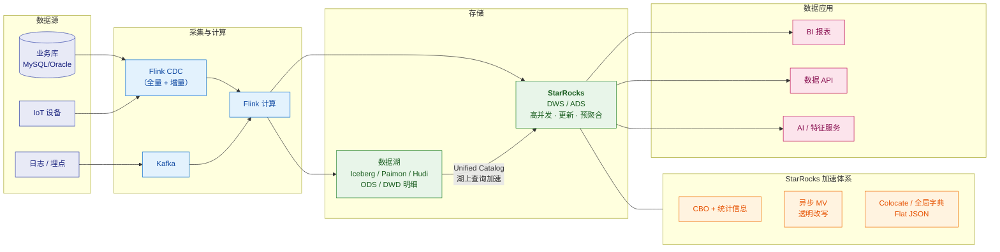

# 🪨 StarRocks 总览

> 这是 StarRocks 系列笔记的**总入口（MOC）**。
> 系列回答五个层次：**① 它是什么、集群怎么组（架构与存算分离）② 表怎么建、主键模型怎么工作（表与模型）③ 查询为什么快（CBO 与统计信息）④ 怎么把查询"变快"（物化视图与加速）⑤ 怎么接入与运维（导入/湖仓/调优）**。
> 关联：[[5-bigdata/1-doris/0-Doris总览|Doris 系列]]（同源姊妹项目）、[[5-bigdata/0-flink/0-Flink总览|Flink 系列]]（上游计算）、[[1-java/10-数据仓库/0-数据仓库总览|数据仓库系列]]（建模方法论）。

---

> [!important] ⚠️ 先读这段：本系列与 Doris 系列的分工
> **StarRocks 与 Doris 同源**（StarRocks 由 Doris 分支演进而来），
> 它们的 **FE/BE 架构、分区/分桶、三种数据模型、导入方式、even 很多参数名都高度相似**。
> 所以本系列**不重复** Doris 系列已覆盖的通用知识，而是聚焦 **StarRocks 特有的、有差异的部分**：
>
> | 主题 | 去哪看 |
> |---|---|
> | 分区/分桶/tablet/副本、一次查询的完整流程、Compaction 机制 | [[5-bigdata/1-doris/1-架构与原理]]（**通用**，两者都适用） |
> | 表设计方法论（KEY/排序键/分区/分桶/索引） | [[5-bigdata/1-doris/3-表设计]]、[[5-bigdata/1-doris/4-建表与分区分桶]] |
> | Stream Load / Routine Load / Flink Connector 语法与参数 | [[5-bigdata/1-doris/6-数据导入与FlinkCDC]] |
> | EXPLAIN / PROFILE、Join 四种方式、分区裁剪 | [[5-bigdata/1-doris/5-查询优化]] |
> | 三者选型对比（含决策树与话术） | [[5-bigdata/1-doris/9-对比StarRocks与ClickHouse]] |
> | **⭐ StarRocks 特有的深度内容** | **本系列**（见下方导航） |

---

## 一、系列导航

| # | 笔记 | 一句话定位 | 核心内容 |
|---|---|---|---|
| 1 | **[[1-架构与存算分离]]** | 集群怎么组、怎么选形态 | FE 角色（Leader/Follower/Observer）、BE vs **CN**、**shared-nothing vs shared-data**、多级缓存、存算分离的代价 |
| 2 | **[[2-表类型与主键模型]]** | 表用哪种、更新怎么实现 | 四种表类型、**主键模型的 Delete+Insert 与 DelVector**、**持久化主键索引**、排序键解耦（3.0+）、部分列更新 |
| 3 | **[[3-CBO优化器与统计信息]]** | 为什么计划选得对 | **Cascades 框架**、代价模型、基础统计信息、**直方图**、多列联合统计、**Predicate Column**、统计信息健康度 |
| 4 | **[[4-物化视图与透明改写]]** | ⭐ StarRocks 的王牌 | 同步 MV vs **异步 MV**、**SPJG 透明改写**、Query Delta / **View Delta Join**、聚合改写、Union 改写、嵌套 MV、**陈旧改写** |
| 5 | **[[5-查询加速与数据湖]]** | 怎么把查询加速到极致 | Colocate Join、**全局字典**、Flat JSON、**Skew Join V2**、JIT、多级缓存、**Unified Catalog 与湖上加速** |
| 6 | **[[6-导入与实时链路]]** | 数据怎么进来 | 导入方式全景、主键模型的写入、**部分列更新**、Flink CDC 链路、label 幂等与 2PC |
| 7 | **[[7-运维调优与面试题]]** | 怎么管稳、怎么答 | 部署与扩缩容、Compaction、内存、监控、故障速查、**面试高频题** |
| 8 | **[[8-StarRocks设计初衷与核心目标]]** | ⭐ **为什么这样设计** | 与 Doris 的共同靶心、**五个差异化选择**、收敛成**两条主线**、付出的代价 |
| 9 | **[[9-StarRocks细节设计的目的]]** | ⭐ **每个机制为了什么** | 逐条拆解 **① 问题 → ② 决策 → ③ 代价**（主键模型/持久化索引/CBO/直方图/MV 改写/Colocate/全局字典/Flat JSON/Catalog/缓存） |

> [!tip] 第 8、9 篇是"为什么"层
> 前七篇讲**是什么、怎么用**（what / how）；**第 8、9 篇讲为什么这样设计**（why）。
> 特别是第 8 篇回答了"**StarRocks 为什么要从 Doris 分出来**"这个高频问题。
> 对照 Doris：[[5-bigdata/1-doris/11-Doris设计初衷与核心目标]]、[[5-bigdata/1-doris/12-Doris细节设计的目的]]

---

> [!tip] 画图约定
> 本库支持 Mermaid（已装 mermaid-popup / mermaid-zoom）。本系列的图**优先用 Mermaid**，只有"依赖精确对齐"的图（内存/位布局、日志样本、命令输出）才保留 ASCII。规范详见 [[1-java/0-知识点/0-Java总览|Java 总览]] §七「文档写作约定」。

## 二、按需求的阅读路径

> [!tip] 三条路径
> **面试突击（1 天）**：[[7-运维调优与面试题]] → [[2-表类型与主键模型]]（主键模型原理）→ [[4-物化视图与透明改写]]（透明改写是杀手锏）→ [[5-bigdata/1-doris/9-对比StarRocks与ClickHouse|三者对比]]
> **上手干活（3～5 天）**：[[1-架构与存算分离]] → [[2-表类型与主键模型]] → [[6-导入与实时链路]] → [[3-CBO优化器与统计信息]] → [[5-查询加速与数据湖]] → [[7-运维调优与面试题]]
> **架构/选型视角**：[[1-架构与存算分离]]（shared-data 成本）→ [[4-物化视图与透明改写]]（加速体系）→ [[5-查询加速与数据湖]]（湖仓）→ [[7-运维调优与面试题]]

---

## 三、30 秒速查表

| 问题 | 一句话答案 | 详见 |
|---|---|---|
| StarRocks 是什么 | **MPP 列式 OLAP 数据库**，主打**实时更新 + 极速查询 + 湖仓一体** | [[1-架构与存算分离]] |
| 架构角色 | **FE**（元数据/规划/调度）+ **BE**（存储+计算）或 **CN**（仅计算） | [[1-架构与存算分离]] |
| BE 和 CN 什么区别 | **BE = 存算一体**（本地存数据）；**CN = 存算分离**（数据在对象存储，本地只有缓存） | [[1-架构与存算分离]] |
| 两种架构怎么选 | 追求**极致延迟** → shared-nothing；追求**成本/弹性/隔离** → shared-data | [[1-架构与存算分离]] |
| FE 三种角色 | **Leader**（读写元数据）、**Follower**（参与选举，Raft 多数派）、**Observer**（只读，扩查询并发） | [[1-架构与存算分离]] |
| 元数据存哪 | **BDB JE**（Berkeley DB Java Edition），**不是 MySQL**；靠 **Raft** 同步 | [[1-架构与存算分离]] |
| 有几种表类型 | **明细（Duplicate）/ 聚合（Aggregate）/ 更新（Unique）/ 主键（Primary Key）** | [[2-表类型与主键模型]] |
| 主键模型为什么快 | 用 **Delete+Insert + DelVector**，**写时标记删除**，读时无需合并多版本 | [[2-表类型与主键模型]] |
| 比 Unique(MoR) 快多少 | 官方口径：查询性能提升 **3～10 倍** | [[2-表类型与主键模型]] |
| 主键索引放哪 | **持久化索引**（`enable_persistent_index`，默认 true）→ 大部分落盘，省内存 | [[2-表类型与主键模型]] |
| 排序键能单独指定吗 | **能（3.0+）**，排序键与主键**解耦**，`ORDER BY` 单独声明 | [[2-表类型与主键模型]] |
| 部分列更新 | 支持，适合"多流写同一张宽表"（用户画像场景） | [[2-表类型与主键模型]] |
| 优化器是什么 | **CBO**，基于 **Cascades 框架**，从数万个计划里选代价最低的 | [[3-CBO优化器与统计信息]] |
| 统计信息有哪些 | 基础统计（row_count/ndv/null_count/min/max）+ **直方图** + **多列联合统计** | [[3-CBO优化器与统计信息]] |
| 直方图什么时候要 | **数据倾斜 + 高频查询**的列才需要；均匀分布不需要 | [[3-CBO优化器与统计信息]] |
| Predicate Column 是什么 | 常出现在 WHERE/JOIN/GROUP BY 的列，**只采集这些列的统计**以省开销 | [[3-CBO优化器与统计信息]] |
| 两种物化视图 | **同步 MV**（单表 rollup，强一致）vs **异步 MV**（跨表，可调度刷新） | [[4-物化视图与透明改写]] |
| 透明改写是什么 | ⭐ 用户**不改 SQL**，优化器自动把查询改写到 MV 上 | [[4-物化视图与透明改写]] |
| 改写算法基础 | **SPJG**（Select-Project-Join-GroupBy） | [[4-物化视图与透明改写]] |
| View Delta Join | MV join 的表是查询的**超集**也能改写 → 大宽表场景的杀手锏 | [[4-物化视图与透明改写]] |
| Query Delta Join | MV join 的表是查询的**子集**也能改写 | [[4-物化视图与透明改写]] |
| Union 改写 | MV 读热数据 + 基表读冷数据，实现**冷热分离** | [[4-物化视图与透明改写]] |
| 陈旧改写（Staleness） | 允许容忍一定数据过期，用旧 MV 换性能 | [[4-物化视图与透明改写]] |
| Colocate Join | 同分布键的表**本地 Join、零 Shuffle** | [[5-查询加速与数据湖]] |
| 全局字典干什么 | 解决 **COUNT(DISTINCT)** 和 Join 的低效，把字符串映射成整型 | [[5-查询加速与数据湖]] |
| Flat JSON | 把 JSON 里频繁访问的字段**打平存储**加速查询 | [[5-查询加速与数据湖]] |
| 湖上查询怎么做 | **Unified Catalog** 统一访问 Hive/Iceberg/Hudi/Paimon/Delta Lake | [[5-查询加速与数据湖]] |
| 复杂 Join 慢怎么办 | **Skew Join V2** 处理数据倾斜 | [[5-查询加速与数据湖]] |
| 导入方式有哪些 | Stream Load（HTTP）、Routine Load（Kafka）、Broker Load、**Flink Connector**、INSERT INTO | [[6-导入与实时链路]] |
| 写入幂等靠什么 | **label**（同 label 只生效一次）+ 两阶段提交（2PC） | [[6-导入与实时链路]] |
| `-235` 是什么 | 版本堆积（写得太碎），Compaction 追不上 → **攒批写入**是治本 | [[7-运维调优与面试题]]、[[5-bigdata/1-doris/8-运维与调优]] |

---

## 四、核心概念最小记忆集

| 概念 | 精确定义 | 常见误解 |
|---|---|---|
| **FE** | 元数据管理、查询规划、调度；有 Leader/Follower/Observer | 以为 FE 只做转发 |
| **BE** | shared-nothing 下的数据+计算节点，本地存数据 | 与 CN 混淆 |
| **CN** | shared-data 下的**纯计算节点**，无状态，本地只有缓存 | 以为是另一种 BE |
| **shared-nothing** | 存算一体，数据在 BE 本地盘，**延迟最优** | 以为它过时了 |
| **shared-data** | 存算分离，数据在对象存储/HDFS，**成本与弹性最优** | 以为它一定更快 |
| **Leader / Follower / Observer** | 元数据读写 / 参与选举 / 只读扩并发 | 以为 Observer 能选主 |
| **主键模型** | **Delete+Insert + DelVector**，写时确定语义 | 以为和 Unique(MoR) 一样 |
| **DelVector** | 存每个 segment 的**删除标记**，读时据此跳过旧行 | 以为它存数据 |
| **主键索引** | HashMap：编码后主键 → 行位置（rowset/segment/rowid） | 以为查询时也一直用 |
| **持久化索引** | 把主键索引落盘，避免全内存占用 | 以为开了就变慢 |
| **MoR vs Delete+Insert** | 读时合并（旧 Unique）vs 写时标记（主键模型） | 混为一谈 |
| **CBO** | 基于代价的优化器，Cascades 框架 | 以为优化器只做规则改写 |
| **直方图** | **等高分桶** + MCV，刻画数据分布 | 以为所有列都该建 |
| **Predicate Column** | 常作过滤/连接/分组的列，重点采集统计 | 以为是索引 |
| **异步 MV** | 跨表、可刷新、支持**透明改写** | 与 ClickHouse 的 MV 混淆（后者是写入触发器） |
| **同步 MV** | 单表 rollup 语义，**强一致**，写入时同步维护 | 与异步 MV 混淆 |
| **SPJG** | 透明改写的算法基础（Select-Project-Join-GroupBy） | —— |
| **View Delta Join** | MV 的表是查询表的**超集**时的改写 | 与 Query Delta 混淆 |
| **陈旧改写** | 允许数据"旧一点"以换取走 MV | 以为 MV 必须强一致 |
| **Unified Catalog** | 统一访问外部数据湖的 catalog 机制 | 以为要先把数据搬进来 |
| **全局字典** | 把字符串列映射成整型编码，加速 DISTINCT 与 Join | 以为是普通字典编码 |
| **Colocate Join** | 同 colocate group 且分桶键一致 → 本地 Join | 忽视它对建表的要求 |
| **Label** | 导入的幂等标识，同 label 重复提交只生效一次 | 以为 label 只是日志 |

> [!warning] 六个最经典的面试陷阱
> 1. **"StarRocks 就是 Doris 改了个名"** —— 错。StarRocks **起源于** Doris 分支（DorisDB），是**独立演进多年**的项目，在优化器、物化视图、湖仓能力上已明显分化。
> 2. **"CN 就是 BE 的别名"** —— 不准确。**BE 存数据**（存算一体），**CN 不存数据**（存算分离，只做计算与缓存）。这个区别决定了架构选型。
> 3. **"主键模型和 Unique 模型是一回事"** —— 错。老 Unique 是 **Merge-on-Read**（读时合并，慢）；**主键模型是 Delete+Insert**（写时标记，快 3～10 倍）。两者机制不同。
> 4. **"StarRocks 的物化视图和 ClickHouse 的一样"** —— **典型错误**。ClickHouse 的 MV 是**写入触发器**（只处理新插入的块，不做查询改写）；StarRocks 的异步 MV 是**预计算 + 透明改写**。详见 [[4-物化视图与透明改写]]。
> 5. **"统计信息是自动的，不用管"** —— 危险。自动采集默认只覆盖**基础统计**；**直方图和多列联合统计需要手动采集**，而它们恰恰是解决"优化器选错计划"的关键。
> 6. **"存算分离一定更快/更省钱"** —— 都不对。它解决的是**成本和弹性**，代价是**冷启动延迟**（缓存未命中要回源对象存储）。负载平稳、数据量不大时，shared-nothing 更省心。

---

## 五、版本演进要点

| 版本 | 里程碑 | 对使用者的影响 |
|---|---|---|
| 1.x | CBO 优化器引入并默认启用 | 从规则优化转向代价优化 |
| 2.4 | **直方图**支持 | 倾斜数据的基数估计变准 |
| 2.5 | **异步物化视图**、Catalog 能力增强 | 跨表预聚合与湖仓查询起步 |
| **3.0** | **存算分离（shared-data）**、**主键模型排序键解耦**、湖仓分析大幅增强 | 云原生架构可用；主键模型建表更灵活 |
| 3.1 | shared-data 支持**主键表**；半结构化能力增强 | 存算分离也能做实时更新 |
| 3.2 | 支持采集 **Hive/Iceberg/Hudi 统计信息**；更多改写场景 | 减少对外部 metastore 的依赖 |
| 3.3 | 持久化索引可存**对象存储** | 存算分离下的点查进一步优化 |
| 3.4 / 3.5 | **多列联合统计**、**Predicate Column**、统计信息存储统一 | CBO 估计更准，大宽表场景受益 |
| 4.x | 持续迭代（湖格式支持扩展、加速能力增强） | 新特性以官方文档为准 |

> [!note] 本系列的口径
> 以 **3.x 为基线**表述，涉及 **3.0 的存算分离**、**3.5 的统计信息能力**、**4.x 的新特性**会明确标注版本。
> 版本细节以官方 [StarRocks 文档](https://docs.starrocks.io/zh/docs/introduction/) 为准。

---

## 六、StarRocks 在实时数仓中的位置

- **上游计算** → [[5-bigdata/0-flink/7-FlinkCDC与实时数仓|Flink CDC 与实时数仓]]
- **写入 StarRocks** → [[6-导入与实时链路]]
- **湖仓配合** → [[5-查询加速与数据湖]]
- **同源对比** → [[5-bigdata/1-doris/0-Doris总览|Doris 系列]]、[[5-bigdata/1-doris/9-对比StarRocks与ClickHouse|三者选型]]
- **建模方法论** → [[1-java/10-数据仓库/1-数仓概念与分层架构|数仓分层]]、[[1-java/10-数据仓库/2-维度建模|维度建模]]

> [!tip] 与你的 AI 定位结合
> StarRocks 是"**实时特征服务**"与"**Text-to-SQL**"的常见底座：
> - Flink 算好的实时特征写入 StarRocks，模型服务按主键做高并发点查（走**持久化主键索引** + 行存）；
> - 指标语义层 + StarRocks 的 **CBO/物化视图**可以支撑自然语言查数的低延迟响应；
> - **全局字典**能显著加速"按用户/商品维度做去重统计"这类 AI 常见特征计算。
> 这也是"数据平台支撑 AI"的具体落点。

---

## 七、学习检查清单

- [ ] 能画出 StarRocks 的 FE/BE 架构与查询流程，说清 **Leader/Follower/Observer** 的分工
- [ ] 能说清 **shared-nothing 与 shared-data** 的取舍，以及 **BE 与 CN** 的本质区别
- [ ] 能说清四种表类型的差异，并针对业务选出正确的表类型
- [ ] 能讲清**主键模型的 Delete+Insert + DelVector** 机制，并解释它为什么比 MoR 快
- [ ] 能解释**持久化主键索引**的作用与开启方式
- [ ] 能说清 **CBO** 的工作原理，以及**基础统计/直方图/多列联合统计**各自解决什么问题
- [ ] 能解释 **Predicate Column** 是什么、为什么能省采集开销
- [ ] 能说清**同步 MV 与异步 MV** 的区别
- [ ] ⭐ 能讲清**透明改写**，并说出 **Query Delta / View Delta Join / 聚合改写 / Union 改写**各自适用什么场景
- [ ] 能解释**陈旧改写（Staleness）**的用途与代价
- [ ] 能说清 **Colocate Join、全局字典、Flat JSON、Skew Join V2** 各自解决什么问题
- [ ] 能用 **Unified Catalog** 讲清湖上查询与加速的思路
- [ ] 能说清写入链路如何保证**不重不丢**（label + 2PC）
- [ ] 能在 **Doris / StarRocks / ClickHouse** 之间给出有理由的选型结论与诚实边界

---
> [!question] 还需要补充什么？
> 可继续扩展的方向：StarRocks on K8s、StarRocks 与向量检索（AI 场景）、
> SQL Plan Manager 与查询反馈（Query Feedback）、
> StarRocks 读写 Hive 的元数据缓存细节、半结构化（ARRAY/MAP/STRUCT/JSON）实战、
> CelerData 商业化能力对比。需要哪块就新开一篇并在上方导航表登记。
