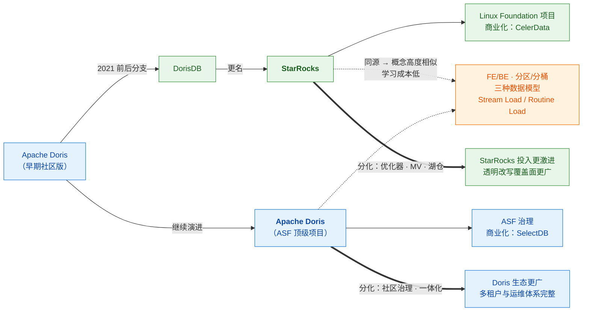
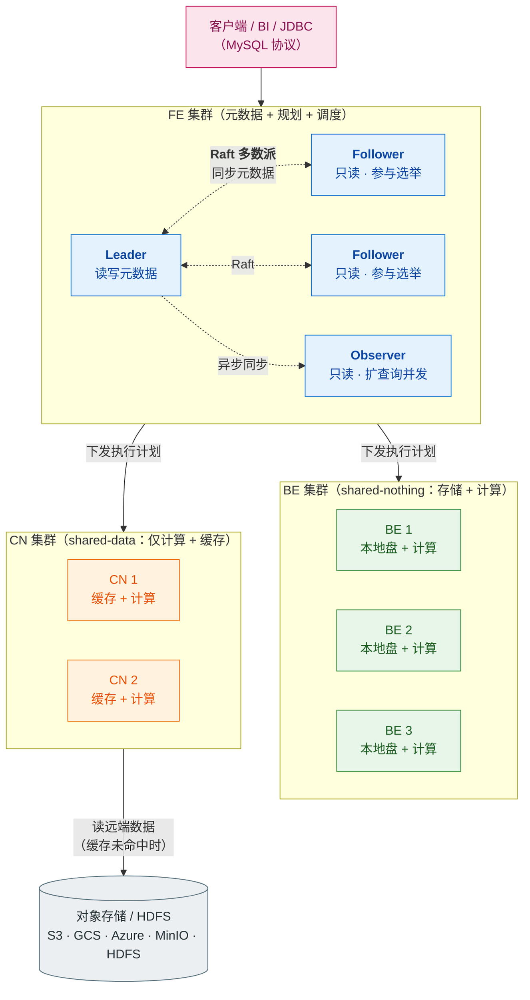
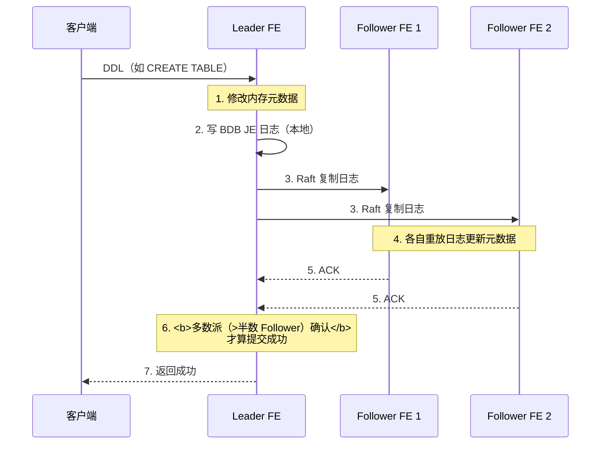
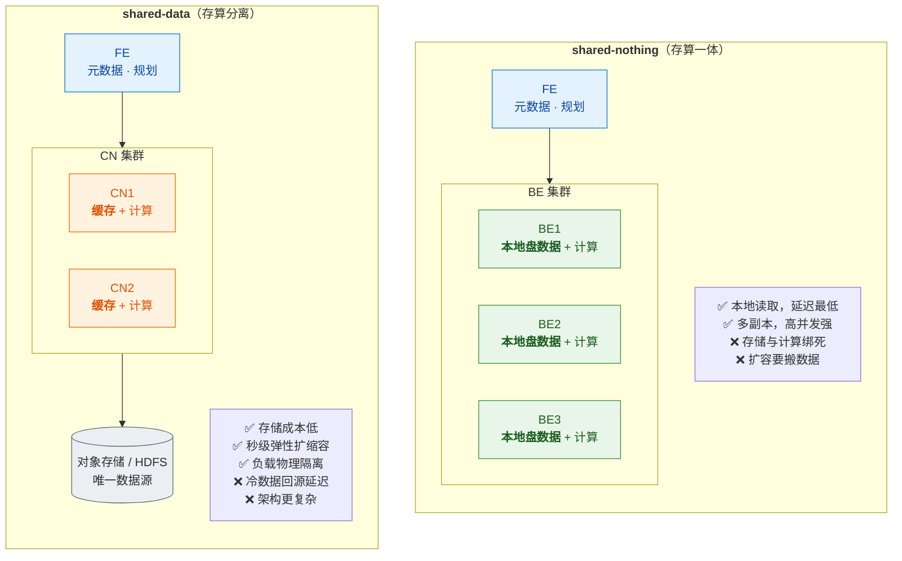
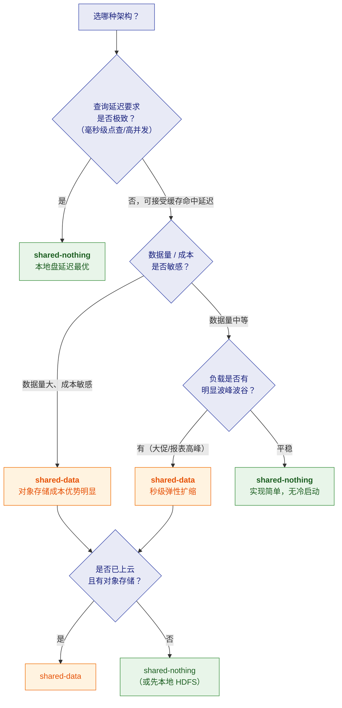
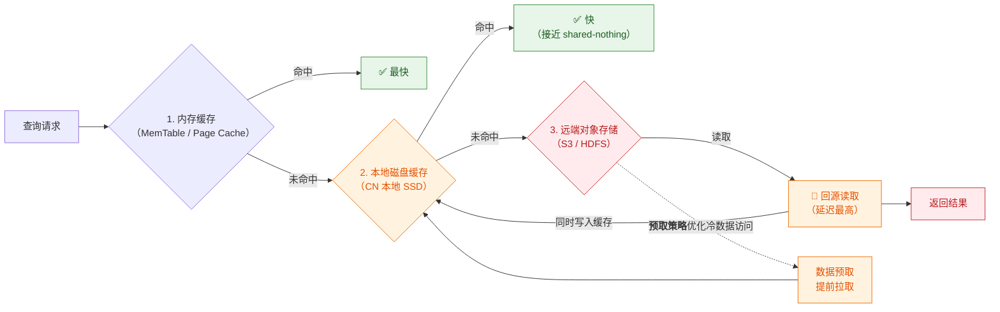
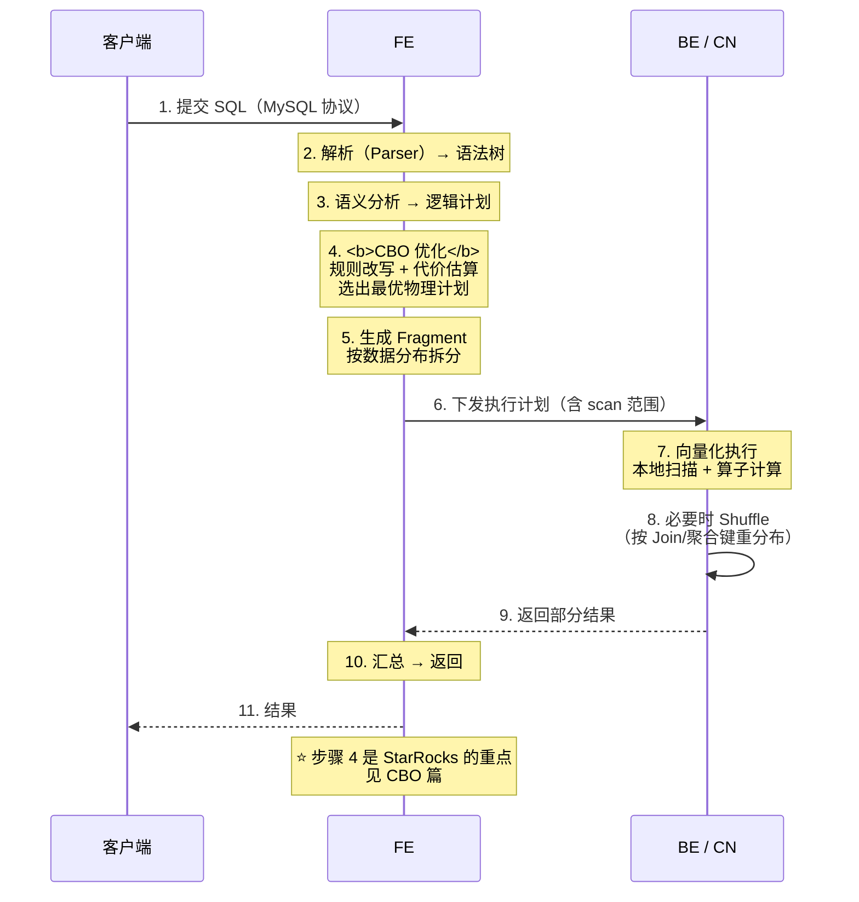

# 🏗️ 一、StarRocks 架构与存算分离

> 本篇回答五个问题：**FE/BE 到底怎么分工**、**Leader/Follower/Observer 三种角色差在哪**？**shared-nothing 与 shared-data 怎么选**、**BE 与 CN 的本质区别**是什么？**存算分离的缓存体系是怎么补性能的**？以及**元数据为什么用 BDB JE 而不是 MySQL**？
> 通用概念（分区/分桶/tablet/副本/查询流程/Compaction）见 [[5-bigdata/1-doris/1-架构与原理]]——**两者同源，那套知识完全适用**，本篇只讲 StarRocks 的特有部分。
> 系列导航见 [[0-StarRocks总览]]。

---

## 一、StarRocks 是什么

> [!note] 一句话定义
> **StarRocks 是一个 MPP 架构的列式 OLAP 数据库**，用一套系统同时承载
> **实时数据更新（upsert/delete）、高并发复杂查询（多表 Join）、以及数据湖联邦分析**。

### 1.1 与 Doris 的关系（必须先说清）

> [!important] 面试怎么表述这个关系
> **"StarRocks 起源于 Apache Doris 的分支（DorisDB），2021 年前后更名，是一个独立演进了多年的项目。"**
> 所以：**FE/BE 架构、分区/分桶、三种数据模型、导入方式、很多参数名都高度相似——会一个基本会用另一个。**
> 但两者已经在 **优化器、物化视图、湖仓能力** 上明显分化，
> 且治理模式不同（ASF vs Linux Foundation）。
> ⚠️ **千万别说"StarRocks 就是 Doris 改名"**——这是事实错误，会被扣分。

### 1.2 核心设计目标

| 目标 | 靠什么实现 | 详见 |
|---|---|---|
| **实时更新** | 主键模型（Delete+Insert + DelVector） | [[2-表类型与主键模型]] |
| **极速查询** | CBO + 全面向量化 + 各类索引与加速手段 | [[3-CBO优化器与统计信息]]、[[5-查询加速与数据湖]] |
| **用户无感加速** | 异步物化视图 + **透明改写** | [[4-物化视图与透明改写]] |
| **湖仓一体** | Unified Catalog + 湖上查询加速 | [[5-查询加速与数据湖]] |
| **成本与弹性** | **存算分离（shared-data）** | 本篇第三节 |

---

## 二、集群角色

### 2.1 全景架构

> [!important] 一张图理解 BE 与 CN
> **BE 和 CN 是"同一角色的两种形态"，取决于你选哪种架构：**
> - **shared-nothing** → 用 **BE**（存储 + 计算都在本地）
> - **shared-data** → 用 **CN**（**只做计算和缓存**，数据在对象存储）
>
> **它们不会同时存在于一个集群里**——图中并列只是为了对比。

### 2.2 FE 的三种角色

| 角色 | 元数据读写 | 参与选举 | 主要用途 |
|---|---|---|---|
| **Leader** | ✅ **唯一可写元数据** | ✅（本身也是 Follower 选出来的） | 元数据变更的唯一入口 |
| **Follower** | ❌ 只读（写请求转发给 Leader） | ✅ **参与选举** | 元数据冗余 + 高可用；**需奇数个** |
| **Observer** | ❌ 只读 | ❌ **不参与选举** | **专门扩查询并发**，不增加选举与元数据写的一致性开销 |

> [!tip] 为什么 Observer 是"性价比很高"的角色
> 它同步 Leader 的日志、提供元数据读取与查询规划能力，
> 但**不参与 Raft 选举**——所以：
> - 加 Observer **不会**增加元数据写的多数派开销（写只需同步到 Follower 多数派）
> - 却**能线性提升查询并发**（读多写少场景的典型需求）
>
> **读多写少的 BI 场景，加 Observer 比加 Follower 更划算。**

### 2.3 元数据存在哪？（⭐ 高频考点）

> [!danger] 常见错误答案："Doris/StarRocks 的元数据存在 MySQL 里"
> **错。** StarRocks（与 Doris 同源）使用 **BDB JE（Berkeley DB Java Edition）** 存储元数据，
> 通过 **Raft 协议**在 FE 之间同步，**不依赖外部 MySQL**。
>
> 每个 FE 在**内存中**持有一份完整的元数据副本，保证所有 FE 服务一致。

**写元数据的流程**：

> [!important] 由此推出的两个运维结论
> 1. **Follower 必须是奇数个**（1/3/5）——多数派机制的前提，且**至少 3 个**才能容忍 1 台故障。
> 2. **元数据写成功 = 多数派落盘**，所以 FE 挂了不会丢元数据；但**只剩 1 个 Follower 时集群无法写元数据**（凑不齐多数派）。

---

## 三、⭐ shared-nothing vs shared-data（核心选型）

### 3.1 两种架构对比

| 维度 | **shared-nothing** | **shared-data** |
|---|---|---|
| **节点类型** | **FE + BE** | **FE + CN** |
| **数据存哪** | BE **本地盘**（多副本） | **对象存储 / HDFS**（单一数据源） |
| **本地盘作用** | 存数据本体 | **只做缓存** |
| **查询延迟** | ✅ **最低**（本地读取） | 🟠 缓存命中时接近；**未命中要回源** |
| **存储成本** | 高（本地 SSD + 多副本） | ✅ **低**（对象存储 + 通常更少副本） |
| **弹性扩缩容** | 扩容要**搬数据重平衡** | ✅ **秒级**加 CN，**无需重平衡** |
| **资源隔离** | 应用与计算耦合 | ✅ **计算与存储独立扩缩**，隔离更好 |
| **架构复杂度** | ✅ 简单 | 🟠 需维护对象存储与缓存体系 |
| **适合** | 追求**极致延迟**、负载稳定 | 追求**成本/弹性/隔离**、波峰波谷明显 |

### 3.2 怎么选

> [!important] 一句话结论（面试可复用）
> **"存算分离解决的是成本和弹性，不是性能。"**
> 在负载平稳、数据量不大的场景里，它带来的收益有限，
> 却引入了**冷启动延迟**和**运维复杂度**。
> **这是一个成本决策，不是一个性能决策。**

### 3.3 ⭐ 存算分离怎么补性能：多级缓存

存算分离最大的问题是"数据在远端"。StarRocks 用**多级缓存体系**来补：

**关键机制**：

| 机制 | 说明 |
|---|---|
| **多级缓存** | 内存 → 本地磁盘 → 远端存储，命中缓存的性能**接近 shared-nothing** |
| **建表时可开缓存** | 开启后数据**同时写本地盘和对象存储**；查询先读本地盘，未命中再回源并缓存 |
| **数据预取** | 对冷数据访问做预取优化，减少回源阻塞 |
| **持久化索引**（3.1.4+/3.3.2+） | 主键索引可持久化到**本地盘**（3.1.4+）甚至**对象存储**（3.3.2+），避免全内存占用 |

> [!tip] 这句话很显专业
> **"存算分离的性能取决于缓存命中率。热数据场景下它和存算一体几乎没差别，
> 但冷数据首次访问必然要付回源延迟。所以关键是评估你的访问模式是不是'热数据集中'。"**

### 3.4 存算分离的一个已知限制

> [!warning] 部分运维能力在存算分离下受限
> 例如 **Doris 的存算分离模式不支持 `BACKUP`/`RESTORE`**（因为数据本就在对象存储上，
> 备份语义不同）。StarRocks 的具体限制随版本变化，
> **上线前必须以目标版本的官方文档为准**。
>
> 实践建议：存算分离下，**对象存储自身的版本控制/生命周期策略**往往承担了"备份"的角色。

---

## 四、数据分布与副本（要点回顾）

> [!note] 这部分与 Doris 完全同源，详细内容见 [[5-bigdata/1-doris/1-架构与原理]]
> 这里只做**最小必要回顾**，避免与 Doris 系列重复。

| 概念 | 定义 |
|---|---|
| **Partition（分区）** | 按 RANGE/LIST 切（通常按时间），作用是**数据裁剪**（分区裁剪） |
| **Bucket（分桶）** | 分区内按 HASH 切，作用是**数据打散与并行度** |
| **Tablet** | **最小数据分片单位** = 一个分区 × 一个分桶 × 一个副本 |
| **副本（Replica）** | 通常 3 副本，保证可靠性与读并发 |

> [!warning] 主键模型的一个特殊约束（StarRocks 特有）
> **主键表只支持 HASH 分桶**，且**主键必须包含分区列和分桶列**。
> 例如分区用 `dt`、分桶用 `merchant_id`，那么主键也必须包含 `dt` 和 `merchant_id`。
> 👉 详见 [[2-表类型与主键模型]]

---

## 五、一次查询的完整流程

> [!important] 第 4 步（CBO）是 StarRocks 与 Doris 分化最明显的地方
> StarRocks 的 CBO 基于 **Cascades 框架**，会**从数万个候选计划中选代价最低的**。
> 它依赖**统计信息**——统计信息的准确性直接决定计划对不对。
> 👉 详见 [[3-CBO优化器与统计信息]]

---

## 六、30 秒速查表

| 问题 | 一句话答案 |
|---|---|
| StarRocks 架构角色 | **FE**（元数据/规划/调度）+ **BE**（存储+计算）或 **CN**（仅计算+缓存） |
| BE 与 CN 的区别 | **BE 存数据**（shared-nothing）；**CN 不存数据**，只计算与缓存（shared-data） |
| 两种架构会共存吗 | **不会**。一个集群要么用 BE（存算一体），要么用 CN（存算分离） |
| FE 三种角色 | **Leader**（唯一可写元数据）、**Follower**（参与 Raft 选举，需奇数个）、**Observer**（只读，扩查询并发） |
| 元数据存哪 | **BDB JE**，靠 **Raft** 在 FE 间同步；**不是 MySQL** |
| Follower 要几个 | **奇数个，生产至少 3 个**（多数派 + 容忍 1 台故障） |
| Observer 的价值 | **不参与选举**，不增加元数据写开销，却**能扩查询并发** |
| shared-nothing 优点 | 本地盘读取，**延迟最低**；多副本，高并发强 |
| shared-data 优点 | **存储成本低、秒级弹性扩缩、负载隔离好** |
| shared-data 的代价 | **冷数据回源延迟**；架构更复杂 |
| 存算分离是性能优化吗 | **不是，是成本与弹性决策** |
| 存算分离怎么补性能 | **多级缓存**（内存 → 本地盘 → 远端）+ **数据预取** |
| 什么时候缓存命中就够快 | 访问模式是"**热数据集中**"时，性能接近 shared-nothing |
| 主键表的分桶约束 | **只支持 HASH 分桶**，且**主键必须包含分区列和分桶列** |
| StarRocks 与 Doris 什么关系 | StarRocks **起源于** Doris 分支（DorisDB），**独立演进多年**，非"改名" |

---

## 七、学习检查清单

- [ ] 能画出 FE/BE（或 FE/CN）架构图，说清数据流向
- [ ] 能说清 **Leader / Follower / Observer** 三种角色的差异与用途
- [ ] 能解释元数据为什么用 **BDB JE + Raft**，以及"多数派提交"意味着什么
- [ ] 能说清 **BE 与 CN** 的本质区别，并判断一个集群用的是哪种
- [ ] 能对比 **shared-nothing 与 shared-data** 的六项以上取舍
- [ ] 能画出**多级缓存**体系，解释存算分离如何补性能
- [ ] 能说清"存算分离是成本决策不是性能决策"，并举出反例场景
- [ ] 能说清 StarRocks 与 Doris 的关系（含"非改名"这个易错点）
- [ ] 能说出主键表的**分桶与主键约束**

---
> 下一篇 → [[2-表类型与主键模型]] ｜ 返回 [[0-StarRocks总览]] ｜ 通用原理 → [[5-bigdata/1-doris/1-架构与原理]]
