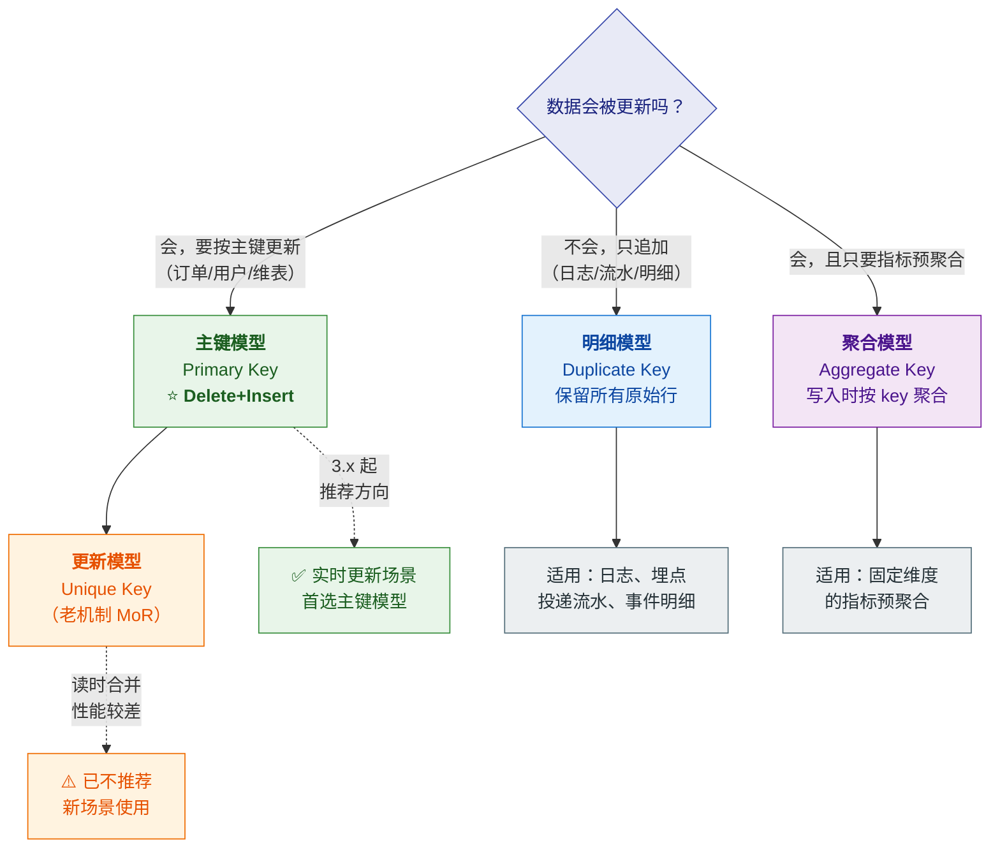
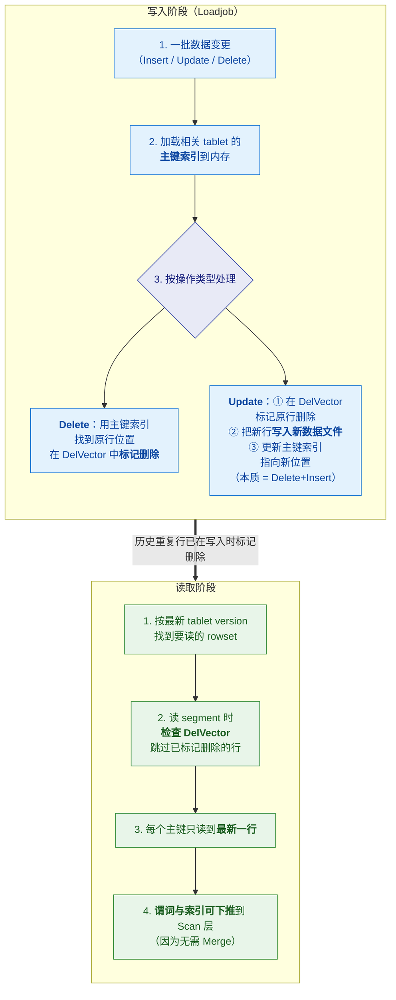
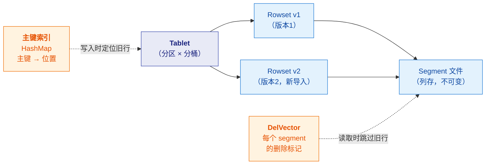
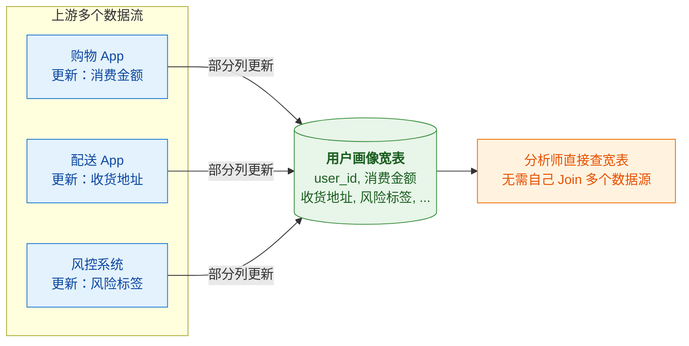

# 🧱 二、表类型与主键模型

> 本篇回答五个问题：**四种表类型怎么选**？**主键模型的 Delete+Insert 到底怎么工作**、
> **DelVector 与主键索引是什么**？**持久化索引解决什么问题**？**排序键怎么与主键解耦**（3.0+）？以及**部分列更新怎么用**？
> 通用表设计方法论（KEY 设计、分区分桶、索引）见 [[5-bigdata/1-doris/3-表设计]]、[[5-bigdata/1-doris/4-建表与分区分桶]]。
> ⚠️ **主键模型是 StarRocks 的核心竞争力**，也是与 Doris 差异最需讲清的地方。系列导航见 [[0-StarRocks总览]]。

---

## 一、四种表类型总览



| 表类型 | 关键字 | 语义 | 典型场景 |
|---|---|---|---|
| **明细模型** | `DUPLICATE KEY` | 保留**所有**行，不去重不聚合 | 日志、埋点、投递流水、事件明细 |
| **聚合模型** | `AGGREGATE KEY` | key 相同则按聚合函数**合并** | 只要指标、不要明细的预聚合表 |
| **更新模型** | `UNIQUE KEY` | key 唯一，新数据**覆盖**旧数据（**MoR：读时合并**） | 老方案，**不推荐新场景使用** |
| **主键模型** | `PRIMARY KEY` | key 唯一 + NOT NULL，**Delete+Insert（写时标记）** | ⭐ **CDC 同步、实时更新、维表、宽表** |

> [!important] ⚠️ 最容易混淆的一点
> **"更新模型（Unique Key）" 和 "主键模型（Primary Key）" 是两种不同的表类型，机制不同。**
> - **更新模型（Unique Key）**：采用 **Merge-on-Read（MoR）**——写入简单高效，但**读时要在线合并多个版本的数据文件**。因为有 Merge 算子，**谓词和索引无法下推到存储层**，严重影响查询性能。
> - **主键模型（Primary Key）**：采用 **Delete+Insert**——**写时就通过 DelVector 把旧行标记删除**，读时**只需读最新那行**，无需在线合并。**谓词与索引可以下推**，查询性能大幅提升。
>
> StarRocks 3.x 起把"更新模型"与"主键模型"做了统一演进，**新场景应优先用主键模型**。

### 1.1 与 Doris 的术语对照

| 能力 | StarRocks | Apache Doris |
|---|---|---|
| 明细 | **明细模型**（Duplicate Key） | `Duplicate Key` |
| 聚合 | **聚合模型**（Aggregate Key） | `Aggregate Key` |
| 更新（MoR） | **更新模型**（Unique Key） | 老版 `Unique Key`（读时合并） |
| 主键（写时确定） | ⭐ **主键模型**（Primary Key） | `Unique Key` + **MoW**（Merge-on-Write） |
| 排序键 | `ORDER BY`（**3.0 起与主键解耦**） | 由 KEY 决定 |

> [!tip] 术语不同，思想一致
> 两家都走了"**把去重/更新的语义在写入时做掉，而不是查询时补偿**"这条路。
> **StarRocks 叫 Delete+Insert，Doris 叫 Merge-on-Write（MoW），核心目标相同：查询时结果确定且无需合并。**
> 命名和实现细节有差异，但**面试时讲清"写时确定 vs 读时补偿"这个本质**就够了。

---

## 二、⭐ 主键模型深度（核心）

### 2.1 为什么需要主键模型

> [!note] 场景驱动
> 实时数仓的核心需求：**把上游业务库（订单、用户）通过 CDC 实时同步进来，
> 下游查询要立刻看到"唯一的、正确的、最新的状态"**。
>
> 但业务表会被**频繁 UPDATE**（订单状态流转）、甚至 **DELETE**（取消）。
> 老方案（Unique Key + MoR）的问题是：**读时要合并多版本 → 谓词无法下推 → 查询慢**。

### 2.2 核心机制：Delete + Insert

> [!important] 一句话原理
> **主键模型把 UPDATE 拆成 "标记旧行为删除 + 写入新行"**，
> 靠 **主键索引** 定位旧行，靠 **DelVector** 记录删除标记。
> 于是**读的时候只需要读最新那一行**，不用合并多版本。



**官方给出的收益**：主键模型的 Delete+Insert 策略，相比更新模型的 Merge-on-Read，
**查询性能可提升 3～10 倍**。

> [!tip] 为什么能快 3～10 倍（面试要能说到点子上）
> 关键**不是**"省了去重计算"这么简单，而是**谓词与索引能否下推**：
> - **MoR（更新模型）**：读时存在 Merge 算子 → **谓词和索引无法下推到存储层** → 必须先把多版本数据合并出来再过滤 → 大量无效 IO。
> - **Delete+Insert（主键模型）**：读时**无需 Merge** → 过滤算子和各类索引可以**直接在 Scan 层生效**（ZoneMap、前缀索引、Bloom Filter 等）→ 扫描量大幅下降。
>
> **这是"架构差异导致的能力差异"，不是调参能弥补的。**

### 2.3 五个关键组件

| 组件 | 作用 |
|---|---|
| **Tablet** | 表按分区 + 分桶切成的**最小物理存储单元**，以副本形式分布在不同 BE |
| **Rowset** | 一个 tablet 中**一批数据变更**形成的逻辑数据集；每次 Loadjob/Compaction 产生新版本 |
| **Segment** | rowset 实际存储的**列式文件**（类似 Parquet，不可变） |
| **主键索引（Primary Key Index）** | **HashMap**：编码后的主键值 → 行位置（`rowset_id` + `segment_id` + `rowid`）。**主要用于写入时定位旧行** |
| **DelVector** | 存储**每个 segment 的删除标记**；读时据此跳过旧数据 |



### 2.4 主键索引的两种模式

| 模式 | 配置 | 特点 | 建议 |
|---|---|---|---|
| **持久化索引**（默认） | `enable_persistent_index = true` | **大部分索引落盘**，只有少量在内存，避免占用过多内存 | **SSD 盘推荐开**；HDD 且导入不频繁也可开。性能与全内存**接近** |
| **全内存索引** | `enable_persistent_index = false` | 索引全在内存 | 仅在**内存充足且追求极致**时考虑 |

> [!tip] 存算分离下的索引持久化演进
> - **3.1.4+**：主键表在 shared-data 集群下，索引可持久化到**本地盘**
> - **3.3.2+**：进一步支持持久化到**对象存储**（表属性 `persistent_index_type = CLOUD_NATIVE`）
>
> 这让存算分离架构下的主键表点查也能保持高性能。

### 2.5 建表与约束

```sql
CREATE TABLE orders (
    order_id    BIGINT NOT NULL,
    dt          DATE   NOT NULL,
    merchant_id INT    NOT NULL,
    user_id     INT    NOT NULL,
    good_name   STRING NOT NULL,
    price       INT    NOT NULL,
    cnt         INT    NOT NULL,
    revenue     INT    NOT NULL,
    state       TINYINT NOT NULL
)
PRIMARY KEY (order_id, dt, merchant_id)          -- ⭐ 主键需含分区列+分桶列
PARTITION BY date_trunc('day', dt)
DISTRIBUTED BY HASH (merchant_id)                -- ⚠️ 主键表只支持 HASH 分桶
ORDER BY (dt, merchant_id)                       -- ⭐ 3.0+ 排序键可与主键不同
PROPERTIES (
    "enable_persistent_index" = "true"
);
```

> [!danger] 主键模型的五条硬约束（易错点）
> 1. **主键列必须定义在其他列之前**
> 2. ⚠️ **主键必须包含分区列和分桶列**（用数据分布策略时）
> 3. **主键只支持 HASH 分桶**
> 4. **主键不支持修改**（建表后不能改）
> 5. **主键值不可更新**（为数据一致性考虑）
> 6. 主键列类型支持：数值（含整型与 BOOLEAN）、字符串、日期（DATE/DATETIME）
> 7. 编码后主键值默认**最大 128 字节**（超出会报错）

### 2.6 ⭐ 排序键与主键解耦（3.0+ 重要变化）

> [!important] 这是 3.0 的一个关键改进
> **3.0 之前**：排序键 = 主键，前缀索引基于主键构建。
> **3.0 起**：**排序键与主键解耦**，可以用 `ORDER BY` 单独指定排序键。

**为什么这很重要**：

| 场景 | 3.0 之前的问题 | 3.0 之后 |
|---|---|---|
| 主键是 `order_id`（点查用），但查询常按 `dt + merchant_id` 过滤 | 排序键被迫是 `order_id` → **前缀索引对 `dt` 无效** | `ORDER BY (dt, merchant_id)` → **前缀索引命中过滤列** |
| 主键设计要考虑查询过滤 | 主键与查询优化目标冲突 | **两者可以分别优化** |

> [!tip] 面试可以这样讲
> "**建表时我会把'主键'和'排序键'分开考虑**：
> 主键是为了**唯一性语义**（业务主键），排序键是为了**查询加速**（高频过滤列在前，吃前缀索引）。
> 3.0 之前这两个是绑死的，导致主键设计要在'业务正确'和'查询性能'之间妥协；**3.0 解耦之后就不冲突了**。"

**注意**：
- 指定了排序键 → 前缀索引基于排序键构建；未指定 → 基于主键构建
- 建表后可用 `ALTER TABLE ... ORDER BY ...` **修改排序键**
- ⚠️ **不支持删除排序键**，也不支持修改排序列的数据类型

### 2.7 部分列更新（Partial Update）

> [!success] 这是"多流写同一张宽表"场景的关键能力
> **允许只更新一张表的某几列**，其他列保持原值。



| 维度 | 说明 |
|---|---|
| **典型场景** | **用户画像/标签宽表**——不同系统各自更新自己负责的列 |
| **价值** | ① 提升多维分析性能（宽表免 Join）② 简化分析模型（分析师不用理解多个数据源） |
| **与全列更新的区别** | 全列更新需要提供所有列的值；部分列更新只需提供主键 + 要改的列 |

> [!warning] 部分列更新的注意点
> - 需要显式开启（导入参数/表属性），**具体语法随版本变化，以官方文档为准**
> - 它对**写入侧**有额外开销（要读旧值补全缺列）
> - **不要滥用**：如果多个流频繁更新同一行，可能产生写放大
> - 如果某个流只更新一列但**传了 NULL**，要确认语义是"设为 NULL"还是"保持原值"——**这是生产事故的常见来源**

---

## 三、四种表类型详细对比

| 维度 | 明细（Duplicate） | 聚合（Aggregate） | 更新（Unique，MoR） | ⭐ 主键（Primary Key） |
|---|---|---|---|---|
| **去重** | ❌ 不去重 | 按 key 聚合 | ✅ key 唯一 | ✅ key 唯一 + NOT NULL |
| **更新语义** | 无（追加） | 无（聚合） | 覆盖（**读时合并**） | 覆盖（**写时标记**） |
| **查询时是否合并** | 否 | 否 | ✅ **是（MoR）→ 慢** | ❌ **否 → 快** |
| **谓词下推** | ✅ 可以 | ✅ 可以 | ❌ **受 Merge 算子阻碍** | ✅ **可以** |
| **查询性能** | 好 | 好（数据量小） | 较差 | ⭐ **比 MoR 快 3～10 倍** |
| **写入开销** | 最低 | 低 | 低 | 略高（要维护索引与 DelVector） |
| **适合场景** | 日志/明细/流水 | 固定维度指标预聚合 | 老方案 | ⭐ **CDC、实时更新、维表、宽表** |
| **能否查明细** | ✅ 全部 | ❌ 只有聚合值 | ✅ | ✅ |
| **部分列更新** | — | — | 支持 | ✅ 支持 |

> [!important] 选型决策速记
> - **日志/事件/append-only** → **明细模型**
> - **只要指标、维度固定、可接受不可逆** → **聚合模型**
> - **需要按主键更新/CDC 同步** → ⭐ **主键模型**（不要再用老更新模型）
> - **不确定** → 先问一句：**"这张表的数据会不会被 UPDATE/DELETE？"**

---

## 四、主键模型与其他系统的对照

> [!note] 这是面试的"深度题"，也是选型的关键论据

| 系统 | 更新机制 | 查询时结果 | 代价 |
|---|---|---|---|
| **StarRocks 主键模型** | **Delete+Insert**（写时标记） | ✅ **确定**（只读最新行） | 写入维护索引与 DelVector |
| **Doris MoW** | **Merge-on-Write**（delete bitmap） | ✅ **确定** | 写入维护 delete bitmap |
| **Doris/StarRocks 老 Unique** | **Merge-on-Read** | ✅ 确定但**慢** | 读时合并，谓词无法下推 |
| **ClickHouse `ReplacingMergeTree`** | 后台 merge 时保留最新版本 | ⚠️ **最终一致**（任意时刻可能读到重复行） | 需要 `FINAL` 或频繁 `OPTIMIZE` |

> [!important] 一句话总结这个关键差异（面试金句）
> **StarRocks / Doris：写时确定（Merge-on-Write / Delete+Insert），查询结果永远正确且无需合并。**
> **ClickHouse：读时补偿（Merge-on-Read），不去重就可能有重复行，靠 `FINAL`/`OPTIMIZE` 兜。**
>
> 完整的对比与选型话术见 [[5-bigdata/1-doris/9-对比StarRocks与ClickHouse]]。

---

## 五、30 秒速查表

| 问题 | 一句话答案 |
|---|---|
| 四种表类型 | **明细（Duplicate）/ 聚合（Aggregate）/ 更新（Unique, MoR）/ 主键（Primary Key）** |
| 主键模型的核心机制 | **Delete+Insert**：UPDATE = 标记旧行删除 + 写入新行 |
| DelVector 是什么 | 存**每个 segment 的删除标记**，读时据此跳过旧行 |
| 主键索引是什么 | **HashMap**：编码后主键 → 行位置（rowset/segment/rowid），**主要用于写入时定位旧行** |
| 为什么主键模型快 3～10 倍 | 读时**无需 Merge** → **谓词与索引可下推到 Scan 层**；MoR 有 Merge 算子，无法下推 |
| 主键索引默认落盘吗 | **是**，`enable_persistent_index` 默认 `true`，大部分索引在磁盘 |
| 持久化索引的性能 | 与全内存索引**接近**，但省大量内存 |
| 主键表分桶约束 | **只支持 HASH 分桶**，且**主键必须包含分区列和分桶列** |
| 主键能改吗 | **不能**（建表后不可修改），**主键值也不可更新** |
| 排序键能改吗 | **能**（`ALTER TABLE ... ORDER BY`），但**不能删除排序键** |
| 3.0 的重要变化 | **排序键与主键解耦**——主键管唯一性，排序键管查询加速 |
| 部分列更新用在哪 | **多流写同一张宽表**（用户画像/标签宽表） |
| 主键模型 vs 更新模型 | 主键 = **写时标记**（快）；更新 = **读时合并 MoR**（慢） |
| 与 ClickHouse 的本质差异 | StarRocks **写时确定**；ClickHouse `ReplacingMergeTree` **最终一致** |
| 主键列支持哪些类型 | 数值（含 BOOLEAN）、字符串、DATE/DATETIME |

---

## 六、学习检查清单

- [ ] 能说出四种表类型及各自的适用场景
- [ ] ⭐ 能**手画 Delete+Insert 的写入与读取流程**，说清主键索引与 DelVector 的分工
- [ ] 能解释**为什么主键模型比 MoR 快 3～10 倍**（关键在谓词下推）
- [ ] 能说清**更新模型（MoR）与主键模型**的区别，并说明为什么新场景不用 MoR
- [ ] 能说清**持久化索引**的作用、默认值与适用建议
- [ ] 能背出主键模型的**全部硬约束**（含分桶与主键包含关系）
- [ ] ⭐ 能讲清 **3.0 排序键与主键解耦**解决了什么问题（举主键 order_id 但按 dt 过滤的例子）
- [ ] 能说清**部分列更新**的适用场景与风险
- [ ] 能用"写时确定 vs 读时补偿"讲清 **StarRocks vs ClickHouse** 的更新语义差异
- [ ] 能说清 StarRocks 主键模型与 **Doris MoW** 的对应关系（术语不同、思想一致）

---
> 上一篇 → [[1-架构与存算分离]] ｜ 下一篇 → [[3-CBO优化器与统计信息]] ｜ 返回 [[0-StarRocks总览]]
> 通用表设计 → [[5-bigdata/1-doris/3-表设计]] ｜ 选型对比 → [[5-bigdata/1-doris/9-对比StarRocks与ClickHouse]]
