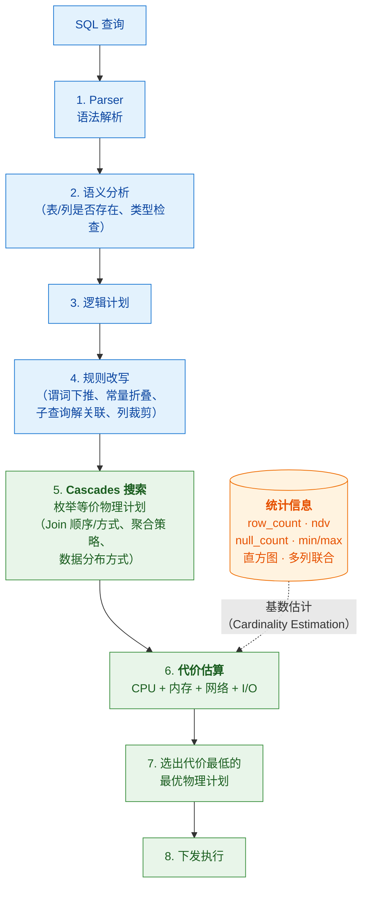
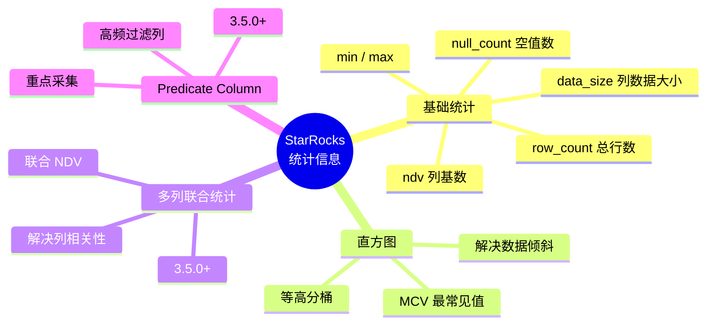
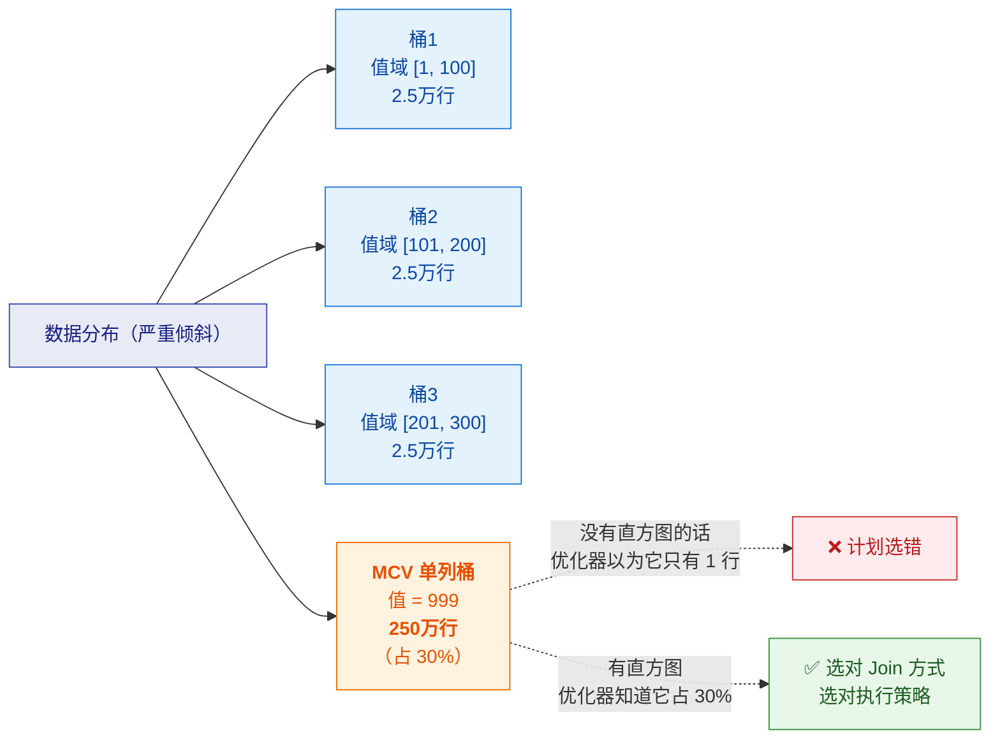
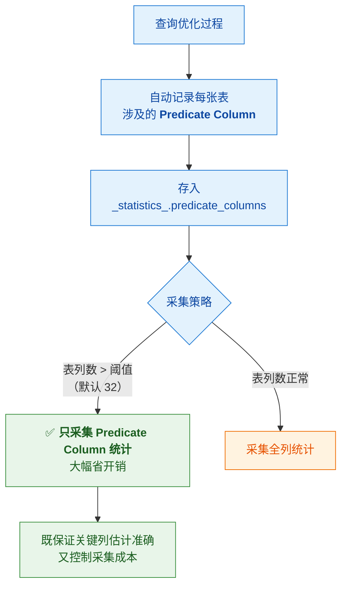
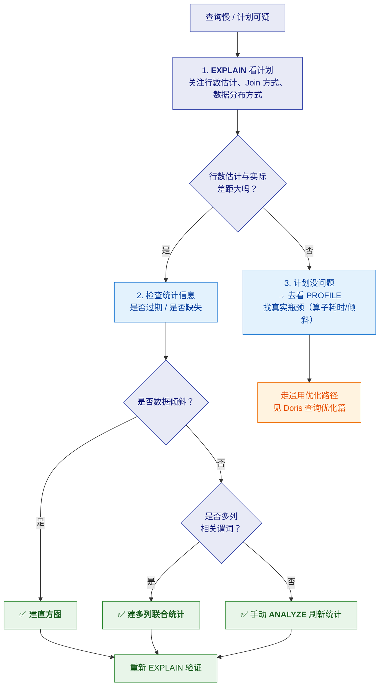

# 🧠 三、CBO 优化器与统计信息

> 本篇回答五个问题：**CBO 是什么、怎么选计划**？**统计信息有哪些类型**、各自解决什么问题？**直方图什么时候该建**？**Predicate Column 为什么能省开销**？以及**统计信息不准会导致什么后果、怎么排查**？
> 通用查询优化（EXPLAIN/PROFILE、分区裁剪、Join 四种方式）见 [[5-bigdata/1-doris/5-查询优化]]——**同源，那套知识通用**。
> 本篇聚焦 **StarRocks CBO 特有的深度**。系列导航见 [[0-StarRocks总览]]。

---

## 一、CBO 是什么

> [!note] 一句话定义
> **CBO（Cost-Based Optimizer，基于代价的优化器）**：
> 把 SQL 解析成逻辑计划后，**改写并转换成多个物理执行计划**，
> 然后**估算每个算子的执行代价**（CPU、内存、网络、I/O），
> **选出代价最低的那个**作为最终物理计划。

### 1.1 RBO vs CBO

| | **RBO（规则优化）** | **CBO（代价优化）** |
|---|---|---|
| 依据 | 固定的启发式规则 | **统计信息 + 代价模型** |
| 例子 | "谓词一定下推"、"小表一定广播" | "这张表实际只有 100 行，所以广播更划算" |
| 优点 | 简单、稳定、快 | **能感知数据分布，选真正最优的计划** |
| 缺点 | **不懂数据**——规则在数据分布特殊时会选错 | 依赖**统计信息准确性**；估算有开销 |
| 类比 | 按经验手册办事 | 算完成本再决策 |

> [!important] 为什么必须有 CBO
> 规则优化会犯"**看起来对但实际很慢**"的错误。最典型的例子：
> - RBO 认为"小表应该广播" → 但**统计信息过时**，这张"小表"其实已经涨到 1000 万行 → **广播把网络打爆**
> - RBO 认为"先 Join 再过滤" → 但如果 Join 后的结果集很小，反而不如先聚合
>
> **CBO 的价值就是：让优化决策基于"数据实际长什么样"，而不是"数据应该长什么样"。**

### 1.2 StarRocks CBO 的实现基础

| 项 | 说明 |
|---|---|
| **框架** | 基于 **Cascades 框架**（Volcano/Cascades 系列，学术界的经典优化器框架） |
| **引入时间** | StarRocks **1.16.0** 引入，**1.19 起默认启用** |
| **能力** | 能在**数万个候选执行计划**中选出代价最低的 |
| **核心输入** | **统计信息**——统计信息决定代价估算准不准 |



> [!important] ⭐ 一句话抓住重点
> **CBO 的质量 = 代价模型的质量 × 统计信息的质量。**
> 代价模型是引擎写好的，**你唯一能影响的就是统计信息**。
> 所以："**优化器选错计划，九成是统计信息的问题。**"

---

## 二、统计信息类型

### 2.1 三类统计信息



### 2.2 基础统计（Basic Statistics）

**StarRocks 默认周期性自动采集的基础统计**：

| 统计项 | 含义 | 用途 |
|---|---|---|
| `row_count` | 表的总行数 | 估算扫描量、决定 Join 方式 |
| `data_size` | 列的数据大小 | 估算 IO 代价 |
| `ndv` | **列的基数**（distinct value 数量） | ⭐ **最关键**——决定谓词选择率、Join 结果集大小 |
| `null_count` | 列中 NULL 的数量 | 选择率估算 |
| `min` / `max` | 列的最小值/最大值 | 范围谓词估算 |

**存储位置**：`_statistics_` 数据库的 `column_statistics` 表。

```sql
-- 查看统计信息
SELECT * FROM _statistics_.column_statistics\G
```

**采集方式**：

| 类型 | 方式 | 特点 |
|---|---|---|
| **全量采集（FULL）** | 扫描全表 | ✅ **准确**；❌ 消耗资源、慢 |
| **采样采集（SAMPLE）** | 每分区均匀抽 N 行（默认 20 万） | ✅ 省资源、快；❌ **ndv 是估算值，可能不准** |

> [!tip] 自动采集的智能策略
> StarRocks 会自动判断用哪种方式：
> - 检测到数据变化 → 触发采集
> - **小表**（默认 ≤ 5GB）→ 采集间隔短，可实时采集
> - **大表** → 默认间隔 **不少于 12 小时**
> - 采集数据量 **> 100GB** → **放弃全量，改用采样**
> - 只采集**发生变化的分区**，没变化的不采

### 2.3 ⭐ 直方图（Histogram）

> [!important] 直方图解决什么：**数据倾斜**
> **基础统计的致命盲区**：`ndv` 只知道"有多少个不同值"，**不知道值怎么分布**。
>
> **经典翻车场景**：
> ```sql
> -- 假设 user_id 有 1000 万个不同值（ndv = 1000万）
> WHERE user_id = 'test_user'   -- 但这一行占了全表 30% 的数据！
> ```
> - 优化器按"均匀分布"估算：命中率 = 1/1000万 → 认为只返回几行 → **可能选 Nested Loop Join**
> - 实际返回 **30% 的数据（几百万行）** → **计划彻底选错，查询慢几个数量级**
>
> **直方图就是用来告诉优化器"这个值特别多"的。**

**直方图的机制**：

| 概念 | 说明 |
|---|---|
| **等高分桶（Equi-height）** | 每个桶装**相同数量的数据**（不是相同取值范围） |
| **MCV（Most Common Value）** | 对**高频查询且影响选择率大**的值，**单独分配桶** |
| **桶数可调** | 桶越多估计越准，但内存占用略增 |



> [!warning] ⚠️ 直方图**不是所有列都该建**（这是重要考点）
> 官方明确说明：
> - **适用**：数据**高度倾斜** + **频繁被查询**的列
> - **不需要**：数据**均匀分布**的列（基础统计的 ndv 已经够准）
> - **类型限制**：只能建在**数值、DATE、DATETIME、字符串**类型的列上
> - **字符串特殊**：**只收集 MCV，不收集直方图桶**
> - ⚠️ **直方图不在自动采集范围内**（需要手动采集）

```sql
-- 手动采集直方图（语法示意，以官方文档为准）
ANALYZE TABLE tbl_name UPDATE HISTOGRAM ON col_name;
```

### 2.4 多列联合统计（3.5.0+）

> [!important] 解决什么问题：**列之间的相关性**
> **优化器的默认假设是"多列完全独立"**，但现实中经常不成立。
>
> **经典例子**：
> ```sql
> WHERE city = '杭州' AND province = '浙江'
> ```
> - 假设独立：`选择率 = P(杭州) × P(浙江)` = 1% × 5% = **0.05%**
> - **实际情况**：杭州必属于浙江 → 真实选择率 = **1%**（差了 20 倍！）
> - 优化器严重低估结果集 → **可能选错 Join 方式或 Join 顺序**

**当前能力**：

| 项 | 说明 |
|---|---|
| **支持内容** | 目前**只支持多列联合 NDV** |
| **采集方式** | **仅支持手动采集**（默认采样采集） |
| **主要场景** | ① 评估多个 **AND 连接的等值谓词** ② 评估 **Agg 节点** ③ **聚合下推策略** |
| **存储位置** | `_statistics_.multi_column_statistics` |
| **限制** | 手动采集的列数不超过 `statistics_max_multi_column_combined_num`（默认 **10**） |

```sql
-- 多列联合统计（语法示意）
ANALYZE TABLE tbl_name MULTIPLE COLUMNS (col1, col2);
```

### 2.5 Predicate Column（3.5.0+）

> [!important] 解决什么问题：**统计信息采集的成本与收益平衡**
> **痛点**：大宽表可能有几百列，**全量采集所有列的统计信息开销极大**。
> 但实际上，**稳定 workload 下你只需要少数关键列的统计**——那些出现在
> **WHERE 条件、JOIN 条件、GROUP BY、DISTINCT** 里的列。

**Predicate Column = 经常作为谓词使用的列**，StarRocks 会自动记录：



**用途分类**（`usage` 字段）：`predicate`、`join`、`group_by`、`normal`

```sql
-- 查看 Predicate Column
SELECT * FROM _statistics_.predicate_columns\G
-- 更详细的可观测性
SELECT * FROM information_schema.column_stats_usage;
```

> [!tip] 这体现了什么设计思想（面试加分点）
> **"把有限的采集资源，投到对查询计划影响最大的列上。"**
> 这与数据治理里的"指标分级"是同一个思路：
> **不是所有东西都值得同等投入，分级才能把成本控制住、同时保住关键路径的质量。**

---

## 三、统计信息不准会怎样（排查思路）

> [!danger] 症状：查询计划"看起来莫名其妙"
> 统计信息失准是**计划选错的第一大原因**。典型症状：

| 症状 | 可能原因 | 排查动作 |
|---|---|---|
| **该广播的没广播，反而 Shuffle Join** | 优化器低估/高估了表大小 | 看 `EXPLAIN` 里的行数估计 vs 实际 |
| **Join 顺序不合理（大表先 Join）** | 中间结果集估计错误 | 检查相关列的 ndv 是否过期 |
| **该用 Colocate 却用了 Shuffle** | 统计信息与建表分布不匹配 | 确认 colocate group 与分桶键 |
| **倾斜查询依然选错策略** | **缺直方图**（倾斜列） | 对该列建直方图 |
| **多条件过滤后估算偏差极大** | **列相关性**未被感知 | 建多列联合统计 |
| **全量采集把集群压得抖动** | 采集策略过于激进 | 配置采集时间段；启用 Predicate Column |

### 3.1 排查流程



### 3.2 常用管理命令

```sql
-- 手动采集（默认全量、同步）
ANALYZE TABLE tbl_name;

-- 采样采集（大表推荐）
ANALYZE SAMPLE TABLE tbl_name;

-- 异步采集（大表，不阻塞）
ANALYZE TABLE tbl_name WITH ASYNC MODE;

-- 只采集指定列
ANALYZE TABLE tbl_name(c1, c2);

-- 查看采集任务状态
SHOW ANALYZE STATUS;

-- 查看统计信息
SELECT * FROM _statistics_.column_statistics;
```

> [!tip] 手动采集任务的特点
> **手动采集任务只运行一次，创建后不需要删除。**（不像定时任务是常驻的）

---

## 四、与 Doris 的关系

| 项 | StarRocks | Apache Doris |
|---|---|---|
| 优化器框架 | **CBO，基于 Cascades** | **CBO**（Nereids 是新一代优化器） |
| 基础统计 | row_count / ndv / null_count / min / max | 同类统计信息 |
| **直方图** | ✅ 支持（2.4+），**等高分桶 + MCV** | ✅ 支持 |
| **多列联合统计** | ✅ 支持（3.5.0+），仅手动 | 视版本而定 |
| **Predicate Column** | ✅ 支持（3.5.0+），**自动记录高频谓词列** | 视版本而定 |
| 统计信息存储 | `_statistics_` 库（`column_statistics` 等） | 类似机制 |
| 外部表统计 | ✅ 支持采集 **Hive/Iceberg/Hudi** 统计（3.2+） | ✅ 支持 |

> [!important] 面试怎么表述
> **"两家的优化器都是 CBO 路线，也都支持直方图这类进阶统计信息。
> 差异主要在'统计信息体系的自动化与精细化程度'上——
> 比如 StarRocks 3.5 引入的 Predicate Column 机制，会**自动识别高频谓词列并只采集这些列的统计**，
> 对大宽表场景的采集开销控制得很好。**
> ⚠️ 但要说清楚：**这类能力每家每个版本都在变，任何基于旧版本清单的结论都要重新验证。**"

---

## 五、30 秒速查表

| 问题 | 一句话答案 |
|---|---|
| CBO 是什么 | **基于代价的优化器**：枚举物理计划 → 估算代价 → 选最低的 |
| StarRocks CBO 的框架 | **Cascades 框架**；1.16 引入，1.19 起默认启用 |
| RBO 与 CBO 的区别 | RBO 按固定规则（**不懂数据**）；CBO 按统计信息估算（**能感知数据分布**） |
| CBO 质量的公式 | **代价模型 × 统计信息**；代价模型是引擎给的，**你能影响的是统计信息** |
| 基础统计有哪些 | `row_count`、`data_size`、**`ndv`**、`null_count`、`min`/`max` |
| 哪个统计项最关键 | **`ndv`（列基数）**——决定选择率与 Join 结果集估算 |
| 全量 vs 采样采集 | 全量**准但慢**；采样**快但 ndv 是估算值** |
| 直方图解决什么 | **数据倾斜**下的基数估计错误（如某值占 30% 却以为占 1/1000万） |
| 直方图是什么形式 | **等高分桶**（每桶相同数据量）+ **MCV 单独分桶** |
| 所有列都要建直方图吗 | ❌ **不要**。只对**倾斜 + 高频查询**的列建；均匀分布不需要 |
| 字符串列的直方图 | **只收集 MCV，不收集分桶** |
| 直方图自动采集吗 | ❌ **不在自动采集范围内**，需手动采集 |
| 多列联合统计解决什么 | **列之间相关**导致的估算错误（如 `city='杭州' AND province='浙江'`） |
| 多列联合统计支持什么 | 目前**只支持联合 NDV**，**仅手动采集**，列数上限默认 10 |
| Predicate Column 是什么 | **高频出现在 WHERE/JOIN/GROUP BY/DISTINCT 的列**，自动记录并重点采集 |
| Predicate Column 的价值 | 列数超阈值（默认 32）时**只采集这些列**，**大幅省采集开销** |
| 计划选错第一嫌疑 | **统计信息过期或缺失** |
| 倾斜查询选错策略 | **缺直方图** |
| 多条件估算偏差大 | **缺多列联合统计** |
| 手动采集任务要删吗 | **不用**，只运行一次 |

---

## 六、学习检查清单

- [ ] 能说清 **RBO 与 CBO** 的区别，并各举一个"规则/代价"决策的例子
- [ ] 能画出 CBO 的完整流程（解析 → 逻辑计划 → 改写 → Cascades 搜索 → 代价估算 → 选计划）
- [ ] 能背出**基础统计的六项**，并解释为什么 `ndv` 最关键
- [ ] ⭐ 能讲清**直方图解决什么问题**，并用"某值占 30% 但 ndv 很大"的例子说明
- [ ] 能说清**直方图的适用条件**（倾斜 + 高频），以及为什么均匀分布不需要
- [ ] 能说出**字符串列直方图的特殊之处**（只有 MCV）
- [ ] 能讲清**多列联合统计**解决的"列相关性"问题，并举例
- [ ] 能说清 **Predicate Column** 的设计思想（把采集资源投到关键列）
- [ ] 能给出"**计划选错**"的排查流程（EXPLAIN → 查统计 → 直方图/多列/手动 ANALYZE）
- [ ] 能说出**自动采集的智能策略**（小表/大表不同间隔、>100GB 转采样、只采变化分区）
- [ ] 能说清 StarRocks 与 Doris 在优化器上的**关系与差异边界**

---
> 上一篇 → [[2-表类型与主键模型]] ｜ 下一篇 → [[4-物化视图与透明改写]] ｜ 返回 [[0-StarRocks总览]]
> 通用查询优化 → [[5-bigdata/1-doris/5-查询优化]]
