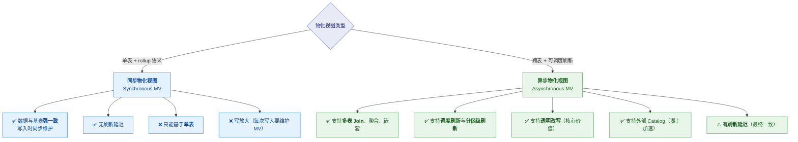
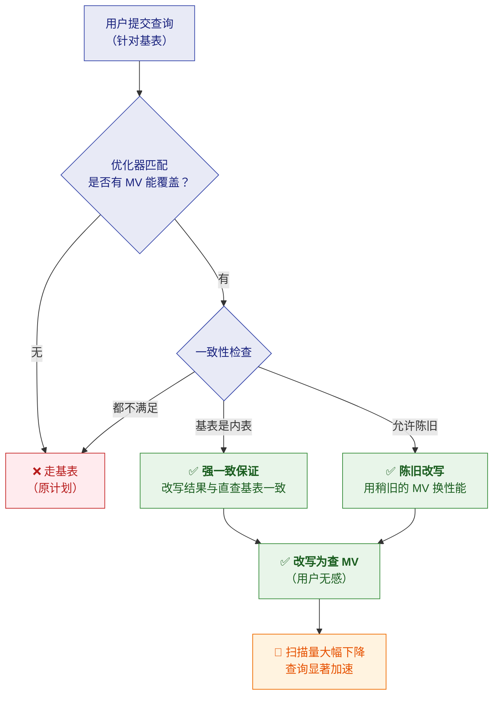
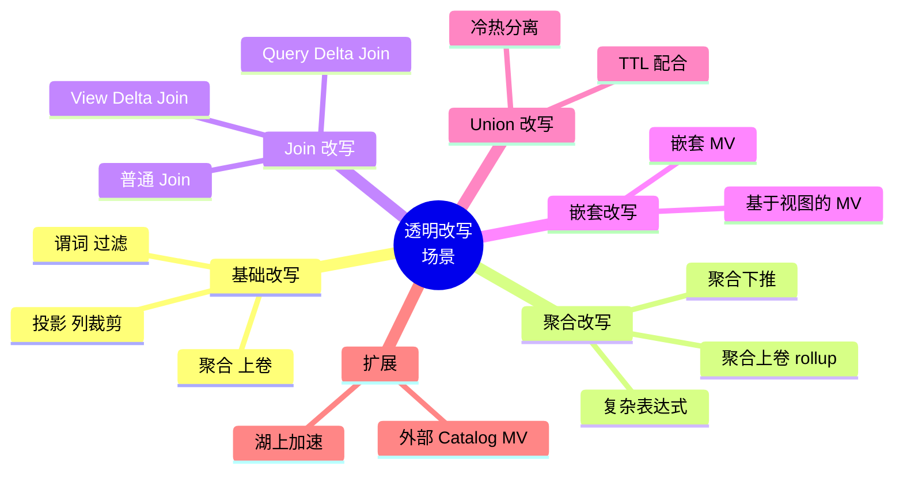
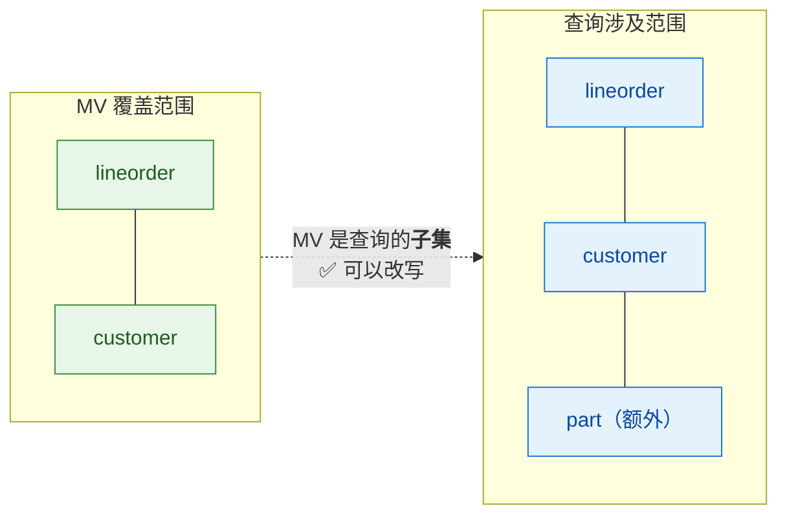
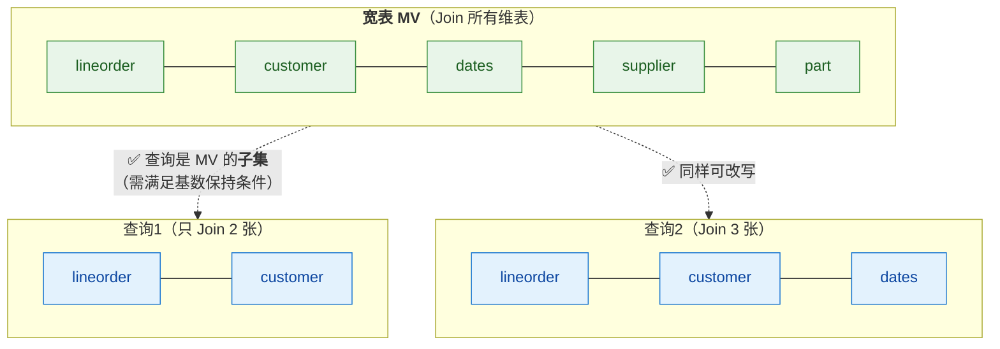
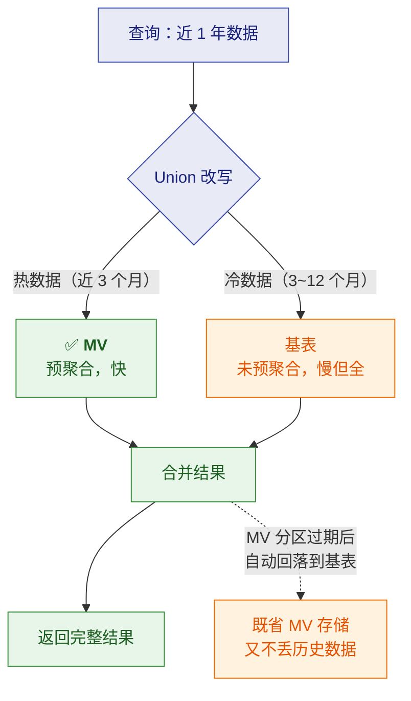
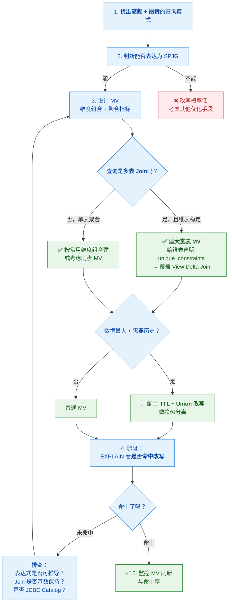

# 🔮 四、物化视图与透明改写

> 本篇回答五个问题：**同步 MV 与异步 MV 有什么区别**？⭐ **透明改写是怎么工作的**（SPJG、各类改写场景）？**Query Delta / View Delta Join 分别解决什么**？**陈旧改写（Staleness）和 Union 改写怎么用**？以及**为什么说 ClickHouse 的 MV 是完全不同的东西**？
> ⭐ **这是 StarRocks 最核心的差异化能力**，也是面试最能体现深度的地方。
> 系列导航见 [[0-StarRocks总览]]；选型对比见 [[5-bigdata/1-doris/9-对比StarRocks与ClickHouse]]。

---

## 一、为什么需要物化视图

> [!note] 问题背景
> 数仓里最贵的查询往往是**同一类**：
> "把几张大表 Join 起来，按维度聚合出指标"。
> 每次 BI 刷新都重算一遍，**CPU 和 IO 都在做重复劳动**。

**两条解决路径**：

| 路径 | 做法 | 缺点 |
|---|---|---|
| **手工预聚合表** | 建 DWS 层汇总表，ETL 定时刷新，然后**让业务改写 SQL 去查汇总表** | ❌ **业务要改 SQL**；口径容易散；业务不理解你的分层 |
| **物化视图 + 透明改写** | 建 MV，**优化器自动把原查询改写到 MV** | ✅ **业务零改造** |

> [!important] ⭐ 透明改写的价值就在"用户无感"
> **"我不需要通知 BI 同学改 SQL，优化器会自动把查询改写到 MV 上。"**
> 这句话是 StarRocks MV 区别于"手工汇总表"和"ClickHouse MV"的核心。

---

## 二、两种物化视图



| 维度 | **同步 MV** | ⭐ **异步 MV** |
|---|---|---|
| **基表数量** | **单表** | ✅ **多表 Join** |
| **一致性** | ✅ **强一致**（写入时同步维护） | 🟠 **最终一致**（按调度/手动刷新） |
| **刷新方式** | 自动（随写入） | 定时 / 手动 / 分区级增量 |
| **透明改写** | 有限（rollup 类改写） | ✅ **核心能力，覆盖面广** |
| **写放大** | ⚠️ 明显（每次写入都要维护） | ✅ 无（独立刷新） |
| **典型用途** | 单表预聚合、rollup 加速 | ⭐ **跨表预聚合、分层建模、湖上加速** |
| **湖上加速** | ❌ 不支持 | ✅ **支持外部 Catalog 的 MV** |

> [!important] 怎么选（一句话）
> - 需求是"**单表按某维度预聚合，且要求强一致**" → **同步 MV**
> - 需求是"**多表 Join 出宽表/指标，可以接受分钟级延迟**" → ⭐ **异步 MV**（绝大多数场景）
>
> **注意**：异步 MV 的"最终一致"通常**完全可以接受**——
> 因为它服务的是**分析型查询**，不是交易。BI 报表数据延迟几分钟通常无感。

---

## 三、⭐ 透明改写（核心机制）

### 3.1 什么是透明改写

> [!note] 定义
> **透明查询改写（Transparent Query Rewrite）**：
> **用户不需要修改 SQL**，StarRocks 会自动把针对**基表**的查询，
> 改写成针对**包含预计算结果的物化视图**的查询。

### 3.2 算法基础：SPJG

> [!important] SPJG = **S**elect - **P**roject - **Join** - **Group By**
> StarRocks 的异步 MV 采用**广泛使用的、基于 SPJG 形式的透明改写算法**。
> 也就是说：**只要你的查询能被表达成"选择-投影-连接-分组聚合"的形式，
> 就有机会被自动改写。**

**改写的基本判定**：优化器需要判断"**这个 MV 能否回答这个查询**"。



### 3.3 强一致性保证

> [!success] StarRocks 的明确承诺
> **如果基表是 StarRocks 内表（native tables），
> StarRocks 保证通过 MV 改写得到的结果，与直接查询基表的结果一致。**
>
> 这个承诺很重要——它意味着**你可以放心让优化器自动改写，不用担心结果不一致**。
> （如果是外部表/JDBC Catalog 的表，改写支持情况不同，见下）

### 3.4 改写的六种场景（⭐ 重点）



#### ① Join 改写（基础能力）

支持多种 Join 类型：**Inner Join、Cross Join、Left/Right/Full Outer Join、Semi Join、Anti Join**。

**还支持复杂表达式的改写**：
- 算术运算（如 `(2 * revenue + 1) * linenumber`）
- 字符串函数（如 `upper()`、`substr()`）
- 日期函数
- `CASE WHEN` 表达式
- `OR` 谓词

> [!tip] 这意味着什么
> **你不必让 MV 的 SQL 和业务查询一模一样**——只要语义能被推导，
> **即使业务在 MV 的字段上套了函数、做了运算，依然可能命中改写**。
> 这让透明改写的**实际命中率高得多**。

#### ② ⭐ Query Delta Join

> [!note] 定义
> **查询 Join 的表，是 MV Join 表的「超集」。**

**例子**：
- MV：`lineorder ⋈ customer`
- 查询：`lineorder ⋈ customer ⋈ part` ← **多了一张表**

**结果**：依然可以用这个 MV 改写（用 MV 替换掉其中的 `lineorder ⋈ customer` 部分）。



#### ③ ⭐⭐ View Delta Join（大宽表杀手锏）

> [!important] 定义
> **查询 Join 的表，是 MV Join 表的「子集」。**

**例子**（SSB 星型模型的经典用法）：
- MV：**把所有表都 Join 起来**（`lineorder ⋈ customer ⋈ dates ⋈ supplier ⋈ part ⋈ ...`）
- 查询：只 Join 其中**两三张表**

**结果**：**依然可以改写**。官方测试表明，
多表 Join 的查询经过透明改写后，**性能可以达到直接查询对应大宽表的同等水平**。



> [!warning] View Delta Join 的前提：**基数保持（Cardinality Preservation）**
> MV 中必须包含**查询里不存在的、1:1 基数保持的 Join**。
> **只有满足"基数保持"的 Join 类型才能触发这种改写**（官方列出九种符合条件的 Join 类型）。
>
> **通俗理解**：这些 Join **不会放大或缩小行数**，所以"多 Join 了表"不会改变结果集的基数，
> 因此可以安全地用"多表 Join 的 MV"来回答"少表 Join 的查询"。
>
> 👉 实践要点：**建宽表 MV 时，要给维表声明 `unique_constraints`**，
> 优化器才能识别出这是 1:1 的基数保持 Join。

**为什么这个能力重要**：

| 传统做法 | View Delta Join |
|---|---|
| 为每种查询组合建一个汇总表 → **组合爆炸** | **建一张大宽表 MV**，覆盖大量查询组合 |
| 业务必须知道该查哪张表 | **业务写自己的 SQL，优化器自动路由** |

#### ④ 聚合改写

| 能力 | 说明 |
|---|---|
| **聚合上卷（Rollup）** | 细粒度 MV 可以回答粗粒度聚合查询（如 MV 是 `city` 粒度，查询要 `province` 粒度） |
| **聚合下推** | 把聚合算子下推到更早的阶段执行 |
| **复杂表达式改写** | 处理函数调用与算术运算 |

#### ⑤ 嵌套 MV

**支持基于其他 MV 构建 MV**，从而改写更复杂的查询，**扩大可改写查询的范围**。

> [!tip] 典型用法：分层预聚合
> ```
> 明细基表
>   ↓ MV1：按 (天, 城市, 品类) 聚合
>   ↓ MV2：基于 MV1，按 (月, 省份, 大类) 聚合
> ```
> 这样**日粒度查询走 MV1，月粒度查询走 MV2**，
> 而业务只写针对基表的 SQL。

#### ⑥ ⭐ Union 改写（冷热分离）

> [!note] 机制
> 可以**把 Union 改写与 MV 分区的 TTL（Time-to-Live）结合**，
> 实现：**热数据从 MV 查，历史数据从基表查。**



> [!important] 这个设计的价值
> **MV 只需要保留"热数据"那一部分**，历史数据不用预聚合。
> 于是：**既拿到了热数据的查询性能，又没有为冷数据付存储成本**，
> 而且**查询逻辑对用户完全透明**。

#### ⑦ 基于视图的 MV

**支持在视图之上建 MV**，从而加速"基于视图做数据建模"的场景。
（很多团队用视图做逻辑分层，这个能力可以加速这类架构。）

#### ⑧ 外部 Catalog 的 MV（湖上加速）

**支持基于外部 Catalog 建 MV，用于加速数据湖查询**。

> [!danger] ⚠️ 一个重要例外
> **基于 JDBC Catalog 基表创建的异步 MV，不支持查询改写。**
> （JDBC Catalog 指通过 JDBC 连接的外部数据库，如 MySQL/PostgreSQL。）
>
> 也就是说：**湖格式（Hive/Iceberg/Hudi/Paimon 等）的 MV 可以改写，
> 但 JDBC 外部库的 MV 不能。** 这是实践中的常见踩坑点。

### 3.5 陈旧改写（Staleness Rewrite）

> [!important] 解决什么：**数据频繁变化 vs 查询性能的取舍**
> 有些场景数据**频繁更新**，MV 严格保持最新会导致**刷新过于频繁**（资源浪费）。
> **陈旧改写允许你容忍一定程度的数据过期**，从而复用稍旧但可用的 MV 结果。

| 维度 | 说明 |
|---|---|
| **机制** | 允许查询使用"**未完全刷新到最新**"的 MV |
| **收益** | ✅ 降低刷新频率、减少资源消耗、**提高改写命中率** |
| **代价** | ⚠️ 结果可能是**略旧的数据** |
| **适用** | 对**时效性要求不苛刻**的分析场景（如看板趋势、日报） |
| **不适用** | 要求强一致的**对账、结算、实时监控**类查询 |

> [!tip] 怎么讲这个取舍（面试加分）
> **"陈旧改写本质是把'数据新鲜度'也当成一个可调的资源。**
> 对日报/看板这类场景，数据晚 10 分钟没人受伤，但省下的刷新成本很实在；
> 对**对账、结算**这类场景，**我一定要求强一致，宁可慢也不能错**。
> **这是一个业务判断，不是技术参数问题。**"

### 3.6 其他特性汇总

| 特性 | 说明 |
|---|---|
| **强数据一致性** | 内表场景保证改写结果与直查基表一致 |
| **陈旧改写** | 容忍数据过期以换性能 |
| **多表 Join** | 含 Query Delta / View Delta 等复杂场景 |
| **聚合改写** | 加速报表类聚合查询 |
| **嵌套 MV** | 扩大可改写范围 |
| **Union 改写** | 配合 TTL 做冷热分离 |
| **基于视图的 MV** | 加速视图建模场景 |
| **外部 Catalog MV** | 加速湖上查询 |
| **复杂表达式改写** | 函数调用、算术运算也能命中 |

---

## 四、⭐ 与 ClickHouse 的 MV 对比（必考）

> [!danger] 这两个 `MATERIALIZED VIEW` 是完全不同的东西
> **面试最容易踩的坑**：以为"物化视图"在各家是同一个概念。

| 维度 | **StarRocks / Doris 的异步 MV** | **ClickHouse 的 `MATERIALIZED VIEW`** |
|---|---|---|
| **本质** | **预计算 + 透明改写** | **写入触发器（Insert Trigger）** |
| **触发时机** | 按**调度/手动**刷新（或分区级增量） | **有数据 INSERT 到源表时**触发一次 |
| **处理范围** | 按定义重算/增量刷新 **MV 结果集** | **只针对这一批新插入的数据块**执行查询逻辑 |
| **查询透明改写** | ✅ **支持**（用户不改 SQL） | ❌ **不支持**（查询不会被自动路由） |
| **对 UPDATE/DELETE 的感知** | ✅ 能感知（重新计算/增量刷新） | ❌ **对源表的 UPDATE/DELETE 无感知** |
| **用户怎么用** | 写原 SQL，优化器自动改写 | 必须**手工把查询指向目标表**（两套 SQL） |
| **典型用途** | 分层预聚合、BI 无感加速、湖上加速 | **实时指标流式聚合**（配 `AggregatingMergeTree` 做 UV/分位数） |

> [!important] 面试金句
> **"ClickHouse 的 MV 是一个写入触发器，它关心的是'新进来的这批数据'；
> StarRocks 的异步 MV 是预计算 + 透明改写，它关心的是'以后的同类查询能不能自动走这条路'。**
>
> 所以：**如果你想要的是"BI 用户不改 SQL 就自动加速"，ClickHouse 的 MV 帮不了你；
> 反过来，如果你要的是"实时 UV / 分位数这类流式指标"，ClickHouse 的
> `AggregatingMergeTree` + MV 组合非常契合。**"

---

## 五、物化视图实战建议

### 5.1 建 MV 的思路



### 5.2 验证改写是否命中

> [!important] ⭐ 最重要的调试动作
> **建完 MV 后，一定要用 `EXPLAIN` 确认查询真的被改写了。**
> **没有命中改写的 MV = 白建**（还占存储和刷新资源）。

```sql
-- 查看查询计划，确认是否扫描了 MV 而不是基表
EXPLAIN <你的查询>;
```

**计划里应该能看到 MV 的表名**，而不是全部走基表。

### 5.3 MV 常见"不命中"原因排查

| 原因 | 说明 |
|---|---|
| **表达式不可推导** | 查询里的写法与 MV 差异过大，优化器推导不出来 |
| **Join 不满足基数保持** | View Delta Join 需要 1:1 的基数保持 Join；**检查是否声明了 `unique_constraints`** |
| **基于 JDBC Catalog** | ⚠️ **JDBC Catalog 的 MV 不支持改写** |
| **聚合粒度不匹配** | 查询要的粒度比 MV 更细（无法从粗推到细） |
| **MV 数据过期** | 未刷新 → 若不允许陈旧改写则不命中 |
| **统计信息缺失** | CBO 无法判断改写是否更优（见 [[3-CBO优化器与统计信息]]） |

### 5.4 MV 的运维成本

> [!warning] MV 不是免费的
> | 成本 | 说明 |
> |---|---|
> | **存储** | MV 是真实存储的数据（不是视图），占空间 |
> | **刷新资源** | 定时刷新消耗 CPU/IO；**刷新频率要权衡** |
> | **管理复杂度** | MV 多了之后，**哪些命中、哪些没用**需要持续治理 |
> | **写入放大** | 同步 MV 每次写入都要维护，**高写入场景慎用** |
>
> 👉 **治理建议**：定期统计 **MV 的改写命中率**，**长期不命中的 MV 要下线**。
> 这和数仓里"ADS 表复用率盘点"是同一个思路——
> **见 [[1-java/10-数据仓库/3-指标体系与口径治理]]**。

---

## 六、30 秒速查表

| 问题 | 一句话答案 |
|---|---|
| 两种 MV | **同步 MV**（单表 rollup，强一致）vs **异步 MV**（多表，可调度，支持透明改写） |
| 透明改写是什么 | ⭐ **用户不改 SQL**，优化器自动把查询改写到 MV 上 |
| 改写算法的形式 | **SPJG**（Select-Project-Join-GroupBy） |
| 内表场景的一致性 | ✅ **强一致**——改写结果与直查基表一致 |
| **Query Delta Join** | 查询的表是 MV 的**超集**（查询多 Join 了表）→ 可改写 |
| ⭐ **View Delta Join** | 查询的表是 MV 的**子集**（MV 是大宽表）→ 可改写；**大宽表场景杀手锏** |
| View Delta Join 的前提 | MV 中要有**基数保持（1:1）的 Join**；维表需声明 `unique_constraints` |
| **Union 改写** | MV 读热数据 + 基表读冷数据，配合 **TTL** 实现冷热分离 |
| **陈旧改写** | 允许容忍数据过期，用旧 MV 换性能 |
| 嵌套 MV 有什么用 | 扩大可改写查询的范围（分层预聚合） |
| 复杂表达式能改写吗 | ✅ 能（算术运算、字符串/日期函数、CASE WHEN、OR 谓词） |
| 哪个 Catalog 的 MV 不能改写 | ⚠️ **JDBC Catalog** 的异步 MV **不支持改写** |
| 湖上的 MV 能改写吗 | ✅ 能（Hive/Iceberg/Hudi/Paimon 等湖格式） |
| 建完 MV 第一件事 | ⭐ **用 `EXPLAIN` 确认改写命中**——没命中等于白建 |
| ClickHouse 的 MV 是什么 | **写入触发器**，只处理新插入的数据块，**不做查询改写**，对 UPDATE/DELETE 无感知 |
| MV 有成本吗 | 有：**存储 + 刷新资源 + 管理复杂度**；要治理不命中的 MV |
| 同步 MV 的问题 | **只能单表** + **写放大**（每次写入都要维护） |

---

## 七、学习检查清单

- [ ] 能说清**同步 MV 与异步 MV**的区别，并针对场景选对
- [ ] ⭐ 能解释**透明改写**的价值（用户无感），并说出 **SPJG** 是什么
- [ ] 能说清"内表场景强一致"这个保证的意义
- [ ] ⭐ 能区分 **Query Delta Join 与 View Delta Join**（谁是谁的超集）
- [ ] 能讲清 **View Delta Join 的基数保持前提**，以及为什么要声明 `unique_constraints`
- [ ] 能说清 **Union 改写 + TTL** 怎么做冷热分离，以及它的价值
- [ ] 能解释**陈旧改写**的适用与不适用场景（看板 vs 对账）
- [ ] 能列出**至少六种改写场景**
- [ ] ⚠️ 能说出"**JDBC Catalog 的 MV 不支持改写**"这个例外
- [ ] ⭐ 能用"**写入触发器 vs 预计算+透明改写**"讲清 **StarRocks 与 ClickHouse MV 的本质差异**
- [ ] 能说出建完 MV 后**必须用 EXPLAIN 验证命中**
- [ ] 能列出 MV "不命中"的至少四种原因
- [ ] 能说出 MV 的运维成本，并提出治理思路（下线不命中的 MV）

---
> 上一篇 → [[3-CBO优化器与统计信息]] ｜ 下一篇 → [[5-查询加速与数据湖]] ｜ 返回 [[0-StarRocks总览]]
> 官方文档：[Query rewrite with materialized views](https://docs.starrocks.io/docs/using_starrocks/async_mv/use_cases/query_rewrite_with_materialized_views/)
