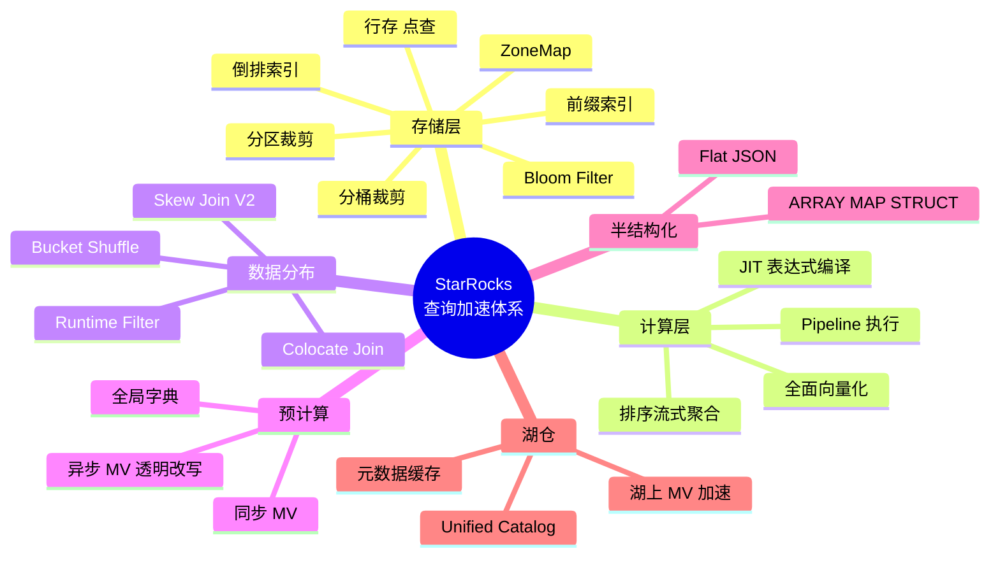
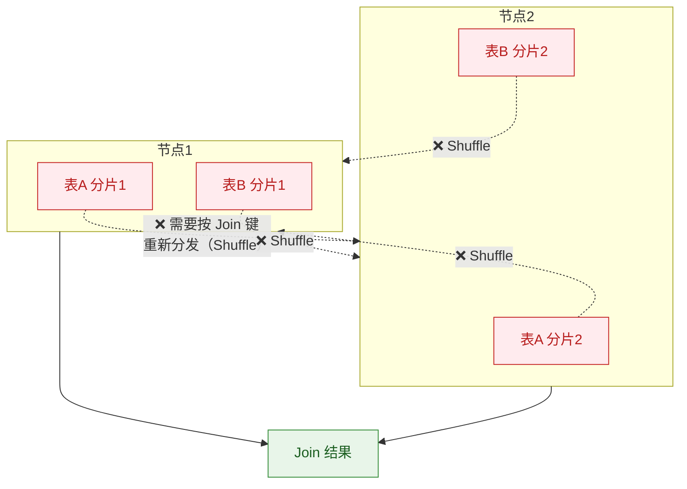
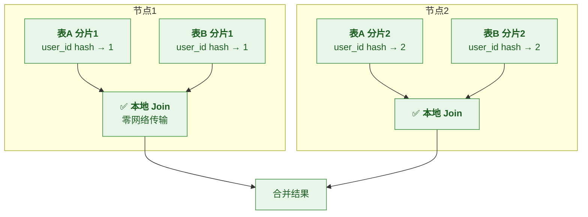
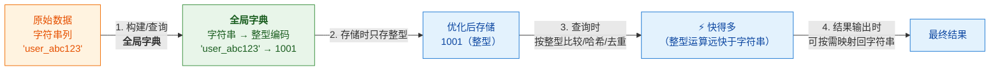
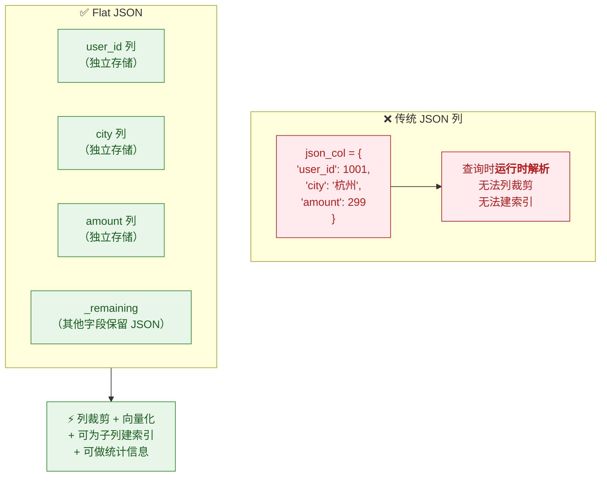
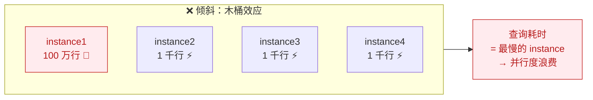
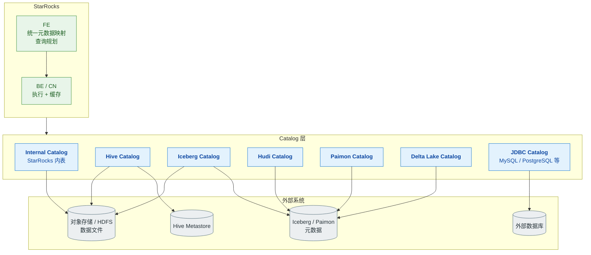
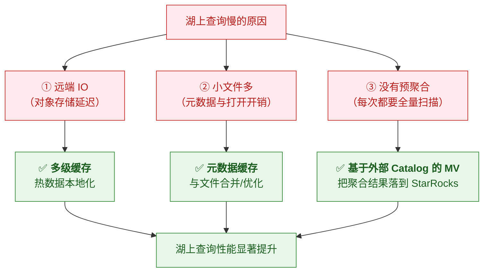

# ⚡ 五、查询加速与数据湖

> 本篇回答五个问题：**除了物化视图，还有哪些加速手段**？**Colocate Join 怎么做到零 Shuffle**？**全局字典为什么能加速 COUNT(DISTINCT)**？**Flat JSON 和 Skew Join V2 解决什么问题**？以及**Unified Catalog 怎么统一访问数据湖并加速**？
> 通用查询优化（EXPLAIN/PROFILE、分区裁剪、Join 四种方式）见 [[5-bigdata/1-doris/5-查询优化]]——**同源通用**。
> 物化视图加速见 [[4-物化视图与透明改写]]。系列导航见 [[0-StarRocks总览]]。

---

## 一、加速手段全景



> [!note] 本篇聚焦"StarRocks 特色"
> 上图中**分区裁剪、分桶裁剪、前缀索引、ZoneMap、Bloom Filter、Runtime Filter**
> 等通用手段见 [[5-bigdata/1-doris/5-查询优化]]，本篇不重复。
> 本篇讲 **Colocate Join、全局字典、Flat JSON、Skew Join V2、JIT、多级缓存、Unified Catalog**。

---

## 二、Colocate Join（零 Shuffle）

### 2.1 问题：分布式 Join 的代价

**普通 Shuffle Join**：两张表按 Join 键重分布到相同节点，**网络传输是大头**。



### 2.2 Colocate Join 的原理

> [!important] 核心思想
> **如果两张表的分桶键与分桶数完全一致（同一个 Colocate Group），
> 那么"相同 Join 键的数据本来就落在同一个节点上"——于是可以本地 Join，零 Shuffle。**



### 2.3 触发条件（⭐ 必须全满足）

| # | 条件 |
|---|---|
| 1 | 两表在**同一个 Colocate Group** 中 |
| 2 | **分桶键完全一致** |
| 3 | **分桶数完全一致** |
| 4 | **副本数一致** |
| 5 | Join 条件**包含分桶键** |

> [!danger] 这也是"建表时就要为 Join 设计"的原因
> **Colocate Group 和分桶数在建表时就定死了**，
> 建表后要改，**代价很大**（涉及数据重分布）。
> 👉 所以：**在设计阶段就要识别"哪些表会频繁 Join"，让它们分桶键一致。**
>
> 详见 [[5-bigdata/1-doris/3-表设计]]

### 2.4 四种 Join 方式对比（回顾）

| Join 方式 | 触发条件 | 特点 |
|---|---|---|
| **Broadcast Join** | 一侧表很小 | 小表广播到所有节点，**避免大表 Shuffle** |
| **Shuffle Join** | 通用 | 两边按 Join 键重分布，**网络开销最大** |
| **Bucket Shuffle Join** | 大表的分桶键 = Join 键 | **只重分布一侧**，减少 Shuffle |
| **Colocate Join** | 同 Group + 分桶键与分桶数一致 | ⭐ **本地 Join、零 Shuffle，最快** |

> [!tip] 面试可以这样组织答案
> **"我会按'能不能避免 Shuffle'来排序优化 Join：**
> **① 优先 Colocate**（建表时就让常 Join 的表分桶键一致）；
> **② 其次 Bucket Shuffle**（至少只 Shuffle 一侧）；
> **③ 大小表用 Broadcast**；
> **④ 兜底才是 Shuffle Join**，并用 Runtime Filter 减少扫描。
> 而且**保证统计信息新鲜**，让 CBO 能选对——这一条经常被忽略。**"

---

## 三、全局字典（Global Dictionary）

### 3.1 解决什么问题

> [!note] 痛点：字符串列的 **COUNT(DISTINCT)** 和 **Join** 很贵
> 因为要**比较和哈希字符串**，比整型慢得多，而且占用更多内存/网络带宽。

**典型场景**：`COUNT(DISTINCT user_id)`、`COUNT(DISTINCT order_no)`，
或按字符串列做 Join。

### 3.2 机制



> [!important] 什么场景收益最大
> | 场景 | 收益 |
> |---|---|
> | **`COUNT(DISTINCT 字符串列)`** | ⭐ 收益最明显——去重变成整型去重 |
> | **字符串列的 Join** | 显著降低哈希与网络开销 |
> | **高基数维度列** | 存储与计算双收益 |
> | **低基数列** | 收益有限（本身就不贵） |

> [!tip] 官方还提供的能力
> **配合 `AUTO INCREMENT` 与全局字典，可以加速 `COUNT(DISTINCT)` 和 Join。**
> 这是 StarRocks 提供的一个专门优化路径。
> 具体语法与限制随版本变化，**以官方文档为准**。

---

## 四、Flat JSON

### 4.1 问题：JSON 查询为什么慢

**传统做法**：把 JSON 整个存成一个 `JSON` 类型列，查询时**运行时解析**。
- ❌ 每次查询都要解析 JSON 结构
- ❌ 无法利用列存优势（整个 JSON 是一列）
- ❌ 无法建索引加速特定字段

### 4.2 Flat JSON 的做法

> [!important] 核心思想
> **把 JSON 里"频繁访问的字段"提取出来，按独立列存储**（打平），
> 从而享受**列存 + 向量化 + 索引**的全部好处，同时**保留 JSON 的灵活性**。



> [!tip] 什么时候用 Flat JSON
> - 数据是**半结构化**（埋点、日志、事件属性），**字段不固定**
> - 但其中**少数字段高频查询**
> - 你既想要 **JSON 的灵活性**，又想要 **列存的性能**
>
> **这是"兼顾灵活性与性能"的折中方案** —— 比"全部打平成固定列"灵活，比"整个 JSON 存一列"快。

---

## 五、Skew Join V2（数据倾斜）

### 5.1 问题：数据倾斜拖垮并行度

> [!note] 典型症状
> Join 时某个 key 的数据量特别大（如 `NULL`、或某个大客户），
> 导致**个别 instance 处理量远超其他**，整个查询被最慢的那个拖住。



### 5.2 Skew Join V2 的思路

**核心思路**：识别出**热点 key**，对它们做**特殊处理**——
把倾斜的那部分数据**单独拆分处理**，而不是塞进一个 instance。

> [!tip] 倾斜的其他通用解法（面试可补充）
> | 方法 | 说明 |
> |---|---|
> | **Skew Join V2** | StarRocks 内置的倾斜 Join 优化 |
> | **过滤 NULL / 热点 key** | 如果热点 key 是 NULL 且业务不需要，直接过滤 |
> | **加随机前缀打散** | 经典手工方案：热点 key 加随机后缀打散后再聚合 |
> | **两阶段聚合** | 先局部聚合再全局聚合，减少 Shuffle 量 |
> | **调整分桶键** | 从建表层面避免热点集中 |
>
> **面试建议**：先说"**先定位是不是倾斜**"（看 `PROFILE` 里各 instance 的行数/耗时分布），
> **再谈解法**——不要一上来就说"加随机前缀"。

---

## 六、JIT 与执行引擎优化

| 能力 | 说明 |
|---|---|
| **全面向量化** | 按批（block/vector）处理而非按行，充分利用 CPU |
| **Pipeline 执行** | 算子流水线化，减少阻塞与物化 |
| **JIT 表达式编译** | 对复杂表达式**运行时编译成机器码**，避免解释执行开销 |
| **排序流式聚合** | 利用数据有序性做流式聚合，降低内存占用 |

> [!note] 这些是引擎内部优化，使用者主要受益
> 面试被问到时，**能说出"StarRocks 是全面向量化 + Pipeline 执行 + JIT 表达式编译"**就够了；
> 深挖原理不是这个岗位的重点（除非面数据库内核岗）。

---

## 七、⭐ Unified Catalog 与数据湖

### 7.1 为什么需要"统一 Catalog"

> [!note] 问题
> 数据分散在多处：Hive 数仓、Iceberg 湖、MySQL 业务库、Paimon 流式湖……
> 传统做法是 **ETL 搬进数仓**（成本高、时效差）。
> **理想是"不搬数据，直接查"。**

### 7.2 Unified Catalog 架构



> [!important] 关键能力：**跨 Catalog 查询**
> 你可以**把内表和湖表放在同一个 SQL 里 Join**：
> ```sql
> SELECT ...
> FROM internal_db.dws_order          -- StarRocks 内表
> JOIN hive_catalog.dim.dim_region    -- Hive 外部表
>   ON ...
> ```
> **这才是"湖仓一体"的实用形态**——不用先把湖数据搬进数仓。

### 7.3 湖上查询加速的三板斧



| 加速手段 | 说明 |
|---|---|
| **多级缓存** | 内存 → 本地盘 → 远端，热数据访问接近本地性能 |
| **元数据缓存** | 减少对 Hive Metastore / 湖元数据的频繁访问 |
| **外部 Catalog 的 MV** | ⭐ 在湖表之上建 MV，把预聚合结果**物化到 StarRocks**，实现湖上加速 |
| **统计信息采集**（3.2+） | 支持采集 **Hive/Iceberg/Hudi** 统计，让 CBO 在湖表上也能选对计划 |
| **文件格式与分区** | 湖侧做好分区裁剪、避免小文件，仍是基础 |

> [!success] 湖上 MV 加速的价值（面试可讲）
> **"湖表数据量大、又不适合全量搬进数仓，那就在湖表上建异步 MV，
> 把高频使用的聚合结果物化到 StarRocks 里。
> 业务查基表，优化器自动改写到 MV 上——既不用搬数据，又拿到了性能。"**
>
> ⚠️ 但记得那个例外：**JDBC Catalog 的 MV 不支持改写**（见 [[4-物化视图与透明改写]]）。

### 7.4 存算分离与湖仓的关系

| | 说明 |
|---|---|
| **shared-data** | StarRocks **自己的数据**放对象存储（存算分离） |
| **湖仓一体** | StarRocks **直接查询别人的湖**（Hive/Iceberg/Paimon…） |
| **两者关系** | **可以同时用**——CN 集群既可以查自己的云原生表，也可以联邦查湖 |

> [!tip] 这是两个容易混淆的概念
> - **存算分离**解决"**我自己的数据怎么存更省钱、更弹性**"
> - **湖仓一体**解决"**别人湖里的数据我怎么直接查**"
>
> 它们**正交**，可以并存。面试时分开讲会更清楚。

---

## 八、30 秒速查表

| 问题 | 一句话答案 |
|---|---|
| 加速手段分几类 | **存储层（索引/裁剪）· 计算层（向量化/JIT）· 数据分布（Colocate）· 预计算（MV）· 半结构化（Flat JSON）· 湖仓（Catalog）** |
| **Colocate Join 原理** | 同 Colocate Group + 分桶键与分桶数一致 → **相同 Join 键的数据本就在同一节点** → **本地 Join、零 Shuffle** |
| Colocate 触发条件 | 同 Group、**分桶键一致**、**分桶数一致**、**副本数一致**、Join 条件含分桶键 |
| 为什么建表时就要设计 Colocate | 分桶数与 Group **建表后修改代价大**（涉及数据重分布） |
| 四种 Join 的优先级 | **Colocate > Bucket Shuffle > Broadcast > Shuffle** |
| **全局字典解决什么** | 字符串列的 **`COUNT(DISTINCT)`** 与 **Join** 慢——映射成整型后运算快得多 |
| 全局字典收益最大的场景 | **高基数、字符串列的 `COUNT(DISTINCT)`** |
| **Flat JSON 解决什么** | JSON 整列存储导致每次查询都要**运行时解析**、无法列裁剪/建索引 |
| Flat JSON 的做法 | 把**高频访问字段打平成独立列**，其余留在 JSON 列 |
| Flat JSON 的价值 | **兼顾 JSON 灵活性与列存性能** |
| **Skew Join V2 解决什么** | Join **数据倾斜**（热点 key 拖垮并行度） |
| 倾斜排查第一步 | 看 **`PROFILE`** 里各 instance 的行数/耗时分布 |
| 倾斜的通用解法 | Skew Join V2、过滤 NULL/热点 key、加随机前缀、两阶段聚合、调分桶键 |
| JIT 是什么 | 复杂表达式**运行时编译成机器码** |
| **Unified Catalog 解决什么** | **不搬数据直接查**多种外部数据源 |
| 支持哪些外部源 | Hive、Iceberg、Hudi、Paimon、Delta Lake、**JDBC**（MySQL 等） |
| Catalog 的关键能力 | **跨 Catalog Join**（内表与湖表放同一个 SQL） |
| 湖上加速三板斧 | **多级缓存**、**元数据缓存**、**外部 Catalog 的 MV** |
| 外部表统计信息 | 3.2+ 支持采集 **Hive/Iceberg/Hudi** 统计，让 CBO 在湖表上也能选对计划 |
| 存算分离 vs 湖仓一体 | **正交**：前者管"我的数据怎么存"，后者管"别人的湖我怎么查" |
| JDBC Catalog 的 MV | ⚠️ **不支持查询改写** |

---

## 九、学习检查清单

- [ ] 能画出**加速手段全景**，并按"存储/计算/分布/预计算"分类
- [ ] ⭐ 能讲清 **Colocate Join 的原理**与**全部触发条件**
- [ ] 能解释"为什么 Colocate 必须在建表时设计好"
- [ ] 能按优先级组织**四种 Join 方式**的选型（Colocate > Bucket Shuffle > Broadcast > Shuffle）
- [ ] 能说清**全局字典**解决什么问题、什么场景收益最大
- [ ] 能说清 **Flat JSON** 的做法与适用场景
- [ ] 能说清 **Skew Join V2** 解决什么，并能给出**倾斜的通用排查与解法**
- [ ] 能说出至少三种执行引擎优化（向量化/Pipeline/JIT）
- [ ] ⭐ 能画出 **Unified Catalog 架构**，说清跨 Catalog Join 的价值
- [ ] 能说出**湖上加速的三板斧**
- [ ] ⚠️ 能说出"**JDBC Catalog 的 MV 不支持改写**"
- [ ] 能区分**存算分离与湖仓一体**（正交的两件事）
- [ ] 能说清湖表统计信息采集对 CBO 的意义

---
> 上一篇 → [[4-物化视图与透明改写]] ｜ 下一篇 → [[6-导入与实时链路]] ｜ 返回 [[0-StarRocks总览]]
> 通用查询优化 → [[5-bigdata/1-doris/5-查询优化]] ｜ 湖仓细节 → [[5-bigdata/1-doris/7-湖仓一体]]
