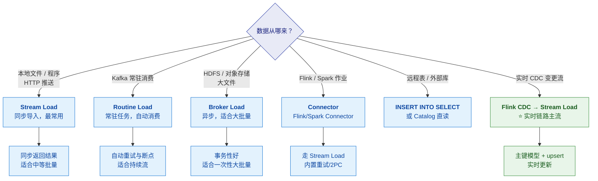
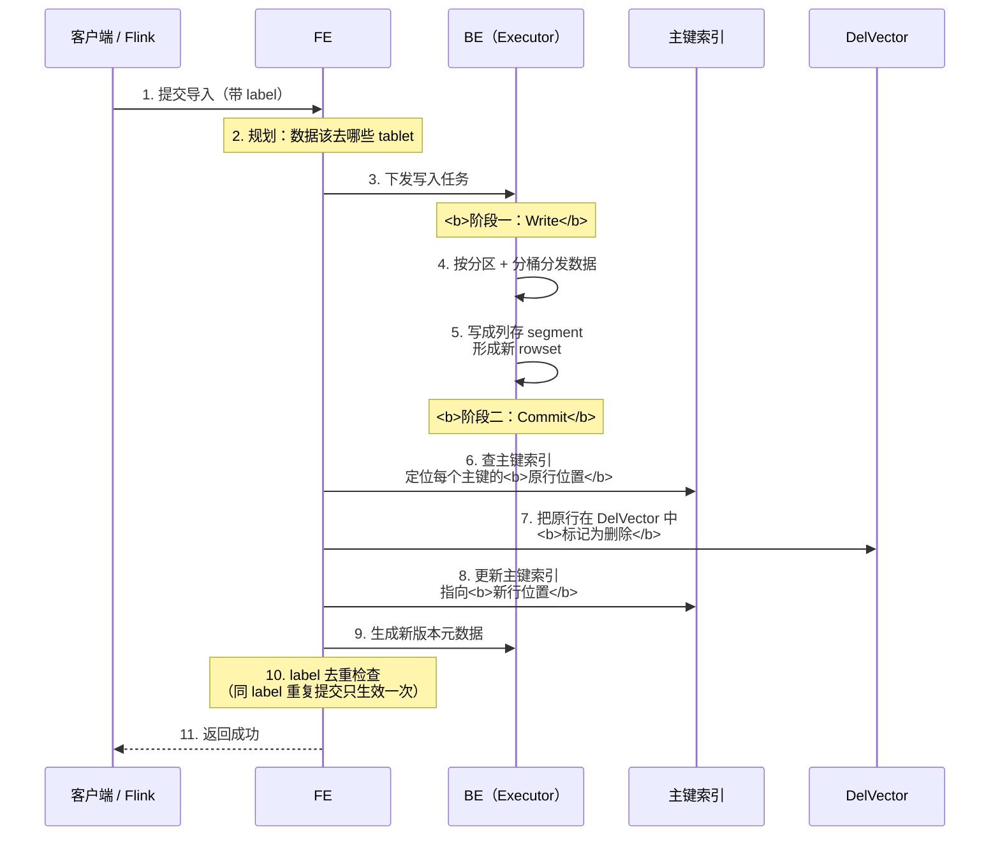
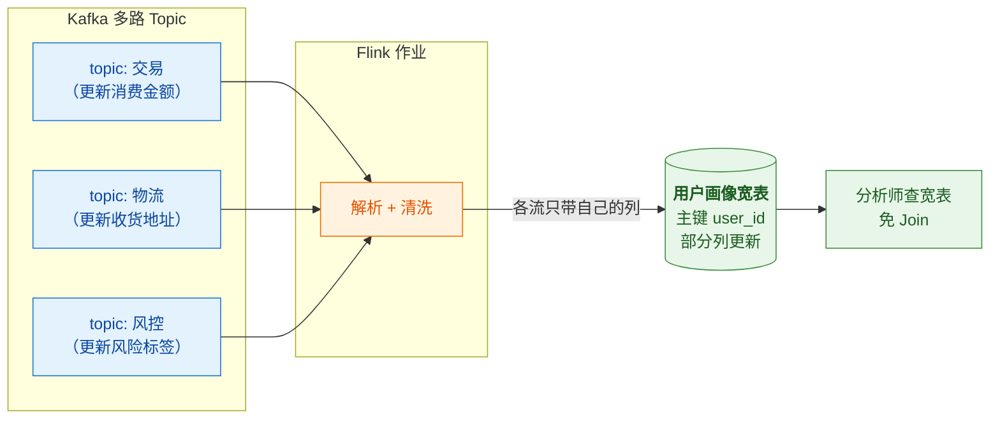
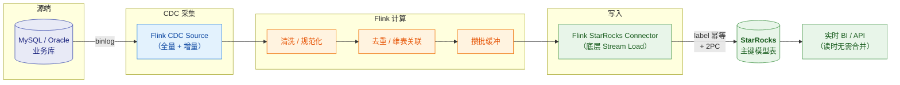
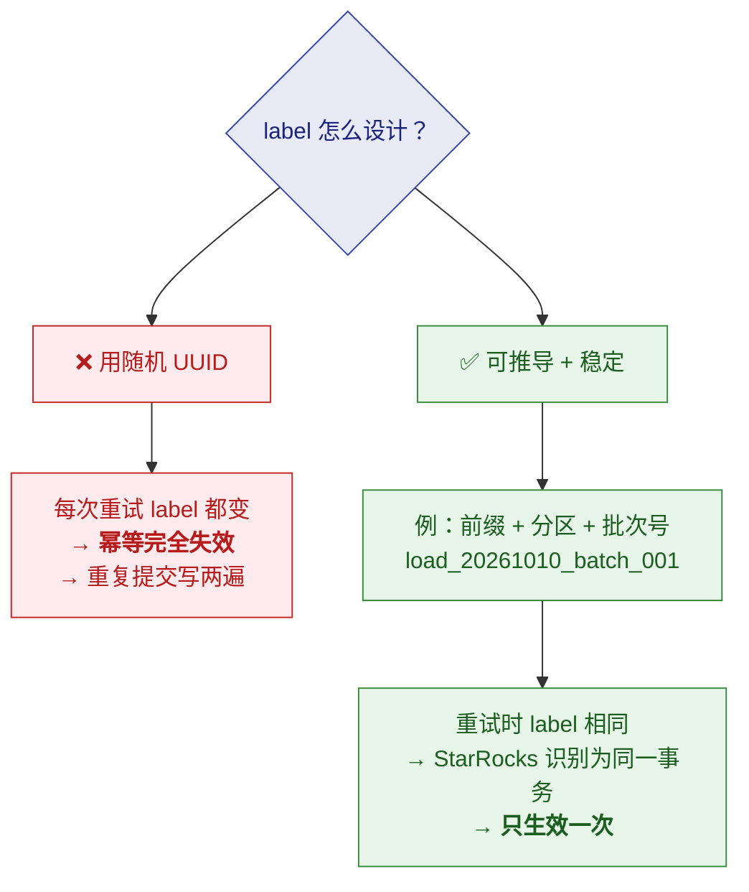

# 🔄 六、导入与实时链路

> 本篇回答四个问题：**有哪几种导入方式、怎么选**？**主键模型的写入链路有什么特别之处**？**Flink CDC → StarRocks 的端到端链路怎么保证不重不丢**？以及**部分列更新在实时链路里怎么用**？
> ⚠️ **导入的通用知识（Stream Load / Routine Load / Broker Load 的语法与参数）
> 与 Doris 高度相似，详见 [[5-bigdata/1-doris/6-数据导入与FlinkCDC]]**，本篇不重复语法细节，
> 聚焦 **StarRocks 侧的关键差异与实时链路设计**。
> 系列导航见 [[0-StarRocks总览]]。

---

## 一、导入方式全景

| 方式 | 触发 | 适用 | 特点 |
|---|---|---|---|
| **Stream Load** | HTTP 推送 | 本地文件、程序写入、Connector 底层 | **同步**，返回即成功/失败；**最常用** |
| **Routine Load** | 常驻任务 | **Kafka 持续消费** | 自动消费、**自动重试与断点续传** |
| **Broker Load** | 提交异步任务 | HDFS/S3 **大批量文件** | **异步**，适合一次性导入 |
| **Flink/Spark Connector** | 作业内写入 | 流/批处理管道 | 底层走 Stream Load，**内置重试与 2PC** |
| **INSERT INTO ... SELECT** | SQL | 表间转换、Catalog 直读 | 灵活，但**不适合高频小批** |

> [!warning] ⭐ 铁律：**不要高频小批写入**
> 每次导入都会产生一个新的 **rowset（version）**。
> 高频小批会让**版本数快速堆积，Compaction 追不上**，
> 最终触发 **`-235 too many versions`** 而写入失败。
>
> **治本方案永远是"从上游攒批"**，而不是只调参数。
> 详细机制见 [[5-bigdata/1-doris/8-运维与调优]]、[[7-运维调优与面试题]]。

---

## 二、⭐ 主键模型的写入链路

### 2.1 一次 Loadjob 的两个阶段

> [!important] 主键表的导入在提交阶段有额外动作
> 普通表导入主要是"写数据 + 提交版本"；
> **主键表还要处理"标记旧行删除"和"更新主键索引"**。

> [!important] 与普通表的差异（记忆点）
> | 阶段 | 普通表 | 主键表 |
> |---|---|---|
> | **Write** | 写 segment、形成 rowset | **相同** |
> | **Commit** | 生成新版本元数据 | **额外**：查主键索引 → 标记 DelVector → 更新索引 |
>
> **主键表的写入开销略高，但换来的是"读时无需合并"。**
> **这是一次"写入成本换查询性能"的明确取舍。**

### 2.2 为什么这个取舍是划算的

> [!tip] 用一句话讲清（面试加分）
> **"写只有一次，读可能有成千上万次。**
> **把成本从读侧搬到写侧，是数仓里非常经典的一笔账。"**
>
> 尤其对 BI 场景：**写入是后台批量任务，读是面向几百个用户的实时查询**——
> 读侧的 P99 才是 SLO 的主体。

### 2.3 部分列更新在实时链路里的用法

> [!warning] 部分列更新的四个坑
> 1. **NULL 语义**：某流只更新一列却传了 NULL，是"设为 NULL"还是"保持原值"？
>    **这是生产事故的常见来源，必须确认。**
> 2. **写放大**：多个流频繁更新同一行 → 主键索引与 DelVector 维护成本上升
> 3. **需要显式开启**：导入参数/表属性，**语法随版本变化，以官方文档为准**
> 4. **不要滥用**：只更新一列的场景，未必值得用宽表 + 部分列更新

---

## 三、⭐ Flink CDC → StarRocks 端到端链路

### 3.1 整体架构

### 3.2 ⭐ 不重不丢的三段式（必背）

| 目标 | 靠什么 | 关键细节 |
|---|---|---|
| **不重（幂等）** | **label** | 同一 label 的导入**只生效一次**；⚠️ **label 必须可推导且稳定**——用 UUID 就等于放弃幂等 |
| **不丢** | **攒批 + 重试 + checkpoint 可重放** | Flink 的 checkpoint 保证故障后能重放；Connector 内置重试 |
| **精确一次** | **两阶段提交（2PC）** | 在 **checkpoint 完成后**才真正提交到 StarRocks |

> [!danger] ⚠️ 只开 EXACTLY_ONCE 是不够的
> 还需要三件事配合：
> 1. **label 幂等**（否则重复提交会写两遍）
> 2. **攒批**（否则写得太碎触发 `-235`）
> 3. **下游表类型匹配**（CDC 场景必须是**主键模型**，否则 upsert 语义不对）

### 3.3 label 的设计（⭐ 高频追问）

### 3.4 CDC 场景的注意事项

| 注意点 | 说明 |
|---|---|
| **表类型必须选主键模型** | 才能正确承接 upsert/delete 语义 |
| **主键要与源表业务主键一致** | 否则更新会错行 |
| **DELETE 事件要能承接** | 主键模型支持；会被标记进 DelVector |
| **Schema 变更** | 上游加列/改类型要有处理策略，否则 CDC 作业会失败 |
| **攒批参数** | 调大 flush 间隔/条数，**避免高频小批** |
| **大事务** | 上游大事务可能导致单批数据量过大，需要关注内存 |
| **部分列更新** | 多流写同一张宽表时使用（见 2.3） |

> [!important] 为什么主键模型天然适配 CDC
> **CDC 的语义就是"增删改事件流"，而主键模型正好提供"按主键 upsert + delete"。**
> 对比 ClickHouse：`ReplacingMergeTree` 只能做到**最终一致**，
> CDC 同步过去后查询可能读到重复行，需要 `FINAL` 或频繁 `OPTIMIZE` 兜底。
> **这是 StarRocks/Doris 在实时数仓场景的核心优势。**
> 详见 [[2-表类型与主键模型]]、[[5-bigdata/1-doris/9-对比StarRocks与ClickHouse]]。

---

## 四、攒批参数怎么调

> [!important] 攒批是"防 `-235`"的第一手段
> 目标是**降低导入频率、增大单批数据量**，让 Compaction 跟得上。

| 层面 | 可调项 | 方向 |
|---|---|---|
| **Flink Connector** | sink 的 flush 间隔 / 条数 | 调大（如 5～10 秒或 N 行一批） |
| **Routine Load** | 批次大小与间隔 | 调大单批、拉长间隔 |
| **Stream Load** | 客户端自行攒批 | 应用侧合并请求 |
| **服务端** | Group Commit（服务端攒批） | 开启后可缓解小批写入 |

> [!tip] 面试怎么答"写入慢了/`-235` 了"
> **"我会先看根因是不是'写得太碎'，而不是先调参数。**
> 判断方法：看 **compaction score**、**tablet 版本数**、**导入频率**。
> 如果确实是高频小批，**治本是攒批**——调 Flink sink 的 flush 间隔、
> 或开启服务端 Group Commit。
> **只调 Compaction 参数是治标，写入节奏不改，问题会复发。**"

---

## 五、30 秒速查表

| 问题 | 一句话答案 |
|---|---|
| 导入方式有哪些 | **Stream Load**（HTTP 同步）、**Routine Load**（Kafka 常驻）、**Broker Load**（异步大批量）、**Connector**、**INSERT INTO SELECT** |
| 最常用的是哪个 | **Stream Load**——同步返回，Connector 底层也用它 |
| Kafka 持续消费用哪个 | **Routine Load**（自动重试与断点） |
| 高频小批写入会怎样 | 版本堆积 → **`-235 too many versions`** → 写入失败 |
| `-235` 治本方案 | **从上游攒批**（降低频率、增大单批），不是只调参数 |
| 主键表导入的两个阶段 | **Write**（写 segment 形成 rowset）+ **Commit**（查索引→标记 DelVector→更新索引） |
| 主键表比普通表多做什么 | Commit 阶段多：**定位旧行 + 标记删除 + 更新主键索引** |
| 为什么这个取舍划算 | **写只有一次，读有成千上万次**——把成本从读侧搬到写侧 |
| 幂等靠什么 | **label**——同 label 只生效一次 |
| label 怎么设计 | **可推导且稳定**（前缀+分区+批次号）；⚠️ **用 UUID = 放弃幂等** |
| 不丢靠什么 | **攒批 + 重试 + checkpoint 可重放** |
| 精确一次靠什么 | **两阶段提交（2PC）**，checkpoint 完成后才提交 |
| CDC 场景该用哪种表 | ⭐ **主键模型**（天然承接 upsert/delete） |
| 部分列更新干什么用 | **多流写同一张宽表**（用户画像/标签） |
| 部分列更新最大的坑 | **NULL 语义**——是"设为 NULL"还是"保持原值" |
| 服务端攒批叫什么 | **Group Commit** |

---

## 六、学习检查清单

- [ ] 能列出**五种导入方式**并针对场景选对
- [ ] 能说清 **Stream Load 与 Routine Load** 的适用差异
- [ ] ⭐ 能画出**主键表导入的 Write 与 Commit 两阶段**，说清比普通表多做了什么
- [ ] 能解释"写一次读万次"这个成本搬运的取舍
- [ ] ⭐ 能背出**不重不丢的三段式**（label / 攒批重试 / 2PC）
- [ ] ⚠️ 能说清 **label 用 UUID 会怎样**（幂等失效）
- [ ] 能画出 **Flink CDC → StarRocks** 的完整链路
- [ ] 能说出 **CDC 场景的六个注意事项**
- [ ] 能说清**部分列更新的用法与 NULL 语义坑**
- [ ] 能说出**攒批的可调层面**（Connector / Routine Load / 客户端 / Group Commit）
- [ ] 能不假思索地回答"`-235` 怎么治"，并强调**治本是攒批**

---
> 上一篇 → [[5-查询加速与数据湖]] ｜ 下一篇 → [[7-运维调优与面试题]] ｜ 返回 [[0-StarRocks总览]]
> 导入语法细节 → [[5-bigdata/1-doris/6-数据导入与FlinkCDC]]
