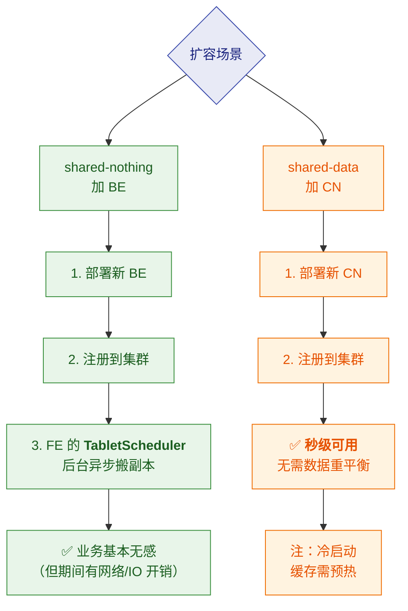
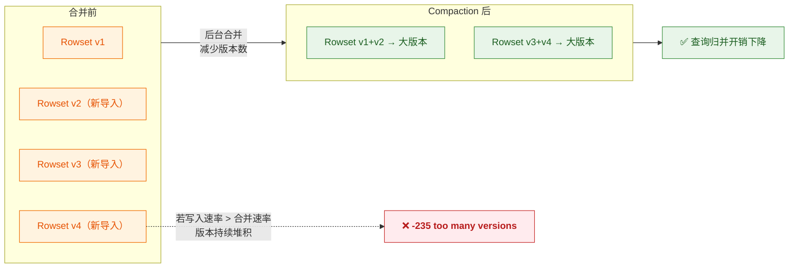
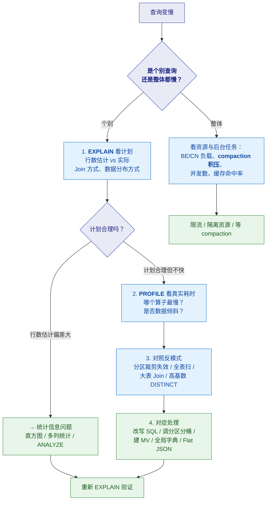

# 🛠️ 七、运维调优与面试高频题

> 本篇分两部分：**前半是运维调优要点**（部署、扩缩容、Compaction、内存、监控、故障速查），
> **后半是面试高频题**（八道必答 + 快问快答 + 易错陷阱 + 场景设计题）。
> 运维的通用部分与 Doris 高度相似，**详见 [[5-bigdata/1-doris/8-运维与调优]]**；
> 本篇聚焦 StarRocks 侧要点与面试表达。系列导航见 [[0-StarRocks总览]]。

---

# 第一部分：运维调优要点

## 一、部署与集群规划

### 1.1 组件规划

| 组件 | 建议 |
|---|---|
| **FE** | **生产至少 3 个 Follower**（奇数，容忍 1 台故障）；读多写少可加 **Observer** 扩查询并发 |
| **BE / CN** | 按数据量与查询并发规划；**BE 需要本地盘存数据**，**CN 需要本地盘做缓存** |
| **元数据盘** | FE 的 BDB JE 对磁盘延迟敏感，**建议 SSD** |
| **网络** | FE/BE 之间、BE 之间都是高频通信，**万兆网络**是基本要求 |

### 1.2 两种架构的规划差异

| | **shared-nothing（BE）** | **shared-data（CN）** |
|---|---|---|
| 本地盘用途 | **存数据本体**（容量要大） | **只做缓存**（容量可小、但要好 SSD） |
| 扩容动作 | 加 BE → **数据自动重平衡**（有搬数据开销） | 加 CN → **秒级生效，无需重平衡** |
| 缩容动作 | decommission（异步搬副本） | 直接下线 CN（数据在对象存储） |
| 需要额外组件 | 无 | **对象存储 / HDFS** |

> [!tip] shared-data 的缓存盘规划要点
> **CN 的本地盘是"缓存"，不是"存储"**——所以规划逻辑完全不同：
> - **容量**：不需要等于数据总量，按**热数据规模**估（提高命中率即可）
> - **性能**：**强烈建议 SSD/NVMe**——缓存盘慢会成为瓶颈
> - **命中率是关键指标**：命中率高 → 性能接近 shared-nothing

---

## 二、扩缩容

> [!important] 这是 StarRocks/Doris 相对 ClickHouse 的**架构级优势**
> **加节点自动重平衡、业务无感**；而 ClickHouse 加 shard 后**存量数据不会自动迁移**，
> 要做 **resharding**（建新表 + 导数 + 切换），数据量大时是"以天为单位"的工程。
> 详见 [[5-bigdata/1-doris/9-对比StarRocks与ClickHouse]]。

---

## 三、Compaction（核心运维项）

### 3.1 为什么需要 Compaction

> [!note] 机制回顾
> 每次导入产生一个新的 **rowset（version）**。
> 查询时要归并多个 rowset（**读放大**）。
> **Compaction 就是后台把这些 rowset 合并成大版本，降低读放大。**

### 3.2 `-235 too many versions` 的治理

> [!danger] ⭐ 高频面试题：`-235` 怎么治？
> **根因几乎总是"写得太碎"**（高频小批导入 → 版本堆积 → Compaction 追不上）。

| 手段 | 性质 | 说明 |
|---|---|---|
| **上游攒批**（降频、增大单批） | ✅ **治本** | 调 Flink sink 的 flush 间隔/条数、Routine Load 批次 |
| **开启 Group Commit** | ✅ 治本（服务端） | 服务端攒批，缓解客户端小批写入 |
| **调优 Compaction 参数与并发** | 🟠 治标 | 提升合并能力，但不改写入节奏 |
| **监控告警** | ✅ 预防 | 盯 **compaction score**、**tablet 版本数**、导入失败率 |
| **表设计优化** | ✅ 结构性 | 减少分桶数（减少 tablet 总数）、按需分区 |

> [!important] 面试标准答法
> **"`-235` 的根因是版本堆积，几乎总是'写得太碎'导致的。**
> **所以我的第一反应是改写入方式，而不是调参数**——
> 优先从上游攒批（Flink sink 或 Routine Load 的批次参数），
> 或者开启服务端 Group Commit。
> **Compaction 参数调优是治标**：写入节奏不改，问题一定会复发。
> 同时我会把 **compaction score 和版本数**做成监控，**提前告警而不是等报错**。"

---

## 四、内存管理

| 内存项 | 说明 | 注意 |
|---|---|---|
| **查询内存** | 大查询（大 Join、大聚合）占用高 | 用 **Workload Group / Resource Group** 做隔离与限制 |
| **主键索引内存** | 主键表的索引 | ⭐ **持久化索引默认开启**，大部分落盘，省内存（见 [[2-表类型与主键模型]]） |
| **缓存内存** | shared-data 下的多级缓存 | 关系到缓存命中率与查询延迟 |
| **Compaction 内存** | 后台合并消耗 | 与查询争资源，需要隔离 |

> [!tip] OOM 排查思路（通用）
> 1. **看是查询 OOM 还是后台任务 OOM**（两者解法不同）
> 2. **定位到具体查询/任务**：看是否有超大 Join、超大聚合、倾斜
> 3. **短期**：限制并发、加大内存、隔离资源组
> 4. **长期**：优化 SQL 与建模（预聚合、物化视图、减少扫描量）
> 详见 [[5-bigdata/1-doris/8-运维与调优]]

---

## 五、监控指标

| 层次 | 关键指标 |
|---|---|
| **FE** | 元数据写入延迟、QPS、连接数、JVM 内存/GC、**BDB JE 日志同步延迟** |
| **BE / CN** | CPU、内存、**磁盘 IO 与使用率**、查询并发、**compaction score** |
| **表级** | **tablet 版本数**、分区大小、副本健康状态 |
| **查询** | P99 延迟、慢查询数、**改写命中率（MV）**、缓存命中率 |
| **导入** | 导入成功率、**导入频率**、单批大小、label 重复率 |
| **业务** | 数据新鲜度（导入延迟）、SLA 达标率 |

> [!important] 三个最该盯的"早期信号"
> 1. **compaction score 上升** → 写入节奏可能有问题，`-235` 的前兆
> 2. **tablet 版本数增加** → 同上，更直接的指标
> 3. **慢查询数上升 + 缓存命中率下降** → 资源或建模问题
>
> **这三个指标一起看，能在故障发生前发现问题。**

---

## 六、故障速查表

| 现象 | 常见根因 | 排查方向 |
|---|---|---|
| **导入报 `-235`** | 版本堆积（写得太碎） | 看导入频率 → **攒批** |
| **导入变慢** | BE 负载高、Compaction 抢占、网络 | 看 BE 资源与 compaction 状态 |
| **查询变慢（整体）** | 资源不足、compaction 积压、并发过高 | 看监控大盘 |
| **查询变慢（个别）** | SQL 写法、**统计信息过期**、倾斜 | `EXPLAIN` 看计划 → `PROFILE` 看耗时；见 [[3-CBO优化器与统计信息]] |
| **MV 没被命中** | 表达式不可推导、基数保持不满足、**JDBC Catalog** | 见 [[4-物化视图与透明改写]] 的排查表 |
| **FE 无法写元数据** | Follower 数量不足（凑不齐多数派） | 检查 FE 存活数与网络 |
| **主键表点查慢** | 索引未持久化/内存不足 | 检查 `enable_persistent_index` |
| **存算分离下查询抖动** | 缓存命中率低（冷数据回源） | 看缓存命中率、评估访问模式 |
| **数据重复** | label 用了 UUID（幂等失效） | ⚠️ 检查 label 生成逻辑 |

---

# 第二部分：面试高频题

## 七、八道必答题

### Q1. StarRocks 是什么？和 Doris 什么关系？

> [!important] 得分骨架
> **MPP 列式 OLAP 数据库**，主打**实时更新 + 高并发查询 + 湖仓一体**。
>
> **与 Doris 的关系**：StarRocks **起源于 Apache Doris 的分支**（DorisDB，2021 年前后更名），
> 是**独立演进多年的项目**（现为 Linux Foundation 项目）。
> **FE/BE 架构、分区/分桶、三种数据模型、导入方式、很多参数名都高度相似——会一个基本会用另一个。**
> 但已在**优化器、物化视图、湖仓能力**上明显分化。

> [!danger] 易错点
> ❌ **"StarRocks 就是 Doris 改了名"** —— 事实错误。
> 正确说法：**"起源于 Doris 分支，独立演进，已在架构细节、优化器、生态上分道扬镳。"**

---

### Q2. FE/BE 架构？BE 和 CN 什么区别？

> [!important] 得分骨架
> **FE**：元数据管理、客户端连接、查询规划与调度。三种角色：
> **Leader**（唯一可写元数据）、**Follower**（参与 Raft 选举，**需奇数个**）、
> **Observer**（只读，**不参与选举**，专用于扩查询并发）。
> 元数据用 **BDB JE** 存储，靠 **Raft** 同步，**多数派确认才算提交**。
>
> **BE / CN 是同一角色的两种形态**（取决于架构）：
> - **shared-nothing** → **BE**（本地盘**存数据** + 计算）
> - **shared-data** → **CN**（**只计算与缓存**，数据在对象存储）
>
> **它们不会同时存在于一个集群。**

**追问：Observer 有什么用？**
→ **不参与选举，所以不增加元数据写的一致性开销，但能承担查询规划并发。读多写少场景加 Observer 性价比很高。**

**追问：元数据存在 MySQL 里吗？**
→ ❌ **不。用 BDB JE + Raft，不依赖外部 MySQL。**（常见误解）

---

### Q3. ⭐ 主键模型怎么实现更新？为什么快？

> [!important] 得分骨架（核心题）
> **机制：Delete+Insert**
> - **UPDATE 被拆成"标记旧行删除 + 写入新行"**：靠**主键索引**（HashMap：主键 → 行位置）定位旧行，在 **DelVector** 中标记删除；新行写入新数据文件，主键索引指向新位置。
> - **读时无需合并**：因为历史重复行已在写入时标记删除，**每个主键只需读最新那行**。
>
> **为什么快 3～10 倍**（关键回答）：
> **不是"省了去重计算"这么简单，而是"谓词与索引能否下推"**：
> - **老更新模型（MoR）**：读时有 Merge 算子 → **谓词和索引无法下推到存储层** → 必须先合并多版本再过滤 → 大量无效 IO。
> - **主键模型**：读时无 Merge → **过滤算子和各类索引可直接在 Scan 层生效** → 扫描量大幅下降。
>
> **这是架构差异导致的能力差异，不是调参能弥补的。**

**追问：持久化索引是什么？**
→ `enable_persistent_index` **默认 true**，主键索引**大部分落盘**（只少量在内存），避免占用过多内存；性能与全内存**接近**。SSD 推荐开启。

**追问：3.0 有什么重要变化？**
→ **排序键与主键解耦**。之前排序键 = 主键，导致主键设计要在"业务正确"和"查询性能"之间妥协；3.0 起可用 `ORDER BY` 单独指定排序键（高频过滤列在前吃前缀索引）。

**追问：主键表有什么约束？**
→ **只支持 HASH 分桶**；**主键必须包含分区列和分桶列**；**主键不可修改、主键值不可更新**。

---

### Q4. ⭐ 什么是透明改写？有哪些改写场景？

> [!important] 得分骨架
> **透明改写**：**用户不需要修改 SQL**，StarRocks 自动把针对**基表**的查询改写成针对**物化视图**（含预计算结果）的查询。
> 算法基础是 **SPJG**（Select-Project-Join-GroupBy）。
> **内表场景保证强一致**——改写结果与直查基表一致。
>
> **改写场景（至少说出五种）**：
> | 场景 | 说明 |
> |---|---|
> | **Query Delta Join** | 查询的表是 MV 的**超集**（查询多 Join 了表） |
> | ⭐ **View Delta Join** | 查询的表是 MV 的**子集**（MV 是大宽表）——**大宽表杀手锏** |
> | **聚合改写** | 聚合上卷、聚合下推、复杂表达式 |
> | **嵌套 MV** | 基于 MV 建 MV，扩大可改写范围 |
> | **Union 改写** | 配合 TTL 做冷热分离 |
> | **外部 Catalog MV** | 湖上加速 |
>
> 还支持**复杂表达式改写**（算术运算、字符串/日期函数、CASE WHEN、OR 谓词）。

**追问：View Delta Join 的前提？**
→ MV 中必须有**基数保持（1:1）的 Join**；实践上要给维表声明 **`unique_constraints`**，优化器才能识别。

**追问：Union 改写的价值？**
→ **MV 只保留热数据，历史数据回落基表**——既拿到热数据性能，又不为冷数据付 MV 存储成本，且对用户透明。

**追问：陈旧改写是什么？**
→ 允许容忍数据过期以复用稍旧的 MV，**降低刷新频率、提高命中率**；适用于时效性要求不苛刻的分析场景（看板/日报），**不适用于对账/结算**。

> [!danger] ⚠️ 两个易错点
> 1. **JDBC Catalog 的异步 MV 不支持查询改写**（湖格式的可以）。
> 2. **建完 MV 必须用 `EXPLAIN` 验证命中**——没命中等于白建。

---

### Q5. ⭐ StarRocks 的 MV 和 ClickHouse 的 MV 一样吗？

> [!important] 得分骨架（这是最容易暴露"只背过名词"的题）
> **完全不一样。**
>
> | | **StarRocks 异步 MV** | **ClickHouse MV** |
> |---|---|---|
> | 本质 | **预计算 + 透明改写** | **写入触发器** |
> | 触发 | 调度/手动刷新 | **有数据 INSERT 时**触发 |
> | 处理范围 | 按定义重算/增量刷新结果集 | **只处理这一批新插入的数据块** |
> | 查询改写 | ✅ **支持** | ❌ **不支持** |
> | UPDATE/DELETE | ✅ 能感知 | ❌ **无感知** |
> | 用法 | 写原 SQL，优化器自动改写 | 必须手工把查询指向目标表 |
>
> **面试金句**：
> **"ClickHouse 的 MV 关心的是'新进来的这批数据'；StarRocks 的异步 MV 关心的是'以后的同类查询能不能自动走这条路'。**
> **所以要"BI 用户不改 SQL 就自动加速"，ClickHouse 的 MV 帮不了你；
> 但要"实时 UV/分位数这类流式指标"，ClickHouse 的 `AggregatingMergeTree` + MV 非常契合。"**

---

### Q6. CBO 是什么？统计信息不准会怎样？

> [!important] 得分骨架
> **CBO（基于代价的优化器）**：把逻辑计划转换成**多个物理计划**，
> **估算每个算子的代价**（CPU/内存/网络/IO），**选代价最低的**。
> StarRocks 的 CBO 基于 **Cascades 框架**，1.16 引入、**1.19 起默认启用**，
> 能在**数万个候选计划**中选最优。
>
> **⭐ 关键公式：CBO 的质量 = 代价模型 × 统计信息。**
> 代价模型是引擎写好的，**你唯一能影响的是统计信息**。
> **所以"优化器选错计划，九成是统计信息的问题"。**
>
> **统计信息三类**：
> | 类型 | 解决什么 |
> |---|---|
> | **基础统计**（row_count / **ndv** / null_count / min / max） | 通用基数估计；**ndv 最关键** |
> | **直方图** | **数据倾斜**——`ndv` 只知道有多少个值，**不知道值怎么分布** |
> | **多列联合统计** | **列相关性**——优化器默认假设列独立，但 `city='杭州' AND province='浙江'` 不独立 |
>
> 还有 **Predicate Column**（3.5+）：自动记录高频谓词列（WHERE/JOIN/GROUP BY），
> **列数超阈值时只采这些列的统计**，大幅省采集开销。

**追问：直方图是所有列都要建吗？**
→ ❌ **不是**。只对**数据高度倾斜 + 频繁被查询**的列建；**均匀分布的列不需要**（ndv 已经够准）。
且**字符串列只收集 MCV、不收集分桶**。**直方图不在自动采集范围内，需手动。**

**追问：查询计划可疑怎么排查？**
→ ① `EXPLAIN` 看**行数估计与实际是否差距大**；② 差距大 → 查统计信息是否过期/缺失；
③ 倾斜 → 建**直方图**；④ 多列相关谓词 → 建**多列联合统计**；⑤ 都不是 → 手动 `ANALYZE` 刷新。

---

### Q7. Colocate Join 怎么做到零 Shuffle？

> [!important] 得分骨架
> **原理**：如果两张表在**同一个 Colocate Group**，且**分桶键与分桶数一致**，
> 那么"**相同 Join 键的数据本来就落在同一个节点上**"——于是可以**本地 Join，零网络传输**。
>
> **触发条件（必须全满足）**：
> 同 Colocate Group、**分桶键一致**、**分桶数一致**、**副本数一致**、Join 条件**包含分桶键**。
>
> **引申考点**：**这也是"建表时就要为 Join 设计"的原因**——
> Colocate Group 与分桶数建表后修改代价大（涉及数据重分布）。

**追问：Join 优化怎么排优先级？**
→ **按"能不能避免 Shuffle"排序**：
> **① 优先 Colocate**（建表时让常 Join 的表分桶键一致）
> **② 其次 Bucket Shuffle**（只 Shuffle 一侧）
> **③ 大小表用 Broadcast**
> **④ 兜底 Shuffle Join**，用 Runtime Filter 减少扫描
> 而且**保证统计信息新鲜**让 CBO 选对——这条经常被忽略。

---

### Q8. ⭐ `-235 too many versions` 怎么治理？

> [!important] 得分骨架
> **根因**：每次导入产生一个 rowset（version），**高频小批导入**让版本数堆积、**Compaction 追不上**，最终导入报错。
>
> **治理（治标 → 治本）**：
> | 手段 | 性质 |
> |---|---|
> | ✅ **上游攒批**（降低频率、增大单批） | **治本** |
> | ✅ **开启 Group Commit**（服务端攒批） | **治本** |
> | 🟠 调优 Compaction 参数与并发 | 治标 |
> | ✅ 监控 compaction score / 版本数 | 预防 |
> | ✅ 表设计优化（减少分桶数） | 结构性 |
>
> **⭐ 一句话本质**：**`-235` 几乎总是"写得太碎"导致的，优先改写入方式，而不是只调参数。**

---

## 八、快问快答

| 问题 | 要点 |
|---|---|
| StarRocks 是什么 | **MPP 列式 OLAP 数据库**，实时更新 + 高并发 + 湖仓一体 |
| 与 Doris 关系 | **起源于 Doris 分支**，独立演进，**非改名** |
| 集群角色 | **FE**（元数据/规划）+ **BE**（存算一体）或 **CN**（仅计算） |
| BE 与 CN 区别 | **BE 存数据**；**CN 不存数据**（存算分离） |
| 两种架构 | **shared-nothing**（本地盘，延迟最低）/ **shared-data**（对象存储，成本弹性） |
| FE 三种角色 | **Leader**（唯一可写）/ **Follower**（参与选举，奇数个）/ **Observer**（只读扩并发） |
| 元数据存哪 | **BDB JE + Raft**，不是 MySQL |
| Follower 要几个 | **奇数，生产至少 3 个** |
| 四种表类型 | **明细 / 聚合 / 更新（MoR）/ 主键** |
| 主键模型机制 | **Delete+Insert**（标记旧行 + 写新行） |
| DelVector 是什么 | 每个 segment 的**删除标记** |
| 主键索引是什么 | **HashMap**：主键 → 行位置；主要用于写入时定位 |
| 主键模型为何快 | **读时无 Merge → 谓词与索引可下推**（MoR 不行），快 **3～10 倍** |
| 持久化索引默认开吗 | **是**（`enable_persistent_index`），大部分落盘 |
| 3.0 重要变化 | **排序键与主键解耦** |
| 主键表分桶约束 | **只支持 HASH 分桶**；主键须含分区列与分桶列 |
| 部分列更新用在哪 | **多流写同一张宽表**（用户画像） |
| 优化器 | **CBO**，基于 **Cascades 框架** |
| 最关键统计项 | **`ndv`**（列基数） |
| 直方图解决什么 | **数据倾斜**下的基数估计错误 |
| 直方图适用条件 | **倾斜 + 高频查询**的列；均匀分布不需要 |
| 多列联合统计解决什么 | **列相关性**导致的估算偏差 |
| Predicate Column 是什么 | 高频谓词列，**只采这些列的统计以省开销** |
| 两种 MV | **同步**（单表单一致）/ **异步**（多表可调度，支持改写） |
| 透明改写算法基础 | **SPJG** |
| 内表改写一致性 | ✅ **强一致** |
| View Delta Join | 查询是 MV 的**子集**（MV 大宽表）→ 可改写 |
| Query Delta Join | 查询是 MV 的**超集** → 可改写 |
| View Delta Join 前提 | MV 中要有**基数保持的 Join**（声明 `unique_constraints`） |
| Union 改写价值 | MV 读热数据 + 基表读冷数据（**冷热分离**） |
| 陈旧改写 | 容忍数据过期换性能；**不适用于对账** |
| 哪个 Catalog MV 不改写 | ⚠️ **JDBC Catalog** |
| 建完 MV 第一件事 | **`EXPLAIN` 验证命中** |
| ClickHouse MV 是什么 | **写入触发器**，不做查询改写 |
| Colocate Join 条件 | 同 Group + 分桶键/分桶数/副本数一致 + Join 含分桶键 |
| Join 优先级 | **Colocate > Bucket Shuffle > Broadcast > Shuffle** |
| 全局字典解决什么 | 字符串列的 **COUNT(DISTINCT)** 与 Join |
| Flat JSON 解决什么 | JSON 整列存储导致的**运行时解析**开销 |
| Skew Join V2 解决什么 | Join **数据倾斜** |
| Unified Catalog 支持哪些 | Hive / Iceberg / Hudi / Paimon / Delta Lake / **JDBC** |
| 湖上加速三板斧 | **多级缓存 + 元数据缓存 + 外部 Catalog MV** |
| 存算分离是性能优化吗 | ❌ **成本与弹性决策** |
| 怎么补存算分离性能 | **多级缓存**（内存→本地盘→远端）+ 预取 |
| `-235` 根因 | **写得太碎**（版本堆积），**治本是攒批** |
| 幂等靠什么 | **label**（用 UUID 就失效） |
| 精确一次靠什么 | **2PC** + label + 攒批 |
| CDC 用哪种表 | ⭐ **主键模型** |
| 加 BE 会自动均衡吗 | ✅ **会**（TabletScheduler 异步搬副本），业务基本无感 |

---

## 九、易错陷阱 TOP 12

> [!danger] 这些答错比不答更扣分
> 1. **"StarRocks 就是 Doris 改名"** —— 事实错误。**起源于分支，独立演进多年。**
> 2. **"CN 就是 BE 的别名"** —— 不准确。**BE 存数据，CN 只计算与缓存。**
> 3. **"主键模型和 Unique 更新模型一样"** —— 错。**主键是 Delete+Insert（写时标记）；老 Unique 是 MoR（读时合并）。**
> 4. **"元数据存在 MySQL"** —— 错。**BDB JE + Raft。**
> 5. **"主键模型快是因为省了去重计算"** —— 不完整。**关键在谓词与索引能否下推。**
> 6. **"所有列都该建直方图"** —— 错。**只对倾斜 + 高频查询的列建**；均匀分布不需要，还浪费采集资源。
> 7. **"StarRocks 的 MV 和 ClickHouse 的一样"** —— **典型错误**。**预计算+透明改写 vs 写入触发器。**
> 8. **"所有 Catalog 的 MV 都能改写"** —— 错。**JDBC Catalog 的不行。**
> 9. **"建了 MV 就会自动加速"** —— 错。**必须 `EXPLAIN` 验证命中**，不命中的 MV 白占资源。
> 10. **"`-235` 调个参数就好"** —— 错。**根因是写得太碎，要先改写入方式。**
> 11. **"label 用 UUID 就行"** —— 错。**label 每次都变等于放弃幂等**，重复提交会写两遍。
> 12. **"存算分离一定更快"** —— 错。**它是成本与弹性决策**，冷数据回源有延迟。

---

## 十、场景设计题

### 10.1 设计一个"MySQL 订单实时同步 + 实时看板"

**答题框架**：

| 步骤 | 方案 | 理由 |
|---|---|---|
| **1. 表类型** | ⭐ **主键模型** | 订单会 UPDATE（状态流转）、可能 DELETE，需要 upsert 语义；主键模型**读时无需合并**，查询快 |
| **2. 主键与排序键** | 主键 = 业务主键（`order_id`）；**排序键单独设 `ORDER BY (dt, merchant_id)`** | 3.0 解耦后，主键管唯一性、排序键管查询加速 |
| **3. 分区与分桶** | 按 `dt` 日分区 + 动态分区；`DISTRIBUTED BY HASH(order_id)` | ⚠️ 主键表**只支持 HASH 分桶**，且主键须含分区列与分桶列 |
| **4. 索引** | `enable_persistent_index = true` | 索引落盘，省内存且性能接近全内存 |
| **5. 写入链路** | Flink CDC → Connector（底层 Stream Load） | **label 幂等 + 攒批 + 2PC** 保证不重不丢 |
| **6. 攒批** | 调大 sink flush 间隔/条数 | 防 `-235` |
| **7. 加速** | 建**异步 MV**（按 `dt × merchant` 预聚合 GMV/单量） | 实时看板查询自动**透明改写**到 MV |
| **8. 验证** | `EXPLAIN` 确认改写命中 | 不命中等于白建 |
| **9. 统计信息** | 保证统计新鲜；如倾斜则建**直方图** | CBO 才能选对计划 |
| **10. 监控** | compaction score、版本数、导入延迟、MV 命中率 | 提前发现问题 |

> [!tip] 这个答案的杀伤力
> 它把 **表类型 → 建表 → 写入 → 加速 → 验证 → 监控** 串成了完整闭环，
> 而且每一步都有"为什么"。**这是"能落地"的信号，而不是"背过名词"。**

### 10.2 一个查询突然变慢，你怎么排查？

**答题框架**：

> [!important] 这个框架的价值
> **它把"StarRocks 特有的排查点"嵌进了通用流程**：
> - 行数估计偏差 → 想到**统计信息**（StarRocks CBO 依赖）
> - 缺预聚合 → 想到**异步 MV**
> - 高基数 DISTINCT 慢 → 想到**全局字典**
> - JSON 字段查询慢 → 想到 **Flat JSON**
> - 倾斜 → 想到 **Skew Join V2**
>
> **面试官会觉得你"真的用过"，而不是"看过文档"。**

### 10.3 Doris 和 StarRocks 怎么选？

**答题框架**：

| 维度 | 回答要点 |
|---|---|
| **关系** | **同源**（StarRocks 起源于 Doris 分支）。FE/BE、数据模型、导入方式高度相似，**会一个基本会用另一个** |
| **能力差异方向** | StarRocks 在 **CBO 优化器、物化视图透明改写、湖上查询**上投入更多、覆盖更广；Doris 在 **社区治理（ASF）、生态广度、多租户与运维体系**上更一体化 |
| **选型建议** | ① 已有其一且跑得好 → **不换**（同源迁移收益通常不抵成本）；② 看团队熟悉度与社区资源；③ 有明确能力缺口（某类 MV 改写、某湖格式支持）才按缺口选；④ **一定用真实业务做 PoC** |
| **诚实边界** | 两家的能力边界**每个版本都在变**，"谁更强"可能半年后反转。**任何基于旧版本功能清单的结论都要重新验证** |
| **一句话** | "它们是同一路线上的两个竞品，差异主要在**优化器与物化视图等加速能力的深度**、以及**社区与商业化路线**。选型应看团队熟悉度、社区资源和 PoC 结果，**而不是功能对比表的条数**" |

> 完整的三者对比（含 ClickHouse）与决策树见 [[5-bigdata/1-doris/9-对比StarRocks与ClickHouse]]。

---

## 十一、面试前 10 分钟速记卡

> [!abstract] 记住这 15 句
> 1. **StarRocks 起源于 Doris 分支，独立演进**——不是改名。
> 2. **FE**（Leader/Follower/Observer）+ **BE**（存算一体）或 **CN**（仅计算）。
> 3. **元数据用 BDB JE + Raft**，多数派确认才提交；**Follower 奇数个、至少 3 个**。
> 4. **Observer 不参与选举，专用于扩查询并发。**
> 5. **shared-nothing 延迟最低；shared-data 成本弹性最好**；存算分离是**成本决策不是性能决策**。
> 6. 四种表类型：**明细 / 聚合 / 更新（MoR）/ ⭐ 主键**。
> 7. ⭐ **主键模型 = Delete+Insert + DelVector**；读时**无需合并** → **谓词与索引可下推** → 快 **3～10 倍**。
> 8. **持久化主键索引默认开启**；**3.0 排序键与主键解耦**。
> 9. **CBO 质量 = 代价模型 × 统计信息**；**`ndv` 最关键**。
> 10. **直方图治倾斜、多列统计治相关性**；**只对该建的列建**。
> 11. ⭐ **透明改写 = 用户不改 SQL，优化器自动走 MV**；算法基础 **SPJG**；**内表强一致**。
> 12. **View Delta Join 是宽表杀手锏**（查询是 MV 的子集）；**Union 改写做冷热分离**。
> 13. ⚠️ **ClickHouse 的 MV 是写入触发器，不做查询改写**；**JDBC Catalog 的 MV 也不改写**。
> 14. **Join 优先级：Colocate > Bucket Shuffle > Broadcast > Shuffle。**
> 15. **`-235` 根因是写得太碎，治本是攒批**；**label 用 UUID 就失去幂等**。

---

> [!tip] 最后的建议
> **回答时尽量落到"取舍"和"验证"上**，这比背功能清单更能体现判断力：
> - 说 **shared-data** 时补一句"**但冷数据回源有延迟，所以要评估访问模式**"
> - 说 **透明改写** 时补一句"**建完必须 EXPLAIN 验证命中，否则白建**"
> - 说 **陈旧改写** 时补一句"**看板可以容忍，对账绝对不行**"
> - 说 **StarRocks vs Doris** 时补一句"**同源，能力差异每个版本都在变，要用真实业务 PoC**"
>
> **"我知道它的边界在哪"比"我知道它有什么功能"值钱得多。**

---
> 上一篇 → [[6-导入与实时链路]] ｜ 返回 [[0-StarRocks总览]]
> 运维通用部分 → [[5-bigdata/1-doris/8-运维与调优]] ｜ 三者对比 → [[5-bigdata/1-doris/9-对比StarRocks与ClickHouse]]
