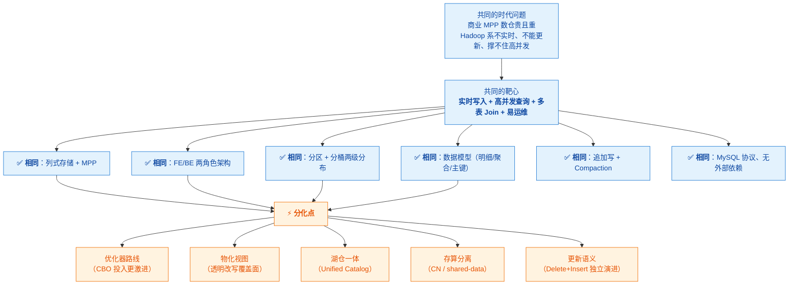
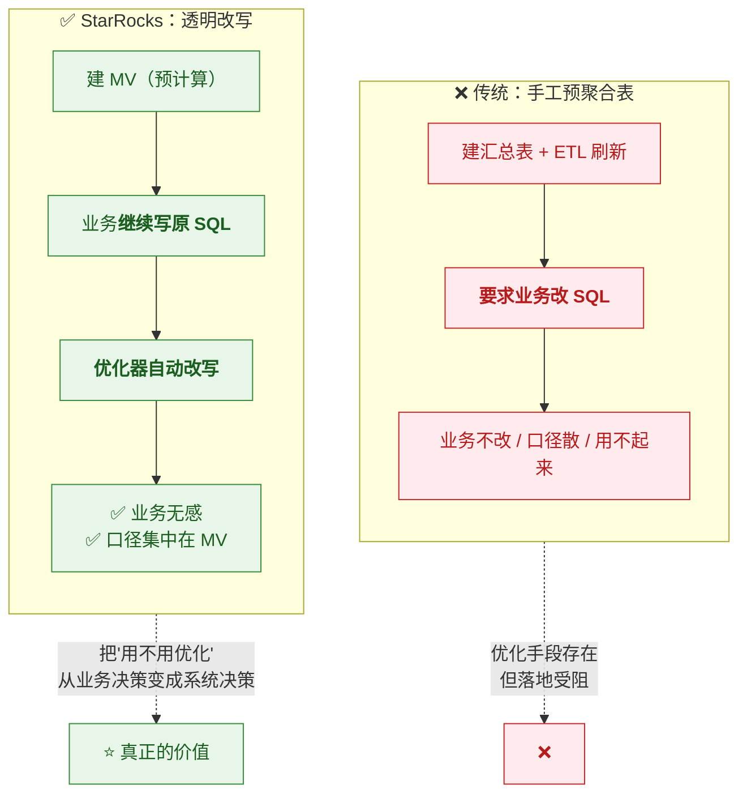
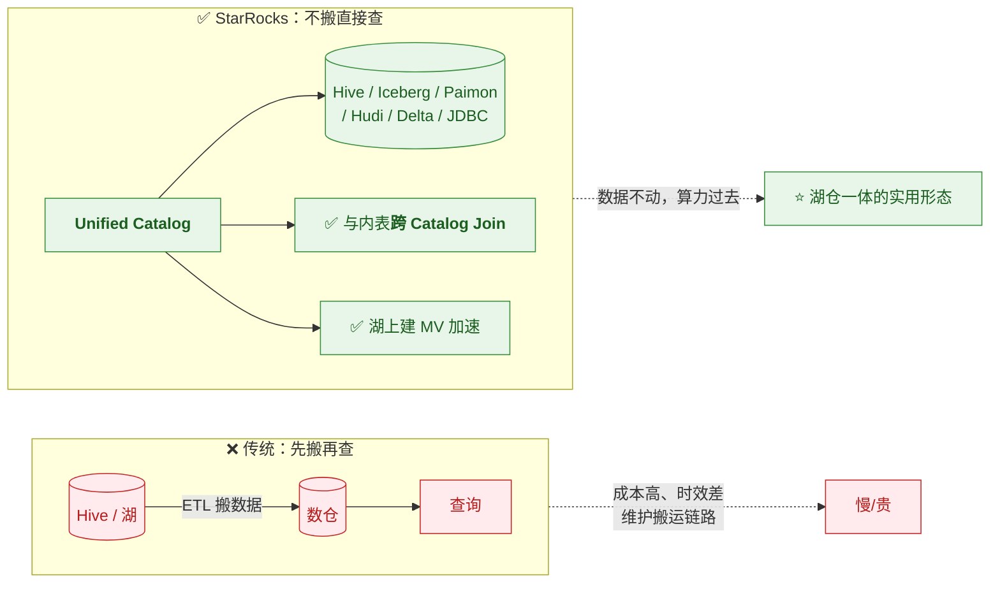
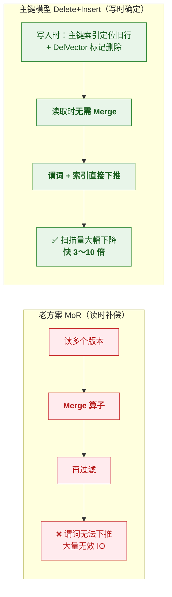

# 🎯 八、StarRocks 设计初衷与核心目标

> [!abstract] 这篇笔记回答一个问题
> **"StarRocks 为什么要从 Doris 分出来？它想解决 Doris 没解决好的什么问题？"**
>
> [[5-bigdata/1-doris/4-Doris设计初衷与核心目标|Doris 设计初衷]] 讲的是**共同的时代背景与靶心**；
> 这一篇讲的是 **StarRocks 的差异化选择**——
> 在同一个大方向下，它**在哪几件事上选了更激进的路线**，以及**为此付出了什么**。
>
> **读法**：每个决策按 **① 问题 → ② 决策 → ③ 代价** 三段看。
> 同时注意和 Doris 的**对比标注**（✅ 相同 / ⚡ 分化）。

---

## 一、共同的起点：StarRocks 与 Doris 共享同一个靶心

> [!note] 先明确"相同"的部分，再讲"不同"
> StarRocks **起源于 Apache Doris 的分支**（DorisDB，2021 年前后更名）。
> 所以它继承了 Doris 的**核心目标与大部分架构选择**：



> [!important] 面试时的正确表述
> **"StarRocks 和 Doris 共享同一个靶心——都是要做'实时数仓'。
> 它们的架构骨架几乎一样，所以会一个基本会用另一个。**
> **差别在于：在同一条路上，StarRocks 在'查询规划与加速'这几件事上选了更激进的路线。**"

---

## 二、StarRocks 的五个差异化选择

### 2.1 分化一：为什么在 CBO 优化器上投入更激进

> [!question] 问题
> 规则优化（RBO）在"数据分布不符合预期"时会**选错计划**——
> 比如把一个已经涨到 1000 万行的"小表"拿去广播，把网络打爆。
> **而分析查询的复杂度恰恰越来越高**（多表 Join、嵌套子查询、复杂表达式）。

| 维度 | 内容 |
|---|---|
| **① 问题** | 复杂查询下，**"按经验规则"选计划会频繁选错**；需要真正基于数据的代价估算 |
| **② 决策** | **CBO 基于 Cascades 框架**，在**数万个候选物理计划**中按代价选优；<br/>并持续补齐统计信息能力：**直方图（2.4）→ 多列联合统计（3.5）→ Predicate Column（3.5）** |
| **③ 代价** | ⚠️ **强依赖统计信息质量**——统计不准，CBO 反而可能不如 RBO 稳定；<br/>⚠️ 规划阶段本身有 CPU 开销；⚠️ 统计信息采集要消耗集群资源 |

```mermaid
flowchart TB
  Q["复杂查询（多表 Join + 嵌套 + 复杂表达式）"] --> RBO["<b>RBO 规则优化</b><br/>按固定启发式规则"]
  Q --> CBO["<b>CBO 代价优化</b><br/>枚举计划 → 估代价 → 选最优"]
  RBO --> R1["❌ 不懂数据分布<br/>数据一倾斜就选错"]
  CBO --> C1{"统计信息准吗？"}
  C1 -->|"准确"| C2["✅ 选到真正最优的计划"]
  C1 -->|"过期/缺失"| C3["⚠️ 也会选错<br/>（所以统计信息是关键）"]
  C2 --> GOAL["⭐ 目标：<br/><b>让优化决策基于"数据实际长什么样"</b>"]
  C3 --> FIX["所以 StarRocks 持续投入：<br/>直方图 → 多列统计 → Predicate Column"]
  FIX --> GOAL
  classDef q fill:#e8eaf6,stroke:#3949ab,color:#1a237e
  classDef bad fill:#ffebee,stroke:#c62828,color:#b71c1c
  classDef good fill:#e8f5e9,stroke:#388e3c,color:#1b5e20
  classDef warn fill:#fff3e0,stroke:#ef6c00,color:#e65100
  class Q,C1 q
  class RBO,R1,C3 warn
  class CBO,C2,GOAL,FIX good
```

> [!important] 设计目的
> **"让优化决策基于数据实际分布，而不是基于经验假设。"**
> 而这条路的**必要配套**就是**统计信息体系的持续投入**——
> 这也解释了为什么 StarRocks 在直方图、多列统计、Predicate Column 上迭代得比较勤。
>
> **面试金句**：**"CBO 的质量 = 代价模型 × 统计信息。代价模型是引擎给的，你唯一能影响的是统计信息。"**

---

### 2.2 分化二：为什么把"物化视图透明改写"做成核心卖点

> [!question] 问题
> 数仓里最贵的查询往往是**同一类**（多表 Join 出指标）。
> 传统解法是建预聚合表，然后**要求业务改写 SQL 去查汇总表**——
> 但**业务不会改、不愿改，口径还容易散**。
> **结果是：优化手段存在，但用不起来。**

| 维度 | 内容 |
|---|---|
| **① 问题** | 预聚合能加速，但**要求业务改 SQL** → 落地阻力极大 |
| **② 决策** | **让优化器自动改写**：业务继续写原 SQL，**优化器自动路由到 MV**；<br/>并把改写覆盖面做到很大：**Query Delta / View Delta Join / 聚合改写 / 嵌套 MV / Union 改写 / 复杂表达式** |
| **③ 代价** | ⚠️ **MV 占存储**；⚠️ **刷新消耗资源**；⚠️ **可能命中不了**（需 `EXPLAIN` 验证）；⚠️ **管理复杂度**（要治理不命中的 MV） |



> [!important] 设计目的（这是 StarRocks 最核心的差异化）
> **"把'要不要用优化'从一个'业务决策'变成'系统决策'。"**
>
> 这是它区别于两类对手的关键：
> - **区别于"手工预聚合表"**：业务不用改 SQL
> - **区别于 ClickHouse 的 MV**：ClickHouse 的 MV 是**写入触发器**，只处理新插入的块，**不做查询改写**；
>   StarRocks 的异步 MV 是**预计算 + 透明改写**，还能感知 UPDATE/DELETE
>
> 👉 详见 [[4-物化视图与透明改写]]

---

### 2.3 分化三：为什么把"湖仓一体"作为主攻方向

> [!question] 问题
> 企业的数据**分散在多处**：Hive 老数仓、Iceberg/Paimon 新湖、MySQL 业务库……
> 传统做法是**ETL 搬进数仓**——成本高、时效差、还要维护搬运链路。
> **但"不搬"的前提是：查询引擎要能直接、高效地查外部数据。**

| 维度 | 内容 |
|---|---|
| **① 问题** | 数据分散，**搬运成本高**；直接查外部数据的体验和性能又往往很差 |
| **② 决策** | **Unified Catalog 统一访问**（Hive/Iceberg/Hudi/Paimon/Delta Lake/JDBC）+ **跨 Catalog Join**（内表与湖表同一个 SQL）+ **湖上加速**（多级缓存、元数据缓存、**外部 Catalog 的 MV**、外部表统计信息采集） |
| **③ 代价** | ⚠️ **远端 IO 延迟**（对象存储不是本地盘）；⚠️ 小文件与元数据开销；⚠️ ⚠️ **JDBC Catalog 的 MV 不支持改写**（重要例外） |



> [!important] 设计目的
> **"数据不动，把算力送过去。"**
> 它要解决的是"**数据分散 + 搬运昂贵**"这个组织级问题，
> 而不是单纯的"查询快不快"。
>
> **这是从"数据库"走向"数据平台"的思路**——也是 StarRocks 相对纯 OLAP 引擎的定位差异。

---

### 2.4 分化四：为什么把"存算分离"做成一等公民

> [!question] 问题
> 传统存算一体（shared-nothing）下：
> - **存储与计算配比绑死**——数据涨了要加机器，但算力可能用不上；算力不够要加机器，存储又浪费
> - **扩缩容要搬数据**（重平衡），弹性差
> - **多业务共用时难以做物理隔离**
> 而云上对象存储已经**便宜且可靠**——为什么还要把数据放本地盘？

| 维度 | 内容 |
|---|---|
| **① 问题** | 存算绑定导致**成本刚性、弹性差、隔离难**；而对象存储已经很便宜 |
| **② 决策** | **shared-data 架构**：数据放对象存储，**CN（Compute Node）只做计算与缓存**；<br/>配套**多级缓存**（内存 → 本地盘 → 远端）+ **数据预取** + **持久化索引**（可落盘/对象存储）来补性能 |
| **③ 代价** | ⚠️ **冷数据回源延迟**（缓存未命中）；⚠️ **架构更复杂**；⚠️ 部分运维能力受限（如某些备份语义不同） |

```mermaid
flowchart TB
  subgraph SN["shared-nothing：存算绑定"]
    direction TB
    S1["BE：本地盘存数据 + 计算"] --> SP["❌ 存储/算力配比绑死<br/>❌ 扩容要搬数据<br/>❌ 隔离难"]
  end
  subgraph SD["shared-data：存算分离"]
    direction TB
    C1["CN：<b>只计算 + 缓存</b>"] --> OBJ[("对象存储<br/>唯一数据源")]
    C1 -.->|"多级缓存补性能"| CACHE["内存 → 本地盘<br/>+ 数据预取"]
    SD --> SP2["✅ 存储算力独立扩缩<br/>✅ 秒级弹性<br/>✅ 负载隔离好<br/>⚠️ 冷数据回源延迟"]
  end
  classDef bad fill:#ffebee,stroke:#c62828,color:#b71c1c
  classDef good fill:#e8f5e9,stroke:#388e3c,color:#1b5e20
  classDef obj fill:#eceff1,stroke:#546e7a,color:#263238
  class S1,SP bad
  class C1,CACHE,SP2 good
  class OBJ obj
```

> [!important] 设计目的与关键认知（面试必说）
> **设计目的："把存储和计算解耦，让两者独立伸缩、独立付费、独立隔离。"**
>
> ⚠️ **但必须补一句边界**：
> **"存算分离解决的是成本和弹性，不是性能。"**
> 冷数据首次访问必然付回源延迟，**所以关键是评估访问模式是不是"热数据集中"**。
>
> **这是一个成本决策，不是一个性能决策。**

---

### 2.5 分化五：为什么把更新语义做到"写时确定"

> [!question] 问题
> 实时数仓的核心诉求：**CDC 把业务库的增删改同步进来，
> 下游查询立刻看到"唯一的、正确的最新状态"**。
> 但老方案（Unique + Merge-on-Read）**读时要合并多版本**，
> 导致**谓词和索引无法下推**——查询慢。

| 维度 | 内容 |
|---|---|
| **① 问题** | 实时更新场景下，**读时合并让查询变慢**；而"最终一致"的语义又不可接受 |
| **② 决策** | **主键模型采用 Delete+Insert**：UPDATE 拆成"标记旧行删除（DelVector）+ 写入新行"，**读时无需合并** → **谓词与索引可下推**（官方口径：比 MoR **快 3～10 倍**） |
| **③ 代价** | ⚠️ **写入侧开销变高**（维护主键索引与 DelVector）；⚠️ 主键表**只支持 HASH 分桶**、主键约束多；⚠️ 主键不可改 |



> [!important] 设计目的
> **"把更新的成本从读侧（高频、面向用户）搬到写侧（低频、后台）。"**
>
> 👉 **注意这跟 Doris 是同一个思路**（Doris 叫 MoW，StarRocks 叫 Delete+Insert）——
> **术语不同，本质相同：写时确定，读时无需合并。**
> 详见 [[2-表类型与主键模型]]、[[5-bigdata/1-doris/2-数据模型]]

---

## 三、统一视角：StarRocks 的两条主线

> [!important] ⭐ 把五个分化点收敛成两条主线

```mermaid
flowchart TB
  SR["StarRocks 的差异化选择"] --> L1["主线一：<b>把"加速"做成系统能力</b>"]
  SR --> L2["主线二：<b>把"数据边界"打开</b>"]
  L1 --> A1["CBO + 统计信息<br/>（计划选得对）"]
  L1 --> A2["异步 MV + <b>透明改写</b><br/>（业务不改 SQL 就加速）"]
  L1 --> A3["Colocate / 全局字典<br/>Flat JSON / Skew Join V2"]
  L2 --> B1["Unified Catalog<br/>（不搬数据直接查）"]
  L2 --> B2["湖上加速<br/>（MV + 缓存）"]
  L2 --> B3["存算分离<br/>（数据放对象存储）"]
  A1 --> C["⭐ 共同指向：<br/><b>降低用户获得高性能的门槛</b>"]
  A2 --> C
  A3 --> C
  B1 --> C
  B2 --> C
  B3 --> C
  classDef sr fill:#e8eaf6,stroke:#3949ab,color:#1a237e
  classDef l fill:#e3f2fd,stroke:#1976d2,color:#0d47a1
  classDef item fill:#e8f5e9,stroke:#388e3c,color:#1b5e20
  classDef goal fill:#fff3e0,stroke:#ef6c00,color:#e65100
  class SR sr
  class L1,L2 l
  class A1,A2,A3,B1,B2,B3 item
  class C goal
```

| 主线 | 要解决的核心焦虑 | 具体手段 |
|---|---|---|
| **主线一：把"加速"做成系统能力** | "**优化手段有，但用户用不上**"（要改 SQL、要懂建模、要手工调优） | CBO + 统计信息、**异步 MV 透明改写**、Colocate、全局字典、Flat JSON、Skew Join V2 |
| **主线二：把"数据边界"打开** | "**数据散在多个系统，搬来搬去成本高**" | Unified Catalog、湖上加速、存算分离 |

> [!success] 一句话总结 StarRocks 的设计哲学
> **"让用户在不改 SQL、不搬数据、不深度调优的前提下，拿到接近极致调优的性能。"**
>
> 对比 Doris 的哲学（**"把成本从查询侧搬到写入侧和设计侧"**）——
> 两者是同源的，但 **StarRocks 更强调"系统替用户做优化决策"**。

---

## 四、诚实的边界：StarRocks 为了这些选择付出了什么

> [!warning] 每个激进的路线都有代价
> 面试时主动说出边界，比只讲优点更可信。

| 领域 | 代价 / 不擅长 |
|---|---|
| **CBO 依赖统计信息** | 统计信息不准时，**CBO 可能反而不如规则优化稳定**；统计采集本身消耗资源 |
| **MV 的管理成本** | MV **占存储 + 消耗刷新资源**；**不命中的 MV 是纯浪费**，需要持续治理 |
| **湖上查询** | **远端 IO 延迟**、小文件与元数据开销；⚠️ **JDBC Catalog 的 MV 不支持改写** |
| **存算分离** | **冷数据回源延迟**，性能依赖缓存命中率；架构更复杂；部分运维能力受限 |
| **主键模型** | **写入开销更高**（维护索引与 DelVector）；**只支持 HASH 分桶**；主键不可改 |
| **整体** | 与 Doris 同源，**功能边界两家都在快速演进**——任何"谁更强"的结论半年后可能反转 |

> [!important] 面试怎么用这张表
> **"StarRocks 在'查询加速'和'湖仓一体'上投入更激进，代价是系统更复杂、
> 对统计信息和 MV 治理的要求更高。**
> **它不是全面更优，而是把筹码更多押在了'让系统替用户做优化'这条路上。**"

---

## 五、30 秒速查

| 问题 | 答案 |
|---|---|
| StarRocks 与 Doris 的共同靶心 | **实时写入 + 高并发查询 + 多表 Join + 易运维** |
| 两者关系 | **同源**（StarRocks 起源于 Doris 分支），架构骨架相同，**独立演进** |
| 五个分化点 | **CBO 优化器 / 物化视图透明改写 / 湖仓一体 / 存算分离 / 更新语义** |
| 为什么 CBO 投入更激进 | 复杂查询下**规则优化会选错计划**；要**基于数据实际分布**决策 |
| CBO 的必要配套 | **统计信息体系**（直方图 → 多列联合 → Predicate Column） |
| 透明改写的核心价值 | **把"要不要用优化"从业务决策变成系统决策**——业务不改 SQL |
| 透明改写区别于手工预聚合表 | 业务**不用改 SQL** |
| 透明改写区别于 ClickHouse MV | ClickHouse 的 MV 是**写入触发器**，不做查询改写 |
| 湖仓一体的设计目的 | **"数据不动，把算力送过去"**——解决数据分散 + 搬运昂贵 |
| 湖仓的关键能力 | **Unified Catalog + 跨 Catalog Join + 湖上 MV 加速** |
| 存算分离的设计目的 | **存储与计算解耦**：独立伸缩、独立付费、独立隔离 |
| 存算分离的关键认知 | ⚠️ **是成本与弹性决策，不是性能决策**；冷数据回源有延迟 |
| 主键模型的设计目的 | **把更新成本从读侧搬到写侧**（Delete+Insert，读时无需合并） |
| 与 Doris 更新语义的关系 | **术语不同、本质相同**（Doris 叫 MoW） |
| 两条主线 | **① 把"加速"做成系统能力 ② 把"数据边界"打开** |
| 一句话设计哲学 | **让用户在不改 SQL、不搬数据、不深度调优的前提下拿到接近极致的性能** |
| StarRocks 付出的代价 | 依赖统计信息、MV 治理成本、远端 IO、冷启动延迟、写入开销 |

---

## 六、学习检查清单

- [ ] 能说清 StarRocks 与 Doris **共享哪些设计**（至少五条）、**在哪五个点上分化**
- [ ] ⭐ 能解释"为什么要在 CBO 上投入更激进"，以及它的**必要配套是统计信息**
- [ ] ⭐ 能讲清**透明改写的真正价值**（把优化从业务决策变成系统决策）
- [ ] 能说清透明改写**区别于手工预聚合表**、**区别于 ClickHouse MV** 的地方
- [ ] 能解释湖仓一体的设计目的（**数据不动、算力过去**）
- [ ] 能说清存算分离的目的，并**主动补上"它是成本决策不是性能决策"**
- [ ] 能讲清主键模型 Delete+Insert 的设计目的，并说出**它与 Doris MoW 的关系**
- [ ] ⭐ 能把五个分化点收敛成**两条主线**
- [ ] 能用一句话总结 StarRocks 的设计哲学，并与 Doris 的哲学做对比
- [ ] 能诚实说出 StarRocks **为这些选择付出的代价**

---
> 关联：[[0-StarRocks总览]] · [[1-架构与存算分离]] · [[2-表类型与主键模型]] · [[3-CBO优化器与统计信息]] · [[4-物化视图与透明改写]] · [[9-StarRocks细节设计的目的]]
> 对照：[[5-bigdata/1-doris/4-Doris设计初衷与核心目标]] · [[5-bigdata/1-doris/9-对比StarRocks与ClickHouse]]
