# 🔬 九、StarRocks 细节设计的目的

> [!abstract] 这篇笔记回答一个问题
> **"StarRocks 每一个具体机制，到底是为了解决什么问题而存在的？"**
>
> [[8-StarRocks设计初衷与核心目标]] 讲**宏观设计哲学**；
> 这一篇**下沉到每个机制**，按 **① 问题 → ② 设计决策 → ③ 代价与边界** 逐条拆解。
>
> **和 Doris 篇的关系**：[[5-bigdata/1-doris/12-Doris细节设计的目的|Doris 细节设计的目的]]
> 讲的是**共通机制**（列存、排序键、索引、分桶、向量化等，两家基本一致）；
> **本篇只讲 StarRocks 特有或重点投入的机制**，不重复共通部分。

---

## 一、存储与更新类设计

### 1.1 主键模型：Delete + Insert

> [!question] 它要解决什么问题？
> **实时数仓最核心的诉求**：CDC 把业务库的增删改同步进来，
> 下游查询要**立刻看到"唯一的、正确的最新状态"**。
>
> 但老方案（Unique + Merge-on-Read）**读时要合并多版本**，
> 因为有 **Merge 算子**，**谓词与索引无法下推到存储层** → 必须先合并再过滤 → **大量无效 IO**。

| 维度 | 内容 |
|---|---|
| **① 问题** | 实时更新 + 正确语义 + 查询快，**三者难兼得**；读时合并让查询性能崩 |
| **② 决策** | **UPDATE 拆成"标记旧行删除 + 写入新行"**：<br/>用**主键索引**（HashMap：主键 → 行位置）定位旧行；<br/>用 **DelVector** 记录删除标记；新行写入新文件，索引指向新位置 |
| **③ 代价** | ⚠️ **写入开销更高**（要维护索引与 DelVector）；<br/>⚠️ **只支持 HASH 分桶**，主键须含分区列与分桶列；<br/>⚠️ **主键不可修改、主键值不可更新** |

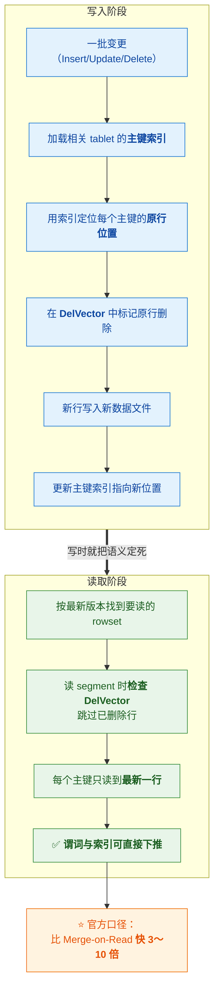

> [!success] 一句话讲清目的
> **"把更新的成本从读侧搬到写侧。"**
> 因为**写只有一次，读可能有成千上万次**；
> 而且读是**面向几百个用户的实时请求**，写是**后台批量任务**。
>
> ⚠️ **关键澄清**：快的根本原因**不是"省了去重计算"**，而是
> **"消除了 Merge 算子 → 谓词与索引可以下推"**。
> 这是架构差异，**调参弥补不了**。

---

### 1.2 持久化主键索引

> [!question] 它要解决什么问题？
> 主键模型要维护"主键 → 行位置"的 HashMap 索引。
> 如果**全部放内存**，数据量大时（比如几十亿主键）**内存会被索引吃光**——
> 而内存要留给查询、缓存和 Compaction。
> **但索引落盘又怕变慢。**

| 维度 | 内容 |
|---|---|
| **① 问题** | 主键索引**占大量内存**，与查询/缓存争资源 |
| **② 决策** | `enable_persistent_index`（**默认 true**）：**大部分索引落盘**，只少量驻内存；<br/>3.1.4+ 可持久化到**本地盘**，3.3.2+ 可持久化到**对象存储** |
| **③ 代价** | 落盘索引的访问比纯内存略慢（官方口径：**性能接近**全内存索引） |

> [!important] 设计目的
> **"用可接受的性能损失，换回大量内存。"**
> 这是一个典型的"**资源置换**"设计——而且默认开启，
> 说明官方判断：**省内存的收益 > 索引落盘的开销**。

---

### 1.3 排序键与主键解耦（3.0+）

> [!question] 它要解决什么问题？
> **3.0 之前**：排序键 = 主键。
> 但这两者的**优化目标天然冲突**：
> - **主键**是为了**唯一性语义**（业务主键，可能是 `order_id`）
> - **排序键**是为了**查询加速**（高频过滤列，可能是 `dt + merchant_id`）
>
> 结果是：**主键设计被迫在"业务正确"和"查询性能"之间妥协**。

| 维度 | 内容 |
|---|---|
| **① 问题** | 主键（业务语义）与排序键（查询性能）**优化目标不同，却被迫绑死** |
| **② 决策** | **3.0 起用 `ORDER BY` 单独指定排序键**，与主键解耦；<br/>前缀索引基于排序键构建 |
| **③ 代价** | ⚠️ **排序键不支持删除**；⚠️ **不支持修改排序列的数据类型**（可用 `ALTER ... ORDER BY` 改） |

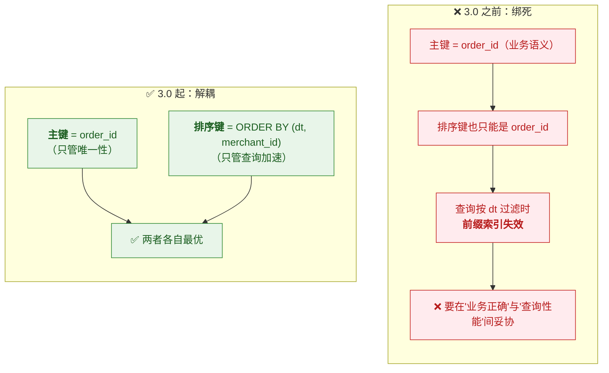

> [!important] 设计目的
> **"让'唯一性'和'查询性能'这两个正交的需求各自优化，不再互相牵制。"**
>
> **面试金句**：**"建表时我把主键和排序键分开考虑——
> 主键管业务语义，排序键管查询加速（高频过滤列往前放吃前缀索引）。3.0 之前这两件事是绑死的。"**

---

### 1.4 部分列更新

> [!question] 它要解决什么问题？
> **用户画像/标签宽表**场景：一个用户宽表有几十上百列，
> 数据来自**多个系统**（购物 App 更新消费金额、物流 App 更新地址、风控系统更新标签）。
> 如果每次都要**提供全部列**才能更新，那每个系统都得拿到完整数据——**不现实**。

| 维度 | 内容 |
|---|---|
| **① 问题** | 多源系统各自只负责**部分列**，但更新需要整行 |
| **② 决策** | **部分列更新**：只需提供**主键 + 要改的列**，其余列保持原值 |
| **③ 代价** | ⚠️ **NULL 语义歧义**（传 NULL 是"设为空"还是"保持原值"？**生产事故常见来源**）；<br/>⚠️ **写放大**（要读旧值补全）；⚠️ 需显式开启、语法随版本变化 |

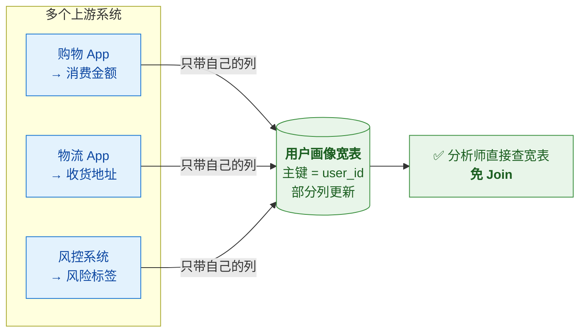

> [!important] 设计目的
> **"让多个上游系统能各自更新自己负责的列，共同拼出一张宽表。"**
> 价值有两层：① **提升多维分析性能**（宽表免 Join）
> ② **简化分析模型**（分析师不用理解多个数据源的 Join 关系）

---

## 二、优化器类设计

### 2.1 CBO 与 Cascades 框架

> [!question] 它要解决什么问题？
> **规则优化（RBO）不懂数据**——它按固定启发式规则决策
> （"小表应该广播"、"谓词一定下推"）。
> 但数据分布是**会变的**：昨天的小表今天可能涨到 1000 万行。
> **规则在数据分布特殊时会选错计划，而且错得很离谱。**

| 维度 | 内容 |
|---|---|
| **① 问题** | 复杂查询下，**基于规则的决策会选错计划** |
| **② 决策** | **CBO 基于 Cascades 框架**：改写逻辑计划 → 枚举**数万个物理计划** → 估算每个算子代价（CPU/内存/网络/IO）→ 选最低的 |
| **③ 代价** | ⚠️ **强依赖统计信息准确性**；⚠️ 规划阶段有 CPU 开销；⚠️ 统计采集消耗集群资源 |

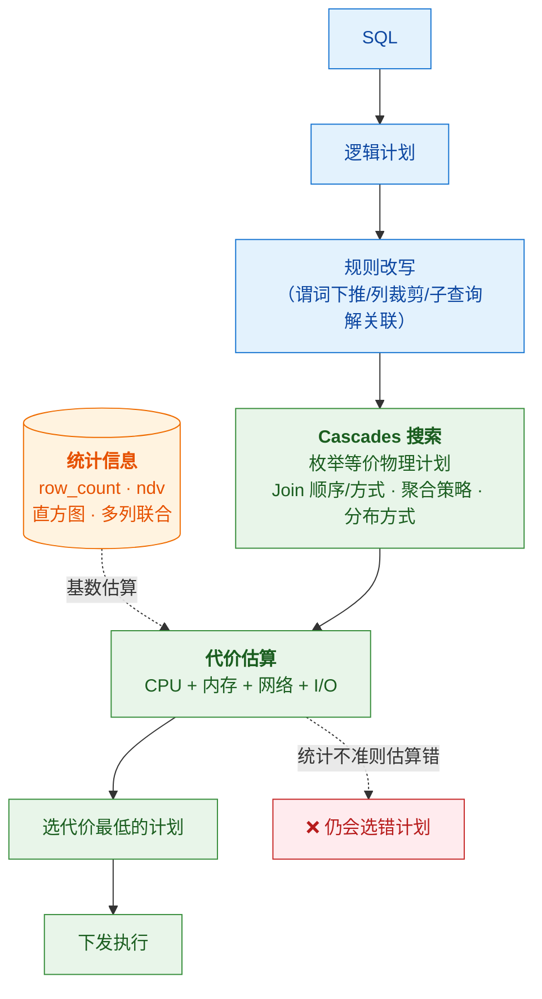

> [!important] 设计目的与关键认知
> **"让优化决策基于数据实际分布，而不是基于经验假设。"**
>
> ⭐ **由此推出的核心认知**：
> **CBO 的质量 = 代价模型 × 统计信息。**
> 代价模型是引擎写好的，**用户唯一能影响的就是统计信息**。
> **所以"优化器选错计划，九成是统计信息的问题"**——这是排查的起点。

---

### 2.2 直方图

> [!question] 它要解决什么问题？
> **基础统计的致命盲区**：`ndv` 只知道"有多少个不同值"，**不知道值怎么分布**。
>
> **经典翻车**：
> ```sql
> -- user_id 有 1000 万个不同值（ndv = 1000 万）
> WHERE user_id = 'test_user'   -- 但这一行占了全表 30%！
> ```
> 优化器按均匀分布估算：命中率 1/1000万 → 以为只返回几行 → **可能选 Nested Loop Join**。
> 实际返回**几百万行** → **计划彻底选错**。

| 维度 | 内容 |
|---|---|
| **① 问题** | `ndv` 无法表达**数据倾斜** → 基数估算严重失真 |
| **② 决策** | **等高分桶直方图**（每桶装相同数据量）+ **MCV**（高频值单独分桶） |
| **③ 代价** | ⚠️ **不是所有列都该建**——只对**倾斜 + 高频查询**的列；均匀分布不需要；<br/>⚠️ **字符串列只收集 MCV、不收集分桶**；⚠️ **不在自动采集范围内**（需手动） |

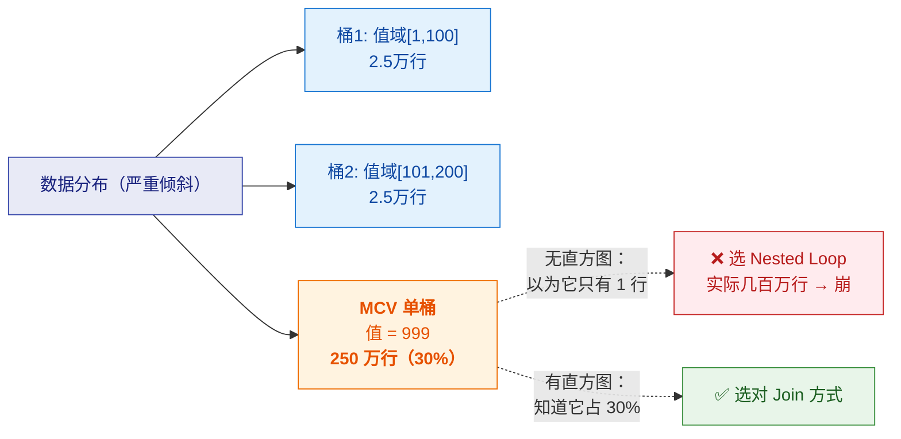

> [!important] 设计目的
> **"让优化器知道'某个值特别多'，从而修正基数估算。"**
> 它是**专门为数据倾斜场景设计的补丁**——所以**均匀分布的数据不需要它**。

---

### 2.3 多列联合统计

> [!question] 它要解决什么问题？
> **优化器的默认假设是"多列完全独立"**，但现实中经常不成立：
> ```sql
> WHERE city = '杭州' AND province = '浙江'
> -- 独立假设：1% × 5% = 0.05%
> -- 实际：杭州必属浙江 → 1%     （差 20 倍！）
> ```
> 优化器**严重低估结果集** → 选错 Join 方式或顺序。

| 维度 | 内容 |
|---|---|
| **① 问题** | 列之间存在**相关性**，但优化器假设独立 → 多条件估算严重偏差 |
| **② 决策** | **多列联合统计**（3.5.0+）：采集**联合 NDV**，用于多 AND 等值谓词、Agg 节点、聚合下推策略的估算 |
| **③ 代价** | ⚠️ **仅支持手动采集**（默认采样）；⚠️ 目前**只支持联合 NDV**；⚠️ 手采列数上限默认 **10** |

> [!important] 设计目的
> **"让优化器知道'这几列不是独立的'，修正多条件查询的基数估算。"**
> 它和直方图是**两个不同维度**的补丁：
> - **直方图**治**单列的分布不均**（倾斜）
> - **多列联合统计**治**列之间的相关性**

---

### 2.4 Predicate Column

> [!question] 它要解决什么问题？
> **大宽表可能有几百列，全量采集所有列的统计信息开销极大**。
> 但实际稳定 workload 下，**你只需要少数关键列的统计**——
> 那些出现在 **WHERE / JOIN / GROUP BY / DISTINCT** 里的列。
> **为几百列都采统计，是巨大的浪费。**

| 维度 | 内容 |
|---|---|
| **① 问题** | 大宽表**全列采集统计成本过高**，而大部分列根本没被当作谓词用过 |
| **② 决策** | **自动记录高频谓词列**（Predicate Column），存入 `_statistics_.predicate_columns`；<br/>**当表列数超阈值（默认 32）时，只采集这些列的统计** |
| **③ 代价** | ⚠️ 记录与同步本身有开销（有 TTL 与持久化间隔）；⚠️ 对"列使用模式突变"的场景需要适应期 |

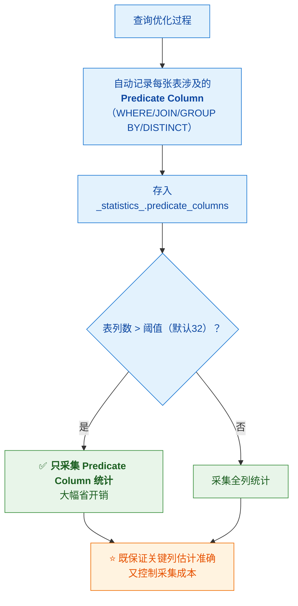

> [!success] 设计目的（这个思想很值得学）
> **"把有限的采集资源，投到对查询计划影响最大的列上。"**
>
> **这和数仓里的"指标分级"是同一个思路**：
> 不是所有东西都值得同等投入，**分级才能既控制成本、又保住关键路径的质量**。
> 参见 [[1-java/10-数据仓库/3-指标体系与口径治理]]

---

## 三、物化视图与改写类设计

### 3.1 异步 MV 与透明改写

> [!question] 它要解决什么问题？
> 预聚合能加速，**但要求业务改写 SQL** → 业务不改、口径散、优化手段用不起来。
> **问题是：优化手段存在，却没人用。**

| 维度 | 内容 |
|---|---|
| **① 问题** | 预聚合的落地阻力在"**要业务配合**"，而不是技术不可行 |
| **② 决策** | **优化器自动改写**：业务写原 SQL，系统自动路由到 MV（算法基础 **SPJG**）；<br/>**内表场景保证强一致**——改写结果与直查基表一致 |
| **③ 代价** | ⚠️ **MV 占存储 + 刷新增耗资源**；⚠️ **可能命中不了**（需 `EXPLAIN` 验证）；⚠️ 需要治理不命中的 MV |

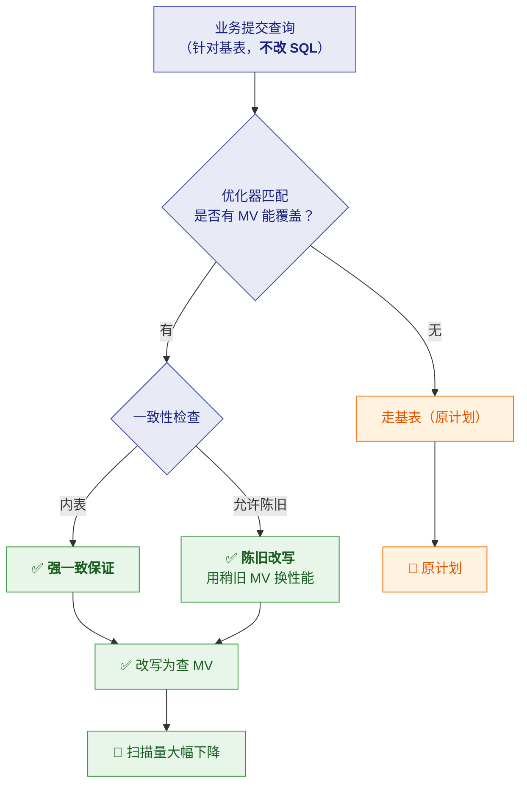

> [!important] 设计目的
> **"把'要不要用优化'从业务决策变成系统决策。"**
> 这是 StarRocks 最核心的差异化价值。

---

### 3.2 View Delta Join（大宽表杀手锏）

> [!question] 它要解决什么问题？
> 星型模型下，BI 查询的**表组合千变万化**：
> 有时 Join 2 张、有时 3 张、有时 5 张。
> 传统做法是**为每种组合建一个汇总表 → 组合爆炸，根本维护不过来**。

| 维度 | 内容 |
|---|---|
| **① 问题** | 查询的 Join 表组合**多变**，逐个建汇总表会**组合爆炸** |
| **② 决策** | **建一张"Join 所有表"的大宽表 MV**，让它能回答**其子集**的查询（需满足**基数保持**条件） |
| **③ 代价** | ⚠️ **必须满足基数保持（1:1 Join）**——实践上要给维表声明 **`unique_constraints`**，优化器才能识别；⚠️ MV 本身占存储 |

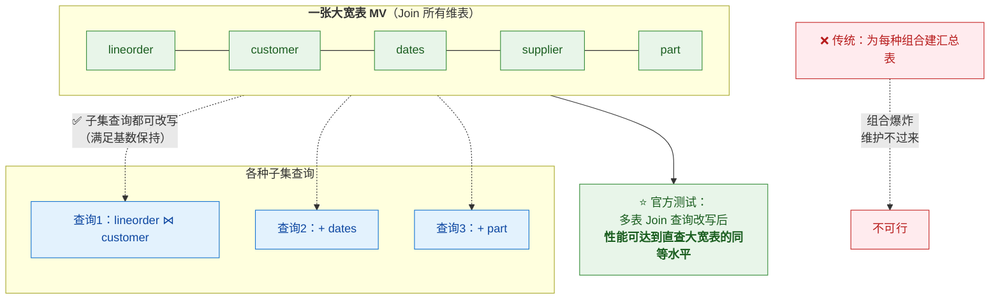

> [!important] 设计目的
> **"用一张大宽表 MV，替代'为每种查询组合各建一张汇总表'的组合爆炸。"**
> 这是**用"一次预计算"覆盖"大量查询组合"**的典型设计——
> 也解释了为什么它被称作大宽表场景的杀手锏。

---

### 3.3 Union 改写（冷热分离）

> [!question] 它要解决什么问题？
> MV 要加速，但如果**为几年历史数据都做预聚合**，存储成本会很高——
> 而**历史数据实际上很少被查**。
> **矛盾：想加速就得预聚合，但预聚合全量历史太贵。**

| 维度 | 内容 |
|---|---|
| **① 问题** | 全量历史都预聚合 → **存储成本高**，但冷数据其实很少查 |
| **② 决策** | **Union 改写 + MV 分区 TTL**：热数据走 MV（预聚合、快），冷数据回落基表 |
| **③ 代价** | ⚠️ 冷数据查询仍然慢（要走基表）；⚠️ 需要合理设定 TTL 边界；⚠️ 改写逻辑依赖 TTL 配置正确 |

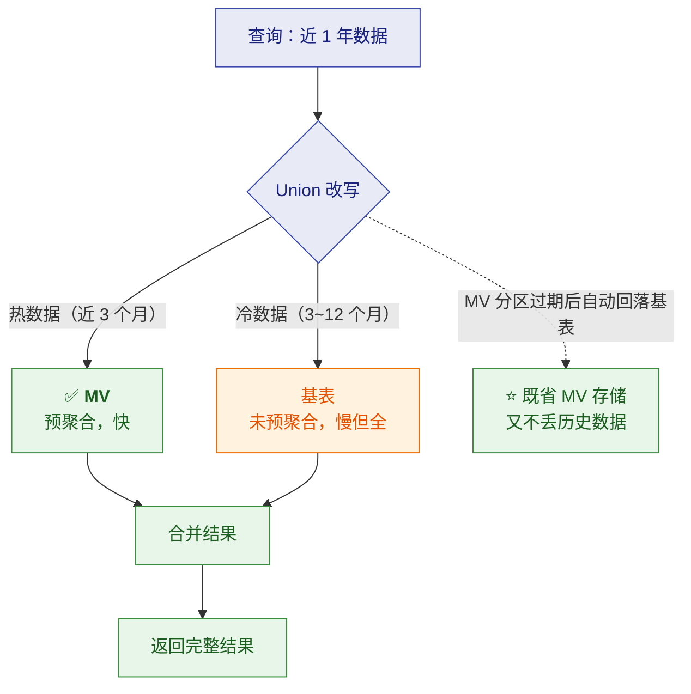

> [!important] 设计目的
> **"只为热数据付预聚合的成本，历史数据保持原始形态。"**
> 而且**对用户完全透明**——业务不需要知道"哪些数据走了 MV、哪些走了基表"。

---

### 3.4 陈旧改写（Staleness）

> [!question] 它要解决什么问题？
> 有些表**数据频繁变化**，如果 MV 严格保持最新，**刷新会过于频繁**——
> 消耗大量资源，还可能**刷新永远追不上变化**，导致 MV 根本用不上。

| 维度 | 内容 |
|---|---|
| **① 问题** | 数据频繁变化时，**严格最新的 MV 刷新成本过高**，甚至无法有效复用 |
| **② 决策** | **允许容忍一定程度的数据过期**，复用稍旧但可用的 MV 结果 |
| **③ 代价** | ⚠️ **结果可能是略旧的数据**——**对账、结算类场景绝对不能容忍** |

> [!important] 设计目的与边界（面试重点）
> **"把'数据新鲜度'也当成一个可调的资源。"**
>
> ⭐ **但必须说清适用边界**：
> - ✅ **可以容忍**：看板、日报、趋势分析（数据晚 10 分钟没人受伤）
> - ❌ **不能容忍**：对账、结算、实时监控（**宁可慢也不能错**）
>
> **这是一个业务判断，不是技术参数问题** —— 能说出这句，面试官会觉得你有分寸感。

---

## 四、查询加速类设计

### 4.1 Colocate Join

> [!question] 它要解决什么问题？
> 分布式 Join 最贵的是**网络传输（Shuffle）**——
> 要 Join 的两行数据可能在不同机器，必须搬运。
> **如果两张表"经常 Join"，能不能让它们的数据一开始就放在一起？**

| 维度 | 内容 |
|---|---|
| **① 问题** | Join 需要跨节点搬运数据，**网络是分布式 Join 的主要成本** |
| **② 决策** | 让**常 Join 的表**同属一个 **Colocate Group**、**分桶键与分桶数一致** → **相同 Join 键的数据本就在同一节点** → **本地 Join、零 Shuffle** |
| **③ 代价** | ⚠️ **必须在建表时设计好**（分桶键/分桶数建后改代价大）；⚠️ 条件严格（副本数也要一致） |

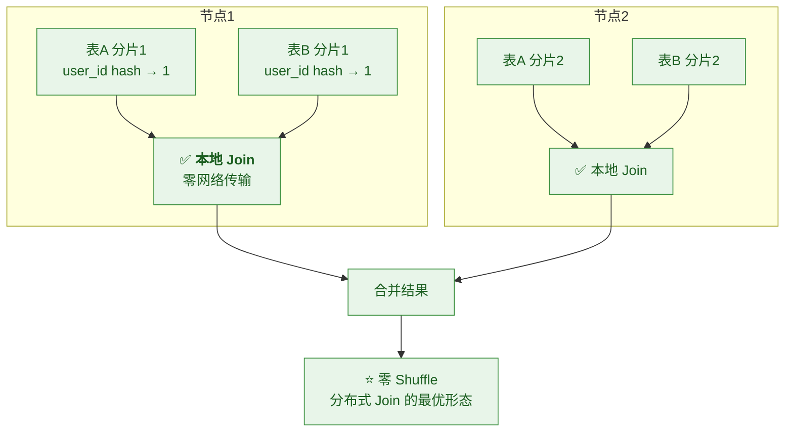

> [!important] 设计目的
> **"把'运行时的网络搬运'变成'建表时的数据布局'。"**
> 这是**成本搬运三（运行时 → 建表时）**最典型的例子：
> **用一次性的设计成本，换掉每次查询的网络成本。**
>
> **由此推出**：设计阶段就要识别"哪些表会频繁 Join"。

---

### 4.2 全局字典

> [!question] 它要解决什么问题？
> `COUNT(DISTINCT user_id)` 或按字符串列 Join 时，
> **要比较和哈希字符串**——比整型慢得多，还占更多内存与网络带宽。
> 而分析场景里**高基数字符串列的去重统计非常常见**。

| 维度 | 内容 |
|---|---|
| **① 问题** | **字符串列的 `COUNT(DISTINCT)` 与 Join 昂贵**（比较/哈希/传输都按字符串来） |
| **② 决策** | **全局字典**：把字符串映射成整型编码，存储与计算都按整型进行；<br/>官方还提供 **配合 `AUTO INCREMENT`** 加速 `COUNT(DISTINCT)` 与 Join 的路径 |
| **③ 代价** | ⚠️ 需要维护字典（构建与一致性）；⚠️ **低基数列收益有限**；⚠️ 具体语法与限制随版本变化 |


> [!important] 设计目的
> **"把昂贵的字符串运算，替换成廉价的整型运算。"**
> 收益最大的场景：**高基数、字符串列的 `COUNT(DISTINCT)`**。

---

### 4.3 Flat JSON

> [!question] 它要解决什么问题？
> 埋点/日志这类数据是**半结构化的**（字段不固定），所以用 JSON 存。
> 但把 JSON 整个存成一列时：
> - ❌ 每次查询都要**运行时解析 JSON**
> - ❌ **无法列裁剪**（整个 JSON 是一列）
> - ❌ **无法为其中的字段建索引、做统计**

| 维度 | 内容 |
|---|---|
| **① 问题** | JSON 整列存储 → **运行时解析 + 无法列裁剪 + 无法建索引** |
| **② 决策** | **Flat JSON**：把 JSON 里**高频访问的字段提取成独立列**存储，其余保留在 JSON 列 |
| **③ 代价** | ⚠️ 需要识别"哪些字段高频"；⚠️ 字段打平后表结构变宽；⚠️ 字段频繁变化的场景收益下降 |

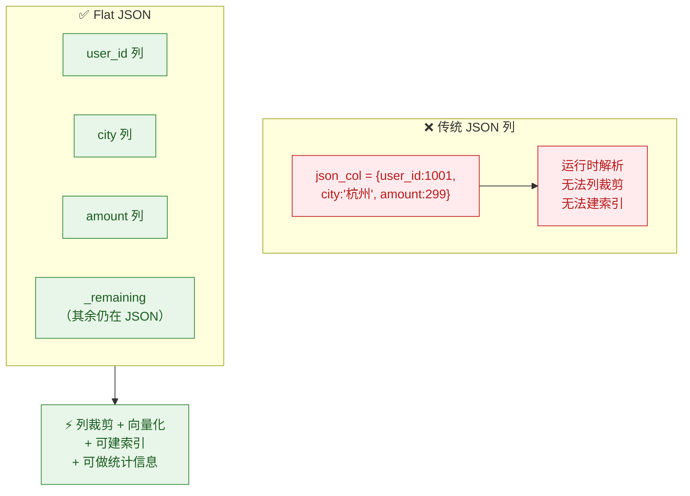

> [!important] 设计目的
> **"兼顾 JSON 的灵活性与列存的性能。"**
> 它比"全部打平成固定列"**灵活**，比"整个 JSON 存一列"**快**——
> 是一个**刻意的折中设计**。

---

### 4.4 Skew Join V2

> [!question] 它要解决什么问题？
> Join 时如果某个 key 的数据量特别大（如 `NULL`、或某个大客户），
> 会导致**个别 instance 处理量远超其他**——整个查询被最慢的那个拖住（**木桶效应**），
> **并行度被浪费**。

| 维度 | 内容 |
|---|---|
| **① 问题** | **数据倾斜**导致并行度失效——加机器也没用 |
| **② 决策** | **Skew Join V2**：识别**热点 key**，对其数据做**单独拆分处理**，而不是全塞进一个 instance |
| **③ 代价** | ⚠️ 并非万能——**根因可能在建模**（分桶键选择不当）；⚠️ 需要先确认真的是倾斜 |

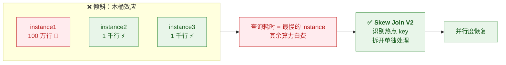

> [!important] 设计目的与更重要的提醒
> **"让倾斜的数据不再拖累整个查询的并行度。"**
>
> ⚠️ **但面试更该强调的是**：
> **遇到慢查询，第一步是"确认是不是倾斜"**（看 `PROFILE` 里各 instance 的行数/耗时分布），
> **而不是直接上 Skew Join**——
> 因为**倾斜的根因往往在建模**（分桶键选了热点字段），
> **治建模比治查询更根本。**

---

## 五、湖仓类设计

### 5.1 Unified Catalog

> [!question] 它要解决什么问题？
> 企业数据分散在 Hive、Iceberg、Paimon、MySQL……
> 传统做法是**ETL 搬进数仓**——成本高、时效差、还要维护搬运链路。
> **但"不搬"的前提是：查询引擎要能直接、统一地访问这些外部数据。**

| 维度 | 内容 |
|---|---|
| **① 问题** | 数据分散 + **搬运成本高**；直接查外部数据体验差 |
| **② 决策** | **Unified Catalog 统一访问**（Hive/Iceberg/Hudi/Paimon/Delta Lake/JDBC）<br/>+ **跨 Catalog Join**（内表与湖表同一 SQL）<br/>+ **湖上加速**（多级缓存、元数据缓存、**外部 Catalog 的 MV**、外部表统计采集） |
| **③ 代价** | ⚠️ **远端 IO 延迟**；⚠️ 小文件与元数据开销；<br/>⚠️ ⚠️ **JDBC Catalog 的 MV 不支持改写**（重要例外） |

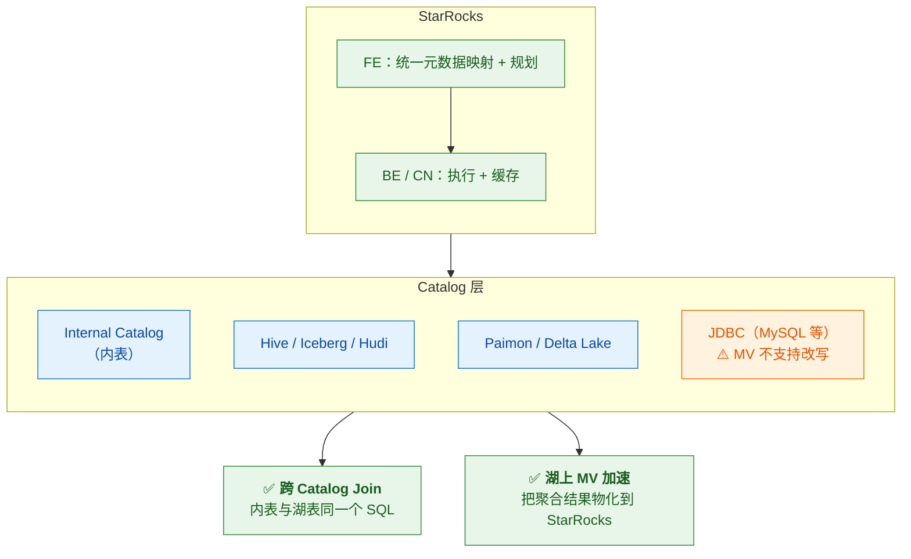

> [!important] 设计目的
> **"数据不动，把算力送过去。"**
> 这是**从"数据库"走向"数据平台"**的思路转变——
> 解决的是**组织级的数据分散问题**，而不是单纯的查询性能。

---

### 5.2 多级缓存（存算分离的性能补偿）

> [!question] 它要解决什么问题？
> 存算分离把数据放到远端对象存储，**成本与弹性都好了**，
> 但**远端读取延迟高**——这是它最大的代价。
> **如果不解决，存算分离就只能用于对延迟不敏感的场景。**

| 维度 | 内容 |
|---|---|
| **① 问题** | 存算分离后**冷数据回源延迟高**，影响查询体验 |
| **② 决策** | **多级缓存**（内存 → 本地磁盘 → 远端存储）+ **数据预取**；<br/>建表时可开缓存（同时写本地盘与对象存储） |
| **③ 代价** | ⚠️ **性能取决于缓存命中率**；⚠️ 冷数据首次访问**必然付回源延迟**；⚠️ 本地缓存盘需 SSD |

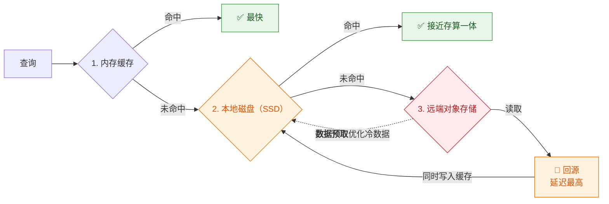

> [!important] 设计目的与关键认知
> **"用多级缓存，把'远端延迟'这个代价压到可接受范围。"**
>
> ⭐ **但面试必须补一句**：
> **"存算分离的性能取决于缓存命中率。热数据集中时性能接近存算一体，
> 但冷数据首次访问必然付回源延迟。所以这是一个成本与弹性决策，不是性能优化。"**

---

## 六、总表：StarRocks 每个机制"为了什么"

> [!important] ⭐ 可直接当面试速查表用

| 机制 | 解决的问题 | 核心目的 | 主要代价 |
|---|---|---|---|
| **主键模型（Delete+Insert）** | 实时更新 + 正确语义 + 查询快难兼得 | **把更新成本从读侧搬到写侧**，让谓词可下推 | 写入开销高、分桶与主键约束多 |
| **持久化主键索引** | 索引占大量内存 | **用可接受的性能损失换回内存** | 落盘索引略慢（官方称接近） |
| **排序键与主键解耦** | 业务语义与查询性能被迫绑死 | **两个正交需求各自优化** | 排序键不可删除、列类型不可改 |
| **部分列更新** | 多源系统各自只负责部分列 | **让多流共同拼出一张宽表** | NULL 语义歧义、写放大 |
| **CBO + Cascades** | 规则优化不懂数据、会选错计划 | **基于数据实际分布决策** | 强依赖统计信息质量 |
| **直方图** | `ndv` 无法表达倾斜 | **修正倾斜场景的基数估算** | 只对该建的列建、需手动 |
| **多列联合统计** | 列相关性被忽略 | **修正多条件查询的估算** | 仅手动、目前只支持联合 NDV |
| **Predicate Column** | 大宽表全列采统计太贵 | **把采集资源投到关键列** | 记录开销、需适应期 |
| **异步 MV + 透明改写** | 预聚合要求业务改 SQL | **把优化从业务决策变成系统决策** | 占存储、可能不命中 |
| **View Delta Join** | 查询组合多变 → 汇总表组合爆炸 | **一张宽表 MV 覆盖大量子集查询** | 需基数保持条件 |
| **Union 改写** | 全量历史预聚合太贵 | **只为热数据付预聚合成本** | 冷数据仍慢 |
| **陈旧改写** | 频繁变化导致刷新过频 | **把数据新鲜度当作可调资源** | 结果可能略旧（对账不可用） |
| **Colocate Join** | Join 的网络搬运成本 | **把运行时搬运变成建表时布局** | 必须建表时设计好 |
| **全局字典** | 字符串 DISTINCT/Join 昂贵 | **把字符串运算换成整型运算** | 需维护字典、低基数收益小 |
| **Flat JSON** | JSON 整列存的解析与索引困境 | **兼顾灵活性与列存性能** | 需识别高频字段、表变宽 |
| **Skew Join V2** | 数据倾斜浪费并行度 | **让热点数据不拖累整体** | 根因常在建模，需先诊断 |
| **Unified Catalog** | 数据分散、搬运成本高 | **数据不动，算力过去** | 远端 IO、JDBC MV 不改写 |
| **多级缓存** | 存算分离的远端延迟 | **把远端延迟压到可接受** | 依赖缓存命中率 |

---

## 七、30 秒速查

| 问题 | 答案 |
|---|---|
| 主键模型的核心目的是什么 | **把更新成本从读侧搬到写侧**（Delete+Insert，读时无需 Merge） |
| 它为什么快 3～10 倍 | **消除了 Merge 算子 → 谓词与索引可下推**（不是"省了去重计算"） |
| 持久化主键索引的目的 | **换回内存**（默认开启，性能接近全内存） |
| 排序键解耦解决什么 | **主键管唯一性、排序键管查询加速**，不再互相牵制 |
| 部分列更新解决什么 | **多源系统各自更新部分列，共同拼出宽表**；最大坑是 **NULL 语义** |
| CBO 的目的 | **基于数据实际分布选计划**，而非经验规则 |
| CBO 的关键认知 | **CBO 质量 = 代价模型 × 统计信息**；用户只能影响统计信息 |
| 直方图治什么 | **单列数据倾斜**造成的基数估算失真 |
| 多列联合统计治什么 | **列之间相关性**造成的多条件估算偏差 |
| Predicate Column 的设计思想 | **把有限采集资源投到对计划影响最大的列**（类似指标分级） |
| 透明改写的目的 | **把"要不要用优化"从业务决策变成系统决策** |
| View Delta Join 的目的 | **一张宽表 MV 覆盖大量子集查询**，避免"组合爆炸" |
| Union 改写的目的 | **只为热数据付预聚合成本**（冷热分离） |
| 陈旧改写的目的与边界 | 把**新鲜度当可调资源**；**看板可以，对账不行** |
| Colocate Join 的目的 | **把运行时网络搬运变成建表时数据布局** |
| 全局字典的目的 | **把字符串运算换成整型运算** |
| Flat JSON 的目的 | **兼顾 JSON 灵活性与列存性能**（刻意折中） |
| Skew Join V2 的目的 | **让热点数据不拖累并行度**；但**先诊断根因（常在建模）** |
| Unified Catalog 的目的 | **数据不动，把算力送过去** |
| 多级缓存的目的 | **把存算分离的远端延迟压到可接受**；性能取决于命中率 |

---

## 八、学习检查清单

- [ ] ⭐ 能讲清**主键模型 Delete+Insert 的目的**，以及"快 3～10 倍"的**真正原因**
- [ ] 能说清**持久化主键索引**是"资源置换"设计
- [ ] ⭐ 能讲清**排序键与主键解耦**解决了什么冲突
- [ ] 能说清**部分列更新**的目的与最大的坑（NULL 语义）
- [ ] 能解释 **CBO 的设计目的**，并说出"**质量 = 代价模型 × 统计信息**"
- [ ] 能区分**直方图（治单列倾斜）与多列联合统计（治列相关性）**
- [ ] ⭐ 能讲清 **Predicate Column 的设计思想**，并类比"指标分级"
- [ ] ⭐ 能说清**透明改写的真正价值**（系统决策替代业务决策）
- [ ] 能讲清 **View Delta Join 如何避免"汇总表组合爆炸"**
- [ ] 能解释 **Union 改写**和**陈旧改写**各自的目的与边界
- [ ] ⭐ 能讲清 **Colocate Join 是"成本搬运三"的典型**（运行时→建表时）
- [ ] 能解释**全局字典**与 **Flat JSON** 各自替换掉什么昂贵操作
- [ ] 能说清 **Skew Join V2 的目的**，并强调"先诊断根因"
- [ ] 能讲清 **Unified Catalog** 与**多级缓存**的目的
- [ ] ⭐ 能对着第六节总表，**逐条说出"这个机制为了什么"**

---
> 关联：[[8-StarRocks设计初衷与核心目标]] · [[1-架构与存算分离]] · [[2-表类型与主键模型]] · [[3-CBO优化器与统计信息]] · [[4-物化视图与透明改写]] · [[5-查询加速与数据湖]]
> 对照：[[5-bigdata/1-doris/12-Doris细节设计的目的]]
