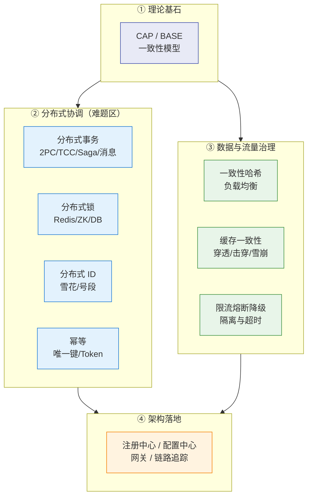

# 🌐 分布式总览

> 这是 `7-分布式/` 的**总入口**。系列回答四个层次：**① 理论基石（CAP/BASE/一致性）② 分布式协调难题（事务/锁/ID）③ 数据与流量治理（缓存/限流/高可用）④ 架构与面试**。
> 关联：[[面试准备/技术面试题库/09-分布式与微服务|面试题库 · 分布式与微服务]]（基础骨架）、[[面试准备/冠顿/04-事务一致性|冠顿 · 事务一致性]]（负责人视角深挖）。

> [!note] 与本目录已有脑图的关系
> 你在这个目录里已有三张 Excalidraw 脑图，它们是**图纸**，本系列是配套的**文字详解版**（互补，不替代）：
> - [[分布式事务.excalidraw]] —— 覆盖 ACID、强一致 vs 最终一致、XA/2PC/3PC、AT、TCC、SAGA。对应本系列 [[2-分布式事务]]（**更深：失败场景、选型、踩坑**）
> - [[分布式锁.excalidraw]] —— 近乎空白。对应 [[3-分布式锁]]（**已补全为完整详解**）
> - [[幂等.excalidraw]] —— 覆盖幂等实现方案。本系列多处引用它，不重复

---

## 一、系列导航

| # | 笔记 | 一句话定位 | 核心内容 |
|---|---|---|---|
| 1 | **[[1-分布式理论基础]]** | 一切的出发点 | CAP 的本质、为什么 P 必选、CP/AP 取舍、BASE、一致性模型谱系 |
| 2 | **[[2-分布式事务]]** | 最难的一致性问题 | 2PC/3PC 失败场景、TCC 三坑、Saga、消息型、Seata 四模式、对账兜底 |
| 3 | **[[3-分布式锁]]** | 最常被问错的题 | Redis 锁的正确实现、Lua 释放、看门狗续期、Redlock 争议、Redis vs ZK |
| 4 | **[[4-分布式ID与雪花算法]]** | 看似简单实则有坑 | UUID/自增/号段/雪花、位分配、**时钟回拨**、为什么不用 UUID 做主键 |
| 5 | **[[5-一致性哈希与负载均衡]]** | 数据分布的艺术 | 哈希环、虚拟节点、数据倾斜、Redis Cluster 是不是一致性哈希 |
| 6 | **[[6-缓存一致性与高可用]]** | 面试必问 | Cache-Aside、延迟双删、binlog 订阅、**穿透/击穿/雪崩**、热 key |
| 7 | **[[7-限流熔断降级]]** | 保命手段 | 四种限流算法、熔断三态、舱壁隔离、降级策略、超时与重试放大 |
| 8 | **[[8-微服务架构与注册配置中心]]** | 架构视角 | 注册中心选型（CP/AP）、优雅上下线、配置中心、网关、链路追踪 |
| 9 | **[[9-分布式面试高频题]]** | 面试怎么答 | 11 道必答题 + 快问快答 + 陷阱 TOP12 + 场景设计题 |

---

## 二、按需求的阅读路径

> [!tip] 三条路径
> **面试突击（1 天）**：[[9-分布式面试高频题]] → [[1-分布式理论基础]]（CAP）→ [[2-分布式事务]]（TCC 三坑）→ [[3-分布式锁]]（Redis 锁安全）→ [[6-缓存一致性与高可用]]（三大缓存问题）
> **系统吃透（1 周）**：1 → 2 → 3 → 4 → 5 → 6 → 7 → 8 顺序读
> **架构与负责人视角**：[[1-分布式理论基础]]（取舍思维）→ [[8-微服务架构与注册中心]] → [[2-分布式事务]]（选型与代价）→ [[7-限流熔断降级]]（保命体系）

---

## 三、30 秒速查表

| 问题 | 一句话答案 | 详见 |
|---|---|---|
| CAP 怎么理解 | **P（分区容错）在分布式下必须保**，所以实际是 **CP vs AP** 之争，不是"三选二" | [[1-分布式理论基础]] |
| BASE 是什么 | **基本可用 + 软状态 + 最终一致**，是对 CAP 的工程妥协 | [[1-分布式理论基础]] |
| 分布式事务有哪些方案 | 2PC/3PC（强一致）、TCC、Saga、本地消息表、MQ 事务消息、Seata AT | [[2-分布式事务]] |
| TCC 的三个坑 | **空回滚、悬挂、幂等**——不处理会导致资金错账 | [[2-分布式事务]] |
| 2PC 为什么被诟病 | **同步阻塞、协调者单点、提交阶段部分失败导致数据不一致** | [[2-分布式事务]] |
| 对账为什么重要 | 任何最终一致方案都可能失败，**对账是最后防线** | [[2-分布式事务]] |
| Redis 锁怎么实现才安全 | `SET key value NX PX` 原子加锁 + **唯一 value** + **Lua 原子释放** | [[3-分布式锁]] |
| 锁过期业务没跑完 | Redisson **看门狗自动续期**；但进程被杀就没人续期了 | [[3-分布式锁]] |
| Redis 锁最大风险 | **主从异步复制：主挂锁丢，新主可被再次加锁** → 双持锁 | [[3-分布式锁]] |
| Redis 锁 vs ZK 锁 | Redis 性能高但有一致性风险；ZK 靠**临时节点**天然防死锁，但分区时可能不可用 | [[3-分布式锁]] |
| 雪花算法结构 | **1 符号 + 41 时间戳 + 10 机器号 + 12 序列号**，趋势递增 | [[4-分布式ID与雪花算法]] |
| 时钟回拨怎么办 | 等待追平 / 备用机器号 / **抛异常报警** / NTP 校准+检测 | [[4-分布式ID与雪花算法]] |
| 为什么 UUID 不做主键 | **完全无序 → InnoDB 聚簇索引页分裂 → 写放大** | [[4-分布式ID与雪花算法]] |
| 一致性哈希好在哪 | 增删节点**只影响相邻区间**的数据，避免全量重映射 | [[5-一致性哈希与负载均衡]] |
| 虚拟节点解决什么 | **数据倾斜**（物理节点少时分布不均） | [[5-一致性哈希与负载均衡]] |
| Redis Cluster 是一致性哈希吗 | **不是**。它用固定的 **16384 个哈希槽** + 槽迁移 | [[5-一致性哈希与负载均衡]] |
| 缓存与 DB 怎么保一致 | **Cache-Aside：先更新 DB 再删缓存**；删失败用延迟双删或 **binlog 订阅** | [[6-缓存一致性与高可用]] |
| 缓存穿透 | 查不存在的数据 → **布隆过滤器 / 空值缓存** | [[6-缓存一致性与高可用]] |
| 缓存击穿 | **热点 key 过期瞬间** → 互斥锁重建 / 逻辑过期 | [[6-缓存一致性与高可用]] |
| 缓存雪崩 | **大量 key 同时过期 / 缓存宕机** → TTL 加随机、多级缓存、熔断降级 | [[6-缓存一致性与高可用]] |
| 限流四算法 | 固定窗口（有临界问题）、滑动窗口、漏桶（恒定速率）、**令牌桶（允许突发）** | [[7-限流熔断降级]] |
| 熔断三态 | **Closed → Open → Half-Open**，按失败率/慢调用比例触发 | [[7-限流熔断降级]] |
| 限流和熔断的区别 | 限流**保护自己**不被压垮；熔断**避免自己被下游拖死** | [[7-限流熔断降级]] |
| 服务雪崩怎么防 | **限流 + 熔断 + 降级 + 隔离 + 超时**组合拳，超时是最基础的一环 | [[7-限流熔断降级]] |
| 注册中心怎么选 | AP 选 Eureka/Nacos 临时实例；CP 选 ZK/Nacos 持久实例 | [[8-微服务架构与注册配置中心]] |
| 为什么要优雅下线 | 直接 kill 会导致**在途请求失败**，要先摘流量再停服 | [[8-微服务架构与注册配置中心]] |
| 配置中心挂了会怎样 | 服务靠**本地缓存兜底**仍能启动，这是可用性关键设计 | [[8-微服务架构与注册配置中心]] |

---

## 四、核心概念最小记忆集

| 概念 | 精确定义 | 常见误解 |
|---|---|---|
| **CAP 的 C** | **线性一致性**（所有节点同一时刻看到同一份数据） | 以为等于 ACID 的 C（那是业务约束） |
| **CAP 的 A** | 每个请求都能在**有限时间内**得到**非错误**响应 | 以为等于"高可用"（那是可用性百分比） |
| **CAP 的 P** | 网络分区时系统仍能继续运行 | **以为可以放弃 P**（分布式下 P 是客观事实） |
| **BASE** | 基本可用、软状态、最终一致 | 以为是另一种 CAP |
| **2PC** | 准备 + 提交两阶段，协调者驱动 | 以为是强一致的完美方案（有阻塞与不一致窗口） |
| **TCC** | Try 预留 → Confirm → Cancel | 以为 Cancel 一定执行、且一定成功 |
| **Saga** | 长事务拆成多个本地事务 + 补偿 | **以为有隔离性**（实际没有） |
| **幂等** | 同一请求执行多次，副作用与一次相同 | 以为"加了锁就幂等" |
| **看门狗** | 后台线程定期给锁续期 | 以为进程挂了也能续期 |
| **fencing token** | 单调递增的令牌，让下游拒绝过期持有者的写 | 以为 Redis 锁天然能防这个 |
| **一致性哈希** | 节点与数据都映射到哈希环，只影响相邻区间 | 以为 Redis Cluster 用的就是它 |
| **虚拟节点** | 一个物理节点映射成多个环上位置 | 以为只是"多台机器" |
| **缓存穿透/击穿/雪崩** | 查不存在 / 热点失效 / 大面积失效 | 三者混为一谈（成因与解法完全不同） |
| **逻辑过期** | 不设真实 TTL，靠字段标记过期并异步重建 | 以为是"永不过期" |
| **令牌桶** | 恒定放令牌，桶容量决定突发上限 | 以为它和漏桶一样（漏桶不允许突发） |
| **舱壁隔离** | 不同依赖用独立线程池/信号量，防故障扩散 | 以为只是"分个线程池" |
| **重试风暴** | 重试放大流量，把小故障变成大故障 | 以为重试总能提高可用性 |

> [!warning] 六个最经典的面试陷阱
> 1. **"CAP 是三选二"** —— P 在分布式系统中是**必须接受的前提**，实际是 **CP vs AP** 的取舍。
> 2. **"延迟双删能完全保证缓存一致"** —— 只能**降低概率**，无法根除（仍有一致性窗口）。
> 3. **"加了分布式锁就幂等"** —— 锁解决并发，**幂等要单独设计**（见 [[幂等.excalidraw]]）。
> 4. **"熔断和限流是一回事"** —— 限流保护自己，熔断避免被下游拖死，**方向相反**。
> 5. **"Zookeeper 做注册中心总是更好"** —— 它是 CP，**网络分区时可能整体不可用**（牺牲可用性）。
> 6. **"重试能提高可用性"** —— 不加约束的重试会**放大流量**，把下游打死。

---

## 五、一张图看懂分布式全景

---

## 六、学习检查清单

- [ ] 能说清 CAP 为什么不是"三选二"，并举出 CP 与 AP 的真实系统
- [ ] 能画出 2PC 在"提交阶段协调者宕机"时的数据不一致场景
- [ ] 能说清 TCC 的空回滚、悬挂、幂等三个坑及解法
- [ ] 能写出安全的 Redis 分布式锁（原子加锁 + 唯一 value + Lua 释放）
- [ ] 能解释 Redis 锁在主从切换下为什么会失效
- [ ] 能画出雪花算法的 64 位分配，并说出时钟回拨的四种处理
- [ ] 能解释一致性哈希为什么只影响相邻区间，虚拟节点解决什么
- [ ] 能说清缓存穿透/击穿/雪崩的**成因差异**与各自解法
- [ ] 能说明"先更新 DB 再删缓存"为什么优于其他顺序
- [ ] 能画出熔断器三态状态机，并说出触发条件
- [ ] 能解释优雅上下线为什么要"先摘流量"
- [ ] 能在 10 分钟内讲清"服务雪崩怎么防"的完整体系

---
> [!question] 还需要补充什么？
> 可继续扩展的方向：Raft/Paxos 共识算法深入、分布式链路追踪实战（SkyWalking）、Service Mesh（Istio）、分布式限流（Redis+Lua 集群限流）、消息队列的可靠性投递、多机房容灾与单元化（Set 化）、分布式文件存储选型。需要哪块就新开一篇并在上表登记。
