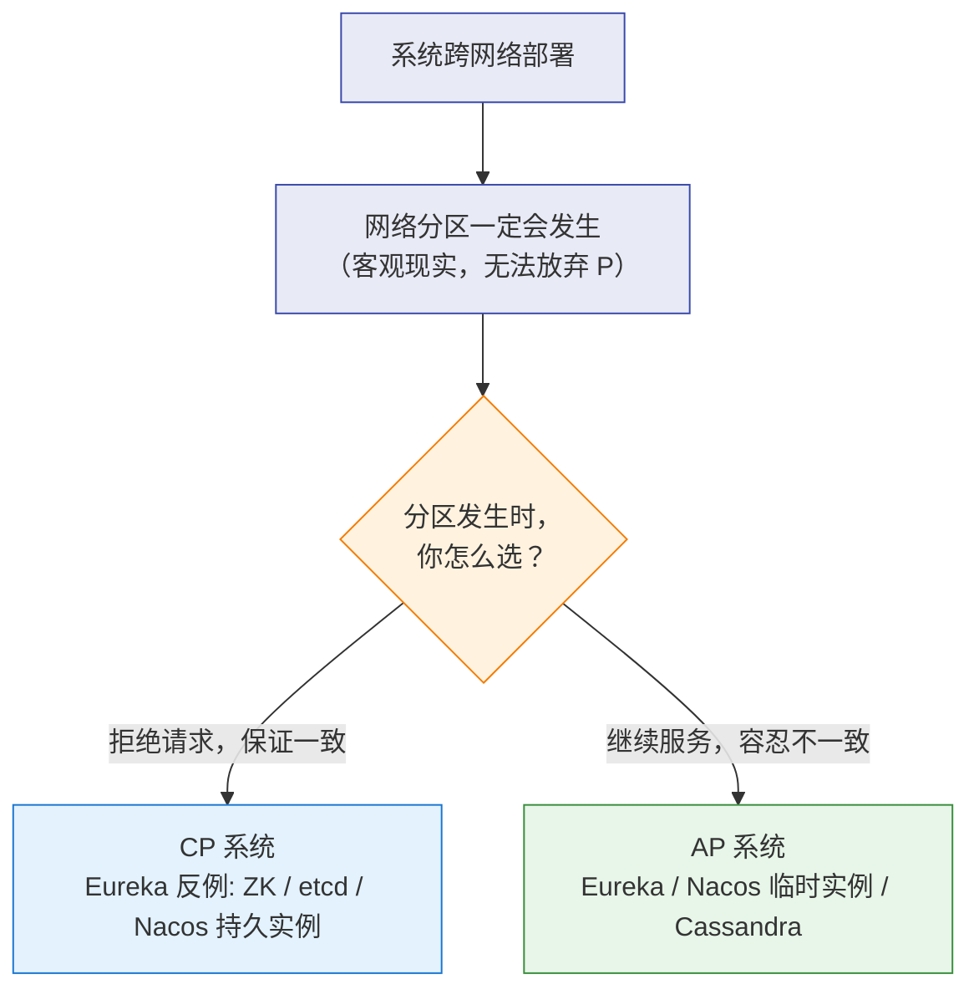
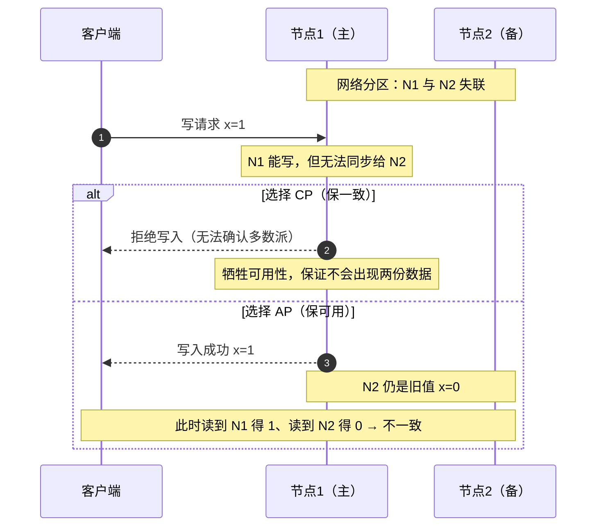

# 🧭 一、分布式理论基础

> 本篇回答：CAP 到底该怎么理解、为什么"三选二"是误读、CP 与 AP 在真实系统里怎么取舍、BASE 是什么、以及"一致性"这个词在不同语境下的含义。
> 这是本系列的**出发点**——后面所有方案（事务、锁、缓存、注册中心）本质都是在做取舍，而取舍的依据就在这里。
> 关联：[[0-分布式总览]]、[[2-分布式事务]]、[[6-缓存一致性与高可用]]、[[8-微服务架构与注册配置中心]]。

---

## 一、先搞清"一致性"的三个含义

> [!warning] 这是最多人混用的一组概念
> "一致性"在三个不同层面出现，含义完全不同。混用会导致**面试答偏**。

| 语境 | 名称 | 含义 | 谁保证 |
|---|---|---|---|
| **数据库事务** | ACID 的 **C** | 事务前后数据满足**业务约束**（如转账前后总金额不变） | 由 A/I/D 共同实现，是**目标**不是手段 |
| **分布式理论** | CAP 的 **C** | **线性一致性**：所有节点在同一时刻看到同一份数据，读能读到最近的写 | 由共识算法（Raft/Paxos）保证 |
| **工程实践** | **最终一致性** | 允许中间态，但**经过一段时间后收敛到一致** | 由补偿/重试/对账保证 |

> [!tip] 一句话记住
> **ACID 的 C 是"业务规则不被破坏"，CAP 的 C 是"所有节点看到的都一样"。**
> 面试被问"分布式事务能不能保证一致性"时，先反问：**你说的是哪个一致性？**

---

## 二、CAP 定理

### 2.1 三个字母的精确含义

| 字母 | 含义 | 常见误读 |
|---|---|---|
| **C** Consistency | **线性一致性**：任何时刻，所有节点返回同一份最新数据 | 误读成 ACID 的 C |
| **A** Availability | 每个请求都能在**有限时间内**得到**非错误**响应（不保证是最新数据） | 误读成"系统可用率 99.9%" |
| **P** Partition tolerance | 网络分区（节点间消息丢失/延迟）时，系统**仍能继续运行** | 误以为可以"放弃 P" |

### 2.2 为什么"三选二"是误读

> [!important] 核心认知
> **网络分区不是一个"可以选择要不要"的特性，而是分布式系统的客观现实。**
> 只要你的系统跨网络部署（多机、多机房），网线会断、交换机会挂、GC 会导致心跳超时——**分区一定会发生**。
>
> 所以真正的命题不是"C/A/P 三选二"，而是：
> **当分区发生时，你要选择 C 还是 A？**
> - 选 C → 拒绝部分请求，保证数据一致（**CP**）
> - 选 A → 继续提供服务，接受数据可能不一致（**AP**）

### 2.3 分区发生时的真实取舍（时序图）

> [!note] 一个真实的 CP 代价
> **Zookeeper 是 CP**：分区时如果无法形成多数派，整个集群会**拒绝服务**（选举不出 Leader）。
> 这就是为什么"ZK 做注册中心"在分区时可能导致**服务发现整体不可用**——对注册中心来说，这通常是不可接受的，所以 Eureka 选择了 AP。

---

## 三、一致性模型谱系

从强到弱，工程上常用的几档：

| 模型 | 含义 | 典型场景 |
|---|---|---|
| **线性一致** | 像只有一份数据一样，读写实时可见 | 分布式锁、选主、配置 |
| **顺序一致** | 所有节点看到的**操作顺序**一致 | 状态机复制 |
| **因果一致** | 有因果关系的操作保证顺序 | 评论回复、IM |
| **读己之写** | 自己能读到自己刚写的 | 用户资料修改后立即查看 |
| **单调读** | 不会读到比之前更旧的数据 | 避免"数据倒退"的诡异体验 |
| **最终一致** | 一段时间后收敛 | 缓存、搜索索引、计数 |

> [!tip] 工程上的实用主义
> **不要追求全局强一致**，而是**按数据的重要性分级**：
> - 钱、库存 → 强一致（或强一致的变通：预扣 + 对账）
> - 用户资料、商品信息 → 读己之写 / 最终一致
> - 点赞数、浏览量 → 最终一致（甚至允许误差）

---

## 四、BASE：对 CAP 的工程妥协

| 要素 | 含义 | 落地手段 |
|---|---|---|
| **Basically Available** 基本可用 | 允许**损失部分可用性**（降级、限流、排队） | 熔断降级（见 [[7-限流熔断降级]]） |
| **Soft state** 软状态 | 允许**中间状态**存在（如"支付中"） | 状态机、异步处理 |
| **Eventually consistent** 最终一致 | 经过一段时间后**收敛**到一致 | 补偿、重试、对账 |

> [!important] BASE 不是"放弃一致性"
> 它只是**把一致性的时间窗口从"实时"放宽到"最终"**，换来可用性与性能。
> **关键是这个窗口必须"有界且可控"**——否则就变成"永不一致"。这就是为什么工程上必须有**对账**（见 [[2-分布式事务]]）。

---

## 五、真实系统的 CAP 定位

| 系统 | 定位 | 说明 |
|---|---|---|
| **Zookeeper / etcd** | **CP** | 基于 ZAB/Raft，多数派写入；分区时少数派不可用 |
| **Eureka** | **AP** | 各节点平等，**自我保护机制**优先保可用 |
| **Nacos** | **双模式** | 临时实例走 AP（Distro），持久化实例走 CP（Raft）——**这是它的亮点** |
| **Redis 主从** | **AP** | 异步复制，主挂可能丢数据 |
| **Redis Cluster** | **AP**（局部） | 分区时少数派分片不可用 |
| **MySQL 主从（异步）** | **AP** | 主库提交后从库可能还没收到 |
| **MySQL 半同步 / MGR** | 偏 **CP** | 至少一个从库确认才提交 |
| **Kafka（`acks=all` + `min.insync.replicas`）** | 偏 **CP** | ISR 不足时拒绝写入 |
| **Cassandra / DynamoDB** | **AP**（可调） | 通过 quorum 参数在 C/A 间滑动 |

> [!tip] 一个关键认知
> **同一个系统在不同配置下可以是 CP 或 AP。**
> 例如 Kafka：`acks=1` 时偏 AP，`acks=all + min.insync.replicas=2` 时偏 CP。
> 面试时说"某系统是 CP/AP"要**带上配置前提**，这才是深度。

---

## 六、分布式系统的"八大谬误"

这是理解**为什么分布式这么难**的经典清单：

| 谬误 | 现实 |
|---|---|
| 网络是可靠的 | 会丢包、会抖动、会分区 |
| 延迟是零 | 跨机房几十毫秒，是最大的瓶颈之一 |
| 带宽是无限的 | 大数据量传输会打满带宽 |
| 网络是安全的 | 需要加密与鉴权 |
| 拓扑不会变 | 扩缩容、迁移时刻在发生 |
| 只有一个管理员 | 多人操作，配置漂移 |
| 传输成本是零 | 序列化、网络往返都有成本 |
| 网络是同构的 | 不同机房/云厂商延迟差异巨大 |

> [!important] 这三条最影响架构设计
> **网络不可靠 → 必须重试 + 幂等**；**延迟非零 → 必须异步化 + 批量化**；**拓扑会变 → 必须服务发现 + 优雅上下线**。
> 本系列后面的每一篇，本质上都在应对这三条。

---

## 七、本篇必答

> [!question] 面试官可能这样问
> **Q：说说你对 CAP 的理解。**
> A：CAP 是**一致性、可用性、分区容错**。关键认知是：**P 在分布式系统中是客观必然**（网络一定会分区），所以不是"三选二"，而是**分区发生时在 C 和 A 之间取舍**——选 C 就是拒绝部分请求保一致（CP，如 ZK/etcd），选 A 就是继续服务容忍不一致（AP，如 Eureka）。而且**同一系统在不同配置下定位可以不同**（如 Kafka 的 `acks` 配置）。
>
> **追问：你们系统是 CP 还是 AP？**
> 答题要点：**按数据分级回答**——核心交易数据偏 CP（或强一致变通），用户/展示类数据偏 AP + 最终一致。体现"不是一刀切"的架构思维。
>
> **Q：BASE 是什么？和 CAP 什么关系？**
> A：BASE = **基本可用 + 软状态 + 最终一致**，是对 CAP 的**工程妥协**：既然分区时保一致要牺牲可用性，很多业务选择"放宽一致性的时间窗口"来换可用性。**关键是这个窗口必须有界可控**，所以必须有对账兜底。
>
> **Q：ACID 的 C 和 CAP 的 C 是一回事吗？**
> A：**不是**。ACID 的 C 是"事务前后业务约束不被破坏"（如转账总额不变），是业务层面的目标；CAP 的 C 是"线性一致性"，指所有节点同一时刻看到同一份最新数据，是系统层面的保证。**面试时先确认对方问的是哪个 C**，是很好的深度信号。

---
> 下一篇 → [[2-分布式事务]]：分布式系统中最难的一致性问题。
